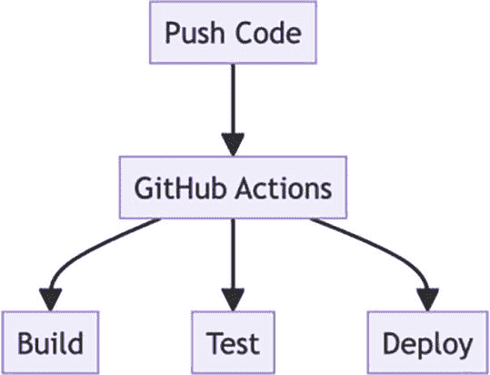
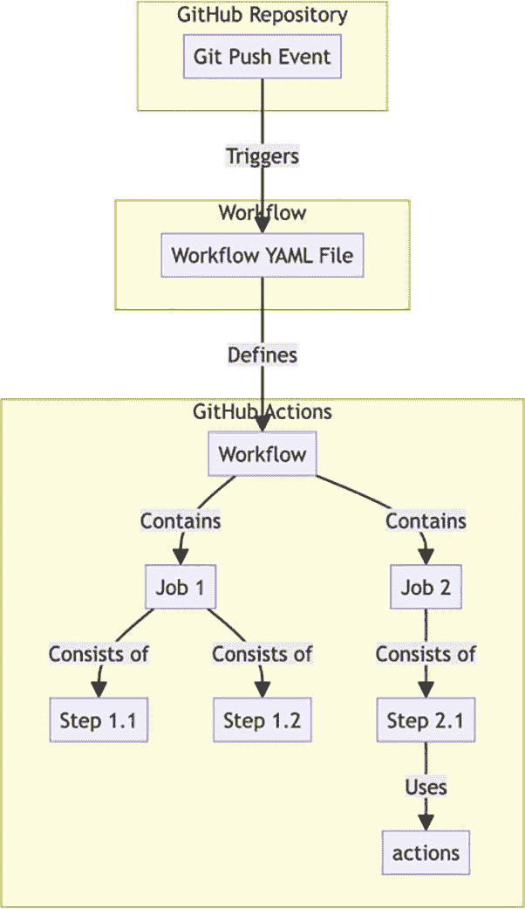
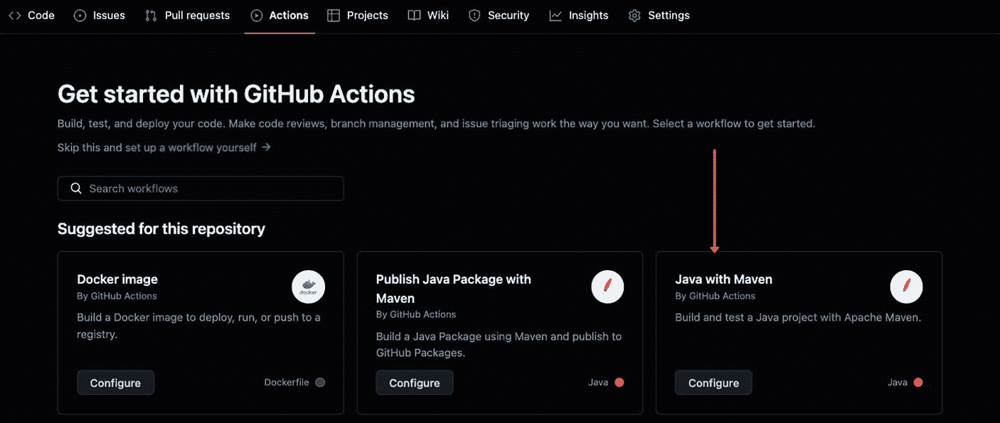
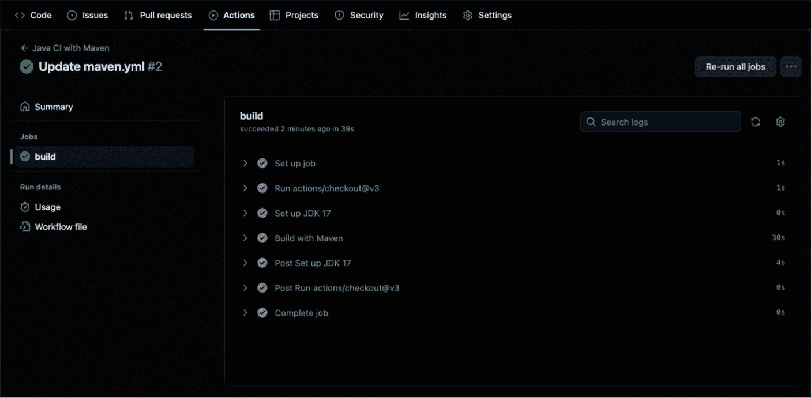
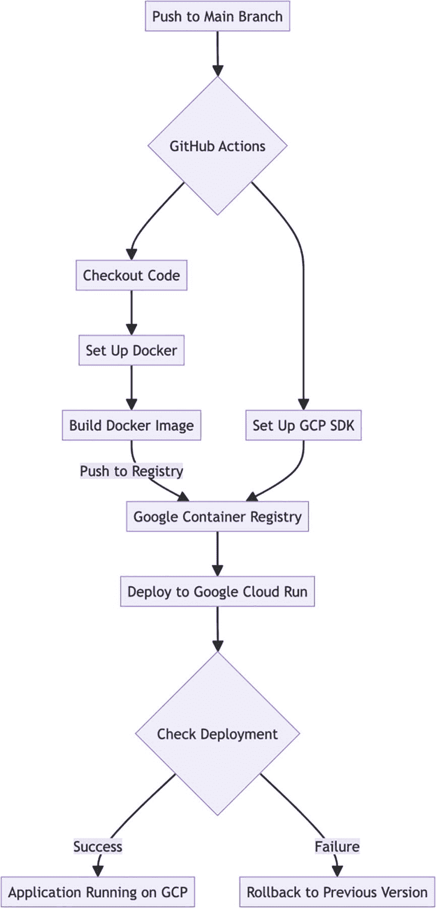
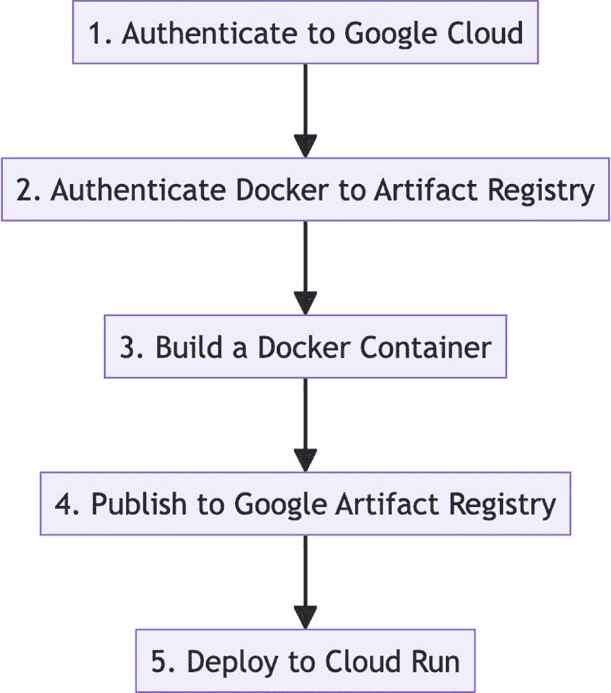
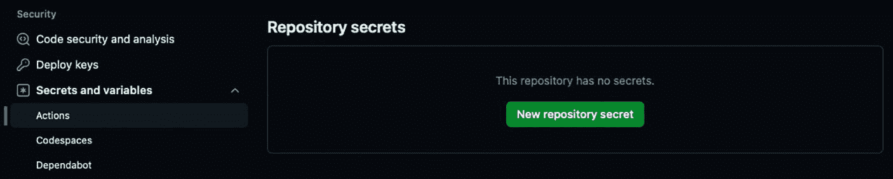
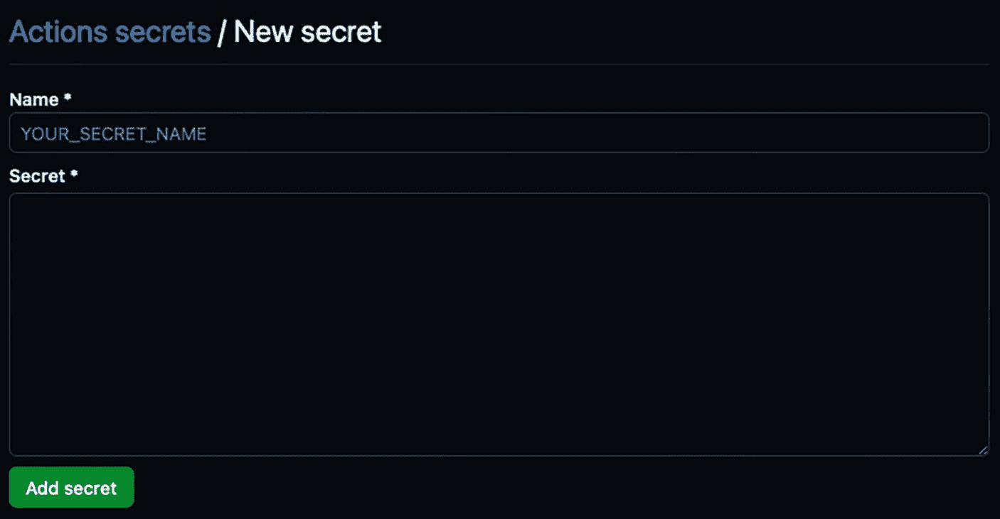

# 7. 使用 GitHub Actions 部署 Docker 容器

容器化现已成为应用程序部署策略的基石，旨在以轻量、一致且可扩展的方式运行软件。用于 Java 应用程序的 Docker 使其能够随处运行，无论底层系统之间存在何种差异。借助 GitHub Actions，开发人员可以自动化容器的构建、测试和部署。


## 理解 GitHub Actions

GitHub Actions 是一个自动化工具，允许我们根据诸如推送到仓库等事件来运行工作流程。GitHub Actions 改变了 CI/CD 的面貌。它让 Java 开发者的 CI/CD 变得更加简单，可以直接从他们的 GitHub 仓库进行自动化：自动构建、测试和部署，无需人工干预。GitHub Actions 可以自动化任何类型的软件工作流程。它只是根据 GitHub 仓库上的特定事件（如推送、创建拉取请求或类似操作）来运行一系列命令。

以下是 GitHub Actions 的一些关键特性：

*   **工作流程自动化**：我们可以使用仓库内 YAML 文件中定义的操作来自动化构建、测试和部署工作流程。

*   **事件触发**：工作流程可以由 GitHub 事件触发，例如推送和拉取请求、创建 Issue、发布版本，或 GitHub Webhooks 负载中的任何其他事件。

*   **可复用组件**：操作可以作为独立任务创建和共享，其他人可以在他们的工作流程中使用这些任务。

*   **市场**：GitHub Marketplace 提供了一个共享操作社区，可用于自动化各种流程。

*   **语言和平台支持**：操作支持多种编程语言和平台，使其适用于不同的项目。

*   **托管运行器**：GitHub 为 Linux、Windows 和 macOS 提供托管运行器，允许你在全新的虚拟机上运行工作流程。

*   **自托管运行器**：对于自定义环境或特定的硬件要求，我们也可以托管自己的运行器。

*   **矩阵构建**：我们可以通过定义不同配置的矩阵，在多个操作系统、版本或环境中进行测试。

*   **机密管理**：我们可以在工作流程中安全地存储和使用机密，例如 API 密钥或凭据。

*   **工件和缓存**：我们可以从工作流程中上传工件，或缓存依赖项以加速构建过程。



说明 GitHub Actions 工作流程的流程图。该流程从“推送代码”开始，进入“GitHub Actions”，然后分支为三个并行步骤：“构建”、“测试”和“部署”。

图 7-1

GitHub Actions

## GitHub Actions 组件

让我们分解一下 GitHub Actions 的关键元素：

*   **工作流程**：它是一组用于在 GitHub 上编译、测试、打包或部署代码的指令。工作流程定义在仓库的 `.github/workflows` 文件夹内的一个 YAML 文件中，通过特定事件激活，并由作业组成。

*   **事件**：这些是工作流程的触发器。任何活动，例如推送到分支或新的拉取请求，都可以启动工作流程。

*   **作业**：作业是在称为运行器的虚拟环境中运行的一系列步骤。作业组织步骤的顺序，可以同时运行或一个接一个地运行。

*   **步骤**：作业中的每个步骤对应一个单一操作，例如检索代码或执行 shell 命令。

*   **操作**：操作是预定义的命令，你可以在步骤中运行，例如拉取你的代码仓库或设置 Java 开发工具包。

*   **运行器**：这些是我们运行工作流程的服务器。GitHub 提供这些运行器，或者我们可以设置自己的运行器。它们执行作业并将结果报告给你的 GitHub 仓库。GitHub 的运行器兼容 Ubuntu Linux、Windows 和 macOS。

### 理解工作流程 YAML 文件

下图概述了 GitHub 仓库、工作流程和 GitHub Actions 之间的关系。



说明 GitHub Actions 工作流程的流程图。它从 GitHub 仓库中的“Git 推送事件”开始，该事件触发“工作流程 YAML 文件”。该文件定义了包含两个作业的 GitHub Actions 工作流程：“作业 1”和“作业 2”。作业 1 由“步骤 1.1”和“步骤 1.2”组成，而作业 2 由“步骤 2.1”组成并使用“操作”。

图 7-2

GitHub YAML 工作流程

以下是逐步说明：

*   **GitHub 仓库**：`[Git 推送事件]`：这是工作流程的起点。当有人向 GitHub 上的仓库推送提交时，就会发生 Git 推送事件。此事件可以触发一个工作流程。

*   **工作流程**：`[工作流程 YAML 文件]`：此文件通常命名为 `main.yml` 或 `ci.yml`，位于仓库的 `.github/workflows` 目录中。它定义了在 Git 推送事件发生时将要执行的工作流程。

*   **GitHub Actions**：`[工作流程]`：这是由工作流程 YAML 文件定义的整个自动化过程。它包含一个或多个作业。

*   `[作业 1]` 和 `[作业 2]`：这些是工作流程中的各个作业。作业是在同一个运行器上执行的步骤，可以根据工作流程的定义并行或顺序运行。

*   `[步骤 1.1]` 和 `[步骤 1.2]`：这些是 `作业 1` 中的步骤。步骤是可以运行命令或操作的单个任务。

*   `[步骤 2.1]`：这是 `作业 2` 中的一个步骤。与 `作业 1` 中的步骤一样，它可以运行命令或操作。

*   `[操作]`：这表示在步骤中使用的操作。GitHub Actions 可以使用社区创建的预构建操作，也可以使用在你的仓库中定义的自定义操作。

图中的箭头显示了工作流程的方向：

*   `|触发|`：Git 推送事件触发工作流程 YAML 文件中定义的工作流程。

*   `|定义|`：工作流程 YAML 文件代表了实际的工作流程过程。

*   `|包含|`：工作流程包含 `作业 1` 和 `作业 2`。

*   `|由...组成|`：`作业 1` 由 `步骤 1.1` 和 `步骤 1.2` 组成。

*   `|使用|`：`步骤 2.1` 使用一个或多个操作来执行其任务。

上图展示了 Git 推送事件如何触发仓库中定义的工作流程，然后通过 GitHub Actions 环境中的操作来控制作业和步骤的执行。

## 使用 GitHub Actions 构建 Java 应用程序


### 设置 Java 项目

让我们讨论如何使用 GitHub Actions 创建 Java 应用程序构建流水线。在开始使用 GitHub Actions 之前，请确保你在 GitHub 上有一个 Java 项目。在本示例中，我们将使用一个通过 Maven 构建的简单 Java 应用程序。

首先，你需要定义工作流。工作流是我们在仓库中设置的自定义自动化流程，用于在 GitHub 上构建、测试、打包或部署任何代码项目。

1.  在我们的 GitHub 仓库中，导航到 `Actions` 选项卡。点击 `Java with Maven` 模板，或者自行设置一个工作流。



该图片展示了一个 GitHub Actions 设置页面，重点在于入门指南。页面包含一个导航栏，提供代码、议题和操作等选项。主体部分鼓励用户使用 GitHub Actions 构建、测试和部署代码，并提示设置工作流。下方是仓库的推荐工作流，包括“Docker 镜像”、“使用 Maven 发布 Java 包”和“Java with Maven”等选项，每个选项都附有简要说明和一个“配置”按钮。一个粉色箭头指向“Java with Maven”选项。

图 7-3

设置操作

1.  这将打开工作流编辑器。在这里，我们编写构建步骤。

    ```
    # 此工作流将使用 Maven 构建 Java 项目，并缓存/恢复所有依赖项以缩短工作流执行时间
    name: Java CI with Maven
    on:
    push:
    branches: [ "main" ]
    pull_request:
    branches: [ "main" ]
    jobs:
    build:
    runs-on: ubuntu-latest
    steps:
    - uses: actions/checkout@v3
    - name: Set up JDK 17
    uses: actions/setup-java@v3
    with:
    java-version: '17'
    distribution: 'temurin'
    cache: maven
    - name: Build with Maven
    run: mvn -B package --file pom.xml
    ```

    工作流文件

2.  测试是持续集成流程的关键环节。我们应该在工作流中集成测试，以确保代码质量：

    ```
    - name: Test with Maven
    run: mvn test
    ```

    此步骤在构建之后运行，并执行项目中的所有单元测试。

3.  构建和测试可能很耗时，这主要是由于依赖项造成的。为了加快速度，可以缓存依赖项：

    ```
    - name: Cache Maven packages
    uses: actions/cache@v2
    with:
    path: ~/.m2
    key: ${{ runner.os }}-m2-${{ hashFiles('**/pom.xml') }}
    restore-keys: ${{ runner.os }}-m2
    ```

    这会缓存 Maven 包，从而减少每次构建时获取它们的需求。

4.  提交更改。这将触发工作流。


显示两个按钮。左侧第一个按钮为深色，白色文字显示“取消更改”。右侧第二个按钮为亮绿色，白色文字显示“提交更改...”

图 7-4

提交更改

1.  工作流完成。



GitHub Actions 界面显示“Java CI with Maven”工作流中“Update maven.yml #2”构建成功。构建过程包括设置作业、运行 actions/checkout@v3、设置 JDK 17、使用 Maven 构建以及完成作业等步骤。每个步骤都有持续时间，整个过程耗时 39 秒。界面包含摘要、使用情况和工作流文件详情等选项。

图 7-5

工作流完成

请记住，尽管本指南描述的是一个使用 Maven 的最小化 Java 应用程序，但 GitHub Actions 仍然具有很大的灵活性。请根据不同的构建工具或部署目标的要求调整这些说明。然后充分利用自动化的力量来管理你的 Java 项目。

## 使用 Docker GitHub Action 容器化 Java 应用程序

让我们逐步了解如何使用 GitHub Actions 和 Docker 容器化 Java 应用程序。

### 理解流程

该流程从一个用于 Java 应用程序的 Dockerfile 开始，该文件定义了环境以及构建容器镜像的指令。最后，定义 GitHub Actions 工作流，以便在每次向仓库推送更改时自动执行此流程。


流程图展示了使用 GitHub Actions 的 CI/CD 流水线。流程从“GitHub Actions”开始，接着是“构建 Docker 镜像”，然后是“Docker 镜像构建完成”，继续“推送到 DockerHub”，最后以“DockerHub”结束。每个步骤由箭头连接，指示操作的顺序。

图 7-6

GitHub Action Docker 流程

### 编写 Dockerfile

Dockerfile 是一个包含各种命令的脚本，用于创建 Docker 镜像。对于一个 Java 应用程序，一个典型的 Dockerfile 可能如下所示：

```
# 从 Docker Hub 使用基础 JDK 镜像
FROM openjdk:17-jdk
# 设置容器内的工作目录
WORKDIR /app
# 复制 Maven 构建文件和源代码
COPY pom.xml .
COPY src /app/src
# 构建应用程序
RUN mvn clean package
# 暴露应用程序运行的端口
EXPOSE 8080
# 运行 jar 文件
CMD ["java", "-jar", "target/myapp-1.0-SNAPSHOT.jar"]
```

### 设置 GitHub Actions

GitHub Actions 是一个自动化工具，允许我们根据事件（例如推送到仓库）运行工作流。为我们的 Java 应用程序添加 GitHub Actions 需要在仓库中创建 `.github/workflows` 目录，并在其中放置一个描述工作流的 YAML 文件：

```
name: Java CI with Docker
on:
push:
branches: [ main ]
jobs:
build:
runs-on: ubuntu-latest
steps:
- uses: actions/checkout@v2
- name: Set up JDK 17
uses: actions/setup-java@v2
with:
java-version: '17'
distribution: 'adopt'
- name: Build with Maven
run: mvn clean install
- name: Build Docker Image
run: docker build -t my-java-app .
- name: Push Docker Image to Registry
run: |
echo ${{ secrets.DOCKER_HUB_PASSWORD }} | docker login -u ${{ secrets.DOCKER_HUB_USERNAME }} --password-stdin
docker tag my-java-app ${{ secrets.DOCKER_HUB_USERNAME }}/my-java-app:latest
```

GitHub Action Docker 工作流 YAML 文件

此工作流执行以下操作：

**检出代码**：从主分支获取最新代码。

```
- uses: actions/checkout@v2
```

**设置 JDK**：为运行器环境配置 JDK。

```
- name: Set up JDK 17
uses: actions/setup-java@v2
with:
java-version: '17'
distribution: 'adopt'
```

**使用 Maven 构建**：编译 Java 应用程序并运行所有测试。

```
- name: Build with Maven
run: mvn clean install
```

**构建 Docker 镜像**：使用 Dockerfile 构建 Docker 镜像。

```
- name: Build Docker Image
run: docker build -t my-java-app .
```

**推送到 Docker 注册表**：镜像成功创建后，进行标记并推送到 Docker Hub。

```
- name: Push Docker Image to Registry
run: |
echo ${{ secrets.DOCKER_HUB_PASSWORD }} | docker login -u ${{ secrets.DOCKER_HUB_USERNAME }} --password-stdin
docker tag my-java-app ${{ secrets.DOCKER_HUB_USERNAME }}/my-java-app:latest
docker push ${{ secrets.DOCKER_HUB_USERNAME }}/my-java-app:latest
```

`${{ secrets.DOCKER_HUB_USERNAME }}` 和 `${{ secrets.DOCKER_HUB_PASSWORD }}` 是你在仓库设置中设置的 GitHub 机密，用于安全地向 Docker 注册表进行身份验证。

通过使用 GitHub Actions 和 Docker 容器化你的 Java 应用程序，你可以自动化构建和部署流程，从而提高生产力并减少人为错误的机会。这种 CI/CD 方法确保我们的开发团队可以专注于他们最擅长的事情——编写代码，而无需担心部署的复杂性。此外，Docker 的可移植性确保了 Java 应用程序可以在任何机器上运行，而不会出现“在我机器上能运行”的问题。


## 使用 GitHub Action 将 Java 应用部署到 GCP

简单来说，CI/CD 自动化本质上是在你的代码仓库和实际生产环境之间架起一座桥梁。对于 Java 开发者而言，借助 GitHub Actions 和 Docker，将应用部署到 Google Cloud Platform (GCP) 变得更加容易。继续操作前，需要具备 GCP 的相关知识。

### 理解工作流程

在深入部署流程之前，我们先来理解一下工作流程：

*   **代码提交**：开发者将代码推送到 GitHub 仓库。
*   **触发 GitHub Actions**：推送事件会触发 GitHub Actions 工作流程。
*   **构建**：GitHub Actions 执行一个工作流程来构建 Docker 镜像。
*   **推送到容器仓库**：Docker 镜像被推送到 Google Container Registry (GCR)。
*   **部署到 GCP**：GCR 中的镜像随后被部署到 GCP 服务，例如 Google Kubernetes Engine (GKE) 或 Google Cloud Run。

下图展示了使用 Docker、GitHub Actions 和 GCP 的 CI/CD 流程。



流程图展示了将应用部署到 Google Cloud Platform 的 CI/CD 管道。流程始于向主分支的推送，触发 GitHub Actions。工作流程分为两条路径：一条用于检出代码和设置 Docker，另一条用于设置 GCP SDK。Docker 路径包括构建 Docker 镜像并将其推送到 Google Container Registry。两条路径在部署到 Google Cloud Run 处汇合。部署成功则进入“应用在 GCP 上运行”状态，失败则进行“回滚到上一个版本”。

图 7-7

GitHub Actions 与 GCP

### 设置工作流程

要配置此工作流程：

1.  要使用 GitHub Actions 将 Docker 镜像部署到 Google Cloud Platform (GCP)，你需要启用特定的 GCP API 以促进集成。导航到 GCP 控制台，确保已启用以下必需的 Google Cloud API：
    *   Cloud Run：`run.googleapis.com`
    *   Artifact Registry：`artifactregistry.googleapis.com`

2.  为 GitHub 创建并配置 Workload Identity Federation（[`https://github.com/google-github-actions/auth#setting-up-workload-identity-federation`](https://github.com/google-github-actions/auth%2523setting-up-workload-identity-federation)）。

3.  确保已授予所需的 IAM 权限：

    Cloud Run
    *   `roles/run.admin`
    *   `roles/iam.serviceAccountUser`（用于充当 Cloud Run 运行时服务账号）

    Artifact Registry
    *   `roles/artifactregistry.admin`（项目或仓库级别）

    **注意** 在分配 IAM 角色时，应始终遵循最小权限原则。

4.  为 `WIF_PROVIDER` 和 `WIF_SERVICE_ACCOUNT` 创建 GitHub 密钥。

5.  更改 `GAR_LOCATION`、`SERVICE` 和 `REGION` 环境变量的值。

让我们开始吧。

**步骤 1：** 首先，我们的 Java 应用需要准备好进行部署。这通常包括：

*   确保你的应用经过全面测试且稳定
*   配置你的 `pom.xml` 或 `build.gradle` 文件以成功构建

**步骤 2：** 为了部署 Java 应用，你可能需要设置各种 GCP 资源，例如 Compute Engine 实例、App Engine 或 Kubernetes Engine。选择取决于你的应用需求。

*   **Compute Engine**：适用于需要自定义虚拟机的应用。
*   **App Engine**：适用于自动扩展的应用。
*   **Kubernetes Engine**：最适合容器化应用。
*   **Cloud Run**：这是一个托管平台，允许你运行可通过 Web 请求或 Pub/Sub 事件调用的无状态容器。

**步骤 3：** 最后，我们需要设置 GitHub Actions 以实现部署工作流程的自动化。以下是设置方法：

*   在你的 GitHub 仓库中，创建一个 `.github/workflows` 目录。
*   在此目录中添加一个工作流程文件（例如 `deploy.yml`）。

```
- name: Google Auth
jobs:
deploy:
# 为工作负载身份联合添加具有预期权限的 'id-token'
permissions:
contents: 'read'
id-token: 'write'
runs-on: ubuntu-latest
steps:
- name: Checkout
uses: actions/checkout@v2
- name: Set up JDK
uses: actions/setup-java@v2
with:
java-version: '17'
env:
PROJECT_ID: YOUR_PROJECT_ID # TODO: 更新 Google Cloud 项目 ID
GAR_LOCATION: YOUR_GAR_LOCATION # TODO: 更新 Artifact Registry 位置
SERVICE: YOUR_SERVICE_NAME # TODO: 更新 Cloud Run 服务名称
REGION: YOUR_SERVICE_REGION # TODO: 更新 Cloud Run 服务区域
on:
push:
branches: [ "main" ]
name: Build and Deploy to GCP Cloud Run
```

此工作流程执行以下操作：

*   在推送到主分支时触发。
*   设置 Java 环境。
*   使用密钥向 GCP 进行身份验证。
*   构建 Docker 镜像并将其推送到 Google Artifact Registry。
*   使用专门用于 Cloud Run 部署的 GitHub Action 将镜像部署到 Cloud Run。



流程图展示了将 Docker 容器部署到 Google Cloud 的过程。步骤 1：向 Google Cloud 进行身份验证。步骤 2：向 Artifact Registry 进行 Docker 身份验证。步骤 3：构建 Docker 容器。步骤 4：发布到 Google Artifact Registry。步骤 5：部署到 Cloud Run。每个步骤由箭头连接，指示顺序。

图 7-8

GCP 工作流程

**步骤 4：** 为了安全起见，将 GCP 凭据等敏感信息作为加密密钥存储在 GitHub 仓库中：

*   进入你的仓库设置。
*   点击“Secrets”。



图片显示了仓库设置页面中“Security”部分下的内容，包含“Code security and analysis”、“Deploy keys”和“Secrets and variables”等选项。“Repository secrets”区域显示“This repository has no secrets”，并带有一个醒目的绿色按钮“New repository secret”。

图 7-9

设置密钥

*   将你的 GCP 服务账号密钥和项目 ID 添加为密钥。



图片显示了 GitHub 中“Actions secrets”部分下添加新密钥的界面。它包含标有“Name”（占位符文本为“YOUR_SECRET_NAME”）和“Secret”（用于输入敏感信息）的字段。底部有一个绿色按钮“Add secret”。

图 7-10

创建密钥

**步骤 5：** 工作流程配置完成后，任何对主分支的推送都会触发部署过程。你可以在仓库的“Actions”选项卡中监控进度并查看日志。请记住定期更新你的工作流程配置，以适应应用和团队不断变化的需求。

## 使用 Docker 进行 CI/CD 的 GitHub Actions 最佳实践


### 保持工作流程 DRY（不要重复自己）

避免在 GitHub Actions 工作流程中出现重复代码。通过将工作流程分解为模块化组件来重用操作和共享逻辑。你可以创建可被多个项目引用的可重用工作流程，从而减少维护开销，并统一协调整个 CI/CD 流水线。

假设你有一个 Java 项目，并且总是在不同的工作流程中运行以下步骤来设置 Java、使用 Maven 构建并运行测试。你应该创建一个复合操作，这样就不必为每个工作流程重复这些步骤。

**步骤 1：创建复合操作。**

在你的仓库中，为复合操作创建一个文件夹结构，如下所示：

```
.github/actions/java-maven-build
├── action.yml
```

在 `action.yml` 内部，定义你想要重用的步骤：

```
# .github/actions/java-maven-build/action.yml
name: 'Java Maven Build'
description: '设置 Java，使用 Maven 构建，并运行测试'
runs:
using: 'composite'
steps:
- name: 设置 JDK 17
uses: actions/setup-java@v3
with:
java-version: '17'
distribution: 'temurin'
cache: maven
- name: 使用 Maven 构建
run: mvn clean package --file pom.xml
- name: 使用 Maven 运行测试
run: mvn test
```

**步骤 2：在工作流程中重用复合操作。**

现在复合操作已定义，你可以在多个工作流程中重用它。例如，在你的 `.github/workflows/main.yml` 文件中：

```
name: Java CI
on:
push:
branches: [ main ]
pull_request:
branches: [ main ]
jobs:
build:
runs-on: ubuntu-latest
steps:
- uses: actions/checkout@v3
# 使用复合操作
- uses: ./.github/actions/java-maven-build
```

这种方法通过将重复步骤整合到单个复合操作中，使你的工作流程保持 DRY，从而更易于跨多个流水线进行管理和更新。

### 使用 Secrets 管理敏感信息

将 API 密钥、凭据和令牌等敏感数据安全地存储在 GitHub 的 Secrets 管理系统中。这可以将敏感信息排除在你的代码库和工作流程文件之外。在工作流程中使用 `${{ secrets.YOUR_SECRET_NAME }}` 引用这些 secrets，确保敏感数据在 CI/CD 过程中不会暴露。

示例：

```
- name: 登录到 Docker
run: echo ${{ secrets.DOCKER_PASSWORD }} | docker login -u ${{ secrets.DOCKER_USERNAME }} --password-stdin
```

### 利用缓存减少构建时间

依赖项，例如 Maven 或 npm 包，可以显著加快 CI 工作流程中的构建时间。GitHub Actions 缓存机制允许你跳过每次作业运行时重新下载依赖项。这将更快、更高效，尤其适用于大型项目。

示例：

```
- name: 缓存 Maven 依赖项
uses: actions/cache@v3
with:
path: ~/.m2
key: ${{ runner.os }}-maven-${{ hashFiles('**/pom.xml') }}
restore-keys: ${{ runner.os }}-maven
```

### 将安全性和性能测试作为 CI 流程的一部分运行

安全扫描和性能测试应作为 CI/CD 流水线的一部分，以便及早发现问题。诸如用于容器漏洞的 Trivy 或用于负载测试的 JMeter 等工具，可以确保你的部署安全可靠。自动化这些测试可以确保你不会发布存在潜在漏洞或性能不佳的代码。

示例：

```
- name: 运行安全扫描
uses: aquasecurity/trivy-action@v0.2.1
with:
image-ref: 'my-java-app'
```

## 总结

本章涵盖了使用 Docker 和 GitHub Actions 自动化 Java 应用程序部署。首先概述了 GitHub Actions，解释了由代码推送等事件触发的工作流程如何自动化构建、测试和部署代码等任务。然后，本章展示了如何使用 Maven 为 Java 设置 CI 流水线，包括使用缓存来加速构建。

本章还解释了如何使用 Docker 容器化 Java 应用程序，并使用 GitHub Actions 自动化此过程。最佳实践包括重用工作流程、保护敏感数据、使用多阶段构建优化 Docker 镜像以及运行安全测试。这些步骤简化并保护了 CI/CD 过程。本章还介绍了如何使用 GitHub Actions 作为 CI/CD 流程将 Docker 镜像部署到 GCP。

