# 8. 探索 Docker 替代方案

虽然 Docker 一直是容器化的首选解决方案，但容器生态系统已经发展了很多，引入了一些强大的替代方案，以解决现代开发环境中的一些痛点。本章将介绍四种最流行的 Docker 替代方案：Podman、Buildah、Kaniko 和 img，每种方案在不同的容器化需求中都提供了独特的优势。从 Podman 的无守护进程架构和相比 Docker 的安全性改进，到 Buildah 特定的镜像构建能力，再到 Kaniko 针对 CI/CD 优化的设置，以及 img 更简单的容器镜像构建，这些应用代表了新兴的容器解决方案浪潮。无论是安全性、效率还是特定用例的需求，了解所有这些 Docker 替代方案对于规划容器化之旅至关重要。

## Podman

Podman 是一个开源软件，可以在任何 Linux 操作系统上创建、管理和运行容器，最初由 Red Hat 开发并维护，其功能与 Docker 非常相似。

它有一些显著的特点：

*   **无守护进程**：它是无守护进程的，因为它不像 Docker 那样需要一个中央守护进程。无守护进程架构增强了安全性并减少了开销，因为每个容器都将以用户身份独立运行。

*   **无根模式**：Podman 无需 root 权限即可运行容器，与 Docker 相比，这是一个巨大的安全优势。这降低了通过容器逃逸方法（即攻击者突破容器边界以获取对底层主机操作系统访问权限的一种漏洞形式）发生安全漏洞的可能性。

*   **Docker 兼容性**：Podman 被设计为与 Docker 的 CLI 接口兼容。因此，大多数 Docker 命令都可以用 `podman` 命令替换。

*   **Pod 概念**：Kubernetes 引入了 Pod 的概念（即可作为一个整体单元处理的容器组）。Podman 使用了类似的概念，但它适用于单节点用例，并且缺乏 Kubernetes 的编排能力。

这些特性使 Podman 成为 Docker 的一个良好替代方案，尤其是在考虑安全性和资源效率时。

## 设置 Podman

要在 Mac 上安装 Podman Desktop，你有两种主要方法：使用 `.dmg` 文件或 Homebrew。以下是两种方法的详细步骤：

**使用 Homebrew：** 如果你尚未安装 Homebrew（macOS 的包管理器），可以通过在终端中运行以下命令来安装它：

*   安装 Homebrew 后，你可以通过在终端中运行以下命令来安装 Podman：

```
$ /bin/bash -c "$(curl -fsSL https://raw.githubusercontent.com/Homebrew/install/HEAD/install.sh)"
```

*   安装 Podman 后，你需要初始化一个虚拟机（VM），Podman 将使用该虚拟机来运行容器。通过运行以下命令来执行此操作：

```
$ brew install podman
```

*   要启动 Podman VM，请运行：

```
$ podman machine init
```

*   最后，你可以通过运行以下命令来验证 Podman 是否安装正确：

```
$ podman machine start
```

```
$ podman version
```

此命令应显示已安装的 Podman 版本。


### 使用 .dmg 文件

*   前往 Podman Desktop 网站，从下载区域下载 `.dmg` 文件。选择“通用”二进制文件，或适合你 Mac 硬件架构（Intel 或 Apple M1）的文件。

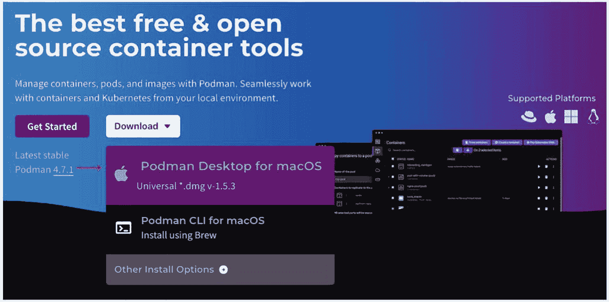

该图片将 Podman 宣传为一款免费开源的容器工具。它以蓝色背景为特色，文字突出显示了其管理容器、Pod 和镜像以及与 Kubernetes 协同工作的能力。页面上可见一个“开始使用”按钮和一个“下载”下拉菜单。最新的稳定版本是 Podman 4.7.1。macOS 版 Podman Desktop 部分显示了版本 1.5.3 的下载选项。支持的平台包括 macOS、Windows 和 Linux，并附有各自的图标。

图 8-1

Podman 二进制文件下载

*   找到下载的 `.dmg` 文件（通常在“下载”文件夹中），然后双击打开。将 Podman Desktop 图标拖到“应用程序”文件夹中。

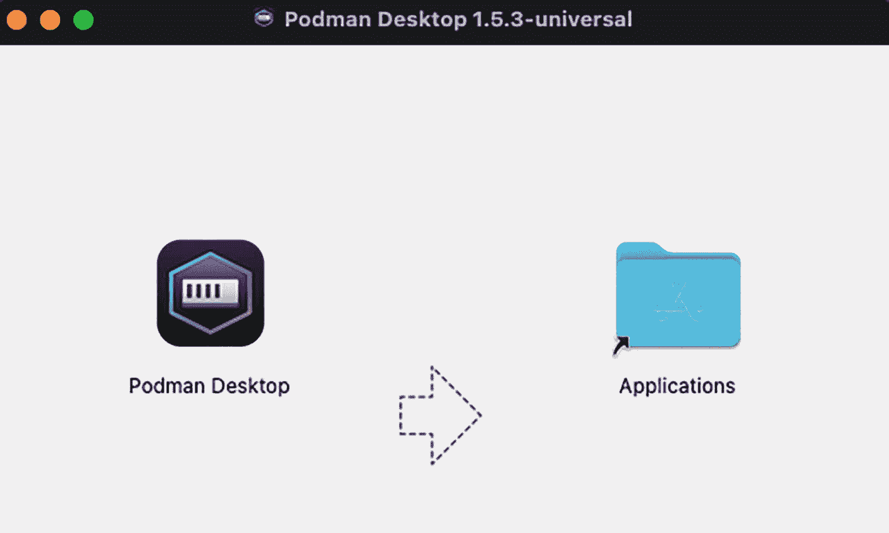

该图片显示了 Mac 上 Podman Desktop 1.5.3 的安装界面。左侧显示 Podman Desktop 图标，右侧有一个指向“应用程序”文件夹图标的箭头，提示用户应将 Podman Desktop 图标拖入“应用程序”文件夹以完成安装。

图 8-2

Podman 安装

*   从 Mac 的启动台或“应用程序”目录中打开 Podman Desktop。

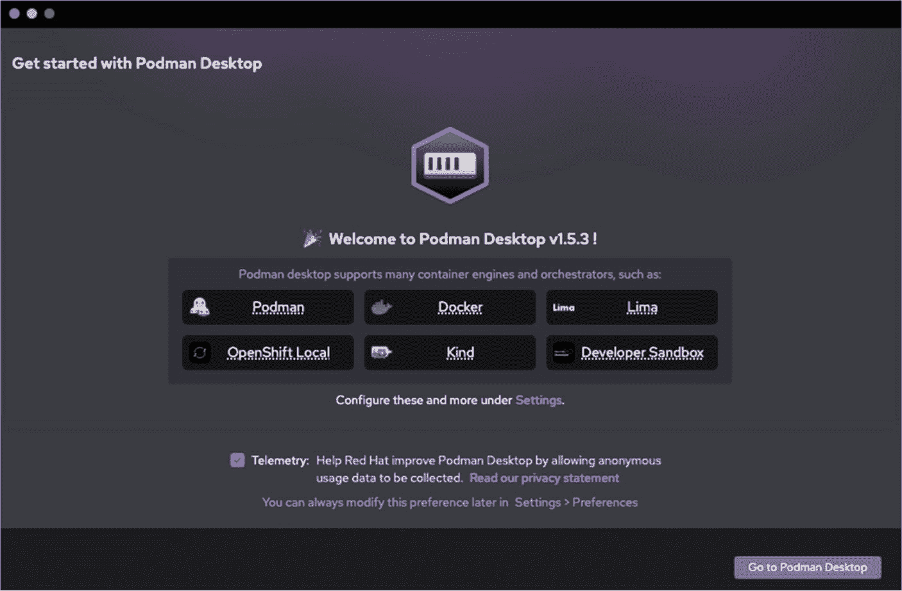

Podman Desktop 1.5.3 版的欢迎界面，展示了支持的容器引擎和编排器的图标：Podman、Docker、Lima、OpenShift Local、Kind 和 Developer Sandbox。有一条注释提到了“设置”下的配置选项。提供了遥测信息，并附有隐私声明的链接。右下角有一个标有“前往 Podman Desktop”的按钮。

图 8-3

Podman Desktop

*   首次打开 Podman Desktop 时，如果在 PATH 中未找到 Podman CLI/引擎，系统会提示你进行安装。点击“查看检测检查”按钮，然后点击“安装”按钮继续。

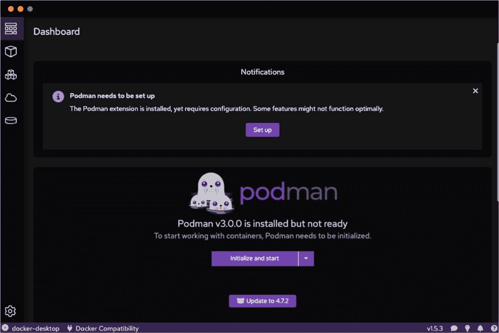

仪表板界面显示一条通知：“需要设置 Podman”。消息表明 Podman 扩展已安装，但需要进行配置。提供了一个“设置”按钮。下方显示 Podman v3.0.0 已安装但未就绪，并提供“初始化并启动”或“更新至 4.7.2”的选项。界面包含图标，左侧边栏有一个设置齿轮图标。

图 8-4

Podman 仪表板

*   你将被重定向到 Podman 安装程序。请按照屏幕上的说明进行操作。

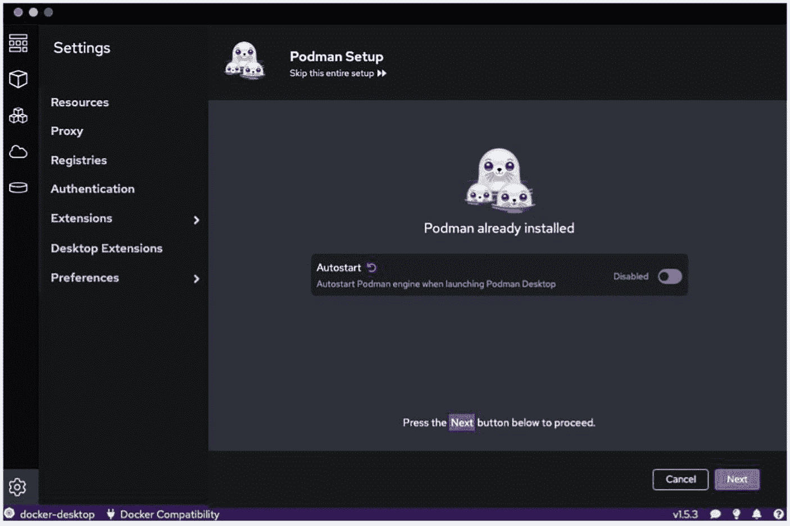

Podman 设置界面显示“Podman 已安装”，并提供一个选项，用于启用或禁用在启动 Podman Desktop 时自动启动 Podman 引擎。自动启动开关当前设置为“已禁用”。底部的提示指示按“下一步”按钮继续。左侧边栏包括菜单选项，如资源、代理、注册表、身份验证、扩展、桌面扩展和首选项。

图 8-5

Podman 设置

*   创建 Podman 机器。

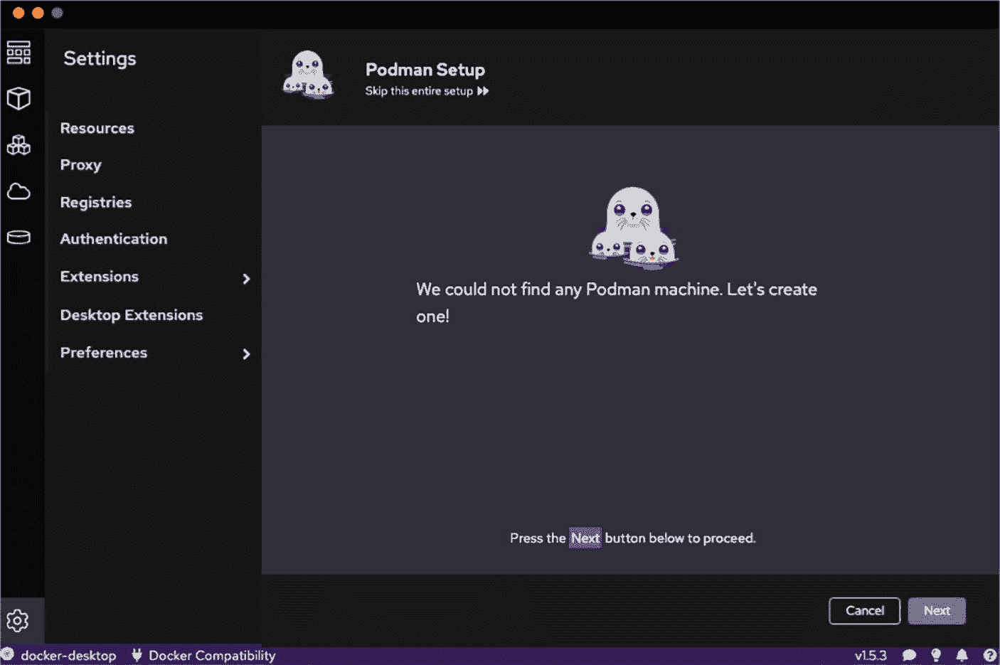

软件应用程序中的 Podman 设置界面。主面板显示一条消息，带有一个幽灵状角色的卡通图片，内容为：“我们找不到任何 Podman 机器。让我们创建一个吧！”下方指示：“请按下面的‘下一步’按钮继续。”侧边栏菜单包括资源、代理、注册表等选项。底部有“取消”和“下一步”按钮。应用程序版本为 v1.5.3。

图 8-6

创建 Podman 机器

*   设置所需资源。默认选项已经足够。

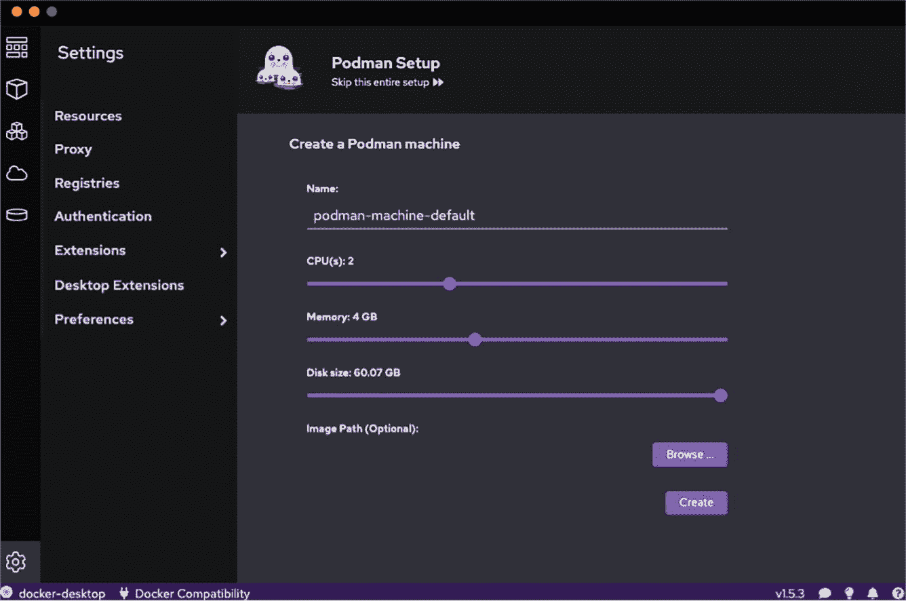

该图片显示了一个用于设置 Podman 机器的软件界面。主区域允许用户配置机器，选项包括将其命名为“podman-machine-default”、选择 CPU 数量（2）、内存分配（4 GB）和磁盘大小（60.07 GB）。有一个可选字段用于指定镜像路径，旁边有一个“浏览”按钮。有一个“创建”按钮用于完成设置。左侧边栏包括菜单选项，如资源、代理、注册表、身份验证、扩展、桌面扩展和首选项。界面采用深色主题并带有蓝色点缀。

图 8-7

设置资源

*   安装完成后，关闭安装程序。

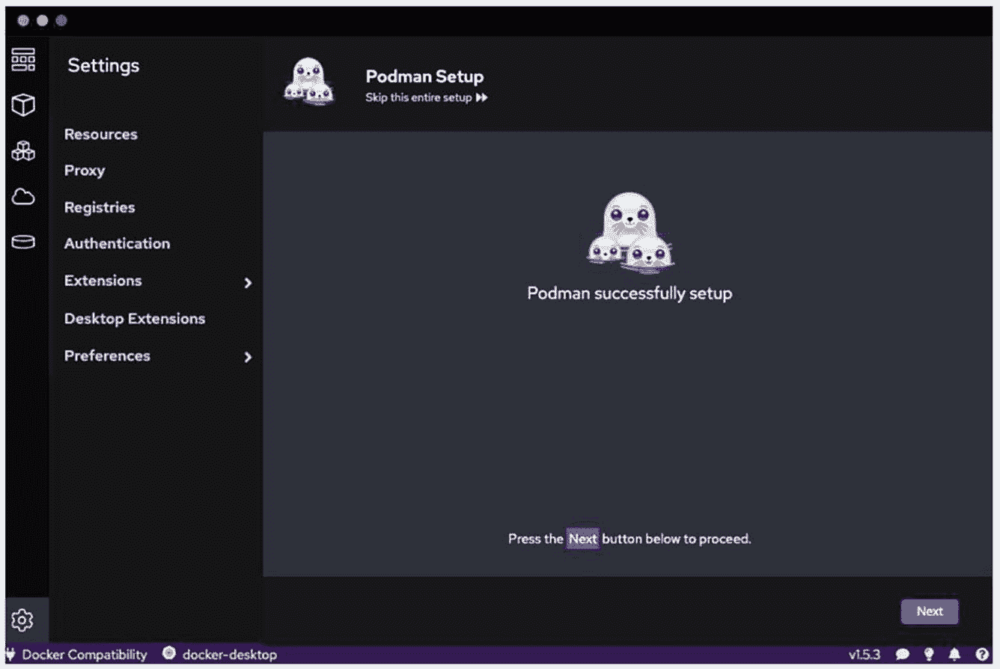

该图片显示了设置菜单中“Podman 设置”的软件安装界面。左侧边栏列出了资源、代理、注册表、身份验证、扩展、桌面扩展和首选项等选项。主区域显示一个幽灵状角色的图形，并带有消息“Podman 设置成功”。下方指示“请按下面的‘下一步’按钮继续”，并有一个高亮的“下一步”按钮。底部栏显示“Docker 兼容性”和“docker-desktop”，版本为“v1.5.3”。

图 8-8

设置完成

*   Podman 引擎将被安装，你就可以使用 Podman Desktop 了。

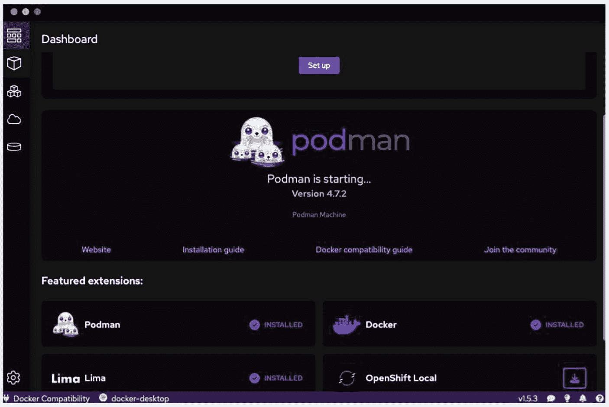

一个软件仪表板界面，显示 Podman 4.7.2 版本的启动界面。屏幕显示 Podman 徽标和文字“Podman 正在启动...”，以及“网站”、“安装指南”、“Docker 兼容性指南”和“加入社区”等选项。下方，精选扩展包括 Podman、Docker、Lima 和 OpenShift Local，均标记为已安装。顶部可见一个“设置”按钮。

图 8-9

Podman 引擎启动

这些步骤将使 Podman 在你的 Mac 上启动并运行。有关详细说明或故障排除，请参阅官方 Podman 文档或特定于 Mac 的安装指南。

## 开发一个简单的 Spring Boot 应用程序

**访问 Spring Initializr**：前往 [start.​spring.​io](https://start.spring.io/)。

**项目配置**：选择你的项目设置：

*   选择 Maven 项目或 Gradle 项目。

*   选择你偏好的语言（Java、Kotlin 或 Groovy）。

*   选择一个 Spring Boot 版本（通常，默认版本即可）。

*   填写项目元数据，例如 Group 和 Artifact。

**依赖项**：添加“Spring Web”依赖项，这对于创建 Web 应用程序至关重要。

**生成项目**：点击“生成”以下载你的项目 zip 文件。

**打开并运行项目**：

*   解压下载的 zip 文件，并在你喜欢的 IDE（如 IntelliJ IDEA、Eclipse 或 VS Code）中打开它。

*   在你指定的包下的 `src/main/java` 目录中找到 `DemoApplication.java` 文件。

*   编写一个简单的 REST 控制器，或修改现有的 `DemoApplication.java`，使其在访问特定 URL 时返回“Hello World”消息。

**运行应用程序**：

*   执行 `DemoApplication.java` 文件中的 main 方法来启动应用程序。

*   运行后，你可以通过在 Web 浏览器中导航到 `localhost:8080` 来访问“Hello World”消息。

此过程将创建一个基本的 Spring Boot 应用程序，可以进一步开发或容器化。


## 容器化 Spring Boot 应用

现在，将你的应用容器化。在项目根目录下创建一个 `Dockerfile`（或 `Containerfile`）。该文件用于指导如何构建应用的镜像。需要包含基础 Java 镜像、添加应用的 jar 文件，并指定入口点。以下是一个基本示例：

```
# 使用官方 Java 运行时作为父镜像
FROM eclipse-temurin:17-jdk-jammy
# 在容器中设置工作目录
WORKDIR /app
# 将 jar 文件复制到容器中的 /app 目录
COPY target/demo-0.0.1-SNAPSHOT.jar /app/hello-world.jar
# 向容器外部暴露 8080 端口
EXPOSE 8080
# 运行 jar 文件
ENTRYPOINT ["java","-jar","/app/hello-world.jar"]
```

## 使用 Podman 构建容器镜像

要使用 Podman Desktop 创建容器镜像，首先导航到 Podman Desktop 中的“镜像”部分，然后点击右上角的 **构建镜像** 按钮，如下图所示。

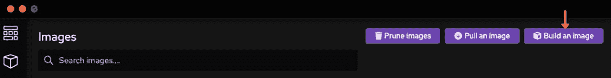

一个深色主题的界面，显示了一个镜像管理工具栏，包含三个按钮：“清理镜像”、“拉取镜像”和“构建镜像”。“构建镜像”按钮被一个粉色箭头高亮显示。还有一个标记为“搜索镜像...”的搜索栏。

图 8-10

构建镜像

此操作会打开一个菜单，我们可以在其中选择 `Containerfile` 的位置，通常位于 demo 文件夹的根目录。选择 `Containerfile` 后，可以为容器镜像指定一个名称，例如“my-custom-image”。

接下来，点击 **构建** 来观察每个镜像层的创建过程。

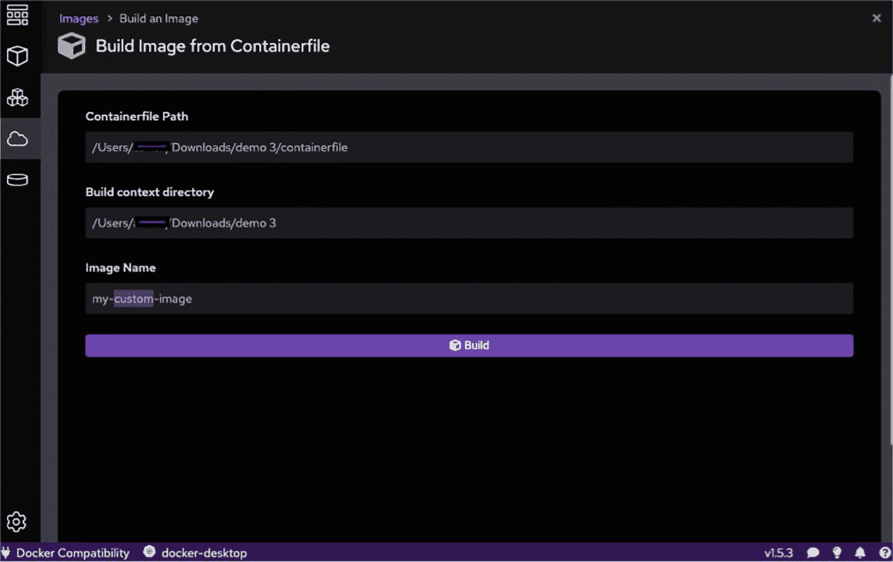

从容器文件构建 Docker 镜像的界面。它显示了“Containerfile 路径”字段，设置为“/Users/.../Downloads/demo 3/containerfile”；“构建上下文目录”字段，设置为“/Users/.../Downloads/demo 3”；以及“镜像名称”字段，设置为“my-custom-image”。底部有一个蓝色的“构建”按钮。

图 8-11

配置容器文件

你可以在本地镜像仓库中找到该镜像。

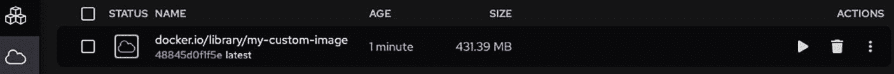

一个 Docker 镜像界面的截图，显示了一个名为“docker.io/library/my-custom-image”的镜像，标签为“latest”。该镜像创建于 1 分钟前，大小为 431.39 MB。可执行的操作包括运行、删除和更多设置。

图 8-12

本地仓库中的镜像

## 运行容器化应用

太棒了！现在，回到“镜像”部分，查看已成功构建并标记为镜像的容器化 Spring Boot 应用。要将其作为容器在系统上运行，请点击容器镜像右侧的 **运行** 图标，如下图所示。

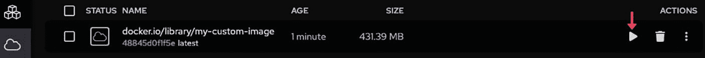

一个显示 Docker 镜像详情的用户界面。镜像名称为“docker.io/library/my-custom-image”，标签为“latest”。它创建于 1 分钟前，大小为 431.39 MB。右侧有操作图标，包括一个播放按钮和一个垃圾桶，一个粉色箭头指向播放按钮。

图 8-13

运行镜像

在“端口映射”部分，确保容器的 8080 端口映射到主机的 8080 端口。其他所有设置可以保持不变。然后，点击 **启动容器** 来启动 Spring Boot 应用的容器化版本，如下图所示。

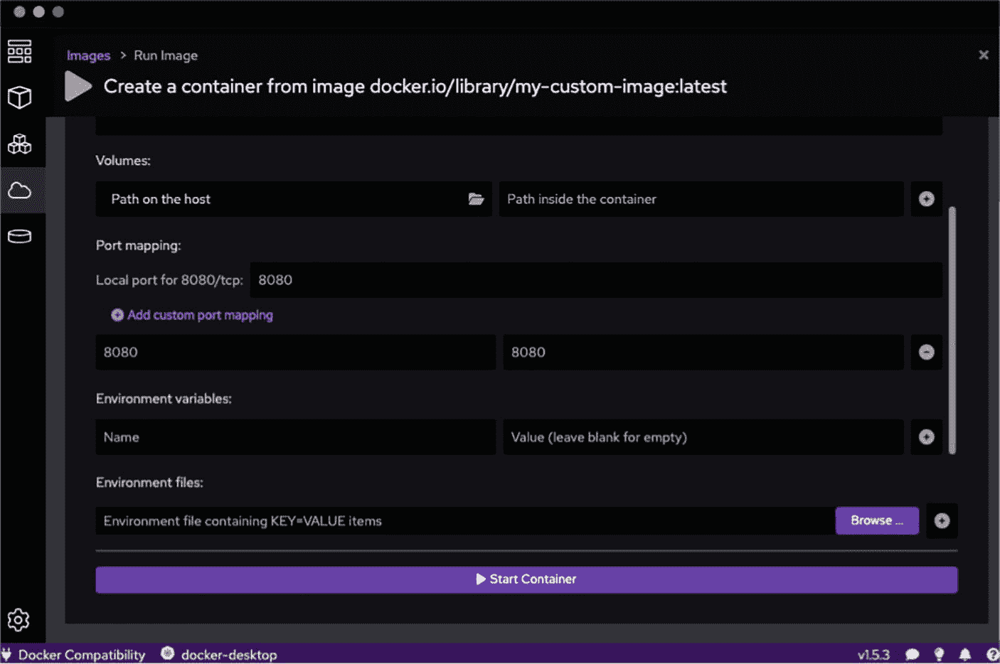

从镜像 `docker.io/library/my-custom-image:latest` 创建容器的 Docker 界面。它包括设置卷、端口映射和环境变量的部分。本地端口 8080 映射到容器端口 8080。有一个添加自定义端口映射和指定环境变量的选项。一个标记为“启动容器”的按钮以蓝色高亮显示。Docker 兼容性显示为版本 1.5.3。

图 8-14

端口映射

现在，容器已启动并运行。

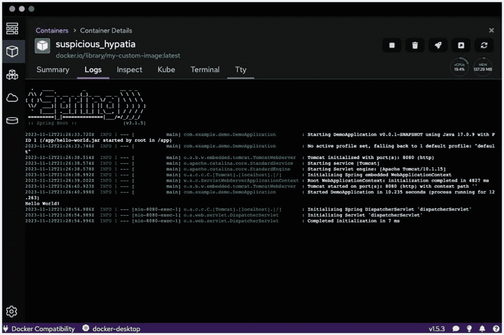

该图片显示了一个名为“suspicious_hypatia”的 Docker 容器详情界面，突出显示了“日志”选项卡。终端显示了一个 Spring Boot 应用启动日志，指示使用 Java 17.0.9 和 Apache Tomcat 初始化一个演示应用。关键事件包括启动 DemoApplication、初始化 Spring DispatcherServlet 以及在 7 毫秒内完成初始化。界面包含导航选项卡，如摘要、检查、Kube、终端和 Tty。底部注明了 Docker 兼容性。

图 8-15

容器启动并运行

我们现在已经成功使用 Podman 构建并容器化了一个 Spring Boot 应用。这种方法简化了开发流程，并确保我们的应用已准备好部署到任何支持容器的环境中。

## Buildah

Buildah 是一个开源工具，它提供了一个命令行界面，用于创建和管理符合 OCI（开放容器倡议）标准的容器镜像。作为 Docker 的替代方案，Buildah 是 Red Hat 提供的工具套件的一部分，与 Podman 和 Skopeo 一起用于处理容器。

Buildah 专注于构建容器镜像。它不管理容器的生命周期操作，如启动、停止或编排容器。Buildah 不包含容器运行时；它只负责创建和准备镜像。

### Buildah 特性

以下是 Buildah 的一些关键特性：

| 特性 | 描述 |
| --- | --- |
| **无根容器镜像构建** | Buildah 可以在无需任何访问权限的情况下创建容器镜像，降低了权限提升攻击的风险。 |
| **无守护进程架构** | Buildah 无需中央守护进程即可运行，通过将每个操作视为独立进程，最大限度地减少系统资源使用并简化架构。 |
| **与 Dockerfile 兼容** | Buildah 可以从现有的 Dockerfile 构建镜像，方便熟悉 Docker 的用户进行过渡。 |
| **镜像构建的灵活性** | 用户可以从零开始构建镜像，也可以使用现有镜像进行构建，与 Docker 相比，允许更大的定制化。 |
| **与其他工具的集成** | Buildah 可以很好地与其他工具集成，例如用于运行容器的 Podman 和用于传输和检查镜像的 Skopeo。 |
| **完全可脚本化的 CLI** | Buildah 的 CLI 完全可脚本化，使其适用于构建和部署流水线。 |
| **支持 OCI 镜像** | Buildah 生成的镜像与符合 OCI 标准的工具和系统完全兼容。 |


## Podman 与 Buildah 对比

我们来对 Podman 和 Buildah 进行功能对比。

| 功能特性 | Buildah | Podman |
| --- | --- | --- |
| **项目类型** | 开源 | 开源 |
| **平台** | 适用于 Linux | 适用于 Linux |
| **主要功能** | 快速构建 OCI 镜像，无论是否使用 Dockerfile | 管理 OCI 镜像和容器，包括拉取、标记、创建和运行容器 |
| **Dockerfile 支持** | 可以从 Dockerfile 构建镜像，也可以不使用 Dockerfile | 支持 Docker 命令，设计为 Docker 的直接替代品 |
| **守护进程依赖** | 不以守护进程方式运行 | 不以守护进程方式运行 |
| **Root 权限** | 无需 root 权限即可运行 | 无需 root 权限即可运行 |
| **容器生命周期** | 通常用于构建镜像的短期容器 | 支持长期运行的常规容器 |
| **存储系统** | 使用与 Podman 不同的存储系统 | 使用与 Buildah 不同的存储系统 |
| **集成** | 与 Podman 互补，用于构建镜像 | 与 Buildah 互补，用于管理容器 |


一幅卡通插画，描绘了一只戴着安全帽的狗和一只海豹。狗戴着黄色安全帽，海豹戴着带有探照灯的白色安全帽。它们周围散落着扳手、螺丝刀和蓝图等工具，背景是充满活力的蓝色，并带有气泡。

图 8-16

Podman 和 Buildah 是天作之合

## 使用 Buildah 构建镜像

要开始使用 Buildah，你可以将其安装在任何支持 OCI 的 Linux 发行版上。以下是一个快速指南：

**安装**

在 Fedora/Linux/CentOS 上，你可以使用 `sudo dnf install buildah` 安装 Buildah。

在 Ubuntu 上，首先使用 `sudo add-apt-repository ppa:projectatomic/ppa` 添加 Kubic 项目的仓库，然后执行 `sudo apt-get update`，最后执行 `sudo apt-get install buildah`。

**构建镜像**：要创建一个新镜像，你可以从一个基础镜像或从头开始，然后使用 Buildah 命令修改文件系统、设置环境变量、暴露端口以及定义入口点。

**提交你的工作**：完成更改后，你可以使用 `buildah commit` 将工作容器提交为一个镜像。

**推送到仓库**：最后，你可以使用 `buildah push` 将你的镜像推送到容器仓库。

假设你想创建一个包含 Web 服务器的简单容器镜像：

```
# 从头开始创建一个新容器
new_container=$(buildah from scratch)
# 挂载容器文件系统
mountpoint=$(buildah mount $new_container)
# 安装一个 Web 服务器，例如 nginx
dnf install --installroot $mountpoint --releasever 30 nginx --setopt install_weak_deps=false -y
# 设置一些配置和静态 HTML 文件
echo 'Hello from Buildah!' > $mountpoint/usr/share/nginx/html/index.html
# 提交更改以创建新镜像
buildah commit $new_container my-webserver
# 将镜像推送到仓库
buildah push my-webserver docker://myregistry/my-webserver:latest
```

Buildah 专注于构建容器镜像，而 Docker 则提供更广泛的功能，包括编排和网络。对于主要关注构建和管理容器镜像的用户，尤其是在需要更高脚本化和灵活性的场景下，Buildah 为 Docker 的镜像构建能力提供了一个强大的替代方案。

## Kaniko

在容器化领域，Docker 已成为创建和管理容器的代名词。然而，构建 Docker 镜像通常需要一个 Docker 守护进程，这在无法或不安全运行守护进程的环境中带来了挑战。Kaniko 正是在此背景下应运而生，它提供了一种在持续集成（CI）管道等环境中构建容器镜像的解决方案，而无需 Docker 守护进程。

### Kaniko 的必要性

Kaniko 由 Google 开发，旨在解决构建 Docker 镜像时的特定挑战：

*   **安全问题**：运行 Docker 守护进程通常需要提升权限，这可能会带来安全风险，尤其是在共享的 CI 环境中。
*   **环境限制**：在特定环境（如 Kubernetes 集群）中运行 Docker 守护进程并不实际。
*   **CI/CD 管道效率**：Kaniko 优化了直接在 CI/CD 管道内构建镜像的过程，无需依赖单独的环境来运行 Docker。

## Kaniko 的特性

Kaniko 拥有多项特性，使其在构建 Docker 镜像时具有优势：

*   **无需守护进程**：Kaniko 不需要 Docker 守护进程来构建镜像，从而减少了攻击面，使其在共享环境中更安全。
*   **在用户空间运行**：它完全在用户空间中执行 Dockerfile 中的每条命令，使其与各种环境兼容。
*   **缓存机制**：Kaniko 提供缓存选项以加速连续构建。
*   **支持标准 Dockerfile 指令**：你可以使用与 Docker 相同的 Dockerfile，从而轻松集成到现有工作流程中。

### 理解 Kaniko

Kaniko 执行器镜像（即 [gcr.​io/​kaniko-project/​executor:​latest](https://gcr.io/kaniko-project/executor:latest)）根据 Dockerfile 构建镜像并将其推送到仓库。它首先从 Dockerfile 中 `FROM` 命令指定的基础镜像中提取文件系统。然后，执行器运行 Dockerfile 中的命令，并在每次执行后在用户空间中对文件系统进行快照。如果发生任何更改，它会将这些文件作为新层附加到基础镜像，并相应地更新镜像元数据。

### 使用 Kaniko 构建和推送 Docker 镜像

*   **步骤 1：准备 Dockerfile 和上下文**：首先，像往常一样准备你的 Dockerfile。确保 Dockerfile 中引用的所有文件在构建上下文中都可用。
*   **步骤 2：设置 Docker 仓库凭据**：Kaniko 需要访问你的仓库才能推送构建好的镜像。你需要创建一个包含凭据的 JSON 文件。该文件通常如下所示：

    ```
    {
    "auths": {
    "https://index.docker.io/v1/": {
    "username": "yourusername",
    "password": "yourpassword"
    }
    }
    ```

*   **步骤 3：在 Docker 中运行 Kaniko**：你不需要 Kubernetes 来运行 Kaniko。它可以作为 Docker 容器执行。操作方法如下：
    1.  **挂载你的上下文和凭据**：使用 Docker 运行 Kaniko，挂载构建上下文目录和包含 Docker 仓库凭据的目录。

        ```
        docker run --rm \
        -v $(pwd):/workspace \
        -v /path/to/kaniko/.docker/:/kaniko/.docker/ \
        gcr.io/kaniko-project/executor:latest \
        --dockerfile /workspace/Dockerfile \
        --context dir:///workspace/ \
        --destination yourdockerhubusername/your-image-name:your-tag
        ```

    2.  **构建并推送**：Kaniko 将使用提供的 Dockerfile 和上下文构建镜像，然后将其推送到 Docker 仓库中指定的目标位置。

*   **步骤 4：验证镜像**：构建过程完成后，在 Docker 仓库中验证镜像，确保其已正确推送。

```
}
```

Kaniko 主要用于在可能不适合 Docker 的环境（例如 CI/CD 或 Kubernetes 环境）中进行无 root、无守护进程且安全的镜像构建。借助 Kaniko，开发者和 DevOps 团队可以安全高效地简化其 CI/CD 工作流程。

## Img

在不断发展的容器化领域，对多功能、安全且易于使用的容器镜像构建工具的需求从未如此强烈。`img` 正是在此背景下应运而生，为 Docker 和容器技术中的镜像创建提供了一种全新的方法。


### 为什么选择 img？

`img` 的开发旨在解决传统 Docker 镜像构建方法所面临的若干挑战和限制：

*   **无守护进程运行**：Docker 镜像的构建过程需要守护进程。这在共享或多租户环境以及 CI 系统中可能带来安全问题。

*   **Root 权限**：Docker 需要 root 权限才能创建镜像，这显然是一个重大的安全隐患。而 img 不需要任何 root 权限。

*   **简单性与可移植性**：img 是一个支持轻松构建、推送和拉取镜像的工具，因此对开发者和 CI/CD 流水线极具吸引力。

### img 的特性

`img` 凭借其独特的功能脱颖而出：

*   **无特权且无守护进程**：img 完全在用户空间运行，不需要任何守护进程，从而增强了安全性并减少了攻击面。

*   **兼容 Docker 和 OCI 镜像**：它可以根据 Dockerfile 构建与 Docker 及其他 OCI 镜像格式兼容的镜像。

*   **高效缓存**：得益于其高效的缓存机制，通过 img 进行重复构建的速度更快。

*   **易于集成到 CI/CD 流水线**：它非常简单且不需要特权要求，因此可以非常轻松地融入自动化工作流。

### 使用 img 构建和推送 Docker 镜像

**步骤 1. 安装 img：** 首先，在你的系统上安装 `img`。它适用于多种平台，可以从其 GitHub 仓库下载。

**步骤 2. 准备你的 Dockerfile：** 确保你的 Dockerfile 已准备好构建镜像所需的所有指令。

**步骤 3. 使用 img 构建镜像：** 导航到包含 Dockerfile 的目录并运行：

```
$ img build -t yourusername/yourimagename:tag .
```

将 `yourusername/yourimagename:tag` 替换为你的 Docker Hub 用户名、镜像名称和标签。`img` 将根据你的 Dockerfile 构建镜像。

**步骤 4. 将镜像推送到仓库：** 在推送镜像之前，先向你的 Docker 仓库进行身份验证：

```
$ img login -u yourusername -p yourpassword
```

然后，将镜像推送到 Docker Hub 或其他仓库：

```
$ img push yourusername/yourimagename:tag
```

**步骤 5. 验证镜像：** 推送后，检查你的 Docker 仓库以确保镜像已成功上传。

`img` 是一个构建 Docker 和 OCI 镜像的强大工具，特别适用于那些对安全性、简单性以及与现有流水线集成性要求较高的环境。它允许无特权、无守护进程的镜像创建，解决了容器生态系统中的关键挑战。对于开发者和 DevOps 专业人士来说，它是一个宝贵的资产，因为采用它可以简化工作流程、增强安全性并高效管理容器镜像。

## 总结

本章介绍了 Docker 的四种替代方案，并指出了每种方案在容器生态系统中的用途：

Podman 是 Docker 的一个独立替代方案。它支持无守护进程架构，并结合了无根容器管理。Podman 支持所有原生 Docker 命令，但增加了一个新功能：Pod 管理。本章介绍了在 Mac 系统上安装 Podman 的过程，然后通过将一个 Spring Boot 应用容器化来实际演示其用法。

Buildah 专注于创建容器镜像，为开发者提供了更大的灵活性和对镜像构建过程的控制。它不需要任何 root 权限，并且可以很好地与其他容器工具集成。本章探讨了 Buildah 的一些特性，并提供了从头开始构建容器镜像的实践示例。

Kaniko 解决了在受限环境（尤其是在 CI/CD 流水线运行中）中构建 Docker 镜像的问题。它完全无需 Docker 守护进程即可运行，并且设计为在容器内运行。此外，整个构建过程完全在用户空间进行，这使得它在需要在极度受限环境中构建镜像时完全合法。它专门针对 Kubernetes 和云原生工作流进行了优化。

img 是一种创建容器镜像的现代方法，其基础是简单性和安全性。它在用户空间运行，不需要 root 权限或守护进程，因此非常适合 CI/CD 环境。本章最后提供了使用 img 构建和管理容器镜像的实用建议。

这些工具共同展示了 Docker 之外可用于容器管理的多种方法，每种方法都为特定的用例和环境提供了独特的优势。了解这些替代方案有助于开发者和组织为其容器化需求选择最合适的工具。

