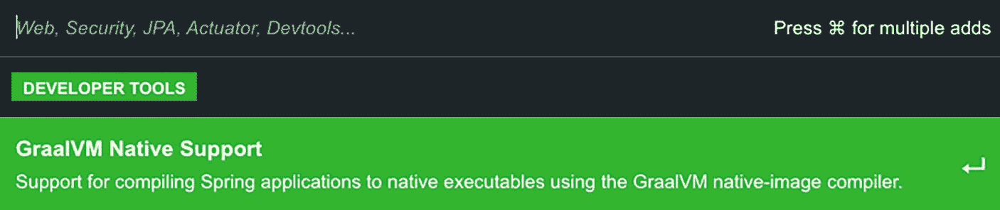
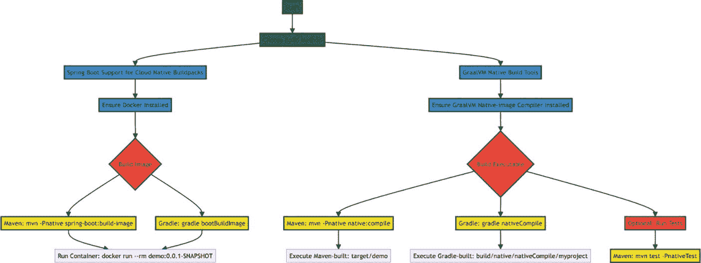
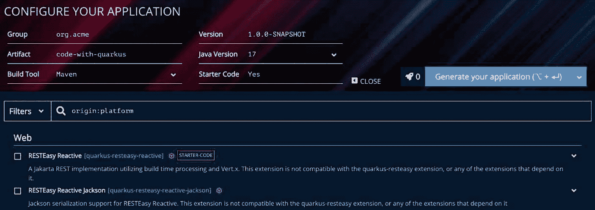
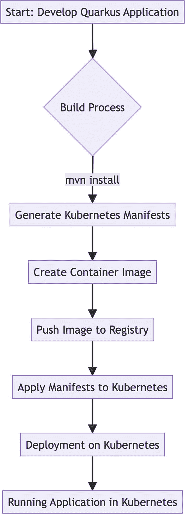

# 9. 使用 GraalVM 构建原生镜像

了解如何使用 GraalVM 和 Quarkus 构建闪电般快速的云 Java 应用。

在云原生世界中，将 Java 应用转换为高效、轻量级可执行文件的能力变得非常重要。Docker 容器彻底改变了应用的打包和部署方式，但每个容器内运行完整 JVM 的开销仍然存在，这增加了内存使用量并减慢了启动速度。这正是 GraalVM 的用武之地，它通过将 Java 字节码转换为独立的原生可执行文件来克服这些限制，这些可执行文件几乎可以瞬间启动，并且消耗的内存显著减少——这些特性在微服务架构和无服务器环境中尤其有价值。

此外，你还将了解到：GraalVM 原生镜像、Spring Boot 3 中的 GraalVM 原生镜像支持，以及 Quarkus 框架——它们在为现代部署环境优化 Java 应用方面各有独特之处。

## 揭开原生镜像和 GraalVM 的神秘面纱

GraalVM 是由 Oracle Labs 开发的高性能、多语言虚拟机，旨在支持在单个运行时上执行多种编程语言。它的设计目的是在提高性能的同时，减少传统基于 JVM 的执行开销。

在 Java 和 GraalVM 的语境中，原生镜像指的是从 Java 字节码创建的独立可执行文件。在深入探讨之前，让我们用一个餐厅和厨房的类比来理解这一点：

*   **传统 JVM**：一个设备齐全的厨房，拥有各种电器和工具。它可以烹饪任何菜肴，但准备和清洁需要时间。

*   **原生镜像**：一个专为特定类型菜肴定制的餐车。它更小，开始烹饪更快，效率更高，但不能轻易更改菜单。

## 原生镜像详解

*   **转换**：将 Java 字节码转换为特定于平台的可执行文件。

*   **组件**：包含应用类、依赖项以及来自 JDK 的静态链接原生代码。

*   **无需 JVM**：JVM 被打包到可执行文件中，从而消除了目标系统上对 Java 运行时环境的需求。


流程图说明了将 Java 源代码转换为原生镜像的过程。顺序是：Java 源代码被编译成 Java 字节码，然后由 GraalVM 转换为原生镜像。箭头指示了每个步骤之间的进展。

图 9-1

原生镜像创建步骤

## 原生镜像的优势

| 优势 | 描述 |
| --- | --- |
| **即时启动** | 原生镜像的启动速度比传统的基于 JVM 的应用更快。 |
| **减少内存占用** | 消耗更少的内存，提升性能，尤其是在容器或无服务器等受限环境中。 |
| **轻量级部署** | 由于体积更小且与容器化兼容，非常适合云原生应用。 |


## Native Image 的局限性

| 局限性 | 描述 |
| --- | --- |
| **平台依赖性** | 每个原生镜像都特定于一个平台，需要多次构建才能实现跨平台兼容。 |
| **Java 功能受限** | Java 的某些动态特性（如反射）可能无法得到完全支持，或需要额外配置。 |
| **调试复杂** | 原生镜像的调试比传统 Java 应用程序更具挑战性。 |

## Docker 与 Native Image 的区别

原生镜像和 Docker 镜像在软件部署流程中服务于不同的目的，并运行于不同的层级：

| 术语 | 范围 | 目的 | 使用场景 |
| --- | --- | --- | --- |
| **原生镜像** | 特指使用 GraalVM 等工具从 Java 代码编译生成的可执行文件。 | 创建一个特定于平台的独立可执行文件，包含必要的 Java 类和一个精简的 JVM。 | 优化 Java 应用程序，实现更快的启动速度和更低的内存占用。 |
| **Docker 镜像** | 一个轻量级、独立的可执行软件包，包含运行软件所需的一切：代码、运行时、系统工具、库和设置。 | 确保跨不同系统的一致环境和可移植性。 | 用于将应用程序容器化，使其在隔离环境中运行。 |

原生镜像专注于优化特定的 Java 应用程序，而 Docker 镜像则侧重于在不同环境中一致地打包和运行软件。原生镜像可以作为 Docker 镜像的一部分，但它们在核心功能和目标上有着根本性的不同。

## 理解 GraalVM

GraalVM 是由 Oracle 开发的一款高性能多语言虚拟机。它通过提供以下特性来增强标准 Java 虚拟机（JVM）的能力：

1.  **支持多种语言**：除 Java 外，它还能运行使用 JavaScript、Ruby、Python 及其他 JVM 语言编写的应用程序。

2.  **即时编译器（JIT）**：通过在运行时将字节码编译为机器码来提升 Java 应用程序的性能。

3.  **提前编译器（AOT）**：通过原生镜像技术，将 Java 应用程序编译成独立的可执行文件，这些文件启动更快且占用内存更少。

4.  **互操作性**：实现不同编程语言之间的无缝集成。

5.  **扩展与定制**：开发者可以根据特定需求扩展和定制该虚拟机。

## JIT 与 AOT 编译器对比

| 特性 | JIT | AOT |
| --- | --- | --- |
| **时机** | 在运行时编译代码。 | 在运行前（构建过程中）编译代码。 |
| **运作方式** | 程序运行时将字节码翻译为机器码。 | 生成特定于平台的二进制可执行文件。 |
| **性能** | 基于运行时数据优化代码，可能达到高性能。 | 启动速度更快（代码已预编译），但缺乏运行时优化。 |
| **灵活性** | 更具适应性，因为它是按需编译代码。 | 灵活性较低，因为它是为特定架构或平台编译的。 |
| **内存使用** | 由于运行时编译，可能增加内存使用和启动时间。 | 通常内存占用更小，并减少运行时开销。 |

## JVM 与 GraalVM 对比

| 特性 | JVM | GraalVM |
| --- | --- | --- |
| **语言支持** | 主要支持 Java 及基于 JVM 的语言，如 Scala 或 Kotlin。 | 支持更多语言，如 JavaScript、Ruby、Python 和 R，使其成为多语言虚拟机。 |
| **性能优化** | 使用即时（JIT）编译在运行时优化字节码。 | 包含先进的 JIT 编译器（Graal 编译器），实现更高效的性能优化。 |
| **提前编译** | 原生不支持 AOT 编译。 | 提供原生镜像技术用于 AOT 编译，从 Java 应用程序创建独立可执行文件。 |
| **互操作性** | 仅限于基于 JVM 的语言互操作。 | 增强的互操作性特性，支持混合语言应用程序。 |
| **代码消除** | 不会从最终可执行文件中排除不可达代码。 | 在创建原生镜像时，不可达代码会从最终可执行文件中排除。 |
| **不可变类路径** | 在传统 JVM 应用程序中，类路径可以动态修改，允许添加或更改 JVM 搜索类和资源的位置。 | 类路径在构建时固定，之后无法更改。 |
| **动态代码感知** | JVM 适应动态代码变化的能力（包括加载编译时未知的类）是其核心优势之一，支持灵活动态的 Java 应用程序。 | GraalVM 需要关于动态代码方面（如反射、资源、序列化和动态代理）的明确指令。 |

GraalVM 支持多种语言并提升应用程序性能的能力，使其成为现代软件开发中一款多功能工具。

## Spring Boot 3 与 GraalVM

GraalVM 是 OpenJDK 的一个增强版本，增加了包括“native-image”工具在内的额外功能。该工具执行提前（AOT）编译，高效处理你的代码，消除不需要的部分，然后将剩余部分转换为高度优化、特定于系统的原生代码。其性能提升非常显著，堪比 C 或 Go 应用程序。它生成的二进制文件几乎可以瞬间启动，并且所需 RAM 大幅减少。借助这项技术，部署一个 Spring Boot 应用程序可能仅消耗几十兆字节的 RAM，并在短短几百毫秒内启动。

要利用此功能，请使用 `./gradlew nativeCompile` 或 `./mvnw -Pnative native:compile`。这两个命令都用于在 GraalVM 环境下创建原生镜像——GraalVM 是一种虚拟机，能够将 Java 应用程序即时（JIT）编译为平台相关的可执行文件，从而减少启动时间和内存使用。

自 2022 年 11 月发布 Spring Boot 3.0 以来，Spring Boot 已正式支持此功能用于生产环境。


## 使用 Spring Boot 构建原生镜像

要轻松启动一个新的原生 Spring Boot 项目，请访问 [start.​spring.​io](https://start.spring.io)，选择 **GraalVM Native Support** 依赖项，然后生成你的项目。



该图片显示了一个深色界面，其中有一个标有“DEVELOPER TOOLS”的绿色区域。下方，一个亮绿色的横幅上写着“GraalVM Native Support”，描述为：“支持使用 GraalVM 原生镜像编译器将 Spring 应用程序编译为原生可执行文件。”左上角列出了 Web、Security、JPA、Actuator、Devtools 等技术，右上角提示按某个键进行多项添加。

图 9-2

添加 GraalVM 依赖项

构建 Spring Boot 原生镜像应用程序主要有两种方式，它们是：

**使用 Spring Boot 对云原生构建包的支持**：此方法生成一个包含原生可执行文件的轻量级容器。

对于熟悉 Spring Boot 容器镜像支持的人来说，这是最直接的起点。

注意

目标机器上需要安装 Docker。

使用 Maven 创建镜像，运行以下目标：

```
$ mvn -Pnative spring-boot:build-image
```

使用 Gradle 创建镜像，运行以下目标：

```
$ gradle bootBuildImage
```

然后，你可以像运行其他任何容器一样运行该应用程序：

```
$ docker run --rm demo:0.0.1-SNAPSHOT
```

**使用 GraalVM 原生构建工具**：此方法直接生成一个原生可执行文件。如果你对更广泛的功能感兴趣，例如在原生镜像环境中进行测试，请选择此选项。系统上必须安装并准备好 GraalVM 原生镜像编译器才能使用此选项。

注意

需要 GraalVM 22.3+ 版本。

使用 Maven 创建可执行文件，运行以下目标：

```
$ mvn -Pnative native:compile
```

使用 Gradle 创建可执行文件，运行以下目标：

```
$ gradle nativeCompile
```

要执行 Maven 构建的原生镜像，请使用以下命令：

```
$ target/demo
```

要执行 Gradle 构建的原生镜像，请使用以下命令：

```
$ build/native/nativeCompile/myproject
```

这些方法提供了不同的优势，可以根据应用程序的具体需求和环境进行选择。

下图解释了使用这两种方法通过 Spring Boot 构建原生镜像的构建过程。



流程图说明了从“开始”到“可选：运行测试”的两种构建方法。左侧路径涉及“Spring Boot 对云原生构建包的支持”，需要安装 Docker 来“构建镜像”。然后使用 Maven 或 Gradle 命令运行容器。右侧路径使用“GraalVM 原生构建工具”，需要 GraalVM 编译器来“构建可执行文件”，然后使用 Maven 或 Gradle 命令执行构建。两条路径在可选的测试步骤（使用 Maven）处汇合。

图 9-3

Spring Boot GraalVM 构建过程

## 测试 Spring Boot 应用程序的 GraalVM 原生镜像

在 GraalVM 原生镜像应用程序领域，建议在 JVM 上运行大多数单元测试和集成测试，以提高效率并实现与 IDE 的无缝集成。测试的重点是确保 Spring AOT 引擎正确处理应用程序，并且 GraalVM 能够生成有效的原生镜像。开发人员可以通过启用 `spring.aot.enabled` 属性在 JVM 上测试 AOT 处理。

```
$ java -Dspring.aot.enabled=true -jar myapplication.jar
```

此外，Spring 框架支持在原生镜像环境中运行测试，此功能在 CI 管道中特别有用。此方法需要设置特定的 Maven 或 Gradle 配置，并使用相关的构建工具。

在设置 Maven 以运行原生测试时，请确保你的 `pom.xml` 文件已将 `spring-boot-starter-parent` 配置为父级。这需要在你的 `pom.xml` 中包含一个与此规范一致的 `<parent>` 部分。

```
org.springframework.boot
spring-boot-starter-parent
3.2.0

```

你也可以在原生镜像中运行现有的测试套件。这是验证应用程序兼容性的有效方法。

要在原生镜像中运行现有测试，请运行以下目标：

```
$ mvn test -PnativeTest
```

当使用 Spring Boot Gradle 插件以及 GraalVM 原生镜像插件时，AOT 测试任务会自动设置。确保你的 Gradle 构建脚本包含一个包含 `org.graalvm.buildtools.native` 的 `plugins` 块非常重要。

要使用 Gradle 执行原生测试，你应该使用 `nativeTest` 任务。

```
$ gradle nativeTest
```

## 了解 Quarkus：一个 Kubernetes 原生 Java 框架

在不断发展的软件开发世界中，效率和速度至关重要。Quarkus 是一个 Kubernetes 原生 Java 框架，它正在彻底改变 Java 应用程序在云环境中的开发和部署方式。本节将向你介绍 Quarkus 的基础知识，以及它为何正成为 Java 开发人员的游戏规则改变者。

## 认识 Quarkus

Quarkus 是一个为 Kubernetes（广泛使用的容器编排平台）设计的开源 Java 框架。它专门针对容器优化了 Java，使其成为无服务器、云和 Kubernetes 环境的有效平台。

### Quarkus 的主要特性

*   **容器优先**：Quarkus 在设计时就考虑了基于容器的环境，确保低内存占用和快速启动时间。

*   **命令式和响应式**：它无缝支持命令式和响应式编程模型，适用于广泛的应用程序架构。

*   **微服务就绪**：凭借对微服务模式的内置支持，Quarkus 是构建可扩展和可维护应用程序的理想选择。

*   **开发者愉悦**：为命令式和响应式编码提供实时编码、统一配置和精简代码。

## 为何需要 Quarkus 与 Kubernetes 结合

*   **快速启动和低内存占用**：Quarkus 应用程序在毫秒内启动，并且与传统 Java 应用程序相比，仅消耗一小部分内存。这对于资源频繁伸缩的 Kubernetes 至关重要。

*   **开发者生产力**：Quarkus 通过热重载功能提高了开发人员的工作效率，这意味着你无需重新启动应用程序即可实时查看更改。

*   **使用 GraalVM 进行原生编译**：Quarkus 可以使用 GraalVM 编译为原生可执行文件，进一步减少内存占用和启动时间。

*   **云原生生态系统集成**：它与 Kubernetes、Docker 以及云原生数据库和消息系统无缝集成。


## Quarkus 入门指南

开始使用 Quarkus 最简单的方式是访问 `code.quarkus.io`，这是 Quarkus 团队提供的在线平台，能显著简化创建新 Quarkus 项目的流程。该平台设计得用户友好且高效，尤其适合初学者或希望快速搭建新 Quarkus 应用的开发者。

以下是 `code.quarkus.io` 提供的功能概览：

*   **用户友好的界面**：该网站拥有直观的界面，无需编写任何样板代码即可轻松创建和配置 Quarkus 项目。

*   **可定制的项目设置**：你可以自定义项目的各个方面，例如 Maven Group、Artifact 和 Version。你还可以选择构建工具（Maven 或 Gradle）。

*   **扩展选择**：`code.quarkus.io` 提供的最强大功能之一是能够浏览并从广泛的 Quarkus 扩展中进行选择。扩展是与 Quarkus 集成的附加组件或库，用于提供额外的功能，例如数据库连接、安全性、消息传递等。

*   **简化的依赖管理**：它会自动管理所选扩展的依赖关系，确保兼容性并减少手动管理依赖的麻烦。

*   **下载或分享你的项目**：配置完项目后，你可以将其下载为 ZIP 文件，或使用生成的 URL 与他人分享。此功能对于协作或保存项目配置以备将来使用特别有用。

*   **代码生成**：该平台会根据你的选择生成一些基本代码和配置文件，帮助你快速启动开发。

创建第一个项目的步骤。

*   **访问平台**：在你的网页浏览器中访问 `code.quarkus.io`。

*   **配置你的项目**：输入项目的 groupId、artifactId 和 version。选择你偏好的构建工具。

*   **选择扩展**：浏览可用扩展列表。你可以搜索特定扩展或按类别进行筛选。

*   **生成你的项目**：完成选择后，点击“Generate your application”按钮。这将创建一个定制的 Quarkus 项目。

*   **下载/分享**：然后你可以将生成的项目下载为 ZIP 文件，或复制 URL 与他人分享。

*   **开始编码**：解压下载的文件，并在你喜欢的 IDE 或编辑器中打开它，开始编码。



该图片展示了一个 Quarkus 应用的软件配置界面。它包含 Group、Artifact、Version、Java Version 和 Build Tool 等字段，并带有诸如“org.acme”和“Maven”等值。右侧有一个标有“Generate your application”的按钮。下方是一个筛选选项和一个用于选择 Web 扩展（如“RESTEasy Reactive”和“RESTEasy Reactive Jackson”）的区域，每个扩展都附有描述和兼容性说明。

图 9-4

Quarkus 项目入门

Quarkus 标志着 Java 生态系统的一次重大转变，将 Java 直接带入了现代云原生时代。它不仅仅是在 Kubernetes 上运行 Java，更是让 Java 成为该领域的一等公民。凭借其无与伦比的效率和以开发者为中心的设计，Quarkus 无疑是任何希望踏入 Kubernetes 和云原生开发世界的 Java 开发者值得探索的框架。

## 在 Kubernetes 上构建和部署 Quarkus 应用

在云原生开发的世界中，Kubernetes 已成为编排容器化应用的事实标准。Quarkus，被称为“超音速亚原子 Java”，是一个为 GraalVM 和 HotSpot 量身定制的 Kubernetes 原生 Java 框架。本节将指导你在 Kubernetes 上构建和部署 Quarkus 应用的流程。

## 快速上手 Quarkus

**步骤 1**：我们可以从生成一个新的 Quarkus 项目开始。我们可以使用 `code.quarkus.io` 来设置带有所需扩展的项目，或者直接使用 Maven/Gradle：

```
mvn io.quarkus.platform:quarkus-maven-plugin:3.6.4:create \
-DprojectGroupId=org.acme \
-DprojectArtifactId=kubernetes-quickstart \
-Dextensions='resteasy-reactive,kubernetes,jib'
cd kubernetes-quickstart
```

这将创建一个包含 Kubernetes 和 Jib 扩展的新项目。此外，以下依赖项会被添加到我们的 `pom.xml` 文件中。

```
io.quarkus
quarkus-resteasy-reactive

io.quarkus
quarkus-kubernetes

io.quarkus
quarkus-container-image-jib

```

通过集成这些依赖项，我们可以在每次构建时自动生成 Kubernetes 清单，并同时使用 Jib 构建容器镜像。例如，执行以下命令后：

```
./mvnw install
```

在生成的各种文件中，我们会在 `target/kubernetes/` 目录下看到两个特定文件——`kubernetes.json` 和 `kubernetes.yml`。检查这两个文件中的任何一个，都会发现它们包含了 Kubernetes `Deployment` 和 `Service` 的定义。



流程图展示了在 Kubernetes 上部署 Quarkus 应用的过程。它从开发应用开始，接着是使用“mvn install”的构建过程。然后，生成 Kubernetes 清单，并创建容器镜像。镜像随后被推送到注册表。清单被应用到 Kubernetes，从而在 Kubernetes 中部署和运行应用。

图 9-5

Quarkus 应用部署流程

需要重申的是，Quarkus 能够基于合理的默认值和用户提供的配置，使用 [dekorate](https://dekorate.io/) 自动生成 Kubernetes 资源。

此外，Quarkus 可以通过将生成的清单应用到目标集群的 API Server，将应用部署到目标 Kubernetes 集群。

```
kubectl apply -f target/kubernetes/kubernetes.json
```

最后，当存在任一容器镜像扩展时，Quarkus 可以在将应用部署到目标平台之前，创建容器镜像并将其推送到注册表。

## 总结

本章详细概述了如何使用 GraalVM 构建原生镜像，并将其与 Spring Boot 等流行框架集成。尽管 GraalVM 原生镜像具有显著优势，例如更快的启动时间和更低的内存占用，但一些限制限制了其对 Java 动态特性（如反射）的支持。

接着，讨论转向了 Spring Boot 3 的原生支持，它提供了两种构建原生镜像的主要方式：Cloud Native Buildpacks 和 GraalVM Native Build Tools。

最后但同样重要的是，本章涵盖了 Quarkus，这是一个从头开始为容器环境构建的 Kubernetes 原生 Java 框架，重点介绍了其实时编码、支持命令式和响应式编程等特性。贯穿本章，重点始终放在这些技术如何改变 Java 应用，以满足现代云原生架构的需求，尤其是在容器化和 Kubernetes 环境中。


