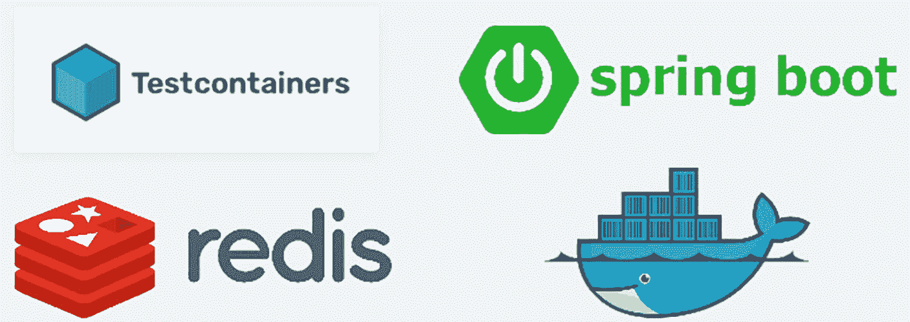
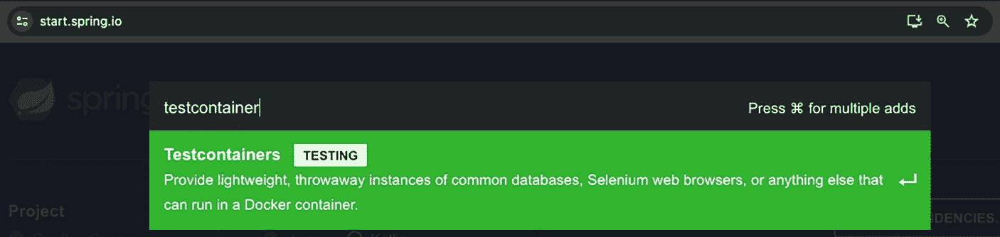

# 10. 使用 Testcontainers 测试 Java 应用程序

探索使用 Testcontainers 为 Docker 化应用构建类生产测试环境的实用方法

在日新月异的软件开发领域中，全面的测试对于任何应用的可靠性和健壮性都至关重要。虽然单元测试能洞察单个组件，但集成测试会带来一些独特的挑战，尤其是在处理数据库和服务等依赖项时。

Testcontainers 是应对这些挑战的强大解决方案，它提供了一个 Java 库，利用 Docker 容器来创建轻量级、可丢弃的数据库、Web 浏览器以及集成测试所需的其他服务实例。本章将展示 Testcontainers 如何通过提供与生产场景高度一致的、隔离的测试环境，来简化测试流程——特别是针对 Spring Boot 应用。

## Testcontainers 简介

在软件开发中，集成测试对于确保应用的不同部分能够无缝协作至关重要。这正是 Testcontainers（一个 Java 库）发挥作用的地方。Testcontainers 提供了常见数据库、Selenium Web 浏览器或任何可在 Docker 容器中运行的其他服务的轻量级、一次性实例。

该库旨在支持我们的自动化集成测试，在进入生产环境之前提供更高水平的信心。通过使用 Docker 容器，Testcontainers 确保应用在高度模拟生产的环境中按预期运行。

## 为何需要 Testcontainers

Testcontainers 是一个开源框架，用于提供可丢弃的、轻量级的数据库、消息代理、Web 浏览器或任何可在 Docker 容器中运行的其他服务的实例。

可以把 Testcontainers 想象成我们计算机程序的玩具箱。当我们玩积木时，可能想看看它们如何组合在一起搭建一座玩具桥。但如果没有缺失的积木，我们就无法完成这座桥。Testcontainers 允许我们的程序借用任何可能缺失的积木，比如一块独特的积木，这样我们就能看到我们的作品是否也能与这些积木配合工作。就像我们会测试玩具桥在汽车驶过时是否稳固一样，Testcontainers 让我们的程序检查它是否能与真实的部件（而不仅仅是模拟的部件）良好协作。对于使用 Spring Boot 编写的程序来说，这就像获得了开箱即用、完美契合的最佳积木。

有了 Testcontainers，集成测试变得更加真实。它允许我们使用应用数据库和服务的真实版本进行测试，遵循代码本应执行的真实行为，而不是使用可能过度简化或忽略重要细节的替代品。


Testcontainers 的 Logo，以蓝绿色和蓝色的 3D 六边形形状为特色，后面跟着粗体深蓝色的文字 "Testcontainers"。

图 10-1

Testcontainers 标志

在集成测试的背景下，需要 Testcontainers 的原因有几点：

*   **环境一致性**：它提供了一种针对真实服务和数据库运行测试的方法，确保测试环境紧密模拟生产环境。

*   **易用性**：Testcontainers 管理测试中所用容器的生命周期，简化了设置和拆除过程。

*   **可移植性**：使用 Testcontainers 的测试可以在任何安装了 Docker 的系统上运行，无需额外的服务配置。

*   **对持续集成友好**：Testcontainers 非常适合 CI 管道，因为它们允许测试以隔离且可重复的方式运行。

*   **灵活性**：开发人员可以通过更改容器版本来快速测试不同的数据库和服务版本。

*   **资源效率**：容器可以按需快速启动和停止，这比管理专用的测试数据库和服务更高效。

## Testcontainers 特性

这些特性使 Testcontainers 成为开发人员的强大盟友，帮助他们确保应用在部署到真实环境时能按预期工作：

*   **多样化的容器支持**：为各种服务（包括数据库、Web 浏览器和消息代理）提供轻量级、可丢弃的实例。

*   **JUnit 集成**：与 JUnit 测试用例无缝集成。

*   **单例容器**：支持可在多个测试类之间共享的单例容器。

*   **自定义容器**：允许使用自定义 Docker 镜像。

*   **数据库集成**：通过预配置的 JDBC URL 直接支持流行的数据库。

*   **模拟外部服务**：通过在 Docker 容器中模拟这些服务，方便测试与第三方服务交互的应用。

*   **环境复制**：提供复制生产设置的一致环境，减少“在我机器上能运行”的问题。

*   **资源管理**：处理容器的启动和停止，确保不浪费资源。

*   **服务健康检查**：在继续测试之前，等待容器变为健康状态。

*   **可重用容器**：在可能的情况下，通过在测试运行之间重用容器来优化测试执行。

*   **日志收集**：允许收集和观察容器日志，这有助于调试。

*   **生命周期控制**：让开发人员在测试代码中控制容器的生命周期事件。

## 测试 Spring Boot 应用

Spring Boot 应用中的单元测试和集成测试保证了软件的质量和可靠性。单元测试专注于单个组件，能够实现早期错误检测，这对于降低后期开发阶段的修复成本和复杂性有着巨大作用。此类测试也充当了文档的角色，展示了如何使用代码。它甚至在重构期间提供了安全网，确保更新或更改不会破坏现有功能。

另一方面，集成测试对于确保不同组件完美交互是必要的，从而保证系统协同工作。这还包括模拟不同的环境，例如数据库和 Web 服务器，以确保应用在真实条件下表现良好。因此，单元测试和集成测试在确保 Spring Boot 应用的可维护性、健壮性和整体可靠性方面大有裨益。

测试 Spring Boot 应用通常涉及几个测试层次：

*   **单元测试**：使用 JUnit 和 Mockito 等框架隔离测试单个组件。Spring Boot 的 `@SpringBootTest` 注解可用于加载 Spring 上下文的、更偏向集成风格的单元测试。

*   **集成测试**：测试应用不同层之间的交互。这可能涉及使用 `@DataJpaTest` 测试仓库层，使用 `@WebMvcTest` 测试控制器，以及使用 `@SpringBootTest` 配合 `TestRestTemplate` 或 `MockMvc` 进行完整的上下文加载测试。

*   **端到端测试**：测试整个应用，通常使用 `@SpringBootTest` 来运行应用，并使用 Selenium 等工具进行 Web UI 测试。

*   **Testcontainers**：对于需要数据库或消息代理等真实服务的集成测试，Testcontainers 提供了一种在测试期间于 Docker 容器中运行这些服务的方法。

每个测试层次都有不同的目的，从快速的单元测试到全面的端到端测试，确保你的 Spring Boot 应用健壮且为生产环境做好准备。


## Spring Boot 应用的单元测试

假设我们有一个简单的 `EmployeeService` 类需要测试：

```
import org.springframework.beans.factory.annotation.Autowired;
import org.springframework.stereotype.Service;
@Service
public class EmployeeService {
private final EmployeeRepository employeeRepository;
@Autowired
public EmployeeService(EmployeeRepository employeeRepository) {
this.employeeRepository = employeeRepository;
}
public Employee addEmployee(Employee employee) {
return employeeRepository.save(employee);
}
}
```

`addEmployee` 方法是一个简单的示例，用于向仓库中添加新员工。我们可以通过添加其他方法来扩展此类，以处理其他 CRUD 操作。

这个 `EmployeeService` 类依赖 `EmployeeRepository` 来处理数据操作。

```
import org.springframework.data.repository.CrudRepository;
import org.springframework.stereotype.Repository;
@Repository
public interface EmployeeRepository extends CrudRepository {
}
```

该仓库接口为你的 `Employee` 实体提供了基本的 CRUD 操作。你可以根据需要，通过自定义查询方法来扩展它。

在下面的示例中，`Employee` 是你的实体类，`Long` 是实体主键的类型。这里的 `@RedisHash("Employee")` 注解表示 `Employee` 实体的实例将存储在 Redis 中。`@Id` 注解标记了在 Redis 中用作标识符的字段。`name` 和 `position` 字段是 `Employee` 实体的简单属性。

```
import org.springframework.data.annotation.Id;
import org.springframework.data.redis.core.RedisHash;
@RedisHash("Employee")
public record Employee(@Id Long id, String name, String position) {}
```

Java 记录会自动生成 getter、`equals()`、`hashCode()` 和 `toString()` 方法，使其非常适合作为实体等简单的数据载体类。请注意，记录是不可变的，因此每个字段都是 final 的。

在下面的单元测试中，我们尝试模拟与 `EmployeeRepository` 的交互。以下是使用 JUnit 和 Mockito 为 `EmployeeService` 编写单元测试的方法：

Mockito 是一个流行的 Java 测试框架，它允许创建模拟对象，在单元测试中模拟和验证方法调用。

```
public class EmployeeServiceTest {
private EmployeeService employeeService;
private EmployeeRepository mockRepository;
@BeforeEach
void setUp() {
mockRepository = Mockito.mock(EmployeeRepository.class);
employeeService = new EmployeeService(mockRepository);
}
@Test
void testAddEmployee() {
Employee employee = new Employee("John Doe", "Developer");
Mockito.when(mockRepository.save(employee)).thenReturn(employee);
Employee result = employeeService.addEmployee(employee);
assertEquals(employee.getName(), result.getName());
}
}
```

## Spring Boot 应用的集成测试

现在，考虑一个场景：我们想要测试一个与 Redis 数据库交互的 `EmployeeRepository`，但不使用 Testcontainers。这通常需要更多的手动设置，并且可能很复杂。

首先，你需要一个正在运行的 Redis 实例。这可以在你的本地机器上、手动启动的 Docker 容器中，或者是一个托管服务。假设我们有一个 Redis 实例在 `localhost` 的默认端口 `6379` 上运行，测试可能如下所示：

```
@SpringBootTest
public class EmployeeRepositoryIntegrationTest {
@Autowired
private EmployeeRepository employeeRepository;
@Test
public void testEmployeeRepository() {
Employee employee = new Employee("John Doe", "Developer");
employeeRepository.save(employee);
Optional employee = employeeRepository.findById(employee.getId());
assertTrue(employee.isPresent());
assertEquals(employee.getName(), employee.get().getName());
}
}
application-test.properties:
spring.redis.host=localhost
spring.redis.port=6379
```

Spring Boot 应用中的 `application-test.properties` 文件用于专门为测试环境定义属性。当你运行测试时，Spring Boot 可以配置为使用这些属性，而不是常规的 `application.properties` 或 `application.yml`。这允许为测试设置不同的配置，例如连接到不同的数据库或使用不同的应用程序设置。

采用这种手动方式进行集成测试会引入几个复杂性：

*   此集成测试假设 Redis 已经运行并且可以访问。

*   我们需要手动确保 Redis 在测试前后处于干净状态。

*   没有 Testcontainers，处理不同的环境（CI 服务器、本地开发）可能具有挑战性。

*   这种方法缺乏 Testcontainers 提供的隔离性和环境一致性，可能导致测试不稳定。

这个示例说明了在不使用像 Testcontainers 这样能自动化这些方面的工具时，所需的额外复杂性和手动干预。

## Spring Boot 与 Testcontainers

Testcontainers 与 Spring Boot 的集成是一种非常强大的方式，可以促进全面的应用程序测试，尤其是在与外部系统或数据库交互时。这种集成允许在测试期间动态创建和管理容器，同时提供一个类似于生产环境的隔离环境。

Testcontainers 与 JUnit 集成，允许我们定义一个测试类，该类会在任何测试执行之前启动一个容器。它易于用于与后端服务（如 MySQL、MongoDB、Redis 等）通信的集成测试。



四种软件技术的标志：Testcontainers 带有立方体图标，Spring Boot 带有绿色电源按钮符号，Redis 带有红色磁盘堆栈，Docker 由一只携带容器的蓝色鲸鱼表示。

图 10-2

Testcontainers 集成测试

以下是我们如何在 Spring Boot 测试中使用 Testcontainers。

### 依赖项设置

首先，确保在 Maven 或 Gradle 配置中包含所需的依赖项至关重要：

对于 Maven：

```
org.springframework.boot
spring-boot-starter-test
test

org.springframework.boot
spring-boot-testcontainers
test

org.testcontainers
junit-jupiter
test

```

对于 Gradle：

```
dependencies {
testImplementation 'org.springframework.boot:spring-boot-starter-test'
testImplementation 'org.springframework.boot:spring-boot-testcontainers'
testImplementation 'org.testcontainers:junit-jupiter'
}
```

或者，我们可以通过 [start.​spring.​io](https://start.spring.io) 添加依赖项。



图片显示 start.spring.io 网站上的一个搜索栏，其中输入了文本 "testcontainer"。下方，一个高亮建议显示 "Testcontainers TESTING"，描述为："提供轻量级、可丢弃的常见数据库、Selenium Web 浏览器或任何可以在 Docker 容器中运行的其他实例。" 右侧提示显示："按 ⌘ 进行多次添加。"

图 10-3

添加 Testcontainers 依赖项

### 注解测试类

使用 `@SpringBootTest` 注解你的测试类，以启用 Spring Boot 上下文加载进行测试，并使用 `@Testcontainers` 激活 Testcontainers 支持。

```
@Testcontainers
@SpringBootTest
class DemoApplicationTests {
}
```


## 容器初始化

在你的测试类中使用 Testcontainers 的工具类创建容器实例。例如，如果你想启动一个内存中的 Redis 缓存实例：

```
@Testcontainers
@SpringBootTest
class DemoApplicationTests {
@Container
@ServiceConnection
static RedisContainer container = new RedisContainer(RedisContainer.DEFAULT_IMAGE_NAME);
@Test
void myTest() {
System.out.println(container.isRunning());
System.out.println(container.getRedisURI());
}
}
```

这段代码演示了 Testcontainers 与 Spring Boot 的集成，展示了如何在测试场景中使用 Redis 容器。以下是代码各部分的详细说明：

*   `@Testcontainers`：此注解表明该测试类将使用 Testcontainers。它允许我们管理测试类中使用的容器的生命周期。

*   `@SpringBootTest`：表明这是一个 Spring Boot 测试。它会加载完整的应用程序上下文，并允许与 Spring 组件进行集成测试。

*   `@Container`：此注解将一个字段标记为由 Testcontainers 管理的容器。在此例中，它声明了一个类型为 `RedisContainer` 的静态字段 `container`。`RedisContainer` 使用默认的 Redis 镜像名称（`RedisContainer.DEFAULT_IMAGE_NAME`）进行实例化，该镜像从 DockerHub 仓库拉取。

*   `@ServiceConnection`：促进 Spring Boot 的自动配置，以动态地注册所有必需的属性。在后台，此注解从容器类或 Docker 镜像名称中识别出必要的属性。

*   `myTest()`：这是一个使用 `@Test` 注解的测试方法。在此方法内部：
    *   `container.isRunning()` 打印 Redis 容器是否正在运行。
    *   `container.getRedisURI()` 检索并打印正在运行的 Redis 容器的 URI。

这段代码设置了一个测试类，利用 Testcontainers 来管理 Redis 容器。它演示了检查容器是否正在运行以及检索其 URI 等基本功能。这允许进行集成测试，确保应用程序能够与由 Testcontainers 管理的 Redis 实例正常工作。

以下是我们如何修改之前手动创建 Redis 集群的示例，以使用 `RedisContainer`——一个来自 testcontainers-java 库的专用 Redis 容器类。

```
@SpringBootTest
@Testcontainers
public class EmployeeRepositoryIntegrationTest {
@Container
@ServiceConnection
static RedisContainer redis = new RedisContainer(DockerImageName.parse("redis:latest"));
@Autowired
private EmployeeRepository employeeRepository;
@Test
public void testEmployeeRepository() {
Employee employee = new Employee(1L, "John Doe", "Developer");
employeeRepository.save(employee);
Optional foundEmployee = employeeRepository.findById(employee.getId());
assertTrue(foundEmployee.isPresent(), "Employee should be found");
assertEquals(employee.getName(), foundEmployee.get().getName(), "Employee names should match");
}
}
```

这种方法有几个优点：

*   Testcontainers 将自动启动一个 Redis 容器。
*   对于容器化的 Redis 实例，无需 `application-test.properties` 文件。
*   无需本地安装 Redis。
*   你将获得一个一致且隔离的测试环境。
*   Testcontainers 会自动清理资源。
*   测试套件在任何环境（本地、CI）中都能以相同的方式工作。

## 总结

本章涵盖了 Testcontainers 的基础知识以及如何在 Java 中使用它，重点在于 Spring Boot 集成测试。它首先解释了 Testcontainers 背后的核心概念、其必要性以及主要特性：支持多种容器、与 JUnit 集成以及自动资源管理。然后，深入探讨了实现细节，重点介绍了 Spring Boot 应用程序在单元和集成级别的测试策略。

本章提供了设置和使用 Testcontainers 的实践示例，并通过详细说明所需的配置步骤，演示了与 Redis 容器的集成。本章的主要重点在于，与传统的测试方式相比，Testcontainers 方法在实现环境一致性、可移植性和高效资源利用方面的优势。还涵盖了实践实现指南，例如依赖项设置和正确的注解使用，以便开发人员全面了解如何利用 Testcontainers 来获得更可靠、更易于维护的集成测试。

