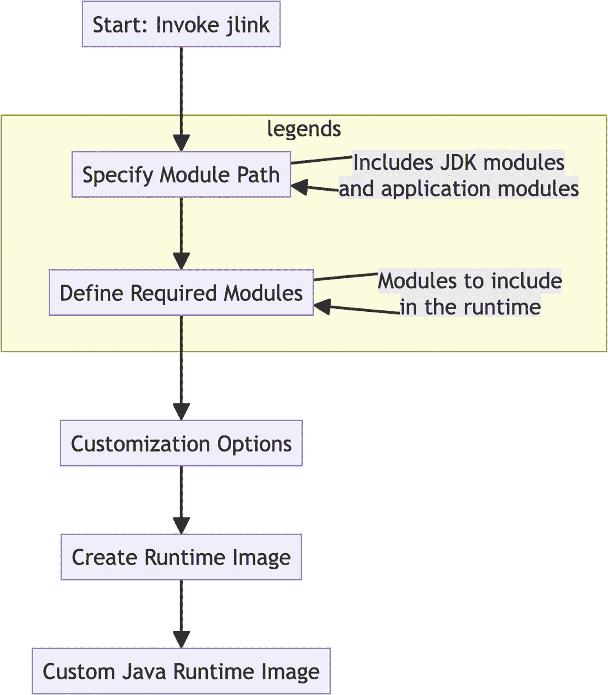

# 11. Java 开发者的 Docker 最佳实践

掌握适用于 Java 应用程序的 Docker 最佳实践和策略

Docker 已成为现代 Java 开发中不可或缺的一部分，它提供了一致、可移植且高效的方式来打包和部署应用程序。对于 Java 开发者来说，掌握 Docker 的最佳实践对于创建优化、安全且可用于生产的容器化应用程序至关重要。本章展示了如何有效地将 Docker 与 Java 应用程序结合使用，详细介绍了在影响容器性能、安全性和效率的重要领域中的技术和策略。

本章讨论的实践解决了 Java 开发者在容器化其应用程序时面临的常见挑战，从管理构建流程和运行时环境，到优化资源使用和确保安全性。这些源自实际经验和行业标准的最佳实践，为开发既健壮又易于维护的容器化 Java 应用程序奠定了坚实的基础。

## 实施多阶段构建

Docker 中的多阶段构建是一项强大的技术，它允许开发者通过在一个 `Dockerfile` 中使用多个阶段（每个阶段都有自己的基础镜像）来创建精简且安全的镜像。我们可以显著减小最终镜像的大小并最大限度地减少其攻击面，使其更加安全。

### 理解多阶段构建

**分离构建阶段：** 一个多阶段 Dockerfile 被划分为多个部分，每个部分都以一个 `FROM` 语句开始。这些部分被称为阶段。我们可以根据需要设置任意数量的阶段，并且每个阶段可以使用不同的基础镜像。

**分层构建：** 每个阶段都基于前一阶段的层进行构建。这意味着我们可以在较早的阶段中使用包含所有构建依赖项的基础镜像来编译或构建我们的应用程序，然后仅将所需的工件复制到使用更精简基础镜像的后续阶段中。

**阶段间工件传输：** 我们可以使用 `COPY --from=<stage>` 命令将工件从一个阶段复制到另一个阶段。这通常用于将编译后的应用程序从构建阶段移动到更小的运行时阶段。

**丢弃中间层：** 一旦最终镜像构建完成，先前阶段中创建的所有中间层都将被丢弃。这会产生一个小得多的最终镜像，其中仅包含运行应用程序所需的内容。

**减小镜像大小和安全风险：** 在初始阶段编译和构建应用程序，并仅将必要的工件复制到最终阶段，可以最大限度地减小最终镜像的大小。更小的镜像包含更少的组件，这意味着潜在漏洞更少，攻击面也更小。

### 创建一个基本的多阶段构建 Dockerfile

**从构建阶段开始：** 使用基础镜像 `maven:3.6.3-jdk-11` 或其他适合你 Java 项目的镜像。添加源代码和任何必需的构建工具。

**编译 Java 代码：** 执行构建命令（例如 `mvn clean package`）来编译 Java 应用程序。

**设置运行时阶段：** 为运行时使用更精简的基础镜像 `openjdk:11-jre-slim`。从构建阶段复制编译好的 JAR 文件或类。

**将编译后的代码复制到运行时阶段：** 使用 `COPY --from=build_stage /path/to/compiled/artifact /path/in/runtime/image` 命令复制必要的文件。


### 最佳实践

**关于组织阶段的提示：** 为每个阶段命名以便清晰识别（例如，`FROM maven:3.6.3-jdk-11 as builder`）。保持构建阶段简洁，仅关注编译代码所必需的内容。

**最小化层数与缓存利用：** 尽可能合并命令以减少层数。通过将命令按变更可能性从低到高排序，充分利用 Docker 的构建缓存。

### 示例

**阶段 1：构建**：使用 Maven 镜像，添加源代码，并运行 `mvn package`。

**阶段 2：运行时**：使用 JRE 镜像，从构建阶段复制 JAR 文件。

**Dockerfile 结构**：

```
# 构建阶段
FROM maven:3.6.3-jdk-11 as builder
WORKDIR /app
COPY . .
RUN mvn clean package
# 运行时阶段
FROM openjdk:11-jre-slim
COPY --from=builder /app/target/myapp.jar /usr/local/lib/myapp.jar
ENTRYPOINT ["java","-jar","/usr/local/lib/myapp.jar"]
```

多阶段构建对于为 Java 应用构建轻量且安全的 Docker 镜像至关重要。将构建环境与运行环境分离，可以大幅减小最终镜像的体积，并最大程度地减少因镜像臃肿而带来的安全漏洞。这是任何严肃的 Java 开发者在使用 Docker 时都应掌握的重要技术。

## 使用 Java Jlink 创建更精简的容器镜像

`jlink` 是 Java 9 中作为 Java 平台模块系统的一部分引入的工具，它允许用户创建仅包含特定应用所需模块的自定义 Java 运行时镜像。通过定制运行时环境，用户可以享受到多种重要优势，尤其是在容器等受限环境中的部署场景。

### jlink 的主要特性与优势

*   **自定义运行时镜像**：你可以为应用构建一个更小、更优化的 Java 运行时，仅包含必要的模块，从而显著减小运行时体积，远小于标准 Java 运行时环境。

*   **性能优化**：应用启动速度更快，系统资源占用更少；这在云环境和微服务架构中非常有价值。

*   **增强的安全性**：通过仅包含必需的模块，减少了安全漏洞的攻击面。模块越少，潜在的攻击点就越少。

*   **模块化**：`jlink` 与 Java 9 引入的模块系统协同工作。该系统允许 Java 应用实现更好的封装和更有组织的依赖管理。

### 了解 jlink

*   **模块识别**：`jlink` 基于模块工作。首先确定你的应用需要哪些模块。可以使用 `jdeps` 等工具分析依赖关系。

*   **创建自定义运行时**：确定所需模块后，使用 `jlink` 命令将这些模块包含进来，创建一个运行时镜像。这是一个自包含的应用运行环境，无需额外安装 Java 即可运行。

*   **命令行使用**：`jlink` 通过命令行使用，你需要指定要包含的模块以及其他选项，例如压缩级别或输出目录。

以下命令创建一个自定义 Java 运行时镜像，其中仅包含指定的 Java 平台模块和我们自己的模块，这对于为 Java 应用创建小巧高效的运行时环境非常理想。

```
jlink --module-path $JAVA_HOME/jmods:path/to/your/modules --add-modules com.example.yourmodule --output path/to/output/directory
```

在此命令中：

*   `--module-path:` 此选项指定模块路径。模块路径是一个目录列表，`jlink` 会在此路径中搜索模块定义。在此命令中，`$JAVA_HOME/jmods` 是 Java 主目录中 `jmods` 目录的路径。`jmods` 目录包含 Java 平台模块的定义。而 `path/to/your/modules` 路径应替换为你希望包含在运行时镜像中、但非标准 Java 发行版一部分的任何额外模块的路径。

*   `--add-modules:` 此选项指定要添加到自定义运行时镜像中的模块。在此例中，`com.example.yourmodule` 是我们要包含的模块名称。你需要将 `com.example.yourmodule` 替换为你实际拥有的模块名称。

*   `--output:` 此选项指定创建自定义运行时镜像的输出目录路径。你需要将 `path/to/output/directory` 替换为你希望保存运行时镜像的路径。

下图展示了 `jlink` 过程中的关键步骤。



流程图展示了使用 jlink 创建自定义 Java 运行时镜像的过程。步骤包括：“开始：调用 jlink”，“指定模块路径”（附注：包含 JDK 和应用模块），“定义所需模块”（附注：要包含在运行时中的模块），“自定义选项”，“创建运行时镜像”，最后是“自定义 Java 运行时镜像”。图表包含解释模块路径和所需模块的图例。

图 11-1

jlink Java 运行时镜像创建流程

### jlink 的使用场景

*   **容器化应用**：特别适用于 Docker 和其他容器平台，在这些平台上，镜像大小会显著影响性能和资源使用。

*   **创建最小运行时环境**：对于仅需要 Java 平台模块子集的应用，可以创建比标准运行时小得多的运行时。这对于微服务、无服务器函数或任何需要小体积的应用非常有用。

*   **物联网与嵌入式系统**：适用于资源受限的环境，如物联网设备或嵌入式系统。

*   **安全性**：通过仅包含必要的模块，jlink 减少了安全漏洞的攻击面。应用不易受到针对其未包含模块的攻击。

*   **更快的启动时间**：更小的运行时有助于加快应用启动速度，这对于桌面应用和需要快速启动的工具尤其有利。

### 分步指南

在 Dockerfile 中使用 Jlink

*   **识别必要模块：** 确定你的应用所需的模块。

*   **创建 Jlink 脚本：** 在 Dockerfile 中集成一个脚本，用于使用已识别的模块执行 Jlink。

*   **组装运行时镜像：** 使用 Jlink 创建自定义运行时。

选择必要的 Java 模块

*   使用 `jdeps` 等工具分析应用的模块依赖关系。

*   在运行时镜像的 Jlink 命令中包含这些模块。

### 最佳实践

*   **最小化模块集：** 仅包含必要的模块。

*   **压缩镜像：** 使用 Jlink 的压缩选项进一步减小体积。

*   **分层 Docker 镜像：** 合理组织 Dockerfile 的结构，以有效利用 Docker 层缓存。


### 示例

*   **场景**：一个使用 HTTP 和 JSON 处理的简单 Java 应用程序。

*   **Dockerfile 设置**：
    *   从 JDK 镜像开始，编译应用程序并运行 Jlink。
    *   使用 Jlink 创建一个仅包含所需模块（`java.base`、`java.net.http`、`java.json`）的自定义运行时。
    *   使用最小基础镜像构建最终镜像，复制自定义运行时和应用程序 JAR 文件。

*   **示例 Dockerfile**：

```
# 编译阶段
FROM openjdk:11 as build
WORKDIR /app
COPY . .
RUN javac -d out --module-path lib --module-source-path src $(find src -name "*.java")
RUN jlink --add-modules java.base,java.net.http,java.json --output jre
# 最终阶段
FROM alpine:latest
COPY --from=build /app/jre /opt/jre
COPY --from=build /app/out /app
ENTRYPOINT ["/opt/jre/bin/java", "-m", "com.myapp/com.myapp.Main"]
```

Jlink 显著改变了将 Java 应用程序容器化的方式，使得创建更精简、更高效的容器镜像成为可能。对于 Java 开发者来说，它是一个强大的工具，尤其是在镜像大小和安全性至关重要的 Docker 环境中。掌握 Jlink 能让开发者为其现代云环境优化 Java 应用程序。

## 使用无发行版基础镜像

基础镜像在定义容器化应用程序的安全性、效率和大小方面至关重要。来自 Google 的无发行版镜像已广受欢迎，Java 开发者尤其广泛采用。

### 理解无发行版镜像

无发行版镜像是极简的容器镜像，仅包含应用程序及其运行时依赖项。它们不包含标准操作系统发行版中常见的包管理器、Shell 或其他二进制文件。对于 Java 应用程序，无发行版镜像通常只包含一个 JVM 和应用程序的 JAR 文件，仅此而已。

### 创建无发行版 Java 镜像

**编写 Dockerfile**：从一个仅包含 Java 运行时环境（JRE）的基础镜像开始。

```
FROM gcr.io/distroless/java17-debian12
COPY target/myapp.jar /app.jar
CMD ["app.jar"]
```

**构建镜像**：使用 Docker 构建你的镜像。

```
$ docker build -t my-java-app .
```

**运行容器**：部署你的应用程序。

```
$ docker run -d my-java-app
```

### 无发行版镜像的优势

*   **增强的安全性**：通过移除不必要的操作系统组件，显著减少了容器的攻击面。镜像中组件越少，意味着潜在漏洞越少。
*   **更小的镜像体积**：无发行版镜像非常精简，因此体积更小；在 CI/CD 流水线中拉取和推送所需时间更短。相比其他镜像，它们占用更少的存储空间。更小的镜像能加速在 Kubernetes 等编排系统中的部署时间。
*   **简化与维护**：镜像中组件越少，打补丁和更新的需求就越少。为应用程序提供一个干净、最小的环境，确保在不同部署环境中的一致性。

### 最佳实践

*   **了解应用程序的依赖项**：确保镜像中包含所有运行时依赖项。
*   **调试挑战**：如果没有 Shell 或调试工具，排查运行中容器的问题可能会比较困难。考虑在开发阶段使用调试版本。
*   **保持更新**：定期更新基础镜像，以确保拥有 Java 运行时的最新安全补丁。

无发行版镜像为在容器内部署 Java 应用程序提供了一种引人注目的方法，在安全性、效率和简洁性之间取得了平衡。采用无发行版镜像意味着开发者和组织可以降低在生产环境中运行庞大、复杂容器镜像的风险，同时享受精简高效的部署流程。未来，随着容器化领域趋向极简主义，行业将更倾向于使用无发行版镜像。

### 将 JVM 参数和资源限制应用于 Docker 容器

在 Docker 容器中运行 Java 应用程序时，优化 JVM 设置和容器资源限制非常重要。优化的配置能确保资源有效利用，从而提升应用程序性能，避免出现内存溢出错误等常见问题。

### JVM 参数和资源限制的重要性

**JVM 参数**：自定义 JVM 的行为以满足特定需求，例如垃圾回收策略、堆大小和其他性能相关设置。
**Docker 中的资源限制**：定义容器可以使用的最大 CPU 和内存资源，防止任何应用程序耗尽宿主系统的资源。
**设置内存限制**：使用 Docker 的 `-m` 或 `--memory` 标志来设置内存限制。
示例：`docker run -m 512m my-java-app` 将容器的内存上限设为 512 MB。
**设置 CPU 限制**：使用 `--cpus` 限制容器可以使用的 CPU 核心数。
示例：`docker run --cpus=2 my-java-app` 将应用程序限制为使用 2 个 CPU 核心。

### 在 Docker 中传递 JVM 参数

使用 `JAVA_OPTS` 环境变量，或在 Dockerfile 的 `CMD` 或 `ENTRYPOINT` 中直接传递参数。

```
docker run -e "JAVA_OPTS=-Xmx256m -Xms256m" my-java-app
```

或者，我们也可以将其包含在 Dockerfile 中。

```
ENTRYPOINT ["java", "-Xmx256m", "-Xms256m", "-jar", "myapp.jar"]
```

### 平衡资源以获得最佳性能

*   **了解应用程序需求**：对你的应用程序进行性能分析，以了解其资源使用模式。
*   **避免过度分配**：不要分配超出必要的资源，因为这可能会使其他容器或进程资源匮乏。
*   **监控与调整**：持续监控性能并根据需要调整设置。

## 为效率配置 Java 应用程序

考虑一个在 Docker 容器中运行的 Java Web 应用程序场景。为了让我们的 Web 应用程序获得最佳性能，需要注意什么？根据当前的应用程序负载，我们只需要 700 MB 内存和一个 CPU 核心。

在 Dockerfile 内部，我们可以将内存限制设置为 1 GB，CPU 限制设置为 1 个核心。即使应用程序需要大约 700 MB 的内存，我们也应该保留一些缓冲，以防使用量出现峰值。

我们还应该为垃圾回收和堆设置配置 JVM 参数。

```
$docker build -t my-java-app .
$docker run -m 1g --cpus=1 -e "JAVA_OPTS=-Xmx700m -Xms700m -XX:+UseG1GC" my-java-app
```

在 Docker 中调整 JVM 设置和设置资源限制，对于在容器化环境中高效、可靠地运行 Java 应用程序至关重要。这些配置有助于管理应用程序性能，确保资源的最佳利用，并维护应用程序和宿主系统的稳定性。根据应用程序行为进行定期监控和调整，对于实现最佳性能至关重要。

## 保护 Docker 镜像安全

在容器化领域，Docker 镜像安全至关重要。随着 Docker 在应用程序部署中的广泛采用，确保 Docker 镜像的安全对于防范攻击者可利用的漏洞至关重要。

### 常见安全漏洞

尽管 Docker 功能多样，但如果管理不当，也容易受到攻击。这可能会为攻击者或黑客提供入口点。

常见漏洞包括：

*   **过时的软件和库**：包含过时操作系统、库或框架的镜像容易受到已知漏洞的攻击。
*   **不安全的配置**：配置错误的 Dockerfile 或容器设置可能会使容器面临风险。
*   **嵌入的密钥**：硬编码在镜像中的密钥可能导致未授权访问。
*   **不必要的包**：在镜像中添加未使用的软件会增加攻击面。


### 扫描漏洞

*   **选择扫描工具**：可使用 Clair、Trivy、Synk 或 Docker 的扫描功能等工具。

*   **将扫描集成到 CI/CD 流水线中**：在镜像构建或部署过程中自动化扫描流程。

*   **审查并处理发现结果**：分析扫描器生成的报告，并处理已识别的漏洞。

### 最佳实践

*   **持续监控**：定期扫描镜像中的漏洞，即使在部署之后也应如此。

*   **依赖项管理**：跟踪 Docker 镜像中使用的依赖项，并定期更新它们。

*   **最小化攻击面**：使用最小化的基础镜像，并避免安装不必要的软件包。

*   **非 root 用户**：以非 root 用户身份运行容器，以降低容器逃逸攻击的风险。

*   **.dockerignore 文件**：使用 `.dockerignore` 文件从构建上下文中排除不必要的文件和目录，以防止敏感信息泄露。

*   **私有仓库与签名镜像**：将镜像存储在具有强访问控制的受信任私有容器仓库中。使用 Docker Content Trust 等功能对镜像进行签名，并验证其完整性和来源。

*   **实施最小权限原则**：确保 Docker 镜像中的文件和可执行文件仅拥有运行应用程序所需的最小权限。在可能的情况下，在容器中使用只读文件系统以防止不必要的更改。

*   **保护应用程序密钥**：切勿在 Docker 镜像中对密码或 API 密钥等敏感信息进行硬编码。要管理敏感信息，请使用 Docker Secrets、HashiCorp Vault 等密钥管理工具，或在运行时注入的环境变量。

*   **保持主机系统安全**：确保 Docker 守护进程配置安全。保持主机系统安全，因为主机中的漏洞可能会影响所有容器。

保护 Docker 镜像安全是一个持续的过程，需要持续的维护、警惕和最佳实践。通过及时了解漏洞、维护最新镜像以及最小化攻击面，您可以显著增强 Docker 部署的安全性。将安全实践集成到开发和部署流水线中，是确保构建健壮且安全的容器化应用程序的方法。

## 选择 Maven 与 JDK 与 JRE 基础镜像

在 Docker 生态系统中，选择基础镜像对于构建高效且有效的 Java 应用程序至关重要。Maven、JDK 和 JRE 镜像各有不同的用途。理解它们的差异和用例对于优化 Docker 镜像构建至关重要。

Maven、JDK 和 JRE 镜像之间的区别

*   **Maven 镜像**：包含 Maven 构建工具，通常还包含 JDK。最适合从源代码构建 Java 应用程序。

*   **JDK（Java 开发工具包）镜像**：包含 Java 运行时环境（JRE）、编译器和用于构建基于 Java 的应用程序的工具。编译 Java 代码时需要。

*   **JRE（Java 运行时环境）镜像**：执行 Java 应用程序所需的运行时环境。它不包含 JDK 中的工具和编译器。

## 优缺点

| 镜像类型 | 优点 | 缺点 | 使用场景 |
| --- | --- | --- | --- |
| Maven 镜像 | 对于使用 Maven 作为构建工具的应用程序来说，构建方便<br>- 通常包含 JDK | 比 JDK 或 JRE 镜像更大，因为它包含了额外的构建工具 | 在开发期间或 CI/CD 流水线中构建 Java 应用程序 |
| JDK 镜像 | 编译 Java 代码所必需，包含开发所需的工具 | 与 JRE 镜像相比体积更大 | 应用程序开发以及任何需要编译 Java 代码的场景 |
| JRE 镜像 | 体积更小，专注于运行时，非常适合运行 Java 应用程序 | 不能用于编译 Java 代码或任何与开发相关的任务 | 在生产环境或任何不需要代码编译的环境中运行 Java 应用程序 |

### 最佳实践

*   **分析您的需求**：确定您的应用程序是需要编译还是仅需运行。

*   **考虑环境**：在开发和 CI/CD 流水线中使用 JDK 镜像，在生产环境中使用 JRE 镜像。

*   **大小与功能**：在更小的镜像大小与所需功能之间取得平衡。

### 示例

*   **Maven 镜像**：
    *   **场景**：使用 Maven 构建一个 Spring Boot 应用程序。

    *   **Dockerfile 示例**：

*   **JDK 镜像**：
    *   **场景**：编译一个 Java 应用程序。

    *   **Dockerfile 示例**：

```
FROM maven:3.6-jdk-11 AS build
COPY src /usr/src/app/src
COPY pom.xml /usr/src/app
RUN mvn -f /usr/src/app/pom.xml clean package
```

*   **JRE 镜像**：
    *   **场景**：运行一个预编译的 Java 应用程序。

    *   **Dockerfile 示例**：

```
FROM openjdk:11-jdk
COPY . /usr/src/myapp
WORKDIR /usr/src/myapp
RUN javac Main.java
```

```
FROM openjdk:11-jre-slim
COPY --from=build /usr/src/app/target/app.jar /usr/app/
ENTRYPOINT ["java", "-jar", "/usr/app/app.jar"]
```

这取决于您的 Java 应用程序在 Docker 中的需求。Maven 镜像最适合涉及 Maven 的构建场景，JDK 镜像最适合开发和编译任务，而 JRE 镜像则针对运行 Java 应用程序进行了最佳优化。理解这些选择并将其与您的应用程序需求对齐，可以确保效率、性能以及精简的开发流程。

## 总结

本章全面回顾了在当今容器化环境中对 Java 开发者至关重要的 Docker 最佳实践。本章从多阶段构建开始，这是创建精简且安全的 Docker 镜像的高级技术。通过将构建环境与运行时环境隔离，可以极大地减小最终镜像的大小，同时仍保留所有必需的功能；本章展示了如何构建 Dockerfile 以及如何在阶段之间处理工件。

接着，讨论转向使用 jlink 进行 Java 运行时优化，jlink 是 Java 9 中引入的一个强大工具。本节向开发者展示了如何创建仅包含其应用程序所需模块的自定义运行时镜像。这种有针对性的方法不仅减小了容器大小，还通过最小化潜在攻击面提高了安全性；本章提供了实际示例和在实际场景中选择模块的最佳实践。

接下来，关于无发行版基础镜像的章节涵盖了仅包含应用程序及其运行时所需依赖项的最小容器镜像。这对于通过移除不必要的组件来提高安全性和效率非常有价值，从而产生更小、更安全、更易于维护和部署的容器。

然后，本章详细介绍了 JVM 参数和资源管理，深入探讨了内存使用、CPU 分配和垃圾回收设置的优化。广泛的覆盖范围帮助开发者了解如何平衡资源分配以实现最佳性能，以及容器化 Java 应用程序中的常见陷阱。所提供的指导确保应用程序在其容器化环境中高效运行，同时保持稳定性和可靠性。

最后，本章将通过全面审视 Docker 镜像安全最佳实践来总结安全注意事项，包括漏洞扫描和安全配置管理、实施最小权限原则、持续监控以及在应用程序生命周期内定期更新容器化环境。这些实践相结合，提供了一种完整的 Java 应用程序容器化方法，使开发团队能够创建高效、安全且可维护的解决方案，同时避免在 Docker 实施中常见的陷阱。


索引 A 抽象 addEmployee 方法 add-modules 敏捷性 提前编译（AOT） Alpine Linux 镜像 Amazon ECS application-test.properties 文件 自动配置 Azure Kubernetes 服务（AKS） B 桥接驱动 Buildah 构建镜像 特性 Podman 与 一次构建，随处运行（BORA） C 集中式仓库 Clair 清理容器 客户端-服务器架构 云计算 云原生构建包（CNBs） 自动配置 配置 特性 spring-boot-starter-data-jpa 顶级 OCI 协作 命令行界面（CLI） 通信 约束 容器化 容器化 容器 敏捷性 类比 黑盒 云平台 通信 复制数据 数字构建块 Docker Docker 定义 Docker 的交互模式 历史 初始化 隔离 Java 管理 操作系统 物理机 可移植性 资源利用率 rm 标志 扩展 设置 可视化表示 虚拟机 持续集成（CI） 持续集成/持续部署（CI/CD） 成本节约 自定义基础镜像 D 守护进程 悬空镜像 数据共享 DataSourceAutoConfiguration 基于日期的标签 调试 部署 部署时间 灾难恢复 无发行版基础镜像 无发行版镜像 优势 最佳实践 创建 Docker 架构 桥接驱动 命令 容器编排器 定义 环境特定变体 独占方法 主机驱动 Java 应用 Java 开发者 参见 Java 开发者 多阶段构建 网络命令 网络功能 none 驱动 流行度 虚拟化技术 Docker build 命令 Docker CLI Docker Compose 操作 组件 配置 安装 Java 应用 管理 多容器应用 Spring Boot Docker 容器 GitHub Actions 参见 GitHub Actions Spring Boot 应用 Docker 守护进程 Docker Desktop 应用 组件 文档 特性 图形界面 Hyper-V 安装 预构建镜像 Docker Engine Dockerfile Alpine Linux 关联文件 基础镜像 构建与标记 构建过程 命令 创建流程 自定义基础镜像 无发行版基础镜像 Eclipse Temurin 事实 探索 Java 应用 JDK *vs.* JRE 多阶段构建 官方 OpenJDK 版本 安全性 源代码 Spring Boot 应用 标记 编写 Dockerfile-Maven 插件 添加 构建 推送到仓库 Spotify Docker Hub Docker 镜像 最佳实践 常见陷阱 常见漏洞 检查 Kaniko 管理 Maven 推送与运行 运行 扫描漏洞 Docker Scout Docker Swarm Docker 卷 批量删除卷 复制到容器 创建 删除 图示 主机目录 主机文件系统 检查 挂载 所有权 文档 dotCloud E Eclipse Temurin EmployeeService 类 端到端测试 环境特定标签 环境变量 F Fabric8 Docker Maven 插件 优势 镜像构建过程 设置 FROM 命令 G Git 提交哈希 GitHub Actions 自动化工具 缓存机制 CI/CD Dockerfile 元素 特性 GCP 参见 Google Cloud Platform（GCP） Java 项目 安全与性能测试 设置 工作流 Yaml 文件 Google Cloud Platform（GCP） API 应用 GitHub 密钥 IAM 权限 密钥 工作流 工作负载身份联合 Google Container Registry（GCR） Google Jib 构建 描述 特性 镜像层 Google Kubernetes Engine（GKE） GraalVM 构建工具 图示 Native Image Spring Boot 3 H 主机驱动 主机网络 主机系统 Hykes Hyperkit Hyper-V I IMAGE ID 命令 镜像标签 镜像标记 优势 策略 Img 构建与推送 Docker 镜像 特性 集成测试 互操作性 隔离 J JAR 文件 包 Java 开发者 Java 开发工具包（JDK） Java 平台模块系统 Java 运行时环境（JRE） Java 虚拟机（JVM） Java Web 应用 Jib 参见 Google Jib Jlink 最佳实践 命令 命令行使用 容器化 示例 特性 识别 Java 运行时镜像 运行时创建 分步指南 使用场景 JpaRepositoriesAutoConfiguration 即时编译器（JIT） JVM 参数在 Docker 中 内存限制 最佳性能 资源限制 K Kaniko 构建与推送 挑战 执行器镜像 特性 Kubernetes L 最新标签 层缓存 Lego Linux 容器 M Macvlan 驱动 Maven Maven 镜像 Maven Jib 插件 微服务 module-path 挂载 多云部署 多主机通信 多个基础镜像 多语言 多阶段构建 产物 最佳实践 Dockerfile 镜像大小 JRE 镜像 分层 Maven 镜像 安全足迹 安全漏洞 N Native Image 优势 Docker 与 缺点 解释 Java 与 JIT *vs.* AOT 编译器 JVM *vs.* GraalVM 网络 Nginx O Open Container Initiative（OCI） 编排 顺序重要 过期标签 Overlay 驱动 P 持久化 平台即服务市场 Pod 概念 Podman 二进制文件 下载 仪表盘 Desktop .dmg 文件 引擎 特性 安装 机器 开源软件 设置 设置 可移植性 端口映射 PostgreSQL 私有仓库 Q 质量保证 Quarkus 代码生成 容器镜像 部署流程 下载 扩展 特性 Java 框架与 Kubernetes Maven/Gradle 项目 入门 项目设置 简化依赖 用户友好 R REST API 回滚 S 可扩展性 扩展 安全性 Dockerfile 漏洞 安全问题 自包含实体 自包含性 语义化版本 大小优化 Solomon Hykes Spotify Spring Boot 注解 依赖 设置 系统 Testcontainers Spring Boot 3 Spring Boot 应用 构建容器镜像 容器化 容器化应用 容器化 Docker 容器 效率 GraaIVM Maven 项目 Native Image 运行项目 Spring Boot 构建包 启动容器 系统特定原生代码 T 标签 Testcontainers 特性 集成测试库 标志 服务 软件开发 Spring Boot 测试 玩具盒 单元测试 Trivy U 单元测试 用户自定义网络 V 多功能性 版本管理 版本 虚拟化技术 虚拟机（VM） *vs.* 容器 *vs.* Docker 网络 操作系统 进程 VMware W, X, Y, Z 工作流 Yaml 文件 一次编写，随处运行（WORA）
