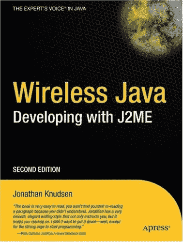

|  |  |

| 使用 J2ME 进行无线 Java 开发，第二版 |
| 作者：Jonathan Knudsen | ISBN:1590590775 |
| Apress 出版社 © 2003 (384 页) |
| 本版已更新，涵盖了移动 Java 设备下一代程序的内容。MIDP 2.0 包含许多令人兴奋的新特性，例如声音 HTTPS 支持、大量用户界面 API 增强、游戏 API 等等。 |
|  |

|
|  |

| 目录 |
|  | 使用 J2ME 进行无线 Java 开发，第二版 |
|  | 前言 |
|  | 第 1 章 | - | 简介 |
|  | 第 2 章 | - | 构建 MIDlet |
|  | 第 3 章 | - | 关于 MIDlet 的一切 |
|  | 第 4 章 | - | 几乎相同的老一套 |
|  | 第 5 章 | - | 创建用户界面 |
|  | 第 6 章 | - | 列表和表单 |
|  | 第 7 章 | - | 自定义项 |
|  | 第 8 章 | - | 持久化存储 |
|  | 第 9 章 | - | 连接世界 |
|  | 第 10 章 | - | 编程自定义用户界面 |
|  | 第 11 章 | - | 游戏 API |
|  | 第 12 章 | - | 声音与音乐 |
|  | 第 13 章 | - | 性能调优 |
|  | 第 14 章 | - | 解析 XML |
|  | 第 15 章 | - | 保护网络数据 |
|  | 附录 A | - | MIDP API 参考 |
|  | 索引 |
|  | 插图列表 |
|  | 表格列表 |
|  | 代码清单列表 |
|  | 边栏列表 |

封底

| 尽管 Java 非常流行，但标准版 Java 对于构建 PDA 和手机等无线设备的应用程序来说过于庞大和臃肿。因此，Sun 发布了 Java 2 平台微型版 (J2ME)。J2ME 有潜力在无线领域引发革命，正如 Java 在服务器领域所做到的那样。《无线 Java：使用 J2ME 进行开发，第二版》已更新，涵盖了移动 Java 设备下一代程序的内容。MIDP 2.0 包含许多令人兴奋的新特性，例如声音 HTTPS 支持、大量用户界面 API 增强、游戏 API 等等。此外，作者 Jonathan Knudsen 明确指出了哪些内容是新增的，因此读者仍然可以将本书用于 MIDP 1.0/CLDC 1.0。**关于作者**Jonathan Knudsen 是一位 Java 开发者，也是多本知名书籍的作者，包括《无线 Java：使用 Java 2 微型版进行开发》、《移动 Java》、《LEGO MINDSTORMS 机器人非官方指南》、《学习 Java》和《Java 2D 图形》。Jonathan 在 NeXT 操作系统上使用 Objective-C 开始了他的面向对象编程生涯，随后在微软的 Visual C++ 中经历了几年炼狱般的时光，最终于 1996 年转向 Java。他撰写了大量关于 Java 和 LEGO 机器人的文章，包括五本书、一个名为“Bite-Size Java”的月度在线专栏，以及为 JavaWorld、EXE、NZZ Folio 和 O'Reilly Network 撰写的文章。Jonathan 拥有普林斯顿大学机械工程学位。 |

