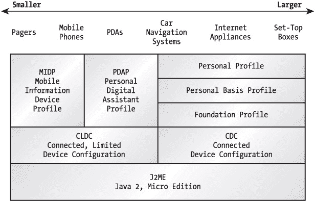
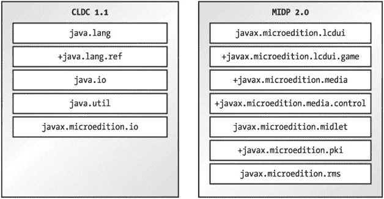
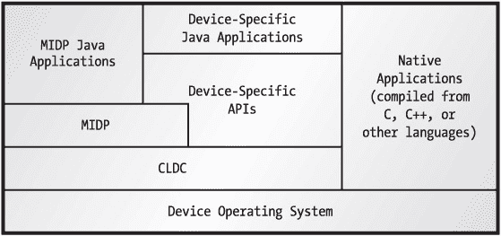

# 第 1 章：引言

Java™ 2 平台微型版（J2ME）是 Java 短暂历史中的第二次革命。当 Java 于 1995 年问世时，计算的未来似乎在于*小程序*——那些可以按需下载并运行的小型程序。缓慢的互联网迫使小程序退出了主流。作为一个平台，Java 直到*服务器端小程序*（运行在服务器上的 Java 程序，本质上是 CGI 的替代品）出现后才真正起飞。Java 进一步扩展到服务器端领域，最终获得了 Java 2 平台企业版（J2EE）的称号。这是第一次革命，即服务器端 Java 的闪电战。

第二次革命是小型设备 Java 的爆发，而这正在发生。小型设备市场正在迅速扩张，Java 之所以重要有两个原因。首先，开发者可以编写代码，并使其无需修改即可在数十种小型平台上运行。其次，Java 对于可下载代码具有重要的安全特性。

## 理解 J2ME

J2ME 并非一个具体的软件或规范，它仅指用于小型设备的 Java。小型设备的范围从寻呼机、手机和个人数字助理（PDA），一直到接近台式电脑的机顶盒等设备。

J2ME 分为*配置*、*简表*和*可选 API*，它们提供了关于 API 和不同设备系列的特定信息。配置是基于内存限制和处理器能力为特定类型的设备设计的。它指定了一个可以轻松移植到支持该配置的设备上的 Java 虚拟机（JVM）。它还指定了将在该平台上使用的 Java 2 平台标准版（J2SE）API 的某个子集，以及可能需要的附加 API。

简表比配置更具体。简表基于配置，并添加了用于用户界面、持久化存储以及开发运行应用程序所需的其他任何功能的 API。

可选 API 定义了可能包含在特定配置中的特定附加功能。在设备上实现的整个组合——配置、简表以及可选 API——被称为一个*栈*。例如，未来可能的设备栈可能是 CLDC/MIDP + 移动媒体 API。有关 JSR 185 的信息，请参阅后面关于平台标准化的章节，该章节将定义标准的 J2ME 栈。

目前，有几种配置和简表，如图 1-1 所示。

图 1-1：J2ME 世界

| **** |

**Java 社区进程

Java 社区进程（JCP）旨在确保 Java 技术根据社区共识进行开发。该进程描述如下：

[`jcp.org/introduction/overview/`](http://jcp.org/introduction/overview/)

配置和简表最初以 Java 规范请求（JSR）的形式出现。您可以在此处查看当前 JSR 的列表：

[`jcp.org/jsr/all/`](http://jcp.org/jsr/all/)

| **** |

|  |

为了让您了解 J2ME 世界的动态，表 1-1 展示了一些可用和正在开发中的配置、简表和可选 API。这不是一个完整的列表；更多信息，请访问 JCP 网站 [`jcp.org/`](http://jcp.org/)。

表 1-1：J2ME 配置、简表和可选 API

| **配置** |
| --- |
| **JSR** | **名称** | **URL** |
| --- | --- | --- |
| 30 | 连接有限设备配置（CLDC）1.0 | [`jcp.org/jsr/detail/30.jsp`](http://jcp.org/jsr/detail/30.jsp) |
| 139 | 连接有限设备配置（CLDC）1.1 | [`jcp.org/jsr/detail/139.jsp`](http://jcp.org/jsr/detail/139.jsp) |
| 36 | 连接设备配置 | [`jcp.org/jsr/detail/36.jsp`](http://jcp.org/jsr/detail/36.jsp) |

| **简表** |
| --- |
| **JSR** | **名称** | **URL** |
| --- | --- | --- |
| 37 | 移动信息设备简表 1.0 | [`jcp.org/jsr/detail/37.jsp`](http://jcp.org/jsr/detail/37.jsp) |
| 118 | 移动信息设备简表 2.0 | [`jcp.org/jsr/detail/118.jsp`](http://jcp.org/jsr/detail/118.jsp) |
| 75 | PDA 简表 1.0 | [`jcp.org/jsr/detail/75.jsp`](http://jcp.org/jsr/detail/75.jsp) |
| 46 | 基础简表 | [`jcp.org/jsr/detail/46.jsp`](http://jcp.org/jsr/detail/46.jsp) |
| 129 | 个人基础简表 | [`jcp.org/jsr/detail/129.jsp`](http://jcp.org/jsr/detail/129.jsp) |
| 62 | 个人简表 | [`jcp.org/jsr/detail/62.jsp`](http://jcp.org/jsr/detail/62.jsp) |

| **可选 API** |
| --- |
| **JSR** | **名称** | **URL** |
| --- | --- | --- |
| 66 | RMI 可选包 | [`jcp.org/jsr/detail/66.jsp`](http://jcp.org/jsr/detail/66.jsp) |
| 82 | Java 蓝牙 API | [`jcp.org/jsr/detail/82.jsp`](http://jcp.org/jsr/detail/82.jsp) |
| 120 | 无线消息 API | [`jcp.org/jsr/detail/120.jsp`](http://jcp.org/jsr/detail/120.jsp) |
| 135 | 移动媒体 API | [`jcp.org/jsr/detail/135.jsp`](http://jcp.org/jsr/detail/135.jsp) |
| 179 | J2ME 位置 API | [`jcp.org/jsr/detail/179.jsp`](http://jcp.org/jsr/detail/179.jsp) |
|  
* * *

|

## 配置

配置为特定设备系列指定了一个 JVM 和一组核心 API。目前有两种：连接设备配置（CDC）和连接有限设备配置（CLDC）。

### 连接设备配置

一个*连接设备*至少拥有 512KB 的只读存储器（ROM）、256KB 的随机存取存储器（RAM）以及某种网络连接。CDC 是为电视机顶盒、汽车导航系统和高档 PDA 等设备设计的。CDC 规定必须支持完整的 JVM（如《Java 虚拟机规范》第二版所定义）。

J2ME 的配置和简表通常根据其内存容量来描述。通常会指定 ROM 和 RAM 的最小数量。对于小型设备，从易失性和非易失性内存的角度来考虑是合理的。*非易失性内存*能够在设备开关机时保持其内容不变。ROM 是一种类型，但非易失性内存也可以是闪存或电池供电的 RAM。*易失性内存*本质上是工作空间，当设备关闭时，它不会保持其内容。

CDC 正在 Java 社区进程下开发。有关 CDC 的更多信息，请参见 [`java.sun.com/products/cdc/`](http://java.sun.com/products/cdc/)。有一个 Linux 参考实现可用。

CDC 是个人简表栈的基础。个人简表是 PersonalJava 的下一代产品，PersonalJava 是一个类似于 JDK 1.1.8 的 Java 应用程序环境。

### 连接有限设备配置

CLDC 是我们感兴趣的配置，因为它涵盖了手机、寻呼机、PDA 以及其他尺寸类似的设备。CLDC 面向的是比 CDC 更小的设备。这个名称可能有点误导性；实际上，CLDC 是为具有有限网络连接的小型设备设计的——"有限连接设备配置"或许更为准确。

CLDC 专为 Java 平台可用内存为 160KB 到 512KB 的设备而设计。如果你曾见识过 J2SE 在桌面电脑上吞噬数十兆字节内存的场景，你就会理解 J2ME 所面临的挑战。"有限连接"仅指一种间歇性且可能速度不快的网络连接。（例如，大多数移动电话的典型数据传输速率仅为 9.6Kbps。）考虑到屏幕尺寸小、内存有限以及网络连接速度慢，在 CLDC 环境下设计的应用程序应非常谨慎地使用网络连接。

CLDC 基于一个名为 KVM 的小型 JVM。其名称源于它是一个以千字节而非兆字节来衡量大小的 JVM。虽然 CLDC 是一份规范文档，但 KVM 指的是一套具体的软件。^([1]) 由于体积小，KVM 无法完成 J2SE 世界中 JVM 所能做的所有事情。

*   不能在运行时添加本地方法。所有本地功能都内置于 KVM 中。
*   KVM 仅包含标准字节码验证器的一个子集。这意味着验证类的任务被拆分给了 CLDC 设备和某种外部机制。这具有严重的安全隐患，我们稍后将讨论。

你可以在 CLDC 主页 [`java.sun.com/products/cldc/`](http://java.sun.com/products/cldc/) 找到更多信息。大多数已部署的设备实现的是 CLDC 1.0，但在撰写本文时，CLDC 1.1 已接近完成。CLDC 1.1 包含对 CLDC 1.0 的增强，包括对浮点数据类型的支持。

### 平台标准化

鉴于配置、简表以及特别是可选 API 的繁多，你如何知道典型设备上可能提供哪些 API？Sun 对此问题的答案是 JSR 185 ([`jcp.org/jsr/detail/185.jsp`](http://jcp.org/jsr/detail/185.jsp))，其标题令人印象深刻，为*无线行业 Java 技术*。该规范旨在标准化软件栈，为 J2ME 世界带来一致性。

在下一代 J2ME 中，一个名为"构建块"的概念预计将取代配置和简表。一个*构建块*只是 J2SE API 的某个子集。例如，一个构建块可能由 J2SE 的 java.io 包的一个子集创建。从概念上讲，一个构建块代表的信息块比一个配置更小。那么，简表将构建在一组构建块之上，而不是一个配置之上。

构建块的定义是一个 JSR，此处简要描述：[`jcp.org/jsr/detail/68.jsp`](http://jcp.org/jsr/detail/68.jsp)。自 2000 年 6 月创建以来，JSR 68 的进展极其缓慢。我建议你转而关注 JSR 185。

^([1])KVM 最初是 Sun 研究项目 Spotless 系统的一部分。参见 [`www.sun.com/research/spotless/`](http://www.sun.com/research/spotless/)。

## 简表

简表分层位于配置之上（将来，或许位于构建块之上），为针对特定设备系列开发应用程序添加必要的 API 和规范。

### 当前简表

在 Java 社区进程下，正在开发几种不同的简表。表 1-1（前面已展示）提供了概览。

基础简表是针对能够支持丰富网络化 J2ME 环境的设备的规范。它不支持用户界面；其他简表可以分层位于基础简表之上，以添加用户界面支持和其他功能。

分层位于基础简表之上的是个人基础简表和个人简表。CDC + 基础简表 + 个人基础简表 + 个人简表的组合被设计为 PersonalJava 应用程序运行时环境的下一代产品（参见 [`java.sun.com/products/personaljava/`](http://java.sun.com/products/personaljava/)）。因此，个人简表的具体目标是向后兼容 PersonalJava 的早期版本。

PDA 简表 (PDAP) 构建在 CLDC 之上，专为掌上设备设计，这些设备至少拥有 512KB 的 ROM 和 RAM 总和（最大 16MB）。它介于移动信息设备简表 (MIDP) 和个人简表之间。它包含一个基于 MIDlet 的应用程序模型，但使用 J2SE 抽象窗口工具包 (AWT) 的子集来实现图形用户界面。尽管 PDAP 规范已接近完成，但据我所知，还没有硬件制造商宣布将实现 PDAP。目前，J2ME 世界在低端由 MIDP 覆盖，在高端则由个人简表覆盖。

### 移动信息设备简表

本书的重点是移动信息设备简表 (MIDP)。根据规范，移动信息设备具有以下特征：

*   128KB 的非易失性内存用于 MIDP 实现
*   32KB 的易失性内存用于运行时堆
*   8KB 的非易失性内存用于持久化数据
*   至少 96 × 54 像素的屏幕
*   一定的输入能力，可通过键盘、键盘或触摸屏实现
*   双向网络连接，可能是间歇性的

试着想象一下可能是 MIDP 设备的设备：移动电话和高级寻呼机完全符合要求，但入门级 PDA 也可能符合此描述。

关于 MIDP 的更多信息，包括官方规范文档的链接，请访问 [`java.sun.com/products/midp/`](http://java.sun.com/products/midp/)。

本书涵盖 MIDP 1.0 和 MIDP 2.0。MIDP 2.0 具有众多增强功能，包括对多媒体的支持、新的游戏用户界面 API、对 HTTPS 连接的支持以及其他特性。它完全向后兼容 MIDP 1.0。我将在本书其余部分指出 MIDP 2.0 特有的功能。

## MIDP 应用程序剖析

MIDP 应用程序可用的 API 来自 CLDC 和 MIDP 中的包，如图 1-2 所示。标有 + 的包是 CLDC 1.1 和 MIDP 2.0 中新增的。

图 1-2: MIDP 包

CLDC 定义了一套核心 API，主要取自 J2SE 领域。这些包括 `java.lang` 中的基础语言类、`java.io` 中的流类以及 `java.util` 中的简单集合。CLDC 还在 `javax.microedition.io` 中指定了一个通用网络 API。

|  | 注意 | 根据 MIDP 2.0 规范，MIDP 2.0 很可能会与 CLDC 1.1 配对使用，尽管 MIDP 2.0 完全有可能在 CLDC 1.0 之上实现。MIDP 2.0 的首次实现将与 CLDC 1.0 配对，因为 MIDP 2.0 规范在 Java 社区进程中的进展比 CLDC 1.1 规范更快。 |

可选地，设备供应商也可以提供 Java API 来访问设备特定功能。因此，MIDP 设备通常能够运行几种不同类型的应用程序。图 1-3 展示了这些可能性的示意图。

图 1-3: MIDP 软件组件

每个设备都实现了某种操作系统（OS）。原生应用程序直接运行在这一层，代表了当今的现状——许多不同类型的设备，每种设备都有自己的操作系统和原生应用程序。

位于设备操作系统之上的是 CLDC（包括 KVM）和 MIDP API。MIDP 应用程序仅使用 CLDC 和 MIDP API。设备特定的 Java 应用程序也可能使用设备供应商提供的 Java API。

## MIDP 的优势

考虑到配置和简表（Profile）的多样性，为什么这本书要讲 MIDP？首先，MIDP 出现在一个关键时刻，一个像手机这样的 MIDP 设备市场正在爆炸式增长的时代。与此同时，MIDP 设备正获得足够的处理能力、内存容量和互联网连接性，使其成为分布式应用程序有吸引力的平台。MIDP 1.0 已经部署在全球数百万部手机上，而 MIDP 2.0 则对未来充满希望。

其次，当然，MIDP 是第一个准备就绪、可以投入实际应用的 J2ME 简表。如果你阅读下一章，你现在就可以编写 MIDP 应用程序了。

### 可移植性

在小型设备应用程序开发中使用 Java 而非其他工具的优势在于可移植性。你可以用 C 或 C++ 编写设备应用程序，但结果将是特定于单一平台的。使用 MIDP API 编写的应用程序可以直接移植到任何 MIDP 设备上。

如果你一直关注 Java 的发展，这听起来应该很熟悉。这正是 Sun 自 1995 年以来一直重复的“一次编写，到处运行”（WORA）口号。不幸的是，对于在 JDK 1.0 和 JDK 1.1（尤其是浏览器实现）中与跨平台问题作斗争的开发者来说，WORA 有点像四个字母的脏话。虽然 Java 2 中的跨平台能力总体上是成功的，但 WORA 仍然带有未兑现承诺的污点。

MIDP 能否提供无痛的跨平台功能？能。MIDP 实现中总会存在特定于平台的错误，但我相信 MIDP 能像宣传的那样工作，因为它比桌面 Java 小得多。更少的代码意味着移植到多个平台时更少的错误。JDK 1.0 和 JDK 1.1 的大部分跨平台不兼容问题，是由于试图将不同的窗口系统塞进 AWT 基于对等组件的架构这一噩梦造成的。MIDP 完全没有 AWT 那样的复杂性，这意味着 MIDP 应用程序极有可能从一开始就能无缝地在多个平台上运行。此外，虽然 JDK 1.0 测试套件只包含几十个测试，但 MIDP 兼容性测试套件包含数千个测试。

### 安全性

使用 Java 进行小型设备开发的第二个令人信服的理由是安全性。Java 以其安全运行像 applet 这样的下载代码的能力而闻名。这是一个完美的契合——很容易想象有吸引力的应用程序动态下载到你的手机上。

但情况并非如此美好。首先，CLDC 中使用的 KVM 只实现了部分字节码验证器，这意味着字节码验证这一重要任务的一部分是在 MIDP 设备之外执行的。

其次，CLDC 不允许应用程序自定义类加载器。这意味着任何形式的动态应用程序交付都依赖于设备特定的机制。正如你将看到的，应用程序部署在 CLDC 或 MIDP 中并没有明确定义。

MIDP 应用程序确实提供了一个重要的安全承诺：它们永远无法逃脱 KVM 的限制。这意味着，除非存在错误，否则 MIDP 应用程序永远无法写入不属于 KVM 的设备内存。MIDP 应用程序永远不会搞乱同一设备上的其他应用程序或设备操作系统本身。^([2]) 这是 MIDP 的杀手级特性。它允许制造商和运营商向世界开放应用程序开发，或多或少地免于认证和验证程序，而无需担心恶意程序员会编写导致手机崩溃的应用程序。

在 MIDP 2.0 中，MIDlet 套件可以进行加密签名，然后在设备上进行验证，这为用户执行下载的代码提供了一定的安全性。一个新的权限架构还允许用户拒绝不受信任的代码访问某些 API 功能。例如，如果你在手机上安装了一个看起来可疑的 MIDlet 套件，你可以阻止它进行网络连接。

^([2])可以想象，MIDP 应用程序可能会发起拒绝服务攻击（即，耗尽所有处理器时间或使设备操作系统陷入停滞）。人们普遍认为，对于拒绝服务攻击没有太多防御手段。J2SE 中的应用程序和 applet 也存在同样的漏洞。

## MIDP 供应商

几家大型企业已经全力支持 MIDP。快速浏览一下 MIDP 的 JSR 页面，就能发现最重要的公司。

两家亚洲公司率先为支持 Java 的手机提供网络服务。在韩国，LG TeleCom 于 2000 年中部署了一项名为 ez-i 的服务。同年晚些时候，NTT DoCoMo 部署了广受欢迎的 i-mode。为 LG TeleCom（KittyHawk）和 NTT DoCoMo（i-Appli）开发的 API 与 MIDP 类似，但都是在 MIDP 1.0 规范完成之前完成的。

在美国，摩托罗拉是第一家生产 MIDP 电话的制造商。i50sx 和 i85s 于 2001 年 4 月 2 日发布，由 Nextel 提供服务。此后，摩托罗拉通过推出少量新设备扩展了其产品线。

诺基亚也对 MIDP 做出了严肃的承诺，而制定 MIDP 规范的专家组包括一份令人印象深刻的制造商名单——爱立信、日立、诺基亚、索尼、Symbian 等等。如果你愿意，可以去阅读行业预测——未来三年将售出数不清的 MIDP 手机，等等。可以肯定的是，你的 MIDP 应用程序将拥有一个巨大的市场。有关 MIDP 设备的全面列表，请访问 [`wireless.java.sun.com/device/`](http://wireless.java.sun.com/device/)。

## 碎片化问题

平台碎片化是 MIDP 社区中一个严重的问题。许多实现 MIDP 1.0 的设备也包含设备特定的 API。这些 API 用于访问设备特定功能，或提供 MIDP 1.0 的“最小公分母”规范中未涉及的功能。当前的软件供应商，尤其是游戏开发商，有时会创建并分发同一应用的多个版本，每个版本都针对特定平台量身定制。这显然是一个问题：最初使用 MIDP 的部分意义就在于能够编写一套代码并在多个平台上部署。

我不会假装知道这场“戏剧”将如何收场。我相信 MIDP 2.0 解决了 MIDP 1.0 的许多（甚至可能是全部）缺陷。它的时机很好，因此 MIDP 2.0 设备的采用和部署可能会为无线开发提供一个标准、统一的平台。

另一个碎片化问题在于，将配置、简表和可选 API 组合成软件栈时存在混乱。作为开发者，你希望确切了解哪些 API 可用或可能可用，但似乎有太多的选择和可能性。JSR 185（[`jcp.org/jsr/detail/185.jsp`](http://jcp.org/jsr/detail/185.jsp)）旨在为这一问题带来清晰度。

## 总结

J2ME 是面向小型设备的 Java 平台，这是一个涵盖几乎所有比面包盒还小的设备的广阔领域。由于 J2ME 横跨如此多样化的硬件，它被划分为配置、简表和可选 API。配置规定了 J2SE 功能的一个子集以及 JVM 的行为，而简表通常更具体地针对具有相似特性的设备系列。可选 API 以灵活的包形式提供附加功能。移动信息设备简表（本书的重点）包含了面向手机和双向寻呼机等设备的 API。

