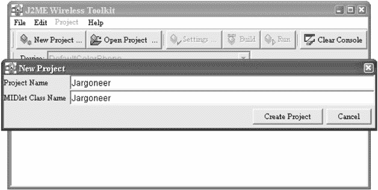
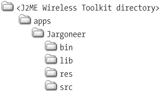
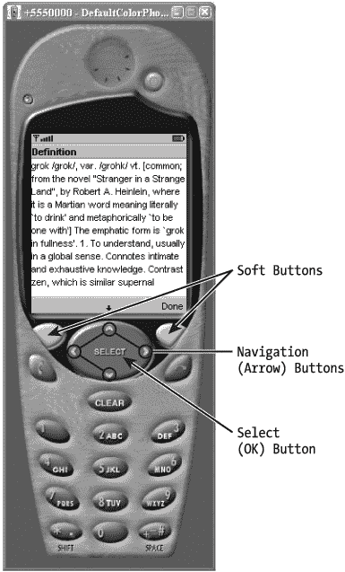
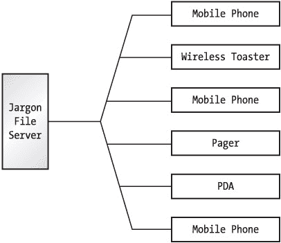
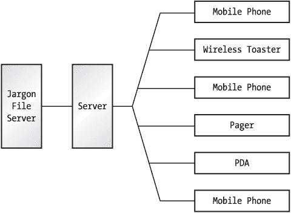

# 第 2 章：构建 MIDlet

## 概述

MIDP 应用被别致地称为 MIDlet，这是延续了由 *applet* 和 *servlet* 开始的命名主题。对于有一定经验的 Java 程序员来说，编写 MIDlet 相对容易。毕竟，编程语言仍然是 Java。此外，来自 java.lang 和 java.io 的许多基础 API 在 MIDP 中与在 J2SE 中基本相同。学习新的 API（位于 javax.microedition 层次结构中）并不十分困难，正如你将在本书后续内容中看到的那样。

然而，实际的开发过程对于 MIDlet 来说比 J2SE 应用要稍微复杂一些。除了基本的编译和运行周期外，MIDlet 还需要一些额外的调整和打包。完整的构建周期如下所示：

编辑源代码 > 编译 > 预校验 > 打包 > 测试或部署

为了展示工作原理，并让你初步体验 MIDlet 开发，本章专门用于构建和运行一个简单的 MIDlet。在后续章节中，我们将深入探讨 MIDP API 的细节。在本章中，你将了解 MIDlet 开发的整体概况。

## 工具准备

MIDlet 是在常规桌面计算机上开发的，尽管 MIDlet 本身是为在小型设备上运行而设计的。要开发 MIDlet，你需要某种开发工具包，无论是来自 Sun 还是其他供应商。请记住，MIDP 只是一个规范；供应商可以自由开发自己的实现。

如果你知道去哪里找，世界上充满了 MIDlet 开发工具。此外，其中许多工具是免费提供的。

最基本的工具集是 Sun 的 MIDP 参考实现。这包括预校验工具（稍后会详细介绍）、MIDP 设备模拟器、源代码和文档。你可以通过 [`java.sun.com/products/midp/`](http://java.sun.com/products/midp/) 上的链接下载 MIDP 参考实现。但是，我不建议使用参考实现，除非你真的很喜欢处理构建和打包 MIDlet 的繁琐细节。（如果你有兴趣将 MIDP 运行时移植到新设备或平台，也应该研究一下参考实现。）

对于初学者来说，一个更好的工具是 Sun 的 J2ME Wireless Toolkit，可从 [`java.sun.com/products/j2mewtoolkit/`](http://java.sun.com/products/j2mewtoolkit/) 获取。J2ME Wireless Toolkit（或亲切地称为 J2MEWTK）包含一个 GUI 工具，可以自动处理构建和打包 MIDlet 的一些繁琐细节，提供从源代码到运行 MIDlet 的简单路径。同时，J2ME Wireless Toolkit 是一个相对轻量级的解决方案，几乎是一个微型 IDE，不会让你的机器不堪重负。

更大的 IDE 也大量存在，来自设备制造商、无线运营商和 IDE 供应商，包括以下这些：

*   Borland JBuilder MobileSet：[`www.borland.com/jbuilder/mobileset/`](http://www.borland.com/jbuilder/mobileset/)
*   IBM WebSphere Studio Device Developer：[`www-3.ibm.com/software/pervasive/products/wsdd/`](http://www-3.ibm.com/software/pervasive/products/wsdd/)
*   Metrowerks CodeWarrior Wireless Studio：[`www.metrowerks.com/MW/Develop/Wireless/Wireless_Studio/default.htm`](http://www.metrowerks.com/MW/Develop/Wireless/Wireless_Studio/default.htm)
*   Research In Motion BlackBerry Java Development Environment：[`www.blackberry.net/developers/na/java/start/download.shtml`](http://www.blackberry.net/developers/na/java/start/download.shtml)
*   Sun ONE Studio, Mobile Edition：[`wwws.sun.com/software/sundev/jde/features/me-features.html`](http://wwws.sun.com/software/sundev/jde/features/me-features.html)
*   Zucotto Wireless WHITEboard SDK：[`www.zucotto.com/products/wb/whiteboard.html`](http://www.zucotto.com/products/wb/whiteboard.html)

你可以使用任何你想要的开发工具包。我建议你从 J2ME Wireless Toolkit 开始，它易于使用且具有权威性。在本书的其余部分，我将使用 J2ME Wireless Toolkit。其他开发环境通常也会将 J2ME Wireless Toolkit 作为插件使用，因此无论你使用什么工具，你的体验可能都相似。在本章中，你会最明显地感受到开发环境的细节，我将详细介绍构建工具和模拟器。在本书的大部分后续内容中，我将描述 MIDP API，因此你使用哪个开发工具包实际上并不重要。


## 创建源代码

编写 Java 源代码的方式一如既往：使用你喜欢的文本编辑器创建一个扩展名为 *.java* 的源文件。我们将构建并运行的示例是 Jargoneer，这是一个用于在 Jargon 文件中查找单词的 MIDlet。Jargon 文件是一本全面的黑客俚语词典（更多信息请访问 [`www.tuxedo.org/~esr/jargon/`](http://www.tuxedo.org/~esr/jargon/)）。

当你在 Jargoneer 中输入一个单词时，它会连接到一个服务器来查找定义。运行这个 MIDlet 可以让你在黑客朋友面前显得很酷。当有人使用一个不熟悉的词，比如 "cruft" 或 "grok" 时，你可以偷偷地把这个词输入你的手机，几秒钟后就能看到定义。

Jargoneer 的源代码在清单 2-1 中提供。如果你不想手动输入，可以从 [`www.apress.com`](http://www.apress.com) 的下载页面下载本书中的所有代码示例。

清单 2-1：*Jargoneer* 的源代码

| **** |

```
import java.io.*;

import javax.microedition.io.*;
import javax.microedition.midlet.*;
import javax.microedition.lcdui.*;

public class Jargoneer extends MIDlet
    implements CommandListener, Runnable {
  private Display mDisplay;

private Command mExitCommand, mFindCommand, mCancelCommand;

private TextBox mSubmitBox;
  private Form mProgressForm;
  private StringItem mProgressString;

public Jargoneer() {
    mExitCommand = new Command("Exit", Command.EXIT, 0);
    mFindCommand = new Command("Find", Command.SCREEN, 0);
    mCancelCommand = new Command("Cancel", Command.CANCEL, 0);

mSubmitBox = new TextBox("Jargoneer", "", 32, 0);
    mSubmitBox.addCommand(mExitCommand);
    mSubmitBox.addCommand(mFindCommand);
    mSubmitBox.setCommandListener(this);
    mProgressForm = new Form("Lookup progress");
    mProgressString = new StringItem(null, null);
    mProgressForm.append(mProgressString);
  }

public void startApp() {
    mDisplay = Display.getDisplay(this);

mDisplay.setCurrent(mSubmitBox);
  }

public void pauseApp() {}

public void destroyApp(boolean unconditional) {}

public void commandAction(Command c, Displayable s) {
    if (c == mExitCommand) {
      destroyApp(false);
      notifyDestroyed();
    }
    else if (c == mFindCommand) {
      // Show the progress form.
      mDisplay.setCurrent(mProgressForm);
      // Kick off the thread to do the query.
      Thread t = new Thread(this);
      t.start();
    }
  }

public void run() {
    String word = mSubmitBox.getString();
    String definition;

try { definition = lookUp(word); }
    catch (IOException ioe) {
      Alert report = new Alert(
          "Sorry",
          "Something went wrong and that " +
          "definition could not be retrieved.",
          null, null);
      report.setTimeout(Alert.FOREVER);
      mDisplay.setCurrent(report, mSubmitBox);
      return;
    }
    Alert results = new Alert("Definition", definition,
        null, null);
    results.setTimeout(Alert.FOREVER);
    mDisplay.setCurrent(results, mSubmitBox);
  }

private String lookUp(String word) throws IOException {
    HttpConnection hc = null;
    InputStream in = null;
    String definition = null;

try {
      String baseURL = "http://65.215.221.148:8080/wj2/jargoneer?word=";
      String url = baseURL + word;
      mProgressString.setText("Connecting...");
      hc = (HttpConnection)Connector.open(url);
      hc.setRequestProperty("Connection", "close");
      in = hc.openInputStream();

mProgressString.setText("Reading...");
      int contentLength = (int)hc.getLength();
      if (contentLength == -1) contentLength = 255;
      byte[] raw = new byte[contentLength];
      int length = in.read(raw);

// Clean up.
      in.close();
      hc.close();

definition = new String(raw, 0, length);
    }
    finally {
      try {
        if (in != null) in.close();
        if (hc != null) hc.close();
      }
      catch (IOException ignored) {}
    }

return definition;
  } 
```

| **** |

|  |

## 编译 MIDlet

编写 MIDlet 是交叉编译的一个例子，即在一个平台上编译代码，在另一个平台上运行。在本例中，你将在桌面计算机上使用 J2SE 编译 MIDlet。MIDlet 本身将在支持 MIDP 的手机、寻呼机或其他移动信息设备上运行。

只要将源代码放在正确的目录中，J2ME Wireless Toolkit 就会处理所有细节。

1.  启动工具包，名为 KToolbar。

2.  从工具栏中选择**新建项目...**来创建一个新项目。

3.  当 J2ME Wireless Toolkit 询问项目名称和 MIDlet 类名时，两者都使用 "Jargoneer"。

4.  点击**确定**两次以关闭项目设置窗口。

图 2-1 显示了新建项目对话框。


图 2-1：使用 J2ME Wireless Toolkit 创建新项目

J2ME Wireless Toolkit 将项目表示为其 *apps* 目录的子目录。下图显示了创建新项目后 *Jargoneer* 目录的内容。



将源代码保存为 Jargoneer.java 并放在项目的 *src* 目录中。你可以直接点击 J2ME Wireless Toolkit 工具栏中的**构建**按钮来编译打开的项目。

在后台，J2ME Wireless Toolkit 使用 J2SE 的编译器。通常，在编译 J2SE 源代码时，CLASSPATH 环境变量指向你的源代码需要了解的所有类。当你使用 javac 编译文件时，会包含一些隐式的 API，比如 java.lang 中的类。然而，对于 MIDlet，情况稍微复杂一些。假设你在 MIDlet 中使用了 java.lang.System 类。你（或 J2ME Wireless Toolkit）如何让编译器知道你想使用这个类的 MIDP 版本，而不是 J2SE 版本？

答案是使用命令行选项 -bootclasspath。这个选项允许你指向一个类路径，该路径描述了编译源代码所依据的基础 API。在我们的例子中，应该使用这个选项来指定 MIDP 参考实现安装中的 *classes* 目录。如果你安装了 MIDP 参考实现，命令行如下所示：

```
javac -bootclasspath \midp\classes Jargoneer.java
```

如果你将 MIDP 参考实现安装在不同的位置，则需要调整 *classes* 的路径。


## 预验证类文件

现在，构建程序时出现了一个全新的步骤：*预验证*。由于小型设备上的内存非常稀缺，MIDP（实际上是 CLDC）规定将字节码验证分为两部分。在设备之外的某个地方，执行预验证步骤。设备本身只需在加载类之前执行一个轻量级的二次验证步骤。

如果你使用的是 J2ME Wireless Toolkit，则无需担心预验证类文件的问题，甚至可能不会注意到点击**构建**按钮时正在发生此过程。如果你想进一步了解预验证，请阅读本节的其余部分。否则，你可以直接跳过。

你可能还记得，字节码验证是 Java 运行时安全模型的基石之一。在类加载器动态加载类之前，字节码验证器会检查类文件，以确保其行为良好，不会对 JVM 造成不良影响。不幸的是，实现字节码验证器的代码体积庞大，无法容纳在手机这样的小型设备上。CLDC 规定了分两步进行的字节码验证：

1.  在设备之外，对类文件进行预验证。执行某些检查，并将类文件转换为轻量级二次验证器易于处理的格式。

2.  在设备上，加载类时执行第二步验证。如果类文件未经预验证，则会被拒绝。

MIDP 参考实现和 J2ME Wireless Toolkit 包含一个名为 preverify 的工具，用于执行第一步。

preverify 工具接收一个类文件作为输入，并生成一个预验证后的类文件。你需要指定一个类路径，以便该工具能够找到你想要预验证的类以及任何被引用的类。最后，你可以使用 `-d` 选项指定输出目录。要用预验证版本覆盖现有的类文件，可以执行如下操作：

```
preverify -classpath .;\ midp\ classes -d . Jargoneer
```

在此示例中，`-d` 选项告诉 preverify 将预验证后的类文件写入当前目录。不要忘记内部类，它们也必须进行预验证。

|  | 注意 | 像这样将字节码验证分成两部分具有重要的安全意义。设备应仅使用安全的方法从可信来源下载代码，因为部分字节码验证是在设备之外执行的。（有关 MIDlet 套件安全性的更多信息，请参见第 3 章。）攻击者可能会提供看似已预验证的恶意代码，即使它违反了完整 J2SE 字节码验证器的规则。对于 MIDP 第二步验证器来说，该代码看起来是正常的，因此会被加载并运行。 |

## Sun 的 J2ME Wireless Toolkit 模拟器

J2ME Wireless Toolkit 包含多个不同的模拟器，你可以使用它们来测试你的应用程序。当你在 J2ME Wireless Toolkit 中点击**运行**按钮时，你的应用程序会在当前选定的模拟器中启动。

### Wireless Toolkit 设备

J2ME Wireless Toolkit 2.0（其 beta 2 版本）包含四个主要的设备模拟器：

*   DefaultColorPhone 是一款配备 180 × 208 像素彩色屏幕的设备。此设备如图 2-2 所示，本书其余部分的大部分屏幕截图均使用此设备。

    
    图 2-2：J2ME Wireless Toolkit 模拟器上的按钮

*   DefaultGrayPhone 与 DefaultColorPhone 相同，但配备的是灰度屏幕。

*   MediaControlSkin 看起来像默认的手机模拟器，但其按钮标有类似音乐播放器的控制图标：方形代表停止，三角形代表播放，音量控制按钮等。

*   QwertyDevice 是一款配备 640 × 240 彩色屏幕和微型 qwerty 键盘的智能手机。

### 运行 MIDlet

如果你使用的是 J2ME Wireless Toolkit，只需从“设备”组合框中选择一个模拟器，然后点击**运行**按钮即可启动你的应用程序。

Sun 的 MIDP 参考实现包含一个名为 midp 的模拟器。它模拟一个虚构的 MID，即一部带有一些标准按键和 182 × 210 像素屏幕的移动电话。J2ME Wireless Toolkit 包含一个几乎相同的模拟器，以及其他几个模拟器。

一旦你有了预验证后的类文件，就可以使用 midp 模拟器来运行它。该模拟器是一个在 J2SE 下运行的应用程序，其行为就像一个 MIDP 设备。它在你的屏幕上显示为一个代表性的设备，即一部通用的移动电话。假设你已经将 *\midp\bin* 添加到了 PATH 中，你可以通过在命令行输入以下内容来运行你的 MIDlet：

```
midp Jargoneer 
```

如果一切顺利，你将看到类似图 2-2 所示的窗口。恭喜！你已经成功构建并运行了你的第一个 MIDlet。

### 使用模拟器控件

J2ME Wireless Toolkit 模拟器显示为一款通用的移动电话，如图 2-2 所示。

Sun 的 J2ME Wireless Toolkit 模拟器展现出你在真实设备上可能发现的几个特性：

*   该设备屏幕尺寸小，输入能力有限。（它不像 J2ME Wireless Toolkit 1.0 的模拟器那么小，后者包含屏幕为 96 × 128 和 96 × 54 像素的模拟设备。）

*   提供两个*软按钮*。软按钮没有固定功能。通常，按钮在任意时刻的功能会显示在屏幕靠近按钮的位置。在 MIDlet 中，软按钮用于执行命令。

*   提供*导航按钮*，允许用户浏览列表或其他选项集。

*   提供一个*选择按钮*，允许用户在使用导航按钮移动到某个选项后做出选择。（可以理解为“是的，这是我的最终答案。”）

## MIDP 功能概览

既然你已经运行了第一个 MIDlet，请花点时间欣赏一下它。即使是这样一个小例子，也有几个显著的特点。

### 它是 Java

首先，Jargoneer 是用 Java 语言编写的，与你用来编写 Servlet、Enterprise JavaBeans 或 J2SE 客户端应用程序的语言相同。如果你已经是 J2SE 开发者，那么开发 MIDlet 会让你感到非常得心应手。

不仅 Java 语言本身很熟悉，而且许多核心 API 也与 J2SE 非常相似。例如，请注意 Jargoneer 中的多线程与任何其他 Java 代码中的多线程完全相同。MIDlet 类 Jargoneer 实现了 java.lang.Runnable，启动新线程的技术也与以往相同：

```
 Thread t = new Thread(this);
       t.start();
```

java.lang 的重要部分与 J2SE 基本保持不变，java.io 和 java.util 的部分也是如此。在 lookUp() 中从服务器读取结果的代码是熟悉的流处理方式，就像你在 J2SE 中可能看到的那样。

### MIDlet 生命周期

Jargoneer 也展示了 MIDlet 的基本结构。像所有优秀的 MIDlet 一样，它扩展了 javax.microedition.midlet.MIDlet，这是所有 MIDP 应用程序的基类。设备上称为 Java 应用程序管理器 (JAM)、应用程序管理软件 (AMS) 或 MIDlet 管理软件的特殊软件，控制着安装、运行和删除 MIDlet 的过程。当用户选择运行你的 MIDlet 时，正是 JAM 创建了 MIDlet 类的实例并对其调用方法。

将在你的 MIDlet 子类中调用的方法序列由 MIDlet 生命周期定义。MIDlet 与 Applet 和 Servlet 一样，具有一组定义明确的状态。JAM 将调用 MIDlet 中的方法来指示状态之间的转换。你可以在 Jargoneer 中看到这些方法——startApp()、pauseApp()、destroyApp() 以及 Jargoneer 的构造函数都是 MIDlet 生命周期的一部分。


### 通用用户界面

Jargoneer 的用户界面代码可能会让你感到惊讶。稍后，我将用几个章节来介绍用户界面。目前，需要重点注意的是 Jargoneer 的用户界面如何足够灵活，能够运行在不同屏幕尺寸和不同输入能力的设备上。毕竟，MIDP 的一大吸引力在于“编写一套源代码，即可在多种设备上运行”的理念。

MIDP 通用用户界面的一个例子是 Jargoneer 启动时最初显示的 TextBox。图 2-3 展示了这个 TextBox。


图 2-3：*Jargoneer* 的 *TextBox*

TextBox 是一个文本输入字段。它有一个标题和一个用于输入文本的区域。它的设计简单，可以轻松地显示在不同尺寸的屏幕上。更有趣的是出现在 TextBox 底部的命令。它们是“退出”和“查找”。创建 TextBox 及其命令的代码位于 Jargoneer 的构造函数中：

```
 mExitCommand = new Command("Exit", Command.EXIT, 0);
    mFindCommand = new Command("Find", Command.SCREEN, 0);
    // ...
    mSubmitBox = new TextBox("Jargoneer", "", 32, 0);
    mSubmitBox.addCommand(mExitCommand);
    mSubmitBox.addCommand(mFindCommand);
    mSubmitBox.setCommandListener(this);
```

请注意命令是如何创建的。你只需指定一个标签和一个类型，并注册一个事件监听器来了解命令何时被调用。这种设计有意保持模糊——它给实现留下了相当大的自由度，来决定命令应如何显示和调用。例如，在 Sun 的 J2ME Wireless Toolkit 模拟器中，TextBox 在屏幕底部显示其命令，并允许用户使用软按钮调用它们。而另一台设备可能会将这两个命令放在一个菜单中，并允许用户使用选择轮或其他机制来调用它们。

### 服务器端组件的可能性

Jargoneer 示例连接到一个 Web 服务器，发送请求并接收响应。该 Web 服务器实际上是一个中介——它连接到真正的 Jargon File 服务器，发出请求，解析结果，然后将精简后的定义发送回 MIDP 设备。

在本书的第一个版本中，Jargoneer 直接连接到 Jargon File 服务器。作为对其查询的响应，它收到了大量不需要的信息。最初的 Jargoneer 费了很大力气来解析 HTML 响应，以提取它想要的定义。从架构上看，旧的 Jargoneer 如图 2-4 所示。


图 2-4：*Jargoneer* 架构

新的架构如图 2-5 所示。


图 2-5：*Jargoneer* 的更简洁架构

Jargoneer 不再直接访问 Web 服务器，而是通过由 Apress 托管的另一个服务器。该服务器查询 Jargon File，解析结果，并将定义返回给设备。从几个角度来看，这都具有优势：

*   带宽在时间和金钱上都很昂贵。当今的无线网络相对较慢，因此空中传输的数据越少，用户的等待时间就越短。此外，无线服务往往价格不菲，因此空中传输的数据越少，用户的账单就越少。

*   小型设备的内存和处理能力有限。将有限的资源花费在解析 HTML 等任务上是不明智的。通常，你可以将应用程序的大部分处理负担放在服务器组件上，从而使客户端 MIDlet 的工作变得非常轻松。

*   在这个特定的应用程序中，HTML 解析并不十分稳定。假设我们使用的服务器决定以不同的格式返回其 Jargon File 定义；如果四百万用户正在运行 Jargoneer，那么我们的代码就会有四百万个副本同时失效。在服务器上执行此任务，使其成为一个单一的故障点和单一的更新点。如果我们修复了服务器上的解析代码，服务器与客户端设备之间的接口可以保持不变。这使得升级或修复 Jargoneer 变得容易。

网络 MIDP 应用程序很可能需要一个服务器组件。如果你计划进行大量的 MIDP 开发，你可能需要学习 Java Servlet。

## 打包你的应用程序

你不会直接将类文件传递给 MIDP 来部署应用程序。相反，你将使用 Java 2 SDK 附带的 `jar` 工具将它们打包成一个 Java 归档文件（JAR）。

如果你使用的是 J2ME Wireless Toolkit，则无需手动执行这些步骤；当你从菜单中选择 **项目** Ø **打包** Ø **创建包** 时，该工具包会自动打包你的 MIDlet。（如果你只是想测试模拟器中的应用程序，则无需执行此操作，但如果你要分发 MIDlet 套件，则需要创建一个包。）即使你使用 J2ME Wireless Toolkit，你可能也想阅读本节，以便准确了解正在发生的事情。

如果你使用的是 MIDP 参考实现，则应按照以下步骤打包你的 MIDlet。我在这里只概述步骤；在下一章中，你将了解 MIDlet 和 MIDlet 套件的所有详细细节。

### 清单信息

每个 JAR 都包含一个清单文件 *META-INF\MANIFEST.MF*，该文件描述了归档文件的内容。对于 MIDlet JAR，清单文件应包含额外信息。这些额外信息对 MIDP 运行时环境很重要，例如 MIDlet 的类名以及 MIDlet 期望的 CLDC 和 MIDP 版本。

你可以在一个简单的文本文件中指定额外的清单信息，并告诉 `jar` 实用程序在创建 JAR 时将这些信息包含在清单中。例如，要打包 Jargoneer，请将以下文本保存在名为 *extra.mf* 的文件中：

```
MIDlet-1: Jargoneer, , Jargoneer
MIDlet-Name: Jargoneer
MIDlet-Vendor: Jonathan Knudsen
MIDlet-Version: 1.0
MicroEdition-Configuration: CLDC-1.0
MicroEdition-Profile: MIDP-1.0
```

现在，使用以下命令将 MIDlet 类和额外的清单信息组装到一个 JAR 中：

```
jar cvmf extra.mf Jargoneer.jar Jargoneer.class
```

使用 J2ME Wireless Toolkit 时，当你按下 **构建** 按钮时，该工具包会自动将你的应用程序组装成一个 MIDlet 套件 JAR。这非常方便，让你免去学习 `jar` 工具的麻烦。

### 创建 MIDlet 描述符

在你的 MIDlet 准备就绪之前，还需要一个额外的文件。必须创建一个*应用程序描述符*文件。该文件包含许多与 MIDlet JAR 清单文件中相同的信息。但是，它位于 JAR 之外，使应用程序管理软件无需安装即可了解 MIDlet JAR 的信息。

应用程序描述符是一个扩展名为 *.jad* 的文本文件。输入以下内容并将其保存为 *Jargoneer.jad*：

```
MIDlet-1: Jargoneer, , Jargoneer
MIDlet-Jar-Size: 3853
MIDlet-Jar-URL: Jargoneer.jar
MIDlet-Name: Jargoneer
MIDlet-Vendor: Jonathan Knudsen
MIDlet-Version: 1.0
```

如果你的 MIDlet 套件 JAR 大小不同，请为 MIDlet-Jar-Size 条目输入实际大小。当你在 J2ME Wireless Toolkit 中按下 **构建** 按钮时，MIDlet 描述符会自动生成。如果你使用的是 J2ME Wireless Toolkit，则无需自己创建应用程序描述符。


## 使用混淆器

由于 MIDP 设备的内存非常有限，MIDlet 套件应尽可能紧凑。*混淆器*是一种用于最小化 MIDlet 套件 JAR 文件大小的有用工具。混淆器最初设计用于阻止对编译后字节码进行逆向工程，它可执行以下任意组合的功能：

*   将类、成员变量和方法重命名为更紧凑的名称
*   移除未使用的类、方法和成员变量
*   插入非法或可疑数据以迷惑反编译器

除了最后一点，混淆器可以显著减小 MIDlet 套件 JAR 中编译类的大小。

市面上有各种各样的混淆器，它们拥有不同的许可证、成本和功能。如需完整列表，请参见 [`proguard.sourceforge.net/alternatives.html`](http://proguard.sourceforge.net/alternatives.html)。

使用混淆器需要一些技巧。关键在于在预校验之前对类进行混淆。从 1.0.4 版本开始，J2ME Wireless Toolkit 支持将混淆器插入构建周期。1.0.4 版本内置了对 RetroGuard 的支持，2.0 版本则支持 ProGuard，并且你可以编写适配器代码来使用其他混淆器。如果你使用的是 2.0 版本的工具包，只需下载 ProGuard 并将 *proguard.jar* 文件复制到工具包的 *bin* 目录下。然后选择 **项目** Ø **包** Ø **创建混淆包**，工具包将处理所有细节。

本文描述了如何将 ProGuard 混淆器与 J2ME Wireless Toolkit 1.0.4 结合使用，并概述了如何为工具包添加对任何混淆器的支持。

[`wireless.java.sun.com/midp/ttips/proguard/`](http://wireless.java.sun.com/midp/ttips/proguard/)

混淆器往往有点挑剔，但一旦你正确配置好它们，它们就能显著节省空间。

## 使用 Ant

Ant 是一个强大的构建工具，可用于自动化 MIDlet 套件的构建。它在概念上与 make 类似，但更简洁且更易于使用。Ant 是开源软件，属于 Apache Jakarta 项目的一部分，位于 [`jakarta.apache.org/ant/`](http://jakarta.apache.org/ant/)。

Ant 是面向专业开发者的工具。如果你认为已经穷尽了 J2ME Wireless Toolkit 的可能性，那么 Ant 很可能是你接下来应该学习的工具。Ant 在构建周期的结构上提供了相当大的灵活性，并让你能够轻松地自动化诸如生成文档或打包源代码等任务。关于 Ant 和 MIDP 的介绍，请参见 [`wireless.java.sun.com/midp/articles/ant/`](http://wireless.java.sun.com/midp/articles/ant/)。

本书的代码下载中包含一个 Ant 构建脚本。构建脚本的简化版本如清单 2-2 所示。

清单 2-2：一个 Ant 构建脚本示例

| **** |

```
<project name="wj2" default="dist" basedir="..">
  <property name="project" value="wj2"/>

  <property name="midp" value="/WTK20"/>
  <property name="midp_lib" value="${midp}/lib/midpapi.zip"/>

  <target name="run">
    <exec executable="${midp}/bin/emulator">
      <arg line="-classpath build/bin/${project}.jar"/>
      <arg line="-Xdescriptor build/bin/${project}.jad"/>
    </exec>
  </target>

  <target name="dist" depends="preverify">
    <mkdir dir="build/bin"/>
    <jar basedir="build/preverified"
        jarfile="build/bin/${project}.jar"
        manifest="bin/MANIFEST.MF">
      <fileset dir="res"/>
    </jar>
    <copy file="bin/${project}.jad"
        tofile="build/bin/${project}.jad"/>
  </target>

  <target name="preverify" depends="obfuscate_null">
    <mkdir dir="build/preverified"/>
    <exec executable="${midp}/bin/preverify">
      <arg line="-classpath ${midp_lib}"/>
      <arg line="-d build/preverified"/>
      <arg line="build/obfuscated"/>
    </exec>
  </target>
  <target name="obfuscate_null" depends="compile">
    <mkdir dir="build/obfuscated"/>
    <copy todir="build/obfuscated">
      <fileset dir="build/classes"/>
    </copy>
  </target>

  <target name="compile" depends="init">
    <mkdir dir="build/classes"/>
    <javac destdir="build/classes" srcdir="src"
        bootclasspath="${midp_lib}" target="1.1"/>
  </target>

  <target name="init">
    <tstamp/>
  </target>
</project>
```

| **** |

|  |

此构建脚本包含与 MIDlet 套件开发步骤相对应的目标：编译、预校验和 dist（打包应用程序）。还包含一个 obfuscate_null 目标；它作为在构建周期中插入混淆操作的占位符。（源代码下载中的实际构建脚本包含一个使用 ProGuard 进行混淆的目标。）

一些开发者创建了专门的 Ant 任务来帮助进行 MIDlet 套件构建。其中一个项目位于：

[`antenna.sourceforge.net/`](http://antenna.sourceforge.net/)

## 在真实设备上运行

在撰写本文时，全球已部署了数百万部支持 MIDP 的手机。MIDP 设备的完整列表可在 [`wireless.java.sun.com/device/`](http://wireless.java.sun.com/device/) 找到。如何将 MIDlet 实际安装到设备上？有两种可能：要么通过串行电缆将 MIDlet 套件从计算机传输到手机，要么通过无线网络传输 MIDlet 套件。（另一种可能性是混合方式——设备放在底座中，通过串行电缆连接到计算机，可以利用台式计算机的网络连接，就像使用无线连接一样，应用程序可以通过这种方式传输。）这第二种可能性称为*空中下载*（OTA）*配置*。OTA 有一个标准协议，作为 MIDP 1.0 规范的附录进行了描述。（OTA 附录包含在 MIDP 2.0 规范中。）

通过串行电缆或 OTA 配置安装 MIDlet 的方式取决于你使用的具体设备。你需要查阅设备的文档，了解如何安装 MIDlet 套件。

## 总结

本章带你了解了 MIDP 开发。创建源代码与 J2SE 开发非常相似，但构建过程有所不同。首先，必须使用 javac 的 -bootclasspath 选项针对 MIDP 类编译源代码。其次，必须使用 preverify 命令行工具对类文件进行预校验。使用 J2ME Wireless Toolkit，这些步骤可以方便地自动化。只需按下**构建**按钮即可构建和预校验。应用程序可以使用 J2ME Wireless Toolkit 在模拟器中轻松测试。

