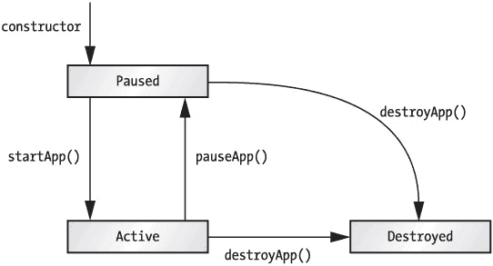
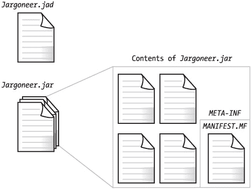

# 第 3 章：关于 MIDlet 的一切

在第 2 章中，你快速了解了构建和运行 MIDlet 的过程。在本章中，你将深入探讨细节。我将涵盖上一章中略过的主题，从 MIDlet 生命周期开始，一直到对 MIDlet 打包的全面讨论。本章最后将介绍 MIDP 2.0 的安全架构。


## MIDlet 生命周期

MIDP 应用程序由 `javax.microedition.midlet.MIDlet` 类的实例表示。MIDlet 具有特定的生命周期，这体现在 `MIDlet` 类的方法和行为中。

Java 领域之外的一块设备软件——*应用程序管理器*，控制着 MIDlet 的安装和执行。MIDlet 通过将其类文件移动到设备上来完成安装。类文件将被打包到 Java 归档文件（JAR）中，而附带的描述符文件（扩展名为 `*.jad*`）则描述了 JAR 的内容。

MIDlet 会经历以下状态：

1.  当 MIDlet 即将运行时，会创建一个实例。MIDlet 的构造函数被执行，此时 MIDlet 处于*暂停*状态。

2.  接着，在应用程序管理器调用 `startApp()` 后，MIDlet 进入*活动*状态。

3.  当 MIDlet 处于活动状态时，应用程序管理器可以通过调用 `pauseApp()` 来暂停其执行。这会使 MIDlet 回到暂停状态。MIDlet 也可以通过调用 `notifyPaused()` 自行进入暂停状态。

4.  应用程序管理器可以通过调用 `destroyApp()` 来终止 MIDlet 的执行，此时 MIDlet 被*销毁*，并耐心等待垃圾回收。MIDlet 可以通过调用 `notifyDestroyed()` 自行销毁。

图 3-1 展示了 MIDlet 的状态及其之间的转换。


图 3-1：MIDlet 生命周期

`MIDlet` 类中还有一个与 MIDlet 生命周期相关的方法：`resumeRequest()`。处于暂停状态的 MIDlet 可以调用此方法，向应用程序管理器发出信号，表明它希望变为活动状态。考虑一个处于暂停状态的 MIDlet 还能运行任何代码，这似乎有些奇怪。然而，暂停的 MIDlet 仍然能够处理定时器事件或其他类型的回调，因此有机会调用 `resumeRequest()`。如果应用程序管理器决定将 MIDlet 从暂停状态转移到活动状态，它将通过调用 `startApp()` 这一常规机制来实现。

## 请求唤醒调用

MIDP 2.0 允许 MIDlet 请求在稍后的时间启动，本质上就是向实现请求一个唤醒调用。该方法定义在 `javax.microedition.io.PushRegistry` 中，这看起来有点奇怪。`PushRegistry` 的所有其他方法都与响应传入网络连接而启动 MIDlet 有关；该类在第 9 章中有完整描述。`PushRegistry` 中的以下方法用于请求在特定时间唤醒一个指定的 MIDlet：

```
public static long registerAlarm(String midlet, long time)
    throws ClassNotFoundException, ConnectionNotFoundException 
```

你需要提供 MIDlet 套件中某个 MIDlet 的类名，而 `time` 则精确指定了你希望 MIDlet 启动的时间，采用标准格式，即自 1970 年 1 月 1 日以来的毫秒数。（第 4 章讨论了 MIDP 中与时间相关的类和方法。）

如果你提供的类名在当前 MIDlet 套件中未找到，则会抛出 `ClassNotFoundException`。如果实现无法在指定时间启动 MIDlet，则会抛出 `ConnectionNotFoundException`。

如果你为其请求定时启动的 MIDlet 之前已经注册过定时启动，此方法将返回之前的唤醒时间。

## 通往外部世界的桥梁

许多 MIDP 设备，尤其是手机，都带有 WAP 浏览器。MIDP 2.0 的 `MIDlet` 类中新增了一个方法，为这些浏览器和其他功能提供了桥梁：

```
public final boolean platformRequest(String URL)
    throws ConnectionNotFoundException
```

在功能强大的设备上，浏览器和 MIDlet 套件可能能够同时运行，在这种情况下，浏览器将被启动并指向指定的 URL。此时该方法返回 `true`。

在较小的设备上，浏览器可能必须等到 MIDlet 被销毁后才能运行。在这种情况下，`platformRequest()` 返回 `false`，并且 MIDlet 有责任自行终止。MIDlet 终止后，实现有责任启动浏览器并将其指向指定的 URL。

无论哪种情况，`platformRequest()` 都是一个非阻塞方法。

提供的 URL 有两种特殊情况。如果你提供的电话号码 URL 格式为 `tel:<number>`（如 RFC 2806 ([`ietf.org/rfc/rfc2806.txt`](http://ietf.org/rfc/rfc2806.txt)) 所规定），则实现应发起一个语音通话。

如果你提供的是 MIDlet 套件描述符或 JAR 的 URL，则实现应将其解释为安装给定 MIDlet 套件的请求。

## 打包 MIDlet

MIDlet 以 *MIDlet 套件* 的形式部署。MIDlet 套件是一个包含一些额外信息的 MIDlet 集合；它由两个文件组成。一个是*应用程序描述符*，它是一个简单的文本文件。另一个是 JAR 文件，其中包含构成 MIDlet 套件的类文件和资源文件。与任何 JAR 文件一样，MIDlet 套件的 JAR 文件都有一个清单文件。图 3-2 展示了 MIDlet 套件的结构图。


图 3-2：MIDlet 套件剖析

如果你使用的是像 J2ME 无线工具包这样的工具，则无需过多担心 MIDlet 套件的打包问题，因为大部分细节都会自动处理。如果你想从更底层理解，或者只是好奇，请继续阅读关于 MIDlet 套件打包的完整描述。

打包 MIDlet 套件包括三个步骤：

1.  构成 MIDlet 的类文件和资源文件被打包到一个 JAR 文件中。通常，你会使用 `jar` 命令行工具来完成此操作。

2.  运行时所需的额外信息被放置在 JAR 的清单文件中。所有 JAR 都包含一个清单；MIDlet 套件 JAR 包含一些应用程序管理软件所需的额外信息。

3.  还必须生成一个应用程序描述符文件。这是一个扩展名为 `*.jad*` 的文件，用于描述 MIDlet 套件 JAR。应用程序管理软件可以使用它来决定是否应将 MIDlet 套件 JAR 下载到设备上。


### MIDlet 清单信息

存储在 MIDlet 清单文件中的信息由名称和值对组成，类似于属性文件。例如，一个简单的 JAR 清单可能如下所示：

```
Manifest-Version: 1.0
Created-By: 1.3.0 (Sun Microsystems Inc.)
```

Jargoneer 的 MIDlet JAR 清单如下所示：

```
Manifest-Version: 1.0
MIDlet-1: Jargoneer, Jargoneer.png, Jargoneer
MIDlet-Name: Jargoneer
MIDlet-Version: 1.0
MIDlet-Vendor: Sun Microsystems
Created-By: 1.3.0 (Sun Microsystems Inc.)
MicroEdition-Configuration: CLDC-1.0
MicroEdition-Profile: MIDP-1.0
```

额外的属性描述了软件版本、类名以及关于 MIDlet 套件的其他信息。必须包含以下属性：

*   **MIDlet-Name**：尽管名称如此，此属性实际上指的是整个 MIDlet 套件的名称，而不仅仅是单个 MIDlet。

*   **MIDlet-Version**：描述 MIDlet 套件的版本。这是一个您自己选择的数字，格式为 *主版本号.次版本号.修订号*。

*   **MIDlet-Vendor**：这是您的姓名或公司名称。

*   **MIDlet-*n***：对于 MIDlet 套件中的每个 MIDlet，列出其可显示名称、图标文件和类名。MIDlet 应从 1 开始连续编号。例如，单个 MIDlet 套件中的多个 MIDlet 可以这样列出：

    ```
    MIDlet-1: Sokoban, /icons/Sokoban.png, example.sokoban.Sokoban
    MIDlet-2: Tickets, /icons/Auction.png, example.lcdui.TicketAuction
    MIDlet-3: Colors, /icons/ColorChooser.png, example.chooser.Color
    MIDlet-4: Stock, /icons/Stock.png, example.stock.StockMIDlet 
    ```

*   **MicroEdition-Configuration**：此属性描述此 MIDlet 套件可以运行的 J2ME 配置。多个配置名称应用空格分隔。

*   **MicroEdition-Profile**：描述此 MIDlet 套件可以运行的配置文件集。对于 MIDP 1.0 应用程序，这是 MIDP-1.0。对于可以在 MIDP 1.0 或 MIDP 2.0 上运行的应用程序，请使用 "MIDP-2.0 MIDP-1.0"。

除了必需的清单属性外，还可以定义以下属性：

*   **MIDlet-Description:** MIDlet 套件的描述放在此属性中。

*   **MIDlet-Icon:** 单个 MIDlet 的图标在 MIDlet-n 属性中描述。此属性指定一个图标来表示整个 MIDlet 套件。

*   **MIDlet-Info-URL:** 如果在线提供了关于 MIDlet 套件的额外信息，请使用此属性列出 URL。

*   **MIDlet-Data-Size:** 如果您知道 MIDlet 套件需要多少字节的持久数据，您可以使用此属性指定该数字。

|  | 提示  | 不要被属性名称迷惑。许多属性名称似乎指的是单个 MIDlet，例如 *MIDlet-Name* 和 *MIDlet-Description*。实际上，这些属性描述的是整个 MIDlet 套件。唯一适用于特定 MIDlet 的属性是 *MIDlet-n* 属性，它用于列出套件中的每个 MIDlet。 |

在 MIDP 2.0 中，可以包含几个额外的属性。MIDP 2.0 使用权限方案保护网络 API 免受未经授权的访问，这将在本章后面详细讨论。MIDlet 可以在 MIDlet JAR 清单中列出必需的权限和可选的权限，如下所示：

*   **MIDlet-Permissions:** 使用此属性列出对 MIDlet 套件运行至关重要的权限。多个权限用逗号分隔。

*   **MIDlet-Permissions-Opt:** 此属性列出可能使用但对本 MIDlet 套件并非至关重要的权限。

最后，MIDP 2.0 还提供了一种方式，让 MIDlet 套件表明它们对可选 API 的依赖：

*   **MIDlet-Extensions:** 在此属性中列出本 MIDlet 套件使用的可选 API。确切名称由各个可选 API 规范决定。

### 应用程序描述符

应用程序管理软件使用 MIDlet 套件 JAR 中的属性来运行套件内的 MIDlet。相比之下，应用程序描述符包含帮助设备决定是否加载 MIDlet 套件的信息。由于应用程序描述符是一个独立于 MIDlet 套件 JAR 的文件，设备可以在下载 MIDlet 套件之前轻松加载并检查该文件。

实际上，应用程序描述符中的许多信息与 MIDlet 套件 JAR 中的信息相同。例如，应用程序描述符必须包含 MIDlet-Name、MIDlet-Version 和 MIDlet-Vendor 属性。此外，它还应包含以下内容：

*   **MIDlet-Jar-URL:** 这是可以找到 MIDlet 套件 JAR 的 URL。

*   **MIDlet-Jar-Size:** 这是 MIDlet 套件 JAR 的大小，以字节为单位。

应用程序描述符可以选择性地包含 MIDlet-Description、MIDlet-Icon、MIDlet-Info-URL 和 MIDlet-Data-Size 属性。

设备和模拟器在处理 MIDlet 套件描述符方面差异很大。有些设备在描述符中任何字段不正确时都会导致安装失败，而其他设备则更为宽松。像 J2ME Wireless Toolkit 这样的工具对于创建格式良好的描述符非常有用。

应用程序描述符在无线（OTA）部署中非常有用。设备可以在决定是否下载并安装整个 MIDlet 套件 JAR 之前，下载并检查描述符（一个相对较短的文件）。对于 OTA 配置，服务器返回的应用程序描述符的 MIME 类型应为 text/vnd.sun.j2me.app-descriptor。这一点以及更多内容（整个协议）在 MIDP 2.0 规范的 *Over the Air User Initiated Provisioning Specification* 部分中有描述。

### MIDlet 属性

清单或应用程序描述符中还有另一种属性可能性。您可以添加对您的 MIDlet 有意义的属性。MIDlet 可以使用 `javax.microedition.midlet.MIDlet` 类中的 `getAppProperty()` 方法检索这些属性的值。一个属性可以列在应用程序描述符、JAR 清单或两者中；如果两者都列出，则将使用应用程序描述符中的值。通常，将应用程序属性存储在应用程序描述符文件中是合理的。由于它独立于 MIDlet 套件 JAR，因此可以轻松更改应用程序描述符以修改 MIDlet 的行为。例如，您可以在应用程序描述符中存储一个 URL 或其他配置信息。

例如，假设您在应用程序描述符中放置了一个特定于应用程序的属性，如下所示：

```
Jargoneer.url: http://www.dict.org/bin/Dict
```

在 MIDlet 内部，您可以像这样检索该属性的值：

```
String url = getAppProperty("Jargoneer.url");
```

更改 URL 就像更改应用程序描述符（一个简单的文本文件）一样容易。您的任何代码都不需要重新编译。如果您希望分发 MIDlet 的多个副本并在多台服务器之间分担服务器负载，这将非常有用。您可以使用一组不同的应用程序描述符来分发相同的 MIDlet 套件 JAR，每个描述符都使用一个 MIDlet 属性指向不同的服务器。


## MIDlet 套件安全

无线应用安全对于无线行业的几乎所有参与者都至关重要：

*   **运营商**希望确保病毒不会导致客户设备或网络瘫痪。
*   **设备制造商**不希望用户安装的软件导致设备崩溃。
*   **用户**希望能够运行下载的代码，而不会威胁到设备的稳定性或个人信息的安全。此外，他们可能希望控制应用程序的网络使用，因为网络使用通常需要付费。

MIDP 1.0 并未在规范文本中直接解决这些问题，但基于 JVM 的架构使其从安全角度来看成为一个有吸引力的平台。Java 虚拟机（JVM）的设计确保了 MIDlet 无法逃脱 JVM 的限制，因此即使是恶意的 MIDlet，其最坏情况也仅是导致 JVM 崩溃或无法响应，而不会损害设备上的其他软件。此外，MIDP 1.0 API 没有暴露任何敏感功能，网络 API 可能是个例外。

### 权限

MIDP 2.0 引入了一个明确的安全架构。MIDlet 必须拥有*权限*才能执行敏感操作。在 MIDP 2.0 中，API 中唯一受权限保护的部分是网络连接。可选 API 可以自由定义额外的权限来保护敏感数据或功能。

权限名称使用与其保护的 API 相同的前缀和类或接口名称。在第 9 章中，我将详细解释 MIDP 2.0 中网络权限的名称。目前，假设您编写了一个需要建立套接字连接的 MIDlet。这个 MIDlet 需要 `javax.microedition.io.Connector.socket` 权限。MIDlet 本身不需要了解权限。它只是尝试连接，连接要么成功，要么抛出 `java.lang.SecurityException`。

MIDP 2.0 在 MIDlet 类中添加了一个新方法，程序员可以使用它来检查权限是否会被授予或拒绝：

```
public final int checkPermission(String permission)
```

如果权限被授予，此方法返回 1；如果权限被拒绝，则返回 0。特殊返回值 -1 表示实现无法确定权限是否会被授予或拒绝，这可能是当系统会询问用户关于给定权限的情况。

### 保护域

在 MIDP 2.0 中，MIDlet 套件属于*保护域*，这些域决定了哪些权限被授予、哪些被拒绝，以及哪些必须交由用户判断。保护域有点像秘密俱乐部，由两部分组成：

1.  允许的权限集以及需要咨询用户的权限集。
2.  MIDlet 套件如何进入此保护域的规则。

一个非常简单的保护域 "SimplePD" 可能包含权限 `javax.microedition.io.Connector.http`。进入 SimplePD 的规则可能简单到验证 MIDlet 套件的源 IP 地址。例如，如果 MIDlet 套件是从 [www.bigcarrier.com](http://www.bigcarrier.com) 下载的，那么设备上的应用程序管理软件就会知道将该 MIDlet 套件放入 SimplePD 保护域。在运行时，任何尝试进行 HTTP 连接的 MIDlet 都将被授予该权限。尝试其他连接类型将被拒绝。

SimplePD 基于简单 IP 来源的标准相当薄弱。SimplePD 中的 MIDlet 套件容易受到多种攻击，包括数据修改、数据替换、中间人攻击和 DNS 欺骗。更健壮的规则基于用于数据完整性和身份验证的加密解决方案。在 MIDP 2.0 规范中，“使用 X.509 PKI 的可信 MIDlet 套件”一节描述了一种此类方案，包括额外的清单属性。

其内容和来源无法验证的 MIDlet 套件将被放入一种默认的保护域，即*不受信任*域。MIDP 2.0 规范对不受信任域的唯一限制是，在获得用户明确确认后，它必须允许 MIDlet 访问 HTTP 和 HTTPS 连接。

保护域的概念故意定义得比较模糊，以便在实现时留有相当大的自由度。我猜测许多实现会选择拥有一个不受信任域和一个受信任域，进入受信任域仅限于经过加密签名（和验证）的 MIDlet 套件。

### 权限类型

保护域包含将授予 MIDlet 的权限（*允许*权限）以及必须咨询用户的权限（*用户*权限）。用户权限有几种变体。*全局*意味着用户只需为某个 MIDlet 套件授予或拒绝一次权限。*会话*意味着用户必须在每次调用 MIDlet 套件时授予或拒绝权限。最后，*一次性*表示每次需要必要权限时都必须咨询用户。

### MIDlet 套件描述符中的权限

MIDP 2.0 为 MIDlet 套件描述符定义了额外的属性。如果您的 MIDlet 套件绝对、肯定需要某些权限，请使用 `MIDlet-Permissions` 属性。例如，如果您的 MIDlet 套件需要建立 HTTP 连接才能正常运行，您需要在描述符文件中添加如下一行：

```
MIDlet-Permissions: javax.microedition.io.Connector.http
```

多个权限类型放在同一行，用逗号分隔。

如果您的 MIDlet 套件不需要某些权限即可运行，但可以使用它们来增强功能，则可以将这些权限放在 `MIDlet-Permissions-Opt` 属性中。

在安装时，应用程序管理软件会将描述符中请求的权限与目标保护域中的权限进行比较。如果存在不可调和的分歧，则不会安装该 MIDlet 套件。

## 总结

MIDP 应用程序称为 MIDlet。与 applet 或 servlet 类似，MIDlet 具有特定的生命周期；它们由设备软件管理。本章详细介绍了 MIDlet 套件清单文件和应用程序描述符中可能包含的条目。应用程序属性可用作在应用程序描述符中存储信息的一种方式，而不是将值硬编码到 MIDlet 源代码中。像 J2ME 无线工具包这样的工具会自动处理 MIDlet 属性打包的许多细节。MIDP 2.0 包含一个基于保护域的全面安全架构。

