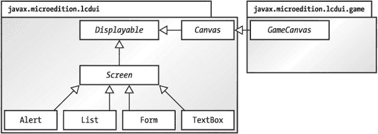
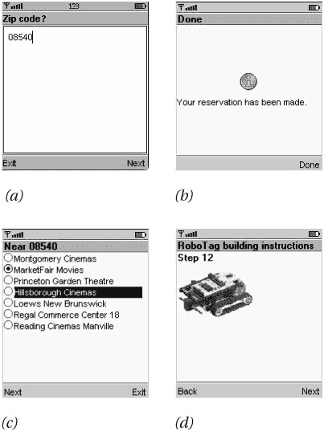
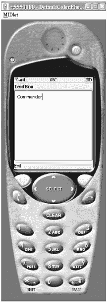
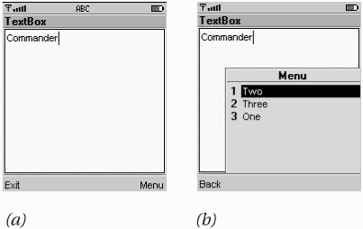
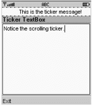

# 第 5 章：创建用户界面

## 概述

MIDP 应用程序旨在无需修改即可在多种不同设备上运行。这在用户界面领域尤其困难，因为设备拥有各种尺寸的屏幕，有灰度的也有彩色的。此外，设备的输入能力也千差万别，从数字键盘到字母键盘、软键，甚至触摸屏。MIDP 规定的最小屏幕尺寸为 96 × 54 像素，且至少具有 1 位色深。^([1]) 至于输入，MIDP 相当开放：设备预计会配备某种类型的键盘，或触摸屏，或者两者兼有。

鉴于符合 MIDP 规范的设备种类繁多，有两种方法可以创建在所有设备上都能良好运行的应用程序：

*   *抽象*：以抽象术语指定用户界面，依赖 MIDP 实现来创建具体内容。与其说“在软键上方的屏幕上显示‘下一步’这个词”，不如说“在这个界面的某处给我一个**下一步**命令”。

*   *发现*：应用程序在运行时了解设备信息，并通过编程方式定制用户界面。例如，你可能会查明设备屏幕的大小，以便适当地缩放你的用户界面。

MIDP API 支持这两种方法。抽象是首选方法，因为它涉及应用程序中更少的代码，而 MIDP 实现承担了更多工作。在某些情况下，比如游戏，你需要对用户界面有更具体的要求；这类应用程序会发现设备的能力，并尝试相应地调整其行为。MIDP 的用户界面 API 被设计成易于在同一应用程序中混合使用这两种技术。

^([1])色深是决定屏幕上像素颜色的位数。1 位允许两种颜色（通常是黑色和白色）。4 位允许 16 种颜色，可以是不同级别的灰度或其他颜色的调色板。


## 顶层视角

MIDP 在 `javax.microedition.lcdui` 和 `javax.microedition.lcdui.game` 包中包含了用户界面类。设备的显示屏由 `Display` 类的实例表示，可通过工厂方法 `getDisplay()` 获取。`Display` 的主要职责是跟踪当前显示的内容，即 `Displayable` 的实例。如果将 `Display` 比作画架，那么 `Displayable` 实例就相当于画架上的画布。

MIDlet 可以通过将 `Displayable` 实例传递给 `Display` 的 `setCurrent()` 方法来更改显示内容。这是典型 MIDlet 的基本功能：

1.  显示一个 `Displayable`。
2.  等待输入。
3.  决定下一个要显示的 `Displayable`。
4.  重复。

`Displayable` 有一系列子类，代表不同类型的用户界面。图 5-1 展示了其继承关系。


图 5-1：*javax.microedition.lcdui* 和 *javax.microedition.lcdui.game* 包中的 Displayable

`Displayable` 的后代分为两个分支，分别对应创建通用用户界面的两种方法：抽象与发现。`Screen` 类代表以抽象术语定义的显示界面。

这些屏幕包含标准的用户界面元素，如组合框、列表、菜单和按钮。四个子类提供了广泛的功能，如图 5-2 所示。


图 5-2：*Screen* 的四个子类——(a) *TextBox*、(b) *Alert*、(c) *List* 和 (d) *Form*

本章剩余部分将重点解释这四个类中最简单的两个：`TextBox` 和 `Alert`。下一章 将探讨更灵活的 `List` 和 `Form`。

对于特别苛刻或特殊的显示需求，你需要创建 `Canvas` 的子类。你的 MIDlet 将承担大部分绘制工作，但你能更精细地控制显示内容以及用户输入的处理方式。`Canvas` 提供了方法，使你的 MIDlet 能够了解其运行环境——例如显示屏的尺寸，以及设备支持哪些类型的事件。基于 `Canvas` 构建的用户界面会探测设备属性，并尝试创建看起来合理的界面。第 10 章 将详细解释基于 `Canvas` 的用户界面。

`GameCanvas` 是 MIDP 2.0 中的新特性，专门为游戏显示提供用户界面功能。第 11 章 将解释这个新的 API。

## 使用 Display

`Display` 管理设备的屏幕。你可以通过向静态方法 `getDisplay()` 提供一个 MIDlet 引用来获取设备显示屏的引用。通常，你会在 MIDlet 的 `startApp()` 方法中执行此操作：

```
public void startApp() {
  Display d = Display.getDisplay(this);
  // ...
}
```

你可能会想在 MIDlet 的构造函数中调用 `getDisplay()`，但根据规范，`getDisplay()` 只能在 MIDlet 的 `startApp()` 方法开始之后调用。

一旦获得了设备 `Display` 的引用，你只需要创建要显示的内容（`Displayable` 的实例），并将其传递给 `Display` 的某个 `setCurrent()` 方法：

```
public void setCurrent(Displayable next)
public void setCurrent(Alert alert, Displayable nextDisplayable)
```

当你想要先显示一条临时消息（`Alert`），然后再显示其他内容时，会使用第二个版本。我将在本章末尾详细讨论 `Alert`。

`Display` 的 `getCurrent()` 方法返回当前显示内容的引用。请注意，即使 MIDlet 对用户不可见，`getCurrent()` 也可能返回一个有效对象。例如，在同时运行多个 MIDlet 的设备上就可能发生这种情况。另外请注意，`Displayable` 接口有一个名为 `isShown()` 的方法，用于指示给定对象是否实际显示在设备屏幕上。

你还可以查询 `Display` 以确定其能力，这对于需要适应不同类型显示器的应用程序很有帮助。`numColors()` 方法返回此设备支持的不同颜色的数量，而 `isColor()` 方法则告知设备是支持彩色还是灰度。例如，支持 16 级灰度的设备的 `Display`，其 `isColor()` 会返回 false，而 `numColors()` 会返回 16。在 MIDP 2.0 中，你还可以通过调用 `numAlphaLevels()` 来了解设备是否支持透明度，该方法返回透明度级别数。最小返回值为 2，表示支持完全透明和完全不透明的图像像素。返回值大于 2 表示支持 Alpha 混合。在 MIDP 2.0 中，`Display` 还包含另外两对方法。第一对方法 `getColor()` 和 `getBorderStyle()` 用于从系统用户界面方案中获取颜色和线条样式。这些方法对于绘制自定义项目很有用，该主题将在第 7 章中介绍。另一对方法 `flashBacklight()` 和 `vibrate()` 用于调用设备的相应功能。这些将在第 11 章中更详细地讨论。

## 使用命令进行事件处理

`Displayable` 是所有屏幕显示的父类，它支持一个非常灵活的用户界面概念——命令。*命令*是用户可以调用的东西——你可以将其视为一个按钮。像按钮一样，它有一个标题，例如“确定”或“取消”，并且当用户调用该命令时，你的应用程序可以做出适当的响应。其前提是，你希望某个命令对用户可用，但你不关心它在屏幕上如何显示，也不关心用户具体如何调用它——键盘按钮、软按钮、触摸屏等等。

每个 `Displayable` 都维护一个其 `Command` 的列表。你可以使用以下方法添加和删除 `Command`：

```
public void addCommand(Command cmd)
public void removeCommand(Command cmd)
```


### 创建命令

在 MIDP 中，命令由 `Command` 类的实例表示。要创建一个命令，只需提供名称、类型和优先级。名称通常显示在屏幕上。类型可用于标识常用命令，它应为 `Command` 类中定义的某个值。表 5-1 列出了类型值及其含义。

表 5-1：命令类型

| **名称** | **含义** |
| --- | --- |
| OK | 确认选择。 |
| CANCEL | 取消待处理的更改。 |
| BACK | 将用户返回到上一个屏幕。 |
| STOP | 停止正在运行的操作。 |
| HELP | 显示应用程序说明。 |
| SCREEN | 特定应用程序命令的通用类型。 |

例如，要创建一个标准的 **OK** 命令，可以这样做：

```
Command c = new Command("OK", Command.OK, 0);
```

要创建一个特定于应用程序的命令，可以这样做：

```
Command c = new Command("Launch", Command.SCREEN, 0);
```

如何显示命令由 MIDP 实现决定。在 Sun J2ME Wireless Toolkit 模拟器中，命令被分配给两个软键。*软键*是设备键盘上没有预定义功能的按钮。软键在不同时间可以服务于不同目的。如果命令数量超过软键数量，则无法容纳的命令将被分组到一个菜单中，并分配给其中一个软键。

一个简单的优先级方案决定了当命令数量超过可用屏幕空间时，哪些命令会胜出。每个命令都有一个优先级，表示显示系统应尽力显示该命令的程度。数字越小，优先级越高。如果你添加一个优先级为 0 的命令，然后再添加几个优先级为 1 的命令，那么优先级为 0 的命令将直接显示在屏幕上，而其他命令很可能最终出现在次级菜单中。

MIDP 2.0 增加了对命令长标签的支持。MIDP 实现会根据可用屏幕空间和标签大小来决定使用哪个标签。你可以像这样创建一个带有短标签和长标签的命令：

```
Command c = new Command("Run", "Run simulation", Command.SCREEN, 0);
```

`Command` 类提供了 `getLabel()`、`getLongLabel()` 和 `getCommandType()` 方法，用于检索命令的相关信息。

### 响应命令

命令本身并不令人兴奋。它们会显示在屏幕上，但当用户调用命令时，不会自动发生任何事情。当用户在 `Displayable` 中调用任何命令时，一个称为*监听器*的对象会收到通知。这遵循了 JavaBeans 事件模型的基本形式；`Displayable` 是一个*单播事件源*。每次用户调用其某个命令时，`Displayable` 都会触发一个事件。

监听器是一个实现了 `CommandListener` 接口的对象。要将监听器注册到 `Displayable`，请使用以下方法：

```
public void setListener(CommandListener l) 
```

`Displayable` 是单播事件源，因为它只能有一个监听器对象。（*多播*事件源可以有多个监听器，并使用 `add…` 方法来添加监听器，而不是 `set…` 方法。）

实现 `CommandListener` 只需定义一个方法：

```
public void commandAction(Command c, Displayable s)
```

当命令被调用时，包含该命令的 `Displayable` 会调用已注册监听器的 `commandAction()` 方法。

|  | 提示  | 事件监听器不应在事件处理线程内执行耗时操作。系统使用自己的线程来调用 *commandAction()* 以响应用户输入。如果你的 *commandAction()* 实现执行了任何繁重任务，它将占用系统的事件处理线程。如果你有复杂操作要执行，请使用自己的线程。 |

### 一个简单示例

为了说明问题，请考虑以下类：

```
import javax.microedition.midlet.*;
import javax.microedition.lcdui.*;

public class Commander extends MIDlet {
  public void startApp() {
    Displayable d = new TextBox("TextBox", "Commander", 20, TextField.ANY);
    Command c = new Command("Exit", Command.EXIT, 0);
    d.addCommand(c);
    d.setCommandListener(new CommandListener() {
      public void commandAction(Command c, Displayable s) {
        notifyDestroyed();
      }
    });

    Display.getDisplay(this).setCurrent(d);
  }

  public void pauseApp() { }

  public void destroyApp(boolean unconditional) { }
} 
```

这个 MIDlet 创建了一个 `TextBox`（它是 `Displayable` 的一种），并向其添加了一个命令。监听器被创建为一个匿名内部子类。在 Sun 的工具包中，这个 MIDlet 显示如图 5-3 所示。


图 5-3：一个带有单个命令 *Exit* 的简单 MIDlet

图 5-3 显示了 **Exit** 命令被映射到 MIDP 模拟器的一个软键上。如果你向这个 MIDlet 添加另一个命令，它将被映射到另一个软键。如果你继续添加命令，那些无法在屏幕上容纳的命令将被放入屏幕外的菜单中。例如，一个包含四个命令的屏幕在 MIDP 模拟器中显示如图 5-4a 所示。


图 5-4：此 MIDlet 的命令数量超过了设备的软键数量。调用 (a) 系统生成的 *Menu* 命令会显示 (b) 剩余的命令。

如果你按下 **Menu** 软键，你将看到剩余的命令，如图 5-4b 所示。现在可以通过按数字键或使用方向键导航来选择菜单项。在图 5-4 所示的示例中，**Exit** 命令被赋予了比其他命令更高的优先级（数字更小），这确保了它直接显示在屏幕上。其他优先级较低的命令则被归入命令菜单。

## 屏幕与滚动条

本章的剩余部分以及第 6 章的全部内容将专门介绍 `Screen` 及其子类，它们是图 5-1 所示层次结构的左分支。`Screen` 是所有表示通用用户界面的类的基类。

相比之下，`Canvas` 是专用界面（例如游戏界面）的基类。`Canvas` 将在后面的第 10 章中全面介绍。

在接下来的章节中，我们将探讨 `Screen` 的每个子类。在这里，我将简要描述所有 `Screen` 的共同点：标题和滚动条。*标题*正如你所期望的那样：显示在屏幕顶部的字符串。*滚动条*只是一段在屏幕顶部滚动的文本；其名称来源于老式的股票行情自动收录器。

在 MIDP 2.0 中，我将要描述的四个方法已从 `Screen` 移至 `Displayable`。因此，MIDP 2.0 将标题和滚动条的概念扩展到了所有 `Displayable`，而不仅仅是 `Screen`。在 MIDP 2.0 中，`Screen` 类没有方法。

标题是显示在屏幕顶部的文本字符串。正如你在图 5-3 中看到的，屏幕的标题是 "TextBox"。`Screen` 的子类有设置标题的构造函数，但标题也可以通过以下方法访问：

```
public void setTitle(String newTitle)
public String getTitle()
```

滚动条的访问同样简单：

```
public void setTicker(Ticker newTicker)
public Ticker getTicker() 
```

`Ticker` 类是一个简单的字符串包装器。要向屏幕添加滚动条，可以这样做：

```
// Displayable d = ...
Ticker ticker = new Ticker("This is the ticker message!");
d.setTicker(ticker);
```

图 5-5 展示了滚动条的实际效果。


图 5-5：滚动条在屏幕顶部滚动。


## TextBox，最简单的屏幕

最简单的屏幕类型是 TextBox，您已经在实际操作中见识过它了。TextBox 允许用户输入字符串。请记住，在普通的 MIDP 设备上，文本输入是一个繁琐的过程。许多设备只有数字键盘，因此输入单个字符需要按一次、两次或三次按钮。一个好的 MIDlet 应尽量减少用户输入。

话虽如此，您的 MIDlet 可能仍需要某种输入——也许是邮政编码、短名称或某种密码。在这些情况下，您可能希望使用 TextBox。

创建 TextBox 需要指定四个参数：

```
public TextBox(String title, String text, int maxSize, int constraints)
```

`title` 用作屏幕标题，而 `text` 和 `maxSize` 决定了文本框的初始文本和最大大小。最后，`constraints` 可用于限制用户的输入。使用 `TextField` 类中的常量来指定所需的输入类型：

*   `ANY` 允许任何类型的输入。
*   `NUMERIC` 将输入限制为整数。
*   `DECIMAL`（MIDP 2.0 新增）允许包含小数部分的数字。
*   `PHONENUMBER` 要求输入电话号码。
*   `EMAILADDR` 输入必须是电子邮件地址。
*   `URL` 输入必须是网址。

如何强制执行这些约束取决于具体实现。工具包模拟器只是不允许无效输入；例如，一个 `NUMERIC` 类型的 TextBox 不允许您输入字母字符。

上述约束可以与下面列出的标志组合使用。约束限制用户的行为，而标志则定义 TextBox 的行为。除 `PASSWORD` 之外的所有标志都是 MIDP 2.0 新增的。

*   `PASSWORD` 输入的字符不会显示；通常，它们会用星号表示。
*   `UNEDITABLE` 表示无法编辑的文本。
*   `SENSITIVE` 用于标记实现不应存储的文本。某些输入方案会存储用户的输入，以便日后用于自动补全。此标志表示该文本是受限的，不应保存或缓存。
*   `NON_PREDICTIVE` 表示您期望用户输入任何文本预测输入方案可能无法猜到的文本。例如，如果您期望用户输入像 Z51002S 这样的订单号，您可以使用此标志来告知输入方案不必费心尝试预测输入。
*   `INITIAL_CAPS_WORD` 用于每个单词都应大写的输入。
*   `INITIAL_CAPS_SENTENCE` 表示每个句子的首字符都应大写的输入。

如果您不希望 TextBox 执行任何验证，可以在构造函数中将 `ANY` 或其数值等效值 `0` 用于 `constraints` 参数。

这些标志可以使用 OR 运算符与任何其他约束组合。例如，要创建一个将输入限制为电子邮件地址但隐藏输入数据的 TextBox，您可以这样做：

```
Displayable d = new TextBox("Email", "", 64,
        TextField.EMAILADDR | TextField.PASSWORD);
```

不过，仔细想想，`PASSWORD` 可能得不偿失。至少在桌面电脑上，密码字段的目的是防止路过您电脑屏幕的人看到您的秘密密码。您每输入一个字符，密码字段就会显示一个星号或其他符号。当您输入秘密密码时，屏幕上显示的只是一行星号。在手机和其他小型设备上，这就不那么令人担忧了，因为屏幕更小，而且比典型的桌面显示器更难看清。

此外，在小型设备上输入数据的困难意味着，如果您盲目输入，将很难正确输入密码。例如，手机通常需要您多次按键才能输入一个字母。在 Sun 的工具包模拟器上，按两次 '7' 键会输入字母 'Q'。在真实设备上，您必须通过以下按键序列来输入密码 "gandalf"：4, 2, 6, 6, 3, 2, 5, 5, 5, 3, 3, 3。如果没有视觉反馈，输入密码时极容易出错。（“我按了 5 键两次还是三次？”）J2ME Wireless Toolkit 模拟器会显示当前字符，但之前输入的字符会显示为星号。好的密码通常混合大小写、数字，可能还有标点符号；这些字符很难正确输入。

在 MIDP 2.0 应用程序中，密码字段（无论是否使用 `PASSWORD` 标志）都应使用 `SENSITIVE` 标志进行保护，这样密码就不会出现在任何系统字典中，也不会在用户输入其他文本时意外弹出。

MIDP 2.0 在 TextBox 类中新增了一个方法，名为 `setInitialInputMode(String characterSubset)`。此方法用于向实现建议哪种输入模式最适合预期的文本。您只能建议输入模式，并且无法知道实现是否遵从了该请求。传递给该方法的字符串可以是 J2SE `java.lang.Character.UnicodeBlock` 类中的常量之一，并加上前缀 "UCB_"。例如，您可以向此方法传递 "UCB_BASIC_LATIN" 或 "UCB_KATAKANA"。您也可以使用 `java.awt.im.InputSubset` 定义的输入子集，并加上前缀 "IS_"。例如，"IS_LATIN" 或 "IS_KANJI" 都是有效的。最后，MIDP 2.0 还定义了字符子集 "MIDP_UPPERCASE_LATIN" 和 "MIDP_LOWERCASE_LATIN"。

输入模式是对文本约束和标志的补充。您可以为约束指定 `ANY`，然后调用 `setInitialInputMode("MIDP_LOWERCASE_LATIN")` 来请求实现以小写输入开始。这并不会阻止用户更改输入模式，只是让事情从一开始就走上正轨。


## 使用警报

*警报*是向用户显示的信息性消息。在 MIDP 领域中，有两种类型的警报：

*   **定时**警报会显示一段时间，通常只有几秒钟。它显示无需确认的信息性消息，例如“您的交易已完成”或“我现在无法执行此操作，戴夫。”

*   **模态**警报会一直显示，直到用户将其关闭。当需要为用户提供操作选择时，模态警报非常有用。您可以显示一条消息，例如“您准备好预订这些票了吗？”，并提供**是**和**否**命令作为选项。

MIDP 警报可以有一个关联的图标，例如停止标志或问号。警报甚至可能带有关联的声音，但这取决于具体实现。MIDP 警报与 MacOS 和 Windows 等窗口系统中的模态对话框概念非常相似。图 5-6 显示了一个典型的警报。


图 5-6：警报类似于桌面窗口系统中的模态对话框。

警报由 `javax.microedition.lcdui.Alert` 类的实例表示，该类提供以下构造函数：

```
public Alert()
public Alert(String title, String alertText, Image alertImage, AlertType alertType)
```

第二个构造函数中的任何或所有参数都可以为 `null`。（现在不必担心 `Image` 类；我将在下一章的列表部分讨论它。）

默认情况下，定时警报使用默认超时值创建；您可以通过调用 `getDefaultTimeout()` 来查找默认值。要更改警报的超时时间，请调用 `setTimeout()`，并将超时值以毫秒为单位传入。特殊值 `FOREVER` 可用于指示该警报是模态的。

您可以使用以下代码创建一个简单的定时警报：

```
Alert alert = new Alert("抱歉", "我很抱歉，戴夫...", null, null);
```

要显式将超时值设置为五秒，您可以这样做：

```
alert.setTimeout(5000);
```

相反，如果您想要一个模态警报，您可以使用特殊值 `FOREVER`：

```
alert.setTimeout(Alert.FOREVER);
```

MIDP 实现将自动提供一种关闭模态警报的方法。例如，Sun 的参考实现提供了一个映射到软按钮的**完成**命令。MIDP 2.0 将此命令公开为静态成员 `DISMISS_COMMAND`，允许您注册自己的命令监听器并显式识别此命令。您可以使用通常的 `addCommand()` 方法向警报添加自己的命令。第一次调用 `addCommand()` 时，系统的关闭命令将被移除。

警报的默认行为是在警报被关闭或超时时自动前进到下一个屏幕。您可以通过将警报和下一个屏幕传递给 `Display` 中的双参数 `setCurrent()` 方法来指定下一个屏幕。如果您调用常规的单参数 `setCurrent()` 方法，则在警报关闭时会恢复上一个屏幕。

警报类型作为对底层 MIDP 实现的提示。实现可能会使用警报类型来决定在显示警报时播放何种声音。`AlertType` 类提供了五种类型，作为静态成员变量访问：`ALARM`、`CONFIRMATION`、`ERROR`、`INFO` 和 `WARNING`。

MIDP 2.0 为警报添加了一个指示器。默认情况下，没有指示器，但您可以通过将 `Gauge` 传递给 `Alert` 的 `setIndicator()` 方法来添加一个。（`Gauge` 将在下一章的表单部分介绍。）该指示器对于显示网络连接或长时间计算中的进度非常方便。

以下示例 `TwoAlerts` 展示了两种类型的警报。它以一个主 `TextBox` 为特色，该文本框在 MIDlet 启动时显示。两个命令，**Go** 和 **About**，提供对警报的访问。**Go** 命令显示一个包含关于虚构网络错误消息的定时警报。**About** 命令显示一个可能包含版权信息的模态警报。第三个命令 **Exit** 提供了一种退出 MIDlet 的方法。请记住，所有三个命令可能无法同时显示在屏幕上；其中一些可能可以从二级菜单访问。

```
import javax.microedition.midlet.*;
import javax.microedition.lcdui.*;

public class TwoAlerts
    extends MIDlet
    implements CommandListener {
  private Display mDisplay;

private TextBox mTextBox;
  private Alert mTimedAlert;
  private Alert mModalAlert;

private Command mAboutCommand, mGoCommand, mExitCommand;

public TwoAlerts() {
    mAboutCommand = new Command("关于", Command.SCREEN, 1);
    mGoCommand = new Command("执行", Command.SCREEN, 1);
    mExitCommand = new Command("退出", Command.EXIT, 2);

mTextBox = new TextBox("TwoAlerts", "", 32, TextField.ANY);
    mTextBox.addCommand(mAboutCommand);
    mTextBox.addCommand(mGoCommand);
    mTextBox.addCommand(mExitCommand);
    mTextBox.setCommandListener(this);

mTimedAlert = new Alert("网络错误",
        "发生网络错误。请重试。",
        null,
        AlertType.INFO);
    mModalAlert = new Alert("关于 TwoAlerts",
          "TwoAlerts 是一个简单的 MIDlet，用于演示警报的使用。",
          null,
          AlertType.INFO);
    mModalAlert.setTimeout(Alert.FOREVER);
  }

public void startApp() {
    mDisplay = Display.getDisplay(this);

mDisplay.setCurrent(mTextBox);
  }

public void pauseApp() {
  }

public void destroyApp(boolean unconditional) {}

public void commandAction(Command c, Displayable s) {
    if (c == mAboutCommand)
      mDisplay.setCurrent(mModalAlert);
    else if (c == mGoCommand)
      mDisplay.setCurrent(mTimedAlert, mTextBox);
    else if (c == mExitCommand)
      notifyDestroyed();
  }
}
```

## 总结

MIDP 的主要用户界面类基于可适应具有不同显示和输入能力设备的抽象概念。几种预包装的屏幕类使得创建用户界面变得容易。屏幕具有标题和可选的滚动条。最重要的是，屏幕可以包含命令，实现将这些命令提供给用户。您的应用程序可以通过充当监听器对象来响应命令。本章描述了用于接受用户输入的屏幕 `TextBox`，以及用于显示信息的简单屏幕 `Alert`。在下一章中，我们将深入探讨更复杂的 `List` 和 `Form` 类。

