# 第 6 章：列表和表单

在上一章中，您了解了 MIDP 较简单的屏幕类。现在我们进入更深层次的内容，涉及显示列表的屏幕以及包含混合类型控件的屏幕。

## 使用列表

在 `TextBox` 和 `Alert` 之后，下一个最简单的屏幕是 `List`，它允许用户从选项列表中选择项目（称为*元素*）。列表中的每个元素由文本字符串或图像表示。`List` 支持选择单个元素或多个元素。

`List` 主要有两种类型，由 `Choice` 接口中的常量表示：

*   `MULTIPLE` 表示一个可以同时选择多个元素的列表。

*   `EXCLUSIVE` 指定一个只能选择一个元素的列表。它类似于一组单选按钮。


### 理解列表类型

对于**多选**和**单选**列表，选择与确认是两个独立的步骤。实际上，列表本身并不处理这些类型的确认操作——你的 MIDlet 需要提供其他机制（通常是一个命令）让用户确认其选择。**多选**列表允许用户在确认选择前，对各个元素进行选中或取消选中操作。**单选**列表则允许用户在确认选择前多次更改选择。

图 6-1a 展示了一个**单选**列表。用户通过上下方向键在列表中导航，按下设备上的选择键即可选中某个元素。图 6-1b 展示了一个**多选**列表。其操作方式与**单选**列表基本相同，但可以同时选中多个元素。同样，用户通过上下方向键在列表中移动，选择键用于切换特定元素的选中状态。

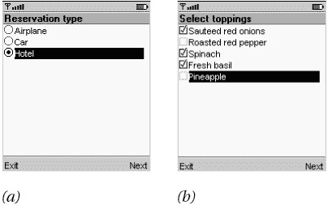
图 6-1：列表类型——(a) *单选* 和 (b) *多选*

此外，还存在一种**单选**的变体：**隐式**列表将选择与确认步骤合二为一。**隐式**列表的行为类似于菜单。图 6-2 展示了一个**隐式**列表，每个元素都包含图像和文本。当用户按下选择键时，列表会立即触发一个事件，就像命令一样。**隐式**列表与**单选**列表类似，用户只能选择其中一个列表元素。但使用**隐式**列表时，用户在确认选择前没有机会更改主意。

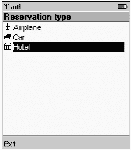
图 6-2：*隐式*列表将选择与确认合二为一。

### 隐式列表的事件处理

当用户在**隐式**列表中做出选择时，会调用列表的 `CommandListener` 中的 `commandAction()` 方法。一个特殊值会作为 `Command` 参数传递给 `commandAction()`：

```
public static final Command SELECT_COMMAND
```

例如，你可以像这样测试命令事件的来源：

```
public void commandAction(Command c, Displayable s) {
  if (c == nextCommand)
    // ...
  else if (c == List.SELECT_COMMAND)
    // ...
}
```

本章末尾有一个演示**隐式**列表的示例。

在 MIDP 2.0 中，`setSelectCommand()` 方法允许你指定自己的命令用于选择，而不必使用 `SELECT_COMMAND`。

### 创建列表

要创建一个列表，需要指定标题和列表类型。如果你预先知道元素名称和图像，可以在构造函数中传递它们：

```
public List(String title, int type)
public List(String title, int type,
    String[] stringElements, Image[] imageElements)
```

`stringElements` 参数不能为 null；但是，`stringElements` 或 `imageElements` 数组中可能包含 null 元素。如果某个列表元素的字符串和图像都为 null，则该元素显示为空白。如果字符串和图像都已定义，则该元素将同时显示图像和字符串。

某些列表的元素数量可能超过屏幕显示范围。实际上，不同设备能容纳的元素数量各不相同。但不必担心：列表实现会自动处理上下滚动，以显示列表的全部内容。

### 关于图像

我们对列表类的初步探索让我们首次接触到了图像。`javax.microedition.lcdui.Image` 类的实例代表了 MIDP 中的图像。规范要求实现能够加载 PNG 格式的图像文件。^([1]) 该格式支持透明色和无损压缩。

`Image` 没有构造函数，但 `Image` 类提供了几个 `createImage()` 工厂方法来获取 `Image` 实例。首先是用于从 PNG 数据加载图像的方法。

```
public static Image createImage(String name)
public static Image createImage(byte[] imagedata, int imageoffset,
    int imagelength)
```

第一个方法尝试从指定名称的文件创建图像，该文件应打包在包含你的 MIDlet 的 JAR 文件中。你应该使用绝对路径名，否则可能找不到图像文件。第二个方法使用提供的数组中的数据创建图像。数据从给定的数组偏移量 `imageoffset` 开始，长度为 `imagelength` 字节。在 MIDP 2.0 中，你还可以从 `InputStream` 创建图像：

```
public static Image createImage(InputStream stream)
```

图像可以是*可变*的或*不可变*的。可变图像可以通过调用 `getGraphics()` 并使用返回的 `Graphics` 对象在图像上绘制来进行修改。（关于 `Graphics` 的完整细节，请参见第 10 章。）如果尝试在不可变图像上调用 `getGraphics()`，则会抛出 `IllegalStateException`。

上述 `createImage()` 方法返回的是不可变图像。要创建可变图像，请使用以下方法：

```
public static Image createImage(int width, int height)
```

通常，你会创建一个可变图像用于离屏绘制，例如用于动画，或者在设备显示不支持双缓冲时减少闪烁。

你传递给 `Alert`、`ChoiceGroup`、`ImageItem` 或 `List` 的任何图像都应该是不可变的。要从可变图像创建不可变图像，请使用以下方法：

```
public static Image createImage(Image image)
```

在 MIDP 2.0 中，你还可以使用以下方法从另一图像的一部分创建图像：

```
public static Image createImage(Image image,
    int x, int y, int width, int height, int transform)
```

此方法获取由 `x`、`y`、`width` 和 `height` 描述的原始图像部分，应用指定的变换，并将结果作为不可变图像返回。可能的变换由 `javax.microedition.lcdui.game.Sprite` 类中的常量描述，包括镜像和 90 度旋转等。

`Image` 还包含将图像数据作为 int 数组处理的方法。我将在第 10 章中稍后讨论这些方法。

如何确定你需要多大尺寸的图像？在 MIDP 2.0 中，`Display` 提供了返回各种类型图像最佳宽度和高度信息的方法：

```
public int getBestImageHeight(int imageType);
public int getBestImageWidth(int imageType);
```

`imageType` 参数应为 `Display` 的常量之一：`LIST_ELEMENT`、`ALERT` 或 `CHOICE_GROUP_ELEMENT`。（你将在本章后面全面了解 `ChoiceGroup`。）如果你正在构建一个列表，可以查询 `Display` 以找到元素图像的最佳尺寸。假设你的应用程序中打包了各种尺寸的图标，你可以在运行时选择最佳尺寸的图像。


### 编辑列表

列表提供了添加项目、删除元素和检查元素的方法。列表中的每个元素都有一个索引。第一个元素的索引为 0，下一个为 1，依此类推。你可以使用`set()`替换元素，或使用`append()`将元素添加到列表末尾。`insert()`方法在指定索引处向列表添加新元素；这会使该位置及之后的所有元素索引加一。

```
public void set(int elementNum, String stringPart, Image imagePart)
public void insert(int elementNum, String stringPart, Image imagePart)
public int append(String stringPart, Image imagePart)
```

你可以通过提供元素的索引来检查其字符串或图像。同样，你可以使用`delete()`从列表中移除元素。

```
public String getString(int elementNum)
public Image getImage(int elementNum)
public void delete(int elementNum)
```

MIDP 2.0 还提供了一个`deleteAll()`方法，用于移除列表中的所有元素。

最后，`size()`方法返回列表中的元素数量。

虽然通常由 MIDP 实现负责显示列表，但 MIDP 2.0 中的新方法让你对列表的外观有了一定控制。第一个方法`setFitPolicy()`告诉列表应如何处理文本宽度超过屏幕的元素。可选值（来自`Choice`接口）如下：

*   `TEXT_WRAP_ON` 表示长元素将自动换行显示。
*   `TEXT_WRAP_OFF` 表示长元素将在屏幕边缘被截断。
*   `TEXT_WRAP_DEFAULT` 表示实现应使用其默认的适配策略。

另一个新方法是`setFont()`，它允许你指定用于特定列表元素的字体。（字体将在第 10 章中详细讨论。）可以通过调用`getFont()`来获取元素当前的字体。对`setFitPolicy()`和`setFont()`的调用仅作为提示；具体如何显示列表，以及是否满足所请求的适配策略或字体，由实现决定。

### 处理列表选择

你可以通过将元素的索引传递给以下方法，来检查列表中的特定元素是否被选中：

```
public boolean isSelected(int index) 
```

对于`EXCLUSIVE`和`IMPLICIT`列表，以下方法会返回唯一选中元素的索引：

```
public int getSelectedIndex()
```

如果你在`MULTIPLE`列表上调用`getSelectedIndex()`，它将返回-1。

要以编程方式更改当前选择，请使用`setSelectedIndex()`。

```
public void setSelectedIndex(int index, boolean selected)
```

最后，列表允许你使用以下方法*批量*设置或获取选择状态。提供的数组必须具有与列表元素数量相同的数组元素。

```
public int getSelectedFlags(boolean[] selectedArray_return)
public void setSelectedFlags(boolean[] selectedArray)
```

### 示例

清单 6-1 中的示例展示了一个简单的 MIDlet，它可以是旅行预订应用程序的一部分。用户选择要进行的预订类型。此示例使用了一个`IMPLICIT`列表，本质上是一个菜单。

清单 6-1：*TravelList* 源代码

| **** |

```
import java.io.*;
import javax.microedition.midlet.*;
import javax.microedition.lcdui.*;

public class TravelList
    extends MIDlet
    implements CommandListener {
  private List mList;
  private Command mExitCommand, mNextCommand;

  public TravelList() {
    String[] stringElements = { "Airplane", "Car", "Hotel" };
    Image[] imageElements = { loadImage("/airplane.png"),
        loadImage("/car.png"), loadImage("/hotel.png") };
    mList = new List("Reservation type", List.IMPLICIT,
        stringElements, imageElements);
    mNextCommand = new Command("Next", Command.SCREEN, 0);
    mExitCommand = new Command("Exit", Command.EXIT, 0);
    mList.addCommand(mNextCommand);
    mList.addCommand(mExitCommand);
    mList.setCommandListener(this);
  }

  public void startApp() {
    Display.getDisplay(this).setCurrent(mList);
  }

  public void commandAction(Command c, Displayable s) {
    if (c == mNextCommand || c == List.SELECT_COMMAND) {
      int index = mList.getSelectedIndex();
      Alert alert = new Alert("Your selection",
        "You chose " + mList.getString(index) + ".",
        null, AlertType.INFO);
      Display.getDisplay(this).setCurrent(alert, mList);
    }
    else if (c == mExitCommand)
      notifyDestroyed();
  }

  public void pauseApp() {}

  public void destroyApp(boolean unconditional) {}

  private Image loadImage(String name) {
    Image image = null;
    try {
      image = Image.createImage(name);
    }
    catch (IOException ioe) {
      System.out.println(ioe);
    }

    return image;
  }
} 
```

| **** |

|  |

要查看此示例中的图像，你需要从本书网站下载示例，或提供你自己的图像。使用 J2ME Wireless Toolkit 时，图像文件应放在工具包项目目录的*res*目录中。TravelList 期望找到三个名为*airplane.png*、*car.png*和*hotel.png*的图像。

列表本身的构造非常简单。我们的应用程序还包含一个**Next**命令和一个**Exit**命令，它们都被添加到列表中。TravelList 实例被注册为列表的`CommandListener`。如果触发了**Next**命令或列表的`IMPLICIT`命令，我们只需从列表中检索选中的项目，并在`Alert`中显示它。

实际上，在此示例中，**Next**命令并非严格必要，因为你可以通过单击列表中某个元素的选择按钮来实现相同的结果。不过，保留它可能是个好主意。也许应用程序中的所有其他屏幕都有**Next**命令，因此你可以为了用户界面的一致性而保留它。为用户提供多种操作方式总没有坏处。

`EXCLUSIVE`和`IMPLICIT`列表之间的区别可能很微妙。尝试将此示例中的列表更改为`EXCLUSIVE`，看看用户体验有何不同。

^([1])MIDP 实现不需要识别所有类型的 PNG 文件。`Image`类的文档中有具体说明。


## 使用表单创建高级界面

表单是一种屏幕，可以包含任意一组用户界面控件，这些控件称为项目。在电影票预订 MIDlet 中，你可以使用表单让用户在一个屏幕上输入日期和邮政编码。

请记住，MID 的最小屏幕尺寸为 96 × 54 像素。你无法在这个尺寸的屏幕上容纳太多内容，也不应尝试这样做。无法完全显示在屏幕上的表单会自动滚动，因此无论屏幕尺寸如何，你的 MIDlet 都能显示表单。不过，滚动表单往往会让用户感到困惑，因此应尽量保持表单简洁。

`javax.microedition.ldcui.Form` 类本身相当简单。创建表单的一种方法是指定标题：

```
public Form(String title) 
```

本质上，表单是一个项目的集合。每个项目由 `Item` 类的实例表示。如果你提前准备好了所有项目，可以将它们传递给 Form 的另一个构造函数：

```
public Form(String title, Item[] items)
```

作为 `Screen` 和 `Displayable` 的子类，`Form` 继承了标题和滚动条。然而，考虑到典型 MIDP 设备屏幕尺寸较小，你可能应避免在表单中使用滚动条。

Form 的父类 `Displayable` 赋予了 Form 显示命令和触发命令事件的能力。同样，你应尽量保持表单中的命令简单；在许多情况下，一个**下一步**和一个**返回**可能就足够了。

与任何 `Displayable` 一样，显示表单的基本策略是创建一个表单并将其传递给 `Display` 的 `setCurrent()` 方法。MIDP 2.0 提供了一个额外的选项，即 `Display` 中的 `setCurrentItem()` 方法。此方法会使包含该项目的表单可见，然后滚动表单，使该项目可见并获得输入焦点。

### 管理项目

即使在表单显示时，也可以添加和移除项目。项目的顺序也很重要；大多数 MIDP 实现会从上到下、可能从左到右显示表单的项目，如果项目数量超过屏幕可用空间，则会根据需要垂直滚动表单。

要将项目添加到表单底部，请使用 `append()` 方法之一。第一个方法可用于添加任何 `Item` 实现。后两个 `append()` 方法纯粹是为了方便；在后台，会为你创建一个 `StringItem` 或 `ImageItem`。

```
public int append(Item item)
public int append(String str)
public int append(Image image)
```

表单中的每个项目都有一个索引。你可以使用以下方法将项目放置在特定索引处（替换该索引处的先前项目）：

```
public void set(int index, Item item) 
```

或者，如果你想在表单中间某处添加项目，只需为 `insert()` 方法提供新项目所需的索引即可。后续项目的索引将依次递增一位。

```
public void insert(int index, Item item)
```

要从表单中移除项目，请使用 `delete()`。

```
public void delete(int index)
```

MIDP 2.0 还包含一个 `deleteAll()` 方法，用于移除表单的所有项目。

如果你忘记了表单中放置的内容，可以通过以下方法获取项目数量并检索它们：

```
public int size()
public Item get(int index)
```

### 理解表单布局

在 MIDP 1.0 实现中，表单大多是垂直排列的。通常，添加到表单的项目会垂直堆叠显示。如果项目无法全部显示在屏幕上，表单允许用户根据需要滚动。

此规则的例外是 `StringItem` 和 `ImageItem`。如果屏幕上有足够空间，这些项目可能会从左到右排列。然而，具体如何布局表单由实现决定。在 J2ME Wireless Toolkit 1.0.1 模拟器中，`StringItem` 和 `ImageItem` 始终垂直堆叠。

MIDP 2.0 通过增加对更具体布局的支持，承认了 MIDP 设备屏幕不断扩大的趋势。在 `javax.microedition.lcdui.Form` 文档的“布局”部分，有对布局算法的详尽描述。简而言之，Form 尝试从左到右按行排列项目，并从上到下堆叠行，就像页面上的英文文本一样。正如你将看到的，`Item` 类在 MIDP 2.0 中包含了额外的机制，允许对单个项目的布局进行一定控制。

### 项目工具箱

MIDP 规范包含一个方便的项目工具箱，可用于构建表单。我将在本节中简要介绍每个项目，并展示其中一些项目在 Sun 的 MIDP 参考实现中的外观。


#### Item 类

所有可添加到表单中的项目都继承自 `javax.microedition.lcdui.Item` 类。在 MIDP 1.0 中，Item 类并未定义太多内容，仅提供了 `getLabel()` 和 `setLabel()` 方法。所有 Item 对象都有一个字符串标签，但具体子类可能会选择显示或不显示该标签。

MIDP 2.0 在两个方向上对 Item 类进行了显著扩展。首先是命令处理。在 MIDP 2.0 中，Item 对象可以像 Displayable 对象一样拥有命令。当表单中的某个 Item 被选中时，该 Item 的命令会与表单自身的命令一同显示。图 6-3 展示了一个包含四个字符串项目的表单，它们被巧妙地命名为“one”、“two”、“three”和“four”。表单本身有一个命令“Exit”。除了“three”有一个名为“Details”的命令外，其他字符串项目均无命令。

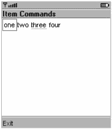
图 6-3：项目“three”拥有一个命令。

请注意，工具包模拟器如何通过一条浅下划线来指示项目上存在一个或多个命令。当您导航到表单中带有额外命令的项目时，该命令会像其他任何命令一样显示出来，如图 6-4 所示。

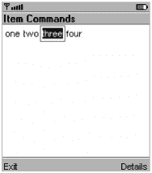
图 6-4：当项目被选中时，其命令会显示出来。

管理项目命令的语义与管理表单命令的语义几乎相同。您可以使用 `addCommand()` 和 `removeCommand()` 来管理 Item 上的命令。请注意，添加到 Item 的命令类型应为 `ITEM`，即使不是此类型也不会抛出异常。可以使用 `setItemCommandListener()` 方法分配一个命令监听器。`ItemCommandListener` 接口包含一个单一方法，类似于 `CommandListener` 的单一方法：

```
public void commandAction(Command c, Item item)
```

如何显示项目的命令取决于具体实现。您在 MIDlet 中只需添加命令、设置监听器，然后等待命令事件即可。

Item 还支持*默认命令*。如果运行时设备具有适合默认命令的按钮、旋钮或其他用户界面控件，则可以调用此命令。您可以通过调用 `setDefaultCommand()` 来设置 Item 的默认命令。

Item 在 MIDP 2.0 中最大的 API 变化与布局控制有关。Item 具有*最小尺寸*和*首选尺寸*，可用于控制项目在表单中显示的大小。最小尺寸由实现计算得出，并可通过 `getMinimumWidth()` 和 `getMinimumHeight()` 获取。最小尺寸取决于 Item 的内容，并且每次内容更改时，实现都可能更改它。无法更改项目的最小尺寸，但检查最小尺寸可能有助于您的应用程序决定如何布局表单。

相比之下，首选尺寸既可以由实现计算，也可以由您指定。首选宽度和高度的默认值为 -1，这是一个特殊值，告诉实现“我不关心，你自行决定该项目的最佳尺寸”。如果您在 `setPreferredSize()` 中为宽度或高度传递了特定的正值，则该维度被称为*锁定*，实现将尝试在布局中使用它。

`getPreferredWidth()` 和 `getPreferredHeight()` 方法并不总是返回您传递给 `setPreferredSize()` 的值。例如，如果您通过调用 `setPreferredSize(-1, -1)` 解锁了宽度和高度，那么 `getPreferredWidth()` 和 `getPreferredHeight()` 返回的值将是实现计算出的首选尺寸。

最后，MIDP 2.0 的 Item 类包含一个布局指令，可通过 `getLayout()` 和 `setLayout()` 访问。布局值由一个整数表示，通常是 `LAYOUT_2`（一个指示 MIDP 2.0 布局的标志）、一个水平值和一个垂直值的组合。`LAYOUT_2` 是一个标志，告诉实现该项目应使用 MIDP 2.0 规则进行布局。水平值包括：

*   `LAYOUT_LEFT`
*   `LAYOUT_RIGHT`
*   `LAYOUT_CENTER`

垂直值包括：

*   `LAYOUT_TOP`
*   `LAYOUT_BOTTOM`
*   `LAYOUT_VCENTER`

此外，布局值可能包含*收缩*或*扩展*。收缩意味着使用项目的最小宽度或高度，而扩展意味着拉伸项目的大小以填充可用宽度或行高。用于收缩和扩展的常量是：

*   `LAYOUT_SHRINK`（用于宽度）
*   `LAYOUT_EXPAND`（用于宽度）
*   `LAYOUT_VSHRINK`（用于高度）
*   `LAYOUT_VEXPAND`（用于高度）

最后，Item 的布局可能包含在项目之前或之后换行的请求，使用 `LAYOUT_NEWLINE_BEFORE` 或 `LAYOUT_NEWLINE_AFTER` 常量。项目在表单中的布局方式类似于文本在页面上的流动，因此这些常量允许您在项目之前或之后请求新行。

图 6-5 展示了一个简单示例，三个组件具有以下布局：

*   `LAYOUT_2 | LAYOUT_LEFT | LAYOUT_NEWLINE_AFTER`
*   `LAYOUT_2 | LAYOUT_CENTER | LAYOUT_NEWLINE_AFTER`
*   `LAYOUT_2 | LAYOUT_RIGHT | LAYOUT_NEWLINE_AFTER`

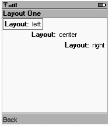
图 6-5：表单布局示例

#### StringItem

`StringItem` 表示一个简单的文本标签。例如，考虑以下代码：

```
Form form = new Form("Form Title");
StringItem stringItem = new StringItem("Label: ", "Value");
form.append(stringItem);
```

此代码（加上一个**返回**命令）生成的表单如图 6-6 所示。

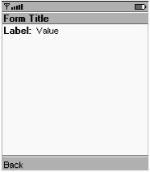
图 6-6：包含单个 *StringItem* 和一个 *返回* 命令的表单

您可以将 `StringItem` 的标签或值设置为 `null`，以指示其不应显示在屏幕上。（更好的方法是，您可以直接使用 Form 的 `append(String)` 方法。）`StringItem` 从 Item 继承了 `setLabel()` 和 `getLabel()` 方法。它还包含用于访问和调整字符串值的 `getText()` 和 `setText()` 方法。

MIDP 2.0 为 `StringItem` 和 `ImageItem` 增加了对*外观模式*的支持。外观模式允许项目看起来像 URL 链接或按钮，尽管在其他所有方面，该项目的行为与普通的 `StringItem` 或 `ImageItem` 相同。三种外观模式（定义在 Item 类中）是：

*   `PLAIN`：以正常状态显示项目。
*   `HYPERLINK`：将项目显示为 URL。典型的操作是尝试使用 MIDlet 的 `platformRequest()` 方法打开链接。
*   `BUTTON`：将项目显示为按钮。请注意，这可能不太方便，尤其是在没有指针事件的设备上，通常您应该在使用 `BUTTON` 外观模式的项目时，改用 Command。

与 `javax.microedition.lcdui` 包中几乎所有其他内容一样，显示不同外观模式是具体实现的责任，您的应用程序在不同设备上可能看起来不同。此外，实现适当的行为是您应用程序的责任。例如，您可能希望向一个 `HYPERLINK` 类型的 `StringItem` 添加一个命令，该命令调用 MIDlet 的 `platformRequest()` 方法来打开链接。

|  | 注意 | J2ME Wireless Toolkit 测试版模拟器在显示 *HYPERLINK* 或 *BUTTON* 类型的 *StringItem* 时，与 *PLAIN* 类型没有区别，除了一种特殊情况。如果 *StringItem* 是 *BUTTON* 类型并且有关联的项目命令，它会显示为带有斜角边框。 |

最后，MIDP 2.0 在 `StringItem` 类中提供了 `getFont()` 和 `setFont()` 方法。我将在第 10 章中描述 Font 类。

#### MIDP 2.0 中的 Spacer

MIDP 2.0 引入了一个新的 Item 类 `Spacer`，它表示表单中的空白区域。它可用于布局目的。您需要做的就是指定最小宽度和高度：

```
public Spacer(minWidth, minHeight)
```


#### TextField

TextField 表示一个可编辑的字符串。图 6-7 展示了一个标签为“TextFieldTitle”、值为“text”的 TextField。

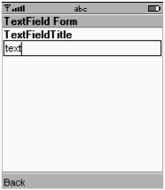
图 6-7：包含一个 *TextField* 和一个 *Back* 命令的表单

在 Sun 的 MIDP 2.0 模拟器中，可以通过点击模拟器中的数字按钮或使用键盘直接向 TextField 输入文本。当然，具体如何允许编辑由实现决定。某些实现甚至可能显示一个单独的编辑屏幕。

TextField 可以限制输入。定义了以下常量：

*   ANY 允许任何类型的输入。
*   NUMERIC 将输入限制为数字。
*   DECIMAL（MIDP 2.0 新增）允许包含小数部分的数字。
*   PHONENUMBER 要求输入电话号码。
*   EMAILADDR 输入必须是电子邮件地址。
*   URL 输入必须是 URL。

这些输入约束可能看起来很熟悉；它们与 TextBox 使用的约束相同，我在上一章中介绍过。与 TextBox 一样，标志 PASSWORD、SENSITIVE、UNEDITABLE、NON_PREDICTIVE、INITIAL_CAPS_WORD 和 INITIAL_CAPS_SENTENCE 可以使用 OR 运算符与约束组合使用。

要创建 TextField，需要提供标签、文本值、最大长度和输入约束。

```
public TextField(String label, String text, int maxSize, int constraints)
```

对于初始为空的 TextField，将 null 传递给 text 参数。

与 TextBox 一样，MIDP 2.0 中的 TextField 类包含一个 setInitialInputMode() 方法，用于向实现建议合适的输入模式。

#### ImageItem

表单也可以包含图像，这些图像由 ImageItem 的实例表示。ImageItem 具有若干关联数据：

*   *标签* 可能与图像一起显示。
*   *布局* 决定图像的放置位置。
*   如果无法显示图像，则显示*替代文本*。

要创建 ImageItem，只需提供要显示的 Image、标签、布局和替代文本。

ImageItem 为布局参数定义了常量。最简单的方式是指定默认值 LAYOUT_DEFAULT。如果需要更多控制，可以将水平值与垂直值组合使用。水平值包括 LAYOUT_LEFT、LAYOUT_CENTER 和 LAYOUT_RIGHT。垂直值包括 LAYOUT_NEWLINE_BEFORE 和 LAYOUT_NEWLINE_AFTER。在 MIDP 2.0 中，布局由 Item 类中的布局常量控制。ImageItem 类中的常量是为了向后兼容而保留的。

ImageItem 在 MIDP 2.0 中支持外观模式，与 StringItem 类似。ImageItem 包含一个新的构造函数，允许您设置外观模式。

图 6-8 展示了一个包含单个 ImageItem 的表单。

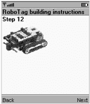
图 6-8：一个 *ImageItem*

#### DateField

DateField 是一种极其方便的机制，用户可以通过它输入日期、时间或两者。由实现决定为用户提供某种合理的方式来输入日期和时间；作为 MIDlet 程序员，您只需使用 DateField，无需担心具体实现。

要创建 DateField，请指定标签和类型。DateField 类中的三个常量描述了不同的类型：

*   DATE 显示可编辑的日期。
*   TIME 显示可编辑的时间。
*   DATE_TIME 同时显示日期和时间。

DateField 提供了两个构造函数。第一个使用默认时区，而第二个允许您显式指定 TimeZone：

```
public DateField(String label, int mode)
public DateField(String label, int mode, TimeZone timeZone) 
```

本质上，DateField 是 java.util.Date 的编辑器。正如您在第 4 章中所见，Date 表示时间点。DateField 负责在 Date 和人类可读的字符串之间进行转换，这与 Calendar 类非常相似。您可以使用以下方法设置或获取 DateField 所表示的 Date：

```
public Date getDate()
public void setDate(Date date)
```

在 J2ME Wireless Toolkit 模拟器中，DateField 的外观如图 6-9a 所示。请注意，如果在显示 DateField 之前没有向 setDate() 提供 Date，它将显示为未初始化状态，如图 6-9b 所示。

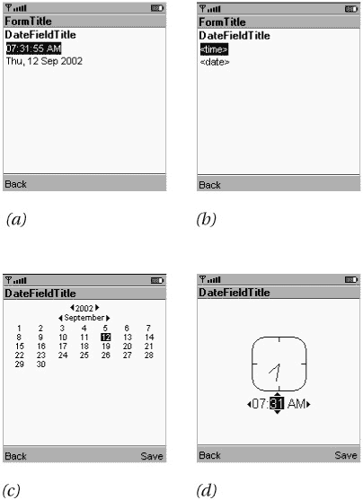
图 6-9：Sun 的 MIDP 2.0 模拟器中的 *DateField*

当用户选择 DateField 的日期或时间部分并进入编辑状态时，MIDP 实现会提供某种合适的编辑器。Sun 的模拟器提供了如图 6-9c 和图 6-9d 所示的编辑器。


#### 仪表

仪表（Gauge）表示一个整数值。具体如何显示由实现决定。在 Sun 的 MIDP 实现中，仪表的外观如图 6-10 所示。

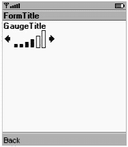
图 6-10：一个*仪表*

仪表的值可以通过 getValue() 和 setValue() 方法获取和修改。该值的范围从 0 到某个可变的最大值。仪表的最大值可以通过 getMaxValue() 和 setMaxValue() 方法获取和修改。

仪表的视觉外观是其值的近似表示。例如，图 6-10 中显示的仪表，其值可能为 7，最大值为 10；或者值可能为 42，最大值为 61。

在*交互式*仪表中，用户可以修改其值。同样，具体如何实现由实现决定。在 Sun 的参考实现中，可以使用左、右导航按钮来修改仪表的值。

仪表的构造函数很直接：

```
public Gauge(String label, boolean interactive,
    int maxValue, int initialValue)
```

例如，以下代码创建了一个最大值为 24、初始值为 2 的交互式仪表：

```
Gauge g = new Gauge("Power", true, 24, 2);
```

MIDP 2.0 扩展了仪表的作用。交互式仪表与之前相同，但新增了三种非交互式仪表，可用作进度指示器。你可以使用一个已知最大值的常规非交互式仪表来显示下载或计算的进度。例如，如果你要循环执行 20 次，可以创建一个最大值为 20 的仪表，并在每次循环时更新其值。

有两种没有最大值的非交互式仪表。在这种情况下，你需要使用特殊值 `INDEFINITE` 作为最大值。此类仪表可以是*增量式*或*连续式*。增量式仪表显示具有可测量步骤的操作；你的应用程序会在每次执行重要操作时更新仪表。例如，如果你正在下载一个文件，但不知道其大小，可以使用增量式仪表，并在每次读取一些数据时更新它。连续式仪表可能通过动画来显示进度，无需应用程序主动触发。这种类型的仪表适用于无法测量进度的操作。

仪表值本身可以设置为以下之一：

*   `INCREMENTAL_UPDATING` 表示你刚刚完成了一些操作，仪表应更新以反映该操作。
*   `INCREMENTAL_IDLE` 表示你希望仪表是增量式的，但当前没有发生任何操作。
*   `CONTINUOUS_RUNNING` 表示连续式仪表处于运行模式。
*   `CONTINUOUS_IDLE` 用于连续式仪表，表示当前没有进度。

以下示例展示了交互式、连续式和增量式仪表。命令（**Update** 和 **Idle**）为连续式和增量式仪表设置相应的值。通常你会从不同的线程中设置这些值，但在此示例中使用命令可以更容易理解发生了什么。

在 Sun 的 MIDP 2.0 模拟器中，连续式和空闲仪表使用简单的 Duke 动画来显示进度。屏幕截图请参见图 6-11。清单 6-2 包含一个演示不同类型仪表的 MIDlet 的源代码。

清单 6-2：*GaugeMIDlet* 源代码

| **** |

```
import javax.microedition.midlet.*;
import javax.microedition.lcdui.*;

public class GaugeMIDlet
    extends MIDlet
    implements CommandListener {
private Display mDisplay;

private Form mGaugeForm;
private Command mUpdateCommand, mIdleCommand;

private Gauge mInteractiveGauge;
private Gauge mIncrementalGauge;
private Gauge mContinuousGauge;

public GaugeMIDlet() {
  mGaugeForm = new Form("Gauges");
  mInteractiveGauge = new Gauge("Interactive", true, 5, 2);
  mInteractiveGauge.setLayout(Item.LAYOUT_2);
  mGaugeForm.append(mInteractiveGauge);
  mContinuousGauge = new Gauge("Non-I continuous", false,
      Gauge.INDEFINITE, Gauge.CONTINUOUS_RUNNING);
  mContinuousGauge.setLayout(Item.LAYOUT_2);
  mGaugeForm.append(mContinuousGauge);
  mIncrementalGauge = new Gauge("Non-I incremental", false,
      Gauge.INDEFINITE, Gauge.INCREMENTAL_UPDATING);
  mIncrementalGauge.setLayout(Item.LAYOUT_2);
  mGaugeForm.append(mIncrementalGauge);

  mUpdateCommand = new Command("Update", Command.SCREEN, 0);
  mIdleCommand = new Command("Idle", Command.SCREEN, 0);
  Command exitCommand = new Command("Exit", Command.EXIT, 0);
  mGaugeForm.addCommand(mUpdateCommand);
  mGaugeForm.addCommand(mIdleCommand);
  mGaugeForm.addCommand(exitCommand);
  mGaugeForm.setCommandListener(this);
}

public void startApp() {
  if (mDisplay == null) mDisplay = Display.getDisplay(this);
  mDisplay.setCurrent(mGaugeForm);
}
  public void pauseApp() {}

  public void destroyApp(boolean unconditional) {}

  public void commandAction(Command c, Displayable s) {
    if (c.getCommandType() == Command.EXIT)
      notifyDestroyed();
    else if (c == mUpdateCommand) {
      mContinuousGauge.setValue(Gauge.CONTINUOUS_RUNNING);
      mIncrementalGauge.setValue(Gauge.INCREMENTAL_UPDATING);
    }
    else if (c == mIdleCommand) {
      mContinuousGauge.setValue(Gauge.CONTINUOUS_IDLE);
      mIncrementalGauge.setValue(Gauge.INCREMENTAL_IDLE);
    }
  }
}
```

| **** |

|  |

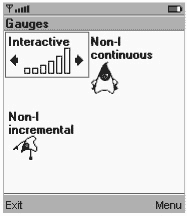
图 6-11：MIDP 2.0 中的三种*仪表*

#### 选择组

Form 中 Item 的最后一个类是 ChoiceGroup。ChoiceGroup 提供一组选项。它与本章开头描述的 `javax.microedition.lcdui.List` 非常相似。这种相似性并非巧合；ChoiceGroup 和 List 都实现了 `Choice` 接口，该接口是两个类中所有实例方法的源泉。

如果你已经阅读了关于 List 的部分，那么你几乎已经掌握了使用 ChoiceGroup 所需的一切知识，因为其实例方法的工作方式完全相同。

ChoiceGroup 具有以下构造函数：

```
public ChoiceGroup(String label, int choiceType)
public ChoiceGroup(String label, int choiceType, String[] stringElements,
    Image[] imageElements)
```

choiceType 应该很熟悉；它可以是 `EXCLUSIVE` 或 `MULTIPLE`，即 `Choice` 接口中定义的常量。实际上，ChoiceGroup 的构造函数与 List 的构造函数工作方式完全相同，只是不允许使用 `IMPLICIT`。这是合理的，因为 ChoiceGroup 是表单中的一个项目，而不是整个屏幕。MIDP 2.0 还为 ChoiceGroup 添加了 `POPUP` 类型，使其看起来像组合框或下拉菜单。ChoiceGroup 在 Form 中显示为其他任何元素；图 6-12 显示了示例。

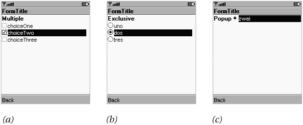
图 6-12：*ChoiceGroup* 示例—— (a) *MULTIPLE*，(b) *EXCLUSIVE* 和 (c) *POPUP*


### 响应项目变更

表单中的大多数项目在用户更改时都会触发事件。您的应用程序可以通过以下方法向表单注册 `ItemStateListener` 来监听这些事件：

```
public void setItemStateListener(ItemStateListener iListener)
```

`ItemStateListener` 是一个包含单个方法的接口。每当表单中的项目发生更改时，都会调用此方法：

```
public void itemStateChanged(Item item)
```

清单 6-3 创建了一个包含两个项目的表单：一个交互式仪表盘和一个字符串项目。当您调整仪表盘时，其值会通过 `ItemStateListener` 机制反映在字符串项目中。

清单 6-3：*GaugeTracker* 源代码

| **** |

```
import javax.microedition.midlet.*;
import javax.microedition.lcdui.*;

public class GaugeTracker
    extends MIDlet
    implements ItemStateListener, CommandListener {
  private Gauge mGauge;
  private StringItem mStringItem;
  public GaugeTracker() {
    int initialValue = 3;
    mGauge = new Gauge("GaugeTitle", true, 5, initialValue);
    mStringItem = new StringItem(null, "[value]");
    itemStateChanged(mGauge);
  }

  public void itemStateChanged(Item item) {
    if (item == mGauge)
      mStringItem.setText("Value = " + mGauge.getValue());
  }

  public void commandAction(Command c, Displayable s) {
    if (c.getCommandType() == Command.EXIT)
      notifyDestroyed();
  }

  public void startApp() {
    Form form = new Form("GaugeTracker");
    form.addCommand(new Command("Exit", Command.EXIT, 0));
    form.setCommandListener(this);
    // 现在添加选定的项目。
    form.append(mGauge);
    form.append(mStringItem);
    form.setItemStateListener(this);

    Display.getDisplay(this).setCurrent(form);
  }

  public void pauseApp() {}

  public void destroyApp(boolean unconditional) {}
} 
```

| **** |

|  |

## 总结

本章介绍了 MIDP 的高级用户界面屏幕：列表和表单。列表是一个元素列表，允许单选或多选。您提供项目——具体实现负责决定如何显示它们、用户如何导航以及用户如何选择项目。表单是由一系列项目构建的通用屏幕。MIDP API 提供了一个便捷的项目工具箱——从简单的字符串和图像项目到更复杂的日期字段和选择组类。

尽管列表和表单功能非常强大，但您应谨慎使用它们，尤其是表单。小型设备屏幕较小，因此您不应在每个屏幕中放置过多信息，尤其是当这会导致用户频繁上下滚动时。此外，易用性对于手机和寻呼机等消费类设备至关重要。请确保您的界面简洁、直观且尽可能简单。

