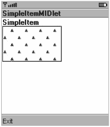
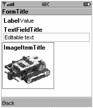
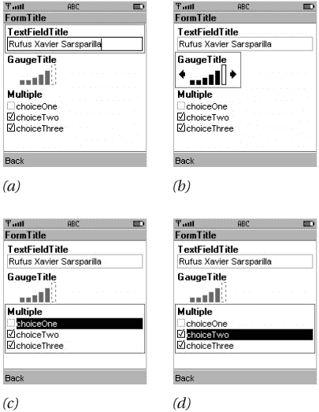
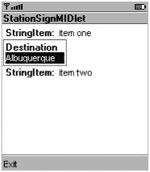

# 第 7 章：自定义项目

在上一章中，您了解了表单，它是 `javax.microedition.lcdui.Screen` 最灵活、最强大的子类。表单本质上是项目的集合。MIDP API 包含一个完整的项目子类工具箱，从文本和图像显示到交互式日期字段和仪表盘，一应俱全。

MIDP 2.0 通过允许您定义自己的项目，提供了更强大的功能。在本章中，您将学习如何创建能够自行绘制并响应用户输入的项目。

## 介绍 CustomItem

实现自定义项目的类被恰当地命名为 `CustomItem`。与表单中的所有项目一样，它是 `Item` 的子类。要创建您自己的项目，只需通过实现五个抽象方法来定义 `CustomItem` 的子类。下面列出的前四个方法与项目*内容区域*的大小有关，该区域是您的代码负责的区域。自定义项目的总区域包括标签和可能的边框，但这些由实现负责。您的 `CustomItem` 子类仅负责内容区域。

```
protected int getPrefContentWidth(int height)
protected int getPrefContentHeight(int width)
protected int getMinContentWidth()
protected int getMinContentHeight()
```

前两个方法应返回定义项目*期望*大小的值。当 MIDP 实现布局包含您的项目的表单时，它可能无法满足您的首选大小，但会尽力尝试。实现会将建议的高度和宽度传递给这些方法，以便让您的项目类了解其最终尺寸的大致情况。例如，实现可能会调用您的项目的 `getPrefContentWidth()` 方法，并将高度参数的值设为 18。这相当于实现向您的项目询问：“如果我将您的高度设为 18，您希望宽度是多少？”

第二对方法应返回有关项目最小尺寸的信息。这是您的项目认为可以容忍的最小尺寸。

具体 `CustomItem` 子类必须定义的第五个方法是 `paint()` 方法，实现会调用它来渲染项目。

```
protected void paint(Graphics g, int w, int h)
```

`Graphics` 对象可用于在项目的内容区域绘制线条、形状、文本和图像。`Graphics` 类将在第 10 章中全面介绍；现在，我将仅使用几个简单的方法来演示如何绘制自定义项目。`w` 和 `h` 参数表示内容区域的当前宽度和高度。

掌握了这些知识，您可以通过实现上述五个抽象方法并提供构造函数来创建一个简单的 `CustomItem`。清单 7-1 展示了这样一个类 `SimpleItem`。该类为最小和首选内容尺寸返回硬编码值，并提供了一个绘制简单三角形图案的 `paint()` 方法。

清单 7-1：一个简单的自定义项目

| **** |

```
import javax.microedition.lcdui.*;

public class SimpleItem
    extends CustomItem {
  public SimpleItem(String title) { super(title); }

// CustomItem 抽象方法。

public int getMinContentWidth() { return 100; }
  public int getMinContentHeight() { return 60; }

public int getPrefContentWidth(int width) {
    return getMinContentWidth();
  }

public int getPrefContentHeight(int height) {
    return getMinContentHeight();
  }

public void paint(Graphics g, int w, int h) {
    g.drawRect(0, 0, w - 1, h - 1);
    g.setColor(0x000000ff);
    int offset = 0;
    for (int y = 4; y < h; y += 12) {
      offset = (offset + 12) % 24;
      for (int x = 4; x < w; x += 24) {
        g.fillTriangle(x + offset, y,
                       x + offset - 3, y + 6,
                       x + offset + 3, y + 6);
      }
    }
  }
}
```

| **** |

|  |

我不会让您自己编写 MIDlet 来查看您的新项目。清单 7-2 展示了一个使用 `SimpleItem` 的 MIDlet：

清单 7-2：演示 *SimpleItem* 的 MIDlet

| **** |

```
import javax.microedition.midlet.*;
import javax.microedition.lcdui.*;

public class SimpleItemMIDlet
    extends MIDlet
    implements CommandListener {
  public void startApp() {
    Form form = new Form("SimpleItemMIDlet");
    form.append(new SimpleItem("SimpleItem"));

Command c = new Command("Exit", Command.EXIT, 0);
    form.addCommand(c);
    form.setCommandListener(this);

Display.getDisplay(this).setCurrent(form);
  }

public void pauseApp() {}

public void destroyApp(boolean unconditional) {}

public void commandAction(Command c, Displayable s) {
    if (c.getCommandType() == Command.EXIT)
      notifyDestroyed();
  }
} 
```

| **** |

|  |

图 7-1 展示了此 MIDlet 的运行效果。


图 7-1：一个简单的自定义项目


## 自定义项绘制

如你所见，自定义项在其 `paint()` 方法中绘制到屏幕上。该方法接收一个 `Graphics` 对象，该对象有两个用途。首先，它代表自定义项内容区域的绘制表面。其次，它提供了大量用于绘制形状、图像和文本的方法。我不会在第 10 章之前介绍所有这些方法，但你将在本章的示例中看到其中几个：例如，`drawString()` 用于渲染文本，而 `drawLine()` 用于渲染直线。

`paint()` 方法是*回调*的一个示例，即由 MIDP 实现调用的代码中的方法。当实现需要在屏幕上显示你的自定义项时，它会调用 `paint()`。当包含自定义项的表单正在布局时，它会调用其他方法来获取组件的最小和首选尺寸。显示整个屏幕是实现的工作；它仅调用你的 `paint()` 方法来显示屏幕上由自定义项占据的部分。你无需告诉实现何时绘制你的项；只需告诉它你的项是表单的一部分，然后它会自行计算如何显示所有内容。

如果自定义项的外观需要更改，你可以通过调用 `repaint()` 方法来请求刷新。此方法向实现发出信号，表明你的项需要重新绘制。作为响应，实现将很快再次调用 `paint()` 方法。为了优化绘制，你可能只想重绘项的一部分。在这种情况下，请使用 `repaint(int x, int y, int width, int height)` 来描述需要绘制的项的矩形区域。

有两个方法可以返回有助于使项的外观与设备的外观和风格保持一致的信息。第一个是 `Display` 类中的 `getColor()`。当你提供以下常量之一时，此方法返回一个表示颜色的 `int` 值：

*   `COLOR_BACKGROUND`
*   `COLOR_BORDER`
*   `COLOR_FOREGROUND`
*   `COLOR_HIGHLIGHTED_BACKGROUND`
*   `COLOR_HIGHLIGHTED_BORDER`
*   `COLOR_HIGHLIGHTED_FOREGROUND`

例如，你可以使用以下代码将当前绘制颜色设置为系统的高亮前景色：

```
public void paint(Graphics g) {
  // Display mDisplay = ...
  int fhc = mDisplay.getColor(
      Display.COLOR_HIGHLIGHTED_FOREGROUND);
  g.setColor(fhc);
  // Draw stuff ...
}
```

类似地，如果你希望自定义项绘制的任何文本与表单中的其他项协调一致，你可以使用 `Font` 类中的以下方法检索合适的 `Font`：

```
public static Font getFont(int fontSpecifier)
```

只需传递 `FONT_STATIC_TEXT` 或 `FONT_INPUT_TEXT`，此方法就会返回一个可用于绘制文本的合适 `Font` 对象。以下代码展示了如何使用合适的字体绘制用户可编辑文本：

```
public void paint(Graphics g) {
  Font f = Font.getFont(Font.FONT_INPUT_TEXT);
  g.setFont(f);
  // Draw text ...
} 
```

我将在第 10 章中详细介绍 `Font`。简而言之，`Font` 决定了屏幕上绘制的文本的外观。

## 显示、隐藏和调整大小

当自定义项变为可见（甚至部分可见）时，MIDP 实现会调用其 `showNotify()` 方法。你可以预期随后会调用 `paint()` 来渲染该项。类似地，当该项不再可见时（例如，用户已将该项滚动出屏幕），会调用 `hideNotify()`。

自定义项的大小可能会被实现更改，例如，当包含的表单因内容变化而重新布局时。在这种情况下，会使用内容区域的新宽度和高度调用项的 `sizeChanged()` 方法。

同样，你的自定义项可能决定需要更改大小。在这种情况下，你的项应调用 `invalidate()` 方法，该方法向实现发出信号，表明它可能需要重新布局包含的表单。

## 处理事件

自定义项可以通过重写以下任意或所有方法来响应键盘和指针事件：

```
protected void keyPressed(int keyCode)
protected void keyReleased(int keyCode)
protected void keyRepeated(int keyCode)
protected void pointerPressed(int x, int y)
protected void pointerReleased(int x, int y)
protected void pointerDragged(int x, int y)
```

这些方法会响应用户的操作而被调用。`keyCode` 参数很可能是 `Canvas` 类中定义的常量之一：`KEY_NUM0` 到 `KEY_NUM9`、`KEY_POUND` 或 `KEY_STAR`。`CustomItem` 类还支持一种称为*游戏动作*的便捷机制，它将设备特定的键映射到设备无关的动作。`getGameAction()` 方法执行此映射。有关游戏动作的完整讨论，请参见第 10 章。

指针回调方法提供指针事件的位置，该位置是相对于自定义项内容区域的一对坐标。

设备具有不同的能力，有些可能无法向自定义项传递某些类型的事件。例如，许多手机不支持指针事件。要在运行时了解设备的能力，自定义项使用 `getInteractionModes()` 方法。此方法返回以下常量（在 `CustomItem` 中定义）的某种组合：

*   `KEY_PRESS`
*   `KEY_RELEASE`
*   `KEY_REPEAT`
*   `POINTER_PRESS`
*   `POINTER_RELEASE`
*   `POINTER_DRAG`
*   `TRAVERSE_HORIZONTAL`
*   `TRAVERSE_VERTICAL`

除了遍历项（将在下一节中介绍）之外，`getInteractionModes()` 返回值的组合直接对应于你的自定义项中可能被调用的回调。你可以利用此信息构建一个在任何情况下都能正常工作的 `CustomItem`。例如，在极少数情况下，如果某个设备无法向自定义项传递按键和指针事件，你可以在该项上提供一个 `Command` 来调用一个单独的编辑屏幕。


## 项目遍历

表单支持一种*焦点*概念，即表单中的某一项当前被选中。*遍历*指的是用户能够将焦点从一个项目移动到另一个项目。在大多数情况下，MIDP 实现会处理表单遍历的细节。例如，在 Sun 模拟器中，你可以通过按上下方向键来移动表单中各项的焦点。焦点通过项目周围的实心黑色边框来指示。图 7-2 展示了一个包含多个项目的表单；第三个项目（一个 ImageItem）拥有焦点。


图 7-2：焦点位于此表单的第三个项目上。

到目前为止，一切顺利——这都非常简单。事实上，CustomItem 中提供的默认实现意味着在许多情况下你甚至不需要考虑遍历问题。

让事情变得有点棘手的是*内部*遍历的概念。某些项目支持在项目*内部*遍历多个选项。一个很好的例子是 ChoiceGroup 项目。以下序列展示了在 MIDP 参考实现模拟器中遍历一个包含三个项目的表单的过程。图 7-3 展示了遍历从文本字段开始，经过仪表，最后进入 ChoiceGroup 的过程。


图 7-3：表单遍历与内部项目遍历

有两个方法用于指示遍历事件。第一个是 `traverse()`，在用户首次遍历进入该项目时被调用。默认情况下，此方法返回 `false`，表示该项目不支持内部遍历。第二个方法是 `traverseOut()`，在用户离开该项目时被调用。

```
protected boolean traverse(int dir, int viewportWidth, int viewportHeight,
    int[] visRect_inout);
protected void traverseOut(); 
```

|  | 注意 | 乍一看，你可能会期望当设备上按下按键时，自定义项目会同时接收到遍历方法和按键事件方法的调用。例如，如果用户按下向下箭头键移入项目，你可能会期望同时调用 `traverse()` 和 `keyPressed()` 方法。实际上，实现应该保持按键事件和遍历事件互不混淆。请记住，某些设备可能具有替代的遍历控件（例如滚轮），因此实现（以及你的自定义项目）应明确区分这些事件。 |

如果你确实编写了一个支持内部遍历的自定义项目，你需要关注传递给 `traverse()` 的参数，并且需要返回 `true` 以表明你的项目支持内部遍历。传递给 `traverse()` 方法的信息如下：

*   `dir` 指示用户请求的遍历方向。它可以是以下值之一：`Canvas.UP`、`Canvas.DOWN`、`Canvas.LEFT`、`Canvas.RIGHT` 或 `CustomItem.NONE`。

*   `viewportWidth` 和 `viewportHeight` 指示包含此自定义项目的表单中可用于项目的尺寸。（本质上，`viewportWidth` 和 `viewportHeight` 描述了表单的内容区域。）这些尺寸可能有助于确定项目选项与可用屏幕区域大小之间的关系。

*   `visRect_inout` 有点奇怪。它是一个包含四个元素的整数数组。当调用 `traverse()` 方法时，`visRect_inout` 描述了自定义项目可见内容区域的区域。当 `traverse()` 方法返回时，`visRect_inout` 应包含项目中当前选中选项的边界。

如果这开始听起来有点复杂，请稍等。遍历机制足够灵活，可以支持不同类型的遍历。某些设备可能仅支持垂直遍历，而其他设备可能仅支持水平遍历，还有一些设备可能两者都支持。你可以通过 `getInteractionModes()` 方法了解设备的遍历能力，该方法可以返回 `CustomItem.TRAVERSE_HORIZONTAL`、`CustomItem.TRAVERSE_VERTICAL` 或两者兼有。根据自定义项目中所包含选项的性质，你可能需要灵活处理接收到的遍历方向以及项目内部的实际遍历。

请记住，当焦点首次到达你的项目时，会调用 `traverse()` 方法。如果此方法返回 `true`，则在遍历过程中会重复调用 `traverse()`。当用户遍历离开你的项目时，从 `traverse()` 方法返回 `false`。这会让实现知道内部遍历已结束。实现很可能会调用 `traverseOut()`，尽管这仅在焦点实际移离项目时才会发生。如果用户已到达表单的末尾或开头，则可能不会出现这种情况。

所有这些都在 CustomItem 的 `traverse()` 方法的 API 文档中进行了详尽细致的讨论。如果你计划实现一个具有内部遍历功能的自定义项目，请多次阅读文档，直到完全理解为止。


## 示例

在本节中，我将向你展示 StationSign，一个中等复杂度的 CustomItem。StationSign 具有以下特性：

*   实现了一个简单的字符串选择滚动列表。指针事件和按键事件会使当前选择移动到下一个选项。滚动过程带有动画效果。StationSign 是一个 Runnable——在构造函数中创建了一个单独的线程，用于调用 run() 方法。如果项目的当前显示状态与当前选择之间存在差异，run() 方法会通过滚动来协调两者。

*   通过使用静态文本的字体以及从 Display 的 getColor() 方法返回的颜色，来符合设备的外观和感觉。

*   不实现内部遍历。

*   使用 traverse() 和 traverseOut() 方法来识别焦点，并使用高亮颜色进行绘制。当调用 traverse() 时，StationSign 会设置一个布尔成员变量 mFocus，以指示该项目已获得焦点。在 paint() 方法中，使用 mFocus 来决定绘制项目所使用的颜色。当调用 traverseOut() 时，mFocus 被设置为 false，表示焦点已丢失。

StationSign 的完整源代码如清单 7-3 所示。

清单 7-3：*StationSign* 自定义项目

| **** |

```
import java.util.Vector;

import javax.microedition.lcdui.*;

public class StationSign
    extends CustomItem
    implements Runnable {
  private Vector mValues;
  private int mSelection;
  private boolean mTrucking;

private Display mDisplay;
  private Font mFont;
  private int mVisibleIndexTimesTen;
  private boolean mFocus;

public StationSign(String title, Display display) {
    super(title);
    mDisplay = display;
    mValues = new Vector();
    mSelection = 0;
    mTrucking = true;
    mFont = Font.getFont(Font.FONT_STATIC_TEXT);
    mVisibleIndexTimesTen = mSelection * 10;

Thread t = new Thread(this);
    t.start();
  }

public void add(String value) {
    if (value == null) return;
    mValues.addElement(value);
  }

public void remove(String value) {
    if (value == null) return;
    mValues.removeElement(value);
  }

public String getSelection() {
    if (mValues.size() == 0) return "";
    return (String)mValues.elementAt(mSelection);
  }

public void flip() {
    mSelection++;
    if (mSelection >= mValues.size()) mSelection = 0;
  }

public void dispose() {
    mTrucking = false;
  }

// Runnable 接口。

public void run() {
    while (mTrucking) {
      int target = mSelection * 10;
      if (mVisibleIndexTimesTen != target) {
        mVisibleIndexTimesTen++;
        if (mVisibleIndexTimesTen >= mValues.size() * 10)
          mVisibleIndexTimesTen = 0;
        repaint();
      }
      try { Thread.sleep(50); }
      catch (InterruptedException ie) {}
    }
  }

// CustomItem 抽象方法。

public int getMinContentWidth() {
    // 遍历所有值。找出最大宽度。
    int maxWidth = 0;
    for (int i = 0; i < mValues.size(); i++) {
      String value = (String)mValues.elementAt(i);
      int width = mFont.stringWidth(value);
      maxWidth = Math.max(maxWidth, width);
    }
    // 不要忘记标题，尽管我们并不
    // 确切知道用于标题的字体。
    int width = mFont.stringWidth(getLabel()) + 20;
    maxWidth = Math.max(maxWidth, width);
    return maxWidth;
  }
  public int getMinContentHeight() {
    return mFont.getHeight();
  }

public int getPrefContentWidth(int width) {
    return getMinContentWidth();
  }

public int getPrefContentHeight(int height) {
    return getMinContentHeight();
  }

public void paint(Graphics g, int w, int h) {
    int fraction = mVisibleIndexTimesTen % 10;
    int visibleIndex = (mVisibleIndexTimesTen - fraction) / 10;
    String value = (String)mValues.elementAt(visibleIndex);

g.setFont(mFont);
    int bc = mDisplay.getColor(Display.COLOR_BACKGROUND);
    int fc = mDisplay.getColor(Display.COLOR_FOREGROUND);
    if (mFocus == true) {
      bc = mDisplay.getColor(Display.COLOR_HIGHLIGHTED_BACKGROUND);
      fc = mDisplay.getColor(Display.COLOR_HIGHLIGHTED_FOREGROUND);
    }
    g.setColor(bc);
    g.fillRect(0, 0, w, h);
    g.setColor(fc);

// 简单情况：visibleIndex 对齐到单个项目。
    if (fraction == 0) {
      g.drawString(value, 0, 0, Graphics.TOP | Graphics.LEFT);
      return;
    }

// 复杂情况：显示两个项目并画一条线。
    int lineHeight = mFont.getHeight();
    int divider = lineHeight - lineHeight * fraction / 10;

// 绘制可见值的一部分。
    g.drawString(value, 0, divider - lineHeight,
        Graphics.TOP | Graphics.LEFT);
    // 现在获取下一个值。
    visibleIndex = (visibleIndex + 1) % mValues.size();
    value = (String)mValues.elementAt(visibleIndex);
    // 绘制分隔线。
    g.setStrokeStyle(Graphics.DOTTED);
    g.drawLine(0, divider, w, divider);

g.drawString(value, 0, divider,
        Graphics.TOP | Graphics.LEFT);
  }

// CustomItem 方法。

protected void keyPressed(int keyCode) { flip (); }

protected void pointerPressed(int x, int y) { flip(); }

protected boolean traverse(int dir,
      int viewportWidth, int viewportHeight,
      int[] visRect_inout) {
    mFocus = true;
    repaint();
    return false;
  }

protected void traverseOut() {
    mFocus = false;
    repaint();
  }
}
```

| **** |

|  |

清单 7-4 中的 MIDlet 显示了一个包含 StationSign 的表单。

清单 7-4：演示 *StationSign* 的 MIDlet

| **** |

```
import javax.microedition.midlet.*;
import javax.microedition.lcdui.*;

public class StationSignMIDlet
    extends MIDlet
    implements CommandListener {
  public void startApp() {
    Display display = Display.getDisplay(this);
    Form form = new Form("StationSignMIDlet");
    form.append(new StringItem("StringItem: ", "item one"));
    StationSign ss = new StationSign("Destination", display);
    ss.add("Albuquerque");
    ss.add("Savannah");
    ss.add("Pocatello");
    ss.add("Des Moines");
    form.append(ss);
    form.append(new StringItem("StringItem: ", "item two"));

Command c = new Command("Exit", Command.EXIT, 0);
    form.addCommand(c);
    form.setCommandListener(this);

display.setCurrent(form);
  }

public void pauseApp() {}

public void destroyApp(boolean unconditional) {}

public void commandAction(Command c, Displayable s) {
    if (c.getCommandType() == Command.EXIT)
      notifyDestroyed();
  }
}
```

| **** |

|  |

运行中的 MIDlet 如图 7-4 所示。该图展示了一个夹在两个 StringItem 之间的 StationSign 实例。你可以通过表单导航，观察 StationSign 在获得输入焦点时外观的变化。如果在 StationSign 上按下选择键，你将看到下一个选项滚动进入视野。


图 7-4：在*表单*中运行的 *StationSign*

## 总结

本章描述了 MIDP 2.0 令人兴奋的新特性之一：自定义项目。CustomItem 类是你编写可包含在 Form 中的项目的基础。你可以通过在 paint() 方法中使用 Graphics 对象进行绘制，来决定自定义项目的外观。CustomItem 中的回调方法让你能够了解项目何时显示或隐藏，并传递按键、指针和遍历事件。两个示例 SimpleItem 和 StationSign 提供了可运行代码的基础，你可以在此基础上进行改编，构建自己的项目。

