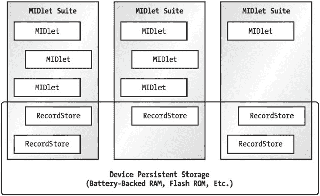
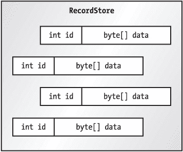

# 第 8 章：持久化存储


## 重点

MIDP 应用程序必须在多种设备上无缝运行。您已经看到这在用户界面领域可能是一个挑战。当时的技巧是使用抽象概念，这些概念将由特定于设备的实现映射到屏幕上。

MIDP 处理持久性存储的方法基本相同。您的应用程序可以在带有闪存 ROM、电池供电 RAM 甚至小型硬盘的设备上运行。MIDP 应用程序并不真正关心这些；它们只知道一种称为记录存储的小型数据库。设备上的 MIDP 实现负责以某种合理的方式将记录存储映射到任何可用的持久性存储上。

我们讨论的是*少量*数据；MIDP 规范规定持久性存储的最小容量仅为 8KB。

## 概述

MIDP 中的持久性存储以记录存储为核心。*记录存储*是一个小型数据库，包含称为*记录*的数据片段。记录存储由 `javax.microedition.rms.RecordStore` 的实例表示。在 MIDP 1.0 中，记录存储的作用域仅限于单个 MIDlet 套件。换句话说，一个 MIDlet 只能访问由同一套件中的 MIDlet 创建的记录存储。图 8-1 展示了 MIDlet 套件与记录存储之间的关系。MIDP 2.0 允许可选地共享记录存储。请参阅本章后面的“在 MIDP 2.0 中共享记录存储”一节。


图 8-1：记录存储属于 MIDlet 套件。

记录存储通过名称进行标识。在一个 MIDlet 套件的记录存储中，名称必须是唯一的。

## 管理记录存储

RecordStore 类有两个用途。首先，它定义了一个用于操作单个记录的 API。其次，它定义了一个用于管理记录存储的 API（主要是静态方法）。

### 打开、关闭和删除记录存储

要打开一个记录存储，您只需为其命名即可。

```
public static RecordStore openRecordStore(String recordStoreName,
    boolean createIfNecessary) throws RecordStoreException,
    RecordStoreFullException, RecordStoreNotFoundException
```

如果记录存储不存在，`createIfNecessary` 参数将决定是否创建一个新的记录存储。如果记录存储不存在，并且 `createIfNecessary` 参数为 `false`，则会抛出 `RecordStoreNotFoundException`。

以下代码打开一个名为 "Address" 的记录存储。

```
RecordStore rs = RecordStore.openRecordStore("Address", true); 
```

如果该记录存储尚不存在，则会被创建。

可以通过调用 `closeRecordStore()` 方法来关闭一个已打开的记录存储。与任何可以打开和关闭的事物一样，在完成操作后关闭记录存储是一个好习惯。小型设备上的内存和处理能力都很有限，因此您应记住尽可能地进行清理。您甚至可能不应该在 MIDlet 的整个生命周期内保持记录存储打开；毕竟，您的 MIDlet 可能会被设备的应用程序管理器暂停，而在 MIDlet 暂停期间保持资源打开是不明智的。

要找出特定 MIDlet 套件可用的所有记录存储，请调用 `listRecordStores()` 方法：

```
public static String[] listRecordStores()
```

最后，要删除一个记录存储，请调用静态方法 `deleteRecordStore()`。该记录存储及其包含的记录将被删除。

|  | 注意  | 记录存储操作，特别是打开和关闭，在实际设备上可能会很耗时。使用桌面 MIDP 模拟器您可能不会注意到延迟，但在真实设备上，它可能会明显降低应用程序的速度。（请参阅 [*http://www.poqit.com/midp/bench/*](http://www.poqit.com/midp/bench/) 获取来自真实设备的一些发人深省的测量数据。）对于许多应用程序，将记录存储访问放在其自己的线程中可能是合适的，就像网络访问放在其自己的线程中一样。 |

### 在 MIDP 2.0 中共享记录存储

在 MIDP 2.0 中，记录存储还具有*授权模式*。默认的授权模式是 `AUTHMODE_PRIVATE`，这意味着记录存储只能由创建该记录存储的 MIDlet 套件中的 MIDlet 访问。这与前面描述的情况完全相同。

通过将记录存储的授权模式更改为 `AUTHMODE_ANY`，可以共享记录存储，这意味着设备上的任何其他 MIDlet 都可以访问该记录存储。请谨慎使用！不要在 `AUTHMODE_ANY` 记录存储中存放任何秘密。此外，您还可以决定是否希望共享的记录存储是可写的还是只读的。

您可以使用 `RecordStore` 类中一个新的 `openRecordStore()` 方法来创建共享记录存储：

```
public static RecordStore openRecordStore(String recordStoreName,
    boolean createIfNecessary, byte authMode, boolean writable)
    throws RecordStoreException, RecordStoreFullException,
    RecordStoreNotFoundException
```

`authMode` 和 `writable` 参数仅在创建记录存储时使用，这意味着记录存储不存在且 `createIfNecessary` 为 `true`。您可以使用以下方法更改已打开记录存储的授权模式和可写标志：

```
public void setMode(byte authmode, boolean writable)
    throws RecordStoreException
```

请注意，只有属于创建该记录存储的套件的 MIDlet 才能更改其授权模式和可写标志。

如何访问共享的记录存储？最后一个 `openRecordStore()` 方法提供了答案：

```
public static RecordStore openRecordStore(String recordStoreName,
    String vendorName, String suiteName)
    throws RecordStoreException, RecordStoreNotFoundException
```

要访问共享的记录存储，您需要知道它的名称、创建它的 MIDlet 套件的名称以及该 MIDlet 套件供应商的名称。这些名称应该是 MIDlet 套件 JAR 清单或应用程序描述符中的 `MIDlet-Name` 和 `MIDlet-Vendor` 属性。

### 记录存储大小

记录存储由记录组成；每条记录只是一个字节数组。在空间受限的设备上，您可能希望密切关注记录存储的大小。要查明记录存储使用的字节数，请在 `RecordStore` 实例上调用以下方法：

```
public int getSize()
```

您可以通过调用以下方法来了解还有多少可用空间：

```
public int getSizeAvailable() 
```

请注意，此方法返回记录存储中的总可用空间，这与可用的记录数据量不同。也就是说，记录存储中的每条记录都关联有一些开销；`getSizeAvailable()` 方法返回的是可用于记录数据和开销的空间总量。

### 版本和时间戳

记录存储维护一个版本号和一个时间戳。每次修改记录存储时，版本号都会更新。它由一个整数表示，可以通过调用 `getVersion()` 来获取。

记录存储还会记住其最后被修改的时间。这个时间点由一个 `long` 值表示，可以通过 `getLastModified()` 获取。该 `long` 值表示自 1970 年 1 月 1 日午夜以来的毫秒数。您可能还记得（来自第 4 章），这与 `Date` 使用 `long` 表示时间点的方式相同。如果您需要检查记录存储的时间戳，可以从 `long` 时间戳创建一个 `Date` 对象。然后，您可以使用 `Calendar` 将 `Date` 转换为日历字段，如月、日、小时和分钟。


## 使用记录

*记录*本质上就是一个字节数组。RecordStore 中的每条记录都有一个整数标识号。图 8-2 展示了一个包含四条记录的 RecordStore 示意图。


图 8-2：*RecordStore* 内部结构

### 添加记录

要添加新记录，需将字节数组提供给 addRecord() 方法：

```
public int addRecord(byte[] data, int offset, int numBytes)
    throws RecordStoreNotOpenException,
           RecordStoreException,
           RecordStoreFullException
```

添加的记录长度为 numBytes 字节，数据取自 data 数组中从 offset 开始的位置。该方法会返回新记录的 ID。大多数其他记录操作都需要此 ID 来标识特定记录。

虽然没有明确的最大记录长度，但显然会受设备上可用于记录存储的空间限制。

以下代码片段演示了如何向名为 rs 的记录存储中添加一条新记录。它从一个字符串创建字节数组，然后将整个字节数组写入一条新记录。

```
String record = "This is a record";
byte[] data = record.getBytes();
int id = rs.addRecord(data, 0, data.length);
```

### 检索记录

你可以通过将记录 ID 提供给以下方法来检索记录：

```
public byte[] getRecord(int recordId)
    throws RecordStoreNotOpenException,
           InvalidRecordIDException,
           RecordStoreException
```

此方法返回一个新创建的字节数组，其中包含具有所请求 ID 的记录。该方法的另一个版本会将记录数据放入你提供的数组中：

```
public int getRecord(int recordId, byte[] buffer, int offset)
    throws RecordStoreNotOpenException,
           InvalidRecordIDException,
           RecordStoreException 
```

此方法返回复制到数组中的字节数。如果你提供的数组不够大，无法容纳该记录，则会抛出 ArrayOutOfBoundsException。你可以通过调用 getRecordSize() 提前了解特定记录的大小。

给定一个 RecordStore rs 和一个记录 ID id，以下是检索记录数据的一种方法：

```
byte[] retrieved = new byte[rs.getRecordSize(id)];
rs.getRecord(id, retrieved, 0);
String retrievedString = new String(retrieved);
```

如果你要从记录存储中提取大量记录，可能不希望每次都创建一个新的字节数组。为了提高效率，你可以创建一个数组并反复使用它来从记录存储中提取记录。创建缓冲区的一种方法是使其与记录存储中最大的记录一样大。如果这不可行，或者你不知道最大记录有多大，你可以简单地在检索每条记录之前检查其大小。如果遇到比缓冲区大的记录，你可以创建一个更大的缓冲区。

如果你不担心内存使用或速度问题，那么你可以使用 getRecord() 的另一种形式，它本质上与前面的代码示例相同：

```
byte[] retrieved = rs.getRecord(id);
```

### 删除和替换记录

到目前为止，你已经了解了如何添加新记录和检索它们。RecordStore 还支持另外两种记录操作。首先，你可以通过将记录 ID 传递给 deleteRecord() 来删除记录。其次，你可以通过调用以下方法来替换现有记录的数据：

```
public void setRecord(int recordId, byte[] newData, int offset, int numBytes)
    throws RecordStoreNotOpenException,
           InvalidRecordIDException,
           RecordStoreException,
           RecordStoreFullException 
```

### 获取 RecordStore 记录信息

RecordStore 维护一个内部计数器，用于分配记录 ID。你可以通过调用 getNextRecordID() 来了解下一个记录 ID 是什么。并且你可以通过调用 getNumRecords() 来了解 RecordStore 中存在多少条记录。

## 监听记录变更

RecordStore 支持类似 JavaBeans 的监听器机制。感兴趣的对象可以通过将自己注册为监听器来监听记录存储的变更。

监听器接口是 javax.microedition.rms.RecordListener。你可以使用以下两个方法来管理 RecordStore 的监听器：

```
public void addRecordListener(RecordListener listener)
public void removeRecordListener(RecordListener listener)
```

RecordListener 接口有三个方法：recordAdded()、recordChanged() 和 recordDeleted()。每当添加、更改或删除记录时，都会调用这些方法。每个方法都会传入相关的 RecordStore 和所涉及记录的 ID。

## 执行 RecordStore 查询

数据库的真正强大之处在于能够只提取你想要的记录。在更大的数据库中，这被称为*执行查询*。在 RecordStore 的世界中，你使用 enumerateRecords() 方法：

```
public RecordEnumeration enumerateRecords(RecordFilter filter,
    RecordComparator comparator, boolean keepUpdated)
    throws RecordStoreNotOpenException 
```

RecordStore 中的这一个方法涉及三个你之前从未见过的不同接口。让我们先从整体上看，然后再深入探讨这些新接口。

enumerateRecords() 方法返回 RecordStore 中记录的一个排序子集。RecordFilter 决定哪些记录将包含在该子集中，而 RecordComparator 则用于对它们进行排序。返回的 RecordEnumeration 允许你遍历返回的记录。

### RecordFilter

最简单的接口是 RecordFilter。当你在 RecordStore 上调用 enumerateRecords() 时，会检索每条记录的数据。RecordFilter 有一个方法 matches()，该方法会为每条记录调用。记录过滤器应检查记录数据，如果该记录应包含在 enumerateRecords() 返回的结果中，则返回 true。

以下是一个简单的 RecordFilter 实现，它只选择第一个数据字节为 7 的记录：

```
public class SevenFilter
    implements javax.microedition.rms.RecordFilter {
  public boolean matches(byte[] candidate) {
    if (candidate.length == 0) return false;
    return (candidate[0] == 7);
  }
}
```

### RecordComparator

RecordComparator 实现的工作是确定两组记录数据的顺序。RecordComparator 类似于 J2SE 中的 java.util.Comparator 接口。

要实现 RecordComparator 接口，你只需要定义一个方法：

```
public int compare(byte[] rec1, byte[] rec2) 
```

此方法检查 rec1 和 rec2 中包含的数据，并确定在排序列表中哪个应该排在前面。它应返回 RecordComparator 中定义的以下常量之一：

*   PRECEDES 表示 rec1 应排在 rec2 之前。
*   FOLLOWS 表示 rec1 应排在 rec2 之后。
*   EQUIVALENT 表示 rec1 和 rec2 相同，至少在排序方面如此。

以下简单的实现比较给定记录的每个字节，并按数值排序。如果两条记录的数据相同（直到较短记录的长度），则认为它们是 EQUIVALENT。

```
public class SimpleComparator
    implements javax.microedition.rms.RecordComparator {
  public int compare(byte[] rec1, byte[] rec2) {
    int limit = Math.min(rec1.length, rec2.length);

    for (int index = 0; index < limit; index++) {
      if (rec1[index] < rec2[index])
        return PRECEDES;
      else if (rec1[index] > rec2[index])
        return FOLLOWS;
    }
    return EQUIVALENT;
  }
}
```


### 使用 RecordEnumeration

`RecordStore` 的 `enumerateRecords()` 方法返回一个实现了 `RecordEnumeration` 接口的对象。`RecordEnumeration` 出乎意料地复杂。其基本功能是允许你遍历从 `RecordStore` 中检索到的记录。然而，与常规的 J2SE `Enumeration` 或 `Iterator` 不同，`RecordEnumeration` 允许你向前和向后滚动浏览其内容。此外，你还可以预览下一条或上一条记录的 ID。最后，`RecordEnumeration` 提供了使其数据与实际的 `RecordStore` 保持同步的可能性。在幕后，这是通过将 `RecordEnumeration` 注册为 `RecordStore` 变更的监听器来实现的。

`RecordEnumeration` 的基本操作是遍历一组记录。你可以通过调用 `hasNextElement()` 来判断是否存在下一条记录。如果下一条记录存在，你可以通过调用以下方法来检索其数据：

```
public byte[] nextRecord()
    throws InvalidRecordIDException,
           RecordStoreNotOpenException,
           RecordStoreException
```

或者，你也可以通过调用以下方法来检索下一条记录的 ID：

```
public int nextRecordId() throws InvalidRecordIDException
```

不过，你无法两全其美；`nextRecord()` 和 `nextRecordId()` 都会将 `RecordEnumeration` 推进到下一条记录。如果你想同时获取下一条记录的 ID 和数据，你需要先调用 `nextRecordId()`，然后直接从 `RecordStore` 中检索记录数据。

`RecordEnumeration` 的一个典型用法是直接遍历选定的记录，如下所示：

```
// 打开一个 RecordStore rs
// 创建一个 RecordFilter rf
// 创建一个 RecordComparator rc

RecordEnumeration re = rs.enumerateRecords(rf, rc, false);
while (re.hasNextElement()) {
  byte[] recordBytes = re.nextRecord();
  // 处理检索到的字节数据。
}
```

`RecordFilter` 和 `RecordComparator` 都可以为 `null`，在这种情况下，`RecordEnumeration` 将遍历记录存储中的每一条记录。`Preferences` 类就是以这种方式使用 `RecordEnumeration` 的。

|  | 注意 | 如果 *RecordComparator* 为 *null*，则 *RecordEnumeration* 不保证返回记录的排序顺序。 |

当你在选定的记录中移动时，你也可以向后移动。`RecordEnumeration` 包含了 `hasPreviousElement()`、`previousRecord()` 和 `previousRecordId()` 方法，它们的工作方式与对应的“下一个”方法相同。

在 `RecordEnumeration` 中移动当前位置的五种方式中，有四种是 `nextRecord()`、`nextRecordId()`、`previousRecord()` 或 `previousRecordId()` 方法。第五种方法有点像倒带按钮：`reset()` 将记录指针移回到选定记录的最开始位置。

当你使用完 `RecordEnumeration` 后，应该释放其资源。你可以通过调用 `destroy()` 来实现，之后 `RecordEnumeration` 将不再可用。

### 保持 RecordEnumeration 为最新状态

在多线程环境中，完全有可能在你遍历某个 `RecordStore` 的 `RecordEnumeration` 的同时，该 `RecordStore` 发生了变化。有两种方法可以处理这种情况。

第一种方法是调用 `rebuild()`，它会根据你最初指定的 `RecordFilter` 和 `RecordComparator` 显式地重建 `RecordEnumeration`。

另一种可能性是请求一个能根据底层 `RecordStore` 的任何变更自动更新的 `RecordEnumeration`。你可以通过将 `RecordStore` 的 `enumerateRecords()` 方法的 `keepUpdated` 参数设置为 `true` 来实现这一点。你可以通过调用 `isKeptUpdated()` 来了解 `RecordEnumeration` 是否自动更新。此外，你还可以通过调用 `keepUpdated()` 来更改其状态。

自动更新的 `RecordEnumeration` 会将自己作为 `RecordListener` 注册到底层的 `RecordStore` 中。每次 `RecordStore` 发生变更时，`RecordEnumeration` 都会被重建。请记住，这是一项开销很大的操作（就时间而言），因此如果 `RecordStore` 发生多次变更，你将为此付出代价。

## 使用资源文件

资源文件是持久化存储的另一种形式。访问资源文件非常简单，但它们仍然很重要。资源文件可以是图像、文本或其他类型的文件，它们存储在 MIDlet 套件的 JAR 文件中。这些文件是只读的。

你可以通过使用 `Class` 中的 `getResourceAsStream()` 方法，将资源文件作为 `InputStream` 来访问。典型的用法如下所示：

```
InputStream in = this.getClass().getResourceAsStream("/Robotag-t.png");
```

## 总结

MIDP 的持久化存储 API 特意设计得比较抽象，以认识到小型设备可能拥有许多不同的数据存储方法。在 MIDP 中，持久化存储的核心概念是记录存储，它是一组称为记录的数据位的集合。记录存储实际上是一个微型数据库，但其具体存储方式的细节则留给设备实现去处理。`javax.microedition.rms.RecordStore` 类封装了对持久化存储的所有访问。它提供了访问和操作 `RecordStore` 的方法，以及处理单个记录的方法。对于更高级的 `RecordStore` 操作，存在一些方法和接口，用于帮助跟踪 `RecordStore` 的变更或执行 `RecordStore` 查询。

