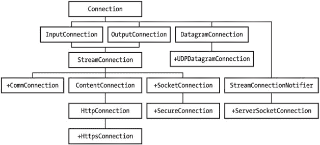
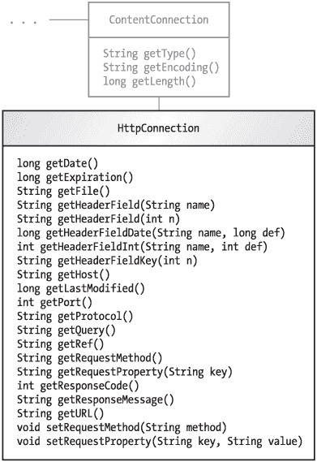
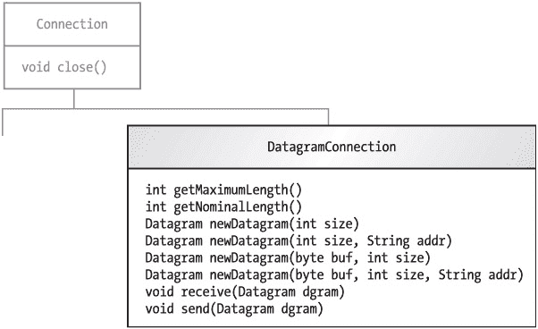
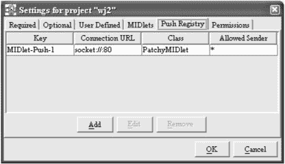
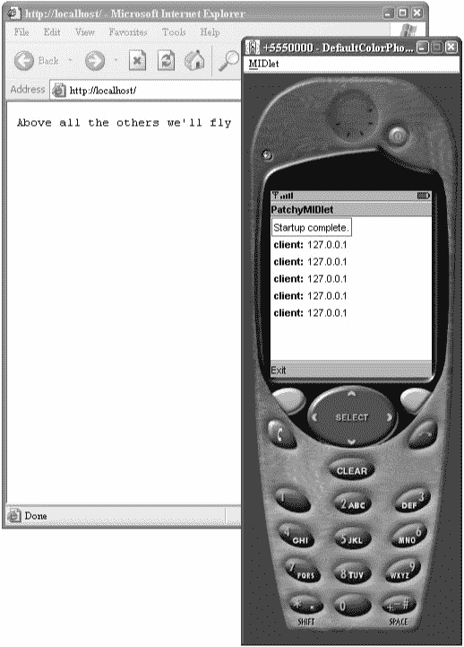
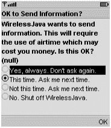

# 第 9 章：连接世界

在手机和寻呼机上运行 Java 很酷，但真正的亮点在于让你的 MIDlet 连接到互联网。有了互联网连接，你就可以编写应用程序，从而能够从世界任何地方通过手机访问信息并完成工作。


## 通用连接框架

CLDC 定义了一个极其灵活的网络连接 API，即*通用连接框架*。它全部包含在 `javax.microedition.io` 包中，并以 `Connection` 接口为基础。图 9-1 详细展示了 `Connection` 接口及其各种子接口。加号表示 MIDP 2.0 中新增的接口。


图 9-1：*Connection* 家族树

连接接口与现实世界之间的桥梁是一个名为 `javax.microedition.io.Connector` 的类。其基本思想是，你将一个连接字符串传递给 `Connector` 的某个静态方法，然后获得某个 `Connection` 实现。*连接字符串*看起来有点像 URL，但还有其他各种可能性。例如，连接字符串 `socket://apress.com:79` 可能会在 79 端口上打开一个到 `apress.com` 的 TCP/IP 连接，然后返回一个 `StreamConnection` 实现。

MIDP 1.0 通过仅要求一种连接类型（超文本传输协议，HTTP）极大地简化了这个通用框架。你将一个 HTTP URL 传递给 `Connector`，然后获得一个 `HttpConnection` 的实现。尽管符合 MIDP 1.0 的设备可能支持其他类型的连接，但 HTTP 是你唯一应该依赖的。MIDP 2.0 增加了对 HTTPS 连接（安全 HTTP）的强制支持，并标准化了其他几种连接类型的连接字符串。我将在本章后面讨论这些新特性。

`HttpConnection` 的方法在图 9-2 中有详细说明。`HttpConnection` 中的大多数方法都与 HTTP 的细节有关，这里我不再赘述。我将涵盖你在此处连接服务器所需了解的一切，包括 GET 和 POST 请求。如果你需要深入研究，可以阅读 RFC 2616（互联网标准文档之一），该文档可在 [`www.faqs.org/rfcs/rfc2616.html`](http://www.faqs.org/rfcs/rfc2616.html) 获取。请注意，MIDP 使用的是完整 HTTP 1.1 的一个子集；仅要求支持 GET、POST 和 HEAD 命令。


图 9-2：*HttpConnection* 接口

## HTTP 回顾

本节简要回顾超文本传输协议。完整内容在 RFC 2616 中；本节涵盖要点。

### 请求与响应

HTTP 是围绕请求和响应构建的。客户端向服务器发送一个请求——例如，“请给我某某 HTML 页面”。服务器发回一个响应——例如，“这是文件”，或者“我不知道你在说什么”。

请求和响应包含两部分：标头和内容。如果你在浏览器中输入一个 URL，浏览器会创建一个 HTTP 请求（主要是标头）并将其发送到服务器。服务器找到请求的文件，并在 HTTP 响应中将其发回。响应标头描述了诸如 Web 服务器类型、响应的文件类型、响应长度以及其他信息。响应内容则是文件本身的数据。

### 参数

浏览器和其他 HTTP 客户端向 HTTP 服务器请求特定的命名资源。此外，客户端可以向服务器传递参数。参数是简单的名称和值对。例如，客户端可能向服务器发送一个值为“jonathan”的“userid”参数。HTTP 还支持在请求体中向服务器传递二进制数据，而 Java 流类使得交换各种数据类型变得容易。

当浏览器作为 HTTP 客户端时，参数通常从 HTML 表单中收集。你见过这些表单，比如填写送货地址和信用卡号码的那种。当你点击表单上的**提交**或**下一步**按钮时，表单值会作为参数发送到 Web 服务器。

客户端在参数发送到服务器之前对其进行编码。参数以名称和值对的形式传递；多个参数用 & 符号分隔。参数编码的具体方式在 J2SE 文档的 `java.net.URLEncoder` 中有说明。规则相对简单。

*   空格字符被转换为加号 (+) 符号。
*   以下字符保持不变：小写字母 a 到 z、大写字母 A 到 Z、数字 0 到 9、句点 (.)、连字符 (-)、星号 (*) 和下划线 (_)。
*   所有其他字符都被转换为“%xy”，其中“xy”是一个十六进制数，表示该字符的低八位。

### GET、HEAD 和 POST

最简单的 HTTP 操作是 GET。当你在浏览器中输入 URL 时就会发生这种情况。浏览器说：“GET 这个 URL”，然后服务器用响应的标头和内容进行响应。

对于 GET 请求，参数以编码形式附加到 URL 的末尾。（某些服务器处理超长 URL 时会有问题；如果你有很多参数或二进制数据，你可能希望将数据放在 HTTP 请求体中传递。）例如，假设以下 URL 映射到你应用程序中的一个 Servlet 或其他服务器端组件：

[`jonathanknudsen.com/simple`](http://jonathanknudsen.com/simple)

添加参数很容易。如果你想传递一个名称为“user”、值为“jonathan”的参数，你可以使用以下 URL：

[`jonathanknudsen.com/simple?user=jonathan`](http://jonathanknudsen.com/simple?user=jonathan)

可以添加更多的名称和值对，用 & 符号分隔：

[`jonathanknudsen.com/simple?user=jonathan&zip=08540&day=saturday`](http://jonathanknudsen.com/simple?user=jonathan&zip=08540&day=saturday)

HEAD 操作与 GET 相同，但服务器只发回响应的标头。

POST 基本上与 GET 相同，但参数的处理方式不同。参数不是像 GET 那样附加在 URL 的末尾，而是作为请求体传递。它们的编码方式相同。

## 使用 HTTP GET 建立连接

从服务器加载数据非常简单，尤其是在执行 HTTP GET 时。只需将一个 URL 传递给 `Connector` 的静态 `open()` 方法。返回的 `Connection` 很可能是一个 `HttpConnection` 的实现，但你可以直接将其视为 `InputConnection`。然后获取相应的 `InputStream` 并尽情读取数据。

在代码中，它看起来像这样：

```
String url = "http://jonathanknudsen.com/simple";
InputConnection ic = (InputConnection)Connector.open(url);
InputStream in = ic.openInputStream();
// 从 InputStream 读取数据
ic.close();
```

涉及的大多数方法都可能抛出 `java.io.IOException`。为了清晰起见，我在示例中省略了 try 和 catch 块。

仅此而已。你现在可以将你的 MIDlet 连接到世界了。在 MIDP 2.0 中，情况稍微复杂一些，因为网络访问受设备上的安全策略约束。我将在本章末尾附近详细讨论这一点。

### 传递参数

对于 HTTP GET，所有参数都在 URL 体中传递给服务器。这使得向服务器发送参数变得容易。以下代码片段展示了如何传递两个参数：

```
String url = "http://localhost/midp/simple?pOne=one+bit&pTwo=two";
InputConnection ic = (InputConnection)Connector.open(url);
InputStream in = ic.openInputStream();
```

第一个参数名为“pOne”，值为“one bit”；第二个参数名为“pTwo”，值为“two”。


### 一个简单的示例

HTTP 并非只用于交换 HTML 页面。它实际上是一个通用的文件交换协议。在本节中，我们将看一个从网络加载图像并显示的示例。清单 9-1 展示了 ImageLoader 的源代码，这是一个 MIDlet，它从互联网获取图像并在屏幕上显示。

清单 9-1：从互联网获取图像

| **** |

```
import java.io.*;

import javax.microedition.io.*;
import javax.microedition.lcdui.*;
import javax.microedition.midlet.*;

public class ImageLoader
    extends MIDlet
    implements CommandListener, Runnable {
  private Display mDisplay;
  private Form mForm;

  public ImageLoader() {
    mForm = new Form("Connecting...");
    mForm.addCommand(new Command("Exit", Command.EXIT, 0));
    mForm.setCommandListener(this);
  }

  public void startApp() {
    if (mDisplay == null) mDisplay = Display.getDisplay(this);
    mDisplay.setCurrent(mForm);

    // Do network loading in a separate thread.
    Thread t = new Thread(this);
    t.start();
  }

  public void pauseApp() {}

  public void destroyApp(boolean unconditional) {}

  public void commandAction(Command c, Displayable s) {
    if (c.getCommandType() == Command.EXIT)
      notifyDestroyed();
  }

  public void run() {
    HttpConnection hc = null;
    DataInputStream in = null;

    try {
      String url = getAppProperty("ImageLoader-URL");
      hc = (HttpConnection)Connector.open(url);
      int length = (int)hc.getLength();
      byte[] data = null;
      if (length != -1) {
        data = new byte[length];
        in = new DataInputStream(hc.openInputStream());
        in.readFully(data);
      }
      else {
        // If content length is not given, read in chunks.
        int chunkSize = 512;
        int index = 0;
        int readLength = 0;
        in = new DataInputStream(hc.openInputStream());
        data = new byte[chunkSize];
        do {
          if (data.length < index + chunkSize) {
            byte[] newData = new byte[index + chunkSize];
            System.arraycopy(data, 0, newData, 0, data.length);
            data = newData;
          }
          readLength = in.read(data, index, chunkSize);
          index += readLength;
        } while (readLength == chunkSize);
        length = index;
      }
      Image image = Image.createImage(data, 0, length);
      ImageItem imageItem = new ImageItem(null, image, 0, null);
      mForm.append(imageItem);
      mForm.setTitle("Done.");
    }
    catch (IOException ioe) {
      StringItem stringItem = new StringItem(null, ioe.toString());
      mForm.append(stringItem);
      mForm.setTitle("Done.");
    }
    finally {
      try {
        if (in != null) in.close();
        if (hc != null) hc.close();
      }
      catch (IOException ioe) {}
    }
  }
} 
```

| **** |

|  |

`run()` 方法包含了所有网络代码。它相当简单；我们将图像的 URL（作为应用程序属性获取）传递给 `Connector` 的 `open()` 方法，并将结果转换为 `HttpConnection`。然后，我们使用 `getLength()` 方法获取图像文件的长度。根据这个长度，我们创建一个字节数组并将数据读入其中。最后，将整个图像文件读入字节数组后，我们可以从原始数据创建一个 `Image`。

如果未指定内容长度，则图像数据将以 512 字节的块进行读取。

为了使此示例正常工作，您需要指定 MIDlet 属性 `"ImageLoader-URL"`。请注意，您需要指定 PNG 图像的 URL，而不是 JPEG 或 GIF 图像。URL [`65.215.221.148:8080/wj2/res/java2d_sm_ad.png`](http://65.215.221.148:8080/wj2/res/java2d_sm_ad.png) 会产生如图 9-3 所示的结果。


图 9-3：*ImageLoader* 示例

## 使用 HTTP POST 提交表单

在 MIDlet 端，提交表单稍微复杂一些。特别是，在联系服务器之前，需要在 `HttpConnection` 中设置请求头。过程如下：

1.  从 `Connector` 的 `open()` 方法获取一个 `HttpConnection`。

2.  修改请求的头部字段。具体来说，您需要通过调用 `setRequestMethod()` 来更改请求方法，并且应该通过调用 `setRequestProperty()` 来设置 `"Content-Length"` 头部。这是您将要发送的参数的长度。

3.  通过调用 `openOutputStream()` 获取 `HttpConnection` 的输出流。这会将请求头发送到服务器。

4.  在从 `HttpConnection` 返回的输出流上发送请求参数。参数应按照前面所述（以及在 J2SE 类 `java.net.URLEncoder` 的文档中）的方式进行编码。

5.  从通过 `HttpConnection` 的 `openInputStream()` 方法获取的输入流中读取服务器的响应。

以下示例清单 9-2 演示了如何使用 HTTP POST 向服务器发送单个参数。多个参数可以通过使用 & 分隔符连接起来。请注意，此示例中的参数已按上述方式编码。在此示例中，参数值 `"Jonathan Knudsen!"` 已被编码为 `"Jonathan+Knudsen%21"`。清单 9-3 展示了一个非常简单的 servlet，它可以与 PostMIDlet 通信。

清单 9-2：执行 HTTP POST 的简单 MIDlet

| **** |

```
import java.io.*;

import javax.microedition.io.*;
import javax.microedition.lcdui.*;
import javax.microedition.midlet.*;

public class PostMIDlet
    extends MIDlet
    implements CommandListener, Runnable {
  private Display mDisplay;
  private Form mForm;

public PostMIDlet() {
    mForm = new Form("Connecting...");
    mForm.addCommand(new Command("Exit", Command.EXIT, 0));
    mForm.setCommandListener(this);
  }

public void startApp() {
    if (mDisplay == null) mDisplay = Display.getDisplay(this);
    mDisplay.setCurrent(mForm);

// Do network loading in a separate thread.
    Thread t = new Thread(this);
    t.start();
  }
  public void pauseApp() {}

public void destroyApp(boolean unconditional) {}

public void commandAction(Command c, Displayable s) {
    if (c.getCommandType() == Command.EXIT)
      notifyDestroyed();
  }

public void run() {
    HttpConnection hc = null;
    InputStream in = null;
    OutputStream out = null;

try {
      String message = "name=Jonathan+Knudsen%21";
      String url = getAppProperty("PostMIDlet-URL");
      hc = (HttpConnection)Connector.open(url);
      hc.setRequestMethod(HttpConnection.POST);
      hc.setRequestProperty("Content-Type",
          "application/x-www-form-urlencoded");
      hc.setRequestProperty("Content-Length",
          Integer.toString(message.length()));
      out = hc.openOutputStream();
      out.write(message.getBytes());
      in = hc.openInputStream();
      int length = (int)hc.getLength();
      byte[] data = new byte[length];
      in.read(data);
      String response = new String(data);
      StringItem stringItem = new StringItem(null, response);
      mForm.append(stringItem);
      mForm.setTitle("Done.");
    }
    catch (IOException ioe) {
      StringItem stringItem = new StringItem(null, ioe.toString());
      mForm.append(stringItem);
      mForm.setTitle("Done.");
    }
    finally {
      try {
        if (out != null) out.close();
        if (in != null) in.close();
        if (hc != null) hc.close();
      }
      catch (IOException ioe) {}
    }
  }
}
```

| **** |

|  |

清单 9-3：响应 *PostServlet* 的简单 Servlet

| **** |

```
import javax.servlet.http.*;
import javax.servlet.*;
import java.io.*;


public class PostServlet extends HttpServlet {
  public void doPost(HttpServletRequest request,
      HttpServletResponse response)
      throws ServletException, IOException {
    String name = request.getParameter("name");

String message = "Received name: '" + name + "'";
    response.setContentType("text/plain");
    response.setContentLength(message.length());
    PrintWriter out = response.getWriter();
    out.println(message);
  }
}
```

| **** |

|  |

## 使用 Cookie 进行会话跟踪

HTTP 是一种无状态协议，这意味着每个请求和响应对都是独立的对话。但有时，您希望服务器能够记住您的身份。这可以通过*会话*来实现。在服务器端，会话只是一组信息的集合。当客户端向服务器发送 HTTP 请求时，它会在请求中包含一个会话 ID。然后，服务器可以查找相应的会话，从而大致了解客户端的身份（或至少是状态）。

在客户端存储会话 ID 最常见的方法是使用 HTTP *Cookie*。Cookie 只是服务器在 HTTP 响应中传递给客户端的一小段数据。大多数 Web 浏览器会自动存储 Cookie，并在发出新请求时将它们发送回相应的服务器。

当然，在 MIDP 世界中，没有 Web 浏览器为您处理 Cookie。您必须自己动手。幸运的是，这并不复杂。

维护服务器会话 ID 的网络代码需要做两件事：

1.  当从服务器接收响应时，检查是否存在 Cookie。如果存在 Cookie，则将其保存起来以备后用（例如保存在成员变量中）。Cookie 只是另一个 HTTP 响应头行。您可以在发送请求后，通过调用 `HttpConnection` 对象上的 `getHeaderField()` 方法来检查 Cookie。

2.  当向服务器发送请求时，如果之前已收到会话 ID Cookie，则将其发送出去。同样，向服务器发送 Cookie 只需使用 `HttpConnection` 的 `setRequestProperty()` 方法将其放入请求头中即可。

每次向服务器发送请求时，您都会将会话 ID 作为请求头发送出去。服务器使用此会话 ID 来查找一个会话对象，该对象可在服务器端用于执行有用的操作，例如检索偏好设置或维护购物车。

在 MIDlet 中实现此行为并不困难。如果您手头有会话 ID Cookie，则在打开到同一服务器的 HTTP 连接时应将其发送出去，如下所示：

```
HttpConnection hc = (HttpConnection)Connector.open(url);
if (mSession != null)
    hc.setRequestProperty("cookie", mSession);
```

此代码假设您已将会话 ID Cookie 保存在 `mSession` 成员变量中。当然，第一次联系服务器时，您还没有会话 ID Cookie。

稍后，当您收到来自 HTTP 请求的响应时，查找 Cookie。如果找到，则解析出会话 ID 并将其保存起来，如下所示：

```
InputStream in = hc.openInputStream();

String cookie = hc.getHeaderField("Set-cookie");
if (cookie != null) {
  int semicolon = cookie.indexOf(';');
  mSession = cookie.substring(0, semicolon);
} 
```

需要解析 Cookie 字符串，因为它由两部分组成。第一部分是一个路径，可用于确定何时应将 Cookie 发送回服务器。第二部分包含会话 ID——这就是我们解析并保存的部分。

有关 Cookie 字符串不同部分及其使用方式的更多信息，请参阅 [`www.ietf.org/rfc/rfc2965.txt`](http://www.ietf.org/rfc/rfc2965.txt) 和 [`www.ietf.org/rfc/rfc2109.txt`](http://www.ietf.org/rfc/rfc2109.txt)。

清单 9-4 展示了一个名为 `CookieMIDlet` 的类，它使用此技术与服务器保持会话。它的用户界面非常简单——只是一个带有两个命令的空表单。如果您调用 **Send** 命令，MIDlet 会发送一个 HTTP 请求，并使用前面描述的 Cookie 处理方式接收响应。

清单 9-4：保存服务器会话 ID Cookie

| **** |

```
import java.io.*;

import javax.microedition.io.*;
import javax.microedition.midlet.*;
import javax.microedition.lcdui.*;

public class CookieMIDlet
    extends MIDlet
    implements CommandListener, Runnable {
  private Display mDisplay;
  private Form mForm;

private String mSession;


public void startApp() {
    mDisplay = Display.getDisplay(this);

if (mForm == null) {
      mForm = new Form("CookieMIDlet");

mForm.addCommand(new Command("Exit", Command.EXIT, 0));
      mForm.addCommand(new Command("Send", Command.SCREEN, 0));
      mForm.setCommandListener(this);
    }

mDisplay.setCurrent(mForm);
  }
  public void pauseApp() {}

public void destroyApp(boolean unconditional) {}

public void commandAction(Command c, Displayable s) {
    if (c.getCommandType() == Command.EXIT) notifyDestroyed();
    else {
      Form waitForm = new Form("Connecting...");
      mDisplay.setCurrent(waitForm);
      Thread t = new Thread(this);
      t.start();
    }
  }

public void run() {
    String url = getAppProperty("CookieMIDlet-URL");

try {
      // 查询服务器并获取响应。
      HttpConnection hc = (HttpConnection)Connector.open(url);
      if (mSession != null)
        hc.setRequestProperty("cookie", mSession);
      InputStream in = hc.openInputStream();

String cookie = hc.getHeaderField("Set-cookie");
      if (cookie != null) {
        int semicolon = cookie.indexOf(';');
        mSession = cookie.substring(0, semicolon);
      }

int length = (int)hc.getLength();
      byte[] raw = new byte[length];
      in.read(raw);

String s = new String(raw);
      Alert a = new Alert("Response", s, null, null);
      a.setTimeout(Alert.FOREVER);
      mDisplay.setCurrent(a, mForm);

in.close();
      hc.close();
    }
    catch (IOException ioe) {
      Alert a = new Alert("Exception", ioe.toString(), null, null);
      a.setTimeout(Alert.FOREVER);
      mDisplay.setCurrent(a, mForm);
    }
  }
}
```

| **** |

|  |

在服务器端，事情要简单得多，如清单 9-5 所示。如果你正在编写 Java Servlet，甚至无需担心 Cookie。相反，你只需处理一个 `HttpSession` 对象。下面的代码展示了一个与 `CookieMIDlet` 交互的 Servlet；它实现了一个基于会话的点击计数器。该代码已在 Tomcat 4.0 上测试过，但在其他服务器上应该也能正常工作。请注意，你需要将 MIDlet 使用的 URL 映射到此 Servlet 类；有关详细信息，请参阅 Servlet 入门书籍或你的服务器文档。

清单 9-5：一个简单的会话处理 Servlet

| **** |

```
import javax.servlet.http.*;
import javax.servlet.*;
import java.io.*;
import java.util.*;

public class CookieServlet extends HttpServlet {
  private Map mHitMap = new HashMap();

public void doGet(HttpServletRequest request,
      HttpServletResponse response)
      throws ServletException, IOException {
    HttpSession session = request.getSession();

String id = session.getId();

int hits = -1;

// 尝试从映射中检索点击次数。
    Integer hitsInteger = (Integer)mHitMap.get(id);
    if (hitsInteger != null)
      hits = hitsInteger.intValue();

// 递增并存储。
    hits++;
    mHitMap.put(id, new Integer(hits));
    String message = "Hits for this session: " + hits + ".";

response.setContentType("text/plain");
    response.setContentLength(message.length());
    PrintWriter out = response.getWriter();
    out.println(message);
  }
}
```

| **** |

|  |

该 Servlet 检索 `HttpSession` 对象。然后它提取出会话 ID，并将其用作点击次数映射中的键。在检索并递增该会话的点击次数后，Servlet 将其作为响应发送回 MIDlet。你可以启动模拟器的多个副本并同时运行它们，以观察点击次数如何相互独立并与每个会话相关联。

## 设计技巧

本节包含一些关于创建联网 MIDlet 的建议。

*   使用 GET 而非 POST。它更简单，而且你不必担心摆弄请求头。

*   不要硬编码 URL。将它们放在应用程序描述符的 MIDlet 属性中。这样可以在不重新编译代码的情况下更改 URL。

*   将网络访问放在单独的线程中。网络访问总是需要时间；它不应阻塞用户界面。此外，你必须让用户了解正在发生的事情。显示一条“加载进度”类型的消息或某种指示，表明你的应用程序正在尝试访问网络资源。

*   确保优雅地处理异常。无线设备上的网络连接并非极其可靠，因此你应该确保做好最坏的准备。捕获所有异常并做出合理的处理。

*   使用后自行清理。在小型设备上，资源稀缺，因此请确保在使用完连接后将其关闭。`try - finally` 块对于确保未使用的流和连接被关闭特别有用。^([1]) Jargoneer 中的代码演示了这种技术。

^([1])你可能熟悉 Java 中用于异常处理的 `try - catch` 块。`finally` 子句虽然不那么广为人知，但非常有用。无论控制流如何离开 `try` 块，`finally` 块中的代码都会被执行。


## 使用 HTTPS

HTTP 并非一种安全的协议。它运行在 TCP/IP 套接字之上。使用 HTTP 交换的信息极易受到窃听者的攻击。一种更安全的替代方案 HTTPS，运行在传输层安全协议（TLS）、安全套接字层（SSL）或类似协议之上。TLS 和 SSL 在套接字与 HTTP、POP3、SMTP 和 NNTP 等高层协议之间提供了一层身份验证和加密功能。

TLS 1.0 实际上只是 SSLv3 的更新版本。有关这些协议的更多信息，请参阅 [`wp.netscape.com/eng/ssl3/`](http://wp.netscape.com/eng/ssl3/) 和 [`www.ietf.org/rfc/rfc2246.txt`](http://www.ietf.org/rfc/rfc2246.txt)。

在典型的 TLS 交互中，服务器会向客户端发送一个证书以进行身份验证。客户端必须拥有证书颁发机构（CA）的根证书，才能验证服务器的证书。（J2ME Wireless Toolkit 附带了一个名为 MEKeyTool 的实用程序，可用于修改工具包模拟器使用的 CA 根证书集。真实设备可能也有类似的实用程序，但通常，您需要确保您的服务器证书由广泛认可的 CA 签名。）如果客户端能够验证证书，客户端将向服务器发送一个秘密值，该值使用服务器的公钥加密。服务器和客户端都从这个秘密值派生出一个*会话密钥*，该密钥用于加密客户端和服务器之间发送的所有后续流量。

通用连接框架使得获取 HTTPS 连接变得非常容易。您只需构造一个 HTTPS 连接字符串即可。因此，不必使用以下代码：

```
HttpConnection hc = (HttpConnection)
    Connector.open("http://www.cert.org/");
```

而是使用以下代码：

```
HttpConnection hc = (HttpConnection)
    Connector.open("https://www.cert.org/"); 
```

就是这么简单。HTTPS 连接在 MIDP 1.0 中就已经可以实现；尽管规范并未要求支持，但实现可以自由提供。在 MIDP 2.0 中，API 也支持 HTTPS，因此新增了一个接口 HttpsConnection，它表示通过某种安全传输承载的 HTTP。

HttpsConnection 是 HttpConnection 的扩展；它增加了一个 getPort() 方法，以便您可以获取服务器的端口号。HTTPS 的默认端口是 443。更重要的是，HttpsConnection 有一个 getSecurityInfo() 方法，该方法返回有关安全连接的信息。新的 SecurityInfo 接口封装了有关正在使用的密码套件、安全协议的名称和版本以及服务器证书的信息。该证书是 javax.microedition.pki.Certificate 的一个实现，包含标准信息，如主题、签名者、签名算法以及证书的有效期。

以下示例展示了如何从 HTTPS 连接中检索服务器证书的主题：

```
String url = "https://www.cert.org/";
HttpsConnection hc = (HttpsConnection)Connector.open(url);
SecurityInfo si = hc.getSecurityInfo();
Certificate c = si.getServerCertificate();
String subject = c.getSubject();
```

## 使用数据报连接

在本节中，我将简要介绍数据报连接。尽管 MIDP 规范并未强制要求支持数据报，但某些设备实现可能会选择支持数据报连接。与面向流的连接不同，数据报连接是*无连接*的。这意味着您可以在网络中发送数据包，但无法保证它们会按正确顺序到达目的地，甚至无法保证它们最终能够到达。

数据报通信基于 javax.microedition.io 包中的两个接口：DatagramConnection 和 Datagram。图 9-4 展示了 DatagramConnection 中的方法。


图 9-4：*DatagramConnection* 接口

第一步是使用通用连接框架获取一个 DatagramConnection，如下所示：

```
String url = "datagram://jonathanknudsen.com:7999";
DatagramConnection dc = (DatagramConnection)Connector.open(url); 
```

传递给 Connector 的 open() 方法的 URL 字符串包含了数据报连接另一端的主机名和端口。如果 MIDP 实现不支持数据报连接，open() 方法将抛出一个异常。

所有数据都通过 Datagram 进行交换。要发送一个数据报，首先请使用 newDatagram() 方法之一请求 DatagramConnection 为您创建一个数据报。然后，将一些数据写入其中，并将其传递给 DatagramConnection 的 send() 方法。接收数据报也几乎同样简单。您只需调用 receive() 方法，该方法会阻塞，直到接收到一个数据报。

本质上，Datagram 是作为数据报有效载荷的字节数组的包装器。您可以通过调用 getData() 获取对此字节数组的引用。但请记住，Datagram 的数据可能只是数组中数据的一个子集。您可以通过调用 getOffset() 和 getLength() 来查找实际数据的数组偏移量和长度。

有趣的是，Datagram 是 DataInput 和 DataOutput 接口的扩展，因此可以像读取流一样在 Datagram 中读写数据。

在 MIDP 2.0 中，数据报连接由 UDPDatagramConnection 接口表示，该接口是 DatagramConnection 接口的扩展。UDPDatagramConnection 增加了两个新方法：getLocalAddress() 和 getLocalPort()。您可以使用这些方法来查找使用该连接发送的数据报的源点。

## 其他连接类型

尽管 MIDP 2.0 规范仅要求支持 HTTP 和 HTTPS 连接，但它建议实现支持套接字、服务器套接字和安全套接字连接。API 为这些连接提供了相应的接口。设备也可以选择通过通用连接框架实现对串行端口的访问。表 9-1 详细列出了其他连接类型、它们支持的连接接口以及示例连接字符串。有关更详细的信息，请参阅相应接口的 API 文档。

表 9-1：可选连接类型

| **类型** | **接口** | **示例** |
| --- | --- | --- |
| 套接字 | SocketConnection | socket://jonathanknudsen.com:79 |
| 服务器套接字 | ServerSocketConnection | socket://:129 |
| TLS 或 SSL 套接字 | SecureConnection | ssl://jonathanknudsen.com:79 |
| 串行端口 | CommConnection | comm:com0;baudrate=19200 |


## 响应传入连接

你可能习惯于将手机视为客户端设备，但它们也可以成为功能完备的网络节点，具备接收传入网络连接的能力。尽管 `ServerSocketConnection` 提供了监听传入套接字连接的能力，但它只能在 MIDlet 实际运行时保持活动状态。

一个典型的服务器循环，在 80 端口上监听传入套接字连接，大致如下所示：

```
ServerSocketConnection ssc;
ssc = (ServerSocketConnection)Connector.open("socket://:80");
boolean trucking = true;
while (trucking) {
  SocketConnection sc = (SocketConnection)ssc.acceptAndOpen();
  // 处理客户端连接 sc。
}
```

MIDP 2.0 更进一步，允许 MIDlet 在响应传入网络连接时启动。这种技术的名称是*推送*。理论上，你可以创建一个 Web 服务器 MIDlet，尽管在实践中，手机可能并不是运行 Web 服务器的理想平台。一个更实际的例子是 SMS MIDlet，即使用 JSR 120（无线消息 API）构建的程序。假设 MIDlet 配置正确，传入的 SMS 消息将触发 MIDlet 启动以处理该连接。

MIDlet 可以通过两种方式注册推送连接。它可以在运行时使用 `javax.microedition.io.PushRegistry` 中的静态方法进行注册，也可以在安装时使用应用程序描述符（JAD 文件）中的特殊条目进行注册。需要记住的重要一点是，推送注册的生命周期超出了你的 MIDlet 的生命周期。它是运行在设备上的 MIDlet 管理软件的一部分。当 MIDlet 注册推送通知时，设备软件有义务监听传入的网络连接，并在建立相应连接时启动你的 MIDlet。

在你的 MIDlet 内部，你无需做任何特殊处理来捕获传入连接。你只需使用适当的网络监听字符串调用 `Connector.open()` 即可。

例如，假设你在 MIDlet 中创建了一个 Web 服务器，并将其命名为 `PatchyMIDlet`。（本书的源代码可从 [`www.apress.com/`](http://www.apress.com/) 获取，其中包含 `PatchyMIDlet`；它会发送一条随机选择的文本消息来响应传入请求。）此 MIDlet 响应 80 端口（默认 HTTP 端口）上的传入套接字连接。如果你想在运行时注册该 MIDlet，可以在代码中的某处执行以下操作：

```
PushRegistry.registerConnection("socket://:80", PatchyMIDlet, "*");
```

前两个参数非常明确——任何在 80 端口上的传入套接字连接都应启动 `PatchyMIDlet`。第三个参数是一个过滤器，将应用于传入连接。在此例中，我们使用 `"*"` 通配符接受所有传入连接。其他可能性包括将传入连接限制为单个 IP 地址或一个地址范围。

请记住，对 `registerConnection()` 的调用结果会持续存在，超过 MIDlet 的生命周期。即使 MIDlet 已被销毁，设备上的 MIDlet 管理软件仍在监视 80 端口上的传入套接字连接。如果收到连接，`PatchyMIDlet` 将被启动。推送注册实际上并不对传入连接做任何处理；它只是检测到连接并启动一个已注册的 MIDlet 来响应。接受传入连接是 MIDlet 的责任。为了查明 MIDlet 是由推送注册启动的还是由用户启动的，MIDlet 可以调用 `PushRegistry` 的 `listConnections()` 方法，并为 `available` 参数传递 `true`。该方法将返回一个包含有可用输入的连接列表。如果此列表为空，则 MIDlet 必须是由用户启动的，而不是由传入连接启动的。

相比于 MIDlet 在运行时注册推送连接，更常见的情况是，推送注册包含在包含 `PatchyMIDlet` 的 MIDlet 套件的应用程序描述中。因此，推送注册将在安装时执行，这样用户就永远不需要手动运行 MIDlet。在这种情况下，MIDlet 描述符将包含如下一行：

```
MIDlet-Push-1: socket://:80, PatchyMIDlet, *
```

参数完全相同。推送注册在 MIDlet 套件安装时进行。如果 MIDlet 无法注册（例如，可能已有其他应用程序在监听 80 端口上的传入套接字连接），则 MIDlet 套件将不会被安装。多个推送注册在描述符中使用递增的数字列出：`MIDlet-Push-1`、`MIDlet-Push-2`，依此类推。

J2ME 无线工具包（2.0 版）允许你轻松注册和测试推送连接。只需点击 **设置...** 按钮，然后选择 **推送注册** 选项卡。如果你下载了本书的源代码，你会看到 `PatchyMIDlet` 的一个条目。图 9-5 显示了此条目。


图 9-5：*PatchyMIDlet* 的推送注册条目

要测试推送通知，你需要打包应用程序，然后将其部署到模拟器上。首先选择 **项目** Ø **打包** Ø **创建包** 将项目打包成 MIDlet 套件 JAR。然后从 KToolbar 菜单中选择 **项目** Ø **通过 OTA 运行**。你会看到模拟器弹出，显示其应用程序管理软件 (AMS)。选择 **安装应用程序**，然后接受提供的 URL。KToolbar 包含一个小型 OTA 服务器；当你选择 **通过 OTA 运行** 时，URL 会自动预加载。你会看到一系列关于安装应用程序的其他提示；对所有提示都选择“是”。最终安装成功，你会在模拟器的菜单中看到 `wj2` MIDlet 套件。现在模拟器正在运行，监听传入连接，即使没有 MIDlet 在运行。

现在，通过将浏览器指向 `http://localhost/` 来测试 `PatchyMIDlet`。`PatchyMIDlet` 将被启动，并向浏览器发送响应。（模拟器会询问是否允许将数据发送回网络；你需要选择“是”。）图 9-6 显示了运行 `PatchyMIDlet` 的模拟器以及显示其输出的浏览器。


图 9-6：*PatchyMIDlet*，一个小型 Web 服务器

**通过 OTA 运行** 是测试 MIDlet 安装行为（而非运行时行为）的绝佳工具。请记住，你需要先打包 MIDlet，因为工具包的小型 OTA 服务器会分发项目 *bin* 目录中的 MIDlet 套件 JAR 文件。

|  | 注意 | **通过 OTA 运行** 功能在 J2ME 无线工具包 2.0 beta 1 中不可用。该功能是在 2.0 beta 2 版本中添加的。 |

`PushRegistry` 包含其他几个与网络注册相关的静态方法。`getMIDlet()` 和 `getFilter()` 方法返回给定网络连接字符串的 MIDlet 名称和过滤器。`listConnections()` 方法返回一个字符串数组，其中包含所有已注册的网络连接字符串。最后，要移除连接与 MIDlet 的映射，请使用 `unregisterConnection()`。


## 网络连接权限

MIDP 2.0 包含一个安全框架，旨在防止 MIDlet 通过未经授权的网络连接来增加你的电话费。正如我在第 3 章中讨论的，MIDP 2.0 中的网络访问受到权限和保护域的管控。以下是 MIDP 2.0 定义的权限名称：

*   javax.microedition.io.Connector.http

*   javax.microedition.io.Connector.https

*   javax.microedition.io.Connector.datagram

*   javax.microedition.io.Connector.datagramreceiver

*   javax.microedition.io.Connector.socket

*   javax.microedition.io.Connector.serversocket

*   javax.microedition.io.Connector.ssl

*   javax.microedition.io.Connector.comm

*   javax.microedition.io.PushRegistry

这些权限的名称与其所保护的 API 相对应。除一个例外，所有这些权限都保护连接类型，这些连接类型通过 `javax.microedition.io.Connector` 类进行访问，因此这些权限名称带有该前缀。最后一个权限指的是推送注册表，其名称与 `PushRegistry` 类相同。

当你在工具包中运行 MIDlet 套件时，它默认在不受信任的域中运行。在不受信任的域中，如果用户授予权限，则允许 HTTP 和 HTTPS 连接。当你运行一个尝试进行网络连接的 MIDlet 时，可以看到这一点。图 9-7 展示了模拟器如何请求用户许可，并允许用户在当前会话的剩余时间内保持该决定。


图 9-7：模拟器请求用户对网络连接的许可。

你可以通过使用 `MIDlet-Permissions` 和 `MIDlet-Permissions-Opt` 描述符属性来指明你的 MIDlet 套件所使用必要和可选的权限。（在 J2ME 无线工具包中，你可以通过选择**设置…**，然后点击**权限**选项卡来在描述符中设置权限。）

## 总结

MIDP 平台上的网络功能基于一个通用的连接框架。MIDP 1.0 规范强制要求的唯一协议是 HTTP。你只需几行代码即可执行 GET、HEAD 或 POST 请求。HTTP 会话处理也是可行的。实现可以自由支持额外的连接类型；数据报、套接字、服务器套接字和串行端口通信都是可能的选择。MIDP 2.0 除了要求支持 HTTP 外，还要求支持 HTTPS，并正式定义了用于处理额外连接类型的连接字符串和 API。MIDP 2.0 的安全架构保护用户免受未经授权的网络使用。

