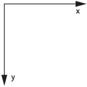
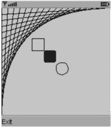
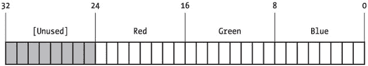
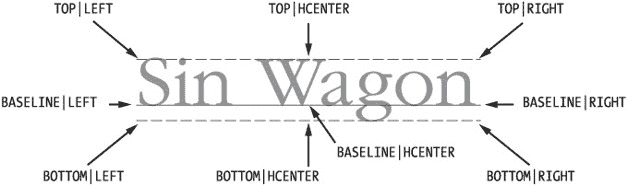
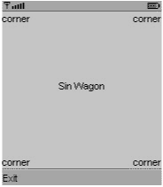
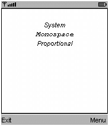
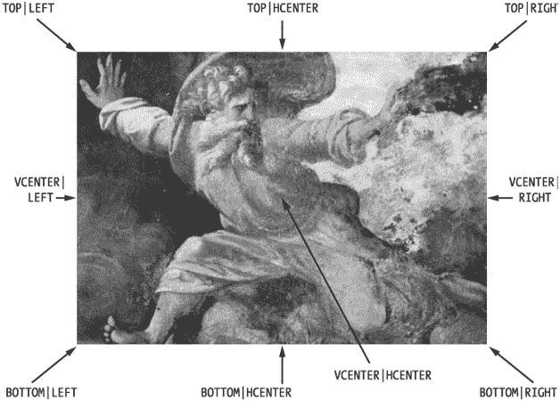
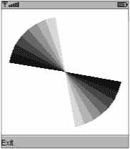

# 第 10 章：编程自定义用户界面

第 5 章、第 6 章和第 7 章专门讨论了 MIDP 的通用用户界面 API。尽管这些 API 设计巧妙，但它们并不适合游戏开发和其他专用用户界面。游戏编程比其他应用程序更“贴近硬件”。MIDP 提供了一个类 `javax.microedition.lcdui.Canvas`，它提供了对设备屏幕和输入功能的底层访问。你可以精确地知道用户按下了哪些键，并在屏幕上绘制任何你想要的内容。

MIDP 2.0 的另一个增强是游戏 API，它包含在 `javax.microedition.lcdui.game` 包中。它包括对 `Canvas` 的改进以及用于基于层的图形和精灵动画的类。游戏 API 将在第 11 章中全面讨论。在本章中，你将学习 `Canvas` 的基础知识以及使用 `Graphics` 类进行绘图。

## Canvas 类

`Canvas` 是 MIDP 自定义用户界面 API 的核心。要使用它，你必须创建一个 `Canvas` 的子类。这与 `Screen` 的子类不同，后者是“开箱即用”的。

然而，除此之外，`Canvas` 与 `Displayable` 的其他子类配合得非常好。一个 MIDlet 可以混合使用常规屏幕和 `Canvas`。例如，在游戏中，高分屏幕可能是一个 `Form`，而游戏本身则在 `Canvas` 上进行。

`Canvas` 包含事件处理方法，每当发生重要事件时，MIDP 实现都会调用这些方法。当用户按下某个键，或者需要绘制屏幕时，`Canvas` 的某个方法将被调用。这些方法中的大多数在 `Canvas` 中都有空实现。要响应事件，你需要重写相应的方法并提供实现。

此规则的一个例外是 `paint()` 方法，它被声明为抽象方法，因此必须在子类中定义。

## Canvas 信息

如果你想绘制自己的用户界面，你需要一些关于 `Canvas` 的基本信息。你可以通过调用 `getWidth()` 和 `getHeight()` 来获取 `Canvas` 的大小。正如我们稍后将讨论的，你还可以通过调用 `Display` 中的方法来了解设备的颜色能力。

MIDP 2.0 提供了全屏模式。某些 `Canvas` 实现不会占用所有可用的屏幕空间，而是会为设备状态信息或其他目的保留屏幕区域。如果设备支持 `Canvas` 的备用全屏模式，你可以通过调用 `setFullScreenMode(true)` 来使用它。开启或关闭全屏模式可能会导致调用 `Canvas` 从 `Displayable` 继承的 `sizeChanged()` 方法。

`Canvas` 还具有事件处理方法，当你的 `Canvas` 显示和隐藏时，MIDP 实现会调用这些方法。每次你的 `Canvas` 显示时，都会调用 `showNotify()` 方法。如果显示了另一个 `Displayable`，或者应用程序管理器决定运行另一个应用程序，则会调用 `hideNotify()`。


## 绘制与重绘

当需要显示 Canvas 的内容时，MIDP 实现会调用 Canvas 的 `paint()` 方法。任何实现过自定义 Swing 或 AWT 组件的人，都应该对这个 `paint()` 方法感到熟悉。

MIDP 实现会向你的 `paint()` 方法传递一个 `Graphics` 对象。`Graphics` 提供了在 Canvas 上绘制形状、文本和图像的方法。因此，一个典型的 Canvas 实现大致如下：

```
import javax.microedition.lcdui.*;

public class JonathanCanvas
    extends Canvas {
  public void paint(Graphics g) {
    // 使用 g 绘制内容
  }
} 
```

如果你想告诉 Canvas 自行绘制，该怎么办？你不能直接调用 `paint()`，因为你没有合适的 `Graphics` 对象可以传递给 `paint()`。相反，你需要告诉 MIDP 实现是时候绘制 Canvas 了。实现这一操作的方法是调用 `repaint()`。该方法的第一个版本只是简单地告诉 Canvas 绘制所有内容。

```
public void repaint()
public void repaint(int x, int y, int width, int height)
```

第二个版本的意思是：“我只希望你绘制屏幕上的这个矩形区域。” 如果你要进行的绘制非常复杂，可以通过只绘制 Canvas 中发生变化的部分来节省时间。这是通过一种称为**裁剪**的技术实现的。后面的章节会更详细地讨论裁剪。

`repaint()` 究竟是如何工作的？当你调用 `repaint()` 时，`paint()` 并不会立即被调用。调用 `repaint()` 只是向 MIDP 实现发出信号，表明你想要绘制屏幕。稍后，实现会*处理*这个重绘请求，最终导致实际调用 Canvas 的 `paint()` 方法。MIDP 实现甚至可能合并多个重绘请求，特别是当它们的重绘区域重叠时。

|  | 提示 | 当你调用 *repaint()* 时，*Canvas* 不会自动清除自身。如果你想改变屏幕上的内容，而不是在其上添加内容，你应该在 *paint()* 方法中清除屏幕。你将在本章后面的 *FontCanvas* 示例中看到如何做到这一点。 |

应用程序可以通过调用 Canvas 对象上的 `serviceRepaints()` 来强制实现处理所有重绘请求。此方法在所有待处理的重绘请求被处理完毕之前不会返回。如果你打算调用 `serviceRepaints()`，应确保你没有在 `paint()` 方法中试图获取那些在 `serviceRepaints()` 返回前不会释放的对象锁。通常，你不需要调用 `serviceRepaints()`；你可以改用 `Display` 的 `callSerially()` 方法。（关于 `callSerially()` 的讨论，请参见本章的“多线程与动画”部分。）

## 绘制形状、文本和图像

`Graphics` 类包含在 Canvas 上绘制形状、文本和图像的方法。它还维护一些状态，比如当前的画笔颜色和线条样式。MIDP 的 `Graphics` 类类似于 J2SE 中的 `Graphics` 和 `Graphics2D` 类，但规模小得多。

### 坐标空间

Canvas 上的所有绘制都发生在一个基于设备像素的坐标空间中。默认情况下，该坐标空间的原点位于 Canvas 的左上角。X 坐标向右增加，而 Y 坐标向下增加，如图 10-1 所示。


图 10-1：Canvas 坐标轴

你可以通过调用 `Graphics` 类的 `translate()` 方法来调整此坐标空间的原点。这会将原点设置为当前坐标系中的给定坐标。要找出平移后的原点相对于默认原点的位置，可以调用 `getTranslateX()` 和 `getTranslateY()`。

### 绘制和填充形状

`Graphics` 包含一组绘制和填充简单形状的方法。这些方法详列于表 10-1 中。MIDP 2.0 包含了一个新方法 `fillTriangle()`。

表 10-1：使用 *Graphics* 绘制和填充形状

| **形状轮廓** | **填充形状** |
| --- | --- |
| drawLine(int x1, int y1, int x2, int y2) | - |
| - | fillTriangle(int x1, int y1, int x2, int y2, int x3, int y3) |
| drawRect(int x, int y, int width, int height) | fillRect(int x, int y, int width, int height) |
| drawRoundRect(int x, int y, int width, int height, int arcWidth, int arcHeight) | fillRoundRect(int x, int y, int width, int height, int arcWidth, int arcHeight) |
| drawArc(int x, int y, int width, int height, int startAngle, int arcAngle) | fillArc(int x, int y, int width, int height, int startAngle, int arcAngle) |

这些方法基本上执行你所期望的操作。以下示例演示了使用 `Graphics` 进行的一些简单绘制。它由两部分组成。首先，`PacerCanvas` 演示了一些简单的绘制和填充：

```
import javax.microedition.lcdui.*;

public class PacerCanvas
    extends Canvas {
  public void paint(Graphics g) {
    int w = getWidth();
    int h = getHeight();

    g.setColor(0xffffff);
    g.fillRect(0, 0, w, h);
    g.setColor(0x000000);

    for (int x = 0; x < w; x += 10)
      g.drawLine(0, w - x, x, 0);

    int z = 50;
    g.drawRect(z, z, 20, 20);
    z += 20;
    g.fillRoundRect(z, z, 20, 20, 5, 5);
    z += 20;
    g.drawArc(z, z, 20, 20, 0, 360);
  }
} 
```

下一个类是 `Pacer`，一个使用 `PacerCanvas` 的 MIDlet。

```
import javax.microedition.lcdui.*;
import javax.microedition.midlet.*;

public class Pacer
    extends MIDlet{
  public void startApp() {
    Displayable d = new PacerCanvas();

    d.addCommand(new Command("Exit", Command.EXIT, 0));
    d.setCommandListener(new CommandListener() {
      public void commandAction(Command c, Displayable s) {
        notifyDestroyed();
      }
    } );

    Display.getDisplay(this).setCurrent(d);
  }

  public void pauseApp() { }

  public void destroyApp(boolean unconditional) { }
}
```

当你在 Sun 的 J2ME Wireless Toolkit 模拟器中运行 `Pacer` 时，它看起来像图 10-2。


图 10-2：使用 *Graphics* 进行绘制


### 使用颜色

Graphics 类维护一个当前绘图颜色，用于绘制形状轮廓、填充形状以及绘制文本。颜色由红、绿、蓝三色组合表示，每种颜色分量占八位。你可以使用以下方法设置当前绘图颜色：

```
public void setColor(int RGB)
```

该方法期望将红、绿、蓝值打包成一个整数，如图 10-3 所示。


图 10-3：将颜色打包成整数

另一种便捷方法接受红、绿、蓝值作为 0 到 255（含）范围内的整数：

```
public void setColor(int red, int green, int blue)
```

你可以使用 `getColor()` 获取当前绘图颜色（以打包整数形式）。或者，也可以分别使用 `getRedComponent()`、`getGreenComponent()` 和 `getBlueComponent()` 获取各个分量。

当然，不同设备对颜色的支持程度各不相同，从黑白（俗称“单色”）到完整的 24 位色。正如我在第 5 章中提到的，Display 中的 `isColor()` 和 `numColors()` 方法会返回关于设备能力的有用信息。

对于灰度设备，Graphics 提供了便捷方法 `setGrayScale()`。你传入一个 0（黑色）到 255（白色）之间的数字。可以通过调用 `getGrayScale()` 获取当前灰度值。如果此 Graphics 对象的当前颜色不是灰度色（即当前颜色的红、绿、蓝值不相同），则此方法会返回其对当前颜色亮度的最佳估算值。

MIDP 2.0 为 Graphics 类新增了 `getDisplayColor()` 方法。这是一个便捷方法，可以在运行时准确告知你请求的颜色在设备上会如何显示。你传入一个颜色 int 值，它会返回设备上实际显示的颜色 int 值。例如，在 J2ME Wireless Toolkit 的 **DefaultGrayPhone** 模拟器上，纯绿色（0x00ff00）会映射为灰度值 0x959595。

### 线条样式

Graphics 还维护一个当前线条样式，称为*描边样式*，用于绘制形状轮廓和线条。线条样式有两种选择，由 Graphics 类中的常量表示：

*   SOLID 是默认样式。
*   也可以绘制 DOTTED（虚线）线条。

虚线具体如何实现由具体实现决定，因此在一台设备上的虚线在另一台设备上可能显示为短划线。你可以使用 `setStrokeStyle()` 和 `getStrokeStyle()` 设置或获取当前样式。例如，以下代码绘制一个实线轮廓（默认）的正方形和另一个虚线轮廓的正方形：

```
public void paint(Graphics g) {
  g.drawRect(20, 10, 35, 35);
  g.setStrokeStyle(Graphics.DOTTED);
  g.drawRect(20, 60, 35, 35);
}
```

### 绘制文本

Graphics 类使得在屏幕任意位置绘制文本变得简单。文本绘制基于锚点的概念。锚点精确决定文本的绘制位置。锚点由水平和垂直分量描述。Graphics 类将水平和垂直锚点定义为常量。图 10-4 展示了文本字符串的各种锚点。每个锚点由水平和垂直锚点的组合来描述。


图 10-4：文本锚点

要绘制文本，只需指定文本本身以及锚点的位置和类型。例如，你可以通过使用位于 (0, 0) 的 TOP | LEFT 锚点，将文本放置在屏幕左上角。

文本以 String 或 char 数组形式指定，这意味着你可以绘制多种语言的文本，前提是你使用的字体包含相应的字形。

Graphics 提供了四种不同的文本绘制方法。你可以根据可用情况绘制字符或字符串：

```
public void drawChar(char character, int x, int y, int anchor)
public void drawChars(char[] data, int offset, int length,
    int x, int y, int anchor)
public void drawString(String str, int x, int y, int anchor)
public void drawSubstring(String str, int offset, int len,
    int x, int y, int anchor)
```

以下示例展示了如何在 Canvas 的不同位置放置文本：

```
import javax.microedition.lcdui.*;

public class TextCanvas
    extends Canvas {
  public void paint(Graphics g) {
    int w = getWidth();
    int h = getHeight();

    g.setColor(0xffffff);
    g.fillRect(0, 0, w, h);
    g.setColor(0x000000);
    // 首先标记四个角。
    g.drawString("corner", 0, 0,
        Graphics.TOP | Graphics.LEFT);
    g.drawString("corner", w, 0,
        Graphics.TOP | Graphics.RIGHT);
    g.drawString("corner", 0, h,
        Graphics.BOTTOM | Graphics.LEFT);
    g.drawString("corner", w, h,
        Graphics.BOTTOM | Graphics.RIGHT);

// 现在在中间（大致位置）放置一些内容。
    g.drawString("Sin Wagon", w / 2, h / 2,
        Graphics.BASELINE | Graphics.HCENTER);
  }
}
```

要查看此 Canvas，你需要创建一个显示它的 MIDlet。我建议使用 Pacer；只需编辑源文件，使其实例化 TextCanvas 而不是 PacerCanvas。最终结果如图 10-5 所示。


图 10-5：*TextCanvas* 的实际效果

请注意，Canvas 在屏幕底部占用了一些空间。这是为了给 Commands 留出空间。与其他任何 Displayable 一样，Canvas 可以显示命令并拥有命令监听器。


### 选择字体

MIDP 字体由*字体外观*、*样式*和*大小*表示。你不会有太多字体选择，但仍有几种可选。有三种外观可用，如图 10-6 所示。这些外观由 Font 类中的常量表示：`FACE_SYSTEM`、`FACE_MONOSPACE` 和 `FACE_PROPORTIONAL`。


图 10-6：三种斜体字体外观

选定字体外观后，你还可以指定样式和大小。样式与你预期的一致，由 Font 类中的常量表示：`STYLE_PLAIN`、`STYLE_BOLD`、`STYLE_ITALIC` 和 `STYLE_UNDERLINE`。你可以通过按位或运算组合样式，例如粗体和斜体。大小则只有 `SIZE_SMALL`、`SIZE_MEDIUM` 或 `SIZE_LARGE`。

你可以通过以下调用创建一个小的、斜体的、比例字体：

```
Font f = Font.getFont(
    Font.FACE_PROPORTIONAL,
    Font.STYLE_ITALIC,
    Font.SIZE_SMALL);
```

要告诉 Graphics 对象为后续文本使用新字体，请调用 `setFont()`。你可以通过调用 `getFont()` 获取当前字体的引用。你还可以使用 `getFace()`、`getStyle()` 和 `getSize()` 方法了解字体的信息。为方便起见，Font 还包含了 `isPlain()`、`isBold()`、`isItalic()` 和 `isUnderlined()` 方法。

MIDP 实现有一个默认字体，你可以通过 Font 的静态方法 `getDefaultFont()` 获取。

以下 Canvas 演示了字体的创建和使用。

```
import javax.microedition.lcdui.*;

public class FontCanvas
    extends Canvas {
  private Font mSystemFont, mMonospaceFont, mProportionalFont;

public FontCanvas() { this(Font.STYLE_PLAIN); }

public FontCanvas(int style) { setStyle(style); }
  public void setStyle(int style) {
    mSystemFont = Font.getFont(Font.FACE_SYSTEM,
        style, Font.SIZE_MEDIUM);
    mMonospaceFont = Font.getFont(Font.FACE_MONOSPACE,
        style, Font.SIZE_MEDIUM);
    mProportionalFont = Font.getFont(Font.FACE_PROPORTIONAL,
        style, Font.SIZE_MEDIUM);
  }

public boolean isBold() {
    return mSystemFont.isBold();
  }
  public boolean isItalic() {
    return mSystemFont.isItalic();
  }
  public boolean isUnderline() {
    return mSystemFont.isUnderlined();
  }

public void paint(Graphics g) {
    int w = getWidth();
    int h = getHeight();

// 清除 Canvas。
    g.setGrayScale(255);
    g.fillRect(0, 0, w - 1, h - 1);
    g.setGrayScale(0);
    g.drawRect(0, 0, w - 1, h - 1);

int x = w / 2;
    int y = 20;

y += showFont(g, "System", x, y, mSystemFont);
    y += showFont(g, "Monospace", x, y, mMonospaceFont);
    y += showFont(g, "Proportional", x, y, mProportionalFont);
  }

private int showFont(Graphics g, String s, int x, int y, Font f) {
    g.setFont(f);
    g.drawString(s, x, y, Graphics.TOP | Graphics.HCENTER);
    return f.getHeight();
  }
} 
```

要查看此 Canvas 的实际效果，你需要一个显示它的 MIDlet。你可以再次修改 Pacer，或者使用以下代码：

```
import javax.microedition.lcdui.*;
import javax.microedition.midlet.*;

public class FontMIDlet
    extends MIDlet
   implements CommandListener {
  private FontCanvas mFontCanvas;
  private Command mBoldCommand, mItalicCommand, mUnderlineCommand;

public FontMIDlet() {
    mFontCanvas = new FontCanvas();

mBoldCommand = new Command("粗体", Command.SCREEN, 0);
    mItalicCommand = new Command("斜体", Command.SCREEN, 0);
    mUnderlineCommand = new Command("下划线", Command.SCREEN, 0);
    Command exitCommand = new Command("退出", Command.EXIT, 0);

mFontCanvas.addCommand(mBoldCommand);
    mFontCanvas.addCommand(mItalicCommand);
    mFontCanvas.addCommand(mUnderlineCommand);
    mFontCanvas.addCommand(exitCommand);
    mFontCanvas.setCommandListener(this);
  }

public void startApp() {
    Display.getDisplay(this).setCurrent(mFontCanvas);
  }

public void pauseApp() {}

public void destroyApp(boolean unconditional) {}

public void commandAction(Command c, Displayable s) {
    if (c.getCommandType() == Command.EXIT) {
      notifyDestroyed();
      return;
    }
    boolean isBold = mFontCanvas.isBold() ^ (c == mBoldCommand);
    boolean isItalic = mFontCanvas.isItalic() ^ (c == mItalicCommand);
    boolean isUnderline = mFontCanvas.isUnderline() ^
        (c == mUnderlineCommand);

int style =
        (isBold ? Font.STYLE_BOLD : 0) |
        (isItalic ? Font.STYLE_ITALIC : 0) |
        (isUnderline ? Font.STYLE_UNDERLINED : 0);

mFontCanvas.setStyle(style);
    mFontCanvas.repaint();
  }
}
```

### 测量文本

Font 类可以告诉你关于文本尺寸的有用信息。如果你仔细阅读了前面的示例，你会注意到我们已经使用了其中一个方法 `getHeight()`。此方法返回一整行文本的高度，可用于定位多行文本。

如果你确实需要知道基线的位置，请调用 `getBaselinePosition()`。此方法返回从文本行顶部到基线的距离。但是，鉴于 Graphics 中锚点提供的灵活性，你可能永远不需要自己查找基线。

Font 中用于测量文本的其余方法测量各种文本片段的宽度。这些方法的名称和参数与 Graphics 中的文本绘制方法相同：

```
public int charWidth(char ch)
public int charsWidth(char ch, int offset, int length)
public int stringWidth(String str)
public int substringWidth(String str, int offset, int len)
```

例如，你可以在字符串周围绘制一个框：

```
import javax.microedition.lcdui.*;

public class BoxTextCanvas
    extends Canvas {
  private Font mFont;
public BoxTextCanvas() {
    mFont = Font.getFont(Font.FACE_PROPORTIONAL,
        Font.STYLE_PLAIN, Font.SIZE_LARGE);
  }

  public void paint(Graphics g) {
    int w = getWidth();
    int h = getHeight();

    g.setColor(0xffffff);
    g.fillRect(0, 0, w, h);
    g.setColor(0x000000);

    String s = "dolce";
    int stringWidth = mFont.stringWidth(s);
    int stringHeight = mFont.getHeight();
    int x = (w - stringWidth) / 2;
    int y = h / 2;

    g.setFont(mFont);
    g.drawString(s, x, y, Graphics.TOP | Graphics.LEFT);
    g.drawRect(x, y, stringWidth, stringHeight);
  }
}
```

### 绘制图像

Graphics 类包含一个用于绘制图像的方法：

```
public void drawImage(Image img, int x, int y, int anchor)
```

`drawImage()` 方法使用锚点，就像文本绘制方法中的锚点一样。可用的锚点略有不同。`BASELINE` 不再是图像垂直锚点的选项，因为基线的概念特定于文本。相反，`VCENTER` 是垂直锚点的一个额外选项。图 10-7 显示了锚点的可用组合。


图 10-7：图像锚点

MIDP 2.0 特别要求支持渲染带有透明度的图像。


### 高级图像渲染

在 MIDP 2.0 中，`Graphics` 类还包含一个 `drawRegion()` 方法，用于渲染图像的某个区域，并可能同时对其进行变换。该方法如下所示：

```
public void drawRegion(Image src,
    int x_src, int y_src, int width, int height,
    int transform, int x_dest, int y_dest, int anchor)
```

参数 `x_src`、`y_src`、`width` 和 `height` 描述了图像中一个矩形区域，该区域将被渲染到 `Graphics` 的绘图表面上。该区域根据锚点绘制在 `x_dest` 和 `y_dest` 位置，这与 `drawImage()` 方法中的处理方式相同。

`transform` 参数开启了一个全新的可能性世界。它可以是 `Sprite` 类中定义的任何变换常量，如下所列。（`Sprite` 是 MIDP 2.0 游戏 API 的一部分，将在下一章中介绍。）

*   `TRANS_NONE`
*   `TRANS_ROT90`
*   `TRANS_ROT180`
*   `TRANS_ROT270`
*   `TRANS_MIRROR`
*   `TRANS_MIRROR_ROT90`
*   `TRANS_MIRROR_ROT180`
*   `TRANS_MIRROR_ROT270`

`ROT` 变换将源图像区域旋转 90、180 或 270 度。`MIRROR_ROT` 变换则先将该区域沿其垂直中心镜像，然后再旋转镜像后的区域。

`drawRegion()` 方法使得操作和显示打包在单个图像中的动画帧变得非常容易。

### 作为整数数组的图像

你已经了解了如何将单一颜色表示为整数。以此类推，图像可以表示为整数数组，其中数组中的每个整数包含图像中单个像素的颜色。

MIDP 2.0 支持通过以下方法将整数数组渲染为图像：

```
public void drawRGB(int[] rgbData, int offset, int scanlength,
    int x, int y, int width, int height,
    boolean processAlpha) 
```

图像数据包含在 `rgbData` 数组中，从 `offset` 位置开始。连续的行数据以 `scanlength` 的倍数作为偏移量进行存储。图像将渲染在 `x` 和 `y` 位置，其大小由 `width` 和 `height` 定义。

`width` 和 `scanlength` 之间的关系起初可能有点令人困惑。下面的示例应该能澄清这一点。

考虑以下代码：

```
 int[] rgbData = {
           0x123456, 0x123456, 0x123456,
           0x000000, 0xffffff, 0xffffff, 0x000000, 0x654321, 0x654321,
           0x000000, 0x000000, 0xffffff, 0x000000, 0x654321, 0x654321,
           0x000000, 0xffffff, 0x000000, 0x000000, 0x654321, 0x654321,
           0x000000, 0xffffff, 0xffffff, 0x000000, 0x654321, 0x654321
         };

         g.drawRGB(rgbData, 3, 6, 10, 10, 4, 4, false);
```

这段代码生成了一个非常小的图像，在图 10-8 中以极大放大倍率显示。通过传递偏移量 3，数组的前三个元素被忽略。尽管图像宽度为 4 个像素，但每行数据在整数数组中相隔 6 个位置。该图像将渲染在坐标 (10, 10) 处，大小为 4x4 像素。


图 10-8：一个非常小的图像

`drawRGB()` 方法的最后一个参数 `processAlpha` 指示整数数组是否包含 alpha（不透明度）分量。如果该参数为 `false`，则图像的每个像素都被视为完全不透明。如果 `processAlpha` 为 `true`，则每个像素的不透明度由整数值的高位字节决定，并且像素的颜色将与绘图表面适当混合。alpha 值为 0 表示完全透明，而 alpha 值为 255 表示完全不透明。

### MIDP 2.0 中的位块传输

*位块传输*，即将屏幕的一个区域复制到另一个位置，对于某些类型的游戏来说是一项关键操作。MIDP 2.0 的 `Graphics` 类包含一个用于位块传输的方法：

```
public void copyArea(int x_src, int y_src, int width, int height,
    int x_dest, int y_dest, int anchor)
```

这个方法不言自明。它将屏幕的一部分（由 `x_src`、`y_src`、`width` 和 `height` 描述）复制到由 `x_dest`、`y_dest` 和 `anchor` 描述的目标位置。锚点的工作方式与 `drawImage()` 方法相同。

此方法仅适用于不直接绘制到屏幕的 `Graphics` 对象。绘制到图像的 `Graphics` 对象可以正常工作，在双缓冲 `Canvas` 上工作的 `Graphics` 对象也是如此。来自 `GameCanvas` 的 `getGraphics()` 方法的 `Graphics` 对象也可以正常工作。相比之下，对于非双缓冲 `Canvas` 的 `Graphics` 对象，如果调用 `copyArea()` 方法，则会抛出 `IllegalStateException`。（有关该技术的更多信息，请参阅即将推出的关于双缓冲的章节。）

### 裁剪

`Graphics` 维护一个矩形的*裁剪形状*。裁剪形状限制了绘图，任何在裁剪形状之外进行的绘图都不会被显示。这有点像通过模板进行绘画，只不过你只能使用矩形模板。如果你正在编写一个游戏，游戏板上有某种边框，你可以将裁剪矩形设置为游戏板的内部区域，这样任何绘图都不会覆盖边框。

你可以通过调用 `getClipX()`、`getClipY()`、`getClipWidth()` 和 `getClipHeight()` 来获取当前的裁剪矩形。

如果你想修改裁剪矩形，有两种方法可以使用。首先，你可以通过调用以下方法直接设置裁剪矩形：

```
public void setClip(int x, int y, int width, int height);
```

另一种可能性是用另一个矩形来限制当前的裁剪矩形。以下方法取当前裁剪矩形与提供的矩形的交集，并用它来设置新的裁剪矩形：

```
public void clipRect(int x, int y, int width, int height); 
```

## 按键事件

`Canvas` 在比其他 `Displayable` 子类更低的层次上处理事件。虽然你可以添加 `Command` 并响应它们，但 `Canvas` 还包含一组处理与设备单个按键交互的方法。

每当用户按下和释放按键时，会调用以下方法：

```
protected void keyPressed(int keyCode)
protected void keyReleased(int keyCode)
```

传递给这些方法的键码很可能是 `Graphics` 中定义的常量之一，从 `KEY_NUM0` 到 `KEY_NUM9`，包括 `KEY_STAR` 和 `KEY_POUND`。设备可能拥有比这更多的按键，这些按键将作为设备特定的键码返回。假设按键与某个 Unicode 字符之间存在明显的映射关系，经验法则是按键的代码应等于其 Unicode 字符值。没有 Unicode 映射的按键应使用负值。这意味着，给定一个正键码，你可以通过将 `int` 类型的键码强制转换为 `char` 来找到对应的 Unicode 字符。

请注意，按键按下和按键释放是独立的事件，这让你在设计用户界面时拥有相当大的灵活性。按下和释放之间的时间可以决定游戏角色跳多高，或者激光爆炸的威力有多大。

根据设备和 MIDP 实现的不同，按住不放的按键可能会产生重复的按键事件。你可以通过调用 `hasRepeatEvents()` 来了解是否支持重复按键。如果支持重复按键事件，则会调用 `keyRepeated()` 方法来处理这些事件。

最后，你可以通过调用 `getKeyName()` 来查找给定键码的文本描述。

在 MIDP 2.0 中，游戏 API 提供了一种机制来绕过按键事件回调方法。你可以使用 `GameCanvas` 中的方法直接轮询设备按键的状态。更多信息，请参阅下一章。


## 游戏动作

在某些情况下，键码可能很有用，但它们通常与特定设备紧密相关。MIDP 提供了一种名为*游戏动作*的简单抽象，使得将用户按键事件映射为对游戏及其他具有专用用户界面的应用程序有用的事件变得更加容易。

其概念很简单：向 `getGameAction()` 提供一个键码，你将收到一个游戏动作——即以下值之一：`UP`、`DOWN`、`LEFT`、`RIGHT`、`FIRE`、`GAME_A`、`GAME_B`、`GAME_C` 或 `GAME_D`。基本上，游戏动作是一种将设备上的物理按键映射到一组视频游戏按钮（例如你在世嘉 Genesis 或任天堂 Game Boy 等游戏平台上可能找到的按钮）的方式。

要理解这如何映射到物理设备，请思考如何将 `UP`、`DOWN`、`LEFT` 和 `RIGHT` 这些游戏动作映射到按键上。在 Sun 的 MIDP 模拟器中，存在与这些游戏动作有明显对应关系的导航键。然而，考虑一个更简单的手机，例如只有数字键盘的手机。在这种情况下，你可能希望将 `UP` 映射到 2 键，`DOWN` 映射到 8 键，`LEFT` 映射到 4 键，`RIGHT` 映射到 6 键。

使用游戏动作可以省去你自己做这些决定的麻烦；MIDP 实现会为设备提供一个合理的映射。要查找某个键码对应的游戏动作，请将该键码传递给 `getGameAction()`。你也可以通过调用 `getKeyCode()` 来查找某个游戏动作对应的键码。

以下示例在 `keyPressed()` 方法中监听按键事件。它将键码转换为游戏动作，并在屏幕上显示该游戏动作。

```
import javax.microedition.lcdui.*;

public class KeyCanvas
    extends Canvas {
  private Font mFont;
  private String mMessage = "[Press keys]";

  public KeyCanvas() {
    mFont = Font.getFont(Font.FACE_PROPORTIONAL,
        Font.STYLE_PLAIN, Font.SIZE_MEDIUM);
  }

  public void paint(Graphics g) {
    int w = getWidth();
    int h = getHeight();

    // 清除画布。
    g.setGrayScale(255);
    g.fillRect(0, 0, w - 1, h - 1);
    g.setGrayScale(0);
    g.drawRect(0, 0, w - 1, h - 1);

    g.setFont(mFont);
    int x = w / 2;
    int y = h / 2;

    g.drawString(mMessage, x, y, Graphics.BASELINE | Graphics.HCENTER);
  }

  protected void keyPressed(int keyCode) {
    int gameAction = getGameAction(keyCode);
    switch(gameAction) {
      case UP:     mMessage = "UP";             break;
      case DOWN:   mMessage = "DOWN";           break;
      case LEFT:   mMessage = "LEFT";           break;
      case RIGHT:  mMessage = "RIGHT";          break;
      case FIRE:   mMessage = "FIRE";           break;
      case GAME_A: mMessage = "GAME_A";         break;
      case GAME_B: mMessage = "GAME_B";         break;
      case GAME_C: mMessage = "GAME_C";         break;
      case GAME_D: mMessage = "GAME_D";         break;
      default:     mMessage = "";               break;
    }
    repaint();
  }
}
```

要运行此示例，你需要一个相应的 MIDlet 来显示 `KeyCanvas`。至此，我想你可以自己完成这个操作。

## 指针事件

某些设备，特别是 PDA，可能支持指针。例如，流行的 Palm 平台就是基于触控笔和触摸屏的使用。你可以在运行时通过调用 `hasPointerEvents()` 和 `hasPointerMotionEvents()` 来了解你的设备是否支持指针事件。如果设备支持指针事件，当指针被按下和释放时，将调用以下方法：

```
protected void pointerPressed(int x, int y)
protected void pointerReleased(int x, int y) 
```

如果设备支持指针移动事件，当用户在屏幕上拖动触控笔时，将调用以下方法：

```
protected void pointerDragged(int x, int y)
```

## 双缓冲

*双缓冲*是一种用于减少绘图和动画闪烁的知名技术。想象一下，你正在实现一个动画，该动画在每一帧都会清除并重绘整个屏幕。如果没有双缓冲，当屏幕被清除和重绘时，动画会严重闪烁。使用双缓冲时，新帧会被绘制到一个离屏图像（缓冲区）中。当离屏绘制完成后，该图像会以一次平滑、快速的操作绘制到屏幕上。你需要为离屏图像付出内存代价，但动画质量的提升是显著的。

MIDP 实现可能默认提供双缓冲。你可以通过调用 `isDoubleBuffered()` 方法来了解某个 `Canvas` 是否使用了双缓冲。

如果实现没有提供双缓冲，你就需要自己实现。幸运的是，这并不太难。过程如下：

1.  通过调用静态方法 `Image.createImage(int width, int height)` 创建一个离屏图像。

2.  通过在 `Image` 上调用 `getGraphics()` 方法，获取一个用于*在图像中*绘图的 `Graphics` 对象。

3.  使用该 `Graphics` 对象在离屏图像中绘制内容。

4.  在 `Canvas` 的 `paint()` 方法中，使用 `drawImage()` 将离屏图像放置到 `Canvas` 上。

以下是一个创建简单离屏图像并显示它的 `Canvas` 子类：

```
import javax.microedition.lcdui.*;

public class OffscreenCanvas
    extends Canvas {
  private Image mImage;
  public void paint(Graphics g) {
    if (mImage == null)
      initialize();
    g.drawImage(mImage, 0, 0, Graphics.TOP | Graphics.LEFT);
  }

  private void initialize() {
    int w = getWidth();
    int h = getHeight();

    mImage = Image.createImage(w, h);

    Graphics g = mImage.getGraphics();

    g.drawRect(0, 0, w - 1, h - 1);
    g.drawLine(0, 0, w - 1, h - 1);
    g.drawLine(w - 1, 0, 0, h - 1);
  }
}
```


## 多线程与动画

与任何图形界面工具包一样，在 MIDP 用户界面类中使用线程需要格外小心。用户界面实现拥有自己的线程，负责处理用户界面方法和屏幕绘制。例如，当用户在设备上按下某个按键时，实现会调用你的 `Canvas` 子类中的 `keyPressed()` 方法。调用此方法的线程属于 MIDP 实现。因此，需要谨慎处理。在 MIDP 实现中，调用事件方法的同一个线程也会调用 `paint()`。

|  | 注意 | 所有事件驱动的用户界面工具包都有这种系统拥有的用户界面线程的概念。在 AWT 和 Swing 中，它被称为*事件分发线程*。同样的规则适用：如果你在一个不属于你的线程中运行，不要占用它太久。 |

由不属于你的线程调用的方法称为*回调*。对于回调的经验法则是，你不应该执行任何耗时很长的操作。由于该线程不属于你，你不应该长时间占用它来执行你的工作。因为这个线程负责操作用户界面，用冗长的计算占用它会让你应用程序看起来像被切除了脑叶。例如，假设你需要从网络检索一些数据。作为对某个命令的响应，你可能会这样做：

```
public void commandAction(Command c, Displayable s) {
  if (c == mNetworkCommand) {
    // 创建一个进度屏幕，progressScreen。
    mDisplay.setCurrent(progressForm);
    // 现在执行网络操作。
    // 糟糕！用户永远看不到 progressScreen。
  }
  // ...
}
```

问题在于进度屏幕将不会被显示。`commandAction()` 方法是从用户界面线程调用的，也就是负责绘制屏幕的同一个线程。如果你用自己的一些耗时处理占用了这个线程，用户界面线程就永远没有机会更新屏幕。如果你需要执行一些耗时操作，请为其创建一个单独的线程。例如，在第 2 章 的 Jargoneer 示例中，网络访问是在一个单独的线程中执行的。

在某些情况下，你需要请求用户界面线程代表你执行代码。例如，如果你正在显示一个动画，你需要确保动画的帧与重绘周期正确同步。否则，你最终很可能会显示部分绘制的帧。

`Display` 提供了一种在用户界面线程中执行你的代码的机制。它有一个方法 `callSerially()`，接受一个 `Runnable` 对象。当用户界面线程准备就绪时，即当它完成所有重绘请求的服务后，它将从用户界面线程执行该 `Runnable` 的 `run()` 方法。一个典型的动画看起来像这样：

```
public class AnimationCanvas
    extends Canvas
    implements Runnable {
  public start() {
    run();
  }

public void paint(Graphics g) {
    // 绘制动画的一帧。
  }
  public void run() {
    // 更新我们的状态。
    // 现在请求绘制新帧。
    repaint();
    Display.callSerially(this);
  }
}
```

你可以通过调用 `start()` 来启动动画，而 `start()` 又会简单地调用 `run()`。在 `run()` 内部，我们更新状态并调用 `repaint()` 来请求绘制新帧。然后我们使用 `callSerially()` 来请求在绘制完成后再次被调用。

这种技术产生的动画会以设备允许的最快速度运行。然而，许多应用程序需要在不同设备上提供一致的体验。在这些情况下，使用具有一致帧延迟的独立动画线程更有意义。下面的示例演示了这种技术。它包含两个类：`Sweep` 和 `SweepCanvas`。`Sweep` 是一个 MIDlet，它显示实际实现动画的类 `SweepCanvas`。正在运行的 `SweepCanvas` 如图 10-9 所示。


图 10-9：在灰度模拟器上运行的 *SweepCanvas* 动画

首先，这是 `Sweep` 的源代码：

```
import javax.microedition.lcdui.*;
import javax.microedition.midlet.*;

public class Sweep
    extends MIDlet {
  public void startApp() {
    final SweepCanvas sweeper = new SweepCanvas();
    sweeper.start();
    sweeper.addCommand(new Command("退出", Command.EXIT, 0));
    sweeper.setCommandListener(new CommandListener() {
      public void commandAction(Command c, Displayable s) {
        sweeper.stop();
        notifyDestroyed();
      }
    });

Display.getDisplay(this).setCurrent(sweeper);
  }

public void pauseApp() {}

public void destroyApp(boolean unconditional) {}
}
```

这是 `SweepCanvas` 的代码：

```
import javax.microedition.lcdui.*;

public class SweepCanvas
    extends Canvas
    implements Runnable {
  private boolean mTrucking;
  private int mTheta;
  private int mBorder;
  private int mDelay;

public SweepCanvas() {
    mTheta = 0;
    mBorder = 10;
    mDelay = 50;
  }

public void start() {
    mTrucking = true;
    Thread t = new Thread(this);
    t.start();
  }

public void stop() {
    mTrucking = false;
  }
  public void paint(Graphics g) {
    int width = getWidth();
    int height = getHeight();

// 清除 Canvas。
    g.setGrayScale(255);
    g.fillRect(0, 0, width - 1, height - 1);

int x = mBorder;
    int y = mBorder;
    int w = width - mBorder * 2;
    int h = height - mBorder * 2;
    for (int i = 0; i < 8; i++) {
      g.setGrayScale((8 - i) * 32 - 16);
      g.fillArc(x, y, w, h, mTheta + i * 10, 10);
      g.fillArc(x, y, w, h, (mTheta + 180) % 360 + i * 10, 10);
    }
  }

public void run() {
    while (mTrucking) {
      mTheta = (mTheta + 1) % 360;
      repaint();
      try { Thread.sleep(mDelay); }
      catch (InterruptedException ie) {}
    }
  }
}
```

MIDP 2.0 中的 Game API 为运行动画提供了另一种选择。在下一章中，你将看到如何使用 `GameCanvas` 实现 Sweep 的简单动画。

## 总结

本章我们涵盖了很多内容。`Canvas` 类为游戏或其他要求苛刻的应用程序提供了低级接口。你可以使用 `Graphics` 类在 `Canvas` 上绘制形状、文本和图像。此外，你可以接收关于按键和指针事件的详细输入信息。游戏动作是一种基于按键事件的简单通用输入方法。最后，你应该理解与重绘和事件回调相关的多线程问题。耗时处理应放在单独的线程中，以免导致系统拥有的用户界面线程陷入停滞。动画可以使用 `Display` 的 `callSerially()` 方法与用户界面线程同步，尽管更常见的是使用单独的动画线程来实现。下一章将详细介绍 MIDP 2.0 的新 Game API。

