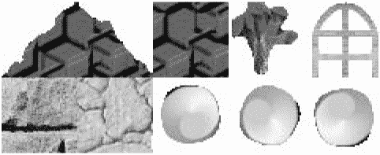
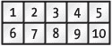
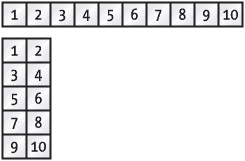
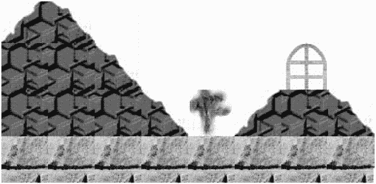
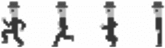
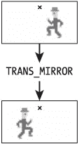
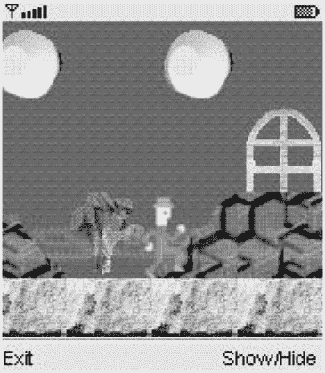

# 第 11 章：Game API

MIDP 2.0 的许多新特性旨在使 MIDP 成为对游戏有吸引力的平台，而游戏是消费级 J2ME 软件的先锋。你已经了解了一些新特性：RGB 图像和 Canvas 中的位块传输是两个很好的例子。在下一章中，你将了解 MIDP 2.0 对多媒体的支持。本章介绍新的 Game API，它简化了 2D 游戏的编写。


## 概述

游戏 API 建立在你在第 10 章中了解到的 Canvas 和 Graphics 类之上。整个 API 由 javax.microedition.lcdui.game 包中的五个类组成。其中一个类 GameCanvas 提供了动画和按键轮询的方法。其他四个类处理*图层*，可用于从多个不同元素组合场景。

GameCanvas 相比 Canvas 有两个主要优势。首先，你的应用程序可以精确控制*何时*更新显示，而不必等待系统软件调用 paint()。其次，你可以控制屏幕的哪个区域被更新。GameCanvas 让你的应用程序对显示更新拥有非常具体的控制权。

## 使用 GameCanvas 驱动动画

GameCanvas 扩展了 javax.microedition.lcdui.Canvas，增加了动画和按键状态轮询的方法。GameCanvas 的使用方式与 Canvas 不同：

*   使用 Canvas 时，你需要创建其子类并定义 paint()方法。在 paint()内部，你使用 Graphics 在屏幕上渲染图形。当你更改某些内容并希望更新屏幕时，调用 repaint()，系统会再次为你调用 paint()。

*   使用 GameCanvas 时，你需要创建其子类。要在屏幕上绘制，请使用 getGraphics()返回的 Graphics 对象。当你希望更新显示在屏幕上时，调用 flushGraphics()，该方法直到屏幕更新后才返回。对于更具体的更新，请使用 flushGraphics(int x, int y, int width, int height)方法，该方法仅更新屏幕的某个区域。

    ```
    public void flushGraphics(int x, int y, int width, int height)
    ```

GameCanvas 的使用模型使其易于在游戏循环中使用，如下所示：

```
Graphics g = getGraphics();
while(true) {
  // 检查用户输入。
  // 更新游戏状态。
  // 使用 g 绘制内容。
  flushGraphics();
}
```

要创建 GameCanvas 的子类，你需要从其子类的构造函数中调用其受保护的构造函数。该构造函数接受一个布尔参数，指示是否应为该 GameCanvas 实例抑制正常的按键事件机制。正常的按键事件机制指的是 keyPressed()、keyReleased()和 keyRepeated()的回调机制。抑制正常机制可能会带来更好的性能。GameCanvas 提供了一种响应按键事件的替代方法，详见下一节。

为了展示 GameCanvas 如何用于绘制，我将使用 GameCanvas 重写第 10 章中的 SweepCanvas 示例。请注意，子类不再重写 paint()。所有操作都在 run()方法中执行，该方法在一个单独的线程中运行以驱动动画。run()方法调用 render()，后者执行实际的绘制（与旧的 paint()相同）。

清单 11-1：使用*GameCanvas*实现动画

| **** |

```
import javax.microedition.lcdui.*;
import javax.microedition.lcdui.game.*;

public class SweepGameCanvas
    extends GameCanvas
    implements Runnable {
private boolean mTrucking;
private int mTheta;
private int mBorder;
private int mDelay;
  public SweepGameCanvas() {
    super(true);
    mTheta = 0;
    mBorder = 10;
    mDelay = 50;
  }

  public void start() {
    mTrucking = true;
    Thread t = new Thread(this);
    t.start();
  }

  public void stop() {
    mTrucking = false;
  }

  public void render(Graphics g) {
    int width = getWidth();
    int height = getHeight();

    // 清除画布。
    g.setGrayScale(255);
    g.fillRect(0, 0, width - 1, height - 1);

    int x = mBorder;
    int y = mBorder;
    int w = width - mBorder * 2;
    int h = height - mBorder * 2;
    for (int i = 0; i < 8; i++) {
      g.setGrayScale((8 - i) * 32 - 16);
      g.fillArc(x, y, w, h, mTheta + i * 10, 10);
      g.fillArc(x, y, w, h, (mTheta + 180) % 360 + i * 10, 10);
    }
  }

  public void run() {
    Graphics g = getGraphics();
    while (mTrucking) {
      mTheta = (mTheta + 1) % 360;
      render(g);
      flushGraphics();
      try { Thread.sleep(mDelay); }
      catch (InterruptedException ie) {}
    }
  }
} 
```

| **** |

|  |

我假设你可以自己编写一个 MIDlet 来显示 SweepGameCanvas。如果你已经下载了在线示例，SweepGame 就是一个显示 SweepGameCanvas 的 MIDlet。

## 轮询按键状态

GameCanvas 提供了一种响应按键按下的替代方法，这被认为是用户控制游戏的方式。GameCanvas 没有被动等待 Canvas 中定义的按键事件回调，而是提供了一个返回按键当前状态的方法：

```
public int getKeyStates()
```

这对游戏很有吸引力，因为它让你的应用程序拥有更多控制权。你可以立即获知设备按键的状态，而无需等待系统调用 Canvas 中的按键回调方法。

返回的整数使用一个位来表示九个游戏动作中的每一个。1 位表示按键按下，0 位表示未按下。每个位都由 GameCanvas 类中的一个常量表示，如表 11-1 所示。

表 11-1：*GameCanvas*中的游戏动作位常量

| **GAMECANVAS 位常量** | **对应的 CANVAS 游戏动作常量** |
| --- | --- |
| UP_PRESSED | UP |
| DOWN_PRESSED | DOWN |
| LEFT_PRESSED | LEFT |
| RIGHT_PRESSED | RIGHT |
| FIRE_PRESSED | FIRE |
| GAME_A_PRESSED | GAME_A |
| GAME_B_PRESSED | GAME_B |
| GAME_C_PRESSED | GAME_C |
| GAME_D_PRESSED | GAME_D |

通过获取按键的当前状态（一种称为*轮询*的技术），你可以在游戏循环中响应用户操作，而不是依赖在不同线程中运行的事件回调方法。你可以像下面这样扩展上面给出的 GameCanvas 循环示例来响应按键按下：

```
Graphics g = getGraphics();
while(true) {
  // 检查用户输入。
  int ks = getKeyStates();
  if ((ks & UP_PRESSED) != 0)
    moveUp();
  else if ((ks & DOWN_PRESSED) != 0)
    moveDown();
  // ...

  // 更新游戏状态。
  // 使用 g 绘制内容。
  flushGraphics();
}
```

如果你还在关注，你可能想知道当用户在应用程序调用 getKeyStates()之间按下并释放一个键时会发生什么。按键状态是*锁存的*，这意味着一次按键按下会设置相应的位并使其保持，直到下一次调用 getKeyStates()。每次你调用 getKeyStates()时，所有锁存的值都会被清除。


## 理解图层

Game API 的其余部分专门用于处理*图层*。图层是可以组合起来创建完整场景的图形元素。例如，你可能有一个山脉背景、一个城市建筑背景，以及前景中的几个较小元素：人物、飞船、汽车等等。

组合图层的技术类似于传统的手绘动画。背景和前景图像绘制在透明赛璐珞片上，这些赛璐珞片一层层叠放，然后拍摄下来形成最终场景。

在 Game API 中，`javax.microedition.lcdui.game.Layer` 类的实例代表一个图层。`Layer` 是一个抽象类，有两个具体的子类。`Layer` 本身相当简单。它有位置、大小，并且可以设置为可见或不可见。位置和大小通过以下方法进行访问和修改，这些方法不言自明：

```
public final int getX()
public final int getY()
public final int getWidth()
public final int getHeight()
public void setPosition(int x, int y) 
```

`Layer` 还提供了一个便捷的方法，用于相对于当前位置移动。将像素偏移量传递给以下方法，即可调整图层的位置：

```
public void move(int dx, int dy)
```

图层的可见性通过 `getVisible()` 和 `setVisible()` 方法访问。

`Layer` 中的最后一个方法是 `paint()`，它被声明为抽象方法。子类重写此方法以定义它们的外观。

## 管理图层

在我介绍 `Layer` 的具体子类之前，我将解释如何将图层组合起来形成完整的场景。你可以自己完成，维护一个图层列表，并使用它们的 `paint()` 方法绘制每个图层。幸运的是，Game API 包含了 `LayerManager`，这是一个为你处理大部分细节的类。要创建一个 `LayerManager`，只需调用它的无参构造方法。

`LayerManager` 的主要工作是维护一个有序的图层列表。图层有一个索引，指示它们从前到后的位置。位置 0 在最顶层，最靠近用户，而索引越大，则越靠后，越远离用户。（图层的顺序有时被称为 *z* *顺序*）。

可以使用以下方法将图层添加到列表的底部：

```
public void append(Layer l)
```

你可以使用 `insert()` 在特定位置添加图层：

```
public void insert(Layer l, int index)
```

例如，你可以通过在索引 0 处插入一个图层，将其添加到列表的顶部。

你可以通过调用 `getSize()` 来查找 `LayerManager` 中的图层数量。如果你想检索特定位置的图层，可以将索引传递给 `getLayerAt()` 方法。

最后，你可以通过将 `Layer` 对象传递给 `remove()` 方法来移除一个图层。

`LayerManager` 包含一个*视图窗口*的概念，即场景中将要被绘制的矩形部分。其假设是整体场景大于设备屏幕，因此任何时候都只会绘制一部分。默认情况下，视图窗口的原点在 (0, 0)，并且尺寸尽可能大（宽度和高度均为 `Integer.MAX_VALUE`）。你可以使用以下方法设置视图窗口，其中 x 和 y 坐标是相对于 `LayerManager` 原点的。

```
public void setViewWindow(int x, int y, int width, int height)
```

要实际绘制由 `LayerManager` 的图层所代表的场景，请调用 `paint()` 方法：

```
public void paint(Graphics g, int x, int y)
```

场景的视图窗口将使用给定的 `Graphics` 对象在指定位置绘制，该位置是在 `Graphics` 的坐标系中指定的。

如果你对图层管理器、其图层及其视图窗口之间的关系仍然模糊不清，请参阅 `LayerManager` 的 API 文档，其中包含两个非常有帮助的图示。

## 使用平铺图层

平铺图层由一组图块构成，就像你可以在浴缸旁组装装饰性瓷砖来创建漂亮的图案一样。这些图块来自一个被分割成等大小部分的单一图像。

`TiledLayer` 使用从 `Layer` 继承的 `paint()` 方法绘制在 `Graphics` 对象上。像任何其他 `Layer` 一样，平铺图层在 `Graphics` 的坐标系中，在其当前位置渲染自身。此外，像任何其他 `Layer` 一样，平铺图层可以是 `LayerManager` 的一部分，并且可以在使用*其* `paint()` 方法渲染 `LayerManager` 时自动渲染。

例如，图 11-1 宽 240 像素，高 96 像素。


图 11-1：平铺图层的源图像

该图像可以分割成 10 个方形图块，每个图块的宽度和高度均为 48 像素。图块的编号如图 11-2 所示。


图 11-2：图块编号

该图像可以有几种不同的布局方式来达到相同的结果。另外两种可能的布局方式如图 11-3 所示。


图 11-3：其他图块图像布局

请注意，图块索引从 1 开始编号，而行号和列号从 0 开始。

平铺图层本身是一个*单元格*网格，每个单元格由一个图块占据。你在构造时指定平铺图层的行数和列数。平铺图层的确切尺寸如下：

```
宽度 = [列数] x [图块宽度]
高度 = [行数] x [图块高度] 
```


### 创建并初始化 TiledLayer

要创建 TiledLayer，需向构造函数提供列数、行数、源图像以及图块尺寸：

```
public TiledLayer(int columns, int rows,
    Image image, int tileWidth, int tileHeight)
```

图像和图块尺寸描述了一个*静态图块集*。你可以通过以下方法更改现有 TiledLayer 上的静态图块集：

```
public void setStaticTileSet(Image image, int tileWidth, int tileHeight)
```

TiledLayer 的列数和行数可通过 getColumns() 和 getRows() 获取。要获取图块尺寸，请使用 getCellWidth() 和 getCellHeight()。（虽然方法命名不太一致，但这样是可行的，因为每个单元格的像素尺寸与图块的像素尺寸相同。）

TiledLayer 在首次创建时是空的。要将图块分配给某个单元格，请使用以下方法：

```
public void setCell(int col, int row, int tileIndex)
```

TiledLayer 中的所有单元格初始时都填充图块索引 0，表示空白图块。你可以通过将单元格的列号和行号传递给 getCell() 来获取特定单元格的图块索引。如果你想将同一个图块分配给一系列单元格，请使用 fillCells() 方法：

```
public void fillCells(int col, int row, int numCols, int numRows,
    int tileIndex)
```

col、row、numCols 和 numRows 参数描述了一个矩形单元格区域，该区域将被填充指定的图块。例如，fillCells(2, 0, 1, 2, 6) 会将图块 6 分配给图块层第三列第一行和第二行的单元格。

以下摘录（改编自本书源代码下载中的 *QuatschCanvas.java*，可从 [`www.apress.com/`](http://www.apress.com/) 获取）演示了创建和初始化 TiledLayer 的一种方法。

```
Image backgroundImage = Image.createImage("/background_tiles.png");
TiledLayer background = new TiledLayer(8, 4, backgroundImage, 48, 48);
background.setPosition(12, 0);
int[] map = {
  1, 2, 0, 0, 0, 0, 0, 0,
  3, 3, 2, 0, 0, 0, 5, 0,
  3, 3, 3, 2, 4, 1, 3, 2,
  6, 6, 6, 6, 6, 6, 6, 6
};
for (int i = 0; i < map.length; i++) {
  int column = i % 8;
  int row = (i - column) / 8;
  background.setCell(column, row, map[i]);
}
```

使用图 11-1 的源图像，这段代码将生成图 11-4 所示的图块层。


图 11-4：一个图块层

现在你几乎已经了解了 TiledLayer 的全部内容；它充当了图块调色板与完整组装层之间的简单映射。

### 使用动画图块

还有一个额外的技巧：*动画*图块。动画图块是一种虚拟图块，其映射可以在运行时更改。虽然你可以通过在所有想要更改的单元格上调用 setCell() 来实现同样的效果，但使用动画图块只需一次调用即可更改所有受影响的单元格。

要使用动画图块，请通过调用以下方法创建一个：

```
public int createAnimatedTile(int staticTileIndex)
```

你向该方法传递一个常规图块索引，作为动画图块应使用的初始图块。该方法返回一个特殊的动画图块索引。（这里没什么神奇的；它只是一个负数。）

要将动画图块分配给某个单元格，请将 createAnimatedTile() 的返回值传递给 setCell()。当你想更改动画图块的内容时，请使用以下方法：

```
public void setAnimatedTile(int animatedTileIndex, int staticTileIndex)
```

这将把提供的图块索引分配给该动画图块。所有拥有该动画图块的单元格现在都将显示给定的图块。

如果你需要获取与动画图块关联的当前图块，只需将动画图块索引传递给 getAnimatedTile() 即可。

## 使用 Sprite

TiledLayer 使用图块调色板来填充大面积区域，而 Sprite 则使用图块调色板来动画化一个与单个图块大小相同的层。通常，精灵代表游戏中的某个主角。在 Sprite 的术语中，图块被称为*帧*。与 TiledLayer 类似，Sprite 也是从被分割成等尺寸帧的源图像创建的。

```
public Sprite(Image image, int frameWidth, int frameHeight)
```

还有一种特殊情况，如果图像只包含一帧，则不会进行动画：

```
public Sprite(Image image) 
```

有趣的是，Sprite 不能由单独的帧图像创建；帧必须打包到单个源图像中。

如果你想在 Sprite 创建后更改源图像，请使用 setImage()：

```
public void setImage(Image img, int frameWidth, int frameHeight)
```

Sprite 中包含的帧总数由 getRawFrameCount() 返回。

与其他 Layer 一样，Sprite 在调用 paint() 方法时进行渲染。通常，Sprite 会属于一个 LayerManager，在这种情况下，当 LayerManager 被渲染时，Sprite 会自动渲染。

### 动画化 Sprite

Sprite 动画的核心在于*帧序列*。当 Sprite 被创建时，它有一个默认的帧序列，该序列包含源图像中的每一帧。例如，考虑一个名为 Dr. Quatsch 的虚构角色的源图像，如图 11-5 所示。


图 11-5：一个精灵源图像

该图像为 192 × 48 像素。如果以 48 × 48 像素的帧尺寸创建，则有四帧。默认帧序列是 { 0, 1, 2, 3 }。请注意，帧索引从零开始编号，而图块索引（在 TiledLayer 类中）从一开始编号。

在上图中，前三帧代表 Dr. Quatsch 在奔跑，而第四帧是显示他静止站立的帧。以下方法更改当前帧序列：

```
public void setFrameSequence(int[] sequence) 
```

例如，以下代码展示了如何创建一个新的 Sprite 并将其帧序列设置为仅包含奔跑帧：

```
int[] runningSequence = { 0, 1, 2 };
Image quatschImage = Image.createImage("/quatsch.png");
Sprite quatsch = new Sprite(quatschImage, 48, 48);
quatsch.setFrameSequence(runningSequence);
```

Sprite 提供了几种在帧序列中导航的方法。动画不会自动发生；你的应用程序需要告诉 Sprite 何时移动到序列中的下一帧。这通常在一个单独的线程中完成，很可能是作为动画线程的一部分。要在序列中向前和向后移动，请使用 nextFrame() 和 prevFrame()。这些方法在序列的末尾会按预期进行循环，回到下一个值。例如，使用帧序列 { 0, 1, 2 }，如果 Sprite 的当前帧是 2，并且你调用了 nextFrame()，则当前帧将被设置为 0。

你可以使用以下方法直接跳转到特定帧：

```
public void setFrame(int sequenceIndex)
```

请注意，此方法接受一个序列索引。如果 Sprite 的帧序列是 { 2, 3, 1, 9 }，那么调用 setFrame(1) 将导致 Sprite 的当前帧被设置为 3。

当你调整 Sprite 的当前帧时，视觉上不会立即发生任何变化。只有在下次使用其 paint() 方法渲染 Sprite 时，更改才会可见。通常，如果你使用 GameCanvas，这将在你的动画循环结束时发生。

要找出当前帧序列索引，请调用 getFrame()。这里不要混淆；该方法返回的不是帧索引，而是当前帧序列中的当前索引。有趣的是，没有 getFrameSequence() 方法，因此如果你没有保存当前帧序列，就无法找出当前帧索引。不过，你可以使用 getFrameSequenceLength() 获取当前帧序列中的元素数量。


### 变换精灵

你可能已经注意到，图 11-5 中显示的帧只展示了夸奇博士面向左侧。如果他打算向右跑呢？精灵支持*变换*功能，这样你就可以使用 API 生成现有帧的简单变换后的额外帧。以下方法可对精灵应用变换：

```
public void setTransform(int transform)
```

`transform`参数可以是`Sprite`类中定义的任意常量值：

```
TRANS_NONE
TRANS_ROT90
TRANS_ROT180
TRANS_ROT270
TRANS_MIRROR
TRANS_MIRROR_ROT90
TRANS_MIRROR_ROT180
TRANS_MIRROR_ROT270
```

要让夸奇博士面向右侧而非左侧，你需要应用`TRANS_MIRROR`变换。要理解所有变换，请参阅精灵 API 文档，其中包含一组非常有帮助的战斗机图像。

关于变换，唯一棘手的部分是*参考像素*。所有精灵都有一个参考像素，它在精灵自身的坐标空间中表示；默认情况下，参考像素位于精灵的左上角(0, 0)处。当精灵被变换时，参考像素也会随之变换。

应用变换时，精灵的位置会发生变化，以确保参考像素的当前位置保持不变，即使在其变换之后也是如此。例如，图 11-6 展示了应用简单的`TRANS_MIRROR`变换时精灵位置的变化。


图 11-6：参考像素位置不变。

假设精灵的原始位置为 100, 100（在容器的坐标系中），参考像素位置为 0, 0（在精灵的坐标系中）。应用`TRANS_MIRROR`旋转后，精灵的位置会被调整，使得变换后的参考像素与原始参考像素位于同一位置。由于帧宽度为 48 像素，精灵的位置（其左上角）从 100, 100 变为 52, 100。

要在精灵未变换的坐标系中调整参考点的位置，请使用以下方法：

```
public void defineReferencePixel(int x, int y)
```

对于夸奇博士的情况，我希望应用镜像变换而不让精灵移动，因此我将参考像素设置为 48 × 48 帧的中心：

```
// 精灵 quatsch 按之前的方式定义。
quatsch.defineReferencePixel(24, 24);
```

要查找精灵参考像素在其所在容器坐标系中的当前位置，请使用`getRefPixelX()`和`getRefPixelY()`。不要混淆：`defineReferencePixel()`接受相对于精灵原点的坐标，而`getRefPixelX()`和`getRefPixelY()`返回相对于精灵容器的值。

也可以基于参考点设置精灵的位置。你已经知道可以使用从`Layer`继承的`setPosition()`方法设置精灵左上角的位置，但以下方法用于设置精灵参考点的当前位置：

```
public void setRefPointPosition(int x, int y)
```

这比初看起来更方便，因为它允许你将参考点放置在特定位置，而无需考虑当前的变换。

### 处理碰撞

精灵提供了方法来回答游戏中出现的关键问题——子弹击中飞船了吗？夸奇博士是否站在门前？

游戏 API 支持两种碰撞检测技术。

1.  实现可以比较代表精灵和另一个精灵的矩形。如果矩形相交，则发生碰撞。这是一种快速测试碰撞的方法，但对于非矩形形状可能产生不准确的结果。

2.  实现可以比较精灵和另一个精灵的每个像素。如果精灵中的一个不透明像素与另一个精灵中的不透明像素重叠，则发生碰撞。这种技术涉及更多计算，但产生更准确的结果。

精灵有一个用于碰撞检测的*碰撞矩形*。它像参考像素一样，在精灵自身的坐标系中定义。默认情况下，碰撞矩形位于(0, 0)处，其宽度和高度与精灵相同。你可以使用以下方法更改碰撞矩形：

```
public void defineCollisionRectangle(int x, int y, int width, int height);
```

碰撞矩形有两个用途。如果不使用像素级碰撞检测，则使用碰撞矩形来确定碰撞。如果使用像素级碰撞检测，则仅检查碰撞矩形内的像素。

精灵能够检测与其他精灵、`TiledLayer`和`Image`的碰撞。

```
public final boolean collidesWith(Sprite s, boolean pixelLevel)
public final boolean collidesWith(TiledLayer t, boolean pixelLevel)
public final boolean collidesWith(Image image,
    int x, int y, boolean pixelLevel)
```

每种方法的语义略有不同，如表 11-1 所述。

表 11-1：与精灵的碰撞检测

| **目标** | **矩形相交** | **像素级** |
| --- | --- | --- |
| Sprite | 比较碰撞矩形 | 比较碰撞矩形内的像素 |
| TiledLayer | 比较精灵的碰撞矩形与 TiledLayer 中的图块 | 比较精灵碰撞矩形内的像素与 TiledLayer 中的像素 |
| Image | 比较精灵的碰撞矩形与 Image 的边界 | 比较精灵碰撞矩形内的像素与 Image 中的像素 |

### 复制精灵

精灵包含一个复制构造函数：

```
public Sprite(Sprite s)
```

这比你想象的要强大得多。它会创建一个新精灵，包含原始精灵的所有属性，包括：

*   源图像帧

*   帧序列

*   当前帧

*   当前变换

*   参考像素

*   碰撞矩形


## 综合运用

如清单 11-2 所示的`QuatschCanvas`，是一个展示 Game API 诸多特性的示例。虽然代码看起来很长，但它被分解为易于管理的方法，并演示了 Game API 的不少功能：

*   在`GameCanvas`中使用动画循环
*   使用`GameCanvas`轮询按键状态
*   使用`LayerManager`维护多个图层
*   创建`Sprite`和`TiledLayer`
*   为`Sprite`添加动画，包括更改帧序列和变换
*   在`TiledLayer`中使用动画图块

清单 11-2：*QuatschCanvas*，一个 Game API 示例

| **** |

```
import java.io.IOException;

import javax.microedition.lcdui.*;
import javax.microedition.lcdui.game.*;

public class QuatschCanvas
    extends GameCanvas
    implements Runnable {
  private boolean mTrucking;

private LayerManager mLayerManager;

private TiledLayer mAtmosphere;
  private TiledLayer mBackground;
  private int mAnimatedIndex;

private Sprite mQuatsch;
  private int mState, mDirection;

private static final int kStanding = 1;
  private static final int kRunning = 2;

private static final int kLeft = 1;
  private static final int kRight = 2;

private static final int[] kRunningSequence = { 0, 1, 2 };
  private static final int[] kStandingSequence = { 3 };

public QuatschCanvas(String quatschImageName,
      String atmosphereImageName, String backgroundImageName)
      throws IOException {
    super(true);

// 创建一个 LayerManager。
    mLayerManager = new LayerManager();
    int w = getWidth();
    int h = getHeight();
    mLayerManager.setViewWindow(96, 0, w, h);
    createBackground(backgroundImageName);
    createAtmosphere(atmosphereImageName);
    createQuatsch(quatschImageName);
  }

private void createBackground(String backgroundImageName)
      throws IOException {
    // 创建平铺图层。
    Image backgroundImage = Image.createImage(backgroundImageName);
    int[] map = {
      1, 2, 0, 0, 0, 0, 0, 0,
      3, 3, 2, 0, 0, 0, 5, 0,
      3, 3, 3, 2, 4, 1, 3, 2,
      6, 6, 6, 6, 6, 6, 6, 6
    };
    mBackground = new TiledLayer(8, 4, backgroundImage, 48, 48);
    mBackground.setPosition(12, 0);
    for (int i = 0; i < map.length; i++) {
      int column = i % 8;
      int row = (i - column) / 8;
      mBackground.setCell(column, row, map[i]);
    }
    mAnimatedIndex = mBackground.createAnimatedTile(8);
    mBackground.setCell(3, 0, mAnimatedIndex);
    mBackground.setCell(5, 0, mAnimatedIndex);
    mLayerManager.append(mBackground);
  }

private void createAtmosphere(String atmosphereImageName)
      throws IOException {
    // 创建大气层
    Image atmosphereImage = Image.createImage(atmosphereImageName);
    mAtmosphere = new TiledLayer(8, 1, atmosphereImage,
        atmosphereImage.getWidth(), atmosphereImage.getHeight());
    mAtmosphere.fillCells(0, 0, 8, 1, 1);
    mAtmosphere.setPosition(0, 96);
    mLayerManager.insert(mAtmosphere, 0);
  }

private void createQuatsch(String quatschImageName)
    throws IOException {
    // 创建精灵。
    Image quatschImage = Image.createImage(quatschImageName);
    mQuatsch = new Sprite(quatschImage, 48, 48);
    mQuatsch.setPosition(96 + (getWidth() - 48) / 2, 96);
    mQuatsch.defineReferencePixel(24, 24);
    setDirection(kLeft);
    setState(kStanding);
    mLayerManager.insert(mQuatsch, 1);
  }

public void start() {
    mTrucking = true;
    Thread t = new Thread(this);
    t.start();
  }

public void run() {
    int w = getWidth();
    int h = getHeight();
    Graphics g = getGraphics();
    int frameCount = 0;
    int factor = 2;
    int animatedDelta = 0;

while (mTrucking) {
      if (isShown()) {
        int keyStates = getKeyStates();
        if ((keyStates & LEFT_PRESSED) != 0) {
          setDirection(kLeft);
          setState(kRunning);
          mBackground.move(3, 0);
          mAtmosphere.move(3, 0);
          mQuatsch.nextFrame();
        }
        else if ((keyStates & RIGHT_PRESSED) != 0) {
          setDirection(kRight);
          setState(kRunning);
          mBackground.move(-3, 0);
          mAtmosphere.move(-3, 0);
          mQuatsch.nextFrame();
        }
        else {
          setState(kStanding);
        }
      frameCount++;
      if (frameCount % factor == 0) {
        int delta = 1;
        if (frameCount / factor < 10) delta = -1;
        mAtmosphere.move(delta, 0);
        if (frameCount / factor == 20) frameCount = 0;

mBackground.setAnimatedTile(mAnimatedIndex,
            8 + animatedDelta++);
        if (animatedDelta == 3) animatedDelta = 0;
      }

g.setColor(0x5b1793);
      g.fillRect(0, 0, w, h);

mLayerManager.paint(g, 0, 0);

flushGraphics();
    }

try { Thread.sleep(80); }
    catch (InterruptedException ie) {}
   }
  }

public void stop() {
    mTrucking = false;
  }

public void setVisible(int layerIndex, boolean show) {
    Layer layer = mLayerManager.getLayerAt(layerIndex);
    layer.setVisible(show);
  }

public boolean isVisible(int layerIndex) {
    Layer layer = mLayerManager.getLayerAt(layerIndex);
    return layer.isVisible();
  }
  private void setDirection(int newDirection) {
    if (newDirection == mDirection) return;
    if (mDirection == kLeft)
      mQuatsch.setTransform(Sprite.TRANS_MIRROR);
    else if (mDirection == kRight)
      mQuatsch.setTransform(Sprite.TRANS_NONE);
    mDirection = newDirection;
  }

private void setState(int newState) {
    if (newState == mState) return;
    switch (newState) {
      case kStanding:
        mQuatsch.setFrameSequence(kStandingSequence);
        mQuatsch.setFrame(0);
        break;
      case kRunning:
        mQuatsch.setFrameSequence(kRunningSequence);
        break;
      default:
        break;
    }
    mState = newState;
  }
}
```

| **** |

|  |

对应的 MIDlet 程序`QuatschMIDlet`可在代码下载中找到，但此处未列出。它创建并显示一个`QuatschCanvas`，并提供用于显示和隐藏图层的命令。

图 11-7 展示了在模拟器中运行的`QuatschMIDlet`。


图 11-7：完整的鬣蜥——精灵与平铺图层

清单 11-2 包含了`QuatschCanvas`的源代码。

## 特殊效果

虽然严格来说不属于 Game API，但`Display`类中另外两个方法与游戏开发密切相关：

```
public boolean flashBacklight(int duration)
public boolean vibrate(int duration)
```

两个方法都接受一个以毫秒为单位的持续时间参数，用于指定背光应开启多长时间或设备应振动多长时间。两个方法都返回`true`表示成功，如果设备不支持背光或振动（或者你的应用程序未在前台运行），则返回`false`。

## 总结

本章介绍了 MIDP 2.0 的 Game API，这是一组简化二维游戏开发的类。`GameCanvas`类提供了一个绘图表面，可以轻松地在游戏线程中进行渲染。`GameCanvas`还提供了按键状态轮询功能，同样有助于在游戏线程中检测用户输入。Game API 的其余部分基于图层，这些图层是可以组合起来创建复杂场景的元素。`LayerManager`使得维护多个图层变得容易。`Sprite`类支持动画和碰撞检测。使用`TiledLayer`可以高效地构建大型场景或背景。最后，MIDP 2.0 的`Display`包含了控制设备背光和振动的方法。游戏开发者有很多值得高兴的理由。请继续阅读下一章，了解关于 MIDP 2.0 声音功能的更多好消息。

