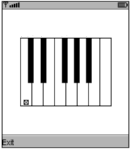
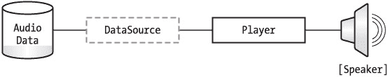
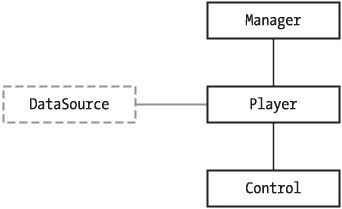
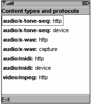

# 第 12 章：声音与音乐


## 概述

MIDP 2.0 包含基本的音频功能。MIDP 2.0 中的媒体 API 是移动媒体 API（MMAPI）的严格子集，后者是一个更通用的多媒体渲染 API。有关 MMAPI 的完整详细信息，请参阅以下规范：

[`jcp.org/jsr/detail/135.jsp`](http://jcp.org/jsr/detail/135.jsp)

MMAPI 本身类似于 Java 媒体框架（JMF）的袖珍版本，JMF 是 J2SE 的一个可选包。有关 JMF 的更多信息，请访问：

[`java.sun.com/products/java-media/jmf/`](http://java.sun.com/products/java-media/jmf/)

MIDP 2.0 中包含的 MMAPI 子集称为音频构建模块（ABB）。它包含播放简单音调和采样音频的功能。ABB 在 `javax.microedition.media` 和 `javax.microedition.media.control` 包中实现。本章首先提供可运行的代码示例，然后退一步解释一些概念，并更仔细地深入探讨这些 API。

## 快速入门

你可以通过调用 `javax.microedition.media.Manager` 中的以下方法来播放音调：

```
public static void playTone(int note, int duration, int volume)
```

在此方法中，`note` 的指定方式与 MIDI 音符类似，每个整数对应钢琴键盘上的一个琴键。中央 C 是 60，中央 C 上方的 A（440 Hz 音调）是 69。`duration` 以毫秒为单位，`volume` 的范围可以从 0（静音）到 100（最大音量）。

与 ABB 中的大多数其他方法一样，`playTone()` 可能会抛出 `MediaException`。尽管规范要求支持简单音调，但设备可能暂时无法播放音调。（例如，手机可能正在使用音调生成硬件来响铃。）

图 12-1 展示了 `PianoCanvas`，这是一个显示简单钢琴键盘并允许用户浏览琴键以播放不同音调的示例。`PianoCanvas` 的代码见清单 12-1。播放音调的代码非常简洁，仅包含在 `keyPressed()` 方法中对 `playTone()` 的调用。其余代码则专注于用户界面。

清单 12-1：*PianoCanvas* 源代码

| **** |

```
import javax.microedition.lcdui.*;
import javax.microedition.media.*;

public class PianoCanvas
    extends Canvas {
  private static final int[] kNoteX = {
     0, 11, 16, 29, 32, 48, 59, 64, 76, 80, 93, 96
  };

private static final int[] kNoteWidth = {
    16, 8, 16, 8, 16, 16, 8, 16, 8, 16, 8, 16
  };

private static final int[] kNoteHeight = {
    96, 64, 96, 64, 96, 96, 64, 96, 64, 96, 64, 96
  };

private static final boolean[] kBlack = {
    false, true, false, true, false,
        false, true, false, true, false, true, false
  };

private int mMiddleCX, mMiddleCY;
  private int mCurrentNote;

public PianoCanvas() {
    int w = getWidth();
    int h = getHeight();

int fullWidth = kNoteWidth[0] * 8;
    mMiddleCX = (w - fullWidth) / 2;
    mMiddleCY = (h - kNoteHeight[0]) / 2;

mCurrentNote = 60;
  }

public void paint(Graphics g) {
    int w = getWidth();
    int h = getHeight();

g.setColor(0xffffff);
    g.fillRect(0, 0, w, h);
    g.setColor(0x000000);

for (int i = 60; i <= 72; i++)
      drawNote(g, i);

drawSelection(g, mCurrentNote);
  }

private void drawNote(Graphics g, int note) {
    int n = note % 12;
    int octaveOffset = ((note - n) / 12 - 5) * 7 * kNoteWidth[0];
    int x = mMiddleCX + octaveOffset + kNoteX[n];
    int y = mMiddleCY;
    int w = kNoteWidth[n];
    int h = kNoteHeight[n];

if (isBlack(n))
      g.fillRect(x, y, w, h);
    else
      g.drawRect(x, y, w, h);
  }

private void drawSelection(Graphics g, int note) {
    int n = note % 12;
    int octaveOffset = ((note - n) / 12 - 5) * 7 * kNoteWidth[0];
    int x = mMiddleCX + octaveOffset + kNoteX[n];
    int y = mMiddleCY;
    int w = kNoteWidth[n];
    int h = kNoteHeight[n];

int sw = 6;
    int sx = x + (w - sw) / 2;
    int sy = y + h - 8;
    g.setColor(0xffffff);
    g.fillRect(sx, sy, sw, sw);
    g.setColor(0x000000);
    g.drawRect(sx, sy, sw, sw);
    g.drawLine(sx, sy, sx + sw, sy + sw);
    g.drawLine(sx, sy + sw, sx + sw, sy);
  }

private boolean isBlack(int note) {
    return kBlack[note];
  }

public void keyPressed(int keyCode) {
    int action = getGameAction(keyCode);
    switch (action) {
      case LEFT:
        mCurrentNote--;
        if (mCurrentNote < 60)
          mCurrentNote = 60;
        repaint();
        break;
      case RIGHT:
        mCurrentNote++;
        if (mCurrentNote > 72)
          mCurrentNote = 72;
        repaint();
        break;
      case FIRE:
        try { Manager.playTone(mCurrentNote, 1000, 100); }
        catch (MediaException me) {}
        break;
      default:
        break;
    }
  }
} 
```

| **** |

|  |


图 12-1：一个迷你的钢琴


ABB 还支持播放采样音频文件，尽管规范并未要求支持此功能。要播放采样音频，你只需为想要听到的数据获取一个 Player，然后启动该 Player 即可。你可以通过向 Manager 请求来获取一个 Player。在最简单的形式下，播放采样音频数据如下所示：

```
URL url = "http://65.215.221.148:8080/wj2/res/relax.wav";
Player p = Manager.createPlayer(url);
p.start();
```

在这种方法中，Web 服务器提供了数据的内容类型。另一种方法是获取音频数据的 InputStream，然后通过告知 Manager 数据的内容类型来创建 Player。这对于读取存储在 MIDlet 套件 JAR 中作为资源的音频文件非常方便。例如：

```
InputStream in = getClass().getResourceAsStream("/relax.wav");
Player player = Manager.createPlayer(in, "audio/x-wav");
player.start();
```

清单 12-2 是一个演示了这两种技术的简单 MIDlet。

清单 12-2：播放音频文件

| **** |

```
import java.io.*;

import javax.microedition.io.*;
import javax.microedition.lcdui.*;
import javax.microedition.midlet.*;
import javax.microedition.media.*;

public class AudioMIDlet
    extends MIDlet
    implements CommandListener, Runnable {
  private Display mDisplay;
  private List mMainScreen;

public void startApp() {
    mDisplay = Display.getDisplay(this);

if (mMainScreen == null) {
      mMainScreen = new List("AudioMIDlet", List.IMPLICIT);
      mMainScreen.append("Via HTTP", null);
      mMainScreen.append("From resource", null);
      mMainScreen.addCommand(new Command("Exit", Command.EXIT, 0));
      mMainScreen.addCommand(new Command("Play", Command.SCREEN, 0));
      mMainScreen.setCommandListener(this);
    }

mDisplay.setCurrent(mMainScreen);
  }

public void pauseApp() {}

public void destroyApp(boolean unconditional) {}

public void commandAction(Command c, Displayable s) {
    if (c.getCommandType() == Command.EXIT) notifyDestroyed();
    else {
      Form waitForm = new Form("Loading...");
      mDisplay.setCurrent(waitForm);
      Thread t = new Thread(this);
      t.start();
    }
  }

public void run() {
    String selection = mMainScreen.getString(
        mMainScreen.getSelectedIndex());
    boolean viaHttp = selection.equals("Via HTTP");

if (viaHttp)
      playViaHttp();
    else
      playFromResource();
  }

private void playViaHttp() {
    try {
      String url = getAppProperty("AudioMIDlet-URL");
      Player player = Manager.createPlayer(url);
      player.start();
    }
    catch (Exception e) {
      showException(e);
      return;
    }
    mDisplay.setCurrent(mMainScreen);
  }

private void playFromResource() {
    try {
      InputStream in = getClass().getResourceAsStream("/relax.wav");
      Player player = Manager.createPlayer(in, "audio/x-wav");
      player.start();
    }
    catch (Exception e) {
      showException(e);
      return;
    }
    mDisplay.setCurrent(mMainScreen);
  }

private void showException(Exception e) {
    Alert a = new Alert("Exception", e.toString(), null, null);
    a.setTimeout(Alert.FOREVER);
    mDisplay.setCurrent(a, mMainScreen);
  }
}
```

| **** |

|  |

## MIDP 2.0 媒体概念

音频数据有多种*内容类型*。内容类型实际上就是一种文件格式，它规定了数据中的每个比特如何对最终声音产生影响。常见的音频内容类型有 MP3、AIFF 和 WAV。在 MIDP 2.0 ABB 中，内容类型使用 MIME 类型来指定，MIME 类型使用字符串来指定主类型和子类型。例如，WAV 音频的 MIME 类型是 "audio/x-wav"。

内容类型规定了如何将比特转换为声音，但这只是成功的一半。*协议*规定了如何将数据从其原始位置传输到将要渲染它的地方。例如，你可以使用 HTTP 将音频数据从服务器传输到 MIDP 设备。

在 ABB 中，Player 知道如何渲染具有特定内容类型的音频数据，而关联的*数据源*则负责将数据传输给 Player。在移动媒体 API 中，抽象的 DataSource 类代表数据源。在 MIDP 2.0 ABB 中，数据源并非显式可用，而是隐式地与 Player 关联。音频信息的路径如图 12-2 所示。


图 12-2：音频数据路径

Manager 通过其 createPlayer() 方法为请求的内容类型和协议分配 Player。一个或多个*控件*可能与 Player 关联，以指定播放参数（如音量）。在 ABB 中，javax.microedition.media.Control 是一个代表控件的接口，而 javax.microedition.media.control 包则包含更具体的子接口。这些类之间的关系如图 12-3 所示。


图 12-3：类关系


## 支持的内容类型与协议

ABB 最不为人知的方面之一是其支持的内容类型。MIDP 2.0 在实现可能支持的内容类型和协议方面非常灵活。规范中仅说明，如果支持采样音频，则必须支持 8 位 PCM WAV。除此之外，再无限制。

如果你向 Manager 请求其无法处理的数据或协议，将会抛出 `MediaException`。

你可以在运行时通过 Manager 类中的两个方法了解支持哪些内容类型和协议：

```
public static String getSupportedContentTypes(String protocol)
public static String getSupportedProtocols(String content_type)
```

你可以查询给定协议支持的内容类型，或给定内容支持的协议。如果向这两个方法中的任何一个传递 `null`，你将获得支持的内容类型或协议的完整列表。

清单 12-3 中的 MIDlet 会查找所有支持的内容类型，并打印出每种类型对应的协议。

清单 12-3：在运行时检查内容类型和协议

| **** |

```
import javax.microedition.lcdui.*;
import javax.microedition.midlet.*;
import javax.microedition.media.*;

public class MediaInformationMIDlet
    extends MIDlet
    implements CommandListener {
  private Form mInformationForm;

  public void startApp() {
    if (mInformationForm == null) {
      mInformationForm =
          new Form("Content types and protocols");
      String[] contentTypes =
          Manager.getSupportedContentTypes(null);
      for (int i = 0; i < contentTypes.length; i++) {
        String[] protocols =
            Manager.getSupportedProtocols(contentTypes[i]);
        for (int j = 0; j < protocols.length; j++) {
          StringItem si = new StringItem(contentTypes[i] + ": ",
              protocols[j]);
          si.setLayout(Item.LAYOUT_NEWLINE_AFTER);
          mInformationForm.append(si);
        }
      }
      Command exitCommand = new Command("Exit", Command.EXIT, 0);
      mInformationForm.addCommand(exitCommand);
      mInformationForm.setCommandListener(this);
    }
    Display.getDisplay(this).setCurrent(mInformationForm);
  }

  public void pauseApp() {}

  public void destroyApp(boolean unconditional) {}

  public void commandAction(Command c, Displayable s) {
    notifyDestroyed();
  }
}
```

| **** |

|  |

图 12-4 显示了在 J2ME 无线工具包模拟器（2.0 beta 2 版本）上运行 `MediaInformationMIDlet` 的结果。关于此列表，需要理解三点：

1.  HTTP 是一种文件传输协议，而非流媒体协议。如果你通过 HTTP 指定媒体文件，则整个文件将在播放开始前下载完毕。相比之下，某些设备可能支持真正的流协议，如 RTP（参见 [`www.ietf.org/rfc/rfc1889.txt`](http://www.ietf.org/rfc/rfc1889.txt)）。

2.  “audio/x-tone-seq”内容类型并非真正的采样音频；它是音调序列的一种特殊情况，我稍后会介绍。

3.  该列表包含来自无线工具包 MMAPI 实现的一些功能和内容类型（视频、MIDI、音频捕获）。如果你想查看支持的内容类型和协议的精简列表，请按照本章末尾的描述关闭 MMAPI 支持。


图 12-4：在工具包 2.0 beta2 模拟器上运行的 *MediaInformationMIDlet*

要查找现有 Player 的内容类型，只需调用 `getContentType()`。

## Player 生命周期

由于播放音频可能会占用 MIDP 设备上的稀缺资源，并且采样音频文件相对较大，因此 Player 具有详细的生命周期，可以严格控制其行为。生命周期用 *状态* 来描述，由 Player 接口中的常量表示。Player 生命周期中状态的通常顺序如下：

*   Player 的生命始于 UNREALIZED 状态。这意味着已创建 Player 实现，但它尚未尝试查找要渲染的音频数据，也未尝试获取音频硬件等资源。

*   当 Player 定位到媒体数据后（例如通过发起网络连接并发送标头），它会进入 REALIZED 状态。

*   下一个状态是 PREFETCHED，表示 Player 已完成准备开始渲染音频所需的所有其他操作。这可能包括获取音频硬件的控制权、填充缓冲区或其他操作。

*   当 Player 开始渲染音频数据时，它处于 STARTED 状态。

*   最后一个状态是 CLOSED，表示 Player 已释放所有资源，关闭所有网络连接，并且无法再次使用。

*   Player 包含一组相应的方法，用于在状态之间转换：

    ```
    public void prefetch()
    public void realize()
    public void start()
    ```

这些方法在大多数情况下按预期工作。如果你跳过某个步骤，则会隐含中间状态。在上面的示例中，我在新创建的 Player 上调用了 `start()`，这隐含了对 `prefetch()` 和 `realize()` 的调用。

如果在定位媒体数据或获取系统资源时出现任何问题，这些方法会抛出 `MediaException`。

其他几个方法允许向后状态转换，尽管它们的名称不那么直观。`stop()` 方法将 STARTED 状态的 Player 带回 PREFETCHED 状态。`deallocate()` 方法通过释放资源，将 PREFETCHED 或 STARTED 状态的 Player 移回 REALIZED 状态。`deallocate()` 方法还有一个额外的特点；它可以将卡在尝试定位其媒体（在 `realize()` 过程中）的 UNREALIZED 状态的 Player 带回 UNREALIZED 状态。

最后，`close()` 方法将任何状态的 Player 移至 CLOSED 状态。所有资源被释放，所有网络连接被关闭，并且 Player 无法再次使用。

你可以通过调用 `getState()` 来获取 Player 的当前状态。

现在你已经了解了 Player 的生命周期，或许可以想象出改进上述简单 `AudioMIDlet` 的方法。例如，你可以对新创建的 Player 调用 `prefetch()`，以确保在用户选择 **Play** 命令后能尽快开始播放。你可能没有注意到太多延迟，但真实设备的运行速度会慢得多：

*   运行模拟器的桌面计算机比 MIDP 设备拥有更强大的处理能力和更多的内存。
*   桌面上的模拟器可能拥有比真实 MIDP 设备快得多的网络连接。
*   `AudioMIDlet` 使用的文件 `relax.wav` 非常小（1530 字节）。较大的媒体文件会产生更明显的延迟。

与网络和持久存储操作一样，任何与 Player 相关的耗时操作都应在与用户界面线程分离的线程中执行。虽然 `start()` 方法不会阻塞，但 `realize()` 和 `prefetch()` 在完成其可能缓慢的工作之前不会返回。


## 控制播放器

播放器的*媒体时间*是指其在音频播放中的当前位置。例如，一个播放 4 秒音频片段且进度过半的播放器，其媒体时间为 2,000,000 微秒。若想跳转到音频片段的特定位置，可调用`setMediaTime()`。通过`getMediaTime()`可获取当前媒体时间。音频片段的总时长由`getDuration()`返回。对于某些类型的流媒体，时长可能无法确定，此时将返回特殊值`TIME_UNKNOWN`。

播放器还可以循环播放，即反复播放同一音频片段。你可以在播放器启动前调用`setLoopCount()`来控制此行为。传入值-1 可实现无限循环。

播放器接口之外是一个完整的控件世界。你可以通过调用`getControls()`（播放器从`Controllable`接口继承的方法）获取播放器的控件列表。该方法返回适用于该播放器的控件数组。ABB 仅定义了`VolumeControl`和`ToneControl`，但具体实现可自由提供其他适用于其所支持内容类型和协议的控件。

若只需获取单个控件，可将控件名称传递给播放器的`getControl()`方法（同样继承自`Controllable`）。该名称是`javax.microedition.media.control`包中某个接口的名称。

播放器必须至少处于`REALIZED`状态才能返回其控件。

例如，要使用`VolumeControl`将播放音量设置为最大音量的一半，可以这样操作：

```
// Player player = Manager.createPlayer(...);
player.prefetch();
VolumeControl vc = (VolumeControl)player.getControl("VolumeControl");
vc.setLevel(50);
```

## 监听播放器事件

播放器包含用于添加和移除监听器的方法，这些监听器将收到播放器生命周期中各种里程碑事件的通知：

```
public void addPlayerListener(PlayerListener playerListener)
public void removePlayerListener(PlayerListener playerListener)
```

`PlayerListener`定义了一个单一方法，该方法会随各种信息消息被调用：

```
public void playerUpdate(Player player, String event, Object eventData)
```

其中`player`参数自然是生成事件的播放器。事件由字符串`event`描述，并可能包含附加信息`eventData`。`PlayerListener`接口中的常量描述了常见事件：`STARTED`、`END_OF_MEDIA`和`VOLUME_CHANGED`等。完整列表请参阅 API 文档。

## 音调与音调序列

你已经看到使用`Manager`播放单个音调是多么简单。在 MIDP 2.0 媒体 API 中隐藏着一个更为复杂的音调序列播放器。它是在播放器和控件架构中实现的，考虑到音调序列与采样音频几乎没有共同点，这算是一种权宜之计。

要获取音调序列播放器，只需将特殊值（`Manager`的`TONE_DEVICE_LOCATOR`）传递给`createPlayer()`。如果你查看`TONE_DEVICE_LOCATOR`，会发现它的值是`"device://tone"`，这大致意味着一个"设备"协议和"audio/x-tone-seq"内容类型。你可能还记得在`MediaInformationMIDlet`的输出中见过它。正如我所说，这算是一种权宜之计。

一旦获取了音调序列播放器，就可以通过其关联的`ToneControl`对象为其提供音调序列。要获取此控件，请调用`getControl("ToneControl")`。（记住，播放器需要先处于`REALIZED`状态。）

`ToneControl`封装了一个字节数组，其语法和构造在 API 文档中描述得晦涩难懂。掌握它之后，你就能像鲍比·麦克费林那样，将任何歌曲变成单声道杰作。我将描述字节数组格式并给出几个示例。

音调本身由音符编号和持续时间对定义。音符编号与`Manager`的`playTone()`方法相同，其中 60 是中央 C，69 是中央 C 上方的 440 赫兹 A 音。持续时间以*分辨率*的倍数指定。默认情况下，音调序列的分辨率是 4/4 拍（四拍）中一小节的 1/64。因此，持续时间 64 对应全音符（四拍），16 对应四分音符（一拍），8 是八分音符，以此类推。

所有音调序列必须以版本号开头。这不是你的数据版本，而是你正在使用的音调序列格式的版本。目前唯一接受的版本是 1。一个简单的音调序列如下所示：

```
byte[] sequence = new byte[] {
  ToneControl.VERSION, 1,
  67, 16, // 那
  69, 16, // 山
  67,  8, // 丘
  65,  8, // 充
  64, 48, // 满
  62,  8, // 了
  60,  8, // 生
  59, 16, // 机
  57, 16, // 的
  59, 32, // 音
  59, 32  // 乐
}; 
```

此音调序列依赖于几个默认值。默认速度为每分钟 120 拍（bpm），默认分辨率为 1/64。默认音量为 100（最大音量）。

音调序列中还有其他可用功能。可以实现相当程度的控制：

*   使用`TEMPO`常量设置速度，传入的速度值（以每分钟拍数为单位）需除以四。例如，`ToneControl.TEMPO, 15`将速度设置为 60 bpm，即每秒一拍。此操作只能在序列开头（在`VERSION`之后）执行一次。

*   可以使用`RESOLUTION`常量更改默认的 1/64 分辨率。传入的参数是分母，例如，使用`ToneControl.RESOLUTION, 64`将恢复默认的 1/64 分辨率。此操作只能在序列开头（在`TEMPO`之后）执行一次。

*   可以定义可重用的音调*块*。要开始块定义，请使用`ToneControl.BLOCK_START`并提供块编号。然后提供该块中的音符和持续时间。要结束块定义，请使用`ToneControl.BLOCK_END`并提供相同的块编号。要实际播放一个块，请使用`ToneControl.PLAY_BLOCK`并提供要播放的块编号。块必须在序列中的`VERSION`、`TEMPO`和`RESOLUTION`之后定义。

*   可以在序列中的任何时刻设置音量，以实现戏剧性的动态效果。例如，`ToneControl.SET_VOLUME, 25`将音量设置为最大值的四分之一。

*   要表示特定时长的休止符，请使用特殊音符值`ToneControl.SILENCE`。

*   可以多次重复单个音符。例如，`ToneControl.REPEAT, 7, 60, 16`以持续时长 16 播放中央 C（60）7 次。


清单 12-4 中的 MIDlet 包含几个示例，可帮助你编写自己的音调序列。

清单 12-4：单声道经典老歌

| **** |

```
import java.io.*;

import javax.microedition.io.*;
import javax.microedition.lcdui.*;
import javax.microedition.midlet.*;
import javax.microedition.media.*;
import javax.microedition.media.control.*;

public class ToneMIDlet
    extends MIDlet
    implements CommandListener {
  private final static String kSoundOfMusic = "音乐之声";
  private final static String kQuandoMenVo = "漫步街上";
  private final static String kTwinkle = "小星星变奏曲 VII";

private Display mDisplay;
  private List mMainScreen;

public void startApp() {
    mDisplay = Display.getDisplay(this);

if (mMainScreen == null) {
      mMainScreen = new List("音频 MIDlet", List.IMPLICIT);

mMainScreen.append(kSoundOfMusic, null);
      mMainScreen.append(kQuandoMenVo, null);
      mMainScreen.append(kTwinkle, null);
      mMainScreen.addCommand(new Command("退出", Command.EXIT, 0));
      mMainScreen.addCommand(new Command("播放", Command.SCREEN, 0));
      mMainScreen.setCommandListener(this);
    }

mDisplay.setCurrent(mMainScreen);
  }

public void pauseApp() {}

public void destroyApp(boolean unconditional) {}
  public void commandAction(Command c, Displayable s) {
    if (c.getCommandType() == Command.EXIT) notifyDestroyed();
    else run();
  }

public void run() {
    String selection = mMainScreen.getString(
        mMainScreen.getSelectedIndex());

byte[] sequence = null;
    if (selection.equals(kSoundOfMusic)) {
      sequence = new byte[] {
        ToneControl.VERSION, 1,
        67, 16, // 那
        69, 16, // 山
        67,  8, // 是
        65,  8, // 充 -
        64, 48, // 满
        62,  8, // 生
        60,  8, // 机
        59, 16, // 的
        57, 16, // 声
        59, 32, // 音 -
        59, 32  // 啊
      };
    }
    else if (selection.equals(kQuandoMenVo)) {
      sequence = new byte[] {
        ToneControl.VERSION, 1,
        ToneControl.TEMPO, 22,
        ToneControl.RESOLUTION, 96,
        64, 48, ToneControl.SILENCE, 8, 52, 4, 56, 4, 59, 4, 64, 4,
        63, 48, ToneControl.SILENCE, 8, 52, 4, 56, 4, 59, 4, 63, 4,
        61, 72,
        ToneControl.SILENCE, 12, 61, 12,
            63, 12, 66, 2, 64, 10, 63, 12, 61, 12,
        64, 12, 57, 12, 57, 48,
        ToneControl.SILENCE, 12, 59, 12,
            61, 12, 64, 2, 63, 10, 61, 12, 59, 12,
        63, 12, 56, 12, 56, 48,
      };
    }
    else if (selection.equals(kTwinkle)) {
      sequence = new byte[] {
        ToneControl.VERSION, 1,
        ToneControl.TEMPO, 22,
        ToneControl.BLOCK_START, 0,
        60, 8,        62, 4, 64, 4, 65, 4, 67, 4, 69, 4, 71, 4,
        72, 4, 74, 4, 76, 4, 77, 4, 79, 4, 81, 4, 83, 4, 84, 4,
        83, 4, 81, 4, 80, 4, 81, 4, 86, 4, 84, 4, 83, 4, 81, 4,
        81, 4, 79, 4, 78, 4, 79, 4, 60, 4, 79, 4, 88, 4, 79, 4,
        57, 4, 77, 4, 88, 4, 77, 4, 59, 4, 77, 4, 86, 4, 77, 4,
        56, 4, 76, 4, 86, 4, 76, 4, 57, 4, 76, 4, 84, 4, 76, 4,
        53, 4, 74, 4, 84, 4, 74, 4, 55, 4, 74, 4, 83, 4, 74, 4,
        84, 16, ToneControl.SILENCE, 16,
        ToneControl.BLOCK_END, 0,
        ToneControl.BLOCK_START, 1,
        79, 4, 84, 4, 88, 4, 86, 4, 84, 4, 83, 4, 81, 4, 79, 4,
        77, 4, 76, 4, 74, 4, 72, 4, 71, 4, 69, 4, 67, 4, 65, 4,
        64, 8,        76, 8,        77, 8,        78, 8,
        79, 12,              76, 4, 74, 8, ToneControl.SILENCE, 8,
        ToneControl.BLOCK_END, 1,

ToneControl.SET_VOLUME, 100, ToneControl.PLAY_BLOCK, 0,
        ToneControl.SET_VOLUME, 50, ToneControl.PLAY_BLOCK, 0,
        ToneControl.SET_VOLUME, 100, ToneControl.PLAY_BLOCK, 1,
        ToneControl.SET_VOLUME, 50, ToneControl.PLAY_BLOCK, 1,
        ToneControl.SET_VOLUME, 100, ToneControl.PLAY_BLOCK, 0,
      };
    }
    try {
      Player player = Manager.createPlayer(Manager.TONE_DEVICE_LOCATOR);
      player.realize();
      ToneControl tc = (ToneControl)player.getControl("ToneControl");
      tc.setSequence(sequence);
      player.start();
    }
    catch (Exception e) {
      Alert a = new Alert("异常", e.toString(), null, null);
      a.setTimeout(Alert.FOREVER);
      mDisplay.setCurrent(a, mMainScreen);
    }
  }
} 
```

| **** |

|  |

请记住，Player 的`start()`方法不会阻塞。如果你愿意，可以在模拟器中同时启动所有三首歌曲。这是因为工具包模拟器使用和弦设备来播放音调序列。在真实设备上，同时播放多个序列可能无法实现。但你可以设置一个序列运行，假设它不会占用太多处理器时间，你的 MIDlet 就可以去执行其他任务，比如绘制游戏界面或连接网络。

## 移动媒体 API

MIDP 2.0 的音频支持是移动媒体 API 全部功能的一个子集。如果你使用的是 J2ME 无线工具包，其模拟器默认支持完整的 MMAPI。这意味着你可以使用其他 API，并且实现支持多种额外的内容类型。

如果你想移除 MMAPI 支持，仅保留 MIDP 2.0 音频，请从 KToolbar 菜单中选择**编辑** Ø **首选项**，然后点击**API 可用性**选项卡。如果你不希望使用**移动媒体 API**，可以取消勾选。

如果你使用的是工具包的 MMAPI 实现，可以在首选项窗口的**MMedia**选项卡中自定义支持的内容类型和媒体功能。

有关 MMAPI 的更多信息，请参见[`wireless.java.sun.com/apis/articles/mmapi_overview/`](http://wireless.java.sun.com/apis/articles/mmapi_overview/)。

## 总结

在本章中，你学习了如何在 MIDP 2.0 中播放音调和采样音频。MIDP 2.0 包含了移动媒体 API 的一个子集——音频构建模块。它基于能够渲染音频数据的 Player 和知道如何将音频数据传输到 Player 的隐式协议对象。除了对采样音频的可选和灵活支持外，ABB 还包含音调序列播放器。现在，你的 MIDlet 可以受益于音乐和采样音频带来的乐趣。

