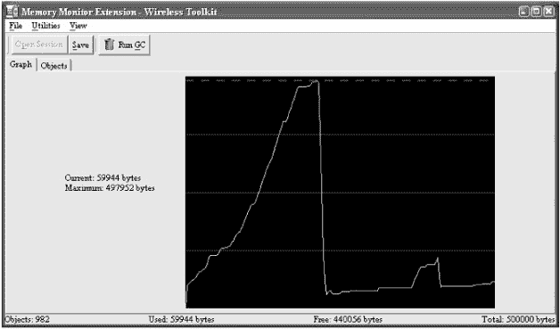
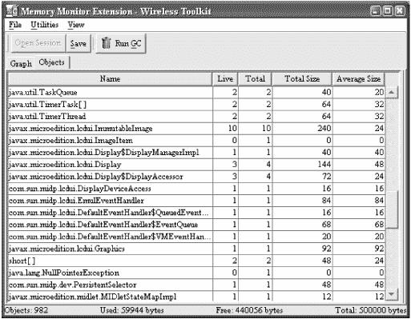
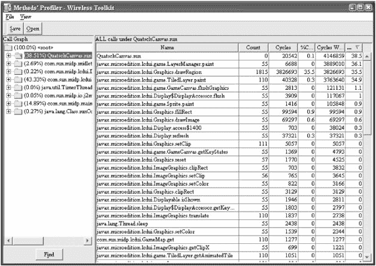
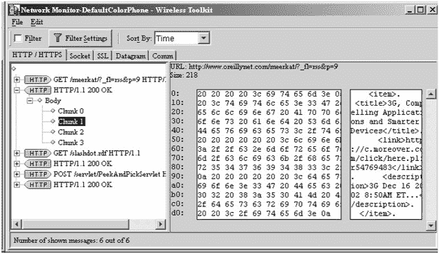

# 第 13 章：性能调优

## 概述

MIDP 是一个小型平台。MIDP 设备上的处理器可能比典型的桌面计算机处理器慢得多，可用内存也小得多。让你的应用程序运行快速且精简非常重要。你需要节约使用内存，使应用程序运行速度足够快以便于使用，并合理组织代码结构，使代码本身尽可能小。

本章描述了对你现有代码进行基准测试的简单方法。然后继续介绍各种优化方法，这些方法可以使你的代码运行更快或使用更少的内存。常识会对你大有帮助，但本章致力于为你提供优化应用程序的基本技术。

重要的经验法则是：只在需要的地方进行优化。换句话说：如果没坏，就别修。我建议你在编写应用程序的第一版时，应专注于代码的整洁性和可维护性。如果存在性能问题，找出它们并开始优化。你不应该在编写代码的同时进行优化——这很可能导致代码难以阅读和维护。先编写，再测试，最后优化。


## 基准测试

在 J2SE 领域，有许多工具可用于检查代码性能、瓶颈位置以及内存使用情况。遗憾的是，在 J2ME 领域，这些工具几乎不可用。大多数情况下，你只能采用传统方式进行基准测试。为此，MIDP API 中提供了几种有用的方法。要测试内存使用情况，你可以使用 `java.lang.Runtime` 中的以下方法：

```
public long freeMemory()
public long totalMemory()
```

第一个方法返回当前可用内存的字节数。第二个方法返回当前运行时环境中的总字节数，无论这些字节是否被对象使用。有趣的是，这个数字可能会发生变化，因为宿主环境（设备操作系统）可能会为 Java 运行时环境分配更多内存。

要查明一个对象使用了多少内存，你可以这样做：

```
Runtime runtime = Runtime.getRuntime();
long before, after;
System.gc();
before = runtime.freeMemory();
Object newObject = new String();
after = runtime.freeMemory();
long size = before - after;
```

除了检查内存使用情况，你可能还会关心应用程序的速度。同样，你可以用传统方式测试——在开始执行某项操作前查看时钟，操作完成后再查看一次。相关方法来自 `java.lang.System` 类：

```
public static long currentTimeMillis()
```

你可以像这样计算某个方法的执行时间：

```
long start, finish;
start = System.currentTimeMillis();
someMethod();
finish = System.currentTimeMillis();
long duration = finish - start;
```

为了获得精确的时间测量，你应该多次测量持续时间并计算平均值。

## J2ME Wireless Toolkit 中的诊断工具

从 1.0.4 版本开始，J2ME Wireless Toolkit 包含了三个可用于了解应用程序性能的工具。

第一个工具是内存监视器。你可以查看应用程序随时间变化的内存使用情况图表，或者应用程序中每个对象的详细分解信息。通过从 KToolbar 菜单中选择 **编辑** Ø **首选项** 来打开内存监视器。点击 **监视** 选项卡，并勾选 **启用内存监视器**。下次运行模拟器时，会弹出一个额外的窗口。你可以检查已使用的总内存，这在尝试让应用程序适配堆大小有限的设备时非常有用。（你甚至可以在首选项窗口的 **存储** 选项卡中设置模拟器的堆大小。）图 13-1 显示了内存监视器图表。


图 13-1：内存使用随时间变化的图表

如果你点击内存监视器窗口中的 **对象** 选项卡，会看到应用程序中对象的详细列表。图 13-2 显示了此视图。


图 13-2：对象及其内存

你可以点击表格中的任何列来按该列排序。你甚至可以使用 **视图** Ø **查找** 来搜索特定项目。检查内存监视器窗口将帮助你识别应用程序中内存消耗最多的地方。

除了内存监视器，该工具包还包括一个 *代码分析器*——一个显示应用程序中每个方法耗时情况的工具。要打开分析器，从 KToolbar 菜单中选择 **编辑** Ø **首选项**。选择 **监视** 选项卡并勾选 **启用分析**。

在退出模拟器之前，你不会看到分析器。退出时，分析器窗口会弹出，总结上次模拟器运行期间应用程序中每个方法的耗时。请注意，你在模拟器中的操作会影响分析器的输出；如果你想测试整个应用程序的性能，必须执行其所有选项。图 13-3 显示了运行第 11 章中的 QuatschMIDlet 示例后的模拟器。


图 13-3：分析器对所有内容计时。

最后，J2ME Wireless Toolkit 还包含一个网络监视器。虽然它可能对调试网络协议比对优化更有用，但这里值得一提。要打开网络监视器，从 KToolbar 菜单中选择 **编辑** Ø **首选项**。选择 **监视** 选项卡并勾选 **启用网络监视**。下次运行模拟器时，会弹出一个跟踪网络使用情况的新窗口。图 13-4 显示了来自 PeekAndPick 应用程序 ([`wireless.java.sun.com/applications/peekandpick/2.0/`](http://wireless.java.sun.com/applications/peekandpick/2.0/)) 的一些网络交互。


图 13-4：PeekAndPick 应用程序的网络活动

## 优化内存使用

J2SE 程序员很容易对内存使用掉以轻心。毕竟，有了垃圾回收器，你就不必担心显式释放内存——不再使用的对象会被运行在低优先级线程中的垃圾回收器神奇地回收。然而，在 J2ME 领域，内存是稀缺的，应该谨慎对待。此外，内存分配和垃圾回收器的工作都可能拖慢应用程序的速度。在本节中，我们将探讨高效使用对象的技术，特别是针对 `String` 和 `StringBuffer`。最后，我将讨论在确实没有剩余内存的情况下如何优雅地处理这种情况。

### 创建和丢弃对象

如果你在循环内部创建新对象，这应该在你的脑海中敲响警钟。每次创建对象（使用 `new`）时，都会分配内存。分配内存需要时间。更糟糕的是，在循环开始时创建的对象很可能在循环结束时超出作用域，这意味着循环的每次迭代都会使运行时系统更接近运行垃圾回收器。以下是一个示例：

```
// 设置输入和结果数组。
Object[] inputs = new Object[1000];
int[] results = new int[1000];
// 处理每个输入以计算结果。
int length = inputs.length;
for (int i = 0; i < length; i++) {
  Processor p = new Processor(inputs[i]);
  results[i] = p.calculateResult();
}
```

在循环中创建对象会在性能方面造成双重惩罚。每次循环都会创建一个新的 `Processor`；如果这些对象足够大，那么在循环结束之前可能会强制进行一次或多次垃圾回收。你需要在对象首次创建时付出代价，然后在对象被垃圾回收时再次付出代价。

你几乎总是可以重构代码来避免这个问题。例如，你可以这样做，而不是为每个输入创建一个新的 `Processor`：

```
// 设置输入和结果数组。
Object[] inputs = new Object[1000];
int[] results = new int[1000];
// 处理每个输入以计算结果。
int length = inputs.length;
Processor p = new Processor();
for (int i = 0; i < length; i++) {
  p.setInput(inputs[i]);
  results[i] = p.calculateResult();
} 
```


### 字符串与 StringBuffer

字符串在 Java 中拥有特殊地位。它们是唯一支持加号运算符（+）重载的对象。每次使用加号运算符拼接字符串时需谨慎——在幕后，很可能正在为你创建新的 String 和 StringBuffer 对象。

String 与 StringBuffer 之间存在着微妙的关系。当你创建并修改 StringBuffer 时，实际操作是在内部字符数组上进行的。当你从 StringBuffer 创建 String 时，该 String 会指向同一个字符数组。到目前为止一切正常，对吧？但如果你进一步修改 StringBuffer，它会巧妙地创建一个新的字符数组——即原数组的副本。因此，虽然 StringBuffer 通常是创建字符串的高效方式，但新对象究竟在何时创建并不总是显而易见。

这个故事给我们的启示是：但凡看到字符串拼接的地方，都可能正在创建新对象。如果你在循环中拼接字符串，就应该考虑采用不同的方法，可能涉及 StringBuffer。另一种可能的优化是彻底放弃 String 和 StringBuffer，直接使用字符数组。虽然这在你自己的代码中可能是快速高效的解决方案，但请记住，许多 API 要求将字符串作为参数，并从方法返回字符串，因此你最终可能需要在字符数组和字符串之间进行大量转换。

### 优雅地处理失败

鉴于典型 MIDP 设备内存匮乏，你的应用程序每次请求内存时都应做好失望的准备。每次创建对象时，代码都应捕获`java.lang.OutOfMemoryError`。由你来捕获 OutOfMemoryError 远比宿主环境捕获要好得多。至少你有机会做一些合理的事情——释放一些内存并重试，或者向用户显示措辞礼貌的消息来优雅地失败。宿主环境不太可能如此友善，用户对你应用的观感也会糟糕得多。请记住，你可能需要先丢弃大型数据结构来释放内存，然后才有足够空间创建用于向用户显示消息的 Alert。

## 为速度而编码

小型设备配备的是小型且相对较慢的处理器。作为开发者，你的部分任务是确保应用程序运行速度足够快，以免用户拒绝使用。

### 优化循环

一个简单的优化与循环有关。遍历 Vector v 的典型循环可能如下所示：

```
for (int i = 0; i < v.size(); i++) {
  Object o = v.elementAt(i);
  // 处理 Object o。
}
```

每次循环时，都会调用 v 的 size()方法。优化版本会先存储向量的大小，如下所示：

```
int size = v.size();
for (int i = 0; i < size; i++) {
  Object o = v.elementAt(i);
  // 处理 Object o。
}
```

这是一个简单的例子，但它说明循环条件是你寻找速度优化的一个切入点。

### 使用数组替代对象

数组通常比集合类更快、更精简。我们在前面讨论字符串和 StringBuffer 时已经触及这个主题；如果不太笨拙的话，直接使用字符数组可能比处理 String 和 StringBuffer 对象更高效。同样的规则也适用于 MIDP 集合类 Vector 和 Hashtable。虽然 Vector 和 Hashtable 简单方便，但它们确实会带来一些可以削减的开销。Vector 本质上只是数组的一个包装器，因此如果你能直接使用数组，就能节省一些内存和处理时间。同样，如果你有简单的键对象到值对象的映射，使用对象数组可能比使用 Hashtable 更合理。

如果你决定使用 Hashtable 或 Vector，请在创建时尽量正确指定其大小。Vector 和 Hashtable 都会根据需要增长，但这一操作相对昂贵。Vector 会创建新的内部数组，并将元素从旧数组复制到新数组。Hashtable 会分配新数组，并执行一种计算开销很大的操作，称为*rehashing*（再哈希）。Vector 和 Hashtable 都有允许你指定集合初始大小的构造函数。你应该尽可能准确地指定这些集合的初始大小。

如果你正在使用持久存储 API，可能会倾向于将流类包装在记录数据周围。例如，你可能读取一条记录，然后在记录数据周围包装一个 ByteArrayInputStream，再在 ByteArrayInputStream 周围包装一个 DataInputStream，以便从记录中读取基本类型。这很可能过于笨重而不实用。如果可能的话，请直接操作记录的字节数组。

### 使用缓冲 I/O

不要从流中逐个字节地读取，也不要逐个字节地写入。虽然流类提供了读写单个字节的方法，但你应该尽可能避免使用它们。读取或写入整个数据数组几乎总是更高效。

J2SE 提供了 BufferedReader 和 BufferedWriter 类，可以"免费"提供缓冲功能。在 MIDP 领域则没有这样的奢侈功能，因此如果你想使用缓冲，就必须自己实现。


### 保持整洁

一个简单的建议是及时清理。一旦使用完毕就释放资源，可以提升应用程序的性能。如果你有内部数组或数据结构，在不使用时应当释放它们。一种方法是将数组引用设为 null，以便数组能被垃圾回收。如果你急于将内存归还给运行时系统，甚至可以显式调用垃圾回收器 `System.gc()`。

网络连接也应在使用完毕后立即释放。一个很好的做法是使用 `finally` 子句。考虑以下未使用 `finally` 子句的代码：

```
HttpConnection hc = null;
InputStream in = null;
try {
  hc = (HttpConnection)Connector.open(url);
  in = hc.openInputStream();
  // 从 in 中读取数据。
  in.close();
  hc.close();
}
catch (IOException ioe) {
  // 处理异常。
} 
```

问题在于，当尝试从连接的输入流读取数据时如果抛出异常，执行流程会跳转到异常处理程序，导致输入流和连接从未被关闭。在内存充裕的 J2SE 环境中，这可能不是什么大问题。但在 MIDP 设备上，一个挂起的连接可能是一场灾难。当你绝对、肯定地想要确保某些代码被执行时，应该将其放入 `finally` 块中，如下所示：

```
HttpConnection hc = null;
InputStream in = null;
try {
  hc = (HttpConnection)Connector.open(url);
  in = hc.openInputStream();
  // 从 in 中读取数据。
}
catch (IOException ioe) {
  // 处理异常。
}
finally {
  try {
    if (in != null) in.close();
    if (hc != null) hc.close();
  }
  catch (IOException ioe) { }
}
```

这看起来有点丑陋，尤其是 `finally` 块内部的 `try` 和 `catch`。一个更简洁的解决方案是将这段代码封装到一个方法中，并声明该方法抛出 `IOException`。这能显著简化代码：

```
private void doNetworkStuff(String url) throws IOException {
  HttpConnection hc = null;
  InputStream in = null;
  try {
    hc = (HttpConnection)Connector.open(url);
    in = hc.openInputStream();
    // 从 in 中读取数据。
  }
  finally {
    if (in != null) in.close();
    if (hc != null) hc.close();
  }
} 
```

`finally` 的关键在于，无论控制流如何离开 `try` 块，其代码都会被执行。无论是抛出异常、有人调用 `return`，还是控制流正常离开 `try` 块，我们的 `finally` 块都会被执行。注意，这里仍然存在一点小隐患：如果在尝试关闭 `in` 时抛出异常，那么 `hc` 将永远不会被关闭。你可以将每个 `close()` 调用分别放在自己的 `try` 和 `catch` 块中来解决这个问题。

保持整洁适用于任何类型的流、记录存储和记录枚举。任何可以关闭的资源都应该被关闭，最好是在 `finally` 块中。

### 优化用户界面

重要的是要记住，你试图优化的是应用程序的*感知*速度，而非实际速度。如果应用程序冻结几秒钟，用户会变得焦躁不安；添加某种进度指示器可以大大提升用户满意度。你确实无法让网络运行得更快，但如果你显示一个旋转的时钟或移动的进度条，你的应用程序至少在等待网络时看起来还活着。

请记住，手机和其他小型“消费类”设备的用户会比典型的桌面电脑用户要求高得多。经过多年的体验，饱受折磨的桌面电脑用户对应用程序的期望已经相当低。他们意识到大多数桌面应用程序都有学习曲线，并且经常难以驾驭。而消费类设备则更有可能第一次就正常工作，既不需要手册，也不需要高级学位才能操作。

考虑到这一点，请确保你的 MIDlet 用户界面简单、快速、响应迅速且信息丰富。

## 优化应用程序部署

最后一个优化领域与应用程序的实际部署有关。你可能还记得第 3 章，MIDlet 被打包在 MIDlet 套件中，这实际上就是一些花哨的 JAR 文件。优化应用程序的一种方法是划分你的类，以便只将需要的类加载到运行时环境中。如果小心处理，你可以通过消除不需要的类来减小 MIDlet 套件 JAR 的大小。最后，可以使用代码混淆器来进一步减小 MIDlet 套件 JAR 的大小。

### 划分你的应用程序

MIDP 运行时环境在需要时加载类。你可以利用这一点来优化应用程序的运行时占用空间。例如，假设你编写了一个约会簿应用程序，它能够向你发送提醒邮件，或称*提醒器*。你可能会意识到许多人不会使用提醒器功能。如果用户不使用提醒器，为什么提醒器代码要占用 MIDP 设备上的空间呢？如果你正确地划分代码，所有提醒器功能都可以封装在一个单独的类中。如果应用程序的其他部分从未调用提醒器代码，该类就不会被加载，从而获得更精简的运行时占用空间。

### 只包含你需要的类

你可能在 MIDlet 套件中使用了第三方包，例如 XML 解析器（参见第 14 章）或加密包（参见第 15 章）。在开发阶段，你可能只是将整个包转储到 MIDlet 套件中。但在部署时，你应该修剪掉多余的包，以减小 MIDlet 套件 JAR 的大小。在某些情况下，这会相当容易，比如如果你只是解析 XML，就可以丢弃 WAP 支持类。其他时候，哪些类需要、哪些可以去掉则不那么明显。然而，如果你真的想减小 MIDlet 套件 JAR 的大小，这是一个关键步骤。你不需要手动完成这项工作；一个*混淆器*会为你代劳。

### 使用混淆器

最后，一个*字节码混淆器*可以减小类文件的大小。字节码混淆器是一种旨在使反编译类文件变得困难工具。反编译是一个过程，通过它，某人可以重新创建用于生成特定类文件的源代码。担心竞争对手窃取代码的人会使用混淆器来增加反编译的难度。然而，混淆有一个副作用，即减小类文件的大小，这主要是因为你所创建的描述性方法和变量名被替换成了机器生成的小名称。如果你非常认真地想要减小 MIDlet 套件 JAR 的大小，请尝试混淆你的代码。我建议在预验证类文件之前运行混淆器，但反过来操作也是可行的。以下是两个可供入门的混淆器：

```
http://proguard.sourceforge.net/
http://www.retrologic.com/retroguard-main.html 
```


## 摘要

MIDP 应用程序的目标是在小型平台上运行，这意味着高效使用内存和处理能力至关重要。创建和销毁对象的开销很大，因此优化代码的一种方法是减少创建对象的数量。新对象的一个常见来源是创建字符串的代码。考虑使用 `StringBuffer` 或字符数组来优化字符串操作。同样，你可以通过使用对象数组代替 `Vector` 或 `Hashtable` 来精简代码。请记住，性能在很大程度上也关乎用户体验；提供一个响应迅速、交互活跃的用户界面，并优雅地处理故障。你还可以通过多种方式优化应用程序的交付。首先，智能地划分应用程序的功能可以减少其运行时占用空间。其次，裁剪多余的类可以减小 MIDlet 套件 JAR 文件的大小。最后，字节码混淆器可以进一步减小 MIDlet 套件 JAR 文件的大小。

