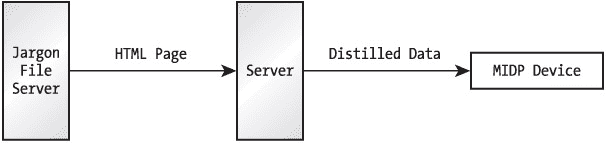

# 第 14 章：解析 XML

在桌面和企业级应用中，Java 和 XML 是一对黄金组合。简而言之，Java 是可移植的代码，而 XML 是可移植的数据。使用 Java 开发，你能够将代码部署到许多不同的平台上，而 XML 则提供了一种高度可移植的数据格式，用于在应用程序组件以及应用程序本身之间交换数据。

XML 的流行也延伸到了 J2ME 世界。本章介绍可用于 MIDP 环境的 XML 解析器。这些内容非常有趣，正处在 J2ME 开发的前沿。相关标准正在制定中，但尚未最终确定。有关 XML 解析和 Web 服务的 JSR 详情，请参见 [`jcp.org/en/jsr/detail?id=172`](http://jcp.org/en/jsr/detail?id=172)。

## XML 概述

XML 即可扩展标记语言。一个 XML 文件是由标签分隔的数据集合。XML 文件是结构化的，并且具有高度的可移植性。

让我们再次回顾第 2 章中的 Jargoneer 应用程序。在该应用中，MIDP 设备与一个中间服务器通信。该服务器从 Jargon 文件服务器检索 HTML 页面，执行解析，然后将精简后的数据版本发送到 MIDP 设备。图 14-1 展示了这种架构。


图 14-1：*Jargoneer* 的简单架构

那么，究竟什么数据可以从中间服务器发送到 MIDP 设备呢？Jargoneer 示例应用实际上发送的是纯文本，但还有许多其他可能性。在服务器和设备之间交换数据的次简单技术是使用属性文件，如下所示：

```
word: grok
pronunciation: /grok/
type: vt.
meaning: from the novel "Stranger in ...
```

这种方法效果不错，对于简单的应用来说可能就足够了。你需要编写一个类来解析此输入（MIDP 不包含 `java.util.Properties`），但这并不太难。

然而，你的应用程序的某些部分很可能已经在使用 XML，如果你的 MIDlet 能够解析 XML 而不是使用其特定的数据格式，这可能会大大简化你的工作。此外，在开发周期中使用 XML 验证可能有助于发现错误。

那么，同样的信息作为 XML 文件，可能看起来像这样：

```
<?xml version="1.0" encoding="ISO-8859-1"?>
<jargon-definition>
  <word>grok</word>
  <pronunciation>/grok/</pronunciation>
  <type>vt.</type>
  <meaning>[from the novel "Stranger in ...</meaning>
</jargon-definition>
```

这个简单的 XML 文档说明了一些重要点。首先，标签标记了文档中的每一段数据（元素）。本质上，每个元素都有一个名称。匹配的开始和结束标签用于清晰地区分元素。例如，开始标签 `<word>` 和结束标签 `</word>` 包围了单词本身。还要注意，元素可以嵌套。`jargon-definition` 元素只是其他元素的集合。任何其他元素都可以包含进一步嵌套的元素。

元素标签也可以包含属性。编写上述 XML 文件的另一种方式如下：

```
<?xml version="1.0" encoding="ISO-8859-1"?>
<jargon-definition word="grok" pronunciation="/grok/" type="vt.">
  [from the novel "Stranger in ...
</jargon-definition> 
```

如何构建 XML 数据完全取决于你。通常，这取决于你的应用程序结构以及你将与之交换数据的系统。

| **。

| **** |

|  |

### 理解 SAX

SAX 是 XML 的简单 API，是一个供希望解析 XML 数据的 Java 应用程序使用的标准 API。该 API 在线文档位于 [`www.megginson.com/SAX/`](http://www.megginson.com/SAX/)，但兼容 SAX 的解析器通常会将 SAX API 作为其软件的一部分包含在内。SAX 的当前版本是 2.0，但本章涵盖的小型解析器如果实现了 SAX，通常只达到 1.0 级别。

SAX 1.0 围绕 `org.xml.sax.Parser` 接口展开。`Parser` 有一个 `parse()` 方法，该方法解析整个 XML 文档，并向监听对象抛出事件。通常，你的应用程序会实现一个 `DocumentHandler`，它接收关于开始标签、结束标签、元素数据和其他重要事件的通知。一个 SAX 1.0 应用程序看起来像这样：

```
try {
  Parser p = new SAXParser(); // 创建一个特定的解析器实现。
  // 创建一个名为 handler 的 DocumentHandler。
  p.setDocumentHandler(handler);
  p.parse();
}
catch (Exception e) { // 处理异常。 } 
```

对 `parse()` 的调用会一直进行，直到文档被完全解析。在解析过程中，已注册的 `DocumentHandler` 中的回调方法会被调用。在这些方法中，你将处理来自 XML 文档的数据。

SAX 1.0 并非开箱即用就能兼容 MIDP。`Parser` 接口包含一个 `setLocale()` 方法，该方法引用了 `java.util.Locale` 类，而该类在 MIDP 平台中缺失。

另一个标准 API，文档对象模型（DOM），采用了不同的 XML 解析方法。使用 DOM，解析器在解析文档时会创建一个文档的内部模型。解析完成后，应用程序可以检查整个文档。DOM 在 [`www.w3.org/TR/DOM-Level-2-Core/`](http://www.w3.org/TR/DOM-Level-2-Core/) 有进一步描述。尽管本章描述的所有解析器都没有直接实现 DOM，但其中一些确实遵循了 DOM 的范式，即创建已解析文档的内部表示。

一个较新的 XML 解析器 API 标准是 XmlPull，其文档位于 [`www.xmlpull.org/`](http://www.xmlpull.org/)。XmlPull 由 kXML 2 实现，稍后将介绍 kXML 2。


### 验证与开发周期

XML 文档也可能引用文档类型定义（DTD）或 XML 模式；这些文件描述了特定类型 XML 文档的内容。例如，我们可以编写一个 DTD 来规定术语定义文档的内容。这是 XML 强大功能的一部分，也是 XML 有时被称为*自描述数据*的原因。

给定一个文档，你可以判断它是否符合其 DTD，这是确定系统某部分是否产生了系统其他部分无法读取的数据的好方法。用 XML 术语来说，遵循其 DTD 或模式规则的文档是*有效的*。在 J2SE 和 J2EE 世界中，解析器可以是验证型或非验证型的。J2ME 世界太小，无法支持 XML 文档验证，因此我们将在本章讨论的所有解析器都是非验证型的。

尽管你无法在 MIDP 设备上执行验证，但在开发和测试周期中，你很可能希望使用验证型解析器。例如，你可以编写模拟 MIDP 客户端的代码，让其从服务器请求数据并验证结果。这有助于在切换到 MIDP 客户端软件之前，清除服务器代码中的错误。

### 设计技巧

常识总能让你走得很远。在考虑如何在 MIDP 应用程序中使用 XML 时，请牢记三点：

*   **保持文档小巧。** 如果你要向 MIDP 设备发送一个约 100KB 的文档，却只使用其中几个元素，那么是时候重新考虑你的服务器端策略了。你很可能可以在服务器端转换文档，只将所需内容发送到设备。请记住，网络连接可能很慢，而且设备上的内存也不多。

*   **不要在发送给 MIDP 设备的 XML 中使用注释**，除非在开发周期中作为调试辅助。注释只会使文档变长，这意味着下载速度更慢，设备上的内存占用更多。

*   **选择适合你需求的解析器。** 我们将研究的一些解析器会在解析文档时在内存中构建整个文档模型。这就像给 XML 文档的提供者开了一张空白支票。如果服务器向你发送一个 1MB 的文件，这类解析器会尝试读取整个文件，直到内存耗尽。另一方面，如果你知道要解析的文件大小，并且它们足够小，你可能会选择模型构建型解析器，因为它比其他类型的解析器稍微容易使用。

*   **考虑使用 XML 文档的紧凑表示形式。** 用 ASCII 或 Unicode 表示 XML 文档效率不高，并且有多种方案可以实现更紧凑的表示。事实上，WAP 论坛已经定义了一种名为 WBXML 的二进制编码 XML 标准。一个名为 SWX 的解析器可以处理 WBXML，并且适用于像 MIDP 这样的小型平台：[`www.trantor.de/wbxml/`](http://www.trantor.de/wbxml/)。关于这个问题的另一种方法，请参见 [`jxme.jxta.org/`](http://jxme.jxta.org/) 上的 JXME 项目。

最后，你可能会担心小型 XML 解析器的性能。这是一个合理的担忧，尤其是在处理器相对较慢的小型设备上。关于 XML 解析器性能的精彩对比，请参见 [`www.extreme.indiana.edu/~aslom/exxp/`](http://www.extreme.indiana.edu/~aslom/exxp/)。对于小型文档，小型解析器可以保持自己的优势，甚至超越大型解析器。

与其他可能耗时的操作一样，解析应该在其自己的线程中完成，以免用户界面冻结。

## MIDP XML 解析器概览

表 14-1 列出了可用于 MIDP 平台的小型开源 XML 解析器。每个解析器都根据“许可证”列中列出的某种开源软件许可证发布。“大小”列显示了解析器压缩类文件的近似大小。“类型”列使用以下之一描述了解析范式：

*   “拉取”表示程序员反复调用解析器上的一个方法来驱动它遍历文档。
*   “推送”表示解析器自行遍历整个文档，在重要事件发生时调用代码中的回调方法。SAX 解析器实现了推送范式。
*   “模型”表示解析器构建文档的某种内部表示（在内存中）。解析完成后，你的代码可以检查此模型并提取元素数据。

表 14-1：小型 XML 解析器

| **名称** | **版本** | **URL** | **许可证** | **大小** | **MIDP** | **类型** |
| --- | --- | --- | --- | --- | --- | --- |
| kXML | 1.21 | [`kxml.enhydra.org/`](http://kxml.enhydra.org/) | EPL | 21KB | 是 | 拉取 |
| kXML | 2.1.6 | [`kxml.org/`](http://kxml.org/) | CPL | 9KB | 是 | 拉取 |
| MinML | 1.7 | [`www.wilson.co.uk/xml/minml.htm`](http://www.wilson.co.uk/xml/minml.htm) | BSD | 14KB | 否 | 推送 |
| NanoXML | 2.2.2 lite | [`web.wanadoo.be/cyberelf/nanoxml/`](http://web.wanadoo.be/cyberelf/nanoxml/) | zlib/libpng | 6KB | 否 | 模型 |
| TAM | - | [`simonstl.com/projects/tam/`](http://simonstl.com/projects/tam/) | MPL | 17KB | 是 | 推送 |
| TinyXML | 0.7 | [`www.gibaradunn.srac.org/tiny/`](http://www.gibaradunn.srac.org/tiny/) | GPL | 6KB | 否 | 模型 |
| XmlReader | - | [`kobjects.org/utils4me/`](http://kobjects.org/utils4me/) | LGPL | 5KB | 是 | 拉取 |
| XMLtp | 1.7 | [`mitglied.lycos.de/xmltp/`](http://mitglied.lycos.de/xmltp/) | BSD | 21KB | 否 | 模型 |
| Xparse-J | 1.1 | [`www.webreference.com/xml/tools/xparse-j.html`](http://www.webreference.com/xml/tools/xparse-j.html) | GPL | 7KB | 是 | 模型 |

MIDP 列指示解析器源代码是否无需修改即可在 MIDP 平台上编译。

表 14-2 提供了关于每种许可证类型的更多信息，列出了许可证名称和提供更多信息的 URL。

表 14-2：软件许可证

| **名称** | **URL** |
| --- | --- |
| BSD | [`opensource.org/licenses/bsd-license.php`](http://opensource.org/licenses/bsd-license.php) |
| CPL | [`opensource.org/licenses/cpl.php`](http://opensource.org/licenses/cpl.php) |
| EPL | [`kxml.enhydra.org/software/license/`](http://kxml.enhydra.org/software/license/) |
| GPL | [`www.webreference.com/xml/tools/license.html`](http://www.webreference.com/xml/tools/license.html) |
| LGPL | [`opensource.org/licenses/lgpl-license.php`](http://opensource.org/licenses/lgpl-license.php) |
| MPL | [`www.mozilla.org/MPL/MPL-1.1.html`](http://www.mozilla.org/MPL/MPL-1.1.html) |
| zlib/libpng | [`opensource.org/licenses/zlib-license.php`](http://opensource.org/licenses/zlib-license.php) |

在接下来的章节中，我将介绍一个更可靠的解析器，kXML 1.21。我还将讨论移植那些不符合 MIDP 规范的解析器的技术。


## 使用 kXML 1.21

目前，kXML 1.21 是最完善且支持度最好的解析器。它最初由德国多特蒙德大学开发，现已成为 Enhydra 网站的一部分。该解析器基于通用 XML（[`simonstl.com/articles/cxmlspec.txt`](http://simonstl.com/articles/cxmlspec.txt)），这是一套关于使用 XML 1.0 的建议规范。通用 XML 定义了一组核心的 XML 功能，与其说它是一个规范，不如说是一种理念。

kXML 专为 CLDC 和 MIDP 等 KVM 环境设计。在本章介绍的所有解析器中，kXML 是少数几个无需修改即可在 MIDP 环境中编译的解析器之一。它的体积也相对较大；如果你担心内存问题，可能需要考虑其他体积更小的解析器。另一方面，使用混淆器可以显著减小代码体积，特别是当你的应用程序中未使用解析器 API 的某些部分时。

kXML 实现了一个基于拉取（pull）的解析器，遵循 XmlPull 标准，包含在 `org.kxml.parser` 包中。*基于拉取*意味着你指示解析器逐个解析每个元素。相比之下，SAX 解析器会一次性解析整个文档，并在事件发生时通知你。

kXML 的大部分解析器功能都在 `AbstractXmlParser` 类中定义。在你的代码中，你将使用具体的 `XMLParser` 子类。基本思路是实例化一个 `XMLParser`，并传入一个代表待解析数据的 `java.io.Reader`。然后重复调用 `read()` 方法，处理每个元素，直到文档结束。`read()` 返回一个 `ParseEvent`，它可以表示开始标签、元素文本或其他解析器事件。在 MIDlet 代码中，大致如下所示：

```
// InputStream rawIn = ...
Reader in = new InputStreamReader(rawIn);
AbstractXmlParser p = new XmlParser(in);
ParseEvent pe = null;
while ((pe = p.read()) != null) {
  ; // 处理事件。
  if (pe.getType() == org.kxml.Xml.END_DOCUMENT)
    break;
}
```

`ParseEvent` 有一个类型属性（通过 `getType()` 返回），该属性将是 `org.kxml.Xml` 类中定义的常量之一。`ParseEvent` 也有各种子类来表示某些事件类型。然而，通常不需要向下转型，因为 `ParseEvent` 已经包含了访问数据所需的大部分方法。

在上面的示例代码中，我显式地测试了 `END_DOCUMENT` 事件类型，该类型表示解析器已完成解析。

有关从 MIDlet 解析 XML 的实际示例，请参阅 [`wireless.java.sun.com/applications/peekandpick/2.0/`](http://wireless.java.sun.com/applications/peekandpick/2.0/) 上的 PeekAndPick 应用程序。该应用程序解析代表新闻源的 RSS 文件（XML 文档），并在 MIDP 设备上显示结果。

## 移植技术

如果你决定移植一个不能直接在 MIDP 中构建的解析器，可以考虑以下几种技术：

*   移除不需要的功能。如果解析器代码模块化良好，并且你的应用程序不需要这些功能，你可以删除源代码的整个子目录。例如，你可以移除一个在解析器之上提供 SAX 接口的包，或者一个 WAP 支持包。

*   解析器通常无法编译，因为它们使用了 J2SE 中但 MIDP 中没有的类。解决这个问题的一种方法是提供缺失的 J2SE 类。这种方法有两个挑战。首先，使用 J2SE 源代码存在法律限制。详情请参阅源代码许可协议。你可以通过提供自己的实现来解决这个问题。第二个问题是 MIDP 实现不会加载在 `java.*` 和 `javax.*` 命名空间中定义的类。你可以使用混淆器将类重命名到不同的包中来解决这个问题。（第 15 章对此有更详细的介绍。）

*   一个更简洁的选择是使用同一包中的类或内部类来替换 J2SE 中缺失的部分。

## 在 J2ME Wireless Toolkit 中使用解析器

将解析器集成到你的 MIDlet 套件中出奇地简单。如果有编译好的类 JAR 或 ZIP 文件，你可以将其放入项目的 *lib* 目录中。例如，如果 J2ME Wireless Toolkit 安装在 */WTK20*，你的项目名为 *ParseProject*，并且你使用的是 kXML 1.21，那么你需要将 *kxml-min.zip* 文件安装到 */WTK20/apps/ParseProject/lib* 目录下。

另一方面，如果有解析器的源代码，你可以直接将其放入项目的 *src* 目录中。

你可能希望使用混淆器来减小 MIDlet 套件 JAR 的大小。每当向应用程序添加第三方库时，使用混淆器都是一个好主意。一个好的混淆器会移除代码中未使用的方法和类，从而显著节省空间。

## 总结

小型设备上的 XML 世界广阔且尚未定型。勇敢的开发者可以使用本章描述的解析器之一，在 MIDP 环境中解析 XML。作为从服务器向客户端传输数据的一种方式，XML 是一个绝佳的选择。只需记住保持文档小巧简洁即可。

