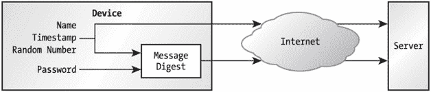
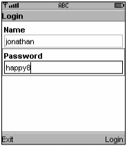
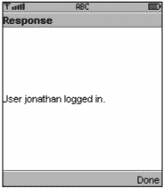
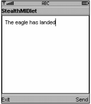
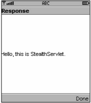

# 第 15 章：保护网络数据

MIDlet 无疑很酷——在小型设备上运行的 Java 代码，以及 HTTP 网络连接。但一旦你开始思考各种可能性，就会意识到如果没有某种形式的数据安全，许多应用程序根本无法实现。如果你要购买东西怎么办？你不应该在没有任何保护的情况下通过互联网发送信用卡号，也不应该将敏感的公司信息通过互联网发送到小型设备。因此，许多应用程序需要别的东西——一种防止敏感数据被盗的方法。在 MIDP 世界中，答案与其他地方并无不同：密码学。

## 密码学回顾

*密码学*是数学的一个分支。它基于这样一种理念：某些类型的数学问题很难解决。使用密码学有点推测性；随着数学研究的继续，很可能有人会发现一种方法来解决（或“破解”）大多数现代密码算法。尽管如此，至少在当今，密码学为敏感数据提供了保护，在这个万物互联的现代世界中，没有太多可接受的替代方案。

### 互联网是一个大房间

系统的安全性涉及许多方面。我们将重点关注你的 MIDlet 通过网络发送和接收的数据。这些数据通过我们一无所知的某些基础设施（由你的移动运营商提供）传输，并且很可能也通过互联网传输。互联网绝对不是一个安全的网络，你的运营商的移动基础设施可能也不安全。如果你在传输敏感数据，网络中各处的窃听者很可能监听这些数据。他们甚至可能修改其中的部分内容。如果你的 MIDP 应用程序涉及传输信用卡号或敏感的公司数据，你应该对此保持警惕。

把互联网想象成一个巨大的房间。你可以与房间里的任何人交谈，但其他每个人都能听到你们的对话。此外，你可能通过中间人与房间另一侧的人交谈，就像孩子们玩的“传话”游戏一样。任何一个中间人都可能改变对话内容，而且他们都能听到你在说什么。


### 数据安全需求与加密解决方案

您的应用程序将面临以下部分或全部数据安全需求：

*   *完整性*。在最基本的层面上，您希望确保发送的数据不会以任何方式被更改或损坏。这就是数据完整性。
*   *身份验证*。验证网络连接另一端机器或人员的身份通常非常重要。身份验证就是证明身份的过程。
*   *机密性*。如果您通过网络发送敏感数据，其他人不应能够看到这些信息。这就是机密性。

密码学为上述每种需求提供了解决方案：

*   *消息摘要*。消息摘要是将一大块数据压缩成一小块数据。例如，您可以将整个文件通过消息摘要算法处理，最终得到一个 160 位的摘要值。如果您更改了文件中的哪怕 1 个比特位，并再次运行消息摘要算法，您将得到一个完全不同的摘要值。消息摘要值有时也被称为*数字指纹*。
*   *数字签名*。数字签名类似于消息摘要，但它是由特定的人（即*签名者*）生成的。签名者必须拥有一个用于创建签名的*私钥*。任何人都可以使用相应的*公钥*来验证该签名是否来自签名者。私钥和公钥合称为*密钥对*。密钥本质上只是数据——可以将其视为一个字节数组。*证书*实际上只是数字签名的扩展。证书是由某个权威机构（如美国邮政服务）签署的、用于证明您身份的文件。它类似于驾驶执照，但它是基于数字签名的。
*   *密码*。密码可以加密数据或解密数据。加密密码接收您的数据（称为*明文*），并生成一串不可读的乱码（称为*密文*）。解密密码接收密文并将其转换回明文。密码使用密钥；如果您用两个不同的密钥加密同一段明文，您将得到两段不同的密文。*对称*密码使用相同的密钥进行加密和解密。*非对称*密码使用密钥对进行操作——一个密钥用于加密，而匹配的密钥用于解密。

    密码以不同的*模式*运行，这些模式决定了明文如何被加密成密文。这反过来又会影响密码的使用和安全性。

|  | 注意 | 如需全面了解密码学概念和算法，请参阅 Bruce Schneier 的《应用密码学：协议、算法与 C 语言源码》（John Wiley & Sons, 1995 年）。要了解更多关于 J2SE 中 JCA 和 JCE 的信息，请阅读我稍显过时的《Java 密码学》（O'Reilly, 1998 年）。Sun 的无线开发者网站也包含了我关于 MIDP 安全和密码学的四部分系列文章，位于 [*http://wireless.java.sun.com/midp/articles/security1/*](http://wireless.java.sun.com/midp/articles/security1/)。 |

## HTTPS 几乎能满足您的所有需求

通用连接框架一直足够灵活，允许 MIDP 实现包含对 HTTPS 的支持，HTTPS 即通过 TLS 或 SSL 等安全连接运行的 HTTP。从 MIDP 2.0 开始，对 HTTPS 的支持已内置于 MIDP 平台中。（有关 HTTPS 及其支持 API 的详细信息，请参阅第 9 章。）

TLS 提供服务器身份验证以及客户端和服务器之间的加密数据连接。TLS 提供的安全性足以满足大多数应用程序的需求。您可能希望在 TLS 提供的能力之外实现加密解决方案的原因只有少数几个，包括：

*   **客户端身份验证。** TLS 通常通过 RSA 证书提供服务器身份验证。但是，尽管 TLS 支持客户端身份验证，但 MIDP 2.0 中的 API 不允许您利用此功能。本章后面将介绍一种使用密码或口令短语进行身份验证的技术。如果您需要更强的方案，请参阅 [`wireless.java.sun.com/midp/articles/security3/`](http://wireless.java.sun.com/midp/articles/security3/) 中描述的基于客户端证书和签名的方案。
*   **更强的加密。** TLS 通常使用 128 位密钥进行加密，这些密钥在特定会话期间有效。（虽然您无法控制客户端接受哪些密码套件，但您可能可以控制服务器，并能够在服务器上配置可接受的密码套件。）对于许多应用程序来说，128 位会话密钥提供了足够的数据安全性。但是，如果您的应用程序处理特别敏感或有价值的数据，您可能需要更强的加密。
*   **消息驱动的应用程序。** HTTPS 仅提供通道加密。某些应用程序通过在不安全的传输（如 HTTP 或套接字）上发送加密消息来工作。在这种情况下，MIDP API 是不够的，您需要自行实现加密功能。

正如我所说，MIDP 2.0 中的 HTTPS 支持对于许多应用程序来说已经足够了。如果您需要更强的功能，或者只是好奇，请继续阅读。

有关 MIDP 中 HTTPS 和 TLS 的更多信息，请访问 [`wireless.java.sun.com/midp/articles/security2/`](http://wireless.java.sun.com/midp/articles/security2/)。

## Bouncy Castle 密码学包

在 J2SE 世界中，Sun 通过 Java 密码学架构（JCA）和 Java 密码学扩展（JCE）提供对密码学的支持。当然，问题在于 JCA 和 JCE 对于 MIDP 平台来说过于庞大。MIDP 2.0 的 HTTPS 支持非常有用，但它绝对不是一个通用的密码学工具包。

如果您希望超越 HTTPS，最好的选择是 Bouncy Castle 密码学包，这是一个基于澳大利亚的开源项目。它是一个出色的作品，拥有简洁的 API 和强大的密码学算法工具箱。全球还有其他几个开源密码学包，但 Bouncy Castle 专门提供了其软件的轻量级 J2ME 发行版。要下载该包，请访问 [`www.bouncycastle.org/`](http://www.bouncycastle.org/)，点击**最新版本**的链接，然后选择**J2ME**版本。在我撰写本文时，当前版本是 1.17。

将 zip 文件下载到您选择的位置并解压。如果您使用的是 J2ME 无线工具包，只需将 *midp_classes.zip* 文件放入您项目的 *lib* 目录中。然后您就可以编写使用 Bouncy Castle 包的 MIDlet 了。

## 使用消息摘要保护密码

安装了 Bouncy Castle 密码学包后，让我们尝试一个涉及身份验证的简单示例。计算机系统通常使用密码而不是数字签名（或证书），因为密码要简单得多。密码是一个*共享秘密*，这意味着您知道它，服务器也知道它，但其他任何人都不知道。

| **** |

**如果有人偷了您的手机怎么办？

为了方便起见，应用程序可能会将您的密码存储在持久化存储中。这是安全性与可用性之间的一种有意识的权衡。用户无需输入密码，但密码存储在设备中，容易受到设备上其他应用程序的窃取。此外，如果有人偷走了设备本身，他们就可以使用该应用程序而无需输入密码。

JSR 177，即 J2ME 的安全与信任服务（[`jcp.org/en/jsr/detail?id=177`](http://jcp.org/en/jsr/detail?id=177)），将通过提供安全存储 API 等方式来解决这些问题。

| **** |

|  |


### 密码的问题

密码的问题在于，你不希望在不安全的网络上发送它们。例如，假设你的 MIDlet 要求用户使用用户名和密码登录服务器。在 MIDP 设备上，你输入用户名和密码，然后点击按钮将信息发送到服务器。不幸的是，你的数据会以明文形式通过某个 HTTP 请求发送。任何在网络中窥探的人都能轻易窃取你的密码。

### 使用消息摘要

消息摘要提供了一种解决这个问题的方法。你不再以明文形式发送密码，而是根据密码创建一个消息摘要值，然后发送这个摘要值。当然，攻击者可能会直接窃取这个摘要值，因此你还需要在摘要中加入其他内容，这样只有知道密码的服务器才能重新生成相同的摘要值。图 15-1 展示了这一过程。


图 15-1：使用消息摘要保护密码

MIDlet 会生成一个时间戳和一个随机数，这两者连同用户名和密码一起被输入到消息摘要中。然后，MIDlet 将用户名、时间戳、随机数和摘要值发送给服务器。它不会以明文形式发送密码，但密码被用于计算摘要值。

服务器接收用户名，并查找对应的密码（该密码应安全地存储在文件或数据库中）。然后，它根据用户名、密码、时间戳和随机数生成一个摘要值。如果服务器生成的摘要值与客户端 MIDlet 发送的摘要值匹配，服务器就知道用户输入了正确的密码。用户便成功登录了。

服务器需要一些逻辑来防止重放攻击。具体来说，服务器应拒绝使用之前已用于该登录的时间戳和随机数的登录尝试。虽然你可以保存所有用户登录尝试的随机数和时间戳，但每次用户登录时都逐一比较这些数据会相当耗费资源。一种更简单的实现方法是保存每个用户上次登录尝试的时间戳。对于后续的每次登录尝试，服务器会查找已保存的时间戳。如果当前尝试的时间戳晚于已保存的时间戳，则允许该尝试。当前尝试的时间戳会替换该用户已保存的时间戳。

### 使用 Bouncy Castle 加密包

在 Bouncy Castle 包中，消息摘要通常由 `org.bouncycastle.crypto.Digest` 接口表示。你可以使用两个 `update()` 方法之一将数据添加到消息摘要中。要计算消息摘要值，请调用 `doFinal()` 方法。`Digest` 接口的具体实现包含在 `org.bouncycastle.crypto.digests` 包中。我们将使用一个名为 `SHA1Digest` 的实现，它实现了 SHA-1 摘要算法。以下代码行展示了如何创建一个 SHA-1 消息摘要对象：

```
Digest digest = new SHA1Digest();
```

加密代码非常简单。实际上，大部分工作都集中在将时间戳和随机数转换为可以推送到消息摘要对象中的字节数组。然后，只需使用每个字节数组调用 `update()` 方法即可。

要计算摘要，请调用 `Digest` 的 `doFinal()` 方法。你需要传入一个字节数组来保存消息摘要值。要了解这个数组应该有多长，请调用 `getDigestSize()` 方法。

```
byte[] digestValue = new byte[digest.getDigestSize()];
digest.doFinal(digestValue, 0);
```

### 实现受保护的密码协议

本节详细介绍受保护密码登录的实现。在客户端，MIDlet 收集用户名和密码，如图 图 15-2 所示。


图 15-2：一个简单的表单用于收集用户名和密码。

当调用 **登录** 命令时，MIDlet 将数据发送到一个 servlet，由该 servlet 判断客户端是否通过身份验证。Servlet 会发回一条消息，该消息会显示在设备屏幕上，如图 图 15-3 所示。


图 15-3：服务器告知你是否已登录。

MIDlet 和 servlet 会交换各种字节数组，例如时间戳、随机数和消息摘要值。为了使这在纯文本的 HTTP 标头上下文中顺利工作，字节数组以十六进制字符串的形式进行交换。一个辅助类 `HexCodec` 负责处理十六进制字符串和字节数组之间的转换。MIDlet 和 servlet 都使用这个类。

我们先来看 MIDlet。它的主屏幕是一个表单，用户可以在其中输入用户名和密码。你可能会想使用 `PASSWORD` 类型的 `TextField`，但我没有选择这样做。首先，很难确切知道你输入的是什么文本。其次，我假设小型设备的屏幕具有合理的私密性——在你输入密码时，可能没有人会偷看。

当用户调用 **登录** 命令时，MIDlet 会按照上述方法计算一个消息摘要值。它将各种参数组装成一个 HTTP 请求。然后，它读取服务器的响应，并将响应显示在一个 `Alert` 中。

受保护密码算法的核心在于 `login()` 方法。我们创建一个时间戳和一个随机数，并使用一个辅助方法将这些值转换为字节数组：

```
long timestamp = System.currentTimeMillis();
long randomNumber = mRandom.nextLong();
byte[] timestampBytes = getBytes(timestamp);
byte[] randomBytes = getBytes(randomNumber); 
```

来自 MIDlet 主表单的用户名字符串和密码字符串很容易转换为字节数组。

`PasswordMIDlet` 的完整源代码如 代码清单 15-1 所示。

代码清单 15-1：*PasswordMIDlet*，一个受保护的密码客户端

| **** |

```
import java.io.*;
import java.util.Random;

import javax.microedition.io.*;
import javax.microedition.midlet.*;
import javax.microedition.lcdui.*;

import org.bouncycastle.crypto.Digest;
import org.bouncycastle.crypto.digests.SHA1Digest;

public class PasswordMIDlet
    extends MIDlet
    implements CommandListener, Runnable {
  private Display mDisplay;
  private Form mForm;
  private TextField mUserField, mPasswordField;
  private Random mRandom;

public void startApp() {
    mDisplay = Display.getDisplay(this);
    mRandom = new Random(System.currentTimeMillis());

if (mForm == null) {
      mForm = new Form("登录");
      mUserField = new TextField("名称", "jonathan", 32, 0);
      mPasswordField = new TextField("密码", "happy8", 32, 0);
      mForm.append(mUserField);
      mForm.append(mPasswordField);

mForm.addCommand(new Command("退出", Command.EXIT, 0));
      mForm.addCommand(new Command("登录", Command.SCREEN, 0));
      mForm.setCommandListener(this);
    }

mDisplay.setCurrent(mForm);
  }
  public void commandAction(Command c, Displayable s) {
    if (c.getCommandType() == Command.EXIT) notifyDestroyed();
    else {
      Form waitForm = new Form("连接中...");
      mDisplay.setCurrent(waitForm);
      Thread t = new Thread(this);
      t.start();
    }
  }


public void run() {
    // 收集所需的值。
    long timestamp = System.currentTimeMillis();
    long randomNumber = mRandom.nextLong();
    String user = mUserField.getString();
    byte[] userBytes = user.getBytes();
    byte[] timestampBytes = getBytes(timestamp);
    byte[] randomBytes = getBytes(randomNumber);
    String password = mPasswordField.getString();
    byte[] passwordBytes = password.getBytes();

// 创建消息摘要。
    Digest digest = new SHA1Digest();
    // 计算摘要值。
    digest.update(userBytes, 0, userBytes.length);
    digest.update(timestampBytes, 0, timestampBytes.length);
    digest.update(randomBytes, 0, randomBytes.length);
    digest.update(passwordBytes, 0, passwordBytes.length);
    byte[] digestValue = new byte[digest.getDigestSize()];
    digest.doFinal(digestValue, 0);

// 创建 GET URL。十六进制编码的消息摘要值将作为参数包含在内。
    URLBuilder ub = new URLBuilder(getAppProperty("PasswordMIDlet-URL"));
    ub.addParameter("user", user);
    ub.addParameter("timestamp",
        new String(HexCodec.bytesToHex(timestampBytes)));
    ub.addParameter("random",
        new String(HexCodec.bytesToHex(randomBytes)));
    ub.addParameter("digest",
        new String(HexCodec.bytesToHex(digestValue)));
    String url = ub.toString();
    try {
      // 查询服务器并检索响应。
      HttpConnection hc = (HttpConnection)Connector.open(url);
      InputStream in = hc.openInputStream();

int length = (int)hc.getLength();
      byte[] raw = new byte[length];
      in.read(raw);
      String response = new String(raw);
      Alert a = new Alert("Response", response, null, null);
      a.setTimeout(Alert.FOREVER);
      mDisplay.setCurrent(a, mForm);
      in.close();
      hc.close();
    }
    catch (IOException ioe) {
      Alert a = new Alert("Exception", ioe.toString(), null, null);
      a.setTimeout(Alert.FOREVER);
      mDisplay.setCurrent(a, mForm);
    }
  }

private byte[] getBytes(long x) {
    byte[] bytes = new byte[8];
    for (int i = 0; i < 8; i++)
      bytes[i] = (byte)(x >> ((7 - i) * 8));
    return bytes;
  }

public void pauseApp() { }

public void destroyApp(boolean unconditional) { }
} 

| **** |

|  |

`HexCodec` 类包含几个用于在字节数组和十六进制编码字符串之间进行转换的静态方法。完整的类如清单 15-2 所示。

清单 15-2：*HexCodec* 辅助类

| **** |

```
public class HexCodec {
  private static final char[] kDigits = {
    '0', '1', '2', '3', '4', '5', '6', '7', '8', '9',
    'a', 'b', 'c', 'd', 'e', 'f'
  } ;

public static char[] bytesToHex(byte[] raw) {
    int length = raw.length;
    char[] hex = new char[length * 2];
    for (int i = 0; i < length; i++) {
      int value = (raw[i] + 256) % 256;
      int highIndex = value >> 4;
      int lowIndex = value & 0x0f;
      hex[i * 2 + 0] = kDigits[highIndex];
      hex[i * 2 + 1] = kDigits[lowIndex];
    }
    return hex;
  }

public static byte[] hexToBytes(char[] hex) {
    int length = hex.length / 2;
    byte[] raw = new byte[length];
    for (int i = 0; i < length; i++) {
      int high = Character.digit(hex[i * 2], 16);
      int low = Character.digit(hex[i * 2 + 1], 16);
      int value = (high << 4) | low;
      if (value > 127) value -= 256;
      raw[i] = (byte)value;
    }
    return raw;
  }

public static byte[] hexToBytes(String hex) {
    return hexToBytes(hex.toCharArray());
  }
} 
```

| **** |

|  |

`PasswordMIDlet` 还使用了 `URLBuilder` 类，该类提供了一个用于组装 GET URL 的简单接口。`URLBuilder` 类如清单 15-3 所示。

清单 15-3：*URLBuilder* 辅助类

| **** |

```
public class URLBuilder {
  private StringBuffer mBuffer;
  private boolean mHasParameters;

public URLBuilder(String base) {
    mBuffer = new StringBuffer(base);
    mHasParameters = false;
  }

public void addParameter(String name, String value) {
    // 追加一个分隔符。
    if (mHasParameters == false) {
      mBuffer.append('?');
      mHasParameters = true;
    }
    else
      mBuffer.append('&');
    // 现在添加名称和值对。这些本应进行 URL 编码（参见 J2SE 中的 java.net.URLEncoder），
    //   但为了简单起见，此类直接按原样追加名称和值。
    //   包含空格或其他特殊字符的名称或值将无法正常工作。
    mBuffer.append(name);
    mBuffer.append('=');
    mBuffer.append(value);
  }

public String toString() {
    return mBuffer.toString();
  }
} 
```

| **** |

|  |

一个受保护密码 Servlet 的简单实现如清单 15-4 所示。

清单 15-4：*PasswordServlet* 类

| **** |

```
import javax.servlet.http.*;
import javax.servlet.*;
import java.io.*;
import java.util.*;

import org.bouncycastle.crypto.Digest;
import org.bouncycastle.crypto.digests.SHA1Digest;

public class PasswordServlet extends HttpServlet {
  public void doGet(HttpServletRequest request,
      HttpServletResponse response)
      throws ServletException, IOException {
    System.out.println("user = " + request.getParameter("user"));
    System.out.println("timestamp = " + request.getParameter("timestamp"));
    System.out.println("random = " + request.getParameter("random"));
    System.out.println("digest = " + request.getParameter("digest"));

// 检索用户名。
    String user = request.getParameter("user");
    // 查找此用户的密码。
    String password = lookupPassword(user);
    // 从请求中提取时间戳和随机数（十六进制编码）。
    String timestamp = request.getParameter("timestamp");
    String randomNumber = request.getParameter("random");

// 将时间戳与该用户上次保存的时间戳进行比较。
    //   仅接受大于该用户上次保存时间戳的时间戳。
    // [未实现]

// 收集消息摘要的值。
    byte[] userBytes = user.getBytes();
    byte[] timestampBytes = HexCodec.hexToBytes(timestamp);
    byte[] randomBytes = HexCodec.hexToBytes(randomNumber);
    byte[] passwordBytes = password.getBytes();
    // 创建消息摘要。
    Digest digest = new SHA1Digest();
    // 计算摘要值。
    digest.update(userBytes, 0, userBytes.length);
    digest.update(timestampBytes, 0, timestampBytes.length);
    digest.update(randomBytes, 0, randomBytes.length);
    digest.update(passwordBytes, 0, passwordBytes.length);
    byte[] digestValue = new byte[digest.getDigestSize()];
    digest.doFinal(digestValue, 0);

// 现在比较摘要值。
    String message = "";
    String clientDigest = request.getParameter("digest");
    if (isEqual(digestValue, HexCodec.hexToBytes(clientDigest)))
      message = "用户 " + user + " 已登录。";
    else
      message = "登录失败。";

// 向客户端发送响应。
    response.setContentType("text/plain");
    response.setContentLength(message.length());
    PrintWriter out = response.getWriter();
    out.println(message);
  }

private String lookupPassword(String user) {
    // 在这里，您可以根据用户名进行实际的查找。
    //   您可以在文本文件或数据库中查找。这里，
    //   我仅使用一个硬编码的值。
    return "happy8";
  }

private boolean isEqual(byte[] one, byte[] two) {
    if (one.length != two.length) return false;
    for (int i = 0; i < one.length; i++)
      if (one[i] != two[i]) return false;
    return true;
  }
} 
```

| **** |

|  |


基本流程是从 MIDlet 的请求中提取参数，然后独立计算消息摘要值。Servlet 会在 `lookupPassword()` 方法中查找用户的密码。在更严谨的实现中，Servlet 可能会从某种数据库中查找密码。

一旦 Servlet 获取到用户密码，它就会将用户名、密码、时间戳和随机数输入到消息摘要中。然后计算消息摘要值，并将此结果与 MIDlet 发送来的摘要值进行比较。如果摘要值匹配，则 MIDlet 客户端通过身份验证。

### 建议的改进

对此系统的一个明显改进是，实际从数据库或某种密码仓库中（在服务器端）检索密码。

此外，Servlet 需要验证从客户端接收到的时间戳。每次用户尝试登录时，Servlet 都应确保该用户的时间戳大于其上一次登录尝试的时间戳。

客户端方面的一个可能改进是，将用户名和密码存储在记录存储中，以便每次登录尝试时都能自动发送。通常这似乎是个坏主意。但小型设备通常由其所有者进行物理安全保管——你会尽量让手机随身携带，或者将其锁在某个地方。这是在便利性和安全性之间的一种权衡。但考虑到在手机键盘上输入文本有多困难，你可能希望为用户提供使用存储的用户名和密码的便利。

请注意，此方案中执行的身份验证是*按请求*进行的。每次客户端向服务器发送 HTTP 请求时，都是一次完全独立的会话。因此，每次客户端需要向服务器验证自身身份以执行某些操作时，都必须重新经历整个过程——创建时间戳和随机数、计算消息摘要，并将所有这些数据发送到服务器。在此系统中，你可能需要在 HTTP 请求中添加参数，以指定应为经过身份验证的用户执行的操作或命令。

## 保护网络数据安全

让我们来看一个稍微复杂一点的例子。假设你想隐藏通过网络发送的数据。受密码保护的示例展示了一种客户端向服务器验证自身身份的方法，但我们仍然面临窃听者从网络中截获信用卡号或其他敏感信息的问题。

此示例由一个配对的 MIDlet 和 Servlet 组成。MIDlet（StealthMIDlet）有一个简单的用户界面，允许你输入一条消息。该消息使用 RC4 流密码加密后发送给 Servlet。在服务器端，StealthServlet 接收加密消息，解密它，然后发回自己加密的消息。两条消息都以密文形式通过不安全的互联网传输，攻击者在没有正确密钥的情况下很难读取。

RC4 是一种对称加密算法，这意味着加密和解密数据使用相同的密钥。StealthMIDlet 和 StealthServlet 使用两个密钥，每个数据传输方向各一个。一个密钥用于在 MIDlet 中加密数据并在 Servlet 中解密；另一个密钥用于在 Servlet 中加密数据并在 MIDlet 中解密。

Servlet 为多个客户端 MIDlet 提供服务，每个 MIDlet 都有自己的加密和解密密钥。因此，Servlet 必须跟踪每个客户端的两个密钥，且不能混淆。它使用 HTTP 会话对象来实现这一点。每次收到客户端请求时，Servlet 都会在会话对象中找到相应的密码器。如果密码器不存在，则会使用客户端特定的密钥创建并初始化它们。

该系统同时提供了数据机密性和身份验证。客户端和服务器相互验证身份，因为它们必须拥有正确的密钥才能交换数据。

图 15-4 展示了 StealthMIDlet 的主用户界面。它允许你输入想要加密并发送到服务器的消息。准备就绪后，点击 **发送** 命令即可开始。


图 15-4：在 *StealthMIDlet* 的主屏幕中输入你的秘密消息。

Servlet 解密你的消息并发送回加密的响应，MIDlet 会显示该响应，如 图 15-5 所示。


图 15-5：Servlet 发回自己的秘密消息。

### 使用 Bouncy Castle 密码器

在 Bouncy Castle 加密包中，流密码由 `org.bouncycastle.crypto.StreamCipher` 接口表示。你只需使用 `init()` 初始化密码器，然后就可以使用 `processBytes()` 加密或解密数据。

Bouncy Castle 包只提供了一个直接的流密码实现：`org.bouncycastle.crypto.engines.RC4`。如果你更喜欢使用不同的算法，可以使用分组密码代替。你可以使用密码反馈（CFB）模式将分组密码当作流密码使用。在 Bouncy Castle 包中，这是通过 `org.bouncycastle.crypto.StreamBlockCipher` 类实现的。

这种技术让你能够使用 Bouncy Castle 庞大的分组密码实现库，从老旧的 DES 到 AES、Blowfish、Rijndael 等等。有关密码模式的更多信息，请参阅 *Java Cryptography* 的第 7 章。

我们的简单实现实例化了一对 RC4 对象，如下所示：

```
StreamCipher inCipher = new RC4Engine();
StreamCipher outCipher = new RC4Engine();
```

密码器在使用前需要初始化。如果密码器将用于加密数据，`init()` 的第一个参数应为 `true`，解密则为 `false`。第二个参数本质上是密钥，包装在 `KeyParameter` 对象中。

```
// 假设我们已经获取了 inKey 和 outKey，两者都是字节数组。
inCipher.init(false, new KeyParameter(inKey));
outCipher.init(true, new KeyParameter(outKey));
```

要加密数据，我们只需创建一个数组来保存密文。然后调用流密码的 `processBytes()` 方法来执行加密。`processBytes()` 方法接受明文数组、明文中的起始索引、要处理的字节数、密文数组以及密文应写入的起始索引。

```
// 假设我们有一个名为 plaintext 的字节数组。
byte[] ciphertext = new byte[plaintext.length];
outCipher.processBytes(plaintext, 0, plaintext.length, ciphertext, 0);
```

解密过程相同，只是需要使用已初始化为解密状态的密码器。


### 实现

StealthMIDlet 的源代码如清单 15-5 所示。该 MIDlet 具有一个简单的用户界面，在 `startApp()` 方法中初始化。MIDlet 的密码器也在 `startApp()` 中创建并初始化。

清单 15-5：*StealthMIDlet*，一个数据加密 MIDlet

| **** |

```
import java.io.*;

import javax.microedition.io.*;
import javax.microedition.midlet.*;
import javax.microedition.lcdui.*;

import org.bouncycastle.crypto.StreamCipher;
import org.bouncycastle.crypto.engines.RC4Engine;
import org.bouncycastle.crypto.params.KeyParameter;

public class StealthMIDlet
    extends MIDlet
    implements CommandListener, Runnable {
  private Display mDisplay;
  private TextBox mTextBox;

private String mSession;
  private StreamCipher mOutCipher, mInCipher;

public StealthMIDlet() {
    mOutCipher = new RC4Engine();
    mInCipher = new RC4Engine();
  }

public void startApp() {
    if (mSession == null) {
      // 从资源文件中加载密钥。
      byte[] inKey = getInKey();
      byte[] outKey = getOutKey();

// 初始化密码器。
      mOutCipher.init(true, new KeyParameter(outKey));
      mInCipher.init(false, new KeyParameter(inKey));
    }

mDisplay = Display.getDisplay(this);

if (mTextBox == null) {
      mTextBox = new TextBox("StealthMIDlet",
          "The eagle has landed", 256, 0);
      mTextBox.addCommand(new Command("退出", Command.EXIT, 0));
      mTextBox.addCommand(new Command("发送", Command.SCREEN, 0));
      mTextBox.setCommandListener(this);
    }

mDisplay.setCurrent(mTextBox);
  }

public void commandAction(Command c, Displayable s) {
    if (c.getCommandType() == Command.EXIT) notifyDestroyed();
    else {
      Form waitForm = new Form("正在连接...");
      mDisplay.setCurrent(waitForm);
      Thread t = new Thread(this);
      t.start();
    }
  }

public void run() {
    // 加密我们的消息。
    byte[] plaintext = mTextBox.getString().getBytes();
    byte[] ciphertext = new byte[plaintext.length];
    mOutCipher.processBytes(plaintext, 0, plaintext.length, ciphertext, 0);
    char[] hexCiphertext = HexCodec.bytesToHex(ciphertext);

// 创建 GET URL。我们的用户名和加密后的十六进制编码消息作为参数包含在内。
    //   用户名和基础 URL 作为应用程序属性获取。
    String baseURL = getAppProperty("StealthMIDlet-URL");
    URLBuilder ub = new URLBuilder(baseURL);
    ub.addParameter("user", getAppProperty("StealthMIDlet.user"));
    ub.addParameter("message", new String(hexCiphertext));
    String url = ub.toString();

try {
      // 查询服务器并获取响应。
      HttpConnection hc = (HttpConnection)Connector.open(url);
      if (mSession != null)
        hc.setRequestProperty("cookie", mSession);
      InputStream in = hc.openInputStream();

String cookie = hc.getHeaderField("Set-cookie");
      if (cookie != null) {
        int semicolon = cookie.indexOf(';');
        mSession = cookie.substring(0, semicolon);
      }

int length = (int)hc.getLength();
      ciphertext = new byte[length];
      in.read(ciphertext);
      in.close();
      hc.close();
    }
    catch (IOException ioe) {
      Alert a = new Alert("异常", ioe.toString(), null, null);
      a.setTimeout(Alert.FOREVER);
      mDisplay.setCurrent(a, mTextBox);
    }

// 解密服务器响应。
    String hex = new String(ciphertext);
    byte[] dehexed = HexCodec.hexToBytes(hex.toCharArray());
    byte[] deciphered = new byte[dehexed.length];
    mInCipher.processBytes(dehexed, 0, dehexed.length, deciphered, 0);

String decipheredString = new String(deciphered);
    Alert a = new Alert("响应", decipheredString, null, null);
    a.setTimeout(Alert.FOREVER);
    mDisplay.setCurrent(a, mTextBox);
  }

// 通常，您可能会使用 Class 中的 getResourceAsStream() 方法
  //   从 MIDlet 套件 JAR 中的资源文件读取密钥。
  //   这里我仅使用与 StealthServlet 中硬编码值匹配的硬编码值。
  private byte[] getInKey() {
    return "Incoming MIDlet key".getBytes();
  }

private byte[] getOutKey() {
    return "Outgoing MIDlet key".getBytes();
  }

public void pauseApp() { }

public void destroyApp(boolean unconditional) { }
} 
```

| **** |

|  |

当用户调用**发送**命令时，StealthMIDlet 使用其输出密码器加密用户的消息。然后，它将密文编码为十六进制文本，准备发送给 Servlet。用户名和密文被打包到 GET URL 中并发送到服务器。此外，StealthMIDlet 会跟踪一个用于会话跟踪的 cookie。如果服务器发回一个会话 ID cookie，它会被保存在 StealthMIDlet 的 `mSession` 成员变量中。保存的 cookie 会随每个后续请求一起发送。这使得服务器能够检索该客户端的会话信息。如果没有此会话信息，客户端到服务器的每个 HTTP 请求都需要重新初始化密码器，以防止它们不同步。

StealthMIDlet 以十六进制密文的形式从服务器检索响应。它将字符串转换为字节数组，然后使用 MIDlet 的输入密码器解密该字节数组。解密后的消息显示在 Alert 中。

StealthMIDlet 使用了本章前面介绍的相同 `HexCodec` 和 `URLBuilder` 类。

在服务器端，情况稍微复杂一些。StealthServlet 应能够处理多个客户端，这意味着它应该为每个连接的用户维护一对密码器。这是通过 HTTP 会话实现的，每个用户一个会话。当客户端请求到来时，StealthServlet 尝试在用户的会话中找到两个密码器。如果它们不存在（就像用户第一次连接到 Servlet 时的情况），则会创建新的密码器。密码器使用每个用户唯一的密钥进行初始化。具体如何定位这些密钥由您决定。在这个简单的实现中，`getInKey()` 和 `getOutKey()` 方法是硬编码的。

您应该注意到，Servlet 端的密钥似乎与 MIDlet 中的相反。这是因为 Servlet 的输入密码器应使用与 MIDlet 输出密码器相同的密钥进行解密。

一旦 StealthServlet 找到或创建了对应于特定用户的密码器，它就会解密传入的消息并将其打印到服务器控制台。然后，它加密一条响应消息（也是硬编码的）并将响应发送回 MIDlet。

整个 StealthServlet 类如清单 15-6 所示。

清单 15-6：*StealthServlet* 的源代码

| **** |

```
import javax.servlet.http.*;
import javax.servlet.*;
import java.io.*;
import java.util.*;

import org.bouncycastle.crypto.StreamCipher;
import org.bouncycastle.crypto.engines.RC4Engine;
import org.bouncycastle.crypto.params.KeyParameter;

public class StealthServlet extends HttpServlet {
  public void doGet(HttpServletRequest request,
      HttpServletResponse response)
      throws ServletException, IOException {
    String user = request.getParameter("user");

// 尝试查找用户的密码器对。
    HttpSession session = request.getSession();
    StreamCipher inCipher = (StreamCipher)session.getAttribute("inCipher");
    StreamCipher outCipher = (StreamCipher)session.getAttribute("outCipher");


// 如果密码器未找到，则创建并初始化一对新的密码器。
    if (inCipher == null && outCipher == null) {
      // 获取客户端的密钥。
      byte[] inKey = getInKey(user);
      byte[] outKey = getOutKey(user);
      // 创建并初始化密码器。
      inCipher = new RC4Engine();
      outCipher = new RC4Engine();
      inCipher.init(true, new KeyParameter(inKey));
      outCipher.init(false, new KeyParameter(outKey));
      // 现在将它们存入会话对象中。
      session.setAttribute("inCipher", inCipher);
      session.setAttribute("outCipher", outCipher);
    }

// 获取客户端的消息。
    String clientHex = request.getParameter("message");
    byte[] clientCiphertext = HexCodec.hexToBytes(clientHex);
    byte[] clientDecrypted = new byte[clientCiphertext.length];
    inCipher.processBytes(clientCiphertext, 0, clientCiphertext.length,
        clientDecrypted, 0);
    System.out.println("message = " + new String(clientDecrypted));
    // 创建响应消息。
    String message = "Hello, this is StealthServlet.";

// 加密消息。
    byte[] plaintext = message.getBytes();
    byte[] ciphertext = new byte[plaintext.length];
    outCipher.processBytes(plaintext, 0, plaintext.length, ciphertext, 0);
    char[] hexCiphertext = HexCodec.bytesToHex(ciphertext);

response.setContentType("text/plain");
    response.setContentLength(hexCiphertext.length);
    PrintWriter out = response.getWriter();
    out.println(hexCiphertext);
  }

private byte[] getInKey(String user) {
    return "Outgoing MIDlet key".getBytes();
  }

private byte[] getOutKey(String user) {
    return "Incoming MIDlet key".getBytes();
  }
}
```

| **** |

|  |

### 建议的改进

只需进行一些相对较小的改进，就能使这个示例成为一个严肃的应用程序。首先要处理的是密钥管理。`StealthMIDlet` 应从 MIDlet 套件 JAR 中的资源文件加载密钥，而不是使用硬编码的值。这可以通过 `Class` 中的 `getResourceAsStream()` 方法实现。密钥很可能在部署时被放置在那里，这意味着 MIDlet 需要谨慎部署，最好使用 HTTPS。

同样地，`StealthServlet` 应从数据库或某种文件存储库中定位并加载密钥。像基于用户名的标准命名方案这样简单的方法可能就足够了。

密钥本身应该比这里硬编码的示例更长——具体长度由你决定。早在 1996 年，美国政府就对允许出口 40 位 RC4 技术相当乐观，因此你可以放心，40 位长度是远远不够的。当然，随着密钥长度的增加，你可能会开始遇到内存或性能问题，尤其是在像 MIDP 这样受限的环境中。请尝试在性能与安全性之间找到良好的平衡。

此外，你可能需要考虑使用不同的算法，例如 Blowfish 或 Rijndael。Bouncy Castle 加密包在 `org.bouncycastle.crypto.engines` 包中提供了大量选项。正如我所提到的，你可以使用 CFB 模式将分组密码当作流密码来使用。

最后，Servlet 与 MIDlet 之间的通信也可以改进。例如，如果 Servlet 有办法告诉 MIDlet 它找不到会话，那就太好了。MIDlet 可能会发送一个针对服务器端已过期会话的 Cookie。在当前实现中，Servlet 会创建一组新的密码器，而这些密码器与 MIDlet 的密码器不同步。解决这个问题的一种方法是让 Servlet 向 MIDlet 传递一个响应代码。其中一个响应代码可能意味着：“我丢失了你的会话。请重新初始化你的密码器，然后重试。”

### 部署问题

假设你完善了这个示例并将其集成到一个产品中。那么分发时会遇到哪些问题呢？对于软件的每一份副本，你都需要生成一对密钥。这些密钥作为资源文件存储在 MIDlet 套件 JAR 中，这意味着对于软件的每一份副本，你都需要生成一个唯一的 MIDlet 套件 JAR。同时，你需要在服务器端某处保存这些密钥。当客户端 MIDlet 建立连接时，你需要能够找到对应的密钥。这些操作都不特别困难，并且可以自动化完成。

MIDlet 套件 JAR 包含应保密的密钥。因此，通过互联网将 JAR 传输给客户存在安全风险。你可以通过 HTTPS 将其传输到客户的浏览器，然后依靠客户通过串行电缆将其安装到移动电话或其他小型设备上。


## 精简 Bouncy Castle 库

本章的两个示例都只使用了 Bouncy Castle 加密包的一小部分功能。我使用混淆器来裁剪掉不需要的部分。一个好的混淆器能够找出应用程序中未使用的方法、实例变量，甚至整个类，并将其移除。这对于第三方库尤为重要，因为你可能只使用了其中一小部分功能。Bouncy Castle 包含了大量在 PasswordMIDlet 和 StealthMIDlet 中并未使用的功能。

使用 Bouncy Castle 和其他一些第三方 API 时，还有另一个原因使得混淆器必不可少。Bouncy Castle 包含了核心 `java.*` 命名空间中类的实现，例如 `java.math.BigInteger`。MIDP 实现无法加载应用程序中来自此命名空间的类。混淆器可用于将这些类重命名，使其脱离被禁止的命名空间。

本章的示例代码（可从 Apress 网站 [[`www.apress.com`](http://www.apress.com)] 的“下载”部分获取）包含一个 Ant 构建文件，该文件调用了 ProGuard 1.4 混淆器。ProGuard 是一款出色的软件。它完全用 Java 编写，并且可以免费使用。更多信息，请参见 [`proguard.sourceforge.net/`](http://proguard.sourceforge.net/)。

运行 ProGuard 的 Ant 目标如下所示：

```
<target name="obfuscate_proguard" depends="compile, copylib">
  <mkdir dir="build/proguard"/>
  <jar basedir="build/classes"
      jarfile="build/proguard/$wj2-crypto-input.jar"/>

  <java fork="yes" classname="proguard.ProGuard"
      classpath="${proguard}">
    <arg line="-libraryjars ${midp_lib}"/>
    <arg line="-injars build/proguard/${project}-input.jar"/>
    <arg line="-outjar build/proguard/${project}-output.jar"/>
    <arg line="-keep
        'public class * extends javax.microedition.midlet.MIDlet'"/>
    <arg line="-defaultpackage"/>
    <arg line="-dontusemixedcaseclassnames"/>
  </java>

  <mkdir dir="build/obfuscated"/>
  <unjar src="build/proguard/${project}-output.jar"
      dest="build/obfuscated"/>
</target>
```

ProGuard 期望其输入类被打包在 JAR 文件中，因此首先要做的是根据包名创建一个 JAR 文件，即 *wj2-crypto-input.jar*。请注意，此 JAR 文件包含了 Bouncy Castle 的类。

接下来，通过派生一个 Java 进程来运行 ProGuard。第一个参数 `-libraryjars` 告诉 ProGuard 在哪里可以找到 MIDP 类。下一个参数 `-injars` 将 ProGuard 指向输入文件的 JAR 包。输出文件名通过 `-outjar` 指定。接下来是三个重要的选项。保留 MIDlet 类本身的名称非常重要，这样设备上的 MIDlet 管理软件才能加载并运行这些类。`-keep` 参数使得所有 MIDlet 的子类都能保留名称。包重命名（将类移出 `java.*`）通过 `-defaultpackage` 参数实现。最后，`-dontusemixedcaseclassnames` 参数用于解决 Windows 系统中一个愚蠢的行为，即混淆后的类文件（如 *a.class* 和 *A.class*）不能存在于同一目录下。

有关 ProGuard 及其选项的更多信息，请查阅其文档，该文档质量很高。关于其使用的另一个示例，请参见 [`wireless.java.sun.com/midp/articles/security3/`](http://wireless.java.sun.com/midp/articles/security3/)。

结果令人印象深刻。未使用混淆器时，包含 PasswordMIDlet 和 StealthMIDlet 的 MIDlet 套件 JAR 文件大小为 493KB。此外，由于它包含了 `java.*` 命名空间中的类，因此无法运行。运行 ProGuard 后，MIDlet 套件 JAR 文件大小变为 38KB，并且那些有问题的 `java.*` 类已被重命名为无害的名称。

## 总结

数据安全对于某些类型的应用程序至关重要。在 MIDP 领域，使用 Bouncy Castle 加密包可以实现数据安全。Bouncy Castle 包为 MIDP 平台提供了复杂、易用且工业级的加密功能。本示例展示了两个可能的应用——一个使用消息摘要进行安全密码认证，另一个使用密码对 MIDlet 和 Servlet 之间发送的数据进行加密。

请记住，为应用程序或系统添加加密功能并不一定会使其更安全。你需要采用全面的系统级安全方法。加密只是你工具箱中的工具之一。

# 附录 A：MIDP API 参考

## 概述

本附录是 MIDP API 中类和接口的参考。此参考旨在帮助你快速找到 MIDP API 中方法的签名。异常和错误未包含在内。

有关任何类、接口或方法的完整描述，请查阅 API 文档，无论是 HTML 格式（通常随 MIDP 工具包一起分发）还是 MIDP 规范本身。

API 列表按字母顺序排列，并按包分组。

本参考涵盖 MIDP 1.0、CLDC 1.0、MIDP 2.0 和 CLDC 1.1。在 MIDP 2.0 或 CLDC 1.1 中新增的方法用“+”标记。在 MIDP 2.0 或 CLDC 1.1 中已移除（或移动）的方法用“-”标记。MIDP 2.0 的初始实现将与 CLDC 1.0 配对；在浏览本参考时请记住这一点。

## 包 java.io

### 类 java.io.ByteArrayInputStream

```
 public class ByteArrayInputStream
      extends java.io.InputStream {
    // 构造方法
    public ByteArrayInputStream(byte[] buf);
    public ByteArrayInputStream(byte[] buf, int offset, int length);

    // 方法
    public synchronized int available();
    public synchronized void close();
    public void mark(int readAheadLimit);
    public boolean markSupported();
    public synchronized int read();
    public synchronized int read(byte[] b, int off, int len);
    public synchronized void reset();
    public synchronized long skip(long n);
  } 
```

### 类 java.io.ByteArrayOutputStream

```
 public class ByteArrayOutputStream
      extends java.io.OutputStream {
    // 构造方法
    public ByteArrayOutputStream();
    public ByteArrayOutputStream(int size);

    // 方法
    public synchronized void close();
    public synchronized void reset();
    public int size();
    public synchronized byte[] toByteArray();
    public String toString();
    public synchronized void write(int b);
    public synchronized void write(byte[] b, int off, int len);
  }
```

### 接口 java.io.DataInput

```
 public interface DataInput {
    // 方法
    public boolean readBoolean();
    public byte readByte();
    public char readChar();
+   public double readDouble();
+   public float readFloat();
    public void readFully(byte[] b);
    public void readFully(byte[] b, int off, int len);
    public int readInt();
    public long readLong();
    public short readShort();
    public String readUTF();
    public int readUnsignedByte();
    public int readUnsignedShort();
    public int skipBytes(int n);
  } 
```


### 类 java.io.DataInputStream

```
 public class DataInputStream
      extends java.io.InputStream
      implements DataInput {
    // 静态方法
    public static final String readUTF(DataInput in);

    // 构造方法
    public DataInputStream(InputStream in);

    // 方法
    public int available();
    public void close();
    public synchronized void mark(int readlimit);
    public boolean markSupported();
    public int read();
    public final int read(byte[] b);
    public final int read(byte[] b, int off, int len);
    public final boolean readBoolean();
    public final byte readByte();
    public final char readChar();
+   public final double readDouble();
+   public final float readFloat();
    public final void readFully(byte[] b);
    public final void readFully(byte[] b, int off, int len);
    public final int readInt();
    public final long readLong();
    public final short readShort();
    public final String readUTF();
    public final int readUnsignedByte();
    public final int readUnsignedShort();
    public synchronized void reset();
    public long skip(long n);
    public final int skipBytes(int n);
  } 
```

### 接口 java.io.DataOutput

```
 public interface DataOutput {
    // 方法
    public void write(int b);
    public void write(byte[] b);
    public void write(byte[] b, int off, int len);
    public void writeBoolean(boolean v);
    public void writeByte(int v);
    public void writeChar(int v);
    public void writeChars(String s);
+   public void writeDouble(double v);
+   public void writeFloat(float v);
    public void writeInt(int v);
    public void writeLong(long v);
    public void writeShort(int v);
    public void writeUTF(String str);
  }
```

### 类 java.io.DataOutputStream

```
 public class DataOutputStream
      extends java.io.OutputStream
      implements DataOutput {
    // 构造方法
    public DataOutputStream(OutputStream out);

    // 方法
    public void close();
    public void flush();
    public void write(int b);
    public void write(byte[] b, int off, int len);
    public final void writeBoolean(boolean v);
    public final void writeByte(int v);
    public final void writeChar(int v);
    public final void writeChars(String s);
+   public final void writeDouble(double v);
+   public final void writeFloat(float v);
    public final void writeInt(int v);
    public final void writeLong(long v);
    public final void writeShort(int v);
    public final void writeUTF(String str);
  } 
```

### 类 java.io.InputStream

```
 public abstract class InputStream
      extends java.lang.Object {
    // 构造方法
    public InputStream();

    // 方法
    public int available();
    public void close();
    public synchronized void mark(int readlimit);
    public boolean markSupported();
    public abstract int read();
    public int read(byte[] b);
    public int read(byte[] b, int off, int len);
    public synchronized void reset();
    public long skip(long n);
  }
```

### 类 java.io.InputStreamReader

```
 public class InputStreamReader
      extends java.io.Reader {
    // 构造方法
    public InputStreamReader(InputStream is);
    public InputStreamReader(InputStream is, String enc);

    // 方法
    public void close();
    public void mark(int readAheadLimit);
    public boolean markSupported();
    public int read();
    public int read(char[] cbuf, int off, int len);
    public boolean ready();
    public void reset();
    public long skip(long n);
  } 
```

### 类 java.io.OutputStream

```
 public abstract class OutputStream
      extends java.lang.Object {
    // 构造方法
    public OutputStream();

    // 方法
    public void close();
    public void flush();
    public abstract void write(int b);
    public void write(byte[] b);
    public void write(byte[] b, int off, int len);
  }
```

### 类 java.io.OutputStreamWriter

```
 public class OutputStreamWriter
      extends java.io.Writer {
    // 构造方法
    public OutputStreamWriter(OutputStream os);
    public OutputStreamWriter(OutputStream os, String enc);

    // 方法
    public void close();
    public void flush();
    public void write(int c);
    public void write(char[] cbuf, int off, int len);
    public void write(String str, int off, int len);
  }
```

### 类 java.io.PrintStream

```
 public class PrintStream
      extends java.io.OutputStream {
    // 构造方法
    public PrintStream(OutputStream out);

    // 方法
    public boolean checkError();
    public void close();
    public void flush();
    public void print(boolean b);
    public void print(char c);
    public void print(int i);
    public void print(long l);
+   public void print(float f);
+   public void print(double d);
    public void print(char[] s);
    public void print(String s);
    public void print(Object obj);
    public void println();
    public void println(boolean x);
    public void println(char x);
    public void println(int x);
    public void println(long x);
+   public void println(float x);
+   public void println(double x);
    public void println(char[] x);
    public void println(String x);
    public void println(Object x);
    protected void setError();
    public void write(int b);
    public void write(byte[] buf, int off, int len);
  }
```

### 类 java.io.Reader

```
 public abstract class Reader
      extends java.lang.Object {
    // 构造方法
    protected Reader();
    protected Reader(Object lock);

    // 方法
    public abstract void close();
    public void mark(int readAheadLimit);
    public boolean markSupported();
    public int read();
    public int read(char[] cbuf);
    public abstract int read(char[] cbuf, int off, int len);
    public boolean ready();
    public void reset();
    public long skip(long n);
  } 
```

### 类 java.io.Writer

```
 public abstract class Writer
      extends java.lang.Object {
    // 构造方法
    protected Writer();
    protected Writer(Object lock);

    // 方法
    public abstract void close();
    public abstract void flush();
    public void write(int c);
    public void write(char[] cbuf);
    public abstract void write(char[] cbuf, int off, int len);
    public void write(String str);
    public void write(String str, int off, int len);
  }
```

## 包 java.lang

### 类 java.lang.Boolean

```
 public final class Boolean
      extends java.lang.Object {
    // 常量
+   public static final Boolean FALSE;
+   public static final Boolean TRUE;

    // 构造方法
    public Boolean(boolean value);

    // 方法
    public boolean booleanValue();
    public boolean equals(Object obj);
    public int hashCode();
    public String toString();
  } 
```

### 类 java.lang.Byte

```
 public final class Byte
      extends java.lang.Object {
    // 常量
    public static final byte MAX_VALUE;
    public static final byte MIN_VALUE;

    // 静态方法
    public static byte parseByte(String s);
    public static byte parseByte(String s, int radix);

    // 构造方法
    public Byte(byte value);

    // 方法
    public byte byteValue();
    public boolean equals(Object obj);
    public int hashCode();
    public String toString();
  }
```


### 类 java.lang.Character

```
 public final class Character
      extends java.lang.Object {
    // 常量
    public static final int MAX_RADIX;
    public static final char MAX_VALUE;
    public static final int MIN_RADIX;
    public static final char MIN_VALUE;

    // 静态方法
    public static int digit(char ch, int radix);
    public static boolean isDigit(char ch);
    public static boolean isLowerCase(char ch);
    public static boolean isUpperCase(char ch);
    public static char toLowerCase(char ch);
    public static char toUpperCase(char ch);

    // 构造方法
    public Character(char value);
    // 方法
    public char charValue();
    public boolean equals(Object obj);
    public int hashCode();
    public String toString();
  }
```

### 类 java.lang.Class

```
 public final class Class
      extends java.lang.Object {
    // 静态方法
    public static native Class forName(String className);

    // 方法
    public native String getName();
    public InputStream getResourceAsStream(String name);
    public native boolean isArray();
    public native boolean isAssignableFrom(Class cls);
    public native boolean isInstance(Object obj);
    public native boolean isInterface();
    public native Object newInstance();
    public String toString();
  }
```

### 类 java.lang.Double

```
+ public final class Double
      extends java.lang.Object {
    // 常量
+   public static final double MAX_VALUE;
+   public static final double MIN_VALUE;
+   public static final double NEGATIVE_INFINITY;
+   public static final double NaN;
+   public static final double POSITIVE_INFINITY;

    // 静态方法
+   public static native long doubleToLongBits(double value);
+   public static boolean isInfinite(double v);
+   public static boolean isNaN(double v);
+   public static native double longBitsToDouble(long bits);
+   public static double parseDouble(String s);
+   public static String toString(double d);
+   public static Double valueOf(String s);

    // 构造方法
+   public Double(double value);

    // 方法
+   public byte byteValue();
+   public double doubleValue();
+   public boolean equals(Object obj);
+   public float floatValue();
+   public int hashCode();
+   public int intValue();
+   public boolean isInfinite();
+   public boolean isNaN();
+   public long longValue();
+   public short shortValue();
+   public String toString();
  }
```

### 类 java.lang.Float

```
+ public final class Float
      extends java.lang.Object {
    // 常量
+   public static final float MAX_VALUE;
+   public static final float MIN_VALUE;
+   public static final float NEGATIVE_INFINITY;
+   public static final float NaN;
+   public static final float POSITIVE_INFINITY;

    // 静态方法
+   public static native int floatToIntBits(float value);
+   public static native float intBitsToFloat(int bits);
+   public static boolean isInfinite(float v);
+   public static boolean isNaN(float v);
+   public static float parseFloat(String s);
+   public static String toString(float f);
+   public static Float valueOf(String s);
    // 构造方法
+   public Float(float value);
+   public Float(double value);

    // 方法
+   public byte byteValue();
+   public double doubleValue();
+   public boolean equals(Object obj);
+   public float floatValue();
+   public int hashCode();
+   public int intValue();
+   public boolean isInfinite();
+   public boolean isNaN();
+   public long longValue();
+   public short shortValue();
+   public String toString();
  }
```

### 类 java.lang.Integer

```
 public final class Integer
      extends java.lang.Object {
    // 常量
    public static final int MAX_VALUE;
    public static final int MIN_VALUE;

    // 静态方法
    public static int parseInt(String s, int radix);
    public static int parseInt(String s);
    public static String toBinaryString(int i);
    public static String toHexString(int i);
    public static String toOctalString(int i);
    public static String toString(int i, int radix);
    public static String toString(int i);
    public static Integer valueOf(String s, int radix);
    public static Integer valueOf(String s);

    // 构造方法
    public Integer(int value);

    // 方法
    public byte byteValue();
+   public double doubleValue();
    public boolean equals(Object obj);
+   public float floatValue();
    public int hashCode();
    public int intValue();
    public long longValue();
    public short shortValue();
    public String toString();
  }
```

### 类 java.lang.Long

```
 public final class Long
      extends java.lang.Object {
    // 常量
    public static final long MAX_VALUE;
    public static final long MIN_VALUE;

    // 静态方法
    public static long parseLong(String s, int radix);
    public static long parseLong(String s);
    public static String toString(long i, int radix);
    public static String toString(long i);

    // 构造方法
    public Long(long value);

    // 方法
+   public double doubleValue();
    public boolean equals(Object obj);
+   public float floatValue();
    public int hashCode();
    public long longValue();
    public String toString();
  }
```

### 类 java.lang.Math

```
 public final class Math
      extends java.lang.Object {
    // 常量
+   public static final double E;
+   public static final double PI;
    // 静态方法
    public static int abs(int a);
    public static long abs(long a);
+   public static float abs(float a);
+   public static double abs(double a);
+   public static native double ceil(double a);
+   public static native double cos(double a);
+   public static native double floor(double a);
    public static int max(int a, int b);
    public static long max(long a, long b);
+   public static float max(float a, float b);
+   public static double max(double a, double b);
    public static int min(int a, int b);
    public static long min(long a, long b);
+   public static float min(float a, float b);
+   public static double min(double a, double b);
+   public static native double sin(double a);
+   public static native double sqrt(double a);
+   public static native double tan(double a);
+   public static double toDegrees(double angrad);
+   public static double toRadians(double angdeg);
  }
```

### 类 java.lang.Object

```
 public class Object {
    // 构造方法
    public Object();

    // 方法
    public boolean equals(Object obj);
    public final native Class getClass();
    public native int hashCode();
    public final native void notify();
    public final native void notifyAll();
    public String toString();
    public final native void wait(long timeout);
    public final void wait(long timeout, int nanos);
    public final void wait();
  } 
```

### 接口 java.lang.Runnable

```
 public interface Runnable {
    // 方法
    public void run();
  }
```

### 类 java.lang.Runtime

```
 public class Runtime
      extends java.lang.Object {
    // 静态方法
    public static Runtime getRuntime();

    // 方法
    public void exit(int status);
    public native long freeMemory();
    public native void gc();
    public native long totalMemory();
  }
```

### 类 java.lang.Short

```
 public final class Short
      extends java.lang.Object {
    // 常量
    public static final short MAX_VALUE;
    public static final short MIN_VALUE;

    // 静态方法
    public static short parseShort(String s);
    public static short parseShort(String s, int radix);

    // 构造方法
    public Short(short value);

    // 方法
    public boolean equals(Object obj);
    public int hashCode();
    public short shortValue();
    public String toString();
  } 
```


### 类 java.lang.String

```
 public final class String
      extends java.lang.Object {
    // 静态方法
    public static String valueOf(Object obj);
    public static String valueOf(char[] data);
    public static String valueOf(char[] data, int offset, int count);
    public static String valueOf(boolean b);
    public static String valueOf(char c);
    public static String valueOf(int i);
    public static String valueOf(long l);
+   public static String valueOf(float f);
+   public static String valueOf(double d);

    // 构造方法
    public String();
    public String(String value);
    public String(char[] value);
    public String(char[] value, int offset, int count);
    public String(byte[] bytes, int off, int len, String enc);
    public String(byte[] bytes, String enc);
    public String(byte[] bytes, int off, int len);
    public String(byte[] bytes);
    public String(StringBuffer buffer);

    // 方法
    public native char charAt(int index);
    public int compareTo(String anotherString);
    public String concat(String str);
    public boolean endsWith(String suffix);
    public native boolean equals(Object anObject);
+   public boolean equalsIgnoreCase(String anotherString);
    public byte[] getBytes(String enc);
    public byte[] getBytes();
    public void getChars(int srcBegin, int srcEnd, char[] dst, int dstBegin);
    public int hashCode();
    public native int indexOf(int ch);
    public native int indexOf(int ch, int fromIndex);
    public int indexOf(String str);
    public int indexOf(String str, int fromIndex);
+   public native String intern();
    public int lastIndexOf(int ch);
    public int lastIndexOf(int ch, int fromIndex);
    public int length();
    public boolean regionMatches(boolean ignoreCase, int toffset,
        String other, int ooffset, int len);
    public String replace(char oldChar, char newChar);
    public boolean startsWith(String prefix, int toffset);
    public boolean startsWith(String prefix);
    public String substring(int beginIndex);
    public String substring(int beginIndex, int endIndex);
    public char[] toCharArray();
    public String toLowerCase();
    public String toString();
    public String toUpperCase();
    public String trim();
  }
```

### 类 java.lang.StringBuffer

```
 public final class StringBuffer
      extends java.lang.Object {
    // 构造方法
    public StringBuffer();
    public StringBuffer(int length);
    public StringBuffer(String str);

    // 方法
    public synchronized StringBuffer append(Object obj);
    public native synchronized StringBuffer append(String str);
    public synchronized StringBuffer append(char[] str);
    public synchronized StringBuffer append(char[] str, int offset, int len);
    public StringBuffer append(boolean b);
    public synchronized StringBuffer append(char c);
    public native StringBuffer append(int i);
    public StringBuffer append(long l);
+   public StringBuffer append(float f);
+   public StringBuffer append(double d);
    public int capacity();
    public synchronized char charAt(int index);
    public synchronized StringBuffer delete(int start, int end);
    public synchronized StringBuffer deleteCharAt(int index);
    public synchronized void ensureCapacity(int minimumCapacity);
    public synchronized void getChars(int srcBegin, int srcEnd,
        char[] dst, int dstBegin);
    public synchronized StringBuffer insert(int offset, Object obj);
    public synchronized StringBuffer insert(int offset, String str);
    public synchronized StringBuffer insert(int offset, char[] str);
    public StringBuffer insert(int offset, boolean b);
    public synchronized StringBuffer insert(int offset, char c);
    public StringBuffer insert(int offset, int i);
    public StringBuffer insert(int offset, long l);
+   public StringBuffer insert(int offset, float f);
+   public StringBuffer insert(int offset, double d);
    public int length();
    public synchronized StringBuffer reverse();
    public synchronized void setCharAt(int index, char ch);
    public synchronized void setLength(int newLength);
    public native String toString();
  }
```

### 类 java.lang.System

```
 public final class System
      extends java.lang.Object {
    // 常量
    public static final PrintStream err;
    public static final PrintStream out;

    // 静态方法
    public static native void arraycopy(Object src, int src_position,
        Object dst, int dst_position, int length);
    public static native long currentTimeMillis();
    public static void exit(int status);
    public static void gc();
    public static String getProperty(String key);
    public static native int identityHashCode(Object x);
  }
```

### 类 java.lang.Thread

```
 public class Thread
      extends java.lang.Object
      implements Runnable {
    // 常量
    public static final int MAX_PRIORITY;
    public static final int MIN_PRIORITY;
    public static final int NORM_PRIORITY;

    // 静态方法
    public static native int activeCount();
    public static native Thread currentThread();
    public static native void sleep(long millis);
    public static native void yield();

    // 构造方法
    public Thread();
+   public Thread(String name);
    public Thread(Runnable target);
+   public Thread(Runnable target, String name);

    // 方法
+   public final String getName();
    public final int getPriority();
+   public void interrupt();
    public final native boolean isAlive();
    public final void join();
    public void run();
    public final void setPriority(int newPriority);
    public native synchronized void start();
    public String toString();
  }
```

### 类 java.lang.Throwable

```
 public class Throwable
      extends java.lang.Object {
    // 构造方法
    public Throwable();
    public Throwable(String message);

    // 方法
    public String getMessage();
    public void printStackTrace();
    public String toString();
  } 
```

## 包 java.lang.ref

### 类 java.lang.ref.Reference

```
+ public abstract class Reference
      extends java.lang.Object {
    // 方法
+   public void clear();
+   public Object get();
  }
```

### 类 java.lang.ref.WeakReference

```
+ public class WeakReference
      extends java.lang.ref.Reference {
    // 构造方法
+   public WeakReference(Object ref);
  }
```

## 包 java.util


### 类 java.util.Calendar

```
 public abstract class Calendar
      extends java.lang.Object {
    // 常量
    public static final int AM;
    public static final int AM_PM;
    public static final int APRIL;
    public static final int AUGUST;
    public static final int DATE;
    public static final int DAY_OF_MONTH;
    public static final int DAY_OF_WEEK;
    public static final int DECEMBER;
    public static final int FEBRUARY;
    public static final int FRIDAY;
    public static final int HOUR;
    public static final int HOUR_OF_DAY;
    public static final int JANUARY;
    public static final int JULY;
    public static final int JUNE;
    public static final int MARCH;
    public static final int MAY;
    public static final int MILLISECOND;
    public static final int MINUTE;
    public static final int MONDAY;
    public static final int MONTH;
    public static final int NOVEMBER;
    public static final int OCTOBER;
    public static final int PM;
    public static final int SATURDAY;
    public static final int SECOND;
    public static final int SEPTEMBER;
    public static final int SUNDAY;
    public static final int THURSDAY;
    public static final int TUESDAY;
    public static final int WEDNESDAY;
    public static final int YEAR;

    // 静态方法
    public static synchronized Calendar getInstance();
    public static synchronized Calendar getInstance(TimeZone zone);

    // 构造方法
    protected Calendar();

    // 方法
    public boolean after(Object when);
    public boolean before(Object when);
+   protected abstract void computeFields();
+   protected abstract void computeTime();
    public boolean equals(Object obj);
    public final int get(int field);
    public final Date getTime();
    protected long getTimeInMillis();
    public TimeZone getTimeZone();
    public final void set(int field, int value);
    public final void setTime(Date date);
    protected void setTimeInMillis(long millis);
    public void setTimeZone(TimeZone value);
  } 
```

### 类 java.util.Date

```
 public class Date
      extends java.lang.Object {
    // 构造方法
    public Date();
    public Date(long date);

    // 方法
    public boolean equals(Object obj);
    public long getTime();
    public int hashCode();
    public void setTime(long time);
  }
```

### 接口 java.util.Enumeration

```
 public interface Enumeration {
    // 方法
    public boolean hasMoreElements();
    public Object nextElement();
  }
```

### 类 java.util.Hashtable

```
 public class Hashtable
      extends java.lang.Object {
    // 构造方法
    public Hashtable(int initialCapacity);
    public Hashtable();

    // 方法
    public synchronized void clear();
    public synchronized boolean contains(Object value);
    public synchronized boolean containsKey(Object key);
    public synchronized Enumeration elements();
    public synchronized Object get(Object key);
    public boolean isEmpty();
    public synchronized Enumeration keys();
    public synchronized Object put(Object key, Object value);
    protected void rehash();
    public synchronized Object remove(Object key);
    public int size();
    public synchronized String toString();
  }
```

### 类 java.util.Random

```
 public class Random
      extends java.lang.Object {
    // 构造方法
    public Random();
    public Random(long seed);

    // 方法
    protected synchronized int next(int bits);
+   public double nextDouble();
+   public float nextFloat();
    public int nextInt();
+   public int nextInt(int n);
    public long nextLong();
    public synchronized void setSeed(long seed);
  }
```

### 类 java.util.Stack

```
 public class Stack
      extends java.util.Vector {
    // 构造方法
    public Stack();

    // 方法
    public boolean empty();
    public synchronized Object peek();
    public synchronized Object pop();
    public Object push(Object item);
    public synchronized int search(Object o);
  } 
```

### 类 java.util.Timer

```
 public class Timer
      extends java.lang.Object {
    // 构造方法
    public Timer();

    // 方法
    public void cancel();
    public void schedule(TimerTask task, long delay);
    public void schedule(TimerTask task, Date time);
    public void schedule(TimerTask task, long delay, long period);
    public void schedule(TimerTask task, Date firstTime, long period);
    public void scheduleAtFixedRate(TimerTask task, long delay, long period);
    public void scheduleAtFixedRate(TimerTask task, Date firstTime,
        long period);
  }
```

### 类 java.util.TimerTask

```
 public abstract class TimerTask
      extends java.lang.Object
      implements Runnable {
    // 构造方法
    protected TimerTask();

    // 方法
    public boolean cancel();
    public abstract void run();
    public long scheduledExecutionTime();
  }
```

### 类 java.util.TimeZone

```
 public abstract class TimeZone
      extends java.lang.Object {
    // 静态方法
    public static String getAvailableIDs();
    public static synchronized TimeZone getDefault();
    public static synchronized TimeZone getTimeZone(String ID);
    // 构造方法
    public TimeZone();

    // 方法
    public String getID();
    public abstract int getOffset(int era, int year, int month,
        int day, int dayOfWeek, int millis);
    public abstract int getRawOffset();
    public abstract boolean useDaylightTime();
  }
```

### 类 java.util.Vector

```
 public class Vector
      extends java.lang.Object {
    // 构造方法
    public Vector(int initialCapacity, int capacityIncrement);
    public Vector(int initialCapacity);
    public Vector();

    // 方法
    public synchronized void addElement(Object obj);
    public int capacity();
    public boolean contains(Object elem);
    public synchronized void copyInto(Object[] anArray);
    public synchronized Object elementAt(int index);
    public synchronized Enumeration elements();
    public synchronized void ensureCapacity(int minCapacity);
    public synchronized Object firstElement();
    public int indexOf(Object elem);
    public synchronized int indexOf(Object elem, int index);
    public synchronized void insertElementAt(Object obj, int index);
    public boolean isEmpty();
    public synchronized Object lastElement();
    public int lastIndexOf(Object elem);
    public synchronized int lastIndexOf(Object elem, int index);
    public synchronized void removeAllElements();
    public synchronized boolean removeElement(Object obj);
    public synchronized void removeElementAt(int index);
    public synchronized void setElementAt(Object obj, int index);
    public synchronized void setSize(int newSize);
    public int size();
    public synchronized String toString();
    public synchronized void trimToSize();
  } 
```

## 包 javax.microedition.io

### 接口 javax.microedition.io.CommConnection

```
+ public interface CommConnection
      implements StreamConnection {
    // 方法
+   public int getBaudRate();
+   public int setBaudRate(int baudrate);
  }
```

### 类 javax.microedition.io.Connector

```
 public class Connector
      extends java.lang.Object {
    // 常量
    public static final int READ;
    public static final int READ_WRITE;
    public static final int WRITE;

    // 静态方法
    public static Connection open(String name);
    public static Connection open(String name, int mode);
    public static Connection open(String name, int mode, boolean timeouts);
    public static DataInputStream openDataInputStream(String name);
    public static DataOutputStream openDataOutputStream(String name);
    public static InputStream openInputStream(String name);
    public static OutputStream openOutputStream(String name);
  }
```

### 接口 javax.microedition.io.Connection

```
 public interface Connection {
    // 方法
    public void close();
  } 
```


### 接口 javax.microedition.io.ContentConnection

```
 public interface ContentConnection
      implements StreamConnection {
    // 方法
    public String getEncoding();
    public long getLength();
    public String getType();
  }
```

### 接口 javax.microedition.io.Datagram

```
 public interface Datagram
      implements DataInput, DataOutput {
    // 方法
    public String getAddress();
    public byte[] getData();
    public int getLength();
    public int getOffset();
    public void reset();
    public void setAddress(String addr);
    public void setAddress(Datagram reference);
    public void setData(byte[] buffer, int offset, int len);
    public void setLength(int len);
  }
```

### 接口 javax.microedition.io.DatagramConnection

```
 public interface DatagramConnection
      implements Connection {
    // 方法
    public int getMaximumLength();
    public int getNominalLength();
    public Datagram newDatagram(int size);
    public Datagram newDatagram(int size, String addr);
    public Datagram newDatagram(byte[] buf, int size);
    public Datagram newDatagram(byte[] buf, int size, String addr);
    public void receive(Datagram dgram);
    public void send(Datagram dgram);
  } 
```

### 接口 javax.microedition.io.HttpConnection

```
 public interface HttpConnection
      implements ContentConnection {
    // 常量
    public static final String GET;
    public static final String HEAD;
    public static final int HTTP_ACCEPTED;
    public static final int HTTP_BAD_GATEWAY;
    public static final int HTTP_BAD_METHOD;
    public static final int HTTP_BAD_REQUEST;
    public static final int HTTP_CLIENT_TIMEOUT;
    public static final int HTTP_CONFLICT;
    public static final int HTTP_CREATED;
    public static final int HTTP_ENTITY_TOO_LARGE;
    public static final int HTTP_EXPECT_FAILED;
    public static final int HTTP_FORBIDDEN;
    public static final int HTTP_GATEWAY_TIMEOUT;
    public static final int HTTP_GONE;
    public static final int HTTP_INTERNAL_ERROR;
    public static final int HTTP_LENGTH_REQUIRED;
    public static final int HTTP_MOVED_PERM;
    public static final int HTTP_MOVED_TEMP;
    public static final int HTTP_MULT_CHOICE;
    public static final int HTTP_NOT_ACCEPTABLE;
    public static final int HTTP_NOT_AUTHORITATIVE;
    public static final int HTTP_NOT_FOUND;
    public static final int HTTP_NOT_IMPLEMENTED;
    public static final int HTTP_NOT_MODIFIED;
    public static final int HTTP_NO_CONTENT;
    public static final int HTTP_OK;
    public static final int HTTP_PARTIAL;
    public static final int HTTP_PAYMENT_REQUIRED;
    public static final int HTTP_PRECON_FAILED;
    public static final int HTTP_PROXY_AUTH;
    public static final int HTTP_REQ_TOO_LONG;
    public static final int HTTP_RESET;
    public static final int HTTP_SEE_OTHER;
    public static final int HTTP_TEMP_REDIRECT;
    public static final int HTTP_UNAUTHORIZED;
    public static final int HTTP_UNAVAILABLE;
    public static final int HTTP_UNSUPPORTED_RANGE;
    public static final int HTTP_UNSUPPORTED_TYPE;
    public static final int HTTP_USE_PROXY;
    public static final int HTTP_VERSION;
    public static final String POST;

    // 方法
    public long getDate();
    public long getExpiration();
    public String getFile();
    public String getHeaderField(String name);
    public String getHeaderField(int n);
    public long getHeaderFieldDate(String name, long def);
    public int getHeaderFieldInt(String name, int def);
    public String getHeaderFieldKey(int n);
    public String getHost();
    public long getLastModified();
    public int getPort();
    public String getProtocol();
    public String getQuery();
    public String getRef();
    public String getRequestMethod();
    public String getRequestProperty(String key);
    public int getResponseCode();
    public String getResponseMessage();
    public String getURL();
    public void setRequestMethod(String method);
    public void setRequestProperty(String key, String value);
  }
```

### 接口 javax.microedition.io.HttpsConnection

```
+ public interface HttpsConnection
      implements HttpConnection {
    // 方法
+   public int getPort();
+   public SecurityInfo getSecurityInfo();
  } 
```

### 接口 javax.microedition.io.InputConnection

```
 public interface InputConnection
      implements Connection {
    // 方法
    public DataInputStream openDataInputStream();
    public InputStream openInputStream();
  }
```

### 接口 javax.microedition.io.OutputConnection

```
 public interface OutputConnection
      implements Connection {
    // 方法
    public DataOutputStream openDataOutputStream();
    public OutputStream openOutputStream();
  }
```

### 类 javax.microedition.io.PushRegistry

```
+ public class PushRegistry
      extends java.lang.Object {
    // 静态方法
+   public static String getFilter(String connection);
+   public static String getMIDlet(String connection);
+   public static String listConnections(boolean available);
+   public static long registerAlarm(String midlet, long time);
+   public static void registerConnection(String connection,
        String midlet, String filter);
+   public static boolean unregisterConnection(String connection);
  }
```

### 接口 javax.microedition.io.SecureConnection

```
+ public interface SecureConnection
      implements SocketConnection {
    // 方法
+   public SecurityInfo getSecurityInfo();
  } 
```

### 接口 javax.microedition.io.SecurityInfo

```
+ public interface SecurityInfo {
    // 方法
+   public String getCipherSuite();
+   public String getProtocolName();
+   public String getProtocolVersion();
+   public Certificate getServerCertificate();
  }
```

### 接口 javax.microedition.io.ServerSocketConnection

```
+ public interface ServerSocketConnection
      implements StreamConnectionNotifier {
    // 方法
+   public String getLocalAddress();
+   public int getLocalPort();
  }
```

### 接口 javax.microedition.io.SocketConnection

```
+ public interface SocketConnection
      implements StreamConnection {
    // 常量
+   public static final byte DELAY;
+   public static final byte KEEPALIVE;
+   public static final byte LINGER;
+   public static final byte RCVBUF;
+   public static final byte SNDBUF;

    // 方法
+   public String getAddress();
+   public String getLocalAddress();
+   public int getLocalPort();
+   public int getPort();
+   public int getSocketOption(byte option);
+   public void setSocketOption(byte option, int value);
  } 
```

### 接口 javax.microedition.io.StreamConnection

```
 public interface StreamConnection
      implements InputConnection, OutputConnection {
  }
```

### 接口 javax.microedition.io.StreamConnectionNotifier

```
 public interface StreamConnectionNotifier
      implements Connection {
    // 方法
    public StreamConnection acceptAndOpen();
  }
```

### 接口 javax.microedition.io.UDPDatagramConnection

```
+ public interface UDPDatagramConnection
      implements DatagramConnection {
    // 方法
+   public String getLocalAddress();
+   public int getLocalPort();
  }
```

## 包 javax.microedition.lcdui


### 类 javax.microedition.lcdui.Alert

```
 public class Alert
      extends javax.microedition.lcdui.Screen {
    // 常量
+   public static final Command DISMISS_COMMAND;
    public static final int FOREVER;

    // 构造方法
    public Alert(String title);
    public Alert(String title, String alertText, Image alertImage,
        AlertType alertType);
    // 方法
    public void addCommand(Command cmd);
    public int getDefaultTimeout();
    public Image getImage();
+   public Gauge getIndicator();
    public String getString();
    public int getTimeout();
    public AlertType getType();
+   public void removeCommand(Command cmd);
    public void setCommandListener(CommandListener l);
    public void setImage(Image img);
+   public void setIndicator(Gauge indicator);
    public void setString(String str);
    public void setTimeout(int time);
    public void setType(AlertType type);
  }
```

### 类 javax.microedition.lcdui.AlertType

```
 public class AlertType
      extends java.lang.Object {
    // 常量
    public static final AlertType ALARM;
    public static final AlertType CONFIRMATION;
    public static final AlertType ERROR;
    public static final AlertType INFO;
    public static final AlertType WARNING;

    // 构造方法
    protected AlertType();

    // 方法
    public boolean playSound(Display display);
  } 
```

### 类 javax.microedition.lcdui.Canvas

```
 public abstract class Canvas
      extends javax.microedition.lcdui.Displayable {
    // 常量
    public static final int DOWN;
    public static final int FIRE;
    public static final int GAME_A;
    public static final int GAME_B;
    public static final int GAME_C;
    public static final int GAME_D;
    public static final int KEY_NUM0;
    public static final int KEY_NUM1;
    public static final int KEY_NUM2;
    public static final int KEY_NUM3;
    public static final int KEY_NUM4;
    public static final int KEY_NUM5;
    public static final int KEY_NUM6;
    public static final int KEY_NUM7;
    public static final int KEY_NUM8;
    public static final int KEY_NUM9;
    public static final int KEY_POUND;
    public static final int KEY_STAR;
    public static final int LEFT;
    public static final int RIGHT;
    public static final int UP;
    // 构造方法
    protected Canvas();
    // 方法
    public int getGameAction(int keyCode);
-   public int getHeight();
    public int getKeyCode(int gameAction);
    public String getKeyName(int keyCode);
-   public int getWidth();
    public boolean hasPointerEvents();
    public boolean hasPointerMotionEvents();
    public boolean hasRepeatEvents();
    protected void hideNotify();
    public boolean isDoubleBuffered();
    protected void keyPressed(int keyCode);
    protected void keyReleased(int keyCode);
    protected void keyRepeated(int keyCode);
    protected abstract void paint(Graphics g);
    protected void pointerDragged(int x, int y);
    protected void pointerPressed(int x, int y);
    protected void pointerReleased(int x, int y);
    public final void repaint(int x, int y, int width, int height);
    public final void repaint();
    public final void serviceRepaints();
+   public void setFullScreenMode(boolean mode);
    protected void showNotify();
+   protected void sizeChanged(int w, int h);
  }
```

### 接口 javax.microedition.lcdui.Choice

```
 public interface Choice {
    // 常量
    public static final int EXCLUSIVE;
    public static final int IMPLICIT;
    public static final int MULTIPLE;
+   public static final int POPUP;
+   public static final int TEXT_WRAP_DEFAULT;
+   public static final int TEXT_WRAP_OFF;
+   public static final int TEXT_WRAP_ON;

    // 方法
    public int append(String stringPart, Image imagePart);
    public void delete(int elementNum);
+   public void deleteAll();
+   public int getFitPolicy();
+   public Font getFont(int elementNum);
    public Image getImage(int elementNum);
    public int getSelectedFlags(boolean[] selectedArray_return);
    public int getSelectedIndex();
    public String getString(int elementNum);
    public void insert(int elementNum, String stringPart, Image imagePart);
    public boolean isSelected(int elementNum);
    public void set(int elementNum, String stringPart, Image imagePart);
+   public void setFitPolicy(int fitPolicy);
+   public void setFont(int elementNum, Font font);
    public void setSelectedFlags(boolean[] selectedArray);
    public void setSelectedIndex(int elementNum, boolean selected);
    public int size();
  } 
```

### 类 javax.microedition.lcdui.ChoiceGroup

```
public class ChoiceGroup
    extends javax.microedition.lcdui.Item
    implements Choice {
    // 构造方法
    public ChoiceGroup(String label, int choiceType);
    public ChoiceGroup(String label, int choiceType,
        String[] stringElements, Image[] imageElements);

    // 方法
    public int append(String stringPart, Image imagePart);
    public void delete(int elementNum);
+   public void deleteAll();
+   public int getFitPolicy();
+   public Font getFont(int elementNum);
    public Image getImage(int elementNum);
    public int getSelectedFlags(boolean[] selectedArray_return);
    public int getSelectedIndex();
    public String getString(int elementNum);
    public void insert(int elementNum, String stringPart, Image imagePart);
    public boolean isSelected(int elementNum);
    public void set(int elementNum, String stringPart, Image imagePart);
-   public void setLabel(String label);
+   public void setFitPolicy(int fitPolicy);
+   public void setFont(int elementNum, Font font);
    public void setSelectedFlags(boolean[] selectedArray);
    public void setSelectedIndex(int elementNum, boolean selected);
    public int size();
  }
```

### 类 javax.microedition.lcdui.Command

```
 public class Command
      extends java.lang.Object {
    // 常量
    public static final int BACK;
    public static final int CANCEL;
    public static final int EXIT;
    public static final int HELP;
    public static final int ITEM;
    public static final int OK;
    public static final int SCREEN;
    public static final int STOP;
    // 构造方法
    public Command(String label, int commandType, int priority);
+   public Command(String shortLabel, String longLabel,
        int commandType, int priority);

    // 方法
    public int getCommandType();
    public String getLabel();
+   public String getLongLabel();
    public int getPriority();
  }
```

### 接口 javax.microedition.lcdui.CommandListener

```
 public interface CommandListener {
    // 方法
    public void commandAction(Command c, Displayable d);
  }
```


### 类 javax.microedition.lcdui.CustomItem

```
+ public abstract class CustomItem
      extends javax.microedition.lcdui.Item {
    // 常量
+   protected static final int KEY_PRESS;
+   protected static final int KEY_RELEASE;
+   protected static final int KEY_REPEAT;
+   protected static final int NONE;
+   protected static final int POINTER_DRAG;
+   protected static final int POINTER_PRESS;
+   protected static final int POINTER_RELEASE;
+   protected static final int TRAVERSE_HORIZONTAL;
+   protected static final int TRAVERSE_VERTICAL;

    // 构造方法
+   protected CustomItem(String label);

    // 方法
+   public int getGameAction(int keyCode);
+   protected final int getInteractionModes();
+   protected abstract int getMinContentHeight();
+   protected abstract int getMinContentWidth();
+   protected abstract int getPrefContentHeight(int width);
+   protected abstract int getPrefContentWidth(int height);
+   protected void hideNotify();
+   protected final void invalidate();
+   protected void keyPressed(int keyCode);
+   protected void keyReleased(int keyCode);
+   protected void keyRepeated(int keyCode);
+   protected abstract void paint(Graphics g, int w, int h);
+   protected void pointerDragged(int x, int y);
+   protected void pointerPressed(int x, int y);
+   protected void pointerReleased(int x, int y);
+   protected final void repaint();
+   protected final void repaint(int x, int y, int w, int h);
+   protected void showNotify();
+   protected void sizeChanged(int w, int h);
+   protected boolean traverse(int dir, int viewportWidth, int viewportHeight,
        int[] visRect_inout);
+   protected void traverseOut();
  }
```

### 类 javax.microedition.lcdui.DateField

```
 public class DateField
      extends javax.microedition.lcdui.Item {
    // 常量
    public static final int DATE;
    public static final int DATE_TIME;
    public static final int TIME;

    // 构造方法
    public DateField(String label, int mode);
    public DateField(String label, int mode, TimeZone timeZone);

    // 方法
    public Date getDate();
    public int getInputMode();
    public void setDate(Date date);
    public void setInputMode(int mode);
-   public void setLabel(String label);
  } 
```

### 类 javax.microedition.lcdui.Display

```
 public class Display
      extends java.lang.Object {
    // 常量
+   public static final int ALERT;
+   public static final int CHOICE_GROUP_ELEMENT;
+   public static final int COLOR_BACKGROUND;
+   public static final int COLOR_BORDER;
+   public static final int COLOR_FOREGROUND;
+   public static final int COLOR_HIGHLIGHTED_BACKGROUND;
+   public static final int COLOR_HIGHLIGHTED_BORDER;
+   public static final int COLOR_HIGHLIGHTED_FOREGROUND;
+   public static final int LIST_ELEMENT;

    // 静态方法
    public static Display getDisplay(MIDlet m);

//   方法
    public void callSerially(Runnable r);
+   public boolean flashBacklight(int duration);
+   public int getBestImageHeight(int imageType);
+   public int getBestImageWidth(int imageType);
+   public int getBorderStyle(boolean highlighted);
+   public int getColor(int colorSpecifier);
    public Displayable getCurrent();
    public boolean isColor();
+   public int numAlphaLevels();
    public int numColors();
    public void setCurrent(Displayable nextDisplayable);
    public void setCurrent(Alert alert, Displayable nextDisplayable);
+   public void setCurrentItem(Item item);
+   public boolean vibrate(int duration);
  }
```

### 类 javax.microedition.lcdui.Displayable

```
 public abstract class Displayable
      extends java.lang.Object {
    // 方法
    public void addCommand(Command cmd);
+   public int getHeight();
+   public Ticker getTicker();
+   public String getTitle();
+   public int getWidth();
    public boolean isShown();
    public void removeCommand(Command cmd);
    public void setCommandListener(CommandListener l);
+   public void setTicker(Ticker ticker);
+   public void setTitle(String s);
+   protected void sizeChanged(int w, int h);
  }
```

### 类 javax.microedition.lcdui.Font

```
 public final class Font
      extends java.lang.Object {
    // 常量
    public static final int FACE_MONOSPACE;
    public static final int FACE_PROPORTIONAL;
    public static final int FACE_SYSTEM;
+   public static final int FONT_INPUT_TEXT;
+   public static final int FONT_STATIC_TEXT;
    public static final int SIZE_LARGE;
    public static final int SIZE_MEDIUM;
    public static final int SIZE_SMALL;
    public static final int STYLE_BOLD;
    public static final int STYLE_ITALIC;
    public static final int STYLE_PLAIN;
    public static final int STYLE_UNDERLINED;

    // 静态方法
    public static Font getDefaultFont();
+   public static Font getFont(int fontSpecifier);
    public static Font getFont(int face, int style, int size);

    // 方法
    public native int charWidth(char ch);
    public native int charsWidth(char[] ch, int offset, int length);
    public int getBaselinePosition();
    public int getFace();
    public int getHeight();
    public int getSize();
    public int getStyle();
    public boolean isBold();
    public boolean isItalic();
    public boolean isPlain();
    public boolean isUnderlined();
    public native int stringWidth(String str);
    public native int substringWidth(String str, int offset, int len);
  }
```

### 类 javax.microedition.lcdui.Form

```
 public class Form
      extends javax.microedition.lcdui.Screen {
    // 构造方法
    public Form(String title);
    public Form(String title, Item[] items);

    // 方法
    public int append(Item item);
    public int append(String str);
    public int append(Image img);
    public void delete(int itemNum);
+   public void deleteAll();
    public Item get(int itemNum);
+   public int getHeight();
+   public int getWidth();
    public void insert(int itemNum, Item item);
    public void set(int itemNum, Item item);
    public void setItemStateListener(ItemStateListener iListener);
    public int size();
  }
```

### 类 javax.microedition.lcdui.Gauge

```
 public class Gauge
      extends javax.microedition.lcdui.Item {
    // 常量
+   public static final int CONTINUOUS_IDLE;
+   public static final int CONTINUOUS_RUNNING;
+   public static final int INCREMENTAL_IDLE;
+   public static final int INCREMENTAL_UPDATING;
+   public static final int INDEFINITE;

    // 构造方法
    public Gauge(String label, boolean interactive, int maxValue,
        int initialValue);
    // 方法
+   public void addCommand(Command cmd);
    public int getMaxValue();
    public int getValue();
    public boolean isInteractive();
+   public void setDefaultCommand(Command cmd);
+   public void setItemCommandListener(ItemCommandListener l);
    public void setLabel(String label);
+   public void setLayout(int layout);
    public void setMaxValue(int maxValue);
+   public void setPreferredSize(int width, int height);
    public void setValue(int value);
  }
```


### 类 javax.microedition.lcdui.Graphics

```
 public class Graphics
      extends java.lang.Object {
    // 常量
    public static final int BASELINE;
    public static final int BOTTOM;
    public static final int DOTTED;
    public static final int HCENTER;
    public static final int LEFT;
    public static final int RIGHT;
    public static final int SOLID;
    public static final int TOP;
    public static final int VCENTER;

    // 方法
    public void clipRect(int x, int y, int width, int height);
+   public void copyArea(int x_src, int y_src, int width, int height,
        int x_dest, int y_dest, int anchor);
    public native void drawArc(int x, int y, int width, int height,
        int startAngle, int arcAngle);
    public native void drawChar(char character, int x, int y, int anchor);
    public native void drawChars(char[] data, int offset, int length,
        int x, int y, int anchor);
    public native void drawImage(Image img, int x, int y, int anchor);
    public native void drawLine(int x1, int y1, int x2, int y2);
+   public native void drawRGB(int[] rgbData, int offset, int scanlength,
        int x, int y, int width, int height, boolean processAlpha);
    public native void drawRect(int x, int y, int width, int height);
+   public native void drawRegion(Image src,
        int x_src, int y_src, int width, int height, int transform,
        int x_dest, int y_dest, int anchor);
    public native void drawRoundRect(int x, int y, int width, int height,
        int arcWidth, int arcHeight);
    public native void drawString(String str, int x, int y, int anchor);
    public native void drawSubstring(String str, int offset, int len,
        int x, int y, int anchor);
    public native void fillArc(int x, int y, int width, int height,
        int startAngle, int arcAngle);
    public native void fillRect(int x, int y, int width, int height);
    public native void fillRoundRect(int x, int y, int width, int height,
        int arcWidth, int arcHeight);
+   public native void fillTriangle(int x1, int y1, int x2, int y2,
        int x3, int y3);
    public int getBlueComponent();
    public int getClipHeight();
    public int getClipWidth();
    public int getClipX();
    public int getClipY();
    public int getColor();
+   public native int getDisplayColor(int color);
    public Font getFont();
    public int getGrayScale();
    public int getGreenComponent();
    public int getRedComponent();
    public int getStrokeStyle();
    public int getTranslateX();
    public int getTranslateY();
    public void setClip(int x, int y, int width, int height);
    public void setColor(int red, int green, int blue);
    public void setColor(int RGB);
    public void setFont(Font font);
    public void setGrayScale(int value);
    public void setStrokeStyle(int style);
    public void translate(int x, int y);
  } 
```

### 类 javax.microedition.lcdui.Image

```
 public class Image
      extends java.lang.Object {
    // 静态方法
    public static Image createImage(int width, int height);
    public static Image createImage(Image source);
    public static Image createImage(String name);
    public static Image createImage(byte[] imageData, int imageOffset,
        int imageLength);
+   public static Image createImage(Image image, int x, int y,
        int width, int height, int transform);
+   public static Image createImage(InputStream stream);
+   public static Image createRGBImage(int[] rgb,
        int width, int height, boolean processAlpha);

    // 方法
    public Graphics getGraphics();
    public int getHeight();
+   public native void getRGB(int[] rgbData, int offset, int scanlength,
        int x, int y, int width, int height);
    public int getWidth();
    public boolean isMutable();
  }
```

### 类 javax.microedition.lcdui.ImageItem

```
 public class ImageItem
      extends javax.microedition.lcdui.Item {
    // 常量
    public static final int LAYOUT_CENTER;
    public static final int LAYOUT_DEFAULT;
    public static final int LAYOUT_LEFT;
    public static final int LAYOUT_NEWLINE_AFTER;
    public static final int LAYOUT_NEWLINE_BEFORE;
    public static final int LAYOUT_RIGHT;

    // 构造方法
    public ImageItem(String label, Image img, int layout, String altText);
+   public ImageItem(String label, Image image, int layout, String altText,
        int appearanceMode);

    // 方法
    public String getAltText();
+   public int getAppearanceMode();
    public Image getImage();
    public int getLayout();
    public void setAltText(String text);
    public void setImage(Image img);
-   public void setLabel(String label);
    public void setLayout(int layout);
  } 
```

### 类 javax.microedition.lcdui.Item

```
 public abstract class Item
      extends java.lang.Object {
    // 常量
+   public static final int BUTTON;
+   public static final int HYPERLINK;
+   public static final int LAYOUT_2;
+   public static final int LAYOUT_BOTTOM;
+   public static final int LAYOUT_CENTER;
+   public static final int LAYOUT_DEFAULT;
+   public static final int LAYOUT_EXPAND;
+   public static final int LAYOUT_LEFT;
+   public static final int LAYOUT_NEWLINE_AFTER;
+   public static final int LAYOUT_NEWLINE_BEFORE;
+   public static final int LAYOUT_RIGHT;
+   public static final int LAYOUT_SHRINK;
+   public static final int LAYOUT_TOP;
+   public static final int LAYOUT_VCENTER;
+   public static final int LAYOUT_VEXPAND;
+   public static final int LAYOUT_VSHRINK;
+   public static final int PLAIN;

    // 方法
+   public void addCommand(Command cmd);
    public String getLabel();
+   public int getLayout();
+   public int getMinimumHeight();
+   public int getMinimumWidth();
+   public int getPreferredHeight();
+   public int getPreferredWidth();
+   public void notifyStateChanged();
+   public void removeCommand(Command cmd);
+   public void setDefaultCommand(Command cmd);
+   public void setItemCommandListener(ItemCommandListener l);
    public void setLabel(String label);
+   public void setLayout(int layout);
+   public void setPreferredSize(int width, int height);
  }
```

### 接口 javax.microedition.lcdui.ItemCommandListener

```
+ public interface ItemCommandListener {
    // 方法
+   public void commandAction(Command c, Item item);
  } 
```

### 接口 javax.microedition.lcdui.ItemStateListener

```
 public interface ItemStateListener {
    // 方法
    public void itemStateChanged(Item item);
  }
```

### 类 javax.microedition.lcdui.List

```
 public class List
      extends javax.microedition.lcdui.Screen
      implements Choice {
    // 常量
    public static final Command SELECT_COMMAND;

    // 构造方法
    public List(String title, int listType);
    public List(String title, int listType, String[] stringElements,
        Image[] imageElements);

    // 方法
    public int append(String stringPart, Image imagePart);
    public void delete(int elementNum);
+   public void deleteAll();
+   public int getFitPolicy();
+   public Font getFont(int elementNum);
    public Image getImage(int elementNum);
    public int getSelectedFlags(boolean[] selectedArray_return);
    public int getSelectedIndex();
    public String getString(int elementNum);
    public void insert(int elementNum, String stringPart, Image imagePart);
    public boolean isSelected(int elementNum);
+   public void removeCommand(Command cmd);
    public void set(int elementNum, String stringPart, Image imagePart);
+   public void setFitPolicy(int fitPolicy);
+   public void setFont(int elementNum, Font font);
+   public void setSelectCommand(Command command);
    public void setSelectedFlags(boolean[] selectedArray);
    public void setSelectedIndex(int elementNum, boolean selected);
+   public void setTicker(Ticker ticker);
+   public void setTitle(String s);
    public int size();
  } 
```


### 类 javax.microedition.lcdui.Screen

```
 public abstract class Screen
      extends javax.microedition.lcdui.Displayable {
    // 方法
-   public Ticker getTicker();
-   public String getTitle();
-   public void setTicker(Ticker ticker);
-   public void setTitle(String s);
  }
```

### 类 javax.microedition.lcdui.Spacer

```
+ public class Spacer
      extends javax.microedition.lcdui.Item {
    // 构造方法
+   public Spacer(int minWidth, int minHeight);

    // 方法
+   public void addCommand(Command cmd);
+   public void setDefaultCommand(Command cmd);
+   public void setLabel(String label);
+   public void setMinimumSize(int minWidth, int minHeight);
  }
```

### 类 javax.microedition.lcdui.StringItem

```
 public class StringItem
      extends javax.microedition.lcdui.Item {
    // 构造方法
    public StringItem(String label, String text);
+   public StringItem(String label, String text, int appearanceMode);

    // 方法
+   public int getAppearanceMode();
+   public Font getFont();
    public String getText();
-   public void setLabel(String label);
+   public void setFont(Font font);
+   public void setPreferredSize(int width, int height);
    public void setText(String text);
  } 
```

### 类 javax.microedition.lcdui.TextBox

```
 public class TextBox
      extends javax.microedition.lcdui.Screen {
    // 构造方法
    public TextBox(String title, String text, int maxSize, int constraints);

    // 方法
    public void delete(int offset, int length);
    public int getCaretPosition();
    public int getChars(char[] data);
    public int getConstraints();
    public int getMaxSize();
    public String getString();
    public void insert(String src, int position);
    public void insert(char[] data, int offset, int length, int position);
    public void setChars(char[] data, int offset, int length);
    public void setConstraints(int constraints);
+   public void setInitialInputMode(String characterSubset);
    public int setMaxSize(int maxSize);
    public void setString(String text);
+   public void setTicker(Ticker ticker);
+   public void setTitle(String s);
    public int size();
  }
```

### 类 javax.microedition.lcdui.TextField

```
 public class TextField
      extends javax.microedition.lcdui.Item {
    // 常量
    public static final int ANY;
    public static final int CONSTRAINT_MASK;
+   public static final int DECIMAL;
    public static final int EMAILADDR;
+   public static final int INITIAL_CAPS_SENTENCE;
+   public static final int INITIAL_CAPS_WORD;
+   public static final int NON_PREDICTIVE;
    public static final int NUMERIC;
    public static final int PASSWORD;
    public static final int PHONENUMBER;
+   public static final int SENSITIVE;
+   public static final int UNEDITABLE;
    public static final int URL;

    // 构造方法
    public TextField(String label, String text, int maxSize, int constraints);

    // 方法
    public void delete(int offset, int length);
    public int getCaretPosition();
    public int getChars(char[] data);
    public int getConstraints();
    public int getMaxSize();
    public String getString();
    public void insert(String src, int position);
    public void insert(char[] data, int offset, int length, int position);
    public void setChars(char[] data, int offset, int length);
    public void setConstraints(int constraints);
-   public void setLabel(String label);
+   public void setInitialInputMode(String characterSubset);
    public int setMaxSize(int maxSize);
    public void setString(String text);
    public int size();
  }
```

### 类 javax.microedition.lcdui.Ticker

```
 public class Ticker
      extends java.lang.Object {
    // 构造方法
    public Ticker(String str);

    // 方法
    public String getString();
    public void setString(String str);
  } 
```

## 包 javax.microedition.lcdui.game

### 类 javax.microedition.lcdui.game.GameCanvas

```
+ public abstract class GameCanvas
      extends javax.microedition.lcdui.Canvas {
    // 常量
+   public static final int DOWN_PRESSED;
+   public static final int FIRE_PRESSED;
+   public static final int GAME_A_PRESSED;
+   public static final int GAME_B_PRESSED;
+   public static final int GAME_C_PRESSED;
+   public static final int GAME_D_PRESSED;
+   public static final int LEFT_PRESSED;
+   public static final int RIGHT_PRESSED;
+   public static final int UP_PRESSED;

    // 构造方法
+   protected GameCanvas(boolean suppressKeyEvents);

    // 方法
+   public void flushGraphics(int x, int y, int width, int height);
+   public void flushGraphics();
+   protected Graphics getGraphics();
+   public int getKeyStates();
+   public void paint(Graphics g);
  }
```

### 类 javax.microedition.lcdui.game.Layer

```
+ public abstract class Layer
      extends java.lang.Object {
    // 方法
+   public final int getHeight();
+   public final int getWidth();
+   public final int getX();
+   public final int getY();
+   public final boolean isVisible();
+   public void move(int dx, int dy);
+   public abstract void paint(Graphics g);
+   public void setPosition(int x, int y);
+   public void setVisible(boolean visible);
  } 
```

### 类 javax.microedition.lcdui.game.LayerManager

```
+ public class LayerManager
      extends java.lang.Object {
    // 构造方法
+   public LayerManager();

    // 方法
+   public void append(Layer l);
+   public Layer getLayerAt(int index);
+   public int getSize();
+   public void insert(Layer l, int index);
+   public void paint(Graphics g, int x, int y);
+   public void remove(Layer l);
+   public void setViewWindow(int x, int y, int width, int height);
  }
```

### 类 javax.microedition.lcdui.game.Sprite

```
+ public class Sprite
      extends javax.microedition.lcdui.game.Layer {
    // 常量
+   public static final int TRANS_MIRROR;
+   public static final int TRANS_MIRROR_ROT180;
+   public static final int TRANS_MIRROR_ROT270;
+   public static final int TRANS_MIRROR_ROT90;
+   public static final int TRANS_NONE;
+   public static final int TRANS_ROT180;
+   public static final int TRANS_ROT270;
+   public static final int TRANS_ROT90;

    // 构造方法
+   public Sprite(Image image);
+   public Sprite(Image image, int frameWidth, int frameHeight);
+   public Sprite(Sprite s);

    // 方法
+   public final boolean collidesWith(Sprite s, boolean pixelLevel);
+   public final boolean collidesWith(TiledLayer t, boolean pixelLevel);
+   public final boolean collidesWith(Image image, int x, int y,
        boolean pixelLevel);
+   public void defineCollisionRectangle(int x, int y, int width, int height);
+   public void defineReferencePixel(int x, int y);
+   public final int getFrame();
+   public int getFrameSequenceLength();
+   public int getRawFrameCount();
+   public int getRefPixelX();
+   public int getRefPixelY();
+   public void nextFrame();
+   public final void paint(Graphics g);
+   public void prevFrame();
+   public void setFrame(int sequenceIndex);
+   public void setFrameSequence(int[] sequence);
+   public void setImage(Image img, int frameWidth, int frameHeight);
+   public void setRefPixelPosition(int x, int y);
+   public void setTransform(int transform);
  }
```


### 类 javax.microedition.lcdui.game.TiledLayer

```
+ public class TiledLayer
      extends javax.microedition.lcdui.game.Layer {
    // 构造方法
+   public TiledLayer(int columns, int rows, Image image,
        int tileWidth, int tileHeight);

    // 方法
+   public int createAnimatedTile(int staticTileIndex);
+   public void fillCells(int col, int row, int numCols, int numRows,
        int tileIndex);
+   public int getAnimatedTile(int animatedTileIndex);
+   public int getCell(int col, int row);
+   public final int getCellHeight();
+   public final int getCellWidth();
+   public final int getColumns();
+   public final int getRows();
+   public final void paint(Graphics g);
+   public void setAnimatedTile(int animatedTileIndex, int staticTileIndex);
+   public void setCell(int col, int row, int tileIndex);
+   public void setStaticTileSet(Image image, int tileWidth, int tileHeight);
  } 
```

## 包 javax.microedition.media

### 接口 javax.microedition.media.Control

```
+ public interface Control {
  }
```

### 接口 javax.microedition.media.Controllable

```
+ public interface Controllable {
    // 方法
+   public Control getControl(String controlType);
+   public Control[] getControls();
  }
```

### 类 javax.microedition.media.Manager

```
+ public final class Manager
      extends java.lang.Object {
    // 常量
+   public static final String TONE_DEVICE_LOCATOR;

    // 静态方法
+   public static Player createPlayer(String locator);
+   public static Player createPlayer(InputStream stream, String type);
+   public static String getSupportedContentTypes(String protocol);
+   public static String getSupportedProtocols(String content_type);
+   public static void playTone(int note, int duration, int volume);
  }
```

### 接口 javax.microedition.media.Player

```
+ public interface Player
      implements Controllable {
    // 常量
+   public static final int CLOSED;
+   public static final int PREFETCHED;
+   public static final int REALIZED;
+   public static final int STARTED;
+   public static final long TIME_UNKNOWN;
+   public static final int UNREALIZED;

    // 方法
+   public void addPlayerListener(PlayerListener playerListener);
+   public void close();
+   public void deallocate();
+   public String getContentType();
+   public long getDuration();
+   public long getMediaTime();
+   public int getState();
+   public void prefetch();
+   public void realize();
+   public void removePlayerListener(PlayerListener playerListener);
+   public void setLoopCount(int count);
+   public long setMediaTime(long now);
+   public void start();
+   public void stop();
  }
```

### 接口 javax.microedition.media.PlayerListener

```
+ public interface PlayerListener {
    // 常量
+   public static final String CLOSED;
+   public static final String DEVICE_AVAILABLE;
+   public static final String DEVICE_UNAVAILABLE;
+   public static final String DURATION_UPDATED;
+   public static final String END_OF_MEDIA;
+   public static final String ERROR;
+   public static final String STARTED;
+   public static final String STOPPED;
+   public static final String VOLUME_CHANGED;

    // 方法
+   public void playerUpdate(Player player, String event, Object eventData);
  } 
```

## 包 javax.microedition.media.control

### 接口 javax.microedition.media.control.ToneControl

```
+ public interface ToneControl
      implements Control {
    // 常量
+   public static final byte BLOCK_END;
+   public static final byte BLOCK_START;
+   public static final byte C4;
+   public static final byte PLAY_BLOCK;
+   public static final byte REPEAT;
+   public static final byte RESOLUTION;
+   public static final byte SET_VOLUME;
+   public static final byte SILENCE;
+   public static final byte TEMPO;
+   public static final byte VERSION;

    // 方法
+   public void setSequence(byte[] sequence);
  }
```

### 接口 javax.microedition.media.control.VolumeControl

```
+ public interface VolumeControl
      implements Control {
    // 方法
+   public int getLevel();
+   public boolean isMuted();
+   public int setLevel(int level);
+   public void setMute(boolean mute);
  } 
```

## 包 javax.microedition.midlet

### 类 javax.microedition.midlet.MIDlet

```
 public abstract class MIDlet
      extends java.lang.Object {
    // 构造方法
    protected MIDlet();

    // 方法
+   public final int checkPermission(String permission);
    protected abstract void destroyApp(boolean unconditional);
    public final String getAppProperty(String key);
    public final void notifyDestroyed();
    public final void notifyPaused();
    protected abstract void pauseApp();
+   public final boolean platformRequest(String URL);
    public final void resumeRequest();
    protected abstract void startApp();
  }
```

## 包 javax.microedition.pki

```
+ public interface Certificate {
    // 方法
+   public String getIssuer();
+   public long getNotAfter();
+   public long getNotBefore();
+   public String getSerialNumber();
+   public String getSigAlgName();
+   public String getSubject();
+   public String getType();
+   public String getVersion();
  } 
```

## 包 javax.microedition.rms

### 接口 javax.microedition.rms.RecordComparator

```
 public interface RecordComparator {
    // 常量
    public static final int EQUIVALENT;
    public static final int FOLLOWS;
    public static final int PRECEDES;

    // 方法
    public int compare(byte[] rec1, byte[] rec2);
  }
```

### 接口 javax.microedition.rms.RecordEnumeration

```
 public interface RecordEnumeration {
    // 方法
    public void destroy();
    public boolean hasNextElement();
    public boolean hasPreviousElement();
    public boolean isKeptUpdated();
    public void keepUpdated(boolean keepUpdated);
    public byte[] nextRecord();
    public int nextRecordId();
    public int numRecords();
    public byte[] previousRecord();
    public int previousRecordId();
    public void rebuild();
    public void reset();
  }
```

### 接口 javax.microedition.rms.RecordFilter

```
 public interface RecordFilter {
    // 方法
    public boolean matches(byte[] candidate);
  } 
```

### 接口 javax.microedition.rms.RecordListener

```
 public interface RecordListener {
    // 方法
    public void recordAdded(RecordStore recordStore, int recordId);
    public void recordChanged(RecordStore recordStore, int recordId);
    public void recordDeleted(RecordStore recordStore, int recordId);
  }
```


### 类 javax.microedition.rms.RecordStore

```
 public class RecordStore
      extends java.lang.Object {
    // 常量
+   public static final int AUTHMODE_ANY;
+   public static final int AUTHMODE_PRIVATE;

    // 静态方法
    public static void deleteRecordStore(String recordStoreName);
    public static String listRecordStores();
    public static RecordStore openRecordStore(String recordStoreName,
        boolean createIfNecessary);
+   public static RecordStore openRecordStore(String recordStoreName,
        boolean createIfNecessary, int authmode, boolean writable);
+   public static RecordStore openRecordStore(String recordStoreName,
        String vendorName, String suiteName);
    // 方法
    public int addRecord(byte[] data, int offset, int numBytes);
    public void addRecordListener(RecordListener listener);
    public void closeRecordStore();
    public void deleteRecord(int recordId);
    public RecordEnumeration enumerateRecords(RecordFilter filter,
        RecordComparator comparator, boolean keepUpdated);
    public long getLastModified();
    public String getName();
    public int getNextRecordID();
    public int getNumRecords();
    public int getRecord(int recordId, byte[] buffer, int offset);
    public byte[] getRecord(int recordId);
    public int getRecordSize(int recordId);
    public int getSize();
    public int getSizeAvailable();
    public int getVersion();
    public void removeRecordListener(RecordListener listener);
+   public void setMode(int authmode, boolean writable);
    public void setRecord(int recordId, byte[] newData, int offset,
        int numBytes);
  } 
```

# 索引

### 符号

+ (加号) 运算符，重载，245 + (加号)，含义，50 _ (下划线) 在 J2MEWTK 模拟器中的含义，88 | (竖线) 分隔符，与 Preferences 类一起使用，129

# 索引

### A

ABB (音频构建块) 支持的内容类型，226–228 解释，219，223 关于命令，与警报一起使用，75–76 抽象，解释，61 MIDlet 的活动状态，含义，33–34 addCommand() 方法，与警报一起使用，74 addRecord() 方法，使用，126 "Address" 记录存储，打开，122–123 警报 向警报添加命令，74 表示警报，74 使用警报，73–76 AlertType 类，提供的类型，74 允许的权限，解释，43 alpha 分量，解释，182 AMS (应用程序管理软件)，在 MIDlet 中的作用，24 图像的锚点，180 在绘制文本中的作用，172–173 动画图块，使用，205 动画 使用 GameCanvas 类驱动，195–198 和多线程，188–192 Ant 构建工具，使用，29–31，289 ANY 常量 与 TextBox 屏幕一起使用，70–71 与 TextField 一起使用，94 API (应用程序编程接口) 在 CLDC 中，8 用于 MIDP 应用程序，7 指示 MIDlet 套件对 API 的依赖，39 API 表，3 MIDP 2.0 中的外观模式，解释，92 append() 方法 与表单上的项目一起使用，86 与 List 类一起使用，81–82 应用程序部署，优化，249–250 应用程序描述符，与 MIDlet 一起使用，28，35，39 应用程序管理器，目的，33 应用程序速度，测试，240 应用程序 打包，27 分区，250 使用 J2ME Wireless Toolkit 模拟器测试，21–23 Apress 网站，15 arraycopy() 方法，与 System 类一起使用，51 数组 释放，247 与对象对比，246–247 属性值，使用 getAppProperty() 方法检索，40 MIDlet 清单的属性 解释，37–38 目的，39 音频剪辑，跳转到指定点，230 音频数据 类关系，226 获取 InputStream，223 路径，226 音频文件，播放，223–225 认证 解释，264 使用 TLS 提供，265 AUTHMODE_ANY，建议，123 记录存储的授权模式，含义，123

# 索引

### B

返回命令，示例，91–92 Displayable 类的 BACK 命令，含义，65 基线，定位文本，178 基准测试，概述，239–240 颜色深度位数，参数，61 全局权限，解释，43 位块传输，解释，183 音调块，重用，233 -bootclasspath 命令行选项，目的，19 Borland JBuilder MobileSet 网站，14 Bouncy Castle 加密包 概述，266 精简大小，288–290 使用，269 在其中使用密码，280–281 围绕字符串绘制方框，178–179 BSD 许可证网站，258–259 缓冲 I/O，使用，247 BufferedReader 和 BufferedWriter 类，使用，247 MIDP 2.0 中的 BUTTON 外观模式，解释，92–93 字节数组，为记录返回，126–127 字节码验证，目的，20

# 索引


### C

CA（证书颁发机构），在 HTTPS 中的作用，155
日历，在 java.util 包中的表示，58
回调，paint()方法作为回调，108
回调，在多线程和动画中的作用，188–189
callSerially()方法，与 Display 类一起使用，189
Displayable 类的 CANCEL 命令，含义，65
Canvas 类与 GameCanvas 类，195
使用 Canvas 类处理按键事件，184
Canvas 坐标轴，图示，168
Canvas 对象
   清除，167
   确定大小，166
   绘制，167
   介绍，63
   概述，165–166
   在 Canvas 上放置文本，173–174
CDC（连接设备配置）
   概述，4
   网站，4
单元格
   分配动画图块，205
   分配图块，203
   在分层图层中，202
证书，在数字签名中的作用，264
CFB（密码反馈）模式，在 Bouncy Castle 中实现，280
ChoiceGroup 类
   概述，100–101
   与表单一起使用，100–101
密码，目的，265
类文件
   预验证，19–20
   减小大小，250
java.lang 包中的类和接口，46–47
   管理以进行优化，250
   选择版本，19
ClassNotFoundException，抛出，35
CLDC 1.0，缺少浮点数支持，45
CLDC 1.0 与 1.1
   浮点数建议，50
   java.io 流，52–54
   java.util 接口和类，55–57
   Math 类建议，49–50
   多线程建议，48–49
   String 和 StringBuffer 建议，49
CLDC 1.1，与 MIDP 2.0 配对，8
CLDC 类与 J2SE 类，54
CLDC（连接有限设备配置）
   API，8
   执行的字节码验证，20
   类加载建议，47
   本地方法建议，48
   对象终结建议，47–48
   概述，4–5
   反射建议，48
   安全问题，10
   网站，5
清理资源，好处，247–249
裁剪，概述，183
Player 接口的 CLOSED 状态，说明，229
代码示例，下载，15
代码分析器诊断工具，概述，242
为速度编码，245–249
java.util 包中的集合，建议，57
碰撞检测，使用 Game API 处理，210–211
碰撞矩形，与 Sprite 一起使用，210
颜色深度，说明，61
颜色，使用，171–172
COLOR_*常量，与自定义项一起使用，109
命令监听器，与 Item 类命令一起使用，89
commandAction()方法，在多线程和动画中的作用，189
CommandListener 接口
   实现，66–67
   为 IMPLICIT 列表调用，79
命令。*参见* Displayable 类命令，Item 类命令
CommConnection 接口，示例，158
XML 中的注释，建议，257
Common XML 网站，259
机密性，说明，264
配置
   图示，2
   概述，3–4
   与配置文件对比，1
   表格，3
连接设备，概述，4
连接框架，概述，139–140
Connection 接口，图示，139
连接字符串，说明，139–140
无连接连接，说明，156
ConnectionNotFoundException，抛出，35
连接。*另请参见* 传入连接，网络连接
   通过 HTTP 的 GET 操作建立连接，142–146
   从 MIDlet 映射中移除，162
项的内容区域，说明，105
音频的内容类型
   ABB 支持，226–228
   代码示例，227–228
   确定现有 Player 的内容类型，228
   确定协议的内容类型，227
   说明，225
连续进度条，说明，98
Controls，与 Player 接口一起使用，230–231
控件，与 Player 一起使用，226
CookieMidlet 类源代码，151–153
Cookie
   会话跟踪，149–154
   网站，151
坐标空间，在 Canvas 对象上绘制，168
CPL 许可证网站，258–259
createImage()方法，说明，80
密码学
   Bouncy Castle 密码学包，266
   资源，265
   回顾，263–265
CustomItem 类
   创建，106–108
   使用的 getInteractionModes()方法，111
   使用的 Graphics 对象，106
   处理事件，110–111
   概述，105–108
   绘制，108–110
   使用 repaint()方法刷新，108
   显示、隐藏和调整大小，110
   与 paint()方法一起使用，106

# 索引


### D

-d 选项，与 preverify 工具一起使用，20 数据安全需求与加密解决方案，概述，264–265 数据报连接，使用，156–157 DataSource 类，在渲染音频数据中的作用，225 DateField 类，概述，95–97 日期和时间，使用 java.util 包指定，57–59 DECIMAL 常量，与 TextBox 屏幕一起使用，71 与 TextField 一起使用，94 默认命令，与 Item 类命令一起使用，89 DefaultColorPhone J2ME Wireless Toolkit 设备，用途，21 DefaultGrayPhone J2ME Wireless Toolkit 设备，用途，21 delete() 方法，与 List 类一起使用，82 destroy() 方法，与 RecordEnumeration 接口一起使用，136 设备显示屏。*参见* 显示条目 设备，在运行时确定能力，111 确定其遍历能力，113–114 放置在 MIDlet 上，31 诊断工具，代码分析器，242 内存监视器，240–242 网络监视器，242–243 数字签名，用途，264 传递给 traverse() 方法的 dir 参数，用途，113 发现，解释，61 Display 类，示例，67 用途，62 查询以确定其能力，64 使用，64–65 Displayable 类，与其一起使用的命令，64–65 解释，62–63 与 Form 类对比，86 Displayable 类命令。*另请参阅* Item 类命令 添加到提醒，74 在其上放置长标签，66 显示的优先级，66 响应，66–67 检索相关信息，66 作为单播事件源，66–67 使用，64–65 显示屏，更改其内容，62 DOM（文档对象模型），在 XML 解析中的作用，256 双缓冲，概述，187–188 Dr. Quatsch，变换，208–209 drawImage() 方法，与其一起使用的锚点，179–180 drawRegion() 方法，与 Graphics 类一起使用，180 DTD（文档类型定义），在 XML 文档中的作用，256

# 索引

### E

元素标签，与 XML 一起使用，254 EMAILADDR 常量，与 TextBox 屏幕一起使用，71 与 TextField 一起使用，94 模拟器控件，使用，22–23 J2ME Wireless Toolkit 的模拟器，概述，21–23 加密，通过 TLS 提供，266 enumerateRecords() 方法，使用其进行查询，132–133 EPL 许可证网站，258–259 EQUIVALENT 常量，与 RecordComparator 接口一起使用，134 事件分发线程，用途，188 事件处理，针对 CustomItem 类，110–111 针对 IMPLICIT 列表，79 事件监听器，建议，67 异常处理，建议，154 EXCLUSIVE ChoiceGroup，示例，101 EXCLUSIVE 列表，与其一起使用的 getSelectedIndex() 方法，83 与 IMPLICIT 列表对比，85 用途，77–78 exec() 方法，使用 Runtime 类时的建议，51 Exit 命令，使用 MIDlet 创建，68 在 TravelList 示例中，85 exit() 方法，与 Runtime 和 System 类一起使用，51 EXPAND 值在表单上的含义，90

# 索引

### F

终结化，解释，47 finally 子句，使用其释放网络连接，247–249 定点整数示例网站，45 flashBacklight() 方法，示例，217 闪烁，通过双缓冲减少，187–188 浮点数在 CLDC 1.0 中的缺失，解释，45 项目的焦点，解释，111–112 FOLLOWS 常量，与 RecordComparator 接口一起使用，134 FONT_* 常量，与自定义项目一起使用，109 字体，选择，174–178 字体，使用 List 类指定，82 Form 类，与 Displayable 类对比，86 用途，85–86 表单布局示例，91 概述，87 表单遍历，图示，112 格式化类，在 java.util 包中的作用，58–59 表单，向其中添加项目，86–87, 88–91 与其一起使用的 ChoiceGroup 类，100–101 作为项目的集合，86 创建，85 与其一起使用的 DateField 类，95–97 与其一起使用的 Gauge 类，97–100 与其一起使用的 ImageItem 类，94–95 与其一起使用的 Item 类，88–91 管理其中的项目，86–87 与其一起使用的 POST 操作，146–149 从中移除项目，87 响应其中的项目更改，101–102 从中检索项目，87 其中的 StationSign 示例，119 与其一起使用的 StringItem 类，91–93 与其一起使用的 TextField 类，93–94 Foundation Profile，用途，6 碎片化，关注点，11 帧序列，确定当前帧序列索引，207 解释，206 导航，207 帧，与精灵一起使用，205–206 全屏模式，与 Canvas 类一起使用，166

# 索引


### G

游戏动作，概述，184–186  
Game API 处理碰撞，210–211  
关键特性，212  
图层，199–200  
概述，195  
游戏循环，使用 GameCanvas 类，196  
GameCanvas 类与 Canvas 类对比，195  
代码示例，196–197  
驱动动画，195–198  
游戏动作位常量，198  
轮询按键状态，198–199  
子类化，196  
Gauge 类  
类型，98  
与表单一起使用，97–100  
GaugeMIDlet 源代码，99–100  
GaugeTracker 源代码，101–102  
gc() 方法，调用，51  
通用连接框架，概述，139–140  
HTTP 中的 GET 操作  
说明，142  
建立连接，142–146  
与 POST 操作对比，154  
MIDP 2.0 中 Display 类的 getBorderStyle() 方法，用途，64–65  
getColor() 方法  
与自定义项一起使用，109  
在 MIDP 2.0 中与 Display 类一起使用，64–65  
getControls() 方法，与 Player 接口一起使用，230–231  
Display 类的 getCurrent() 方法，用途，64  
getDisplayColor() 方法，用途，172  
getDuration() 方法，与 Player 接口一起使用，230  
getFont() 方法，调用，175  
getGrayScale() 方法，使用，171  
getInteractionModes() 方法  
确定设备的遍历能力，113–114  
与自定义项一起使用，111  
getLastModified() 方法，与记录存储一起使用，125  
getLayout() 方法，在 MIDP 2.0 中与 Item 类一起使用，90  
getMediaTime() 方法，与 Player 接口一起使用，230  
getPreferredWidth() 方法，与 Item 类一起使用，90  
getProperty() 方法，与 System 类一起使用，52  
getRawFrameCount() 方法，与精灵一起使用，206  
getRecord() 方法，使用，127  
getRecordSize() 方法，使用，127  
getRefPixel() 方法，与精灵一起使用，208–209  
getResourceAsStream() 方法，用途，55  
getSecurityInfo() 方法，与 HttpsConnection 接口一起使用，156  
getSizeAvailable() 方法，与记录存储一起使用，124–125  
getVersion() 方法，与记录存储一起使用，125  
Go 命令，与警告框一起使用，75–76  
GPL 许可证网站，258–259  
Graphics 类  
绘制和填充形状，168–170  
绘制文本的方法，173  
与 CustomItem 类一起使用，106  
与 Canvas 类的 paint() 方法一起使用，166  
灰度设备，使用 setGrayScale() 方法，171

# 索引

### H

Hashtable 类与 Vector 类对比，246  
hasNextElement() 方法，确定下一条记录，135  
HTTP 中的 HEAD 操作，说明，142  
Displayable 类的 HELP 命令，含义，65  
HexCode 辅助类，与 PasswordMIDlet 代码示例一起使用，274  
HTML（超文本标记语言）与 XML，255  
HTTP（超文本传输协议）  
优势，140  
概述，141–142  
在声音和音乐中的作用，228  
作为无状态协议，149  
HttpConnection 接口，方法，140  
HTTPS 连接，从服务器证书中检索主题，156  
HTTPS（安全 HTTP）  
优势，265–266  
使用，155–156  
HttpsConnection 接口，说明，156  
HttpSession 对象，示例，153–154  
MIDP 2.0 中的 HYPERLINK 外观模式，说明，92–93

# 索引


### I

IBM WebSphere Studio Device Developer 网站，14 identityHashCode() 方法，与 System 类一起使用，51 MIDP 的 IDE 列表，14 Image 类，使用其创建其他图像，81 与 List 类一起使用，80–81 图像文件，位置，85 图像渲染，高级方法，180–181 ImageItems，概述，94–95 ImageLoader 源代码，144–145 图像，创建精灵后更改，206 确定大小，81 绘制，179–180 作为整数数组，181–182 IMPLICIT 列表，事件处理，79 示例，83–85 与 EXPLICIT 列表对比，85 与之配合使用的 getSelectedIndex() 方法，83 用途，78 传入连接，响应，158–162。*另请参阅* 连接条目、网络连接 增量仪表，说明，98 INDEFINITE 值，与表单中的非交互式仪表一起使用，98 索引，为列表指定，81 在 TiledLayers 中，203 与表单上的项目一起使用，86 与图层一起使用，200 INITIAL_CAPS_SENTENCE 标志，与 TextBox 屏幕一起使用，71 INITIAL_CAPS_WORD 标志，与 TextBox 屏幕一起使用，71 不可变图像，说明，80–81 输入模式，在 MIDP 2.0 中指定，72–73 InputConnection 和 InputStream，示例，142–143 InputStream 接口，从中创建 Image 类，80 获取音频数据，223 insert() 方法，与表单一起使用，87 与 List 类一起使用，81–82 整数数组，图像作为，181–182 数据完整性，说明，264 交互式仪表，说明，97–98 java.lang 包中的接口和类，表格，46–47 项目的内部遍历，说明，112–113 互联网作为大房间，说明，263–264 interrupt() 方法，建议，48 IOException，声明，248 Display 类的 isColor() 方法，用途，64 Display 类的 isShown() 方法，用途，64 表单中的项目更改，响应，101–102 MIDP 2.0 中的 Item 类大小，89–90 与表单一起使用，86、88–91 Item 类命令。*另请参阅* Displayable 类命令 为表单管理，89 使用，88 Item 布局，添加新行，91 项目遍历，概述，111–114 项目，添加到表单，86–87 与之配合使用的 CustomItem 类，105–108 放置在表单的特定索引处，86 从表单中移除，87 从表单中检索，87 调整大小，105–106 ItemStateListener，向 Form 类注册，101

# 索引

### J

J2ME 无线工具包，1–3 使用其创建新项目，18 模拟器，21–23、22–23 网站，14 J2SE 类与 CLDC 类对比，54 J2SE 时间类，概述，57–59 J2SE 中的实用流类，54 .jad 扩展名，含义，28、36 JAM（Java 应用程序管理器），在 MIDlet 中的作用，24 jar 工具，使用其打包应用程序，27 Jargon 文件网站，15 Jargoneer 目录，显示内容，18–19 Jargoneer MIDlet，架构，25、253 通用用户界面，24–25 清单，37 多线程，23 打包，28 配合使用的服务器端组件，25–27 源代码，15–17 结构，24 其中显示的 TextBox，24–25 Java 语言，MIDlet 使用其编写，23 java.io 包，字符编码，55 类和接口，291–298 资源文件，55 流，52–55 java.lang 包，类和接口，46–47、298–310 java.lang.ref 包，类，47、310 java.util 包，类和接口，310–315 集合，57 概述，55–57 时间特性，57–59 定时器，57 javax.microedition.io 包，类和接口，316–322 javax.microedition.lcdui 包，类和接口，322–339 javax.microedition.lcdui.game 包，类，340–342 javax.microedition.media 包，类和接口，343–344 javax.microedition.media.control 包，接口，345 javax.microedition.midlet 包，类，346 javax.microedition.pki 包，接口，346 javax.microedition.rms 包，类和接口，347–349 JCP（Java 社区流程），用途，2 网站，2 JMF（Java 媒体框架）网站，219 JSR 网站，3、11、267 JVM 垃圾回收器，运行，51

# 索引

### K

按键事件，使用 Canvas 类处理，184 密钥对，在数字签名中的作用，264 按键状态，使用 GameCanvas 类轮询，198–199 keyPressed() 方法，在其中监听按键按下，185–186 按键，在 StealthMIDlet 中管理，287–288 KToolbar，开始编译 MIDlet，18 KVM，在 CLDC 中的作用，5 安全问题，10 kXML 1.21 解析器，使用，258–260

# 索引


### L

锁存键状态，说明，199
LayerManager 类
   创建，200
   绘制由图层表示的场景，201
图层。*另请参阅* 平铺图层、TiledLayers
   确定数量，200
   管理，200–201
   在 Game API 中的作用，199–200
MIDP 2.0 中的 LAYOUT_* 指令，其值，90
LGPL 许可证网站，258–259
线条样式，概述，172
List 类
   TravelList 源代码，83–85
   类型，77–79
列表选择，使用，82–83
监听器，向 Displayable 类注册，66–67
列表
   创建，79
   确定外观，82
   编辑，81–82
循环，优化，246

# 索引

### M

清单信息
   组成部分，37–39
   用途，27–28
matches() 方法，与 RecordFilter 接口一起使用，133
Math 类，建议，49–50
MIDP 2.0 中的媒体概念，概述，225–226
媒体时间，在 Player 接口中的作用，230
MediaControlSkin J2ME 无线工具包设备，用途，21
MediaException，抛出，226、229
MediaInformationMIDlet，显示其结果，228
内存监视器诊断工具，概述，240–242
内存需求
   对于 CDC 和 CLDC，4
   对于 MIDP（移动信息设备配置文件），6
内存使用
   建议，245
   优化，243–245
   测试，239–240
菜单，示例，83–85
菜单软按钮，为其创建 Displayable 命令，68–69
消息摘要值，使用 Bouncy Castle 计算，269
消息摘要
   使用密码保护，267–278
   用途，264
   使用，268
META-INF\MANIFEST.MF 文件，用途，27
Metrowerks CodeWarrior Wireless Studio 网站，14
MIDlet 描述符，创建，28
MIDlet 清单信息，组成部分，27–28、37–39
MIDlet 映射，移除连接，162
MIDlet-Permissions 属性，示例，43
MIDlet 属性，概述，40
MIDlet 套件描述符，其中的权限，43
MIDlet 套件 JAR，对其使用混淆器，29
MIDlet 套件安全性，概述，40–43
MIDlet 套件
   组成部分，35–36
   其中的记录存储，122
   从中检索资源文件，55
   表明对 API 的依赖，39
MIDlet
   编译，18–19
   为其创建 Displayable 命令，68
   加密签名，10
   网络设计提示，154–163
   销毁，33
   通用用户界面，24–25
   ImageLoader 示例，144–145
   Jargoneer，253
   Jargoneer 示例，15–18
   生命周期，24、33–34
   MediaInformationMIDlet，228
   概述，13–14
   打包，35–36
   PasswordMIDlet，269–273
   使用其执行 POST 操作，147–149
   为其列出的权限，38
   部署到设备上，31
   QuatschMIDlet，212
   请求唤醒调用，34–35
   运行，21–22
   StationSign 示例，118–119
   StealthMIDlet，279–280、282–284、287–288
   终止执行，33
   ToneMIDlet，234–236
MIDP 2.0
   在警报中添加指示器，75
   外观模式特性，92
   位块传输，183
   从 InputStream 创建 Image 类，80
   从其他 Image 创建 Image 类，81
   数据报连接，157
   表单布局指令，90
   仪表，98
   HTTPS 支持，266
   项目大小限制，89–90
   媒体概念，225–226
   与 CLDC 1.1 配对，8
   密码字段，72
   共享记录存储，123–124
   可用的 setSelect() 方法，79
   间隔项，93
MIDP 应用程序，结构，7–8
MIDP 设备网站，11、31
midp 模拟器，用途，21
MIDP 特性，概述，23–27
MIDP 实现，为其调用默认编码，55
MIDP（移动信息设备配置文件）
   优势，9–10
   字符编码，55
   碎片化问题，11
   可移植性，9
   用途，6–7
   安全问题，10
   软件组件，8
   供应商，11
MIDP 参考实现网站，13
MinML XML 解析器网站，258
MMAPI（移动媒体 API）网站，219、237
移动媒体 API，概述，237
模态警报
   创建，74
   示例，75–76
   说明，73
MPL 许可证网站，258–259
MULTIPLE ChoiceGroup，示例，101
MULTIPLE 列表，用途，77–78
多线程，建议，48–49
多线程与动画，概述，188–192
可变图像，说明，80–81

# 索引


### N

NanoXML 解析器网站，258 原生方法，相关建议，48 J2ME Wireless Toolkit 模拟器上的导航按钮，用途，23 网络访问，置于独立线程中，154 网络连接。*另请参阅* 连接、传入连接 权限，162–163 使用 finally 子句释放，247–249 网络数据，保护，279–288 网络监视器诊断工具，概述，242–243 换行，添加到表单项目，91 TravelList 示例中的“下一步”命令，用途，85 CDC 中的非易失性存储器，4 用于配置文件，6–7 NON_PREDICTIVE 标志，与 TextBox 屏幕一起使用，71 音符重复用于音调序列，233 为声音和音乐指定，219 MIDP 2.0 中 Display 类的 numAlphaLevels() 方法，用途，64 Display 类的 numColors() 方法，用途，64 NUMERIC 常量，与 TextBox 屏幕一起使用，70 与 TextField 一起使用，94

# 索引

### O

混淆器，使用，29、250、289 对象终结，相关建议，47–48 对象序列化，相关建议，54 对象与数组，246–247 创建和丢弃，244 使用内存监视器列出，241 Displayable 类的 OK 命令，含义，65–66 一次性权限，解释，43 openRecordStore() 方法，示例，122、124 OR 运算符，与 TextBox 标志一起使用，72 OTA（空中下载）配置，与其一起使用的应用程序描述符，39 解释，31–32

# 索引

### P

Pacer 类示例，170 为字体示例修改，177–178 为 TextCanvas 示例修改，174 PacerCanvas 类示例，169 paint() 方法作为回调，108 用于 Canvas 类，166 用于 CustomItem 类，106 使用 CustomItem 类进行绘制，108–110 HTTP 中的参数，概述，141–142 传递，143 通过 POST 操作发送到服务器，147–149 Parser 接口，与 SAX 1.0 一起使用，255–256 解析器。*另请参阅* XML 解析器 PASSWORD 标志，与 TextBox 屏幕一起使用，71–72 PasswordMIDlet 代码示例，271–273 增强功能，278 与其一起使用的 HexCode 辅助类，274 与其一起使用的 URLBuilder 辅助类，275 密码，缺点，267 从 RecordStore 加载，128–129 使用消息摘要保护，267–278 PasswordServlet 类代码示例，276–277 PatchyMIDlet 示例，159–161 MIDlet 的 Paused 状态，含义，33–34 PDAP（PDA 配置文件），用途，6 PeekAndPick 网站，243 性能调优，概述，239 权限类型，概述，43 列出 MIDlet 的权限，38 管理 MIDlet 套件的权限，41 在 MIDlet 套件描述符中，43 用于网络连接，162–163 持久存储。*另请参阅* 记录存储 相关建议，247 概述，121 Personal Basis 和 Personal Profile，用途，6 Personal Profile 栈，用途，4 PersonalJava 应用程序运行时环境网站，6 PHONENUMBER 常量，与 TextBox 屏幕一起使用，71 与 TextField 一起使用，94 PianoCanvas 源代码，220–222 管道符 (|) 分隔符，与 Preferences 类一起使用，129 MIDP 2.0 中的 PLAIN 外观模式，解释，92 明文，在密码中的作用，265 平台标准化，在配置中的作用，5 platformRequest() 方法，示例，35 Player 事件，监听，231 Player 接口，控制，230–231 关联的控件，226 确定内容类型，228 生命周期，229–230 循环播放，230 获取示例音频，223 使用 Controls，230–231 使用线程，230 playTone() 方法，调用，219–220 加号 (+) 运算符，重载，245 加号 (+)，含义，50 PNG 格式，相关建议，80 指针事件，概述，186–187 时间点，在 java.util 包中表示，57–58 使用 GameCanvas 类轮询按键状态，概述，198–199 POPUP ChoiceGroup，示例，101 HTTP 中的 POST 操作，解释，142 MIDlet 示例，147–149 与表单一起使用，146–149 PostServlet，响应的 Servlet，149 PRECEDES 常量，与 RecordComparator 接口一起使用，134 Preferences 类，示例，129–131 偏好设置，保存，128–132 Player 接口的 PREFETCHED 状态，解释，229 预验证类文件，19–20 drawRGB() 方法中的 processAlpha 参数，用途，182 Processor 接口，为对象创建，244 配置文件与配置，1 图表，2 概述，6–7 表格，3 ProGuard 混淆器网站，29、289–290 受保护的构造函数，为 GameCanvas 类调用，196 受保护的密码协议，实现，269–278 保护域，在 MIDlet 套件中的作用，42 协议，代码示例，227–228 确定内容类型，227 在声音和音乐中的作用，225 公钥，与数字签名一起使用，264 基于拉取的解析器，kXML 作为，259 推送通知，测试，160 推送技术，解释，158–160 PushRegistry 接口，内容，162

# 索引

### Q

QuatschCanvas Game API 示例，213–217 QuatschMIDlet，显示，212 QwertyDevice J2ME Wireless Toolkit 设备，用途，21

# 索引


### R

CDC 对 RAM（随机存取存储器）的需求，4 在 Bouncy Castle 示例中实现 RC4 对象，281 RC4 流密码，解释，279 Reader 字符流，在 MIDP 中的作用，55 Player 接口的 REALIZED 状态，解释，229，231 rebuild() 方法，与 RecordEnumeration 接口一起使用，136 记录变更，监听，132 记录 ID，检索，135 记录存储。*另请参阅* 持久化存储 授权模式，123 创建，122 列出，123 管理，122–125 打开、关闭和删除，122–123 在持久化存储中的作用，121–122 在 MIDP 2.0 中的共享，123–124 大小，124–125 使用的版本号和时间戳，125 RecordComparator 接口，实现，133–135 RecordEnumeration 接口 保持最新，136 与 Preferences 类一起使用，130 使用，134–136 RecordFilter 接口，实现，133，135 RecordListener 接口，与 RecordStores 一起使用，132 RecordMIDlet 源代码，128–129 测试，132 记录 添加，126 删除和替换，127 确定大小，127 导航，136 检索，126–127 从中检索数据，127 使用，125–128 RecordStore 访问，封装，130–131 RecordStore 接口 示例，125 获取记录信息，128 RecordStore 查询，执行，132–136 RecordStoreNotFoundException，抛出，122 MIDP 参考实现网站，13 参考像素，在变换中的作用，208–209 反射，建议，48 registerConnection() 方法，调用结果，159 再哈希，解释，246 repaint() 方法 使用其绘制 Canvas，167 使用其刷新自定义项，108 HTTP 中的请求和响应，动态特性，141 Research In Motion BlackBerry Java 开发环境网站，14 音调序列的分辨率 更改，233 解释，232 资源文件，访问，136–137 资源，清理，247–249 HTTP 中的响应和请求，动态特性，141 resumeRequest() 方法，在 MIDlet 生命周期中的作用，34 RFC 2806（URL）网站，35 rgbData 数组，示例，182 CDC 对 ROM（只读存储器）的需求，4 rs 记录存储，向其中添加记录，126 Runnable 类的 run() 方法，示例，189–190 通过 OTA 工具运行，目的，161–162 Runtime 类，概述，50–52

# 索引


### S

示例音频，播放，223 SAX（XML 简单 API），理解，255–256 Screen 类，常见方面，69 子类，63 Displayable 类的 SCREEN 命令，含义，65 屏幕区域，复制，183 最小屏幕尺寸，指定，61，85 屏幕，通过警报指定，74 SecureConnection 接口，示例，158 安全性与 MIDP，10 J2ME 安全与信任服务网站，267 安全需求与加密解决方案，概述，264–265 SecurityException，抛出，51 J2ME Wireless Toolkit 模拟器上的选择按钮，用途，23 自描述模式，在 XML 文档中的作用，256 Send 命令，与 StealthMIDlet 一起使用，285 SENSITIVE 标志，与 TextBox 屏幕一起使用，71 服务器证书主题，从 HTTPS 连接中检索，156 服务器会话 ID，维护，150 服务器端组件，与 Jargoneer 一起使用，25–27 ServerSocketConnection 接口，示例，158 ServiceRepaints()方法，在 Canvas 对象上调用，167 Servlet，用 PostServlet 响应，149 会话处理 Servlet 源代码，153–154 会话 ID，维护，150 会话权限，解释，43 会话跟踪，使用 Cookie，149–154 set()方法，与 List 类一起使用，81–82 Display 类的 setCurrent()方法，用途，62 与警报一起使用，74 setFitPolicy()方法，与 List 类一起使用，82 setFont()方法，调用，175 与 List 类一起使用，82 setGrayScale()方法，使用，171 TextBox 类的 setInitialInputMode()方法，在 MIDP 2.0 中的用途，72 setLayout()方法，与 MIDP 2.0 中的 Item 类一起使用，90 setLoop()方法，与 Player 接口一起使用，230 setMediaTime()方法，与 Player 接口一起使用，230 setPreferredSize()方法，与 Item 类一起使用，90 MIDP 2.0 中的 setSelect()方法，用途，79 形状，绘制与填充，168–170 表单上的 SHRINK 值，含义，90 数字签名者，解释，264 SimpleItem 类，创建，106–108 SimplePD 保护域，示例，42 size()方法，与 List 类一起使用，82 SocketConnection 接口，示例，158 软按钮，向 Displayable 添加命令，68 在 J2ME Wireless Toolkit 模拟器上，23 用命令显示，66 软件许可网站，259 源代码，创建，15–17 源图像，为精灵更改，206 MIDP 2.0 中的 Spacer 项，用途，93 特效，概述，217 速度，编码，245–249 测试，240 Spotless 系统网站，5 精灵，动画，206–207 复制，211 设置位置，210 变换，208–210 使用，205–206 栈，用途，1–2 Player 接口的 start()方法，建议，237 起始标签，与 XML 一起使用，254 Player 接口的 STARTED 状态，解释，229 无状态协议，解释，149 Player 接口中的状态，解释，229 检索，230 静态图块集，解释，203 StationSign 自定义项示例，114–119 StealthMIDlet，部署问题，288 动态特性，279 增强功能，287–288 接口，280 源代码，282–284 StealthServlet 类代码示例，286–287 Displayable 类的 STOP 命令，含义，65 String 和 StringBuffer，建议，49 List 屏幕的 stringElements 参数，用途，79 StringItem 文本标签，概述，91–93 Strings 和 StringBuffers，概述，245 字符串，绘制边框，178–179 描边线条样式，解释，172 Sun ONE Studio Mobile Edition 网站，14 SweepCanvas 动画示例，190–192 SWX 解析器网站，257 System 类，概述，50–52 系统属性，支持，52

# 索引


### T

TAM XML 解析器网站，258
TEMPO 常量，用于音调序列，233
文本绘制，172–174
文本测量，178–179
文本标签，概述，91–93
List 类的 TEXT_WRAP_* 值，说明，82
TextBox 示例，67–68，70
TextCanvas 示例，显示，174
TextField 可编辑字符串
    创建，94
    概述，93–94
滚动条（tickers），与 Screen 类一起使用，69–70
瓦片尺寸，为 TiledLayers 检索，203
瓦片图像布局，示例，202
瓦片编号，示例，202
平铺层。*另请参阅* 层，TiledLayers
    示例，204
    尺寸，202
    使用，201–211
TiledLayers，*另请参阅* 层，平铺层
    创建和初始化，203–204
    检索其中的列数和行数，203
时区类，在 java.util 包中的作用，58–59
定时提醒
    创建，74
    示例，75–76
    说明，73
Timer 和 TimerTask 类，建议，57
时间戳，在将消息摘要与密码一起使用时的作用，268
TimeZones，为表单中的 DateFields 指定，95
TinyXML 解析器网站，258
标题
    为表单指定，85
    与 Screen 类一起使用，69
TLS（传输层安全）
    概述，265–266
    网站，155
音调块，重用，233
TONE_DEVICE_LOCATOR，内容，232
ToneMIDlet 代码示例，234–236
音调
    播放，219
    和音调序列，231–237
TRANS_MIRROR 变换，示例，208–209
变换，与精灵一起使用，208
透明度，确定支持，64
TravelList 源代码，83–85
设备的遍历能力，确定，113–114
项目的遍历，说明，111
traverse() 和 traverseOut() 方法，用途，113，114
try — finally 块
    示例，248–249
    说明，154
TwoAlerts 示例，代码，75–76

# 索引

### U

J2MEWTK 模拟器中的下划线 (_)，含义，88
UNEDITABLE 标志，与 TextBox 屏幕一起使用，71
Player 接口的 UNREALIZED 状态，说明，229
不受信任的域，在 MIDlet 套件中的作用，42，163
URL 常量
    与 TextBox 屏幕一起使用，71
    与 TextFields 一起使用，94
URLBuilder 辅助类，与 PasswordMIDlet 一起使用，275
URL（统一资源定位符），关于硬编码的建议，154
用户类加载，建议，47
用户界面类，位置，62
用户界面，优化，249
用户权限，说明，43
用户偏好，保存，128–132
实用工具流类，在 J2SE 中的作用，54

# 索引

### V

valueOf() 静态方法，建议，49
Vector 类与 Hashtable 类，246
MIDP 供应商，示例，11
表单上的 VEXPAND 值，含义，90
vibrate() 方法，示例，217
视图窗口，在 LayerManager 类中的作用，200–201
传递给 traverse() 方法的 viewportWidth 和 viewportHeight 参数，用途，113
传递给 traverse() 方法的 visRect_inout 参数，用途，113
音量，为音调序列设置，233
VolumeControl 接口，使用，231
表单上的 VSHRINK 值，含义，90

# 索引

### W

唤醒调用，为 MIDlet 请求，34–35
WAP 浏览器，桥接 MIDP 设备，35
网站
    Ant 构建工具，29–31
    Apress，15
    Borland JBuilder MobileSet，14
    Bouncy Castle 加密包，266
    CDC（连接设备配置），4
    CLDC（连接有限设备配置），5
    客户端认证，265
    Common XML，259
    Cookies，151
    DOM（文档对象模型），256
    定点整数，45
    MIDP 2.0 中的 HTTPS 支持，266
    IBM WebSphere Studio Device Developer，14
    J2ME 无线工具包，14
    Jargon 文件，15
    JCP（Java 社区进程），2
    JMF（Java 媒体框架），219
    JSR 177，J2ME 的安全与信任服务，267
    JSR 185，11
    JSR，3
    kXML 解析器，258
    Metrowerks CodeWarrior Wireless Studio，14
    MIDP 设备，11，31
    MIDP（移动信息设备配置文件），7，30
    MIDP 参考实现，13
    MinML XML，258
    MMAPI（移动媒体 API），219，237
    NanoXML 解析器，258
    混淆器，29，250
    PeekAndPick Web 应用程序，243
    PersonalJava 应用程序运行时环境，6
    ProGuard 混淆器，29，289–290
    协议，155
    记录存储操作建议，123
    Research In Motion BlackBerry Java 开发环境，14
    RFC 2616 (HTTP)，140
    RFC 2806 (URL)，35
    SAX（XML 简单 API），255
    MIDP 中的安全与加密，265
    软件许可证，259
    Spotless 系统，5
    Sun ONE Studio Mobile Edition，14
    SWX 解析器，257
    TAM XML 解析器，258
    TiledLayers，204
    TinyXML 解析器，258
    XHTML，255
    XML 解析器性能，257
    XML 解析器，253
    XmlPull，256
    XmlReader 解析器，258
    XMLtp 解析器，258
    XParse-J，258
    Zucotto Wireless WHITEboard SDK，14
WORA（一次编写，随处运行），与 MIDP 的关系，9
Writer 字符流，在 MIDP 中的作用，55

# 索引


### X

x_dest 参数示例，180 x_src 参数示例，180 XHTML 网站，255 XML 文档，验证及其开发周期，256 XML（可扩展标记语言）设计技巧，257 概述，253–255 XML 解析器 kXML 1.21，259–260 列表，258 性能网站，257 移植技术，260–261 DOM 的作用，256 使用的线程，257 使用方法，261 网站，253 XML Schema，解释，256 XmlPull 网站，256 XmlReader 解析器网站，258 XMLtp 解析器网站，258 Xparse-J 网站，258

# 索引

### Y

y_dest 参数示例，180 y_src 参数示例，180

# 索引

### Z

图层 Z 顺序，解释，200 zlib/libpng 许可证网站，258–259 Zucotto Wireless WHITEboard SDK 网站，14

# 插图列表

## 第 1 章： 引言

图 1-1： J2ME 世界

图 1-2： MIDP 包

图 1-3： MIDP 软件组件

## 第 2 章： 构建 MIDlet

图 2-1： 使用 J2ME Wireless Toolkit 创建新项目

图 2-2： J2ME Wireless Toolkit 模拟器上的按钮

图 2-3： *Jargoneer* 的 *TextBox*

图 2-4： *Jargoneer* 架构

图 2-5： *Jargoneer* 的更清晰架构

## 第 3 章： 关于 MIDlet 的一切

图 3-1： MIDlet 生命周期

图 3-2： MIDlet 套件的结构

## 第 5 章： 创建用户界面

图 5-1： *javax.microedition.lcdui* 和 *javax.microedition.lcdui.game* 包中的 Displayable 对象

图 5-2： *Screen* 的四个子类——(a) *TextBox*、(b) *Alert*、(c) *List* 和 (d) *Form*

图 5-3： 一个带有单个命令 *Exit* 的简单 MIDlet

图 5-4： 此 MIDlet 的命令数多于设备的软键数。调用 (a) 系统生成的 *Menu* 命令会显示 (b) 其余命令。

图 5-5： 滚动条在屏幕顶部滚动。

图 5-6： Alert 类似于桌面窗口系统中的模态对话框。

## 第 6 章： 列表和表单

图 6-1： 列表类型——(a) *EXCLUSIVE* 和 (b) *MULTIPLE*

图 6-2： *IMPLICIT* 列表结合了选择和确认。

图 6-3： 项目“three”有一个命令。

图 6-4： 当选择一个项目时，会显示其命令。

图 6-5： 表单布局示例

图 6-6： 包含单个 *StringItem* 和 *Back* 命令的表单

图 6-7： 包含单个 *TextField* 和 *Back* 命令的表单

图 6-8： 一个 *ImageItem*

图 6-9： Sun 的 MIDP 2.0 模拟器中的 *DateField*

图 6-10： 一个 *Gauge*

图 6-11： MIDP 2.0 中的三种 *Gauge*

图 6-12： *ChoiceGroup* 示例——(a) *MULTIPLE*、(b) *EXCLUSIVE* 和 (c) *POPUP*

## 第 7 章： 自定义项目

图 7-1： 一个简单的自定义项目

图 7-2： 焦点在此表单的第三个项目上。

图 7-3： 表单遍历和内部项目遍历

图 7-4： *StationSign* 在 *Form* 中的实际应用

## 第 8 章： 持久存储

图 8-1： 记录存储属于 MIDlet 套件。

图 8-2： *RecordStore* 内部

## 第 9 章： 连接世界

图 9-1： *Connection* 家族树

图 9-2： *HttpConnection* 接口

图 9-3： *ImageLoader* 示例

图 9-4： *DatagramConnection* 接口

图 9-5： *PatchyMIDlet* 的推送注册条目

图 9-6： *PatchyMIDlet*，一个小型 Web 服务器

图 9-7： 模拟器请求用户允许网络连接。

## 第 10 章： 编程自定义用户界面

图 10-1： Canvas 坐标轴

图 10-2： 使用 *Graphics* 进行实验

图 10-3： 将颜色打包成整数

图 10-4： 文本锚点

图 10-5： 实际中的 *TextCanvas*

图 10-6： 三种斜体字体

图 10-7： 图像锚点

图 10-8： 一个非常小的图像

图 10-9： 在灰度模拟器上运行的 *SweepCanvas* 动画

## 第 11 章： 游戏 API

图 11-1： 平铺图层的源图像

图 11-2： 图块编号

图 11-3： 其他图块图像布局

图 11-4： 一个平铺图层

图 11-5： 精灵源图像

图 11-6： 参考像素不会移动。

图 11-7： 完整的鬣蜥——精灵和平铺图层

## 第 12 章： 声音和音乐

图 12-1： 一个小小的钢琴

图 12-2： 音频数据路径

图 12-3： 类关系

图 12-4： 在工具包的 2.0 beta2 模拟器上运行的 *MediaInformationMIDlet*

## 第 13 章： 性能调优

图 13-1： 内存使用随时间变化的图表

图 13-2： 对象及其内存

图 13-3： 分析器对所有内容进行计时。

图 13-4： PeekAndPick 应用程序的网络活动

## 第 14 章： 解析 XML

图 14-1： *Jargoneer* 的简单架构

## 第 15 章： 保护网络数据

图 15-1： 使用消息摘要保护密码

图 15-2： 一个用于收集用户名和密码的简单表单

图 15-3： 服务器指示您是否已登录。

图 15-4： 在 *StealthMIDlet* 的主屏幕中输入您的秘密消息。

图 15-5： Servlet 发回其自己的秘密消息。

# 表格列表

## 第 1 章： 引言

表 1-1： J2ME 配置、配置文件及可选 API


## 第 4 章： 几乎还是老一套

表 4-1： *java.lang* 包

表 4-2： *java.lang.ref* 包

表 4-3： *java.io* 包

表 4-4： *java.util* 包

## 第 5 章： 创建用户界面

表 5-1： 命令类型

## 第 9 章： 连接世界

表 9-1： 可选连接类型

## 第 10 章： 编程自定义用户界面

表 10-1： 使用 *Graphics* 绘制和填充形状

## 第 11 章： 游戏 API

表 11-1： *GameCanvas* 中的游戏动作位常量

表 11-1： 使用 *Sprite* 进行碰撞检测

## 第 14 章： 解析 XML

表 14-1： 小型 XML 解析器

表 14-2： 软件许可证

# 代码清单目录

## 第 2 章： 构建 MIDlet

代码清单 2-1： *Jargoneer* 的源代码

代码清单 2-2： 一个 Ant 构建脚本示例

## 第 6 章： 列表和表单

代码清单 6-1： *TravelList* 源代码

代码清单 6-2： *GaugeMIDlet* 源代码

代码清单 6-3： *GaugeTracker* 源代码

## 第 7 章： 自定义项

代码清单 7-1： 一个简单的自定义项

代码清单 7-2： 演示 *SimpleItem* 的 MIDlet

代码清单 7-3： *StationSign* 自定义项

代码清单 7-4： 演示 *StationSign* 的 MIDlet

## 第 8 章： 持久化存储

代码清单 8-1： RecordMIDlet 的源代码

代码清单 8-2： 封装 *RecordStore* 访问的类

## 第 9 章： 连接世界

代码清单 9-1： 从互联网检索图像

代码清单 9-2： 执行 HTTP POST 的简单 MIDlet

代码清单 9-3： 响应 *PostServlet* 的简单 Servlet

代码清单 9-4： 保存服务器会话 ID Cookie

代码清单 9-5： 一个简单的会话处理 Servlet

## 第 11 章： 游戏 API

代码清单 11-1： 使用 *GameCanvas* 实现动画

代码清单 11-2： *QuatschCanvas*，一个游戏 API 示例

## 第 12 章： 声音与音乐

代码清单 12-1： *PianoCanvas* 源代码

代码清单 12-2： 播放音频文件

代码清单 12-3： 运行时检查内容类型和协议

代码清单 12-4： 单声道辉煌中的经典老歌

## 第 15 章： 保护网络数据

代码清单 15-1： *PasswordMIDlet*，一个受保护的密码客户端

代码清单 15-2： *HexCodec* 辅助类

代码清单 15-3： *URLBuilder* 辅助类

代码清单 15-4： *PasswordServlet* 类

代码清单 15-5： *StealthMIDlet*，一个数据加密 MIDlet

代码清单 15-6： *StealthServlet* 的源代码

 

# 边栏目录

## 第 1 章： 引言

Java 社区进程

## 第 14 章： 解析 XML

XML 与 HTML

## 第 15 章： 保护网络数据

如果有人偷了你的手机怎么办？
