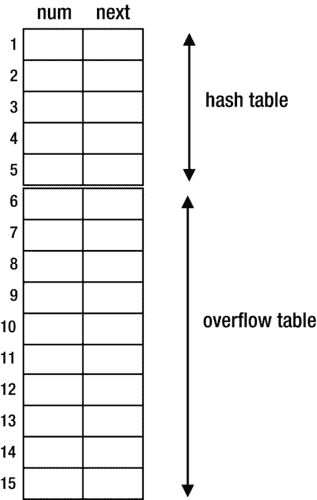
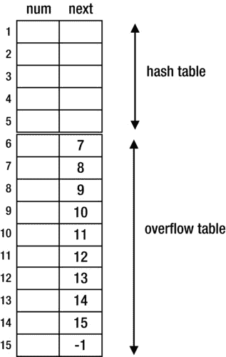
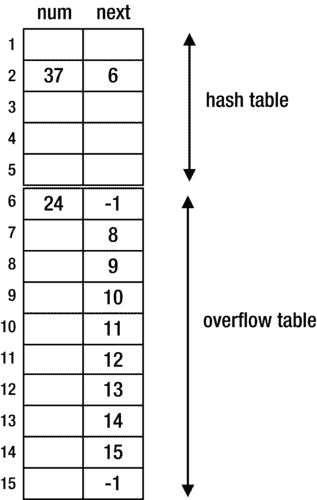
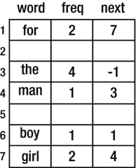

# 十、哈希

在本章中，我们将解释以下内容:

*   哈希所基于的基本思想
*   如何使用哈希解决搜索和插入问题
*   如何从哈希表中删除项目
*   如何使用线性探测解决冲突
*   如何使用二次探测解决冲突
*   如何使用链接解决冲突
*   如何使用双哈希线性探测解决冲突
*   如何使用数组按顺序链接项目

10.1 哈希基础知识

在(大)表中搜索一个项目是许多应用中的常见操作。在本章中，我们将讨论*哈希*，这是一种执行这种搜索的快速方法。哈希背后的主要思想是使用项目的密钥(例如，车辆记录的车辆注册号码)来确定项目存储在表中的(*哈希表* )的*。这个键首先被转换成一个数字(如果它还不是一个数字的话)，然后这个数字被映射(我们称之为*哈希*)到一个表位置。用于将键转换为表位置的方法称为*哈希函数* 。*

当然，两个或更多的键哈希到同一个位置是完全可能的。当这种情况发生时，我们说我们有一个*碰撞* ，我们必须找到一个解决碰撞的方法。哈希的效率(或其他方面)在很大程度上取决于用于解决冲突的方法。这一章的大部分时间都在讨论这些方法。

10.1.1 搜索和插入问题

搜索和插入问题的经典陈述如下:

给定一个项目列表(该列表最初可能为空)，在列表中搜索给定的项目。如果找不到该项目，请将其插入列表。

项目通常可以是数字(学生、帐户、员工、车辆等等)、名称、单词或字符串。例如，假设我们有一组整数，不一定是不同的，我们想知道有多少个不同的整数。

我们从一个空列表开始。对于每个整数，我们在列表中查找。如果没有找到，它将被添加到列表中并进行计数。如果被发现了，那也没办法。

在解决这个问题时，一个主要的设计决策是如何搜索列表，这反过来又取决于如何存储列表以及如何添加新的整数。以下是一些可能性:

1.  列表存储在一个数组中，一个新的整数放在数组中的下一个可用位置。这意味着必须使用顺序搜索来查找传入的整数。这种方法具有简单和易于添加的优点，但是随着列表中的数字越来越多，搜索时间会越来越长。
2.  列表存储在一个数组中，并以列表总是有序的方式添加一个新的整数。这可能需要移动已经存储的号码，以便新号码可以插入正确的位置。
3.  但是，由于列表是有序的，所以可以使用二分搜索法来搜索传入的整数。对于这种方法，搜索速度更快，但是插入速度比前一种方法慢。因为一般来说，搜索比插入更频繁，所以这种方法可能优于前一种方法。
4.  这里的另一个优点是，在最后，整数将按顺序排列，如果这很重要的话。如果使用方法 1，则必须对数字进行排序。
5.  该列表存储为未排序的链表，因此必须按顺序搜索。因为如果一个输入号码不存在，必须遍历整个列表，所以可以在开头或结尾添加新号码；两者同样容易。
6.  该列表存储为排序的链表。必须在“适当的位置”插入一个新号码，以保持顺序。一旦找到位置，插入就很容易了。如果来电号码不存在，则不必遍历整个列表，但是我们仍然受限于顺序搜索。
7.  该列表存储在二叉查找树中。如果树不变得太不平衡，搜索会相当快。添加号码很容易——只需设置几个链接。如果需要的话，对树的有序遍历将给出排序后的数字。

还有一种可能是称为*哈希*的方法。正如我们将看到的，这具有搜索速度极快和易于插入的优点。

10.2 通过哈希解决搜索和插入问题

我们将通过解决整数列表的“搜索和插入”问题来说明哈希是如何工作的。该列表将存储在数组`num[1]`到`num[n]`中。在我们的例子中，我们将假设`n`是`12`。


最初，列表中没有数字。假设第一个来电号码是`52`。哈希背后的想法是将`52`(通常称为*键*)转换成有效的表位置(比如说`k`)。这里，有效的工作台位置是`1`到`12`。

如果`num[k]`中没有数字，那么`52`被存储在那个位置。如果`num[k]`被另一个键占用，我们说发生了*碰撞* ，我们必须找到另一个位置来尝试放置`52`。这叫做*解决* *碰撞*。

用来将一个键转换成一个表位置的方法被称为*哈希函数*(比如说`H`)。可以使用任何产生有效表位置(数组下标)的计算，但是，正如我们将看到的，有些函数比其他函数给出更好的结果。

例如，我们可以使用`H1(key) = key % 10 + 1`。换句话说，我们在密钥的最后一位数字上加 1。因此，`52`将哈希到`3`。注意`H1`仅产生 1 到 10 之间的位置。比方说，如果这个表有 100 个位置，那么这个函数将是有效的，但是它可能不是一个好的函数。

还要注意，`H(key) = key % 10`在这里不是一个合适的哈希函数，因为，例如，`50`将哈希到`0`，并且没有表位置`0`。当然，如果位置从下标`0`开始，那么`key % 10`将是有效的，只要有至少十个位置。

另一个功能是`H2(key) = key % 12 + 1`。表达式`key % 12`产生一个介于`0`和`11`之间的值；添加`1`得到`1`和`12`之间的值。一般来说，`key % n + 1`产生的值在`1`和`n`之间，包括这两个值。我们将在我们的例子中使用这个函数。

`H2(52)` = `52 % 12 + 1` = `5`。我们说，“`52`哈希到位置`5`由于`num[5]`为空，我们将`52`放在`num[5]`中。

假设，后来，我们在搜索`52`。我们首先应用哈希函数，得到`5`。我们比较`num[5]`和`52`；它们匹配，所以我们只通过一次比较就找到了`52`。

现在假设以下键按给定的顺序出现:

```java
        52  33  84  43  16  59  31  23  61
```

*   `52`放在 num[5]中。
*   `33`哈希到`10`；`num[10]`是空的，所以`33`放在`num[10]`。
*   `84`哈希到`1`；`num[1]`是空的，所以`84`放在`num[1]`。
*   `43`哈希到`8`；`num[8]`是空的，所以`43`放在`num[8]`。

在这个阶段，`num`可以这样描绘:


*   `16`哈希到`5`；`num[5]`被占领，而不是被`16`占领——我们发生了碰撞。为了解决这个冲突，我们必须找到另一个放置`16`的位置。一个显而易见的选择是尝试下一个位置`6`；`num[6]`为空，所以`16`放在`num[6]`里。
*   `59`哈希到`12`；`num[12]`是空的，所以`59`放在`num[12]`。
*   `31`哈希到`8`；`num[8]`被占领，而不是被`31`占领——我们发生了碰撞。我们试试下一个地点，`9`；`num[9]`为空，所以`31`放在`num[9]`里。

在这个阶段，`num`看起来是这样的:


*   `23`哈希到`12`；`num[12]`被占领，而不是被`23`占领——我们发生了碰撞。我们必须尝试下一个位置，但是这里的下一个位置是什么？我们假设桌子是“圆形”的，因此位置`1`跟随位置`12`。然而，`num[1]`被占用而不是被`23`占用。所以，我们试试`num[2]`；`num[2]`为空，所以`23`放在`num[2]`中。
*   最后，`61`哈希到`2`；`num[2]`被占领，而不是被`61`占领——我们发生了碰撞。我们试试下一个地点，`3`；`num[3]`为空，所以`61`放在`num[3]`里。

下面显示了插入所有数字后的数组:


请注意，如果数组中已经有一个数字，该方法会找到它。例如，假设我们正在搜索 23。

*   `23`哈希到`12`。
*   `num[12]`被占用，未被`23`占用。
*   我们试试下一个位置，`1`；`num[1]`被`23`占领而不是被【】占领。
*   我们接下来试试`num[2]`；`num[2]`被`23`占领——我们找到了。

假设我们正在搜索`33`；`33`哈希到`10`,`num[10]`包含`33`——我们立即找到它。

作为练习，在使用哈希函数`H1(key) = key % 10 + 1`添加了之前的数字之后，确定`num`的状态。

我们可以用下面的算法来总结这个过程:

```java
        //find or insert 'key' in the hash table, num[1..n]
        loc = H(key)
        while (num[loc] is not empty && num[loc] != key) loc = loc % n + 1
        if (num[loc] is empty) { //key is not in the table
           num[loc] = key
           add 1 to the count of distinct numbers
        }
        else print key, " found in location ", loc
```

请注意表示转到下一个位置的表达式`loc % n + 1`。如果`loc`小于`n`，则`loc % n`简单来说就是`loc`，表达式与`loc + 1`相同。如果`loc` *为* `n`，`loc % n`为 0，表达式求值为`1`。无论哪种情况，`loc`都采用下一个位置的值。

机警的读者会意识到，当`num[loc]`为空或包含密钥时，我们退出`while`循环。如果这两种情况都没有发生，那么`while`循环*永远不会*退出，该怎么办？如果表完全满了(没有空的位置)并且不包含我们要搜索的键，就会出现这种情况。

然而，*在实践中*，我们从不允许哈希表变得完全满。我们总是确保有一些“额外的”位置没有被键填充，这样`while`语句*将在某个点*退出。一般来说，当表中有更多空闲位置时，哈希技术工作得更好。

算法如何判断一个位置何时是“空”的？我们需要用表示“空”的值来初始化数组。例如，如果键是正整数，我们可以使用`0`或`-1`作为空值。

让我们编写[程序 P10.1](#list1) ，它从文件中读取整数`numbers.in`，并使用哈希技术来确定文件中不同整数的数量。

***[程序 P10.1](#_list1)***

```java
        import java.util.*;
        import java.io.*;
        public class DistinctNumbers {
           final static int MaxDistinctNumbers = 20;
           final static int N = 23;
           final static int Empty = 0;

           public static void main(String[] args) throws IOException {
              Scanner in = new Scanner(new FileReader("numbers.in"));
              int[] num = new int[N + 1];
              for (int j = 1; j <= N; j++) num[j] = Empty;
              int distinct = 0;
              while (in.hasNextInt()) {
                 int key = in.nextInt();
                 int loc = key % N + 1;
                 while (num[loc] != Empty && num[loc] != key) loc = loc % N + 1;

                 if (num[loc] == Empty) { //key is not in the table
                    if (distinct == MaxDistinctNumbers) {
                       System.out.printf("\nTable full: %d not added\n", key);
                       System.exit(1);
                    }
                    num[loc] = key;
                    distinct++;
                 }
              } //end while
              System.out.printf("\nThere are %d distinct numbers\n", distinct);
              in.close();
           } //end main

   } //end class DistinctNumbers
```

假设`numbers.in`包含这些数字:

```java
    25 28 29 23 26 35 22 31 21 26 25 21 31 32 26 20 36 21 27 24 35 23 32 28 36
```

运行时，[程序 P10.1](#list1) 打印以下内容:

```java
        There are 14 distinct numbers
```

以下是关于[程序 P10.1](#list1) 的一些说明:

*   `MaxDistinctNumbers` ( `20`)是满足不同号码的最大数量。
*   `N` ( `23`)是哈希表的大小，比`MaxDistinctNumbers`稍大一点，因此表中至少有三个空闲位置。
*   哈希表占用`num[1]`到`num[N]`。如果你愿意，可以使用`num[0]`；在这种情况下，哈希函数可以简单地是`key % N`。
*   如果`key`不在表中(遇到空位置)，我们首先检查条目数是否达到了`MaxDistinctNumbers`。如果有，我们声明该表已满，并且不添加`key`。否则，我们把`key`放在表中计数。
*   如果找到了`key`，我们就继续读取下一个数字。

哈希函数

在上一节中，我们看到了如何将一个整数键“哈希”到一个表位置。事实证明，“余数”运算(%)对于这样的键通常会给出很好的结果。但是，如果键是非数字的，例如单词或名字，该怎么办呢？

第一项任务是将非数字键转换为数字，然后应用“余数”假设关键是一个词。也许最简单的方法就是把单词中每个字母的数值加起来。如果单词存储在字符串变量`word`中，我们可以这样做:

```java
        int wordNum = 0;
        for (int h = 0; h < word.length(); h++) wordNum += word.charAt(h);
        loc = wordNum % n + 1; //loc is assigned a value from 1 to n
```

这种方法是可行的，但是有一个问题是包含相同字母的单词会哈希到相同的位置。比如*队友*、*肉*、*队*都会哈希到同一个位置。在哈希过程中，我们必须尽量避免故意将键哈希到同一个位置。解决这个问题的一种方法是根据每个字母在单词中的位置给它分配一个权重。

我们可以任意分配权重——主要目标是避免将具有相同字母的键哈希到相同的位置。例如，我们可以将 3 分配给第一个位置，5 分配给第二个位置，7 分配给第三个位置，依此类推。下面显示了如何操作:

```java
        int wordNum = 0;
        int w = 3;
        for (int h = 0; h < word.length(); h++) {
           wordNum += word.charAt(h) * w;
           w = w + 2;
        }
        loc = wordNum % n + 1; //loc is assigned a value from 1 to n
```

如果一个键包含任意字符，同样的技术也适用。

在哈希中，我们希望键分散在整个表中。例如，如果键被哈希到表的一个区域，我们可能会以不必要的大量冲突而告终。为此，我们应该尽量使用*键的所有*。例如，如果键是字母键，那么将所有以相同字母开头的键映射到相同的位置是不明智的。换句话说，我们应该避免系统地击中同一个位置。

由于哈希意味着快速，哈希函数应该相对容易计算。如果我们花太多时间计算哈希位置，速度优势将会减弱。

10.2.2 从哈希表中删除项目

再次考虑插入所有样本号后的数组:


回想一下，`43`和`31`最初都被哈希到位置`8`。假设我们要删除`43`。第一个想法可能是将其位置设置为空。假设我们这样做了(将`num[8]`设置为空)，现在正在寻找`31`。这将哈希到`8`；但是由于`num[8]`为空，我们会错误地得出结论，认为`31`不在表中。因此，我们不能简单地通过将一个项目的位置设置为空来删除它，因为其他项目可能变得无法访问。

最简单的解决方案是将其位置设置为一个删除了*的*值——这个值不能与*空*或一个键混淆。在这个例子中，如果键是正整数，我们可以用`0`代表`Empty`，用`-1`代表`Deleted`。

现在，当搜索时，我们仍然检查关键字或空位置；删除的位置将被忽略。一个常见的错误是在删除的位置停止搜索；这样做会导致错误的结论。

如果我们的搜索发现一个传入的键不在表中，那么这个键可以被插入到一个空的位置或者一个被删除的位置，如果在这个过程中遇到一个这样的位置的话。例如，假设我们通过将`num[8]`设置为`-1`删除了`43`。如果我们现在搜索`55`，我们将检查位置`8`、`9`、`10`和`11`。由于`num[11]`是空的，我们推断`55`不在表中。

如果我们愿意，我们可以将`num[11]`设置为`55`。但是我们可以写我们的算法来记住在`8`被删除的位置。如果我们这样做了，那么我们可以在`num[8]`中插入`55`。这是更好的，因为我们会发现`55`比`num[11]`更快。我们还将通过减少删除位置的数量来更好地利用我们的可用位置。

如果沿途有几个被删除的位置呢？最好使用遇到的第一个，因为这将减少密钥的搜索时间。有了这些想法，我们可以如下重写我们的搜索/插入算法:

```java
        //find or insert 'key' in the hash table, num[1..n]
        loc = H(key)
        deletedLoc = 0
        while (num[loc] != Empty && num[loc] != key) {
           if (deletedLoc == 0 && num[loc] == Deleted) deletedLoc = loc
           loc = loc % n + 1
        }

        if (num[loc] == Empty) { //key not found
           if (deletedLoc != 0) loc = deletedLoc
           num[loc] = key
        }
        else print key, " found in location ", loc
```

请注意，我们仍然搜索，直到我们找到一个空的位置或关键。如果我们遇到一个被删除的位置并且`deletedLoc`是`0`，这意味着它是第一个。当然，如果我们*从来没有*遇到一个被删除的位置，并且这个键不在表中，它将被插入一个空的位置。

10.3 解决冲突

在[程序 P10.1](#list1) 中，我们通过查看表中的下一个位置来解决冲突。这也许是解决冲突最简单的方法。我们说我们使用*线性探测*来解决冲突，我们将在下一节更详细地讨论这个问题。在这之后，我们将看看解决冲突的更复杂的方法。其中有*二次探测*、*链接*和*双重哈希*。

10.3.1 线性探测

线性探测的特点是陈述 `loc = loc + 1`。再次考虑九个数字相加后`num`的状态:


如您所见，随着表的填满，将新键哈希到空位置的机会减少了。

假设一个键哈希到位置`12`。试完`12`、`1`、`2`、`3`后，放在`num[4]`。事实上，任何哈希为`12`、`1`、`2`、`3`或`4`的新键都将以`num[4]`结束。当这种情况发生时，我们将有一个从位置`12`到位置`6`的长的、不间断的密钥链。任何新的哈希到这个链的密钥都将在`num[7]`中结束，创建一个更长的链。

这种*群集* 的现象是线性探测的主要缺点之一。长链倾向于变得更长，因为哈希到长链的概率通常大于哈希到短链的概率。两条短链也很容易连接起来，形成一条更长的链，而这条链又会变得更长。例如，任何以`num[7]`结尾的键都会创建一个从位置`5`到`10`的长链。

我们定义了两种类型的聚类。

*   *当哈希到不同位置的关键字在寻找空位置时跟踪相同的序列时，发生初级聚类* 。线性探测展示了初级聚类，因为哈希到`5`的关键字将跟踪`5`、`6`、`7`、`8`、`9`等等，哈希到`6`的关键字将跟踪`6`、`7`、`8`、`9`等等。
*   *当哈希到*相同*位置的关键字在寻找空位置时跟踪相同序列时，发生二次聚类* 。线性探测展示了二次聚类，因为哈希到`5`的关键字将跟踪相同的序列`5`、`6`、`7`、`8`、`9`等等。

解决冲突的方法希望改进线性探测，目标是消除初级和/或次级聚类。

您可能想知道使用`loc = loc + k`，其中`k`是一个大于 1 的常数(例如，`3`)是否会给出比`loc = loc + 1`更好的结果。事实证明，这不会改变群集现象，因为仍然会形成`k`分开的键组。

此外，它甚至可能比当`k`为 1 时更糟，因为可能不会生成所有位置。

假设表的大小是`12`，`k`是`3`，一个键哈希到`5`。跟踪的位置顺序将是`5`、`8`、`11`、`2` ( `11 + 3 - 12`)、`5`，并且该顺序重复自身。换句话说，在寻找空位置时，只有相对较少的位置将被探测。相比之下，当`k`为`1`时，生成所有位置。

然而，这并不是一个真正的问题。如果表的大小是`m`并且`k`与`m`是“互质的”(它们唯一的公因数是 1)，那么所有的位置都被生成。如果两个数中一个是素数，另一个不是它的倍数，比如 5 和 12，那么这两个数就是相对素数。但是素数不是必要条件。数字 21 和 50(两者都不是质数)是相对质数，因为它们除了 1 之外没有公因数。

如果`k`是`5`，`m`是`12`，一个哈希到`5`的键会按照`5`，`10`，`3`，`8`，`1`，`6`，`11`，`4`，`9`，`2`，`7`，`12`的顺序追踪，所有的位置都会生成。哈希到任何其他位置的密钥也将生成所有位置。

在任何情况下，能够生成所有位置都是理论上的，因为如果我们不得不跟踪许多位置来找到一个空的位置，搜索将会太慢，并且我们可能需要使用另一种方法。

尽管我们刚刚说过，但结果是`loc = loc + k`，其中`k` *随密钥变化*，为我们提供了实现哈希的最佳方式之一。我们将在 10.3.4 节中看到如何实现。

那么，线性方法有多快呢？我们感兴趣的是平均*搜索长度*，也就是为了找到或插入一个给定的键而必须检查的位置的数量。在上例中，`33`的搜索长度为`1`,`61`的搜索长度为`2`,`23`的搜索长度为`3`。

搜索长度是表中*负载系数*、 *f* 的函数，其中


对于成功的搜索，平均比较次数为，对于不成功的搜索，平均比较次数为。注意，搜索长度只取决于填充的表格的分数，*不取决于表格的大小。*

[表 10-1](#Tab1) 显示了当表格填满时，搜索长度是如何增加的。

[表 10-1](#_Tab1) 。随着表格填满，搜索长度会增加

<colgroup><col width="15%"> <col width="25%"> <col width="55%"></colgroup> 
| 

f

 | 

成功的
搜索长度

 | 

不成功的
搜索长度

 |
| --- | --- | --- |
| Zero point two five | One point two | One point four |
| Zero point five | One point five | Two point five |
| Zero point seven five | Two point five | Eight point five |
| Zero point nine | Five point five | Fifty point five |

在 90%满的情况下，平均成功搜索长度是合理的 5.5。但是，确定一个新的键不在表中可能需要相当长的时间(50.5 次探测)。如果使用线性探头，明智的做法是确保表不会超过 75%。这样，我们可以用简单的算法保证良好的性能。

10.3.2 二次探测

在这个方法中，假设一个进来的键在位置`loc`与另一个发生冲突；我们前进 *ai* + *bi* <sup>2</sup> 其中 *a* ， *b* 是常数，并且 *i* 对于第一次碰撞取值 1，如果键再次碰撞取值 2，如果再次碰撞取值 3，等等。例如，如果我们让 *a* = 1， *b* =1，我们从位置`loc`向前*I*+*I*<sup>2</sup>。假设初始哈希位置是 7，并且存在冲突。

我们用 *i* = 1 计算*I*+*I*<sup>2</sup>；这样得到 2，所以我们向前移动 2，检查位置 7 + 2 = 9。

如果还是有碰撞，我们用 *i* = 2 计算*I*+*I*<sup>2</sup>；这给出了 6，因此我们向前移动 6 并检查位置 9 + 6 = 15。

如果还有碰撞，我们用 *i* = 3 计算*I*+*I*<sup>2</sup>；这样得到 12，所以我们向前移动 12，检查位置 15 + 12 = 27。

等等。每次发生碰撞，我们都将 *i* 加 1，并重新计算这次我们必须前进多少。我们继续这样，直到我们找到钥匙或一个空的位置。

如果，在任何时候，前进使我们超越了桌子的末端，我们回到开始。例如，如果表的大小是 25，我们前进到位置 27，我们绕到位置 27–25，即位置 2。

对于下一个传入的键，如果在初始哈希位置有冲突，我们将 *i* 设置为 1，并按照前面的解释继续。值得注意的是，对于每个键，“增量”的顺序将是 2、6、12、20、30....当然，我们可以通过为 *a* 和 *b* 选择不同的值来得到不同的序列。

我们可以用下面的算法总结刚才描述的过程:

```java
        //find or insert 'key' in the hash table, num[1..n]
        loc = H(key)
        i = 0
        while (num[loc] != Empty && num[loc] != key) {
           i = i + 1
           loc = loc + a * i + b * i * i
           while (loc > n) loc = loc – n    //while instead of if; see note below
        }
        if (num[loc] == Empty) num[loc] = key
        else print key, " found in location ", loc
```

 **注意**我们使用`while`而不是`if`来执行“回绕”,以防新位置超过表大小的两倍。例如，假设 *n* 是 25，增量是 42，我们从位置 20 前进。这会把我们带到 62 号地点。如果我们使用了`if`,“回绕”位置将是 62–25 = 37，这仍然在表的范围之外。使用`while`，我们将得到有效位置 37–25 = 12。

我们可以使用`loc % n`而不是`while`循环吗？在这个例子中，我们将得到正确的位置，但是如果新位置是`n`的倍数，`loc % n`将给出`0`。如果工作台从`1`开始，这将是一个无效位置。

对于二次探测，哈希到不同位置的键跟踪不同的序列；因此，初级聚类被消除。但是，哈希到相同位置的键将跟踪相同的序列，因此保留了二级聚类。

以下是需要注意的其他几点:

*   如果 *n* 是 2 的幂，即对于某些 *m* 来说，*n*= 2<sup>T5】m</sup>，这种方法只探索了表中的一小部分位置，因此不是很有效。
*   如果 *n* 是质数，该方法可以到达表中一半的位置；对于大多数实际目的来说，这通常是足够的。

10.3.3 链接

在这个方法中，所有哈希到相同位置的项都保存在一个链表中。这样做的一个直接好处是，彼此哈希“接近”的项目不会相互干扰，因为它们不会像线性探测那样争用表中的相同空闲空间。实现链接的一种方法是让哈希表包含“列表顶部”指针。例如，如果`hash[1..n]`是哈希表，那么`hash[k]`将指向所有哈希到位置`k`的项目的链表。一个项目可以被添加到链表的头部、尾部或列表有序的位置。

为了说明该方法，假设这些项是整数。每个链表项将由一个整数值和一个指向下一项的指针组成。我们使用下面的类来创建链表中的节点:

```java
        class Node {
           int num;
           Node next;

           public Node(int n) {
              num = n;
              next = null;
           }
        } //end class Node
```

我们现在可以将数组`hash`定义如下:

```java
        Node[] hash = new Node[n+1]; //assume n has a value
```

我们用这个初始化它:

```java
        for (int h = 1; h <= n; h++) hash[h] = null;
```

假设一个传入的关键字`inKey`哈希到位置`k`。我们必须在`hash[k]`指向的链表中搜索`inKey`。如果没有找到，我们必须将它添加到列表中。在我们的程序中，我们将添加它，使列表按升序排列。

我们编写[程序 P10.2](#list2) 来计算输入文件`numbers.in`中不同整数的数量。该程序使用*哈希和链接*。最后，我们打印哈希到每个位置的数字列表。

***[程序 P10.2](#_list2)***

```java
        import java.util.*;
        import java.io.*;
        public class HashChain {
           final static int N = 13;
           public static void main(String[] args) throws IOException {
              Scanner in = new Scanner(new FileReader("numbers.in"));

              Node[] hash = new Node[N+1];
              for (int h = 1; h <= N; h++) hash[h] = null;
              int distinct = 0;
              while (in.hasNextInt()) {
                 int key = in.nextInt();
                 if (!search(key, hash, N)) distinct++;
              }
              System.out.printf("\nThere are %d distinct numbers\n\n", distinct);
              for (int h = 1; h <= N; h++)
                 if (hash[h] != null) {
                    System.out.printf("hash[%d]:  ", h);
                    printList(hash[h]);
                 }
              in.close();
           } //end main

           public static boolean search(int inKey, Node[] hash, int n) {
           //return true if inKey is found; false, otherwise
           //insert a new key in its appropriate list so list is in order
              int k = inKey % n + 1;
              Node curr = hash[k];
              Node prev = null;

              while (curr != null && inKey > curr.num) {
                 prev = curr;
                 curr = curr.next;
              }
              if (curr != null && inKey == curr.num) return true; //found
              //not found; inKey is a new key; add it so list is in order
              Node np = new Node(inKey);
              np.next = curr;
              if (prev == null) hash[k] = np;
              else prev.next = np;
              return false;
           } //end search

           public static void printList(Node top) {
              while (top != null) {
                 System.out.printf("%2d ", top.num);
                 top = top.next;
              }
              System.out.printf("\n");
           } //end printList

        } //end class HashChain

        class Node {
           int num;
           Node next;

           public Node(int n) {
              num = n;
              next = null;
           }
        } //end class Node
```

假设`numbers.in`包含以下数字:

```java
    24 57 35 37 31 98 85 47 60 32 48 82 16 96 87 46 53 92 71 56
    73 85 47 46 22 40 95 32 54 67 31 44 74 40 58 42 88 29 78 87
    45 13 73 29 84 48 85 29 66 73 87 17 10 83 95 25 44 93 32 39
```

运行时，[程序 P10.2](#list2) 产生以下输出:

```java
    There are 43 distinct numbers

    hash[1]: 13 39 78
    hash[2]: 40 53 66 92
    hash[3]: 54 67 93
    hash[4]: 16 29 42
    hash[5]: 17 56 82 95
    hash[6]: 31 44 57 83 96
    hash[7]: 32 45 58 71 84
    hash[8]: 46 85 98
    hash[9]: 47 60 73
    hash[10]: 22 35 48 74 87
    hash[11]: 10 88
    hash[12]: 24 37
    hash[13]: 25
```

如果`m`个键已经存储在链表中，并且有`n`个哈希位置，那么一个链表的平均长度是，由于我们必须顺序搜索链表，所以平均成功搜索长度是。可以通过增加哈希位置的数量来缩短搜索长度。

用链接实现哈希的另一种方式是使用单个数组并使用数组下标作为链接。我们可以使用以下声明:

```java
        class Node {
           int num;    //key
           int next;   //array subscript of the next item in the list
        }

        Node[] hash = new Node[MaxItems+1];
```

比方说，表的第一部分`hash[1..n]`被指定为哈希表，其余位置被用作*溢出*表，如图[图 10-1](#Fig1) 所示。



[图 10-1](#_Fig1) 。链接的数组实现

这里，`hash[1..5]`是哈希表，`hash[6..15]`是溢出表。

假设`key`哈希到哈希表中的位置`k`:

*   如果`hash[k].num`为空(比如说`0`，我们将其设置为`key`，并将`hash[k].next`设置为`−1`，比如说，以指示一个空指针。
*   如果`hash[k].num`不是`0`，我们必须在从`k`开始的列表中搜索`key`。如果没有找到，我们把它放在溢出表中的下一个空闲位置(`f`)，并从`hash[k]`开始把它链接到列表。一种链接方式如下:

```java
             hash[f].next = hash[k].next;
             hash[k].next = f;
```

*   链接新键的另一种方法是将其添加到列表的末尾。如果`L`是列表中最后一个节点的位置，这可以通过以下方式完成:

```java
             hash[L].next = f;
             hash[f].next = -1;   //this is now the last node
```

如果我们不得不考虑删除，我们将不得不决定如何处理被删除的位置。一种可能性是在溢出表中保存所有可用位置的列表。当需要存储一个键时，就从列表中检索它。当一个项目被删除时，它的位置被返回到列表中。

最初，我们可以将溢出表中的所有项链接起来，如图[图 10-2](#Fig2) 所示，让变量`free`指向列表中的第一项；这里，`free` = 6。第 6 项指向第 7 项，第 7 项指向第 8 项，依此类推，第 15 项位于列表的末尾。



[图 10-2](#_Fig2) 。链接溢出表中的项目以形成“自由列表”

假设`37`哈希到位置`2`。这是空的，所以`37`存储在`hash[2].num`中。如果另一个数(`24`，比方说)哈希到`2`，它必须存储在溢出表中。首先，我们必须从“空闲列表”中获得一个位置这可以通过以下方式实现:

```java
        f = free;
        free = hash[free].next;
        return f;
```

这里，`6`被返回，`free`被设置为`7`。数字`24`存储在位置`6`中，并且`hash[2].next`被设置为`6`。在这个阶段，我们有`free` = `7`，表中的值如图 10-3 中的[所示。](#Fig3)



[图 10-3](#_Fig3) 。在将 24 加到溢出表之后

现在，考虑如何删除一个项目。有两种情况需要考虑:

*   如果要删除的条目在哈希表中(比如说在`k`，我们可以用这个来删除它:

    ```java
    if (hash[k].next == -1) set hash[k].num to Empty  //only item in the list
    else { //copy an item from the overflow table to the hash table
       h = hash[k].next;
     hash[k] = hash[h];   //copy information at location h to location k
       return h to the free list   //see next
    }
    ```

*   我们可以用这个:

    ```java
    hash[h].next = free;
    free = h;
    ```

    将一个位置(`h`)返回到空闲列表
*   如果要删除的项目在溢出表中(比如说在`curr`)，并且`prev`是指向要删除的项目的位置，我们可以用下面的代码删除它:

    ```java
    hash[prev].next = hash[curr].next;
    return curr to the free list
    ```

现在考虑如何处理传入的键。假设`free`是`9`并且数字`52`哈希到位置`2`。我们从`2`开始搜索`52`的列表。没有找到，所以`52`被存储在下一个空闲位置`9`。位置`6`包含列表中的最后一项，因此`hash[6].next`被设置为`9`，而`hash[9].next`被设置为`-1`。

一般来说，我们可以对`key`进行搜索，如果没有找到，用下面的伪代码将其插入列表的末尾:

```java
        k = H(key)   //H is the hash function
        if (hash[k].num == Empty) {
           hash[k].num = key
           hash[k].next = -1
        }
        else {
           curr = k
           prev = -1
           while (curr != -1 && hash[curr].num != key) {
              prev = curr
              curr = hash[curr].next
           }
           if (curr != -1) key is in the list at location curr
           else {  //key is not present
              hash[free].num = key   //assume free list is not empty
              hash[free].next = -1
              hash[prev].next = free
              free = hash[free].next
           } //end else
        } //end else
```

10.3.4 线性探测用双哈希 [<sup>1</sup>](#Fn1)

在第 10.3.1 节中，我们看到使用`loc = loc + k`，其中`k`是一个大于 1 的常数，并不会比`k`为 1 时给我们带来更好的性能。然而，通过让`k`随键而变，我们可以得到极好的结果，因为与线性和二次探测不同，哈希到相同位置的键将在搜索空的位置时探测不同的位置序列。

让`k`随密钥变化的最自然的方法是使用第二个哈希函数。第一个哈希函数将生成初始表位置。如果有冲突，第二个哈希函数将生成增量`k`。如果桌子位置从`1`到`n`，我们可以使用如下:

```java
        convert key to a numeric value, num (if it is not already numeric)
        loc = num % n + 1        //this gives the initial hash location
        k = num % (n – 2) + 1    //this gives the increment for this key
```

我们之前提到过，选择`n`(表格大小)作为质数是明智的。在这种方法中，如果`n-2`也是素数，我们会得到更好的结果(在这种情况下，`n`和`n-2`被称为*孪生素数* ，例如 103/101，1021/1019)。

除了`k`不固定之外，方法与*线性探测*相同。我们用两个哈希函数来描述它，`H1`和`H2\. H1`产生初始哈希位置，一个在`1`和`n`之间的值，包括这两个值。`H2`产生增量，一个在`1`和`n - 1`之间的值，与`n`互质；这是所希望的，这样，如果需要，许多位置将被探测。如前所述，如果`n`是质数，那么`1`和`n - 1`之间的任何值对它来说都是相对质数。在前面的例子中，第二个哈希函数产生一个在`1`和`n-2`之间的值。下面是算法:

```java
        //find or insert 'key' using "linear probing with double hashing"
        loc = H1(key)
        k = H2(key)
        while (hash[loc] != Empty && hash[loc] != key) {
           loc = loc + k
           if (loc > n) loc = loc – n
        }
        if (hash[loc] == Empty) hash[loc] = key
        else print key, " found in location ", loc
```

和以前一样，为了确保`while`循环在某个点退出，我们不允许表完全变满。如果我们想要迎合`MaxItems`，比方说，我们声明表的大小大于`MaxItems`。一般来说，表中的空闲位置越多，哈希技术的效果就越好。

然而，使用双重哈希，我们不需要像普通线性探针那样多的空闲位置来保证良好的性能。这是因为双重哈希消除了主要和次要聚类。

因为哈希到不同位置的关键字将生成不同的位置序列，所以消除了主聚类。消除了二次聚类，因为哈希到相同位置的不同关键字将生成不同的序列。这是因为，一般来说，不同的键会产生不同的增量(算法中的`k`)。两个键同时被`H1`和`H2`哈希为相同的值，这确实是一种罕见的巧合。

在实践中，任何哈希应用的性能都可以通过保存每个密钥的访问频率信息来提高。如果我们事先有了这些信息，我们可以简单地将最流行的条目放在最前面，最不流行的条目放在最后。这将降低所有键的平均访问时间。

如果我们事先没有这些信息，我们可以为每个键保留一个计数器，并在每次访问该键时递增。经过一段预定的时间后(比如一个月)，我们首先重新载入最受欢迎的条目，最后载入最不受欢迎的条目。然后，我们重置计数器并收集下个月的统计数据。这样，我们可以确保应用保持微调，因为不同的项目可能会在下个月变得流行。

10.4 示例:词频统计

再一次考虑写一个程序来计算一篇文章中单词的频率的问题。输出由单词及其频率的字母列表组成。现在，我们将使用带有双重哈希的线性探测将单词存储在哈希表中。

表格中的每个元素由三个字段组成— `word`、`freq`和`next`。我们将使用下面的类来创建要存储在表中的对象:

```java
        class WordInfo {
           String word = "";
           int freq = 0;
           int next = -1;
        } //end class WordInfo
```

我们用以下语句声明并初始化该表:

```java
        WordInfo[] wordTable = new WordInfo[N+1]; //N – table size
        for (int h = 1; h <= N; h++) wordTable[h] = new WordInfo();
```

在表中搜索每个输入的单词。如果没有找到这个词，它将被添加到表中，并且它的频率计数被设置为`1`。如果找到了这个词，那么它的频率计数就会增加`1`。

此外，当一个单词被添加到表中时，我们设置链接，以便按照字母顺序维护单词的链表。变量`first`按顺序指向第一个单词。例如，假设哈希表中存储了五个单词。我们通过`next`将它们联系起来，如图[图 10-4](#Fig4) 所示，`first` = `6`。



[图 10-4](#_Fig4) 。按字母顺序链接的单词(第一个= 6)

于是，第一个字是`boy`，指向`for` ( `1`，指向`girl` ( `7`，指向`man` ( `4`)，指向`the` ( `3`，不指向任何东西(`-1`)。单词按字母顺序链接:`boy for girl man the`。请注意，无论哈希算法将一个单词放在哪里，链接都会起作用。

哈希算法首先放置单词。然后，不管它被放置在哪里，该位置被链接以保持单词的顺序。例如，假设新单词`kid`哈希到位置`2`。然后`kid`的链接会被设置为`4`(指向`man`)，而`girl`的链接会被设置为`2`(指向`kid`)。

我们通过遍历链表来打印按字母顺序排列的列表。[程序 P10.3](#list3) 显示所有细节。

***[程序 P10.3](#_list3)***

```java
        import java.io.*;
        import java.util.*;
        public class WordFrequencyHash {
           static   Scanner in;
           static   PrintWriter out;
           final static int N = 13; //table size
           final static int MaxWords = 10;
           final static String Empty = "";

           public static void main(String[] args) throws IOException {
              in = new Scanner(new FileReader("wordFreq.in"));
              out = new PrintWriter(new FileWriter("wordFreq.out"));

              WordInfo[] wordTable = new WordInfo[N+1];
              for (int h = 1; h <= N; h++) wordTable[h] = new WordInfo();

              int first = -1; //points to first word in alphabetical order
              int numWords = 0;

              in.useDelimiter("[^a-zA-Z]+");
              while (in.hasNext()) {
                 String word = in.next().toLowerCase();
                 int loc = search(wordTable, word);
                 if (loc > 0) wordTable[loc].freq++;
                 else //this is a new word
                    if (numWords < MaxWords) { //if table is not full
                       first = addToTable(wordTable, word, -loc, first);
                       ++numWords;
                    }
                    else out.printf("'%s' not added to table\n", word);
              }
              printResults(wordTable, first);
              in.close();
              out.close();
           } // end main

           public static int search(WordInfo[] table, String key) {
           //search for key in table; if found, return its location; if not,
           //return -loc if it must be inserted in location loc
              int wordNum = convertToNumber(key);
              int loc = wordNum % N + 1;
              int k = wordNum % (N - 2) + 1;

              while (!table[loc].word.equals(Empty) && !table[loc].word.equals(key)) {
                 loc = loc + k;
                 if (loc > N) loc = loc - N;
              }
              if (table[loc].word.equals(Empty)) return -loc;
              return loc;
           } // end search

           public static int convertToNumber(String key) {
              int wordNum = 0;
              int w = 3;
              for (int h = 0; h < key.length(); h++) {
                 wordNum += key.charAt(h) * w;
                 w = w + 2;
              }
              return wordNum;
           } //end convertToNumber

           public static int addToTable(WordInfo[] table, String key, int loc, int head) {
           //stores key in table[loc] and links it in alphabetical order
              table[loc].word = key;
              table[loc].freq = 1;
              int curr = head;
              int prev = -1;
              while (curr != -1 && key.compareTo(table[curr].word) > 0) {
                 prev = curr;
                 curr = table[curr].next;
              }
              table[loc].next = curr;
              if (prev == -1) return loc; //new first item
              table[prev].next = loc;
              return head; //first item did not change
           } //end addToTable

           public static void printResults(WordInfo[] table, int head) {
              out.printf("\nWords        Frequency\n\n");
              while (head != -1) {
                 out.printf("%-15s %2d\n", table[head].word, table[head].freq);
                 head = table[head].next;
              }
           } //end printResults

        } //end class WordFrequencyHash

        class WordInfo {
           String word = "";
           int freq = 0;
           int next = -1;
        } //end class WordInfo
```

假设`wordFreq.in`包含以下内容:

```java
        If you can trust yourself when all men doubt you;
        If you can dream - and not make dreams your master;
```

使用 13 的表大小和设置为 10 的`MaxWords`，当运行[程序 P10.3](#list3) 时，它在文件`wordFreq.out`中产生如下输出:

```java
'and' not added to table
'not' not added to table
'make' not added to table
'dreams' not added to table
'your' not added to table
'master' not added to table

Words        Frequency

all              1
can              2
doubt            1
dream            1
if               2
men              1
trust            1
when             1
you              3
yourself         1
```

**练习 10**

1.  使用主哈希函数`h1(k) = 1 + k mod 11`将整数插入哈希表`H[1..11]`。使用(a)线性探测，(b)使用探测函数`i + i2`的二次探测，以及(c)使用`h2(k) = 1 + k mod 9`的双重哈希，显示插入关键字`10`、`22`、`31`、`4`、`15`、`28`、`17`、`88`和`58`后数组的状态。
2.  Integers are inserted in an integer hash table `list[1]` to `list[n]` using linear probe with double hashing. Assume that the function `h1` produces the initial hash location and the function `h2` produces the increment. An available location has the value `Empty`, and a deleted location has the value `Deleted`.

    编写一个函数来搜索给定值`key`。如果找到，该函数返回包含`key`的位置。如果没有找到，该函数将`key`插入到搜索`key`时遇到的*第一个*删除位置(如果有)或`Empty`位置，并返回`key`插入的位置。你可以假设`list`包含了一个新整数的空间。

3.  在哈希应用中，密钥由一串字母组成。编写一个哈希函数，给定一个键和一个整数`max`，返回 1 和`max`之间的哈希位置，包括 1 和 T1。您的函数必须使用键的所有*，并且不应该故意为由相同字母组成的键返回相同的值。*
4.  一个大小为`n`的哈希表包含两个字段——一个整数数据字段和一个整数链接字段——称为*数据*和下一个的*。*下一个*字段用于以升序链接哈希表中的数据项。值-1 表示列表结束。变量`top`(初始设置为-1)表示最小数据项的位置。使用哈希函数`h1`和线性探测将整数插入哈希表。可用位置的`data`字段具有值`Empty`，并且不会从表中删除任何项目。编写程序代码以搜索给定值`key`。如果发现，什么也不做。如果找不到，将`key`插入表格中，并将*链接到其指定位置*。您可能会认为该表中有容纳新整数的空间。*
5.  In a certain application, keys that hash to the same location are held on a linked list. The hash table location contains a pointer to the first item on the list, and a new key is placed at the end of the list. Each item in the linked list consists of an integer `key`, an integer `count`, and a pointer to the next element in the list. Storage for a linked list item is allocated as needed. Assume that the hash table is of size *n* and the call `H(key)` returns a location from `1` to *n*, inclusive.

    编写编程代码来初始化哈希表。

    编写一个函数，给定键`nkey`，如果找不到就搜索它，在适当的位置添加`nkey`，并将`count`设置为`0`。如果找到，将`1`加到`count`；如果计数达到`10`，则从当前位置删除该节点，将其放在列表的开头，并将`count`设置为`0`。

6.  Write a program to read and store a thesaurus as follows:

    程序的数据由输入行组成。每行包含(可变)数量的不同单词，所有这些单词都是同义词。你可以假设单词只由字母组成，并由一个或多个空格分隔。可以使用大小写字母的任意组合来拼写单词。所有的字都将存储在一个哈希表中，使用开放寻址和双重哈希。一个单词可以出现在多行上，但是每个单词在表格中只能插入一次。如果一个单词出现在多行上，那么这些行上的所有单词都是同义词。这部分数据由包含单词`EndOfSynonyms`的行终止。

    必须组织数据结构，以便给定任何单词，都可以快速找到该单词的所有同义词。

    数据的下一部分由几个命令组成，每行一个。有效命令由`P`、`A`、`D`或`E`指定。

    **P** *单词*按字母顺序打印*单词*的所有同义词。

    **A** *word1 word2* 将 *word1* 添加到 *word2* 的同义词列表中。

    **D** *单词*从同义词库中删除*单词*。

    **E** ，单独一行，表示数据结束。

7.  Write a program to compare quadratic probing, linear probing with double hashing, and chaining. Data consists of an English passage, and you are required to store all the distinct words in the hash tables. For each word and each method, record the number of probes required to insert the word in the hash table.

    迎合 100 字。对于二次探测和双重哈希，使用大小为 103 的表。对于链接，使用两种表格大小—23 和 53。对于这四种方法中的每一种，使用相同的基本哈希函数。

    打印四种方法中每种方法的单词和探针数量的字母列表。组织您的输出，以便可以很容易地比较这些方法的性能。

[<sup>1</sup>](#_Fn1) 该技术有时被称为*双哈希开放式寻址*。