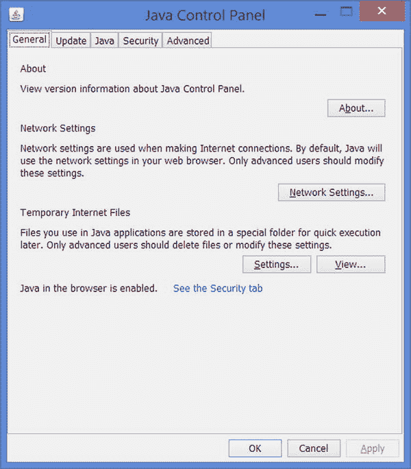
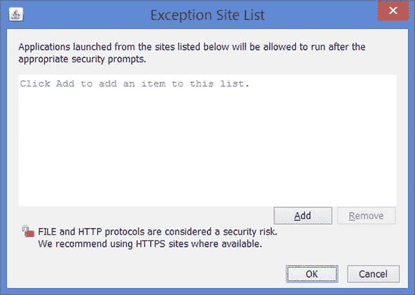
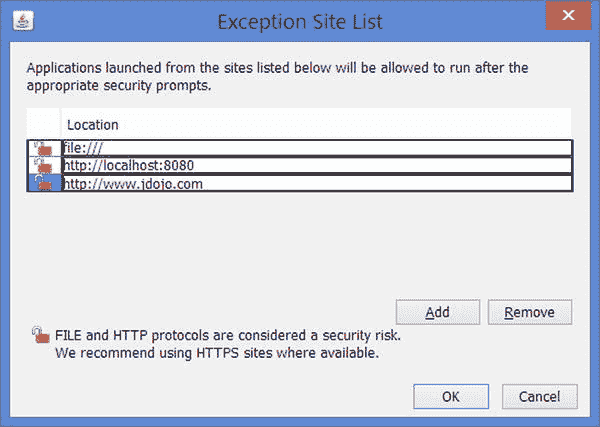
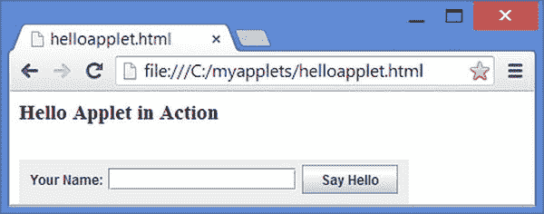
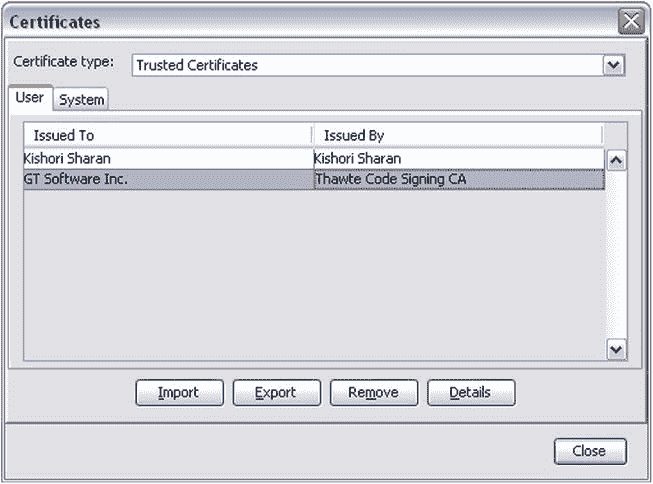

# 四、Applet

在本章中，您将学习

*   什么是 applet
*   如何开发、部署和运行Applet
*   如何使用`<applet>`标签在 HTML 文档中嵌入 applet
*   如何安装和配置运行Applet的 Java 插件
*   如何使用`appletviewer`程序运行Applet
*   Applet的生命周期
*   如何将参数传递给Applet
*   如何发布Applet的参数和描述
*   如何在Applet中使用图像和音频剪辑
*   如何定制 Java 策略文件以授予Applet权限
*   如何签署Applet

## 什么是Applet？

是一种嵌入在 HTML 文档中并在 web 浏览器中运行的 Java 程序。组成 applet 的编译后的 Java 代码存储在 web 服务器上。web 浏览器通过互联网从 web 服务器下载 applet 代码，并在浏览器的上下文中本地运行该代码。通常，applet 有一个图形用户界面(GUI)。一个 applet 有许多安全限制，包括它在客户端计算机上能访问什么和不能访问什么。对Applet的限制是必要的，因为Applet可能不是由同一个人开发和使用的。如果允许恶意编写的小应用完全访问客户端机器，它可能会对客户端机器造成有害影响。例如，安全限制不允许 applet 访问文件系统或在客户机上启动程序。假设你打开一个网页，里面有一个 applet 可以读取你机器上的文件。在你不知情的情况下，一个恶意的Applet会把你的私人信息发送到它的服务器上。为了保护 applet 用户免受这种伤害，有必要在运行 applet 时设置安全限制。使用策略文件可以配置许多安全限制。我将在本章后面讨论如何配置Applet安全策略。

虽然 a 和Applet没有关系，但是我还是来解释一下两者的区别。像 applet 一样，servlet 也是部署在 web 服务器上的 Java 程序。与 applet 不同，servlet 运行在 web 服务器本身上，它不包括 GUI。

## 开发小应用

开发 applet 有四个步骤:

*   为 applet 编写 Java 代码
*   打包和部署 applet 文件
*   安装和配置 Java 插件
*   查看子视图

为 applet 编写 Java 代码与为 Swing 应用编写代码没有太大区别。您只需要学习一些将在代码中使用的Applet的标准类和方法。

小应用部署在网络服务器上，并通过互联网/内联网使用网络浏览器在网页中查看。您还可以在开发和测试期间使用 applet 查看器查看 applet。JDK 发布了一个 appletviewer 程序。安装 JDK 时，appletviewer 程序会安装在您机器上的`JAVA_HOME\bin`目录中。我将在本章后面详细讨论如何使用 appletviewer。

要在网页中查看 applet，您需要在 HTML 文档中嵌入对 applet 的引用。您可以使用三种 HTML 标签中的任何一种，即`<applet>`、`<object>`或`<embed>`来将 applet 嵌入到 HTML 文档中。我将很快详细讨论这些标签的使用。

接下来的两节讨论如何为 applet 编写 Java 代码，以及如何查看 applet。

## 编写Applet

您的 applet 类必须是 Java 提供的标准 applet 类的子类。有两个标准的 applet 类:

*   `java.applet.Applet`
*   `javax.swing.JApplet`

`Applet`类支持 AWT GUI 组件，而`JApplet`类支持 Swing GUI 组件。`JApplet`类继承自`Applet`类。在这一章中我将只讨论`JApplet`。清单 4-1 显示了你能拥有的最简单的 applet 的代码。

清单 4-1。最简单的Applet

`// SimplestApplet.java`

`package com.jdojo.applet;`

`import javax.swing.JApplet;`

`public class SimplestApplet extends JApplet {`

`// No extra code is needed for your simplest applet`

`}`

`SimplestApplet`没有任何 GUI 部件或逻辑。从技术上来说，它是一个完整的Applet。如果您在浏览器中测试这个 applet，您所看到的只是网页中的一个空白区域。

让我们创建另一个带有 GUI 的 applet，这样您可以在浏览器中看到一些东西。新的 applet 叫做`HelloApplet`，如清单 4-2 所示。

清单 4-2。使用 JLabel 显示消息的 HelloApplet Applet

`// HelloApplet.java`

`package com.jdojo.applet;`

`import java.awt.Container;`

`import java.awt.FlowLayout;`

`import javax.swing.JApplet;`

`import javax.swing.JButton;`

`import javax.swing.JLabel;`

`import javax.swing.JOptionPane;`

`import javax.swing.JTextField;`

`import static javax.swing.JOptionPane.INFORMATION_MESSAGE;`

`public class HelloApplet extends JApplet {`

`@Override`

`public void init() {`

`// Create Swing components`

`JLabel nameLabel = new JLabel("Your Name:");`

`JTextField nameFld = new JTextField(15);`

`JButton sayHelloBtn = new JButton("Say Hello");`

`// Add an action litener to the button to display the message`

`sayHelloBtn.addActionListener(e -> sayHello(nameFld.getText()));`

`// Add Swing components to the content pane of the applet`

`Container contentPane = this.getContentPane();`

`contentPane.setLayout(new FlowLayout());`

`contentPane.add(nameLabel);`

`contentPane.add(nameFld);`

`contentPane.add(sayHelloBtn);`

`}`

`private void sayHello(String name) {`

`String msg = "Hello there";`

`if (name.length() > 0) {`

`msg = "Hello " + name;`

`}`

`// Display the hello message`

`JOptionPane.showMessageDialog(null,`

`msg, "Hello", INFORMATION_MESSAGE);`

`}`

`}`

这个类的代码看起来熟悉吗？这类似于使用自定义的`JFrame`。`JApplet`类包含一个`init()`方法。您需要重写该方法，并向 applet 添加 GUI 部件。我将很快详细讨论用 applet 的方法编写代码。像一个`JFrame`，`JApplet`有一个内容窗格，包含 applet 的组件。您在`JApplet`的内容窗格中添加了一个`JLabel`、一个`JTextField`和一个`JButton`。程序逻辑很简单。用户可以输入姓名并点击显示消息的`Say Hello`按钮。

与 Swing 应用不同，您不应该在 applet 的构造函数中添加任何 GUI，即使它在大多数情况下都可以工作。调用 applet 的构造函数来创建 applet 类的对象。applet 对象在创建时不会获得其“applet”状态。它还是一个普通的 Java 对象。如果在构造函数中使用 applet 的任何特性，这些特性将无法正常工作，因为 applet 对象只是一个简单的 Java 对象，而不是真正意义上的“applet”。在创建之后，它获得 applet 的状态，并且它的`init()`方法被显示它的环境(通常是浏览器)调用。这就是为什么您需要将所有 GUI 代码(或任何初始化代码)放在它的`init()`方法中的原因。`Applet`类提供了一些其他的标准方法，您可以覆盖这些方法并编写您的逻辑来在 applet 中执行不同种类的工作。

运行 applet 的方式与运行 Swing 应用的方式不同。注意，applet 类没有`main()`方法。然而，从技术上来说，可以在 applet 中添加一个方法，但这对运行 applet 没有任何帮助。要查看 applet 的运行情况，您需要一个 HTML 文件。你应该有 HTML 的基本知识来使用 applet，但是你不需要成为 HTML 的专家。我将在下一节讨论如何查看 applet。这时候你就要编译`HelloApplet`类了。您将拥有一个名为`HelloApplet.class`的类文件。

## 部署Applet

Applet是 Java 程序。但是，它们不能像其他 Java 程序一样直接运行。在运行 applet 之前，您需要做一些准备工作。Applet需要部署后才能使用。applet 部署分为两个部分:

*   定义 applet GUI 和逻辑的 Java 代码
*   一个 HTML 文档，包含 applet 的详细信息，如类名、包含类文件的存档文件名、宽度、高度等。

在上一节中，您已经看到了如何为 applet 编写 Java 代码。

使用`<applet>`标签将 applet 细节嵌入到 HTML 文档中。applet 代码和 HTML 文档都被部署到 web 服务器上。客户机上的浏览器向 web 服务器请求 HTML 文档。当浏览器在 HTML 文档中找到`<applet>`标记时，它会读取 applet 的详细信息，从 web 服务器下载 applet 代码，并在浏览器中将代码作为 applet 运行。这是否意味着您需要一个 web 服务器来查看您的Applet的运行情况？答案是否定的。你可以不用网络服务器来测试你的Applet。如果您想让用户可以使用您的Applet，您需要一个 web 服务器来部署您的Applet。以下部分描述了如何为 applet 创建 HTML 文档，以及如何将 applet 部署到不同的环境中。

### 创建 HTML 文档

一个`<applet>`标签被用来在一个 HTML 文档中嵌入一个 applet。下面是一个`<applet>`标签的例子:

`<applet code="com.jdojo.applet.HelloApplet" width="300" height="100" archive="myapplets.jar">`

`This browser does not support Applets.`

`</applet>`

您需要指定标签的以下强制属性:

*   `code`
*   `width`
*   `height`
*   `archive`

属性指定了 applet 的全限定类名。可选地，您可以将`.class`附加到 applet 的完全限定名。例如，以下两个`<applet>`标签的工作原理相同:

`<!-- Use fully qualified name of the applet class as code -->`

`<applet code="com.jdojo.applet.HelloApplet">`

`...`

`</applet>`

`<!-- Use fully-qualified name of the applet class followed by .class -->`

`<applet code="com.jdojo.applet.HelloApplet.class">`

`...`

`</applet>`

您也可以使用正斜杠而不是点来分隔子包名称。例如，您也可以将 code 属性的值指定为`"com/jdojo/applet/HelloApplet"`和`com/jdojo/applet/HelloApplet.class`。

`width`和`height`属性分别指定网页中 applet 区域的初始宽度和高度。您可以用像素或百分比指定`width`和`height`属性。如果值是数字，则以像素为单位；例如，`width="150"`表示 150 像素的`width`。如果值后面有一个百分号(`%`)，则表示显示Applet的容器的尺寸百分比；例如，`width="50%"`表示 applet 的宽度将是其容器的 50%。通常，容器是浏览器窗口。

如果您正在使用 Java 7 Update 51 或更高版本来查看 applet，`archive`属性是必需的。您需要将一个 applet 的所有文件——类文件和其他资源文件——捆绑到一个 JAR 文件中。将 applet 文件捆绑在一个 JAR 文件中会使文件变得更小，从而加快 applet 用户的下载速度。属性的值是包含 applet 文件的 JAR 文件的名称。

如果浏览器不支持`<applet>`标签，您可能希望在网页中显示一条消息。消息应该放在`<applet>`和`</applet>`标签之间，如下所示。如果浏览器支持Applet，它将忽略该消息。

`<applet>`

`Inform the user that the browser does not support applets.`

`</applet>`

清单 4-3 显示了用于测试 applet 的`helloapplet.html`文件的内容。注意，`<applet>`标签不包含`archive`属性，该属性允许您测试 applet，而不必创建 JAR 文件。

清单 4-3。helloapplet.html 档案的内容

`<html>`

`<head>`

`<title>Hello Applet</title>`

`</head>`

`<body>`

`<h3>Hello Applet in Action</h3>`

`<applet code="com.jdojo.applet.HelloApplet" width="200" height="100">`

`This browser does not support Applets.`

`</applet>`

`</body>`

`</html>`

### 在生产中部署Applet

在生产环境中，您必须使用 JAR 文件部署 applet，并使用可信机构颁发的证书对 JAR 文件进行签名。对 JAR 进行自签名是行不通的。在测试环境中，您可以忽略这个需求，并且您可以使用一个未签名的 JAR 文件或者简单地使用类文件。在本章中，我将向你展示如何忽略这个需求来测试Applet。如果你是第一次学习Applet，你可以跳到下一节。当您需要在生产环境中部署您的 applet 时，您可以重温这一节。

使用以下步骤来打包和部署Applet。这些步骤指的是与创建的 JAR 文件相关的术语和命令。有关创建 JAR 文件的更多细节，请参考《Java 语言特性入门》( ISBN: 978-1-4302-6658-7)一书中的第 8 章。

Create a manifest file (say `manifest.mf)`. It must contain a `Permissions` attribute. The following shows the contents of the manifest file:  

`Manifest-Version: 1.0`

`Permissions: sandbox`

`Permissions`属性的另一个值是`all-permissions`。`sandbox`的值表示 applet 将在安全沙箱中运行，并且不需要访问客户端机器上的任何额外资源。`all-permissions`的值表示 applet 需要访问客户端的机器。

Create a JAR file that contains all class files for the applet and the manifest file created in the previous section. You can use the following command to create the JAR file named `helloapplet.jar`:  

`jar cvfm helloapplet.jar manifest.mf com\jdojo\applet\*.class`

Sign the `helloapplet.jar` file with the certificate you obtained from a trusted authority. Obtaining a certificate costs money (approximately $100). If you are just learning applets, you can skip this step.  The “Signing Applets`”` section later in this chapter explains in detail how to sign an applet.   Deploy the signed `helloapplet.jar` file to the web server. You will need to consult the documentation of your web server on how to deploy applets. Some web servers provide deployment screens to let you deploy your JAR files and some let you drop the JAR file into a specific directory. The typical way of deploying files to a web server is to let the development IDE such as NetBeans and Eclipse package and deploy the necessary project files for you.  

### 部署Applet进行测试

如果你需要按照上一节描述的步骤来进行测试，那么打包和部署一个 applet 就太麻烦了。您可以在文件系统中保存所有的类文件和 HTML 文件，并测试您的 applet。我假设您有 applet 文件，并且它们的完整路径类似于以下路径:

*   `C:\myapplets\helloapplet.html`
*   `C:\myapplets\com\jdojo\applet\HelloApplet.class`

使用 Windows 上使用的文件路径语法显示路径。如果您使用的不是 Windows，请将它们更改为操作系统使用的路径语法。

您不需要将 applet 文件存储在特定的目录中，如`C:\myapplets`。您可以用任何目录的路径替换目录`C:\myapplets`。但是，您必须保留在`C:\myapplets`目录之后的文件路径。在您阅读更多章节后，您将能够使用存储 applet 文件的目录结构。

如果您已经创建了`helloapplet.jar`文件来测试 applet，我假设您已经将`archive`属性添加到了`helloapplet.html`文件中的`<applet>`标签中作为`archive="helloapplet.jar"`，并且文件路径如下所示:

*   `C:\myapplets\helloapplet.html`
*   `C:\myapplets\helloapplet.jar`

## 安装和配置 Java 插件

浏览器使用 Java 插件来运行Applet。在运行 applet 之前，您必须安装和配置 Java 插件。

### 安装 Java 插件

Java 运行时环境(JRE)也称为 Java 插件或 Java 附加组件。当您安装 JDK 时，JRE(以及 Java 插件)已经为您安装好了。运行Applet的客户机不需要安装 JDK。它可以只安装 JRE。您可以从 [`www.oracle.com`](http://www.oracle.com/) 下载 JRE 的最新版本，在撰写本文时是 8.0。JRE 可以免费下载、安装和使用。

在 Windows 8 上，使用 64 位 JRE 8.0，我只能在 Internet Explorer 中运行我的Applet。我不得不卸载 64 位的 JRE 8.0，安装 32 位的 JRE 9.0，这样我的Applet才能在所有浏览器中运行，比如谷歌 Chrome、Mozilla Firefox 和 Internet Explorer。

在 Linux 上，您需要做一些手动设置来为 Firefox 浏览器安装 Java 插件。请按照 [`www.oracle.com/technetwork/java/javase/manual-plugin-install-linux-136395.html`](http://www.oracle.com/technetwork/java/javase/manual-plugin-install-linux-136395.html) 中的说明在 Linux 上设置 Java 插件。

### 打开 Java 控制面板

您可以使用 Java 控制面板程序配置 Java 插件。Java 控制面板程序启动如图 [4-1](#Fig1) 所示的窗口。

图 4-1。

The Java Control Panel

在 Windows 8 上，您可以通过以下步骤访问 Java 控制面板。

Open Search by pressing the Windows logo key + W. Make sure to select “Everywhere” for the search location. By default “Settings” is selected.   Enter “Java,” “Java Control Panel,” or “Configure Java” as the search term.   Click the Java icon to open the Java Control Panel.   If you could not find the Java Control Panel using Search, open the Control Panel by right-clicking the Start icon and selecting Control Panel from the menu. In the top-right corner in the Control Panel, you get a Search field. Enter “Java” in the Search field and you will see a program named Java. Click the program name to open the Java Control Panel.  

在 Windows 7 上，您可以通过以下步骤访问 Java 控制面板。

Click the Start button, and then select the Control Panel option from the menu.   Enter Java Control Panel in the Search field in Control Panel.   Click the Java icon to open the Java Control Panel.   Tip

在 Windows 上，您可以通过运行位于`JRE_HOME\bin`目录下的文件`javacpl.exe`直接启动 Java 控制面板。对于 JRE 8，默认路径是`C:\Program Files\Java\jre8\bin\javacpl.exe`。

在 Linux 上，您可以通过从终端窗口运行`ControlPanel`程序来访问 Java 控制面板。`ControlPanel`程序安装在`JRE_HOME\bin`目录中，其中 JRE_HOME 是您安装 JRE 的目录。假设您已经在`/java8/jre`目录下安装了 JRE。您需要从终端窗口运行以下命令:

`[/java8/jre/bin]$ ./ControlPanel`

在 Mac OS X (10.7.3 及更高版本)上，您可以使用以下步骤访问 Java 控制面板:

*   点击屏幕左上角的苹果图标，进入系统偏好设置。
*   单击 Java 图标访问 Java 控制面板。

### 配置 Java 插件

您可以使用 Java 控制面板为 Java 插件配置各种设置。在这一节中，我将描述如何绕过运行 applets 的签名 JAR 要求。打开 Java 控制面板，选择安全选项卡，如图 [4-2](#Fig2) 所示。

图 4-2。

Configuring the security settings in the Java Control Panel

标记为“在浏览器中启用 Java 内容”的复选框可让您启用/停用在浏览器中运行Applet的支持。默认情况下，此复选框处于选中状态，Applet可以在浏览器中运行。如果未选中此复选框，您将无法在浏览器中运行Applet。

第二个设置是安全级别，可以通过滑动垂直滑块控件的旋钮来设置。它可以设置为以下三个值:

*   非常高:这是最严格的安全级别设置。只有具有有效证书并且在主 JAR 文件的清单中包含了`Permissions`属性的已签名的Applet才允许在有安全提示的情况下运行。所有其他Applet都被阻止。
*   高:这是推荐的最低默认安全级别设置。使用有效或过期证书签名的Applet以及在主 JAR 文件的清单中包含`Permissions`属性的Applet允许在有安全提示的情况下运行。当无法检查证书的撤销状态时，Applet也允许在安全提示下运行。所有其他Applet都被阻止。
*   中:仅阻止请求所有权限的未签名Applet。所有其他Applet都允许在安全提示下运行。不建议选择此安全级别。如果你运行一个恶意的Applet，它会使你的计算机更容易受到攻击。

出于测试目的，您可以将安全级别设置为中。这将允许您测试打包在未签名的 JAR 文件中的Applet。您也不需要在清单文件中包含`Permissions`属性。它还允许您从文件系统测试您的Applet，避免了 web 服务器部署您的Applet的需要。完成测试后，您应该将安全设置改回推荐的高或非常高。请注意，当您尝试运行任何不符合安全要求的Applet时，使用“中”安全级别设置会向您显示警告。当您收到警告时，您需要确认是否要继续运行Applet，尽管存在安全风险。

“安全”选项卡上的第三项设置称为“例外站点列表”。这使您可以绕过指定站点的安全级别设置所需的安全要求。点击“编辑站点列表”按钮，打开异常站点列表对话框，如图 [4-3](#Fig3) 所示。

图 4-3。

The Exception Site List Dialog Box

点击`Add`按钮。您将看到为该位置添加了一个空行。输入位置的`file:///`(注意三个`///`)。再次点击`Add`按钮。第二次点击`Add`按钮会显示安全警告信息，说明添加`file://`(注二/ `/`)有安全风险。点击警告对话框上的`Continue`按钮。您会得到另一个空行位置。输入`http://localhost:8080`。重复此步骤再添加一个位置， [`http://www.jdojo.com`](http://www.jdojo.com/) 。异常站点列表对话框应如图 [4-4](#Fig4) 所示。现在，单击`OK`按钮返回到安全选项卡。

图 4-4。

The Exception Site List Dialog Box

从现在开始，无论“安全级别”设置如何，您都可以从以下三个站点运行所有Applet:

*   `file:///`表示使用`file`协议的文件系统中的Applet。
*   `http://localhost:8080`是指使用`http`协议在您机器上的 8080 端口运行的任何 web 服务器。
*   [`http://www.jdojo.com`](http://www.jdojo.com/) 表示使用`http`协议从网站 [`www.jdojo.com`](http://www.jdojo.com/) 运行的Applet。我维护 [`jdojo.com`](http://jdojo.com) 。您可以使用 URL [`http://www.jdojo.com/myapplets/helloapplet.html`](http://www.jdojo.com/myapplets/helloapplet.html) 访问 hello Applet。

一旦您完成测试您的Applet，请从例外列表中删除这些网站，这样您的计算机就不会运行恶意Applet。

## 查看Applet

如果您已经遵循了前面几节中的步骤，查看 applet 就像在浏览器中输入`hellapapplet.html`文件的 URL 一样简单。按照以下步骤查看Applet。

Open the browser of your choice, such as Google Chrome. Mozilla Firefox, or Internet Explorer.   Press Ctrl + O or select the `Open` menu option from the `File` menu. You will get a browse/open dialog box. Navigate to the directory in which you have stored the `helloapplet.html` file and open it in the browser.   Depending on the settings in the Java Control Panel, you may get security warnings, which you need to ignore.   Alternatively, you can enter the URL for the HTML file directly. If you saved the `helloapplet.html` file in the `C:\myapplets` directory in windows, you can enter the URL as `file:///C:/myapplets/helloapplet.html`.   If everything was set up correctly, you will see the applet running in your browser as shown in Figure [4-5](#Fig5). Enter your name and click the Say Hello button to display a greeting dialog box.  

图 4-5。

The Hello Applet running from the file system in the Google Chrome browser

如果您无法使用这些步骤查看Applet，请阅读下一节，该节将描述如何使用`appletviewer`在测试期间查看Applet。

## 使用 appletviewer 测试Applet

您可以使用`appletviewer`命令查看Applet。它在`JAVA_HOME\bin`文件夹中作为`appletviewer`程序提供，其中`JAVA_HOME`是您机器上的 JDK 安装文件夹。以下是命令语法的一般形式:

`appletviewer <options> <urls>`

在<`options>`中，您可以指定命令的各种选项。您必须指定一个或多个由空格分隔的包含Applet文档的 URL。您可以使用以下任何命令来查看上一节中描述的 applet。在 Microsoft Windows 上，可以使用命令提示符输入命令。在 Linux 上，使用终端窗口。

`appletviewer`[`http://www.jdojo.com/myapplets/helloapplet.html`T3】](http://www.jdojo.com/myapplets/helloapplet.html)

或者

`appletviewer file:///C:/myapplets/helloapplet.html`

当您运行上述命令时，可能会出现以下错误:

`'appletviewer' is not recognized as an internal or external command, operable program or batch file.`

如果您收到上述错误，您需要指定 appletviewer 命令的完整路径，例如`C:\java8\bin\appletviewer`，假设您已经在`C:\java8`目录中安装了 JDK。您可以在 Windows 命令提示符下尝试以下命令:

`C:\java8\appletviewer`[`http://www.jdojo.com/myapplets/helloapplet.html`T3】](http://www.jdojo.com/myapplets/helloapplet.html)

图 [4-6](#Fig6) 显示了在 appletviewer 窗口中运行的Applet。请注意，appletviewer 只显示 URL 中指定的文档中的 applet。所有其他 HTML 内容都会被忽略。例如，applet 不显示您在`<h3>`标签中添加的来自`helloapplet.html`文件的文本。

图 4-6。

The Hello Applet running from the file system in the Google Chrome browser

如果您想使用`appletviewer`命令查看多个Applet，您可以通过在命令行上指定多个 URL 来实现。每个Applet将显示在单独的Applet查看器窗口中。以下命令可用于显示来自两个不同 web 服务器的两个Applet，其中`URL_PART1`可以是[`http://www.myserver1.com/myapplets1`](http://www.myserver1.com/myapplets1)`URL_PART2`可以是 [`http://www.myserver2.com/myapplets2`](http://www.myserver2.com/myapplets2) :

`appletviewer URL_PART1/applet1.html URL_PART2/applet2.html`

appletviewer 命令在单独的窗口中显示文档中的每个Applet。例如，如果`applet1.html`包含两个Applet，而`applet2.html`包含三个Applet，上述命令将打开五个Applet查看器窗口。如果 URL 引用的文档不包含任何 applet，`appletviewer`命令不做任何事情。URL 引用的文档中的内容将被忽略，与 applet 相关的部分除外。appletviewer 窗口有一个名为“applet”的主菜单，可以让你重新加载、重启、停止、保存一个 Applet，等等。

您可以为`appletviewer`命令指定三个选项:

*   `-debug`
*   `-encoding`
*   `-Jjavaoptions`

`–`选项允许您在调试模式下启动 appletviewer。您可以使用`–`选项指定 URL 引用的文档编码。`–`选项允许您为 JVM 指定任何 Java 选项。选项的`–J`部分被删除，剩余部分被传递给 JVM。以下是使用这些选项的示例。注意，要为 appletviewer 指定 classpath 环境变量，需要指定两次`–J`选项。

`appletviewer –debug your_document_url_goes_here`

`appletviewer –encoding ISO-8859-1 your_document_url_goes_here`

`appletviewer –J-classpath -Jc:\myclasses your_document_url_goes_here`

Tip

如果您使用 NetBeans IDE 开发Applet，请右键单击Applet文件，例如 IDE 中的`HelloApplet.java`，并选择`Run File`菜单选项，在 appletviewer 中运行您的Applet。

## 使用 codebase 属性

在`HelloApplet`示例中，您将 Java 类文件和 HTML 文件放在同一个父目录下。您的文件放置如下:

*   `ANY_DIR\html_file`
*   `ANY_DIR\package_directories\class_file`

您不必遵循上述目录结构来使用您的Applet。存储 applet 的 HTML 文件的父目录称为文档。存储 Java 类文件(总是考虑放置 applet 类的包所需的目录结构)的父目录称为代码库。您可以使用`codebase`属性在`<applet>`标签中为您的 applet 指定一个代码库。如果不指定`codebase`属性，则文档库被用作`codebase`。`codebase`属性可以是相对 URL，也可以是绝对 URL。使用代码库的绝对 URL 为存储 applet 类文件开辟了另一种可能性。您可以将 applet 的 HTML 文件存储在一个 web 服务器上，而将 Java 类存储在另一个 web 服务器上。在这种情况下，您必须为 java 类指定一个绝对的`codebase`。

使用 HTML 文档中的`<base>`标签的`href`属性的值来解析`codebase`属性的相对 URL。如果 HTML 文档中没有指定`<base>`标签，则使用下载 HTML 文档的 URL 来解析相对的`codebase` URL。我们来看一些例子。

### 例 1

一个`helloapplet.html`文件的内容如下。注意，您包含了一个`<base>`标记，并且没有为`<applet>`标记指定`codebase`属性。

`<html>`

`<head>`

`<title>Hello Applet</title>`

`<base href="`[`http://www.jdojo.com/myapplets/myclasses`](http://www.jdojo.com/myapplets/myclasses)T2】

`</head>`

`<body>`

`<applet code="com.jdojo.applet.HelloApplet" width="150" height="100">`

`This browser does not support Applets.`

`</applet>`

`</body>`

`</html>`

使用 URL [`http://www.jdojo.com/myapplets/helloapplet.html`](http://www.jdojo.com/myapplets/helloapplet.html) 下载文档。既然你已经指定了`<base>`标签，浏览器将在 [`http://www.jdojo.com/myapplets/myclasses/com/jdojo/applet/HelloApplet.class`](http://www.jdojo.com/myapplets/myclasses/com/jdojo/applet/HelloApplet.class) 寻找 applet 的类文件。

### 示例 2

一个`helloapplet.html`文件的内容如下。注意，您包括了`<base>`标签，并且没有将`<applet>`标签的`codebase`属性指定为`mydir`。

`<html>`

`<head>`

`<title>Hello Applet</title>`

`<base href="`[`http://www.jdojo.com/myapplets/myclasses`](http://www.jdojo.com/myapplets/myclasses)T2】

`</head>`

`<body>`

`<applet code="com.jdojo.applet.HelloApplet" width="150" height="100"`

`codebase="mydir">`

`This browser does not support Applets.`

`</applet>`

`</body>`

`</html>`

使用 URL [`http://www.jdojo.com/myapplets/helloapplet.html`](http://www.jdojo.com/myapplets/helloapplet.html) 下载文档。既然你已经指定了`<base>`标签，浏览器将在 [`http://www.jdojo.com/myapplets/myclasses/mydir/com/jdojo/applet/HelloApplet.class`](http://www.jdojo.com/myapplets/myclasses/mydir/com/jdojo/applet/HelloApplet.class) 寻找 applet 的类文件。注意，`mydir`的`codebase`值是使用`<base>`标签的`href`值解析的。如果您将`codebase`值指定为`../xyzdir`(两个点表示向上一个目录)，浏览器将在 [`http://www.jdojo.com/myapplets/xyzdir/com/jdojo/applet/HelloApplet.class`](http://www.jdojo.com/myapplets/xyzdir/com/jdojo/applet/HelloApplet.class) 处查找类文件。注意，出于安全原因，有些浏览器不允许您指定两个点来表示目录层次结构中的上一级，作为`codebase` URL 的一部分。

### 例 3

一个`helloapplet.html`文件的内容如下。请注意，您没有包含`<base>`标签，而是为`<applet>`标签指定了`codebase`属性。

`<html>`

`<head>`

`<title>Hello Applet</title>`

`</head>`

`<body>`

`<applet code="com.jdojo.applet.HelloApplet"`

`width="150" height="100" codebase="abcdir">`

`This browser does not support Applets.`

`</applet>`

`</body>`

`</html>`

使用 URL [`http://www.jdojo.com/myapplets/helloapplet.html`](http://www.jdojo.com/myapplets/helloapplet.html) 下载文档。由于您没有指定`<base>`标签，代码库的相对 URL 将使用用于下载 HTML 文件的 URL 进行解析，浏览器将在 [`http://www.jdojo.com/myapplets/abcdir/com/jdojo/applet/HelloApplet.class`](http://www.jdojo.com/myapplets/abcdir/com/jdojo/applet/HelloApplet.class) 处查找类文件。

如果您为`codebase`使用绝对 URL，浏览器将使用该绝对 URL 查找 applet 的类文件，而不管 HTML 文件中是否存在标签，也不管 HTML 文件是从哪里下载的。让我们考虑下面的`<applet>`标签:

`<applet code="com.jdojo.applet.HelloApplet" width="150" height="100"`

`codebase="`[`http://www.jdojo.com/myclasses`](http://www.jdojo.com/myclasses)T2】

`This browser does not support Applets.`

`</applet>`

浏览器会在 [`http://www.jdojo.com/myclasses/com/jdojo/applet/HelloApplet.class`](http://www.jdojo.com/myclasses/com/jdojo/applet/HelloApplet.class) 寻找Applet的类文件。如果想将 applet 的类文件和 HTML 文件存储在不同的服务器上，需要将`codebase`值指定为绝对 URL。

`Applet`类提供了两个名为`getDocumentBase()`和`getCodeBase()`的方法来分别获取文档基 URL 和代码基 URL。`getDocumentBase()`方法返回嵌入了`<applet>`标签的文档的 URL。例如，如果您在浏览器中输入 URL [`http://www.jdojo.com/myapplets/helloapplet.html`](http://www.jdojo.com/myapplets/helloapplet.html) 来查看Applet，那么`getDocumentBase()`方法将返回 [`http://www.jdojo.com/myapplets/helloapplet.html`](http://www.jdojo.com/myapplets/helloapplet.html) 。`getCodeBase()`方法返回用于下载 applet 的 Java 类的目录的 URL。从这个方法返回的 URL 取决于许多因素，正如您刚才在示例中看到的那样。

## Applet 的生命周期

applet 在其存在期间会经历不同的阶段。它被创建、初始化、启动、停止和销毁。applet 首先通过调用其构造函数来创建。在创建它的时候，它是一个简单的 Java 对象，并没有获得它的“applet”状态。在创建之后，它获得它的 applet 状态，并且在`Applet`类中有四个方法被浏览器调用。您可以在这些方法中放置代码来执行不同种类的逻辑。这些方法如下:

*   `init()`
*   `start()`
*   `stop()`
*   `destroy()`

### init()方法

在 applet 被实例化和加载后，浏览器调用该方法。您可以重写此方法来放置为您的 applet 执行初始化逻辑的任何代码。通常，您将在这个方法中放置代码来为您的 applet 创建 GUI。这个方法在 applet 的生命周期中只被调用一次。

### start()方法

紧接在`init()`方法之后调用`start()`方法。它可能被多次调用。假设您正在查看网页中的 applet，并且您通过替换 applet 的网页在同一浏览器窗口(或选项卡)中打开了另一个网页。如果你返回到前一个网页，如果Applet被缓存，它的`start()`方法将被再次调用。如果当你用另一个网页替换Applet的网页时，Applet被破坏了，它的生命周期将重新开始，它的`init()`和`start()`方法将被依次调用。您可以在此方法中放置任何启动进程的代码，例如当 applet 显示在网页上时的动画。

### stop()方法

该方法是`start()`方法的对应物。它可能被多次调用。通常，当显示 applet 的网页被另一个网页替换时，会调用该函数。它也在调用`destroy()`方法之前被调用。通常，在这个方法中放置代码来停止任何进程，比如在`start()`方法中启动的动画。

### destroy()方法

当 applet 被销毁时，调用该方法。您可以放置执行逻辑的代码来释放在 applet 生命周期中被占用的任何资源。总是在调用`destroy()`方法之前调用`stop()`方法。这个方法在 applet 的生命周期中只被调用一次。

清单 4-4 包含了一个 applet 的代码，当调用 applet 的`init()`、`start()`、`stop()`和`destroy()`方法时，它会显示一个对话框。它包括消息中调用`start()`和`stop()`方法的次数。

清单 4-4。演示Applet生命周期的Applet

`// AppletLifeCycle.java`

`package com.jdojo.applet;`

`import javax.swing.JApplet;`

`import javax.swing.JLabel;`

`import javax.swing.JOptionPane;`

`public class AppletLifeCycle extends` `{`

`private int startCount = 0;`

`private int stopCount = 0;`

`@Override`

`public void init() {`

`this.getContentPane().add(new JLabel("Applet Life Cycle!!!"));`

`JOptionPane.showMessageDialog(null, "init()");`

`}`

`@Override`

`public void start() {`

`startCount++;`

`JOptionPane.showMessageDialog(null, "start(): " + startCount);`

`}`

`@Override`

`public void stop() {`

`stopCount++;`

`JOptionPane.showMessageDialog(null, "stop(): " + stopCount);`

`}`

`@Override`

`public void destroy() {`

`JOptionPane.showMessageDialog(null, "destroy()");`

`}`

`}`

清单 4-5 包含了查看`AppletLifeCycle`Applet的 HTML 文件的内容。它假设 HTML 文件和 Java 类文件将放在如下所示的目录结构中:

`ANY_DIR\appletlifecycle.html`

`ANY_DIR\com\jdojo\applet\AppletLifeCycle.class`

如果您有不同的目录结构，您可能需要在一个`<applet>`标签中包含`codebase`属性。您可以使用前面描述的步骤查看Applet。

清单 4-5。查看 AppletLifeCycle Applet的 AppletLifeCycle 文件的内容

`<html>`

`<head>`

`<title>Lifecycle of an Applet</title>`

`</head>`

`<body>`

`<applet code="com.jdojo.applet.AppletLifeCycle"`

`height="200" width="200">`

`This browser does not support Applets.`

`</applet>`

`</body>`

`</html>`

## 将参数传递给Applet

您可以让Applet的用户通过在 HTML 文档中向它传递参数来配置Applet。您可以使用`<applet>`标签中的`<param>`标签向 applet 传递参数。`<param>`标签有两个属性叫做`name`和`value`。`<param>`标签的`name`和`value`属性分别用于指定参数的名称和值。您可以使用多个`<param>`标签向 applet 传递多个参数。下面的 HTML 代码片段向 applet 传递两个参数:

`<applet code="MyApplet" width="100" height="100">`

`<param name="buttonHeight" value="20" />`

`<param name="buttonText" value="Hello" />`

`</applet>`

参数名为`buttonHeight`和`buttonText`，其值分别为`20`和`Hello`。确保 applet 参数的名称有意义，对阅读它们的用户有意义。从技术上讲，任何字符串都可以作为参数名。比如，从技术上来说，`p1`和`p2`是和`buttonHeight`和`buttonText`一样好的参数名。然而，后者对用户更有意义。

`Applet`类提供了一个方法，该方法接受参数名作为其参数，并将参数值作为`String`返回。注意，不管参数的值是多少，它总是返回一个`String`。例如，如果您想将参数`buttonHeight`的值`20`作为一个整数，您需要在 applet 的 Java 代码中将`String`转换成一个整数。传递给`getParameter()`方法的参数名称不区分大小写；`getParameter("buttonHeight")`和`getParameter("BUTTONHEIGHT")`都返回与`String`相同的`20`值。如果 HTML 文档中没有设置指定的参数，`getParameter()`方法返回`null`。以下代码片段演示了如何在 applet 代码中使用`getParameter()`方法:

`// buttonHeight and buttonText will get the values 20 and Hello`

`String buttonHeight = getParameter("buttonHeight");`

`String buttonText = getParameter("buttonText") ;`

`// bgColor will be null as there is no backgroundColor parameter set`

`String bgColor = getParameter("backgroundColor");`

您可以使用参数自定义 applet 的一些方面。如果参数值发生变化，您不必更改代码。如果您向 applet 传递参数，请确保为每个参数分配一个默认值，以防在 HTML 文档中没有设置该值。例如，您可以将 applet 的背景颜色设置为 applet 的参数。如果没有设置，可以默认为灰色或白色。

清单 4-6 显示了一个`AppletParameters` applet 的代码。它使用两个 GUI 组件，一个显示欢迎消息的`JTextArea`和一个`JButton`。欢迎消息和按钮的文本可以通过两个名为`welcomeText`和`helloButtonText`的参数定制。applet 代码读取其`init()`方法中的两个参数值。如果 HTML 文档中没有设置参数的默认值，它将设置这些参数的默认值。清单 4-7 包含了 HTML 文件的内容，图 4-7 显示了Applet的运行。图 [4-8](#Fig8) 显示了当您点击 Say Hello 按钮时显示的消息框。

清单 4-6。使用<param>标签向 Applet 传递参数

`// AppletParameters.java`

`package com.jdojo.applet;`

`import java.awt.Container;`

`import java.awt.FlowLayout;`

`import javax.swing.JApplet;`

`import javax.swing.JButton;`

`import javax.swing.JOptionPane;`

`import javax.swing.JScrollPane;`

`import javax.swing.JTextArea;`

`public class AppletParameters extends JApplet {`

`private JTextArea welcomeTextArea = new JTextArea(2, 20);`

`private JButton helloButton = new JButton();`

`@Override`

`public void init() {`

`Container contentPane = this.getContentPane();`

`contentPane.setLayout(new FlowLayout());`

`contentPane.add(new JScrollPane(welcomeTextArea));`

`contentPane.add(helloButton);`

`// Show parameters when the button is clicked`

`helloButton.addActionListener(e -> showParameters());`

`// Make the welcome JTextArea non-editable`

`welcomeTextArea.setEditable(false);`

`// Display the welcome message`

`String welcomeMsg = this.getParameter("welcomeText");`

`if (welcomeMsg == null || welcomeMsg.equals("")) {`

`welcomeMsg = "Welcome!";`

`}`

`welcomeTextArea.setText(welcomeMsg);`

`// Set the hello button text`

`String helloButtonText = this.getParameter("helloButtonText");`

`if (helloButtonText == null || helloButtonText.equals("")) {`

`helloButtonText = "Hello";`

`}`

`helloButton.setText(helloButtonText);`

`}`

`private void showParameters() {`

`String welcomeText = this.getParameter("welcomeText");`

`String helloButtonText = this.getParameter("helloButtonText");`

`String msg = "Parameters passed from HTML are\nwelcomeText="`

`+ welcomeText + "\nhelloButtonText=" + helloButtonText;`

`JOptionPane.showMessageDialog(null, msg);`

`}`

`}`

清单 4-7。用于查看Applet参数Applet的 AppletParameters 文件的内容

`<html>`

`<head>`

`<title>Applet Parameters</title>`

`</head>`

`<body>`

`<applet code="com.jdojo.applet.AppletParameters"`

`width="300" height="50">`

`<param name="welcomeText"`

`value="Welcome to the applet world!"/>`

`<param name="helloButtonText"`

`value="Say Hello"/>`

`This browser does not support Applets.`

`</applet>`

`</body>`

`</html>`

图 4-8。

The AppletParameters applet running in a browser

图 4-7。

The AppletParameters applet running in a browser Tip

您还可以使用`Applet`类的方法来获取<applet>标签的属性值。例如，您可以使用</applet> `getParameter("code")`来获取<applet>标签的`code`属性的值。</applet>

## 发布Applet的参数信息

applet 允许您发布关于它所接受的参数的信息。您可以开发一个知道其参数的 applet。您的Applet可能会被其他用户使用不同的Applet查看器查看。发布您的 applet 接受的参数可能对托管 applet 的程序和查看它的用户有所帮助。例如，applet 查看器可以让用户交互地改变 applet 的参数并重新加载 applet。`Applet`类提供了一个方法，您需要在 applet 类中覆盖它来发布关于 applet 参数的信息。它返回一个二维(`nX3`)数组`String`。默认情况下，它返回`null`。数组的行数应该等于它接受的参数数。每行应该有三列，包含参数的名称、类型和描述。在你的Applet中实现`getParameterInfo()`方法并不是你的Applet工作的必要条件。但是，通过这种方法提供关于 applet 参数的信息是一种很好的做法。让我们假设下面的`<applet>`标签用于显示您的 applet:

`<applet code="MyApplet" width="100" height="100">`

`<param name="buttonHeight" value="20" />`

`<param name="buttonText" value="Hello" />`

`</applet>`

`MyApplet`类方法的一个可能实现如下。注意，作为开发者，你只是Applet参数信息的发布者。这取决于 applet 浏览器程序以他们选择的任何方式使用它。

`public class MyApplet extends JApplet {`

`// Other code for applet goes here...`

`// Public applet's parameter info`

`public String[][] getParameterInfo() {`

`String[][] parametersInfo =`

`{ {"buttonHeight",`

`"integer",`

`"Height for the Hello button in pixel"`

`},`

`{"buttonText",`

`"String",`

`"Hello button's text"`

`}`

`};`

`return parametersInfo;`

`}`

`}`

## 发布Applet的信息

`Applet`类提供了一个应该返回 applet 文本描述的方法。该方法的默认实现返回`null`。从这个方法返回 applet 的简短描述是一个很好的实践，这样 applet 的用户可以对 applet 有更多的了解。该描述可以由用于查看Applet的工具以某种方式显示。下面的代码片段说明了如何使用`getAppletInfo()`方法来提供关于 applet 的信息:

`public class MyApplet extends JApplet {`

`// Other applet's logic goes here...`

`public String getAppletInfo() {`

`return "My Demo Applet, Version 1.0, No Copyright";`

`}`

`}`

## <applet>标签的其他属性</applet>

表 [4-1](#Tab1) 列出了`<applet>`标签的所有属性及其用法。除了这个表中列出的属性，你还可以使用其他一些标准的 HTML 属性，比如`id`、`style`等。带着`<applet>`标签。

表 4-1。

The List of Attributes for the <applet> tag

<colgroup><col> <col></colgroup> 
| 名字 | 使用 |
| --- | --- |
| `Code` | 指定Applet的类的完全限定名或Applet的类文件名。 |
| `codebase` | 指定包含 applet 类的基本目录的 URL。如果未指定，则使用标记中指定的文档的基本 URL 或下载文档的 URL 作为其值。它的值可以是相对或绝对 URL。相对 URL 是基于`<base>`标签值中的文档基本 URL(如果存在)或下载文档的 URL 来解析的。 |
| `Width` | 以像素或其容器宽度的百分比指定Applet的宽度。例如，`width="100"`将 applet 的宽度指定为 100 像素，而`width="30%"`将 applet 的宽度指定为其容器宽度的 30%。 |
| `height` | 以像素或其容器高度的百分比指定 applet 的高度。例如，`height="200"`指定 applet 的高度为 200 像素，而`height="20%"`指定 applet 的高度为其容器高度的 20%。 |
| `archive` | 指定逗号分隔的归档文件(JAR 或 ZIP 文件)列表。存档文件可能包含类别和其他资源，如图像、音频等。，由 applet 使用。存档文件可以使用相对或绝对 URL。使用`codebase`属性的值解析相对 URL。如果您的 applet 使用打包在归档文件中的多个类和其他资源，下载时间会大大减少。如果你不使用存档，你的 applet 的每个类和资源将在需要的时候单独下载。如果您对它们进行存档，存档中包含的所有文件都将通过一个到服务器的连接进行下载，从而减少了下载时间。您可以选择将一些文件放在归档中，将一些文件放在目录中。如果您的 applet 需要一个资源，它首先在归档中寻找，然后在服务器上由`codebase`属性值指定的目录中寻找。 |
| `object` | 指定包含 applet 序列化形式的文件的名称。您可以指定一个`code`属性或一个`object`属性，但不能同时指定两者。当 applet 显示时，它将被反序列化，并且它的`init()`方法不会被调用。它的`start()`方法将被调用。这个属性不常使用。 |
| `Name` | 指定Applet的名称。您可以使用Applet的名称来查找在同一网页中运行的其他Applet。您还可以通过使用一个`<param>`标签来指定 applet 的名称，该标签的`name`属性值为“name”。下面这两个都会把Applet的名字设置为`myapplet1` : `<applet name="myapplet1" ...>` `...` `</applet>`或者`<applet ...>` `<param name="name" value="myapplet1"/>` `</applet>`你可以通过使用`Applet`类的`getParameter("name")`方法来获得一个Applet的名字。 |
| `alt` | 指定当浏览器理解`<applet>`标签但无法运行 applet 时要显示的替换文本。最好在`<applet>`和`</applet>`标签之间使用文本来显示替换文本，替换文本中也可以包含 HTML 格式。 |
| `align` | 指定Applet相对于周围内容的位置。其值可以是`bottom`、`middle`、`top`、`left`或`right`。请注意，该属性指定了 applet 相对于其周围环境的位置，而不是相对于其容器的位置。比如使用`align="middle"`不会让Applet出现在浏览器窗口中间。如果您想将 applet 放在浏览器窗口的中间，您需要使用另一种 HTML 技术，例如将`<applet>`标签放在另一个容器(如`
`)中，然后设置`align`属性。例如，下面这段 HTML 代码将在浏览器窗口的中央放置一个 applet:`
``<applet ...>...</applet>``
` |
| `hspace` | 以像素为单位指定 applet 左侧和右侧的间距。 |
| `vspace` | 以像素为单位指定Applet顶部和底部的间距。 |

## 在 Applet 中使用图像

在 applet 中使用图像很简单。`Applet`类有一个重载的`getImage()`方法，该方法返回一个`java.awt.Image`对象。下面是这种方法的两个版本:

*   `Image getImage(URL imageAbsoluteURL)`
*   `Image getImage(URL baseURL, String imageURLPath)`

第一个版本采用图像的绝对 URL，如 [`http://www.jdojo.com/myapplets/img/welcome.jpg`](http://www.jdojo.com/myapplets/img/welcome.jpg) 。第二个版本采用图像的基本 URL 和 URL 路径。使用第一个参数解析图像的 URL，该参数是基本 URL。考虑 applet 中的以下代码片段:

`URL baseURL = new URL("`[`http://www.jdojo.com/myapplets/abc.html`](http://www.jdojo.com/myapplets/abc.html)T2】

`Image welcomeImage = getImage(baseURL, "img/welcome.jpg");`

将使用基本 URL 和来自 [`http://www.jdojo.com/myapplets/img/welcome.jpg`](http://www.jdojo.com/myapplets/img/welcome.jpg) 的相对图像的 URL 来获取`welcome.jpg`文件的内容。考虑 applet 中的以下代码片段:

`URL baseURL = new URL("`[`http://www.jdojo.com/myapplets/abc.html`](http://www.jdojo.com/myapplets/abc.html)T2】

`Image welcomeImage = getImage(baseURL, "/img/welcome.jpg");`

这一次，图像 URL 路径(`/img/welcome.jpg`)以正斜杠开始。该 URL 路径将被解析为 [`http://www.jdojo.com/img/welcome.jpg`](http://www.jdojo.com/img/welcome.jpg) 。您可以将所有图像存储在存储 HTML 文档的目录下，并始终使用从`getDocumentBase()`方法返回的文档基 URL 作为基 URL 来获取图像。

`getImage()`方法立即返回。当Applet需要绘制图像时，就会下载图像。

清单 4-8 包含了一个使用图像的 applet 的代码。清单 4-9 给出了查看 applet 的 HTML 内容。

清单 4-8。在 Applet 中使用图像

`// ImageApplet.java`

`package com.jdojo.applet;`

`import java.awt.Container;`

`import java.awt.Image;`

`import javax.swing.ImageIcon;`

`import javax.swing.JApplet;`

`import javax.swing.JLabel;`

`public class ImageApplet extends JApplet {`

`JLabel imageLabel;`

`@Override`

`public void init() {`

`Container contentPane = this.getContentPane();`

`Image img = this.getWelcomeImage();`

`if (img == null) {`

`imageLabel = new JLabel("Image parameter not set...");`

`}`

`else {`

`imageLabel = new JLabel(new ImageIcon(img));`

`}`

`contentPane.add(imageLabel);`

`}`

`private Image getWelcomeImage() {`

`Image img = null;`

`String imageURL = this.getParameter("welcomeImageURL");`

`if (imageURL != null) {`

`img = this.getImage(this.getDocumentBase(), imageURL);`

`}`

`return img;`

`}`

`}`

清单 4-9。imageapplet.html 档案的内容

`<html>`

`<head>`

`<title>Using Images in Applet</title>`

`</head>`

`<body>`

`<applet code="com.jdojo.applet.ImageApplet"`

`width="250" height="200">`

`<param name="welcomeImageURL"`

`value="img/welcome.jpg"/>`

`This browser does not support Applets.`

`</applet>`

`</body>`

`</html>`

此示例假设了以下目录结构，其中`ANY_DIR`表示您的 web 服务器或本地文件系统中的目录:

*   `ANY_DIR\myapplets\imageapplet.html`
*   `ANY_DIR\myapplets\images\welcome.jpg`
*   `ANY_DIR\myapplets\com\jdojo\applet\ImageApplet.class`

相对于文档库的图像 URL 路径被指定为参数。如果 HTML 代码中没有指定图像 URL，applet 会在`JLabel`中显示一个字符串。如果您的目录结构与上面列出的不同，您需要修改 applet 的代码或 HTML 内容，然后才能成功运行该示例。

## 在Applet中播放音频剪辑

在Applet中播放音频剪辑很容易。`Applet`类有一个重载的`getAudioClip()`方法，该方法返回一个`java.applet.AudioClip`接口的实例。下面是这种方法的两个版本:

*   `AudioClip getAudioClip(URL audioAbsoluteURL)`
*   `AudioClip getAudioClip(URL baseURL, String audioURLPath)`

该方法的工作方式与`getImage()`方法相同。它会立即返回。音频剪辑在播放时被载入。`AudioClip`接口声明如下:

`package java.applet;`

`public interface AudioClip {`

`void play();`

`void stop();`

`void loop();`

`}`

您可以使用`play()`方法开始播放音频剪辑。您可以使用`stop()`方法停止播放音频剪辑。您可以使用其`loop()`方法循环播放音频剪辑。以下代码片段演示了如何在 applet 中使用音频剪辑:

`// Assuming that audios/myaudio.wav is stored under a directory`

`// where the HTML file for the applet is stored`

`AudioClip clip = getAudioClip(getDocumentBase(), "audios/myaudio.wav");`

`clip.play(); //* Play the clip`

`// Other logic goes here`

`clip.stop(); // Stop the clip`

`Applet`类包含一些方便的方法，让你不用处理`AudioClip`接口就可以播放一个音频剪辑。Applet将下载音频剪辑并为您播放。您只需要指定音频剪辑的 URL 并使用`Applet`类的`play()`方法，如下所示:

`// Assuming that the following code is inside your applet class`

`this.play(this.getDocumentBase(), "audios/myfav.wav");`

如果你想在 Java 应用中播放一个音频剪辑，使用`Applet`类的`newAudioClip()`静态方法来获取`AudioClip`对象，如下所示:

`URL myFavAudioURL  = new URL("`[`http://www.jdojo.com/myfav.wav`](http://www.jdojo.com/myfav.wav)T2】

`AudioClip clip = Applet.newAudioClip(myFavAudioURL);`

`clip.play();`

## 与 Applet 环境交互

applet 上下文是指运行 applet 的环境，例如浏览器、applet 浏览器等。接口的一个实例代表了 applet 的上下文。`Applet`类提供了一个返回 applet 上下文的方法。使用一个`AppletContext`对象，你可以打开一个新的文档，在 applet 的容器状态栏中显示一条消息，并获得对同一文档中运行的另一个 applet 的引用。下面的代码片段演示了`AppletContext`对象的一些用法:

`// Get the applet context object`

`AppletContext context = getAppletContext();`

`// Open the Yahoo's home page in a new window`

`URL yahooURL = null;`

`try {`

`yahooURL = new URL("`[`http://www.yahoo.com`](http://www.yahoo.com/)T2】

`context.showDocument(yahooURL, "_blank");`

`}`

`catch (MalformedURLException e) {`

`e.printStackTrace();`

`}`

`// Show a brief message in the status bar`

`context.showStatus("Welcome to the applet world!");`

`// Get reference of another applet named "crazyApplet"`

`Applet crazyApplet = context.getApplet("crazyApplet");`

`if (crazyApplet != null) {`

`context.showStatus("Found the crazy applet...");`

`// Now you can invoke methods on crazyApplet`

`}`

该方法打开由第一个参数指定的另一个文档。通过使用它的第二个参数，您可以控制显示新文档的窗口。第二个参数的有效值为:`"_self"`、`"_parent"`、`"_top"`、`"_blank"`和`"any existing/non-existing frame/window name"`。标准 HTML/JavaScript 代码中也使用相同的值。

方法用于在浏览器的状态栏中显示一条简短但不太重要的消息。浏览器也使用相同的状态栏来显示消息。您不应该使用这种方法显示需要用户注意的重要消息。用户可能看不到您的消息，或者它可能在用户有机会看到之前被覆盖。如果需要显示重要消息，应该考虑在 applet 区域显示。

`getApplet()`和`getApplets()`方法用于查找同一文档中运行的其他Applet。有关Applet如何与其他Applet通信的更多详细信息，请参考下一节。

Tip

创建 applet 对象时，applet 上下文不可用。在 applet 的构造函数中调用`getAppletContext()`方法会返回`null`。`getImage()`和`getAudioClip()`方法调用`AppletContext`对象中相应的方法。由于 applet 的`AppletContext`对象在 applet 的构造函数执行时不可用，所以不要在其构造函数中使用`Applet`类的`getImage()`和`getAudioClip()`方法。

## Applet、HTML 和 JavaScript 的交流

applet 可以使用它的`showDocument()`方法打开另一个 HTML 文档。它还可以通过使用它的`showStatus()`方法在浏览器的状态栏上显示一条简短的消息。当您使用Applet时，还有许多其他的可能性。事实上，小应用、HTML 和 JavaScript 可以愉快地共存，它们可以相互融合。以下是一些可能性:

*   一个 applet 可以与同一个 HTML 文档中的另一个 applet 通信。
*   applet 可以通过调用 JavaScript 函数与 JavaScript 进行通信。
*   JavaScript 可以通过访问 applet 的方法和字段与 applet 进行通信。

图 4-9 显示了Applet、HTML 和 JavaScript 之间可能的交互。

图 4-9。

Communication between applets, HTML, and JavaScript

在一个 applet 能够与另一个 applet 通信之前，它必须找到它想要与之通信的 applet。`AppletContext`类有两个方法让 applet 在同一个 HTML 文档中找到另一个 applet:

*   `Applet getApplet(String appletName)`
*   `Enumeration<Applet> getApplets()`

`getApplet()`方法要求您传递您正在寻找的 applet 的名称，如果找到了，它将返回 applet 的引用。如果没有找到 applet，它返回`null`。要使此方法有效，您必须为要找到的 applet 指定一个名称。您可以使用如下所示的方法:

`import java.applet.Applet;`

`...`

`Applet app = getAppletContext().getApplet("applet2");`

`if (app == null) {`

`// applet2 is not found`

`}`

`else {`

`// Work with applet2 object.`

`}`

`getApplets()`方法返回页面上所有Applet的`Enumeration`，包括调用该方法的Applet。您可以使用如下所示的方法:

`import java.applet.Applet;`

`import java.util.Enumeration;`

`...`

`Enumeration<Applet> e = getAppletContext().getApplets();`

`while(e.hasMoreElements()) {`

`Applet app = e.nextElement();`

`// Work with app applet now`

`}`

applet 可以使用`netscape.javascript.JSObject`类与 JavaScript 通信。`JSObject`类不是标准 Java 库的一部分。如果你已经安装了 JRE，它被打包在`plugin.jar`文件中，这个文件存储在一个`JRE_HOME\lib`文件夹中。如果你在你的Applet中使用了`JSObject`，你需要在你的`CLASSPATH`中包含这个文件，这样你的Applet的代码才能被编译。您可以使用`JSObject.getWindow()`静态方法获取浏览器窗口的引用。您需要将 applet 的引用传递给`JSObject.getWindow()`方法。以下代码片段演示了如何从 applet 调用 JavaScript 方法:

`// Need to import the JSObject class`

`import netscape.javascript.JSObject;`

`// Get the reference of the browser window`

`JSObject browserWindow = (JSObject)JSObject.getWindow(this);`

`/* You need to use the call() method of the browserWindow passing the`

`JavaScript function name as a string and arguments as an Object array.`

`Assume that helloJS(msgText) is a JavaScript function which accepts a`

`string argument and returns some value.`

`*/`

`String methodName = "helloJS";`

`Object[] methodArgs = {"Hello from applet"};`

`Object returnValue = browserWindow.call(methodName, methodArgs);`

要从 applet 内部访问 JavaScript，您必须在您的`<applet>`标签中包含一个属性。您的 applet 标签将如下所示:

`<applet code="MyApplet" width="100" height="100" MAYSCRIPT>`

`...`

`</applet>`

JavaScript 提供对文档中所有Applet的引用，作为文档对象的一个`applets`属性。属性是一个数组。您可以使用从零开始的索引或 applet 名称来访问它。假设在一个名为`applet1`和`applet2`的文档中有两个Applet。假设 HTML 文档中的所有Applet都有一个`pushMessage(String msg)`方法，下面的 JavaScript 函数具有调用页面上所有Applet和`applet1`的`pushMessage()`方法的代码:

`// A JavaScript function.`

`// Call the pushMessage() method of all applets on the page`

`function pushMessageToAllApplets() {`

`for(var i = 0; i < document.applets.length; i++) {`

`document.applets[i].pushMessage("Hello");`

`}`

`}`

`// A JavaScript function.`

`// Call the pushMessage() method of applet1 on the page`

`function pushMessageToApplet1() {`

`document.applets["applet1"].pushMessage("Hello applet1");`

`}`

您可以从 JavaScript 代码中访问 applet 的任何公共方法或字段。请注意，JavaScript 不是编译语言，如果 applet 的方法或字段名称不存在，它可能会抛出运行时错误。

## 打包归档中的Applet

你可以打包所有的 Java 类和资源，比如图片、音频等。对于存档(JAR 或 ZIP 文件)中的 applet。您可以使用一个或多个归档来打包您的 applet 资源。所有归档文件的名称都在一个逗号分隔的列表中指定为`<applet>`标记的`archive`属性值。使用`codebase`属性值解析归档文件的名称。

`<applet code="MyApplet"`

`width="200"`

`height="200"`

`codebase="resources"`

`archive="myclasses1.jar, myclasses2.jar, myimages.zip">`

`</applet>`

如果将所有资源打包到档案中，就不必在 web 服务器上维护特定的目录结构来存储类和其他资源。在归档中为 applet 打包所有资源在 applet 加载时间方面有很大的优势。它大大缩短了 applet 的加载时间，因为它使用一个连接来下载整个档案，而不是为每个要下载的文件连接一次。但是，如果由于某种原因，您不能将所有的 applet 类和资源打包到档案中，您可以将一些保存在目录中，将一些打包到档案中。如果Applet需要资源(类文件、图像、音频剪辑等)。)，它首先在归档中查找，然后在服务器上查找。

## 事件调度线程和Applet

在第 3 章的[中，我介绍了很多关于 Swing 应用中事件调度线程的角色。关于事件调度线程和 Swing 的讨论也适用于Applet，因为Applet也使用 Swing 组件。四个 applet 生命周期方法`init()`、`start()`、`stop()`和`destroy()`由 applet 查看器(通常是 web 浏览器)调用，它们不在事件调度线程上调用。您应该编写自己的程序，以便所有与 Swing 相关的代码都在事件调度线程上执行。您已经用`init()`方法构建了 GUI，现在您知道了`init()`方法不是在事件调度线程上执行的。所以，你没有遵循正确的方法来使用 Swing 组件。在您的Applet中，您还没有遇到任何与事件调度线程相关的问题，因为到目前为止，这些例子都是微不足道的。如果您正在开发生产级别的Applet，您需要遵循建议的准则。](03.html)

您需要使用`invokeAndWait()`和`SwingUtilities`类的方法在事件调度线程上运行您的代码。通常，您使用`invokeLater()`方法，以便您的代码被安排稍后在事件调度线程上运行。`invokeLater()`方法立即返回。你不应该使用`invokeLater()`方法从 applet 的`init()`方法构建 GUI。原因很明显。applet 查看器(通常是 web 浏览器)依次调用 applet 的`init()`和`start()`方法。当`init()`方法返回时，它调用`start()`方法。如果您使用`init()`方法中的`invokeLater()`方法构建 GUI，那么`init()`方法将立即返回(不一定是在运行构建 GUI 的代码之后，而是在调度 GUI 构建代码稍后运行之后), applet 查看器将调用`start()`方法。也就是说，当`start()`方法执行时，您的 GUI 可能还没有准备好。然而，假设您的 applet 必须在`init()`方法返回之前初始化，这样您就可以在它的`start()`方法中执行接下来的步骤。这就是为什么您需要使用`invokeAndWait()`方法在 applet 的`init()`方法中构建 GUI 的原因，这样您就可以确保当调用`start()`方法时，您的 GUI 已经就位。下面是编写 applet 的`init()`方法的正确方法。清单 4-10 重写了`HelloApplet`类，并将其命名为`BetterHelloApplet`。它使用方法为 applet 构建 GUI。在事件上调用`initApplet()`方法——从`init()`方法调度线程。

清单 4-10。使用事件调度线程在 Applet 中构建 GUI

`// BetterHelloApplet.java`

`package com.jdojo.applet;`

`import javax.swing.JApplet;`

`import javax.swing.SwingUtilities;`

`import java.awt.Container;`

`import java.awt.FlowLayout;`

`import java.lang.reflect.InvocationTargetException;`

`import javax.swing.JButton;`

`import javax.swing.JLabel;`

`import javax.swing.JOptionPane;`

`import javax.swing.JTextField;`

`import static javax.swing.JOptionPane.INFORMATION_MESSAGE;`

`import static javax.swing.JOptionPane.ERROR_MESSAGE;`

`public class BetterHelloApplet extends JApplet {`

`@Override`

`public void init() {`

`try {`

`// Build the GUI on thw event-dispatching thread`

`SwingUtilities.invokeAndWait(() -> initApplet());`

`}`

`catch (InterruptedException | InvocationTargetException e) {`

`JOptionPane.showMessageDialog(null, e.getMessage(),`

`"Error", ERROR_MESSAGE);`

`}`

`}`

`private void initApplet() {`

`// This method is supposed to be executed on the`

`// event-dispatching thread`

`// Create Swing components`

`JLabel nameLabel = new JLabel("Your Name:");`

`JTextField nameFld = new JTextField(15);`

`JButton sayHelloBtn = new JButton("Say Hello");`

`// Add an action litener to the button to show the hello message`

`sayHelloBtn.addActionListener(e -> sayHello(nameFld.getText()));`

`// Add Swing components to the content pane of the applet`

`Container contentPane = this.getContentPane();`

`contentPane.setLayout(new FlowLayout());`

`contentPane.add(nameLabel);`

`contentPane.add(nameFld);`

`contentPane.add(sayHelloBtn);`

`}`

`private void sayHello(String name) {`

`String msg = "Hello there";`

`if (name.length() > 0) {`

`msg = "Hello " + name;`

`}`

`// Display the hello message`

`JOptionPane.showMessageDialog(null, msg, "Hello", INFORMATION_MESSAGE);`

`}`

`}`

在其他地方选择使用`SwingUtilities`类的`invokeAndWait()`和`invokeLater()`方法取决于手头的情况。根据经验，您需要使用`SwingUtilities`类的两个方法之一，在事件调度线程中执行 applet 的`init()`、`start()`、`stop()`和`destroy()`方法的代码。您可以使用`SwingWorker`类在后台线程中执行任何任务，并使用事件调度线程与 Swing 组件进行协调。请参考[第 3 章](03.html)了解在 Swing 应用中使用线程的详细信息。

## 用Applet绘画

`Applet`类继承自`java.awt.Panel`类。`JApplet`类继承自`Applet`类。如果你想直接在 applet 表面绘制图形或字符串，你需要覆盖它的`paint(Graphics g)`方法并编写你的代码。注意，如果您添加 Swing 组件并绘制到它们的表面上，您需要覆盖那些 Swing 组件的`paintComponent(Graphics g)`方法。或者，您可以覆盖`Applet`类的`paint()`方法并执行如清单 4-11 所示的绘制。

清单 4-11。使用 paint()方法绘制字符串的Applet

`// DrawingHelloApplet.java`

`package com.jdojo.applet;`

`import javax.swing.JApplet;`

`import java.awt.Graphics;`

`public class DrawingHelloApplet extends JApplet {`

`@Override`

`public void paint(Graphics g) {`

`super.paint(g);`

`g.drawString("Hello Applet!", 10, 20 );`

`}`

`}`

## Java 代码可信吗？

有两种 Java 代码可以在您的机器上运行:可信代码和不可信代码。没有硬性的规则来指定哪些 Java 代码总是可信的，哪些是不可信的。然而，有一些规则你可以遵循。默认情况下，您应该将 web 浏览器通过 Internet 下载来运行Applet的所有 Java 代码归类为不可信代码，因为您不知道是谁为Applet编写了代码。您可以将所有在您的机器上作为应用运行的本地 Java 代码归类为可信代码。当代码试图访问某些特权资源(如本地文件系统)时，可信代码和不可信代码之间的区别就显现出来了。默认情况下，Java 将所有本地存储的代码都视为可信代码，以授予对特权资源的完全访问权限。它将通过网络下载的代码视为不可信代码。它不会向不受信任的代码授予对特权资源的访问权限。Java 允许您使用策略文件将特权资源的访问权授予某些代码，而不是其他代码。让我们考虑一个例子来理解如何使用策略文件在 Java 中定制安全性。清单 4-12 包含了`SecurityTest`类的代码。它将一条文本消息写入一个名为`c:\sec_demo.txt`的文件。文件路径适用于 Windows 平台。您可以在运行该程序时根据自己的选择修改文件路径。

清单 4-12。将文本消息写入文件的 SecurityTest 类

`// SecurityTest.java`

`package com.jdojo.applet;`

`import java.io.IOException;`

`import java.nio.file.Files;`

`import java.nio.file.Path;`

`import java.nio.file.Paths;`

`public class SecurityTest {`

`public static void main(String[] args) throws IOException {`

`// Message to be written to the file`

`String msg = "Testing Java filee permission security...";`

`// Change the path C:\sec_demo.txt to conform to the`

`// syntax supported by your operating system`

`Path filePath = Paths.get("C:\\sec_demo.txt");`

`// Write message to the file`

`Files.write(filePath, msg.getBytes());`

`// Print a message`

`System.out.println("Test message written to " + filePath);`

`}`

`}`

您可以使用以下命令运行该类:

`java com.jdojo.applet.SecurityTest`

上述命令将在标准输出中打印以下消息:

`Test message written to c:\sec_demo.txt`

使用下面的命令运行同一个`SecurityTest`类会产生运行时错误。显示了部分错误消息:

`java -Djava.security.manager com.jdojo.applet.SecurityTest`

`Exception in thread "main" java.security.AccessControlException: access denied ("java.io.FilePermission" "C:\sec_demo.txt" "write")`

`...`

第二次运行`SecurityTest`类时，您将`-Djava.security.`作为 JVM 选项传递。该选项告诉 JVM 使用安全管理器运行该类。当您第一次运行这个类时，它是在没有安全管理器的情况下运行的，程序能够访问文件系统并写入文件。当安全管理器存在时，它检查授予执行代码的权限，执行代码需要访问一些资源。因为您没有授予代码写入文件的权限，所以当您第二次运行该类时会收到安全异常。

策略文件控制 Java 安全性。两个默认的策略文件授予 Java 代码权限。`JRE_HOME\jre\lib\security\java.policy`是系统范围的策略文件，其中`JRE_HOME`是安装 Java 运行时环境的目录。另一个策略文件是特定于用户的，它存储在`USER_HOME\.java.policy`中，其中`USER_HOME`是由`user.home`系统属性定义的用户主目录。注意特定于用户的默认 Java 策略文件名前面的点(`.java.policy`)。您还可以拥有自定义策略文件，并在运行应用时在命令行指定它们的 URL。

在`JRE_HOME\lib\security\java.security`中存储了一个配置文件，它包含关于默认策略文件位置的详细信息以及其他与安全相关的细节。以下是 JRE 安装中提供的`java.security`文件的部分内容。它说明了两个 Java 策略文件的名称——一个在 Java 主目录中，一个在用户主目录中。您可以按照键的模式向其中添加更多的默认策略文件。

`# The default is to have a single system-wide policy file,`

`# and a policy file in the user's home directory.`

`policy.url.1=file:${java.home}/lib/security/java.policy`

`policy.url.2=file:${user.home}/.java.policy`

为了让示例工作并让它写入到一个`C:\sec_demo.txt`文件中，让我们创建一个名为`jsec.policy`的文件，并将以下文本添加到该文件中:

`grant {`

`permission java.io.FilePermission "c:\\sec_demo.txt", "read, write";  };`

`};`

将自定义安全文件另存为`C:\jsec.policy`。自定义策略文件中的 grant 语句声明如下:将对`C:\sec_demo.txt`文件的读写权限授予任何代码。写权限足以运行该示例。但是，您已经在策略文件中授予了读取和写入权限。注意 grant 语句中文件路径中的两个反斜杠(`C:\\sec_demo.txt`)。策略文件解析器将把两个反斜杠翻译成一个，文件路径将被视为`C:\sec_demo.txt`。用下面的命令运行`SecurityTest`类。整个命令在一行中输入。

`java -Djava.security.manager -Djava.security.policy=file:/C:/jsec.policy com.jdojo.applet.SecurityTest`

以下消息将打印在标准输出上:

`Test message written to c:\sec_demo.txt`

这一次，您指示 JVM 使用安全管理器和位于`file:/C:/jsec.policy` URL 的策略文件来运行`SecurityTest`类。请注意，您使用 URL 来定位策略文件，而不是文件路径。这意味着您可以将您的策略文件存储在 web 服务器上，并使用类似于 [`http://www.jdojo.com/mysec.policy`](http://www.jdojo.com/mysec.policy) 的 URL 来定位定制的策略文件。请注意，默认情况下，两个策略文件(一个系统范围的策略文件和一个用户特定的策略文件)仍然与您的自定义策略文件一起使用。如果不想创建自定义策略文件，可以在两个默认策略文件中的任何一个中添加上述权限，应用将运行相同的权限。

我不会详细讨论 Java 安全策略文件格式。JDK/JRE 附带了一个名为`policytool`的实用程序，它可以让你图形化地使用 Java 策略文件。它安装在`JAVA_HOME\bin`文件夹中，其中`JAVA_HOME`是你机器上的 JDK 或 JRE 安装文件夹。

为了开始讨论 applets 的安全限制和定制，我将讨论更多关于策略文件格式的内容。以下是在策略文件中授予权限的更多示例。您也可以在策略文件中使用 Java 注释。

在策略文件中授予权限的简化通用语法是

`grant signedby "<signer names>", codebase "<code base URL>" {`

`permission <permission class name> "<target name>", "<actions>";`

`};`

`<...>`中的文本由策略文件的作者提供。许多选项都是可选的。您可以在一个`grant`块中包含多个`permission`子句。一个策略文件中可以有多个`grant`块。`signedby`选项表示权限只授予由签名者签名的代码。例如，考虑下面的`grant`模块:

`grant signedby "John" {`

`...`

`};`

`grant`块表示如果代码由`John`签名，则许可被授予。

考虑下面的`grant`块:

`grant signedby "John, Robert, Cheryl" {`

`...`

`};`

`grant`块表示如果代码由`John`、`Robert`和`Cheryl`签名，则许可被授予。我将在下一节讨论更多关于代码签名的内容。如果`signedby`选项不存在，权限将根据其他标准授予代码，而不管代码是否经过签名。

选项用于向从特定 URL 执行的代码授予权限。考虑下面的`grant`块:

`grant codebase "file:/c:/classes" {`

`...`

`};`

`grant`块表示来自`file:/c:/classes` URL 的代码将被授予权限。如果`codebase`选项不存在，那么从任何位置下载和执行的代码都会被授予权限。在 Java 策略文件中授予权限的一些示例如下:

`/* Grant read and write permission to the file c:\sec_demo.txt`

`to code signed or unsigned and downloaded from any location.`

`*/`

`grant {`

`permission java.io.FilePermission "c:\\sec_demo.txt", "read, write";`

`};`

`/* Grant write permission to the file c:\sec_demo.txt to code signed or`

`unsigned and downloaded from file:/C:/classes/ URL.`

`*/`

`grant codebase "file:/C:/classes/" {`

`permission java.io.FilePermission "c:\\sec_demo.txt", "write";`

`};`

`/* Grant two permissions to the code signed by John and downloaded`

`from the file:/C:/classes/ URL.`

`1\. Grant the execute permission on the file c:\crazy.exe`

`2\. Grant the read permission for the system property user.home, so`

`the code can execute the statement System.getProperty("user.home").`

`If this permission is not granted, reading the property "user.home"`

`will throw a security exception.`

`*/`

`grant signedby "John", codebase "file:/C:/classes/" {`

`permission java.io.FilePermission "c:\\crazy.exe", "execute";`

`permission java.util.PropertyPermission "user.home", "read";`

`};`

您可以将`java.io.FilePermission`授予一个文件或目录。您可以使用文件或目录路径以及一组操作来授予对文件的权限。您可以在文件/目录上授予任意组合的`read`、`write`、`delete`和`execute`权限。多个操作用逗号分隔。策略文件支持不同的格式来指定文件/目录路径，如表 [4-2](#Tab2) 中所列。

表 4-2。

The List of File/Directory Path Format Used in Granting the java.io.FilePermission

<colgroup><col> <col></colgroup> 
| 文件/目录路径格式 | 描述 |
| --- | --- |
| 文件路径:`C:\mydir\test.txt` | 仅授予对此文件的权限。 |
| 目录路径:`C:\mydir`或`C:\mydir\` | 仅授予对此目录的权限。(对于目录，一个尾随文件分隔符被视为没有尾随分隔符。在 UNIX 上是正斜杠比如`/usr/mydir`或者`/usr/mydir/`，在 Windows 上是反斜杠。 |
| `C:\mydir\*` | 授予对`C:\mydir`目录下所有文件的权限。注意，它并没有授予对`C:\mydir`目录本身的权限。 |
| `*` | 授予当前目录下所有文件的权限。 |
| `C:\mydir\-` | 递归授予`C:\mydir`及其子目录下的所有文件和文件夹权限。 |
| `-` | 递归授予当前目录及其子目录下的所有文件和文件夹权限。 |
| `<<ALL FILES>>` | 授予对文件系统下所有文件和文件夹的权限。例如，下面的 grant 子句授予对文件系统中所有文件的所有代码的读取权限:`grant {` `permission java.io.FilePermission "<<ALL FILES>>", "read";` `};` |

## Applet的安全限制

默认情况下，applet 的代码被视为不受信任的代码，它在安全管理器下运行。如果您使用文件协议从本地文件系统运行 applet，浏览器可能会放宽一些限制。这些限制适用于使用网络协议(如`http`或`https`)下载Applet代码的情况。默认情况下，通过网络下载的 applet 代码被认为是不可信的，即使下载代码的 web 服务器正在本地运行。以下是适用于不受信任的代码和Applet的部分限制列表:

*   它不能访问本地文件系统。
*   它不能连接到任何机器，除了从其下载代码的机器。
*   它无法加载本机库。
*   它不能在运行它的机器上启动程序。
*   它只能读取一些系统属性，这些属性被认为是无害的。它可以读取系统属性，如`OS.name`、`OS.version`、`java.version`等。它不能读取有潜在风险的系统属性，如`user.home`、`user.dir`、`java.class.path`等。
*   它不能使用`System.exit()`方法调用退出 JVM。
*   它向用户显示带有一些视觉提示的弹出窗口，以指示弹出窗口是从 applet 显示的，并且它是不可信的。

Applet如何执行一些受限制的任务？有两种方法可以让 applet 执行受限制的任务:

*   您可以自定义策略文件并授予特定权限。
*   你可以使用签名的Applet。

清单 4-13 包含了试图读取`user.home`系统属性的 applet 的代码。清单 4-14 包含了查看 applet 的 HTML 代码。

清单 4-13。试图读取 user.home 系统属性的 Applet

`// ReadUserHomeApplet.java`

`package com.jdojo.applet;`

`import javax.swing.JApplet;`

`import javax.swing.JTextArea;`

`import java.io.StringWriter;`

`import java.io.PrintWriter;`

`import javax.swing.JScrollPane;`

`import java.awt.Container;`

`public class ReadUserHomeApplet extends JApplet {`

`JTextArea msgTextArea = null;`

`@Override`

`public void init() {`

`String msg = "";`

`try {`

`String userHome = System.getProperty("user.home");`

`msg = "User's Home Directory is '" + userHome + "'";`

`}`

`catch (Throwable t) {`

`msg = this.getStackTrace(t);`

`}`

`this.msgTextArea = new JTextArea(msg, 10, 40);`

`Container contentPane = this.getContentPane();`

`contentPane.add(new JScrollPane(msgTextArea));`

`}`

`public String getStackTrace(Throwable t) {`

`StringWriter sw = new StringWriter();`

`PrintWriter pw = new PrintWriter(sw, true);`

`t.printStackTrace(pw);`

`pw.close();`

`return sw.toString();`

`}`

`}`

清单 4-14。用于查看 ReadUserHomeApplet Applet的 ReadUserHomeApplet 文件的内容

`<html>`

`<head>`

`<title>Read User Home Directory</title>`

`</head>`

`<body>`

`<applet code="com.jdojo.applet.ReadUserHomeApplet"`

`width="400"`

`height="300">`

`This browser does not support Applets.`

`</applet>`

`</body>`

`</html>`

清单 4-13 中的 applet 代码非常简单。它使用`System.getProperty("user.home")`方法读取用户的主目录。默认情况下，不允许 applet 读取`user.home`系统属性。当您查看这个Applet时，您会得到一个安全异常。部分异常消息如下:

`java.security.AccessControlException: access denied ("java.util.PropertyPermission" "user.home" "read")`

`...`

异常消息表明 applet 的代码没有类型为`java.util.PropertyPermission`的`read`权限来读取`user.home`系统属性。下面的`grant`块将这个权限授予所有代码:

`grant {`

`permission java.util.PropertyPermission "user.home", "read";`

`};`

将这个`grant`块添加到主目录下的一个`.java.policy`文件中。如果您的主目录中没有`.java.policy`文件，您可以用这个名称创建一个新文件，并将上面的授权添加到其中。在 Windows XP 上，您的主目录是`C:\Documents and Settings\<your-user- name>`。您还可以通过在一个没有运行在安全管理器下的独立 Java 应用中执行`System.getProperty("user.home")`语句来获取用户的主目录路径。在用户主目录的`.java.policy`文件中添加上述授权后，`ReadUserHomeApplet` applet 显示类似如下的消息:

`User’s Home Directory is 'C:\Documents and Settings\sharan'`

确保在完成这个例子后，从`.java.policy`文件中删除了授权块。否则，任何Applet都可以在您不知情的情况下读取您机器上用户的主目录。在下一节中，我将使用一个签名的 applet 来演示相同的例子。

## 签名Applet

当 applet 在浏览器中运行时，它不能访问客户机上的任何东西，除了一些信息，如操作系统名、JVM 版本等。当您想要像访问 Java 应用一样访问 applet 时，您需要使用签名的 applet。

签名 applet 背后的概念与签名文档背后的概念相同。通过签署文档，您批准了它，并且通过批准它，您对文档中包含的内容负责。它不能保证在您签名后其他人不能篡改文档。但是，如果对文件的真实性有任何疑问，可以联系您进行核实。任何可以验证你的签名并信任你的人都可以认为你签署的文件是真实的。这个概念同样适用于 applet。回想一下，applet 的代码在默认情况下是不可信的。如果 applet 是一个签名的 applet，applet 的用户在 Java 策略文件中授予签名的 applet 权限，或者他可以信任 applet 并即时授予权限。

在签署 applet 之前，您必须有一个名为私钥/公钥的密钥对。您可以使用安装在`JAVA_HOME\bin`文件夹中的`keytool`命令生成一个密钥对，其中`JAVA_HOME`是您安装了 JDK 或 JRE 的文件夹。生成的密钥存储在一个称为密钥库的数据库中。`keytool`命令还允许您创建一个密钥库数据库。私钥是您的秘密密钥，而公钥是供想要验证您签名的公众使用的。一旦您有了一个密钥对，您需要生成一个证书请求(您可以使用带有`–certreq`选项的`keytool`命令来生成一个证书请求)发送给证书颁发机构(CA)以获得证书。CA 是颁发数字证书的组织。数字证书由您提供的公钥和您的身份组成。CA 将向您收取颁发证书的适当费用。DigiCert、Thawte 和 VeriSign 是一些可用的 ca。您也可以自己颁发证书，这就是您在本节中为了演示目的而要做的事情。但是，如果您在 web 上部署 applet 供公众使用，您需要花一些钱从可信的 CA 处获得证书，以增加 applet 签名的真实性。公众更有可能会相信 Thawte 颁发的证书，而不是你。注意从 Java 7 开始，您的 applet 必须被签名，打包在一个 JAR 文件中，其中包含一个具有属性`Permissions`的清单文件。否则，默认情况下，您的Applet不会运行。

您需要将您的 applet 类打包到一个 JAR 文件中，以便您可以对其进行签名。您可以使用`JAVA_HOME\bin`文件夹下的命令用您的秘密私钥对 JAR 文件进行签名，其中`JAVA_HOME`是 JDK 或 JRE 的安装文件夹。还有其他工具可以用来对 JAR 文件进行签名。签名过程将把证书和公钥放在 JAR 文件中，供 JAR 文件的用户验证签名。

以下步骤将引导您完成签名和使用 applet 的过程。

### 步骤 1:开发 Applet

您需要编写 applet 的源代码，并将其编译成类文件。使用清单 4-13 中列出的`ReadUserHomeApplet`类。在这一步结束时，您将拥有一个`ReadUserHomeApplet.class`文件。

### 步骤 2:将类文件打包到 JAR 文件中

用以下内容创建一个`manifest.mf`文件。记得在文件末尾加一个空行。

`Manifest-Version: 1.0`

`Permissions: sandbox`

使用以下命令创建一个`signedapplet.jar`文件。在你的`JDK_HOME\bin`文件夹中有`jar`命令。

`jar cvfm signedapplet.jar manifest.mf com/jdojo/applet/ReadUserHomeApplet.class`

确保在 JAR 文件中，类文件的路径被设置为`com/jdojo/applet,`，这与其包相同。要确保 JAR 文件包含类文件的正确路径，请使用以下命令:

`jar -tf signedapplet.jar`

`META-INF/`

`META-INF/MANIFEST.MF`

`com/jdojo/applet/ReadUserHomeApplet.class`

在这一步结束时，您将拥有一个`signedapplet.jar`文件。

### 步骤 3:生成私钥/公钥对

使用`keytool`命令生成一个私钥/公钥对，如下所示:

`keytool -genkey -keystore mykeystore –alias Kishori`

上面的命令将创建一个名为`mykeystore`的密钥库文件。它将生成一个私有/公共密钥对，您可以使用别名`Kishori`来使用它。请注意，您需要为您的密钥对指定一个别名。从现在开始，您将使用别名`Kishori`来引用您的密钥库中的密钥。上面的命令将询问识别您的详细信息。你需要输入这些信息。密钥库文件受密码保护。私钥也受密码保护。使用上述命令时，您需要使用新密码。记住这些密码，因为您将被要求提供这些密码来访问别名`Kishori`所引用的密钥库或密钥对。

您可以使用以下命令亲自验证生成的密钥:

`keytool -keystore mykeystore -selfcert –alias Kishori`

在这一步的最后，您将拥有一个名为`mykeystore`的文件，并且您将生成一个别名为`Kishori`的密钥对。

### 步骤 4:签署 JAR 文件

使用以下命令对 JAR 文件进行签名:

`jarsigner -keystore mykeystore signedapplet.jar Kishori`

以上命令将提示您输入密钥库密码。在这一步结束时，您将拥有一个签名的`signedapplet.jar`文件。如果您列出了`signedapplet.jar`文件的目录，您会注意到`jarsigner`命令向其中添加了更多的文件，如下所示:

`jar -tf signedapplet.jar`

`META-INF/MANIFEST.MF`

`META-INF/KISHORI.SF`

`META-INF/KISHORI.DSA`

`META-INF/`

`com/jdojo/applet/ReadUserHomeApplet.class`

### 步骤 5:创建 HTML 文件

创建一个 HTML 文件来查看签名的 applet，如清单 4-15 所示。注意`<applet>`标签使用了一个`archive`属性。

清单 4-15。signedreaduserhomeapplet.html 档案的内容

`<html>`

`<head>`

`<title>Read User Home Directory (signed Applet)</title>`

`</head>`

`<body>`

`<applet code="com.jdojo.applet.ReadUserHomeApplet"`

`width="400" height="300"`

`archive="signedapplet.jar">`

`This browser does not support Applets.`

`</applet>`

`</body>`

`</html>`

### 步骤 6:查看签名的Applet

当您试图查看已签名的 applet 时，Java 插件会显示一个安全警告窗口。它允许您查看用于签署 applet 的签名的详细信息。您可以单击“运行”按钮来运行Applet。勾选“始终信任来自该发行商的内容”复选框，点击“运行”将使 Java 插件将该证书作为可信证书导入，如图 [4-10](#Fig10) 所示。

图 4-10。

The Certificates dialog in the Java Control Panel

一旦 Java 插件将证书存储在其受信任的证书存储库中，它将在将来信任该证书，而不提示您。您可以稍后通过转到 Java 控制面板➤安全选项卡➤管理器证书从存储库中删除曾经信任的证书。

通过信任一个已签名的Applet，您就给了它所有的权限。如果您仍然希望使用 Java 策略文件将权限应用于已签名的可信Applet，您需要使用 Java 策略文件中的`usePolicy java.lang.RuntimePermission`,这将指示 Java 插件不提示用户接受已签名的Applet的证书。相反，它将应用策略文件中授予该 applet 的权限。

策略文件(系统范围的或用户特定的策略文件)中的以下条目将指导 Java 插件始终使用策略文件:

`grant {`

`permission java.lang.RuntimePermission "usePolicy";`

`};`

您的 applet 将能够访问您在策略文件中授予的资源。Java 插件不会提示用户信任 applet。

您还可以通过转到 Java 控制面板➤高级选项卡➤安全用户环境，关闭“允许用户授予对已签名内容的权限”选项，来指示 Java 插件不提示用户授予对已签名Applet的访问权限。如果未选中此选项，当用户试图查看Applet时，将会收到安全警告。默认情况下，此选项处于启用状态。

## 摘要

applet 是一种 Java 程序，设计用于嵌入 HTML 文档并在 web 浏览器中运行。从技术上讲，applet 是一个继承自`Applet`或`JApplet`类的 Java 类。如果您从`JApplet`类继承了 applet 的类，那么为 applet 编写代码与为 Swing 应用编写代码非常相似。Applet使用 Swing 组件来构建 GUI。

使用`<applet>`标签将 applet 嵌入到 HTML 文档中。HTML 文档可以是静态 HTML 文件，也可以是动态生成的，例如在 JSP 页面中。通常，applet 的 Java 类文件和资源(如图像和音频)被打包在 JAR 文件中，并存储在 web 服务器上。在客户机上，浏览器请求 HTML 文档，解析 HTML 文档中的`<applet>`标记，下载 applet 的代码，并在浏览器中运行代码。默认情况下，Applet在安全沙箱中运行，它们不能访问客户机的机器资源，如本地文件系统。使用 Java 策略文件或签署 applet 的 JAR 文件可以放宽这些限制。

标签用来在 HTML 文档中嵌入一个 applet。`<applet>`标签包含四个强制属性，称为`code`、`width`、`height`和`archive`。属性指定了 applet 类的完全限定名。`width`和`height`属性指定浏览器中 applet 显示区域的宽度和高度。属性指定了包含 applet 文件的归档文件(JAR/ZIP)。注意，如果您想使用默认的 Java 插件设置运行 applet，那么`archive`属性是强制的。

您需要安装 Java 插件(JRE 的一部分)来在您机器上的浏览器中运行Applet。您可以使用随 Java 插件一起安装的 Java 控制面板程序来配置 Java 插件。

applet 有一个生命周期。它的四个方法`init()`、`start()`、`stop()`和`destroy()`在其生命周期中被自动调用。在 applet 被实例化和加载后，浏览器调用`init()`方法。`start()`方法在`init()`方法之后被调用，并且可能被多次调用。`stop()`方法是`start()`方法的对应方法，可能会被多次调用。当 applet 被销毁时，在 applet 的生命周期结束时调用`destroy()`方法。这些方法不会在事件调度线程上调用。使用`SwingUtilities`类，在[第 3 章](03.html)中有描述，在事件调度线程中运行任何 GUI 相关的代码。

对象的一个实例代表运行它的Applet的上下文。您可以使用这个对象与 applet 的上下文进行交互，比如来自 Java 代码的浏览器。

在 Java 7 和更高版本中，默认情况下，如果不满足以下条件，Applet将被阻止:

*   applet 应该打包在一个签名的 JAR 文件中。
*   applet 的 JAR 文件中的清单文件应该包含一个`Permissions`属性，其值可以是`sandbox`或`all-permissions`。
*   applet 的 JAR 文件应该用可信机构颁发的证书进行签名。

您可以通过使用 Java 控制面板配置 Java 插件设置来放宽这些限制，尽管不建议这样做。