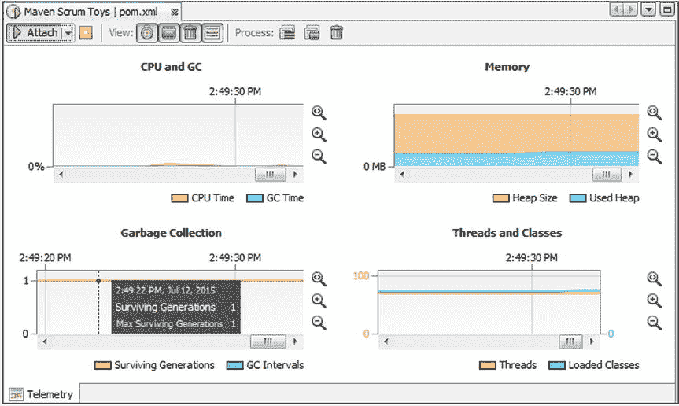
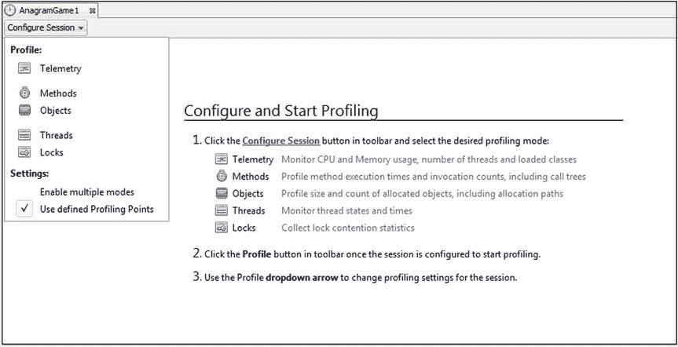
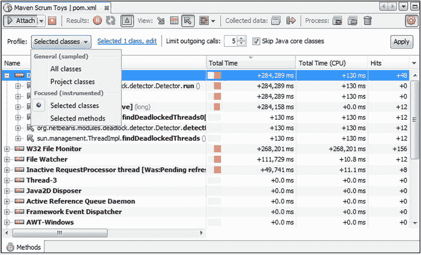
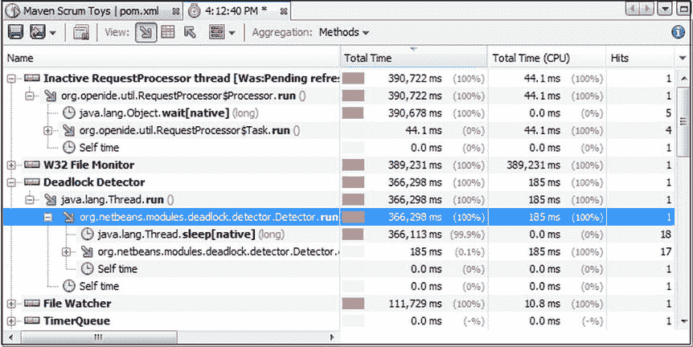
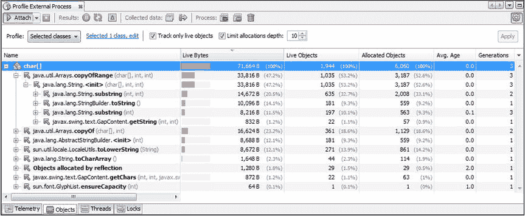
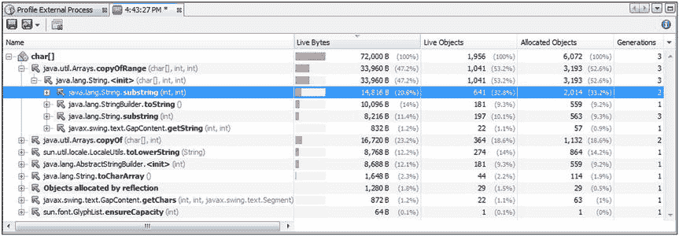
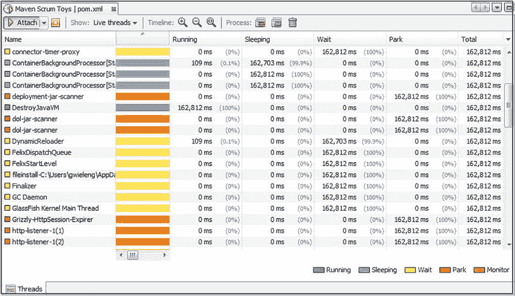
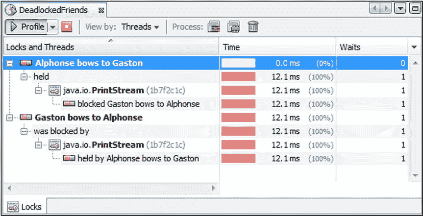
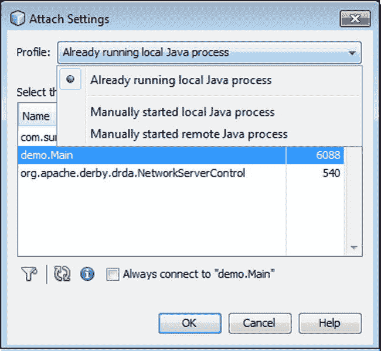
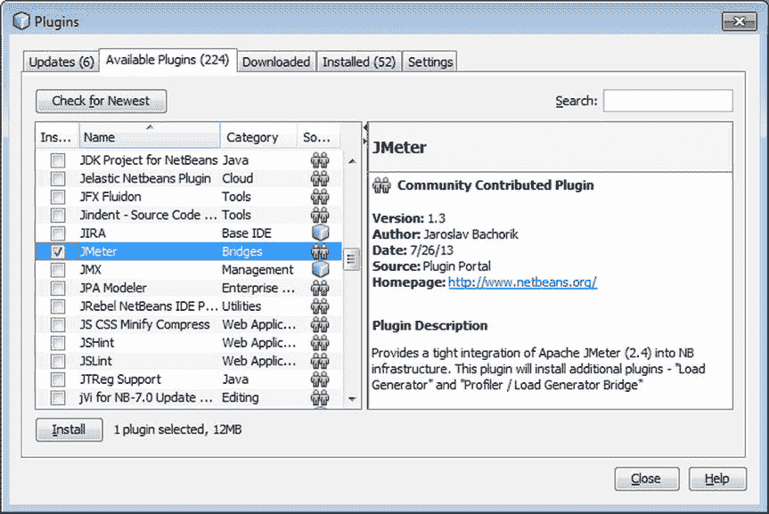

# 九、分析和调整

NetBeans 中包含的内存分析器是唯一能够提供真实世代计数的分析器。这一特色本身的价值要比免费门票高出许多许多倍。一切正常，所以我在想代码，而不是 IDE。—Kirk Pepperdine，Java 性能专家

想象一下，经过几个月的开发时间和大量的测试，您的应用终于可以进行生产部署了。应用开始运行，最初几分钟一切似乎都很成功。突然，你接到一个用户的电话，告诉你他不能访问这个应用，因为它似乎无限期地加载。过了一会儿，你接到另一个电话，又一个。似乎您的应用不允许足够多的用户同时访问。

这是一个噩梦般的场景，在这个场景中，应用开发团队必须在极大的压力下做出关键的性能调优决策，并且他们必须直接对生产环境做出每一项更改。在这种情况下，你从哪里开始？会有什么问题呢？服务器配置是否妨碍了生产环境的足够连接，或者应用代码是否包含迫使用户等待的瓶颈？

许多应用直到投入生产后才进行性能调优。不幸的是，许多组织并不认为性能调优是他们开发生命周期的一个重要部分，而是把它作为出现问题时的一个分流步骤。更糟糕的是，Java 性能调优就像大海捞针一样。性能问题的原因可能在任何地方，从应用源代码到服务器配置。

在本章中，您将了解分析和调整过程，尤其是与内置 NetBeans IDE 分析器(如图 [9-1](#Fig1) 所示)和 Apache JMeter 相关的过程。您可以在主动分析和调优 Java 应用时使用这些过程，这样就可以避免在应用没有调优或调优不正确时可能出现的噩梦场景。

图 9-1。

NetBeans Profiler

## 性能调整

性能调优应该是开发生命周期的一个标准部分。应用的设计应该以性能为中心。前瞻性地考虑性能意味着仔细考虑实现应用解决方案的所有方法，而不仅仅是最快的方法或最容易实现的方法。

特别是，在开发 Java EE 应用时很难考虑性能，尤其是因为 Java EE 环境中的几个争用点会给应用增加性能负担。Java EE 应用环境中遇到的主要性能问题往往与配置和环境问题有关。通常情况下，应用本身编码得很好，而应用部署到的应用服务器没有正确调优，或者配置不适合应用或预期的用户容量。

要针对生产应用进行适当调整，请按列出的顺序执行以下步骤:

Application tuning   Server tuning   Java runtime tuning   Server operating system and platform tuning  

### 性能编码

在 Java 应用中，有许多编码情况可能会导致性能开销。特别是因为 Java EE 应用是并发执行的，所以它们会导致瓶颈。用户可能会争夺资源，如 web 服务和数据库。每个远程调用都会增加延迟，而序列化等过程会占用大量 CPU 资源，导致性能进一步下降。

考虑到这些问题，您需要仔细设计 Java EE 应用，确保使用正确的资源处理。应用的性能调优应该从其源代码开始。即使 Java EE 应用中性能问题的主要原因指向环境，正确的编码仍然可以在性能良好的应用中发挥关键作用。

除其他外，以下糟糕的编码实践可能会导致性能问题:

*   过度序列化和反序列化
*   终结器的过度使用
*   太多的同步
*   不丢弃未使用的变量
*   太多动态变量
*   `System.out.println`的泛滥使用
*   不再需要时不释放的会话
*   无法关闭资源(例如，数据库和网络连接)

第 6 章，讨论了分析和重构，应该有助于识别你的代码中存在不良编码实践的区域，比如这里列出的。

执行代码审查对于减少抑制应用性能的问题是必不可少的。虽然粗制滥造的代码可能会逃过多个开发人员的眼睛，但检查它的眼睛越多越好。除了代码审查之外，应该有多个人对应用运行性能和负载测试，并将当前测试的结果与之前运行的结果进行比较。

### 调整环境

许多环境因素会影响应用的性能。您应该学习理解应用服务器的管理控制台和命令行实用程序，因为您将花费大量时间使用它们。例如，对于 GlassFish 4，默认域是为测试目的而适当配置的，而它很可能不适合生产环境，至少在没有进一步配置的情况下不适合。

确保为您的应用正确配置了部署设置。如果您的应用服务器允许自动部署或动态应用重载，请确保在生产环境中禁用这些设置，因为它们会对性能产生重大影响。还要注意日志的写入频率，因为频繁的日志记录会导致不合时宜的性能问题。考虑企业组件的应用服务器配置设置，例如企业 JavaBeans (EJB)容器、Java 消息服务(JMS)和 Java 事务服务(JTS)。始终检查默认配置设置，并修改它们以支持生产环境。适当时，配置服务器群集以通过负载平衡提供高可用性。

请记住，不要将数据库视为数据的黑匣子。无论是查询大型数据集还是执行太多小型查询，数据库访问都可能成为应用的争用点。无论是哪种情况，都要有一个数据库管理员(DBA)的联系电话，他可能能够在数据库表上创建索引，或者甚至在有意义的时候将应用逻辑合并到数据库中。

## 容量规划

许多工具可以帮助您为产品发布准备应用。分析工具在应用的开发生命周期中扮演着重要的角色。此类工具可用于预测应用在正常或重负载下发布到生产环境后的性能。

在 NetBeans IDE 环境中，两个这样的工具是内置的 NetBeans Profiler(以下称为“Profiler”)和 Apache JMeter 插件。这两个特性都有助于您在将应用部署到生产环境之前检测有关应用的重要运行时信息，使您能够监控与线程状态、CPU 性能、内存使用和锁争用相关的数据。

### 评测器入门

该分析器内置于 NetBeans IDE 中。不需要单独的安装或启用过程。

通过使用探查器，您可以在 IDE 中对项目或文件执行一组特定的分析任务。探查器执行的分析任务如下:

*   遥测:应用监控，带有 CPU 和内存使用情况的图表
*   方法:分析方法执行和时间，也称为 CPU 分析
*   对象:分析对象分配和大小，也称为内存分析
*   线程:在时间轴中监视和可视化线程状态
*   锁:锁争用的分析和可视化

图 [9-2](#Fig2) 显示了 NetBeans IDE 8.1 中新增的配置和启动分析窗口。它列出了前面讨论过的分析任务，并为您提供了开始使用这些任务的简单方法。

图 9-2。

Configure and Start Profiling window

在接下来的小节中，您将依次了解每一项性能分析任务。

### 基本分析术语

在继续之前，让我们快速浏览一下使用 profiler 时需要熟悉的一些术语。虽然 NetBeans Profiler 使您可以轻松地分析应用，即使您以前从未使用过分析工具，但它确实有助于理解所有分析工具通用的基本术语。

*   侧写员。一个向您展示应用在 Java 虚拟机(JVM)中运行时的行为的工具。
*   仪器仪表。将分析方法(计数器、计时器等)插入到应用的 Java 字节码中。这些方法不会改变程序的逻辑，并且会在分析停止时被移除。
*   剖析开销。执行分析方法而不是应用代码所花费的时间。
*   堆。JVM 为 new 操作符在程序中分配的所有对象使用的内存池。
*   垃圾收集。从内存中移除应用不再使用的对象。JVM 定期执行垃圾收集。
*   内存泄漏。您的应用不再使用的对象，但由于有一个或多个对它的无意引用，它不能被 JVM 垃圾收集。
*   自我时间。执行一个方法中的指令所需的时间。这不包括该方法调用的任何其他方法所花费的时间。
*   热点。一种自身时间相对较长的方法。
*   分析根目录。为性能分析选择的类或方法。
*   呼叫树。从分析根可到达的所有方法。

### 遥感勘测

遥测任务有助于在应用运行时监控高级统计数据。遥测任务不执行检测，因此启动速度很快，因为它没有强加分析开销。

要使用遥测任务，请右键单击某个应用，然后选择配置文件。在“配置和启动性能分析”窗口中，单击“配置会话”按钮，然后选择“遥测”。单击个人资料。或者，您可以通过主菜单栏中的“配置文件➤附加”菜单项附加到已经运行的进程。分析会话开始。

遥测窗口打开，如图 [9-3](#Fig3) 所示。

图 9-3。

Telemetry window

遥测任务显示应用的基本信息:

*   分配的堆内存
*   正在使用的堆内存
*   花费在垃圾收集上的时间百分比
*   正在运行的线程和类的数量

遥测窗口还显示堆上幸存的代。有关幸存代的说明，请参考下面的“了解幸存代”一节。

#### 了解幸存的几代

为了理解幸存的几代，考虑一下 JVM 的垃圾收集过程。每次垃圾收集器运行时，每个对象要么存活下来并继续占用堆内存，要么被移除并释放其内存。如果一个对象存活下来，它的年龄增加 1。换句话说，对象的年龄就是它存活下来的垃圾收集次数。幸存代的值是不同对象的年龄数。

例如，假设有几个对象在应用启动时都被分配了。此外，还有另一组对象是在应用运行的中点分配的。最后，有一些对象刚刚被分配，只经历了一次垃圾收集。如果垃圾收集器已经运行了 80 次，那么第一组中的所有对象的年龄都将是 80；第二组中的所有对象将具有 40 岁的年龄；第三组中的所有对象的年龄都是 1。在这个例子中，存活代的值是 3，因为堆上的所有对象有三个不同的年龄:80、40 和 1。

在大多数 Java 应用中，幸存代的值最终会稳定下来。这是因为应用已经到达了一个所有长期对象都已被分配的点。预期寿命较短的对象不会影响幸存代计数，因为它们最终会被垃圾回收。

如果应用的存活代数值随着应用的运行而不断增加，这可能表明存在内存泄漏。换句话说，随着时间的推移，您的应用将继续分配对象，每个对象都有不同的年龄，因为它经历了不同次数的垃圾收集。如果对象被正确地垃圾收集，不同对象年龄的数量将不会增加。

### 方法

当您想要获得有关应用中哪些方法使用最多 CPU 时间的详细信息时，请使用 Methods 任务。通过方法任务，您正在分析应用的性能。Methods 任务还会告诉您每个方法被调用了多少次。

您可以分析整个应用的方法性能，也可以只分析部分方法的性能。对于方法任务，所有类和项目类模式使用开销非常低的采样，因此它们是大型应用初始性能分析的理想选择。(对象任务也是如此。)选择分析整个应用意味着所有被调用的方法都将被检测。大量的检测会显著降低性能，因此该选项最好用于较小的应用。另一个因素是，对整个应用进行分析会产生大量的分析信息，您必须解释这些信息。你需要解释的越多，某些东西被误解的可能性就越大。

如果您怀疑应用的某些部分导致了性能问题，那么只分析这些部分可能是最好的方法。如果选择只分析应用的一部分，则必须选择一个或多个分析根。

#### 查看实时结果

要使用“方法”任务，请右键单击应用，然后选择“配置文件”。在“配置和启动性能分析”窗口中，单击“配置会话”按钮，然后选择“方法”。单击个人资料。或者，您可以通过主菜单栏中的“配置文件➤附加”菜单项附加到已经运行的进程。分析会话开始。

方法窗口打开，如图 [9-4](#Fig4) 所示。

图 9-4。

Methods window

该窗口显示至少调用过一次的所有方法。默认的排序顺序是按自己的时间降序排列。应用中使用时间最多的方法显示在列表的顶部。所用时间显示在两列中，一列用图形显示每种方法所用时间的百分比，另一列用文本显示原始时间值和百分比。调用次数也显示在 Hits 列中。随着应用的运行，探查器将更新这些值。

要更改排序顺序，请单击列标题。这将使用列中的值对表进行降序排序。再次单击以升序排序。单击工具栏中的 Hot Spots 按钮，该列将按照包、类和方法名对表进行排序。

要更快地找到特定方法，请在窗口中右键单击，然后选择筛选或查找。输入方法名称，然后按 Enter 键。该窗口显示符合您的标准的项目。

#### 拍摄结果快照

要查看更详细的信息，请选择配置文件➤获取收集结果的快照(Alt+F2)。将显示 CPU 快照窗口，快照的时间作为其标题。

CPU 快照窗口打开，如图 [9-5](#Fig5) 所示。

图 9-5。

CPU Snapshot window

“CPU 快照”窗口显示按线程组织的调用树。要切换到热点视图，请点按工具栏中的“热点”按钮。

当您单击选项卡右上角的信息图标时，您将看到一个窗口，显示快照信息的摘要:日期、时间、过滤器设置等。快照窗口顶部的图标允许您保存快照、控制快照的粒度(方法、类或包)以及搜索快照。

### 目标

使用 Objects 任务跟踪应用使用的堆内存。如果 JVM 在运行您的应用时报告了一个`OutOfMemoryError`，分析器可以帮助您确定问题的原因。

#### 查看实时结果

要使用对象任务，请右键单击应用，然后选择配置文件。在“配置和启动性能分析”窗口中，单击“配置会话”按钮，然后选择“对象”。单击个人资料。或者，您可以通过主菜单栏中的“配置文件➤附加”菜单项附加到已经运行的进程。分析会话开始。

对象窗口打开，如图 [9-6](#Fig6) 所示。

图 9-6。

Objects window

显示的列如下:

*   分配的对象。探查器正在跟踪的对象数。默认情况下，这个数字大约是应用实际分配的对象的 10%。使用 Profiler 工具栏中的“限制分配深度”复选框来更改默认值。通过只监视所创建对象的一个子集，分析器可以极大地减少 JVM 上的开销，从而使应用以接近全速的速度运行。
*   活的物体。当前在堆上并因此占用内存的已分配对象的数量。
*   活字节。活动对象使用的堆内存量。
*   平均值。年龄。活体的平均年龄。每个对象的年龄是它存活下来的垃圾收集次数。年龄的总和除以活动对象的数量就是平均值。年龄。
*   使用活体计算的世代。一个对象的年龄是它经历的垃圾收集的次数。世代值是活动对象不同年龄的数量。有关幸存代的详细信息，请参见本主题前面的部分。

要更改排序顺序，请单击列标题。这将使用列中的值对表进行降序排序。再次单击以升序排序。按代对表进行排序通常有助于识别导致内存泄漏的类。这是因为世代值的增加通常表示内存泄漏。

#### 拍摄结果快照

为了查看应用中的哪些方法正在分配对象，您必须拍摄快照。您还可以相互比较快照，以确定差异和其他感兴趣的方面。

使用配置文件➤获取收集结果的快照(Alt+F2)。将显示 CPU 快照窗口，快照的时间作为其标题。

图 9-7。

CPU Snaphot window

### 线

Threads 任务对于在应用运行时监视每个线程的状态非常有用。

要监视线程，请右键单击某个应用，然后选择“配置文件”。在“配置并启动性能分析”窗口中，单击“配置会话”按钮，然后选择“线程”。单击个人资料。或者，您可以通过主菜单栏中的“配置文件➤附加”菜单项附加到已经运行的进程。分析会话开始。

螺纹窗口如图 [9-8](#Fig8) 所示。

图 9-8。

The Threads window

螺纹以下列颜色编码显示:

*   绿色。线程正在运行或准备运行。
*   紫色。线程正在`Thread.sleep()`中休眠。
*   黄色。线程正在等待对`Object.wait()`的调用。
*   红色。尝试进入同步方法或块时，线程被阻止。

您可以使用显示颜色的列下方的滚动条来滚动时间，并检查从应用启动时开始的线程状态。点按工具栏中的“放大”和“缩小”按钮，以控制“线程”窗口中显示的细节级别。

### 锁定争用

当一个线程试图获取一个锁，而另一个线程持有它，迫使它等待时，就会发生锁争用。

锁争用会扼杀您通过并行使用多个内核可能获得的任何性能提升，因为您是通过使用锁来按顺序组织工作的。在最坏的情况下，只有一个线程会运行。

“锁争用”窗口显示关于锁争用的详细信息。它显示了对性能瓶颈的分析，这可以帮助您确定负责的线程。

要识别锁争用，请右键单击某个应用，然后选择“配置文件”。在“配置和启动性能分析”窗口中，单击“配置会话”按钮，然后选择“锁定争用”。单击个人资料。或者，您可以通过主菜单栏中的“配置文件➤附加”菜单项附加到已经运行的进程。分析会话开始。

锁竞争窗口如图 [9-9](#Fig9) 所示。

图 9-9。

Lock Contention window

图 [9-9](#Fig9) 中显示的锁争用分析适用于 Java 教程 [`docs.oracle.com/javase/tutorial/essential/concurrency/deadlock.html`](http://docs.oracle.com/javase/tutorial/essential/concurrency/deadlock.html) 中在此 URL 讨论的死锁示例。

### 将探查器附加到外部进程

NetBeans Profiler 可以分析不是由 IDE 启动的应用。换句话说，它可以附加到一个 JVM 上。要使用此功能，请选择“配置文件➤附加到外部进程”,然后在“配置文件外部进程”中单击“附加”。附加设置窗口打开，如图 [9-10](#Fig10) 所示。

图 9-10。

The Attach Settings window

“附加设置”窗口允许您选择正在运行的应用进行性能分析。或者，您可以在本地或远程将分析器附加到手动启动的 Java 进程。

### Apache JMeter 入门

Java EE 应用环境中最成问题的性能问题之一是用户容量。多少用户可以同时访问应用？在开发环境中，这个问题是不可能回答的，因为有太多的变量在起作用。即使开发环境的配置方式与生产环境完全相同，生产环境和开发环境之间也几乎总是会出现不一致。通常情况下，用户能力测试会变成一场碰运气的游戏。

Apache JMeter 工具( [jmeter。阿帕奇。org](http://jmeter.apache.org/) )在这种情况下会有所帮助。Apache JMeter 是一个测量性能和负载测试的 Java 应用。IDE 可以很好地与 Apache JMeter 集成，一旦安装了 Apache JMeter 插件，就不需要安装 Apache JMeter，也不需要手动打开它。

要在 IDE 中开始使用 Apache JMeter，进入工具➤插件并安装插件，如图 [9-11](#Fig11) 所示。

图 9-11。

Installingthe Apache JMeter plugin

### 使用 Apache JMeter

一旦在 IDE 中安装了 Apache JMeter 插件，使用新的文件窗口(Ctrl+N)来创建 JMeter 计划，如图 [9-12](#Fig12) 所示。

图 9-12。

JMeter Plan in the New File window

要将 JMeter 测试作为构建的一部分来运行，您可以使用这里显示的 XML 条目在 POM 中注册 Maven JMeter 插件( [`jmeter.lazerycode.com`](http://jmeter.lazerycode.com/) )。

`<build>`

`<plugins>`

`<plugin>`

`<groupId>com.lazerycode.jmeter</groupId>`

`<artifactId>jmeter-maven-plugin</artifactId>`

`<version>1.10.1</version>`

`<executions>`

`<execution>`

`<id>jmeter-tests</id>`

`<phase>verify</phase>`

`<goals>`

`<goal>jmeter</goal>`

`</goals>`

`</execution>`

`</executions>`

`</plugin>`

`</plugins>`

`</buil` `d>`

请注意，Maven JMeter 插件希望您的 JMeter 计划位于`src/test/jmeter`文件夹中。在 IDE 中，你可以右击 JMeter 计划来运行它们或者打开 Apache JMeter 进行编辑，如图 [9-13](#Fig13) 所示。当您为 Apache JMeter 安装 NetBeans 插件时，会自动安装 Apache JMeter。

图 9-13。

Menu items for editing and running JMeter plans

您可以在不启动 Apache JMeter 的情况下执行 JMeter 计划的基本编辑。只需点击属性，这是列表中的最后一个菜单项，如图 [9-13](#Fig13) 所示。这将打开一个属性窗口，您可以在其中更改基本设置，如用户数量和目标服务器。