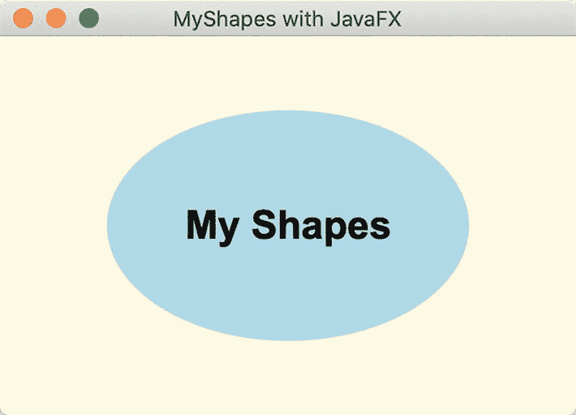
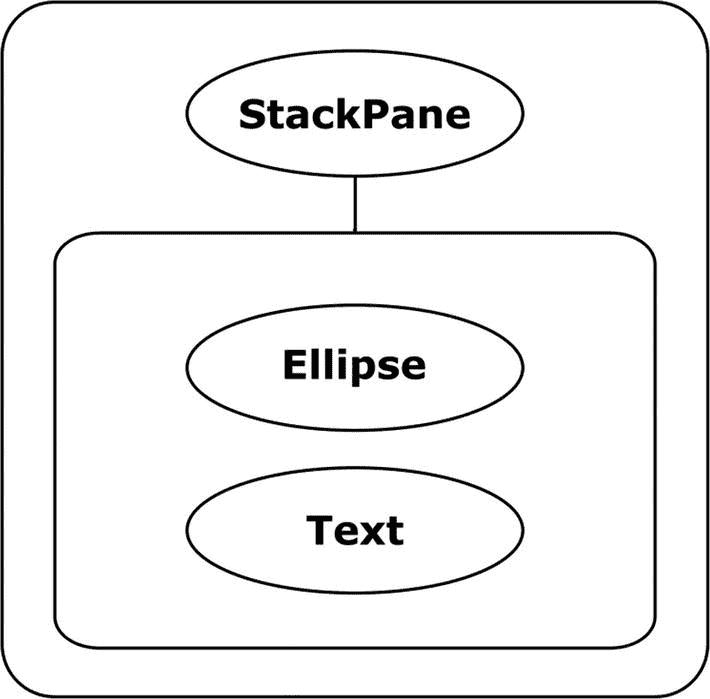
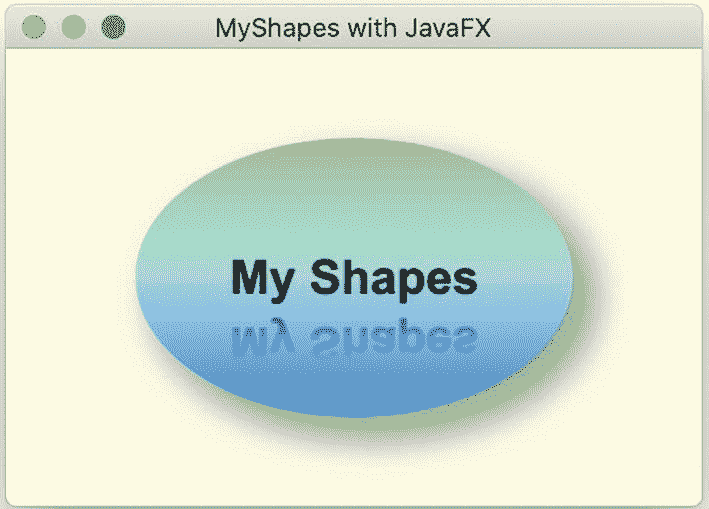
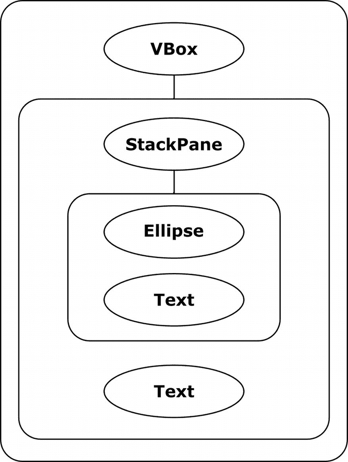
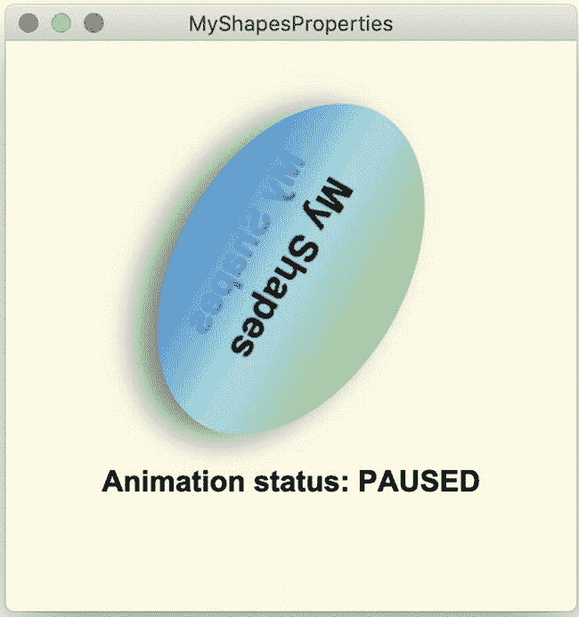
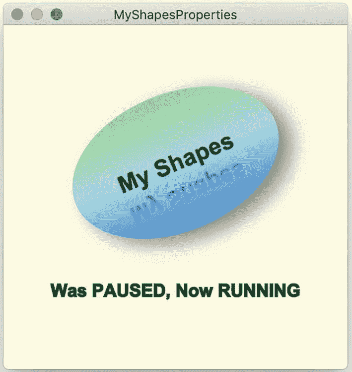
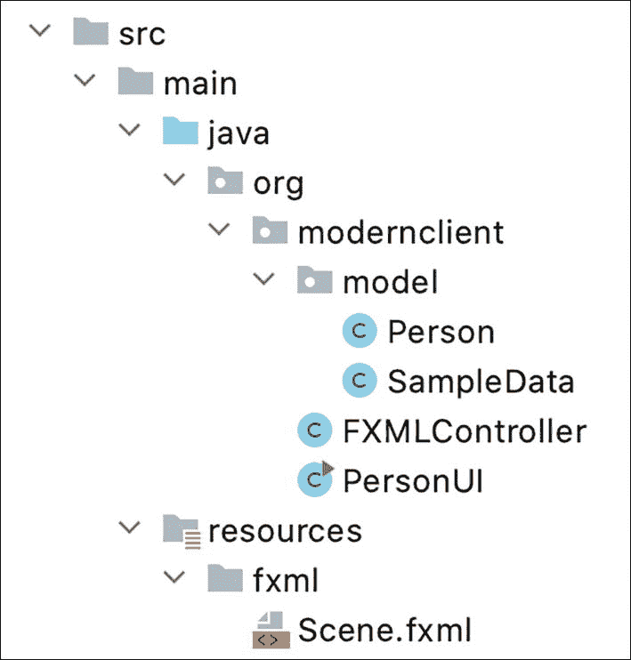

# 2.JavaFX 基础知识

盖尔·安德森和保罗·安德松写的

在您的系统上安装了 Java SDK 和 JavaFX 之后，让我们创建一些应用程序并探索 JavaFX 的基础。首先，我们将描述 JavaFX 应用程序的基本结构，以及使 JavaFX 成为现代客户机的强大选择的一些特性。我们将向您展示如何创建具有吸引力和响应性的 ui。我们将看看 FXML，它是一种基于 XML 的标记语言，允许您定义和配置 UI。我们还将介绍 Scene Builder，这是一个用于设计和配置 JavaFX UI 的独立拖放工具。

为了进一步改进或完全重新设计您的 UI，JavaFX 使用级联样式表(CSS)。我们将向您展示几种在 JavaFX 中使用 CSS 的方法。

JavaFX 属性提供了强大的绑定机制。我们将介绍 JavaFX 属性和绑定。我们将展示为什么 JavaFX observables 和 binding 有助于创建比庞大的侦听器更不容易出错的紧凑代码。我们还将探索几个布局控件，并向您展示将动画融入 UI 是多么容易。

我们将用一个示例应用程序来结束本章，该应用程序使用 JavaFX 集合、一个可编辑的表单和用于典型数据库 CRUD 操作的按钮来实现一个主从 UI。

在这一章中，我们将介绍后续章节更深入讨论的主题。这是为了让您体验 JavaFX 的潜力，并为在本书中进一步探索 JavaFX 提供基础知识。开始吧！

## JavaFX 舞台和场景图

JavaFX 应用程序由 JavaFX 平台控制，JavaFX 平台是构建应用程序对象和 Java FX 应用程序线程的运行时系统。要构建 JavaFX 应用程序，必须扩展 JavaFX 应用程序类。JavaFX 运行时系统控制应用程序的生命周期，并调用应用程序的`start()`方法。

JavaFX 用了一个剧场的比喻:顶层容器就是舞台，由平台为你构建。在桌面应用程序中，舞台就是窗口。它的外观取决于主机系统，并因 macOS、Windows 和 Linux 平台而异。通常，窗口用调整大小、最小化和退出应用程序的控件来修饰。也可以建造无装饰的窗户。您也可以为其他环境专门化应用程序类。例如，使用 Gluon 移动应用框架，您的程序扩展了移动应用，这是一个专门为移动设备编写的应用类。

### JavaFX 是单线程的

您必须始终在 JavaFX 应用程序线程上构造和修改舞台及其场景对象。注意 JavaFX(像 Swing 一样)是单线程 UI 模型。对于 JavaFX 开发人员来说，这是一个非常简单的限制。当您创建 UI 元素、响应事件处理程序、使用动画管理动态内容或在场景图中进行更改时，工作会继续在 JavaFX 应用程序线程上执行。

但是，为了保持 UI 的响应性，您应该将长时间运行的工作分配给单独线程中的后台任务。在这种情况下，修改 UI 的工作必须与在后台线程上执行的工作分开。幸运的是，JavaFX 有一个开发良好的并发 API，可以帮助开发人员将长期运行的任务分配给一个或多个单独的线程。这使得 UI 线程能够响应用户事件。这些主题将在第 [13](13.html) 章“机器学习和 JavaFX”中探讨。

### 分层节点结构

继续剧院的比喻，舞台拥有一个场景。场景由 JavaFX 元素组成，比如根元素，它是顶层场景元素，包含所谓的场景图。

场景图是一个严格的层次结构，它由可视化应用程序的元素组成。这些元素被称为节点。一个节点只有一个父节点(根节点除外)，并且可以包含其他节点。或者节点可以是没有子节点的叶节点。必须将节点添加到场景图中，以便参与该场景的渲染。此外，一个节点只能添加到一个场景中一次，除非先将其移除，然后再添加到其他地方。

父节点通常通过根据布局规则和您配置的任何约束在场景中排列子节点来管理子节点。JavaFX 对 2D 图形使用二维坐标系，原点在场景的左上角，如图 [2-1](#Fig1) 所示。x 轴上的坐标值向右增加，y 轴值随着场景向下移动而增加。


图 2-1

JavaFX 2D 坐标系

JavaFX 还支持 3D 图形，并用 z 轴值表示第三维，提供深度。请参见第 [8](08.html) 章“JavaFX 3D”，以“深入”了解 JavaFX 的三维功能。

除了相对于父对象的局部坐标系之外，JavaFX 还有一个绝对坐标系。在每种情况下，坐标系的原点都是父坐标系的左上角。通常，布局控件隐藏了场景中组件放置的复杂性，并为您管理其子组件的放置。组件放置基于特定的布局控件以及您对它的配置方式。

也可以嵌套布局控件。例如，可以将多个 VBox 控件放在一个 HBox 中，或将一个 AnchorPane 放在 SplitPane 控件的一个窗格中。其他父节点是更复杂的可视节点，如 TextField、TextArea 和 Button。这些节点有受管理的子部分。例如，按钮包括带标签的文本部分和可选图形。此图形可以是任何节点类型，但通常是图像或图标。

回想一下，叶节点没有子节点。示例包括形状(如矩形、椭圆形、直线、路径和文本)和 ImageView，即用于呈现图像的节点。

## 一个简单的形状示例

图 [2-2](#Fig2) 显示了一个名为 MyShapes 的简单 JavaFX 应用程序，它在应用程序窗口的中心显示一个椭圆和一个文本元素。此窗口的外观因底层平台而异。调整窗口大小时，可见元素将在调整后的空间中保持居中。尽管这是一个简单的程序，但是关于 JavaFX 呈现、布局特性和节点还有很多东西需要学习。



图 2-2

MyShapes 应用程序

清单 [2-1](#PC1) 显示了 MyShapes 程序的源代码。类 MyShapes 是主类，它扩展了应用程序。JavaFX 运行时系统实例化 MyShapes 和初级 Stage，并将其传递给被覆盖的`start()`方法。运行时系统为您调用`start()`方法。

```java
package org.modernclient;
import javafx.application.Application;
import javafx.scene.Scene;
import javafx.scene.layout.StackPane;
import javafx.scene.paint.Color;
import javafx.scene.shape.Ellipse;
import javafx.scene.text.Font;
import javafx.scene.text.Text;
import javafx.stage.Stage;
public class MyShapes extends Application {
    @Override
    public void start(Stage stage) throws Exception {
        // Create an Ellipse and set fill color
        Ellipse ellipse = new Ellipse(110, 70);
        ellipse.setFill(Color.LIGHTBLUE);
        // Create a Text shape with font and size
        Text text = new Text("My Shapes");
        text.setFont(new Font("Arial Bold", 24));
        StackPane stackPane = new StackPane();
        stackPane.getChildren().addAll(ellipse, text);
        Scene scene = new Scene(stackPane, 350, 230,
                       Color.LIGHTYELLOW);
        stage.setTitle("MyShapes with JavaFX");
        stage.setScene(scene);
        stage.show();
    }
    public static void main(String[] args) {
        launch(args);
    }
}

Listing 2-1MyShapes.java

```

请注意引用了`javafx.application`、`javafx.scene`和`javafx.stage`中的包的导入语句。

Note

确保为任何导入语句指定正确的包。一些 JavaFX 类，比如 Rectangle，与它们的 AWT 或 Swing 对应物具有相同的类名。所有 JavaFX 类都是包`javafx`的一部分。

这个程序创建几个节点，并将它们添加到 StackPane 布局容器中。该程序还创建场景，配置舞台，并显示舞台。让我们详细看看这些步骤。

首先，我们创建一个椭圆形状，以像素为单位提供宽度和高度。因为椭圆扩展了形状，所以我们也可以配置任何形状属性。这包括“填充”,它允许您指定内部绘制值。

## 颜色

形状的填充属性可以是 JavaFX 颜色、线性渐变、径向渐变或图像。我们简单讨论一下色彩。您可以用几种方法在 JavaFX 中指定颜色。这里，我们将椭圆填充属性设置为`Color.LIGHTBLUE`。JavaFX 颜色类中目前有 147 种预定义的颜色，按字母顺序从`ALICEBLUE`到`YELLOWGREEN`命名。但是，您也可以使用十六进制或十进制的 web RGB 值来指定颜色。您可以选择提供透明度的 alpha 值。完全不透明为 1，完全透明为 0。例如，0.5 的透明度显示了颜色，但也让背景色显示出来。

以下是设定形状填充颜色的几个示例:

```java
ellipse.setFill(Color.LIGHTBLUE);              // Light blue, fully opaque
ellipse.setFill(Color.web("#ADD8E6"));         // Light blue, fully opaque
ellipse.setFill(Color.web("#ADD8E680"));       // Light blue, .5 opaque
ellipse.setFill(Color.web("0xADD8E6"));        // Light blue, fully opaque
ellipse.setFill(Color.web("0xADD8E680"));      // Light blue, .5 opaque
ellipse.setFill(Color.rgb(173, 216, 230));     // Light blue, fully opaque
ellipse.setFill(Color.rgb(173, 216, 230, .5)); // Light blue, .5 opaque

```

第 [5](05.html) 章，“掌握视觉和 CSS 设计”，向您展示了使用 CSS 和 JavaFX 指定颜色、渐变和图像的附加选项。

值得注意的是，您可以插入颜色的值，这就是 JavaFX 构建渐变的方式。我们将告诉你如何创建一个线性渐变。

## 文本是一种形状

接下来，我们创建一个文本对象。文本也是具有附加属性的形状，如字体、文本对齐方式、文本和环绕宽度。构造函数提供文本，`setFont()`方法设置它的字体。

## JavaFX 坐标系

注意，我们创建了椭圆和文本节点，但是它们还没有出现在我们的场景图中。在我们将它们添加到场景中之前，我们必须将这些节点放在某种布局容器中。布局控件在管理场景图时非常重要。这些控件不仅可以为您安排组件，还可以响应事件，例如调整大小、添加或移除元素，以及对场景图中一个或多个节点大小的任何更改。

为了向您展示布局控件的重要性，让我们用一个组替换清单 [2-1](#PC1) 中的 StackPane，并手动指定位置。组是管理其子节点的父节点，但不提供任何布局功能。这里我们创建一个组，并用构造函数添加椭圆和文本元素。然后我们指定组作为场景的根节点:

```java
        Group group = new Group(ellipse, text);
         ...
        Scene scene = new Scene(group, 350, 230, Color.LIGHTYELLOW);

```

组为其子对象使用默认对齐设置，并将所有内容放置在原点(0，0)，即场景的左上角。对于文本，默认位置是文本元素的左下边缘。在这种情况下，唯一可见的部分将是延伸到下边缘下方的字母(“我的形状”的小写字母“y”和“p”)。椭圆将以组原点(0，0)为中心，因此只有右下象限可见。

这种安排显然不是我们想要的。要解决这个问题，让我们手动将 350 × 230 场景中的形状居中，如下所示:

```java
        Group group = new Group(ellipse, text);
        // Manually placing components is tedious and error-prone
        ellipse.setCenterX(175);
        ellipse.setCenterY(115);
        text.setX(175-(text.getLayoutBounds().getWidth()/2));
        text.setY(115+(text.getLayoutBounds().getHeight()/2));
        ...
        Scene scene = new Scene(group, 350, 230, Color.LIGHTYELLOW);

```

现在，形状将会很好地在场景中居中。但这仍不理想。当窗口调整大小时，这些形状将停留在场景中的这些坐标上(除非您编写代码来检测和响应窗口调整)。你不想这么做。而是使用 JavaFX 布局控件！

## 布局控件

现在让我们稍微绕道来讨论一些常见的布局控件。要管理场景的节点，可以使用一个或多个控件。每个控件都是为特定的布局配置而设计的。此外，您可以嵌套布局控件来管理节点组，并指定布局应该如何响应事件，如调整托管节点的大小或对其进行更改。您可以指定对齐设置以及边距控制和填充。

有几种方法可以将节点添加到布局容器中。您可以使用布局容器的构造函数添加子节点。您还可以将方法`getChildren().add()`用于单个节点，将方法`getChildren().addAll()`用于多个节点。此外，一些布局控件有专门的方法来添加节点。现在让我们看看几个常用的布局控件，向您展示 JavaFX 如何为您构建一个场景。

### 面板

一个方便简单的布局容器是 StackPane，我们在清单 [2-1](#PC1) 中使用了它。此布局控件按照您添加节点的顺序从后向前堆叠其子控件。注意，我们首先添加椭圆，使它出现在文本节点的后面。在相反的顺序中，椭圆会遮蔽文本元素。

默认情况下，StackPane 将其所有子节点居中。您可以为子级提供不同的对齐方式，或者将对齐方式应用于 StackPane 中的特定节点。例如，

```java
        // align the text only
        stackPane.setAlignment(text, Pos.BOTTOM_CENTER);

```

将文本节点沿 StackPane 的下边缘居中。现在，当您调整窗口大小时，椭圆保持居中，文本保持锚定在窗口的下边缘。若要指定所有托管节点与下边缘的对齐方式，请使用

```java
        // align all managed nodes
        stackPane.setAlignment(Pos.BOTTOM_CENTER);

```

虽然椭圆和文本都出现在窗口的底部，但它们不会相对于彼此居中，因为它们将在各自的底部边缘对齐。

### 锚板

AnchorPane 根据配置的定位点管理其子节点，即使容器调整大小时也是如此。您可以为组件指定距窗格边缘的偏移。在这里，我们向 AnchorPane 添加一个标签，并以 10 像素的偏移量将其锚定到窗格的左下方:

```java
        AnchorPane anchorPane = new AnchorPane();
        Label label = new Label("My Label");
        anchorPane.getChildren().add(label);
        AnchorPane.setLeftAnchor(label, 10.0);
        AnchorPane.setBottomAnchor(label, 10.0);

```

AnchorPane 通常用作顶级布局管理器来控制边距，即使在调整窗口大小时也是如此。

### 组件

GridPane 允许您将子节点放在大小灵活的二维网格中。组件可以跨越行和/或列，但是给定行中所有组件的行大小是一致的。同样，对于给定的列，列的宽度是一致的。GridPane 有专门的方法将节点添加到由列号和行号指定的特定单元格中。可选参数允许您指定列和行的跨度值。例如，这里的第一个标签放在对应于第 0 列和第 0 行的单元格中。第二个标签放在对应于第 1 列和第 0 行的单元格中，它跨越两列(第二列和第三列)。我们还必须提供一个行跨度值(这里设置为 1):

```java
        GridPane gridPane = new GridPane();
        gridPane.add(new Label("Label1"), 0, 0);
        gridPane.add(new Label("Label2 is very long"), 1, 0, 2, 1);

```

GridPane 对于在容纳各种大小的列或行的表单中布局组件很有用。GridPane 还允许节点跨越多列或多行。我们在我们的主-细节 UI 示例中使用 GridPane(参见本章后面的“将它们放在一起”)。

### FlowPane 和 TilePane

FlowPane 以水平流或垂直流的方式管理其子节点。默认方向是水平的。可以用构造函数或者使用方法`setOrientation()`指定流向。这里，我们用构造函数指定一个垂直方向:

```java
        FlowPane flowpane = new FlowPane(Orientation.VERTICAL);

```

FlowPane 根据可配置的边界包装子节点。如果调整包含流窗格的窗格的大小，布局将根据需要调整流。单元的大小取决于节点的大小，除非所有节点的大小都相同，否则它不会是统一的网格。这种布局对于大小可变的节点很方便，例如 ImageView 节点或形状。TilePane 类似于 FlowPane，只是 TilePane 使用大小相等的单元格。

### BorderPane

BorderPane 对于具有离散部分的桌面应用程序来说很方便，包括一个顶部工具栏(顶部)、一个底部状态栏(底部)、一个中心工作区(中心)和两个侧边区域(左右)。这五个部分中的任何一个都可以是空的。下面是一个边框窗格的示例，中间是一个矩形，顶部是一个标签:

```java
        BorderPane borderPane = new BorderPane();
        Label colorLabel = new Label("Color: Lightblue");
        colorLabel.setFont(new Font("Verdana", 18));
        borderPane.setTop(colorLabel);
        Rectangle rectangle = new Rectangle(100, 50, Color.LIGHTBLUE);
        borderPane.setCenter(rectangle);
        borderPane.setAlignment(colorLabel, Pos.CENTER);
        borderPane.setMargin(colorLabel, new Insets(20,10,5,10));

```

请注意，默认情况下，BorderPane 对中心区域使用居中对齐，对顶部使用左对齐。为了保持顶部区域标签居中，我们用`Pos.CENTER`配置它的对齐方式。我们还用 BorderPane 静态方法`setMargin()`设置标签周围的边距。Insets 构造函数接受四个值，分别对应于上、右、下和左边缘。类似的对齐和边距配置也适用于其他布局组件。

### 分屏

SplitPane 将布局空间划分为多个水平或垂直配置的区域。分隔线是可移动的，通常在 SplitPane 的每个区域中使用其他布局控件。我们在我们的主-细节 UI 示例中使用 SplitPane(参见本章后面的“将它们放在一起”)。

### HBox、VBox 和按钮栏

HBox 和 VBox 布局控件为子节点提供单一水平或垂直位置。您可以将 HBox 节点嵌套在 VBox 中以获得类似网格的效果，或者将 VBox 节点嵌套在 HBox 组件中。ButtonBar 便于在水平容器中放置一排大小相等的按钮。

有关这些和其他布局控件的详细信息，请参见第 [4](04.html) 章“JavaFX 控件深入研究”

## 大吵大闹

回到清单 [2-1](#PC1) ，场景持有场景图，由它的根节点定义。首先，我们构建场景并提供`stackPane`作为根节点。然后，我们以像素为单位指定它的宽度和高度，并为背景提供一个可选的 fill 参数(`Color.LIGHTYELLOW`)。

剩下的就是配置舞台了。我们提供一个标题，设置场景，展示舞台。JavaFX 运行时渲染我们的场景，如图 [2-2](#Fig2) 所示。

图 2-3 显示了我们的 MyShapes 应用程序的场景图的层次视图。根节点是 StackPane，它包含两个子节点 Ellipse 和 Text。



图 2-3

MyShapes 场景图

## 增强 MyShapes 应用程序

与旧的 UI 工具包相比，JavaFX 的优势之一是可以轻松地将效果、渐变和动画应用到场景图中的节点。我们将反复讨论场景图节点的概念，因为这是 JavaFX 运行时高效呈现应用程序可视部分的方式。现在让我们对 MyShapes 进行一些修改，向您展示其中的一些功能。因为 JavaFX 能够插值颜色，所以您可以使用颜色来定义渐变。渐变赋予形状深度，可以是径向的，也可以是线性的。让我们给你看一个线性梯度。

### 线性梯度

线性渐变需要两种或两种以上的颜色，称为色标。渐变色标由一种颜色和一个介于 0 和 1 之间的偏移量组成。此偏移量指定沿渐变放置颜色的位置。渐变计算从一个色标到下一个色标的比例阴影。

在我们的例子中，我们将使用三个色标:`Color.DODGERBLUE`、`Color.LIGHTBLUE`和`Color.GREEN`。第一个停靠点的偏移量为 0，第二个偏移量为. 5，第三个偏移量为 1.0，如下所示:

```java
        Stop[] stops = new Stop[] { new Stop(0, Color.DODGERBLUE),
                new Stop(0.5, Color.LIGHTBLUE),
                new Stop(1.0, Color.LIGHTGREEN)};

```

LinearGradient 构造函数指定 x 轴范围，后跟 y 轴范围。下面的线性渐变具有恒定的 x 轴，但其 y 轴是变化的。这被称为垂直梯度。(我们在程序 MyShapes2 中使用这个垂直渐变，如图 [2-4](#Fig4) 所示。)

```java
        // startX=0, startY=0, endX=0, endY=1
        LinearGradient gradient = new LinearGradient(0, 0, 0, 1, true,
                CycleMethod.NO_CYCLE, stops);

```

Boolean true 表示渐变贯穿形状(其中 0 和 1 与形状成比例)，而`NO_CYCLE`表示图案不重复。布尔值 false 表示渐变的 x 和 y 值相对于父级的本地坐标系。

要制作水平渐变，请指定 x 轴的范围，并使 y 轴保持不变，如下所示:

```java
        // startX=0, startY=0, endX=1, endY=0
        LinearGradient gradient = new LinearGradient(0, 0, 1, 0, true,
                CycleMethod.NO_CYCLE, stops);

```

其他组合允许您指定对角线渐变或反向渐变，其中颜色以相反的顺序出现。

### 阴影

接下来，让我们添加一个投影效果的椭圆。您可以指定投影的颜色、半径以及 x 和 y 偏移。半径越大，阴影越大。偏移量表示相对于形状外边缘的阴影位置。这里，我们指定半径为 30 个像素，在形状的右下方偏移 10 个像素:

```java
        ellipse.setEffect(new DropShadow(30, 10, 10, Color.GRAY));

```

这些偏移模拟从场景左上角发出的光源。当偏移为 0 时，阴影包围整个形状，就好像光源直接照射在场景上方。

### 反射

反射效果镜像组件，并淡入透明，这取决于您如何配置其顶部和底部不透明度、分数和偏移。让我们给文本节点添加一个反射效果。我们将使用 0.8 作为分数，这样反射将是反射分量的十分之八。偏移以像素为单位指定反射从下边缘以下多远开始。我们指定 1 个像素(默认值为 0)。倒影从完全不透明(顶部不透明度)开始，并过渡到完全透明(底部不透明度)，除非您修改顶部和底部不透明度值:

```java
        Reflection r = new Reflection();
        r.setFraction(.8);
        r.setTopOffset(1.0);
        text.setEffect(r);

```

图 [2-4](#Fig4) 显示了在窗口中运行的增强的 MyShapes 程序。您会看到应用于椭圆的线性渐变填充、椭圆上的投影以及应用于文本的反射效果。



图 2-4

增强型 MyShapes 应用程序(MyShapes2)

## 配置操作

现在是时候让我们的应用程序做点什么了。JavaFX 用鼠标、手势、触摸或按键定义了各种类型的标准输入事件。这些输入事件类型都有特定的处理程序来处理它们。

现在让我们把事情简单化。我们将向您展示如何编写一个事件处理程序来处理单个鼠标点击事件。我们将创建处理程序，并将其附加到场景图中的一个节点上。程序的行为将根据哪个节点获取处理程序而有所不同。我们可以在文本、椭圆或 StackPane 节点上配置鼠标单击处理程序。

下面是将动作事件处理程序添加到文本节点的代码:

```java
        text.setOnMouseClicked(mouseEvent -> {
            System.out.println(mouseEvent.getSource().getClass()
                 + " clicked.");
        });

```

当用户在文本中单击时，程序显示该行

```java
        class javafx.scene.text.Text clicked.

```

如果用户在背景区域(堆栈窗格)或椭圆内单击，则不会发生任何事情。如果我们将同一个侦听器附加到椭圆而不是文本，我们会看到这条线

```java
        class javafx.scene.shape.Ellipse clicked.

```

请注意，因为文本对象出现在堆栈窗格中的椭圆前面，所以单击文本对象不会调用事件处理程序。即使这些场景图节点出现在彼此的顶部，它们在层次中也是单独的节点。也就是说，一个不在另一个里面；相反，它们都是由堆栈窗格管理的不同叶节点。在这种情况下，如果希望两个节点都响应鼠标单击，可以将鼠标事件处理程序附加到两个节点上。或者您可以只将一个事件处理程序附加到 StackPane 节点。然后，在窗口内的任何地方单击鼠标都会触发处理程序，输出如下:

```java
        class javafx.scene.layout.StackPane clicked.

```

让我们做一些更令人兴奋的事情，将动画应用到 MyShapes 程序中。

## 动画

当您使用内置的转换 API 时，JavaFX 使动画变得非常容易。每个 JavaFX 转换类型控制一个或多个节点(或形状)属性。例如，FadeTransition 控制节点的不透明度，随时间改变属性。要逐渐淡出某些东西，您可以将其不透明度从完全不透明(1)更改为完全透明(0)。TranslateTransition 通过修改节点的 translateX 和 translateY 属性(如果在 3D 中工作，则为 translateZ)来移动节点。

您可以使用 ParallelTransition 并行播放多个过渡，或者使用 SequentialTransition 顺序播放多个过渡。要控制两个连续转换之间的时序，使用 PauseTransition 或使用转换方法`setDelay()`配置转换开始前的延迟。您还可以使用 transition action 事件处理程序属性`onFinished`来定义转换完成时的动作。

过渡从方法`play()`或`playFromStart()`开始。方法`play()`在当前时间开始转换；方法`playFromStart()`总是从时间 0 开始。其他方法还有`stop()`和`pause()`。您可以用`getStatus()`查询一个转换的状态，它会返回一个动画。状态枚举值:`RUNNING`、`PAUSED`或`STOPPED`。

所有过渡都支持通用属性`duration`、`autoReverse`、`cycleCount`、`onFinished`、`currentTime`，以及`node`或`shape`(针对特定形状的过渡)。

现在让我们为 MyShapes 程序定义一个 RotateTransition。当用户在窗口内单击时，旋转开始。图 [2-5](#Fig5) 显示了旋转过渡期间运行的程序。


图 2-5

具有 RotateTransition 的 MyShapes 应用程序(MyShapes2)

清单 [2-2](#PC20) 展示了 MyShapes 程序的`start()`方法中的动画代码。

```java
public class MyShapes extends Application {
    @Override
    public void start(Stage stage) throws Exception {
         ...
        // Define RotateTransition
        RotateTransition rotate = new RotateTransition(
                       Duration.millis(2500), stackPane);
        rotate.setToAngle(360);
        rotate.setFromAngle(0);
        rotate.setInterpolator(Interpolator.LINEAR);
        // configure mouse click handler
        stackPane.setOnMouseClicked(mouseEvent -> {
            if (rotate.getStatus().equals(Animation.Status.RUNNING)) {
                rotate.pause();
            } else {
                rotate.play();
            }
        });
        ...
    }
}

Listing 2-2Using RotateTransition

```

RotateTransition 构造函数指定 2500 毫秒的持续时间，并将转换应用于 StackPane 节点。旋转动画从角度 0 开始，线性地进行到角度 360，提供一次完整的旋转。当用户单击 StackPane 布局控件内的任意位置时，动画开始。

在这个例子中有一些有趣的事情需要注意。首先，因为我们在 StackPane 节点上定义了转换，所以旋转应用于 StackPane 的所有子节点。这意味着不仅椭圆和文本形状会旋转，投影和反射效果也会旋转。

其次，事件处理程序检查转换状态。如果动画正在进行(运行)，事件处理程序会暂停过渡。如果它没有运行，它会用`play()`启动它。因为`play()`在过渡的当前时间开始，所以`pause()`后跟`play()`从暂停的地方恢复过渡。

## JavaFX 属性

通过操纵节点的属性来控制节点。JavaFX 属性类似于常规的 JavaBean 属性。它们有 setters 和 getters，通常保存值，并遵循相同的命名约定。但是 JavaFX 属性更强大，因为它们是*可观察的*。在这一节中，我们将介绍 JavaFX 属性、侦听器和绑定的概念，它们帮助您配置和控制场景图中的节点。

您已经看到了如何通过操纵与节点相关的属性来配置场景图形中的节点。例如，椭圆中的 fill 属性提供了形状的内部颜色。同样，高度和宽度属性定义了椭圆的大小。font 属性定义文本的字体，它的 text 属性保存单词“我的形状”

因为 JavaFX 属性是可观察的，所以您可以定义在属性值更改或无效时得到通知的侦听器。此外，您可以使用内置的绑定机制将一个或多个属性的值链接到另一个属性。您可以指定单向绑定或双向绑定。您甚至可以定义自己的 JavaFX 属性，并将它们作为模型对象或控制对象的一部分包含在您的程序中。

为了使用绑定表达式或将监听器附加到 JavaFX 属性，您必须通过属性的*属性 getter* 来访问属性。按照惯例，属性 getter 是小写字母的属性名称，后跟大写字母“p”的单词 property。例如，fill 属性的属性 getter 是`fillProperty()` `,`，节点的 opacity 属性的属性 getter 是`opacityProperty()`。使用任何属性 getter，您都可以访问属性元数据(比如用属性 getter 方法`getName()`访问它的名称，用属性 getter 方法`getValue()`访问它的值)。让我们首先向您展示属性侦听器。

### 属性侦听器

应用于对象属性(不是集合)的 JavaFX 属性侦听器有两种类型:失效侦听器和更改侦听器。当属性值不再有效时，将触发失效侦听器。对于这个例子和后面的例子，我们将讨论 MyShapesProperties 程序，它基于前面的 MyShapes 应用程序。在这个新程序中，我们添加了第二个文本对象，放在旋转 StackPane 下面的 VBox 布局控件中。图 [2-6](#Fig6) 显示了使用顶级 VBox 更新后的场景图。



图 2-6

我的形状属性场景图

#### 失效侦听器

失效侦听器有一个方法，您可以用 lambda 表达式覆盖它。让我们先向您展示非 lambda 表达式，这样您就可以看到完整的方法定义。当您单击 StackPane 时，鼠标单击处理程序会像以前一样旋转 StackPane 控件。第二个 Text 对象显示 RotationTransition 动画的状态，该动画由只读 status 属性管理。你会看到`RUNNING`、`PAUSED`或`STOPPED`。图 [2-7](#Fig7) 显示动画暂停。



图 2-7

带有失效侦听器的 MyShapesProperties 应用程序

失效侦听器包括一个允许您访问该属性的可观察对象。因为可观察对象是非泛型的，所以必须应用适当的类型转换来访问属性值。这里有一种方法可以在附加到动画 status 属性的监听器中访问该属性的值。注意，我们用属性 getter 方法`statusProperty()`附加了监听器:

```java
        rotate.statusProperty().addListener(new InvalidationListener() {
            @Override
            public  void invalidated(Observable observable) {
                text2.setText("Animation status: " +
                    ((ObservableObjectValue<Animation.Status>)observable)
                    .getValue());
            }
        });

```

这里我们用 lambda 表达式实现了同一个监听器:

```java
        rotate.statusProperty().addListener(observable -> {
            text2.setText("Animation status: " +
                ((ObservableObjectValue<Animation.Status>)observable)
                .getValue());
        });

```

因为我们只访问 status 属性值，所以可以用方法`getStatus()`绕过 observable，返回一个 enum。这避免了转换表达式:

```java
        rotate.statusProperty().addListener(observable -> {
            text2.setText("Animation status: " + rotate.getStatus());
        });

```

#### 更改听众

当您需要访问一个可观察对象的前一个值以及它的当前值时，请使用更改侦听器。变更监听器提供可观察值和新旧值。更改监听器的成本可能会更高，因为它们必须跟踪更多的信息。下面是一个非 lambda 版本的更改监听器，它显示旧值和新值。请注意，您不必强制转换这些参数，因为更改侦听器是通用的:

```java
        rotate.statusProperty().addListener(
                    new ChangeListener<Animation.Status>() {
            @Override
            public void changed(
                ObservableValue<? extends Animation.Status> observableValue,
                  Animation.Status oldValue, Animation.Status newValue) {
                    text2.setText("Was " + oldValue + ", Now " + newValue);
                }
        });

```

下面是具有更紧凑的 lambda 表达式的版本:

```java
        rotate.statusProperty().addListener(
                    (observableValue, oldValue, newValue) -> {
            text2.setText("Was " + oldValue + ", Now " + newValue);
        });

```

图 [2-8](#Fig8) 显示了运行的 MyShapesProperties，其中一个更改监听器连接到动画的 status 属性。现在我们可以显示以前和当前的值。


图 2-8

带有更改监听器的 MyShapesProperties 应用程序

### 有约束力的

JavaFX 绑定是一种灵活的、API 丰富的机制，让您在许多情况下避免编写侦听器。使用绑定将 JavaFX 属性的值链接到一个或多个其他 JavaFX 属性。属性绑定可以是单向或双向的。当属性是同一类型时，单向的`bind()`方法可能就是您所需要的。然而，当属性具有不同的类型或者您想要基于多个属性计算一个值时，那么您将需要 fluent 和 bindings APIs。您还可以使用自定义绑定创建自己的绑定方法。

#### 单向绑定

最简单的绑定形式是将一个属性的值链接到另一个属性的值。这里，我们将`text2`的 rotate 属性绑定到`stackPane`的 rotate 属性:

```java
        text2.rotateProperty().bind(stackPane.rotateProperty());

```

这意味着对`stackPane`旋转的任何改变都会立即更新`text2`的旋转属性。当在 MyShapesProperties 程序中设置此绑定时，StackPane 内的任何单击都会启动旋转过渡。这使得堆叠板和`text2`组件一起旋转。StackPane 旋转是因为我们启动了为该节点定义的 RotateTransition。由于绑定表达式，`text2`节点旋转。

请注意，在绑定属性时，除非先解除属性绑定，否则无法显式设置其值。

#### 双向绑定

双向绑定提供了两个属性之间的双向关系。当一个属性更新时，另一个属性也会更新。下面是一个包含两个文本属性的示例:

```java
        text2.textProperty().bindBidirectional(text.textProperty());

```

两个文本控件最初都显示“我的形状”当用户在`stackPane`内单击并且`stackPane`旋转时，由于改变监听器，两个文本属性现在都将包含动画状态。

双向绑定不是完全对称的；两个属性的初始值都采用在对`bindBidirectional()`的调用中传递的属性值。与`bind()`不同，在使用双向绑定时，可以显式设置任一属性。

#### 流畅 API 和绑定 API

当不止一个属性需要参与绑定时，或者当需要执行某种计算或转换时，fluent 和 bindings APIs 可以帮助您构造绑定表达式。例如，以下绑定表达式显示 StackPane 从 0 度到 360 度旋转时的旋转角度。text 属性是一个字符串，rotate 属性是一个 double。绑定方法`asString()`将 double 转换为 string，将数字格式化为小数点右边的一个数字:

```java
        text2.textProperty().bind(stackPane.rotateProperty()
               .asString("%.1f"));

```

对于一个更复杂的例子，让我们根据动画是否正在运行来更新`text2`的 stroke 属性(它的颜色)。这里我们基于三元表达式构建了一个与`When`的绑定。这会在动画运行时将笔划颜色设置为绿色，在动画停止或暂停时设置为红色:

```java
        text2.strokeProperty().bind(new When(rotate.statusProperty()
               .isEqualTo(Animation.Status.RUNNING))
               .then(Color.GREEN).otherwise(Color.RED));

```

`text2` text 属性是在 change listener 中设置的，它附加到我们前面展示的动画状态属性。

图 [2-9](#Fig9) 显示了复杂绑定表达式附加到`text2 strokeProperty`的应用程序 MyShapesProperties。由于动画正在运行，stroke 属性被设置为`Color.GREEN`。



图 2-9

带有 fluent 和绑定 API 的 MyShapesProperties 应用程序

有关 JavaFX 属性和绑定的其他示例，请参见第 [3](03.html) 章“属性和绑定”

## 使用 FXML

您已经看到了 JavaFX APIs 如何创建场景图节点并为您配置它们。MyShapes 和 MyShapesProperties 程序仅使用 JavaFX 代码来构建和配置这些对象。另一种方法是用 FXML 声明场景图节点，FXML 是一种基于 XML 的标记符号。FXML 允许您以声明的格式描述和配置场景图形。这种方法有几个优点:

*   FXML 标记结构是分层的，因此它反映了场景图的结构。

*   FXML 描述了您的视图，并支持模型-视图-控制器(MVC)架构，为大型应用程序提供了更好的结构。

*   FXML 减少了创建和配置场景图节点所需编写的 JavaFX 代码。

*   您可以使用 Scene Builder 设计您的用户界面。这个拖放工具是一个独立的应用程序，提供场景的可视化渲染。Scene Builder 会为您生成 FXML 标记。

*   您还可以使用文本编辑器和 IDE 编辑器编辑 FXML 标记。

FXML 影响你程序的结构。主应用程序类现在调用 FXMLLoader。这个加载器解析您的 FXML 标记，创建 JavaFX 对象，并将场景图插入到根节点的场景中。可以有多个 FXML 文件，通常每个文件都有一个对应的 JavaFX 控制器类。该控制器类可能包括事件处理程序或其他动态更新场景的语句。控制器还包括管理特定视图的业务逻辑。

让我们回到我们的 MyShapes 示例(现在称为 MyShapesFXML ),使用 FXML 文件作为视图，使用 CSS 作为样式。图 [2-10](#Fig10) 显示了我们程序中的文件，这些文件是为了与构建工具或 ide 一起使用而排列的。


图 2-10

带有 FXML 和 CSS 的 MyShapesFXML

JavaFX 源代码出现在 **java** 子目录下。**资源**子目录包含 FXML 和 CSS 文件(这里是 **Scene.fxml** 和 **Styles.css** )。

这个程序包括一个旋转堆栈面板、VBox 控件和第二个文本对象。清单 [2-3](#PC30) 显示了描述我们的场景图的 FXML 代码:一个包含 StackPane 和 Text 元素的顶级 VBox。堆叠面板包括椭圆和文本形状。

```java
<?xml version="1.0" encoding="UTF-8"?>
<?import javafx.scene.effect.DropShadow?>
<?import javafx.scene.effect.Reflection?>
<?import javafx.scene.layout.StackPane?>
<?import javafx.scene.layout.VBox?>
<?import javafx.scene.paint.LinearGradient?>
<?import javafx.scene.paint.Stop?>
<?import javafx.scene.shape.Ellipse?>
<?import javafx.scene.text.Font?>
<?import javafx.scene.text.Text?>
<VBox alignment="CENTER" prefHeight="350.0" prefWidth="350.0" spacing="50.0"
 xmlns:="http://javafx.com/javafx/10.0.1" xmlns:fx=http://javafx.com/fxml/1
 fx:controller="org.modernclient.FXMLController">
    <children>
        <StackPane fx:id="stackPane" onMouseClicked="#handleMouseClick"
                               prefHeight="150.0" prefWidth="200.0">
            <children>
                <Ellipse radiusX="110.0" radiusY="70.0">
                    <fill>
                        <LinearGradient endX="0.5" endY="1.0" startX="0.5">
                            <stops>
                                <Stop color="DODGERBLUE" />
                                <Stop color="LIGHTBLUE" offset="0.5" />
                                <Stop color="LIGHTGREEN" offset="1.0" />
                            </stops>
                        </LinearGradient>
                    </fill>
                    <effect>
                        <DropShadow color="GREY" offsetX="5.0"
                                                 offsetY="5.0" />
                    </effect>
                </Ellipse>
                <Text text="My Shapes">
                    <font>
                        <Font name="Arial Bold" size="24.0" />
                    </font>
                    <effect>
                        <Reflection fraction="0.8" topOffset="1.0" />
                    </effect>
                </Text>
            </children>
        </StackPane>
        <Text fx:id="text2" text="Animation Status: ">
            <font>
                <Font name="Arial Bold" size="18.0" />
            </font>
        </Text>
    </children>
</VBox>

Listing 2-3Scene.fxml

```

顶层容器包括 JavaFX 控制器类的名称和属性`fx:controller`。VBox 指定其对齐方式、首选大小和间距，后跟其子元素:StackPane 和 Text。在这里，我们用首选的大小配置 StackPane。一个特殊的属性`fx:id`指定了对应于这个节点的变量名。在 JavaFX 控制器类中，您现在会看到这个变量名用 StackPane 的`@FXML`进行了注释。这是您访问在 FXML 文件中声明的控制器类中的对象的方式。

此外，StackPane 指定了一个名为`#handleMouseClick`的`onMouseClicked`事件处理程序。这个事件处理程序在 JavaFX 控制器类中也用`@FXML`进行了注释。

这里，StackPane 子节点 Ellipse 和 Text 是在子 FXML 节点中声明的。两者都没有关联的`fx:id`属性，因为控制器类不需要访问这些对象。您还可以看到线性渐变、投影和反射效果配置。

注意，带有`fx:id`“`text2`”的文本对象出现在 StackPane 定义之后。这使得第二个文本对象出现在 VBox 的 StackPane 下。我们还指定了一个`fx:id`属性来从 JavaFX 控制器访问这个节点。

### 控制器类别

现在让我们向您展示控制器类。您会注意到代码更加紧凑，因为对象实例化和配置代码不再由 Java 语句完成。所有这些现在都在 FXML 标记中指定。清单 [2-4](#PC31) 显示了 FXMLController.java 的控制器代码。

```java
package org.modernclient;
import javafx.animation.Animation;
import javafx.animation.Interpolator;
import javafx.animation.RotateTransition;
import javafx.beans.binding.When;
import javafx.fxml.FXML;
import javafx.fxml.Initializable;
import javafx.scene.input.MouseEvent;
import javafx.scene.layout.StackPane;
import javafx.scene.paint.Color;
import javafx.scene.text.Text;
import javafx.util.Duration;
import java.net.URL;
import java.util.ResourceBundle;
public class FXMLController implements Initializable {
    @FXML
    private StackPane stackPane;
    @FXML
    private Text text2;
    private RotateTransition rotate;
    @Override
    public void initialize(URL url, ResourceBundle rb) {
        rotate = new RotateTransition(Duration.millis(2500), stackPane);
        rotate.setToAngle(360);
        rotate.setFromAngle(0);
        rotate.setInterpolator(Interpolator.LINEAR);
        rotate.statusProperty().addListener(
                           (observableValue, oldValue, newValue) -> {
            text2.setText("Was " + oldValue + ", Now " + newValue);
        });
        text2.strokeProperty().bind(new When(rotate.statusProperty()
                 .isEqualTo(Animation.Status.RUNNING))
                 .then(Color.GREEN).otherwise(Color.RED));
    }
    @FXML
    private void handleMouseClick(MouseEvent mouseEvent) {
        if (rotate.getStatus().equals(Animation.Status.RUNNING)) {
            rotate.pause();
        } else {
            rotate.play();
        }
    }
}

Listing 2-4FXMLController.java

```

控制器类实现 Initializable 并覆盖运行时为您调用的方法`initialize(),`。重要的是，私有类字段`stackPane`和`text2`用`@FXML`标注。`@FXML`注释将控制器类中的变量名与 FXML 文件中描述的对象相关联。控制器类中没有创建这些对象的代码，因为 FXMLLoader 会为您完成这些工作。

`initialize()`方法在这里做了三件事。首先，它创建并配置 RotateTransition，并将其应用于`stackPane`节点。其次，它向转换的 status 属性添加了一个更改侦听器。第三，`text2` stroke 属性的绑定表达式根据旋转过渡的状态指定其颜色。

带有`handleMouseClick()`的`@FXML`注释表示 FXML 文件配置了事件处理程序。此鼠标单击事件处理程序启动和停止旋转过渡的动画。

#### JavaFX 应用程序类

主应用程序类 MyShapesFXML 现在变得非常简单。它的工作是调用 FXMLLoader，解析 FXML ( **Scene.fxml** )，构建场景图，并返回场景图根。您所要做的就是像以前一样构建场景对象并配置舞台，如清单 [2-5](#PC32) 所示。

```java
package org.modernclient;
import javafx.application.Application;
import javafx.fxml.FXMLLoader;
import javafx.scene.Parent;
import javafx.scene.Scene;
import javafx.scene.paint.Color;
import javafx.stage.Stage;
public class MyShapesFXML extends Application {
    @Override
    public void start(Stage stage) throws Exception {
        Parent root = FXMLLoader.load(getClass()
                           .getResource("/fxml/Scene.fxml"));
        Scene scene = new Scene(root, Color.LIGHTYELLOW);
        scene.getStylesheets().add(getClass()
            .getResource("/styles/Styles.css").toExternalForm());
        stage.setTitle("MyShapesApp with JavaFX");
        stage.setScene(scene);
        stage.show();
    }
    public static void main(String[] args) {
        launch(args);
    }
}

Listing 2-5MyShapesFXML.java

```

#### 添加 CSS

现在让我们向您展示如何将您自己的风格与 CSS 结合起来。JavaFX 的一个优点是它能够用 CSS 样式化节点。JavaFX 附带了一个默认样式表， **Modena.css** 。您可以扩充这些默认样式，或者用新样式替换它们。我们在文件 **Styles.css** 中找到的示例 CSS 文件是一个单独的样式类(`mytext`)，它将其字体样式设置为斜体，如清单 [2-6](#PC33) 所示。

```java
.mytext {
    -fx-font-style: italic;
}

Listing 2-6Styles.css

```

要使用这个样式表，您必须首先在应用程序的`start()`方法或 FXML 文件中加载文件。清单 [2-5](#PC32) 展示了如何在 MyShapesFXML.java 加载样式表。一旦文件被添加到可用的样式表中，您就可以将样式类应用到一个节点。例如，要将单独定义的样式类应用于特定节点，请使用

```java
      text2.getStyleClass().add("mytext");

```

这里，“mytext”是样式类，`text2`是我们程序中的第二个文本对象。

或者，您可以在 FXML 文件中指定样式表。这种方法的优点是，现在在 Scene Builder 中可以使用样式。下面是修改后的 **Scene.fxml** 文件，它加载这个定制的 CSS 文件并将定制的 CSS 样式类应用到`text2`文本节点:

```java
...
<VBox alignment="CENTER" prefHeight="350.0" prefWidth="350.0" spacing="50.0"
         stylesheets="@../styles/Styles.css"
         xmlns:="http://javafx.com/javafx/10.0.1"
         xmlns:fx="http://javafx.com/fxml/1"
         fx:controller="org.modernclient.FXMLController">
    <children>

<StackPane fx:id="stackPane" onMouseClicked="#handleMouseClick" prefHeight="150.0" prefWidth="200.0">
           ... code removed ...
        </StackPane>
        <Text fx:id="text2" styleClass="mytext" text="Animation Status: ">
            <font>
                <Font name="Arial Bold" size="18.0" />
            </font>
        </Text>
    </children>
</VBox>

```

有关如何在 JavaFX 应用程序中使用 CSS 的深入讨论，请参见第 [5](05.html) 章“掌握可视化和 CSS 设计”。

#### 使用场景构建器

Scene Builder 最初由 Oracle 开发，现在是开源的。可以从胶子这里下载: [`https://gluonhq.com/products/scene-builder/`](https://gluonhq.com/products/scene-builder/) 。Scene Builder 是一个独立的拖放工具，用于创建 JavaFX UIs。图 [2-11](#Fig11) 显示了主场景构建器窗口，文件 **Scene.fxml** 来自 MyShapesFXML 程序。


图 2-11

带有场景构建器的 FXML 文件

左上角的窗口显示了 JavaFX 组件库。这个资源库包括容器、控制、形状、3D 等等。从该窗口中，选择组件并将其放到中间可视视图中的场景上，或者放到左下区域中显示的文档窗口上。

“文档”窗口显示场景图形层次。您可以选择组件并在树中移动它们。右侧窗口是一个检查器窗口，允许您配置每个组件，包括其属性、布局设置和代码。在图 [2-11](#Fig11) 中，StackPane 在文档层次结构窗口中被选中，并出现在中央可视视图中。在检查器窗口中，OnMouseClicked 属性被设置为`#handleMouseClick`，这是 JavaFX 控制器类中相应方法的名称。

在构建真实世界中基于表单的 ui 时，Scene Builder 尤其有用。您可以可视化场景层次，并轻松配置布局和对齐设置。

## 把这一切放在一起

现在是时候构建一个更有趣的 JavaFX 应用程序了，它实现了一个主从视图。当我们向您展示这个应用程序时，我们将解释几个 JavaFX 特性，它们有助于您控制 UI 并保持数据和应用程序的一致性。

首先，我们使用场景构建器来构建和配置 UI。我们的示例包括一个 Person 模型类和一个保存数据的底层 ObservableList。该程序允许用户进行更改，但我们不保存任何数据。JavaFX 有管理数据集合的 ObservableLists，您可以编写侦听器和绑定表达式来响应任何数据更改。该程序使用事件处理程序和绑定表达式的组合来保持应用程序状态的一致性。

### 主从用户界面

对于 UI，我们在左侧窗口(主视图)中使用一个 JavaFX ListView 控件，在右侧窗口(详细视图)中使用一个表单。在 Scene Builder 中，我们选择一个 AnchorPane 作为顶级组件，并选择场景图根。SplitPane 布局窗格将应用程序视图分为两个部分，每个部分都将 AnchorPane 作为其主容器。图 [2-12](#Fig12) 显示了正在运行的个人 UI 应用程序。


图 2-12

个人 UI 应用程序

ListView 控件允许您选择人员对象。在这里，第一个人被选中，这个人的详细信息出现在右边的表单控件中。

表单控件具有以下布局:

*   该表单包含一个 GridPane(两列四行),其中包含 Person 的`firstname`和`lastname`字段的文本字段。

*   TextArea 保存 Person 的`notes`字段。第一列中的标签标记这些控件中的每一个。

*   GridPane 的底行由一个 ButtonBar 组成，它跨越两列，默认情况下在右侧对齐。按钮栏将其所有按钮的大小调整为最宽按钮标签的宽度，以便按钮具有统一的大小。

*   这些按钮允许您执行新建(创建人员并将该人员添加到列表中)、更新(编辑所选人员)和删除(从列表中删除所选人员)。

*   绑定表达式查询应用程序的状态，并启用或禁用按钮。图 [2-12](#Fig12) 显示了在删除按钮启用的情况下，新建和更新按钮被禁用。

图 [2-13](#Fig13) 显示了我们的人 UI 应用场景图的层次视图。


图 2-13

人员 UI 场景图层次结构

图 [2-14](#Fig14) 显示了应用程序的文件结构。Person.java 的**包含人模型代码，SampleData.java 的**提供初始化应用程序的数据。**FXMLController.java**是 JavaFX 控制器类，**PersonUI.java**持有主应用程序类。在资源下，FXML 文件 **Scene.fxml** 描述了 UI。****



图 2-14

人员 UI 应用程序文件结构

#### 模型

让我们从清单 [2-7](#PC36) 中显示的 Person 类开始。这是我们在这个应用程序中使用的“模型”。

我们的 Person 类有三个字段:`firstname`、`lastname`和`notes`。这些字段被实现为 JavaFX 属性，使它们可以被观察到。我们遵循前面描述的命名约定来实现 getter、setter 和属性 getter。幸运的是，JavaFX 提供了方便的类来帮助您创建属性。这里我们使用`SimpleStringProperty()`将每个字段构造为 JavaFX 字符串属性。

```java
package org.modernclient.model;
import javafx.beans.Observable;
import javafx.beans.property.SimpleStringProperty;
import javafx.beans.property.StringProperty;
import javafx.util.Callback;
import java.util.Objects;
public class Person {
    private final StringProperty firstname = new SimpleStringProperty(
           this, "firstname", "");
    private final StringProperty lastname = new SimpleStringProperty(
           this, "lastname", "");
    private final StringProperty notes = new SimpleStringProperty(
           this, "notes", "sample notes");
    public Person() {
    }
    public Person(String firstname, String lastname, String notes) {
        this.firstname.set(firstname);
        this.lastname.set(lastname);
        this.notes.set(notes);
    }
    public String getFirstname() {
        return firstname.get();
    }
    public StringProperty firstnameProperty() {
        return firstname;
    }
    public void setFirstname(String firstname) {
        this.firstname.set(firstname);
    }
    public String getLastname() {
        return lastname.get();
    }
    public StringProperty lastnameProperty() {
        return lastname;
    }
    public void setLastname(String lastname) {
        this.lastname.set(lastname);
    }
    public String getNotes() {
        return notes.get();
    }
    public StringProperty notesProperty() {
        return notes;
    }
    public void setNotes(String notes) {
        this.notes.set(notes);
    }
    @Override
    public String toString() {
        return firstname.get() + " " + lastname.get();
    }
    @Override
    public boolean equals(Object obj) {
        if (this == obj) return true;
        if (obj == null || getClass() != obj.getClass()) return false;
        Person person = (Person) obj;
        return Objects.equals(firstname, person.firstname) &&
                Objects.equals(lastname, person.lastname) &&
                Objects.equals(notes, person.notes);
    }
    @Override
    public int hashCode() {
        return Objects.hash(firstname, lastname, notes);
    }
}

Listing 2-7model.Person.java

```

### 可观察列表

使用 JavaFX 集合时，通常会使用 ObservableLists 来检测侦听器的列表变化。此外，显示数据列表的 JavaFX 控件需要可观察的列表。这些控件自动更新 UI 以响应列表修改。当我们带您浏览我们的示例程序时，我们将解释其中的一些复杂性。

#### 实现 ListView 选择

ListView 控件在可观察的列表中显示项目，并允许您选择一个或多个项目。要在右视图的表单字段中显示一个选定的人，您需要为`selectedItemProperty`使用一个更改监听器。每当用户从 ListView 中选择不同的项目或取消选择选定的项目时，都会调用此更改侦听器。您可以使用鼠标以及箭头键、Home(第一个项目)和 End(最后一个项目)进行选择。在 Mac 上，使用 Fn+左箭头键表示 Home，使用 Fn+右箭头键表示 End。对于取消选择(在 Mac 上是 command+click，在 Linux 或 Windows 上是 Ctrl+click)，新值为 null，我们清除所有的表单控件字段。清单 [2-8](#PC37) 显示了 ListView 选择更改监听器。

```java
listView.getSelectionModel().selectedItemProperty().addListener(
        personChangeListener = (observable, oldValue, newValue) -> {
            // newValue can be null if nothing is selected
            selectedPerson = newValue;
            modifiedProperty.set(false);
            if (newValue != null) {
                // Populate controls with selected Person
                firstnameTextField.setText(selectedPerson.getFirstname());
                lastnameTextField.setText(selectedPerson.getLastname());
                notesTextArea.setText(selectedPerson.getNotes());
            } else {
                firstnameTextField.setText("");
                lastnameTextField.setText("");
                notesTextArea.setText("");
            }
        });

Listing 2-8ListView selection change listener

```

布尔属性`modifiedProperty`跟踪用户是否改变了表单中三个文本控件中的任何一个。我们在每次 ListView 选择后重置该标志，并在绑定表达式中使用该属性来控制更新按钮的 disable 属性。

#### 使用多重选择

默认情况下，ListView 控件实现单项选择，因此最多只能选择一项。ListView 还提供多重选择，您可以通过配置选择模式来启用它，如下所示:

```java
    listView.getSelectionModel().setSelectionMode(SelectionMode.MULTIPLE);

```

有了这个设置，每次用户用`Ctrl+click`或`command+click`向选择中添加另一个项目时，`selectedItemProperty`监听器就会被新的选择调用。`getSelectedItems()`方法返回当前选择的所有项目，`newValue`参数是最近选择的值。例如，以下更改监听器收集多个选定的项目并打印它们:

```java
listView.getSelectionModel().selectedItemProperty().addListener(
        personChangeListener = (observable, oldValue, newValue) -> {
      ObservableList<Person> selectedItems =
                      listView.getSelectionModel().getSelectedItems();
      // Do something with selectedItems
      System.out.println(selectedItems);
 });

```

我们的 Person UI 应用程序对 ListView 使用单选模式。

#### 列表视图和排序

假设您想先按姓氏再按名字对姓名列表进行排序。JavaFX 有几种方法对列表进行排序。由于我们需要对名称进行排序，我们将把底层的 ObservableArrayList 包装在一个 SortedList 中。为了在 ListView 中保持列表的排序，我们用排序后的列表调用 ListView 的`setItems()`方法。比较器指定排序。首先，我们比较每个人的姓氏进行排序，然后根据需要比较名字。为了设置排序，`setComparator()`方法使用一个匿名类，或者更简洁地说，一个 lambda 表达式:

```java
// Use a sorted list; sort by lastname; then by firstname
SortedList<Person> sortedList = new SortedList(personList);
sortedList.setComparator((p1, p2) -> {
    int result = p1.getLastname().compareToIgnoreCase(p2.getLastname());
    if (result == 0) {
        result = p1.getFirstname().compareToIgnoreCase(p2.getFirstname());
    }
    return result;
});
listView.setItems(sortedList);

```

注意，比较器参数`p1`和`p2`被推断为 Person 类型，因为 SortedList 是泛型的。

有关 ListView 控件的更深入的讨论，包括使用单元格和单元格工厂的高级编辑和显示功能，请参见第 [4](04.html) 章“JavaFX 控件深入探讨”

### 人员 UI 应用程序操作

我们的 Person UI 应用程序实现了三个操作:删除(从底层列表中删除选定的 Person 对象)、新建(创建一个 Person 对象并将其添加到底层列表中)和更新(对选定的 Person 对象进行更改并更新底层列表)。让我们详细检查一下每个操作，着眼于了解更多关于 JavaFX 特性的知识，这些特性可以帮助您构建这种类型的应用程序。

#### 删除某人

控制器类包括一个删除按钮的动作事件处理程序。下面是定义删除按钮的 FXML 片段:

```java
        <Button fx:id="removeButton" mnemonicParsing="false"
                     onAction="#removeButtonAction" text="Delete" />

```

`fx:id`属性命名按钮，以便 JavaFX 控制器类可以访问它。`onAction`属性对应于控制器代码中的 ActionEvent 处理程序。我们在这个应用程序中没有使用键盘快捷键，所以我们将属性`mnemonicParsing`设置为 false。

Note

当助记键分析为真时，可以指定一个键盘快捷键来激活带标签的控件，例如 Alt+F 来打开文件菜单。通过在标签中的目标字母前面加上下划线字符来定义键盘快捷键。

您不能直接更新 SortedList，但是可以将更改应用到它的底层列表(`ObservableList personList`)。每当您添加或删除项目时，SortedList 总是保持其元素排序。

下面是控制器类中的事件处理程序:

```java
        @FXML
        private void removeButtonAction(ActionEvent actionEvent) {
            personList.remove(selectedPerson);
        }

```

这个处理程序从后台可观察数组列表中删除选中的 Person 对象。ListView 控件的选择改变监听器设置`selectedPerson`，如清单 [2-8](#PC37) 所示。

注意，我们在这里不必检查`selectedPerson`是否为空。为什么不呢？您将看到，当`selectedItemProperty`为空时，我们禁用了删除按钮。这意味着当用户取消选择 ListView 控件中的元素时，永远不会调用 Delete 按钮的 action 事件处理程序。下面是控制删除按钮的禁用属性的绑定表达式:

```java
        removeButton.disableProperty().bind(
           listView.getSelectionModel().selectedItemProperty().isNull());

```

这个优雅的语句使事件处理程序更加紧凑，因此不容易出错。按钮`disableProperty`和选择模型`selectedItemProperty`都是 JavaFX 可观察的。因此，您可以在绑定表达式中使用它们。当`bind()`参数的值改变时，调用`bind()`的属性自动更新。

#### 添加一个人

New 按钮将一个人添加到列表中，并随后更新 ListView 控件。新项目总是被排序，因为当元素被添加到包装列表时，列表会重新排序。下面是定义新按钮的 FXML。类似于删除按钮，我们定义了`fx:id`和`onAction`属性:

```java
        <Button fx:id="createButton" mnemonicParsing="false"
                 onAction="#createButtonAction" text="New" />

```

什么情况下应该禁用新建按钮？

*   单击“新建”时，不应选择列表视图中的任何项目。因此，如果`selectedItemProperty`不为空，我们禁用新按钮。请注意，您可以使用 command+单击或 Ctrl+单击来取消选择选定的项目。

*   如果名字或姓氏字段为空，我们就不应该创建新的人员。因此，如果这两个字段中有一个为空，我们将禁用“新建”按钮。但是，我们允许注释字段为空。

以下是实现这些限制的绑定表达式:

```java
        createButton.disableProperty().bind(
            listView.getSelectionModel().selectedItemProperty().isNotNull()
                .or(firstnameTextField.textProperty().isEmpty()
                .or(lastnameTextField.textProperty().isEmpty())));

```

现在让我们向您展示新的按钮事件处理程序:

```java
        @FXML
        private void createButtonAction(ActionEvent actionEvent) {
            Person person = new Person(firstnameTextField.getText(),
                    lastnameTextField.getText(), notesTextArea.getText());
            personList.add(person);
            // and select it
            listView.getSelectionModel().select(person);
        }

```

首先，我们使用表单的文本控件创建一个新的 Person 对象，并将这个人添加到包装列表中(`ObservableList personList`)。为了让这个人的数据立即可见和可编辑，我们选择了新添加的人。

#### 更新某人

人员的更新不像其他操作那样简单。在我们深入研究原因的细节之前，让我们先来看看 Update 按钮的 FXML 代码，它与其他按钮类似:

```java
        <Button fx:id="updateButton" mnemonicParsing="false"
                 onAction="#updateButtonAction" text="Update" />

```

默认情况下，排序列表不响应变化的单个数组元素。例如，如果人“Ethan Nieto”更改为“Ethan Abraham”，列表将不会像添加或删除项目时那样重新排序。有两种方法可以解决这个问题。首先是删除该项，然后用新值重新添加。

第二种方法是为底层对象定义一个*提取器*。提取器定义了发生变化时应该观察的属性。通常，不会观察到对单个列表元素的更改。提取器标志返回的可观察对象更新列表 ChangeListener 中的更改。因此，要使 ListView 控件在更改单个元素后显示正确排序的列表，您需要定义一个带有提取器的 ObservableList。

提取器的好处是您只包括影响排序的属性。在我们的例子中，属性`firstname`和`lastname`影响列表的顺序。这些属性应该放在提取器中。

提取器是模型类中的静态回调方法。这是我们的 Person 类的提取器:

```java
    public class Person {
     ...
         public static Callback<Person, Observable[]> extractor =
             p-> new Observable[] {
                p.lastnameProperty(), p.firstnameProperty()
             };
    }

```

现在控制器类可以使用这个提取器来声明一个名为`personList`的 ObservableList，如下所示:

```java
    private final ObservableList<Person> personList =
              FXCollections.observableArrayList(Person.extractor);

```

设置提取器后，排序后的列表会检测到`firstnameProperty`和`lastnameProperty`的变化，并根据需要重新排序。

接下来，我们定义何时启用更新按钮。在我们的应用程序中，如果没有选择任何项目，或者如果 firstname 或 lastname 文本字段为空，则应该禁用 Update 按钮。最后，如果用户尚未对表单的文本组件进行更改，我们将禁用 Update。我们用一个名为`modifiedProperty`的 JavaFX 布尔属性跟踪这些变化，这个属性是用 JavaFX 布尔属性助手类 SimpleBooleanProperty 创建的。我们在 JavaFX 控制器类中将该布尔值初始化为 false，如下所示:

```java
    private final BooleanProperty modifiedProperty =
        new SimpleBooleanProperty(false);

```

我们在 ListView 选择更改监听器中将这个布尔属性重置为 false(清单 [2-8](#PC37) )。当在可以改变的三个字段中的任何一个发生击键时,`modifiedProperty`被设置为 true:名字、姓氏和注释控件。下面是击键事件处理程序，当在这三个控件的焦点内检测到击键时，将调用该处理程序:

```java
    @FXML
    private void handleKeyAction(KeyEvent keyEvent) {
        modifiedProperty.set(true);
    }

```

当然，FXML 标记必须为所有三个文本控件配置属性`onKeyReleased`来调用击键事件处理程序。下面是`firstname`文本字段的 FXML，它将`handleKeyAction`事件处理程序链接到该控件的按键释放事件:

```java
    <TextField fx:id="firstnameTextField" onKeyReleased="#handleKeyAction"
        prefWidth="248.0"
        GridPane.columnIndex="1"
        GridPane.hgrow="ALWAYS" />

```

下面是更新按钮的绑定表达式，如果`selectedItemProperty`为空、`modifiedProperty`为假或者文本控件为空，则该表达式被禁用:

```java
    updateButton.disableProperty().bind(
        listView.getSelectionModel().selectedItemProperty().isNull()
            .or(modifiedProperty.not())
            .or(firstnameTextField.textProperty().isEmpty()
            .or(lastnameTextField.textProperty().isEmpty())));

```

现在让我们向您展示更新按钮的动作事件处理程序。当用户在 ListView 控件中选择一项并对任何文本字段进行至少一次更改后单击 Update 按钮时，将调用此处理程序。

但是还有一件家务要做。在开始用表单控件的值更新所选项之前，我们必须删除`selectedItemProperty`上的监听器。为什么呢？回想一下，对`firstname`或`lastname`属性的更改将动态地影响列表，并可能对其进行重新排序。此外，这可能会改变 ListView 对当前所选项的想法，并调用 ChangeListener。为了防止这种情况，我们在更新过程中删除了侦听器，并在更新完成后重新添加侦听器。在更新过程中，选定的项目保持不变(即使列表重新排序)。因此，我们清除了`modifiedProperty`标志以确保更新按钮被禁用:

```java
@FXML
private void updateButtonAction(ActionEvent actionEvent) {
    Person p = listView.getSelectionModel().getSelectedItem();
    listView.getSelectionModel().selectedItemProperty()
                 .removeListener(personChangeListener);
    p.setFirstname(firstnameTextField.getText());
    p.setLastname(lastnameTextField.getText());
    p.setNotes(notesTextArea.getText());
    listView.getSelectionModel().selectedItemProperty()
                 .addListener(personChangeListener);
    modifiedProperty.set(false);
}

```

### 有记录的人员用户界面

Java 16 中令人兴奋的新特性之一是*记录*。记录允许您对保存不可变数据和描述状态的类进行建模，通常只需要一行代码。让我们重构 Person UI 示例，将 Java 记录用于 Person 模型类。我们这样做有几个原因。

*   随着应用程序利用新的 Java 特性，使用 JavaFX 的现代 Java 客户机将继续发展。毕竟，JavaFX 是用 Java APIs 实现的，当然可以利用新特性。

*   我们的 UI 示例是记录的一个很好的候选，因为使用 Person 记录而不是 class 是一种简单的方法。

*   我们最初用 JavaFX 属性实现了 Person，这些属性是可观察和可变的。但是，在我们的应用环境中，这种可变性是必要的，甚至是可取的吗？

*   Java 记录有助于提高代码的可读性，因为通常只有一行代码定义了模型类的状态。

#### 个人记录

我们用它的名字和它的不可变组件来声明一个记录；每个组件都有名称和类型。这些组件是生成的类中的最终实例字段。Java 为字段生成访问器方法，为方法`equals()`、`hashCode()`和`toString()`生成构造器和默认实现。

下面是新的 Person 类，它比清单 [2-7](#PC36) 中显示的非记录版本要短得多！

```java
public record Person (String firstname, String lastname, String notes) {
    @Override
    public String toString() {
        return firstname + " " + lastname;
    }
}

```

注意，我们提供了自己的 toString()实现来替换自动生成的`toString()`，因为 ListView 使用它来显示每个 Person 对象。生成的访问器方法是`firstname()`、`lastname()`和`notes()`，以匹配记录头中声明的元素。我们更新了我们的应用程序，使用这些名称来代替传统的 getter 形式。这影响了`selectedItemProperty`改变监听器和排序列表比较器。

不需要对 createButtonAction 或`removeButtonAction`事件处理程序进行任何更改。创建我们的人员对象示例列表(SampleData.java)的代码也没有变化。

但是，记录确实需要对 updateButtonAction 事件处理程序进行更改。因为 Person 对象现在是不可变的，所以我们不能更新它的字段。因此，要更新一个人，我们必须创建一个新的人对象，删除旧的人对象，并将新的人对象添加到支持列表中。排序后的列表会自动用新数据更新。下面是新的`updateButtonAction`事件处理程序:

```java
   @FXML
    private void updateButtonAction(ActionEvent actionEvent) {
        Person person = new Person(firstnameTextField.getText(), lastnameTextField.getText(),
                    notesTextArea.getText());
        personList.remove(listView.getSelectionModel().getSelectedItem());
        personList.add(person);
        listView.getSelectionModel().select(person);
        modifiedProperty.set(false);
    }

```

通过删除和添加人员，更新过程变得更加简单。不再需要检测更改的提取器，也不需要在更新期间临时删除 selectedItemProperty 更改侦听器。

通过将 Person 限制为不可变的容器，我们极大地简化了 Person 和程序的可读性。然而，JavaFX 属性和绑定仍然是维护 UI 状态的理想特性。

## 要点总结

这一章涵盖了很多领域。让我们回顾一下要点:

*   JavaFX 是一个现代的 UI 工具包，可以在桌面、移动和嵌入式环境中高效运行。

*   JavaFX 使用了一个剧院的比喻。运行时系统创建主阶段并调用应用程序的`start()`方法。

*   创建一个层次场景图，并在场景中安装根节点。

*   JavaFX 运行时系统在 JavaFX 应用程序线程上执行所有 UI 更新和场景图形修改。任何长时间运行的工作都应该被放到单独线程中的后台任务中，以保持 UI 的响应性。JavaFX 有一个开发良好的并发库，可以帮助您将 UI 代码与后台代码分开。

*   JavaFX 支持 2D 和 3D 图形。2D 图形中的原点是场景的左上角。

*   JavaFX 包括一组丰富的布局控件，允许您在场景中排列组件。您可以嵌套布局控件并指定调整大小的标准。

*   JavaFX 将场景图定义为节点的层次集合。节点由其属性来描述。

*   JavaFX 属性是可观察的。您可以附加侦听器，并使用富绑定 API 将属性相互链接，并检测更改。

*   JavaFX 允许您定义称为过渡的高级动画。

*   场景图的分层性质意味着父节点可以将渲染工作委托给其子节点。

*   JavaFX 支持各种各样的事件，让您对用户输入和场景图的变化做出反应。

*   虽然可以完全用 Java 编写 JavaFX 应用程序，但更好的方法是用 FXML 编写可视化描述，FXML 是一种用于指定 UI 内容的标记语言。FXML 有助于将可视代码与模型和控制器代码分开。

*   每个 FXML 文件通常描述一个场景并配置一个控制器。

*   场景构建器是一个方便的拖放工具，用于定义和配置场景中的组件。

*   您可以使用在 FXML 或 Java 代码中加载的 CSS 文件自定义 JavaFX 控件和表单的样式。

*   可观察列表允许您监听列表中的变化。

*   JavaFX 有几个显示数据列表的控件。您可以使用 ObservableLists 配置这些控件，以便控件可以自动检测到更改。

*   通过在模型类中定义一个提取器，可以对单个元素的变化做出反应。提取器指定应该发出变更事件信号的属性。

*   用 SortedList 包装 ObservableList 可以保持列表的排序。比较器允许您自定义排序标准。

*   考虑用 Java 记录实现不可变的模型类。记录是从 Java 16 开始的一个新的 Java 特性。