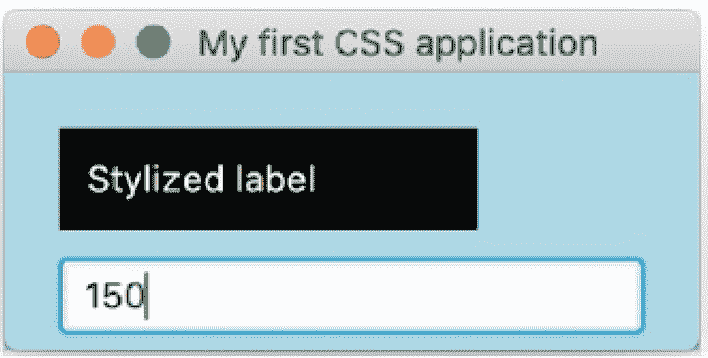
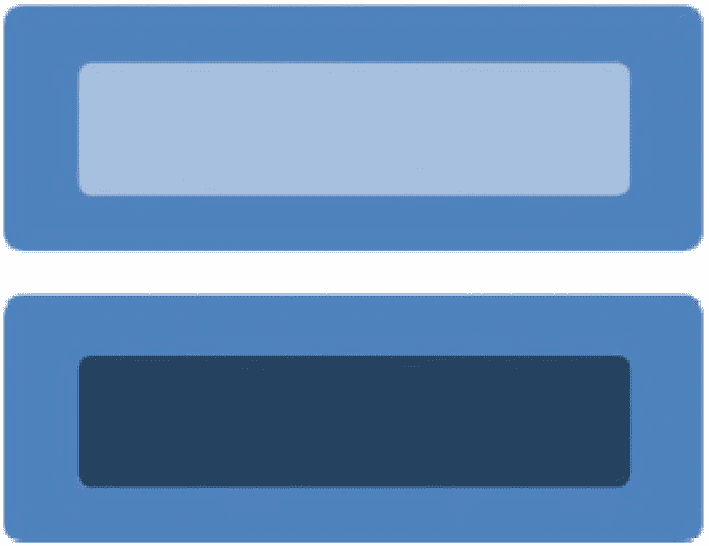
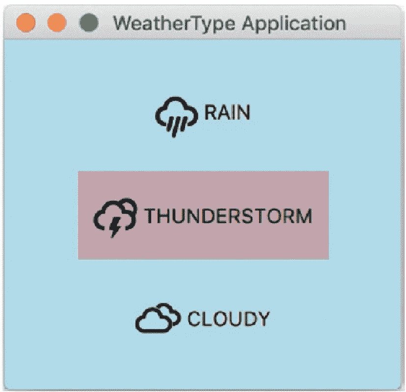

# 5.掌握视觉和 CSS 设计

尤金·雷日科夫写的

级联样式表或 CSS 是一种样式表语言，用于描述以 XML 及其方言(如 HTML、SVG 和 MathML)编写的文档的表示。它成为 web 开发中事实上的标准，用于描述 web 页面或 web 应用程序的所有表示方面。它是开放网络的核心语言之一，并根据 W3C 规范跨浏览器进行了标准化。

因此，这样一种成熟的表示语言作为 JavaFX 的一部分被实现来简化框架的所有表示方面的描述是很自然的，比如字体、颜色、填充、效果等等。

在本章中，我们将讨论以下主题:

*   JavaFX 中级联样式表的介绍

*   应用 CSS 技术

*   高级 CSS API

*   在 JavaFX 应用程序中使用 CSS 的好处

## 级联样式表介绍

在最基本的层面上，CSS 只有两个构建块，如图 [5-1](#Fig1) 所示:

属性:标识符，表示一个特征(字体、颜色等。)

值:每个属性都有一个值，该值指示由属性描述的特性必须如何改变。


图 5-1

属性和值，CSS 的构建块

属性和值的配对被称为 *CSS 声明*。CSS 声明存在于 *CSS 声明块*中，它们依次与**选择器**配对。成对的*选择器*和声明块产生 *CSS 规则集*(或简称为规则)。

CSS 的 JavaFX 方言对属性使用了前缀 **-fx** ，以清楚地将它们与 web 属性区分开来，并避免任何兼容性问题，因为许多属性共享相同的名称。这种样式表可能是这样的:

```java
/* resources/chapterX/introduction/styles.css */
.root {
   -fx-background-color: white;
   -fx-padding: 20px;
}
.label {
   -fx-background-color: black;
   -fx-text-fill: white;
   -fx-padding: 10px;
}

```

*。root* 选择器指的是场景的根，而。标签选择器引用标签类的一个实例。这再简单不过了——让我们在这个小应用程序中使用这个 CSS:

```java
// chapterX/introduction/HelloCSS.java
public void start(Stage primaryStage) {
   Label label = new Label("Stylized label");
   VBox root = new VBox(label);
   Scene scene = new Scene( root, 200, 100 );
   scene.getStylesheets().add(      getClass().getResource("styles.css").toExternalForm());
   primaryStage.setTitle("My first CSS application");
   primaryStage.setScene(scene);
   primaryStage.show();
}

```

前面代码的关键特性(以粗体突出显示)是动态加载样式表并将其应用于应用程序场景的部分。图 [5-2](#Fig2) 显示了没有样式的应用程序旁边的结果应用程序。

正如所料，场景背景颜色和填充是不同的。此外，除了填充之外，我们的标签还有不同的背景和文本颜色。


图 5-2

有 CSS 样式的应用程序(左)和没有 CSS 样式的应用程序(右)

JavaFX 17 CSS 规则的完整描述可以在 [`https://openjfx.io/javadoc/17/javafx.graphics/javafx/scene/doc-files/cssref.html`](https://openjfx.io/javadoc/17/javafx.graphics/javafx/scene/doc-files/cssref.html) 的 JavaFX CSS 参考指南中找到。JavaFX CSS 的所有方面都记录在那里。

样式被应用于场景图的节点，与 CSS 应用于 HTML DOM 元素的方式非常相似——它们首先被应用于父节点，然后被应用于其子节点。完成这项工作的代码经过了高度优化，只将 CSS 应用于需要这种更改的场景图分支。仅当节点是场景图形的一部分时，才会对其进行样式化，并且在以下条件下会重新应用样式:

*   更改为节点的伪类状态、样式类、ID、内联样式或父级。

*   样式表被添加到场景中或从场景中移除。

选择器负责将样式匹配到场景图节点，并且可以基于 JavaFX 类名、对象 ID 或者只是分配给特定节点的样式类。让我们看看每个用例。

### 基于类名的选择器

所有顶级 JavaFX 类都有它们的选择器对应物，命名约定是小写的类名，用连字符分隔单词。专用选择器*。根*是为场景的根节点保留的样式。下面是一个样式化`ListView`控件的例子:

```java
.list-view {
   -fx-background-color: lightgrey;
   -fx-pref-width: 250px;
}

```

如您所见，相同的基于连字符的方法也应用于属性。这里的`-fx-pref-width` CSS 属性被自动解释为`ListView`控件的`prefWidth`属性。

也可以通过使用节点的短类名作为选择器来寻址节点，但不推荐这样做。

### 基于自定义样式类的选择器

自定义样式类也可用于样式化场景图节点。在这种情况下，必须手动将样式类分配给节点。多个样式类可以分配给同一个节点:

```java
/* Stylesheet */
.big-bold-text {
   -fx-font-weight: bold;
   -fx-font-size: 20pt;
}
// JavaFX code
label.getStyleClass().add("big-bold-text");

```

### 基于对象 ID 的选择器

有时需要处理节点上的特定实例。这是通过使用#符号以与 web CSS 相同的方式完成的。ID 必须手动分配给需要特殊样式的节点实例，并且在场景图中必须是唯一的:

```java
/* Stylesheet */
#big-bold-label {
   -fx-font-weight: bold;
   -fx-font-size: 20pt;
}
// JavaFX code
label.setId("big-bold-label");

```

## 应用 CSS 样式

### 加载 CSS 样式表

样式表通常用作应用程序中的资源，因此 Java 资源 API 是加载它的最佳方式。最常见的方法是将资源添加到场景的“样式表”属性中:

```java
// best way of loading stylesheets
  scene.getStylesheets().add(
     getClass().getResource("styles.css").toExternalForm()
  );
  // the following works, but not recommended
  // since it is prone to problems with refactoring
  scene.getStylesheets().add( "package/styles.css");

```

前面的代码将样式表作为资源从当前类所在的文件夹中加载。

因为 CSS 资源是一个 URL，所以也可以加载远程 CSS 资源:

```java
// remote stylesheet
  scene.getStylesheets().add( "http://website/folder/styles.css" );

```

请注意，也可以对一个场景应用多个样式表。JavaFX CSS 引擎将在幕后组合这些样式。

在许多情况下，希望将全局样式表应用于整个应用程序，即同时应用于所有场景。这可以通过调用`Application.setUserAgentStyleSheet` API 来完成。传递 null 将使应用程序返回到默认样式表。目前，JavaFX 提供了两个默认的样式表，它们被定义为常量:

```java
// original stylesheet ( JavaFX 2 and before )
  Application.setUserAgentStylesheet( STYLESHEET_CASPIAN );
  // default stylesheet since JavaFX 8
  Application.setUserAgentStylesheet( STYLESHEET_MODENA );

```

从 JavaFX 8u20 开始，还可以为场景和`SubScene`设置用户代理样式表。这允许场景和子场景具有不同于平台默认值的样式。在`SubScene`上设置用户代理时，将使用其样式，而不是默认平台的样式或场景中设置的任何用户代理样式表。

### 将 CSS 样式应用于 JavaFX 节点

除了将样式表应用于整个场景，您还可以将它们应用于从`javafx.scene.Parent`继承的任何节点。该 API 与场景类的 API 完全相同。当您将 CSS 应用于特定节点时，它仅应用于节点本身及其子层次结构中的所有节点。

也可以使用它的`setStyle` API 来设计节点的样式。这种方法有它自己的优点和缺点，但是，在讨论它们之前，让我们看看它是如何工作的:

```java
  // chapterX/applying/ApplyingStyles.java
  public class ApplyingStyles extends Application {
    private Label label = new Label("Stylized label");
    // Simplistic implementation of numeric field
    private TextField widthField = new TextField("250") {
        @Override
        public void replaceText(int start, int end, String text) {
            if (text.matches("[0-9]*")) {
                super.replaceText(start, end, text);
            }
        }
        @Override
        public void replaceSelection(String replacement) {
            if (replacement.matches("[0-9]*")) {
                super.replaceSelection(replacement);
            }
        }
    };
    private void updateLabelStyle() {
        label.setStyle(
                "-fx-background-color: black;" +
                "-fx-text-fill: white;" +
                "-fx-padding: 10;" +
                "-fx-pref-width: " + widthField.getText() + "px;"
        );
    }
    @Override
    public void start(Stage primaryStage) {
        updateLabelStyle();
        widthField.setOnAction( e -> updateLabelStyle());
        VBox root = new VBox(10, label, widthField);
        root.setStyle(
            "-fx-background-color: lightblue;" +
            "-fx-padding: 20px;");
        Scene scene = new Scene( root, 250, 100 );
        primaryStage.setTitle("My first CSS application");
        primaryStage.setScene(scene);
        primaryStage.show();
    }
}

```

在前面的代码中，样式直接应用于根控件和标签控件。在根的例子中，我们应用了静态样式，也就是说，根总是浅蓝色的，填充 20 个像素。对于标签，我们选择应用动态样式，其首选宽度来自我们输入到`widthField`中的值。编辑完数字后，我们一按回车键，它就会改变。图 [5-3](#Fig3) 显示了更新后的用户界面。



图 5-3

使用 setStyle 进行动态样式更新

只有在您的样式必须非常动态的情况下，才推荐使用这种方法，通常是基于您自己的 UI 更改，就像前面的例子一样。它对于快速原型制作也非常有用。

在所有其他情况下，拥有外部 CSS 样式是最佳选择，因为它们不需要更改代码，因此不需要重新编译，并且可以在外部编辑。它们还具有更好的性能特征。

很多情况下，可以不使用`setStyle`，而是调用相应的 API 方法。这是获得最佳性能的地方，因为不涉及 CSS 处理。下面是我们如何替换前面的动态 CSS 属性:

```java
// CSS way
  label.setStyle("-fx-pref-width: 500px");
// JavaFX API way
  label.setPrefWidth(500);

```

CSS 样式也可以以类似的方式应用于 FXML。任何组件都可以通过以下三种方式之一来设置样式:

*   通过分配外部样式表中定义的样式类

*   通过直接使用 style 属性设置样式

*   通过分配样式表

```java
  <!-- assign a style class -->
  <Label styleClass="fancy-label" />
  <!-- assign a style directly -->
  <Label style="-fx-pref-width: 500px" />
  <!-- assign a stylesheet -->
  <Label stylesheets="@styles.css" />

```

您刚刚看到了几种将样式应用于 JavaFX 节点的方法。尽管您可以交替应用它们，但 JavaFX 按以下顺序为它们定义了优先级规则:

1.  应用用户代理样式表。

2.  应用由 JavaFX API 调用设置的值。

3.  应用由场景或节点样式表属性设置的样式。

4.  应用节点的样式属性中的样式。

如您所见，节点的样式将覆盖任何以前的样式设置。这是一个常见的混淆来源，但是规则很清楚——如果您使用`setStyle` API 设置您的样式，JavaFX 将忽略所有其他方法。

## 高级 CSS 技术

### 使用后代选择器

与 web CSS 类似，JavaFX CSS 引擎支持选择器将样式与场景图形节点相匹配。由于 CSS 选择器是一个广为人知的主题，我们将简单地展示几个在 JavaFX CSS 中如何使用它们的例子:

```java
/* all labels */
.label,
.text {
   -fx-font-weight: bold;
   -fx-font-size: 20pt;
}
/* all children of #big-bold */
#big-bold .label {
   -fx-font-weight: bold;
   -fx-font-size: 20pt;
}
/* only direct children of #big-bold */
#big-bold > .label {
   -fx-font-weight: bold;
   -fx-font-size: 20pt;
}

```

### 使用伪类

JavaFX CSS 还支持伪类，这允许您定义与 JavaFX 节点的不同状态相对应的样式。JavaFX 没有实现 CSS 标准中指定的所有伪类。相反，每个节点定义一组支持的伪类，可以在 JavaFX CSS 参考指南中找到。

例如，Button 支持以下伪类:

<colgroup><col class="tcol1 align-left"> <col class="tcol2 align-left"></colgroup> 
| **全副武装** | 武装变量为真时适用。 |
| **取消** | 如果此按钮接收到 VK_ESC，且事件未被消费，则应用此选项。 |
| **默认** | 如果该事件未被消费，则在该按钮接收到 VK _ 回车时应用。 |

下面是我们如何利用它们:

```java
/* all buttons will have a font size of 1.1 em */
.button {
   -fx-font-size: 1.1em;
}
/* default buttons will have bigger font size and color*/
.button:default {
   -fx-font-size: 1.2em;
   -fx-font-fill: blue;
}

```

### 使用导入

从 JavaFX 8u20 开始，部分支持 CSS @import 规则。目前，只允许无条件导入(不支持媒体类型限定符)。此外，导入语句应该出现在样式表的顶部。

这个特性极大地简化了复杂风格的开发，允许关注点的分离。

可以从本地或远程样式表导入样式:

```java
@import "styles.css"
@import url ("http://website/folder/styles.css")

```

### 样式表中的字体加载

从 JavaFX 8 开始，还提供了对@font-face 规则的部分支持，它允许自定义字体加载:

```java
@font-face {
   font-family: 'sample';
   font-style: normal;
   font-weight: normal;
   src: local('sample'),    url('http://font.samples/resources/sample.ttf';) format('truetype');
}

```

请注意，也支持使用 URL 的远程字体加载。

font-family 属性定义了名称，现在可以在整个样式表中使用。

### 重用样式

为了实现更高的灵活性，JavaFX CSS 支持常量——一种非标准的 CSS 特性。目前，只有颜色可以被定义为常量。除了许多预定义的命名颜色之外，还可以定义自定义常量，这在《参考指南》中称为“查找颜色”使用查找到的颜色，您可以引用在当前节点或其任何父节点上设置的任何其他颜色属性。这个强大的功能允许在应用程序中使用通用的颜色主题。查找到的颜色是“实时”的，并对任何样式更改做出反应，因为它们在应用之前不会被查找到。

这是一个很棒的功能的简单例子:

```java
.root { -my-button-background: #f00 }
.button { -fx-background-color: -my-button-background }

```

还有另一种在样式表的其他地方重用样式的方法，那就是使用 inherit 关键字。它只是允许子元素重用其父元素中定义的样式:

```java
.root {
   -fx-font-fill: green;
.button {
   -fx-font-size: 1.1em;
}
.button:default {
   -fx-font-size: 1.2em;
   -fx-font-fill: inherited;
}

```

在前面的示例中，默认按钮将从根元素继承颜色。

### 使用高级颜色定义

JavaFX 指定了多种方法来定义绘制值。这些例子如下:

*   线性梯度

*   径向梯度

*   可选重复的图像模式

*   纯色

### 使用线性渐变

线性渐变语法定义如下:

```java
linear-gradient( [ [from <point> to <point>] | [ to <side-or-corner>], ]? [ [ repeat | reflect ], ]? <color-stop>[, <color-stop>]+)
where <side-or-corner> = [left | right] || [top | bottom]

```

线性渐变创建一种渐变，它穿过“从”点和“到”点之间的直线上的所有停止颜色。如果点是百分比，它们是相对于被填充区域的大小。百分比和长度不能混合在一个渐变中。

如果既没有重复也没有反射，那么`CycleMethod`默认为“NO_CYCLE”

如果既没有给出【从<point>到<point>也没有给出【到<side-or-corner>，那么渐变方向默认为“到底”停止符合 W3C 颜色停止语法，并被相应地规范化。下面是一些例子:</side-or-corner></point></point>

```java
/*
  *  gradient from top left to bottom right
  * with yellow at the top left corner and red in the bottom right
  */
 -fx-text-fill: linear-gradient(to bottom right, yellow, red);
/* same as above but using percentages */
-fx-text-fill: linear-gradient(from 0% 0% to 100% 100%, yellow 0%, green 100%);
/*
  * create a 50px high bar at the top with a 3 color gradient
  * white with underneath for the rest of the filled area.
/*
-fx-text-fill: linear-gradient(from 0px 0px to 0px 50px, gray, darkgray 50%, dimgray 99%, white);

```

### 使用径向渐变

径向渐变语法定义如下:

```java
radial-gradient([ focus-angle <angle>, ]? [ focus-distance <percentage>, ]? [ center <point>, ]? radius [ <length> | <percentage> ] [ [ repeat | reflect ], ]? <color-stop>[, <color-stop>]+)

```

径向渐变创建从中心点向半径向外辐射的所有停止颜色的渐变。如果未给出中心点，则中心默认为(0，0)。百分比值是相对于填充区域的大小而言的。百分比和长度大小不能在单个渐变函数中混合使用。

如果既没有重复也没有反射，那么`CycleMethod`默认为“NO_CYCLE”

停止符合 W3C 颜色停止语法，并相应地进行规范化:

```java
-fx-text-fill: radial-gradient(radius 100%, red, darkgray, black);
-fx-text-fill: radial-gradient(focus-angle 45deg, focus-distance 20%, center 25% 25%, radius 50%, reflect, gray, darkgray 75%, dimgray);

```

### 使用图像模式

这提供了将图像图案用作颜料的能力。以下是图像模式的语法:

```java
image-pattern(<string>, [<size>, <size>, <size>, <size>[, <boolean>]?]?)

```

参数按顺序定义如下:

<colgroup><col class="tcol1 align-left"> <col class="tcol2 align-left"></colgroup> 
| **<弦>** | 图像的 URL。 |
| **<大小>** | 锚定矩形的 *x* 原点。 |
| **<大小>** | 锚定矩形的 *y* 原点。 |
| **<大小>** | 锚定矩形的宽度。 |
| **<大小>** | 锚定矩形的高度。 |
| **<布林>** | 比例标志，指示开始和结束位置是比例的还是绝对的。 |

下面是一些使用图像模式的例子:

```java
-fx-text-fill: image-pattern("img/wood.png");
-fx-text-fill: image-pattern("img/wood.png", 20%, 20%, 80%, 80%);
-fx-text-fill: image-pattern("img/wood.png", 20%, 20%, 80%, 80%, true);
-fx-text-fill: image-pattern("img/wood.png", 20, 20, 80, 80, false);

```

图像图案也可用于生成基于平铺图像的填充，这相当于

```java
image-pattern("img/wood.png", 0, 0, imageWith, imageHeight, false);

```

平铺或重复图像模式的语法是

```java
repeating-image-pattern(<string>)

```

唯一的参数是图像的 URI。下面是一个重复图像模式的示例:

```java
repeating-image-pattern("img/wood.png")

```

### 使用 RGB 颜色定义

RGB 颜色模型用于数字颜色应用。它有许多不同的支持形式:

```java
#<digit><digit><digit>
| #<digit><digit><digit><digit><digit><digit>
| rgb( <integer> , <integer> , <integer> )
| rgb( <integer> %, <integer>% , <integer>% )
| rgba( <integer> , <integer> , <integer> , <number> )
| rgba( <integer>% , <integer>% , <integer> %, <number> )

```

以下是设置标签文本填充的不同 RGB 格式的示例:

```java
.label { -fx-text-fill: #f00              } /* #rgb */
.label { -fx-text-fill: #ff0000           } /* #rrggbb */
.label { -fx-text-fill: rgb(255,0,0)      }
.label { -fx-text-fill: rgb(100%, 0%, 0%) }
.label { -fx-text-fill: rgba(255,0,0,1)   }

```

如您所见，有三种类型的 RGB 格式:

<colgroup><col class="tcol1 align-left"> <col class="tcol2 align-left"></colgroup> 
| **RGB 十六进制** | 十六进制表示法中 RGB 值的格式是“#”后面紧跟三个或六个十六进制字符。通过复制数字，而不是添加零，三位数 RGB 表示法(#rgb)被转换为六位数形式(#rrggbb)。例如，#fb0 扩展为#ffbb00。这确保了白色(#ffffff)可以用短符号(#fff)来指定，并且消除了对显示器颜色深度的任何依赖性。 |
| **RGB 十进制或百分比** | 函数表示法中 rgb 值的格式是“RGB(“后跟一个由三个数值(三个十进制整数值或三个百分比值)组成的逗号分隔列表，后跟”)。”整数值 255 对应于 100%和十六进制记法中的 F 或 FF:RGB(255，255，255) = rgb(100%，100%，100%) = #FFF。数值周围允许有空格字符。 |
| **RGB + Alpha** | 这是 RGB 颜色模型的扩展，包括指定颜色不透明度的“alpha”值。这是通过 rgba(...)接受第四个参数，即 alpha 值。alpha 值必须是介于 0.0(表示完全透明)和 1.0(完全不透明)之间的数字。与 rgb()函数一样，红色、绿色和蓝色值可以是十进制整数或百分比。 |

以下示例指定了相同的颜色:

```java
.label { -fx-text-fill: rgb(255,0,0) } /* integer range 0 — 255*/
.label { -fx-text-fill: rgba(255,0,0,1) /* the same, with explicit opacity of 1 */
.label { -fx-text-fill: rgb(100%,0%,0%) } /* float range 0.0% — 100.0% */
.label { -fx-text-fill: rgba(100%,0%,0%,1) } /* the same, with explicit opacity of 1 */

```

### 使用 HSB 颜色定义

也可以使用 HSB(有时称为 HSV)颜色模型来指定颜色，如下所示:

```java
hsb( <number> , <number>% , <number>% ) |
hsba( <number> , <number>% , <number>% , <number> )

```

第一个数字是色调，范围是 0-360 度。

第二个数字是饱和度，百分比在 0-100%之间。

第三个数字是亮度，也是 0-100%范围内的百分比。

`hsba(...)`表单在末尾接受第四个参数，这是一个在 0.0–1.0 范围内的 alpha 值，分别指定完全透明到完全不透明。

### 使用颜色功能

JavaFX CSS 引擎为一些颜色计算函数提供支持。这些函数在应用颜色样式的同时从输入颜色计算新颜色。这使得一个颜色主题可以使用一个单一的基础颜色和其他从它计算出来的变体来指定。有两种颜色功能:`derive`和`ladder`。

```java
derive( <color> , <number>% )

```

derive 函数获取一种颜色，并计算该颜色的更亮或更暗的版本。第二个参数是亮度偏移，表示派生颜色应该有多亮或多暗。正百分比表示较亮的颜色，负百分比表示较暗的颜色。值–100%表示全黑，0%表示亮度没有变化，100%表示全白:

```java
ladder(<color> , <color-stop> [, <color-stop>]+)

```

梯形函数在颜色之间插值。效果就好像使用提供的光圈创建了一个渐变，然后使用提供的<color>的亮度来索引该渐变中的颜色值。亮度为 0%时，使用渐变 0.0 端的颜色；亮度为 100%时，使用渐变 1.0 端的颜色；在 50%亮度时，使用渐变中点 0.5 处的颜色。请注意，实际上没有渲染任何渐变。这仅仅是产生单一颜色的插值函数。</color>

停止符合 W3C 颜色停止语法，并被相应地规范化。

例如，如果希望文本的颜色根据背景的亮度而为黑色或白色，可以使用下面的方法:

```java
background: white;
-fx-text-fill: ladder(background, white 49%, black 50%);

```

得到的`-fx-text-fill`值将是黑色的，因为背景(白色)的亮度为 100%，渐变上 1.0 处的颜色为黑色。如果我们将背景颜色改为黑色或深灰色，亮度将小于 50%，给出白色的`-fx-text-fill`值。

### 使用效果定义

JavaFX CSS 目前支持来自 JavaFX 平台的`DropShadow`和`InnerShadow`效果。关于各种效果参数的语义的更多细节，请参见`javafx.scene.effect`中的类文档。

#### 阴影

DropShadow 是一种高级效果，用于渲染其背后给定内容的阴影:

<colgroup><col class="tcol1 align-left"> <col class="tcol2 align-left"></colgroup> 
| **模糊型** | [高斯&#124;一通道盒&#124;三通道盒&#124;二通道盒]。 |
| **颜色** | 阴影颜色。 |
| **号** | 阴影模糊内核的半径，在范围[0.0...127.0]，典型值 10。 |
| **号** | 阴影的蔓延。扩散是源材料贡献为 100%的半径部分。半径的剩余部分将具有由模糊内核控制的贡献。扩散为 0.0 将导致阴影的分布完全由模糊算法决定。“扩散”为 1.0 将导致源材质不透明度向外的实体增长到半径的极限，在半径处非常明显地截止到透明度。值应在范围[0.0...1.0]. |
| **号** | 水平方向上的阴影偏移量，以像素为单位。 |
| **号** | 垂直方向上的阴影偏移量，以像素为单位。 |

```java
dropshadow( <blur-type> , <color> , <number> , <number> , <number> , <number> )

```

#### 内心阴影

内部阴影是一种高级效果，在给定内容的边缘内渲染阴影:

<colgroup><col class="tcol1 align-left"> <col class="tcol2 align-left"></colgroup> 
| **模糊型** | [高斯&#124;一通道盒&#124;三通道盒&#124;二通道盒]。 |
| **颜色** | 阴影颜色。 |
| **号** | 阴影模糊内核的半径，在范围[0.0...127.0]，典型值 10。 |
| **号** | 阴影的窒息。扼流圈是源材料贡献为 100%的半径部分。半径的剩余部分将具有由模糊内核控制的贡献。阻塞值为 0.0 将导致阴影的分布完全由模糊算法决定。扼流值为 1.0 将导致阴影从边缘到半径的极限向内增长，并在半径内对透明度有一个非常明显的截止。值应在范围[0.0...1.0]. |
| **号** | 水平方向上的阴影偏移量，以像素为单位。 |
| **号** | 垂直方向上的阴影偏移量，以像素为单位。 |

```java
innershadow( <blur-type> , <color> , <number> , <number> , <number> , <number> )

```

### 有用的提示和技巧

#### 研究 Modena 样式表

如前所述，Modena 是 JavaFX 8 中引入的默认用户代理样式表。

它包含了大量有用的定义，任何希望在 JavaFX 应用程序中使用 CSS 样式的人都应该学习一下。

#### 根据摩德纳风格定义主题

Modena 样式表颜色定义基于几个属性，这些属性可以在它的根部分找到。最重要的是`-fx-base`，它是所有对象的基础颜色:

```java
.root {
    /**********************************************************************
     *                                    *
     * The main color palette from which the rest of the colors are derived.   *
     *                                    *
     *********************************************************************/
    /* A light grey that is the base color for objects.  Instead of using
     * -fx-base directly, the sections in this file will typically use -fx-color.
     */
    -fx-base: #ececec;
    /* A very light grey used for the background of windows.  See also
     * -fx-text-background-color, which should be used as the -fx-text-fill
     * value for text painted on top of backgrounds colored with -fx-background.
     */
    -fx-background: derive(-fx-base,26.4%);
    /* Used for the inside of text boxes, password boxes, lists, trees, and
     * tables.  See also -fx-text-inner-color, which should be used as the
     * -fx-text-fill value for text painted on top of backgrounds colored
     * with -fx-control-inner-background.
     */
    -fx-control-inner-background: derive(-fx-base,80%);
    /* Version of -fx-control-inner-background for alternative rows */
    -fx-control-inner-background-alt: derive(-fx-control-inner-background,-2%);
    ....
}

```

这使我们可以轻松地重新定义样式表的整体颜色主题。例如，创建一个主题，它与著名的 IntelliJ IDEA“Darcula”主题非常相似:

```java
.root {
    -fx-base: rgba(60, 63, 65, 255);
}

```

它不仅设置了所有适当的对象颜色，还正确显示了文本颜色，因为 Modena 样式表使用梯形方法来计算适当的对比色。

#### 使用 CSS 定义图标

我们不需要使用 Java 代码来加载和分配图像，而是可以使用 CSS 定义来更简单地完成。让我们看一下标签的例子，它的样式类为“image-label”:

```java
.image-label {
  -fx-graphic: url("icon.jpg");
}

```

使用 URL，我们只需将适当的资源分配给-fx-graphic 属性。这从我们的应用程序中删除了不必要的样式代码，同时在样式和代码之间给出了一个清晰的分离。

#### 通过使用颜色常量实现 CSS 的可重用性

如前所述，JavaFX CSS 引擎支持一个非标准特性，称为颜色常量。这些常量只能在样式表的根部分定义，但是可以在整个应用程序中重用。这不仅提高了可重用性，而且给你的应用程序一个漂亮一致的外观。

#### 使用透明颜色

在许多情况下，应用程序的设计要求使用特定的颜色，并完全控制背景色。例如，您正在设计自定义控件的样式，但是不知道将在哪里使用它。您希望将控件的颜色与任何背景完美融合。颜色不透明的救援！

让我们看看这种技术如何让我们混合颜色。



图 5-4

使用不透明度混合颜色

在图 [5-4](#Fig4) 中，你可以看到透明色是如何与几乎任何背景完美融合的。相比之下，100%不透明度的颜色不会混合，而且看起来常常不协调。

为了欣赏这样的设计，让我们来看看 Trello 板。


图 5-5

Trello Boards 用户界面利用高级 CSS 样式

在图 [5-5](#Fig5) 中，你可以看到按钮、搜索栏，甚至是面板本身是如何与用户选择的任何背景完美融合的。

## 高级 CSS API

可以用新的定制样式类、属性和伪类来扩展标准 JavaFX CSS。这些技术在开发新的自定义控件时特别有用，并且需要对 CSS API 有透彻的理解。

为了说明 JavaFX CSS API 的特性，我们将创建一个简单的自定义控件。这个控件将代表天气类型，显示相关的图标和文本。为了简单起见，我们将从标准的 JavaFX 标签扩展这个控件。此外，我们还将添加一个自定义的伪样式来表示一种危险的天气类型，这将允许我们以不同的方式对这些类型进行样式化。

首先，我们定义枚举，代表我们关心的天气类型。因为我们将使用名为“常规天气图标”的图标字体来显示图标，所以我们将把相关的字体字符传递到每个枚举中。一个额外的枚举参数将允许我们定义哪种天气是危险的:

```java
// chapterX/cssapi/WeatherType.java
import javafx.scene.text.Text;

public enum WeatherType {

    SUNNY("\uf00d", false),
    CLOUDY("\uf013", false),
    RAIN("\uf019", false),
    THUNDERSTORM("\uf033", true);
    private final boolean dangerous;
    private final String c;
    WeatherType(String c, boolean dangerous) {
        this.c = c;
        this.dangerous = dangerous;
    }
    public boolean isDangerous() {
        return dangerous;
    }
    Text buildGraphic() {
        Text text = new Text(c);
        text.setStyle("-fx-font-family: 'Weather Icons Regular'; -fx-font-size: 25;");
        return text;
    }
}

```

图标将由文本控件表示。我们图标的字符将被设置为文本。我们还将设计它的样式，确保它使用合适的字体系列和大小。方法`buildGraphic`将为特定的枚举构建文本控件。

是时候构建我们的自定义控件了！

首先，我们要定义表示控件的样式类、天气属性和新伪类的常量:

```java
private static final String STYLE_CLASS       = "weather-icon";
private static final String WEATHER_PROP_NAME = "-fx-weather";
private static final String PSEUDO_CLASS_NAME = "dangerous";

```

接下来，我们将定义我们的 styleable 属性。这是一种特殊类型的属性，可以从 CSS 中设置样式。该属性将采用我们的 WeatherType 的值，并将相应地更改我们控件的图标和文本:

```java
private StyleableObjectProperty<WeatherType> weatherTypeProperty = new StyleableObjectProperty<>(WeatherType.SUNNY) {
        @Override
        public CssMetaData<? extends Styleable, WeatherType> getCssMetaData() {
            return WEATHER_TYPE_METADATA;
        }
        @Override
        public Object getBean() {
            return WeatherIcon.this;
        }
        @Override
        public String getName() {
            return WEATHER_PROP_NAME;
        }
        @Override
        protected void invalidated() {
            WeatherType weatherType = get();
            dangerous.set( weatherType.isDangerous());
            setGraphic(weatherType.buildGraphic());
            setText(get().toString());
        }
    };

```

因为我们的属性值是枚举类型，所以我们使用`StyleableObjectProperty<WeatherType>`。invalidate 方法的实现定义了当我们的属性改变时会发生什么。这里我们使用新实例化的天气类型来设置控件的图形和文本。我们还在这里设置了伪类，后面会讲到。

该属性还返回一个名为`WEATHER_TYPE_METADATA`的东西。在 JavaFX 中，`CssMetaData`实例提供关于 CSS 样式和允许 CSS 设置属性值的钩子的信息。它封装了 CSS 属性名称、CSS 值转换成的类型以及属性的默认值。

`CssMetaData`是可以在. css 文件中用语法表示的值和`StyleableProperty`之间的桥梁。CSS 元数据和`StyleableProperty`之间是一一对应的。通常，一个节点的`CssMetaData`将包括其祖先的`CssMetaData`。

为了大大减少实现 StyleableProperty 和`CssMetaData`所需的样板代码量，我们将使用`StyledPropertyFactory`类。这个类定义了很多方法来创建`StyleableProperty`的实例和相应的`CssMetaData`:

```java
private static final StyleablePropertyFactory<WeatherIcon> STYLEABLE_PROPERTY_FACTORY = new
             StyleablePropertyFactory<>(Region.getClassCssMetaData());
    private static CssMetaData<WeatherIcon, WeatherType> WEATHER_TYPE_METADATA =
            STYLEABLE_PROPERTY_FACTORY.createEnumCssMetaData(
                    WeatherType.class, WEATHER_PROP_NAME, x -> x.weatherTypeProperty);
@Override
    public List<CssMetaData<? extends Styleable, ?>> getControlCss
    MetaData() {
        return List.of(WEATHER_TYPE_METADATA);
    }

```

我们还实现了`getControlCssMetaData`方法，该方法允许 JavaFX CSS 引擎通过返回控件样式属性列表来了解控件的 CSS 元数据的所有信息。

剩下的就是实现我们的伪类了。由于我们的控制中只有两种状态，危险和正常，我们可以将伪类实现为布尔属性。每当属性改变时，我们调用一个特殊的方法 pseudoClassStateChanged，让 CSS 引擎知道状态已经改变:

```java
private BooleanProperty dangerous = new BooleanPropertyBase(false) {
        public void invalidated() {
            pseudoClassStateChanged(DANGEROUS_PSEUDO_CLASS, get());
        }
        @Override public Object getBean() {
            return WeatherIcon.this;
        }
        @Override public String getName() {
            return PSEUDO_CLASS_NAME;
        }
    };

```

现在只剩下几个整容的变化了。让我们看看我们控制的完整状态:

```java
// chapterX/cssapi/WeatherIcon.java
public class WeatherIcon extends Label {
    private static final String STYLE_CLASS       = "weather-icon";
    private static final String WEATHER_PROP_NAME = "-fx-weather";
    private static final String PSEUDO_CLASS_NAME = "dangerous";

    private static PseudoClass DANGEROUS_PSEUDO_CLASS = PseudoClass.getPseudoClass(PSEUDO_CLASS_NAME);

    private static final StyleablePropertyFactory<WeatherIcon> STYLEABLE_PROPERTY_FACTORY =
            new StyleablePropertyFactory<>(Region.getClassCssMetaData());

    private static CssMetaData<WeatherIcon, WeatherType> WEATHER_TYPE_METADATA =
            STYLEABLE_PROPERTY_FACTORY.createEnumCssMetaData(
                    WeatherType.class, WEATHER_PROP_NAME, x -> x.weatherTypeProperty);
    public WeatherIcon() {
        getStyleClass().setAll(STYLE_CLASS);
    }

    public WeatherIcon(WeatherType weatherType ) {
        this();
        setWeather( weatherType);
    }
    private BooleanProperty dangerous = new BooleanPropertyBase(false) {
        public void invalidated() {
            pseudoClassStateChanged(DANGEROUS_PSEUDO_CLASS, get());
        }
        @Override public Object getBean() {
            return WeatherIcon.this;
        }
        @Override public String getName() {
            return PSEUDO_CLASS_NAME;
        }
    };

    private StyleableObjectProperty<WeatherType> weatherTypeProperty = new StyleableObjectProperty<>(WeatherType.SUNNY) {

        @Override
        public CssMetaData<? extends Styleable, WeatherType> getCssMetaData() {
            return WEATHER_TYPE_METADATA;
        }
        @Override
        public Object getBean() {
            return WeatherIcon.this;
        }
        @Override
        public String getName() {
            return WEATHER_PROP_NAME;
        }
        @Override
        protected void invalidated() {
            WeatherType weatherType = get();
            dangerous.set( weatherType.isDangerous());
            setGraphic(weatherType.buildGraphic());
            setText(get().toString());
        }
    };
    @Override

    public List<CssMetaData<? extends Styleable, ?>> getControlCss
    MetaData() {
        return List.of(WEATHER_TYPE_METADATA);
    }
    public WeatherType weatherProperty() {
        return weatherTypeProperty.get();
    }
    public void setWeather(WeatherType weather) {
        this.weatherTypeProperty.set(weather);
    }
    public WeatherType getWeather() {
        return weatherTypeProperty.get();
    }
}

```

让我们通过创建一个小的应用程序来测试这个控件，这个应用程序在各种不同的状态下创建这个控件，它使用 CSS 和 Java 代码来设置我们的天气类型。

首先，让我们定义我们的 CSS:

*   我们首先加载我们的字体。JavaFX 要求字体资源与 CSS 文件位于同一位置。

*   定义根样式。

*   定义两个自定义样式类。雷雨和雨。他们相应地设置天气类型。

*   定义两种状态的样式:正常和危险。危险状态以红色背景显示。

```java
/* resources/chapterX/cssapi/styles.css */
@font-face {
    font-family: 'Weather Icons Regular';
    src: url('weathericons-regular-webfont.ttf');
}
.root {
    -fx-background-color: lightblue;
    -fx-padding: 20px;
}
.thunderstorm {
    -fx-weather: THUNDERSTORM;
}
.rain {
    -fx-weather: RAIN;
}
.weather-icon {
    -fx-graphic-text-gap: 30;
    -fx-padding: 10;
}
.weather-icon:dangerous {
    -fx-background-color: rgba(255, 0, 0, 0.25);
}

```

我们的测试应用程序几乎是微不足道的。我们使用 CSS 样式类或代码创建了几个设置天气类型的 WeatherIcon 控件。然后，我们使用垂直布局(VBox)呈现它们:

```java
/* chapterX/cssapi/WeatherApp.java */
public class WeatherApp extends Application {
    @Override
    public void start(Stage primaryStage)  {
        WeatherIcon rain = new WeatherIcon();
        rain.getStyleClass().add("rain");
        WeatherIcon thunderstorm = new WeatherIcon();
        thunderstorm.getStyleClass().add("thunderstorm");
        WeatherIcon clouds = new WeatherIcon( WeatherType.CLOUDY);
        VBox root = new VBox(10, rain, thunderstorm, clouds);
        root.setAlignment(Pos.CENTER);
        Scene scene = new Scene( root);
        scene.getStylesheets().add( getClass().getResource("styles.css").toExternalForm());
        primaryStage.setTitle("WeatherType Application");
        primaryStage.setScene(scene);
        primaryStage.show();
    }
}

```

如图 [5-6](#Fig6) 所示，“危险”雷暴天气以红色背景突出显示，而其余天气图标则没有。



图 5-6

使用伪类进行动态样式更新的 WeatherType 应用程序

在这个例子中，我们选择天气类型一改变，就自动改变伪类。将伪类属性公开为 public 是非常可能的，这将为我们提供一种独立于天气类型来更改它的方法。

我们已经展示了一种非常强大的方法来扩展 JavaFX CSS，使用附加的样式类、可样式化的属性和伪类来表示使用高级 JavaFX CSS APIs 的附加组件状态。

## JavaFX 应用程序中的 CSS:摘要

总的来说，能够使用 CSS 样式表设计 UI 是一个巨大的飞跃。它带来了以下好处:

*   **职责分工**

代码和样式是明确分开的，可以独立更新。

*   **更高的设计一致性**

CSS 样式表可以很容易地被重用，给开发者更大的设计一致性。

*   **轻量级代码**

因为代码与样式是分离的，所以它不会被只做样式的部分重载，这提供了更轻量级的代码。

*   **快速改变造型的能力**

只需在样式表中切换几个定义就可以改变样式，而不需要修改任何代码。还可以基于硬件平台或操作系统轻松提供完全不同的风格。