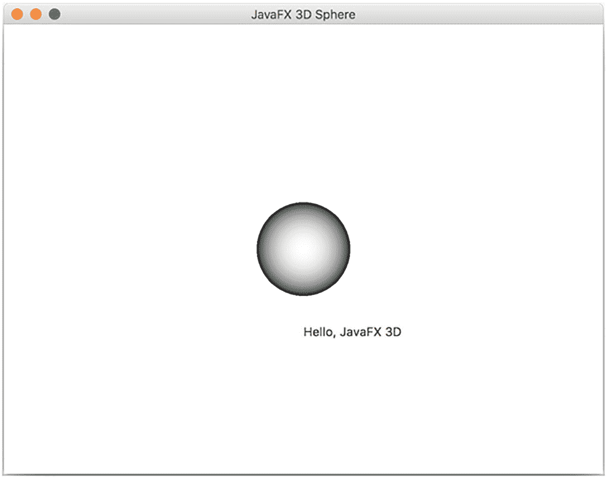
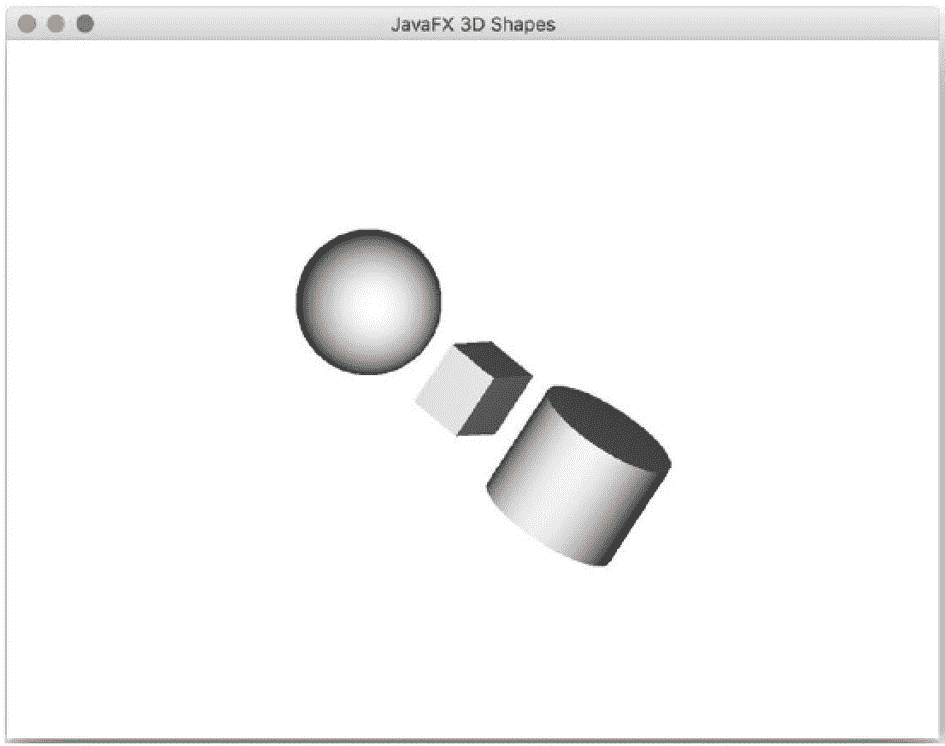
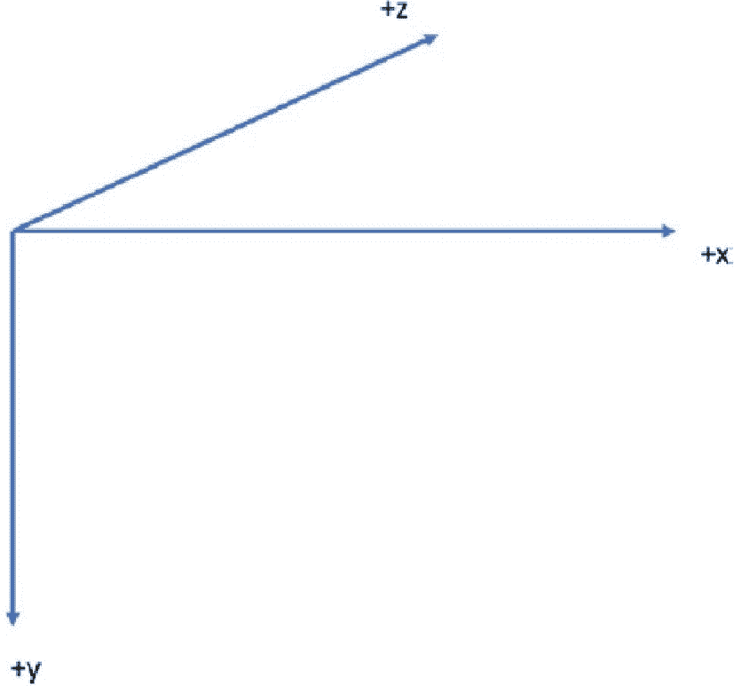
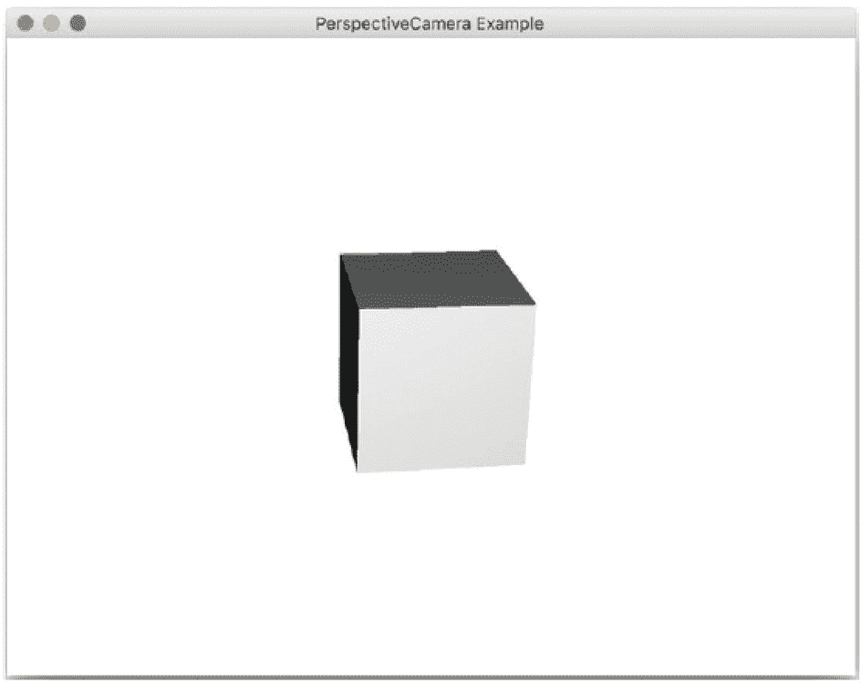
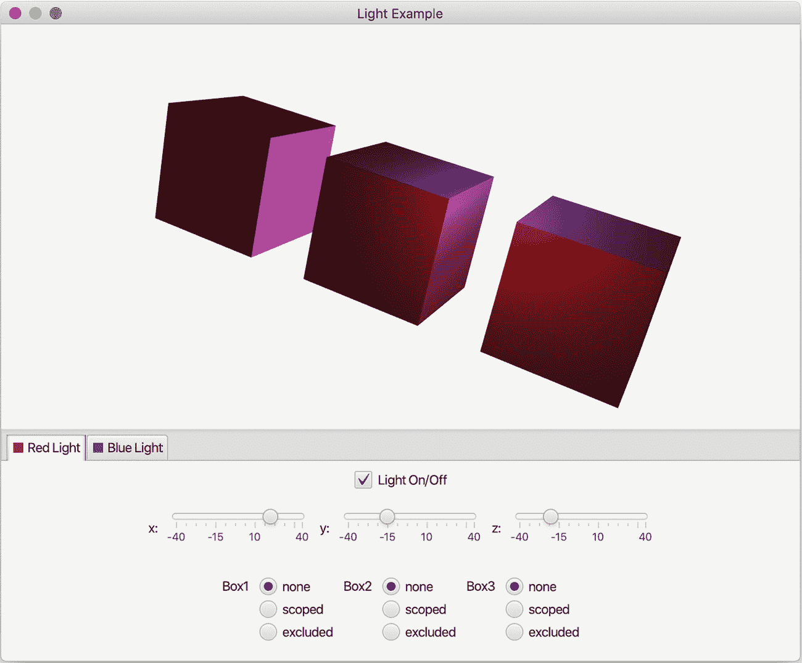
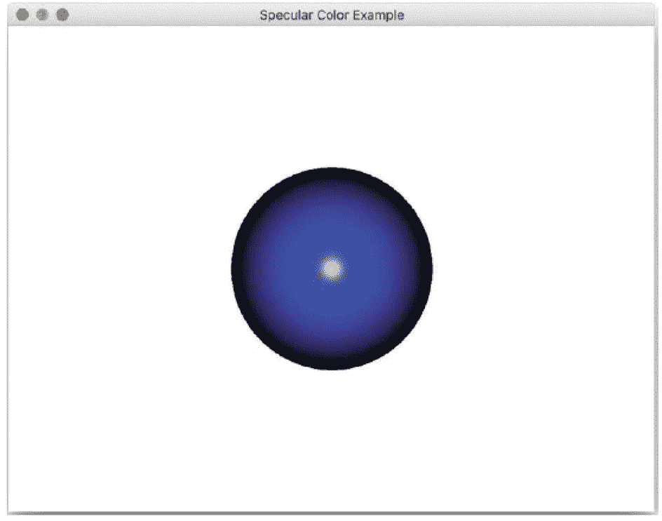
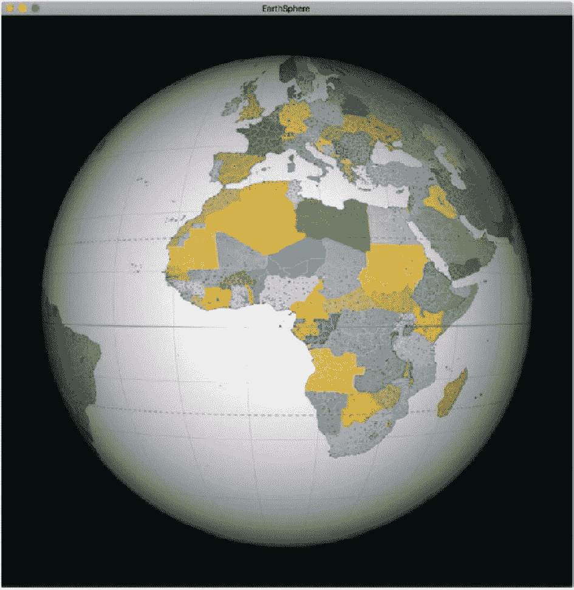
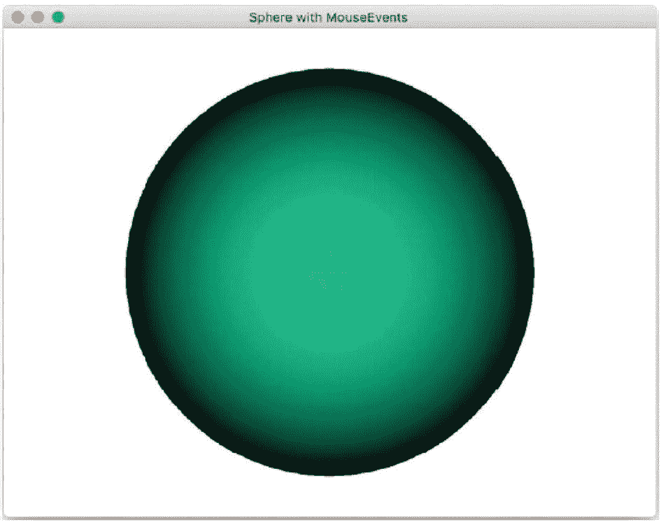
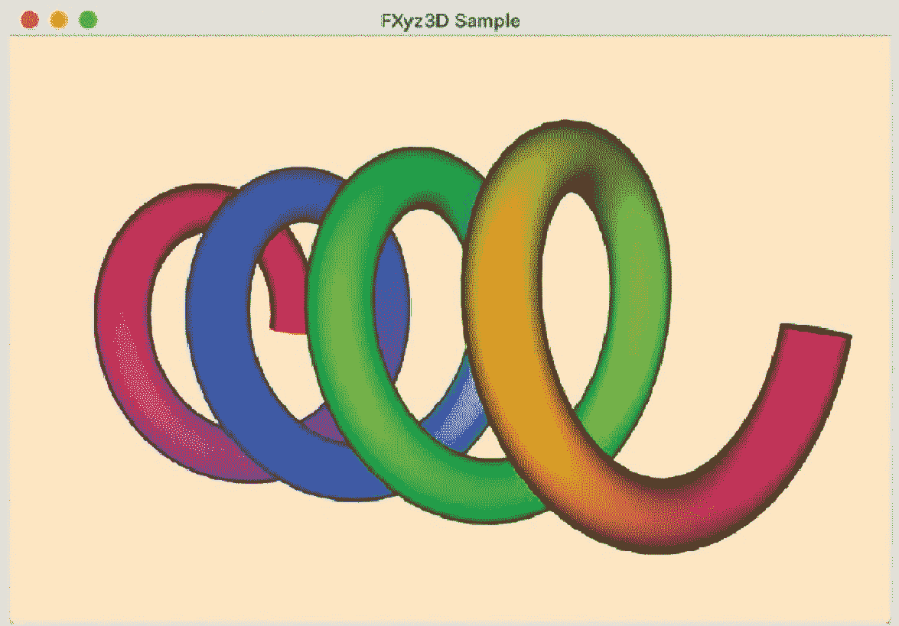

# 8.JavaFX 3D

作者:约翰·沃斯和何塞·佩雷达

现代 UI 平台应该能够在二维屏幕上处理三维数据可视化。这通常是与工程、建筑、科学或医学成像相关的应用程序的要求。JavaFX APIs 为三维形状提供了许多基类，并提供了许多处理这些形状及其渲染的方法，同时考虑了环境因素，如光线、相机和材料属性。

最重要的是，第三方框架提供了额外的形状和功能，开发人员可以使用它们来创建三维场景，并在二维屏幕上进行渲染。

在本章中，我们将概述 JavaFX APIs 中可用的功能，并简要介绍第三方扩展。我们从基本概念开始，一旦我们涵盖了这些，我们将把其中的一些概念结合到更具交互性的示例中。

## 先决条件

通常，将三维对象投影到二维屏幕上，考虑光线、材质行为和相机视点，是一个计算密集型过程。虽然只使用软件渲染就可以做到这一点，但这通常会导致渲染速度缓慢，不利于提供良好的用户体验。在其架构中，JavaFX 允许尽可能利用现代渲染解决方案和硬件加速。

因此，JavaFX 只允许渲染和操作三维场景，前提是底层硬件能够做到这一点。JavaFX 平台提供了一种方法

```java
javafx.application.Platform.isSupported(ConditionalFeature feature)

```

只有在运行的 JavaFX 平台支持特定特性时，它才返回 true。根据您的硬件和操作系统，某些功能将受到支持，而其他功能可能不受支持。一个特定的 ConditionalFeature 指定是否支持 3D:

```java
ConditionalFeature.SCENE3D

```

在运行时，JavaFX 平台将选择最佳的渲染管道。它将总是尝试使用硬件加速的渲染管道。在 Windows 系统上，这是 D3DPipeline，它支持 Direct3D。所有实现都支持 ConditionalFeature。因此能够渲染 JavaFX 3D 场景。

在 Linux、macOS、Android、iOS 和大多数嵌入式系统上，将使用 es2 管道，它将使用 OpenGL 来呈现 JavaFX 节点。OpenGL 定义了许多扩展，这些扩展在特定的实现中可能存在，也可能不存在。其中一个扩展是对 NPOT 的支持，它允许存储维度不是 2 的幂的纹理。如果此扩展可用，则 JavaFX 平台支持 ConditionalFeature.SCD。

实际上，大多数现代系统都支持 JavaFX 3D。移动设备通常具有支持硬件加速的强大 GPU，因为这些设备经常用于呈现高度动态的交互式内容(例如，图像、视频)。在硬件陈旧或不受支持的情况下，JavaFX 会优雅地打印一条关于缺少 3D 支持的消息，而不是为用户提供一个缓慢且无响应的界面。

## 形状入门

JavaFX 平台包含许多现成可用的三维形状。除了这些预定义的形状，开发人员还可以创建自己的三维对象。所有这些形状都是常规的 JavaFX 节点；因此，它们可以与这些节点组合在一起。有许多与三维对象相关的附加特性和属性在二维世界中是不相关的，我们将在本章的后面讨论这些。

作为一个非常简单的例子，我们展示了如何在一个 JavaFX 场景中组合一个简单的 JavaFX 标签和一个三维球体。可以在 [`https://github.com/modernclientjava/mcj-samples/tree/master/ch08-3Dgraphics/simplesphere`](https://github.com/modernclientjava/mcj-samples/tree/master/ch08-%25C2%25AD3Dgraphics/simplesphere) 找到的清单 [8-1](#PC3) 中的代码实现了这一点。

```java
package org.modernclientjava.hello3d;
import javafx.application.Application;
import javafx.scene.Group;
import javafx.scene.Scene;
import javafx.scene.control.Label;
import javafx.scene.shape.Sphere;
import javafx.stage.Stage;
public class SimpleSphere extends Application {
    @Override
    public void start(Stage stage) throws Exception {
        Sphere sphere = new Sphere(50);
        Label label = new Label("Hello, JavaFX 3D");
        label.setTranslateY(80);
        Group root = new Group(label, sphere);
        root.setTranslateX(320);
        root.setTranslateY(240);
        Scene scene = new Scene(root, 640, 480);
        stage.setTitle("JavaFX 3D Sphere");
        stage.setScene(scene);
        stage.show();
    }
    public static void main(String[] args) {
        launch();
    }
}

Listing 8-1SimpleSphere source code

```

该样本的输出如图 [8-1](#Fig1) 所示。



图 8-1

SimpleSphere 示例的输出

虽然这张图片非常简单，并没有提供很多实际价值，但重要的是，在 JavaFX 中，开始向场景添加三维对象非常容易。

我们用单参数构造器创建了一个球体

```java
Sphere sphere = new Sphere(50);

```

这将创建一个半径为 50 像素的球体。这个球体的中心是我们坐标系的中心，在三维空间中是在(0，0，0)。

为了展示如何在单个场景中组合 2D 和 3D 对象，我们还创建了一个标签:

```java
Label label = new Label("Hello, JavaFX 3D");

```

我们不希望标签与球体重叠；因此，我们将其沿 y 轴向下移动 80 个像素:

```java
label.setTranslateY(80);

```

然后，我们将球体和标签组合在一个组中，如下所示:

```java
Group root = new Group(label, sphere);

```

我们想把我们组的内容放在场景的中心。我们将创建一个宽度为 640 像素、高度为 480 像素的场景，因此我们将通过水平移动 320 像素和垂直移动 240 像素来将组移动到中心:

```java
root.setTranslateX(320);
root.setTranslateY(240);
Scene scene = new Scene(root, 640, 480);

```

剩下的代码只是将场景分配给舞台，设置标题，并显示舞台。

尽管开发人员只需编写很少的代码就可以开始使用 JavaFX 3D APIs，但在幕后仍有很多工作要做。形状具有材质属性，投影由场景上的摄像头实现，有光源负责照亮场景。我们将在本章的后面讨论材质、相机和灯光。

JavaFX APIs 允许开箱即用地创建许多基本的 3D 形状:球体、盒子和圆柱体。通过使用 MeshView 类，开发人员可以很容易地添加他们自己的形状，我们将在后面进行描述。

以下代码片段显示了单个场景中的一个球体、一个立方体和一个长方体:

```java
Sphere sphere= new Sphere(50);
sphere.setTranslateX(-100);
Box box = new Box(40,50,60);
Cylinder cylinder = new Cylinder(50, 80);
cylinder.setTranslateX(100);
Group root = new Group(sphere, box, cylinder);
root.setRotationAxis(new Point3D(.2,.5,.7));
root.setRotate(45);
root.setTranslateX(320);
root.setTranslateY(240);
Scene scene = new Scene(root, 640, 480);

```

为了清楚地表明我们在这里处理的是三维形状，我们旋转了整个组，以便可以看到形状的不同侧面。(未示出的)旋转轴由{x，y，z}坐标为{0，0，0}的场景的中心点和像素坐标为{0.2，0.5，0.7}的所提供的点定义。这两个点定义了整个组围绕其旋转的线。

稍后我们将更多地讨论坐标系和平移。



图 8-2

SphereCylinderBox 示例的输出

运行这个可以在 [`https://github.com/modernclientjava/mcj-samples/tree/master/ch08-3Dgraphics/spherecylinderbox`](https://github.com/modernclientjava/mcj-samples/tree/master/ch08-3Dgraphics/spherecylinderbox) 找到的应用程序，屏幕输出如图 [8-2](#Fig2) 所示。

此示例显示了 JavaFX 中预定义的三种三维形状:球体、长方体和圆柱体。这些形状都是 javafx.scene.shape 包(二维形状也位于该包中)的一部分，它们扩展了 javafx.scene.shape.Shape3D 类。第四个类 MeshView 允许开发人员创建自己的形状。

在讨论不同的形状之前，我们将解释 JavaFX 平台使用的坐标系。如图 [8-3](#Fig3) 所示，JavaFX 使用右手坐标系。在该系统中，x 轴和 y 轴位于屏幕区域，z 轴垂直于屏幕，指向远离观察者的方向。坐标系的原点在屏幕的左上角。



图 8-3

JavaFX 3D 中的坐标系

默认情况下，JavaFX 使用放置在负值 z 处的平行相机，因此会查看正 z 值的方向。该相机使用正交投影，其中所有节点都垂直投影到{x，y}平面上。稍后，我们将讨论另一种类型的相机，透视相机，它使用不同的投影。

因为如果节点沿 z 轴的坐标改变，默认相机不会以不同的方式渲染节点，所以除非旋转，否则很难看到长方体的形状。这就是我们在第二个例子中所做的。我们围绕从(0，0，0)开始并包含(0.2，0.5，0.7)的轴旋转整个组。

三维形状的 translate 和 rotate 属性以及 rotationAxis 属性是从 JavaFX Node 类继承的。

### Shape3D

所有 JavaFX 3D 形状的超类是`javafx.scene.shape.Shape3D`。此基类提供所有形状共享的通用功能。该功能由三个属性定义:material、drawMode 和 cullFace。遵循 JavaFX API 约定，可以直接访问这些属性，并且可以通过相应的 get 和 set 方法访问它们的值:

*   `void setMaterial(Material)`

*   `Material getMaterial()`

*   `ObjectProperty<Material> materialProperty()`

*   `void setDrawMode(DrawMode)`

*   `DrawMode getDrawMode()`

*   `ObjectProperty<DrawMode> drawModeProperty()`

*   `void setCullFace(CullFace)`

*   `CullFace getCullFace()`

*   `ObjectProperty<CullFace> cullFaceProperty()`

Material 类包含一组渲染属性，用于控制 3D 形状对灯光的反应。它赋予 3D 形状独特的外观。我们将在后面的章节中介绍材质类的层次结构。现在，只需知道层次结构中有一个名为 PhongMaterial 的具体类，并且它有一个构造器，该构造器为其漫反射颜色接受一个颜色参数。

DrawMode 枚举有两个声明符:LINE 和 FILL。drawMode 的 DrawMode 属性。线将导致 JavaFX 运行时将 3D 形状渲染为线框。drawMode 的 DrawMode 属性。FILL 将导致 JavaFX 运行时将 3D 形状渲染为实体。默认情况下，设置填充。

CullFace 枚举有三个声明符:NONE、BACK 和 FRONT。它控制 JavaFX 运行时如何渲染 3D 形状的每个组成多边形(也称为面)。通过称为面剔除的过程，JavaFX 运行时可能会删除 3D 形状中的一些面，从而提高 3D 模型的性能。cullFace 的一个 CullFace 属性。NONE 将导致 JavaFX 运行时不执行任何面剔除。cullFace 的一个 CullFace 属性。BACK 将导致 JavaFX 运行时剔除所有背面。cullFace 的一个 CullFace 属性。正面将导致 JavaFX 运行时剔除所有正面。默认情况下，设置 BACK。

我们将在关于用户定义的三维造型的章节中更详细地讨论三维造型的面。

### 范围

javafx.scene.shape.Sphere 类描述一个球体。一个球体有三个构造器:

*   球体()

*   球体(双半径)

*   球体(双半径，整数分割)

在这些构造器中，半径描述了球体的半径。如果未提供该值，将使用半径 1.0。

该划分与用于生成围绕其赤道的球体形状的三角形的数量有关。在渲染过程中，一个球体由许多三角形组成。该数值越大，球体越平滑，但计算时间也会增加。默认情况下，使用 64 个划分，这导致网格有近 4000 个三角形。

创建的球体的中心位于坐标系的原点，因此位于(0，0，0)。

### 包厢

javafx.scene.shape.Box 类描述一个盒子。Box 类有两个构造器:

*   方框()

*   盒子(双倍宽度、双倍高度、双倍深度)

这些构造器是自我解释的。如果没有指定宽度、高度和深度，它们都被设置为 2，将生成 12 个三角形。

### 圆筒

javafx.scene.shape.Cylinder 类描述一个圆柱体。这个类有三个构造器:

*   圆筒

*   圆柱体(双半径，双高度)

*   圆柱体(双半径、双高度、整数分割)

显然，半径参数对应于圆柱体的半径，而高度参数对应于其高度。如果没有提供这些参数，默认半径为 1，默认高度为 2。

与球体中的分割概念类似，圆柱体中的分割参数描述了用于渲染圆柱体底部区域的三角形数量。默认值为 64，导致网格由 256 个三角形组成。圆柱体的 Javadoc 指定了该参数的最小数目:

> *注意，刻度至少应为 3。任何小于该值的值都将被固定为 3。*

### 创建用户定义的三维形状

前面几节展示了如何轻松使用标准 JavaFX 3D 形状来创建 3D 场景。实际上，典型的 3D 环境使用比简单的球体、圆柱体或立方体更复杂的形状。

JavaFX 允许开发人员完全定义他们的自定义形状，包括几何图形和材料。MeshView 类描述了允许这样做的 JavaFX 节点。MeshView 实例具有相应的网格实例，用于描述 3D 形状。

MeshView 类具有以下构造器:

*   网格视图()

*   网格视图(网格网格)

默认构造器创建一个没有`Mesh`的`MeshView`。单参数构造器用指定的`mesh`创建一个`MeshView`。`mesh`是一个可读写的对象属性。`Mesh`抽象类及其`TriangleMesh`具体子类存储了 3D 形状的几何信息。`TriangleMesh`中的几何信息包括以下内容:

*   定义网格中顶点格式的顶点格式:顶点由点和纹理坐标组成(顶点格式。默认为 POINT_TEXTCOORD)或点、法线和纹理坐标(VertexFormat。点 _ 法线 _ 文本坐标)。

*   3D 形状的所有顶点或点的三维坐标。

*   3D 形状使用的二维纹理坐标。

*   如果顶点格式设置为 POINT_NORMAL_TEXTCOORD，则 3D 形状使用的三维法线。

*   使用 POINT_TEXTCOORD 时，3D 形状的每个面都是由顶点列表中的顶点索引和纹理坐标列表中的纹理索引定义的三角形，设置 POINT_NORMAL_TEXTCOORD 时，还由法线列表的法线索引定义。

*   面平滑组，使 JavaFX 运行时将同一平滑组中的面平滑地连接到它们的公共边上，并将不在同一平滑组中的面之间的边作为硬边。当设置了 POINT_NORMAL_TEXTCOORD 时，不使用。

出于效率原因，`TriangleMesh`类将这些信息存储在可观察数组中。以下公共方法允许您访问这些可观察的数组及其大小:

*   `ObservableFloatArray getPoints()`

*   `ObservableFloatArray getTexCoords()`

*   `ObservableFloatArray getNormals()`

*   `ObservableFaceArray getFaces()`

*   `ObservableIntegerArray getFaceSmoothingGroups()`

*   `int getPointElementSize()`

*   `int getTexCoordElementSize()`

*   `int getNormalElementSize()`

*   `int getFaceElementSize()`

`getPoints()`方法返回一个`ObservableFloatArray`，可以用来添加三维顶点坐标。这个可观察的浮点数组的大小必须是 3 的倍数，数组的元素被解释为 *x0* 、 *y0* 、 *z0* 、 *x1* 、 *y1* 、 *z1* 、…，其中( *x0* 、 *y0* 、 *z0* )是第一个顶点*的坐标*

`getTexCoords()`方法返回一个`ObservableFloatArray`，可以用来添加二维纹理坐标。这个可观察的浮点数组的大小必须是 2 的倍数，数组的元素解释为 *u0* 、 *v0* 、 *u1* 、 *v1* 、…，其中( *u0* 、 *v0* )是第一个纹理点，( *u1* 、 *v1* )是第二个纹理点，以此类推。我们将在“材质”一节中详细介绍纹理坐标。现在，将纹理坐标理解为二维图像中的点就足够了，左上角的点具有坐标(0，0)，右下角的点具有坐标(1，1)。

getNormals()方法返回一个 ObservableFloatArray，可以用来添加三维法线。这个可观察的浮动数组的大小必须是 3 的倍数，数组的元素解释为 *nx0，ny0，nz0，nx1，ny1，nz1，…* ，其中( *nx0，ny0，nz0* )是第一法线，( *nx1，ny1，nz1* )是第二法线，以此类推。每个法线都可以解释为在给定点处垂直于 3D 形状表面的方向，指向外部。

`getFaces()`方法返回一个`ObservableFaceArray`，您可以使用它向 3D 形状添加面。`ObservableFaceArray`是`ObservableIntegerArray`接口的子接口。

当 VertexFormat。使用 POINT_TEXTCOORD，这个数组的大小必须是 6 的倍数，数组的元素解释为 *p0* 、 *t0* 、 *p1* 、 *t1* 、 *p2* 、 *t2* 、 *p3* 、 *t3* 、 *p4* 、 *t4* 、 *p5 *p1* ， *t1* ， *p2* ， *t2* ， *p3* ， *t3* ， *p4* ， *t4* ， *p5* ， *t5* 定义第二个面，以此类推。 在定义一个面的六个整数中， *p* 值是概念点数组的索引，它是实际点数组长度的三分之一，因为我们认为实际点数组中的三个浮点元素构成一个概念点，而 *t* 值是概念纹理坐标数组的索引，它是实际纹理坐标数组长度的一半，因为我们认为实际纹理坐标数组中的两个浮点元素构成一个概念纹理坐标对。*

If VertexFormat。使用 POINT_NORMAL_TEXTCOORD，数组的大小必须是 9 的倍数，数组的元素被解释为第一个面的 *p0，n0，T0，p1，n1，t1，p2，n2，t2* ，其余面依此类推。

`getFaceSmoothingGroups()`方法返回一个`ObservableIntegerArray`，您可以使用它为 3D 形状的面定义平滑组。您可以将此数组留空，在这种情况下，JavaFX 运行时会将 3D 形状的所有面视为属于同一个平滑组，从而生成表面处处平滑的 3D 形状。这就是`Sphere`预定义 3D 形状的基础`TriangleMesh`的情况。如果填充这个数组，那么必须用与概念面相同数量的元素填充它，这是实际面数组长度的六分之一，因为我们认为实际面数组中的六个 int 元素构成了一个概念面。面平滑组数组中的每个元素表示 3D 形状的一个面，当且仅当当每个 int 值被视为 32 个单独的位时，两个面的表示共享一个公共位时，这两个面属于同一平滑组。在一个`TriangleMesh`中最多可以有 32 个面部平滑组。这个限制可以通过使用法线和顶点格式 POINT_NORMAL_TEXTCOORD 来克服。在这种情况下，没有必要定义面平滑组。

`getPointElementSize()`方法总是返回 3。`getTexCoordElementSize()`方法总是返回 2。getNormalElementSize()方法总是返回 3。`getFaceElementSize()`方法为顶点格式 POINT_TEXTCOORD 返回 6，为顶点格式 POINT_NORMAL_TEXTCOORD 返回 9。

3D 形状中的每个面都有两条边。在 3D 图形编程中，区分这两面是正面还是背面是很重要的。JavaFX 3D 使用逆时针缠绕顺序来定义正面。想象自己站在三角形的一边，按照每个顶点在人脸定义中出现的顺序，描出三角形的边。如果看起来你是以逆时针方向描绘边缘，那么你是站在脸的前侧。这个正面和背面的概念就是`CullFace.FRONT`和`CullFace.BACK`枚举声明符所指的。默认情况下，`Shape3D`使用`CullFace.BACK`设置，这意味着不渲染面的背面。

以下代码片段创建了一个简单的四面体，它是一个包含四个三角形面的形状:

```java
@Override
public void start(Stage stage) throws Exception {
    float length = 100f;
    TriangleMesh mesh = new TriangleMesh();
    mesh.getPoints().addAll(
            0f,0f,0f,
            length,0f,0f,
            0f,length,0f,
            0f,0f,length);
    mesh.getTexCoords().addAll(
            0f,0f,
            0f,1f,
            1f,0f,
            1f,1f);
    mesh.getFaces().addAll(
            0,0,2,1,1,2,
            0,0,3,1,2,2,
            0,0,1,1,3,2,
            1,0,2,1,3,2);
    MeshView meshView = new MeshView(mesh);
    meshView.setRotationAxis(new Point3D(1,1,1));
    meshView.setRotate(30);
    meshView.setTranslateX(100);
    meshView.setTranslateY(100);
    Group group = new Group(meshView);
    Scene scene = new Scene(group);
    stage.setScene(scene);
    stage.show();
}

```

在这个示例中，我们创建了一个边长为`length`的四面体。我们首先定义四面体中使用的四个点。这些点的(x，y，z)坐标分别是，(0，0，0)，(长度，0，0)，(0，长度，0)，和(0，0，长度)。

我们定义了四个纹理坐标:(0，0)、(0，1)、(1，0)和(1，1)。

接下来，定义四个面。

图 [8-4](#Fig4) 显示了我们刚刚创建的三角形网格。添加了轴来说明坐标系。

以正面人脸#0 为例，用索引( **0** 、 *0* 、 **2** 、 *1* 、 **1** 、 *2* )或( **0，2，1** )定义点，用索引( *0，1，2* )定义纹理坐标。

顶点#0 位于原点；顶点#1 位于 X+轴上原点的长度距离处；并且顶点#2 位于 Y+轴上原点的长度距离处。


图 8-4

四面体的三角形网格

创建网格后，我们创建一个网格视图:

```java
MeshView meshView = new MeshView(meshView).

```

如果我们使用上面定义的坐标，JavaFX 中默认的摄像机投影将只显示一个面。通过旋转网格，我们能够看到更多的脸。这是通过设置 rotationAxis 和 rotateValue 来实现的。我们还移动网格的中心，使其位于可见空间内:

```java
meshView.setRotationAxis(new Point3D(1,1,1));
meshView.setRotate(30);
meshView.setTranslateX(100);
meshView.setTranslateY(100);

```

最后，我们将 meshView 添加到场景中并渲染舞台。

该程序的结果如图 [8-5](#Fig5) 所示。


图 8-5

场景中渲染的四面体

现在我们对基本形状有了更多的了解，我们可以扩展之前创建的示例。我们将所有的形状加在一起，并允许用户修改绘制模式、剔除、颜色和旋转。

让我们将这个自定义形状添加到一个更复杂的场景中。清单 [8-2](#PC13) 中的样品可以在 [`https://github.com/modernclientjava/mcj-samples/tree/master/ch08-3Dgraphics/shapesandmesh`](https://github.com/modernclientjava/mcj-samples/tree/master/ch08-3Dgraphics/shapesandmesh) 找到。

```java
public class ShapesAndMesh extends Application {
    private Model model;
    private View view;
    public ShapesAndMesh() {
        model = new Model();
    }
    @Override
    public void start(Stage stage) throws Exception {
        view = new View(model);
        hookupEvents();
        stage.setTitle("Pre-defined 3D Shapes Example");
        stage.setScene(view.scene);
        stage.show();
    }
    private void hookupEvents() {
        view.drawModeComboBox.setOnAction(event -> {
            ComboBox<DrawMode> drawModeComboBox =
                (ComboBox<DrawMode>) event.getSource();
            model.setDrawMode(drawModeComboBox.getValue());
        });
        view.cullFaceComboBox.setOnAction(event -> {
            ComboBox<CullFace> cullFaceComboBox =
                (ComboBox<CullFace>) event.getSource();
            model.setCullFace(cullFaceComboBox.getValue());
        });
    }
    public static void main(String[] args) {
        launch(args);
    }

    private static class Model {
        private DoubleProperty rotate =
            new SimpleDoubleProperty(this, "rotate", 60.0d);
        private ObjectProperty<DrawMode> drawMode =
            new SimpleObjectProperty<>(this, "drawMode", DrawMode.FILL);
        private ObjectProperty<CullFace> cullFace =
            new SimpleObjectProperty<>(this, "cullFace", CullFace.BACK);
        public final double getRotate() {
            return rotate.doubleValue();
        }
        public final void setRotate(double rotate) {
            this.rotate.set(rotate);
        }
        public final DoubleProperty rotateProperty() {
            return rotate;
        }
        public final DrawMode getDrawMode() {
            return drawMode.getValue();
        }
        public final void setDrawMode(DrawMode drawMode) {
            this.drawMode.set(drawMode);
        }
        public final ObjectProperty<DrawMode>
            drawModeProperty() {
            return drawMode;
        }
        public final CullFace getCullFace() {
            return cullFace.get();
        }
        public final void setCullFace(CullFace cullFace) {
            this.cullFace.set(cullFace);
        }
        public final ObjectProperty<CullFace>
            cullFaceProperty() {
            return cullFace;
        }
    }

    private static class View {
        public Scene scene;
        public Sphere sphere;
        public Cylinder cylinder;
        public Box box;
        public MeshView meshView;
        public ComboBox<DrawMode> drawModeComboBox;
        public ComboBox<CullFace> cullFaceComboBox;
        public Slider rotateSlider;
        public View(Model model) {
            sphere = new Sphere(50);
            cylinder = new Cylinder(50, 100);
            box = new Box(100, 100, 100);
            meshView = createMeshView(100);
            sphere.setTranslateX(100);
            cylinder.setTranslateX(300);
            box.setTranslateX(500);
            meshView.setTranslateX(700);
            sphere.setMaterial(new PhongMaterial(Color.RED));
            cylinder.setMaterial(new PhongMaterial(Color.YELLOW));
            box.setMaterial(new PhongMaterial(Color.BLUE));
            meshView.setMaterial(new PhongMaterial(Color.GREEN));
            setupShape3D(sphere, model);
            setupShape3D(cylinder, model);
            setupShape3D(box, model);
            setupShape3D(meshView, model);
            Group shapesGroup = new Group(sphere, cylinder, box, meshView);
            SubScene subScene = new SubScene(shapesGroup,
                800, 400, true, SceneAntialiasing.BALANCED);
            drawModeComboBox = new ComboBox<>();
            drawModeComboBox.setItems(
                FXCollections.observableArrayList(
                    DrawMode.FILL, DrawMode.LINE));
            drawModeComboBox.setValue(DrawMode.FILL);
            cullFaceComboBox = new ComboBox<>();
            cullFaceComboBox.setItems(
                FXCollections.observableArrayList(
                    CullFace.BACK, CullFace.FRONT,
                    CullFace.NONE));
            cullFaceComboBox.setValue(CullFace.BACK);
            HBox hbox1 = new HBox(10, new Label("DrawMode:"),
                drawModeComboBox,
                new Label("CullFace:"), cullFaceComboBox);
            hbox1.setPadding(new Insets(10, 10, 10, 10));
            hbox1.setAlignment(Pos.CENTER_LEFT);
            rotateSlider = new Slider(-180.0d, 180.0d, 60.0d);
            rotateSlider.setMinWidth(400.0d);
            rotateSlider.setMajorTickUnit(10.0d);
            rotateSlider.setMinorTickCount(5);
            rotateSlider.setShowTickMarks(true);
            rotateSlider.setShowTickLabels(true);
            rotateSlider.valueProperty().bindBidirectional(
                model.rotateProperty());
            HBox hbox2 = new HBox(10,
                new Label("Rotate Around (1, 1, 1) Axis:"),
                rotateSlider);
            hbox2.setPadding(new Insets(10, 10, 10, 10));
            hbox2.setAlignment(Pos.CENTER_LEFT);
            VBox controlPanel = new VBox(10, hbox1, hbox2);
            controlPanel.setPadding(new Insets(10, 10, 10, 10));
            Group groupSubScene = new Group(subScene);
            BorderPane root = new BorderPane(groupSubScene,
                null, null, controlPanel, null);
            scene = new Scene(root, 800, 600, true,
                SceneAntialiasing.BALANCED);
        }

        private void setupShape3D(Shape3D shape3D,
            Model model) {
            shape3D.setTranslateY(240.0d);
            shape3D.setRotationAxis(
                new Point3D(1.0d, 1.0d, 1.0d));
            shape3D.drawModeProperty().bind(
                model.drawModeProperty());
            shape3D.cullFaceProperty().bind(
                model.cullFaceProperty());
            shape3D.rotateProperty().bind(
                 model.rotateProperty());
        }
        private MeshView createMeshView(float length) {
            TriangleMesh mesh = new TriangleMesh();
            mesh.getPoints().addAll(
                    0f, 0f, 0f,
                    length, 0f, 0f,
                    0f, length, 0f,
                    0f, 0f, length);
            mesh.getTexCoords().addAll(
                    0f, 0f,
                    0f, 1f,
                    1f, 0f,
                    1f, 1f);
            mesh.getFaces().addAll(
                    0, 0, 2, 1, 1, 2,
                    0, 0, 3, 1, 2, 2,
                    0, 0, 1, 1, 3, 2,
                    1, 0, 2, 1, 3, 2);
            MeshView meshView = new MeshView(mesh);
            return meshView;
        }
    }
}

Listing 8-2ShapesAndMesh source code

```

运行该示例时，将会看到图 [8-6](#Fig6) 中的输出。


图 8-6

ShapesAndMesh 的输出

在这个例子中，我们结合了到目前为止我们所学的所有主题。我们还包括了一个新的节点:子场景节点。我们将解释这个节点是什么以及它的用途。

我们创建基本的形状盒子，立方体和圆柱体，我们创建一个网格视图，就像我们之前展示的那样。对于每个形状，我们调用 setupShape3D 方法来执行以下操作:

```java
private void setupShape3D(Shape3D shape3D, Model model) {
    shape3D.setTranslateY(240.0d);
    shape3D.setRotationAxis(new Point3D(1.0d, 1.0d, 1.0d));
    shape3D.drawModeProperty().bind(model.drawModeProperty());
    shape3D.cullFaceProperty().bind(model.cullFaceProperty());
    shape3D.rotateProperty().bind(model.rotateProperty());
}

```

形状的 drawMode 绑定到模型中的 drawModeProperty 的值。同样的原则也适用于 cullFace 和 rotate 属性。

我们添加了一个组合框，允许选择绘制模式，可以是线条或填充。默认情况下，将选择填充:

```java
drawModeComboBox = new ComboBox<>();
drawModeComboBox.setItems(
    FXCollections.observableArrayList(
         DrawMode.FILL, DrawMode.LINE));
drawModeComboBox.setValue(DrawMode.FILL);

```

当用户更改 drawMode 的值时，模型上的 drawMode 属性将被修改。这是通过以下代码片段实现的:

```java
view.drawModeComboBox.setOnAction(event -> {
    ComboBox<DrawMode> drawModeComboBox =
        (ComboBox<DrawMode>) event.getSource();
    model.setDrawMode(drawModeComboBox.getValue());
});

```

由于模型的 drawMode 属性被绑定到每个形状的 drawMode，由于

```java
shape3D.drawModeProperty().bind(model.drawModeProperty());

```

当用户在组合框中选择不同的值时，该形状将具有不同的绘制模式。

“cullFace”组合框的值以完全相同的方式转移到形状的“cullFace”属性。

旋转滑块选择的值更容易传输。

旋转滑块的创建过程如下:

```java
rotateSlider = new Slider(-180.0d, 180.0d, 60.0d);
rotateSlider.setMinWidth(400.0d);
rotateSlider.setMajorTickUnit(10.0d);
rotateSlider.setMinorTickCount(5);
rotateSlider.setShowTickMarks(true);
rotateSlider.setShowTickLabels(true);

```

接下来，该值立即绑定到模型上 rotateProperty 的值:

```java
rotateSlider.valueProperty().bindBidirectional(model.rotateProperty());

```

由于每个形状的 rotateProperty 都绑定到模型的 rotateProperty，因此每当用户更改幻灯片时，形状的旋转值也会随之改变。

假设在此示例中，我们将一个 2D 节点(控制面板)与另一个使用 3D 形状的节点混合在一起，那么将 3D 功能的使用仅限于具有 3D 形状的节点是一个很好的做法。

子场景节点是一个容器，它可以拥有自己的摄影机以及自己的深度缓冲和场景抗锯齿设置。例如，这允许将相机变换仅应用于该节点内的内容，而场景的其余部分不会受到影响。

子场景可以嵌入到主场景或另一个子场景中。

场景和子场景都可以请求深度缓冲支持或场景抗锯齿支持。不要求它们只包含 2D 形状而不包含任何 3D 形状。但是如果他们这样做，深度缓冲允许深度排序渲染以避免深度冲突，这与 z 轴上每个形状的可视化有关。抗锯齿会影响整个渲染场景或子场景的平滑度。它可以被禁用或平衡。深度缓冲和场景抗锯齿都是有条件的功能。

在此示例中，这是通过使用此构造器实现的:

```java
SubScene subScene =
    new SubScene(shapesGroup, 800, 400, true, SceneAntialiasing.BALANCED);

```

## 照相机

当在二维屏幕上显示三维世界时，不知何故需要使用从三维世界到 2D 世界的投影。通常，投影由摄像机的概念来管理。即使你没有指定一个摄像机，总会有一个假定存在。默认相机是一个平行相机，它将场景图形投影到位于 z=0 的平面上，并且该相机正看着正 z 方向。

JavaFX Camera 类是一个抽象类，有两个具体的子类:ParallelCamera 和 PerspectiveCamera。

### 平行摄像机

ParallelCamera 使用正交投影，忽略透视。对于 2D 世界，这提供了非常好的结果，但是对于三维物体，这是不现实的。正交投影的结果是对象的投影尺寸不依赖于相机和对象之间的垂直距离。例如，人类的视觉不是这样工作的:离我们眼睛较近的物体看起来比同样大小但距离较远的物体要大。

使用考虑了透视的相机可以实现更真实的投影，因为在这种情况下，对象的投影确实取决于它们与相机的相对距离。

### 透视照相机

`PerspectiveCamera`是 JavaFX 中允许透视投影的摄像机实现。PerspectiveCamera 类具有以下公共构造器:

*   `PerspectiveCamera()`

*   `PerspectiveCamera(boolean fixedEyeAtCameraZero)`

默认构造器创建一个`PerspectiveCamera`，并将`fixedEyeAtCameraZero`设置为 false。单参数构造器用指定的`fixedEyeAtCameraZero`创建一个`PerspectiveCamera`。`Cameras`是`Node` s，可以放在 JavaFX 场景中。新创建的`PerspectiveCamera`与新创建的`Sphere`或`Cylinder`或`Box`一样，其中心或眼睛位于三维空间的原点(0，0，0)。眼睛看向正 *z* 方向。作为一个`Node`，`PerspectiveCamera`本身可以通过`Rotate`，`Translate`，`Scale`等 3D 变换，甚至是通用的`Affine`进行变换。`true`的`fixedEyeAtCameraZero`设置保证在这样的变换后，`PerspectiveCamera`的眼睛随之移动并保持在摄像机的零位。`false`的`fixedEyeAtCameraZero`设置允许眼睛偏离相机的零位，以适应场景中的情况。这对于渲染 2D 场景很有用，并且只有当相机本身没有以任何方式变换时才有意义。因此，对于 3D 模型的使用，您应该总是使用单参数构造器，传入一个`true`的`fixedEyeAtCameraZero`。

`PerspectiveCamera`类有以下公共方法:

*   `void setFieldOfView(double)`

*   `double getFieldOfView()`

*   `DoubleProperty fieldOfViewProperty()`

*   `void setVerticalFieldOfView(boolean)`

*   `boolean isVerticalFieldOfView()`

*   `BooleanProperty verticalFieldOfViewProperty()`

*   `boolean isFixedEyeAtCameraZero()`

这些方法为`PerspectiveCamera`类定义了两个属性`fieldOfView`和`verticalFieldOfView`。`fieldOfView`是一个双精度属性，以度为单位表示透视摄像机的视野。默认值为 30 度。`verticalFieldOfView`是一个布尔属性，决定视野属性是否适用于投影平面的垂直维度。`isFixedEyeAtCameraZero()`方法返回构造`PerspectiveCamera`的`fixedEyeAtCameraZero`标志。

`PerspectiveCamera`也从`Camera`抽象类继承了两个双重属性:`nearClip`和`farClip`。比`nearClip`更靠近眼睛的物体和比`farClip`更远离眼睛的物体不会在场景中渲染。

在清单 [8-3](#PC21) 中的程序(可从 [`https://github.com/modernclientjava/mcj-samples/tree/master/ch08-3Dgraphics/perspectivecamera`](https://github.com/modernclientjava/mcj-samples/tree/master/ch08-3Dgraphics/perspectivecamera) 获得)中，我们创建了一个`Box`和一个`PerspectiveCamera`。与之前的例子不同，在这个程序中，我们像变换`Box`一样变换 3D 对象本身，我们保持`Box`固定，并用围绕 *x* 轴旋转、围绕 *y* 轴旋转和沿着 *z* 轴平移的组合来变换`PerspectiveCamera`。我们制作了从 90 度到–90 度的旋转角度和在 5 秒钟内从–20 度到–80 度的 *z* 平移的动画。

```java
package org.modernclientjava.javafx3d;
import javafx.animation.Animation;
import javafx.animation.KeyFrame;
import javafx.animation.KeyValue;
import javafx.animation.Timeline;
import javafx.application.Application;
import javafx.scene.Camera;
import javafx.scene.Group;
import javafx.scene.PerspectiveCamera;
import javafx.scene.Scene;
import javafx.scene.shape.Box;
import javafx.scene.transform.Rotate;
import javafx.scene.transform.Translate;
import javafx.stage.Stage;
import javafx.util.Duration;
public class PerspectiveCameraDemo extends Application {
    private final Rotate rotateX = new Rotate(-20, Rotate.X_AXIS);
    private final Rotate rotateY = new Rotate(-20, Rotate.Y_AXIS);
    private final Rotate rotateZ = new Rotate(-20, Rotate.Z_AXIS);
    private final Translate translateZ = new Translate(0, 0, -100);
    @Override
    public void start(Stage stage) throws Exception {
        Camera camera = createCamera();
        Box box = new Box(10, 10, 10);
        Group view = new Group(box, camera);
        Scene scene = new Scene(view, 640, 480);
        scene.setCamera(camera);
        stage.setTitle("PerspectiveCamera Example");
        stage.setScene(scene);
        stage.show();
        animate();
    }

    private Camera createCamera() {
        Camera camera = new PerspectiveCamera(true);
        camera.getTransforms().addAll(rotateX, rotateY, rotateZ, translateZ);
        return camera;
    }
    private void animate() {
        Timeline timeline = new Timeline(
                new KeyFrame(Duration.seconds(0),
                        new KeyValue(translateZ.zProperty(), -20),
                        new KeyValue(rotateX.angleProperty(), 90),
                        new KeyValue(rotateY.angleProperty(), 90),
                        new KeyValue(rotateZ.angleProperty(), 90)),
                new KeyFrame(Duration.seconds(5),
                        new KeyValue(translateZ.zProperty(), -80),
                        new KeyValue(rotateX.angleProperty(), -90),
                        new KeyValue(rotateY.angleProperty(), -90),
                        new KeyValue(rotateZ.angleProperty(), -90))
        );
        timeline.setCycleCount(Animation.INDEFINITE);
        timeline.play();
    }
    public static void main(String[] args) {
        launch(args);
    }
}

Listing 8-3PerspectiveCamera source code

```

运行这个示例显示了一个动画，图 [8-7](#Fig7) 是这个动画的截图。



图 8-7

透视相机输出的屏幕截图

## 光线

JavaFX 3D 图形 API 的照明类层次结构由`LightBase`抽象类及其具体子类`AmbientLight`和`PointLight`组成。他们属于`javafx.scene`套餐。一个`AmbientLight`是一个似乎来自四面八方的光源。A `PointLight`是在空间中有一个固定点，并向远离自身的所有方向均匀辐射光线的光。它们是`Node` s，所以可以添加到 JavaFX 场景中，为场景提供照明。也可以使用`Translate`变换将它们移动到所需的位置。如果它们被添加到容器中，那么当容器被转换时，它们会随着容器一起移动。

### 了解 LightBase 类

`LightBase`抽象类有以下公共方法:

*   `void setColor(Color)`

*   `Color getColor()`

*   `ObjectProperty<Color> colorProperty()`

*   `void setLightOn(boolean)`

*   `boolean isLightOn()`

*   `BooleanProperty lightOnProperty()`

*   `ObservableList<Node> getScope()`

*   `ObservableList<Node> getExclusionScope()`

这些方法为`LightBase`类定义了两个属性`color`和`lightOn`。属性的类型是`Color`，它定义了光线的颜色。`lightOn`属性是一个布尔属性，控制灯是否打开。`getScope()`方法返回一个`Node`的`ObservableList`，当这个列表为空时，灯光会影响场景中的所有`Node`。当此列表不为空时，灯光只影响列表中包含的`Node` s。JavaFX 13 中新增的`getExlusionScope()`方法返回一个`ObservableList` of `Node` s，该列表中的任何节点或列表中父节点下的任何节点都不受光照影响，除非范围列表中存在更接近的父节点。

### 了解 **AmbientLight** 类

`AmbientLight`类有以下构造器:

*   `AmbientLight()`

*   `AmbientLight(Color color)`

默认构造器创建一个默认颜色为`Color.WHITE`的`AmbientLight`。单参数构造器用指定的颜色创建一个`AmbientLight`。除了从`LightBase`基类继承的方法之外，`AmbientLight`类没有额外的公共方法。

### 了解**点光源**类

`PointLight`类有以下构造器:

*   `PointLight()`

*   `PointLight(Color color)`

默认构造器创建一个默认颜色为`Color.WHITE`的`PointLight`。单参数构造器用指定的颜色创建一个`PointLight`。除了从`LightBase`类继承的方法之外，`PointLight`类没有额外的公共方法。

从 JavaFX 16 开始，光的强度可以通过衰减来设置为随距离而降低。

衰减公式为

```java
attn = 1 / (ca + la * dist + qa * dist^2)

```

其中`ca`、`la`和`qa`分别控制距离`dist`上强度衰减的常数、线性和二次行为。光线在空间中给定点的有效颜色是`color * attn`。尽管不切实际，但指定衰减系数为负值是可能的。

因此，有四个新属性来设置光衰减:

*   `DoubleProperty constantAttenuationProperty()`

*   `DoubleProperty linearAttenuationProperty()`

*   `DoubleProperty quadraticAttenuationProperty()`

*   `DoubleProperty maxRangeProperty()`

清单 [8-4](#PC23) 中显示的程序(可从 [`https://github.com/modernclientjava/mcj-samples/tree/master/ch08-3Dgraphics/lightdemo`](https://github.com/modernclientjava/mcj-%25C2%25ADsamples/tree/master/ch08-3Dgraphics/lightdemo) 获得)说明了 JavaFX 3D 场景中灯光的使用。两个`PointLight`，一个红色，一个蓝色，被添加到已经有三个`Boxes`和一个`PerspectiveCamera`的场景中。对于每种灯光，在窗口底部都添加了一个控制面板，让您可以看到灯光的效果。对于每盏灯，一个`CheckBox`可以让它开或关，三个滑块可以改变灯的位置坐标。对于红灯，几个`RadioButtons`允许将每个 B `ox either`添加到范围列表或排除列表。对于蓝光，几个控件允许定义距离和三个常数的值来衰减光。

```java
package org.modernclientjava.javafx3d;

import javafx.application.Application;
import javafx.beans.binding.Bindings;
import javafx.beans.property.DoubleProperty;
import javafx.beans.property.SimpleDoubleProperty;
import javafx.geometry.Insets;
import javafx.geometry.Pos;
import javafx.scene.*
import javafx.scene.control.*;
import javafx.scene.layout.*;
import javafx.scene.paint.Color;
import javafx.scene.shape.Box;
import javafx.scene.shape.Rectangle;
import javafx.scene.transform.Rotate;
import javafx.scene.transform.Translate;
import javafx.stage.Stage;
import javafx.util.converter.NumberStringConverter;

public class LightDemo extends Application {
    private final Model model;

    public LightDemo() {
        model = new Model();
    }

    @Override
    public void start(Stage stage) {
        View view = new View(model);
        stage.setTitle("Light Example");
        stage.setScene(view.scene);
        stage.show();
    }

    public static void main(String[] args) {
        launch(args);
    }

    private static class Model {
        private final DoubleProperty redLightX = new SimpleDoubleProperty(this, "redLightX", 20.0d);
        private final DoubleProperty redLightY = new SimpleDoubleProperty(this, "redLightY", -15.0d);
        private final DoubleProperty redLightZ = new SimpleDoubleProperty(this, "redLightZ", -20.0d);
        private final DoubleProperty blueLightX = new SimpleDoubleProperty(this, "blueLightX", 15.0d);
        private final DoubleProperty blueLightY = new SimpleDoubleProperty(this, "blueLightY", -15.0d);
        private final DoubleProperty blueLightZ = new SimpleDoubleProperty(this, "blueLightZ", -5.0d);

        public DoubleProperty redLightXProperty() {
            return redLightX;
        }

        public DoubleProperty redLightYProperty() {
            return redLightY;
        }

        public DoubleProperty redLightZProperty() {
            return redLightZ;
        }

        public DoubleProperty blueLightXProperty() {
            return blueLightX;
        }

        public DoubleProperty blueLightYProperty() {
            return blueLightY;
        }

        public DoubleProperty blueLightZProperty() {
            return blueLightZ;
        }
    }

    private static class View {
        public Scene scene;

        public Box box1;
        public Box box2;
        public Box box3;
        public PerspectiveCamera camera;
        public PointLight redLight;
        public PointLight blueLight;

        private View(Model model) {
            box1 = new Box(10, 10, 10);
            box1.setId("Box1");
            box1.getTransforms().add(new Translate(-15, 0, 0));
            box2 = new Box(10, 10, 10);
            box2.setId("Box2");
            box3 = new Box(10, 10, 10);
            box3.setId("Box3");
            box3.getTransforms().add(new Translate(15, 0, 0));

            camera = new PerspectiveCamera(true);

            Rotate rotateX = new Rotate(-20, Rotate.X_AXIS);
            Rotate rotateY = new Rotate(-20, Rotate.Y_AXIS);
            Rotate rotateZ = new Rotate(-20, Rotate.Z_AXIS);
            Translate translateZ = new Translate(0, 0, -60);

            camera.getTransforms().addAll(rotateX, rotateY, rotateZ,
                                          translateZ);

            redLight = new PointLight(Color.RED);
            redLight.translateXProperty().bind(model.redLightXProperty());
            redLight.translateYProperty().bind(model.redLightYProperty());
            redLight.translateZProperty().bind(model.redLightZProperty());

            blueLight = new PointLight(Color.BLUE);
            blueLight.translateXProperty().bind(
                model.blueLightXProperty());
            blueLight.translateYProperty().bind(
                model.blueLightYProperty());
            blueLight.translateZProperty().bind(
                model.blueLightZProperty());

            Group group = new Group(new Group(box1, box2, box3),
                    camera, redLight, blueLight);
            SubScene subScene = new SubScene(group, 640, 400, true,
                                       SceneAntialiasing.BALANCED);
            subScene.setCamera(camera);

            // Red Light
            Tab redTab = new Tab("Red Light");
            redTab.setClosable(false);
            Rectangle red = new Rectangle(10, 10);
            red.fillProperty().bind(
                Bindings.when(redLight.lightOnProperty()).then(Color.RED)
                        .otherwise(Color.DARKGREY));
            redTab.setGraphic(red);

            CheckBox redLightOn = new CheckBox("Light On/Off");
            redLightOn.setSelected(true);
            redLight.lightOnProperty().bind(redLightOn.selectedProperty());

            Slider redLightXSlider = createSlider(20);
            Slider redLightYSlider = createSlider(-20);
            Slider redLightZSlider = createSlider(-20);
            redLightXSlider.valueProperty().bindBidirectional(
                 model.redLightXProperty());
            redLightYSlider.valueProperty().bindBidirectional(
                 model.redLightYProperty());
            redLightZSlider.valueProperty().bindBidirectional(
                 model.redLightZProperty());

            HBox hbox1 = new HBox(10, new Label("x:"), redLightXSlider,
                    new Label("y:"), redLightYSlider,
                    new Label("z:"), redLightZSlider);
            hbox1.setPadding(new Insets(10, 10, 10, 10));
            hbox1.setAlignment(Pos.CENTER);

            HBox hbox2 = new HBox(10,
                    createScopeToggles(box1),
                    createScopeToggles(box2),
                    createScopeToggles(box3));
            hbox2.setPadding(new Insets(10, 10, 10, 10));
            hbox2.setAlignment(Pos.CENTER);

            VBox redControlPanel = new VBox(10, redLightOn, hbox1, hbox2);
            redControlPanel.setPadding(new Insets(10, 10, 10, 10));
            redControlPanel.setAlignment(Pos.CENTER);
            redTab.setContent(redControlPanel);

            // Blue Light
            Tab blueTab = new Tab("Blue Light");
            blueTab.setClosable(false);
            Rectangle blue = new Rectangle(10, 10);
            blue.fillProperty().bind(
                Bindings.when(blueLight.lightOnProperty())
                   .then(Color.BLUE)
                   .otherwise(Color.DARKGREY));
            blueTab.setGraphic(blue);

            CheckBox blueLightOn = new CheckBox("Light On/Off");
            blueLightOn.setSelected(true);
            blueLight.lightOnProperty().bind(
                blueLightOn.selectedProperty());

            Slider blueLightXSlider = createSlider(15);
            Slider blueLightYSlider = createSlider(-15);
            Slider blueLightZSlider = createSlider(-15);
            blueLightXSlider.valueProperty().bindBidirectional(
                model.blueLightXProperty());
            blueLightYSlider.valueProperty().bindBidirectional(
                model.blueLightYProperty());
            blueLightZSlider.valueProperty().bindBidirectional(
                model.blueLightZProperty());

            HBox hbox3 = new HBox(10, new Label("x:"), blueLightXSlider,
                    new Label("y:"), blueLightYSlider,
                    new Label("z:"), blueLightZSlider);
            hbox3.setPadding(new Insets(10, 10, 10, 10));
            hbox3.setAlignment(Pos.CENTER);

            HBox hbox4 = new HBox(50, addLightControls(blueLight));
            hbox4.setPadding(new Insets(10, 10, 10, 10));
            hbox4.setAlignment(Pos.CENTER);

            VBox blueControlPanel = new VBox(10, blueLightOn,
                 hbox3, hbox4);
            blueControlPanel.setPadding(new Insets(10, 10, 10, 10));
            blueControlPanel.setAlignment(Pos.CENTER);
            blueTab.setContent(blueControlPanel);

            TabPane tabPane = new TabPane(redTab, blueTab);
            BorderPane borderPane = new BorderPane(
                 subScene, null, null, tabPane, null);
            scene = new Scene(borderPane);
        }

        private Slider createSlider(double value) {
            Slider slider = new Slider(-40, 40, value);
            slider.setShowTickMarks(true);
            slider.setShowTickLabels(true);
            return slider;
        }

        // since JavaFX 13 -->
        private Pane createScopeToggles(Node node) {
            RadioButton none = new RadioButton("none");
            none.setOnAction(a -> {
                redLight.getScope().remove(node);
                redLight.getExclusionScope().remove(node);
            });

            RadioButton scoped = new RadioButton("scoped");
            scoped.setOnAction(a -> redLight.getScope().add(node));

            RadioButton excluded = new RadioButton("excluded");
            excluded.setOnAction(a ->
                redLight.getExclusionScope().add(node));
            none.setSelected(true);

            ToggleGroup tg = new ToggleGroup();
            tg.getToggles().addAll(none, scoped, excluded);
            var vBox = new VBox(5, none, scoped, excluded);
            return new HBox(10, new Label(node.getId()), vBox);
        }

        // since JavaFX 16 -->
        private HBox addLightControls(PointLight light) {
            VBox range = createSliderControl("range",
                 light.maxRangeProperty(), 0, 100, light.getMaxRange());
            VBox c = createSliderControl("constant",
                 light.constantAttenuationProperty(), -1, 1,
                 light.getConstantAttenuation());
            VBox lc = createSliderControl("linear",
                 light.linearAttenuationProperty(), -1, 1,
                 light.getLinearAttenuation());
            VBox qc = createSliderControl("quadratic",
                light.quadraticAttenuationProperty(), -1, 1,
                light.getQuadraticAttenuation());
            return new HBox(10, range, c, lc, qc);
        }

        private VBox createSliderControl(String name,
          DoubleProperty property, double min, double max, double start) {
            Slider slider = new Slider(min, max, start);
            slider.setShowTickMarks(true);
            slider.setShowTickLabels(true);
            property.bindBidirectional(slider.valueProperty());
            TextField tf = new TextField();
            tf.textProperty().bindBidirectional(slider.valueProperty(),
                new NumberStringConverter());
            tf.setMaxWidth(40);
            return new VBox(5, new Label(name), new HBox(slider, tf));
        }
    }
}

Listing 8-4LightDemo source code

```

运行此示例显示了图 [8-8](#Fig8) 中的输出，您可以在其中修改不同的控件以查看不同的效果。



图 8-8

LightDemo 输出

## 材料

既然我们已经介绍了预定义和用户定义的 3D 形状、摄像机和灯光，在本节中，我们将讨论 JavaFX 3D graphics API 中剩下的最后一个主题。material API 由`Material`抽象类和它的具体子类`PhongMaterial`组成。`Material`类是一个没有任何公共方法的抽象基类。在所有实际情况下，使用的都是`PhongMaterial`类。材质类描述 3D 表面的物理属性以及它们如何与灯光交互。

### 了解 **PhongMaterial** 类

`PhongMaterial`类有以下构造器:

*   `PhongMaterial()`

*   `PhongMaterial(Color diffuseColor)`

*   `PhongMaterial(Color diffuseColor, Image diffuseMap, Image specularMap, Image bumpMap, Image selfIlluminationMap)`

默认构造器用默认的`Color.WHITE`的`diffuseColor`创建一个`PhongMaterial`。单参数构造器用指定的`diffuseColor`创建一个`PhongMaterial`。第三个构造器用指定的`diffuseColor`、`diffuseMap`、`specularMap`、`bumpMap`和`selfIlluminationMap`创建一个`PhongMaterial`。在我们讲述了`PhongMaterial`类的属性之后，我们将讨论这些参数的含义。

`PhongMaterial`类有以下公共方法:

*   `void setDiffuseColor(Color)`

*   `Color getDiffuseColor()`

*   `ObjectProperty<Color> diffuseColorProperty()`

*   `void setSpecularColor(Color)`

*   `Color getSpecularColor()`

*   `ObjectProperty<Color> specularColorProperty()`

*   `void setSpecularPower(double)`

*   `double getSpecularPower()`

*   `DoubleProperty specularPowerProperty()`

*   `void setDiffuseMap(Image)`

*   `Image getDiffuseMap()`

*   `ObjectProperty<Image> diffuseMapProperty()`

*   `void setSpecularMap(Image)`

*   `Image getSpecularMap()`

*   `ObjectProperty<Image> specularMapProperty()`

*   `void setBumpMap(Image)`

*   `Image getBumpMap()`

*   `ObjectProperty<Image> bumpMapProperty()`

*   `void setSelfIlluminationMap(Image)`

*   `Image getSelfIlluminationMap()`

*   `ObjectProperty<Image> selfIlluminationMapProperty()`

这些方法为`PhongMaterial`类定义了七个读写属性。`diffuseColor`和`specularColor`是类型`Color`的对象属性。`specularPower`是一个双重财产。`diffuseMap`、`specularMap`、`bumpMap`和`selfIlluminationMap`属性是`Image`类型的对象属性。七个属性中的五个可以在第三个构造器中指定。然而，一旦构造了一个`PhongMaterial`，它的属性也可以被改变。

在我们之前的几个例子中，我们使用了单参数的`PhongMaterial`构造器，其中我们指定了 3D 形状的漫射颜色。漫射色就是我们通常认为的物体的颜色。

镜面反射颜色是从光亮表面(如镜子或其他抛光良好的表面)反射的高光颜色。

有关漫反射颜色和镜面反射颜色的更多信息，请参考 [`https://en.wikipedia.org/wiki/Diffuse_reflection`](https://en.wikipedia.org/wiki/Diffuse_reflection) 和 [`https://en.wikipedia.org/wiki/Specular_highlight`](https://en.wikipedia.org/wiki/Specular_highlight) 。

清单 [8-5](#PC24) 中的程序可从 [`https://github.com/modernclientjava/mcj-samples/tree/master/ch08-3Dgraphics/specularcolordemo`](https://github.com/modernclientjava/mcj-samples/tree/master/ch08-3Dgraphics/specularcolordemo) 获得，该程序为球体的材质添加一种镜面反射颜色。

```java
package org.modernclientjava.javafx3d;
import javafx.application.Application;
import javafx.scene.Group;
import javafx.scene.PointLight;
import javafx.scene.Scene;
import javafx.scene.paint.Color;
import javafx.scene.paint.PhongMaterial;
import javafx.scene.shape.Sphere;
import javafx.stage.Stage;
public class SpecularColorDemo extends Application {
    private View view;
    @Override
    public void start(Stage stage) throws Exception {
        view = new View();
        stage.setTitle("Specular Color Example");
        stage.setScene(view.scene);
        stage.show();
    }
    public static void main(String[] args) {
        launch(args);
    }
    private static class View {
        public Scene scene;
        public Sphere sphere;
        public PointLight light;
        private View() {
            sphere = new Sphere(100);
            PhongMaterial material =
                new PhongMaterial(Color.BLUE);
            material.setSpecularColor(Color.LIGHTBLUE);
            material.setSpecularPower(10.0d);
            sphere.setMaterial(material);
            sphere.setTranslateZ(300);
            light = new PointLight(Color.WHITE);
            Group group = new Group(sphere, light);
            group.setTranslateY(240);
            group.setTranslateX(320);
            scene = new Scene(group, 640, 480);
        }
    }
}

Listing 8-5SpecularColorDemo source code

```

如果我们运行这个程序，输出如图 [8-9](#Fig9) 所示。



图 8-9

镜面反射镜的输出

在这个程序中，我们让一束白光照射到一个球体上，漫射颜色为蓝色，镜面反射颜色为浅蓝色，镜面反射能力为 10。PhongMaterial 中默认的镜面反射功率是 32.0。因此，我们的球体显示的焦点比默认的要少。镜面反射能力的值越高，白点就越聚焦。较低的高光功率值将导致更大、更模糊的白色区域。

### 向 3D 形状添加纹理

`diffuseMap`和`specularMap`与`diffuseColor`和`specularColor`的作用相同，只是贴图为 3D 形状表面的不同点提供不同的颜色值。类似地，`bumpMap`和`selfIlluminationMap`被映射到 3D 形状的表面上的点。`selfIlluminationMap`提供了即使没有光线照射 3D 物体也会发光的颜色。`bumpMap`根本不包含颜色信息。它包含表面每个点的法向量信息(恰好是三个数字，可以编码为 RGB 颜色)，当在颜色渲染计算期间考虑这些信息时，将导致凹凸的外观。

表面上的点到图像上的点的映射是`TriangleMesh`的纹理坐标的工作。在本章的前面，我们用用户定义的`TriangleMesh`构建了一个`MeshView`。实际上，预定义的 3D 形状也是基于内部的`TriangleMesh` es。因此，它们也能够被纹理化。回想一下，在一张`TriangleMesh`中，每张脸由六个索引定义——*P0*、 *t0* 、 *p1* 、 *t1* 、 *p2* 、 *t2* ，其中 *p0* 、 *p1* 、 *p2* 是点阵列的索引， *t0* 、 *t1 无论哪种方式，用 *t0* 、 *t1* 、 *t2* 查找`texCoords`数组，得到( *u0* 、 *v0* )、( *u1* 、 *v1* )、( *u2* 、 *v2* )坐标。由这三个坐标确定的图像的三角形部分被映射到 3D 形状的面上。*

我们现在将世界地图的图像作为纹理应用到一个球体和一个立方体上。图 [8-10](#Fig10) 中的图像可以在 [`https://github.com/modernclientjava/mcj-samples/tree/master/ch08-3Dgraphics/earthsphere`](https://github.com/modernclientjava/mcj-samples/tree/master/ch08-3Dgraphics/earthsphere) 的代码目录中找到。


图 8-10

地球墨卡托投影图像

清单 [8-6](#PC25) 展示了 EarthSphere 程序，我们使用这个图像作为球体的`diffuseMap`来制作一个地球仪。

```java
package org.modernclientjava.javafx3d;
import javafx.application.Application;
import javafx.beans.property.DoubleProperty;
import javafx.beans.property.SimpleDoubleProperty;
import javafx.scene.Group;
import javafx.scene.PerspectiveCamera;
import javafx.scene.PointLight;
import javafx.scene.Scene;
import javafx.scene.image.Image;
import javafx.scene.input.MouseEvent;
import javafx.scene.paint.Color;
import javafx.scene.paint.PhongMaterial;
import javafx.scene.shape.Sphere;
import javafx.scene.transform.Rotate;
import javafx.stage.Stage;
public class EarthSphere extends Application {
    double anchorX, anchorY;
    private double anchorAngleX = 0;
    private double anchorAngleY = 0;
    private final DoubleProperty angleX = new SimpleDoubleProperty(0);
    private final DoubleProperty angleY = new SimpleDoubleProperty(0);
    PerspectiveCamera scenePerspectiveCamera =
       new PerspectiveCamera(false);
    public static void main(String[] args) {
        launch(args);
    }
    @Override
    public void start(Stage stage) {
        stage.setTitle("EarthSphere");
        Image diffuseMap = new Image(EarthSphere.class
                .getResource("/earth-mercator.jpg")
                .toExternalForm());
        PhongMaterial earthMaterial = new PhongMaterial();
        earthMaterial.setDiffuseMap(diffuseMap);
        final Sphere earth = new Sphere(400);
        earth.setMaterial(earthMaterial);
        final Group parent = new Group(earth);
        parent.setTranslateX(450);
        parent.setTranslateY(450);
        parent.setTranslateZ(100);
        Rotate xRotate;
        Rotate yRotate;
        parent.getTransforms().setAll(
                xRotate = new Rotate(0, Rotate.X_AXIS),
                yRotate = new Rotate(0, Rotate.Y_AXIS)
        );

        xRotate.angleProperty().bind(angleX);
        yRotate.angleProperty().bind(angleY);
        final Group root = new Group();
        root.getChildren().add(parent);
        final Scene scene = new Scene(root, 900, 900, true);
        scene.setFill(Color.BLACK);
        scene.setOnMousePressed((MouseEvent event) -> {
            anchorX = event.getSceneX();
            anchorY = event.getSceneY();
            anchorAngleX = angleX.get();
            anchorAngleY = angleY.get();
        });
        scene.setOnMouseDragged((MouseEvent event) -> {
            angleY.set(anchorAngleY + anchorX - event.getSceneX());
        });
        PointLight pointLight = new PointLight(Color.WHITE);
        pointLight.setTranslateX(400);
        pointLight.setTranslateY(400);
        pointLight.setTranslateZ(-3000);
        scene.setCamera(scenePerspectiveCamera);
        root.getChildren().addAll(pointLight, scenePerspectiveCamera);
        stage.setScene(scene);
        stage.show();
    }
}

Listing 8-6EarthSphere source code

```

请注意，该图像是墨卡托投影中的世界地图，这是由球体节点在内部创建的三角形网格所需要的。由于定义了纹理坐标，基于这些点与它们所属的三角形的纹理坐标的插值，球体表面的每个单点都被映射到图像的像素中。当程序运行时，显示 EarthSphere 窗口，如图 [8-11](#Fig11) 所示。



图 8-11

地球圈层输出

我们可以将相同的图像应用于圆柱体或立方体材质的漫射贴图。

## 与 JavaFX 3D 场景交互

JavaFX 3D 图形 API 中的 3D 形状支持所有 JavaFX 鼠标和触摸事件。您的 JavaFX 3D 程序可以充分利用这些事件来实现交互式行为。事实上，我们已经在 EarthSphere、EarthCylinder、EarthBox 和 MeshCube 程序中实现了鼠标交互。在 EarthSphere 中，我们在场景中设置事件处理程序:

```java
scene.setOnMousePressed((MouseEvent event) -> {
    anchorX = event.getSceneX();
    anchorY = event.getSceneY();
    anchorAngleX = angleX.get();
    anchorAngleY = angleY.get();
});
scene.setOnMouseDragged((MouseEvent event) -> {
    angleY.set(anchorAngleY + anchorX - event.getSceneX());
});

```

在这段代码中，`anchorX`和`anchorY`是该类的 double 字段，`angleX`和`angleY`是 double 属性，它们绑定到父节点的旋转度数，该父节点包含围绕 *x-* 和*y*-轴的球体。这里，当鼠标按在屏幕上时，我们将鼠标指针的屏幕坐标捕捉为`anchorX`和`anchorY`。我们还查询包含球体的父节点绕 *x-* 和 *y* 轴的旋转角度。当鼠标被拖动时，我们通过增加新鼠标位置的`anchorX`和屏幕 *x* 坐标之间的差值来改变包含球体的父节点绕 *y* 轴的旋转角度。所以，如果点击屏幕，向右拖动鼠标，`anchorX – event.getScreenX()`是负数；因此，我们减小了围绕 *y* 轴的旋转角度。因为在这个程序中，*y*-轴指向下方，减少围绕 *y* 轴的旋转实际上使球体看起来向右旋转，与鼠标拖动的方向相匹配。

### 了解 PickResult 类

JavaFX 3D 运行时提供了关于鼠标指针与 3D 场景相互作用的增强信息。该信息是根据相关事件对象中的类`PickResult`的对象提供的。它包含在`javafx.scene.input`包中。以下事件对象提供了一个`getPickResult()`方法，允许您检索这个`PickResult`对象:

*   `ContextMenuEvent`

*   `DragEvent`

*   `GestureEvent`
    *   `RotateEvent`

    *   `ScrollEvent`

    *   `SwipeEvent`

    *   `ZoomEvent`

*   `MouseEvent`
    *   `MouseDragEvent`

*   `TouchPoint`

`PickResult`类提供了以下公共构造器:

*   `PickResult(EventTarget, double, double)`

*   `PickResult(Node, Point3D, double)`

*   `PickResult(Node, Point3D, double, int, Point2D)`

*   `PickResult(Node, Point3D, double, int, Point3D, Point2D)`

前两个构造器用于创建处理 2D 场景的`PickResult`，第三个和第四个构造器创建包含 3D 信息的`PickResult`。`PickResult`通常由 JavaFX 3D 运行时创建。JavaFX 应用程序代码通常通过调用事件对象上的访问器方法来获取`PickResult` s。

`PickResult`类提供了以下公共方法:

*   `Node getIntersectedNode()`

*   `Point3D getIntersectedPoint()`

*   `Point3D getIntersectedNormal()`

*   `double getIntersectedDistance()`

*   `int getIntersectedFace()`

*   `Point2D getIntersectedTexCoord()`

当用户在 3D 形状上按下鼠标时，它在特定面的特定点接触 3D 形状。从对`Scene`或`SubScene`有效的摄像机眼开始，到 3D 形状上的点结束的线段称为*拾取光线*。3D 形状上的点称为*相交点*。`PickResult`提供了关于这个交叉点的信息。`getIntersectedNode()`方法返回 3D 形状本身，可以是`Sphere`、`Cylinder`、`Box`或`MeshView`。`getIntersectedPoint()`方法返回相交点的三维坐标。坐标相对于 3D 形状的局部坐标系。对于半径为 100 的`Sphere`，返回的`Point3D`的坐标( *x* 、 *y* 、 *z* )将满足*x*<sup>*2*</sup>*+y*<sup>*2*</sup>*+z*<sup>*2*</sup>*=]`getIntersectedNormal()`方法返回拾取的 3D 形状的相交法线。`getIntersectedDistance()`方法返回从摄像机的眼睛到交叉点的距离。这是 3D 模型的世界坐标系中拾取光线的长度。`getIntersectedFace()`方法返回包含`MeshView`交点的面的面号，该面有用户定义的面。对于预定义的 3D 形状`Sphere`、`Cylinder`和`Box`，它返回`FACE_UNDEFINED`。`getIntersectedTexCoord()`方法返回相交点的纹理坐标。与`getIntersectedFace()`方法不同，该方法将返回用户定义和预定义 3D 形状的纹理坐标。*

清单 [8-7](#PC27) 中的程序为一个球体的鼠标按下和鼠标拖动事件设置一个事件处理程序，当你在球体上按下或拖动鼠标时，根据交叉点的坐标改变球体的颜色。该代码也可以在 [`https://github.com/modernclientjava/mcj-samples/tree/master/ch08-3Dgraphics/eventdemo`](https://github.com/modernclientjava/mcj-samples/tree/master/ch08-3Dgraphics/eventdemo) 找到。

```java
package org.modernclientjava.javafx3d;
import javafx.application.Application;
import javafx.beans.property.ObjectProperty;
import javafx.beans.property.SimpleObjectProperty;
import javafx.event.EventHandler;
import javafx.geometry.Point3D;
import javafx.scene.Group;
import javafx.scene.Scene;
import javafx.scene.input.PickResult;
import javafx.scene.paint.Color;
import javafx.scene.paint.Material;
import javafx.scene.paint.PhongMaterial;
import javafx.scene.shape.Sphere;
import javafx.stage.Stage;
import static java.lang.Math.abs;
import static java.lang.Math.min;
public class EventDemo extends Application {
    private Model model;
    private View view;
    public EventDemo() {
        model = new Model();
    }
    @Override
    public void start(Stage primaryStage) throws Exception {
        view = new View(model);
        primaryStage.setTitle("Sphere with MouseEvents");
        primaryStage.setScene(view.scene);
        primaryStage.show();
    }
    public static void main(String[] args) {
        launch(args);
    }
    private static class Model {
        private ObjectProperty<Material> material =
            new SimpleObjectProperty<>(
                this, "material", new PhongMaterial());
        public Material getMaterial() {
            return material.get();
        }
        public ObjectProperty<Material> materialProperty() {
            return material;
        }
        public void setMaterial(Material material) {
            this.material.set(material);
        }
    }

    private static class View {
        public static final int SPHERE_RADIUS = 200;
        public Scene scene;
        public Sphere sphere;
        private View(Model model) {
            sphere = new Sphere(SPHERE_RADIUS);
            sphere.materialProperty().bind(model.materialProperty());
            EventHandler<javafx.scene.input.MouseEvent> handler = event ->
                {
                    PickResult pickResult = event.getPickResult();
                    Point3D point = pickResult.getIntersectedPoint();
                    model.setMaterial(
                    new PhongMaterial(makeColorOutOfPoint3D(point)));
                };
            sphere.setOnMouseClicked(handler);
            sphere.setOnMouseDragged(handler);
            Group group = new Group(sphere);
            group.setTranslateX(320);
            group.setTranslateY(240);
            scene = new Scene(group, 640, 480);
        }
        private Color makeColorOutOfPoint3D(Point3D point) {
            double x = point.getX();
            double y = point.getY();
            double z = point.getZ();
            return Color.color(normalize(x), normalize(y), normalize(z));
        }
        private double normalize(double x) {
            return min(abs(x) / SPHERE_RADIUS, 1);
        }
    }
}

Listing 8-7EventDemo source code

```

当程序运行时，一个球体将被渲染，如图 [8-12](#Fig12) 所示。当您按下或拖动鼠标时，将调用 handler 方法。该方法将检测目标 Point3D，并使用 makeColorOutOfPoint3D 方法来改变球体的颜色。



图 8-12

事件演示的输出

## 第三方软件:FXyz 3D

FXyz 3D 是一个开源的 JavaFX 3D 可视化和组件库，可以在 [`https://github.com/FXyz/FXyz`](https://github.com/FXyz/FXyz) 找到。它最初的目的是增强 JavaFX 内置的 3D 特性，提供额外的原语、复合对象、控件和数据可视化。这些年来它一直在增长。美国宇航局使用的深空轨迹探测器(DSTE)工具是 FXyz 众所周知的用例之一。

该库包含四个子项目:

*   FXyz-Core 包含许多图元，如棱柱、棱锥、四面体、分段球体、圆环、弹簧或结，以及许多实用网格，如 Polyline3D、SurfacePlot、ScatterPlot、Text3D、SVG3D 或 Bezier。所有这些网格都可以用颜色、图像、图案和密度图进行纹理处理。有可视化组件，如立方体世界或天空盒和其他许多有用的工具。

*   FXyz-Client 是 ControlsFX fxsampler 的扩展版本，用于特定的 3D 可视化选项。

*   FXyz 导入器允许从已知格式(如 OBJ 或 Maya)导入复杂的 3D 模型。

*   FXyz-Samples 提供了许多可以用采样器运行的样本。

核心、客户端和导入器组件可从 Maven Central 获得，并可包含在 Maven 项目中，如下所示:

```java
        <dependency>
            <groupId>org.fxyz3d</groupId>
            <artifactId>fxyz3d</artifactId>
            <version>0.5.4</version>
        </dependency>
or gradle project as follows:
repositories {
    mavenCentral()
}
dependencies {
    implementation 'org.fxyz3d:fxyz3d:0.5.4'
}

```

### FXyz 3D 示例

一旦包含了核心依赖项，在 JavaFX 项目中使用任何 FXyz 原语都很简单。清单 [8-8](#PC29) 创建一个 SpringMesh，它带有一个基于弧位置的密度贴图来生成纹理。

该代码可在 [`https://github.com/modernclientjava/mcj-samples/tree/master/ch08-3Dgraphics/fxyzdemo`](https://github.com/modernclientjava/mcj-samples/tree/master/ch08-3Dgraphics/fxyzdemo) 获得。

```java
package org.modernclientjava.javafx3d;
import javafx.application.Application;
import javafx.scene.paint.Color;
import javafx.scene.shape.CullFace;
import javafx.scene.transform.Rotate;
import javafx.scene.Group;
import javafx.scene.PerspectiveCamera;
import javafx.scene.Scene;
import javafx.scene.SceneAntialiasing;
import javafx.stage.Stage;
import org.fxyz3d.shapes.primitives.SpringMesh;
public class FxyzDemo extends Application {
   @Override
    public void start(Stage primaryStage) {
        PerspectiveCamera camera = new PerspectiveCamera(true);
        camera.setNearClip(0.1);
        camera.setFarClip(10000.0);
        camera.setTranslateX(-50);
        camera.setTranslateZ(-30);
        camera.setRotationAxis(Rotate.Y_AXIS);
        camera.setRotate(45);
        SpringMesh spring = new SpringMesh(10, 2, 2, 8 * 2 * Math.PI, 200, 100, 0, 0);
        spring.setCullFace(CullFace.NONE);
        spring.setTextureModeVertices3D(1530, p -> p.f);
        Scene scene = new Scene(new Group(spring), 600, 400, true, SceneAntialiasing.BALANCED);
        scene.setFill(Color.BISQUE);
        scene.setCamera(camera);
        primaryStage.setScene(scene);
        primaryStage.setTitle("FXyz3D Sample");
        primaryStage.show();
    }
}

Listing 8-8FXyzDemo source code

```

运行此示例显示了图 [8-13](#Fig13) 中的输出。



图 8-13

FXyzDemo 的输出

### 结论

JavaFX 核心 API 已经为创建高级 3D 场景提供了基础。这些 API 允许大量的灵活性和配置，它们使用与其他 3D 引擎相似的概念。

本着 JavaFX 的精神，这些 API 主要为构建在这些 API 之上的其他框架提供基础，并提供特定于领域的功能，例如 FXyz 框架。

还应该注意的是，作为 JavaFX(从 JavaFX 13 开始)中的一个新功能，可以使用共享缓冲区将来自其他(本地)应用程序的内容与 JavaFX 混合。举个这样的例子，你可以看看 [`https://github.com/miho/NativeFX`](https://github.com/miho/NativeFX) 。