# 9.JavaFX、Web 和云基础设施

由约翰·沃斯、布鲁诺·博尔赫斯和何塞·佩雷达创作

正如这个术语本身所暗示的，客户端应用程序很少是自包含的。为了正常运行，它们需要访问其他组件，例如服务器应用程序。JavaFX 作为一个 Java 框架，允许应用程序开发人员利用广泛的 Java 生态系统。为与 REST APIs、web 组件、SOAP 端点和加密 API 等交互而创建的库可以在 JavaFX 应用程序中使用。因此，JavaFX 应用程序与非 JavaFX 应用程序没有什么特别之处。然而，JavaFX 中有许多特性使开发人员能够创建到其他(后端或服务器端)组件的简单、安全、可靠的连接。

在本章中，我们将讨论将后端组件与 JavaFX 应用程序集成的两种方法。首先，我们将讨论 WebView 组件。JavaFX WebView 控件的核心具有 web 浏览器的大部分功能，它允许网页上的脚本元素和 JavaFX 应用程序中的 Java 函数之间的双向交互。它通常被用作一种简单的方法，将网站的现有功能呈现到桌面应用程序中。

这种方法如图 [9-1](#Fig1) 所示。


图 9-1

使用 WebView 集成后端功能

接下来，讨论一种更灵活、更通用的方法，用于将 JavaFX 控件连接到云中或后端基础设施中的远程端点。在这种方法中，JavaFX 应用程序直接与后端 API 通信，如图 [9-2](#Fig2) 所示。

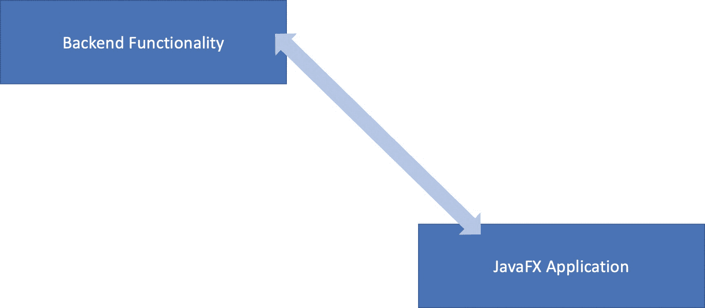

图 9-2

JavaFX 应用程序直接与后端 API 通信

## 与网络整合

使用 WebView 组件，您可以在 JavaFX 应用程序中显示 HTML5 内容。这适用于本地 HTML 文件或网页。该组件基于 WebKit，功能非常强大。可能的应用范围从文档的显示到完整 web 应用程序的集成。非常实用的是，通过 JavaScript 桥很容易与 WebView 组件的内容进行交互。这允许我们从 JavaFX 修改页面并对用户操作做出反应。

### 显示网页

对于简单的用例，WebView API 本身非常容易使用。WebView 和相关类是 javafx.web 模块的一部分。因此，如果我们想要使用它，我们应该确保将 javafx.web 模块添加到我们的模块路径中。使用命令行方法，这是通过添加

```java
--add-modules javafx.web

```

将 Maven 与 javafx-maven-plugin 一起使用时，我们可以很容易地添加一个依赖项，如下所示:

```java
<dependency>
    <groupId>org.openjfx</groupId>
    <artifactId>javafx-web</artifactId>
    <version>17.0.1</version>
</dependency>

```

这也在样本存储库中的`webviewdemo`样本的`pom.xml`文件中进行了说明。

我们可以马上从一个代码示例开始。核心组件是`WebView`节点。我们可以像其他节点一样将它添加到场景图中。我们请求它的`WebEngine`,并传递一个 URL 给它，如下所示:

```java
public class WebViewDemo extends Application {
    @Override
    public void start(Stage primaryStage) {
        WebView webView = new WebView();
        WebEngine engine = webView.getEngine();
        engine.load("https://openjfx.io");
        Scene scene = new Scene(webView, 300, 250);
        primaryStage.setTitle("JavaFX WebView Demo");
        primaryStage.setScene(scene);
        primaryStage.show();
    }
}

```

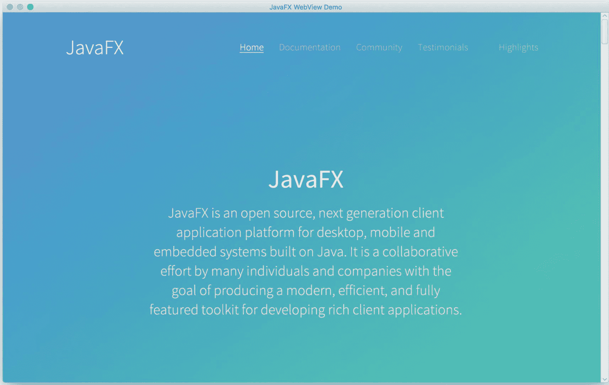

图 9-3

在 JavaFX WebView 中加载网站

三行突出显示的代码足以加载如图 [9-3](#Fig3) 所示的网页。通过右键单击，您可以打开页面上的上下文菜单，并根据当前状态，停止或重新启动页面加载。默认情况下，此菜单可用。对于最常见的用例，您不需要它。让我们用下面的命令禁用它:

```java
webView.setContextMenuEnabled(false);

```

### 添加导航和历史记录

要使用 WebEngine 的 load 命令在网站之间导航，可以向 JavaFX 应用程序添加按钮或菜单，以便在单击时显示特定页面。为了响应点击，只需调用 engine.load(" [`http://myurl.com`](http://myurl.com) ")来指示 web 引擎为您加载页面。让我们在我们的例子中用一个菜单栏来试试这个，如图 [9-4](#Fig4) 所示。为此，我们首先将 WebView 放入一个 BorderPane 中，这样我们可以很容易地在它上面插入一个 MenuBar。像这样更改开始方法:

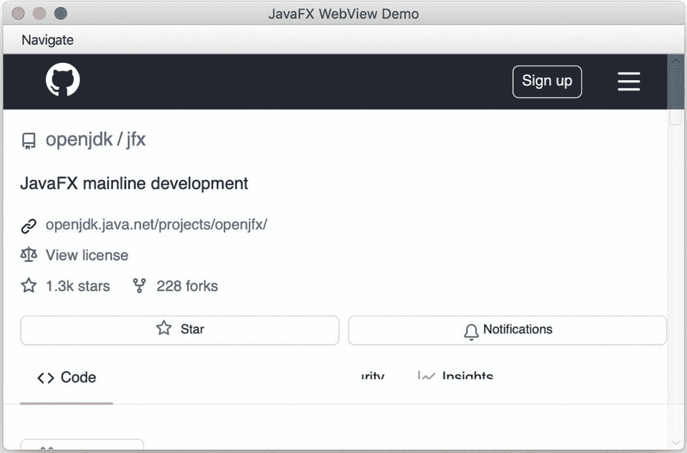

图 9-4

为导航添加菜单栏

```java
public void start(Stage primaryStage) {
        WebView webView = new WebView();
        webView.setContextMenuEnabled(false);
        WebEngine engine = webView.getEngine();
        engine.load("https://openjfx.io ");
        BorderPane borderPane= new BorderPane(webView);
        MenuBar menuBar = new MenuBar();
        final Menu navigateMenu = new Menu("Navigate");
        MenuItem home = new MenuItem("Home");
        navigateMenu.getItems().addAll(home);
        home.setOnAction(e -> engine.load("https://github.com/openjdk/jfx"));
        menuBar.getMenus().add(navigateMenu);
        borderPane.setTop(menuBar);
        Scene scene = new Scene(borderPane, 640, 400);
        primaryStage.setTitle("JavaFX WebView Demo");
        primaryStage.setScene(scene);
        primaryStage.show();
    }

```

网络引擎也让我们可以使用导航历史。web 引擎的 getHistory 方法返回具有 getEntries 方法的 History 对象。这是一个可观察的列表，我们可以用它来跟踪变化。让我们用它来填充一个菜单:

```java
Menu historyMenu = new Menu("History");
        engine.getHistory().getEntries().addListener((ListChangeListener.Change<? extends Entry> c) -> {
            c.next();
            for (Entry e: c.getAddedSubList()) {
                for(MenuItem i: historyMenu.getItems()){
                    if (i.getId().equals(e.getUrl())){
                        historyMenu.getItems().remove(i);
                    }
                }
            }
            for (Entry e: c.getAddedSubList()) {
                final MenuItem menuItem = new MenuItem(e.getUrl());
                menuItem.setId(e.getUrl());
                menuItem.setOnAction(a->engine.load(e.getUrl()));
                historyMenu.getItems().add(menuItem);
            }
        });
        menuBar.getMenus().addAll(navigateMenu, historyMenu);

```

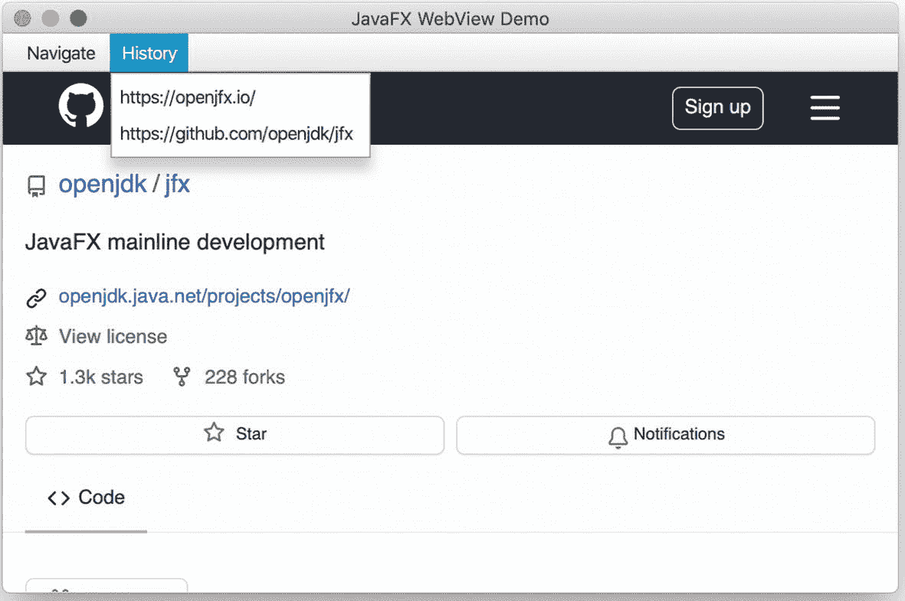

图 9-5

访问浏览历史

结果如图 [9-5](#Fig5) 所示。对于构建一个好的基本浏览器来说，这并不需要太多的努力。现在是时候改善用户体验了。目前，我们没有得到加载过程的指示。

### 显示加载进度

进度条在这里会很有帮助。我们可以在加载新内容时将其显示在页面底部。幸运的是，`WebEngine`正在使用 javafx 并发 API，因此我们可以使用`Property`来轻松跟踪进度。因此，让我们在 BorderPane 中添加一个 ProgressBar 来显示进度:

```java
        ProgressBar progressBar = new ProgressBar();
        progressBar.progressProperty().bind(
                engine.getLoadWorker().progressProperty());
     progressBar.visibleProperty().bind(engine.getLoadWorker().
stateProperty().isEqualTo(State.RUNNING));
        borderPane.setBottom(progressBar);

```

我们还将 ProgressBar 的 visibleProperty 绑定到 Worker 的 stateProperty。一个非常小的代码示例完美地说明了属性和绑定与 JavaFX APIs 的其余部分是如何集成的。不需要监听器，这确实有助于提高代码的可读性。带有工作进度条的示例如图 [9-6](#Fig6) 所示。

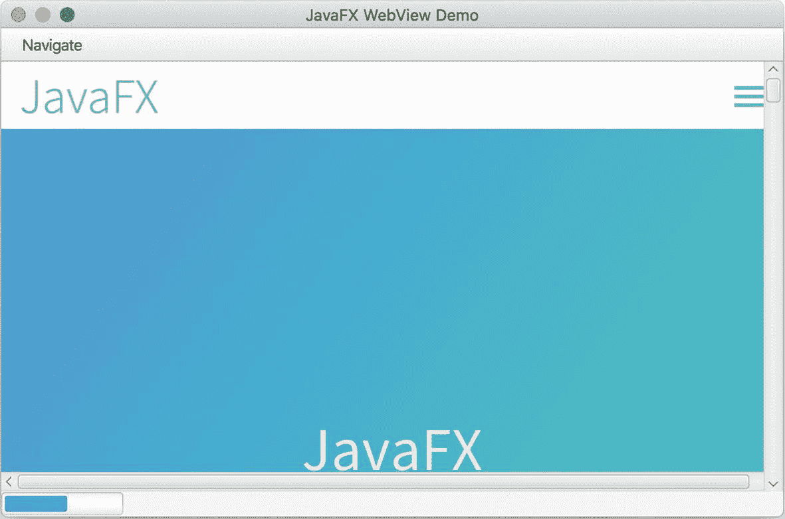

图 9-6

加载页面时显示进度

### 从网站到 API

在本节中，我们将展示如何在 JavaFX 应用程序中轻松呈现现有的网站。通过将网站上的 JavaScript 功能与 JavaFX 应用程序中的 Java 功能相链接，可以增强网站功能并使其更具交互性，或者将其与网络浏览器不可用的功能相集成(例如，与设备的连接)。

虽然这通常是基于现有网站创建桌面应用程序的快速而简单的解决方案，但在大多数情况下，它不提供后端提供的丰富功能，也没有利用 JavaFX APIs 提供的丰富功能。

在本章的第二部分，我们将讨论如何访问后端功能，并以更细粒度的方式将其与 JavaFX 控件集成。

## 面向云的构建

大约在 2012 年，云最终成为主流，但只有极少数玩家仍然主导着市场。然而，竞争是巨大的，每个季度都会发布服务和 API。为云构建应用程序通常意味着利用这些高度可用和可扩展的基础设施即服务，以及高效、易用和易于集成的平台即服务。无论是为您快速调配的虚拟机或数据库，还是只需要订阅密钥的人脸检测 API，所有这些资源都有一个共同点:管理、维护和扩展它们的不是您，而是您的云提供商。

云通常还意味着构建基于 web 的应用程序或基于 web 的 REST APIs，它们将在云中运行，并与同样位于云中的资源进行对话。如何构建和部署这些应用和服务通常取决于微服务和云原生架构剧本。云资源的可伸缩性模式非常适合这些 web 应用程序和微服务。当一切都在互联网上，并且通过浏览器、一些基于 HTTP 的自动化客户端或消息系统访问应用程序时，桌面应用程序常见的许多挑战(如版本更新、数据缓存、服务重新路由等)根本不存在，或者更容易在云中解决。

那么当面向用户的应用程序是富客户端时会发生什么呢？开发人员如何利用云，为什么？这里的重点是通过不必在客户端本身开发某些算法和业务逻辑，而是将它们转移到开发人员可以更好地控制和更快地交付更新的地方，或者使用现成的服务 API(否则将花费大量开发时间在富客户端中构建),来为他们的现代客户端桌面应用程序提供价值。

与客户端简单地显示带有网站的 WebView 相比，这种方法要强大得多。部分功能可以在客户端实现，而其他部分可以卸载给云提供商。

### JavaFX 云应用程序的架构

大多数现代企业系统都有多层架构，其中基于 web 的前端和业务逻辑是分离的。典型的 web 框架查询业务层，要么使用直接(Java)调用，要么使用 REST APIs。如下图所示。

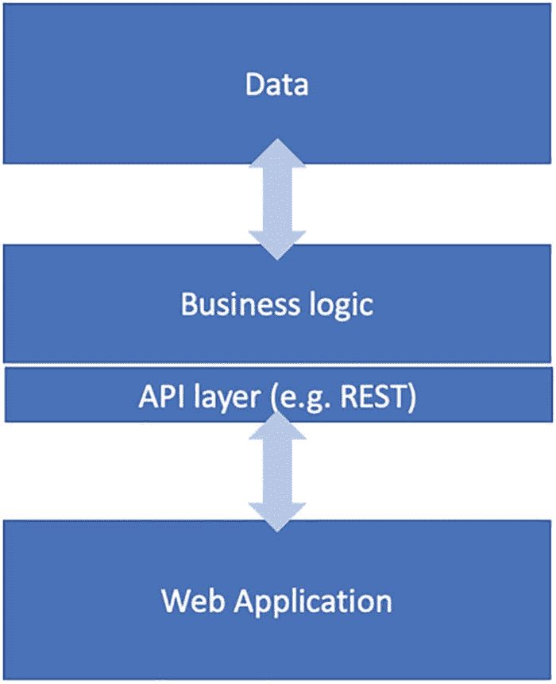

业务逻辑不是在 web 应用程序内部实现的，而是通常在使用某种特定企业架构的后端组件中实现的，这提供了额外的功能，如安全性、可伸缩性、监控等。相同的概念可以应用于 JavaFX 客户端应用程序的情况，如下所示。


在这种情况下，JavaFX 应用程序调用的 API 层与典型的 web 应用程序调用的 API 层相同。这种方法的优点是只需要一个 API 层来服务不同类型的客户端。

通常，API 层会公开一个 REST 接口。许多 web 框架提供了对 REST 接口的访问，也有大量的 Java 库允许开发人员访问 REST 接口，并将 REST 接口的输出转换为 Java 对象。

作为一个例子，我们将使用 OpenWeather API，这是一个通过 REST 接口访问的 API 层。许多基于 web 的应用程序都使用这个 API，我们将展示如何在 Java 客户端应用程序中利用这个 API 的三种方法。

### 用例:查询 OpenWeather

我们现在将展示一个 JavaFX 应用程序，它查询 OpenWeather API ( [`https://openweathermap.org`](https://openweathermap.org) )来检索给定位置的天气。我们可以简单地使用 WebView 并呈现现有的 OpenWeather 网站，但是我们希望利用 JavaFX 控件的强大功能，或者我们希望将天气数据无缝集成到现有的 JavaFX UI 应用程序中。

我们现在将解释如何编写一个从 OpenWeather 中检索查询的应用程序。为了做到这一点，第一件事就是在门户( [`https://home.openweathermap.org/users/sign_up`](https://home.openweathermap.org/users/sign_up) )注册并获得默认的 API 密匙或者生成一个新的( [`https://home.openweathermap.org/api_keys`](https://home.openweathermap.org/api_keys) )。

在下面的代码片段中，您会注意到 API 键有时是必需的。OpenWeather API 允许单个帐户每小时进行有限次数的呼叫。因此，最好创建并使用自己的 API 密钥，而不是使用共享的 API 密钥。这就是为什么我们通常用例如“XXXXXXXXXXX”来替换真正的密钥。确保用您从 OpenWeather 门户获得的真实 API 密钥替换这个“XXXXXXXXXXX”。

首先，让我们创建一个简单的应用程序来显示给定时间和城市的天气:

```java
public class WeatherApp extends Application {
    private static final String API_KEY = "XXXXXXXXXXX";
    private static final String CITY = "London";
    private ImageView imageView;
    private Label weatherLabel;
    private Label descriptionLabel;
    private Label tempLabel;
    @Override
    public void start(Stage stage) {
        imageView = new ImageView();
        imageView.setFitHeight(100);
        imageView.setPreserveRatio(true);
        imageView.setEffect(new DropShadow());
        Label label = new Label("The weather in " + CITY);
        weatherLabel = new Label();
        descriptionLabel = new Label();
        descriptionLabel.getStyleClass().add("desc");
        tempLabel = new Label();
        tempLabel.getStyleClass().add("temp");
        VBox root = new VBox(10,
            label, imageView, weatherLabel, descriptionLabel, tempLabel);
        root.setAlignment(Pos.CENTER);
        Scene scene = new Scene(root, 600, 400);
        scene.getStylesheets().add(
            WeatherApp.class.getResource("/styles.css").toExternalForm());
        stage.setScene(scene);
        stage.setTitle("The Weather App");
        stage.show();
        retrieveWeather();
    }
    private void retrieveWeather() {
        // TODO
    }
}

```

这段代码利用了我们在本书前面章节中讨论过的布局和控件。唯一的新部分是`“retrieveWeather()”`调用`that`目前还没有实现。在本章的剩余部分，我们将通过多种方式实现这一点。

除了代码之外，在应用程序中应用一些样式信息通常也是很好的。在此示例中，我们使用以下 CSS 内容:

```java
.label {
    -fx-font-size: 1.4em;
    -fx-text-fill: blue;
}
.label.desc {
    -fx-font-size: 1.2em;
    -fx-text-fill: gray;
}
.label.temp {
    -fx-font-size: 1.1em;
    -fx-text-fill: green;
}

```

获取给定系统的天气数据所需的查询由 OpenWeather API 定义，并在 [`https://openweathermap.org/current`](https://openweathermap.org/current) 中描述。

注意，API 定义可能会改变，所以如果 OpenWeather 改变了它的 API，当前的方法可能需要做一些小的修改！

要使用我们的 API 键查询给定城市的 OpenWeather，基本上我们只需要创建以下查询:

```java
"https://api.openweathermap.org/data/2.5/weather?appid="
    + API_KEY + "&q=" + CITY

```

当这样的查询被发送到 OpenWeather API 时，我们将得到 JSON 格式的响应，如下所示:

```java
{"coord":{"lon":-0.13,"lat":51.51},
 "weather":[{"id":500,"main":"Rain",
 "description":"light rain","icon":"10d"}],"base":"stations",
 "main":{"temp":290.14,"pressure":1012,"humidity":68,
 "temp_min":288.15,"temp_max":292.59},"visibility":10000,
 "wind":{"speed":4.1,"deg":180},"clouds":{"all":40},
 "dt":1563527401,"sys":{"type":1,"id":1414,"message":0.0137,
 "country":"GB","sunrise":1563509115,"sunset":1563566876},
 "timezone":3600,"id":2643743,"name":"London","cod":200}

```

有多种方法可以处理这个响应。在 Java 生态系统中，存在许多处理 JSON 输入并将其绑定到 Java 对象的库。为了促进 JSON 数据和 Java 对象之间的映射，我们将使用模型实体将 JSON 字符串反序列化为如下内容:

```java
public class Model {
    private long id;
    private long dt;
    private Clouds clouds;
    private Coord coord;
    private Wind wind;
    private String cod;
    private String visibility;
    private long timezone;
    private Sys sys;
    private String name;
    private String base;
    private List<Weather> weather = new ArrayList<>();
    private Main main;
    // Getters & setters
}
public class Clouds {
    private String all;
    // Getters & setters
}
public class Coord {
    private float lon;
    private float lat;
    // Getters & setters
}
public class Main {
    private float humidity;
    private float pressure;
    private float temp_max;
    private float temp_min;
    private float temp;
    private float feels_like;
    // Getters & setters
}
public class Sys {
    private String message;
    private String id;
    private long sunset;
    private long sunrise;
    private String type;
    private String country;
    // Getters & setters
}
public class Weather {
    private int id;
    private String icon;
    private String description;
    private String main;
    // Getters & setters
}
public class Wind {
    private float speed;
    private float deg;
    private float gust;
    // Getters & setters
}

```

如您所见，所描述的模型映射到 JSON 服务提供的输出。一些框架要求对象字段的名称与 JSON 字段的名称完全匹配。其他的允许注释来提供匹配。在某些情况下，字段是必需的，而在其他情况下，getters 和 setters 是必需的。

**案例一:杰克逊**

将 JSON 反序列化为 Java 对象的一个非常流行和灵活的框架是 Jackson 项目，它提供了一个 JSON Java 解析器( [`https://github.com/FasterXML/jackson`](https://github.com/FasterXML/jackson) )。

我们可以简单地将依赖项添加到我们的项目中:

```java
<dependency>
    <groupId>com.fasterxml.jackson.core</groupId>
    <artifactId>jackson-databind</artifactId>
    <version>2.12.3</version>
</dependency>
 (for Maven)

or

dependencies {
    implementation "com.fasterxml.jackson.core:jackson-databind:2.12.3"
}
(for Gradle)

```

现在我们可以完成我们的`retrieveWeather`通话了:

```java
private void retrieveWeather() {
    try {
            String restUrl =
                "https://api.openweathermap.org/data/2.5/weather?appid="
                + API_KEY + "&q=" + CITY;
            ObjectMapper objectMapper = new ObjectMapper();
            Model model = objectMapper.readValue(
                 new URL(restUrl), Model.class);
            updateModel(model);
        } catch (Throwable e) {
            System.out.println("Error: " + e);
            e.printStackTrace();
        }
    }
    private void updateModel(Model model) throws MalformedURLException, URISyntaxException {
        if (model != null) {
            if (!model.getWeather().isEmpty()) {
                Weather w = model.getWeather().get(0);
                imageView.setImage(new Image(new URL("http://openweathermap.org/img/wn/" + w.getIcon() + "@2x.png").toURI().toString()));
                weatherLabel.setText(w.getMain());
                descriptionLabel.setText(w.getDescription());
            }
            tempLabel.setText(String.format("%.2f °C - %.1f%%",             model.getMain().getTemp() - 273.15, model.getMain().getHumidity()));
        }
    }

```

如果您已经在使用 Jackson API，这段代码看起来会非常熟悉。从服务器端应用程序和从 JavaFX 应用程序使用 Jackson API 实际上没有区别。

我们不会详细讨论杰克逊，但你可以从代码中了解正在发生的事情。

首先，构建包含所需 API 请求的 URL:

```java
String restUrl =
                "https://api.openweathermap.org/data/2.5/weather?appid="
                + API_KEY + "&q=" + CITY;

```

URL 要求填写 API_KEY 和感兴趣的城市。

接下来，我们使用 Jackson 代码来检索信息，并将结果转换成 Java 对象:

```java
ObjectMapper objectMapper = new ObjectMapper();
            Model model = objectMapper.readValue(
                 new URL(restUrl), Model.class);

```

ObjectMapper API 是 Jackson 的一部分，它允许解析 REST 方法的输出，创建所提供类的新实例(在本例中为“Model”)，并将该类的字段与返回的 JSON 数据中的字段进行映射。

最后，调用“updateModel”来确保检索到的信息在场景中可视化。为此，我们使用了本书前面讨论过的 JavaFX APIs。

现在我们运行如图 [9-7](#Fig7) 所示的应用程序。

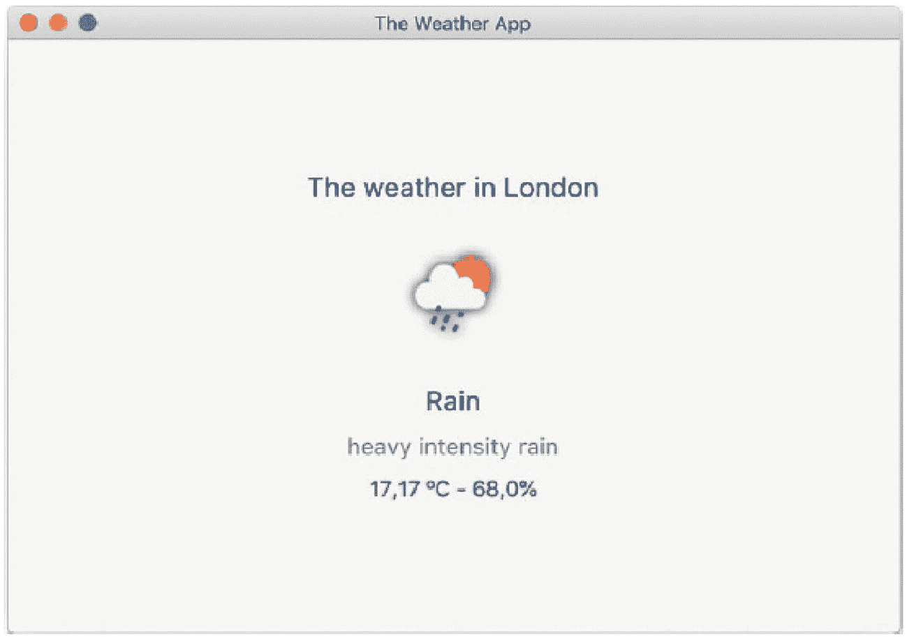

图 9-7

运行的应用程序

这种方法非常容易实现，尤其是如果您熟悉 Jackson 或另一个 Java 中的 JSON 解析库。

虽然这种方法非常方便，但是有一些点是 JavaFX 特有的，应该加以考虑。

例如，解析是在同步调用中完成的，以完成查询给定 URL、等待结果、检索和解析响应的整个过程。如果出现任何问题，比如超时或网络错误，将只有一个异常，并且 UI 可能会冻结，因此我们应该将该调用包装在 JavaFX 服务中。

此外，虽然模型类非常通用，并且是面向对象开发中的良好实践，但它没有利用 JavaFX 中的“可观察”概念。因此，需要样板代码来更新 UI。

我们采用的方法可以想象如下:

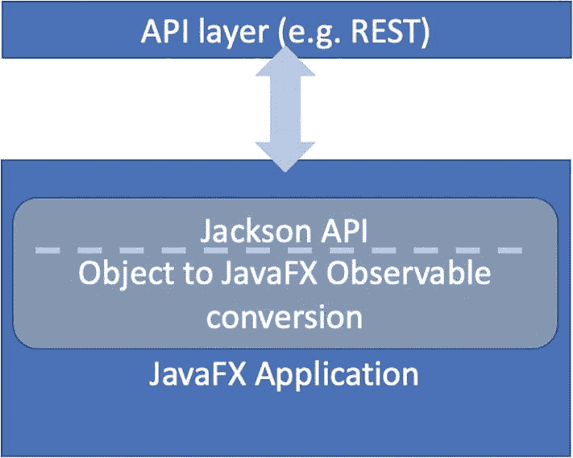

**情况二:连接**

Gluon 的 Connect 库( [`https://github.com/gluonhq/connect`](https://github.com/gluonhq/connect) )不仅像 Jackson 一样反序列化 JSON 响应还以异步的方式进行；此外，它返回 JavaFX 可观察列表或对象，JavaFX UI 控件可以直接使用这些列表或对象。使用 Gluon Connect 可以省去将解析的对象转换成 JavaFX 可观察实例的额外步骤，因为它直接填充或操作这些实例。视觉上，这可以显示如下:

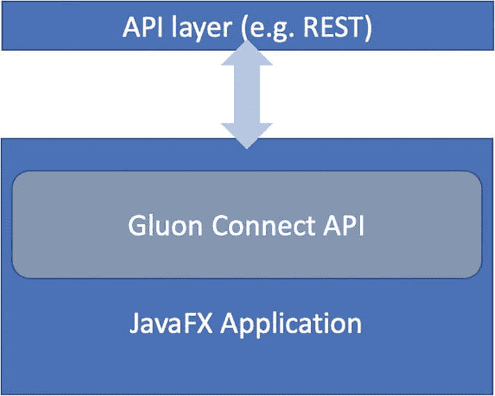

使用 Gluon Connect 需要向我们的项目添加以下依赖项:

```java
<dependency>
    <groupId>com.gluonhq</groupId>
    <artifactId>connect</artifactId>
    <version>2.0.1</version>
</dependency>
<dependency>
    <groupId>org.glassfish</groupId>
    <artifactId>jakarta.json</artifactId>
    <version>1.1.5</version>
    <scope>runtime</scope>
</dependency>
 (for Maven)

or

dependencies {
    implementation "com.gluonhq:connect:2.0.1"
    runtimeOnly 'org.glassfish:jakarta.json:1.1.5
}
(for Gradle)

And now our updateWeather call can be done as follows:
    private void retrieveWeather() {
        GluonObservableObject<Model> weather = getWeather();
        weather.setOnFailed(e -> System.out.println("Error: " + e));
        weather.setOnSucceeded(e -> updateModel(weather.get()));
    }
    private GluonObservableObject<Model> getWeather() {
        RestClient client = RestClient.create()
                .method("GET")
                .host("http://api.openweathermap.org/")
                .connectTimeout(10000)
                .readTimeout(1000)
                .path("data/2.5/weather")
                .header("accept", "application/json")
                .queryParam("appid", API_KEY)
                .queryParam("q", CITY);
        return DataProvider.retrieveObject(
             client.createObjectDataReader(Model.class));
    }

```

运行这个应用程序会产生和以前一样的输出，但是代码更加简洁。“retrieveWeather”方法首先创建一个“GluonObservable”对象的实例。这个对象的创建创建了一个“RestClient ”,它定义了我们需要查询的 REST 接口，然后它使用一个“DataProvider”来提供一个“GluonObservableObject ”,该对象包含来自结果 JSON 输出的解析信息。

我们可以在这个对象上设置回调方法。例如，当数据被成功检索时，我们用提供的天气信息更新模型。

我们创建的应用程序非常简单，但您会发现它比简单地在 WebView 控件中呈现网站更加灵活和动态。通过访问外部 API，JavaFX 应用程序中的代码看起来类似于访问这些外部 API 的后端代码，如图 [9-8](#Fig8) 所示。

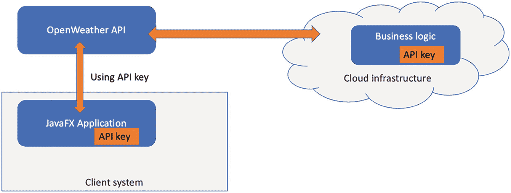

图 9-8

JavaFX 应用程序看起来类似于访问外部 API 的后端代码

JavaFX 客户端或 web 客户端与 API 层建立连接，然后 API 层可能会使用更复杂的业务逻辑，与数据层对话，并以某种方式处理请求。

客户端代码驻留在云环境中和最终用户的桌面上有一个非常重要的区别。在第一种情况下，云环境在大多数情况下可以被视为可信环境。然而，在代码驻留在最终用户桌面上的情况下，这不再是真的。最终用户自己或设备上的其他恶意应用程序可能会获得 API 密钥。只要 API 密钥存储在设备上，任何能够访问设备的人都可能以某种方式使用或滥用它。如下图所示:

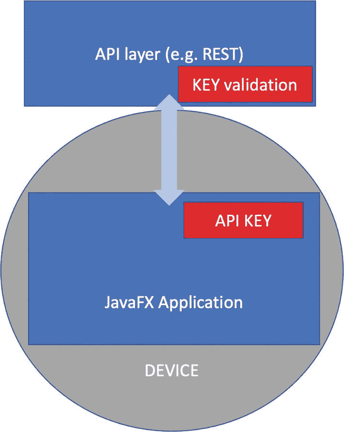

在 OpenWeather 查询的情况下，这可能不是最致命的问题，但是一般来说，提供对关键或敏感功能的访问的 API 密钥不应该存储在最终用户系统上。

为了解决这个问题，使用中间件组件作为可信云基础设施和用户的客户端设备(桌面/移动/嵌入式)之间的桥梁是有益的。

然后，API 密钥保存在中间件组件上，该组件托管在一个安全的环境中，如下所示:


如果设备现在被黑客攻击，或者客户端应用程序不知何故受到损害，黑客将无法访问 API 密钥。在最坏的情况下，黑客可以与中间层对话，假装他们是设备的原始所有者，然后用真正的 API 密钥执行调用，但他们自己不会访问这个密钥。

通过在设备和中间层之间提供最佳的安全性和认证，甚至可以避免这种情况。

这个中间件组件可以扩展并导出通用的云功能(例如，访问无服务器容器)，如图 [9-9](#Fig9) 所示。

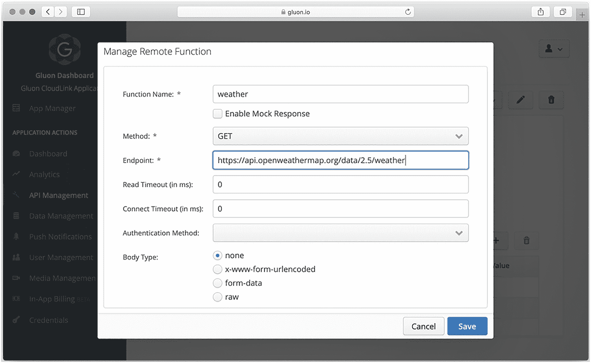

图 9-9

中间件组件可以被扩展以导出通用的云功能

在下一段中，我们将解释如何使用 Gluon CloudLink ( [`https://docs.gluonhq.com/cloudlink/`](https://docs.gluonhq.com/cloudlink/) )编写 OpenWeather 应用程序，这是 Gluon 的一个中间件解决方案，为 JavaFX 应用程序提供特定的支持。

案例三:胶子云链

Gluon CloudLink 提供了比简单地代表设备存储 API 密钥更多的功能。我们不会详细讨论这个功能，但是我们将在下面的例子中使用一个方便的特性。我们不会在 JavaFX 客户机上创建 REST 请求，而是使用基于 web 的仪表板在 Gluon CloudLink 中编写请求。

在我们添加代码之前，我们需要访问 Gluon 仪表板( [`https://gluon.io`](https://gluon.io) )，使用我们的凭证访问，并转到 API 管理来添加一个远程函数。远程功能是一个可以从 Java 客户端调用的组件(我们将在下一个代码片段中展示)，但它是在中间件上执行的(因此在 Gluon CloudLink 内部)。这有很多好处，包括灵活性:如果 REST API 以某种方式发生了变化(例如，添加或重命名了一个参数)，我们可以在 Gluon Dashboard 控制台中重新定义远程函数，而不必更改客户端代码。特别是在您不能轻松地立即更新所有客户机实例的环境中，这可能会产生很大的不同。

在客户机仪表板中，当创建远程函数时，我们为请求添加两个查询参数:`appid`和`q`。我们用 API 键设置前者的值，所以客户端不需要这样做，而后者的值将在客户端设置。正如我们之前强调的，认识到 API 密匙存储在中间件中(托管在云中)并且只在中间件和远程服务之间发送是很重要的。客户端应用程序没有访问此 API 密钥；因此，密钥被黑客获取的风险被最小化。

我们可以在测试字段中设置一对值，这样我们就可以从图 [9-10](#Fig10) 所示的仪表板中直接测试远程功能。

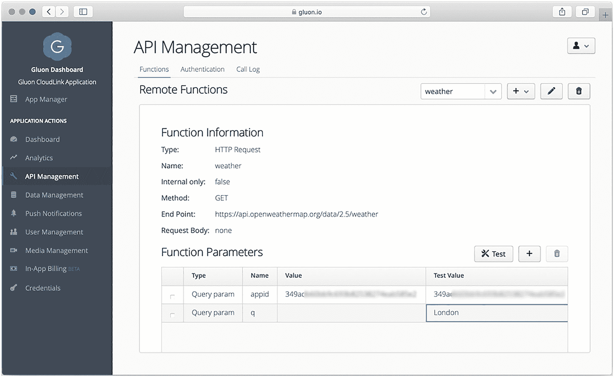

图 9-10

从胶子仪表板测试功能

一旦测试成功(我们应该看到一个 200 响应和一个 JSON 字符串)，我们就可以回到我们的项目，在 pom.xml 文件中添加 CloudLink 依赖项。这是通过将胶子库添加到库列表中来实现的:

```java
repositories {
    mavenCentral()
    maven {
       url 'https://nexus.gluonhq.com/nexus/content/repositories/releases/'
    }
}

```

我们还必须向 pom.xml 添加一些依赖项，如下所示:

```java
<dependency>
     <groupId>com.gluonhq</groupId>
     <artifactId>charm-cloudlink-client</artifactId>
     <version>6.0.1</version>
 </dependency>
 <dependency>
     <groupId>org.glassfish</groupId>
     <artifactId>javax.json</artifactId>
     <version>1.1.4</version>
 </dependency>
 <dependency>
     <groupId>org.glassfish</groupId>
     <artifactId>jakarta.json</artifactId>
     <version>1.1.5</version>
 </dependency>
 <dependency>
     <groupId>com.gluonhq.attach</groupId>
     <artifactId>storage</artifactId>
     <version>4.0.11</version>
 </dependency>

```

Gluon CloudLink 客户端代码设计用于桌面、移动和嵌入式设备。为了做到这一点，它抽象了一些在不同平台上有不同实现的功能。开源项目 Gluon Attach 提供了这种抽象，以及针对桌面、iOS 和 Android 平台的实现。例如，数据在平台上的存储方式在这些目标之间是不同的，这被 Gluon CloudLink 客户端代码所使用。因此，我们向 com.gluonhq.attach.storage 服务添加了一个依赖项。为了使应用程序平台独立，我们还添加了 gluonfx-maven-plugin，它确保使用正确的附加服务的本机实现:

```java
<plugin>
     <groupId>com.gluonhq</groupId>
     <artifactId>gluonfx-maven-plugin</artifactId>
     <version>1.0.2</version>
     <configuration>
         <attachList>
             <list>storage</list>
         </attachList>
         <mainClass>org.modernclientjava.WeatherApp</mainClass>
     </configuration>
 </plugin>

```

最后，我们将代码修改为

```java
private void retrieveWeather() {
    GluonObservableObject<Model> weather = getWeather();
    weather.setOnFailed(e -> System.out.println("Error: " + e));
    weather.setOnSucceeded(e -> updateModel(weather.get()));
}
private GluonObservableObject<Model> getWeather() {
    RemoteFunctionObject functionObject = RemoteFunctionBuilder
            .create("weather")
            .param("q", CITY)
            .object();
    return functionObject.call(Model.class);
}

```

正如您所看到的，在来自客户端的远程函数调用中只有一个查询参数。

客户端中唯一需要的凭证是那些访问 CloudLink 中间件的凭证。在`src/main/resources`需要一个名为`gluoncloudlink_config.json`的文件:

```java
{
  "gluonCredentials": {
    "applicationKey" : "XXXXXXXX-XXXX-XXXX-XXXX-XXXXXXXXXXXX",
    "applicationSecret": "XXXXXXXX-XXXX-XXXX-XXXX-XXXXXXXXXXXX"
  }
}

```

此文件的内容可以从仪表板➤凭据➤客户端检索。

因为我们希望依赖于平台的附加实现由 gluonfx 插件来处理，所以我们使用

```java
mvn gluonfx:run

```

这将检测当前平台并使用正确的实现。

## 结论

JavaFX 应用程序是常规的 Java 应用程序，可以使用所有现有的 Java 功能。使用 JavaFX WebView 控件，可以在 JavaFX 应用程序中呈现网页，并在网页功能(在 JavaScript 中)和客户端上运行的 Java 引擎之间创建交互。

对于客户机应用程序与云中企业功能的细粒度、安全和灵活的集成，可以使用现有的 Java 框架。开发人员应该非常清楚客户端系统的具体特征，尤其是与安全性相关的特征。因此，中间件(例如，Gluon CloudLink)允许开发人员屏蔽客户端应用程序的安全敏感信息。