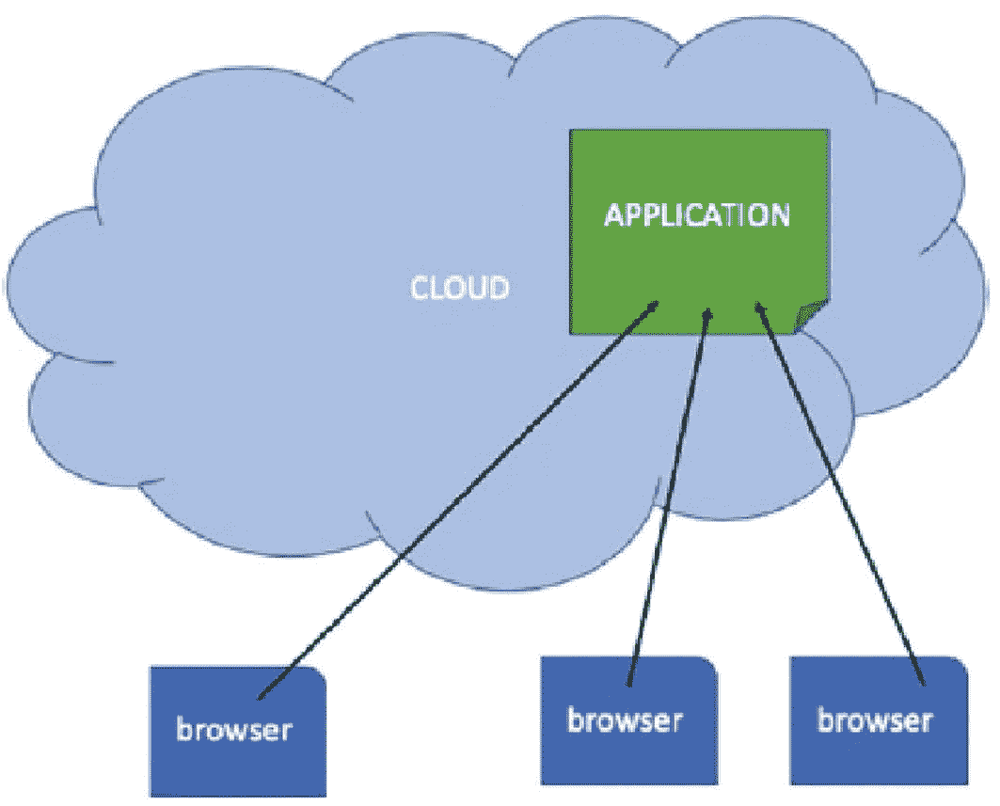
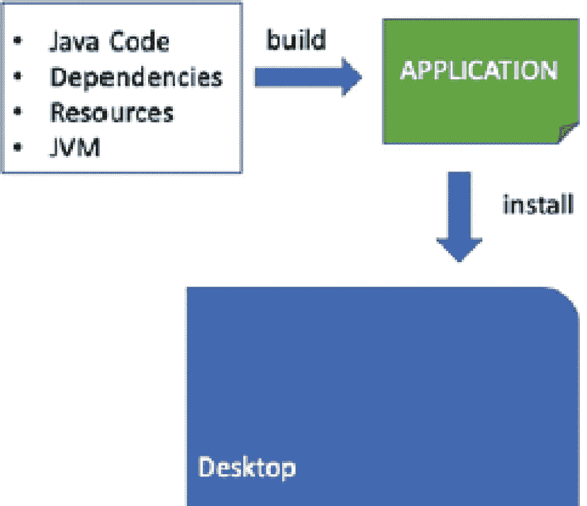
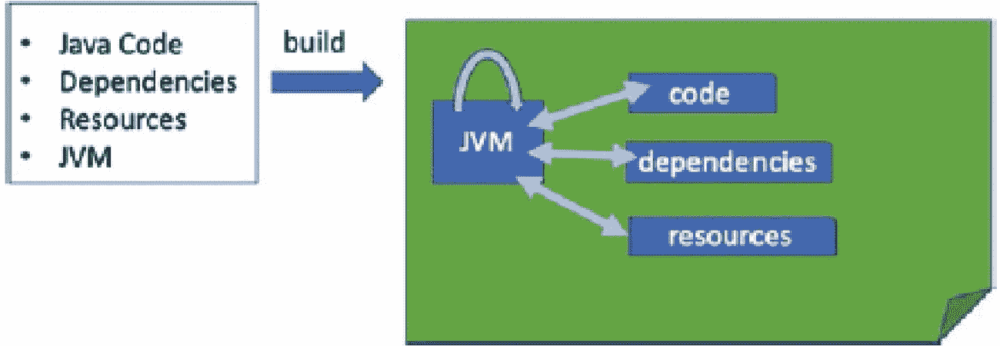
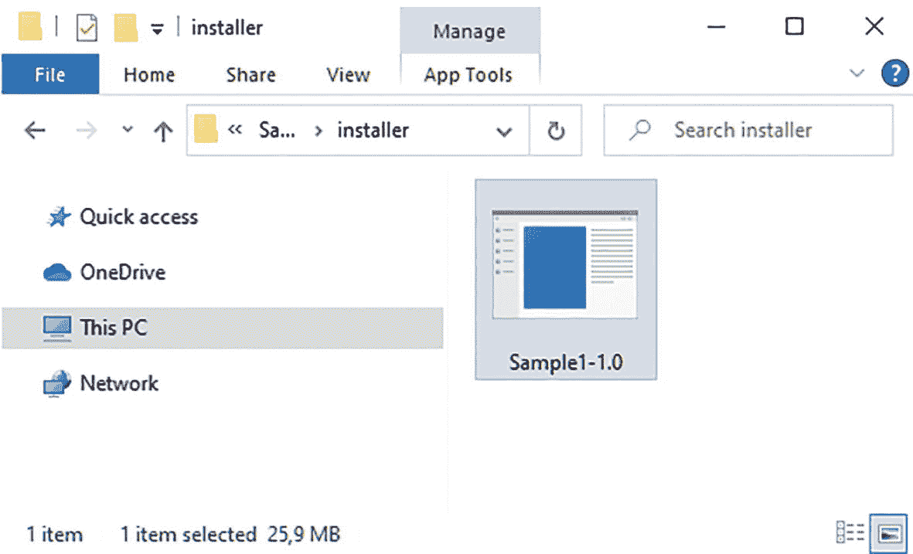
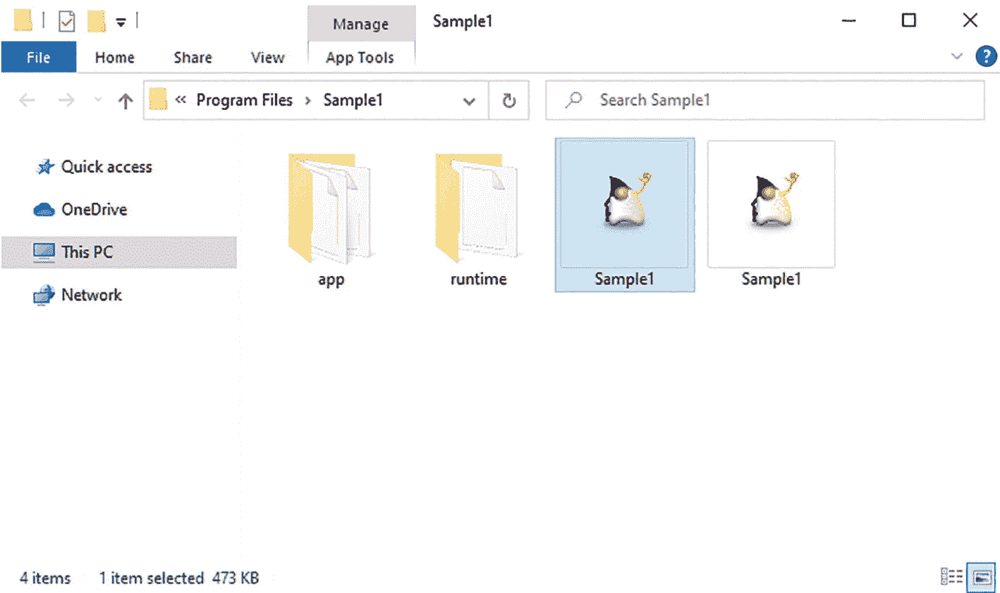
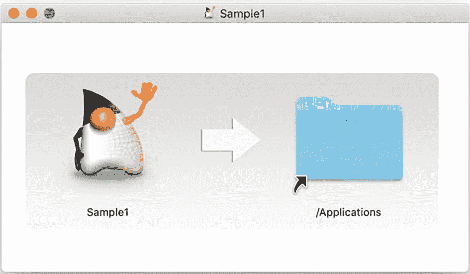
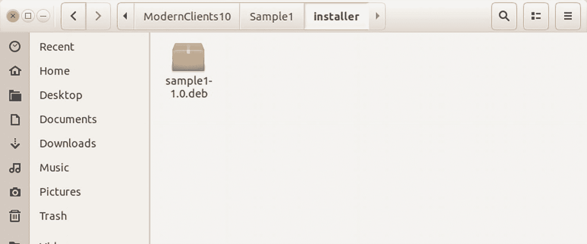
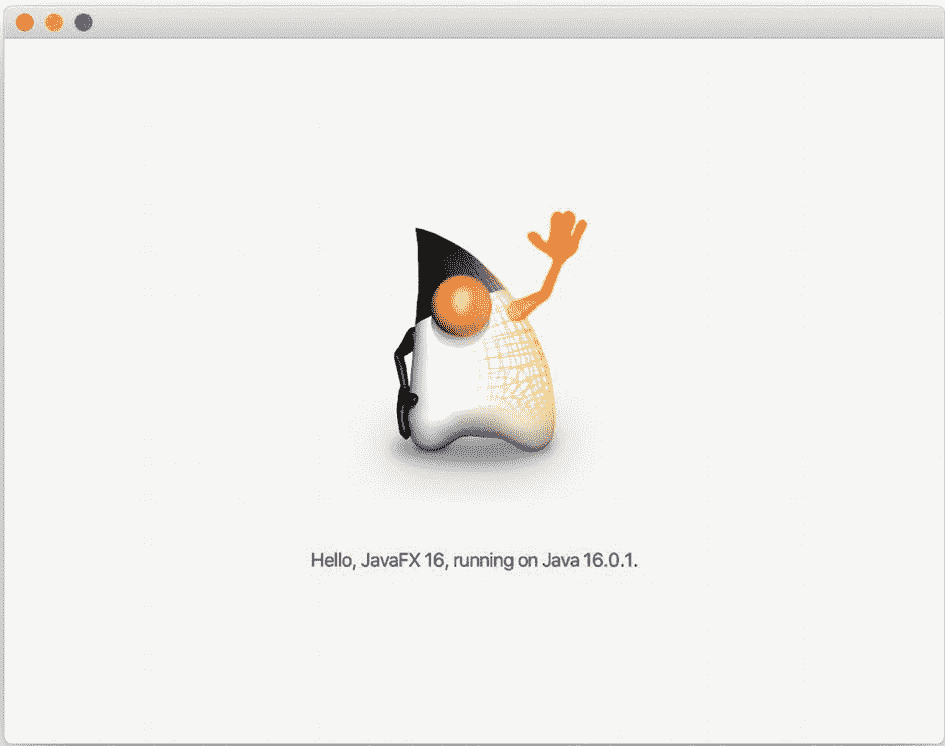
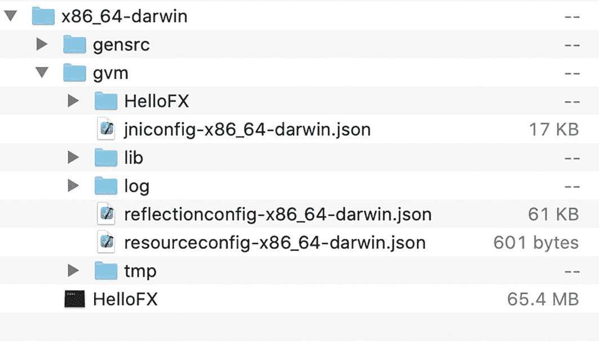
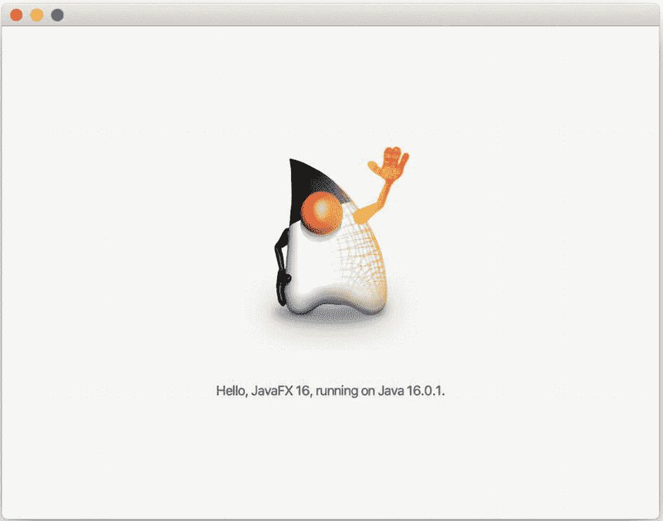

# 十、为桌面打包应用

由 José Pereda、Johan Vos 和 Gail Anderson 撰写

创建 Java 客户端应用程序只是应用程序生命周期的第一步。您的应用程序将由与之交互的最终用户使用。无论您的应用程序是供内部使用、仅供内部网使用还是供广大公众使用，您都希望使用您的应用程序的障碍尽可能低。最终用户在开始使用应用程序之前不喜欢复杂的过程。

在这一章中，我们将解释如何构建最终用户可以按照安装其他(非 Java)应用程序的相同方法来安装和使用的应用程序。我们将探索两个重要的现代工具，用于创建满足最终用户期望的捆绑 Java 应用程序:jpackage 和 GraalVM 的本机映像。

## Web 与桌面应用程序

当您创建一个 Java 客户端应用程序，或者通过扩展创建任何客户端应用程序时，最终用户将直接访问您的应用程序。这与创建云或基于 web 的应用程序非常不同，在这种情况下，您的代码可能运行在云或服务器基础架构上，最终用户通常通过 web 浏览器访问您的代码。在这种情况下，您必须将您的应用程序供应到云或服务器，有一些特定的工具可以帮助您完成这项任务。

您或您的 IT 部门控制着应用程序的运行环境。您知道周围的环境，包括操作系统、资源限制和可用的软件。这种情况如图 [10-1](#Fig1) 所示。



图 10-1

应用程序运行的环境

对于客户端应用程序，您需要确保您的应用程序可以安装在所有客户端系统上。如果幸运的话，您的应用程序将被部署在完全由您或您的 IT 组织控制的 intranet 上。但是通常情况下，您无法控制应用程序应该运行的环境。通常假设您的应用程序应该可以在所有操作系统上运行，您不知道最终用户是否安装了 Java，如果安装了，是哪个或哪些版本。与云环境中的部署相反，您不能自己在最终用户的系统上安装应用程序。您依赖这个最终用户来执行所需的指令；因此，您希望这些说明尽可能简单和熟悉。客户端部署场景如图 [10-2](#Fig2) 所示。


图 10-2

桌面部署场景

## 应用程序部署的演变

在过去，大多数 Java 客户端应用程序的部署都需要在应用程序代码、其依赖项和运行应用程序所需的 Java 虚拟机(JVM)之间进行明确的分离。从 1995 年的 Java Applets 开始，到后来的 Java Web Start，Java 客户端应用程序的开发人员可以假设在最终用户系统上已经安装了一些 Java 虚拟机。如果不是这样，开发人员可以假设存在某种工具来帮助最终用户安装 JVM。

因此，开发人员必须使用构建工具将程序代码、依赖项和资源捆绑到一个应用程序中，然后允许最终用户在他们已经安装的 JVM 上安装该应用程序——参见图 [10-3](#Fig3) 。


图 10-3

遗留开发过程

这个概念背后的基本原理很清楚:当一个客户机上运行多个 Java 应用程序时，用一个 JVM 安装为不同的应用程序提供基础是有意义的。由于 Java 非常注重向后兼容性，所以假设您的应用程序仍然可以在 JVM 的更高版本上运行也是合理的。因此，最终用户系统上的单个 JVM 就足以满足所有 Java 客户端应用程序的需求。因此，这个概念需要更少的磁盘空间(JVM 在应用程序之间共享)和更少的带宽(JVM 代码不需要随应用程序一起传输；假设它是存在的)。

近年来，许多发展使得这种方法变得不那么引人注目:

*   典型的磁盘空间和带宽正在增加。今天的普通用户正在使用更高容量的存储容量和流容量。其中一个驱动因素是媒体流和存储的增加。与典型流服务的需求相比，JVM 代码的传输和存储相对较小。因此，JVM 代码不应该与应用程序一起发送或与应用程序一起存储，因为这需要太多的带宽或存储容量的论点是不相关的。

*   Java 开发工具包的新版本节奏给最终用户带来了更多的责任。许多用户发现在他们的 PC 上看到一个弹出窗口要求升级到 Java 的新版本是很烦人的。他们的应用程序可能使用 Java，但是这对最终用户应该是透明的。虽然不同的应用程序可能仍然运行在较旧的 JVM 上，但是开发人员通常希望将较新的 JVM 中的新特性用于他们的应用程序。这导致更多的弹出窗口让最终用户感到烦恼。

*   应用商店(app stores)的概念改变了移动领域，也在桌面领域获得了发展。使用应用程序商店，最终用户只需决定使用统一的“点击安装”概念来安装应用程序。执行应用程序所需的一切都被认为是该应用程序的一部分。因此，最终用户不会管理没有给用户增加功能的必需组件(例如，JVM)。

Java 生态系统见证了这一演变。JavaFX 库以前包含一个“javafxpackager”工具，该工具允许开发人员为不同的平台(Linux、Windows、macOS)打包他们的 JavaFX 应用程序，包括一个 Java 虚拟机和所有依赖项。

在 Java 平台模块系统中，JVM 本身被分解成许多模块，这种情况发生了变化。现在可以创建 JVM 的子版本，只包含特定应用程序需要的模块。由于打包与所有应用程序(不仅仅是需要用户界面的客户端应用程序)相关，一个新的 Java 打包工具是从 Java 14 开始的预览版和在 Java 16 中完成的 JDK 的一部分。我们将在下一节讨论这个叫做 jpackage 的工具。

除了 jpackage 之外，还有另一个工具允许您将应用程序捆绑到一个自包含的本机应用程序中，即 GraalVM 的本机映像。使用这个工具，应用程序及其依赖项可以提前编译成本地应用程序。我们将在本章的后面讨论这个工具。

图 [10-4](#Fig4) 显示了将应用程序与其依赖项和资源以及 JVM 捆绑在一起的概念。



图 10-4

现代发展进程

## 打包工具

### 什么是 jpackage？

从 JDK 14 的预览版开始，到 JDK 16 的最终版本，jpackage 工具是 JDK 发行版的一部分。jpackage 的规格是 JEP 392: [`https://openjdk.java.net/jeps/392`](https://openjdk.java.net/jeps/392) 。(jpackage 的原始规格是 JEP 343。)

这个 JEP 的总结很清楚:

创建一个打包自包含 Java 应用程序的新工具。

这个总结符合我们在本章前面讨论的内容:我们希望创建包含 JVM 的自包含 Java 应用程序。

根据该网站，JEP 的目标如下:

基于 JavaFX javapackager 工具创建一个打包工具，该工具

*   支持本机打包格式，为最终用户提供自然的安装体验。这些格式包括 Windows 上的 msi 和 exe，macOS 上的 pkg 和 dmg，Linux 上的 deb 和 rpm。

*   允许在打包时指定启动时参数。

*   可以直接从命令行调用，也可以通过 ToolProvider API 以编程方式调用。

由此可见，jpackage 工具构建在 JavaFX 打包工具之上，JavaFX 打包工具以前是 JavaFX 8 的一部分。此外，jpackage 工具被设计为支持流行的桌面操作系统的现有的和通用的本机打包格式。因此，用 jpackage 创建的 Java 应用程序的安装方式类似于大多数其他本机应用程序的安装方式。

Java 客户端应用程序现在结合了两大优势:

1.由于一次编写，随处运行的范例，开发人员必须编写的代码实际上是独立于平台的。

2.多亏了 jpackage 工具，虽然代码本身是平台无关的，但是部署过程完全符合特定的平台。

因为 jpackage 是 JDK 发行版的一部分，所以它像普通的 java 或 javac 命令一样容易调用。jpackage 可执行文件与 java 和 javac 可执行文件位于同一目录下。

当被调用时，jpackage 基于提供的代码、依赖项和资源创建一个本地应用程序。它将 Java 运行时与本机应用程序捆绑在一起，当应用程序被执行时，打包的 Java 运行时将执行 Java 代码，类似于运行时被单独安装在系统上的情况。如图 [10-5](#Fig5) 所示。



图 10-5

带包部署

### 使用包

要开始使用 jpackage 工具，您需要使用 Java 16 或更高版本；但是，正如后面将要解释的，您可以将您的应用程序与其他版本的 Java 运行时捆绑在一起。

jpackage 工具支持三种应用程序类型:

*   在类路径上运行的非模块化应用程序，来自一个或多个 jar 文件

*   具有一个或多个模块化 jar 文件或 jmod 文件的模块化应用程序

*   链接到自定义运行时映像的模块化应用程序

注意，对于前两种情况，jpackage 运行 jlink 为应用程序创建一个 Java 运行时，并将其捆绑到最终映像中。在第三种情况下，您提供一个绑定到映像中的自定义运行时。

jpackage 的输出是一个自包含的应用程序映像。该图像可以包括以下内容:

*   本机应用程序启动器(由 jpackage 生成)

*   应用程序资源(如 jar、icns、ico、png)

*   配置文件(如 plist、cfg、properties)

*   启动器的助手库

*   Java 运行时映像，包括执行 Java 字节码所需的文件

虽然 jpackage 是包含独立于平台的 java 和 javac 命令的同一个目录的一部分，但是 jpackage 根据您使用的平台略有不同。这是有意义的，因为 jpackage 的输出是特定于平台的。因此，jpackage 可以被认为是平台无关的 Java 字节码和平台相关的本机可执行文件的中间部分。

因为 jpackage 能够为当前平台构建可执行文件，所以您必须在您想要支持的所有平台上运行 jpackage。不支持将一个平台的 Java 应用程序交叉编译为其他平台的本机可执行文件。

#### 套装程式使用状况

jpackage 的用法如下:

```java
jpackage <options>

```

#### 软件包选项

表格 [10-1](#Tab1) 到 [10-7](#Tab7) 显示了 jpackage 可以使用的不同选项。

表 10-7

jpackage–用于创建应用程序包的平台相关选项

<colgroup><col class="tcol1 align-left"> <col class="tcol2 align-left"></colgroup> 
| -win-目录选择器 | 添加一个对话框，使用户能够选择产品的安装目录。此选项仅在 Windows 上运行时可用。 |
| -赢菜单 | 将应用程序添加到系统菜单。此选项仅在 Windows 上运行时可用。 |
| 赢菜单组 | 放置此应用程序的开始菜单组。此选项仅在 Windows 上运行时可用。 |
| -每用户安装成功率 | 请求以每个用户为基础执行安装。此选项仅在 Windows 上运行时可用。 |
| -赢-捷径 | 为应用程序创建桌面快捷方式。此选项仅在 Windows 上运行时可用。 |
| - win-upgrade-uuid | 与此包的升级相关的 UUID。此选项仅在 Windows 上运行时可用。 |
| - linux-package-name<package name=""></package> | Linux 包的名称。默认为应用程序名称。只有在 Linux 上运行时，此选项才可用。 |
| - linux-deb-maintainer<email address=""></email> | 的维护者。deb 包。只有在 Linux 上运行时，此选项才可用。 |
| - linux-menu-group<menu-group-name></menu-group-name> | 此应用程序所在的菜单组。只有在 Linux 上运行时，此选项才可用。 |
| - linux-package-deps | 应用程序所需的包或功能。只有在 Linux 上运行时，此选项才可用。 |
| -Linux-rpm-许可证类型 | RPM <name>的许可类型(“许可:<value>”。规格)。只有在 Linux 上运行时，此选项才可用。</value></name> |
| - linux-app-release<release string=""></release> | 释放转速值<name>。DEB 控制文件的规范文件或 Debian 版本值。只有在 Linux 上运行时，此选项才可用。</name> |
| - linux-app-category<category string=""></category> | RPM 的组值<name>。DEB 控制文件的规范文件或部分值。只有在 Linux 上运行时，此选项才可用。</name> |
| -Linux-快捷键 | 为应用程序创建快捷方式。只有在 Linux 上运行时，此选项才可用。 |

表 10-6

jpackage–用于创建应用程序包的选项

<colgroup><col class="tcol1 align-left"> <col class="tcol2 align-left"></colgroup> 
| - app-image | 用于构建可安装包的预定义应用程序映像的位置(绝对路径或相对于当前目录)。请参见创建-应用程序-图像模式选项来创建应用程序图像。 |
| -文件关联 | 包含键值对列表的属性文件的路径(绝对路径或相对于当前目录的路径)。关键字“扩展”、“mime 类型”、“图标”和“描述”可用于描述关联。该选项可以多次使用。 |
| -安装目录 | macOS 或 Linux 上应用程序安装目录的绝对路径。应用程序安装位置的相对子路径，例如 Windows 上的“Program Files”或“AppData”。 |
| -许可文件 | 许可证文件的路径(绝对路径或相对于当前目录的路径)。 |
| -资源目录<path></path> | 覆盖 jpackage 资源的路径(绝对路径或相对于当前目录的路径)。图标、模板文件和 jpackage 的其他资源可以通过向该目录添加替换资源来覆盖。 |
| -运行时图像<file-path></file-path> | 要安装的预定义运行时映像的路径(绝对路径或相对于当前目录的路径)。创建运行时安装程序时需要选项。 |

表 10-5

jpackage–用于创建应用程序启动器的平台相关选项

<colgroup><col class="tcol1 align-left"> <col class="tcol2 align-left"></colgroup> 
| -win-控制台 | 为应用程序创建控制台启动器。应为需要控制台交互的应用程序指定。此选项仅在 Windows 上运行时可用。 |
| - mac 软件包标识符 | 唯一标识 macOS 应用程序的标识符。默认为主类名。只能使用字母数字(A–Z、A–Z、0–9)、连字符(-)和句点(。)字符。此选项仅在 macOS 上运行时可用。 |
| - mac-package-name<name string=""></name> | 出现在菜单栏中的应用程序的名称。这可以不同于应用程序名称。此名称必须少于 16 个字符，并且适合在菜单栏和应用程序信息窗口中显示。默认为应用程序名称。此选项仅在 macOS 上运行时可用。 |
| - mac 包签名前缀 | 在对应用程序包进行签名时，该值会作为所有需要签名的组件的前缀，这些组件没有现有的包标识符。此选项仅在 macOS 上运行时可用。 |
| - mac 符号 | 请求对包进行签名。此选项仅在 macOS 上运行时可用。 |
| - mac 签名钥匙串 | 要使用的钥匙串的路径(绝对路径或相对于当前目录的路径)。如果没有指定，则使用标准的钥匙串。此选项仅在 macOS 上运行时可用。 |
| - mac 签名密钥用户名<team name=""></team> | Apple 签名身份名称中的团队名称部分。比如“开发者 ID 应用:<team name="">”。此选项仅在 macOS 上运行时可用。</team> |

表 10-4

jpackage–用于创建应用程序启动器的选项

<colgroup><col class="tcol1 align-left"> <col class="tcol2 align-left"></colgroup> 
| -添加-启动器 <launcher name="">=</launcher> | 启动程序的名称和包含键值对列表的属性文件的路径(绝对路径或相对于当前目录的路径)。可以使用键" module "、" add-modules "、" main-jar "、" main-class "、" arguments "、" java-options "、" app-version "、" icon "、" win-console "。这些选项被添加到或用于覆盖原始命令行选项，以构建一个额外的替代启动器。主应用程序启动器将通过命令行选项构建。可以使用此选项构建其他备选启动器，并且可以多次使用此选项来构建多个其他启动器。 |
| -参数

<main class="" arguments=""></main>

 | 如果没有给启动程序提供命令行参数，则传递给主类的命令行参数。该选项可以多次使用。 |
| - java 选项<java options=""></java> | 传递给 Java 运行时的选项。该选项可以多次使用。 |
| -主级<class name=""></class> | 要执行的应用程序主类的限定名。只有在指定了- main-jar 的情况下，才能使用此选项。 |
| -主罐

<main jar="" file=""></main>

 | 应用程序的主 JAR，包含主类(指定为相对于输入路径的路径)。可以指定- module 或- main-jar 选项，但不能同时指定两者。 |
| -模块或-m <module name="">[/</module>

<main class="">]</main>

 | 应用程序的主模块(以及可选的主类)。该模块必须位于模块路径上。指定此选项时，主模块将在 Java 运行时映像中链接。可以指定- module 或- main-jar 选项，但不能同时指定两者。 |

表 10-3

包–用于创建应用程序映像的选项

<colgroup><col class="tcol1 align-left"> <col class="tcol2 align-left"></colgroup> 
| -图标 | 应用程序包图标的路径(绝对路径或相对于当前目录的路径)。 |
| -输入或-i <input path=""> | 包含要打包的文件的输入目录的路径(绝对路径或相对于当前目录)。输入目录中的所有文件都将打包到应用程序映像中。 |

表 10-2

包–用于创建运行时映像的选项

<colgroup><col class="tcol1 align-left"> <col class="tcol2 align-left"></colgroup> 
| -添加模块 <module name="">[，<module name="">...]</module></module> | 要添加的以逗号("，")分隔的模块列表。这个模块列表连同主模块(如果指定的话)将作为- add-module 参数传递给 jlink。如果未指定，则只使用主模块(如果指定了- module)或默认的模块集(如果指定了- main-jar)。该选项可以多次使用。 |
| -模块路径或-p <module path="">...</module> | 每个路径要么是模块的目录，要么是模块化 jar 的路径，并且是当前目录的绝对路径或相对路径。对于多个路径，在 Linux 和 macOS 上用冒号(:)或分号(；)或使用- module-path 选项的多个实例。该选项可以多次使用。 |
| - jlink 选项 | 要传递给 jlink 的以空格分隔的选项列表。如果未指定，则默认为“—strip-native-commands–strip-debug–no-man-pages–no-header-files”。该选项可以多次使用。 |
| -运行时图像 | 将复制到应用程序映像中的预定义运行时映像的路径(绝对路径或相对于当前目录的路径)。如果没有指定- runtime-image，jpackage 将使用选项- strip-debug、- no-header-files、- no-man-pages 和- strip-native-commands 运行 jlink 来创建运行时映像。 |

表 10-1

jpackage–通用选项

<colgroup><col class="tcol1 align-left"> <col class="tcol2 align-left"></colgroup> 
| @<filename></filename> | 从文件中读取选项和/或模式。该选项可以多次使用。 |
| -键入或-t | 要创建的包的类型。有效值为{"app-image "、" exe "、" msi "、" rpm "、" deb "、" pkg "、" dmg"}。如果未指定此选项，将创建依赖于平台的默认类型。 |
| -应用程序版本 | 应用程序和/或包的版本。 |
| -版权 | 应用程序的版权。 |
| -描述 | 应用程序的描述。 |
| -救命或者-h | 将带有当前平台的每个有效选项的列表和描述的用法文本打印到输出流并退出。 |
| -名称或-n<name></name> | 应用程序和/或包的名称。 |
| - dest 或-d | 放置生成的输出文件的路径(绝对路径或相对于当前目录的路径)。默认为当前工作目录。 |
| -温度 | 用于创建临时文件的新目录或空目录的路径(绝对路径或相对于当前目录的路径)。如果指定，临时目录将不会在任务完成时删除，必须手动删除。如果未指定，将在任务完成时创建并删除一个临时目录。 |
| -供应商 | 应用程序的供应商。 |
| -冗长 | 启用详细输出。 |
| -版本 | 将产品版本打印到输出流并退出。 |

#### 要求

jpackage 创建的映像与开发人员为本地平台创建的其他应用程序没有什么不同。因此，jpackage 也使用用于为特定操作系统生成本机应用程序的相同工具。

对于 Windows，为了生成原生包，开发人员需要安装:

*   WiX 工具集，一个生成 exe 和 msi 安装程序的免费第三方工具

##### WiX 设置

从 [`https://wixtoolset.org/releases/`](https://wixtoolset.org/releases/) 下载 WiX 工具集。当前版本是 3.11.2。下载完成后，使用安装程序进行处理，完成后，从命令行将其添加到 path 中

```java
setx /M PATH "%PATH%;C:\Program Files (x86)\WiX Toolset v3.11\bin"

```

#### 样品

我们现在将展示几个示例，向您展示如何使用 jpackage。这些示例本身是非常简单的 JavaFX 应用程序，我们不会在本章中讨论它们的功能。

让我们从没有构建工具或插件的终端窗口开始使用 jpackage。因为根据运行的平台不同，使用 jpackage 的方式也会略有不同，所以我们区分了在 Windows、macOS 和 Linux 上使用 jpackage 的方式。

##### 非模块化应用:示例 1

作为第一个例子，我们解释如何打包一个本身不是模块的 Java 应用程序。应用程序仍然使用 JavaFX 模块，但是应用程序本身没有特定的 module-info.java。

我们描述了如何将这个应用程序打包到 Windows、Mac 和 Linux 的安装程序中。我们遵循的模式对于每个平台都是相似的:

1.  定义一些环境变量。

2.  将 JavaFX 应用程序编译成 Java 字节码。

3.  运行并测试应用程序。

4.  创建一个包含应用程序的 jar 文件。

5.  使用 jpackage 创建一个安装程序。

##### Windows 说明

以下是为非模块化应用程序创建安装程序的必要步骤，如下所示:

```java
https://github.com/modernclientjava/mcj-samples/tree/master/ch10-packaging/Sample1

```

克隆示例，并从终端将 cd 复制到应用程序的根目录中。

这前四个步骤与常规的 Java 编译和运行没有什么不同。

1.  导出这些环境变量:

```java
set JAVA_HOME="C:\Users\<user>\Downloads\jdk-17"
set PATH_TO_FX="C:\Users\<user>\Downloads\javafx-sdk-17\lib"
set PATH_TO_FX_MODS="C:\Users\<user>\Downloads\javafx-jmods-17"

```

请注意，如果您将不同的 JDK 添加到 PATH 环境变量中，这将具有优先权。

1.  编译您的应用程序并将 fxml 和 css 资源文件复制到路径`out\org\modernclients`:

1.  运行和测试:

```java
dir /s /b src\*.java > sources.txt & javac --module-path %PATH_TO_FX% --add-modules javafx.controls,javafx.fxml -d out @sources.txt & del sources.txt

copy src\org\modernclients\scene.fxml out\org\modernclients\ & copy src\org\modernclients\styles.css out\org\modernclients\

```

1.  创建一个罐子:

```java
java --module-path %PATH_TO_FX% --add-modules javafx.controls,javafx.fxml -cp out org.modernclients.Main

```

1.  创建安装程序。

```java
mkdir libs
jar --create --file=libs\sample1.jar --main-class=org.modernclients.Main -C out .

```

在这一步，我们使用 jpackage 创建一个安装程序。我们在表 [10-1](#Tab1) 中展示了可以提供给 jpackage 的不同选项。在以下命令中，我们指定了许多选项:

```java
%JAVA_HOME%\bin\jpackage --type exe -d installer -i libs --main-jar sample1.jar -n Sample1 --module-path %PATH_TO_FX_MODS% --add-modules javafx.controls,javafx.fxml --main-class org.modernclients.Main

```

结果，jpackage 创建了可以分发的`Sample1-1.0.exe` (26 MB)，只需要双击就可以安装应用程序(图 [10-6](#Fig6) )。



图 10-6

示例 1 Windows installer

使用`--verbose`运行 jpackage 工具会显示以下输出，这有助于确定 jpackage 如何构建安装程序，它在哪里存储默认资源，以及如何定制这些设置:

```java
Running candle.exe
Running light.exe
Detected [light.exe] version [3.11.2.4516].
Detected [candle.exe] version [3.11.2.4516].
WiX 3.11.2.4516 detected. Enabling advanced cleanup action.
Using default package resource java48.ico [icon] (add Sample1.ico to the resource-dir to customize).
Using default package resource WinLauncher.template [Template for creating executable properties file] (add Sample1.properties to the resource-dir to customize).
MSI ProductCode: 6ad6fbff-52ef-3f2f-959a-a12e4c9b1f68.
MSI UpgradeCode: 4e3a7148-be2c-3a36-bc72-feb6033ea68f.
Using default package resource main.wxs [Main WiX project file] (add main.wxs to the resource-dir to customize).
Using default package resource overrides.wxi [Overrides WiX project file] (add overrides.wxi to the resource-dir to customize).
Preparing MSI config: C:\Users\<user>\AppData\Local\Temp\jdk.jpackage13545744068176887418\images\win-exe.image\Sample1-1.0.msi.
Generating MSI: C:\Users\<user>\AppData\Local\Temp\jdk.jpackage13545744068176887418\images\win-exe.image\Sample1-1.0.msi.
Running candle.exe in C:\Users\<user>\AppData\Local\Temp\jdk.jpackage13545744068176887418\images\win-msi.image\Sample1
Command:
    candle.exe -nologo C:\Users\<user>\AppData\Local\Temp\jdk.jpackage13545744068176887418\config\main.wxs -ext WixUtilExtension -arch x64 [...]
Output:
    main.wxs

Returned: 0
Running candle.exe in C:\Users\<user>\AppData\Local\Temp\jdk.jpackage13545744068176887418\images\win-msi.image\Sample1
Command:
    candle.exe -nologo C:\Users\<user>\AppData\Local\Temp\jdk.jpackage13545744068176887418\config\bundle.wxf -ext WixUtilExtension -arch x64 [...]
Output:
    bundle.wxf
Returned: 0
Running light.exe in C:\Users\<user>\AppData\Local\Temp\jdk.jpackage13545744068176887418\images\win-msi.image\Sample1
Command:
    light.exe -nologo -spdb -ext WixUtilExtension […]
Output:
    C:\Users\<user>\AppData\Local\Temp\jdk.jpackage13545744068176887418\config\main.wxs(53) : warning LGHT1076 : ICE61: This product should remove only older versions of itself. No Maximum version was detected for the current product. (JP_DOWNGRADABLE_FOUND)
Returned: 0
Generating EXE for installer to: C:\Users\<user>\Downloads\mcj-samples\ch10-packaging\Sample1\installer.
Using default package resource WinInstaller.template [Template for creating executable properties file] (add WinInstaller.properties to the resource-dir to customize).
Installer (.exe) saved to: C:\Users\<user>\Downloads\mcj-samples\ch10-packaging\Sample1\installer
Succeeded in building EXE Installer Package package

```

##### 修改安装程序

我们可以向 jpackage 命令添加更多选项。例如，我们可以将应用程序添加到系统菜单，创建桌面快捷方式，让用户选择安装目录，并使用基于来自

```java
https://hg.openjdk.java.net/duke/duke/raw-file/e71b60779736/3D/Duke%20Waving/openduke.png

```

运行以下 jpackage 命令构建定制的安装程序，该安装程序将创建如图 [10-7](#Fig7) 所示的应用程序:



图 10-7

带有自定义图标的应用程序

```java
%JAVA_HOME%\bin\jpackage --type exe -d installer -i libs --main-jar sample1.jar -n Sample1 --module-path %PATH_TO_FX_MODS% --add-modules javafx.controls,javafx.fxml --main-class org.modernclients.Main --win-menu --win-shortcut --win-dir-chooser --icon assets\win\openduke.ico

```

##### 苹果

这些是为非模块化应用程序创建安装程序的必要步骤，类似于示例 1:

1.  导出这些环境变量:

```java
https://github.com/modernclientjava/mcj-samples/tree/master/ch10-packaging/Sample1

```

1.  编译您的应用程序并将 fxml 和 css 资源文件复制到路径`out/org/modernclients`:

```java
export JAVA_HOME=/Users/<user>/Downloads/jdk-17.jdk/Contents/Home/
export PATH_TO_FX=/Users/<user>/Downloads/javafx-sdk-17/lib/
export PATH_TO_FX_MODS=/Users/<user>/Downloads/javafx-jmods-17/

```

1.  运行和测试:

```java
javac --module-path $PATH_TO_FX --add-modules javafx.controls,javafx.fxml -d out $(find src -name "*.java")

cp src/org/modernclients/scene.fxml src/org/modernclients/styles.css out/org/modernclients/

```

1.  创建一个罐子:

```java
java --module-path $PATH_TO_FX --add-modules javafx.controls,javafx.fxml -cp out org.modernclients.Main

```

1.  创建安装程序:

```java
mkdir libs
jar --create --file=libs/sample1.jar --main-class=org.modernclients.Main -C out .

```

```java
$JAVA_HOME/bin/jpackage --type dmg -d installer -i libs --main-jar sample1.jar -n Sample1 --module-path $PATH_TO_FX_MODS --add-modules javafx.controls,javafx.fxml --main-class org.modernclients.Main

```


图 10-8

Sample1 macOS 安装程序

这构建了`Sample1-1.0.dmg` (83 MB)，如图 [10-8](#Fig8) 所示，你可以分发它。它只需要双击安装应用程序。

用`--verbose`运行 jpackage 工具展示了 jpackage 如何构建安装程序以及它在哪里存储默认资源。当您想要确定 jpackage 存储默认资源的位置并定制这些设置时，请使用`--verbose`选项，如以下示例输出所示:

```java
Building DMG package for Sample1
Building PKG package for Sample1
"Adding modules: [javafx.controls, javafx.fxml] to runtime image."
jlink arguments: [--output /var/folders/90/fcwm6f8s0d39jnv8vc0_rww00000gn/T/jdk.jpackage3310158689456557035/img/image-8684840536936452979/Sample1.app/Contents/runtime/Contents/Home --module-path /Users/<user>/Downloads/javafx-jmods-17-ea-13:/Users/<user>/Downloads/jdk-17.jdk/Contents/Home/jmods --add-modules javafx.controls,javafx.fxml --strip-native-commands --strip-debug --no-man-pages --no-header-files]
Using default package resource GenericApp.icns [icon]  (add Sample1.icns to the resource-dir to customize)
Preparing Info.plist: /var/folders/90/fcwm6f8s0d39jnv8vc0_rww00000gn/T/jdk.jpackage3310158689456557035/img/image-8684840536936452979/Sample1.app/Contents/Info.plist
Using default package resource Info-lite.plist.template [Application Info.plist]  (add Info.plist to the resource-dir to customize)
Using default package resource Runtime-Info.plist.template [Java Runtime Info.plist]  (add Runtime-Info.plist to the resource-dir to customize)
Using default package resource background_pkg.png [pkg background image]  (add Sample1-background.png to the resource-dir to customize)
Preparing distribution.dist: /var/folders/90/fcwm6f8s0d39jnv8vc0_rww00000gn/T/jdk.jpackage3310158689456557035/config/distribution.dist
no default package resource  [script to run after application image is populated]  (add Sample1-post-image.sh to the resource-dir to customize)
Running [pkgbuild, --root, /var/folders/90/fcwm6f8s0d39jnv8vc0_rww00000gn/T/jdk.jpackage3310158689456557035/img/image-9477246125921380963, --install-location, /Applications, --analyze, -/var/folders/90/fcwm6f8s0d39jnv8vc0_rww00000gn/T/jdk.jpackage3310158689456557035/config/cpl.plist]
pkgbuild: Inferring bundle components from contents of /var/folders/90/fcwm6f8s0d39jnv8vc0_rww00000gn/T/jdk.jpackage3310158689456557035/img/image-9477246125921380963
pkgbuild: Writing new component property list to /var/folders/90/fcwm6f8s0d39jnv8vc0_rww00000gn/T/jdk.jpackage3310158689456557035/config/cpl.plist
Preparing package scripts
Using default package resource preinstall.template [PKG preinstall script]  (add preinstall to the resource-dir to customize)
Using default package resource postinstall.template [PKG postinstall script]  (add postinstall to the resource-dir to customize)
...

```

##### 修改安装程序

我们还可以根据 [`https://hg.openjdk.java.net/duke/duke/file/e71b60779736/3D/Duke%20Waving/openduke.png`](https://hg.openjdk.java.net/duke/duke/file/e71b60779736/3D/Duke%2520Waving/openduke.png:) 中的公爵图像添加一个自定义图标:

```java
$JAVA_HOME/bin/jpackage --type dmg -d installer -i libs --main-jar sample1.jar -n Sample1 --module-path $PATH_TO_FX_MODS --add-modules javafx.controls,javafx.fxml --main-class org.modernclients.Main --icon assets/mac/openduke.icns

```

我们得到的结果如图 [10-9](#Fig9) 所示。



图 10-9

定制安装程序

##### Linux 操作系统

以下是为非模块化应用程序(如 Sample1:

```java
https://github.com/modernclientjava/mcj-samples/tree/master/ch10-packaging/Sample1

```

以下是为基于 Debian 的发行版创建安装程序的说明:

1.  导出这些环境变量:

1.  编译您的应用程序并将 fxml 和 css 资源文件复制到路径`out/org/modernclients`:

```java
export JAVA_HOME=/home/<user>/Downloads/jdk-17/
export PATH_TO_FX=/home/<user>/Downloads/javafx-sdk-17/lib/
export PATH_TO_FX_MODS=/home/<user>/Downloads/javafx-jmods-17/

```

1.  运行和测试:

```java
javac --module-path $PATH_TO_FX --add-modules javafx.controls,javafx.fxml -d out $(find src -name "*.java")

cp src/org/modernclients/scene.fxml src/org/modernclients/styles.css out/org/modernclients/

```

1.  创建一个罐子:

```java
java --module-path $PATH_TO_FX --add-modules javafx.controls,javafx.fxml -cp out org.modernclients.Main

```

1.  创建安装程序:

```java
mkdir libs
jar --create --file=libs/sample1.jar --main-class=org.modernclients.Main -C out .

```

```java
$JAVA_HOME/bin/jpackage --type deb -d installer -i libs --main-jar sample1.jar -n Sample1 --module-path $PATH_TO_FX_MODS --add-modules javafx.controls,javafx.fxml --main-class org.modernclients.Main

```

该命令的结果是在名为“installer”的目录中创建一个名为`sample1-1.0.deb`的文件用文件浏览器定位这个文件，显示 sample1-1.0.deb 是一个 Debian 包(图 [10-10](#Fig10) )。



图 10-10

示例 1 Linux 安装程序

##### 模块化应用:示例 2

我们的第二个应用程序是模块化应用程序。源代码可以在 [`https://github.com/modernclientjava/mcj-samples/tree/master/ch10-packaging/Sample2`](https://github.com/modernclientjava/mcj-samples/tree/master/ch10-packaging/Sample2) 找到。

它包含一个 module-info.java 文件，jpackage 工具可以处理这个文件来处理模块依赖关系。module-info 文件非常简单:它声明了对 javafx.controls 和 javafx.fxml 模块的依赖关系，并导出了模块 org.modernclients。

module-info.java 文件如下所示:

```java
module modernclients {
    requires javafx.controls;
    requires javafx.fxml;
    opens org.modernclients to javafx.fxml;
    exports org.modernclients;
}

```

##### Windows 操作系统

以下是在 Windows 上为模块化应用程序创建安装程序的必要步骤:

1.  导出这些环境变量:

1.  编译您的应用程序并将 fxml 和 css 资源文件复制到路径`out\org\modernclients`:

```java
set JAVA_HOME="C:\Users\<user>\Downloads\jdk-17"
set PATH_TO_FX="C:\Users\<user>\Downloads\javafx-sdk-17\lib"
set PATH_TO_FX_MODS="C:\Users\<user>\Downloads\javafx-jmods-17"

```

1.  运行和测试:

```java
dir /s /b src\*.java > sources.txt & javac --module-path %PATH_TO_FX% --add-modules javafx.controls,javafx.fxml -d mods\modernclients @sources.txt & del sources.txt

copy src\org\modernclients\scene.fxml mods\modernclients\org\modernclients\ & copy src\org\modernclients\styles.css mods\modernclients\org\modernclients\

```

1.  使用 jlink 创建自定义图像:

```java
java --module-path %PATH_TO_FX%;mods -m modernclients/org.modernclients.Main

```

1.  运行并测试映像:

```java
%JAVA_HOME%\bin\jlink --module-path %PATH_TO_FX_MODS%;mods
--add-modules modernclients --output image

```

1.  创建安装程序:

```java
image\bin\java -m modernclients/org.modernclients.Main

```

```java
%JAVA_HOME%\bin\jpackage --type exe -d installer -n Sample2 -m modernclients/org.modernclients.Main --runtime-image image

```

因此，您将获得可以分发的`Sample2-1.0.exe` (32 MB)，并且它只需要双击来安装应用程序。

##### 苹果

以下是在 macOS 上为模块化应用程序创建安装程序的必要步骤:

1.  导出这些环境变量:

1.  编译您的应用程序并将 fxml 和 css 资源文件复制到路径`out/org/modernclients`:

```java
export JAVA_HOME=/Users/<user>/Downloads/jdk-17.jdk/Contents/Home/
export PATH_TO_FX=/Users/<user>/Downloads/javafx-sdk-17/lib/
export PATH_TO_FX_MODS=/Users/<user>/Downloads/javafx-jmods-17/

```

1.  运行和测试:

```java
javac --module-path $PATH_TO_FX -d mods/modernclients $(find src -name "*.java")

cp src/org/modernclients/scene.fxml src/org/modernclients/styles.css mods/modernclients/org/modernclients/

```

1.  使用 jlink 创建自定义图像:

```java
java --module-path $PATH_TO_FX:mods -m modernclients/org.modernclients.Main

```

1.  运行并测试映像:

```java
$JAVA_HOME/bin/jlink --module-path $PATH_TO_FX_MODS:mods --add-modules modernclients --output image

```

1.  创建安装程序:

```java
image/bin/java -m modernclients/org.modernclients.Main

```

```java
$JAVA_HOME/bin/jpackage --type dmg -d installer -n Sample2 -m modernclients/org.modernclients.Main --runtime-image image

```

因此，您将获得可以分发的`Sample2-1.0.dmg` (38.3 MB)，并且只需双击即可安装应用程序。

##### Linux 操作系统

以下是在 Linux 上为模块化应用程序创建安装程序的必要步骤:

1.  导出这些环境变量:

1.  编译您的应用程序并将 fxml 和 css 资源文件复制到路径`out/org/modernclients`:

```java
export JAVA_HOME=/home/<user>/Downloads/jdk-17/
export PATH_TO_FX=/home/<user>/Downloads/javafx-sdk-17/lib/
export PATH_TO_FX_MODS=/home/<user>/Downloads/javafx-jmods-17/

```

1.  运行和测试:

```java
javac --module-path $PATH_TO_FX -d mods/modernclients $(find src -name "*.java")

cp src/org/modernclients/scene.fxml src/org/modernclients/styles.css mods/modernclients/org/modernclients/

```

1.  使用 jlink 创建自定义图像:

```java
java --module-path $PATH_TO_FX:mods -m modernclients/org.modernclients.Main

```

1.  运行并测试映像:

```java
$JAVA_HOME/bin/jlink --module-path $PATH_TO_FX_MODS:mods --add-modules modernclients --output image

```

1.  创建安装程序:

```java
image/bin/java -m modernclients/org.modernclients.Main

```

```java
$JAVA_HOME/bin/jpackage --type deb -d installer -n Sample2 -m modernclients/org.modernclients.Main --runtime-image image

```

因此，您将获得可以分发或安装的`Sample2-1.0.deb`。

#### Gradle 项目

前面的示例解释了如何使用命令行 jpackage 工具。与大多数命令一样，在现有的构建工具中使用它们通常是有意义的，例如 Maven 或 Gradle。

虽然你可以创建一个任务添加到你的 build.gradle 文件中，并提供运行 jpackage 工具所需的选项，但是有一个插件可以帮你做到这一点:塞尔班·约尔达切的 org.beryx.jlink 插件(见 [`https://badass-jlink-plugin.beryx.org/`](https://badass-jlink-plugin.beryx.org/) )。

以下是使用 Gradle 为模块化应用程序创建安装程序的必要步骤，如下所示:

1.  编辑 build.gradle 并检查所需的 JDK 路径。请注意，我们提供的插件版本是出版物发布时的最新版本；您应该检查这些插件版本号的更新。

```java
https://github.com/modernclientjava/mcj-samples/tree/master/ch10-packaging/Sample3

```

1.  运行和测试:

```java
plugins {
    id 'application'
    id 'org.openjfx.javafxplugin' version '0.0.10'
    id 'org.beryx.jlink' version '2.24.1'
}
repositories {
    mavenCentral()
}
javafx {
   version = 17.0.1
    modules = [ 'javafx.controls', 'javafx.fxml' ]
}

application {
    mainModule = "modernclients"
    mainClass = "org.modernclients.Main"
}

jlink {
    options = ['--strip-debug', '--compress', '2', '--no-header-files', '--no-man-pages']
    launcher {
        name = 'sample3'
    }
    jpackage {
        if (javafx.getPlatform().name() == "OSX") {
            installerType = "dmg"
            jpackageHome =
            "/Users/<user>/Downloads/jdk-17.jdk/Contents/Home"
        } else if (javafx.getPlatform().name() == "WINDOWS") {
            installerType = "exe"
            jpackageHome = "C:\\Users\\<user>\\Downloads\\jdk-17"
            installerOptions = ['--win-menu', '--win-shortcut', '--win-dir-chooser']
        } else if (javafx.getPlatform().name() == "LINUX") {
            installerType = "deb"
            jpackageHome = "/home/<user>/Downloads/jdk-17"
        }

    }
}

```

1.  创建自定义图像:

```java
./gradlew run (Mac OSX or Linux)
gradlew run (Windows)

```

1.  运行并测试映像:

```java
./gradlew jlink (Mac OSX or Linux)
gradlew jlink (Windows)

```

1.  创建安装程序:

```java
build/image/bin/sample3 (Mac OSX or Linux)
build\image\bin\sample3 (Windows)

```

```java
./gradlew jpackage (Mac OSX or Linux)
gradlew jpackage (Windows)

```

因此，您将在 macOS 上获得`sample3-1.0.dmg` (35.8 MB)，在 Windows 上获得 sample3-1.0.exe(34.5 MB)，或者在 Linux 上获得可以分发的 sample3-1.0-1_amd64.deb (33.8 MB)，它只需要双击即可安装应用程序。

## 使用 GraalVM 的本机映像

jpackage 工具允许您为特定的操作系统构建本机应用程序。Java 运行时与应用程序捆绑在一起，当执行原生应用程序时，它将在内部使用 Java 运行时来执行字节码。通常，Java 运行时包含一个将 Java 字节码编译成本机代码的实时(JIT)编译器。

构建本机应用程序的另一个选择是将编译步骤移到构建时间。有了 GraalVM 的原生映像，Java 代码就提前编译好了(AOT)。这意味着 Java 字节码在被执行之前和被捆绑到应用程序之前被编译成本机代码。

因此，生成的二进制文件不再包含 Java 运行时。图 [10-11](#Fig11) 显示了这种情况。


图 10-11

本机映像开发流程

尽管 GraalVM 项目(“在任何地方更快地运行程序”)已经活跃了很多年，但它直到最近才成为一个产品。GraalVM 仍在发展，它的一部分与 OpenJDK 项目集成在一起，反之亦然。我们建议您定期关注 [`https://graalvm.org`](https://graalvm.org) 网站以及 GitHub 网站上 [`https://github.com/oracle/graal`](https://github.com/oracle/graal) 的开源代码。

虽然 GraalVM 提供了 AOT 编译器，可以将 Java 字节码翻译成给定平台的本机代码，但是要将程序代码链接成可执行文件，还需要更多的操作。幸运的是，有开源工具可以帮助开发人员实现这一点。GluonFX 插件(来自 gluonhq.com)允许开发人员基于现有的 Java 代码为 Linux、macOS 和 Windows 创建本机映像。

这个插件也为移动应用程序生成本地图像，我们将在下一章讨论。

我们现在将向您展示如何使用 GluonFX 插件通过 HelloFX 示例应用程序构建一个本机可执行文件。

### 平台要求

为了构建本机映像，您可以使用 JDK 11 或 JDK 11。我们将简要描述 Maven 和 Gradle 项目在 macOS、Linux 和 Windows 上的需求。

您可以为每个目标系统下载 JDK 11 或 JDK 11。例如，您可以从以下 URL 下载 AdoptOpenJDK(为目标平台选择合适的版本):

```java
https://adoptopenjdk.net/releases.html

```

您可以从这个 URL 下载 Gluon GraalVM 版本(为目标平台选择合适的版本):

```java
https://github.com/gluonhq/graal/releases/

```

#### macOS 的要求

要使用该插件在 macOS 平台上开发和部署本机应用程序，您需要一台装有 macOS 10.13.2 或更高版本以及 Xcode 11 或更高版本的 Mac，可从 Mac App Store 获得。下载并安装 Xcode 后，打开它接受许可条款。

下载并安装后，将`JAVA_HOME`设置为 JDK，例如:

```java
export JAVA_HOME=/Users/<user>/Downloads/jdk-11.0.11+9/Contents/Home

```

#### 对 Linux 的要求

下载适用于 Linux 的 JDK 后，导出适用于 Linux 平台 JDK 的 JAVA_HOME 环境变量，例如:

```java
export JAVA_HOME=/home/<user>/Downloads/jdk-11.0.11+9

```

#### 对 Windows 的要求

下载用于 Windows 的 JDK 后，为 Windows 平台 JDK 设置 JAVA_HOME 环境变量，例如:

```java
set JAVA_HOME=C:\path\to\ jdk-11.0.11+9 2

```

将 JAVA_HOME 添加到环境变量列表中(高级系统设置)。

除了 Java JDK，还需要微软 Visual Studio 2019。社区版就足够了，可以从

```java
https://visualstudio.microsoft.com/downloads/

```

在安装过程中，请确保至少选择以下单个组件:

*   选择英语语言包。

*   C++/CLI 支持 v142 构建工具(v 14.25 或更高版本)。

*   MSVC v 142–VS 2019 c++ x64/x86 构建工具(v 14.25 或更高版本)。

*   Windows 通用 CRT SDK。

*   Windows 10 SDK (10.0.19041.0 或更高版本)。

注意，所有构建命令都必须在名为 VS 2019 x64 原生工具命令提示符的 Visual Studio 2019 命令提示符中执行。

### 《守则》

这个例子的代码在 GitHub 上:

```java
https://github.com/gluonhq/gluon-samples/tree/master/HelloFX/src/main/java/hellofx

```

清单 [10-1](#PC58) 显示了 HelloFX 主类，清单 [10-2](#PC59) 显示了 styles.css 文件。

```java
.label {
    -fx-text-fill: blue;
}

Listing 10-2File styles.css

```

```java
package hellofx;
import javafx.application.Application;
import javafx.geometry.Pos;
import javafx.scene.Scene;
import javafx.scene.control.Label;
import javafx.scene.image.Image;
import javafx.scene.image.ImageView;
import javafx.scene.layout.VBox;
import javafx.stage.Stage;
public class HelloFX extends Application {
    public void start(Stage stage) {
        String javaVersion = System.getProperty("java.version");
        String javafxVersion = System.getProperty("javafx.version");
        Label label = new Label("Hello, JavaFX " + javafxVersion + ",
           running on Java " + javaVersion + ".");
        ImageView imageView = new ImageView(
           new Image(HelloFX.class.getResourceAsStream("openduke.png")));
        imageView.setFitHeight(200);
        imageView.setPreserveRatio(true);
        VBox root = new VBox(30, imageView, label);
        root.setAlignment(Pos.CENTER);
        Scene scene = new Scene(root, 640, 480);
        scene.getStylesheets().add(
           HelloFX.class.getResource("styles.css").toExternalForm());
        stage.setScene(scene);
        stage.show();
    }
   public static void main(String[] args) {
        launch(args);
    }
}

Listing 10-1HelloFX.java

```

### Maven 项目

如果您有一个 Java 或 JavaFX 项目，并且您使用 Maven 作为构建工具，那么您可以包含这个插件来开始创建本地应用程序。

该插件可在以下位置找到:

```java
https://github.com/gluonhq/gluonfx-maven-plugin

```

清单 [10-3](#PC61) 显示了一个 Maven 项目的 pom 文件。

```java
<project xmlns:="http://maven.apache.org/POM/4.0.0" xmlns:xsi="http://www.w3.org/2001/XMLSchema-instance" xsi:schemaLocation="http://maven.apache.org/POM/4.0.0 http://maven.apache.org/xsd/maven-4.0.0.xsd">
    <modelVersion>4.0.0</modelVersion>
    <groupId>hello</groupId>
    <artifactId>hellofx</artifactId>
    <version> 1.0.0-SNAPSHOT</version>
    <packaging>jar</packaging>
    <name>hellofx</name>
    <properties>
        <project.build.sourceEncoding>UTF-8</project.build.sourceEncoding>
        <maven.compiler.source>11</maven.compiler.source>
        <maven.compiler.target>11</maven.compiler.target>
        <javafx.version>17.0.1</javafx.version>
    </properties>
    <dependencies>
        <dependency>
            <groupId>org.openjfx</groupId>
            <artifactId>javafx-controls</artifactId>
            <version>${javafx.version}</version>
        </dependency>
    </dependencies>
    <build>
        <plugins>
            <plugin>
                <groupId>org.apache.maven.plugins</groupId>
                <artifactId>maven-compiler-plugin</artifactId>
                <version>3.8.1</version>
                <configuration>
                    <release>11</release>
                </configuration>
            </plugin>
            <plugin>
                <groupId>org.openjfx</groupId>
                <artifactId>javafx-maven-plugin</artifactId>
                <version> 0.0.8</version>
                <configuration>
                    <mainClass>hellofx.HelloFX</mainClass>
                </configuration>
            </plugin>
            <plugin>
                <groupId>com.gluonhq</groupId>
                <artifactId> gluonfx-maven-plugin</artifactId>
                <version>1.0.7</version>
                <configuration>
                    <mainClass>hellofx.HelloFX</mainClass>
                </configuration>
            </plugin>
        </plugins>
    </build>
    <pluginRepositories>
        <pluginRepository>
            <id>gluon-releases</id>
            <url>
                http://nexus.gluonhq.com/nexus/content/repositories/releases
            </url>
        </pluginRepository>
    </pluginRepositories>
</project>

Listing 10-3pom.xml file

```

### Gradle 项目

如果您有一个 Java 或 JavaFX 项目，并且您使用 Gradle 作为构建工具，那么您可以包含该插件来开始创建本地应用程序。

该插件可在以下位置找到:

```java
https://github.com/gluonhq/gluonfx-gradle-plugin.

```

清单 [10-4](#PC63) 显示了 build.gradle 文件，清单 [10-5](#PC64) 显示了 gradle 项目的 settings.gradle 文件。

```java
pluginManagement {
    repositories {
        gradlePluginPortal()
    }
}
rootProject.name = 'HelloFX'

Listing 10-5File settings.gradle

```

```java
plugins {
    id 'application'
    id 'org.openjfx.javafxplugin' version '0.0.10'
    id 'com.gluonhq.gluonfx-gradle-plugin' version '1.0.3'
}
repositories {
    mavenCentral()
}
gluonfx {
}
javafx {
    modules = [ "javafx.controls" ]
}
mainClassName = 'hellofx.HelloFX'

Listing 10-4File build.gradle

```

### 构建项目

第一步是将项目作为一个常规的 Java 项目来构建和运行(在一个用于本地开发的常规 JVM 上，例如 HotSpot)。

与格雷尔:

```java
./gradlew clean build run (Mac OSX or Linux)
gradlew clean build run (Windows)

```

使用 Maven:

```java
mvn clean javafx:run

```

结果如图 [10-12](#Fig12) 所示。



图 10-12

在 OpenJDK 16 上运行 HelloFX

我们现在将编译、打包和运行本机桌面应用程序。

### 编制

与 Gradle 一起运行:

```java
./gradlew nativeCompile (Mac OS or Linux)
gradlew nativeCompile (Windows)

```

或者用 Maven:

```java
mvn gluonfx:compile

```

您需要等到任务成功完成(根据您的计算机，可能需要 5 分钟或更长时间)。您将看到在这个过程中提供的反馈，比如清单 [10-6](#PC69) 。

```java
...
[INFO] ==================== COMPILE TASK ====================

[SUB] [hellofx.hellofx:13197]    classlist:   1,810.51 ms,  0.96 GB
[SUB] [hellofx.hellofx:13197]        (cap):   2,187.64 ms,  0.96 GB
[SUB] [hellofx.hellofx:13197]        setup:   4,359.53 ms,  0.96 GB
[SUB] [hellofx.hellofx:13197]     (clinit):     812.63 ms,  4.65 GB
[SUB] [hellofx.hellofx:13197]   (typeflow):  19,802.32 ms,  4.65 GB
[SUB] [hellofx.hellofx:13197]    (objects):  29,770.98 ms,  4.65 GB
[SUB] [hellofx.hellofx:13197]   (features):   2,568.14 ms,  4.65 GB
[SUB] [hellofx.hellofx:13197]     analysis:  54,581.85 ms,  4.65 GB
[SUB] [hellofx.hellofx:13197]     universe:   1,677.48 ms,  4.65 GB
[SUB] [hellofx.hellofx:13197]      (parse):  10,890.07 ms,  5.43 GB
[SUB] [hellofx.hellofx:13197]     (inline):  10,567.77 ms,  6.10 GB
[SUB] [hellofx.hellofx:13197]    (compile):  35,567.94 ms,  6.16 GB
[SUB] [hellofx.hellofx:13197]      compile:  60,462.59 ms,  6.16 GB
[SUB] [hellofx.hellofx:13197]        image:   7,202.38 ms,  6.16 GB
[SUB] [hellofx.hellofx:13197]        write:   1,006.42 ms,  6.16 GB
[SUB] # Printing build artifacts to: hellofx.hellofx.build_artifacts.txt
[SUB] [hellofx.hellofx:13197]      [total]: 131,599.90 ms,  6.16 GB
[INFO] BUILD SUCCESS
[INFO] Total time:  02:22 min

Listing 10-6Output during the native compilation phase

```

结果你会在`target/gluonfx/{target-architecture}/gvm/tmp/SVM-` *** `/`下看到 hellofx.hellofx.o (65.0 MB)或者 hellofx.hellofx.obj。

如果不是这样，请在`target/gluonfx/{target-architecture}/gvm/log`下的日志文件中检查任何可能的故障。

#### 环

既然应用程序的 Java 代码已经编译成本机代码，我们可以使用`nativeLink`任务将生成的代码与所需的库和资源打包在一起。

与 Gradle 一起运行:

```java
./gradlew nativeLink (Mac OSX or Linux)
gradlew nativeLink (Windows)

```

或者用 Maven:

```java
mvn gluonfx:link

```

链接步骤在目标子目录`target/gluonfx/{target-architecture}/HelloFX` (65.4 MB)或 windows 的 target \ Glu onfx \ x86 _ 64-Windows \ hello FX . exe 中生成可执行文件。图 [10-13](#Fig13) 显示了 macOS 文件系统中的可执行文件。



图 10-13

HelloFX 可执行文件

#### 奔跑

最后，您可以使用 Gradle 运行它:

```java
./gradlew nativeRun (Mac OS or Linux)
gradlew nativeRun (Windows)

```

或者用 Maven:

```java
mvn gluonfx:run

```

您应该得到如图 [10-14](#Fig14) 所示的输出。



图 10-14

运行 HelloFX 的输出

请注意，您可以将这个本机应用程序分发到任何具有匹配架构(macOS、Linux 或 Windows)的机器上，并像任何其他常规应用程序一样直接运行它。

## 结论

将应用程序代码与所有必需的依赖项、Java 运行时和资源打包在一起，在桌面、移动和嵌入式设备上越来越流行。

历史上的缺点，包括较大的尺寸和较长的下载时间，由于带宽和存储的改善而变得不那么重要。

将一个应用程序打包到一个自包含的包中的优势意味着减少了最终用户的麻烦，他们可以使用与其他应用程序相似的安装方法。

JavaFX 应用程序是常规的 Java 应用程序。因此，对于 JavaFX 应用程序，您也可以使用现有的打包工具，比如 jpackage、jlink 和 Graal Native Image。

由于这些工具发展迅速，我们建议您密切关注 GitHub 资源库 [`https://github.com/gluonhq/gluon-samples`](https://github.com/gluonhq/gluon-samples) 中的示例，因为它们将会更新到最新版本。