# 12.树莓 Pi 上的 JavaFX 17

由 José Pereda 撰写

在本章中，您将了解如何开始使用 Raspberry Pi 设备，以及运行 Java 和 JavaFX 17 应用程序所需的步骤，讨论进行本地或远程开发的方法以及如何进行远程部署。

您将看到不同的示例，从非常基本的 Java 和 JavaFX 应用程序开始，最后您将看到一个更复杂的项目，该项目试图在 GPS 设备的帮助下创建一个自制的车载导航系统。

## 树莓派简介

树莓派和 Arduino 是持续了 10 多年的创客运动的基石。但这些也是物联网(IoT)的基础，多年来，物联网不仅在业余爱好者中，而且在许多工业领域都得到了发展。它们甚至在 STEAM(科学、技术、工程、艺术和数学)计划中发挥了更大的作用，该计划直接针对我们孩子的教育。

事实上，Raspberry Pi 是作为一种小型、廉价的计算机诞生的，旨在供孩子们在学校的早期阶段学习编程。作为覆盆子的立国之本( [`www.raspberrypi.org`](http://www.raspberrypi.org) )

> 我们的使命是将计算和数字制作的力量传递到世界各地的人们手中。

作为证明，Raspberry Pi 的常见发行版预装了 Scratch、Python 或 Java。截至 2021 年初，已售出超过 4000 万台，其中大部分对应于 2016 年发布的 Raspberry Pi 3 Model B，以及 2019 年发布的最新型号 Raspberry Pi 4 Model B。

无论你是一个业余爱好者，你从事专业的物联网项目，还是你有想要学习计算的孩子，都有很多理由可以让你考虑在一个树莓 Pi 上做一个非常小的投资。

本章将简要介绍如何开始使用它，以及如何在这个嵌入式设备上编程和运行 Java 和 JavaFX 应用程序。

## 树莓派入门

如何入门可以跟着 [`www.raspberrypi.org/documentation/`](http://www.raspberrypi.org/documentation/) 。

### 初始套件

在那里，您将根据您的预算找到所需的组件。以下是入门和完成本章示例的最低要求。

#### 树莓派

如果你还没做过，买一个树莓派 4 型号 B <sup>[1](#Fn1)</sup> 。您必须选择 1gb、2gb、4gb 或 8 GB 内存(取决于您的需求和预算)。

其主要规格如下:

*   SoC: Broadcom BCM2711，Cortex-A72 (ARMv8)，64 位 SoC，1.5 GHz

*   GPU:500 MHz 的 Broadcom VideoCore VI

*   RAM: 1、2、4 或 8 GB LPDDR2 SDRAM

*   Wi-Fi 和蓝牙:2.4 GHz 和 5 GHz IEEE 802.11.b/g/n/ac 无线局域网，蓝牙 5.0

*   网络:基于 USB 2.0 的千兆以太网

*   图形:H.264 MPEG-4 解码(1080 p30)；H.264 编码(1080 p30)；OpenGL ES 3.1/3.2 图形

*   通用输入/输出(GPIO):扩展的 40 引脚 GPIO 接头

*   端口:2 个 USB 2.0 端口，2 个 USB 3.0 端口，2 个通过 micro-HDMI 的 HDMI；CSI 摄像机端口，用于连接 Pi 摄像机；DSI 显示端口，用于连接 Pi 触摸屏显示器；4 极立体声输出和复合视频端口

*   PoE:以太网供电支持

#### 电源适配器

您可以购买完整的启动套件，也可以选择所需的附件，包括至少一个 5 V USB-C 电源适配器和一个 SD 卡。

#### sd 卡

跟随 [`www.raspberrypi.org/documentation/setup/`](http://www.raspberrypi.org/documentation/setup/) 。

*   选择 8gb 或 16 GB 的 SD 卡。我会选择 SanDisk Ultra micro sdhc 16 GB Class 10。

    有预装了 NOOBS 的 SD 卡，但也可以使用位于 [`www.raspberrypi.org/software/`](http://www.raspberrypi.org/software/) 的 Raspberry Pi Imager 应用程序轻松下载和安装图像。

*   键盘和鼠标是可选的。两者都需要 USB 连接。

#### 班长

您可以使用任何带有 HDMI 连接的显示器或电视显示器，但有一个专用的 Raspberry Pi 触摸显示器，如下链接所述:

*   它是一个 7 英寸的 LCD 显示器，通过 DSI 连接器连接到 Raspberry Pi:

```java
 www.raspberrypi.org/documentation/hardware/display/README.md

```

*   分辨率:全彩色显示器输出高达 800 × 480(与 HDMI 连接相比不是很好)，具有能够检测十个手指的电容触摸感应功能。

*   需要外接电源(使用另一个 micro-USB 电源比通过同一个 Pi 板连接更方便)。

*   一个既能安装树莓皮又能展示的好盒子很方便。

*   需要将显示器旋转 180 度(见本章下文)。

```java
www.raspberrypi.org/products/raspberry-pi-touch-display/

```

#### 安装 SD

跟随 [`www.raspberrypi.org/documentation/installation/installing-img/README.md`](http://www.raspberrypi.org/documentation/installation/installing-img/README.md) 。

我从 [`www.raspberrypi.org/software/operating-systems/`](http://www.raspberrypi.org/software/operating-systems/) 用桌面软件镜像选择树莓派 OS <sup>[2](#Fn2)</sup> 。当然，你可以选择 Lite(没有桌面和预装软件)或任何其他发行版。

总之:

*   为您的操作系统下载并安装 Raspberry Pi Imager。打开后，你会看到如图 [12-1](#Fig1) 所示的图像

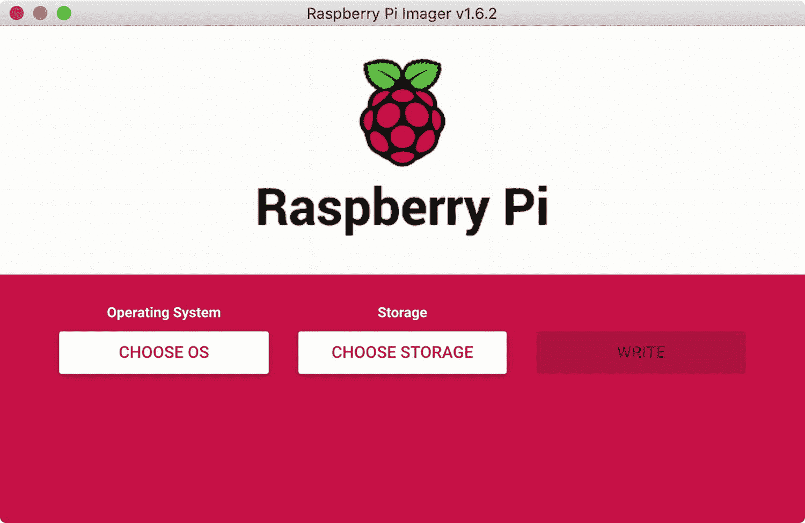

图 12-1

在 Mac 上运行 Raspberry Pi 成像仪

*   选择图像，默认为 Raspberry Pi OS (32 位)带桌面。

    或者，对于 64 位，您可以从 [`https://downloads.raspberrypi.org/raspios_arm64/img/`](https://downloads.raspberrypi.org/raspios_arm64/img/) 下载图像。下载 zip 文件并解压缩，以提取。iso 文件。然后选择菜单末端的`Use custom`选项。

*   插入 SD 卡后，单击选择存储将文件写入其中。你可能需要一个 SD 读卡器。一个 USB SD 卡读卡器简单又非常方便。等到它完成，并提取 SD 卡。

#### 树莓 Pi 配置

[`www.raspberrypi.org/documentation/configuration/`见](http://www.raspberrypi.org/documentation/configuration/)。第一次启动时，如果你安装了桌面，它将启动 X11，并显示一个配置对话框。按照说明配置您的语言、键盘设置和 Wi-Fi。应用更改并重新启动。

一旦它重新启动，X11 启动，从顶部菜单，选择首选项➤树莓 Pi 配置。

或者，如果您从命令行或通过 SSH 运行，您可以通过运行以下命令获得如图 [12-2](#Fig2) 所示的基于终端的工具:

```java
$ sudo raspi-config

```

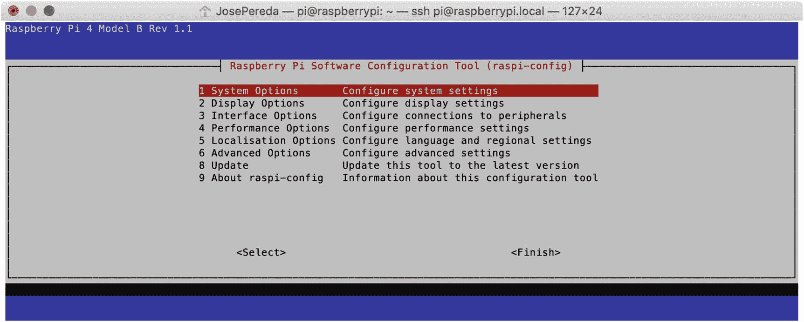

图 12-2

运行 raspi-config

##### raspi 配置

[`www.raspberrypi.org/documentation/configuration/raspi-config.md`见](http://www.raspberrypi.org/documentation/configuration/raspi-config.md)。

*   配置系统设置:
    *   更改用户密码:Raspbian 上的默认用户是`pi`，密码是`raspberry`。你可以在这里改变。为了方便，我将设置相同的密码:`pi`，这就方便了。当然，它与安全密码完全相反。

    *   主机名:它是该 Pi 在网络上的可见名称。如果需要，更改默认`raspberrypi`，例如，如果您有多个设备。

    *   无线局域网:如果在第一次 X11 会话中没有设置，请输入 SSID 和密码。它允许使用 Raspberry Pi 4 的内置无线连接来连接到无线网络，并允许您使用 SSH 从您通常的开发机器上远程工作。

    *   引导/自动登录:使用此选项将您的引导首选项更改为控制台或桌面。我们将选择控制台/命令行，但桌面也可以使用。为了方便起见，您也可以选择自动登录。

*   本地化选项:
    *   如果您之前在第一次 X11 会话期间没有设置它，请从键盘布局、时区、区域设置和 Wi-Fi 国家代码中选取。这些菜单上的所有选项默认为英制或 GB，除非您更改它们。

*   界面选项:
    *   相机:如果你有，你必须在这里启用它。

    *   SSH:启用它；这是远程访问所必需的。

*   性能选项:
    *   GPU 内存:如果要运行 JavaFX，至少为 GPU 设置 256–512 MB。

*   更新:推荐，但可能需要一段时间(仅当 Pi 连接到网络时)。

*   完成后，重新启动。

请注意，您可以在`/boot/config.txt`文件中直接找到应用的设置。

再次登录后，您可以检查 Wi-Fi 设置:

```java
$ sudo nano /etc/wpa_supplicant/wpa_supplicant.conf

```

您可以根据需要添加任意数量的 SSIDs。你可以用

```java
$ sudo iwlist wlan0 scan

```

以找到任何给定位置的可用网络。

运行`ifconfig`查看您的 Pi 是否连接到网络。如图 [12-3](#Fig3) 所示，`wlan0`在一个给定的本地 IP 地址上被连接，数据包被接收和发送(RX，TX)。

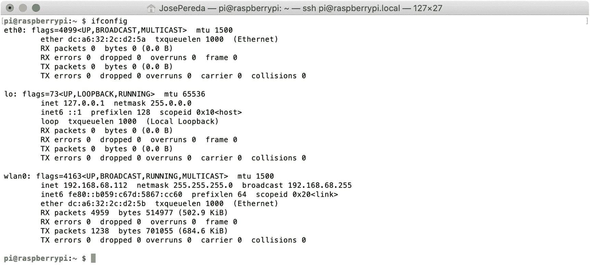

图 12-3

运行 ifconfig

默认情况下，使用 DHCP。如果您需要一个静态 IP 地址，检查链接 [`www.raspberrypi.org/documentation/configuration/tcpip/README.md`](http://www.raspberrypi.org/documentation/configuration/tcpip/README.md) 并运行

```java
$ sudo nano /etc/dhcpcd.conf

```

配置您的`eth0`或`wlan0`静态 IP 地址。

如果您有 7 英寸的 Raspberry Pi 显示屏，您需要将其旋转 180 度。编辑`config.txt`文件:

```java
$ sudo nano /boot/config.txt

```

在文件末尾添加以下内容:

```java
lcd_rotate=2

```

然后，保存(Ctrl+O)，退出(Ctrl+X)。

最后，请注意，在关闭 Raspberry Pi 之前，千万不要在它打开时从电源上拔下它，以防止损坏文件系统的风险。要获得关闭它的正确方法，请运行

```java
$ sudo shutdown –h now

```

然后稍等片刻，断开电源。

#### 通过 SSH 的远程连接

大多数时候，我们将通过 SSH 连接到 Raspberry Pi，以无标题方式运行(即 Pi 上没有专用的监视器和键盘)，从我们的开发机器直接访问(包括复制/粘贴和两者之间的文件传输选项)。

SSH 内置于 Linux 发行版和 macOS 中。对于 Windows 和移动设备，可以使用第三方 SSH 客户端。在 Linux 和 macOS 上，您可以使用 SSH 从 Linux 电脑、Mac 或其他 Raspberry Pi 连接到您的 Raspberry Pi，而无需安装其他软件。在 Windows 上，最常用的客户端叫做 PuTTY，可以从 greenend.org.uk 下载。 [`www.raspberrypi.org/documentation/remote-access/ssh/windows10.md`见](http://www.raspberrypi.org/documentation/remote-access/ssh/windows10.md)。

通常您会通过以下方式登录

```java
$ ssh pi@<IP>

```

您需要提供设备的 IP 地址。如果您已经连接到该 IP，您可以使用`hostname –I`来查找它，但如果不是这样，您可以尝试使用`nmap`或移动应用程序(如 Fing)在本地网络中查找该设备的 IP。

通常树莓派使用 DHCP，这意味着它没有固定的地址，重启后它可能会改变。这对于 SSH 连接来说并不方便。我们可以尝试设置一个固定的 IP，或者我们也可以尝试使用它的主机名来连接它，前提是它被广播到网络。这适用于 Raspberry Pi 操作系统，因为它使用多播 DNS 协议。


图 12-4

启动 SSH 会话

因为 macOS 和 Linux 都使用 Bonjour，所以都支持 mDNS。在 Windows 上，你可以从这里安装 Bonjour，比如 [`https://support.apple.com/kb/DL999`](https://support.apple.com/kb/DL999) 。

在这种情况下，您可以通过`hostname.local`登录

```java
$ ssh pi@raspberrypi.local

```

输入密码后，您将可以访问树莓派(图 [12-4](#Fig4) )。您将第一次看到安全性/真实性警告。键入 yes 继续。

最后，将您的开发机器的 SSH 公钥添加到设备上是很方便的，因此当运行 SSH 或 SCP 命令时，您不会一直被提示输入密码:

```java
$ ssh-copy-id pi@<IP>

```

更多详情可以看看 [`www.raspberrypi.org/documentation/remote-access/ssh/passwordless.md`](http://www.raspberrypi.org/documentation/remote-access/ssh/passwordless.md) 。

### Java 11

树莓 Pi OS 自带 Java for ARM 安装。如果你运行`java –version`，它会打印出来

```java
$ java -version
openjdk version "11.0.11" 2021-04-20
OpenJDK Runtime Environment (build 11.0.11+9-post-Debian-1deb10u1)
OpenJDK 64-Bit Server VM (build 11.0.11+9-post-Debian-1deb10u1, mixed mode)

```

但是，如果您在没有安装 Java 的发行版上运行(比如 Raspberry Pi OS Lite ),您可以很容易地用

```java
$ sudo apt update
$ sudo apt install default-jdk

```

#### 测试 Java 11

让我们测试 Java 11 和启动单文件源代码程序特性:

```java
$ cd /home/pi/
$ mkdir ModernClients
$ cd ModernClients
$ nano Test.java

```

添加一个如清单 [12-1](#PC16) 所示的 main 方法，或者从 Sample0: [`https://github.com/modernclientjava/mcj-samples/tree/master/ch12-RaspberryPi/Sample0`](https://github.com/modernclientjava/mcj-samples/tree/master/ch12-RaspberryPi/Sample0) 中复制文件。

```java
public class Test {
    public static void main(String... args) {
        System.out.println("Hello Java " +
             System.getProperty("java.version") + " for ARM!");
    }
}

Listing 12-1Sample0

```

保存，退出(Ctrl+O，Ctrl+X)，然后运行:

```java
$ java Test.java

```

应打印出图 [12-5](#Fig5) 的结果。


图 12-5

在树莓 Pi 上运行 Java 11

祝贺您在全新的 Raspberry Pi 上运行您的第一个 Java 11 应用程序！现在 Java 已经成功安装了，您可以进入下一步:安装 JavaFX。

### 安装 JavaFX 17

ARM 32 或 AArch64 的 JavaFX 17 builds 可以从 [`https://gluonhq.com/products/javafx`](https://gluonhq.com/products/javafx) 下载。这些 JavaFX 源代码与桌面平台(Windows、macOS、Linux)上使用的 Java FX 源代码完全相同，但是具有针对 ARM 和 32/64 位的特定驱动程序。注意 Linux 的常规 JavaFX 发行版不能工作，因为它是为 x86-64 构建的。

#### 32 位

从 SSH 会话中，下载 SDK，将其移动到`/opt,`并解压缩:

```java
$ wget https://gluonhq.com/download/javafx-17-ea-sdk-linux-arm32/ -O openjfx-17-ea+14_linux-arm32_bin-sdk.zip
$ sudo mv openjfx-17-ea+14_linux-arm32_bin-sdk.zip /opt
$ cd /opt
$ sudo unzip openjfx-17-ea+14_linux-arm32_bin-sdk.zip
$ sudo rm openjfx-17-ea+14_linux-arm32_bin-sdk.zip

```

如果您查看 lib 文件夹下的文件列表，您会发现不同 JavaFX 模块的 jar，以及 ARM 的本地库。

Note

虽然您会发现 media 和 web JavaFX 模块，但 ARM 尚不支持这些模块。摇摆也不是。

#### 64 位

从 SSH 会话中，下载 SDK，将其移动到`/opt,`并解压缩:

```java
$ wget https://gluonhq.com/download/javafx-17-ea-sdk-linux-aarch64-monocle/ -O openjfx-17-ea+14_monocle-linux-aarch64_bin-sdk.zip
$ sudo mv openjfx-17-ea+14_monocle-linux-aarch64_bin-sdk.zip /opt
$ cd /opt
$ sudo unzip openjfx-17-ea+14_monocle-linux-aarch64_bin-sdk.zip
$ sudo rm openjfx-17-ea+14_monocle-linux-aarch64_bin-sdk.zip

```

如果您查看 lib 文件夹下的文件列表，您会发现不同 JavaFX 模块的 jar，以及 ARM 的本地库。

Note

JavaFX SDK 64 bits 支持 ARM 上的媒体和 web JavaFX 模块。不支持 Swing。

#### 直接呈现管理器(DRM)

DRM 是一个内核模块，它提供对直接渲染基础架构客户端的直接硬件访问。

Raspberry Pi 支持开源的 VC4/V3D DRM 驱动。与 Raspberry Pi 4 捆绑在一起的 GPU 是 Broadcom VideoCore VI，支持 OpenGL ES 3.2 并使用 V3D 驱动程序，而 Raspberry Pi 3 中的 Broadcom VideoCore IV 只能支持 OpenGL ES 2.0 并使用 VC4 驱动程序。

如果尚未启用，要访问硬件加速，您可以启用可选的覆盖编辑`config.txt`文件

```java
$ sudo nano /boot/config.txt

```

在文件的末尾，您应该有

```java
# Enable DRM VC4 V3D drive
dtoverlay=vc4-fkms-v3d

```

然后，保存您所做的任何修改(Ctrl+O)，并退出(Ctrl+X)。如果需要，重新启动。

您应该检查设备`/dev/dri/card0`(或`/dev/dri/card1`)是否存在。

#### 运行 JavaFX 应用程序

为了支持硬件加速渲染，JavaFX 依赖于许多低级驱动程序和库，这些驱动程序和库并不总是默认安装在所有嵌入式系统上。例如，Raspberry Pi OS Lite 发行版就是这种情况，您可以使用

```java
$ sudo apt install libegl-mesa0 libegl1 libgbm1 libgles2 libpango-1.0.0 libpangoft2-1.0-0

```

JavaFX 对 DRM 的支持是 Gluon 的商业扩展。你可以通过设置环境变量`ENABLE_GLUON_COMMERCIAL_EXTENSIONS`来启用它，如果你的应用是非商业性的，或者如果你从 Gluon 获得了一个有效的许可(访问 [`https://gluonhq.com/contact-embedded/`](https://gluonhq.com/contact-embedded/) )。

要在当前会话中启用它，请运行

```java
$ export ENABLE_GLUON_COMMERCIAL_EXTENSIONS=true

```

或者将其添加到您的。bash 文件(为了方便起见，我们也导出`PATH_TO_FX`):

```java
$ nano /home/pi/.bashrc
export ENABLE_GLUON_COMMERCIAL_EXTENSIONS=true
export PATH_TO_FX=/opt/javafx-sdk-17/lib

```

保存并退出。

要为任何远程会话启用它，将它添加到`environment`文件也很方便:

```java
$ nano /etc/environment
ENABLE_GLUON_COMMERCIAL_EXTENSIONS=true

```

保存并退出。

#### 样本 1

现在让我们试着从链接 [`https://github.com/modernclientjava/mcj-samples/tree/master/ch12-RaspberryPi/Sample1`](https://github.com/modernclientjava/mcj-samples/tree/master/ch12-RaspberryPi/Sample1) 运行 HelloFX 示例，它是基于 [`https://openjfx.io/openjfx-docs/`](https://openjfx.io/openjfx-docs/) 示例的。

清单 [12-2](#PC26) 包含了从应用程序 JavaFX 类扩展而来的 HelloFX Java 类的代码。

```java
package org.modernclients.raspberrypi;
import javafx.application.Application;
import javafx.scene.Scene;
import javafx.scene.control.Label;
import javafx.scene.layout.StackPane;
import javafx.stage.Stage;

public class HelloFX extends Application {
    @Override
    public void start(Stage stage) {
        String javaVersion = System.getProperty("java.version");
        String javafxVersion = System.getProperty("javafx.version");
        Label label = new Label("Hello, JavaFX " + javafxVersion +
            ", running on Java " + javaVersion + ".");
        Scene scene = new Scene(new StackPane(label), 800, 480);
        stage.setScene(scene);
        stage.setTitle("Hello JavaFX");
        stage.show();
    }
    public static void main(String[] args) {
        launch(args);
    }
}

Listing 12-2Sample1

```

要现在运行它，从 SSH 会话中，让我们首先克隆带有示例的存储库:

```java
$ cd /home/pi/Downloads
$ wget https://github.com/modernclientjava/mcj-samples/archive/master.zip
$ unzip master.zip
$ mv mcj-samples-master /home/pi/ModernClients

```

现在输入样本 1:

```java
$ cd /home/pi/ModernClients/ch12-RaspberryPi/Sample1
$ javac --module-path $PATH_TO_FX --add-modules=javafx.controls \
    src/org/modernclients/raspberrypi/HelloFX.java -d dist
$ sudo -E java --module-path $PATH_TO_FX --add-modules=javafx.controls \
    -Dmonocle.platform=EGL -Dembedded=monocle -Dglass.platform=Monocle \
    -Dmonocle.egl.lib=$PATH_TO_FX/libgluon_drm-1.1.6.so \
    -cp dist/. org.modernclients.raspberrypi.HelloFX

```

该应用程序将会运行，但只会在连接的显示器上显示。您可以从 SSH 终端使用 Ctrl+C 退出应用程序。或者，您也可以尝试终止 Java 进程:

```java
$ sudo killall -9 java

```

如果一切都按预期运行，您将得到图 [12-6](#Fig6) 中的结果，流程的输出将显示如下

```java
[GluonDRM] use GPU at /dev/dri/card0 and display id -1

```

但是，如果该过程失败，并且您收到关于设备不具备 DRM 功能的警告，您可以再次尝试在前面的命令行中添加以下选项:

```java
-Degl.displayid=/dev/dri/card1

```

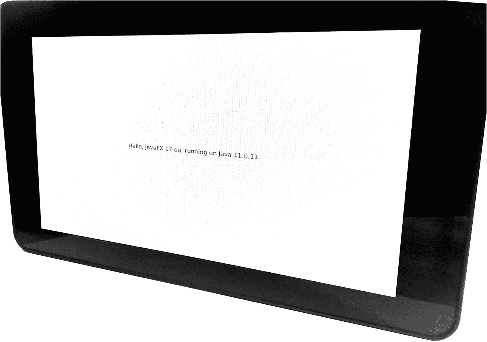

图 12-6

在树莓 Pi 上运行 JavaFX 11

JavaFX 鼠标事件需要写权限才能访问硬件，这就是为什么我们需要使用`sudo`；否则，应用程序将会启动，但会在控制台上显示一个异常:

```java
Udev: Failed to write to /sys/class/input/mice/uevent

```

检查您是否有权限访问输入设备:

```java
java.io.FileNotFoundException: /sys/class/input/mice/uevent (Permission denied)
    at java.base/java.io.FileOutputStream.open0(Native Method)
...
    at javafx.graphics/com.sun.glass.ui.monocle.SysFS.write(SysFS.java:121)
...

```

既然我们已经运行了示例，我们可以试着从 X11 会话中运行它，只要我们安装了带有桌面软件的 Raspberry Pi 操作系统。

从现在的树莓派，我们运行`startx`；然后我们打开一个终端，输入

```java
$ cd /home/pi/ModernClients/ch12-RaspberryPi/Sample1
$ sudo java --module-path $PATH_TO_FX --add-modules=javafx.controls \
    -cp dist/. org.modernclients.raspberrypi.HelloFX

```

由于我们已经移除了单片眼镜选项，现在我们有了一个常规的窗口应用程序(图 [12-7](#Fig7) )。我们可以用鼠标关闭它并停止 Java 进程。


图 12-7

在 X11 上运行 JavaFX

#### 样本 2

现在让我们通过使用 Gradle 或 Maven 这样的构建工具，并利用 Maven Central 上提供的 ARM 32/AArch64 的 JavaFX 构件，来尝试简化命令行过程。

无论如何，你还是需要检索胶子 DRM 库。您可以在`/opt/javafx-sdk-17/lib/libgluon_drm-1.1.6.so`下下载包含它的整个 SDK，也可以从以下网址下载:

*   32 位:

*   64 位:

```java
$ sudo wget http://download2.gluonhq.com/drm/lib-1.1.6/arm32/libgluon_drm.so -O /opt/javafx-sdk-17/lib/libgluon_drm-1.1.6.so

```

```java
$ sudo wget http://download2.gluonhq.com/drm/lib-1.1.6/aarch64/libgluon_drm.so -O /opt/javafx-sdk-17/lib/libgluon_drm-1.1.6.so

```

#### 格拉德尔

让我们运行样本 2:

```java
$ cd /home/pi/ModernClients/ch12-RaspberryPi/Sample2/

```

清单 [12-3](#PC38) 中显示的 build.gradle 文件包含任务`run`，该任务添加了运行进程所需的 JVM 参数。

```java
plugins {
  id 'application'
}

repositories {
    mavenCentral()
}

def osArch = System.properties['os.arch']
def version = "17-ea+14"
def platform = osArch == "arm" ? "linux-arm32-monocle" :
              "linux-aarch64-monocle"

mainClassName = "org.modernclients.raspberrypi.HelloFX"

dependencies {
    implementation "org.openjfx:javafx-base:$version:$platform"
    implementation "org.openjfx:javafx-graphics:$version:$platform"
    implementation "org.openjfx:javafx-controls:$version:$platform"
}

compileJava {
    doFirst {
        options.compilerArgs = [
                '--module-path', classpath
                      .filter(j -> j.toString().contains(osArch)).asPath,
                '--add-modules', 'javafx.controls'
        ]
    }
}

run {
    doFirst{
        environment "ENABLE_GLUON_COMMERCIAL_EXTENSIONS", "true"
        jvmArgs = [
                '-Dmonocle.platform=EGL', '-Dembedded=monocle',
                '-Dglass.platform=Monocle',
                "-Dmonocle.egl.lib=
                   /opt/javafx-sdk-17/lib/libgluon_drm-1.1.6.so",
                '--module-path', classpath
                      .filter(j -> j.toString().contains(osArch)).asPath,
                '--add-modules', 'javafx.controls'
        ]
    }
}

Listing 12-3Sample2 build.gradle file

```

你可以直接跑

```java
$ ./gradlew run

```

第一次它将下载 Gradle 7.0.1，并且它将创建一个 Gradle 守护进程，所以它可能需要一段时间才能开始。

按 Ctrl+C 退出应用程序。请注意，有时应用程序不会关闭，因为仍然有一些 Gradle 守护线程在运行。您可以通过找到 Java 进程的 ID 来阻止它们

```java
$ ps –aux
$ sudo kill <pid of Java process>

```

或者直接与

```java
$ sudo killall -9 java

```

还要注意的是，您可以通过编辑文件让 sudo 访问 Gradle 进程

```java
$ nano gradlew

```

并在最后加上

```java
exec sudo "$JAVACMD"...

```

保存并退出(Ctrl+O，Ctrl+X)。

#### 专家

另一种选择是使用 Maven 工具和`javafx-maven-plugin`。您可以很容易地在您的 Pi 上安装 Maven

```java
$ sudo apt-get install maven

```

清单 [12-4](#PC45) 显示了运行示例所需的 pom.xml 文件。

```java
<project xmlns:="http://maven.apache.org/POM/4.0.0" xmlns:xsi="http://www.w3.org/2001/XMLSchema-instance"
         xsi:schemaLocation="http://maven.apache.org/POM/4.0.0 http://maven.apache.org/maven-v4_0_0.xsd">
    <modelVersion>4.0.0</modelVersion>
    <groupId>org.modernclients.raspberrypi</groupId>
    <artifactId>hellofx</artifactId>
    <version>1.0-SNAPSHOT</version>

    <properties>
        <project.build.sourceEncoding>UTF-8</project.build.sourceEncoding>
        <maven.compiler.release>11</maven.compiler.release>
        <javafx.version>17-ea+14</javafx.version>
        <main.class>org.modernclients.raspberrypi.HelloFX</main.class>
        <runtime.jvm.options/>
    </properties>

    <dependencies>
        <dependency>
            <groupId>org.openjfx</groupId>
            <artifactId>javafx-controls</artifactId>
            <version>${javafx.version}</version>
        </dependency>
    </dependencies>

    <profiles>
        <profile>
            <id>default</id>
            <activation>
                <activeByDefault>true</activeByDefault>
            </activation>
        </profile>
        <profile>
            <id>pi</id>
            <properties>
                <runtime.jvm.options>-Dmonocle.platform=EGL,
                  -Dembedded=monocle,-Dglass.platform=Monocle,
         -Dmonocle.egl.lib=/opt/javafx-sdk-17/lib/libgluon_drm-1.1.6.so
            </runtime.jvm.options>
            </properties>
        </profile>
    </profiles>

    <build>
        <plugins>
            <plugin>
                <groupId>org.apache.maven.plugins</groupId>
                <artifactId>maven-compiler-plugin</artifactId>
                <version>3.8.1</version>
            </plugin>
            <plugin>
                <groupId>org.openjfx</groupId>
                <artifactId>javafx-maven-plugin</artifactId>
                <version>0.0.8</version>
                <configuration>
                    <mainClass>${main.class}</mainClass>
                    <options>${runtime.jvm.options}</options>
                </configuration>
            </plugin>
        </plugins>
    </build>

</project>

Listing 12-4Sample2 pom.xml file

```

在桌面上，你可以运行它

```java
mvn javafx:run

```

在你的树莓皮上，你可以尽情奔跑

```java
mvn -Ppi -Djavafx.monocle=true javafx:run

```

注意，现在所有的 JavaFX 依赖项都是从 Maven Central 下载的，我们必须使用`-Djavafx.monocle=true`来选择包含 Monocle 的依赖项。

### 远程运行 JavaFX 应用程序

虽然这些项目是在 Raspberry Pi 上本地编译和构建的，但与在您的机器上构建相比，它要慢得多，而且 IDE 的缺乏或 SSH 开发的不便促使人们寻找不同的方法:在您的常规机器上开发，然后在 Pi 上部署和运行。

另一方面，我们机器上的开发要快得多，但是我们仍然有部署问题:我们需要将应用程序的相关文件复制到 Raspberry Pi，然后才能在上面运行。

有几个选项可以复制所需的文件，比如经典的 FTP 甚至 SCP(通过 SSH 发送文件的命令)。这意味着你可以在电脑之间复制文件，从你的 Raspberry Pi 到你的台式机或笔记本电脑，反之亦然。

例如，假设我们有样本 3: `modernclientjava/mcj-samples/tree/master/ch12-RaspberryPi/Sample3`。我们在机器上用 Maven 编译并构建它，然后将结果类复制到 Raspberry Pi:

```java
$ cd mcj-samples-master/ch12-RaspberryPi/Sample3
$ mvn clean compile
$ cd ..
$ scp -r Sample3 pi@raspberrypi.local:/home/pi/ModernClients/ch12-RaspberryPi/Sample3
(add password)

```

现在，我们可以从 SSH 终端运行:

```java
$ cd /home/pi/ModernClients/ch12-RaspberryPi/Sample3/target
$ sudo -E java --module-path $PATH_TO_FX:classes -Dmonocle.platform=EGL \
     -Dembedded=monocle -Dmonocle.egl.lib=
          /opt/javafx-sdk-17/lib/libgluon_drm-1.1.6.so \
    -Dglass.platform=Monocle \
    -m hellofx/org.modernclients.raspberrypi.MainApp

```

虽然这是可行的，但这是一个乏味且容易出错的手动过程，如果我们能够将这一步骤集成到我们的 IDE 中，或者我们能够为我们的构建工具提供一个插件，那就更好了。

让我们检查一些选项。

#### Java 远程平台

NetBeans 不久前提出了远程平台的概念。您可以在另一台机器上定义 JVM 的设置，并使用 Ant 任务在那台机器上部署和运行 SSH。

这对于树莓派来说非常方便。

要安装 Apache NetBeans 12.4，您可以访问链接 [`https://netbeans.apache.org/download/nb124/nb124.html`](https://netbeans.apache.org/download/nb124/nb124.html) 并选择适合您平台的安装程序。

安装完成后，请转到工具➤ Java 平台。单击添加平台…并选择远程 Java 标准版。

提供关于平台的一些细节:远程平台的名称，(例如`Pi 17`)；主机(可以是`raspberrypi.local)`；用户，`pi`；密码；和远程 JRE 路径，`/usr/lib/jvm/java-11-openjdk-arm64`。见图 [12-8](#Fig8) 。

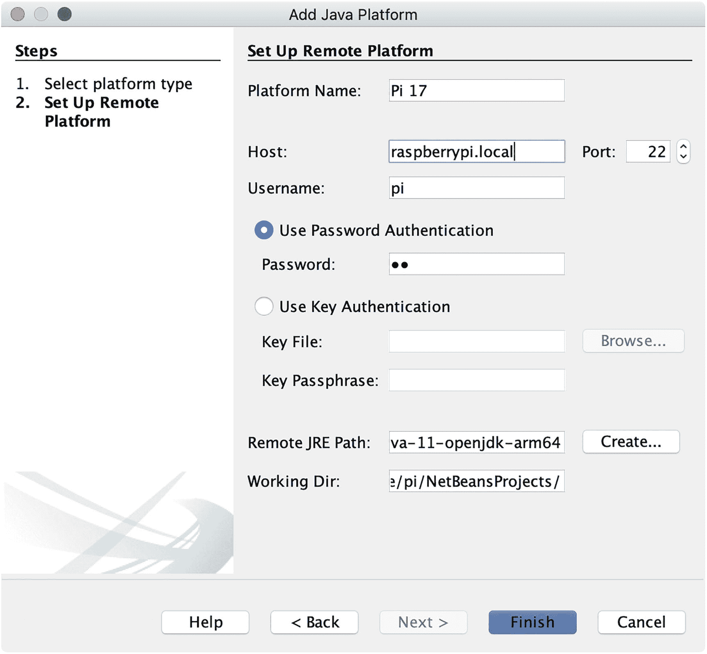

图 12-8

远程平台配置

创建远程平台后，确保将`sudo`添加到 exec 前缀，如图 [12-9](#Fig9) 所示。

最后，在 Raspberry Pi 可用的情况下，单击 Test Platform，看到测试成功了。否则，请确保所有字段都设置正确。

让我们用一个例子来试试远程平台。按照这里的说明， [`https://openjfx.io/openjfx-docs/#IDE-NetBeans`](https://openjfx.io/openjfx-docs/#IDE-NetBeans) ，在没有构建工具的情况下创建一个新的 Java 应用程序，或者从链接 [`https://github.com/modernclientjava/mcj-samples/tree/master/ch12-RaspberryPi/Sample4`](https://github.com/modernclientjava/mcj-samples/tree/master/ch12-RaspberryPi/Sample4) 下载 Sample4。

首先，确保应用在你的机器上运行良好。

现在在 NetBeans 上，编辑`Properties`，选择`Run` ➤ `Runtime Platform`，挑选`Pi 17`。提供一个配置名，如`Pi17`。确保提供 JavaFX SDK 的路径，并在 VM 选项中包含 Monocle 选项，如图 [12-10](#Fig10) 所示

```java
--module-path /opt/javafx-sdk-17/lib --add-modules=javafx.controls -Dembedded=monocle -Dglass.platform=Monocle

```

并关闭对话框。


图 12-10

设置项目属性以在远程平台上运行

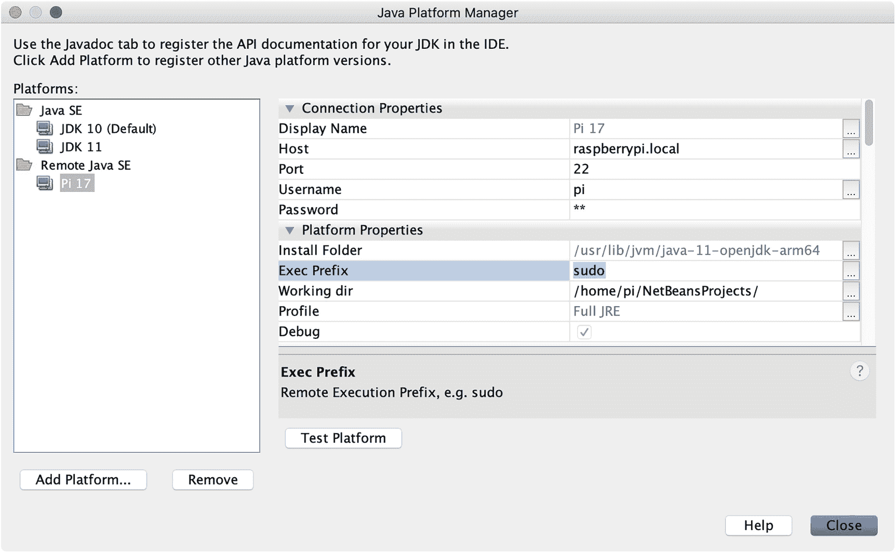

图 12-9

向远程平台添加 exec 前缀

当在桌面或 Raspberry Pi 上运行相同的应用程序时，可以方便地根据它运行的平台来调整它的窗口大小，如清单 [12-5](#PC51) 所示。

```java
String platform = System.getProperty("glass.platform");
Rectangle2D bounds;
if ("Monocle".equals(platform)) {
    bounds = Screen.getPrimary().getBounds();
} else {
    bounds = new Rectangle2D(0, 0, 600, 400);
}
Scene scene = new Scene(
    new StackPane(label), bounds.getWidth(), bounds.getHeight());

Listing 12-5Configure window size based on platform

```

现在从 Pi17 配置再次运行。您将在 NetBeans 输出窗口中看到连接详细信息:

```java
Connecting to raspberrypi.local:22
cmd : mkdir -p '/home/pi/NetBeansProjects//Sample4/dist'
Connecting to raspberrypi.local:22
done.
profile-rp-calibrate-passwd:
Connecting to raspberrypi.local:22
cmd : cd '/home/pi/NetBeansProjects//Sample4';
'/usr/lib/jvm/java-11-openjdk-arm64/bin/java'  -Dfile.encoding=UTF-8
 --module-path=/opt/javafx-sdk-17/lib -Dmonocle.platform=EGL
-Dembedded=monocle -Dmonocle.egl.lib=
      /opt/javafx-sdk-17/lib/libgluon_drm-1.1.6.so
-Dglass.platform=Monocle --add-modules=javafx.controls  -jar /home/pi/NetBeansProjects//Sample4/dist/HelloFX11.jar

```

您将在 Pi 的显示屏上看到您的应用程序运行良好，同时您可以在 NetBeans 输出窗口中看到该过程的输出。您甚至可以调试应用程序。

但是，这种方法有几个问题:它只能在 NetBeans 上工作，对于 Maven 或 Gradle 项目无效。

#### Gradle SSH Plugin

另一个选项是来自 [`https://gradle-ssh-plugin.github.io`](https://gradle-ssh-plugin.github.io) 的 SSH Gradle 插件。它将在终端或任何支持 Gradle 的 IDE 上运行 Gradle 项目。

现在让我们从 IntelliJ(或者您选择的任何 IDE)运行这个示例， [`https://github.com/modernclientjava/mcj-samples/tree/master/ch12-RaspberryPi/Sample5`](https://github.com/modernclientjava/mcj-samples/tree/master/ch12-RaspberryPi/Sample5) 。

编辑`build.gradle`文件，并验证所需的配置:工作目录、Java home、JavaFX 路径和您的远程配置(主机、用户和密码)，如清单 [12-6](#PC53) 所示。

```java
plugins {
    id 'application'
    id 'org.openjfx.javafxplugin' version '0.0.10'
    id 'org.hidetake.ssh' version '2.10.1'
}
repositories {
    mavenCentral()
}
javafx {
    modules = [ 'javafx.controls', 'javafx.fxml' ]
}
mainClassName = "$moduleName/org.modernclients.raspberrypi.MainApp"
def workingDir = '/home/pi/ModernClients/ch12-RaspberryPi/
def javaHome = '/usr'
def javafxHome = '/opt/javafx-sdk-17/lib'
task libs(type: Copy) {
    dependsOn 'jar'
    into "${buildDir}/libs/"
    from configurations.compileClasspath
}
remotes {
    pi17 {
        host = 'raspberrypi.local'
        user = 'pi'
        password = 'pi'
    }
}
task runRemoteEmbedded {
    dependsOn 'libs'
    ssh.settings {
        knownHosts = allowAnyHosts
    }
    doLast {
        ssh.run {
            session(remotes.pi17) {
                execute "mkdir -p ${workingDir}/${project.name}/dist"

                fileTree("${buildDir}/libs")
                        .filter { it.isFile() && ! it.name.startsWith('javafx')}
                        .files
                        .each { put from:it,
                    into: "${workingDir}/${project.name}/dist/${it.name}"}
                executeSudo "-E ${javaHome}/bin/java -Dfile.encoding=UTF-8 " +
                        "--module-path=${javafxHome}/lib:
                        ${workingDir}/${project.name}/dist " +
                        "-Dmonocle.platform=EGL -Dembedded=monocle
                         -Dglass.platform=Monocle " +
                        "-Dmonocle.egl.lib=
                           ${javafxHome}/libgluon_drm-1.1.6.so " +
                          "-classpath '${workingDir}/${project.name}/dist/*' " +
                        "-m ${project.mainClassName}"
            }
        }
    }
}

Listing 12-6Gradle build file for Sample5

```

Note

为了方便，任务设置`allowAnyHosts`，主机密钥检查关闭。它将打印一条警告消息，指出该过程容易受到中间人攻击，不建议将其用于生产。

有了这个插件，在终端按 Ctrl+C 只会杀死 Gradle 进程，而不会杀死应用程序。要解决这个问题，一定要在用户界面上添加一个“退出”按钮。

从 IDE Gradle 的窗口运行`runRemoteEmbedded`任务，如图 [12-11](#Fig11) ，或者从终端运行:

```java
$ ./gradlew runRemoteEmbedded

```

应用程序将被构建、部署到 Pi 并在其上执行，您将在您的终端中获得流程的输出，如图 [12-11](#Fig11) 所示。

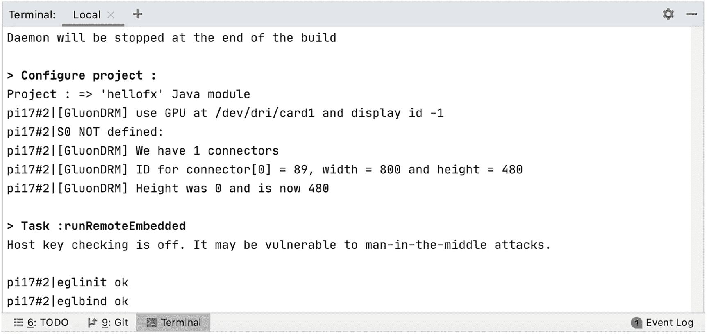

图 12-11

执行 runRemoteEmbedded 任务

### 创建 JavaFX 本机映像

您可以创建 JavaFX 应用程序的本机映像，并在 Raspberry Pi 上运行它，唯一的要求是 AArch64 (64 位)架构是当前唯一受支持的架构。

鉴于设备的硬件限制和本机映像进程的高 CPU/内存要求，创建本机映像的推荐方法是从桌面 Linux 机器(x86-64)进行交叉编译。

这台机器应该有从 [`https://github.com/gluonhq/graal/releases/latest`](https://github.com/gluonhq/graal/releases/latest) 下载并安装的 GraalVM for Linux，包括

```java
$ export GRAALVM_HOME=/path/to/graalvm-svm-linux-gluon-21.2.0-dev

```

然后，对于交叉编译，您还需要

```java
$ sudo apt-get install g++-aarch64-linux-gnu

```

清单 [12-7](#PC57) 显示了定义了`pi`概要文件的样本 6 的 pom 文件。它包括一些可能会根据您的设置而改变的属性。

```java
<?xml version="1.0" encoding="UTF-8"?>
<project xmlns:="http://maven.apache.org/POM/4.0.0" xmlns:xsi="http://www.w3.org/2001/XMLSchema-instance" xsi:schemaLocation="http://maven.apache.org/POM/4.0.0 http://maven.apache.org/xsd/maven-4.0.0.xsd">
    <modelVersion>4.0.0</modelVersion>
    <groupId>org.modernclients.raspberrypi</groupId>
    <artifactId>hellofx</artifactId>
    <version>1.0-SNAPSHOT</version>
    <packaging>jar</packaging>

    <name>HelloFX</name>

    <properties>
        <project.build.sourceEncoding>UTF-8</project.build.sourceEncoding>
        <maven.compiler.release>11</maven.compiler.release>
        <javafx.version>17-ea+14</javafx.version>
        <javafx.maven.plugin.version>0.0.6</javafx.maven.plugin.version>
        <gluonfx.maven.plugin.version>1.0.3</gluonfx.maven.plugin.version>
        <runtime.jvm.options/>
        <runtime.options/>
        <remote.host.name/>
        <remote.dir/>
        <main.class>org.modernclients.raspberrypi.HelloFX</main.class>
    </properties>

    <dependencies>

        <dependency>
            <groupId>org.openjfx</groupId>
            <artifactId>javafx-controls</artifactId>
            <version>${javafx.version}</version>
        </dependency>
    </dependencies>

    <build>
        <plugins>
            <plugin>
                <groupId>org.apache.maven.plugins</groupId>
                <artifactId>maven-compiler-plugin</artifactId>
                <version>3.8.1</version>
            </plugin>

            <plugin>
                <groupId>org.openjfx</groupId>
                <artifactId>javafx-maven-plugin</artifactId>
                <version>${javafx.maven.plugin.version}</version>
                <configuration>
                    <mainClass>${main.class}</mainClass>
                    <options>${runtime.jvm.options}</options>
                </configuration>
            </plugin>

            <plugin>
                <groupId>com.gluonhq</groupId>
                <artifactId>gluonfx-maven-plugin</artifactId>
                <version>${gluonfx.maven.plugin.version}</version>
                <configuration>
                    <target>${gluonfx.target}</target>
                    <mainClass>${main.class}</mainClass>
                    <runtimeArgs>${runtime.options}</runtimeArgs>
                    <remoteHostName>${remote.host.name}</remoteHostName>
                    <remoteDir>${remote.dir}</remoteDir>
                </configuration>
            </plugin>
        </plugins>

    </build>

    <profiles>
        <profile>
            <id>pi</id>
            <properties>
                <gluonfx.target>linux-aarch64</gluonfx.target>
                <remote.host.name>pi@raspberrypi.local</remote.host.name>
                <remote.dir>/home/pi/ModernClients/
                     ch12-RaspberryPi/Sample6</remote.dir>
                <runtime.options>-Duse.fullscreen=true,
                     -Dmonocle.platform=EGL,-Dembedded=monocle,
                     -Dglass.platform=Monocle</runtime.options>
                <runtime.jvm.options>-Dmonocle.egl.lib=
                     /opt/javafx-sdk-17/lib/libgluon_drm-1.1.6.so,
                     ${runtime.options}</runtime.jvm.options>
            </properties>
        </profile>
    </profiles>

</project>

Listing 12-7Maven pom file for Sample6

```

在您的 Linux 机器上获得 Sample6:

```java
$ wget https://github.com/modernclientjava/
mcj-samples/archive/refs/heads/master.zip -O ~/Downloads/ModernClients.zip
$ unzip ~/Downloads/ModernClients.zip
$ cd ~/Downloads/mcj-samples-master/ch12-RaspberryPi/Sample6

```

现在可以使用以下代码构建本机映像

```java
$ mvn -Ppi gluonfx:build

```

这将运行编译阶段，并将编译后的对象链接到可执行文件中。几分钟后，一旦该过程完成，您就可以将二进制文件部署到您的 Pi，前提是您已经在 pom 中正确定义了`remoteHostName`和`remoteDir`:

```java
$ mvn -Ppi gluonfx:install

```

最后，您可以通过 SSH 从您的机器上运行，使用

```java
$ mvn -Ppi gluonfx:nativerun

```

按 Ctrl+C 完成应用程序。

或者，您也可以从命令行直接在 Pi 上运行本机映像

```java
$ cd /home/pi/ModernClients/ch12-RaspberryPi/Sample6
$ sudo -E ./HelloFX -Dmonocle.platform=EGL \
-Dembedded=monocle -Dglass.platform=Monocle

```

### 使用依赖项

到目前为止，我们已经看到了非常简单的用例，它们有助于我们开始并正确设置一切。

现在我们来看一个更复杂的例子。

#### DIY 车载导航系统

以下项目是一个自制车载导航系统的概念验证。为此，我们将在树莓派上安装 GPS。JavaFX 应用程序将显示一张地图，GPS 读数将用于在我们当前位置的地图中心。

#### 材料清单

树莓 Pi 4 型号 B

7″显示屏 800×480；笼子是可选的，但建议使用。

树莓 Pi 和显示器的 5 V 电源适配器。电源组是可选的，但建议用于现场测试。

GPS:通用异步收发器(UART)系列 GPS Neo-7M (micro-USB 可选)(图 [12-12](#Fig12) )，比如这个: [`http://wiki.keyestudio.com/index.php/KS0319_keyestudio_GPS_Module`](http://wiki.keyestudio.com/index.php/KS0319_keyestudio_GPS_Module) 。

用于 GPIO 连接的四根母-母跳线。

微型 USB: USB 适配器(如果 GPS 分线架安装微型 USB)是可选的。

GPS 天线是可选的(但使用时，必须移除电容器 C2)。

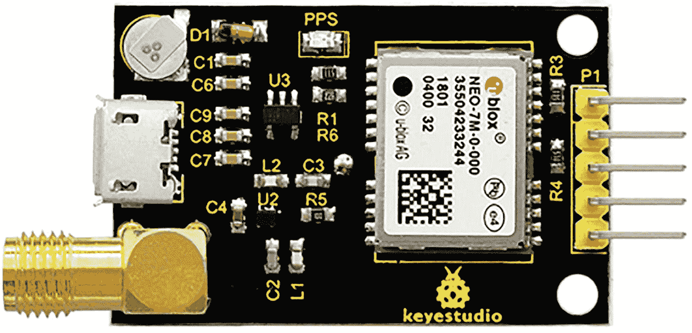

图 12-12

UART 串行 GPS Neo-7M。图片来自 [`http://wiki.keyestudio.com/File:KS0319.png`](http://wiki.keyestudio.com/File:KS0319.png)

##### GPIO 设置

我们将使用通用输入/输出(GPIO)引脚从 GPS 获取串行读数。

Raspberry Pi 串行端口由两个信号组成，一个*发送*信号(TxD)和一个*接收*信号(RxD)，可在 4 Model B 上的引脚 8 和 10 处获得(相当于图 [12-13](#Fig13) 中的接线 Pi 编号 15 和 16，按此顺序)。

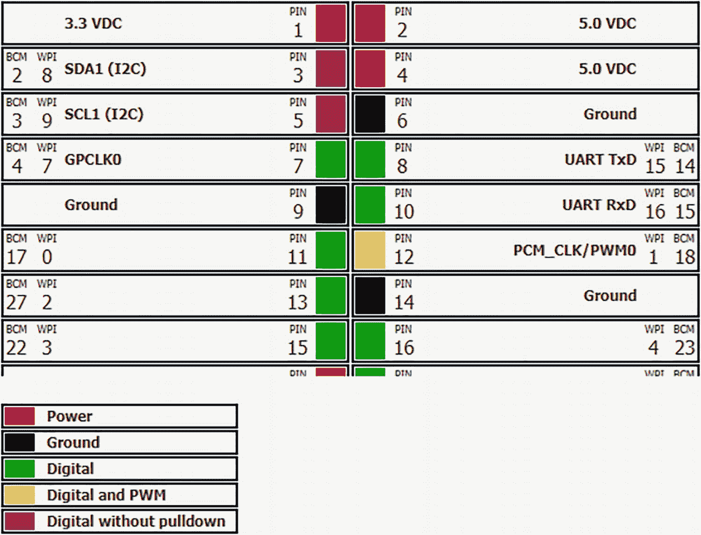

图 12-13

树莓 Pi 4 型号 B GPIO 引脚排列。图片来自 [`https://pi4j.com/assets/documentation/headerpins_in_header.png`](https://pi4j.com/assets/documentation/headerpins_in_header.png)

默认情况下，Raspberry Pi 上的串行端口被配置为控制台端口，用于与 Linux OS shell 通信。为了从软件程序访问串行端口，我们必须对其进行配置。打开一个 SSH 会话，运行

```java
$ sudo raspi-config

```

选择接口选项，现在选择串行端口。

现在，您必须选择`No`来禁用登录 shell 对串行的访问，然后选择`Yes`来启用硬件串行端口(或通用异步收发器的 UART)。接受并重启你的树莓派。

##### GPIO 连接

GPS 模块需要四个连接，可使用四根跨接线母-母连接；参见图 [12-14](#Fig14) ，从 GPIO 引脚的右到左:

*   VCC 引脚连接到引脚 2(电源 5 V)，红色跳线

*   GND 引脚连接到引脚 6(接地)，黄色跳线

*   RXD 引脚连接到引脚 8 (TxD UART，WiringPi 15)，绿色跳线

*   TXD 引脚连接到引脚 10 (RxD UART，WiringPi 16)，蓝色跳线

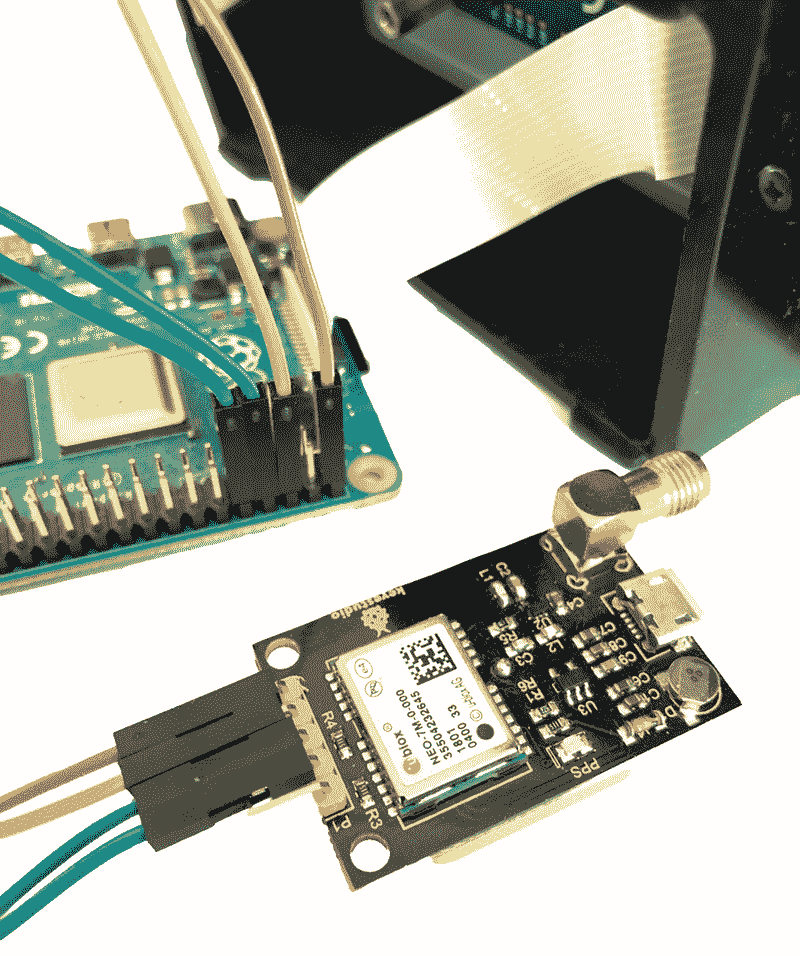

图 12-14

GPS 和 Raspberry Pi 4 型 GPIO 连接

请注意，可以使用分线板和引脚带状电缆，将 GPIO 引脚延伸到试验板，这样可以更容易地连接到 GPS。

##### 所需的 GPS 软件

我们需要从终端安装以下软件

```java
$ sudo apt-get install gpsd gpsd-clients

```

其中`gpsd`是 GPS 接收器的接口守护程序。完成后，如果已经连接了 GPS，您可以从编号最小的串行端口开始读取，方法是

```java
$ gpsd /dev/ttyS0

```

或者，如果您已将 USB 连接到

```java
gpsd /dev/ttyUSB0

```

启动`gpsd`的最佳选择是这项服务:

```java
$ sudo service gpsd start

```

服务启动后，您可以使用以下命令验证其状态

```java
$ sudo systemctl status gpsd.socket

```

这将显示如图 [12-15](#Fig15) 所示的内容。


图 12-15

gpsd 服务已启动

如果需要，您可以通过编辑文件来修改默认设置

```java
$ sudo nano /etc/default/gpsd

```

一旦一切正常运行，您就可以使用

```java
$ cgps /dev/ttyS0

```

或者用

```java
$ gpsmon /dev/ttyS0

```

如果你在室内，全球定位系统很可能无法连接到任何卫星，你不会收到任何价值。但是你仍然会得到一些读数。

如果你把你的 Raspberry Pi 带到户外，只要 Wi-Fi 连接保持，你仍然可以通过 SSH 连接到你的机器，并可视化这些读数，得到如图 [12-16](#Fig16) 所示的东西。


图 12-16

gpsd 服务处于活动状态并正在运行

##### NMEA 读物

NMEA 是国家海洋电子协会的首字母缩写，NMEA 0183 是所有 GPS 制造商支持的标准数据格式，使用 ASCII 串行通信协议。有不同的消息类型或*句子*，它们都以标题`$GP`和句子代码开始，如`GLL`代表地理位置、纬度、经度，以*和校验和结尾。一条可能的消息看起来像这样

```java
$GPGLL,5139.69658,N,00947.18207,W,200557.00,A,A*72

```

要了解所有可能的句子以及如何解析它们，可以看这个链接: [`http://aprs.gids.nl/nmea/`](http://aprs.gids.nl/nmea/) 。

清单 [12-8](#PC73) 显示了我们将在应用程序中使用的模型类，用于跟踪来自 GPS 的一些变量，如纬度、经度、高度或卫星数量，清单 [12-9](#PC74) 显示了最重要的 NMEA 消息(如 GPRMC 或 GPGGA)的可能解析器。

```java
package org.modernclients.raspberrypi.gps.service;
import javafx.beans.property.FloatProperty;
import javafx.beans.property.Property;
import org.modernclients.raspberrypi.gps.model.GPSPosition;
import java.util.HashMap;
import java.util.Map;
import java.util.concurrent.atomic.AtomicInteger;
import java.util.function.BiFunction;
import java.util.function.Function;
import java.util.function.UnaryOperator;
import java.util.logging.Logger;
public class NMEAParser {
    private static final Logger logger =
        Logger.getLogger(NMEAParser.class.getName());
    interface SentenceParser {
        boolean parse(String [] tokens, GPSPosition position);
    }
    private static final Map<String, SentenceParser> sentenceParsers =
        new HashMap<>();
    private final GPSPosition position;
    public NMEAParser(GPSPosition position) {
        this.position = position;
        sentenceParsers.put("GPGGA", new GPGGA());
        sentenceParsers.put("GPGGL", new GPGGL());
        sentenceParsers.put("GPRMC", new GPRMC());
        sentenceParsers.put("GPRMZ", new GPRMZ());
        sentenceParsers.put("GPVTG", new GPVTG());
    }
    public GPSPosition parse(final String line) {
        if (line.startsWith("$") && checksum(line)) {
            String[] tokens = line.substring(1).split(",");
            String type = tokens[0];
            if (sentenceParsers.containsKey(type)) {
                sentenceParsers.get(type).parse(tokens, position);
            }
            position.updatefix();
        }

        return position;
    }
    // parsers
    class GPGGA implements SentenceParser {
        @Override
        public boolean parse(String [] tokens, GPSPosition position) {
            parseCoordinate(tokens[2], tokens[3], "S",
                position.latitudeProperty());
            parseCoordinate(tokens[4], tokens[5], "W",
                position.longitudeProperty());
            doParse(tokens[1], Float::parseFloat, position.timeProperty());
            doParse(tokens[6], Integer::parseInt, position.qualityProperty());
            doParse(tokens[7], Integer::parseInt, position.satellitesProperty());
            return doParse(tokens[9], Float::parseFloat,
                position.altitudeProperty());
        }
    }
    class GPGGL implements SentenceParser {
        @Override
        public boolean parse(String [] tokens, GPSPosition position) {
            parseCoordinate(tokens[1], tokens[2], "S",
                position.latitudeProperty());
            parseCoordinate(tokens[3], tokens[4], "W",
                position.longitudeProperty());
            return doParse(tokens[5], Float::parseFloat, position.timeProperty());
        }
    }
    class GPRMC implements SentenceParser {
        @Override
        public boolean parse(String [] tokens, GPSPosition position) {
            doParse(tokens[1], Float::parseFloat, position.timeProperty());
            parseCoordinate(tokens[3], tokens[4], "S",
                position.latitudeProperty());
            parseCoordinate(tokens[5], tokens[6], "W",
                position.longitudeProperty());
            doParse(tokens[7], Float::parseFloat, position.velocityProperty());
            return doParse(tokens[8], Float::parseFloat,
                position.directionProperty());
        }

    }
    class GPVTG implements SentenceParser {
        @Override
        public boolean parse(String [] tokens, GPSPosition position) {
            return doParse(tokens[3], Float::parseFloat,
                position.directionProperty());
        }
    }
    class GPRMZ implements SentenceParser {
        @Override
        public boolean parse(String [] tokens, GPSPosition position) {
            return doParse(tokens[1], Float::parseFloat,
                position.altitudeProperty());
        }
    }
    private boolean parseCoordinate(String token, String direction, String
        defaultDirection, FloatProperty property) {
        if (token == null || token.isEmpty() || direction == null ||
            direction.isEmpty()) {
            return false;
        }
        int minutesPosition = token.indexOf('.') - 2;
        if (minutesPosition < 0) {
            return false;
        }

        float minutes = Float.parseFloat(token.substring(minutesPosition));
        float decimalDegrees = Float.parseFloat(token.substring(minutesPosition))
            / 60.0f;
        float degree = Float.parseFloat(token) - minutes;
        float wholeDegrees = (int) degree / 100;
        float coordinateDegrees = wholeDegrees + decimalDegrees;
        if (direction.startsWith(defaultDirection)) {
            coordinateDegrees = -coordinateDegrees;
        }
        property.setValue(coordinateDegrees);
        return true;
    }
    private <T> boolean doParse(String token, Function<String, T> operator,
        Property<T> property) {
        if (token == null || token.isEmpty()) {
            return false;
        }
        try {
            property.setValue(operator.apply(token));
            return true;
        } catch (NumberFormatException nfe) { }
        return false;
    }
    private static boolean checksum(String line) {
        if (line == null || ! line.contains("$") || ! line.contains("*")) {
            return false;
        }
        String sentence = line.substring(1, line.lastIndexOf("*"));
        String lineChecksum = "0x" + line.substring(line.lastIndexOf("*") + 1);
        int c = 0;
        for (char s : sentence.toCharArray()) {
            c ^= s;
        }
        String hex = String.format("0x%02X", c);
        boolean result = hex.equals(lineChecksum);
        if (! result) {
            logger.warning("There was an error in the checksum of " + line);
        }
        return result;
    }
}

Listing 12-9NMEAParser class

```

```java
package org.modernclients.raspberrypi.gps.model;
import javafx.beans.property.*;
public class GPSPosition {
    // time
    private final FloatProperty time = new SimpleFloatProperty(this, "time");
    public final FloatProperty timeProperty() { return time; }
    // getter & setter
    // latitude
    private final FloatProperty latitude = new SimpleFloatProperty(this,
        "latitude");
    public final FloatProperty latitudeProperty() { return latitude; }
    // getter & setter
    // longitude
    private final FloatProperty longitude = new SimpleFloatProperty(this,
        "longitude");
    public final FloatProperty longitudeProperty() { return longitude; }
    // getter & setter
    // direction
    private final FloatProperty direction = new SimpleFloatProperty(this,
        "direction");
    public final FloatProperty directionProperty() { return direction; }
    // getter & setter
    // altitude
    private final FloatProperty altitude = new SimpleFloatProperty(this,
        "altitude");
    public final FloatProperty altitudeProperty() { return altitude; }
    // getter & setter
    // velocity
    private final FloatProperty velocity = new SimpleFloatProperty(this,
        "velocity");
    public final FloatProperty velocityProperty() { return velocity; }
    // getter & setter
    // satellites
    private final IntegerProperty satellites = new SimpleIntegerProperty(this,
        "satellites");
    public final IntegerProperty satellitesProperty() { return satellites; }
    // getter & setter
    // quality
    private final IntegerProperty quality = new SimpleIntegerProperty(this,
         "quality");
    public final IntegerProperty qualityProperty() { return quality; }
    // getter & setter
    // fixed
    private final BooleanProperty fixed = new SimpleBooleanProperty(this,
        "fixed");
    public final BooleanProperty fixedProperty() { return fixed; }
    // getter & setter
    public void updatefix() {
        fixed.set(quality.get() > 0);
    }

    @Override
    public String toString() {
        return "GPSPosition{" +
                "time=" + time.get() +
                ", latitude=" + latitude.get() +
                ", longitude=" + longitude.get() +
                ", direction=" + direction.get() +
                ", altitude=" + altitude.get() +
                ", velocity=" + velocity.get() +
                ", quality=" + quality.get() +
                ", satellites =" + satellites.get() +
                ", fixed=" + fixed.get() +
                '}';
    }
}

Listing 12-8GPSPosition class

```

##### GPIO 和 Java

##### Pi4J

Pi4J 是一个 Java 库，可用于访问 Raspberry Pi 的 GPIO 引脚。正如你可以在 [`http://pi4j.com/`](http://pi4j.com/) 读到的

> 这个项目旨在为 Java 程序员提供一个友好的面向对象的 I/O API *和实现库，以访问 Raspberry Pi 平台的全部 I/O 功能。这个项目抽象了低级本机集成和中断监控，使 Java 程序员能够专注于实现他们的应用程序业务逻辑。*

我们将使用它最新的稳定版本 1.4，所以我们只需要在构建中包含依赖关系:

```java
dependencies {
    implementation 'com.pi4j:pi4j-core:1.4'
}

```

使用 Pi4J，创建一个`Serial`对象就像

```java
Serial serial = SerialFactory.createInstance();

```

然后，我们可以向它添加一个侦听器，这样我们就可以对任何传入的串行事件做出反应，并且我们可以根据通常的设置来配置串行。

注意，这个库只能在 Raspberry Pi 上运行，但是它可以在您的机器上使用和编译。

##### 威灵皮

在使用 Pi4J 之前，必须在 Raspberry Pi: WiringPi 上提供一个本机依赖项。

虽然 Raspberry Pi 3 型号内置了它，但在型号 4 B 上，您需要执行以下步骤来安装最新(非官方)版本:

```java
sudo apt-get remove wiringpi -y
sudo apt-get --yes install git-core gcc make
cd ~/Downloads
git clone https://github.com/WiringPi/WiringPi --branch master
   --single-branch wiringpi
sudo ~/buildings/wiringpi/build

```

##### GPS 服务

清单 [12-10](#PC78) 显示了打开串口并开始监听串行事件的服务类，一个接一个地提取从`gpsd`进程接收到的所有句子。

```java
package org.modernclients.raspberrypi.gps.service;
import com.pi4j.io.gpio.GpioController;
import com.pi4j.io.gpio.GpioFactory;
import com.pi4j.io.serial.*;
import javafx.application.Platform;
import javafx.beans.property.SimpleStringProperty;
import javafx.beans.property.StringProperty;
import org.modernclients.raspberrypi.gps.model.GPSPosition;
import javax.annotation.PostConstruct;
import javax.inject.Inject;
import java.io.IOException;
import java.nio.charset.Charset;
import java.util.logging.Logger;
public class GPSService {
    private static final Logger logger =
        Logger.getLogger(GPSService.class.getName());
    @Inject
    private GPSPosition gpsPosition;
    private Serial serial;
    private GpioController gpio;
    private NMEAParser nmea;
    private StringBuilder gpsOutput;
    private final StringProperty line = new SimpleStringProperty();
    @PostConstruct
    private void postConstruct() {
        if (!"monocle".equals(System.getProperty("embedded"))) {
            return;
        }
        nmea = new NMEAParser(gpsPosition);
        gpsOutput = new StringBuilder();
        gpio = GpioFactory.getInstance();
        serial = SerialFactory.createInstance();
        serial.addListener(event -> {
            try {
                String s = event.getString(Charset.defaultCharset())
                        .replaceAll("\n", "")
                        .replaceAll("\r", "");
                gpsOutput.append(s);
                processReading();
            } catch (IOException e) {
                logger.warning("Error processing event " + event);
                e.printStackTrace();
            }

        });
        SerialConfig config = new SerialConfig();
        try {
            String defaultPort = SerialPort.getDefaultPort();
            logger.info("Connecting to default port = " + defaultPort);
            config.device(defaultPort)
                    .baud(Baud._9600)
                    .dataBits(DataBits._8)
                    .parity(Parity.NONE)
                    .stopBits(StopBits._1)
                    .flowControl(FlowControl.NONE);
            serial.open(config);
            logger.info("Connected: " + serial.isOpen());
        } catch (IOException | InterruptedException e) {
            e.printStackTrace();
        }
    }
    private void processReading() {
        if (gpsOutput == null || gpsOutput.toString().isEmpty()) {
            return;
        }
        String reading = gpsOutput.toString().trim();
        if (!reading.contains("$")) {
            return;
        }
        String[] split = reading.split("\\$");
        for (int i = 0; i < split.length - 1; i++) {
            String line = "$" + split[i];
            gpsOutput.delete(0 , line.length());
            if (line.length() > 1) {
                logger.fine("GPS: " + line);
                Platform.runLater(() -> {
                    nmea.parse(line);
                    this.line.set(line);
                });
            }

            if (i == split.length - 2) {
                gpsOutput.insert(0, "$");
            }
        }
    }
    public final StringProperty lineProperty() {
        return line;
    }
    public void stop() {
        logger.info("Stopping Serial and GPIO");
        if (serial != null) {
            try {
                serial.close();
            } catch (IOException e) {
                e.printStackTrace();
            }
        }
        if (gpio != null) {
            gpio.shutdown();
        }
    }
}

Listing 12-10GPSService class

```

当从一个串行端口读取时，我们必须意识到我们有一个连续的字节流，所以我们必须把它们正确地转换成字符串并取出每个句子。这就是`processReading`方法在单个`StringBuilder`的帮助下所做的事情。

另外，注意这个线程是在后台运行的，所以每当有一个新句子时，我们将在 JavaFX 应用程序线程上使用`Platform::runLater`和 JavaFX 属性一起使用它。

对于每个句子，我们将调用 NMEA 解析器并用新值更新 GPSPosition 对象。

#### 用户界面

现在让我们定义 JavaFX 接口:我们将显示一张地图，该地图将以从 GPS 读数中检索到的纬度和经度坐标为中心。

##### 胶子图

Gluon Maps ( [`https://gluonhq.com/labs/maps/`](https://gluonhq.com/labs/maps/) )是一个开源的 JavaFX 11+库，它提供了一个地图查看器组件，从 OpenStreetMap 呈现基于图块的地图。此处项目可用: [`https://github.com/gluonhq/maps`](https://github.com/gluonhq/maps) 。

我们可以在视图的中心添加一个`MapView`容器，并使用一个`MapLayer`来呈现我们的位置。在内置 GPS 传感器的移动设备上，我们可以使用胶子定位服务，但在 Raspberry Pi(或任何连接了 GPS 传感器的台式机)上，我们可以使用前面文本中列出的`GPSService`。

要添加地图，我们需要以下依赖项:

```java
repositories {
    mavenCentral()
    maven {
       url 'https://nexus.gluonhq.com/nexus/content/repositories/releases/'
    }
}
dependencies {
    implementation 'com.gluonhq:maps:2.0.0-ea+4'
    implementation 'com.gluonhq.attach:storage:4.0.11:desktop'
    implementation 'com.gluonhq.attach:util:4.0.11'
}

```

为了方便起见，我们将定义一个`PoiLayer`，它可以基于纬度和经度将 JavaFX 节点放置在基本地图的顶部，这将是我们感兴趣的点(清单 [12-11](#PC80) )。

```java
package org.modernclients.raspberrypi.gps.view;
import com.gluonhq.maps.MapLayer;
import com.gluonhq.maps.MapPoint;
import javafx.collections.FXCollections;
import javafx.collections.ObservableList;
import javafx.geometry.Point2D;
import javafx.scene.Node;
import javafx.util.Pair;
public class PoiLayer extends MapLayer {
    private final ObservableList<Pair<MapPoint, Node>> points;
    public PoiLayer() {
        points = FXCollections.observableArrayList();
    }
    public void addPoint(MapPoint p, Node icon) {
        points.add(new Pair(p, icon));
        this.getChildren().add(icon);
        this.markDirty();
    }
    @Override
    protected void layoutLayer() {
        for (Pair<MapPoint, Node> candidate : points) {
            MapPoint point = candidate.getKey();
            Node icon = candidate.getValue();
            Point2D mapPoint = getMapPoint(point.getLatitude(),
                point.getLongitude());
            icon.setVisible(true);
            icon.setTranslateX(mapPoint.getX());
            icon.setTranslateY(mapPoint.getY());
        }
    }
}

Listing 12-11PoiLayer class

```

##### 加力燃烧室

Afterburner 是一个方便的极简 MVP 框架，基于 Adam Bien 的配置约定和依赖注入，可以在这个链接找到: [`https://github.com/AdamBien/afterburner.fx`](https://github.com/AdamBien/afterburner.fx) 。为了使用它，我们需要

```java
repositories {
    mavenCentral()
}
dependencies {
    implementation 'com.airhacks:afterburner.fx:1.7.0'
    implementation 'javax.annotation:javax.annotation-api:1.3.2'
}

```

##### 场景构建器

最后，我们将使用 [`https://gluonhq.com/products/scene-builder/`](https://gluonhq.com/products/scene-%25C2%25ADbuilder/) 的场景构建器 16.0 在我们的机器上用 FXML 设计 UI。

将胶子图导入到 Scene Builder 自定义控件库中很方便(图 [12-17](#Fig17) )。

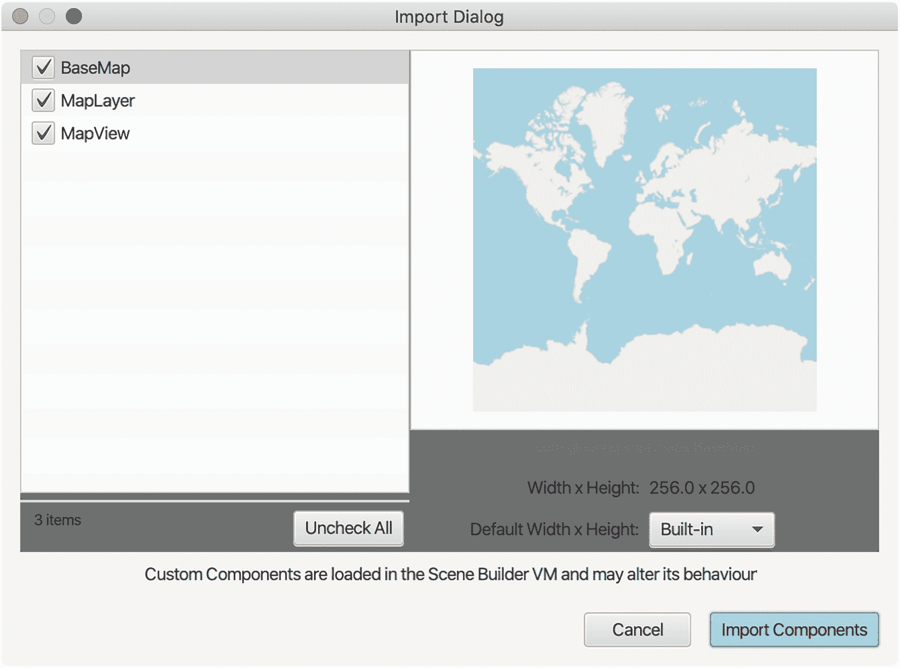

图 12-17

将胶子贴图导入场景构建器

然后我们可以创建一个新的 FXML 文件，带有一个顶部的`BorderPane`容器，并拖放所需的组件:一个工具栏在顶部，一个`MapView`在中间，一个`VBox`在右边带有标签以显示当前的 GPSPosition 值，一个`ListView`在底部显示 NMEA 句子(图 [12-18](#Fig18) )。


图 12-18

在场景构建器中设计用户界面

请注意，使用加力燃烧室，我们将创建以下文件:

Java 类:

*   从 FXMLView 扩展而来的`org.modernclients.raspberrypi.gps.view.UIView`(清单 [12-12](#PC82) )，FXML view 是一个方便的容器，按照惯例负责加载 FXML、CSS 或属性文件

*   `org.modernclients.raspberrypi.gps.view.UIPresenter`(列表 [12-16](#PC86) )

资源文件:

*   org . modern clients . raspberrypi . GPS . view . ui . fxml(列表 [12-13](#PC83) )

*   org . modern clients . raspberrypi . GPS . view . ui . CSS(列表 [12-14](#PC84) )

*   org . modern clients . raspberrypi . GPS . view . ui . properties(列表 [12-15](#PC85) )

```java
button.show.log=Show Log
button.zoom.in=+
button.zoom.out=-
button.exit=Exit
label.time=Time
label.position=Position
label.altitude=Altitude
label.direction=Direction
label.speed=Speed
label.quality=Quality
label.satellites=Number of Satellites
label.gps=GPS Status: {0}
label.gps.fixed=fixed
label.gps.not-fixed=not fixed

Listing 12-15ui.properties file

```

```java
.box {
    -fx-padding: 20;
    -fx-spacing: 10;
    -fx-border-color: darkgray;
    -fx-border-width: 0 0 0 1;
}
.label.gps-data {
    -fx-text-fill: blue;
    -fx-font-size: 1.1em;
}
.label.gps {
    -fx-text-fill: darkgray;
    -fx-font-size: 1.0em;
}

Listing 12-14ui.css file

```

```java
<?xml version="1.0" encoding="UTF-8"?>
<?import com.gluonhq.maps.MapView?>
<?import javafx.geometry.Insets?>
<?import javafx.scene.control.Button?>
<?import javafx.scene.control.Label?>
<?import javafx.scene.control.ListView?>
<?import javafx.scene.control.Separator?>
<?import javafx.scene.control.ToggleButton?>
<?import javafx.scene.control.ToolBar?>
<?import javafx.scene.layout.BorderPane?>
<?import javafx.scene.layout.Pane?>
<?import javafx.scene.layout.VBox?>
<BorderPane fx:id="pane" xmlns:="http://javafx.com/javafx/11.0.1" xmlns:fx="http://javafx.com/fxml/1" fx:controller="org.modernclients.raspberrypi.gps.view.UIPresenter">
   <bottom>
      <ListView fx:id="listView" maxHeight="200.0" BorderPane.alignment="CENTER" />
   </bottom>
   <right>
      <VBox prefHeight="250.0" prefWidth="200.0" styleClass="box"
         BorderPane.alignment="CENTER">
         <children>
            <VBox>
               <children>
                  <Label styleClass="gps" text="%label.time" />
                  <Label fx:id="timeLabel" styleClass="gps-data" />
               </children>
            </VBox>
            <VBox>
               <children>
                  <Label styleClass="gps" text="%label.position" />
                  <Label fx:id="positionLabel" styleClass="gps-data" />
               </children>
            </VBox>
            <VBox>
               <children>
                  <Label styleClass="gps" text="%label.altitude" />
                  <Label fx:id="altitudeLabel" styleClass="gps-data" />
               </children>
            </VBox>
            <VBox>
               <children>

                  <Label styleClass="gps" text="%label.direction" />
                  <Label fx:id="directionLabel" styleClass="gps-data" />
               </children>
            </VBox>
            <VBox layoutX="10.0" layoutY="112.0">
               <children>
                  <Label styleClass="gps" text="%label.speed" />
                  <Label fx:id="speedLabel" styleClass="gps-data" />
               </children>
            </VBox>
            <VBox layoutX="10.0" layoutY="146.0">
               <children>
                  <Label styleClass="gps" text="%label.quality" />
                  <Label fx:id="qualityLabel" styleClass="gps-data" />
               </children>
            </VBox>
            <VBox layoutX="10.0" layoutY="146.0">
               <children>
                  <Label styleClass="gps" text="%label.satellites" />
                  <Label fx:id="satellitesLabel" styleClass="gps-data" />
               </children>
            </VBox>
         </children>
      </VBox>
   </right>
   <top>
      <ToolBar BorderPane.alignment="CENTER">
         <items>
            <Label fx:id="statusLabel" styleClass="gps-data" text="%label.gps" />
            <Pane maxWidth="1.7976931348623157E308" prefWidth="200.0" />
            <Separator orientation="VERTICAL" />
            <ToggleButton fx:id="showLog"
               mnemonicParsing="false" text="%button.show.log" />
            <Separator layoutX="324.0" layoutY="10.0" orientation="VERTICAL" />
            <Button mnemonicParsing="false"
                onAction="#onZoomIn" text="%button.zoom.in" />
            <Button layoutX="10.0" layoutY="10.0" mnemonicParsing="false"
                onAction="#onZoomOut" text="%button.zoom.out" />
            <Separator layoutX="440.0" layoutY="10.0" orientation="VERTICAL" />
            <Button layoutX="20.0" layoutY="20.0"
               mnemonicParsing="false" onAction="#onExit"
               text="%button.exit" />
         </items>

         <padding>
            <Insets bottom="10.0" left="10.0" right="10.0" top="10.0" />
         </padding>
      </ToolBar>
   </top>
   <center>
      <MapView fx:id="mapView" BorderPane.alignment="CENTER" />
   </center>
</BorderPane>

Listing 12-13ui.fxml file

```

```java
package org.modernclients.raspberrypi.gps.view;
import com.airhacks.afterburner.views.FXMLView;
import java.util.ResourceBundle;
public class UIView extends FXMLView {
    public UIView() {
        this.bundle = ResourceBundle.getBundle(bundleName);
    }
}

Listing 12-12UIView class

```

一旦我们有了所有这些文件，现在是时候添加演示者了(清单 [12-16](#PC86) )。

```java
package org.modernclients.raspberrypi.gps.view;
import com.gluonhq.maps.MapPoint;
import com.gluonhq.maps.MapView;
import javafx.application.Platform;
import javafx.beans.binding.Bindings;
import javafx.fxml.FXML;
import javafx.scene.control.Label;
import javafx.scene.control.ListView;
import javafx.scene.control.ToggleButton;
import javafx.scene.layout.BorderPane;
import javafx.scene.paint.Color;
import javafx.scene.shape.Circle;
import org.modernclients.raspberrypi.gps.model.GPSPosition;
import org.modernclients.raspberrypi.gps.service.GPSService;
import javax.inject.Inject;
import java.text.MessageFormat;
import java.util.ResourceBundle;
import java.util.logging.Logger;

public class UIPresenter {
private static final Logger logger =
    Logger.getLogger(UIPresenter.class.getName());
    @FXML private BorderPane pane;
    @FXML private Label statusLabel;
    @FXML private MapView mapView;
    @FXML private ListView<String> listView;
    @FXML private Label timeLabel;
    @FXML private Label positionLabel;
    @FXML private Label altitudeLabel;
    @FXML private Label directionLabel;
    @FXML private Label speedLabel;
    @FXML private Label qualityLabel;
    @FXML private Label satellitesLabel;
    @FXML private ToggleButton showLog;
    @FXML private ResourceBundle resources;
    @Inject private GPSService service;
    @Inject private GPSPosition gpsPosition;
    private MapPoint mapPoint;
    public void initialize() {
        logger.info("Platform: " + System.getProperty("embedded"));
        mapView = new MapView();
        mapPoint = new MapPoint(50.0d, 4.0d);
        mapView.setCenter(mapPoint);
        mapView.setZoom(15);
        PoiLayer poiLayer = new PoiLayer();
        poiLayer.addPoint(mapPoint, new Circle(7, Color.RED));
        mapView.addLayer(poiLayer);
        pane.setCenter(mapView);
        service.lineProperty().addListener((obs, ov, nv) -> {
            logger.fine(nv);
            listView.getItems().add(nv);
            listView.scrollTo(listView.getItems().size() - 1);
            if (listView.getItems().size() > 100) {
                listView.getItems().remove(0);
            }

        });
        gpsPosition.timeProperty().addListener((obs, ov, nv) -> {
            statusLabel.setText(
               MessageFormat.format(resources.getString("label.gps"),
                  gpsPosition.isFixed() ?
                    resources.getString("label.gps.fixed") :
                    resources.getString("label.gps.not-fixed")));
            mapPoint.update(gpsPosition.getLatitude(),
                 gpsPosition.getLongitude());
            mapView.setCenter(mapPoint);
        });
        timeLabel.textProperty().bind(Bindings.createStringBinding(() -> {
            float time = gpsPosition.getTime();
            int hour = (int) (time / 10000f);
            int min = (int) ((time - hour * 10000) / 100f);
            int sec = (int) (time - hour * 10000 - min * 100);
            return String.format("%02d:%02d:%02d UTC", hour, min, sec);
        }, gpsPosition.timeProperty()));
        positionLabel.textProperty().bind(Bindings.format("%.6f, %.6f",
             gpsPosition.latitudeProperty(),
             gpsPosition.longitudeProperty()));
        altitudeLabel.textProperty().bind(Bindings.format("%.1f m",
            gpsPosition.altitudeProperty()));
        speedLabel.textProperty().bind(Bindings.format("%.2f m/s",
            gpsPosition.velocityProperty()));
        directionLabel.textProperty().bind(Bindings.format("%.2f °",
            gpsPosition.directionProperty()));
        qualityLabel.textProperty().bind(Bindings.format("%d",
            gpsPosition.qualityProperty()));
        satellitesLabel.textProperty().bind(Bindings.format("%d",
            gpsPosition.satellitesProperty()));
        statusLabel.setText(MessageFormat.format(resources.getString("label.gps"),
            resources.getString("label.gps.not-fixed")));
        listView.managedProperty().bind(listView.visibleProperty());
        listView.visibleProperty().bind(showLog.selectedProperty());
        showLog.setSelected(false);
    }

    public void stop() {
        service.stop();
    }
    @FXML private void onExit(){
        Platform.exit();
    }
    @FXML private void onZoomIn() {
        if (mapView.getZoom() < 19) {
            mapView.setZoom(mapView.getZoom() + 1);
        }
    }
    @FXML private void onZoomOut() {
        if (mapView.getZoom() > 1) {
            mapView.setZoom(mapView.getZoom() - 1);
        }
    }
}

Listing 12-16UIPresenter class

```

`GPSPosition`和`GPSService`对象被注入到 presenter 中，不同标签的文本属性被绑定到 JavaFX 属性。请注意，在应用程序关闭时停止服务是很重要的。这将关闭串行端口并释放 GPIO 控制器。

##### 应用程序类

我们的主类将为场景创建一个视图并启动应用程序(清单 [12-17](#PC87) )。基于 Raspberry Pi 屏幕设置场景尺寸很重要。

```java
package org.modernclients.raspberrypi.gps;
import com.airhacks.afterburner.injection.Injector;
import javafx.application.Application;
import javafx.geometry.Rectangle2D;
import javafx.scene.Scene;
import javafx.stage.Screen;
import javafx.stage.Stage;
import org.modernclients.raspberrypi.gps.view.UIPresenter;
import org.modernclients.raspberrypi.gps.view.UIView;
public class MainApp extends Application {
    private UIPresenter controller;
    @Override
    public void start(Stage stage) throws Exception {
        Rectangle2D bounds = Screen.getPrimary().getBounds();
        UIView ui = new UIView();
        controller = (UIPresenter) ui.getPresenter();
        Scene scene = new Scene(ui.getView(),
            bounds.getWidth(), bounds.getHeight());
        stage.setTitle("Embedded Maps");
        stage.setScene(scene);
        stage.show();
    }
    @Override
    public void stop() throws Exception {
        controller.stop();
        Injector.forgetAll();
    }
    public static void main(String[] args) {
        launch(args);
    }
}

Listing 12-17MainApp class

```

最后，清单 [12-18](#PC88) 显示了生成模块`org.modernclients.raspberrypi.gps`的模块信息描述符，清单 [12-19](#PC89) 显示了`build.gradle`文件。

```java
plugins {
    id 'application'
    id 'org.openjfx.javafxplugin' version '0.0.10'
    id 'org.hidetake.ssh' version '2.10.1'
}
repositories {
    mavenCentral()
    maven {
        url 'http://nexus.gluonhq.com/nexus/content/repositories/releases/'
    }
}
dependencies {
    implementation 'com.pi4j:pi4j-core:1.4'
    implementation 'com.gluonhq:maps:2.0.0-ea+4'
    implementation 'com.gluonhq.attach:storage:4.0.11:desktop'
    implementation 'com.gluonhq.attach:util:4.0.11'
    implementation 'com.airhacks:afterburner.fx:1.7.0'
    implementation 'javax.annotation:javax.annotation-api:1.3.2'
}
javafx {
    modules = [ 'javafx.controls', 'javafx.fxml' ]
}
mainClassName = "$moduleName/org.modernclients.raspberrypi.gps.MainApp"
jar {
    manifest {
        attributes 'Main-Class': 'org.modernclients.raspberrypi.gps.MainApp'
    }
}
def workingDir = '/home/pi/ModernClients/ch12-RaspberryPi/Sample7'
def javaHome = '/usr'
def javafxHome = '/opt/javafx-sdk-17/lib'
task libs(type: Copy) {
    dependsOn 'jar'
    into "${buildDir}/libs/"
    from configurations.runtimeClasspath
}
remotes {
    pi17 {
        host = 'raspberrypi.local'
        user = 'pi'
        password = 'pi'
    }
}
task runRemoteEmbedded {
    dependsOn 'libs'
    ssh.settings {
        knownHosts = allowAnyHosts
    }
    doLast {
        ssh.run {
            session(remotes.pi17) {
                execute "mkdir -p ${workingDir}/${project.name}/dist"

                fileTree("${buildDir}/libs")
                        .filter { it.isFile() && ! it.name.startsWith('javafx')}
                        .files
                        .each { put from:it,
                    into: "${workingDir}/${project.name}/dist/${it.name}"}
                executeSudo "-E ${javaHome}/bin/java -Dfile.encoding=UTF-8 " +
                        "--module-path=${javafxHome}/lib:
                        ${workingDir}/${project.name}/dist " +
                        "-Dmonocle.platform=EGL -Dembedded=monocle
                         -Dglass.platform=Monocle " +
                        "-Dmonocle.egl.lib=
                           ${javafxHome}/libgluon_drm-1.1.6.so " +
                          "-classpath '${workingDir}/${project.name}/dist/*' " +
 "-m ${project.mainClassName}"
            }
        }
    }
}

Listing 12-19build.gradle file

```

```java
module org.modernclients.raspberrypi.gps {
    requires javafx.controls;
    requires javafx.fxml;
    requires pi4j.core;
    requires com.gluonhq.maps;
    requires afterburner.fx;
    requires java.annotation;
    requires java.logging;
    opens org.modernclients.raspberrypi.gps.model to afterburner.fx;
    opens org.modernclients.raspberrypi.gps.service to afterburner.fx;
    opens org.modernclients.raspberrypi.gps.view to afterburner.fx, javafx.fxml;
    exports org.modernclients.raspberrypi.gps;
}

Listing 12-18module-info.java descriptor

```

完整的项目可以在这里找到:

```java
https://github.com/modernclientjava/mcj-samples/tree/master/ch12-RaspberryPi/Sample7

```

### 部署和测试

下载项目，构建它，并运行它，以验证它在您的机器上工作。即使你没有 GPS，它也应该在固定位置显示带有地图的 UI。

然后启动您的 Raspberry Pi，验证显示器和 GPS 已连接并位于室外，并从 SSH 终端启动`gpsd`服务:

```java
$ sudo service gpsd start

```

现在从你的机器上运行

```java
$ ./gradlew runRemoteEmbedded

```

并检查应用程序是否已部署到 Raspberry Pi。如果一切正常，你应该每秒都在读取 GPS 语句并获得更新的经纬度坐标，一张地图将会以你当前的位置为中心(图 [12-19](#Fig19) )。


图 12-19

DIY 车载导航系统运行

您也可以从 SSH 终端直接运行它(或者使用键盘从 Raspberry Pi 运行):

```java
$ cd /home/pi/ModernClients/ch12-RaspberryPi/embeddedGPS/dist
$ sudo -E java -p /opt/javafx-sdk-17/lib:. -Dmonocle.platform=EGL
  -Dembedded=monocle -Dglass.platform=Monocle
  -Dmonocle.egl.lib/opt/javafx-sdk-17/lib/libgluon_drm-1.1.6.so
  -cp . -m org.modernclients.raspberrypi.gps/org.modernclients.raspberrypi.gps.MainApp

```

#### 下次挑战

如果你能够让它工作，现在你的下一个挑战是让你的树莓 Pi 和显示器由一个电源供电，这样你就可以在移动时运行应用程序，无论是走路还是开车。使用网络共享会很方便，用你的移动设备创建一个热点，这样就可以从 OpenStreetMap 下载所需的地图。如本章开头所述，您可以将设备的 SSID 添加到`wpa_supplicant.conf`文件中。

## 结论

在本章中，您了解了如何配置 Raspberry Pi 4 Model B 来与 Java 11+和 JavaFX 17 一起工作。在基本示例的帮助下，您看到了如何在本地运行应用程序，以及在常规桌面计算机上进行开发时如何更方便地使用 SSH 和远程部署。

一旦讲述了运行 JavaFX 应用程序的基础知识，您就有机会了解一个更复杂的项目，包括通过 GPIO 引脚连接的 GPS 传感器、解析 NMEA 读数，以及使用带有 Afterburner 框架的 Gluon Scene Builder 创建 UI，其中包括 Gluon 地图，以跟踪您的位置。

虽然 Raspberry Pi 是一款嵌入式设备，不能与普通机器相比，但实际的 Pi 4 Model B 是一款非常有能力的设备，可以在台式机不适合的地方运行 UI 应用程序。

<aside aria-label="Footnotes" class="FootnoteSection" epub:type="footnotes">Footnotes [1](#Fn1_source)

在撰写本文时，4 B 是最新的型号。

  [2](#Fn2_source)

在撰写本文时，Raspberry Pi 操作系统是可用的最新发行版。

 </aside>