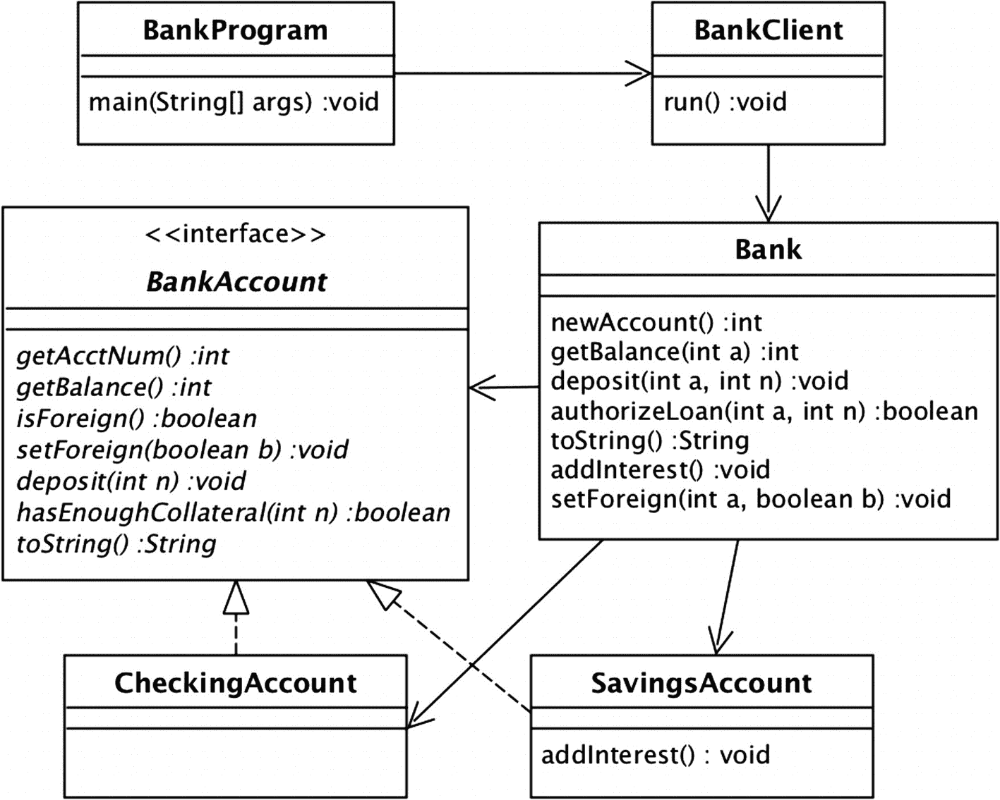
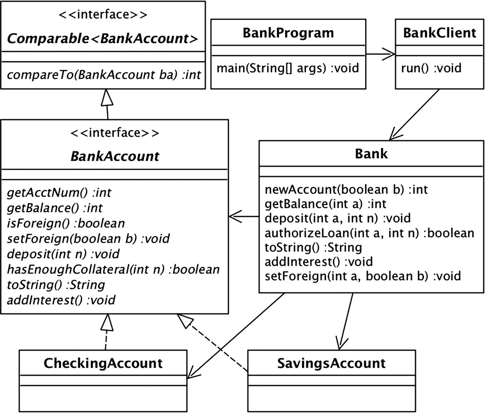
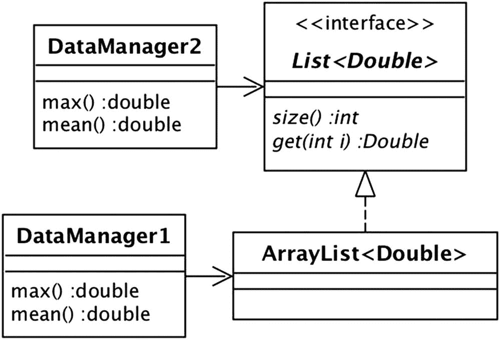

# 2.多态性

在一个设计良好的程序中，每个类都代表一个独特的概念，并有自己的一套职责。然而，两个(或更多)类共享一些公共功能是可能的。例如，Java 类`HashMap`和`TreeMap`是“映射”概念的不同实现，并且都支持方法`get`、`put`、`keySet`等等。程序利用这种共性的能力被称为*多态性*。

本章探索了 Java 中多态性的使用。Java 通过*接口*的概念支持多态性。本章中的所有技术都使用接口。事实上，多态非常有用，以至于本书中的大多数技术都以某种方式涉及到了接口。

可以说多态是面向对象编程中最重要的设计概念。对于任何优秀的 Java 程序员来说，对多态性(和接口)的深刻理解都是至关重要的。

## 对多态性的需求

假设您被要求修改银行演示的版本 4，以支持两种银行账户:储蓄账户和支票账户。储蓄账户对应于第 4 版的银行账户。支票账户与储蓄账户在以下三个方面不同:

*   批准贷款时，支票账户需要贷款金额的三分之二的余额，而储蓄账户只需要贷款金额的一半。

*   银行定期给储蓄账户利息，但不给支票账户利息。

*   account 的`toString`方法将根据情况返回“储蓄账户”或“支票账户”。

实现这两种类型的帐户的一个简单(有点天真)的方法是修改`BankAccount`的代码。例如，`BankAccount`可以有一个保存账户类型的变量:值 1 表示储蓄账户，值 2 表示支票账户。方法`hasEnoughCollateral`、`toString`和`addInterest`将使用 if 语句来确定处理哪种账户类型。清单 [2-1](#PC1) 展示了基本思想，相关代码以粗体显示。

```java
public class BankAccount {
   ...
   private int type;

   public BankAccount(int acctnum, int type) {
      this.acctnum = acctnum;
      this.type = type;
   }
   ...
   public boolean hasEnoughCollateral(int loanamt) {
      if (type == 1)
         return balance >= loanamt / 2;
      else
         return balance >= 2 * loanamt / 3;
   }

   public String toString() {
      String typename = (type == 1) ?
                            "Savings" : "Checking";
      return typename + " Account " + acctnum
                  + ": balance=" + balance + ", is "
                  + (isforeign ? "foreign" : "domestic");
   }

   public void addInterest() {
      if (type == 1)
         balance += (int)(balance * rate);
   }
}

Listing 2-1Using a Variable to Hold the Type of an Account

```

虽然这段代码是对`BankAccount`的简单修改，但是它有两个明显的问题。首先，if 语句是低效的。每次调用修改后的方法时，它都必须检查 if 语句中的条件，以确定要执行什么代码。此外，增加帐户类型的数量会导致这些方法的执行速度越来越慢。

其次(也是更重要的)，代码很难修改，因此违反了基本的设计原则。每次添加另一个帐户类型时，必须为每个 if 语句添加另一个条件。这是乏味的，耗时的，并且容易出错。如果您忘记正确地更新其中一个方法，那么产生的 bug 可能很难被发现。

避免这种 if 语句问题的方法是为每种类型的帐户使用单独的类。将这些类称为`SavingsAccount`和`CheckingAccount`。优点是每个类都有自己的方法实现，所以不需要 if 语句。此外，每当您需要添加另一种类型的银行帐户时，您可以简单地创建一个新类。

但是`Bank`类如何处理多个账户类呢？您不希望银行为每种类型的帐户持有单独的映射，因为这只会引入其他可修改性问题。例如，假设有几个给出利息的帐户类型，每个帐户类型都有自己的映射。`addInterest`方法的代码将需要单独遍历每个映射，这意味着每个新的帐户类型都需要您向该方法添加一个新的循环。

唯一好的解决方案是所有的帐户对象，不管它们的类别，都在一个映射中。这样的地图被称为*多态*。Java 使用接口来实现多态性。这个想法是银行演示的第 5 版用一个`BankAccount`接口替换`BankAccount`类。也就是说，帐户映射仍将这样定义:

```java
   private HashMap<Integer,BankAccount> accounts;

```

然而，`BankAccount`现在是一个接口，它的对象可以来自`SavingsAccount`或者`CheckingAccount`。下一节将解释如何用 Java 实现这样的多态映射。

## 接口

Java *接口*主要是一组命名的方法头。(接口还有其他特性，将在本章后面讨论。)接口类似于类的 API。区别在于，类的 API 是从它的公共方法中推断出来的，而接口是显式地指定 API，而不提供任何代码。

清单 [2-2](#PC3) 显示了版本 5 `BankAccount`接口的代码。它包含了版本 4 `BankAccount`类的每个公共方法的方法头，除了`addInterest`。

```java
public interface BankAccount {
   public abstract int getAcctNum();
   public abstract int getBalance();
   public abstract boolean isForeign();
   public abstract void setForeign(boolean isforeign);
   public abstract void deposit(int amt);
   public abstract boolean hasEnoughCollateral(int loanamt);
   public abstract String toString();
}

Listing 2-2The Version 5 BankAccount Interface

```

关键字`abstract`表示方法声明只包含方法头，并告诉编译器它的代码将在别处指定。`abstract`和`public`关键字在接口声明中是可选的，因为默认情况下接口方法是公共的和抽象的。在本书的其余部分，我将遵循通用约定，省略接口方法头中的`public abstract`关键字。

接口方法的代码由*实现*接口的类提供。假设`I`是一个接口。一个类通过将子句`implements I`添加到其头部来表明其实现`I`的意图。如果一个类实现了一个接口，那么它有义务实现该接口声明的所有方法。如果类不包含这些方法，编译器将生成错误。

在银行演示的版本 5 中，类`CheckingAccount`和`SavingsAccount`都实现了`BankAccount`接口。它们的代码出现在清单 [2-3](#PC4) 和 [2-4](#PC5) 中。代码与清单 [1-15](01.html#PC26) 的版本 4 `BankAccount`类几乎相同，因此省略了几个未修改的方法。修改用粗体表示。

```java
public class CheckingAccount implements BankAccount {
   // the rate variable is omitted
   private int acctnum;
   private int balance = 0;
   private boolean isforeign = false;

   public CheckingAccount(int acctnum) {
      this.acctnum = acctnum;
   }
   ...
   public boolean hasEnoughCollateral(int loanamt) {
      return balance >= 2 * loanamt / 3;
   }

   public String toString() {
      return "Checking account " + acctnum + ": balance="
                  + balance + ", is "
                  + (isforeign ? "foreign" : "domestic");
   }

   // the addInterest method is omitted
}

Listing 2-4The Version 5 CheckingAccount Class

```

```java
public class SavingsAccount implements BankAccount {
   private double rate = 0.01;
   private int acctnum;
   private int balance = 0;
   private boolean isforeign = false;

   public SavingsAccount(int acctnum) {
      this.acctnum = acctnum;
   }
   ...
   public boolean hasEnoughCollateral(int loanamt) {
      return balance >= loanamt / 2;
   }

   public String toString() {
      return "Savings account " + acctnum
           + ": balance=" + balance
           + ", is " + (isforeign ? "foreign" : "domestic");
   }

   public void addInterest() {
      balance += (int) (balance * rate);
   }
}

Listing 2-3The Version 5 SavingsAccount Class

```

通常，一个类可以实现任意数量的接口。它唯一的义务是为它实现的每个接口的每个方法编写代码。除了实现的接口所要求的方法之外，一个类还可以自由地拥有其他方法。例如，`SavingsAccount`有一个公共方法`addInterest`，它不是它的`BankAccount`接口的一部分。

接口在类图中用矩形表示，类似于类。接口的名称放在矩形中。为了区分接口和类，注释“<<interface>>”出现在其名称上方。接口名及其方法以斜体显示，以强调它们是抽象的。</interface>

当一个类实现一个接口时，该类和它的接口之间的关系由一个有开口的箭头和一条虚线表示。类的矩形不需要提到接口的方法，因为它们的存在是隐含的。版本 5 代码的类图如图 [2-1](#Fig1) 所示。这个图断言`CheckingAccount`和`SavingsAccount`实现了`BankAccount`接口的所有方法，并且`SavingsAccount`也实现了方法`addInterest`。`Bank`依赖于`BankAccount`、`SavingsAccount`和`CheckingAccount`，因为它的代码使用所有三种类型的变量，这将在下一节中看到。



图 2-1

银行演示的第 5 版

## 参考类型

本节研究接口如何影响 Java 程序中变量的类型。每个 Java 变量都有一个声明的类型，这个类型决定了变量可以保存的值的种类。如果一个变量包含一个基本值(比如 int 或 float ),那么它的类型就是一个*原始类型*。如果变量持有一个对象引用，那么它的类型就是一个*引用类型*。

每个类和每个接口定义一个引用类型。如果一个变量是类类型的，那么它可以保存对该类的任何对象的引用。如果一个变量是接口类型的，那么它可以保存对任何对象的引用，这些对象的类实现了那个接口。例如，考虑以下两条语句:

```java
   SavingsAccount sa = new SavingsAccount(1);
   BankAccount    ba = new SavingsAccount(2);

```

第一条语句在类类型变量`sa`中存储了一个`SavingsAccount`引用。这个语句是合法的，因为对象引用的类与变量的类型相同。第二条语句在接口类型变量`ba`中存储了一个`SavingsAccount`引用。这个语句也是合法的，因为对象引用的类实现了变量的类型。

变量的类型决定了程序可以对它调用哪些方法。类类型的变量只能调用该类的公共方法。接口类型的变量只能调用该接口定义的方法。继续前面的示例，考虑这四个语句:

```java
   sa.deposit(100);
   sa.addInterest();
   ba.deposit(100);
   ba.addInterest();  // Illegal!

```

前两个语句是合法的，因为`SavingsAccount`有公共方法`deposit`和`addInterest`。同样，第三个语句是合法的，因为`deposit`是在`BankAccount`中声明的。最后一个语句不合法，因为`addInterest`不是`BankAccount`接口的一部分。

这个例子指出，在接口类型变量中存储对象引用会“削弱”它。变量`sa`和`ba`都有相似的`SavingsAccount`引用。然而，`sa`可以调用`addInterest`，而`ba`则不能。

那么拥有接口类型的变量有什么意义呢？接口类型变量的主要优点是它可以保存对不同类中对象的引用。例如，考虑以下代码:

```java
   BankAccount ba = new SavingsAccount(1);
   ba = new CheckingAccount(2);

```

在第一条语句中，变量`ba`保存一个`SavingsAccount`引用。在第二个语句中，它包含一个`CheckingAccount`引用。这两个语句都是合法的，因为两个类都实现了`BankAccount`。当一个变量可以保存多个元素时，这个特性特别有用。例如，考虑以下语句。

```java
   BankAccount[] accts = new BankAccount[2];
   accts[0] = new SavingsAccount(1);
   accts[1] = new CheckingAccount(2);

```

变量`accts`是一个数组，其元素的类型为`BankAccount`。它是多态的，因为它可以存储来自`SavingsAccount`和`CheckingAccount`的对象引用。例如，下面的循环将 100 存入`accts`数组的每个账户，而不管它是什么类型。

```java
   for (int i=0; i<accts.length; i++)
      accts[i].deposit(100);

```

现在可以检查版本 5 `Bank`类的代码了。代码出现在清单 [2-5](#PC11) 中，对版本 4 的修改以粗体显示。

```java
public class Bank {
   private HashMap<Integer,BankAccount> accounts;
   private int nextacct;

   public Bank(HashMap<Integer,BankAccount> accounts) {
      this.accounts = accounts;
      nextacct = n;
   }

   public int newAccount(int type, boolean isforeign) {
      int acctnum = nextacct++;
      BankAccount ba;
      if (type == 1)
         ba = new SavingsAccount(acctnum);
      else
         ba = new CheckingAccount(acctnum);
      ba.setForeign(isforeign);
      accounts.put(acctnum, ba);
      return acctnum;
   }

   public int getBalance(int acctnum) {
      BankAccount ba = accounts.get(acctnum);
      return ba.getBalance();
   }
   ...
   public void addInterest() {
      for (BankAccount ba : accounts.values())
         if (ba instanceof SavingsAccount) {
            SavingsAccount sa = (SavingsAccount) ba;
            sa.addInterest();
         }
   }
}

Listing 2-5The Version 5 Bank Class

```

考虑方法`newAccount`。现在它有了一个额外的参数，这是一个表示帐户类型的整数。数值 1 表示储蓄账户，数值 2 表示支票账户。该方法创建一个指定类的对象，并将对它的引用存储在变量`ba`中。因为这个变量的类型是`BankAccount`，它可以保存一个对`SavingsAccount`或`CheckingAccount`对象的引用。因此，储蓄和支票账户都可以存储在`accounts`图中。

现在考虑方法`getBalance`。因为它的变量`ba`是接口类型的，所以该方法不知道它从映射中获得的账户是储蓄账户还是支票账户。但它不需要知道。该方法简单地调用`ba.getBalance`，它将执行`ba`引用的任何对象的代码。省略的方法同样是多态的。

方法`addInterest`比其他方法更复杂。理解这个方法需要了解类型安全，这将在下面讨论。

## 类型安全

编译器负责确保每个变量持有正确类型的值。我们说编译器保证程序是*类型安全的*。如果编译器不能保证一个值具有正确的类型，那么它将拒绝编译该语句。例如，考虑清单 [2-6](#PC12) 的代码。

```java
SavingsAccount sa1 = new SavingsAccount(1);
BankAccount ba1 = new CheckingAccount(2);
BankAccount ba2 = sa1;
BankAccount ba3 = new Bank(...);  // Unsafe
SavingsAccount sa2 = ba2;         // Unsafe

Listing 2-6Testing Type Safety

```

第一条语句将对一个`SavingsAccount`对象的引用存储在一个`SavingsAccount`变量中。这显然是类型安全的。第二条语句将对一个`CheckingAccount`对象的引用存储在一个`BankAccount`变量中。这是类型安全的，因为`CheckingAccount`实现了`BankAccount`。第三条语句将由`sa1`保存的引用存储到一个`BankAccount`变量中。由于`sa1`具有类型`SavingsAccount`，编译器可以推断出它的引用一定是指向一个`SavingsAccount`对象，因此可以安全地存储在`ba2`中(因为`SavingsAccount`实现了`BankAccount`)。

第四条语句显然不是类型安全的，因为`Bank`没有实现`BankAccount`。第五条语句中的变量`ba2`具有类型`BankAccount`，因此编译器推断其对象引用可能来自`SavingsAccount`或`CheckingAccount`。由于`CheckingAccount`引用不能存储在`SavingsAccount`变量中，所以该语句不是类型安全的。事实上,`ba2`实际上持有对`SavingsAccount`对象的引用是不相关的。

## 铅字铸造

编译器在决策时非常保守。如果有任何机会，一个变量可以持有一个错误类型的值，那么它将产生一个编译器错误。例如，考虑以下代码:

```java
   BankAccount ba = new SavingsAccount(1);
   SavingsAccount sa = ba;

```

应该清楚的是，第二条语句是类型安全的，因为这两条语句合在一起意味着变量`sa`将保存一个`SavingsAccount`引用。但是，编译器在编译第二条语句时不会查看第一条语句。它只知道变量`ba`的类型是`BankAccount`，因此可以保存一个`CheckingAccount`值。因此，它会生成一个编译器错误。

在这种情况下，您可以使用*类型转换*来否决编译器。例如，前面的代码可以重写如下:

```java
   BankAccount ba = new SavingsAccount(1);
   SavingsAccount sa = (SavingsAccount) ba;

```

类型转换向编译器保证代码确实是类型安全的，并且您对任何不正确的行为承担全部责任。然后，编译器遵从您的请求，编译该语句。如果你错了，那么程序将在运行时抛出一个`ClassCastException`。

现在可以考虑清单 [2-5](#PC11) 中的`addInterest`方法。该方法遍历所有账户，但只对储蓄账户增加利息。因为变量`accounts`的元素属于`BankAccount`类型，而`BankAccount`没有`addInterest`方法，所以需要一些巧妙的方法来确保类型安全。

该方法调用 Java `instanceof`操作符。如果左侧的对象引用可以转换为右侧的类型，则该运算符返回 true。通过在每个`BankAccount`对象上调用`instanceof`，该方法确定哪些对象属于类型`SavingsAccount`。然后它使用一个类型转换来创建一个类型为`SavingsAccount`的对象引用，然后这个对象引用可以调用`addInterest`方法。

使用`instanceof`和类型转换都是必要的。假设我省略了对`instanceof`的调用，将方法写成这样:

```java
  public void addInterest() {
      for (BankAccount ba : accounts.values()) {
         SavingsAccount sa = (SavingsAccount) ba;
         sa.addInterest();
      }
   }

```

这段代码可以正确编译，如果 map 只包含储蓄账户，那么这段代码就可以正确运行。然而，如果`ba`引用了一个`CheckingAccount`对象，那么类型转换将在运行时抛出一个`ClassCastException`。

现在假设我省略了类型转换，将方法写成这样:

```java
   public void addInterest() {
      for (BankAccount ba : accounts.values())
         if (ba instanceof SavingsAccount)
            ba.addInterest();
   }

```

这段代码不会被编译，因为变量`ba`的类型是`BankAccount`，因此不允许调用`addInterest`方法。编译器认为这个方法调用是不安全的，即使它只会在`ba`引用`SavingsAccount`对象时被调用。

## 透明度

将对`instanceof`的调用与类型转换相结合的技术给出了正确的结果，但是它违反了基本的设计原则。问题是代码特别提到了类名。如果银行添加了另一种也提供利息的账户类型(比如“货币市场账户”)，那么您需要修改`addInterest`方法来处理它。

if 语句问题又出现了。每次创建一个新的账户时，你都需要检查程序的每个相关部分，以决定这个新的类是否需要添加到 if 语句中。对于大型程序来说，这是一项艰巨的任务，可能会产生许多 bug。

消除这些问题的方法是在`BankAccount`接口中添加`addInterest`方法。然后`Bank`的`addInterest`方法可以调用`addInterest`的每个账户，而不关心它们属于哪个类。这样的设计被称为*透明的*，因为对象引用的类对于客户端是不可见的(即透明的)。我们用下面的规则来表达这些想法，叫做透明度规则:

### **透明度规则**

客户端应该能够使用一个接口，而不需要知道实现该接口的类。

第 6 版银行演示修改了第 5 版，因此`BankAccount`是透明的。这种透明性要求改变`BankAccount`、`CheckingAccount`和`Bank`的代码。`BankAccount`接口需要一个额外的`addInterest`方法头:

```java
   public interface BankAccount {
      ...
      void addInterest();
   }

```

`CheckingAccount`必须实现附加方法`addInterest`。这样做证明是非常容易的。`addInterest`方法不需要做任何事情:

```java
   public class CheckingAccount implements BankAccount {
      ...
      public void addInterest() {
         // do nothing
      }
   }

```

并且`Bank`有一个新的透明的`addInterest`实现:

```java
   public class Bank {
      ...
      public void addInterest() {
         for (BankAccount ba : accounts.values()) {
            ba.addInterest();
      }
   }

```

透明性的一个重要副作用是它可以减少类之间的耦合。特别要注意的是，`addInterest`方法不再导致对`SavingsAccount`的依赖。`newAccount`方法现在是`Bank`中唯一提到`SavingsAccount`和`CheckingAccount`的地方。消除这些依赖性是一个有价值的目标，但是涉及到删除对构造函数的调用的能力。这样做的技巧将在第 [5](05.html) 章中介绍。

## 开闭规则

透明接口的优点是添加新的实现类只需要对现有代码做很少的修改。例如，假设银行决定引入一个新的货币市场账户。考虑您必须如何更改版本 6 银行演示:

*   你可以编写一个新的类`MoneyMarketAccount`，它实现了`BankAccount`接口。

*   您可以修改`BankClient`的`newAccount`方法，向用户显示不同的消息，表明`MoneyMarketAccount`的账户类型。

*   您可以修改`Bank`中的`newAccount`方法来创建新的`MoneyMarketAccount`对象。

这些变化分为两类:*修改*，现有类发生变化；和*扩展*，在其中编写新的类。一般来说，修改往往是错误的来源，而扩展导致相对无错误的“即插即用”情况。这种认识导致了以下规则，称为打开/关闭规则:

### **开/关规则**

在可能的范围内，程序应该对扩展开放，但对修改关闭。

开/闭规则是一种理想。对一个程序的大部分修改都会涉及到某种形式的修改；目标是尽可能地限制这种修改。例如，在前面列出的三个任务中，第一个任务需要的工作量最大，但是可以使用扩展来实现。剩下的两个任务需要相对较小的修改。第 [5](05.html) 章的技术将使进一步减少这两项任务所需的修改成为可能。

## 可比接口

假设银行要求您修改银行演示，以便可以根据余额比较银行帐户。也就是说，如果`ba1`比`ba2`有钱，它就想要`ba1` > `ba2`。

Java 库有一个专门用于这个目的的接口，叫做`Comparable<T>`。下面是 Java 库声明接口的方式:

```java
   public interface Comparable<T> {
      int compareTo(T t);
   }

```

如果`x>y`，调用`x.compareTo(y)`返回一个大于`0`的数，如果`x<y`，返回一个小于`0`的值，如果`x=y`，返回`0`。Java 库中的许多类都是可比的。

一个这样的类是`String`，它实现了`Comparable<String>`。它的`compareTo`方法按照字典顺序比较两个字符串。举个简单的例子，考虑下面的代码。执行后，变量`result`将有一个负值，因为`"abc"`在字典上比`"x"`小。

```java
   String s1 = "abc";
   String s2 = "x";
   int result = s1.compareTo(s2);

```

银行演示的版本 6 修改了类`SavingsAccount`和`CheckingAccount`来实现`Comparable<BankAccount>`。每个类现在都有一个`compareTo`方法，它的头文件声明它实现了`Comparable<BankAccount>`。清单 [2-7](#PC22) 给出了`SavingsAccount`的相关代码。`CheckingAccount`的代码类似。

```java
public class SavingsAccount implements BankAccount,
                            Comparable<BankAccount> {
   ...
   public int compareTo(BankAccount ba) {
      int bal1 = getBalance();
      int bal2 = ba.getBalance();
      if (bal1 == bal2)
         return getAcctNum() - ba.getAcctNum();
      else
         return bal1 - bal2;
   }
}

Listing 2-7The Version 6 SavingsAccount Class

```

如果`bal1>bal2`，`compareTo`方法需要返回一个正数，如果`bal2>bal1`需要返回一个负数。减去两个余额就有了预期的效果。如果两个余额相等，则该方法使用它们的账号来任意打破平局。因此，只有在对应于同一帐户的对象之间进行比较时，该方法才会返回 0。这是任何`compareTo`方法的预期行为。

清单 [2-8](#PC23) 给出了演示程序`CompareSavingsAccounts`的代码，展示了可比较对象的使用。程序首先调用方法`initAccts`，该方法创建一些`SavingsAccount`对象，将钱存入其中，并保存在一个列表中。然后，程序演示了两种方法来计算具有最大余额的帐户。

```java
public class CompareSavingsAccounts {
   public static void main(String[] args) {
      ArrayList<SavingsAccount> accts = initAccts();
      SavingsAccount maxacct1 = findMax(accts);
      SavingsAccount maxacct2 = Collections.max(accts);
      System.out.println("Acct with largest balance is "
                        + maxacct1);
      System.out.println("Acct with largest balance is "
                        + maxacct2);
   }

   private static ArrayList<SavingsAccount> initAccts() {
      ArrayList<SavingsAccount> accts =
                                     new ArrayList<>();
      accts.add(new SavingsAccount(0));
      accts.get(0).deposit(100);
      accts.add(new SavingsAccount(1));
      accts.get(1).deposit(200);
      accts.add(new SavingsAccount(2));
      accts.get(2).deposit(50);
      return accts;
   }

   private static SavingsAccount
                  findMax(ArrayList<SavingsAccount> a) {
      SavingsAccount max = a.get(0);
      for (int i=1; i<a.size(); i++) {
         if (a.get(i).compareTo(max) > 0)
            max = a.get(i);
      }
      return max;
   }
}

Listing 2-8The CompareSavingsAccounts Class

```

查找最大账户的第一种方法是调用本地方法`findMax`，该方法执行列表的线性搜索。它将当前最大值初始化为第一个元素。对`compareTo`的调用将每个剩余元素与当前最大值进行比较；如果该元素更大，则它成为新的电流最大值。

寻找最大账户的第二种方法是使用 Java 库方法`Collections.max`。该方法隐式地为列表中的每个元素调用`compareTo`。

这个例子的要点是，程序能够找到具有最大余额的账户，而不需要明确提到账户余额。所有对余额的引用都出现在`compareTo`方法中。

## 子类型

尽管版本 6 代码声明`SavingsAccount`和`CheckingAccount`是可比较的，但这并不等同于要求所有银行账户都是可比较的。这是一个严重的问题。例如，考虑以下语句。编译器将拒绝编译第三条语句，因为`BankAccount`变量不需要有`compareTo`方法。

```java
   BankAccount ba1 = new SavingsAccount(1);
   BankAccount ba2 = new SavingsAccount(2);
   int a = ba1.compareTo(ba2);  // unsafe!

```

这个问题也出现在清单 [2-9](#PC25) 中的类`CompareBankAccounts`中。该类是对`CompareSavingsAccounts`的重写版本，其中帐户列表的类型是`BankAccount`而不是`SavingsAccount`。与`CompareSavingsAccounts`的区别用粗体表示。尽管变化相对较小，但这段代码将不再编译，因为编译器无法保证每个`BankAccount`对象都实现了`compareTo`方法。

```java
public class CompareBankAccounts {
   public static void main(String[] args) {
      ArrayList<BankAccount> accts = initAccts();
      BankAccount maxacct1 = findMax(accts);
      BankAccount maxacct2 = Collections.max(accts);
      ...
   }

   private static BankAccount
                  findMax(ArrayList<BankAccount> a) {
      BankAccount max = a.get(0);
      for (int i=1; i<a.size(); i++) {
         if (a.get(i).compareTo(max) > 0)
            max = a.get(i);
      }
      return max;
   }

Listing 2-9The CompareBankAccounts Class

```

两个例子的解决方案都是断言所有实现了`BankAccount`的类也实现了`Comparable<BankAccount>`。从形式上讲，我们说`BankAccount`需要是`Comparable<BankAccount>`的*子类型*。在 Java 中，通过使用关键字`extends`来指定子类型。清单 [2-10](#PC26) 显示了修改后的`BankAccount`接口。

```java
public interface BankAccount extends Comparable<BankAccount> {
   ...
}

Listing 2-10The Version 6 BankAccount Interface

```

关键字`extends`表明如果一个类实现了`BankAccount`，那么它也必须实现`Comparable<BankAccount>`。因此，类`SavingsAccount`和`CheckingAccount`不再需要在它们的头文件中显式实现`Comparable<BankAccount>`，因为它们现在从`BankAccount`隐式实现接口。有了这个改变，`CompareBankAccounts`可以正确地编译和执行。

在类图中，子类型关系由带实线的空心箭头表示。例如，版本 6 银行演示的类图如图 [2-2](#Fig2) 所示。



图 2-2

银行演示的第 6 版

## Java 集合库

银行演示有一个子类型关系的例子。一般来说，一个程序可能有几个通过子类型关系连接的接口。子类型化的一个很好的例子可以在 Java 库的集合接口中找到。这些接口有助于管理表示一组元素的对象。图 2-3 描述了它们的类图和一些方法，以及实现它们的四个常用类。这些接口不仅值得深入了解，它们还阐明了一些重要的设计原则。


图 2-3

Java 集合接口

这些接口指定了一组元素可能具有的不同功能。

*   一个`Iterable`对象有一个方法`iterator`，它使客户端能够遍历组中的元素。第 6 章[详细讨论了迭代。](06.html)

*   一个`Collection`对象是可迭代的，但是它也有添加、移除和搜索其元素的方法。

*   一个`List`对象是一个集合，它的元素具有线性顺序，类似于一个数组。它有在指定位置添加、移除和修改元素的方法。

*   一个`Queue`对象是一个集合，它的元素也有一个线性顺序。然而，它的方法只允许客户端在后面添加元素，并在前面移除和检查元素。

*   `Set`对象是一个不能有重复元素的集合。它与`Collection`有相同的方法，但是`add`方法负责检查重复项。

*   一个`SortedSet`对象是一个集合，它的元素是有序排列的。它有根据这个顺序查找第一个和最后一个元素的方法，以及创建早于给定元素或在给定元素之后的元素的子集的方法。

Java 库还包含几个实现这些接口的类。图 [2-3](#Fig3) 显示了以下四类。

### 数组列表

类`ArrayList`实现了`List`，因此还有`Collection`和`Iterable`。它的代码使用一个底层数组来存储列表元素，该数组随着列表的扩展而调整大小。这个类有方法`trimToSize`和`ensureCapacity`，允许客户端手动调整底层数组的大小。

### 链接列表

像`ArrayList`一样，`LinkedList`类实现了`List`(以及`Collection`和`Iterable`)。它使用底层节点链来存储列表元素。与`ArrayList`不同的是，它还实现了`Queue`。原因是它的链式实现允许从列表的前面快速移除，这对于`Queue`的高效实现很重要。

### 哈希集

类`HashSet`实现`Set`(以及`Collection`和`Iterable`)。它使用哈希表来避免插入重复的元素。

### TreeSet(树集)

类`TreeSet`实现`SortedSet`(以及`Set`、`Collection`和`Iterable`)。它使用一个搜索树按排序顺序存储元素。

## 利斯科夫替代原理

图 [2-3](#Fig3) 的类型层次结构看起来很自然，甚至很明显。然而，重要的努力进入了等级的制作。Java Collections API Design FAQ 中对一些更微妙的设计问题进行了有趣的讨论，可以在 URL [`https://docs.oracle.com/javase/8/docs/technotes/guides/collections/designfaq.html`](https://docs.oracle.com/javase/8/docs/technotes/guides/collections/designfaq.html) 找到。

一般来说，如何着手设计类型层次结构呢？指导原则被称为*利斯科夫替代原则*(通常缩写为 LSP)。这条规则是以芭芭拉·利斯科夫的名字命名的，她首次提出了这条规则。

### **利斯科夫替代原理**

如果类型 X 扩展了类型 Y，那么类型 X 的对象总是可以用在任何需要类型 Y 的对象的地方。

例如，考虑`List`扩展`Collection`的事实。LSP 意味着`List`对象可以代替`Collection`对象。换句话说，如果有人问你要一个集合，那么你可以合理地给他们一个列表，因为这个列表有它作为一个集合所需要的所有方法。相反，LSP 暗示`Collection`不应该延长`List`。如果有人向你要一个列表，你不能给他们一个集合，因为集合不一定是连续的，也不支持相应的列表方法。

理解 LSP 的另一种方法是检查接口和它扩展的接口之间的关系。例如，考虑我对集合接口的最初描述。我说过“集合是一个集合，它...，" "有序集合是这样的集合，它...，“等等。

换句话说，每个接口“是”它所扩展的类型，并增加了功能。这样的关系叫做一个*IS-一个关系*，我们说“Set IS-一个集合”、“sorted Set IS-一个集合”等等。一个好的经验法则是，如果你能从 IS-A 关系的角度理解一个类型层次，那么它就满足 LSP。

测试您对 LSP 的理解的一个有用方法是尝试回答以下问题:

*   `SortedSet`是否应该延长`List`？

*   为什么没有界面`SortedList`？

*   `Queue`是否应该延长`List`？`List`该不该延长`Queue`？

*   如果接口`Set`不提供任何附加功能，为什么还要有它呢？

以下是答案。

### SortedSet 应该扩展列表吗？

乍一看，有序集合似乎与列表非常相似。毕竟，它的排序顺序决定了一个顺序性:给定一个值 n，有一个定义明确的第 n <sup>个</sup>元素。list 的`get`方法对于通过当前槽访问任何元素都很有用。

问题是一个有序集合的修改方法会有不良的副作用。例如，如果您使用`set`方法来更改第`n` <sup>个</sup>元素的值，那么该元素可能会改变其在排序顺序中的位置(可能连同其他几个元素一起)。使用`add`方法将一个新元素插入特定的槽是没有意义的，因为每个新元素的槽是由其排序顺序决定的。

因此，有序集合不能做列表能做的一切，这意味着在不违反 LSP 的情况下,`SortedSet`不能扩展`List`。

### 为什么没有接口 SortedList？

这样的接口看似合理。唯一的问题是它在层级中的位置。如果`SortedList`扩展了`List`，那么你会遇到和`SortedSet`一样的问题——也就是说，`SortedList`没有好的方法来实现`List`的`set`和`add`方法。最好的选择是让`SortedList`扩展`Collection`，并根据元素的位置提供额外的类似列表的方法来访问元素。这将满足 LSP。

那么为什么 Java 库没有接口`SortedList`？最有可能的是，库的设计者认为这样的接口并不那么有用，省略它会导致更精简的层次结构。

### 队列应该扩展列表吗？列表应该扩展队列吗？

`Queue`不能扩展`List`,因为列表可以直接访问它的所有元素并在任何地方插入，而队列只能访问前面的元素并在后面插入。

一个更有趣的问题是`List`是否应该扩展`Queue`。`List`方法可以做`Queue`方法可以做的一切，甚至更多。因此，人们可以认为列表比队列更普遍；也就是说，`List`是——一个`Queue`。声明`List`实现`Queue`不会违反 LSP。

另一方面，设计者认为列表和队列之间的函数关系有点巧合，在实践中不太有用。概念上，列表和队列是不同的猛兽；没有人认为列表是一个功能更强的队列。因此，在 Java 中没有这样的 IS-A 关系，也没有这样的子类型声明。

### 如果接口不提供任何附加功能，为什么还要设置它呢？

这个问题和`List`是相关的——一个`Queue`问题。从概念上讲，`Set`和`Collection`是两种截然不同的类型，有着明确的 IS-A 关系:`Set`是-A `Collection`。尽管`Set`没有引入任何新方法，但它确实改变了`add`方法的含义，这一点足够重要(也足够有用)以保证一个独特的类型。

## 抽象的规则

清单 [2-11](#PC27) 给出了一个名为`DataManager1`的类的代码。这个类管理数据值的`ArrayList`。列表被传递到它的构造函数中，它的方法计算列表的一些简单的统计属性。

```java
public class DataManager1 {
   private ArrayList<Double> data;

   public DataManager1(ArrayList<Double> d) {
      data = d;
   }

   public double max() {
      return Collections.max(data);
   }

   public double mean() {
      double sum = 0.0;
      for (int i=0; i<data.size(); i++)
         sum += data.get(i);
      return sum / data.size();
   }
}

Listing 2-11The DataManager1 Class

```

虽然这个类执行正确，但它的设计很差。它的问题是它只对存储在`ArrayList`对象中的数据有效。这个限制是不必要的，因为代码中没有任何内容只适用于数组列表。

很容易重写该类，使其适用于任意值列表。该代码出现在清单 [2-12](#PC28) 中。

```java
public class DataManager2 {
   private List<Double> data;

   public DataManager2(List<Double> d) {
      data = d;
   }
   ...
}

Listing 2-12The Class DataManager2 Class

```

`DataManager1`和`DataManager2`的代码完全相同，除了两个地方的`ArrayList`被替换为`List`。这两个类及其依赖关系可以用图 [2-4](#Fig4) 的类图来表示。



图 2-4

数据管理器 1 与数据管理器 2

类`DataManager2`增加的灵活性源于它依赖于接口`List`，这比`DataManager1`依赖于`ArrayList`更抽象。这种见解在一般情况下是正确的，并且可以表达为下面的抽象规则。

### **抽象的规则**

一个类的依赖关系应该尽可能抽象。

这条规则建议设计者应该检查设计中的每一个依赖项，看看是否可以把它变得更抽象。这个规则的一个特例被称为“程序到接口”，它断言依赖一个接口总是比依赖一个类好。

虽然`DataManager2`比`DataManager1`好，但是如果把它对`List`的依赖改成更抽象的东西，比如`Collection`，它会变得更好吗？乍一看，您可能会说“不”，因为`mean`方法的实现使用了基于`List`的方法`get`。如果你想让这个类为任何集合工作，那么你需要编写`mean`，这样它只使用对集合可用的方法。幸运的是，这样的重写是可能的。清单 [2-13](#PC29) 给出了更好的类`DataManager3`的代码。

```java
public class DataManager3 {
   private Collection<Double> data;

   public DataManager3(Collection<Double> d) {
      data = d;
   }

   public double max() {
      return Collections.max(data);
   }

   public double mean() {
      double sum = 0.0;
      for (double d : data)
         sum += d;
      return sum / data.size();
   }
}

Listing 2-13The DataManager3 Class

```

抽象规则也可以应用到银行演示中。例如，考虑`Bank`和`HashMap`之间的相关性。一个`Bank`对象有一个变量`accounts`，它将一个账号映射到相应的`BankAccount`对象。变量的类型是`HashMap<Integer,BankAccount>`。抽象规则建议变量应该使用类型`Map<Integer,BankAccount>`。在版本 6 的代码中，这句话被改变了。

## 向接口添加代码

在这一章的开始，我将接口定义为一组方法头，类似于 API。根据这个定义，接口不能包含代码。Java 8 版本放宽了这一限制，因此接口可以定义方法，尽管它仍然不能声明变量。本节将检验这一新能力的后果。

作为一个例子，清单 [2-14](#PC30) 展示了版本 6 对`BankAccount`接口的修改，增加了方法`createSavingsWithDeposit`和`isEmpty`。

```java
public interface BankAccount extends Comparable<BankAccount> {
   ...

   static BankAccount createSavingsWithDeposit(
                                  int acctnum, int n) {
      BankAccount ba = new SavingsAccount(acctnum);
      ba.deposit(n);
      return ba;
   }

   default boolean isEmpty() {
      return getBalance() == 0;
   }
}

Listing 2-14The Version 6 BankAccount Interface

```

这两种方法都是*便利方法*的例子。方便的方法不会引入任何新的功能。相反，它利用现有的功能来方便客户。方法`createSavingsWithDeposit`创建具有指定初始余额的储蓄账户。如果账户余额为零，方法`isEmpty`返回 true，否则返回 false。

接口方法或者是*静态*或者是*默认*。静态方法有关键字`static`，意思和在类中一样。默认方法是非静态的。关键字`default`表示一个实现类可以覆盖代码，如果它愿意的话。其思想是，接口提供了方法的一般实现，保证适用于所有实现类。但是特定的类可能能够提供更好、更有效的实现。例如，假设货币市场储蓄账户要求最低余额为 100 美元。然后它知道账户永远不会为空，因此它可以将默认的`isEmpty`方法改写为立即返回 false 的方法，而不必检查余额。

对于默认方法的一个更有趣的例子，考虑如何对列表排序的问题。Java 库类`Collections`有静态方法`sort`。您向`sort`方法传递两个参数——一个列表和一个比较器——它为您对列表进行排序。(比较器是一个指定排序顺序的对象，将在第 [4](04.html) 章中讨论。这里只要知道传递 null 作为比较器会导致`sort`方法使用它们的`compareTo`方法来比较列表元素就足够了。)例如，清单 [2-15](#PC31) 的代码从标准输入中读取十个单词到一个列表中，然后对列表进行排序。

```java
Scanner scanner = new Scanner(System.in);
List<String> words = new ArrayList<>();
for (int i=0; i<10; i++)
   words.add(scanner.next());
Collections.sort(words, null);

Listing 2-15The Old Way to Sort a List

```

这个`sort`方法的问题是，在不知道它是如何实现的情况下，没有好的方法对列表进行排序。`Collections`类使用的解决方案是将列表的元素复制到一个数组中，对数组进行排序，然后将排序后的元素复制回列表。清单 [2-16](#PC32) 给出了基本的想法。注意，`toArray`方法返回一个`Object`类型的数组，因为 Java 对泛型数组的限制使得它不可能返回一个`T`类型的数组。对数组排序后，for 循环将每个数组元素存储回`L`。这两种类型转换对于忽略编译器对类型安全的关注是必要的。

```java
public class Collections {
   ...
   static <T> void sort(List<T> L, Comparator<T> comp) {
      Object[] a = L.toArray();
      Arrays.sort(a, (Comparator)comp);
      for (int i=0; i<L.size(); i++)
         L.set(i, (T)a[i]);
   }
}

Listing 2-16Code for the Sort Method

```

虽然这段代码适用于任何列表，但是它的开销是将列表元素复制到一个数组中，然后再复制回来。对于某些 list 实现来说，这种开销是浪费时间。例如，数组列表将其列表元素保存在一个数组中，因此直接对该数组进行排序会更有效。这种情况意味着真正高效的列表排序方法不可能是透明的。它需要确定列表是如何实现的，然后使用特定于该实现的排序算法。

Java 8 通过将`sort`作为`List`接口的默认方法来解决这个问题。`List.sort`的代码是对`Collections.sort`代码的重构；基本思想出现在清单 [2-17](#PC33) 中。

```java
public interface List<T> extends Collection<T> {
   ...
   default void sort(Comparator<T> comp) {
      Object[] a = toArray();
      Arrays.sort(a, (Comparator)comp);
      for (int i=0; i<size(); i++)
         set(i, (T)a[i]);
   }
}

Listing 2-17A Default Sort Method for List

```

这个默认的`sort`方法有两个好处。首先是优雅:现在可以直接对列表进行排序，而不是通过`Collections`中的静态方法。也就是说，下面两个语句现在是等价的:

```java
   Collections.sort(L, null);
   L.sort(null);

```

第二个也是更重要的好处是列表可以被透明地处理。`sort`的默认实现适用于`List`的所有实现。然而，任何特定的`List`实现(比如`ArrayList`)都可以选择用自己更有效的实现来覆盖这个方法。

## 摘要

多态性是程序利用类的公共功能的能力。Java 使用接口来支持多态性——接口的方法指定了一些公共功能，支持这些方法的类可以选择实现该接口。例如，假设类`C1`和`C2`实现接口`I`:

```java
   public interface I {...}
   public class C1 implements I {...}
   public class C2 implements I {...}

```

程序现在可以声明类型为`I`的变量，这些变量可以保存对`C1`或`C2`对象的引用，而不用关心它们实际引用的是哪个类。

这一章研究了多态性的力量，并给出了一些使用它的基本例子。它还介绍了适当使用多态性的四个设计规则:

*   透明性规则规定，客户端应该能够使用一个接口，而不需要知道实现该接口的类。

*   开放/封闭规则规定，程序应该被结构化，以便可以通过创建新的类而不是修改现有的类来修改它们。

*   Liskov 替换原则(LSP)规定了一个接口成为另一个接口的子类型的时间。特别是，`X`应该是`Y`的一个子类型，如果一个类型为`X`的对象可以在任何需要类型为`Y`的对象的地方使用。

*   抽象规则规定类的依赖关系应该尽可能抽象。