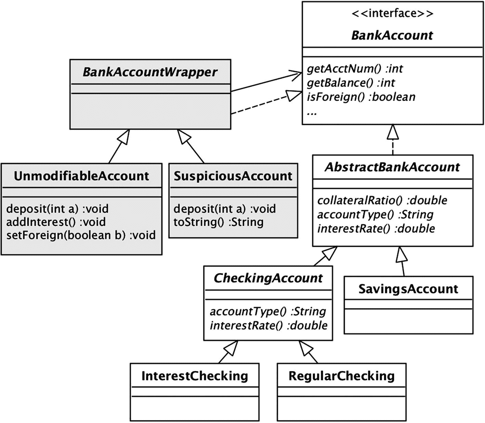
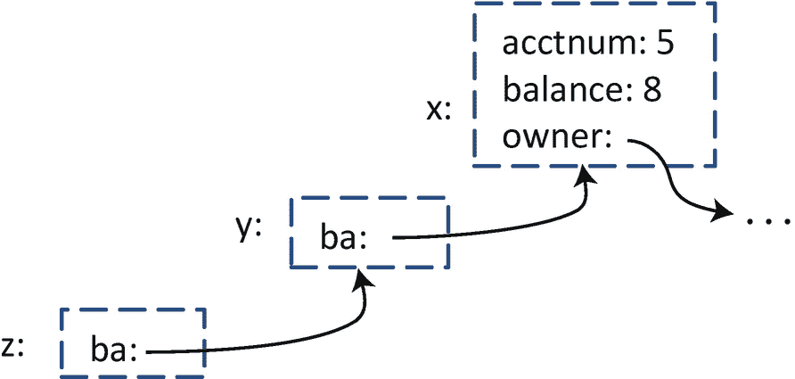
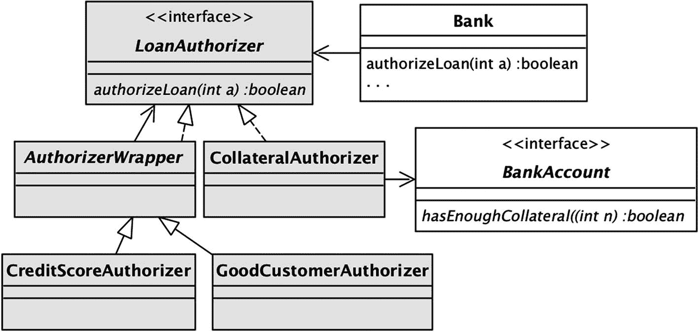
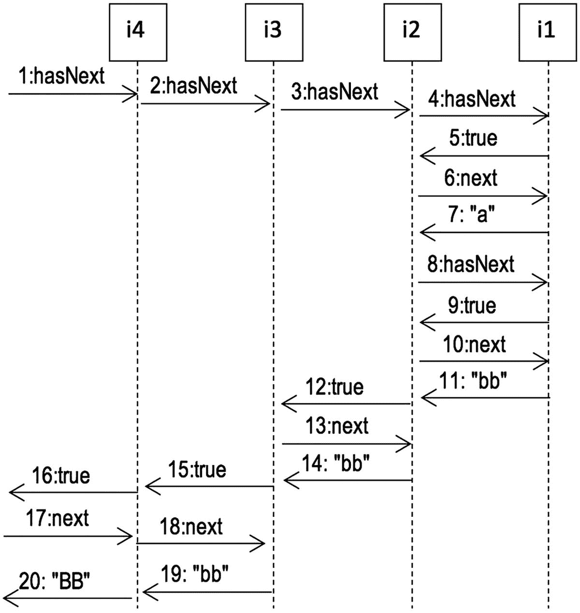

# 8.装饰者

一个*装饰器*是一个包装器，它实现了与它包装的对象相同的接口。装饰器方法*增强了*被包装对象的方法，与适配器方法相反，*替换了*被包装对象的方法。

本章考察了装饰器的几种有用的应用。它们可以用来创建对象的不可变版本，协调复杂任务的执行，以及实现收集流。Java 库类`InputStream`显著地使用了装饰器。本章还探讨了装饰类的作者必须面对的设计问题。

## 装饰类

让我们从银行演示开始。回忆一下第 [6 章](06.html)中的内容，即`Bank`类有方法`iterator`，该方法使客户端能够检查其`BankAccount`对象。例如，清单 [8-1](#PC1) 中的代码打印余额小于 1 美元的账户。

```java
Iterator<BankAccount> iter = bank.iterator();
while (iter.hasNext()) {
   BankAccount ba = iter.next();
   if (ba.getBalance() < 100)
      System.out.println(ba);
}

Listing 8-1A Reasonable Use of the Bank’s Iterator Method

```

这个`iterator`方法的问题是，客户端也可以用它来修改`BankAccount`对象，甚至删除它们。例如，清单 [8-2](#PC2) 中的代码删除了所有余额小于 1 美元的账户，并将所有其他账户的余额翻倍。

```java
Iterator<BankAccount> iter = bank.iterator();
while (iter.hasNext()) {
   BankAccount ba = iter.next();
   int balance = ba.getBalance();
   if (balance < 100)
      iter.remove();
   else
      ba.deposit(balance);
}

Listing 8-2An Unreasonable Use of the Bank’s Iterator Method

```

假设这不是您的意图，并且您希望`iterator`方法提供对银行账户的只读访问。有两个问题需要解决。首先，`iterator`方法给予客户端对每个`BankAccount`对象的完全访问权；您希望它拒绝访问`BankAccount`的修改方法。第二，迭代器有方法`remove`，删除当前被检查的对象；您希望确保客户端无法调用此方法。这两个问题的解决方案是使用包装。

确保`BankAccount`对象不可修改的一种方法是创建一个包装`BankAccount`的类。包装器的非修改方法将调用被包装对象的相应方法，其修改方法将抛出异常。清单 [8-3](#PC3) 给出了这样一个名为`UnmodifiableAccount`的类的代码。为了节省空间，清单中省略了方法`getBalance`、`isForeign`、`compareTo`、`hasEnoughCollateral`、`toString`、`equals`和`fee`的代码，因为它们与`getAcctNum`的代码相似。

```java
public class UnmodifiableAccount implements BankAccount {
   private BankAccount ba;

   public UnmodifiableAccount(BankAccount ba) {
      this.ba = ba;
   }

   public int getAcctNum() {
      return ba.getAcctNum();
   }

   ... // code for the other read-only methods goes here

   public void deposit(int amt) {
      throw new UnsupportedOperationException();
   }

   public void addInterest() {
      throw new UnsupportedOperationException();
   }

   public void setForeign(boolean isforeign) {
      throw new UnsupportedOperationException();
   }

}

Listing 8-3A Proposed UnmodifiableAccount Class

```

同样的技术可以用来确保迭代器是只读的。您创建了一个包装迭代器的类，并在调用`remove`方法时抛出一个异常。清单 [8-4](#PC4) 给出了这样一个名为`UnmodifiableBankIterator`的类的代码。注意，`next`方法从包装的迭代器中获取`BankAccount`对象，将其包装为`UnmodifiableAccount`对象，并返回包装器。

```java
public class UnmodifiableBankIterator
             implements Iterator<BankAccount> {
   private Iterator<BankAccount> iter;

   public UnmodifiableBankIterator(
                         Iterator<BankAccount> iter) {
      this.iter = iter;
   }

   public boolean hasNext() {
      return iter.hasNext();
   }

   public BankAccount next() {
      BankAccount ba = iter.next();
      return new UnmodifiableAccount(ba);
   }

   public void remove() {
      throw new UnsupportedOperationException();
   }

}

Listing 8-4The Version 17 UnmodifiableBankIterator Class

```

清单 [8-5](#PC5) 给出了银行`iterator`方法的修订代码。代码将迭代器包装在一个`UnmodifiableBankIterator`对象中，然后将其返回给客户端。

```java
public Iterator<BankAccount> iterator() {
   Iterator<BankAccount> iter = accounts.values().iterator();
   return new UnmodifiableBankIterator(iter);
}

Listing 8-5The Iterator Method of Bank

```

让我们暂停一下，看看这些变化是如何影响银行业演示的。银行的`iterator`方法返回的迭代器是不可修改的`BankAccount`对象的不可修改迭代器。然而，从客户的角度来看，什么都没有改变。客户端仍然看到一个`BankAccount`对象的迭代器。因此，像`IteratorAccountStats`这样的类不需要修改。

使这一壮举成为可能的是包装器类`UnmodifiableAccount`和`UnmodifiableBankIterator`实现了与它们包装的对象相同的接口。此功能允许使用包裹的对象来代替未包裹的对象。这种包装器被称为*装饰器*。

装饰器的目的是改变一个类的一个或多个方法的行为，而不改变它的接口。行为变化是班级的“装饰品”。

一个类可以有多个装饰子类。举个例子，假设银行希望能够将个人账户标记为*可疑*。可疑帐户以两种方式改变其行为:它在每次调用`deposit`方法时向控制台写入一条消息，它的`toString`方法在返回的字符串前面加上“##”。类`SuspiciousAccount`实现了这个行为。它的代码出现在清单 [8-6](#PC6) 中。

```java
public class SuspiciousAccount implements BankAccount {
   private BankAccount ba;
   public SuspiciousAccount(BankAccount ba) {
      this.ba = ba;
   }

   public int getAcctNum() {
      return ba.getAcctNum();
   }

   ... // other methods go here

   public void deposit(int amt) {
      Date d = new Date();
      String msg = "On " + d + " account #" +
                   ba.getAcctNum() + " deposited " + amt;
      System.out.println(msg);
      ba.deposit(amt);
   }

   public String toString() {
       return "## " + ba.toString();
   }
}

Listing 8-6A Proposed SuspiciousAccount Class

```

清单 [8-6](#PC6) 从`BankAccount`接口中省略了几个方法。如清单 [8-3](#PC3) 所示，这些被省略的方法的代码与`getAcctNum`相似——它们只是调用被包装对象的相应方法。

使用`SuspiciousAccount`类的一种方法是修改`Bank`来拥有方法`makeSuspicious`。该方法的代码出现在清单 [8-7](#PC7) 中。它检索指定的银行帐户，将其包装为一个`SuspiciousAccount`，然后将新的`BankAccount`对象写入映射，替换旧的对象。请注意，`accounts`地图将包含可疑和非可疑账户的混合，尽管客户不会意识到这一事实。

```java
public void makeSuspicious(int acctnum) {
   BankAccount ba = accounts.get(acctnum);
   ba = new SuspiciousAccount(ba);
   accounts.put(acctnum, ba);
}

Listing 8-7The Bank’s makeSuspicious Method

```

## 装饰图案

清单 [8-3](#PC3) 中的类`UnmodifiableAccount`和清单 [8-6](#PC6) 中的类`SuspiciousAccount`有很多相同的代码。它们都包装了`BankAccount`，并在局部变量中保存了对包装对象的引用。此外，它们的几个方法除了调用被包装对象的相应方法之外什么也不做。您可以通过创建一个抽象类来保存公共代码，从而消除这种重复。这个类叫做`BankAccountWrapper`，是 17 版银行演示的一部分。它的代码出现在清单 [8-8](#PC8) 中。

```java
public abstract class BankAccountWrapper
                      implements BankAccount {
   protected BankAccount ba;

   protected BankAccountWrapper(BankAccount ba) {
      this.ba = ba;
   }

   public int getAcctNum() {
      return ba.getAcctNum();
   }

   ... //similar code for all the other methods of BankAccount
}

Listing 8-8The Version 17 BankAccountWrapper Class

```

`BankAccountWrapper`通过调用其包装对象的相应方法来实现每个`BankAccount`方法。这个类本身什么也不做。它的价值在于简化了其他`BankAccount`包装类的编写。这解释了为什么`BankAccountWrapper`是一个抽象类，尽管它没有抽象方法。它依赖子类用有趣的行为覆盖它的方法。

银行业演示的版本 17 包含了`UnmodifiableAccount`和`SuspiciousAccount`类，重写后扩展了`BankAccountWrapper`。它们的代码出现在清单 [8-9](#PC9) 和清单 [8-10](#PC10) 中。注意，代码比最初出现在清单 [8-3](#PC3) 和 [8-6](#PC6) 中的要简单得多。

```java
public class SuspiciousAccount
             extends BankAccountWrapper {

   public SuspiciousAccount(BankAccount ba) {
      super(ba);
   }

   public void deposit(int amt) {
      Date d = new Date();
      String msg = "On " + d + " account #" +
                   ba.getAcctNum() + " deposited " + amt;
      System.out.println(msg);
      ba.deposit(amt);
   }

   public String toString() {
       return "## " + ba.toString();
   }

}

Listing 8-10The Version 17 SuspiciousAccount Class

```

```java
public class UnmodifiableAccount
             extends BankAccountWrapper {

   public UnmodifiableAccount(BankAccount ba) {
      super(ba);
   }

   public void deposit(int amt) {
      throw new UnsupportedOperationException();
   }

   public void addInterest() {
      throw new UnsupportedOperationException();
   }

   public void setForeign(boolean isforeign) {
      throw new UnsupportedOperationException();
   }
}

Listing 8-9The Version 17 UnmodifiableAccount Class

```

图 [8-1](#Fig1) 中显示了`BankAccount`类的类图。装饰类是有阴影的。他们对`BankAccount`的依赖由`BankAccountWrapper`掌握。



图 8-1

修饰的银行帐户层次结构

这个类图中的装饰类是根据*装饰模式*组织的。装饰模式断言接口的装饰形成了层次结构。层次结构的根是一个抽象包装类，它保存对其包装类的引用，并提供接口方法的默认实现。装饰类是包装类的子类。接口的非装饰类被称为它的*基类*。图 [8-2](#Fig2) 描绘了装饰模式的类图。


图 8-2

装饰图案

装饰类，像适配器一样，可以被认为是将输入对象转换成输出对象。区别在于装饰器的输出和输入具有相同的类型。这个特性意味着装饰者可以被组合。

例如，考虑银行演示。`Bank`类保存了一张`BankAccount`对象的地图。有些会不装饰，有些会装饰上`SuspiciousAccount`。如果一个客户调用银行的`iterator`方法，那么迭代器中的所有对象都将用`UnmodifiableAccount`来修饰。这意味着可疑账户现在将有两个装饰。

理解装饰对象的组成的一个好方法是检查它们在内存中的表示。考虑清单 [8-11](#PC11) 的代码。前三条语句创建三个不同的`BankAccount`对象，并将它们绑定到变量`x`、`y`和`z`。

```java
BankAccount x = new SavingsAccount(5);
BankAccount y = new SuspiciousAccount(x);
BankAccount z = new UnmodifiableAccount(y);

int a = x.getAcctNum();
int b = y.getAcctNum();
int c = z.getAcctNum();
x.deposit(4); y.deposit(4);

Listing 8-11Using Composed Decorators

```

虽然`x`、`y`、`z`是不同的`BankAccount`对象，但都是指账户 5。对象 y 和 z 只是那个账户的不同装饰。

清单 [8-11](#PC11) 中的第四条语句将变量`a`设置为 5。下一条语句也将变量`b`设置为 5，因为`y.getAcctNum`调用`x.getAcctNum`。类似地，变量`c`也被设置为 5，因为`z.getAcctNum`调用`y.getAcctNum`，而`y.getAcctNum`调用`x.getAcctNum`。

对`x.deposit`的调用使`x`的余额增加 4。对`y.deposit`的调用使`x`的余额又增加了 4，因为`y.deposit`调用了`x.deposit`。它还会向控制台写入一条消息，因为`y`是可疑的。清单 [8-11](#PC11) 故意不调用`z.deposit`，因为由于`z`不可修改的事实，该调用会抛出异常。

图 [8-3](#Fig3) 描述了代码执行后这些变量的内存内容。每个变量的矩形显示其状态变量的值。一个`AbstractBankAccount`对象有三个状态变量:`acctnum`、`balance`和`owner`。为简单起见，该图没有显示`owner`所指的物体。一个`BankAccountWrapper`对象有一个状态变量`ba`，它引用被包装的对象。



图 8-3

三个 BankAccount 对象的关系

图 [8-3](#Fig3) 展示了如何将一个装饰对象看作一个对象链。链头是最近的装饰。链的尾部是对象的未修饰版本。当调用一个方法时，该方法从链的头部开始执行，并沿着链向下执行。

这种情况是递归的一种形式。装饰类是递归类。方法调用可以被认为是递归遍历装饰链。例如，`z.getAcctNum`递归调用`y.getAcctNum`，T1 递归调用`x.getAcctNum`，后者返回其值。

## 指挥链模式

命令模式的*链是装饰者模式的一个特例，其中装饰者执行任务而不是计算值。每个装饰者都了解任务的某个部分。执行任务的请求被发送到链中的第一个装饰器，并沿着链向下传递，直到遇到可以执行该任务的装饰器。如果没有装饰者能够执行任务，那么基类执行一个默认的动作。*

例如，银行演示的版本 17 使用命令链模式来实现贷款授权。回想一下，在早期版本中，只有当指定的帐户有足够高的余额时，银行才批准贷款。在版本 17 中，银行根据客户的金融历史和银行以前与客户打交道的经验，使用两个附加标准。这些标准在清单 [8-12](#PC12) 中给出。

*   如果银行以前与客户没有问题，并且贷款少于 2000 美元，则批准。

*   否则，如果客户的信用评级低于 500，那么拒绝。如果信用等级超过 700，贷款金额低于 10，000 美元，那么批准。

*   否则，如果指定的账户余额足够高，则批准，否则拒绝。

```java
Criteria

Listing 8-12Revised Loan Authorization

```

这些标准显然是真正的银行会使用的标准的简化版本。但问题是，贷款审批需要协调非常不同种类的数据，如客户历史、财务信誉和资产，这些数据通常由不同部门负责。您可以将这些标准合并到一个方法中，但是如果任何标准发生变化，整个方法都需要修改。单一责任规则表明，更好的设计是为每种标准创建一个单独的类。然后，这些独立的类可以作为装饰器来实现，并根据命令链模式来组织。图 [8-4](#Fig4) 说明了这种组织。接口是`LoanAuthorizer`，它有方法`authorizeLoan`。类别`GoodCustomerAuthorizer`、`CreditScoreAuthorizer`和`CollateralAuthorizer`实现了三个标准中的每一个。



图 8-4

版本 17 LoanAuthorizer 层次结构

类`CollateralAuthorizer`是基类。如果指定银行账户的余额足够高，它就批准贷款，否则就拒绝贷款。它的代码出现在清单 [8-13](#PC13) 中。这个代码与以前版本中的贷款授权代码非常相似。

```java
public class CollateralAuthorizer implements LoanAuthorizer {
   private BankAccount ba;

   public CollateralAuthorizer(BankAccount ba) {
      this.ba = ba;
   }

   public boolean authorizeLoan(int amt) {
      return ba.hasEnoughCollateral(amt);
   }
}

Listing 8-13The Version 17 CollateralAuthorizer Class

```

`AuthorizerWrapper`类是与装饰模式相关联的标准默认包装器。它的代码出现在清单 [8-14](#PC14) 中。

```java
public abstract class AuthorizerWrapper
                      implements LoanAuthorizer {
   protected LoanAuthorizer auth;

   protected AuthorizerWrapper(LoanAuthorizer auth) {
      this.auth = auth;
   }

   public boolean authorizeLoan(int amt) {
      return auth.authorizeLoan(amt);
   }
}

Listing 8-14The Version 17 AuthorizerWrapper Class

```

`CreditScoreAuthorizer`和`GoodCustomerAuthorizer`类是装饰者。他们的代码出现在清单 [8-15](#PC15) 和 [8-16](#PC16) 中。为了使这些类更加真实，银行演示必须扩展到包括客户信息。为了简单起见，代码使用随机数来模拟信用评级和客户状态。

```java
public class GoodCustomerAuthorizer
             extends AuthorizerWrapper {
   private boolean isgood;

   public GoodCustomerAuthorizer(LoanAuthorizer auth) {
      super(auth);
      // For simplicity, mock up the customer status
      // associated with the owner of the bank account.
      Random rnd = new Random();
      isgood = rnd.nextBoolean();
   }

   public boolean authorizeLoan(int amt) {
      if (isgood && amt < 200000)
         return true;
      else

         return auth.authorizeLoan(amt);
   }
}

Listing 8-16The Version 17 GoodCustomerAuthorizer Class

```

```java
public class CreditScoreAuthorizer extends AuthorizerWrapper {
   private int score;

   public CreditScoreAuthorizer(LoanAuthorizer auth) {
      super(auth);
      // For simplicity, mock up the credit score
      // associated with the owner of the bank account.
      Random rnd = new Random();
      this.score = 300 + rnd.nextInt(500);
   }

   public boolean authorizeLoan(int amt) {
      if (score > 700 && amt < 100000)
         return true;
      else if (score < 500)
         return false;
      else
         return auth.authorizeLoan(amt);
   }
}

Listing 8-15The Version 17 CreditScoreAuthorizer Class

```

清单 [8-17](#PC17) 给出了类`Bank`的`authorizeLoan`方法的代码。它从在`LoanAuthorizer`接口中定义的静态工厂方法`getAuthorizer`中获取一个`LoanAuthorizer`对象。清单 [8-18](#PC18) 中显示了`LoanAuthorizer`的代码。它的`getAuthorizer`方法创建了一个批准者链。最外面是`GoodCustomerAuthorizer`装饰器，接着是`CreditScoreAuthorizer`，然后是`CollateralAuthorizer`。这个顺序意味着贷款授权将如清单 [8-12](#PC12) 所示进行。

```java
public interface LoanAuthorizer {
   boolean authorizeLoan(int amt);

   static LoanAuthorizer getAuthorizer(BankAccount ba) {
      LoanAuthorizer auth = new CollateralAuthorizer(ba);
      auth = new CreditScoreAuthorizer(auth);
      return new GoodCustomerAuthorizer(auth);
   }
}

Listing 8-18The Version 17 LoanAuthorizer Interface

```

```java
public boolean authorizeLoan(int acctnum, int loanamt) {
   BankAccount ba = accounts.get(acctnum);
   LoanAuthorizer auth = LoanAuthorizer.getAuthorizer(ba);
   return auth.authorizeLoan(loanamt);
}

Listing 8-17The Bank’s Version 17 AuthorizeLoan Method

```

## 修饰迭代器

第 6 章[的结尾](06.html)讨论了集合流以及它们的*过滤器*和*映射*方法如何将一个流转换成另一个流。你可以用 decorators 做一些类似迭代器的事情。特别是，您可以创建装饰类`MapIterator`和`FilterIterator`，将一个迭代器转换成另一个迭代器。`MapIterator`转换组件迭代器中每个元素的值，返回这些转换值的迭代器。`FilterIterator`过滤其组件迭代器，返回包含满足给定谓词的元素的迭代器。

在查看这些类的代码之前，检查一下它们将如何被使用会很有帮助。清单 [8-19](#PC19) 的`IteratorTest`类包含两个例子。第一个示例将长度在 2 和 3 之间的字符串转换为大写并打印出来。第二个示例打印长度在 2 和 3 之间的字符串的最大长度。

```java
public class IteratorTest {
   public static void main(String[] args) {
      Collection<String> c = Arrays.asList("a", "bb",
                                           "ccc", "dddd");

      // Print the strings whose length is between 2 and 3
      // in uppercase.
      Iterator<String> i1, i2, i3, i4;
      i1 = c.iterator();
      i2 = new FilterIterator<String>(i1, s->s.length() > 1);
      i3 = new FilterIterator<String>(i2, s->s.length() < 4);
      i4 = new MapIterator<String,String>(i3,
                                         s->s.toUpperCase());
      while (i4.hasNext()) {
         String s = i4.next();
         System.out.println(s);
      }

      // Print the maximum length of those strings.
      Iterator<String> j1, j2, j3;
      Iterator<Integer> j4;
      j1 = c.iterator();

      j2 = new FilterIterator<String>(j1, s->s.length() > 1);
      j3 = new FilterIterator<String>(j2, s->s.length() < 4);
      j4 = new MapIterator<String,Integer>(j3, s->s.length());
      int max = -1;
      while (j4.hasNext()) {
         Integer n = j4.next();
         if (n > max)
            max = n;
      }
      System.out.println("The max length is " + max);
   }

}

Listing 8-19The IteratorTest Class

```

在第一个例子中，由变量`i1`表示的迭代器包含四个字符串{"a "、" bb "、" ccc "、" dddd"}。迭代器`i2`将`i1`限制为长度超过一个字符的字符串，即{"bb "，" ccc "，" dddd"}。迭代器`i3`将`i2`限制为长度小于四个字符的字符串，即{"bb "，" ccc"}。迭代器`i4`将这些值转换成大写，即{"BB "，" CCC"}。然后，代码使用标准的习惯用法来遍历`i4`并打印其元素。

第二个例子类似。迭代器`j4`包含那些长度在 2 到 3 之间的字符串的长度。代码遍历`j4`找到最大长度并打印出来。

现在是时候看看这两个迭代器类的代码了。`MapIterator`的代码出现在清单 [8-20](#PC20) 中。注意这个类如何利用它的组件迭代器。`hasNext`方法调用组件的`hasNext`方法并返回它返回的值。`next`方法调用组件的`next`方法，使用给定的函数转换该值，并返回转换后的值。

```java
public class MapIterator<T,R> implements Iterator<R> {
   private Iterator<T> iter;
   private Function<T,R> f;

   public MapIterator(Iterator<T> iter, Function<T,R> f) {
      this.iter = iter;
      this.f = f;
   }

   public boolean hasNext() {
      return iter.hasNext();
   }

   public R next() {
      T t = iter.next();
      return f.apply(t);
   }

}

Listing 8-20The MapIterator Class

```

`FilterIterator`的代码出现在清单 [8-21](#PC21) 中。这个类使用它的组件迭代器有点复杂。问题是它的`hasNext`方法必须提前读取组件迭代器，以确定是否有另一个值满足过滤器。如果找到一个满意的值，那么`hasNext`将它存储在变量`nextvalue`中，当调用`next`方法时将返回这个变量。

```java
public class FilterIterator<T> implements Iterator<T> {
   private Iterator<T> iter;
   private Predicate<T> pred;
   private T nextvalue;
   private boolean found = false;

   public FilterIterator(Iterator<T> iter,
                         Predicate<T> pred) {
      this.iter = iter;
      this.pred = pred;
   }

   public boolean hasNext() {
      while (!found && iter.hasNext()) {
         T t = iter.next();
         if (pred.test(t)) {
            nextvalue = t;
            found = true;
         }
      }
      return found;
   }

   public T next() {
      hasNext();  // just to be safe
      if (!found)
         throw new NoSuchElementException();
      found = false;
      return nextvalue;
   }

}

Listing 8-21The FilterIterator Class

```

这些修饰迭代器非常高效。这种效率源于这样一个事实，即`FilterIterator`和`MapIterator`对象不预先计算它们的值。相反，它们通过查询组件迭代器按需获取值。注意，每个 decorator 类遍历它的组件迭代器一次。因此，遍历任何修饰迭代器都会遍历其基本迭代器一次，不管它有多少修饰！

例如，考虑清单 [8-19](#PC19) 中的迭代器`i4`。打印其元素的循环只需要一次遍历基础字符串集合。图 [8-5](#Fig5) 中的*序列图*可以帮助澄清这个事实。这个图显示了清单 [8-19](#PC19) 中的四个通信迭代器，每列一个。这些行表示这些迭代器之间的方法调用的时间线。



图 8-5

列表顺序图 [8-19](#PC19)

该图显示了从迭代器`i4`中检索第一个值所需的调用序列。main 方法通过在步骤 1 调用`hasNext`开始，并在步骤 16 接收返回值 true。然后在步骤 17 调用`next`，并在步骤 20 接收“BB”。

每个迭代器的行为可以通过观察附在其列上的箭头序列来观察。`i2`的行为特别有意思。为了响应`hasNext`方法，它需要反复调用`i1.next()`，直到`i1`返回一个满足`i2`谓词的值。该图显示，返回的第一个值“a”不满足谓词，但第二个值“bb”满足谓词。

顺便说一句，你可能已经注意到`FilterIterator`和`MapIterator`没有一个公共的抽象包装类，因此不严格符合装饰模式。`MapIterator`是罪魁祸首，因为它包装了一个类型为`Iterator<T>`的对象，但实现了`Iterator<R>`。由于映射迭代器的元素与其组件迭代器的类型不同，因此无法为通用包装类选择类型。

## 实现收集流

`FilterIterator`类将一个迭代器转换成另一个迭代器，后者生成其元素的子集。这个转换让人想起清单 [6-35](06.html#PC42) 中`Stream`接口的`filter`方法。同样的，`MapIterator`级让人想起了`Stream`的`map`方法。这种相似并非巧合。本节展示了修饰迭代器是如何构成`Stream`实现的基础的。

Java 库的设计者在隐藏集合流的实现方面做得非常出色。例如，考虑清单 [8-22](#PC22) 中的流代码。集合的`stream`方法返回一个实现了`Stream`但其类未知的对象。类似地，`filter`和`map`方法的结果也是实现`Stream`的未知类的对象。

```java
Collection<String> c = Arrays.asList("a", "bb", "ccc");
Stream<String> s = c.stream()
                    .filter(s->s.length() == 2)
                    .map(s->s.toUpperCase());
s.forEach(v -> System.out.println(v)); // prints "BB"

Listing 8-22Example Stream Code

```

`Stream`类的 Java 库实现因其封装性而受到称赞。然而，这种封装使得研究用于实现流的技术变得困难。因此，我写了一个精简版的`Stream`，名为`SimpleStream`。类`SimpleStream`包含第 [6](06.html) 章中描述的五种方法:`iterator`、`forEach`、`filter`、`map`和`reduce`。`SimpleStream`和`Stream`的区别在于它是一个类，而不是一个接口。它只有一个构造函数，它的参数是一个迭代器。

类`SimpleStreamTest`说明了`SimpleStream`类的用法。它的代码出现在清单 [8-23](#PC23) 中。它执行与清单 [8-19](#PC19) 中相同的两个任务，使用流代替迭代器。第一个流选择长度在 2 到 3 之间的字符串，将它们转换成大写，并打印出来。第二个流选择长度在 2 到 3 之间的字符串，将每个字符串转换为它的长度，找到最大值，并打印出来。

```java
public class SimpleStreamTest {
   public static void main(String[] args) {
      Collection<String> c = Arrays.asList("a", "bb",
                                           "ccc", "dddd");

      new SimpleStream<String>(c.iterator())
            .filter(s->s.length() > 1)
            .filter(s->s.length() < 4)
            .map(s->s.toUpperCase())
            .forEach(s->System.out.println(s));

      Integer max =
         new SimpleStream<String>(c.iterator())
               .filter(s->s.length() > 1)
               .filter(s->s.length() < 4)
               .map(s->s.length())
               .reduce(0, (i1, i2)->Math.max(i1, i2));
      System.out.println("The max length is " + max);
   }

}

Listing 8-23The SimpleStreamTest Class

```

清单 [8-24](#PC24) 中显示了`SimpleStream`的代码。每个`SimpleStream`对象包装一个迭代器。(换句话说，`SimpleStream`是一个将迭代器转换成集合流的适配器类。)方法`filter`和`map`修饰迭代器并返回一个新的`SimpleStream`对象，该对象包装了被修饰的迭代器。`forEach`和`reduce`方法通过遍历迭代器来执行它们的动作。`reduce`方法使用清单 [6-43](06.html#PC52) 中的归约算法。

```java
public class SimpleStream<T> {
   Iterator<T> iter;

   public SimpleStream(Iterator<T> iter) {
      this.iter = iter;
   }

   public SimpleStream<T> filter(Predicate<T> pred) {
      Iterator<T> newiter =
                    new FilterIterator<T>(iter, pred);
      return new SimpleStream<T>(newiter);
   }

   public <R> SimpleStream<R> map(Function<T,R> f) {
      Iterator<R> newiter = new MapIterator<T,R>(iter, f);
      return new SimpleStream<R>(newiter);
   }

   public void forEach(Consumer<T> cons) {
      while (iter.hasNext()) {
         T t = iter.next();
         cons.accept(t);
      }
   }

   public T reduce(T identity, BinaryOperator<T> f) {
      T result = identity;
      while (iter.hasNext()) {
         T t = iter.next();
         result = f.apply(result, t);
      }
      return result;
   }
}

Listing 8-24The SimpleStream Class

```

修饰迭代器的效率延续到了`SimpleStream`方法。`filter`和`map`方法构造一个新的修饰迭代器，并且不执行任何遍历。`forEach`和`reduce`方法遍历包装好的迭代器，这将总是只需要对底层集合进行一次迭代。

## 修饰的输入流

Decorators 在 Java 字节流类中也扮演着重要的角色(您应该记得，它与上一节的集合流完全无关)。再次考虑抽象类`InputStream`。这个类在第 [3](03.html) 章中讨论过，还有它的子类`FileInputStream`、`PipedInputStream`和`ByteArrayInputStream`。本章考察了`InputStream`的一些装饰子类。

类`FilterInputStream`是抽象的`InputStream`包装器。它的三个装饰子类是`BufferedInputStream`、`ProgressMonitorInputStream`和`CipherInputStream`。图 [8-6](#Fig6) 给出了相应的类图。注意它是如何符合装饰模式的。以下小节讨论这些`FilterInputStream`子类。


图 8-6

InputStream 装饰器类

### 缓冲输入流

清单 [8-25](#PC25) 给出了一个类`InputStreamEfficiency`的代码，展示了读取文件的三种方式。每种方法都由一个方法实现，该方法返回读取文件所用的毫秒数。

```java
public class InputStreamEfficiency {
   public static void main(String[] args) throws IOException {
      String src = "mobydick.txt";
      long t1 = readFileUnbuffered(src);
      long t2 = readFileArrayBuffer(src);
      long t3 = readFileDecoratorBuffer(src);
      System.out.println("Unbuffered time: " + t1);
      System.out.println("Array Buffer time: " + t2);
      System.out.println("Decorator Buffer time: " + t3);
   }

   ... // code for the three methods goes here
}

Listing 8-25The InputStreamEfficiency Class

```

方法`readFileUnbuffered`的代码出现在清单 [8-26](#PC26) 中。该方法根据标准习惯用法读取输入流，使用无参数`read`方法单独读取每个字节。不幸的是，这种从文件中读取字节的方式非常低效。问题是每次调用`read`都会导致对操作系统的调用，而操作系统调用非常耗时。

```java
public static long readFileUnbuffered(String src)
                   throws IOException {
   long begintime = System.currentTimeMillis();
   try (InputStream is = new FileInputStream(src)) {
      int x = is.read();
      while (x >= 0) {
         byte b = (byte) x;
         // process b ...
         x = is.read();
      }
   }
   return System.currentTimeMillis() - begintime;
}

Listing 8-26The readFileUnbuffered Method

```

`readFileArrayBuffer`方法通过一次一个数组读取其底层流的字节来解决这个问题。这种技术被称为*缓冲*，阵列被称为*缓冲*。该方法的代码出现在清单 [8-27](#PC27) 中。它有两个嵌套循环。外层循环调用 1-arg `read`方法用字节填充数组，重复这个过程，直到底层流被完全读取。内部循环处理数组中的每个字节。这种缓冲的使用导致了效率的显著提高。在我的电脑上，使用一个 100 字节的数组，这个方法比`readFileUnbuffered`快 100 倍。

```java
public static long readFileArrayBuffer(String src)
                   throws IOException {
   long begintime = System.currentTimeMillis();
   try (InputStream is = new FileInputStream(src)) {
      byte[] a = new byte[100];
      int howmany = is.read(a);
      while (howmany > 0) {
         for (int pos=0; pos<howmany; pos++) {
            byte b = a[pos];
            // process b ...
         }
         howmany = is.read(a);
      }
   }
   return System.currentTimeMillis() - begintime;
}

Listing 8-27The readFileArrayBuffer Method

```

虽然缓冲可以显著提高执行时间，但它也增加了代码的复杂性。特别是，`readFileArrayBuffer`方法需要两个嵌套的循环来从输入流中读取字节，它的代码需要精心制作，以确保缓冲区得到正确管理。

清单 [8-28](#PC28) 中的`readFileDecoratorBuffer`方法使用 Java 库中的装饰类`BufferedInputStream`来自动执行缓冲。一个`BufferedInputStream`对象在内部存储一个字节数组。它最初通过使用对`read`的一次调用，用来自其组件流的字节填充数组。当客户端调用`read`方法时，`BufferedInputStream`对象从数组中提取下一个字节。如果数组用完了字节，那么对象会自动重新填充它。

清单 [8-28](#PC28) 有趣的特性是它使用标准的习惯用法来读取它的输入流。代码很简单，但也很高效。装饰器在客户不知情的情况下执行缓冲。这个方法在我电脑上的运行时间和`readFileArrayBuffer`不相上下。

```java
public static long readFileDecoratorBuffer(String src)
                   throws IOException {
   long begintime = System.currentTimeMillis();
   try (InputStream  is = new FileInputStream(src);
        InputStream bis = new BufferedInputStream(is)) {
      int x = bis.read();
      while (x >= 0) {
         byte b = (byte) x;
         // process b ...
         x = bis.read();
      }
   }
   return System.currentTimeMillis() - begintime;
}

Listing 8-28The readFileDecoratorBuffer Method

```

### 进度监控

另一个`InputStream` decorator 子类是`ProgressMonitorInputStream`。这个装饰器不影响字节的读取方式。相反，它的“装饰”是显示一个包含进度条的窗口。清单 [8-29](#PC29) 给出了类`ProgressMonitorFileRead`的代码，它使用一个`ProgressMonitorInputStream`来装饰一个`FileInputStream`。

```java
public class ProgressMonitorFileRead {
   public static void main(String[] args) throws IOException {
      String src = "mobydick.txt";
      String msg = "reading " + src;
      try (InputStream  is = new FileInputStream(src);
           InputStream pis = new ProgressMonitorInputStream(
                                 null, msg, is)) {
         int x = pis.read();
         while (x >= 0) {
            byte b = (byte) x;
            // process b ...
            x = pis.read();
         }
      }
   }
}

Listing 8-29The ProgressMonitorFileRead Class

```

`ProgressMonitorInputStream`构造函数有三个参数。第一个是指向进度监视器窗口的父窗口的指针。清单 [8-29](#PC29) 中的值为空，因为程序没有运行在 GUI 环境中。第二个参数是与进度条一起显示的标签。在这个例子中，标签是“reading mobydick.txt”。第三个是对被修饰的输入流的引用。图 [8-7](#Fig7) 显示了我的电脑上进度监视器窗口的截图。


图 8-7

进度监视器窗口

`ProgressMonitorInputStream` decorator 负责监控读取其包装的输入流的进度，并在必要时显示一个进度条。它的构造函数调用包装流的`available`方法，该方法返回关于流中剩余字节总数的最佳猜测。对`read`的每次调用都重复对`available`的调用，并将其当前值与初始值进行比较。如果该比率足够高，它会重新显示进度窗口。

### 密码输入流

考虑清单 [3-12](03.html#PC20) 中的程序`EncryptDecrypt`。它的`encrypt`方法实现了一个简单的 Caesar 密码:它读取其输入流的每个字节，添加一个固定的偏移量，并将结果字节写入输出流。

这个节目不令人满意有两个原因。第一，凯撒密码很容易破解；任何实际情况都需要更复杂的算法。第二，程序员必须显式地编写加密代码，复杂的密码算法的代码可能很难编写。Java 库类`CipherInputStream`解决了这两个问题。

`CipherInputStream`是一个装饰类。它的构造函数有一个指定所需密码算法的参数。如果你用一个`CipherInputStream`包装一个输入流，那么它的字节将在被读取时被加密(或解密)。也就是说，加密是装饰的一部分。清单 [8-30](#PC30) 给出了类`DecoratedEncryptDecrypt`的代码，展示了一个密码输入流的使用。与`EncryptDecrypt`的差异以粗体显示。

```java
public class DecoratedEncryptDecrypt {
   public static void main(String[] args) throws Exception {
      KeyGenerator kg = KeyGenerator.getInstance("DES");
      kg.init(56); // DES uses 56-bit keys
      SecretKey key = kg.generateKey();

      encrypt("mobydick.txt",  "encrypted.txt", key,
              Cipher.ENCRYPT_MODE);
      encrypt("encrypted.txt", "decrypted.txt", key,
              Cipher.DECRYPT_MODE);
   }

   private static void encrypt(String source, String output,
           SecretKey key, int mode) throws Exception {
      Cipher c = Cipher.getInstance("DES");
      c.init(mode, key);
      try (InputStream  is = new FileInputStream(source);
           InputStream cis = new CipherInputStream(is, c);
           OutputStream os = new FileOutputStream(output)) {

         int x = cis.read();
         while (x >= 0) {
            byte b = (byte) x;
            os.write(b);
            x = cis.read();
         }

      }
   }
}

Listing 8-30The DecoratedEncryptDecrypt Class

```

`CipherInputStream`构造函数需要一个`Cipher`对象，它体现了加密算法。不同的密码算法需要不同的规范。类`SecretKey`创建 DES 算法所需的 56 字节密钥。

注意，`encrypt`方法再次使用标准的习惯用法来读取文件。根据`mode`参数的值，`CiphierInputStream`装饰器通过加密或解密输入字节来自动转换它们。

## 装饰透明度

装饰类增强其组件对象功能的另一种方式是实现新方法。例如，装饰器类`PushbackInputStream`和`PushbackReader`实现了方法`unread`。这个方法将一个指定的字节(或字符)放到输入流中，这样下一次对`read`的调用将在继续流的其余部分之前返回它。

作为一个例子，清单 [8-31](#PC31) 给出了方法`openAndSkip`的代码，该方法打开一个文本文件并跳过任何前导空格。编写这样一个方法的问题是，知道已经读完空白的唯一方法是读取一个非空白字符。您需要 pushback 阅读器将非空白字符放回到流中。

```java
public Reader openAndSkip(String f) throws IOException {
   Reader r = new FileReader(f);
   PushbackReader pr = new PushbackReader(r);
   skipWhitespace(pr);
   return pr;
}

private void skipWhitespace(PushbackReader pr) {
   int x = pr.read();
   while (x >= 0) {
      char c = (char) x;
      if (!Character.isWhitespace(c)) {
         pr.unread(c); // put c back on the input stream
         return;
      }
      x = pr.read();
   }

}

Listing 8-31A Method to Open a File, Skipping Initial Whitespace

```

`Reader`中没有定义`unread`方法。因此，清单 [8-31](#PC31) 中的变量`pr`必须具有类型`PushbackReader.`(如果它具有类型`Reader`，那么它对`unread`的调用将不会编译。)助手方法`skipWhitespace`因此是不透明的，因为它需要知道传递给它的读取器是推回读取器。

对于实现新方法的装饰类的另一个例子，再次考虑`BufferedInputStream`和`BufferedReader`。这些类实现了两种方法来重新读取流的一部分:方法`mark`，它标记了流中的一个位置；以及将流重新定位在标记位置的方法`reset`。

作为使用这些方法的一个例子，考虑下面的任务:给定一个文本文件和一个整数`N`，写一个程序`DoubledChars`，寻找一个在文件中出现两次的由`N`字符分隔的字符。例如，如果`N=0`那么程序在文本中寻找双字符，如“...aa……”；如果`N=1`那么程序会寻找中间有一个字符的双字符，如"...阿坝……”。

`DoubledChars`的代码出现在清单 [8-32](#PC32) 中。main 方法从文件中读取字符，并将每个字符传递给`check`方法。`check`方法读取下一个`N+1`字符。如果读取的最后一个字符与给定的字符匹配，则该方法打印文件的该部分。注意`check`方法在被调用时如何标记流的位置，并在返回时将流重置到那个位置。

```java
public class DoubledChars {
   public static final int N = 1;

   public static void main(String[] args) throws IOException {
      try (Reader  r = new FileReader("mobydick.txt");
           Reader br = new BufferedReader(r)) {
         int x = br.read();  // For each char,
         while (x >= 0) {
            char c = (char) x;
            check(br, c);    // check the N+1st char after it.
            x = br.read();
         }
      }
   }

   private static void check(Reader r, char c)
                       throws IOException {
      char[] a = new char[N+1];
      r.mark(N+1);
      int howmany = r.read(a);
      if (howmany == N+1 && a[N] == c) {
         System.out.print(c); System.out.println(a);
      }

      r.reset();
  }
}

Listing 8-32The DoubledChars Class

```

许多`Reader`类(如`FileReader`)只能读一次它们的字符，因此它们不能实现`mark`和`reset`。然而，装饰类`BufferedReader`可以使用它的缓冲区来绕过这个限制。对其`mark`方法的调用将“标记位置”设置为缓冲区中的当前位置，对`reset`的调用将缓冲区位置设置回保存的标记位置。因此，当字符在重置后被重新读取时，它们将从缓冲区而不是底层读取器中读取。`mark`方法的参数指定了缓冲区数组的最大大小。如果没有这个限制，缓冲区数组可能会变得太大，并产生意外的内存异常。

注意清单 [8-32](#PC32) 中的`check`方法的参数具有类型`Reader`而不是`BufferedReader`。也就是说，`check`方法是透明的。这种透明是可能的，因为`mark`和`reset`是由`Reader`定义的。

但是考虑到一些阅读器(比如文件阅读器)不支持`mark`和`reset`，这是怎么回事呢？答案是所有读者都要有`mark`和`reset`方法；只是其中许多方法在被调用时会抛出异常。抛出异常的可能性是 Java 设计者为实现透明性所付出的代价。

Java 库有方法`markSupported`来帮助客户避免这些异常。如果一个类可以实现`mark`和`reset`方法，那么对`markSupported`的调用返回 true。如果一个类不能实现它们，那么`markSupported`返回 false，而`mark`和`reset`方法抛出异常。如果客户对阅读器是否支持这些方法有任何疑问，可以调用`markSupported`。

例如，清单 [8-33](#PC33) 给出了清单 [8-32](#PC32) 的一个变体，其中 main 方法被一个以`Reader`作为参数的方法`printDoubleChars`所替代。因为`printDoubleChars`不知道它有什么样的阅读器，所以它调用`markSupported`。如果`markSupported`返回 false，那么该方法在继续之前将读取器包装在一个`BufferedReader`对象中。

```java
public class DoubledChars {
   public static final int N = 1;

   public static void printDoubledChars(Reader r)
                      throws IOException {
      if (!r.markSupported())
         r = new BufferedReader(r);
      int x = r.read();  // For each char,
      while (x >= 0) {
         char c = (char) x;
         check(r, c);    // check the N+1st char after it.
         x = r.read();
      }
   }
   // ... the check method is unchanged
}

Listing 8-33A Variant of the DoubledChars Class

```

让我们停下来回顾一下`PushbackReader`和`BufferedReader`的设计含义。尽管两个 decorator 类都实现了新方法，但是 Java 库对它们的处理非常不同。`PushbackReader`方法`unread`不被`Reader`识别，使用该方法的客户端必须以不透明的方式进行操作。另一方面，`BufferedReader`方法`mark`和`reset`是`Reader`的一部分，客户端可以透明地调用这些方法。这种透明性的缺点是客户端必须小心避免产生异常。

这两个设计决策可以总结为在*透明度*和*安全性*之间的选择。没有一个通用的规则，设计师可以用来做这个选择；你必须单独考虑每种情况。

Java 库通常选择安全性。该库为`mark`和`reset`选择透明的一个重要原因是这些方法也受一些非装饰基类的支持，比如`ByteArrayInputStream`、`CharArrayReader`和`StringReader`。这些类中的每一个都将流存储在基础数组中。实际上，它们的值已经被缓冲，所以`mark`和`reset`很容易实现。由于标记和重置被多个类支持，设计者可能认为它们应该被包含在`InputStream` API 中。

透明性的最后一个方面涉及到一个对象的装饰者的组成顺序。在完全透明的设计中，每个装饰类都是独立于其他装饰类的，因此它们的组合顺序不应该影响代码的正确性。然而在实践中，装饰类可能有导致某些排序失败的需求。例如，假设您想要创建一个支持`mark`、`reset`和`unread`方法的输入流。考虑以下两种说法:

```java
   InputStream bis = new BufferedInputStream(is);
   PushbackInputStream pis = new PushbackInputStream(bis);

```

类`PushbackInputStream`不支持`mark`和`reset`，即使它的底层输入流支持。因此变量`pis`将支持`unread`，但不支持`mark`和`reset`。另一方面，如果交换`bis`和`pis`的声明，那么`bis`将支持`mark`和`reset`，但不支持`unread`。事实上，输入流(或阅读器)没有办法支持`mark`、`reset`和`unread`。

再举一个例子，假设您想要向缓冲的输入流添加一个进度监视器。您编写以下语句:

```java
   InputStream  bis = new BufferedInputStream(is);
   InputStream pmis = new ProgressMonitorInputStream(bis);

```

与`PushbackInputStream`不同，类`ProgressMonitorInputStream`支持`mark`和`reset`，当它的底层输入流支持时。因此变量`pmis`支持`mark`和`reset`。交换`bis`和`pmis`的声明不会改变修饰输入流的功能。

另一方面，假设您想要向密码输入流添加一个进度监视器。在这种情况下，以下排序有效。

```java
   InputStream pmis = new ProgressMonitorInputStream(is);
   InputStream  cis = new CipherInputStream(pmis, cipher);

```

然而，下面的顺序将不能工作，它交换了`pmis`和`cis`的声明。

```java
   InputStream  cis = new CipherInputStream(is, cipher);
   InputStream pmis = new ProgressMonitorInputStream(cis);

```

问题是`ProgressMonitorInputStream`调用其底层流的`available`方法，该方法告诉它还剩多少字节。但是`CipherInputStream`无法准确知道它的编码会产生多少个字符，所以它的`available`方法总是返回 0。因此，`pmis`认为读数已经完成，不会显示监视器窗口。

这里的教训是装饰透明是一个难以捉摸的目标。乍一看，输入流装饰器提供的增强似乎是相互独立的，但是它们以微妙的方式相互作用。如果程序员没有意识到这些交互，那么很可能会出现“神秘的”错误。设计者越接近装饰者透明性，这些类的用户就越容易使用。

## 摘要

一个*装饰类*是一个包装器，它实现了与它包装的类相同的接口。这种包装的目的是通过增强现有方法的行为或提供新方法来改变包装对象的功能。装饰者信奉开放/封闭规则的精神——通过装饰一个类，您可以改变该类的工作方式，而不必对它进行任何修改。

*decorator 模式*指出了如何组织给定接口的装饰器。所有 decorators 都应该有一个公共的抽象超类来管理包装，并提供接口方法的默认实现。每个 decorator 类都将扩展这个公共超类，并提供它希望增强的方法的实现。*命令链模式*是装饰者模式的一个特殊实例，其中装饰者执行任务而不是计算值。

当设计装饰类时，你必须考虑透明性的问题。理想情况下，客户端应该能够在不知道类的情况下使用一个`InputStream`或`Reader`对象，并且应该能够在不考虑它们可能的交互的情况下组成装饰器。设计师必须认识到不同装饰者之间冲突的可能性，以便更好地分析所涉及的权衡。