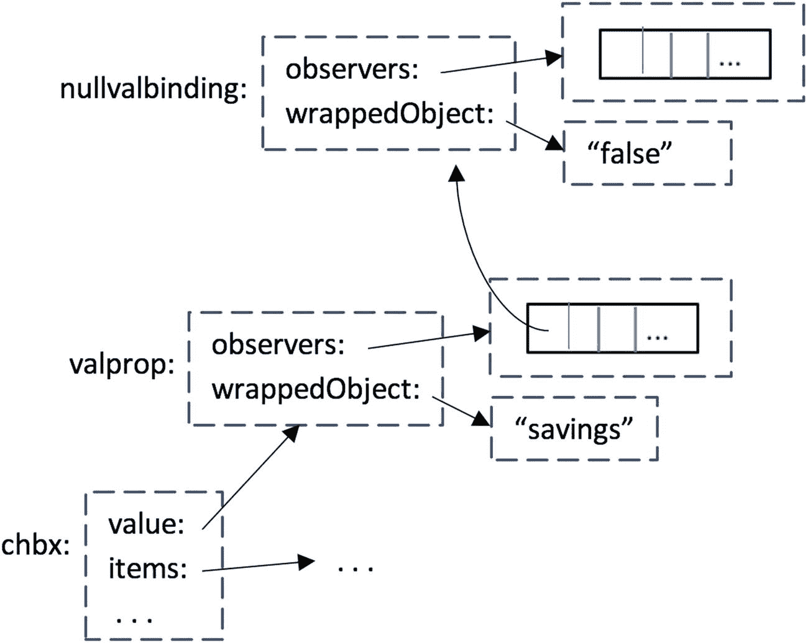

# 10.观察者

随着新对象的创建和现有对象的修改，程序的状态会随着时间而改变。该程序可以响应这些*变化事件*中的一些。例如，向一个外资银行账户存入一大笔存款可能会启动一个检查非法活动的流程。该程序还可以响应某些*输入事件*，例如鼠标动作和键盘输入。例如，鼠标点击按钮通常会得到响应，但鼠标点击标签通常会被忽略。

使用*观察器*是一种通用技术，用于管理程序对事件的响应。一个对象可以维护一个观察者列表，并在一个值得注意的事件发生时通知他们。本章介绍了*观察者模式*，这是将观察者合并到代码中的首选方式。本章给出了使用它的实际例子，并研究了各种设计问题和权衡。

## 观察者和可观察物

以银行业的演示为例。假设银行希望在创建新账户时执行一些操作。例如，营销部门希望向账户所有人发送“欢迎来到银行”信息包，审计部门希望对新的外资账户进行背景调查。

为了实现这个功能，`Bank`类将需要一个对每个想要被通知新帐户的对象的引用，这样它的`newAccount`方法就可以通知这些对象。清单 [10-1](#PC1) 中的代码是这一思想的直接实现，其中`Bank`类保存了对`MarketingRep`和`Auditor`对象的引用。

```java
public class Bank implements Iterable<BankAccount> {
   private Map<Integer,BankAccount> accounts;
   private int nextacct;
   private MarketingRep rep;
   private Auditor aud;

   public Bank(Map<Integer,BankAccount> accounts, int n,
               MarketingRep r, Auditor a) {
      this.accounts = accounts;
      nextacct = n;
      rep = r; aud = a;
   }

   public int newAccount(int type, boolean isforeign) {
      int acctnum = nextacct++;
      BankAccount ba =
                  AccountFactory.createAccount(type, acctnum);
      ba.setForeign(isforeign);
      accounts.put(acctnum, ba);
      rep.update(acctnum, isforeign);
      aud.update(acctnum, isforeign);
      return acctnum;
   }
   ...
}

Listing 10-1Adding Observers to the Bank Class

```

`MarketingRep`和`Auditor`类被称为*观察者*类，它们的对象被称为*观察者*。`Bank`类被称为*可观测*类。当创建新帐户时，它会通知其观察者。按照惯例，通知方法被命名为“update ”,以表示可观察对象正在告诉它的观察者更新已经发生。

可观察对象-观察者的关系类似于发布者和他们的订阅者之间的关系。当出版商有新材料要分发时，它会通知其订户。因此，在程序中使用观察者也被称为*发布-订阅*技术。

Twitter 应用程序是一个众所周知的发布-订阅示例。一个 Twitter 用户有一个关注者列表。当有人在推特上发布消息时，该消息将被发送给列表中的每个关注者(订阅者)。发布-订阅技术也被留言板和 listservs 使用。如果有人向 listserv 发送消息，那么 listserv 的所有订户都会收到该消息。

清单 [10-1](#PC1) 中的`Bank`代码的问题在于，银行确切地知道哪些对象正在观察它。换句话说，可观察类与其观察者类紧密耦合。这种紧密耦合使得每次观察器改变时都必须修改`Bank`。

例如，假设银行决定使用多个营销代理，比如一个用于国外账户，另一个用于国内账户。然后，银行将有两个`MarketingRep`对象观察它。或者假设银行决定添加一个观察者，将每个新帐户的信息记录到一个文件中。在这种情况下，`Bank`需要持有一个额外的观察者对象，这次是类型`AccountLogger`。

解决这个问题的正确方法是注意，银行并不真正关心它有多少个 observer 对象，也不关心它们的类是什么。银行只需持有一份观察员名单就足够了。当一个新帐户被创建时，它可以通知列表中的每个对象。

为了实现这个想法，observer 类必须实现一个公共接口。调用这个接口`BankObserver`。它将有一个名为`update`的方法，如清单 [10-2](#PC2) 所示。

```java
public interface BankObserver {
   void update(int acctnum, boolean isforeign);
}

Listing 10-2The BankObserver Interface

```

然后，`Bank`代码将看起来像清单 [10-3](#PC3) 。请注意这种设计如何极大地减少了可观察对象和观察者之间的耦合。

```java
public class Bank implements Iterable<BankAccount> {
   private Map<Integer,BankAccount> accounts;
   private int nextacct;
   private List<BankObserver> observers;

   public Bank(Map<Integer,BankAccount> accounts,
               int n, List<BankObserver> L) {
      this.accounts = accounts;
      nextacct = n;
      observers = L;
   }

   public int newAccount(int type, boolean isforeign) {
      int acctnum = nextacct++;
      BankAccount ba =
                 AccountFactory.createAccount(type, acctnum);
      ba.setForeign(isforeign);
      accounts.put(acctnum, ba);
      observers.forEach(obs->obs.update(acctnum, isforeign));
      return acctnum;
   }
   ...
}

Listing 10-3An Improved Bank Class

```

提供给`Bank`构造函数的列表可以包含任意数量的观察者，这些观察者可以属于任何实现`BankObserver`的类。对于一个具体的例子，考虑一个简单版本的`Auditor`类，它将每个新的外国拥有的账户的账号写入控制台。它的代码可能看起来像清单 [10-4](#PC4) 。

```java
public class Auditor implements BankObserver {
   public void update(int acctnum, boolean isforeign) {
      if (isforeign)
         System.out.println("New foreign acct" + acctnum);
   }
}

Listing 10-4The Auditor Class

```

图 [10-1](#Fig1) 的类图描述了`Bank`类和它的观察者之间的关系。


图 10-1

银行阶级及其观察者

## 观察者模式

`Bank`和它的观察者之间的这种关系是*观察者模式*的一个例子。基本思想是一个可观察的物体拥有一系列的观察者。当被观察对象决定公布其状态的变化时，它会通知它的观察者。这个想法在图 [10-2](#Fig2) 的类图中有所表达。


图 10-2

观察者模式

这个类图很像图 [10-1](#Fig1) 的图。`Bank`类是可观察对象，`BankObserver`是观察者接口，`Auditor`、`MarketingRep`、`AccountLogger`是观察者类。

尽管图 [10-2](#Fig2) 描述了观察者模式的整体架构，但它在实际细节上有些欠缺。`update`方法的参数应该是什么？可观察对象是如何得到它的观察者列表的？事实证明，有几种方法可以回答这些问题，这导致了观察者模式的多种变化。以下小节研究了一些设计可能性。

### 推与拉

第一个问题是考虑对`update`方法的争论。在清单 [10-2](#PC2) 的`BankObserver`接口中，`update`有两个参数，它们是新创建的银行账户的值，观察者对这些值感兴趣。在更现实的程序中，该方法可能需要更多的参数。例如，一个现实的`Auditor`类想要知道所有者的账号、外国身份和税收 id 号；而`MarketingRep`类想要所有者的账号、姓名和地址。

这种设计技术被称为*推*，因为可观察对象将值“推”给它的观察者。推送技术的困难在于,`update`方法必须发送任何观察者可能需要的所有值。如果观察者需要许多不同的值，那么`update`方法就变得不实用了。此外，可观察对象必须猜测任何未来的观察者可能需要什么值，这可能导致可观察对象“以防万一”地推出许多不必要的值。

另一种叫做*拉*的设计技术缓解了这些问题。在拉技术中，`update`方法包含对可观察对象的引用。然后，每个观察者可以使用该参考从可观察对象中“提取”它想要的值。

清单 [10-5](#PC5) 显示了`BankObserver`的代码，修改后使用了拉技术。它的`update`方法传递一个对`Bank`对象的引用。它还传递新帐户的帐号，以便观察者可以从正确的帐户中提取信息。

```java
public interface BankObserver {
   void update(Bank b, int acctnum);
}

Listing 10-5Revising the BankObserver Interface to Use Pull

```

清单 [10-6](#PC6) 显示了`Auditor`观察者的修改代码。注意它的`update`方法是如何从提供的`Bank`引用中提取外来状态标志的。

```java
public class Auditor implements BankObserver {
   public void update(Bank b, int acctnum) {
      boolean isforeign = b.isForeign(acctnum);
      if (isforeign)
         System.out.println("New foreign acct" + acctnum);
   }
}

Listing 10-6The Revised Auditor Class

```

拉技术有某种优雅之处，因为可观察对象为每个观察者提供了工具，使其能够提取所需的信息。拉技术的一个问题是，观测者必须返回到可观测值来检索所需的值，这种时间滞后可能会影响正确性。

例如，假设一个用户创建了一个新的国内帐户，但是不久之后调用`setForeign`方法将其更改为国外所有者。如果观察者在执行`setForeign`之后从银行提取账户信息，那么它将错误地认为该账户是作为外国账户创建的。

另一个问题是，拉技术只能在被观测者保留观测者想要的信息时使用。例如，假设一个银行观察者希望每次执行`deposit`方法时都得到通知，这样它就可以调查异常大的存款。如果银行不保存每笔存款的金额，那么拉是不可行的。相反，银行将需要通过其`update`方法推送存款金额。

混合推挽式设计可用于平衡推挽式设计。例如，`update`方法可以推送一些值以及对可观察对象的引用。或者,`update`方法可以推送一个相关对象的引用，观察者可以从中提取。清单 10-7 给出了后一种接口的例子。在这种情况下，可观察对象推送一个对新的`BankAccount`对象的引用，观察者可以从中获取他们需要的信息。

```java
public interface BankObserver {
   void update(BankAccount ba);
}

Listing 10-7A Hybrid Push-Pull BankObserver Interface

```

### 管理观察者列表

需要研究的第二个问题是，一个可观察对象如何获得它的观察列表。在清单 [10-3](#PC3) 中，列表通过其构造函数传递给可观察对象，并在整个程序生命周期中保持不变。然而，这样的设计不能处理观察者动态地来来去去的情况。

例如，假设您希望观察者记录正常银行营业时间之外发生的所有银行交易。一种选择是让观察者持续活跃。收到每个事件通知后，观察器会检查当前时间。如果银行关门了，它就会记录事件。

问题在于，银行活动通常在营业时间最繁忙，这意味着观察者将花费大量时间忽略它收到的大多数通知。更好的办法是在银行晚上关门时将观察者添加到观察者列表中，并在银行早上重新开门时将其删除。

为了适应这种需求，observables 必须提供方法来显式地在观察者列表中添加和删除观察者。这些方法通常被称为`addObserver`和`removeObserver`。有了这些变化，`Bank`代码看起来将如清单 [10-8](#PC8) 所示。

```java
public class Bank implements Iterable<BankAccount> {
   private Map<Integer,BankAccount> accounts;
   private int nextacct;
   private List<BankObserver> observers = new ArrayList<>();

   public Bank(Map<Integer,BankAccount> accounts, int n) {
      this.accounts = accounts;
      nextacct = n;
   }

   public void addObserver(BankObserver obs) {
      observers.add(obs);
   }

   public void removeObserver(BankObserver obs) {
      observers.remove(obs);
   }
   ...
}

Listing 10-8Another Revision to the Bank Class

```

这种将观察者动态添加到可观察列表的技术是依赖注入的一种形式。可观察对象对每个观察者都有依赖关系，这种依赖关系通过它的`addObserver`方法注入到可观察对象中。这种形式的依赖注入被称为*方法注入*(相对于清单 [10-3](#PC3) 中的*构造函数注入*)。

有两种方法来执行方法注入。第一种方法是让另一个类(如`BankProgram`)将观察者添加到列表中；另一种方法是每个观察者添加自己。清单 [10-9](#PC9) 的`BankProgram`代码说明了方法注入的第一种形式。

```java
public class BankProgram {
   public static void main(String[] args) {
      ...
      Bank bank = new Bank(accounts, nextacct);
      BankObserver auditor = new Auditor();
      bank.addObserver(auditor);
      ...
   }
}

Listing 10-9One Way to perform Method Injection

```

这种形式的方法注入的一个优点是观察者对象可以用 lambda 表达式来表示，因此不需要显式的观察者类。这个思路如清单 [10-10](#PC10) 所示，假设清单 [10-7](#PC7) 的`BankObserver`接口。

```java
public class BankProgram {
   public static void main(String[] args) {
      ...
      Bank bank = new Bank(accounts, nextacct);
      bank.addObserver(ba -> {
       if (ba.isForeign())
          System.out.println("New foreign acct: "
                            + ba.getAcctNum());
       });
      ...
   }
}

Listing 10-10Revising BankProgram to Use a Lambda Expression

```

清单 [10-11](#PC11) 展示了方法注入的第二种形式。`Auditor`观察者通过其构造函数接收对可观察的`Bank`对象的引用，并将自己添加到银行的观察者列表中。

```java
public class BankProgram {
   public static void main(String[] args) {
      ...
      Bank bank = new Bank(accounts, nextacct);
      BankObserver auditor = new Auditor(bank);
      ...
   }
}

public class Auditor implements BankObserver {
   public Auditor(Bank b) {
      b.addObserver(this);
   }
   ...
}

Listing 10-11A Second Way to Perform Method Injection

```

这种技术导致了可观察对象和它的观察者之间非常有趣的关系。可观察对象调用其观察者的`update`方法，但对它们一无所知。另一方面，观察者知道哪个对象在调用他们。这种情况与典型的方法调用完全相反，在典型的方法调用中，方法的调用方知道它在调用谁，而被调用方不知道谁在调用它。

## Java 中的通用观察者模式

Java 库包含接口`Observer`和类`Observable`，旨在简化观察者模式的实现。`Observer`是一个通用的观察者接口，其代码出现在清单 [10-12](#PC12) 中。它的`update`方法有两个参数，支持混合推拉设计。

```java
interface Observer {
   public void update(Observable obs, Object obj);
}

Listing 10-12The Observer Interface

```

`update`的第一个参数是对发出调用的可观察对象的引用，供拉技术使用。第二个参数是一个包含 push 技术发送的值的对象。如果可观察对象想要推送多个值，那么它会将它们嵌入到单个对象中。如果可观察对象不想推送任何值，那么它会将 null 作为第二个参数发送。

`Observable`是一个抽象类，实现了观察者列表及其相关方法。observable 扩展了这个抽象类，以便继承这个功能。它的代码出现在清单 [10-13](#PC13) 中。

```java
public abstract class Observable {
   private List<Observer> observers = new ArrayList<>();
   private boolean changed = false;

   public void addObserver(Observer obs) {
      observers.add(obs);
   }

   public void removeObserver(Observer obs) {
      observers.remove(obs);
   }

   public void notifyObservers(Object obj) {
      if (changed)
         for (Observer obs : observers)
            obs.update(this, obj);
      changed = false;
   }

   public void notifyObservers() {
      notifyObservers(null);
   }

   public void setChanged() {
      changed = true;
   }
   ...
}

Listing 10-13The Observable Class

```

注意两种不同的`notifyObservers`方法。单参数版本将参数作为第二个参数传递给观察者`update`。零参数版本将 null 作为第二个参数发送给`update`。

还要注意，在客户端第一次调用`setChanged`之前，`notifyObservers`方法什么也不做。`setChanged`的目的是支持定期执行通知的程序，而不是在每次更改后立即执行通知。在这样的程序中，做定期通知的代码可以在任何时候调用`notifyObservers`，确信除非`setChanged`在上次通知后被调用，否则它不会有任何效果。

清单 [10-14](#PC14) 展示了如何使用`Observer`和`Observable`类以及推送技术重写银行演示。这个列表包含了`Bank`(可观察对象)和`Auditor`(观察者)的相关代码。注意`Bank`不再需要代码来管理它的观察者列表和相关方法，因为它的超类`Observable`处理它们。

```java
public class Bank extends Observable
                  implements Iterable<BankAccount> {
   ...
   public int newAccount(int type, boolean isforeign) {
      int acctnum = nextacct++;
      BankAccount ba =
                 AccountFactory.createAccount(type, acctnum);
      ba.setForeign(isforeign);
      accounts.put(acctnum, ba);
      setChanged();
      ObserverInfo info =
                   new ObserverInfo(acctnum, isforeign);
      notifyObservers(info);
      return acctnum;
   }
   ...
}

public class Auditor implements Observer {
   public Auditor(Bank bank) {
      bank.addObserver(this);
   }

   public void update(Observable obs, Object obj) {
      ObserverInfo info = (ObserverInfo) obj;
      if (info.isForeign())
         System.out.println("New foreign account: "
                          + info.getAcctNum());
   }
}

Listing 10-14Rewriting Bank and Auditor Using Observable and Observer

```

`update`方法的第二个参数是一个类型为`ObserverInfo`的对象。这个类在一个对象中嵌入了帐号和外国身份标志。它的代码出现在清单 [10-15](#PC15) 中。

```java
public class ObserverInfo {
   private int acctnum;
   private boolean isforeign;

   public ObserverInfo(int a, boolean f) {
      acctnum = a;
      isforeign = f;
   }

   public int getAcctNum() {
      return acctnum;
   }

   public boolean isForeign() {
      return isforeign;
   }
}

Listing 10-15The ObserverInfo Class

```

虽然`Observable`和`Observer`实现了观察者模式的基础，但是它们的通用性质有一些缺点。`Observable`是一个抽象类，不是一个接口，这意味着 observable 不能扩展任何其他类。`update`方法是“一刀切”，因为应用程序必须将其推送的数据挤入和挤出一个对象，如`ObserverInfo`。由于这些缺点，以及编写它们提供的代码相当简单的事实，通常跳过使用`Observable`和`Observer`会更好。

## 事件

前面几节集中讨论了当一个新的银行账户被创建时，`Bank`类如何通知它的观察者。新账户的创建是*事件*的一个例子。一般来说，可观察对象可能希望向其观察者通知多种类型的事件。例如，版本 18 `Bank`类有四种事件类型。这些类型对应影响其银行账户的四种方式，即`newAccount`、`deposit`、`setForeign`、`addInterest`。版本 18 bank demo 将这四种事件类型定义为 enum `BankEvent`的常量。参见清单 [10-16](#PC16) 。

```java
public enum BankEvent {
   NEW, DEPOSIT, SETFOREIGN, INTEREST;
}

Listing 10-16The Version 18 BankEvent Enum

```

问题是像`Bank`这样的可观察对象如何管理四个不同事件的通知。有两个问题:观察对象应该保留多少个观察列表，以及观察对象接口应该有多少个更新方法。也可以为每个事件创建一个单独的观察者接口。

考虑一下观察者列表。保持一个单一的列表更简单，但是这将意味着每个观察者将被通知每个事件。如果被观察对象能够为每个事件保留一个观察列表，那么通常会更好，这样它的观察对象就可以只注册他们关心的事件。

现在考虑更新方法。一种选择是观察者接口为每个事件提供一个更新方法。这样做的好处是，您可以设计每个方法，以便为其事件定制参数。缺点是观察者必须为每个方法提供一个实现，即使它只对其中一个感兴趣。

另一种方法是让接口有一个更新方法。该方法的第一个参数可以标识事件，其余的参数将传递足够的信息来满足所有观察者。缺点是可能很难将所有这些信息打包到一组参数值中。

对于 18 版本的银行演示，我选择使用单一的`update`方法。清单 [10-17](#PC17) 给出了版本 18 `BankObserver`的接口。`update`方法有三个参数:事件、受影响的银行账户和一个表示存款金额的整数。并非所有的论点都适用于每个事件。例如，`DEPOSIT`观察者将使用所有的自变量；`NEW`和`SETFOREIGN`观察员将只使用赛事和银行账户；而`INTEREST`观察者将只使用事件。

```java
public interface BankObserver {
   void update(BankEvent e, BankAccount ba, int depositamt);
}

Listing 10-17The Version 18 BankObserver Interface

```

版本 18 `Bank`类为四种事件类型中的每一种都有一个观察者列表。为了方便起见，它将这些列表捆绑到一个基于事件类型的映射中。它的`addObserver`方法向指定的列表中添加一个观察者。`removeObserver`方法类似，但是为了方便起见，省略了它的代码。`Bank`还有一个`notifyObservers`方法，通知指定列表上的观察者。

`Bank`有四种生成事件的方法:`newAccount`、`deposit`、`setForeign`和`addInterest`。版本 18 修改了这些方法来调用`notifyObservers`方法。清单 [10-18](#PC18) 给出了代码的相关部分。请注意，`notifyObservers`的第三个参数对于除了`deposit`之外的所有方法都是 0，因为`DEPOSIT`是唯一与该值相关的事件。其他事件忽略该值。

```java
public class Bank implements Iterable<BankAccount> {
   private Map<Integer,BankAccount> accounts;
   private int nextacct;
   private Map<BankEvent,List<BankObserver>> observers
                                       = new HashMap<>();

   public Bank(Map<Integer,BankAccount> accounts, int n) {
      this.accounts = accounts;
      nextacct = n;
      for (BankEvent e : BankEvent.values())
         observers.put(e, new ArrayList<BankObserver>());
   }

   public void addObserver(BankEvent e, BankObserver obs) {
      observers.get(e).add(obs);
   }

   public void notifyObservers(BankEvent e, BankAccount ba,
                               int depositamt) {
      for (BankObserver obs : observers.get(e))
         obs.update(e, ba, depositamt);
   }

   public int newAccount(int type, boolean isforeign) {
      int acctnum = nextacct++;
      BankAccount ba =
                  AccountFactory.createAccount(type, acctnum);
      ba.setForeign(isforeign);
      accounts.put(acctnum, ba);
      notifyObservers(BankEvent.NEW, ba, 0);
      return acctnum;
   }

   public void setForeign(int acctnum, boolean isforeign) {
      BankAccount ba = accounts.get(acctnum);
      ba.setForeign(isforeign);
      notifyObservers(BankEvent.SETFOREIGN, ba, 0);
   }

   public void deposit(int acctnum, int amt) {
      BankAccount ba = accounts.get(acctnum);
      ba.deposit(amt);
      notifyObservers(BankEvent.DEPOSIT, ba, amt);
   }

   public void addInterest() {
      forEach(ba->ba.addInterest());
      notifyObservers(BankEvent.INTEREST, null, 0);
   }
   ...
}

Listing 10-18The Version 18 Bank Class

```

类别`Auditor`的版本 18 代码出现在清单 [10-19](#PC19) 中。该类是两个事件的观察者:NEW 和 SETFOREIGN。因为它观察两个事件，所以它检查其`update`方法的第一个参数来确定哪个事件发生了。

```java
public class Auditor implements BankObserver {
   public Auditor(Bank bank) {
      bank.addObserver(BankEvent.NEW, this);
      bank.addObserver(BankEvent.SETFOREIGN, this);
   }

   public void update(BankEvent e, BankAccount ba,
                      depositamt amt) {
      if (ba.isForeign()) {
         if (e == BankEvent.NEW)
            System.out.println("New foreign account: "
                  + ba.getAcctNum());
         else
            System.out.println("Modified foreign account: "
                  + ba.getAcctNum());
      }
   }
}

Listing 10-19The Version 18 Auditor Class

```

版本 18 `BankProgram`代码出现在清单 [10-20](#PC20) 中。该类创建了两个观察器:一个`Auditor`实例和一个观察`DEPOSIT`事件的 lambda 表达式。如果检测到超过 100，000 美元的存款，这个观察者调用银行的`makeSuspicious`方法。

```java
public class BankProgram {
   public static void main(String[] args) {
      SavedBankInfo info = new SavedBankInfo("bank18.info");
      Map<Integer,BankAccount> accounts = info.getAccounts();
      int nextacct = info.nextAcctNum();
      Bank bank = new Bank(accounts, nextacct);
      Auditor aud = new Auditor(bank);
      bank.addObserver(BankEvent.DEPOSIT,
            (event,ba,amt) -> {
               if (amt > 10000000)
                  bank.makeSuspicious(ba.getAcctNum());
            });
      ...
   }
}

Listing 10-20The Version 18 BankProgram Class

```

## JavaFX 中的观察员

事件和事件观察器在 GUI 应用程序中起着重要的作用。在 JavaFX 中，用户与屏幕的交互导致一系列的*输入事件*发生。JavaFX 库指定了几种类型的输入事件。每个事件类型都是扩展类`Event`的类中的一个对象。三个这样的等级是`MouseEvent`、`KeyEvent`和`ActionEvent`。清单 [10-21](#PC21) 显示了这些类的一些常见事件类型。

```java
MouseEvent.MOUSE_CLICKED
MouseEvent.MOUSE_ENTERED
KeyEvent.KEY_TYPED
ActionEvent.ACTION

Listing 10-21Four Common JavaFX Event Types

```

事件类型表示生成的事件的种类。事件的*目标*是负责处理它的节点。例如，如果用户鼠标点击屏幕上的某个特定位置，那么该位置最顶端的节点将成为一个`MOUSE_CLICKED`事件的目标。

每个 JavaFX `Node`对象都是可观察的。节点为每种事件类型保留一个单独的观察器列表。也就是说，一个节点将有一个鼠标点击观察器、鼠标输入观察器、键盘输入观察器等的列表。

在 JavaFX 中，事件观察者被称为*事件处理者*。每个节点都有方法`addEventHandler`，该方法为给定的事件类型向节点的观察者列表添加一个观察者。这个方法有两个参数:感兴趣的事件类型和对事件处理程序的引用。

事件处理程序属于实现接口`EventHandler`的类。该接口只有一个方法，名为`handle`。它的代码出现在清单 [10-22](#PC22) 中。

```java
public interface EventHandler {
   void handle(Event e);
}

Listing 10-22The EventHandler Interface

```

清单 [10-23](#PC23) 给出了事件处理程序类`ColorLabelHandler`的代码，其`handle`方法将指定标签的文本更改为指定的颜色。

```java
public class ColorLabelHandler
             implements EventHandler<Event> {
   private Label lbl;
   private Color color;

   public ColorLabelHandler(Label lbl, Color color) {
      this.lbl = lbl;
      this.color = color;
   }

   public void handle(Event e) {
      lbl.setTextFill(color);
   }
}

Listing 10-23The ColorLabelHandler Class

```

作为事件处理程序的使用示例，再次考虑清单 [9-8](09.html#PC8) 和 [9-9](09.html#PC9) 中的`AccountCreationWindow`程序。图 [10-3](#Fig3) 显示其初始屏幕。


图 10-3

初始帐户创建窗口屏幕

清单 [10-24](#PC24) 修改了程序，增加了四个事件处理程序:

*   标题标签上的一个`MOUSE_ENTERED`处理程序，当鼠标进入标签区域时，它的文本变成红色。

*   标题标签上的一个`MOUSE_EXITED`处理程序，当鼠标退出标签区域时，它将文本变回绿色。这两个处理程序的组合产生了一种“翻转”效果，当鼠标滑过标签时，标签会暂时变成红色。

*   最外层窗格上的一个`MOUSE_CLICKED`处理程序，通过取消选中复选框，将选择框的值设置为 null，并将标题标签的文本改回“Create a new bank account”来重置屏幕

*   按钮上的一个`MOUSE_CLICKED`处理程序，它使用复选框和选择框的值来改变标题标签的文本。

```java
public class AccountCreationWindow extends Application {
   public void start(Stage stage) {
      ...
      Label title = ... // the label across the top
      title.addEventHandler(MouseEvent.MOUSE_ENTERED,
                  new ColorLabelHandler(title, Color.RED));
      title.addEventHandler(MouseEvent.MOUSE_EXITED,
                  e -> title.setTextFill(Color.GREEN));

      Pane p1 = ... // the outermost pane
      p1.addEventHandler(MouseEvent.MOUSE_CLICKED,
           e -> {
             ckbx.setSelected(false);
             chbx.setValue(null);
             title.setText("Create a New Bank Account");
           });

      Button btn = ... // the CREATE ACCT button
      btn.addEventHandler(MouseEvent.MOUSE_CLICKED,
           e -> {
             String foreign = ckbx.isSelected() ?
                              "Foreign " : "";
             String acct = chbx.getValue();
             title.setText(foreign + pref + acct
                                   + " Account Created");
             stage.sizeToScreen();
           });
      ...
   }
}

Listing 10-24A Revised AccountCreationWindow Class

```

第一个处理程序使用清单 [10-23](#PC23) 中的`ColorLabelHandler`类。它的`handle`方法将在鼠标进入标题标签的区域时执行。第二个处理程序使用 lambda 表达式来定义`handle`方法。lambda 表达式(或内部类)的一个特性是它可以从其周围的上下文中引用变量(如`title`)。这避免了像在`ColorLabelHandler`中那样将这些值传递给构造函数的需要。

第三个处理程序观察窗格`p1`上的鼠标点击，第四个处理程序观察按钮上的鼠标点击。这两个处理程序都通过 lambda 表达式定义了它们的`handle`方法。

指定按钮处理程序的一种常见方式是用`ActionEvent.ACTION`替换事件类型`MouseEvent.MOUSE_CLICKED`。一个`ACTION`事件表示来自用户的“提交”请求。按钮支持几种提交请求，比如鼠标点击按钮，通过触摸屏触摸按钮，当按钮获得焦点时按空格键。为按钮处理程序使用`ACTION`事件通常比使用`MOUSE_CLICKED`事件更好，因为单个`ACTION`事件处理程序将支持所有这些请求。

`Button`类也有一个方法`setOnAction`，它进一步简化了按钮处理程序的规范。例如，清单 [9-9](09.html#PC9) 中的按钮处理程序使用了`setOnAction`而不是`addEventHandler`。以下两种说法效果相同。

```java
   btn.addEventHandler(ActionEvent.ACTION, h);
   btn.setOnAction(h);

```

## JavaFX 属性

JavaFX 节点的状态由各种*属性*表示。例如，`ChoiceBox`类的两个属性是`items`，它表示选择框应该显示的项目列表，以及`value`，它表示当前选中的项目。对于节点的每个属性，该节点都有一个方法返回对该属性的引用。方法的名称是属性名，后跟“property”例如，`ChoiceBox`有方法`itemsProperty`和`valueProperty`。

形式上，属性是实现接口`Property`的对象。它的三种方法如清单 [10-25](#PC26) 所示。基于这些方法，您可以正确地推断出一个`Property`对象既是包装器又是可观察对象。方法`getValue`和`setValue`获取并设置包装的值，方法`addListener`将一个监听器添加到它的观察列表中。在下面的小节中，我们将研究属性的这两个方面。

```java
public interface Property<T> {
   T getValue();
   void setValue(T t);
   void addListener(ChangeListener<T> listener);
   ...
}

Listing 10-25Methods of the Property Interface

```

### 作为包装的属性

属性的`getValue`和`setValue`方法很少使用，因为每个节点都有替代的便利方法。特别是，如果一个节点有一个名为`p`的属性，那么它有便利的方法`getP`和`setP`。例如，清单 [10-26](#PC27) 显示了清单 [9-9](09.html#PC9) 中`createNodeHierarchy`方法的开始。对`getP`和`setP`方法的调用以粗体显示。

```java
private Pane createNodeHierarchy() {
   VBox p3 = new VBox(8);
   p3.setAlignment(Pos.CENTER);
   p3.setPadding(new Insets(10));
   p3.setBackground(...);
   Label type = new Label("Select Account Type:");
   ChoiceBox<String> chbx  = new ChoiceBox<>();
   chbx.getItems().addAll("Savings", "Checking",
                          "Interest Checking");
   ...
}

Listing 10-26The Beginning of the AccountCreationWindow Class

```

这些方法都是方便的方法，因为类`VBox`有属性`alignment`、`padding`和`background`，而`ChoiceBox`有属性`items`。为了证明这一点，清单 [10-27](#PC28) 给出了不使用这些便利方法的代码的替代版本。

```java
private Pane createNodeHierarchy() {
   VBox p3 = new VBox(8);
   Property<Pos> alignprop = p3.alignmentProperty();
   alignprop.setValue(Pos.CENTER);
   Property<Insets> padprop = p3.paddingProperty();
   padprop.setValue(new Insets(10));
   Property<Background> bgprop = p3.backgroundProperty();
   bgprop.setValue(...);
   Label type = new Label("Select Account Type:");
   ChoiceBox<String> chbx  = new ChoiceBox<>();
   Property<String> itemsprop = chbx.itemsProperty();
   itemsprop.getValue().addAll("Savings", "Checking",
                               "Interest Checking");
   ...
}

Listing 10-27Revising Listing 10-26 to Use Explicit Property Objects

```

### 可观察的属性

一个属性是一个可观察的对象，它维护着一个观察者列表。当其包装的对象改变状态时，该属性通知其观察者。一个属性观察者被称为*变更监听器*，并实现清单 [10-28](#PC29) 中所示的接口`ChangeListener`。

```java
public interface ChangeListener<T> {
   void changed(Property<T> obs, T oldval, T newval);
}

Listing 10-28The ChangeListener Interface

```

该接口由一个名为`changed`的方法组成。注意`changed`是一种混合推挽观测器方法。第二个和第三个参数将新旧值推送给观察者。第一个论据是可观测性本身，观测者可以从中获得额外的信息。(从技术上讲，第一个参数属于类型`ObservableValue`，这是一个比`Property`更通用的接口。但是为了简单起见，我忽略了这个问题。)

创建变更监听器最简单的方法是使用 lambda 表达式。例如，清单 [10-29](#PC30) 给出了可以添加到`AccountCreationWindow`类中的监听器代码。这个监听器观察复选框`ckbx`。如果框被选中，执行它的代码会使标签的文本变成绿色，如果框被取消选中，则变成红色。

```java
ChangeListener<Boolean> checkboxcolor =
      (obs, oldval, newval) -> {
          Color c = newval ? Color.GREEN : Color.RED;
          ckbx.setTextFill(c);
      };

Listing 10-29A Check Box Change Listener

```

要让变更监听器执行，您必须通过调用属性的`addListener`方法将其添加到属性的观察者列表中，如清单 [10-30](#PC31) 所示。结果是，当复选框被选中和取消选中时，它的颜色会从红色变为绿色，然后再变回绿色。

```java
ChangeListener<Boolean> checkboxcolor = ... // Listing 10-29
Property<Boolean> p = ckbx.selectedProperty();
p.addListener(checkboxcolor);

Listing 10-30Attaching a Change Listener to a Property

```

清单 [10-29](#PC30) 和 [10-30](#PC31) 需要三条语句来创建一个监听器并将其添加到所需属性的观察者列表中。我这样写是为了一步一步地向你展示需要发生什么。实际上，大多数 JavaFX 程序员会将整个代码写成一条语句，如清单 [10-31](#PC32) 所示。

```java
ckbx.selectedProperty().addListener(
      (obs, oldval, newval) -> {
          Color c = newval ? Color.GREEN : Color.RED;
          ckbx.setTextFill(c);
      });

Listing 10-31Revising the Check Box Change Listener

```

更改侦听器也可用于同步 JavaFX 控件的行为。再次考虑图 [10-3](#Fig3) 中显示的`AccountCreationWindow`的初始屏幕。请注意，选择框是未选中的。如果用户此时点击了`CREATE ACCT`按钮，如果代码试图创建一个帐户，就会出现运行时错误。

为了消除出错的可能性，您可以设计屏幕，使按钮最初被禁用，只有在选择了帐户类型时才被启用。这种设计要求在选择框中添加一个更改监听器。其代码如清单 [10-32](#PC33) 所示。

```java
public class AccountCreationWindow extends Application {
   public void start(Stage stage) {
      ...
      chbx.valueProperty().addListener(
            (obj, oldval, newval) ->
                          btn.setDisable(newval==null));
      ...
   }
}

Listing 10-32Adding Change Listener for the Choice Box

```

变量`chbx`引用选择框。如果选择框的新值为空，更改监听器禁用按钮，否则启用按钮。结果是按钮的启用/禁用状态与选择框的选中/未选中状态同步。

事件侦听器和更改侦听器可以交互。回想一下清单 [10-24](#PC24) 中，`AccountCreationWindow`的最外层窗格`p1`有一个事件监听器，当窗格被点击时，它将选择框的值设置为空。此更改将导致选择框的更改侦听器触发，然后禁用按钮。也就是说，从选择框中选择一个项目会启用该按钮，单击外部窗格会禁用该按钮。用户可以通过从选择框中选择一个帐户类型，然后单击外部窗格来反复启用和禁用该按钮。试试看。

## JavaFX 绑定

JavaFX 支持计算属性的概念，它被称为*绑定*。绑定实现了接口`Binding`，清单 [10-33](#PC34) 中显示了其中的两个方法。注意，绑定和属性之间的主要区别在于绑定没有`setValue`方法。绑定没有`setValue`，因为它们的值是计算出来的，不能手动设置。

```java
public interface Binding<T> {
   public T getValue();
   public void addListener(ChangeListener<T> listener);
   ...
}

Listing 10-33The Binding Interface

```

可以用几种方法创建绑定，但最简单的方法是使用与您拥有的属性类型相关联的方法。例如，包装对象的属性扩展了类`ObjectProperty`并继承了方法`isNull`。清单 [10-34](#PC35) 展示了如何为选择框的`value`属性创建一个绑定。

```java
ChoiceBox chbx = ...
ObjectProperty<String> valprop = chbx.valueProperty();

Binding<Boolean> nullvalbinding = valprop.isNull();

Listing 10-34An example Binding

```

变量`nullvalbinding`引用了一个包装了布尔值的`Binding`对象。这个布尔值是从选择框的`value`属性计算出来的——特别是，如果`value`包含一个空值，那么这个布尔值将为真，否则为假。

当一个`Binding`对象被创建时，它将自己添加到其属性的观察者列表中。因此，对属性值的更改将通知绑定，然后绑定可以相应地更改其值。为了帮助你形象化这种情况，请看图 [10-4](#Fig4) 的图表，它描绘了清单 [10-34](#PC35) 的三个变量的记忆图。



图 10-4

绑定与其属性之间的关系

`chbk`对象代表选择框。它有对其每个属性的引用。该图仅显示了对`value`的引用，并暗示了对`items`的引用。`valprop`对象代表`value`属性。它有一个对其包装对象(字符串“savings”)和观察者列表的引用。图表显示列表至少有一个观察者，这就是绑定`nullvalbinding`。请注意，绑定的结构类似于属性。它的包装对象是一个布尔值`false`。

当`chbx`节点改变其被包装的对象时，比如说通过执行代码`valueProperty().setValue(null)`,`value`属性将发送一个改变通知给它的观察者。当绑定收到通知时，它会注意到属性的新值为 null，并将其包装对象的值设置为`true`。

清单 [10-32](#PC33) 的代码为选择框创建了一个变更监听器。清单 [10-35](#PC36) 重写代码以使用绑定。注意变更监听器如何将按钮的`disable`属性的值设置为绑定的值。不需要像清单 [10-32](#PC33) 中那样显式地检查 null，因为检查是由绑定执行的。

```java
public class AccountCreationWindow extends Application {
   public void start(Stage stage) {
      ...
      ObjectProperty<String> valprop = chbx.valueProperty();
      Binding<Boolean> nullvalbinding = valprop.isNull();
      nullvalbinding.addListener(
            (obj, oldval, newval) -> btn.setDisable(
                             nullvalbinding.getValue()));
      ...
   }
}

Listing 10-35Rewriting the Choice Box Change Listener

```

清单 [10-35](#PC36) 的代码有些难读(也有些难写！).为了简化起见，`Property`对象有方法`bind`，它为您执行绑定。清单 [10-36](#PC37) 相当于清单 [10-35](#PC36) 的代码。

```java
public class AccountCreationWindow extends Application {
   public void start(Stage stage) {
      ...
      btn.disableProperty()
         .bind(chbx.valueProperty().isNull());
      ...
   }
}

Listing 10-36Using the Bind Method to Create an Implicit Change Listener

```

`bind`方法有一个参数，它是一个绑定(或属性)。这里，方法的参数是由`isNull`方法创建的绑定。`bind`方法向该绑定添加了一个更改侦听器，这样当它的包装值更改时，按钮的`disable`属性的值也会随之更改。该行为与清单 [10-35](#PC36) 中的行为完全相同。

清单 [10-36](#PC37) 的代码格外漂亮。`bind`方法和`isNull`方法都创建变更监听器，这些监听器通过观察者模式(两次！)使这两个控件能够同步它们的值。而这一切都发生在幕后，客户毫不知情。这是观察者模式的有用性和适用性的极好例子。

## 摘要

一个*观察者*是一个对象，它的工作是响应一个或多个*事件*。一个*可观察的*是一个物体，它能识别特定事件何时发生，并保持一个对这些事件感兴趣的观察者列表。当一个事件发生时，它通知它的观察者。

*观察者模式*规定了观察者和可观察物之间的一般关系。但是这种模式没有解决多个设计问题。一个问题涉及到更新方法:一个可观察对象应该向它的观察者推送什么值，以及观察者应该从可观察对象获取什么值？第二个问题是关于可观察对象如何处理多种类型的事件:它应该用单独的更新方法和观察列表独立地处理每个事件，还是可以以某种方式组合事件处理？这些问题没有最佳解决方案。设计师必须考虑给定情况下的各种可能性，并权衡利弊。

观察者模式对于 GUI 应用程序的设计尤其有用。事实上，JavaFX 中充满了 observer 模式，如果不大量使用 observer 和 observables，设计 JavaFX 应用程序几乎是不可能的。即使应用程序没有显式地使用观察器，应用程序使用的类库几乎肯定会使用。

JavaFX 节点支持两种观察器:*事件处理程序*和*变化监听器*。事件处理程序响应输入事件，如鼠标点击和按键。每个事件处理程序都属于某个节点的观察者列表。变化监听器响应节点状态的变化。每个变更监听器属于一个节点的某个属性的观察者列表。通过适当地设计事件处理程序和更改侦听器，JavaFX 屏幕可以被赋予非常复杂的行为。