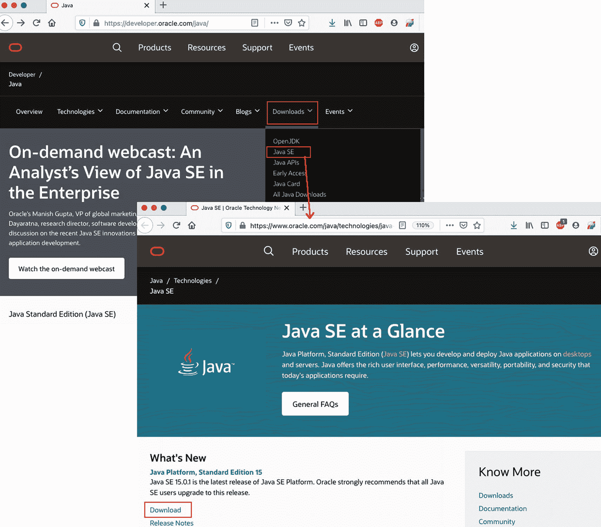
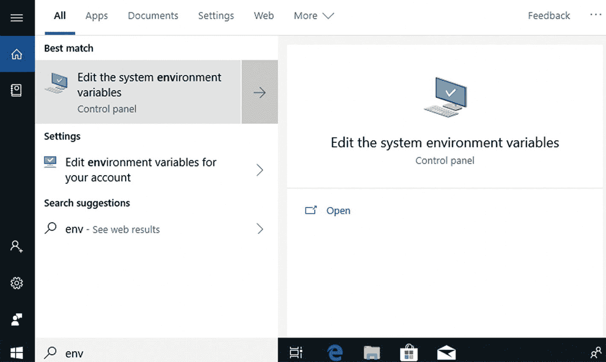
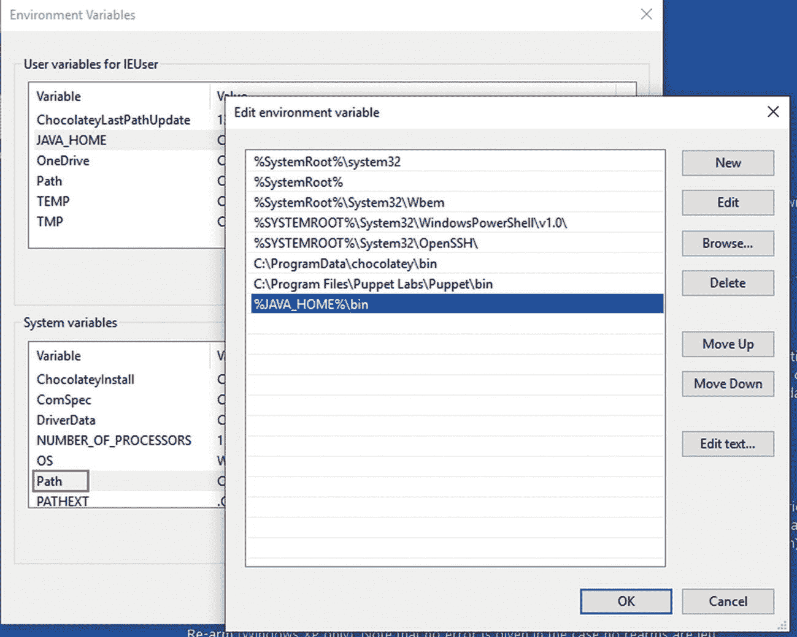
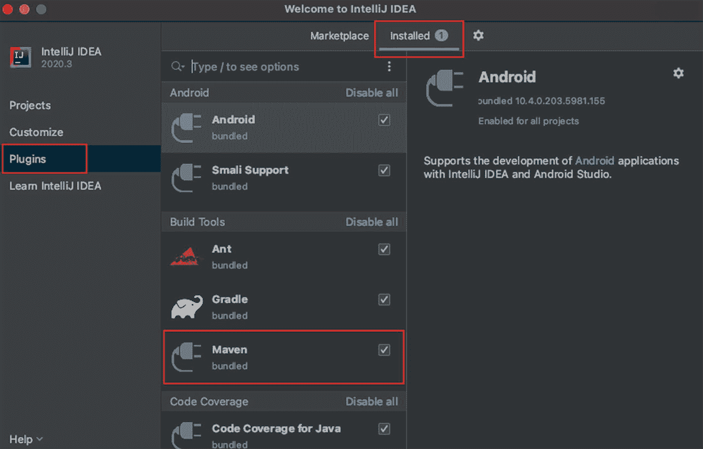

# 2.准备您的开发环境

要开始学习 Java，你的电脑需要设置成 Java 开发机。因此，要求如下:

*   你的电脑对 Java 的支持是强制性的*。*

*   集成开发环境，也称为 IDE，它基本上是一个用来编写代码的应用程序。IDE 在编写代码、编译代码和执行代码时为您提供帮助。
    *   本书推荐的 IDE 是 **IntelliJ IDEA** 。你可以去他们的网站获取免费的社区版；就本书的目的而言，这就够了。

    *   或者可以选择 Java 开发最流行的免费 IDE:Eclipse。

    *   或者你可以试试 **NetBeans** ，1 这是大多数初学者的默认选择，因为在版本 8 之前，它是与 JDK 捆绑在一起的。是从 Java 9 的 JDK 里拿出来的，现在可以从这里下载: [`https://netbeans.org/`](https://netbeans.org/) 。

*   Maven 是一个构建工具，用于组织项目，轻松处理依赖关系，并使您在大型多模块项目中的工作更容易。(这是强制性的，因为本书中的项目是用 Maven 设置组织和构建的。)

*   Git 是一个版本控制系统，你可以用它来获得这本书的源代码，你可以用它来做实验并创建你自己的版本。它是可选的，因为 GitHub 是本章源代码的宿主，支持直接下载它们作为存档。 <sup>[1](#Fn1)</sup>

要编写和执行 Java 程序/应用，你只需要安装好**J**ava**D**development**K**it(JDK)。没有什么能阻止你在记事本中编写 Java 代码，如果这是你想要的。我在这里列出的所有其他工具只是为了让您的工作更容易，并让您熟悉真正的开发工作。

如果你为所有用户安装这些应用程序，你可能需要管理权限。对于 Windows 10，你甚至可能需要一个特殊的程序来授予你的用户管理权限，以便你可以安装必要的工具。这本书提供了如何安装所有东西的说明——假设你的用户有必要的权限。如果你需要更多的信息，互联网可以帮助你。

如果看起来很多，不要气馁；本章包含如何安装和验证每个工具是否正常工作的说明。让我们从确保你的电脑支持 Java 开始。

## 安装 Java

现在你有了电脑，你迫不及待地开始编写 Java 应用程序。但是首先你需要给自己弄一个 JDK 并安装它。为此，你需要一个互联网连接。打开浏览器，进入 [`https://developer.oracle.com/java`](https://developer.oracle.com/java) 。菜单应该有一个**下载**部分。展开它，选择 Java SE，如图 [2-1](#Fig1) 所示。



图 2-1

浏览 Oracle 站点以找到所需的 JDK

在 Oracle 网站上，您可以找到最新的稳定 Java 版本。单击所需版本下的下载链接。您应该会被重定向到一个类似于图 [2-2](#Fig2) 中的下载页面。


图 2-2

您可以在 Oracle 页面下载所需的 JDK

JDK 可用于一些操作系统。你应该下载和你的相匹配的。为了写这本书和写源代码，我用的是 macOS 电脑，这意味着我会用 ***下载 JDK。dmg** 分机。

您需要接受许可协议，才能使用 Java 进行开发。好奇的可以看一下，但基本上它告诉你，只要不修改它原来的组件，就允许你使用 Java。它还告诉你，你要对你如何使用它负责，所以如果你用它来编写或执行邪恶的应用程序，你要独自承担法律等方面的责任。

如果你想得到一个尚未正式发布的 JDK 早期版本，这是你必须去的页面: [`http://openjdk.java.net/projects/jdk/`](http://openjdk.java.net/projects/jdk/) 。在写这一章的时候，在那个页面上，在**版本**下，版本 16 和 17 被列为开发中的*，一个早期访问(不稳定)的 JDK 17 可供下载。*

 *这本书将涵盖 Java 语法和 17 版本的细节。在撰写本章时，该版本还有八个月的时间，因此一些图片和细节可能会过时(例如，Oracle 可能会更改其网站的主题)。从一个版本到另一个版本，有一些相同的细节。JDK 不再被称为 JDK 的可能性很小。这些将不会被审查和改变，因为唯一不同的是版本号。由于本书计划在 Java 17 发布后发布，建议下载该版本的 JDK，以确保源代码的完全兼容性。

下载完 JDK 后，下一步是安装它。只需双击它，然后单击下一步，直到完成。这将适用于 Windows 和 macOS。JDK 安装在特定的位置。

在 Windows 中，这是`C:\Program Files\Java\jdk-17`。

在 macOS 中这是`/Library/Java/JavaVirtualMachines/jdk-17.jdk/Contents/Home`。

在 Linux 系统上，根据发行版的不同，JDK 的安装位置也会有所不同。我的首选方法是从 Oracle 站点获取包含 JDK 全部内容的*.tar.gz，将其解压缩，并复制到一个特定的位置。另外，我在 Linux 上的首选位置是`/home/iuliana.cosmina/tools/jdk-17.jdk`。

使用 PPA(储存库；也称为软件包管理器)安装程序会自动将 JDK 文件放在它们在 Linux 上应该放的位置，并在发布新版本时使用 Linux(全局)更新程序自动更新它们。但是如果你熟练地使用 Linux，你现在可能已经发现可以跳过这一节了。

在 Linux 或 Unix 系统上简化事情的另一种方法是使用 SDKMAN。从这里得到: [`https://sdkman.io/`](https://sdkman.io/) 。

如果你去那个地方，你可以检查 JDK 的内容。在图 [2-3](#Fig3) 中，左边是 JDK 17 的内容，右边是 JDK 8 的内容。


图 2-3

8 版和 17 版内容对比

我选择进行这种比较是因为从 Java 9 开始，JDK 的内容以不同的方式组织。在 Java 8 之前，JDK 包含一个名为`jre`的目录，其中包含 JDK 使用的 Java 运行时环境(JRE)。对于只对运行 Java 应用程序感兴趣的人来说，JRE 可以单独下载。

`lib`目录包含开发工具所需的 Java 库和支持文件。

从 Java 9 开始，JRE 不再被隔离在自己的目录中。从版本 11 开始，Java 变得完全模块化。这意味着可以使用运行应用程序所需的特定模块来创建定制的 JRE 发行版。这意味着从 Java 11 开始，Oracle 站点上没有 JRE 可供下载。

关于 JDK，您需要知道的最重要的事情是,`bin`目录包含编译、执行和审计 Java 代码所必需的可执行文件和命令行启动器。其他目录是`jmods`目录和`include`目录，前者包含编译后的模块定义，后者包含 C 语言头文件，支持使用 Java 本地接口(JNI)和 Java 虚拟机(JVM)调试接口进行本地代码编程。

## JAVA_HOME 环境变量

JDK 中最重要的目录是`bin`目录，因为该目录必须添加到系统的路径中。这允许您从任何地方调用 Java 可执行文件。这允许其他应用程序也调用它们，而不需要额外的配置步骤。大多数用于处理 <sup>[2](#Fn2)</sup> Java 代码的 ide 都是用 Java 编写的，它们需要知道 JDK 安装在哪里才能运行。这是通过声明一个名为 JAVA_HOME 的环境变量来实现的，该变量指向 JDK 目录的位置。要使 Java 可执行文件可以从系统中的任何位置调用，必须将 bin 目录添加到系统路径中。接下来的三个部分解释了如何在三种最常见的操作系统上实现这一点。

### Windows 上的 JAVA_HOME

要在 Windows 系统上声明 JAVA_HOME 环境变量，需要打开设置系统变量的对话框。在 Windows 系统上，点击**开始**按钮。在菜单中，有一个搜索框。在更近的版本中，水平工具栏上有一个搜索框；你也可以用这个。在那里输入单词**环境**(单词的前三个字母就足够了)。该选项应该可以点击。在 Windows 10 上，这些步骤如图 [2-4](#Fig4) 所示。



图 2-4

用于配置环境变量的 Windows 菜单项

点击该菜单项后，应会打开如图 [2-5](#Fig5) 所示的窗口。


图 2-5

在 Windows 上设置环境变量的第一个对话框

点击**环境变量**按钮(有硬边的那个)。另一个对话窗口打开，分为两部分:用户变量和系统变量。你对**系统变量**感兴趣，因为那是我们声明 **JAVA_HOME** 的地方。只需点击**新建**按钮，就会出现一个小的对话窗口，里面有两个文本字段；一个要求您输入变量名，在本例中为`JAVA_HOME`，另一个要求您输入路径，在本例中为 JDK 路径。第二个窗口和变量信息弹出对话框窗口如图 [2-6](#Fig6) 所示。


图 2-6

在 Windows 10 上将 JAVA_HOME 声明为系统变量

在定义了`JAVA_HOME`变量之后，您需要将可执行文件添加到系统路径中。这可以通过编辑`Path`变量来完成。只需从系统变量列表中选择并点击**编辑**按钮。从 Windows 10 开始，`Path`变量的每一部分都显示在不同的行上，所以你可以添加一个新行，在上面添加`%JAVA_HOME%\bin`。这种语法很实用，因为它从`JAVA_HOME`变量包含的任何位置获取 bin 目录的位置。对话窗口如图 [2-7](#Fig7) 所示。



图 2-7

在 Windows 10 上，将 JDK 可执行文件目录声明为系统路径变量的一部分

在旧的 Windows 系统上，`Path`的内容显示在一个文本字段中。这意味着您必须在**变量**文本字段中添加`%JAVA_HOME%\bin`表达式，并使用分号(；).

无论你用的是哪种 Windows 系统，你都可以通过打开**命令提示符**并执行`set`命令来检查你的设置是否正确。这将列出所有系统变量及其值。`JAVA_HOME`和`Path`应该有期望的值。对于本节提出的设置，当执行`set`时，输出如图 [2-8](#Fig8) 所示。


图 2-8

使用“set”命令列出的 Windows 10 系统变量

如果您执行了前面的命令并看到了预期的输出，现在您可以通过在**命令提示符**窗口中执行`java -version`来测试您的 Java 安装，它会打印出预期的结果，类似于清单 [2-1](#PC1) 的内容。

```java
$ java -version
openjdk version "17-ea" 2021-09-14
OpenJDK Runtime Environment (build 17-ea+3-125)
OpenJDK 64-Bit Server VM (build 17-ea+3-125, mixed mode, sharing)

Listing 2-1Java 17 Log for Execution of java -version

```

### macOS 上的 JAVA_HOME

JDK 安装的位置是`/Library/Java/JavaVirtualMachines/jdk-17.jdk/Contents/Home`。你的`JAVA_HOME should`指向这个位置。要为当前用户执行此操作，您可以执行以下操作:

*   在`/Users/{your.user}`目录中， <sup>[3](#Fn3)</sup> 创建一个名为`.bash_profile`的文件，如果它还不存在的话。

*   在该文件中，编写以下内容:

```java
export JAVA_HOME=$(/usr/libexec/java_home -v17)
export PATH=$JAVA_HOME/bin:$PATH

```

如果您使用不同的 shell，只需在它自己的配置文件中添加相同的两行。

在 macOS 上，可以同时安装多个 Java 版本。您可以通过调用`/usr/libexec/java_home`命令并给出您感兴趣的 Java 版本作为参数来获取所需版本的 JDK 位置，从而设置系统上当前使用的版本。执行命令的结果存储为`JAVA_HOME`变量的值。

在我的系统上，我安装了 JDK 8 到 17。我可以通过执行`/usr/libexec/java_home`命令并提供每个版本作为参数来检查每个 JDK 的位置。清单 [2-2](#PC3) 中描述了版本 8 和 17 的命令和输出。

```java
$ /usr/libexec/java_home -v17
/Library/Java/JavaVirtualMachines/jdk-17.jdk/Contents/Home

$ /usr/libexec/java_home -v1.8
/Library/Java/JavaVirtualMachines/jdk1.8.0_162.jdk/Contents/Home

Listing 2-2Java 8 and 17 Locations Obtaind By Calling /usr/libexec/java_home

```

使用 SDKMAN 可以避免手动安装 Java 和声明`JAVA_HOME`环境变量。

行 export `PATH=$JAVA_HOME/bin:$PATH`将 bin 目录的内容从 JDK 位置添加到系统补丁中。这意味着我可以打开一个终端并在它下面执行任何 Java 可执行文件。例如，我可以通过执行`java –version`来验证为我的用户设置的默认 Java 版本是否是期望的版本。

根据作为参数给出的版本，将返回不同的 JDK 位置。如果您想测试`JAVA_HOME`的值，那么`echo`命令可以帮助您。清单 [2-3](#PC4) 描述了`echo`和`java –version`命令的输出。

```java
$ echo $JAVA_HOME
/Library/Java/JavaVirtualMachines/jdk-17.jdk/Contents/Home

$ java -version
openjdk version "17-ea" 2021-09-14
OpenJDK Runtime Environment (build 17-ea+3-125)
OpenJDK 64-Bit Server VM (build 17-ea+3-125, mixed mode, sharing)

Listing 2-3echo and java –version commands to check JAVA_HOME value and the Java version installed

```

### Linux 上的 JAVA_HOME

如果你熟练地使用 Linux，你要么使用 PPA，要么使用 SDKMAN，所以你可以跳过这一节。但是，如果您喜欢控制 JDK 的位置并定义自己的环境变量，请继续阅读。

Linux 系统是类似 Unix 的操作系统。这和 macOS 类似，都是基于 Unix 的。根据您的 Linux 发行版，安装 Java 可以通过特定的包管理器来完成，或者直接从 Oracle 官方网站下载 JDK * . tar . gz 档案文件。

如果使用包管理器安装 Java，必要的可执行文件通常会在安装时自动放在系统路径中。这就是为什么在本书中，我们只讨论手动完成所有事情的情况，并选择只为当前用户在某个位置安装 Java，比如`/home/{your.user}/tools/jdk-17.jdk`，因为讨论包管理器不是本书的目的。<sup>[4](#Fn4)T4】</sup>

从 Oracle 站点下载 JDK 归档文件并在`/home/{your.user}/tools/jdk-17.jdk`解包后，您需要在您的用户主目录中创建一个名为`.bashrc`或`.bash_profile`的文件。在某些 Linux 发行版上，这些文件可能已经存在，您只需要编辑它们。将以下内容添加到行中:

```java
    export JAVA_HOME=/home/{your.user}/tools/jdk-17.jdk
    export PATH=$JAVA_HOME/bin:$PATH

```

如你所见，语法类似于 macOS。为了检查 JDK 和 Java 版本的位置，使用了 macOS 部分中提到的相同命令。

## 安装 Maven

这本书第一版的资料来源被组织在一个多模块项目中。根据读者的要求，本书的源代码被组织在一个 Maven 多模块项目中。

本书附带的源代码被组织成小项目，可以使用 Apache Maven 编译和执行。您可以下载并在其官方页面上了解更多信息: [`https://maven.apache.org`](https://maven.apache.org) 。Apache Maven 是一个软件项目管理和理解工具。之所以选择它作为本书的构建工具，是因为它易于安装(XML 现在几乎无处不在)，也是因为它与 Java 的长期关系。学习构建工具是很实用的，因为对于中型和大型项目来说，它们是必备的，因为它们方便了依赖项的声明、下载和升级。

安装 Maven 相当容易。只需下载它，在某个地方解包，并声明`M2_HOME`环境变量。如何做到这一点的说明是官方网站的一部分，或者你可以使用 SDKMAN。

一旦安装了 Maven，就可以通过打开终端(或 Windows 上的命令提示符)并执行`mvn -version`来检查它是否安装成功，以及它是否使用了您期望的 JDK 版本。输出应该与清单 [2-4](#PC6) 中的输出非常相似。

```java
$  mvn --version
Apache Maven 3.6.3 (cecedd343002696d0abb50b32b541b8a6ba2883f)
Maven home: /Users/iulianacosmina/.sdkman/candidates/maven/current
Java version: 17-ea, vendor: Oracle Corporation, runtime: /Library/Java/JavaVirtualMachines/jdk-17.jdk/Contents/Home
Default locale: en_GB, platform encoding: UTF-8
OS name: "mac os x", version: "10.16", arch: "x86_64", family: "mac"

Listing 2-4Output of Command mvn -version on macOS

```

如果你想从事 Java 开发，熟悉构建工具是一个很有价值的优势。大多数使用 Java 的公司都有大型项目，这些项目被组织在相互依赖的模块中，没有构建工具就无法管理这些模块。Apache Maven 长期以来一直是 Java 事实上的构建工具，所以您可能想熟悉一下它。

## 安装 Git

这是一个可选的部分，但是作为一个开发人员，熟悉版本控制系统是很重要的，所以在这里。要在你的系统上安装 Git，只需进入官方页面 [`https://git-scm.com/downloads`](https://git-scm.com/downloads) 下载安装程序。打开安装程序，点击**下一个**，直到完成。这适用于 Windows 和 macOS。 <sup>[5](#Fn5)</sup> 没错，就是这个容易；你不需要做任何其他事情。在 Linux 上，可以使用 PPA 来完成。

以防万一，这里有一页是关于如何为所有操作系统安装 Git 的说明: [`https://gist.github.com/derhuerst/1b15ff4652a867391f03`](https://gist.github.com/derhuerst/1b15ff4652a867391f03)

要测试 Git 是否成功安装在您的系统上，请打开一个终端(Windows 中的**命令提示符**，以及您在 macOS 和 Linux 上安装的任何类型的终端)并运行`git --version`来查看打印的结果。它应该是您刚刚安装的 Git 的版本。预期输出应类似于清单 [2-5](#PC7) 。

```java
$ git --version
git version 2.20.1

Listing 2-5Output of Command git –version to Verify Git Installation

```

现在已经安装了 Git，您可以通过在终端中克隆官方的 Git 存储库或者直接从 IDE 中获得这本书的源代码。

## 安装 Java IDE

基于我十多年的经验，我推荐的编辑器是 IntelliJ IDEA。它由一家名为 JetBrains 的公司生产。你可以从他们的官方网站 [`https://www.jetbrains.com/idea/download/`](https://www.jetbrains.com/idea/download) 下载这个 IDE。终极版 30 天后过期；除此之外，还需要付费许可证。还有一个社区版，可以在没有许可证的情况下使用。对于便于学习 Java 的简单项目，这个版本就足够了。

下载 IntelliJ IDEA 归档文件后，双击它进行安装。之后，启动它并首先配置您的插件。点击**插件**菜单项，在窗口的右侧会出现一个插件列表。在**已安装**选项卡上的插件列表是您可能想要检查的(如图 [2-9](#Fig9) 所示)。



图 2-9

IntelliJ IDEA Community Edition 配置插件窗口

在 IntelliJ IDEA 中，不同风格的 Java 项目所需的插件是默认启用的。您可以修改该列表并禁用不需要的列表。这将减少 IntelliJ IDEA 运行所需的内存量。

默认情况下，Maven 插件是启用的；Git 插件也是如此。这意味着您的 IDE 适合立即使用。这意味着你需要得到这本书的来源。有三种方法可以获得这本书的来源:

*   直接从 GitHub 下载压缩包。

*   使用以下命令，使用终端(或 Windows 中的 Git Bash Shell)克隆存储库:

*   使用 IntelliJ IDEA 克隆项目。

```java
$ git clone https://github.com/Apress/java-17-for-absolute-beginners.git

```

当使用存储库的 HTTPS URL 时，从命令行或 IntelliJ IDEA 克隆不需要 GitHub 用户。图 [2-10](#Fig10) 显示了为这本书克隆 GitHub 项目的两个必要步骤。


图 2-10

IntelliJ IDEA 社区版克隆自 VCS windows

第一次打开 IntelliJ IDEA 时，选择**项目**菜单项，然后点击**克隆自 VCS** 按钮。将出现一个新的对话窗口，您可以在其中插入存储库 URL 和源文件的复制位置。点击**克隆**按钮后，项目将被复制，IntelliJ IDEA 将打开它，并指出它使用了 Maven。

如果您使用命令行克隆了项目，您可以使用**打开**按钮并选择克隆操作创建的目录，在 IntelliJ IDEA 中导入它。

IntelliJ IDEA 有自己的内部 Maven 包。如果你想告诉 IntelliJ IDEA 使用你的本地安装，只需打开**首选项**菜单项，转到**构建、执行、部署** ➤ **构建工具** ➤ **Maven** 部分，选择外部 Maven 安装目录。

这就是了。从下一章开始，将会出现一些代码片段，所以继续构建这个项目。这可以通过在 IntelliJ IDEA Maven 视图中双击`maven install`阶段来执行，如图 [2-11](#Fig11) 所示。


图 2-11

IntelliJ IDEA 专家视图

期望在编辑器的底部打开一个窗口，描述构建进度，如果源代码也没问题，这个过程应该以打印消息`BUILD SUCCESS`结束。

如果在 IntelliJ ideA 中构建失败，并且您想要识别问题，第一步是在 IDE 之外运行。您可以通过执行`mvn clean install`在终端(或 Windows 上的命令提示符)中运行构建。如果构建在终端中通过，那么源代码和您的设置是正确的，编辑器配置肯定有问题。

Maven 构建遵循特定的生命周期，将 Java 项目从源代码转换成可以在应用服务器上执行或部署的东西。各个阶段以特定的顺序执行。使用`mvn {phase}`命令运行一个特定的阶段会执行许多名为 goals 的步骤，每个步骤负责一个特定的任务。

之前推荐的`mvn clean install`命令执行一个`clean`阶段，删除之前生成的字节码文件，然后执行一个`install`阶段，将 Java 文件编译成字节码，执行测试，如果有的话，将它们打包到 Java 档案(*。jar 文件)并将它们复制到本地 Maven 存储库中。如果你想了解更多关于 Maven 的内容，只需查看官方网站: [`https://maven.apache.org`](https://maven.apache.org) ，但对于本书的范围来说，一切都变得非常容易，正如在**章** [**3**](03.html) 中所解释的那样。

## 摘要

如果任何说明对你来说不清楚(或者我错过了什么)，不要犹豫使用万维网寻找答案。本章介绍的所有软件技术都有全面的官方网站和渴望提供帮助的庞大开发者社区的支持。在最坏的情况下，当你一无所获时，你可以在 Apress GitHub 官方知识库上为这本书创建一个问题，或者给我发邮件。如果需要的话，我会尽力支持你。

但是我想你会没事的。Java 几乎不是火箭科学。 <sup>[6](#Fn6)</sup>

<aside aria-label="Footnotes" class="FootnoteSection" epub:type="footnotes">Footnotes [1](#Fn1_source)

如今，任何一家受人尊敬的软件公司都使用版本控制系统，所以在申请软件开发职位时，熟悉 Git 是一个重要的优势。

  [2](#Fn2_source)

包括编写代码、分析代码、编译代码和执行代码等操作。

  [3](#Fn3_source)

用您的实际系统用户名替换{your.user}。

  [4](#Fn4_source)

无论如何，Linux 用户并不真正需要这个部分。

  [5](#Fn5_source)

对于 macOS，你也可以使用自制软件( [`https://brew.sh`](https://brew.sh) )。

  [6](#Fn6_source)

直到 Java 9 才出现，但这本书应该会让初学者更容易理解。

 </aside>*