# 三、开始干活

本章涵盖了 Java 语言的基本构件和术语。虽然它可以被认为是另一个介绍性的章节，但它是相当重要的。前一章为您提供了一个为编写 Java 代码而配置的完整开发环境。是时候利用它了。本章包括以下主题:

*   核心语法部分

*   使用 JShell

*   Java 基础构件:包、模块和类

*   用 IntelliJ IDEA 创建 Java 项目

*   Java 代码的编译和执行

*   将 Java 应用打包到可执行的 jar 中

*   使用 Maven

## 核心语法部分

编写 Java 代码很容易，但是在这之前，有几个基本的语法规则是必要的。让我们分析本书开头的代码示例，现在在清单 [3-1](#PC1) 中描述。

```java
package com.apress.ch.one.hw;

import java.util.List;

public class Example01 {
    public static void main(String[] args) {
        List<String> items = List.of("1", "a", "2", "a", "3", "a");

        items.forEach(item -> {
            if (item.equals("a")) {
                System.out.println("A");
            } else {
                System.out.println("Not A");
            }
        });
    }
}

Listing 3-1The Java Beginner Code Sample a Smart Beginner Deserves

```

下一个列表解释了具有相同用途的每一行或一组行:

*   `;`(分号)用来标记一个语句或声明的结束。

*   `package com.apress.ch.one.hw;`是一个包声明。您可以将此语句视为该类在文件中声明的地址。

*   `import java.util.List;`是一个导入语句。JDK 提供了许多在编写代码时使用的类。这些类也组织在包中，当您想要使用其中一个时，您必须指定要使用的类及其包，因为两个类可能有相同的名称，但在不同的包中声明。当编译器编译你的代码时，它需要准确地知道需要哪个类。

*   `public class Example01`是类声明语句。它包含一个访问器(`public`)、类型(`class`)和类名(`Example01`)。一个类有一个用花括号括起来的主体。

*   `{ ...` `}`(花括号)用于将语句组合成代码块。块不需要以`;`结束。代码块可以代表一个类的主体、一个方法，或者只是一些必须组合在一起的语句。

*   `public static void main(String[] args)`是一个方法声明语句。它包含一个访问器(`public`)、一个保留关键字(`static`)(将在后面解释)、方法名(`main`)和一个声明参数的部分(`(String[] args)`)。

*   `List<String> items = List.of("1", "a", "2", "a", "3", "a");`是声明类型为`List<String>`的名为`items`的变量并将该语句返回的值赋给它的语句:`List.of("1", "a", "2", "a", "3", "a")`。

*   `items.forEach(...` `)`是包含对`items`变量的函数调用的语句，用于遍历列表变量中的所有值。

*   `item -> { ...` `}`是一个λ表达式。它声明了要为列表中的每一项执行的代码块。

*   `if (<condition>) { ...` `} else { ...` `}`是决定性的陈述。正在执行的代码块是通过评估条件来决定的。

*   `System.out.println(<text>);`是用来打印传递给它的参数的语句。

在书中开始详细解释前面列表中的所有内容还为时过早，但编写 Java 代码时最重要的规则是，除了包声明和导入语句，所有代码都必须在一个块内。此外，如果一个语句不是多行的，它必须以“；”结尾，否则代码将无法编译。

在开始编写更详细的 Java 类之前，最好先编写简单的 Java 语句，并习惯语法。从 Java 9 开始，这可以通过使用 JShell 来实现，JShell 是一个用于学习 Java 编程语言和构建 Java 代码原型的交互式工具。因此，不用在类中编写代码、编译代码并执行字节码，您可以直接使用 JShell 来执行语句。

## 使用 JShell

JShell 加入得相当晚，因为 Python 和 Node 等脚本语言在几年前就引入了类似的实用程序，Scala、Clojure 和 Groovy 等 JVM 语言紧随其后。但迟做总比不做好。

JShell 是一个读取-求值-打印循环(REPL ),它在输入声明、语句和表达式时对它们进行求值，然后立即显示结果。快速尝试新的想法和技术是切实可行的，不需要完整的开发环境，也不需要执行代码的完整上下文。

JShell 是 JDK 的标准组件。要启动的可执行文件位于 JDK 安装目录下的`bin`目录中。这意味着你所要做的就是打开一个终端(Windows 中的命令提示符)并键入`jshell`。如果将`bin`目录的内容添加到系统路径中，您应该会在您的系统上看到包含 JDK 版本的欢迎消息。此外，你的终端的根目录变为`jshell>`，让你知道你现在正在使用`jshell`。

在清单 [3-2](#PC2) 中，jshell 通过调用`jshell -v`以详细模式启动，这使得能够为所有执行的语句提供详细的反馈，直到会话结束。

```java
$ jshell -v
|  Welcome to JShell -- Version 17-ea
|  For an introduction type: /help intro

jshell>

Listing 3-2Output of Command jshell -v

```

如果您在阅读本书时正在执行命令，请继续并输入`/help`查看所有可用动作和命令的列表。假设你不是，列表 [3-3](#PC3) 描述了预期的输出。

```java
jshell> /help
|  Type a Java language expression, statement, or declaration.
|  Or type one of the following commands:
|  /list [<name or id>|-all|-start]
|   list the source you have typed
|  /edit <name or id>
|   edit a source entry
|  /drop <name or id>
|   delete a source entry
|  /save [-all|-history|-start] <file>
|   Save snippet source to a file
...
|  /exit [<integer-expression-snippet>]
|   exit the jshell tool
...

Listing 3-3Output of Command /help in jshell

```

在 Java 中，值被分配给名为**变量**的字符组。(在**章节** [**4**](04.html) 中有更多关于如何选择和使用它们的内容)。)要开始使用 JShell，我们将声明一个名为`six`的变量，并将值 6 赋给它*(我知道，聪明吧？)*。清单 [3-4](#PC4) 中描述了语句和`jshell`日志。

```java
jshell> int six = 6;
six ==> 6
|  created variable six : int

Listing 3-4Declaring a Variable Using jshell

```

如您所见，日志消息很清楚，它告诉我们我们的命令执行成功，并且创建了一个名为`six`的类型为`int`的变量。six == `>` 6 让我们知道值 6 被赋给了我们刚刚创建的变量。

您可以创建任意数量的变量，并执行数学运算、字符串连接和任何需要快速执行的操作。只要 JShell 会话没有关闭，变量就存在并且可以使用。清单 [3-5](#PC5) 描述了用 JShell 执行的一些语句及其结果。

```java
jshell> int six = 6
six ==> 6
|  modified variable six : int
|    update overwrote variable six : int
jshell> six = six + 1
six ==> 7
|  assigned to six : int
jshell> six +1
$14 ==> 8
|  created scratch variable $14 : int
jshell> System.out.println("Current val: " + six)
Current val: 7

Listing 3-5jshell Various Statements and Outputs

```

前面的代码清单中描述的`$1` 4 == `>` 8 显示了值 8 被赋给一个名为`$14`的变量。这个变量是由 jshell 创建的。当语句的结果没有赋给开发人员命名的变量时，jshell 会生成一个临时变量，其名称由$(美元)字符和一个表示该变量内部索引的数字组成。文档中没有明确说明，但是根据我在使用 jshell 时的观察，索引值似乎是导致创建它的语句的编号。

Java 代码最重要的组成部分之一是**类**。类是模拟现实世界对象和事件的代码片段。类包含两种类型的**成员**:建模状态，即类变量，也称为**字段**或**属性**，以及建模行为，称为**方法**。

JDK 提供了许多类，这些类对创建大多数应用所需的基本组件进行建模。在下一章中会更详细地介绍这些类。即使有些概念现在看起来很陌生，只要耐心等待，让它积累；它们以后会变得更有意义。

最重要的 JDK 类之一是`java.lang.String`，它用来表示文本对象。这个类提供了一组丰富的方法来操作一个`String`变量的值。清单 [3-6](#PC6) 描述了在`String`类型的声明变量上调用的一些方法。

```java
jshell> String lyric = "twice as much ain't twice as good"
lyric ==> "twice as much ain't twice as good"
|  created variable lyric : String

jshell> lyric.toUpperCase()
$18 ==> "TWICE AS MUCH AIN'T TWICE AS GOOD"
|  created scratch variable $18 : String
jshell> lyric.length()
$20 ==> 33
|  created scratch variable $20 : int

Listing 3-6jshell Method Calling Examples with String Variable

```

使用 JDK 类型的变量在`jshell`中编写 Java 代码的任务可能看起来很复杂，因为您不知道要调用什么方法，对吗？`jshell`非常有用，因为它会告诉您方法何时不存在。当试图调用一个方法时，您可以按下`<Tab>`键，显示可用方法列表。这被称为**代码完成**，智能 Java 编辑器也提供这种功能。

在清单 [3-7](#PC7) 中，你可以看到当你试图调用一个不存在的方法时`jshell`打印出的错误信息，以及如何显示和过滤某个类型可用的方法。

```java
jshell> lyric.toupper()
|  Error:
|  cannot find symbol
|    symbol:   method toupper()
|  lyric.toupper()
|  ^-----------^

jshell> lyric.to # <Tab>
toCharArray() toLowerCase( toString() toUpperCase(
jshell> lyric. # <Tab>
charAt( chars() codePointAt(
codePointBefore( codePointCount( codePoints()
...

Listing 3-7More jshell Method Calling Examples with String Variable

```

JShell 很明显地告诉我们，`toupper()`方法对于`String`类是未知的。

当列出可能的方法时，以`(`结尾的方法不需要参数。以单个左括号结尾的方法不带或带多个参数，并且有多种形式。要查看这些表单，只需在变量上编写方法，然后再次按下`<Tab>`。清单 [3-8](#PC8) 描述了`indexOf`方法的多种形式。

```java
jshell> lyric.indexOf( # <Tab>
$1      $14     $18     $19     $2      $20     $5      $9      lyric   six

Signatures:
int String.indexOf(int ch)
int String.indexOf(int ch, int fromIndex)
int String.indexOf(String str)
int String.indexOf(String str, int fromIndex)

<press tab again to see documentation>

Listing 3-8jshell Listing All the Forms of the indexOf Method in the String Class

```

在第`lyric.indexOf(`行之后，jshell 列出了会话期间创建的变量，让您可以轻松选择现有的参数。

你可以在 Java 项目中写任何东西，你也可以在`jshell`中写。这样做的好处是，你可以把你的程序分成一系列的语句，立即执行它们来检查结果，并根据需要进行调整。还有其他事情`jshell`可以为你做，最重要的是这本书的一部分。

您在 JShell 会话中声明的所有变量都通过执行`/vars`命令列出。清单 [3-9](#PC9) 描述了本章会话中声明的变量。

```java
jshell> /vars
|    int $1 = 5
|    int $2 = 42
|    int $5 = 8
|    int $9 = 8
|    int six = 7
|    int $14 = 8
|    String lyric = "twice as much ain't twice as good"
|    String $18 = "TWICE AS MUCH AIN'T TWICE AS GOOD"
|    int $19 = 9
|    int $20 = 33

Listing 3-9jshell> /vars Output Sample for a Small Coding Session

```

如果想保存 JShell 会话中的所有输入，可以通过执行`/save {filename}.java.` <sup>[1](#Fn1)</sup> 来实现

假设所有语句都是有效的 Java 语句，那么可以使用`/open {filename}.java`命令将结果文件中的语句执行到一个新的 JShell 会话中。

如果您有兴趣尝试它提供的每一个命令和每一个特性，Oracle 官方网站上有一个 JShell 完整用户指南 <sup>[2](#Fn2)</sup> 。

## Java 基础构件

这是对 Java 平台的一贯介绍。要自信地编写代码，您需要了解幕后发生了什么，构建模块是什么，以及您必须配置/编写它们的顺序。如果你愿意，你可以完全跳过下一节，但同样的，一些新司机在自信地抓住方向盘之前需要了解一点发动机的工作原理，一些人如果了解一点机械原理，在编程时可能会感到更加自信和可控。所以我想确保每个阅读这本书的人都有一个合适的开始。

要编写 Java 应用，开发人员必须熟悉 Java 程序的 Java 构件。你可以这样想:如果你想制造一辆汽车，你必须知道轮子是什么，它们放在哪里，对吗？这就是我在本书中试图为 Java 实现的目标:解释所有的组件及其用途。

这个生态系统的核心是**类**。Java 中还有其他的**对象类型** <sup>[3](#Fn3)</sup> ，但是类是最重要的，因为它们代表组成应用的对象的模板。一个类主要包含**字段**和**方法**。创建对象时，字段的值定义对象的状态，方法描述其行为。

Java 对象是现实世界对象的模型。因此，如果我们选择用 Java 建模汽车，我们将选择定义描述汽车的字段:制造商、型号名称、生产年份、颜色和速度。我们的汽车类的方法描述了汽车做什么。汽车主要做两件事:加速和刹车，所以任何方法都应该描述与这两件事相关的动作。

### 包装

当您编写 Java 代码时，您是在编写描述现实世界项目的状态和行为的代码。代码必须组织在类和其他类型中，这些类和类型一起用于构建应用。所有类型都在扩展名为`.java`的文件中描述。对象类型被组织在**包**中。

包是类型的逻辑集合:有些类型在包外是可见的，有些是不可见的，这取决于它们的作用域。

为了理解包裹的工作方式，想象一个包含其他盒子的盒子。那些盒子可能被其他盒子填满，或者它们可能被一些不是盒子的东西填满。为了这个例子，让我们假设这些物品是乐高积木。这个类比很管用，因为 Java 类型可以像乐高积木一样组合。

包名必须是唯一的，并且它们的名字应该遵循一定的模板。该模板通常由从事该项目的公司定义。良好的实践表明，为了确保唯一性和意义，您通常以组织的 Internet 域名逆序开始名称，然后添加各种分组标准。

在这个项目中，包名遵循这里描述的模板:`com.apress.bgn.[<star>]+`。该模板以一个出版社的反向域名( [`www.` `apress.com`](http://www.apress.com) )开始，然后添加一个标识该书的术语( *bgn* 是初学者的快捷方式)，最后，`<star>`替换源(通常)匹配的包的编号。

考虑到之前介绍的盒子和乐高类比，`com`包就是包含`apress`盒子的大盒子。它也可以包含其他乐高玩具，但是在这个例子中没有。

`apress`框代表`com.apress`包，包含`bgn`框。

`bgn`代表`com.apress.bgn`包装盒，包含特定于每个章节的盒子，包含其他盒子和/或乐高积木。乐高积木是 Java 文件，包含 Java 代码。图 [3-1](#Fig1) 展示了这些盒子和乐高积木以及它们嵌套的方式。

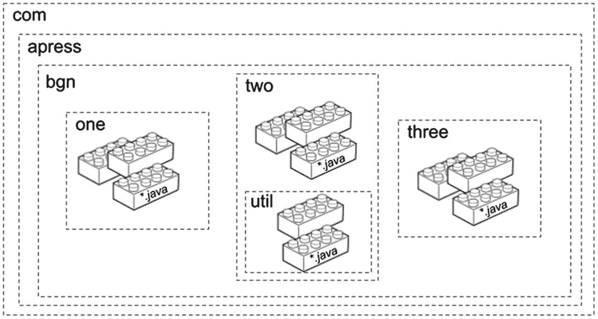

图 3-1

Java 包，源代码表示为嵌套的盒子和乐高积木

在您的计算机上，包是目录的层次结构。每个目录包含其他目录和/或 Java 文件。这完全取决于你的组织能力。这种组织很重要，因为任何 Java 对象类型都可以使用包名和它自己的名称来唯一地标识。

如果我们要在一个名为`HelloWorld.java`的文件中编写一个名为`HelloWorld`的类，并将这个文件放在包`com.apress.bgn.one`中，在 Java 项目中`com.apress.bgn.one.HelloWorld`头韵是作为这个类的唯一标识符的完整类名。您可以将包名视为该类的地址。

从 Java 5 开始，在每个包中可以创建一个名为`package-info.java`的文件，其中包含包声明、包注释、包注释和 Javadoc 注释。注释被导出到该项目的开发文档中，也称为 **Javadoc** 。**章节** [**9**](09.html) 讲述了如何使用 Maven 生成项目 Javadoc。`package-info.java`必须位于包中的最后一个目录下。所以如果我们定义一个`com.apress.bgn.one`包，Java 项目的整体结构和内容看起来如图 [3-2](#Fig2) 所示。 <sup>[4](#Fn4)</sup>


图 3-2

Java 包内容

`package-info.java`的内容可能类似于清单 [3-10](#PC10) 的内容。

```java
/**
 * Contains classes used for reading information from various sources.
 * @author iuliana.cosmina
 * @version 1.0-SNAPSHOT
 */
package com.apress.bgn.one;

Listing 3-10package-info.java Contents

```

将包含类型定义的扩展名为`.java`的文件编译成扩展名为`.class`的文件，这些文件按照相同的包结构组织，并打包成一个或多个**JAR**s(**J**ava**Ar**chives)。 <sup>[5](#Fn5)</sup> 对于上一个例子，如果我们在编译和链接之后解包 JAR 结果，你会看到如图 [3-3](#Fig3) 所示的内容。

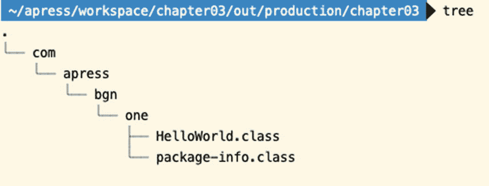

图 3-3

样品罐的内容物

`package-info.java`文件也被编译，即使它只包含关于包的信息，没有行为或类型。

 `package-info.java`文件不是强制性的；没有它们也可以定义包。它们主要用于文档目的。

一个包的内容可以跨越多个 jar，这意味着如果您的项目中有多个子项目，那么您可以在多个包含不同类的包中使用相同的包名。图 [3-4](#Fig4) 描述了这种情况的符号表示。

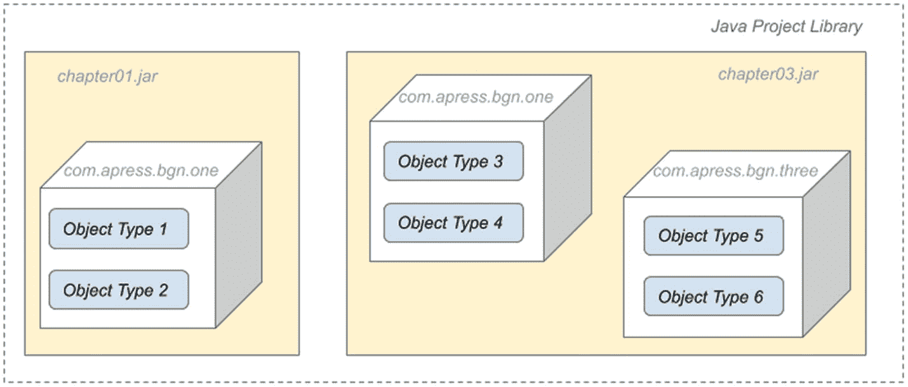

图 3-4

跨越多个 jar 的包内容示例

库是一个 jar<sup>[6](#Fn6)</sup>的集合，包含用于实现特定功能的类。例如，JUnit 是一个非常著名的 Java 框架，它提供了多个类来帮助编写 Java 单元测试。

一个中等复杂的 Java 应用引用一个或多个库。要运行应用，它的所有依赖项(所有 jar)都必须在类路径中。这是什么意思？这意味着为了运行 Java 应用，需要 JDK、依赖项(外部 jar)和应用 jar。图 [3-5](#Fig5) 非常清楚地描述了这一点。

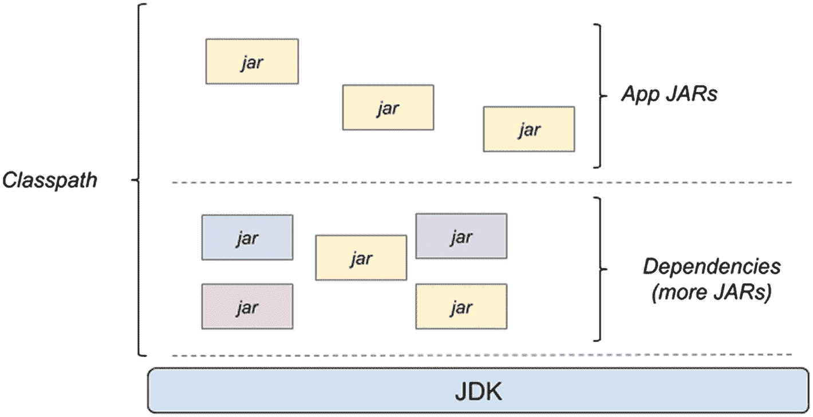

图 3-5

应用类路径

这里，我们假设应用运行在编写它的同一个环境中，因此使用 JDK 来运行应用。在 JDK 11 之前，任何 Java 应用都可以使用 JRE 运行。但是从版本 11 开始，Java 变得完全模块化。这意味着定制的“JRE”发行版只能从运行应用所需的模块中创建。间接地，这意味着最终的 JRE 将包含最少数量的 JDK 编译类。

组成应用类路径的 jar(显然)并不总是相互独立的。21 年来，这种组织方式已经足够了，但是在复杂的应用中，由于以下原因导致了许多复杂情况:

*   分散在多个罐子里的包裹。(还记得图 [3-4](#Fig4) ？)这可能会导致代码重复和循环依赖。

*   jar 之间的可传递依赖关系有时会导致同一类的不同版本出现在类路径中。这可能会导致不可预测的应用行为。

*   缺少传递依赖和可访问性问题。这可能会导致应用崩溃。

所有这些问题都被归为一类:**罐子地狱。** <sup>[7](#Fn7)</sup> 这个问题在 Java 9 中通过引入另一个层次来组织包得到了解决:**模块**。或者至少这是他们的意图。然而，业界一直不愿意采用 Java 模块。在写这一章的时候，大多数 Java 生产应用不仅停留在 Java 8 上，而且开发人员也像躲避瘟疫一样躲避模块。

然而，在介绍模块之前，应该提到**访问修饰符**。Java 类型和它们的成员在包中被声明为具有一定的访问权限，在开始编码之前，理解这一点非常重要。

### 访问修饰符

当在 Java 中声明一个类型时——现在让我们坚持使用`class`——因为这是到目前为止唯一提到的类型，您可以使用访问修饰符来配置它的作用域。

访问修饰符可以用来指定对类的访问，在这种情况下，我们说它们在`top-level`使用。

它们也可以用来指定对类成员的访问，在这种情况下，它们用在`member-level.` <sup>[8](#Fn8)</sup>

在`top-level`只能使用两个访问修饰符:`public`和 none。

声明为`public`的`top-level`类必须在同名的 Java 文件中定义。清单 [3-11](#PC11) 描述了一个名为`Base`的类，它定义在位于包`com.apress.bgn.zero`中的名为`Base.java`的文件中。

```java
package com.apress.bgn.zero;

// top-level access modifier
public class Base {
    // code omitted
}

Listing 3-11Base Class

```

这个类的内容暂时不描述，用`...`代替，以免你失去焦点。公共类对应用中任何地方的所有类都是可见的。不同包中的不同类可以创建这种类型的对象，如清单 [3-12](#PC12) 所示:

```java
package com.apress.bgn.three;

import com.apress.bgn.zero.Base;

public class Main {
    public static void main(String... args) {
        // creating an object of type Base
        Base base = new Base();
    }
}

Listing 3-12Creating an Object Using the Base Class

```

线`Base base = new Base();`是创建对象的地方。`new`关键字代表一个类的名为`instantiation`的操作，这意味着一个对象是基于代表`Base`类的代码所描述的规范而创建的。

一个类就是一个模板。使用该模板创建对象，称为`instances`。

现在，让这种肯定深入人心:公共类对任何地方的所有类都是可见的。

当没有提到显式的访问修饰符时，就说这个类被声明为**默认的**或者是**包私有的**。我知道有两种方式来谈论缺少访问修饰符似乎令人困惑，但是由于您可能会阅读其他涉及这种情况的书籍或博客帖子，因此最好在这里列出所有的可能性。

这意味着如果一个类没有访问修饰符，那么这个类只能被同一个包中定义的类用来创建对象。它的范围仅限于定义它的包。没有访问修饰符的类可以在任何 Java 文件中定义:同名的文件，或者紧挨着给文件命名的类。

当在同一个文件中声明了多个类时，公共类必须与定义它的文件同名，因此这就是命名文件的类。

为了测试这一点，让我们在前面介绍的`Base.java`文件中添加一个名为`HiddenBase`的类，如清单 [3-13](#PC13) 所示。

```java
package com.apress.bgn.zero;

public class Base {
    // code omitted
}

class HiddenBase {
    // you cannot see me
}

Listing 3-13Class with No Access Modifier

```

注意，`Base`类是在`com.apress.bgn.zero`包中声明的。如果我们试图在包`com.apress.bgn.three`中声明的类中创建一个`HiddenBase`类型的对象，IDE 将通过读取文本并拒绝提供任何代码完成来警告我们。更有甚者，会打开一个列出当前文件问题的标签，并带有一个非常明显的错误信息，如图 [3-6](#Fig6) 所示。

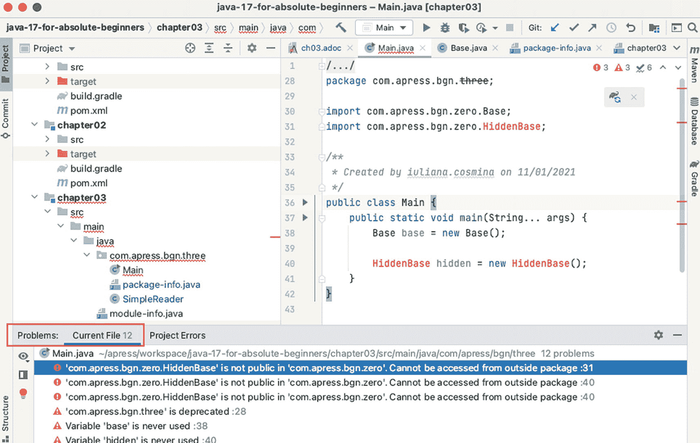

图 3-6

没有访问器修饰符错误的 Java 类

现在，接受这个肯定，并让它深入人心:一个没有访问修饰符的类对同一个包中的所有类(和其他类型)都是可见的。

在一个类中，定义了类成员:**字段**和**方法**。 <sup>[9](#Fn9)</sup> 在`member-level`处，除了前面提到的两个修改器之外，还可以应用另外两个修改器:`private`和`protected`。在`member-level`处，访问修饰符具有以下效果:

*   `public`与顶级相同；可以从任何地方访问该成员。

*   `private`表示该成员只能在声明了的类中访问。

*   `protected`表示该成员只能在声明包含它的类的包中访问，或者由另一个包中该类的任何子类访问。

*   `none`表示该成员只能从其自己的包中访问。

这看起来很复杂，但是一旦你开始写代码，你就会习惯了。在 Oracle 官方文档页面上，甚至还有一个成员可见性的表格，如表 [3-1](#Tab1) 所示。 <sup>[10](#Fn10)</sup>

表 3-1

成员级访问器范围

<colgroup><col class="tcol1 align-left"> <col class="tcol2 align-left"> <col class="tcol3 align-left"> <col class="tcol4 align-left"> <col class="tcol5 align-left"></colgroup> 
| 

修饰语

 | 

班级

 | 

包裹

 | 

亚纲

 | 

世界

 |
| --- | --- | --- | --- | --- |
| 公众的 | 是 | 是 | 是 | 是 |
| 保护 | 是 | 是 | 是 | 不 |
| 无(*默认/包专用*) | 是 | 是 | 不 | 不 |
| 私人的 | 是 | 不 | 不 | 不 |

为了全面了解该表如何应用到代码中，清单 [3-14](#PC14) 中的类非常有用。

```java
package com.apress.bgn.three.same;

public class PropProvider {
    public int publicProp;
    protected int protectedProp;
    /* default */ int defaultProp;
    private int privateProp;

    public PropProvider(){
        privateProp = 0;
    }
}

Listing 3-14PropProvider

a Java class with Members Decorated with Various Accessors

```

类`PropProvider`声明了四个字段/属性，每个都有不同的访问修饰符。字段`privateProp`只能在该类的主体中修改。这意味着该类的所有其他成员都可以读取并更改该属性的值。

在本书的这一点上，只有方法被认为是其他类型的成员。

但是类可以在另一个类的主体中声明。这样的类被称为**嵌套类**，可以访问包装在它周围的类的所有成员，包括私有成员。图 [3-7](#Fig7) 描述了修改后的`PropProvider`类，增加了一个额外的方法，名为`printPrivate`。该方法读取私有字段的值并打印出来。还声明了一个名为`LocalPropRequester`的嵌套类，私有字段在这个类中被修改(第 56 行)。

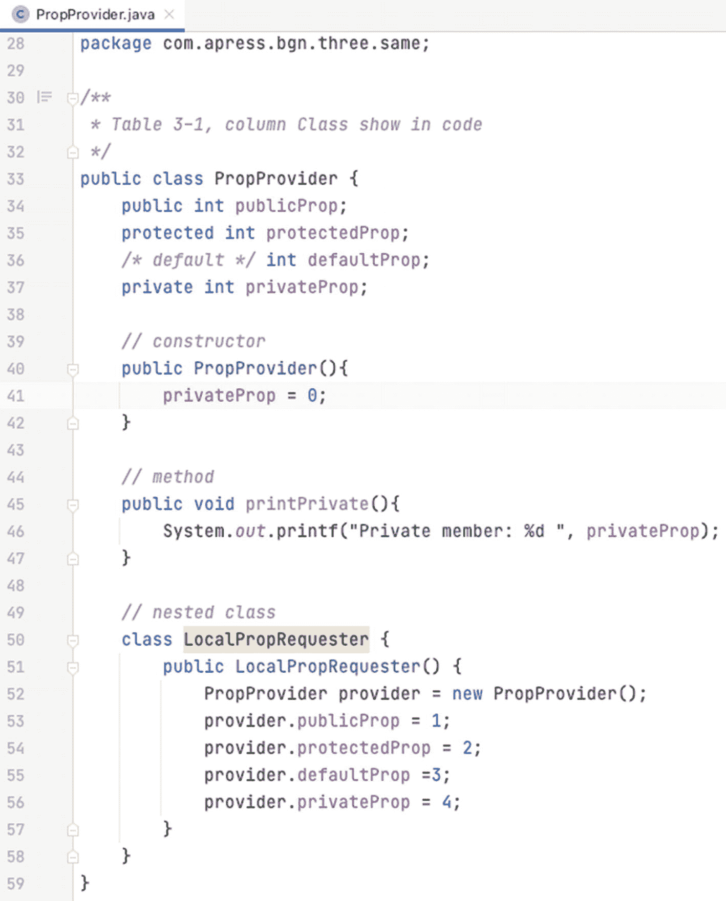

图 3-7

表 [3-1](#Tab1) ，Java 代码中的列类访问器

图 [3-7](#Fig7) 是在 IntelliJ IDEA 中查看 Java 代码的截图。如果任何字段不可访问，则显示为红色。

表 [3-1](#Tab1) 中的第二列，即`Package`列，包含了与类`PropProvider`在同一个包中声明的类可访问的字段。图 [3-8](#Fig8) 描述了一个名为`PropRequester`的类试图修改类`PropProvider`中的所有字段。请注意，私有字段显示为鲜红色。这意味着该字段是不可访问的，IntelliJ IDEA 对此非常清楚。

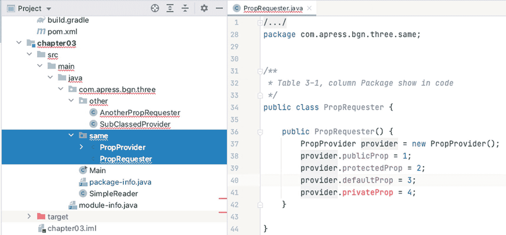

图 3-8

表 [3-1](#Tab1) ，Java 代码中的列包访问器

表 [3-1](#Tab1) 中的第三列，即`Subclass`列，包含了类别`PropProvider`的子类可访问的字段。一个`subclass`从一个被称为它的`superclass`的类中继承状态和行为。子类是使用`extends`关键字和超类名创建的。图 [3-9](#Fig9) 描绘了一个名为`SubClassedProvider` class 的类试图修改从`PropProvider`继承的所有字段。请注意，私有字段和没有访问器的字段以鲜红色显示。这意味着这些字段是不可访问的，IntelliJ IDEA 对此表现得非常明显。


图 3-9

表 [3-1](#Tab1) ，Java 代码中的列子类访问器

在前面的例子中，没有访问器的字段是不可访问的，因为子类是在不同的包中声明的。如果子类在同一个包中移动，那么表 [3-1](#Tab1) 中`Package`列的规则适用。

表 [3-1](#Tab1) 中的第三列`World`适用于声明类`PropProvider`的包之外的所有类，它们不是该类的子类。图 [3-10](#Fig10) 描绘了一个名为`AnotherPropRequester`的类，它试图访问`PropProvider`中声明的所有字段。正如预期的那样，只有公共字段是可访问的，其余的都以红色显示。

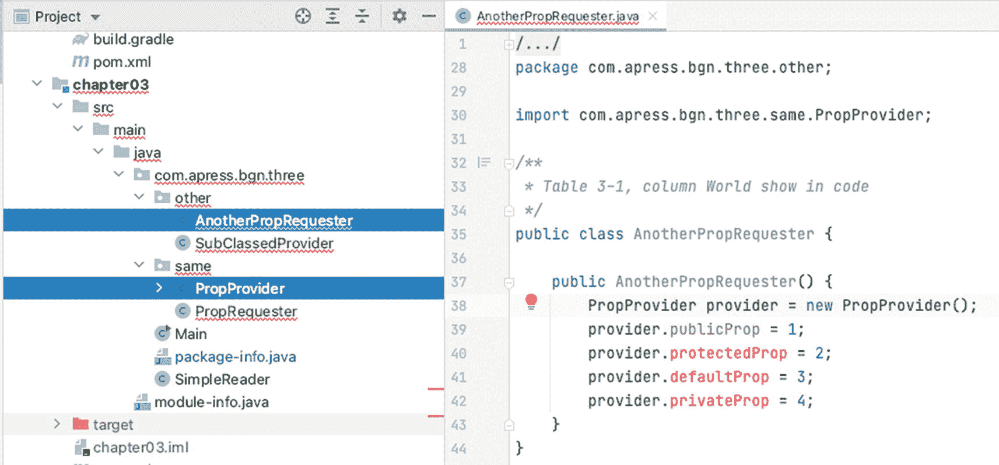

图 3-10

表 [3-1](#Tab1) ，Java 代码中的列世界访问器

如果你试图在像 IntelliJ IDEA 这样的智能编辑器之外构建一个项目，这是行不通的。这些错误消息会让您知道有一个编译错误，原因是什么，以及在哪里。例如，使用 Maven 构建工具构建包含`AnotherPropRequester`类的`chapter03`子项目会失败。终端中显示以下错误消息:

```java
[ERROR] Failed to execute goal org.apache.maven.plugins:maven-compiler-plugin:3.8.1:compile (default-compile) on project chapter03: Compilation failure: Compilation failure:
[ERROR] /Users/iulianacosmina/apress/workspace/java-17-for-absolute-beginners/chapter03/src/main/java/com/apress/bgn/three/other/AnotherPropRequester.java:[42,17] protectedProp has protected access in com.apress.bgn.three.same.PropProvider
[ERROR] /Users/iulianacosmina/apress/workspace/java-17-for-absolute-beginners/chapter03/src/main/java/com/apress/bgn/three/other/AnotherPropRequester.java:[44,17] defaultProp is not public in com.apress.bgn.three.same.PropProvider; cannot be accessed from outside package
[ERROR] /Users/iulianacosmina/apress/workspace/java-17-for-absolute-beginners/chapter03/src/main/java/com/apress/bgn/three/other/AnotherPropRequester.java:[46,17] privateProp has private access in com.apress.bgn.three.same.PropProvider

```

构建工具和编辑器非常善于让您知道 Java 代码中什么地方出错了。学会用好它们，信任它们，它们会提高你的生产力。当然，有打嗝，但没有那么多。

开始编写 Java 代码后，您可能会回到表 [3-1](#Tab1) 一两次。即使引入了模块(如果您正确地配置了模块访问)，刚才提到的一切仍然有效。

### 模块

从 Java 9 开始，引入了一个新概念:`modules.` <sup>[11](#Fn11)</sup> Java 模块代表了一种更强大的机制来组织和聚合包。这一新概念的实施花了 10 多年时间。关于模块的讨论始于 2005 年，希望它们能在 Java 7 中实现。2008 年，一个名为“拼图计划”的探索阶段终于开始了。Java 开发者希望 Java 8 能提供模块化的 JDK，但这并没有发生。

经过三年的工作(差不多七年的分析)，Java 9 终于推出了模块。支持他们把 Java 9 的正式发布日期推迟到了 2017 年 9 月。 <sup>[12](#Fn12)</sup>

Java 模块是对包进行分组和对包内容进行更细粒度访问的一种方式。Java 模块是一组唯一命名的、可重用的包和资源(例如，XML 文件和其他类型的非 Java 文件)，由位于源目录根目录下的名为`module-info.java`的文件描述。该文件包含以下信息:

*   模块的名称

*   模块的依赖项(即该模块依赖的其他模块)

*   它显式地使其他模块可以使用的包(模块中的所有其他包隐式地对其他模块不可用)

*   它提供的服务

*   服务 it 消费者

*   它允许反射到哪些其他模块

*   本机代码

*   资源

*   配置数据

理论上，模块命名类似于包命名，并遵循反向域名约定。在实践中，只需确保模块名不包含任何数字，并且清楚地揭示了它的用途。`module-info.java`文件被编译成一个模块描述符，它是一个名为`module-info.class`的文件，与类一起打包成一个普通的旧 JAR 文件。该文件位于 Java 源目录的根目录下，在任何包之外。对于前面介绍的`chapter03`项目，`module-info.java`文件位于`src/main/java`目录下，与`com`目录处于同一层级；`com.apress.bgn.three`的根包图 [3-11](#Fig11) 。

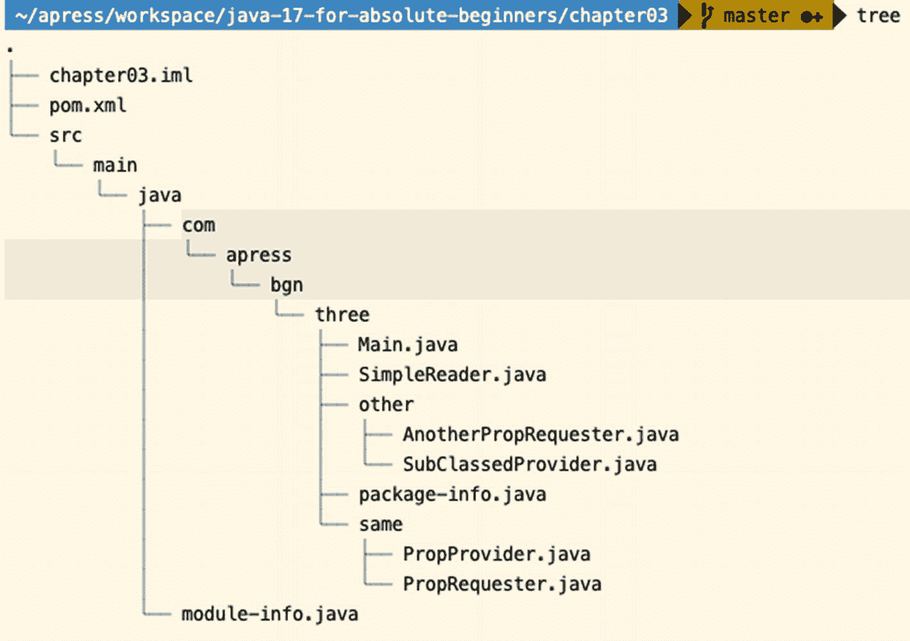

图 3-11

module-info.java 文件的位置

任何带*的文件。java 扩展，`module-info.java`被编译成*。类文件。由于模块声明不是 Java 类型声明的一部分，`module`不是 Java 关键字，所以在为 Java 类型编写代码时仍然可以使用；例如，作为变量名。对于`package`来说，情况有所不同，因为每个 Java 类型声明都必须以包声明开始。看看清单 [3-15](#PC16) 中声明的`SimpleReader`类就知道了。

```java
package com.apress.bgn.three;

public class SimpleReader {
    private String source;

    // code omitted
}

Listing 3-15SimpleReader Class

```

可以看到包声明，但是模块在哪里？嗯，模块是一个抽象的概念，用`module-info.java`来描述。所以从 Java 9 开始，如果你在你的应用中配置 Java 模块，图 [3-4](#Fig4) 演变成图 [3-12](#Fig12) 。


图 3-12

可视化表示的 Java 模块

Java 模块是一种逻辑分组属于一起的 Java 包的方法。

模块的引入也允许将 JDK 划分成模块。`java --list-modules`命令列出了本地 JDK 安装中的所有模块。清单 [3-16](#PC17) 描述了在我的个人电脑上执行的这个命令的输出，我的电脑目前安装了 JDK 17-ea。

```java
$ java --list-modules
java.base@17-ea
java.compiler@17-ea
java.datatransfer@17-ea
java.desktop@17-ea

# output omitted

Listing 3-16JDK 17-ea Modules

```

在前面的清单中，每个模块名称后面都有一个版本字符串@17-ea，这意味着该模块属于 Java 版本 17-ea。

因此，如果一个 Java 应用不需要所有的模块，那么可以只使用它需要的模块来创建运行时，这就减小了运行时的大小。构建一个为应用定制的小型运行时的工具叫做`jlink`，是 JDK 可执行程序的一部分。这允许更高级别的可伸缩性和更高的性能。如何使用`jlink`不是本书的研究对象。这本书的重点是学习 Java 编程语言，因此 Java 平台的技术细节将保持在最低限度——仅够自信地开始编写和执行代码。

引入模块有很多好处，更有经验的开发人员已经等了很多年来利用这些好处。但是为更大更复杂的项目配置模块不是在公园散步，大多数软件公司要么坚持 JDK 8 要么完全避免配置模块。

`module-info.java`的内容可以简单到模块名和两个包含主体的括号，如清单 [3-17](#PC18) 所示。

```java
module chapter.three {
}

Listing 3-17A Simple module-info.java Configuration

```

#### 高级模块配置

Java 模块声明体包含一个或多个使用表 [3-2](#Tab2) 中的关键字构建的`directives`。这些指令表示模块中包含的包和类的访问配置和依赖性要求。

这本书包含一个附录，提供了所有指令的例子。为了学习 Java 语言，你真正需要的只有`requires`和`exports`。在这本书的这一版中，我将在上下文允许完全理解它们的情况下深入解释每一个指令，并且我将添加与真实世界事件和场景的类比，以确保思想得到理解。在本章中，首先只解释两个主要指令。

**模块可以相互依赖**。本书的项目由 13 个模块组成，其中大部分依赖于模块`chapter.zero`。该模块包含用于在其他模块中构建更复杂组件的基本组件。例如，模块`chapter.three`中的类需要访问模块`chapter.zero`中的包和类。声明模块依赖关系是通过使用`requires`指令来完成的，如清单 [3-18](#PC19) 所示。

```java
module chapter.three {
    requires chapter.zero;
}

Listing 3-18A Simple module-info.java Configuration

```

前面的依赖关系是一个**显式的**依赖关系。但是也有**隐含**的依赖性。例如，开发者声明的任何模块都隐式需要 JDK `java.base`模块。这个模块包含了 Java SE 平台的基础 API，没有它就不能编写 Java 应用。这个隐式指令确保了对 Java 类型的最小集合的访问，因此可以编写基本的 Java 代码。清单 [3-18](#PC19) 等同于清单 [3-19](#PC20) 。

```java
module chapter.three {
    requires java.base;

    requires chapter.zero;
}

Listing 3-19A Simple module-info.java Configuration with an Explicit Directive of requires java.base

```

根据需要声明一个模块，意味着当代码被编译时需要这个模块——通常称为*编译时*，当代码被执行时——通常称为*运行时*。如果一个模块只在运行时需要，**需要静态的**关键字用于声明依赖关系。现在只要记住这一点，当我们谈论 web 应用时，它就有意义了。

现在`chapter.three`依赖于模块`chapter.zero`。但这是否意味着`chapter.three`可以访问模块`chapter.zero`中所有包中的所有`public`类型(及其嵌套的`public`和`protected`类型)？如果你认为这还不够，那你就对了。仅仅因为一个模块依赖于另一个模块，并不意味着它可以访问它实际需要的包和类。所需模块必须配置为暴露其*内部*。如何做到这一点？在我们的例子中，我们需要确保模块`chapter.zero`能够访问所需的包。这是通过添加`exports`指令，后跟必要的包名，为这个模块定制`module-info.java`来完成的。清单 [3-20](#PC21) 描述了`chapter.zero`模块的`module-info.java`文件，该文件公开了它的单个包。

```java
module chapter.zero {
    exports com.apress.bgn.zero;
}

Listing 3-20The module-info.java Configuration File for the chapter.zero Module

```

请这样想:你在房间里裁剪圣诞装饰品，你需要一个装饰品模板。你的室友有所有的模板。但是你需要它并不代表它会神奇的出现。你需要去和你的室友谈谈。需要你室友的帮助可以被视为*要求室友*指令。和你室友聊完之后，他大概会说:*当然可以，进来吧，它们在桌子上！你需要多少就拿多少。*这可以被认为是*出口所有桌面模板*指令。桌子可能是包裹的一个很好的比喻。

使用清单 [3-20](#PC21) 中的配置，我们刚刚授予了对`com.apress.bgn.zero`包的访问权，对任何配置了`requires module.zero;`指令的模块的访问权。如果我们不想这样呢？(考虑到前面的提示，您的室友只是让他房间的门开着，所以任何人都可以进入并获得那些模板！)

如果我们想将对模块内容的访问仅限于`chapter.three`模块呢？(所以你室友要把他的模板只给你。)这可以通过在模块名后添加`to`关键字来实现，以表明只有这个模块被允许访问组件。这是**表** [**3-2**](#Tab2) 中提到的`exports`指令的合格版本。

表 3-2

Java 模块指令

<colgroup><col class="tcol1 align-left"> <col class="tcol2 align-left"></colgroup> 
| 

管理的

 | 

目的

 |
| --- | --- |
| 需要 | 指定该模块依赖于另一个模块。 |
| 电子竞技 | 模块的一个包，它的`public`类型(以及它们的`nested public`和`protected`类型)应该可以被所有其他模块中的代码访问。 |
| 出口…到 | 这是`exports`指令的合格版本。它允许在逗号分隔的列表中精确地指定哪个模块或模块代码可以访问导出的包。 |
| 打开 | 用于模块级声明(`open module mm {}`)，并允许反射访问所有模块包。Java 反射是在运行时分析和修改一个类的所有功能的过程，也适用于私有类型和成员。所以在 Java 9 之前，没有什么是真正封装的。 |
| 打开 | 在模块声明体中使用，通过反射有选择地配置对特定包的访问。 |
| 打开…到 | 这是`opens`指令的合格版本。它允许在逗号分隔的列表中精确地指定哪个模块或模块代码可以反射性地访问它的包。 |
| 使用 | 指定该模块使用的服务—使该模块成为**服务消费者**。在这种情况下，服务代表另一个模块为其提供实现的接口/抽象类的全名。 |
| 为…提供 | 指定模块提供具有特定实现的服务——使模块成为**服务提供者**。 |
| 过渡的 | 与`requires`一起使用，指定对另一个模块的依赖，并确保读取你的模块的其他模块也读取该依赖——被称为*隐含可读性*。 |

如果你很好奇并阅读了推荐的 **Jar Hell** 文章，你会注意到使用 Jar 中打包的 Java 源代码的一个问题是安全性。这是因为即使不访问 Java 源代码，通过添加一个 jar 作为应用的依赖项，也可以检查、扩展和实例化对象。因此，除了提供可靠的配置、更好的可伸缩性、平台的完整性和改进的性能，引入模块的目标实际上是**更好的安全性**。

清单 [3-21](#PC22) 描述了`chapter.zero`模块的`module-info.java`文件，它只向`chapter.three`模块公开它的单个包。

```java
module chapter.zero {
    exports com.apress.bgn.zero to chapter.three;
}

Listing 3-21Advanced module-info.java Configuration File for the chapter.zero Module

```

通过用逗号分隔列出所需的模块，可以指定多个模块具有访问权限，如清单 [3-22](#PC23) 所示。

```java
module chapter.zero {
    exports com.apress.bgn.zero to chapter.two, chapter.three;
}

Listing 3-22Advanced module-info.java Configuration File for the chapter.zero Module with Multiple Modules

```

模块的顺序并不重要，如果有很多模块，你可以把它们放在多行上。只要确保用一个。(分号)。

这就是在本书的这个阶段所能介绍的关于模块的全部内容，但是不用担心:所有其他的指令将会在适当的时候介绍。

### 如何确定 Java 项目的结构

有几种方法可以构建 Java 项目，这取决于以下几点:

*   项目范围

*   使用的构建工具

您可能想知道为什么项目范围会影响它的结构，并且您可能期望这应该有一个标准，对吗？标准不止一个，这取决于项目范围。创建 Java 项目的原因会影响它的大小。如果一个项目很小，它可能不需要您将源代码分成子项目，也可能不需要构建工具，因为构建工具自带了组织项目的标准方式。让我们从有史以来最小的 Java 项目开始，它应该只打印“Hello World！”到控制台。

#### “HelloWorld！”IntelliJ 理念中的项目

顺便说一下，你甚至不需要一个项目，因为你有`jshell`。只需打开一个终端(Windows 的命令提示符)，打开`jshell,`并输入`System.out.print("Hello World!")`语句，如清单 [3-23](#PC24) 所示。

```java
jshell>
|  Welcome to JShell -- Version 17-ea
|  For an introduction type: /help intro

jshell> System.out.print("Hello World!")
Hello World!

Listing 3-23jshell Hello World!

```

既然您已经安装了 IntelliJ IDEA，那么让我们创建一个 Java 项目，并检查编辑器为我们选择了什么样的项目结构。从第一个 IntelliJ IDEA 对话窗口开始，点击`Create New Project option`。第二个对话窗口将出现在顶部，左侧列出了您可以创建的项目类型。这里提到的两个对话框如图 [3-13](#Fig13) 所示。

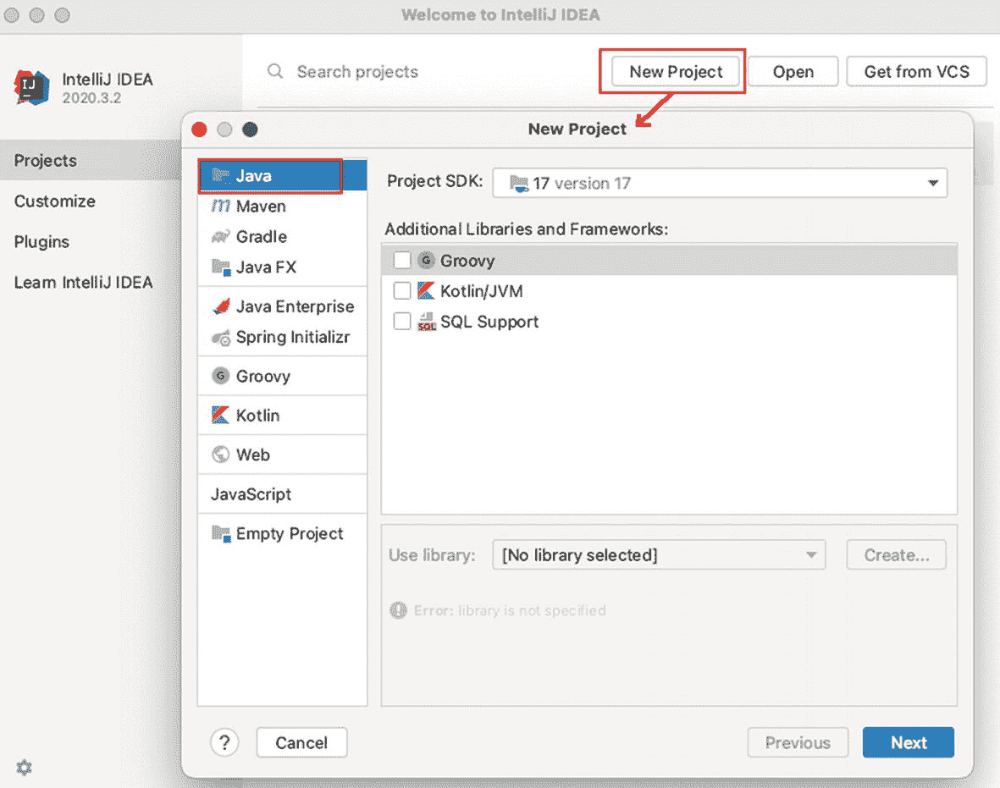

图 3-13

创建 IntelliJ IDEA 项目配置启动对话框窗口

从左边选择 Java 项目类型，点击`Next`，不选择右边列出的任何附加库和框架。

下一个对话窗口允许您为项目选择一个模板。我们将通过点击`Next`跳过它。

下一个对话窗口允许您选择项目名称和位置。由于我们使用的是 Java 17，您可以注意到底部有一个用于配置 Java 模块的部分。该配置窗口如图 [3-14](#Fig14) 所示。

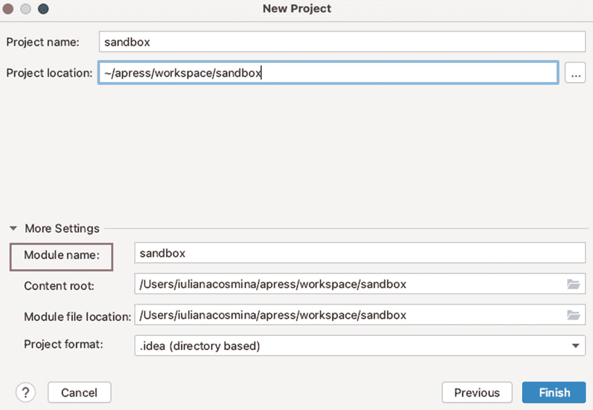

图 3-14

IntelliJ IDEA 项目名称和位置配置对话框窗口

使用`sandbox`作为项目名和模块名，并点击`Finish`。下一个窗口是编辑器窗口。这是你写代码的地方。如果您展开左边的`sandbox`节点(该部分被称为*项目视图*，您可以看到该项目是使用您已经安装的 JDK(在本例中是 17)构建的。已经为您创建了一个`src`目录。你的项目应该看起来很像图 [3-15](#Fig15) 中描述的那个。


图 3-15

IntelliJ IDEA 项目视图

在编写代码之前，让我们看看还有哪些项目设置可用。IntelliJ IDEA 允许您通过`File > Project Structure`菜单项查看和编辑项目属性。如果点击它，将会打开一个类似于图 [3-16](#Fig16) 所示的对话框。

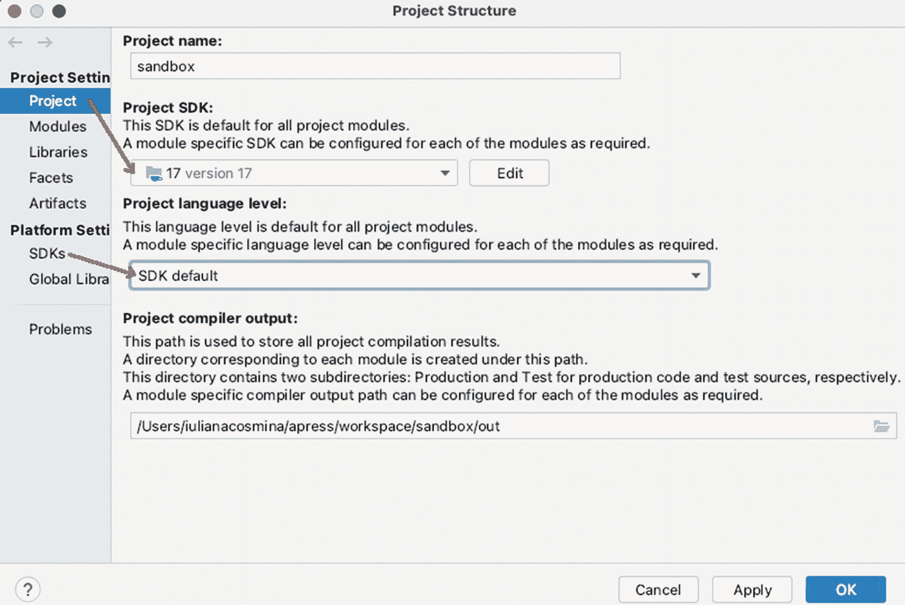

图 3-16

IntelliJ IDEA 项目设置选项卡

默认情况下，`Project`设置选项卡打开。在上图中，有两个箭头将您的注意力吸引到了`Project SDK:`部分和`Project language level:`部分，前者实际上描述了一个 Java 项目的 JDK 版本。在写这一章的时候，JDK 17 EA 是最新的版本。IntelliJ IDEA 的最新版本支持 Java 17 的语法和代码完成，这也是这里描述的原因。这就是项目语言级别设置的意义。

如果切换到名为`Modules`的选项卡，您将看到图 [3-17](#Fig17) 中描述的信息。

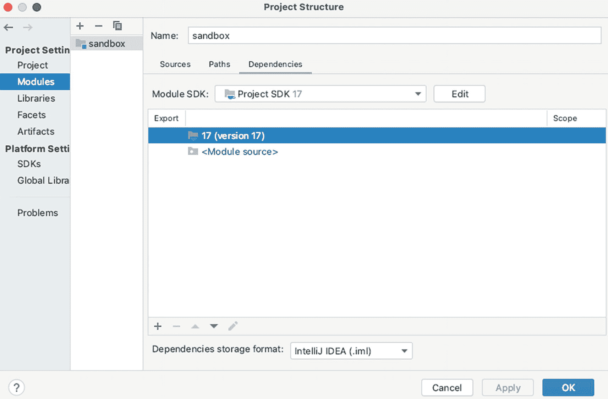

图 3-17

IntelliJ IDEA 项目模块选项卡

之前的图像需要澄清。除了将包包装在一起的 Java 模块之外，模块也是将 Java 源代码和资源文件包装在一起的一种方式，在项目中具有共同的目的。在 Oracle 引入模块概念作为模块化 Java 应用的方法之前，组成这些应用的代码已经被需要以某种实用方式构建大型项目的开发人员模块化了。

在`Modules`选项卡中，您可以看到一个项目有多少部分(模块)以及每个部分的设置。项目有一个部分，一个名为`sandbox,`的模块，这个模块的源代码包含在`src`目录中。如果我们想写一个打印“Hello World！”名为 HelloWorld.java 的文件必须放在它下面。如果右键单击`src`目录，出现图 [3-18](#Fig18) 所示的菜单。

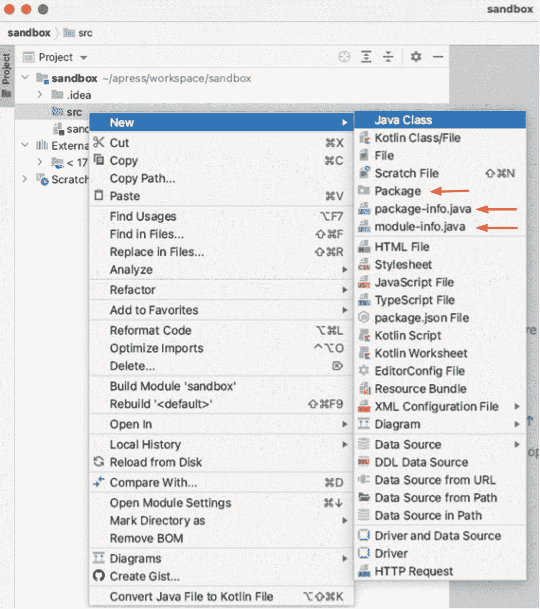

图 3-18

IntelliJ IDEA 菜单列出了可以在 src 目录中创建的 Java 对象

除了`Java Class`选项之外，还有几个红色箭头向您展示了在`src`目录中还有哪些其他组件。让我们继续创建我们的类。点击`Java Class`菜单选项，引入类名后，从测试字段下方的列表中选择`Class`。在图 [3-19](#Fig19) 中，你可以看到你可以创建的所有 Java 类型。

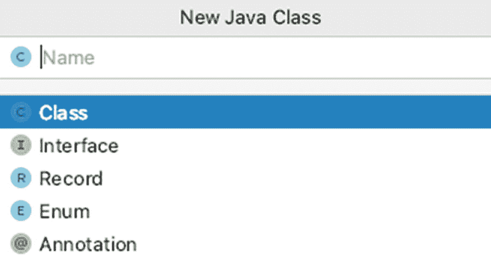

图 3-19

创建 Java 类型的 IntelliJ IDEA 对话框窗口

在本章的开始，提到了 Java 应用的核心构件是`class`，但是除此之外，Java 中还有其他类型。上图中的列表显示了列出的五种 Java 类型。每一个都将在后面详细解释；现在，请注意在`src`目录下创建了一个名为`HelloWorld.java`的文件，该文件的内容如清单 [3-24](#PC25) 所示。

```java
public class HelloWorld {

}

Listing 3-24The HelloWorld Class

```

您已经在第一个非常简单的 Java 项目中创建了第一个 Java 类。它还没有做任何事情。通过从 IntelliJ IDEA Build 菜单中选择`Build Project`选项，或者按下每个操作系统不同的组合键来编译该类。编译该类会产生包含字节码的`HelloWorld.class`文件。默认情况下，IntelliJ IDEA 将编译结果存储在一个名为`out/production`的目录中。编译项目的菜单选项和结果如图 [3-20](#Fig20) 所示。菜单选项以绿色突出显示。

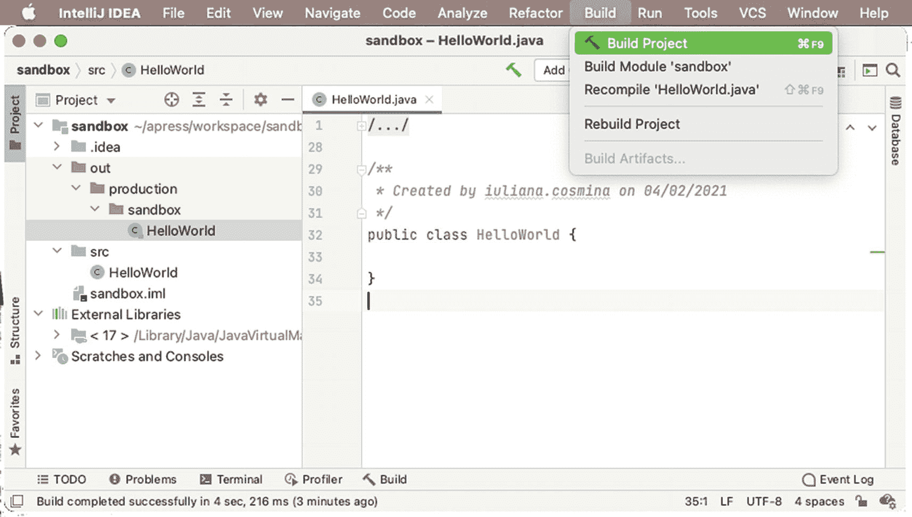

图 3-20

IntelliJ IDEA:如何编译 Java 项目

是时候让我们的班级出版 *Hello World 了！*为此，我们需要给这个类添加一个特殊的方法。任何 Java 桌面应用都有一个名为`main`的特殊方法，必须在顶级类中声明。JRE 调用这个方法来运行 Java 程序/应用，我称它为**入口点**。如果没有这样的方法，Java 项目只是一个不可运行、不能执行、不能执行某个功能的类的集合。

想象一下:这就像有一辆汽车，但你无法启动它，因为点火锁芯不见了。从所有的意图和目的来看，它是一辆汽车，但它不能执行汽车的主要目的，即实际上带你去某个地方。您可以将`main`方法想象成点火锁圆柱体，JRE 将在其中插入钥匙以使您的应用运行。让我们将该方法添加到`HelloWorld`类中。

因为 IntelliJ IDEA 是一个很棒的编辑器，你可以通过输入`psvm`并按下<tab>键来生成`main`方法。这四个字母代表方法声明的所有组件的起始字母:</tab>T5【p】ublic、**s**static、 **v** oid、 **m** ain。

带有打印文本 *Hello World 的`main`方法的`HelloWorld`类！*如清单 [3-25](#PC26) 所示。

```java
public class HelloWorld {
    public static void main(String... args) {
        System.out.println();
    }
}

Listing 3-25The HelloWorld Class with the main Method

```

现在我们有了一个`main`方法，可以执行(或运行)代码了。为此，在 IntelliJ IDEA 中，您还有两个选项:

*   从`Run`菜单中选择，选项`Run [ClassName]`

*   或者在类体上单击右键，从出现的菜单中选择`Run [ClassName].main()`。 <sup>[13](#Fn13)</sup>

图 [3-21](#Fig21) 描述了你可以用来执行类的两个菜单项，以及执行的结果。

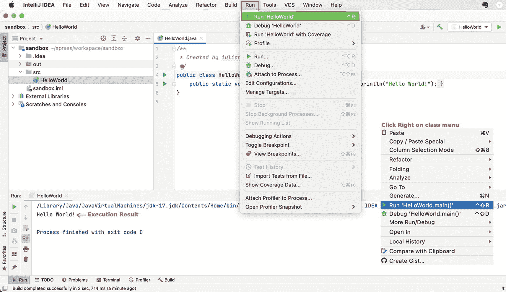

图 3-21

IntelliJ IDEA:如何执行 Java 类

这是 Java 项目最基本的结构。这个项目非常简单，也可以从命令行手动编译。让我们开始吧！

#### “HelloWorld！”从命令行编译和执行的项目

你可能已经注意到了 IntelliJ 想法中的`Terminal`按钮。如果你点击那个按钮，在编辑器里会打开一个终端。对于 Windows，它将是一个命令提示符实例，对于 Linux，`macOs`将是默认的 shell。IntelliJ 将在项目根目录下打开您的终端。接下来你要做的是:

*   通过执行以下命令进入`src`目录:`cd src`

*   `cd`是一个也可以在 Windows 和 Unix 系统下工作的命令，是更改目录的缩写

*   通过执行`javac HelloWorld.java`编译`HelloWorld.java`文件

*   是一个用于编译 Java 文件的 JDK 可执行文件，IntelliJ IDEA 也在后台调用它

*   通过执行:`java HelloWorld`运行从`HelloWorld.class`文件得到的字节码

图 [3-22](#Fig22) 描述了在 IntelliJ IDEA 的终端中这些命令的执行。

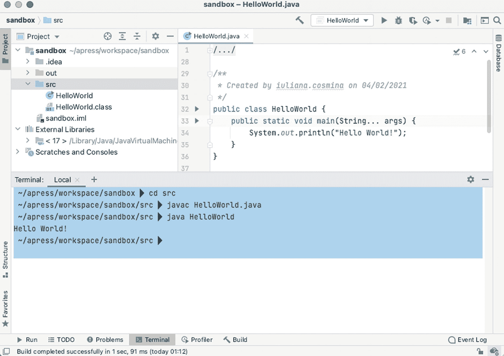

图 3-22

在 IntelliJ IDEA 内部的终端中手动编译和运行 HelloWorld 类

看起来很简单，对吧？实际上就是这么简单，因为没有定义包或 Java 模块。但是等等，这可能吗？是的。如果您没有定义一个包，该类仍然是一个未命名的默认包的一部分，该默认包由 JSE 平台默认提供，用于开发小型临时教育应用，就像您在这里构建的应用一样。

所以让我们把我们的项目变得复杂一点，为我们的类添加一个命名的包。

#### 将“HelloWorld”类放在一个包中

在图 [3-18](#Fig18) 中，所列菜单中包含一个`Package`选项。右键单击`src`目录并选择它。一个小的对话框将会出现，你必须在这里输入包名。输入`com.sandbox`。在图 [3-23](#Fig23) 中描述了对话窗口。如果您尝试创建的包已经存在，则会以红色显示一条错误消息。

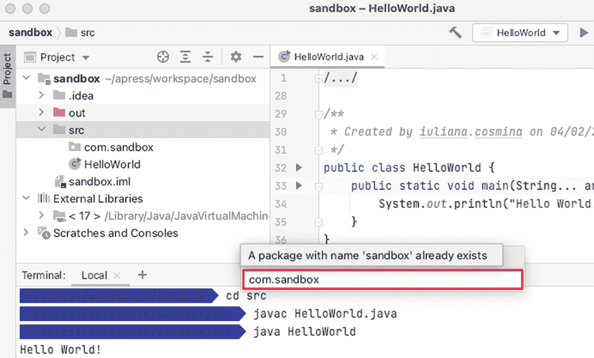

图 3-23

在 IntelliJ IDEA 中创建重复的包

现在我们有一个包，但是类不在其中。要将类放在那里，只需点击并拖动它。将出现另一个对话框，确认这是您真正想要做的，如图 [3-24](#Fig24) 所示。


图 3-24

在 IntelliJ IDEA 中将类移动到包中

点击`Refactor`按钮，查看课程发生了什么变化。这个类现在应该以一个`package com.sandbox;`声明开始。如果您重新构建您的项目，然后查看`production`目录，您将会看到类似于图 [3-25](#Fig25) 中描述的内容。


图 3-25

添加`com.sandbox`包后的新目录结构

显然，如果您手动编译并执行该类，您现在必须考虑这个包，因此您的命令将变为:

```java
~/sandbox/src/> javac com/sandbox/HelloWorld.java
~/sandbox/src/> java com/sandbox/HelloWorld

```

那么当模块也被配置时会发生什么呢？有一个默认的未命名模块，所有 jar(无论是否模块化)和类路径上的类都将包含在其中。这个默认且未命名的模块导出所有包并读取所有其他模块。因为它没有名称，所以命名的应用模块不能请求和读取它。因此，即使您的小项目似乎可以与版本 9 或更高版本的 JDK 一起工作，它也不能被其他模块访问，但是它可以工作，因为它可以访问其他模块。(这确保了向后兼容旧版本的 JDK。)也就是说，让我们在项目中添加一个模块。

#### 配置“com.sandbox”模块

配置一个模块就像在`src`目录下添加一个`module-info.java`文件一样简单。在图 [3-18](#Fig18) 中，菜单包含一个`module-info.java`选项，如果你选择了它，IDE 会为你生成文件。一切都很好，如果您不喜欢为您生成的模块名，您可以更改它。我把它改成了`com.sandbox`，以尊重 Oracle 开发人员建立的模块命名约定。文件最初是空的，如清单 [3-26](#PC28) 所示。

```java
module com.sandbox {
}

Listing 3-26The com.sandbox Module Configuration File

```

现在我们有了一个模块，会发生什么呢？从 IDEs 的角度来看不多。但是如果你想手动编译一个模块，你必须知道一些事情。我使用清单 [3-27](#PC29) 中的命令编译了我们的模块。

```java
~/sandbox/src/> javac -d ../out/com.sandbox \
    module-info.java \
    com/sandbox/HelloWorld.java

Listing 3-27Manually Compiling a Package Enclosed within a Module

```

“”是一个 macOS/Linux 分隔符。在 Windows 上，要么在一行中写下整个命令，要么用“^".”替换“\”

前面的命令是根据清单 [3-28](#PC30) 中的模板构建的。

```java
javac -d [destination location]/[module name] \
    [source location]/module-info.java \
    [java files...]

Listing 3-28Template for Command to Manually Compile a Package Enclosed Within a Module

```

`-d [destination]`决定了执行结果应该保存在哪里。清单 [3-27](#PC29) 中的命令行将输出文件夹指定为`/out/com.sandbox`的原因是为了明确`com.sandbox`是封闭模块。在这个目录下，我们将拥有`com.sandbox`包的正常结构。out 目录的内容如图 [3-26](#Fig26) 所示。

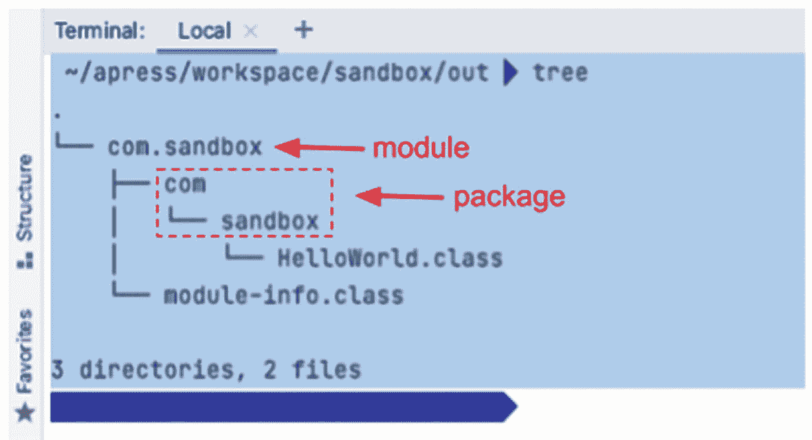

图 3-26

手工编译的 Java 模块`com.sandbox`

正如您在本例中注意到的，在我们编译源代码之前，模块并不真正存在，因为 Java 模块更多的是封装由`module-info.class`描述符描述的包的逻辑模式。创建`com.sandbox`目录的唯一原因是我们在`javac -d`命令中将它指定为参数。

既然我们已经成功编译了一个模块，清单 [3-29](#PC31) 向您展示了当`HelloWorld`类被封装在一个模块中时如何运行它。

```java
~/sandbox/> java --module-path out \
  --module com.sandbox/com.sandbox.HelloWorld
  Hello World!  # result

Listing 3-29Manually Executing a Class Enclosed Within a Module

```

前面的命令是根据清单 [3-30](#PC32) 中的模板构建的。

```java
java --module-path [destination] \
    --module [module name] /[package name].HelloWorld

Listing 3-30Template for Command to Manually Execute a Class Enclosed Within a Module

```

2017 年 9 月的 Oracle Magazine edition 第一次提到了示例，尽管 Oracle 开发人员已经决定模块名称应该遵循与包相同的规则，但对我来说，这似乎有点多余，特别是在复杂的项目中，包名称往往会变得很长。模块名应该一样长吗？

事实是，人们制定了标准，大多数时候，实用性成为了标准。自 2007 年以来，成功采用模块的项目选择了更简单、更实用的模块名称。例如，创建 Spring 框架的团队决定将他们的模块命名为`spring.core`而不是`org.springframework.core`，命名为`spring.beans`而不是`org.springframework.beans,`等等。因此，只要避免使用特殊字符和数字，就可以随心所欲地命名模块。

#### 使用构建工具的 Java 项目，主要是 Maven

Apache Maven 是一个主要用于 Java 项目的构建自动化工具。尽管 Gradle 正在取得进展，Maven 仍然是最常用的构建工具之一。Maven 和 Gradle 等工具用于将应用的源代码组织在相互依赖的项目模块中，并配置一种自动编译、验证、生成源代码、测试和生成工件的方式。工件是一个文件，通常是一个 JAR，它被部署到 Maven 存储库中。Maven 仓库是硬盘上的一个位置，jar 保存在一个特殊的目录结构中。

任何关于构建工具的讨论都必须从 Maven 开始，因为这个构建工具标准化了我们今天在开发中使用的许多术语。分割成多个子项目的项目可以从 GitHub 下载，在命令行中构建，或者导入 IntelliJ IDEA。这种方法将确保您获得可以一次性编译的高质量源代码。这也很实用，因为我想你不希望每次开始阅读新的章节时都在 IntelliJ IDEA 中加载新的项目。此外，它使我更容易维护源代码并使它们适应新的 JDK，由于 Oracle 发布如此频繁，我需要能够快速完成这项工作。

您将用来测试本书中编写的代码(如果您愿意，也可以编写自己的代码)的项目称为`java-17-for-absolute-beginners`。这是一个多模块的 Maven 项目。项目的第一级是`java-17-for-absolute-beginners project`，它有一个名为`pom.xml`的配置文件。在该文件中，列出了所有依赖项及其版本。第二层的子项目是这个项目的模块。我们称它们为*子*项目，因为它们从父项目继承了那些依赖项和模块。在它们的配置文件中，我们可以从父类中定义的列表中指定需要哪些依赖项。

这些模块实际上是将每章的源代码打包在一起的一种方法，这就是为什么这些模块被命名为`chapter00`、`chapter01`等等。如果一个项目很大，需要编写大量的代码，那么这些代码会被拆分到另一个模块级别。模块`chapter05`就是这样一个例子，它被配置为其下项目的父模块。在图 [3-27](#Fig27) 中你可以看到这个项目在 IntelliJ IDEA 中加载后的样子，模块`chapter05`被展开，所以你可以看到第三层的模块。每一层都标有相应的数字。


图 3-27

Maven 多级项目结构

如果你已经像在第**章** [**2**](02.html) 中被教导的那样将它加载到 IntelliJ IDEA 中，你可以通过构建它来确保一切正常工作。你可以这样做:


图 3-28

Maven 项目视图

*   你可以使用 IntelliJ IDEA 编辑器来完成，在它的右上方你应该有一个名为 **Maven** 的标签。如果项目如图 [3-28](#Fig28) 所示加载，则项目加载正确。如果 Maven 选项卡不可见，只需查找类似标有(1)的标签，然后单击它。展开`java-17-for-absolute-beginners`(根)节点，直到找到标有(2)的构建任务。如果双击它，在编辑器底部的视图中看不到任何错误，那么您的所有项目都已成功构建。所以，是的，您肯定会看到构建成功(3)的消息。

确保 Maven 项目按预期运行的第二种方法是从命令行构建它。打开一个 IntelliJ IDEA 终端，如果你按照**章节** [**2**](02.html) 的说明在系统路径上安装了 Maven，只需键入`mvn`并点击`<Enter>`即可。

位于项目根目录下的主`pom.xml`文件有一个默认的目标，通过下面一行进行配置:

`<defaultGoal>clean install</defaultGoal>`

它声明了构建这个项目所需的两个 Maven 执行阶段。如果配置中没有这个元素，构建项目的两个阶段将在命令中指定，例如:`mvn clean install`。

在命令行中，如果 JDK 17 在你读到这本书时仍然不稳定，你可能会看到一些警告，但只要执行以构建成功结束，一切都没问题。

除了`sandbox`项目之外，这个项目非常简单，您可以自己创建，本节中提到的所有类、模块和包都是这个项目的一部分。`chapter00`和`chapter01`并不真正包含特定于这些章节的类；我只需要他们能够构建 Java 模块示例。IntelliJ IDEA 按照字母顺序对模块进行排序，所以章节模块的命名是这样选择的，这样它们就按照您应该使用它们的正常顺序排列。

到目前为止，本章一直关注 Java 应用的构建模块，我们创建了一个类来打印 *Hello World！*按照说明操作，但并没有解释所有的细节。让我们现在就这样做，甚至用新的细节来丰富课程。

#### 解释和丰富“你好世界！”班级

之前，我们在`sandbox`项目中编写了一个名为`HelloWorld`的类。这个类被复制到包`com.apress.bgn.three.helloworld`中的`chapter03`项目中。本章从一个类的主要组件列表开始。`HelloWorld`类包含了一些将被详细解释的元素。在图 [3-29](#Fig29) 中，IntelliJ IDEA 编辑器中描述了`HelloWorld`类。

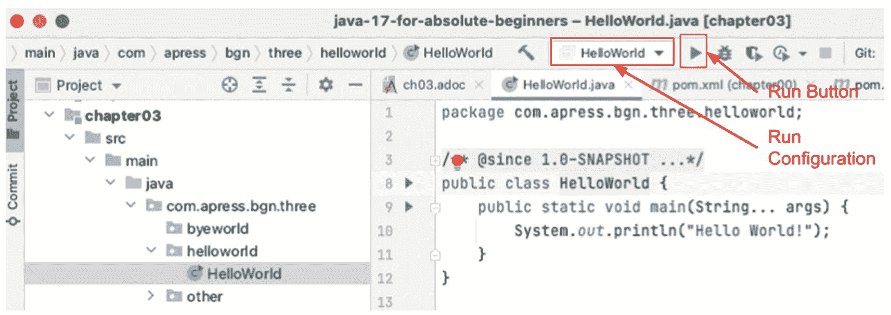

图 3-29

java-17 绝对初学者项目中的`HelloWorld`类

这些行包含不同的语句，这些语句在下面的列表中进行了解释，并且行号与列表中的编号相匹配。

1.  **包声明:**当类是包的一部分时，它们的代码必须以声明包含它们的包的这一行开始。`package`是 Java 中的保留关键字，除了声明包之外不能用于任何其他用途。

    **<空为了方便> :** 留空，这样画面看起来更好

2.  **类声明:**这是我们声明类型的那一行:
    *   它是`public`，所以从任何地方都能看到它

    *   这是一个`class`

    *   它被命名为`HelloWord`

    *   它有一个用花括号括起来的主体，左括号在这一行。但是它也可以在下一个上，因为空白空间被忽略。

3.  ****main()方法声明** **:** 在 Java 中方法名及其参数的个数、类型、顺序被称为**方法签名**。一个方法也有一个**返回类型**，就像它返回的结果类型一样。但是也有一种特殊的类型可以用来声明一个方法不返回任何东西。按照出现的顺序，下面是`main()`方法的每个术语所代表的含义:

    *   **公共方法访问器:**`main`方法必须是`public`否则 JRE 无法访问和调用。

    *   **静态:**还记得本章开始时提到一个类有成员(字段和方法)吗？当创建该类类型的对象时，它具有该类声明的字段和方法。类是创建对象的模板。但是，因为有了`static`关键字，`main`方法不与类类型的对象相关联，而是与类本身相关联。下一章会有更多的细节。

    *   **void:** 这个关键字在这里用来告诉我们`main`方法不返回任何东西，所以它就像是对 *no type* 的替换，因为如果不返回任何东西，就不需要类型。

    *   **string… args** 或 **String[] args:** 方法有时被声明为接收一些输入数据；`String[] args`表示文本值的数组。三个点是指定一个方法可以有多个相同类型的参数的另一种方式。三点符号只能在方法参数中使用，称为 **varargs** 。(varargs 参数也必须是该方法的唯一参数，或者是最后一个参数，否则解析参数就成了不可能完成的工作。)这意味着您可以传入一个参数数组，而无需显式创建该数组。数组是固定长度的数据集，在数学上它们被称为*一维矩阵*或*向量*。`String`是 Java 中表示文本对象的类。`[]`是阵列的意思，`args`是它的名字。但是等等，我们以前运行过这个方法，我们不需要提供任何东西！这不是强制性的，但是您将看到如何在这个列表之后为它提供参数(提供给方法的值，将由代码在其主体中使用)。

     **
***   **system . out . println(" hello world！");**是用来写 *Hello World 的语句！*在控制台中。

     *   **}** 是`main`方法体的右括号。

     *   **}** 是类体的右括号。

     **

 **如果我们执行这个类，我们将会看到`Hello World!`被打印在控制台中。在图 [3-21](#Fig21) 中，你已经看到了如何执行一个包含`main`()方法的类。以这种方式执行一个类后，IntelliJ IDEA 会自动将该执行的配置保存在一个**运行配置**中，并在一个下拉列表中显示它，旁边是一个三角形绿色按钮，通过单击它可以用来执行该类，这两个按钮都位于 IDE 的标题上，并在图 [3-29](#Fig29) 中夸张地指向您。

这两个元素非常重要，因为可以编辑运行配置，并且可以为 JVM 和`main`方法添加参数。让我们首先修改`main`方法，先用参数做些事情。

```java
public class HelloWorld {
    public static void main(String... args) {
        System.out.println("Hello " + args[0] + "!");
    }
}

Listing 3-31Main Method with varargs

```

使用数组元素的索引来访问数组，在 Java 中从 0 开始计数。因此，数组的第一个成员位于 0，第二个成员位于 1，依此类推。但是数组可以是空的，所以在前面的代码片段中，如果没有指定参数，程序的执行将会崩溃，并且在控制台中，将以红色显示一条显式消息。

当一个 Java 程序因为执行期间的错误而结束时，我们说**抛出了一个异常**。

当我们试图访问一个空数组或者一个不存在的数组元素时，JVM 抛出一个类型为`ArrayIndexOutOfBoundsException`的对象，该对象包含发生故障的行和我们试图访问的元素的索引。JVM 使用异常对象来通知开发人员 Java 执行没有按预期工作时的异常情况，这些对象包含有关代码中发生异常的位置以及导致问题的原因的详细信息。

我们在前面的代码片段中所做的修改将在执行该类时打印作为参数提供的文本值。让我们修改这个类的运行配置并添加一个参数。如果点击**运行配置**名称旁边的灰色小箭头，将会出现一个菜单。点击**编辑配置**并查看向您描述的对话窗口。图 [3-30](#Fig30) 描绘了菜单和对话框窗口。

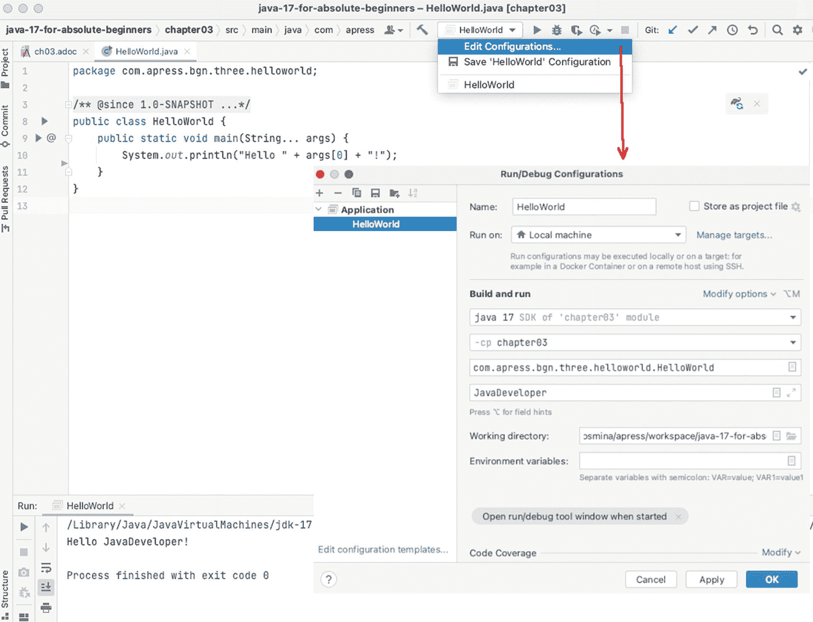

图 3-30

自定义运行配置

在图像中，关键元素以浅蓝色突出显示。IntelliJ IDEA 保存了您之前的一些执行，包括 Maven 构建任务，因此您只需单击一下就可以再次运行它们。在**运行/调试配置**对话窗口的左侧，IntelliJ IDEA 组按其类型运行配置。默认情况下，最后一次运行配置在窗口右侧打开，在本例中为`HelloWorld`类的运行配置。正如您所看到的，有许多选项可以为执行进行配置，并且大多数选项都是由 IDE 自动决定的。程序参数或`main`()方法的参数在用红色标记的文本字段中介绍。在图中我们引入了 *JavaDeveloper* ，所以如果你点击`Apply`然后`Ok`按钮，然后在控制台中执行这个类，而不是 *Hello World！*你现在应该看到了*你好 JavaDeveloper！*

我们班还能做什么？还记得这本书开头的代码吗？我们姑且称之为这个类中的`main()`方法。清单 [3-32](#PC35) 中再次描述了代码。

```java
package com.apress.bgn.three.helloworld;

import java.util.List;

public class HelloWorld {
    public static void main(String... args) {
        //System.out.println("Hello " + args[0] + "!");
        List<String> items = List.of("1", "a", "2", "a", "3", "a");

        items.forEach(item -> {
            if (item.equals("a")) {
                System.out.println("A");
            } else {
                System.out.println("Not A");
            }
        });
    }
}

Listing 3-32A More Complex main Method

```

import `java.util.List;`语句是包和类声明之间唯一存在的语句类型。这个语句告诉 Java 编译器一个对象类型`java.util.List`将在程序中使用。`import`关键字后面是类型的完全限定名。类型的完全限定名由包名(`java.util`)、点号(`.`)和类型的简单名(`List`)组成。没有它，`HelloWorld`类将无法编译。试试看:只要在语句前面加上“//”就行了，这会把这一行变成一个注释，被编译器忽略。你会看到编辑抱怨任何与列表相关的代码都是鲜红色的。

语句`List<String> items = List.of("1", "a", "2", "a", "3", "a");`创建一个文本值列表。Java 9 中引入了这种创建列表的方式。Java 5 中引入了使用`<T>`来指定列表中元素的类型，它被称为**泛型**。然后通过`forEach`方法逐个遍历列表中的元素，并对每个元素进行测试，看它们是否等于“ *a* 字符。用来做这件事的整个表达式被称为 **lambda 表达式**，这种类型的语法是在 Java 8 中与`forEach`方法一起引入的。

如果你现在运行这个类，在控制台中你应该看到一系列的*、*和*而不是*被打印出来，每一行都有一个。

```java
Not A
A
Not A
A
Not A
A

```

到目前为止，我们编写的代码使用了相当多类型的对象在控制台中打印一些简单的消息。`List`对象用于保存几个`String`对象。使用在`out`对象上调用的`println`方法打印消息，该对象是`System`类中的一个静态字段。这些只是你在代码中看到的对象。在底层，`List<T>`元素由一个`Consumer<T>`对象处理，该对象是在 lambda 表达式为了简单起见而隐藏的地方创建的，因此前面的代码可以扩展，如清单 [3-33](#PC37) 所示。

```java
package com.apress.bgn.three.helloworld;

import java.util.List;
import java.util.function.Consumer;

public class HelloWorld {
    public static void main(String... args) {
        List<String> items = List.of("1", "a", "2", "a", "3", "a");

        items.forEach(new Consumer<String>() {
            @Override
            public void accept(String item) {
                if (item.equals("a")) {
                    System.out.println("A");
                } else {
                    System.out.println("Not A");
                }
            }
        });
    }
}

Listing 3-33A More Complex main Method

```

在结束这一章之前，我想给你看另一个有趣的东西。`forEach`块的内容可以写成一行:

```java
items.forEach(item → System.out.println(item.equals("a") ? "A" : "Not A"));

```

通过使用一个叫做**方法引用**的东西，前面的代码行可以变得更加简单。但在本书后面会有更多的介绍。

现在看起来可能很可怕，但我保证这本书在清晰的背景下介绍了每个概念，并与现实世界的物体和事件进行了比较，所以你可以很容易地理解它。如果这不起作用，总会有更多的书，更多的博客，当然还有每个 JDK 的官方甲骨文页面，那里有相当好的教程。有志者事竟成。

还有，利用你的 IDE！通过在按下 Control/Command 键的同时单击代码中的任何对象类型，打开对象类的代码，您可以看到该类是如何编写的，并且可以直接在编辑器中阅读它的文档。作为一个练习，为`forEach`方法和`System`类做这件事。

大多数真正聪明的编辑器都有键位图:一组组合键，当它们被按在一起时会执行某些操作，比如导航、代码生成、执行等等。打印 IntelliJ IDEA 键图参考并熟悉它。你的大脑非常快，在编码时，目标是尽可能以你认为的速度打字。:)

## 摘要

本章向您介绍了 Java 应用的基本模块。还学习了如何使用 JShell 在应用的上下文之外执行 Java 语句。您了解了如何手工编译声明包和模块的 Java 代码。

你在学习本章时所做的许多事情，你可能会在获得一份 Java 开发人员的工作后每天都做(除了你将花费在搜索和修复现有代码中的 bug 的那几天)。您可能还会花很多时间阅读文档，因为 JDK 有很多类，其中包含您可以用来编写应用的字段和方法。随着每个版本的发布，事情都在变化，你必须让自己跟上时代。

大脑的容量有限；没有雇主会期望你知道每一个 JDK 类和方法，但是要聪明地工作，让这个 URL [`https://docs.oracle.com/en/java/javase/17/docs/api/index.html`](https://docs.oracle.com/en/java/javase/17/docs/api/index.html) (或者与 JDK 版本匹配的那个)一直在你的浏览器中打开。当你对一个 JDK 类或方法有疑问时，只需当场阅读它。

<aside aria-label="Footnotes" class="FootnoteSection" epub:type="footnotes">Footnotes [1](#Fn1_source)

用实际名称替换{filename}。

  [2](#Fn2_source)

《Oracle JShell 用户指南》可在 2021 年 10 月 15 日访问的 Oracle“Java Shell 用户指南”， [`https://docs.oracle.com/javase/9/jshell/JSHEL.pdf`](https://docs.oracle.com/javase/9/jshell/JSHEL.pdf) 中找到。

  [3](#Fn3_source)

例如接口、枚举、注释和记录。

  [4](#Fn4_source)

chapter03.iml 是一个 IntelliJ IDEA 项目文件。

  [5](#Fn5_source)

当 jar 托管在一个存储库(比如 Maven 公共存储库)上时，它们也被称为工件。您还可以在 Oracle 阅读更多关于 JAR 的信息，“JAR 文件概述”， [`https://docs.oracle.com/javase/8/docs/technotes/guides/jar/jarGuide.html`](https://docs.oracle.com/javase/8/docs/technotes/guides/jar/jarGuide.html) ，访问日期:2021 年 10 月 15 日。

  [6](#Fn6_source)

最常用的库是日志库，如 Log4J、“Apache Log4j 2、 [`https://logging.apache.org/log4j/2.x`](https://logging.apache.org/log4j/2.x) 和 Logback、“LogBACK 项目、 [`https://logback.qos.ch`](https://logback.qos.ch) ，都是在 2021 年 10 月 15 日访问的。

  [7](#Fn7_source)

如果你想知道更多，一篇关于罐子地狱的文章是 Tech Read，“什么是罐子地狱？、“ [`https://tech-read.com/2009/01/13/what-is-jar-hell`](https://tech-read.com/2009/01/13/what-is-jar-hell) ，访问日期 2021 年 10 月 15 日(不过你可能想以后再看，在你自己写了一点代码之后)。

  [8](#Fn8_source)

我们现在不会提到嵌套类。我们将在第四章中讲到。

  [9](#Fn9_source)

除此之外，我们还可以定义其他被称为嵌套的 Java 类型，但是当我们遇到这种情况时，我们会跨过那座桥。

  [10](#Fn10_source)

我们绘制了该表，以避免您在 Oracle 导航到此 URL 的麻烦，“控制对类成员的访问”， [`https://docs.oracle.com/javase/tutorial/java/javaOO/accesscontrol.html`](https://docs.oracle.com/javase/tutorial/java/javaOO/accesscontrol.html) ，访问日期为 2021 年 10 月 15 日。

  [11](#Fn11_source)

Maven 或 Gradle 等构建工具也将子项目称为模块，但它们的用途与 Java 模块不同。

  [12](#Fn12_source)

拼图项目的完整历史可以在开放的 JDK 找到，“拼图项目”， [`http://openjdk.java.net/projects/jigsaw`](http://openjdk.java.net/projects/jigsaw) ，2021 年 10 月 15 日访问。

  [13](#Fn13_source)

在 *Run* 菜单项旁边，描述了可用于运行该类的组合键。

 </aside>**