# 4.Java 语法

语言是人与人之间口头或书面的交流方式。不管它们是自然的还是人工的，它们都是由如何使用它们来完成交流任务的术语和规则组成的。编程语言是与计算机交流的手段。与计算机的通信是书面通信；基本上，开发人员定义一些要执行的指令，通过中介将它们传递给计算机，如果计算机理解它们，则执行一组操作，并且根据应用类型，将某种类型的回复返回给开发人员。

在 Java 语言中，通信是通过一个中介——Java 虚拟机来完成的。定义术语应该如何连接以产生可理解的通信单元的一组编程规则被称为**语法**。Java 借用了另一种叫做 C++的编程语言的大部分语法。C++有一个基于 C 语言语法的语法。c 语法借用了在它之前的其他语言的元素和规则，但本质上所有这些语言都是基于自然英语的。也许由于 lambda 表达式的引入，Java 在版本 8 中变得有点神秘，但是，当编写 Java 程序时，如果你用英语正确地命名你的术语，结果应该是一个易读的代码，就像一个故事。

一些细节已经在**章** [**3**](03.html) 中有所涉及。包和模块的内容足以让你对它们的目的有一个坚实的理解，以避免对项目组织的混淆，并避免在试图执行书中提到的代码时漫无目的地摸索代码。但是在其他话题上，表面几乎没有触及。因此，让我们开始深入研究 Java。

## 编写 Java 代码的基本规则

在编写 Java 代码之前，让我们列出一些您应该遵循的规则，以确保您的代码不仅可以工作，而且易于理解，从而可以维护或扩展。让我们通过添加一些细节来描绘一下我们结束时使用的类**章** [**3**](03.html) :

```java
01\. package com.apress.bgn.four.basic;
02.
03\. import java.util.List;
04.
05./**
06\.  * this is a JavaDoc comment
07\. */
08\. public class HelloWorld {
09\.     public static void main(String... args) {
10\.         //this is a one-line comment
11\.         List<String> items = List.of("1", "a", "2", "a", "3", "a");
12.
13\.         items.forEach(item -> {
14\.             /* this is a
15\.                 multi-line
16\.             comment */
17\.             if (item.equals("a")) {
18\.                 System.out.println("A");
19\.             } else {
20\.                 System.out.println("Not A");
21\.             }
22\.         });
23\.     }
24\. }

Listing 4-1The HelloWorld Class with Comments

```

代码的每一部分在本章中都有自己的章节。让我们从第一行开始。

### 包装声明

如果文件中声明的类型是在一个包中声明的，那么 Java 文件以**包声明**开始。包名可以包含字母和数字，用点分隔。每个部分都将路径中的一个目录匹配到其中包含的类型，如**章** [**3**](03.html) 所示。包声明应该揭示应用的名称和包中类的用途。就拿这本书的来源所用的包命名来说:`com.apress.bgn.four.basic`。如果我们将包名分成几部分，这是每一部分的含义:

*   `com.apress`表示应用的域，或者在这种情况下谁拥有该应用。

*   `bgn`代表代码的范围，在本例中是为谁写的书:**初学者**。

*   `four`代表类的用途，与**章** [**4**](04.html) 一起使用。

*   `basic`表示类的目的的更精细的级别；这些类很简单，用来描述基本的 Java 概念。

像这里介绍的由更多部分组成的包名称为**合格包名**。它有一个层次结构，包`com`是根包。假设在这个包中声明了一个类型`MyType`，使用这个 import 语句:`import com.MyType;`在其他包的类中引用这个类型。

包`apress`是包`com`的一个成员，由一个名字来标识，这个名字由它自己的名字加上一个点组成。假设在这个包中声明了一个类型`MyType`，使用这个 import 语句:`import com.apress.MyType;`在其他包的类中引用这个类型。

这同样适用于包`bgn`，它是包`apress`及其类型成员的成员，依此类推。

你可以把软件包想象成俄罗斯套娃的编程等价物。

因此，一个类型通过它的**完全限定名**在其他类型中被引用。类型的完全限定名是通过在类型名前面加上包的限定名和一个点形成的。图 [4-1](#Fig1) 应该让事情变得非常清楚。

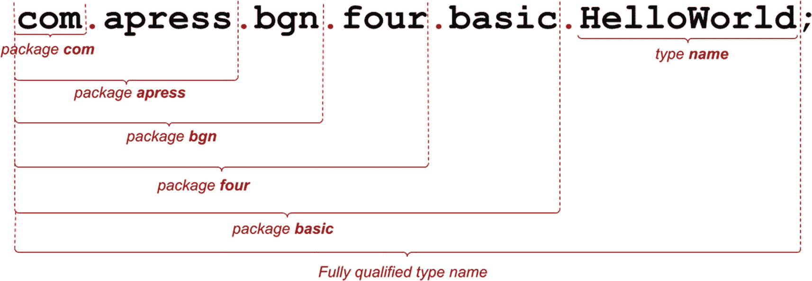

图 4-1

剖析 Java 类型的完全限定名

### 进口部分

在包裹申报之后，接着是**导入部分**。本节包含文件中使用的所有类、接口和枚举的完全限定名。请看清单 [4-2](#PC2) 中的代码示例。

```java
package java.lang;

import java.io.ObjectStreamField;
import java.io.UnsupportedEncodingException;
import java.lang.annotation.Native;
import java.lang.invoke.MethodHandles;
import java.lang.constant.Constable;
import java.lang.constant.ConstantDesc;
import java.nio.charset.Charset;
import java.util.ArrayList;
// the rest of import statements omitted

public final class String
    implements java.io.Serializable, Comparable<String>, CharSequence,
               Constable, ConstantDesc {

    private static final ObjectStreamField[] serialPersistentFields =
    new ObjectStreamField[0];

    // the rest of the code omitted
}

Listing 4-2Small Code Snippet from the java.lang.String Class

```

这是官方 Java `String`类的一个片段。每个 import 语句代表一个对包的引用，以及在`String`类体内使用的类名。

特殊的导入语句可以用来导入`static`变量和`static`方法。在 JDK，有一个用于数学过程的课程。它包含静态变量和方法，开发人员可以使用它们来实现解决数学问题的代码。您可以使用它的变量和方法，而不需要创建这种类型的对象，因为静态成员不属于某个类型的对象，而是属于该类型本身。检查清单 [4-3](#PC3) 中的代码。

```java
package com.apress.bgn.four;

import static java.lang.Math.PI;
import static java.lang.Math.sqrt;

public class MathSample {
    public static void main(String... args) {
        System.out.println("PI value =" + PI);
        double result = sqrt(5.0);
        System.out.println("SQRT value =" + result);
    }
}

Listing 4-3Using Static Imports for Members of Class Math

```

通过将`import`和`static`放在一起，我们可以声明一个类的完全限定名以及我们感兴趣的在代码中使用的方法或变量。这允许我们直接使用变量或方法，而不需要声明它的类名。如果没有静态导入，代码将不得不重写，如清单 [4-4](#PC4) 所示:

```java
package com.apress.bgn.four;

import java.lang.Math;

public class MathSample {
    public static void main(String... args) {
        System.out.println("PI value =" + Math.PI);
        double result = Math.sqrt(5.0);
        System.out.println("SQRT value =" + result);
    }
}

Listing 4-4Using Import of Class Math

```

完全限定名是一种强大的东西。包名在一个模块中是唯一的，但是包名在一个应用中并不总是唯一的。类型名在应用中也不总是唯一的，但是由两者组合而成的完全限定类型名在应用中是唯一的。

你也可以把包裹想象成家庭地址，把类型想象成人。两个人可以有相同的地址，但不能有相同的名字。两个人可以有相同的名字，住在不同的地址。例如，在英国或美国，银行和其它机构就是这样识别个人身份的。

完全限定名不限于 import 语句。当两个类型具有相同的名称并且都用于声明第三个类型时，能够在类型体中告诉编译器您打算使用哪个类型的唯一方法是使用完全限定名。清单 [4-5](#PC5) 中显示了一个这样的例子，其中包`com.apress.bgn.four.math`中的类`Math`被用在一个类的主体中，该主体中也使用了`java.lang.Math`类的成员。

```java
package com.apress.bgn.four.math;

import java.lang.Math;

public class Sample {
    public static void main(String... args) {
        System.out.println("PI value =" + Math.PI);

        System.out.println("My PI value= " + com.apress.bgn.four.math.Math.PI);
    }
}

Listing 4-5Using a Member of Class com.apress.bgn.four.math.Math

```

当同一个包中使用了多个类型时，类型名可以用一个`*`(星号)代替，这意味着包中任何可见的类型都可以用于正在编写的类型的代码中。这些被称为**紧凑型进口报表**。当使用同一个包中的多个类编写代码，或者使用同一个类中的多个静态变量和方法时，建议压缩导入。这样做时，文件的导入部分变得冗长，难以阅读。这就是压缩发挥作用的地方。压缩导入意味着用通配符替换同一个包中的所有类或者同一个类中的变量和方法，因此只需要一条 import 语句。它也适用于静态导入。所以之前的`MathSample`类变成了清单 [4-6](#PC6) 中的那个。

```java
package com.apress.bgn.four;

import static java.lang.Math.*;

public class MathSample {
    public static void main(String... args) {
        System.out.println("PI value =" + PI);
        double result = sqrt(5.0);
        System.out.println("SQRT value =" + result);
    }
}

Listing 4-6Using Compacted Imports

```

### Java 语法

Java 语言是**区分大小写的** **，**，这意味着我们可以编写一段类似清单 [4-7](#PC7) 中描述的代码，并且代码可以成功编译和执行。

```java
package com.apress.bgn.four;

public class Sample {
    public static void main(String... args) {
        int mynumber = 0;
        int myNumber = 1;
        int Mynumber = 2;
        int MYNUMBER = 3;
        System.out.println(mynumber);
        System.out.println(myNumber);
        System.out.println(Mynumber);
        System.out.println(MYNUMBER);
    }
}

Listing 4-7Java Code Proving Its Case Sensitivity

```

四个变量都不同，最后四行打印出数字:0 1 2 3。显然，你不能在同一个上下文中声明两个同名的变量(例如，在一个方法体中)，因为你基本上是在重新声明同一个变量。Java 编译器不允许这样做。如果你试图这样做，你的代码将不会编译，甚至 IntelliJ IDEA 会试图让你看到你的方式的错误，用红色下划线给你显示相关的消息，如图 [4-2](#Fig2) ，其中变量`mynumber`被声明了两次。

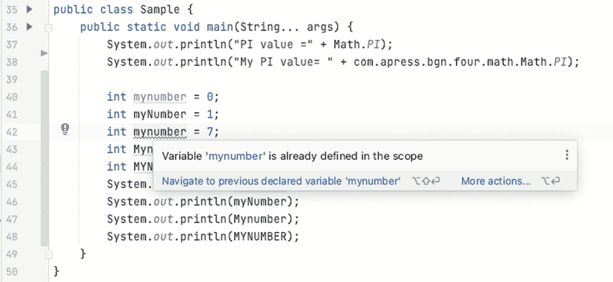

图 4-2

同一个变量名使用了两次

在 Java 代码中，有一组 **Java 关键字**只能用于固定和预定义的目的。其中几个已经介绍过了:`import`、`package`、`public`和`class`，但其余的将在本章末尾的表格 [4-2](#Tab2) 和 [4-3](#Tab3) 中对其进行简要说明。

 Java 关键字不能在开发者编写的代码中作为标识符，所以不能作为变量、类、接口、对象等的名称。

一个 Java 源文件中可以声明一个或多个类型。无论是`class`、`interface`(或`@interface`)、`enum,`还是`class`，类型的声明都必须用花括号( **{}** )括起来。这些被称为**块分隔符**。`import`和`package`语句不是类型体的一部分。如果你看一下清单 [4-1](#PC1) 中的代码，你会注意到括号被用来包含以下内容:

*   类的内容，也称为类的主体(第 08 行和第 23 行的括号)

*   方法的内容，也称为方法体(第 09 行和第 22 行的括号)

*   要一起执行的一组指令(第 13 行和第 21 行的括号)

**行终止符**:代码行在 Java 中通常以分号(；)符号或 ASCII 字符 CR、LF 或 CR LF。分号用于终止完整的功能语句，如第 11 行中的列表声明。在小型监视器上，当编写代码时，您可能被迫将该语句分成两行，以保持代码的可读性。末尾的分号告诉编译器，只有把所有这些放在一起，这个语句才是正确的。看一下图 [4-3](#Fig3) :

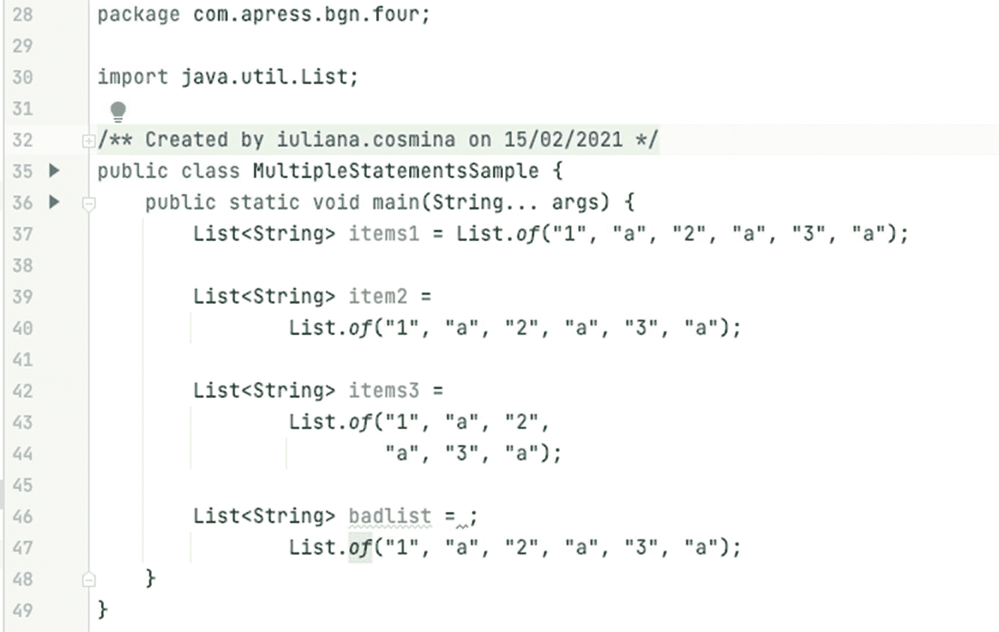

图 4-3

不同的陈述示例

前三个`List`声明是等价的。当以这种方式声明一个`List`时，您甚至可以将它的元素分成多行。然而，第 46 行的声明故意写错了。第 46 行添加了一个分号，该行结束该语句。该语句是无效的，当您试图通过打印一个异常来编译该类时，编译器会对此进行抱怨:

*错误:(13，46) java:表达式*的非法开始。

如果错误消息似乎不符合示例，请这样想:编译器的问题不是错误地终止了语句，而是在“=”符号之后，编译器期望找到某种表达式来生成`badList`变量的值，但是却什么也没有找到。

### Java 标识符和变量

一个**标识符**是你在 Java 代码中给一个项目起的名字:类、变量、方法等等。标识符必须遵守一些允许代码编译的规则，以及常识性的编程规则，称为 **Java 编码约定**。下面列出了其中的一些:

*   标识符不能是 Java 保留字之一，否则代码将无法编译。

*   标识符不能是布尔文字(`true`、`false`)或`null`文字，否则代码将无法编译。

*   标识符可以由字母、数字和`_(underscore)`、`$(dollar sign).`中的任何一个组成

*   标识符不能以数字开头

*   从 Java 9 开始，单个`_`(下划线)不能再用作标识符，因为它变成了关键字。这可能是因为在 Java 7 中引入了数字文字，多位数的数字可以用更易读的方式书写(例如，`int i = 10_000;`)。

*   开发人员应该按照 **camel case** 的书写风格声明他们的标识符，确保标识符名称中间的每个单词或缩写都以大写字母开头(例如`StringBuilder`、`isAdult`)。

一个**变量**是一组可以与一个值相关联的字符。它有一个类型，基于该类型，可以分配给它的值集被限制在某个区间、值组，或者必须遵循该类型定义的某个格式。例如:清单 [4-1](#PC1) 中第 11 行声明的项是一个`List`类型的变量，与之关联的值是一个值列表。

在 Java 中有三种类型的变量:

*   **字段**(也称为**属性**)是在方法体之外的类体中定义的变量，它们前面没有关键字`static`。

*   **局部变量**是在方法体内声明的变量，它们只在那个上下文中相关。

*   **静态变量**是在类体内声明的变量，前面有关键字`static`。如果它们被声明为`public`，那么无论封闭类型在哪里，它们都可以在应用中被访问。(除非模块不在声明它们的地方导出包，也就是说。)

### Java 注释

**Java 注释**指的是不属于正在执行的代码的一部分并且被编译器忽略的解释性文本。有三种方法可以在 Java 代码中添加注释，这取决于用来声明注释的字符。清单 [4-1](#PC1) 中使用了所有三种类型的注释，下面的列表解释了每种注释的用途:

*   `//`用于单行注释(第 10 行)。开发人员使用这种类型的注释来添加 TODO 语句或解释为什么需要某段代码。这些评论主要是为从事该项目的团队成员准备的。

*   `/** ...` `*/` JavaDoc 注释，使用特殊工具导出到名为 JavaDoc API 的项目文档中的特殊注释(第 05 到 07 行)。开发人员使用这种类型的注释来记录他们的代码。有一些构建工具的插件可以从项目中提取 JavaDoc 作为网站，然后可以公开托管，以帮助其他开发人员使用您的项目。

*   `/* ...` `*/`用于多行注释(第 14 行到第 16 行)。开发人员使用这种类型的注释来添加 TODO 语句或解释为什么需要某段代码，当解释相当长时。这些评论主要是为从事该项目的团队成员准备的。

### Java 类型

在**章节** [**3**](03.html) 中介绍 Java 构建模块时，为了简单起见，只提到了`class`。前面提到 Java 中还有其他类型，本节将介绍所有类型。类是最重要的，所以会先覆盖。

#### 班级

前面提到过，类只是创建对象的模板。基于**类**创建一个对象被称为**实例化**。产生的对象被称为**，是那个类**的一个实例。实例被命名为**对象**，因为默认情况下，如果没有声明其他超类，开发者编写的任何类都会隐式扩展类`java.lang.Object`。这意味着在 Java 中，所有的类都有一个基本的模板，这个模板由`java.lang.Object`类表示。默认情况下，任何类都是这个类的扩展，所以清单 [4-8](#PC8) 中的类声明等同于清单 [4-9](#PC9) 中的类声明。

```java
package com.apress.bgn.four.basic;

public class Sample extends Object {
}

Listing 4-9Simple Sample Class Explictly Extending the java.lang.Object Class

```

```java
package com.apress.bgn.four.basic;

public class Sample {
}

Listing 4-8Simple Sample Class Implicitly Extending the java.lang.Object Class

```

另外，请注意导入`java.lang`包是不必要的，因为`Object`类是 Java 层次结构的根类，所有的类(包括数组)都必须能够扩展它。因此`java.lang`包也是隐式导入的。

在**章节** [** 3 **](03.html) 中提到，在任何声明了`module-info.java`的 Java 项目中，都会根据需要隐式添加`java.base`模块。该模块导出包含编写 Java 代码的核心组件的`java.lang`包。

每一个人都是由一个包含 23 对染色体的 DNA 分子定义的。他们宣称一个人应该拥有的器官和肢体看起来和功能就像一个…。人类。您可以将`Object`类视为 DNA 分子，它声明了一个类在 Java 应用中作为一个类应该具有的外观和功能的所有组件。

还有其他模板类型可用于在 Java 中创建对象。在下面的章节中，我们将介绍它们并解释它们的用途。但是让我们在一个背景下这样做。我们将创建一系列模板来定义人类。大多数 Java 教程使用车辆或几何形状的模板。我想建立一个任何人都能容易理解和联系的模型。下面几节的目的是开发可以用来为不同类型的人建模的 Java 模板。到目前为止提到的第一个 Java 模板是**类**，所以让我们继续。

##### 菲尔茨

创建实例的操作被称为**实例化**。要设计一个模拟普通人类的类，我们应该考虑两件事:人类特征和人类行为。所有人类的共同点是什么？很多，但是为了本节的目的，让我们选择三个通用属性:它们有一个名字、年龄和身高。这些属性在 Java 类中映射到名为**字段**或**属性**的变量。清单 [4-10](#PC10) 中描述了第一个版本的`Human`类。

```java
package com.apress.bgn.four.base;

public class Human {
    String name;
    int age;
    float height;
}

Listing 4-10Simple Human Class

```

在前面的代码示例中，字段具有不同的类型，这取决于应该与哪些值相关联。例如，name 可以与一个文本值相关联，比如“Alex”，而文本在 Java 中由`String`类型表示。年龄可以与数字整数值相关联，类型`int`也是如此。在本节中，我们认为人的身高是一个像 1.9 这样的有理数，所以我们对这种值使用了特殊的 Java 类型:`float`。

所以现在我们有一个类来模拟人类的一些基本属性。我们如何使用它？我们需要一个`main(..)`方法，我们需要创建一个这种类型的对象:我们需要实例化这个类。在清单 [4-11](#PC11) 中，创建了一个名为“亚历克斯”的人。

```java
package com.apress.bgn.four.base;

public class BasicHumanDemo {
    public static void main(String... args) {
        Human human = new Human();
        human.name = "Alex";
        human.age = 40;
        human.height = 1.91f;
    }
}

Listing 4-11Simple Human Object Being Created

```

为了创建一个`Human`实例，我们使用了`new`关键字。在 new 关键字之后，我们调用一个叫做构造函数的特殊方法。我们以前提到过方法，但是这个方法比较特殊。一些开发人员甚至不认为它是一种方法。最显而易见的原因是，它在人类的身体中没有被定义。那么它是从哪里来的呢？它是一个没有参数的默认构造函数，由编译器自动生成，除非声明了一个显式的构造函数(有或没有参数)。没有构造函数，类就不能存在，否则它就不能被实例化，这就是为什么如果没有显式声明，编译器会生成一个构造函数。默认构造函数调用`super(),`，后者调用`Object`无参数构造函数，用默认值初始化所有字段。清单 [4-12](#PC12) 中的代码示例对此进行了测试:

```java
package com.apress.bgn.four.base;

public class BasicHumanDemo {
    public static void main(String... args) {
        Human human = new Human();
        System.out.println("name: " + human.name);
        System.out.println("age: " + human.age);
        System.out.println("height: " + human.height);
    }
}

Listing 4-12Simple Human Object Being Created Without Setting Values or Its Fields

```

你认为会发生什么？如果你认为某些默认值(中性)会被打印出来，那你绝对是对的。清单 [4-13](#PC13) 描述了当清单 [4-12](#PC12) 中的代码被执行时，在控制台中打印的输出。

```java
name: null
age: 0
height: 0.0

Listing 4-13Default Values for the Fields of a Simple Human Object

```

注意，数值变量用 0 初始化，`String`值用`null`初始化。原因是数字类型是原始数据类型，而`String`是对象数据类型。`String`类是`java.lang package`的一部分，是用于创建`String`类型对象的预定义 Java 类之一。它是一种特殊的数据类型，用于表示文本对象。我们将在下一章深入探讨数据类型。

##### 类别变量

除了每个人所特有的特征之外，所有人都有一个共同点:寿命，在以后的时间里被认为是 100 岁。声明一个名为 lifetime 的字段是多余的，因为它必须与所有人类实例的相同值相关联。因此，我们将在`Human`类中使用`static`关键字声明一个字段，该字段对于所有人工实例都具有相同的值，并且只初始化一次。我们还可以更进一步，通过在声明前添加`final`修饰符，确保该值在程序执行过程中不会改变。这样，我们创建了一个特殊类型的变量，称为**常数**。清单 [4-14](#PC14) 中描述了新的`Human`类:

```java
package com.apress.bgn.four.base;

public class Human {
    static final int LIFESPAN = 100;
    String name;
    int age;
    float height;
}

Listing 4-14Simple Human Class with a Constant Member

```

`LIFESPAN`变量也被称为类变量，因为它不与实例相关，而是与类相关。*(它被设置为 100，这是一个非常乐观的值。)*清单 [4-15](#PC15) 中的代码清楚地表明了这一点:

```java
package com.apress.bgn.four.base;

public class BasicHumanDemo {
    public static void main(String... args) {
        Human alex = new Human();
        alex.name = "Alex";
        alex.age = 40;
        alex.height = 1.91f;

        Human human = new Human();
        System.out.println("Alex’s lifespan = " + alex.LIFESPAN);  // prints 100
        System.out.println("human’s lifespan = " + human.LIFESPAN);  // prints 100
        System.out.println("Human lifespan = " + Human.LIFESPAN);  // prints 100
    }
}

Listing 4-15Code Sample Testing a Constant

```

##### 封装数据

我们定义的类没有在字段上使用访问修饰符，这是不可接受的。Java 是众所周知的面向对象编程语言，因此用 Java 编写的代码必须遵守 **面向对象编程(OOP)** 的**原则。遵守这些编码原则可以确保编写的代码质量良好，并且完全符合基本的 Java 风格。OOP 的原则之一是**封装**。封装原则是指通过使用称为访问器(getters)和赋值器(setters)的特殊方法限制对数据的访问来隐藏数据实现。**

基本上，类的任何字段都应该有私有访问，对它的访问应该由方法控制，这些方法可以被拦截、测试和跟踪，以查看它们被调用的位置。使用对象时，Getters 和 setters 是一种常见的做法；大多数 ide 都有默认选项来生成它们，包括 IntelliJ IDEA。只需在类体内单击鼠标右键，选择 **Generate** 选项查看所有可能性，并选择**getter 和 setter**为您生成方法。菜单如图 [4-4](#Fig4) 所示。

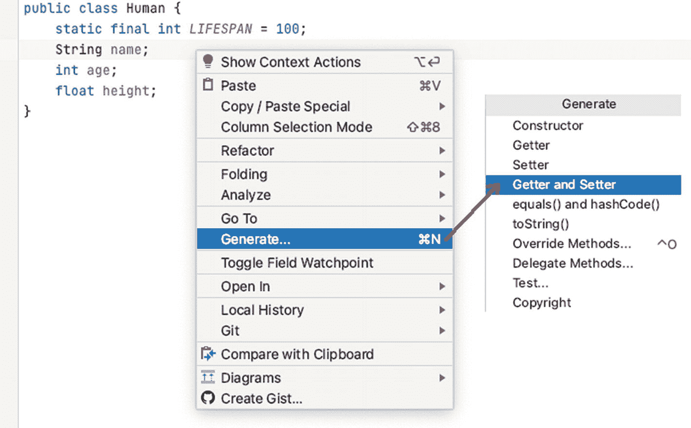

图 4-4

IntelliJ IDEA 代码生成菜单:生成➤ Getter 和 Setter 子菜单

在将字段私有并生成 getter 和 setter 之后，`Human`类现在看起来如清单 [4-16](#PC16) 所示。

```java
package com.apress.bgn.four.base;

public class Human {
    public static final int LIFESPAN = 100;
    private String name;
    private int age;
    private float height;

    public String getName() {
        return name;
    }

    public void setName(String name) {
        this.name = name;
    }

    public int getAge() {
        return age;
    }

    public void setAge(int age) {
        this.age = age;
    }

    public float getHeight() {
        return height;
    }

    public void setHeight(float height) {
        this.height = height;
    }
}

Listing 4-16Simple Human Class with Getters and Setters

```

看了前面的代码清单后，您可能想知道`this`关键字的用途是什么。正如关键字提示的那样，它是对当前对象的引用。所以`this.name`实际上是当前对象的字段名的值，也称为实例变量。在类体内，当方法中有同名的参数时，这用于访问当前对象的字段。正如你所看到的，IntelliJ IDEA 生成的**设置器**和**获取器**具有与字段完全相同的参数名称。

getter 是最简单的方法，声明时不带任何参数，返回与它们相关联的字段的值，以及它们的名称的编码约定，名称由前缀`get`和它们访问的字段的名称组成，首字母大写。

Setters 是不返回任何内容的方法，它将需要与字段关联的相同类型的变量声明为参数。它们的名称由前缀`set`和它们访问的字段名称组成，首字母大写。当编辑器生成 setter 时，参数名与实例变量名匹配，需要使用关键字`this`在 setter 主体的上下文中区分这两者。

图 [4-5](#Fig5) 描述了名称字段的设置器和获取器。

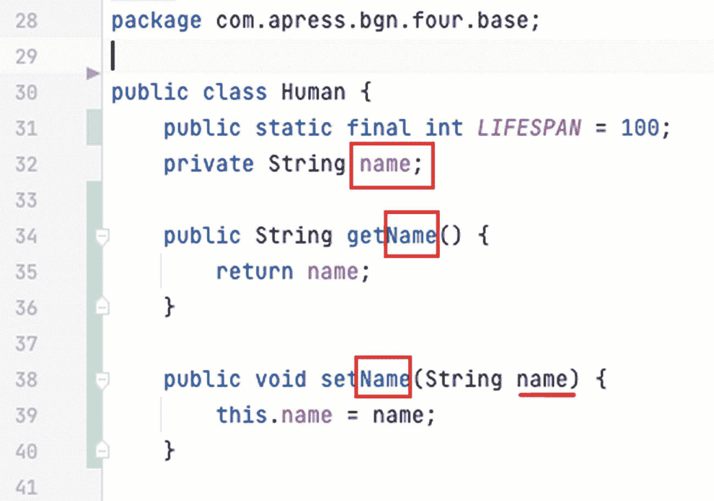

图 4-5

用于`name`字段的 Setter 和 getter 方法

这意味着当创建一个`Human`实例时，我们必须使用 setters 来设置字段值，并在访问它们时使用 getters。因此我们的类`BasicHumanDemo`变成了清单 [4-17](#PC17) 中描述的那个。

```java
package com.apress.bgn.four.base;

public class BasicHumanDemo {
    public static void main(String... args) {
        Human alex = new Human();
        alex.setName("Alex");
        alex.setAge(40);
        alex.setHeight(1.91f);

        System.out.println("name: " + alex.getName());
        System.out.println("age: " + alex.getAge());
        System.out.println("height: " + alex.getHeight());
    }
}

Listing 4-17BasicHumanDemo Class

Using Human Instance with Getters and Setters

```

大多数 Java 框架在类中寻找 getters 和 setters 来初始化或读取对象字段的值。Setters 和 getters 被大多数开发人员认为是**样板代码**(或者只是样板)；在多个地方重复出现的代码段几乎没有变化。这就是为什么龙目 <sup>[1](#Fn1)</sup> 库诞生了——在运行时生成它们，这样开发者就不必用它们污染他们的代码。科特林语把它们完全删除了。

Java 在版本 14 中做了类似的事情，引入了**记录**。记录将在本章的稍后部分讨论。

##### 方法

既然 getters 和 setters 都是**方法** **，**那么也是时候开始讨论方法了。方法是一个代码块，通常由返回的类型、名称和参数(需要时)来表征，它描述了由对象完成的或在对象上完成的动作，该动作利用了它的字段和/或提供的参数的值。清单 [4-18](#PC18) 中描述了一个 Java 方法的抽象模板。

```java
[accessor] [returned type] [name] (type1 param1, type2 param2, ...) {
// code
[ [maybe] return val]
}

Listing 4-18Method Declaration Template

```

接下来，让我们为类`Human`创建一个方法，通过使用人类的年龄和`LIFESPAN constant`来计算和打印人类还能活多久。因为该方法不返回任何东西，所以使用的返回类型将是`void`。`void`是一种特殊类型，它告诉编译器该方法不返回任何东西，因此在方法体中不存在 return 语句。清单 [4-19](#PC19) 中描述了该方法的代码。

```java
package com.apress.bgn.four.base;

public class Human {
    static final int LIFESPAN = 100;
    private String name;
    private int age;
    private float height;

    /**
     * compute and prints time to live
     */
    public void computeAndPrintTtl(){
        int ttl = LIFESPAN - this.age;
        System.out.println("Time to live: " + ttl);
    }

    // some code omitted
}

Listing 4-19Human#computeAndPrintTtl Method

with No Return Value

```

Java 中有一个关于常量命名的编码约定，建议只使用大写字母、下划线(替换组合名称中的空格字符)和数字来组成它们的名称。

前面的方法定义没有声明任何参数，所以可以在一个`Human`实例上调用它，如清单 [4-20](#PC20) 所示。

```java
package com.apress.bgn.four.base;

public class BasicHumanDemo {
    public static void main(String... args) {
        Human alex = new Human();
        alex.setName("Alex");
        alex.setAge(40);
        alex.setHeight(1.91f);
        alex.computeAndPrintTtl();
    }
    // some code omitted
}

Listing 4-20The computeAndPrintTtl() Method Call

```

当执行清单 [4-20](#PC20) 中的代码时，控制台中会打印出“*生存时间:60”*。

可以修改前面的方法来返回生存时间值，而不是打印它。必须修改方法以声明返回值的类型，在这种情况下，类型是 int，与方法体中计算的值的类型相同。清单 [4-21](#PC21) 中描述了该实现。

```java
package com.apress.bgn.four.base;

public class Human {
    static final int LIFESPAN = 100;
    private String name;
    private int age;
    private float height;

    /**
     * @return time to live
     */
    public int getTimeToLive(){
        int ttl = LIFESPAN - this.age;
        return ttl;
    }

    // some code omitted
}

Listing 4-21The getTimeToLive() Method

with Return Value

```

在这种情况下，调用该方法没有任何作用，所以我们必须修改代码来保存返回值并打印它，如清单 [4-22](#PC22) 所示。

```java
package com.apress.bgn.four.base;

public class BasicHumanDemo {
    public static void main(String... args) {
        Human alex = new Human();
        alex.setName("Alex");
        alex.setAge(40);
        alex.setHeight(1.91f);
        int timeToLive = alex.getTimeToLive();
        System.out.println("Time to live: " + timeToLive);
    }
    // some code omitted
}

Listing 4-22Using the getTimeToLive() Method

```

这里介绍的两种方法都没有声明参数，所以它们在调用时没有提供任何参数。我们不会讨论带参数的方法，因为设置器非常明显。让我们跳过前面。

##### 构造器

现在我们已经完成了，我们不能再在其他类中使用`alex.name`而编译器不会抱怨不能访问那个属性。此外，在调用所有这些 setters 时，仅仅设置这些属性就很烦人，所以应该对此做些什么。还记得隐式构造函数吗？开发人员也可以显式声明构造函数，一个类可以有多个构造函数。可以用每个感兴趣的字段的参数来声明构造函数。清单 [4-23](#PC23) 描述了一个`Human`类的构造函数，它用参数值初始化类字段。

```java
package com.apress.bgn.four.base;

public class Human {
    static final int LIFESPAN = 100;
    private String name;
    private int age;
    private float height;

    /**
     * Constructs a Human instance initialized with the given parameters.
     * @param name - the name for the Human instance
     * @param age - the age for the Human instance
     * @param height - the height for the Human instance
     */
    public Human(String name, int age, float height) {
        this.name = name;
        this.age = age;
        this.height = height;
    }

    // some code omitted
}

Listing 4-23Human class

with Explicit Constructor

```

构造函数不需要`return`语句，即使调用构造函数的结果是创建一个对象。构造函数在那方面不同于方法。通过声明显式构造函数，不再生成默认构造函数。因此，通过调用默认的构造函数来创建一个`Human`实例，如前面的代码清单所描述的，不再有效。代码不再编译，因为不再生成默认构造函数。为了创建一个`Human`实例，我们现在必须调用新的构造函数并提供合适的参数来代替形参，使用正确的类型并遵守它们的声明顺序。

```java
Human human = new Human("John", 40, 1.91f);  // this works
Human human = new Human();  // this no longer works

```

但是如果我们不想被迫使用这个构造函数来设置所有的字段呢？很简单:我们用我们感兴趣的参数定义另一个。让我们定义一个只为`Human`实例设置名称和年龄的构造函数，如清单 [4-24](#PC25) 所示。

```java
package com.apress.bgn.four.base;

public class Human {
    static final int LIFESPAN = 100;
    private String name;
    private int age;
    private float height;

    public Human(String name, int age) {
        this.name = name;
        this.age = age;
    }

    public Human(String name, int age, float height) {
        this.name = name;
        this.age = age;
        this.height = height;
    }

    // some code omitted
}

Listing 4-24Human Class with Explicit Constructors

```

在这里，我们偶然发现了另一个 OOP 原则，叫做**多态性**。这个术语是希腊语，翻译过来就是*一个名字，多种形式*。多态性适用于具有多个同名方法，但签名和功能略有不同的代码设计。它也适用于构造函数。多态性有两种基本类型:**覆盖**，也称为运行时多态性，稍后将在讲述**继承**原则时讲述；以及**重载**，被称为编译时多态。

第二种类型的多态性适用于前面的构造函数，因为我们有两个构造函数:一个具有不同的参数集，看起来像是简单构造函数的扩展。

在最近的清单中值得注意的第二件事是，两个构造函数包含两个相同的代码行。有一个常识性的编程原理名叫干， <sup>[2](#Fn2)</sup> 这是*的简称不要重复自己！*很明显，最近的清单中的代码没有遵守它，所以让我们以一种新的有趣的方式使用前面介绍的`this`关键字来解决这个问题，如清单 [4-25](#PC26) 所示。

```java
package com.apress.bgn.four.base;

public class Human {
    static final int LIFESPAN = 100;
    private String name;
    private int age;
    private float height;

    public Human(String name, int age) {
        this.name = name;
        this.age = age;
    }

    public Human(String name, int age, float height) {
        this(name,age);
        this.height = height;
    }

    // some code omitted
}

Listing 4-25Human Class with Better Explicit Constructors

```

构造函数可以通过使用`this(...` `)`相互调用。这对于避免两次编写相同的代码非常有用，从而提高了代码的可重用性。

所以现在两个构造函数都提供了创建`Human`实例的方法。如果我们使用一个不设置高度的字段，那么 height 字段将隐式初始化为 float 类型的默认值(0.0)。

现在我们的类非常基本，我们甚至可以说它以一种非常抽象的方式建模了一个`Human`。如果我们试图用某些技能或能力来模拟人类，我们必须创造新的职业。假设我们想模仿音乐家和演员。这意味着我们需要创建两个新的类。清单 [4-26](#PC27) 中描述了`Musician`级；跳过字段的 getter 和 setter。

```java
package com.apress.bgn.four.classes;

public class Musician {
    static final int LIFESPAN = 100;
    private String name;
    private int age;
    private float height;
    private String musicSchool;
    private String genre;
    private List<String> songs;

// other code omitted
}

Listing 4-26Musician Class

```

清单 [4-27](#PC28) 中描述了`Actor`类；跳过字段的 getter 和 setter。

```java
package com.apress.bgn.four.classes;

public class Actor {
    static final int LIFESPAN = 100;
    private String name;
    private int age;
    private float height;
    private String actingSchool;
    private List<String> films;

    // other code omitted
}

Listing 4-27Actor Class

```

正如您所看到的，这两个类之间有很多共同的元素。我们之前提到过，干净编码原则之一要求开发人员避免代码重复。这可以通过遵循另外两个 OOP 原则来设计类来实现:**继承**(已经简单提到过)和**抽象**。

##### 抽象和继承

**抽象**是管理复杂性的 OOP 原则。抽象用于分解复杂的实现，并定义可重用的核心部分。在我们的例子中，类**音乐家**和**演员**的公共字段可以归入我们在本章前面定义的**人类**类。人类类可以被视为一种抽象，因为这个世界上的任何人类都不仅仅是他们的名字、年龄和身高。没有必要创建`Human`实例，因为任何人都会被其他东西所代表，比如激情、目的或技能。一个不需要实例化的类，只是将字段和方法组合在一起供其他类继承或提供具体实现，在 Java 中由一个**抽象**类建模。因此， **Human** 类被修改成抽象的。因为我们抽象了这个类，所以我们将使生命周期常量成为公共的，以使它可以从任何地方访问，并使`getTimeToLive()`方法成为抽象的，以将其实现委托给扩展类。类别内容如清单 [4-28](#PC29) 所示。

```java
package com.apress.bgn.four.classes;

public abstract class Human {
    public static final int LIFESPAN = 100;
    protected String name;
    protected int age;
    protected float height;

    public Human(String name, int age) {
        this.name = name;
        this.age = age;
    }
    public Human(String name, int age, float height) {
        this(name, age);
        this.height = height;
    }

    /**
     * @return time to live
     */
    public abstract int getTimeToLive();

    // getters and setters omitted
}

Listing 4-28Human Abstract Class

```

抽象方法是一种缺少主体的方法，就像前面代码清单中声明的`getTimeToLive()`方法一样。这意味着在`Human`类中没有这个方法的具体实现，只有一个框架，一个模板。这个方法的具体实现必须由扩展类提供。

哦，但是等等，我们保留了构造函数！如果不允许我们再使用它们，我们为什么要这样做呢？我们没有，因为这是 IntelliJ IDEA 对图 [4-6](#Fig6) 中的`BasicHumanDemo`类所做的事情:

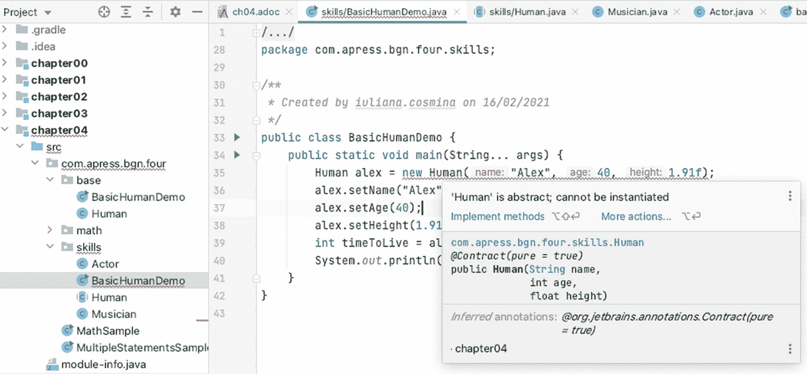

图 4-6

尝试实例化抽象类时出现 Java 编译器错误

是的，这是一个编译错误。可以保留构造函数，因为它们可以进一步帮助抽象行为。必须重写类`Musician`和`Actor`来扩展`Human`类。这是通过在声明类和指定要扩展的类时使用`extends`关键字来完成的，也称为**父类**或**超类**。产生的类被称为**子类**。

当扩展一个类时，子类继承超类中声明的所有字段和具体方法。(对它们的访问由第**章** [**3**](03.html) 中的访问修饰符定义)。)例外是抽象方法，子类被迫提供具体的实现。

子类必须声明自己的构造函数，这些构造函数使用超类中声明的构造函数。使用关键字`super`调用超类的构造函数。这同样适用于方法和字段，除非它们有一个禁止访问的访问修饰符。

你能猜出是哪一个吗？是`private`。子类不能访问超类的私有成员。如果你不知道答案，你可能想复习一下**章** [**3**](03.html) 。

清单 [4-29](#PC30) 描述了利用抽象和继承编写的`Musician`类的一个版本。

```java
package com.apress.bgn.four.classes;

public class Musician extends Human {
    private String musicSchool;
    private String genre;
    private List<String> songs;

    public Musician(String name, int age, float height,
                    String musicSchool, String genre) {
        super(name, age, height);
        this.musicSchool = musicSchool;
        this.genre = genre;
    }

    public int getTimeToLive() {
        return (LIFESPAN - getAge()) / 2;
    }

    // getters and setters omitted
}

Listing 4-29Musician Class That Extends Human

```

为了简单起见，`songs`字段没有在构造函数中用作参数。

如您所见，`Musician`构造函数调用超类中的构造函数来设置那里定义的属性。另外，请注意为`getTimeToLive()`方法提供的完整实现。以类似的方式重写了`Actor`类。这本书的源代码中有一个提议实现，但是在查看`classes`包之前，请尝试编写您自己的实现。在图 [4-7](#Fig7) 中，描述了由 IntelliJ IDEA 生成的`Human`类的层次结构。方法被省略以保持图像简单。

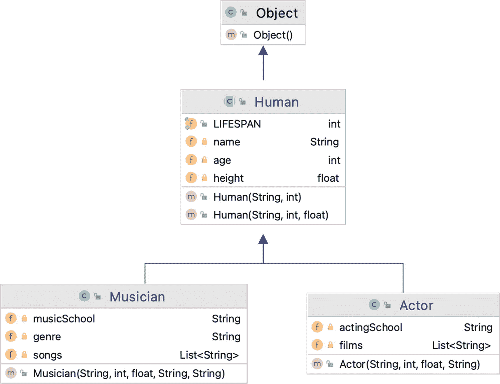

图 4-7

IntelliJ IDEA 生成的 UML 图

UML 图清楚地显示了每个类的成员，箭头指向超类。UML 图是设计组件层次结构和定义应用逻辑的有用工具。如果你想阅读更多关于它们和 UML 图的种类，你可以点击这里: [`https://www.uml-diagrams.org`](https://www.uml-diagrams.org) 。

在介绍了这么多关于类和如何创建对象的内容之后，我们需要介绍其他 Java 重要组件，它们可以用来创建更详细的对象。我们的`Human`类缺少很多属性，比如性别。对一个人的性别进行建模的字段只能包含一组固定值中的值。它曾经是两个，但因为我们生活在一个非常喜欢政治正确的勇敢的新世界，我们不能将性别的价值集限制为两个，所以我们将引入第三个，称为未指定的，用于替代一个人确定为什么。这意味着我们必须引入一个新的类来表示性别，这个类只能被实例化三次。对于一个典型的类来说，这很难做到，这也是为什么在 Java 版本中引入了`enums`的原因。

##### 枚举数

`enum`类型是一种特殊的类类型。它用于定义一个特殊类型的类，该类只能被实例化固定的次数。枚举声明将该枚举的所有实例组合在一起。它们都是常量。可以如清单 [4-30](#PC31) 所示定义`Gender`枚举。

```java
package com.apress.bgn.four.classes;

public enum Gender {
    FEMALE,
    MALE,
    UNSPECIFIED
}

Listing 4-30Gender Enum

```

枚举不能在外部实例化。枚举默认为`final`，因此不能扩展。还记得默认情况下 Java 中的每个类是如何隐式扩展类`Object`的吗？Java 中的每个枚举都隐式扩展了类`java.lang.Enum<E>`，这样做的时候，每个枚举实例都继承了在使用枚举编写代码时有用的特殊方法。

作为一个特殊类型的类，enum 可以有字段和构造函数**，它只能是私有的**，因为 enum 实例不能在外部创建。private 修饰符不是显式需要的，因为编译器知道该做什么。清单 [4-31](#PC32) 显示了通过添加一个整数字段和一个`String`字段实现的`Gender`枚举，整数字段将是每个性别的数字表示，而`String`字段将是文本表示。要访问枚举属性，需要 getters。

```java
package com.apress.bgn.four.classes;

public enum Gender {
    FEMALE(1, "f"),
    MALE(2, "m") ,
    UNSPECIFIED(3, "u");

    private int repr;
    private String descr;

    Gender(int repr, String descr) {
        this.repr = repr;
        this.descr = descr;
    }

    public int getRepr() {
        return repr;
    }

    public String getDescr() {
        return descr;
    }
}

Listing 4-31A More Complex Gender Enum

```

但是，什么会阻止我们声明 setters 和修改字段值呢？嗯，没什么。如果那是你需要做的，你可以做。**但这并不是一个好的做法。**

**枚举实例应该是常量。**所以一个正确的枚举设计不应该声明 setters，并确保字段的值永远不会因为声明它们而改变`final`。当我们这样做时，初始化字段的唯一方法是调用构造函数，因为构造函数不能从外部调用，所以数据的完整性得到了保证。清单 [4-32](#PC33) 中描述了一个良好的 enum 设计示例。

```java
package com.apress.bgn.four.classes;

public enum Gender {
    FEMALE(1, "f"),
    MALE(2, "m") ,
    UNSPECIFIED(3, "u");

    private final int repr;
    private final String descr;

    Gender(int repr, String descr) {
        this.repr = repr;
        this.descr = descr;
    }

    public int getRepr() {
        return repr;
    }
    public String getDescr() {
        return descr;
    }
}

Listing 4-32Proper Gender Enum

```

方法可以添加到枚举中，每个实例都可以重写它们。因此，如果我们将名为`comment()`的方法添加到`Gender`枚举中，每个实例都将继承它。但是实例可以覆盖它，如清单 [4-33](#PC34) 所示。

```java
package com.apress.bgn.four.classes;

public enum Gender {
    FEMALE(1, "f"),
    MALE(2, "m") ,
    UNSPECIFIED(3, "u"){
        @Override
        public String comment() {
            return "to be decided later: " + getRepr() + ", " + getDescr();
        }
    };

    private final int repr;
    private final String descr;

    Gender(int repr, String descr) {
        this.repr = repr;
        this.descr = descr;
    }

    public int getRepr() {
        return repr;
    }
    public String getDescr() {
        return descr;
    }

    public String comment() {
        return repr + ": " + descr;
    }
}

Listing 4-33Proper Gender Enum with Extra Method

```

这怎么可能呢？实例如何重写其类类型的方法？**嗯，这不**。`UNSPECIFIED`枚举实际上扩展了`Gender`类并覆盖了`comment()`方法。

这可以通过迭代枚举值并打印从返回对象运行时类型的`Object`类继承的`getClass()`方法返回的结果很容易地证明。为了获得一个枚举的所有实例，每个枚举都隐式扩展的类`java.lang.Enum<E` >提供了一个名为`values().`的方法

清单 [4-34](#PC35) 显示了这样做的代码及其输出。

```java
package com.apress.bgn.four.classes;

public class BasicHumanDemo {
   public static void main(String... args) {
       for (Gender value : Gender.values()) {
           System.out.println(value.getClass());
       }
   }
}
// Output expected in the console
// class com.apress.bgn.four.classes.Gender
// class com.apress.bgn.four.classes.Gender
// class com.apress.bgn.four.classes.Gender$1

Listing 4-34Code Sample Listing Enum Items Classes

```

注意为`UNSPECIFIED`元素打印的值。Gender$1 符号意味着编译器通过扩展原始的 enum 类并使用`UNSPECIFIED`元素声明中提供的方法覆盖 comment()方法来创建内部类。

在未来的例子中，我们也将使用枚举。只要记住，每当你需要将一个类的实现限制在固定数量的实例中，或者将相关的常数组合在一起，枚举就是你的工具。因为我们引入了枚举，我们的`Human`类现在可以有一个类型为`Gender`的字段，如清单 [4-35](#PC36) 所示。

```java
package com.apress.bgn.four.classes;

public abstract class Human {
    public static final int LIFESPAN = 100;
    protected String name;
    protected int age;
    protected float height;

    private Gender gender;

    public Human(String name, int age, Gender gender) {
        this.name = name;
        this.age = age;
        this.gender = gender;
    }

    public Human(String name, int age, float height, Gender gender) {
        this(name, age, gender);
        this.height = height;
    }

    // other code omitted

    public Gender getGender() {
        return gender;
    }

    public void setGender(Gender gender) {
        this.gender = gender;
    }
}

Listing 4-35Human Class with a Gender Field

```

在前面的章节中，**接口**被提到是用于创建对象的 Java 组件之一。是我们扩展这个主题的时候了。

#### 接口

【Java 面试最常见的一个问题是:接口和抽象类有什么区别？本节将为您提供该问题的最详细的答案。

一个**接口**不是一个类，但是它确实有助于创建类。接口是完全抽象的；它没有字段，只有抽象方法定义。我也喜欢称它们为*骷髅*。当一个类被声明实现一个接口时，除非这个类是抽象的，否则它必须为所有的框架方法提供具体的实现。

名称 skeleton method 在 Java 8+版本中非常重要，因为从这个版本开始，接口得到了丰富，使得`static`、`default`和`private`方法可以成为它们的一部分。

接口内部的框架方法是隐式的`public`和`abstract`，因为框架方法必须是抽象的，以强制类提供实现，并且必须是公共的，所以类实际上可以访问实现。在 Java 8 之前，接口中唯一有具体实现的方法是`static`方法。

在 Java 8 中，引入了接口中的**默认**方法，在 Java 9 中引入了接口中的**私有**方法。

无法实例化接口；它们没有构造函数。

没有声明方法定义的接口被称为**标记**接口，用于标记特定用途的类。最著名的 Java 标记接口是`java.io.Serializable`，它标记可以序列化的对象，这样它们的状态就可以保存到二进制文件或另一个数据源，并通过网络发送出去，以便进行反序列化和使用。接口可以在自己的文件中声明为顶级组件，也可以嵌套在另一个组件中。接口有两种:*普通*接口和**注解**。

抽象类和接口之间的区别，以及何时应该使用其中的一个，在**继承**的上下文中变得相关。

Java 只支持单一继承。这意味着一个类只能有一个超类。

单一继承似乎是一种限制，但是，请考虑下面的例子。让我们修改前面的层次结构，想象一个名为`Performer`的类，它应该扩展音乐家和演员类。如果你需要一个可以被这个类模仿的真实的人，想想大卫·杜楚尼(他是一个演员和音乐家)。

在图 [4-8](#Fig8) 中，描述了前面提到的类层次结构。

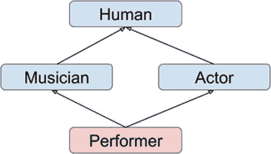

图 4-8

钻石等级体系

上图中的层次结构引入了一种叫做菱形问题的东西，这个名字显然是受了类之间的关系所形成的形状的启发。设计到底有什么问题？显而易见，如果`Musician`和`Actor`都扩展了`Human`并继承了它的所有成员，那么`Performer`会继承什么，从哪里继承？它显然不能两次继承`Human`的成员，这将使这个类变得无用和无效。我们如何辨别具有相同签名的方法呢？那么 Java 中的解决方案是什么呢？正如您可能想象的那样，考虑到本节的重点:接口。*(算是吧，大部分时候是接口的组合，需要一个名为 composition 的编程概念。)*

要做的是将类`Musician`和`Actor`中的方法转换成方法框架，并将那些**类**转换成**接口**。来自`Musician`的行为将被移到一个名为`Guitarist`的类中，它将扩展`Human`类并实现`Musician`接口。对于`Actor`类，可以做一些类似的事情，但是我们将把它作为一个练习留给你。图 [4-9](#Fig9) 中的层次结构提供了一些帮助。

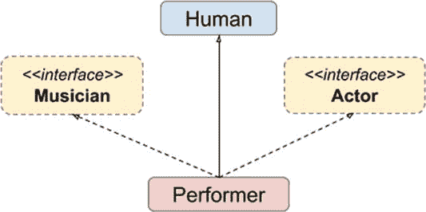

图 4-9

具有执行者类接口的 Java 层次结构

因此,`Musician`接口只包含映射音乐家所做事情的方法框架。它没有详细描述如何建模。对于`Actor`接口也是如此。在清单 [4-36](#PC37) 中，你可以看到两个接口的主体。

```java
//Musician.java
package com.apress.bgn.four.interfaces;
import java.util.List;

public interface Musician {
    String getMusicSchool();
    void setMusicSchool(String musicSchool);
    List<String> getSongs();
    void setSongs(List<String> songs);
    String getGenre();
    void setGenre(String genre);
}

//Actor.java
package com.apress.bgn.four.interfaces;
import java.util.List;

public interface Actor {
    String getActingSchool();
    void setActingSchool(String actingSchool);
    List<String> getFilms();
    void setFilms(List<String> films);
    void addFilm(String filmName);
}

Listing 4-36Musician and Actor interfaces

```

如您所见，字段已经被删除，因为它们不能成为接口的一部分，剩下的就是方法框架。清单 [4-37](#PC38) 中描述了`Performer`类。

```java
package com.apress.bgn.four.interfaces;

import com.apress.bgn.four.classes.Gender;
import com.apress.bgn.four.classes.Human;

import java.util.List;

public class Performer extends Human implements Musician, Actor {

    // fields specific to musician
    private String musicSchool;
    private String genre;
    private List<String> songs;

    // fields specific to actor
    private String actingSchool;
    private List<String> films;

    public Performer(String name, int age, float height, Gender gender) {
        super(name, age, height, gender);
    }

    // from Human
    @Override
    public int getTimeToLive() {
        return (LIFESPAN - getAge()) / 2;
    }

    // from Musician
    public String getMusicSchool() {
        return musicSchool;
    }

    public void setMusicSchool(String musicSchool) {
        this.musicSchool = musicSchool;
    }

    // from Actor
    public String getActingSchool() {
        return actingSchool;
    }

    public void setActingSchool(String actingSchool) {
        this.actingSchool = actingSchool;
    }

    // other methods omitted
}

Listing 4-37Performer Class Implementing Two Interfaces

```

从这个例子中你应该明白，在某种程度上使用接口和多重继承在 Java 中是可能的，并且**类只扩展一个类，可以实现一个或多个接口**。

继承也适用于接口。例如，`Musician`和`Actor`接口都可以扩展一个名为`Artist`的接口，该接口包含两者通用的行为模板。例如，我们可以将音乐学校和表演学校合并成一个通用学校，并将它的 setters 和 getters 定义为方法框架。清单 [4-38](#PC39) 中描述了`Artist`接口以及`Musician`。

```java
package com.apress.bgn.four.interfaces;

// Artist.java
public interface Artist {
    String getSchool();
    void setSchool(String school);
}

// Musician.java
import java.util.List;

public interface Musician extends Artist {
    List<String> getSongs();
    void setSongs(List<String> songs);
    String getGenre();
    void setGenre(String genre);
}

Listing 4-38Artist and Musician Interface

s

```

希望您理解了多重继承的概念，以及在设计您的应用时什么时候使用类，什么时候使用接口是合适的，因为现在是时候履行在本节开始时所做的承诺，并列出抽象类和接口之间的区别了。您可以在表 [4-1](#Tab1) 中找到它们。

表 4-1

Java 中抽象类和接口的区别

<colgroup><col class="tcol1 align-left"> <col class="tcol2 align-left"></colgroup> 
| 

抽象类

 | 

连接

 |
| --- | --- |
| 可以有非抽象的方法。 | 只能有静态、抽象、默认和私有方法。 |
| 单一继承:一个类只能扩展一个类。 | 多重继承:一个类可以实现多个接口。此外，一个接口可以扩展一个或多个接口。 |
| 可以有最终的、非最终的、静态的和非静态的变量。 | 只能有静态和最终字段。 |
| 用**抽象类**声明。 | 用**接口**声明。 |
| 可以使用关键字**扩展另一个类**，并使用关键字**实现接口**。 | 只能使用关键字**扩展**来扩展其他接口(一个或多个)。 |
| 可以有非抽象、包私有(默认)、受保护或私有成员。 | 默认情况下，所有成员都是抽象的和公共的。(从 Java 9 开始的默认和私有方法除外。) |
| 如果一个类有一个抽象方法，它必须声明自己是抽象的。 | (无对应)。 |

##### 接口中的默认方法

接口的一个问题是，如果您修改它们的主体来添加新方法，代码将停止编译。要使它编译，您必须在实现该接口的每个类中为新添加的接口方法添加一个具体的实现。这是开发者多年来的痛。接口是一个契约，它保证了类的行为方式。当在您的项目中使用第三方库时，您可以通过设计您的代码来遵守这些约定。当切换到一个新版本的库时，如果契约改变，您的代码将不再编译。

这种情况和苹果把他们电脑和手机的充电口从一个版本换到另一个版本很像。如果你买了新的 Mac，试着用旧的充电器，那就不合适了。

当然，一个解决方案是在一个新的接口中声明新的方法，然后创建实现新的和旧的接口的新类(这被称为组合，因为两个接口被组合来表示一个契约)。一个接口暴露出来的方法组成了一个 API(应用编程接口)，开发应用的时候，目的就是要设计出稳定的 API。这个规则用一个叫做开闭原则的编程原则来描述。这是 5 个坚实的编程原则之一。这个原则声明你应该能够扩展一个类而不用修改它。因此，修改一个类实现的接口也需要修改这个类。修改接口往往会导致违反这个原则。

除了前面提到的接口组合，在 Java 8 中引入了一个解决方案:**默认方法**。从 Java 8 开始，具有完整实现的方法可以在接口中声明，只要它们是使用`default`关键字声明的。默认方法是隐式公共的。它们的主要目的是修改 API 以允许新的实现覆盖它们，但不破坏现有的实现。

让我们考虑一下`Artist`接口。任何艺术家都应该能创作出一些东西，对吗？所以他们应该有创造的天性。鉴于我们生活的这个世界，我不会说出名字，但我们的一些艺术家实际上是这个行业的产物，他们自己并没有创造力。在我们决定了图 [4-10](#Fig10) 中描绘的等级之后，我们意识到我们应该有一种方法来告诉我们一个艺术家是否有创造性。

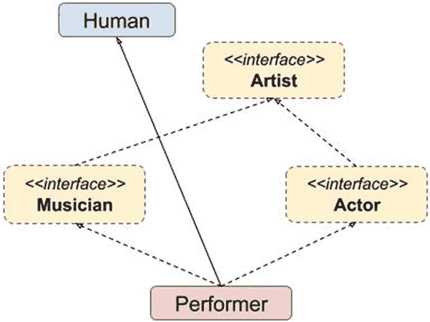

图 4-10

具有更多执行者类接口的 Java 层次结构

如果我们向`Artist`接口添加一个新的抽象方法，`Performer`类将无法编译。IntelliJ IDEA 将通过用红色显示很多东西来清楚地表明我们的应用不再工作了，如图 [4-11](#Fig11) 所示。

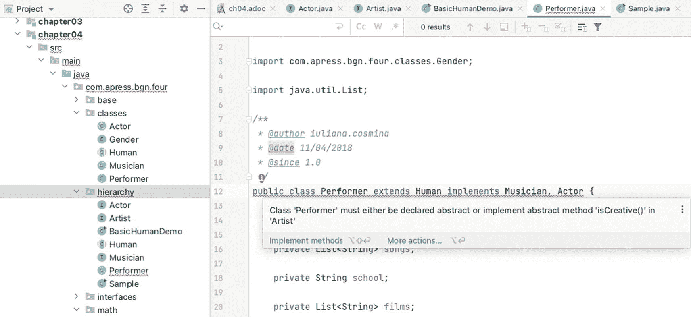

图 4-11

由于接口中的新方法，Java 破坏了层次结构

我们看到的编译器错误是由我们决定向`Artist`接口添加一个名为`isCreative`的新抽象方法引起的，如果您将鼠标悬停在类声明上，就可以看到原因。清单 [4-39](#PC40) 描述了破解代码的抽象方法。

```java
package com.apress.bgn.four.hierarchy;

public interface Artist {
    String getSchool();

    void setSchool(String school);

    boolean isCreative();
}

Listing 4-39New Abstract Method Added to the Artist Interface

```

为了消除编译错误，我们将把`isCreative`抽象方法转换成返回`true`的`default`方法，因为每个艺术家都应该有创造力。默认方法在默认情况下是公共的，因此可以在实现声明该方法的接口的类型的每个对象上调用它们。清单 [4-40](#PC41) 描述了默认方法的主体。

```java
package com.apress.bgn.four.hierarchy;

public interface Artist {
    String getSchool();

    void setSchool(String school);

    default boolean isCreative(){
        return true;
    }
}

Listing 4-40New default Method Added to the Artist Interface

```

现在代码应该可以再次编译了。默认方法非常实用，因为它们允许修改由接口表示的契约，而无需修改实现该接口的现有类。这将确保为该接口的旧版本编写的代码的二进制兼容性。

实现包含默认方法的接口的类可以使用现有的默认实现，或者为默认方法提供新的实现(可以重写它们)。为了说明这一点，清单 [4-41](#PC42) 中显示了一个名为`MiliVanili`的类，它为`Artist`接口中的默认方法提供了一个新的实现。

```java
package com.apress.bgn.four.hierarchy;

import java.util.List;

public class MiliVanili implements Artist {

    @Override
    public boolean isCreative() {
        return false; // dooh!
    }

    // other code omitted
}

Listing 4-41Default Method Being Overriden in Class Implementing the Artist Interface

```

可以编写扩展其他接口的接口来执行以下任何操作(为了更清楚起见，扩展的接口将被称为超级接口):

*   声明它们自己的抽象方法和默认方法

*   将超接口中的默认方法重新声明为抽象方法，强制扩展该接口的类提供实现

*   从超接口重新定义默认方法

*   声明一个默认方法，该方法为超接口中的抽象方法提供实现

    对于一本绝对的 Java 初学者书籍来说，提供所有这些场景的代码样本有点太多了。如果您对代码看起来像什么以及测试这些断言的有效性感兴趣，请查看`com.ampress.bgn.four.interfaces.extensions`包的内容。

##### 接口中的静态方法和常数

在 Java 版本 1 中，接口只能包含抽象方法和静态常量。自版本 1 以来，接口发生了很大变化，最重要的变化是对`default`和`private`方法的支持。

常量，或者一旦初始化就不会改变的变量，不需要实现，所以允许开发人员在接口体中声明它们是有意义的，对吗？使用枚举也可以做到这一点，但是有时您可能希望将相关的组件放在一起。在前面的例子中，`Human`类中声明了一个`LIFESPAN`常量。由于任何实现`Artist`的类都可能需要`LIFESPAN`来进行某种计算，我们可以在`Artist`接口中移动这个常量，并在任何类中使用它，如清单 [4-42](#PC43) 所示。

```java
// Artist.java
package com.apress.bgn.four.hierarchy;

public interface Artist {
    public static final int LIFESPAN = 100;

    // other code omitted
}

// Performer.java
package com.apress.bgn.four.hierarchy;

public class Performer extends Human implements Musician, Actor {

    @Override
    public int getTimeToLive() {
        return (LIFESPAN - getAge()) / 2;
    }

    // other code omitted
}

Listing 4-42The Constant LIFESPAN in the Artist Interface

```

当在接口中声明常量时，三个访问器`public static final`是多余的，因为它们是隐含的。对每种情况的解释都很简单:

*   接口不能有可变字段，所以默认情况下它们必须是`final`。

*   因为接口不能被实例化；它们不能有将成为实例属性的字段，所以它们必须是`static`。

*   因为接口体中的任何东西都必须是实现类可访问的，所以它们必须是`public.`

至于接口中的静态方法，它们通常是特定于接口所属层次结构中某些操作的实用方法。让我们添加一个静态方法，该方法检查作为参数提供的名称是否大写，如果不是，就将其大写。清单 [4-43](#PC44) 中描述了代码，方法`capitalize`在`Artist`接口中声明并在`Performer`类中使用。

```java
// Artist.java
package com.apress.bgn.four.hierarchy;

public interface Artist {

    public static String capitalize(String name){
        Character c = name.charAt(0);
        if(Character.isLowerCase(c)) {
            Character upperC = Character.toUpperCase(c);
            name.replace(c, upperC);
        }
        return name;
    }

    // other code omitted
}

// Performer.java
package com.apress.bgn.four.hierarchy;

public class Performer extends Human implements Musician, Actor {

    public String getCapitalizedName() {
        return Artist.capitalize(this.name);
    }

    // other code omitted
}

Listing 4-43Public Static Method in Interface

```

在 Java 8 中，由于前面提到的原因，任何带有未声明为`default`的主体的方法都必须声明为 public 和 static。如果`default`或`static`方法共享大量代码，那么`default`或静态`method`可以将代码分组，让其他人调用，对吗？唯一的问题出现在需要代码私有的时候。这在 Java 8 中是不可能的，因为默认情况下，接口主体中的所有内容都是`public`，但是在 Java 9 中这变成了可能。

##### 接口中的私有方法

从 Java 9 开始，引入了对接口中的`private`和`private static`方法的支持。这意味着通过调用一个`private`方法，由默认的`isCreative()`方法执行的动作可以被修改，以记录对返回值的解释，如清单 [4-44](#PC45) 所示。

```java
package com.apress.bgn.four.hierarchy;

public interface Artist {
    String getSchool();

    void setSchool(String school);

    default boolean isCreative(){
        explain();
        return true;
    }

    private void explain(){
        System.out.println("A true artist has a creative nature.");
    }
}

Listing 4-44New private Method Added to the Artist Interface

```

对于静态方法也可以这样做，如果有一段代码值得私有，就在一个`private static`方法中声明它。

当在一个具体的项目中进行开发时，你会发现自己在使用类、接口、枚举等等。如何设计和组织代码取决于你自己。只要确保避免重复，并保持它的干净、非耦合和可测试性。

##### 记录

Java `record`是一种特殊类型的类，具有清晰的语法来定义不可变的纯数据类。Java 编译器获取记录的代码，并生成构造函数、获取函数和其他专门的方法，如`toString()`、`hashCode(),`和`equals()`。

`hashCode()`和`equals()`专用方法在`Object`类中定义，因此它们在每个 Java 类中都被隐式定义。它们对于建立实例的身份非常重要，将在**章节** [** 5 **](05.html) “集合”一节中介绍。

在 C#、Scala 或 Kotlin 等其他编程语言中引入类似类型的结构很久之后，Java 记录作为预览功能在 JDK 14 中引入。Java 开发人员通过使用 Lombok 等库避免了编写大量样板代码的麻烦。Lombok 已经在本章的**封装数据**一节中提到，其中也列出了使用它的一些缺点。

Lombok 需要用特殊的注释来注释类，这些注释告诉它的注释处理器在编译时生成所需的字节码。它使用 Java 记录生成现在支持的所有组件。

清单 [4-45](#PC46) 展示了如何使用 Lombok 编写`Human`类。

```java
package com.apress.bgn.four.lombok;

import com.apress.bgn.four.classes.Gender;
import lombok.*;

@NoArgsConstructor
@AllArgsConstructor
@RequiredArgsConstructor
@ToString
@EqualsAndHashCode
public class Human {
    @Getter @Setter
    @NonNull
    private String name;

    @Getter @Setter
    @NonNull
    private int age;

    @Getter @Setter
    private float height;

    @Getter @Setter
    private Gender gender;
}

Listing 4-45Human Class: the Lombok Version

```

Lombok 的另一个问题是它在使用模块的 Java 项目中变得不可预测。在编译时操作代码以注入额外的功能是一项敏感的操作，需要访问 JDK 内部，出于安全原因，可能不会导出这些内容。例如，在编写本节时，使用 Lombok 编译项目不起作用，因为 Lombok 需要从不导出`com.sun.tools.javac.processing`包的模块`jdk.compiler`访问类`com.sun.tools.javac.processing.JavacProcessingEnvironment`。

如果没有 Lombok，清单 [4-45](#PC46) 中的类将会有更多的行，因为代码片段中的所有注释本质上都替换了开发人员本来应该编写的方法:

*   `@NoArgsConstructor`告诉 Lombok 为`Human`类的默认无参数构造函数生成字节码。

*   `@AllArgsConstructor`告诉 Lombok 为一个构造函数生成字节码，这个构造函数需要为`Human`类的每个字段提供一个参数。

*   `@RequiredArgsConstructor`告诉 Lombok 为一个构造函数生成字节码，该构造函数要求所有必需字段(用`@NotNull`标注的字段)都有一个参数。

*   `@ToString`告诉 Lombok 为`toString()`方法生成字节码。该方法的实现由`Lombok`基于类中的所有字段决定。

*   `@EqualsAndHashCode`告诉 Lombok 为`equals()`和`hashCode()`方法生成字节码。这些方法的实现由`Lombok`基于类中的所有字段决定。

随着记录的引入，只要项目在 JDK 15 上编译和运行，就不再需要 Lombok 了。你不需要你的实例是不可变的。产生的类是不可变的纯数据类，所以没有设置器，但是在勇敢的反应性新世界中，拥有不可变的记录是必须的。清单 [4-46](#PC47) 显示了`Human`类的`record`实现，以及实例化`Human`所需的代码。

```java
// Human.java
package com.apress.bgn.four.records;

import com.apress.bgn.four.classes.Gender;

public record Human(String name, int age, float height, Gender gender) { }

// RecordDemo.java
package com.apress.bgn.four.records;

import com.apress.bgn.four.classes.Gender;

public class RecordDemo {

    public static void main(String... args) {
        Human john = new Human("John Mayer", 44, 1.9f, Gender.MALE);

        System.out.println("John as string: " + john);
        System.out.println("John's hashCode: " + john.hashCode());
        System.out.println("John's name: " + john.name());
    }
}

Listing 4-46Simple Human Record and Class Where Used

```

如您所见，记录可以用与类相同的方式进行实例化，方法是使用`new`关键字调用构造函数。毕竟，他们只是另一种类型的类。此外，由于不需要 setters，因为对象是不可变的，getters 也没有多大意义。因此，为了访问属性值，会生成与字段同名的方法来返回字段值。

这可以通过使用 IntelliJ IDEA 查看生成的`Human.class`文件中的字节码来证明。只需在`chapter04/target/classes`目录中查找这个文件，然后选择它，并从菜单中选择**查看➤显示字节码**。应该会弹出一个窗口，内容与图 [4-12](#Fig12) 所示非常相似。


图 4-12

人类记录的字节码

从字节码中，我们可以发现关于记录的另一件重要的事情:字节码中显示的类是`final`，因此记录不能被扩展。同样，所有记录类都隐式扩展了类`java.lang.Record`。

不可能创建子记录。

运行`RecordDemo`类中的`main(..)`方法会产生以下结果:

```java
John as string: Human[name=John Mayer, age=44, height=1.9, gender=MALE]
John's hashCode: -1637990649
John's name: John Mayer

```

记录的实现已经足够好了。`john`实例的属性值易于阅读和理解。

可以定制记录。没有什么可以阻止您为`toString()`、`equals(),hashCode()`方法提供自定义实现，并在记录体中提供各种构造函数，就像您为一个类所做的那样。唯一的问题是构造函数必须使用`this`关键字调用记录的默认构造函数。在清单 [4-47](#PC49) 中，您可以看到一个构造函数被添加，它只需要名字和年龄。

```java
package com.apress.bgn.four.records;

public record Human(String name, int age, Float height, Gender gender) {
    public Human(String name, int age) {
        this(name, age, null, null);
    }
}

Listing 4-47Simple Human Record with an Additional Constructor

```

由于为记录生成的默认构造函数和其他方法依赖于记录的参数，因此不能在记录体中声明额外的字段。但是，支持静态变量和方法。图 [4-13](#Fig13) 描绘了一个记录，它有一个额外的常量和一个在其主体中声明的字段，编辑器不喜欢后者。

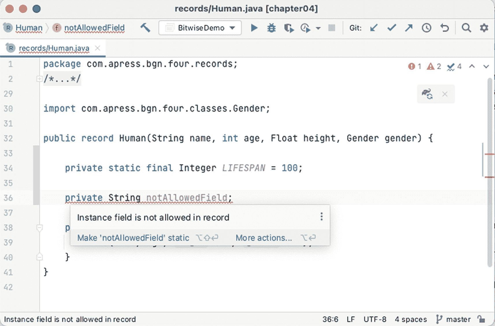

图 4-13

用常数和字段记录

当数据不变性是一个需求时，记录是非常实用的，大多数时候是这样的(例如，用于在软件应用子系统之间传输数据的 d to 或数据传输对象)。没有记录也可以，但是需要开发者付出很多努力。这是像我这样的老派开发者在任何必要的时候都会做的努力，但是你们年轻人不知道现在有多容易！

##### 密封类

密封类是 JDK 15 中的预览功能，也是 JDK 16 中的预览功能。在写这一章的时候，Java 17 的特性列表仍然很小，而且没有提到密封类。但是希望它们能成为 Java 17 的官方特性，所以它们值得在本书中提及。

开发人员面临的一个常见问题是为他们的类和接口选择范围修饰符。安全性始终是一个问题，对于一些项目来说，当需要扩展类时，使它们成为公共的或受保护的是有风险的。这就是`sealed`修改器及其整个家族应该派上用场的地方。它允许`seal`一个类来防止它被扩展，除了一些使用`permits`关键字声明的子类。当然，当新的子类被添加到项目中时，超类似乎注定要被更新很多次，但是拥有一个更安全的应用是一个可以接受的折衷。考虑到这一点，让我们密封我们的`Human`类的一个版本，只允许`Performer`类扩展它。清单 [4-48](#PC50) 描述了这两个类。

```java
// Human.java
package com.apress.bgn.four.sealed;

import com.apress.bgn.four.classes.Gender;

// Human.java
public sealed class Human
        permits Performer {
    protected String name;

    protected int age;

    protected float height;

    // other code omitted
}

// Performer.java
package com.apress.bgn.four.sealed;

import com.apress.bgn.four.classes.Gender;

public final class Performer extends Human {
    // other code omitted
}

Listing 4-48Sealed Class and Allowed Subclass

```

如果扩展类是在同一个源文件中声明的，就不需要在关键字`permits`后面列出它们。如果文件外部没有扩展类，那么可以完全省略`permits`关键字。

允许扩展密封类的类本身应该是密封的或最终的。如果我们需要这些类中的一个允许被未知类扩展，`non-sealed`修饰符允许这样做。清单 [4-49](#PC51) 显示了声明为`non-sealed`的类`Engineer`；这个类必须从`Human`类添加到`permits`指令的列表中。

```java
package com.apress.bgn.four.sealed;

import com.apress.bgn.four.classes.Gender;

public non-sealed class  Engineer extends Human {
    public Engineer(String name, int age, Gender gender) {
        super(name, age, gender);
    }

    public Engineer(String name, int age, float height, Gender gender) {
        super(name, age, height, gender);
    }
}

Listing 4-49Sealed Class and Allowed Subclass

```

`sealed`修饰符也可以应用于接口。关键字`permits`指定了允许实现密封接口的类。

你可能希望`permits`关键字也支持扩展密封接口的接口，但是在 JDK 的当前版本中没有。*(愿意的话可以试试。)*

同样的规则也适用于密封接口:实现密封接口的类应该是密封的、非密封的或最终的。

清单 4-50 显示了密封的`Mammal`接口，它是由密封的`Human`类实现的。

```java
package com.apress.bgn.four.sealed;

public sealed interface Mammal permits Human {

}

public sealed class Human
        implements Mammal
        permits Performer, Engineer {
    // rest of the code ommitted
}

Listing 4-50sealed Mammal Interface and the Sealed Human Class

```

密封类和接口的一个限制是任何子类和实现类都需要在同一个模块中。

另外，如果不明显的话，`permits`关键字之后出现的任何类都必须扩展密封类/实现密封接口。如果在`permits`关键字之后指定了一个类，并且没有扩展密封的类/实现，编译器不会喜欢这个密封的接口。

密封类对`records`有好处，因为记录默认是最终的。

##### 隐藏类

对于致力于开发 Hibernate 或 Spring 等框架的开发人员来说，隐藏类是一个有趣的特性。它允许他们创建不能被其他类的字节码直接使用的类，因为它们注定只能被框架内部使用。内部类应该用`hidden`修饰符声明，并且它们不应该是可发现的。它们可以由框架动态生成，具有较短的生命周期，并在不再需要时被丢弃，这将提高在 JVM 上运行的应用的性能。

在写这一章的时候，隐藏类更多的是一个概念而不是现实。

##### 注释类型

一个`annotation`的定义类似于一个接口；不同之处在于接口关键字前面有一个`at`符号(`@`)。注释类型是接口的一种形式，大多数时候用作标记(看看前面的 Lombok 例子)。例如，您可能已经注意到了`@Override`注释。当类扩展类或实现接口时，这个注释被放在由智能 ide 自动生成的方法上。清单 [4-51](#PC53) 中的代码片段描述了它在 JDK 的声明:

```java
package java.lang;

import java.lang.annotation.*;

/**
 * documentation omitted
 */
@Target(ElementType.METHOD)
@Retention(RetentionPolicy.SOURCE)
public @interface Override { }

Listing 4-51The JDK @Override Declaration

```

不声明任何属性的注释称为`marker`或`informative`注释。它们只需要通知应用中的其他类，或者开发人员它们所在的组件的用途。它们不是强制性的，没有它们代码也能编译。

在 Java 8 中，引入了名为`@FunctionalInterface`的注释。这个注释被放在所有只包含一个抽象方法的 Java 接口上，并且可以在 **lambda 表达式**中使用。除了单一的抽象方法，一个接口可以包含常量和其他静态成员。

#### λ表达式

Java 8 中也引入了 Lambda 表达式，它们代表了一种从 Groovy 和 Ruby 等语言借鉴来的简洁实用的代码编写方式。清单 [4-52](#PC54) 描述了`@FunctionalInterface`声明。

```java
package java.lang;

import java.lang.annotation.*;

/**
 * documentation omitted
 */
@Documented
@Retention(RetentionPolicy.RUNTIME)
@Target(ElementType.TYPE)
public @interface FunctionalInterface {}

Listing 4-52The JDK @FunctionalInterface Declaration

```

**函数接口**是声明单个抽象方法的接口。因此，该方法的实现可以当场提供，而不需要创建一个类来定义具体的实现。让我们想象以下场景:我们创建一个名为`Operation`的接口，它包含一个方法。我们可以通过创建一个名为`Addition`的类来为这个接口提供一个实现，或者我们可以使用一个 lambda 表达式当场实现它。清单 [4-53](#PC55) 描述了`Operation`接口、`Addition`类和一个名为`OperationDemo`的类，显示了在`main(..)`方法中声明和使用的现场实现。

```java
package com.apress.bgn.four.lambda;

@FunctionalInterface
interface Operation {
    int execute(int a, int b);
}

class Addition  implements Operation {
    @Override
    public int execute(int a, int b) {
        return a + b;
    }
}

public class OperationDemo {
    public static void main(String... args) {
        // using the Addition class
        Addition addition = new Addition();
        int result = addition.execute(2,5);
        System.out.println("Result is " + result);

        // implementation on the spot using a Lambda Expression
        Operation addition2 = (a, b) -> a + b;
        int result2 = addition2.execute(2, 5);
        System.out.println("Lambda Result is " + result2);
    }
}

Listing 4-53Explicit Interface Implementation Compared to Lambda Expression

```

通过使用 lambda 表达式，不再需要类`Addition`，这导致可读代码越来越少。Lambda 表达式可以用于很多事情，我们将在本书后面更多地讨论它们，只要使用它们可以以更实用的方式编写代码。

#### 例外

异常是特殊的 Java 类，用于在程序执行期间拦截特殊的意外情况，以便开发人员可以实现正确的操作过程。这些类按照图 [4-14](#Fig14) 所示的层次结构进行组织。`Throwable`是类层次结构的根类，用于表示 Java 应用中的意外情况。

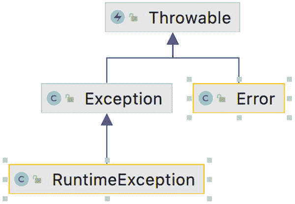

图 4-14

Java 异常层次结构

Java 应用中的异常情况可能由于多种原因而发生:

*   编写代码时的人为错误

*   硬件原因(试图从损坏的数据磁盘读取文件)

*   缺少资源(试图读取不存在的文件)

*   还有更多。

    草率的开发人员，当有疑问时，倾向于编写总是能捕捉到`Throwable`的代码。显然你应该尽量避免这种情况，因为类`Error`是用来通知开发者系统无法恢复的情况已经发生，并且是`Throwable`的子类。

让我们从一个简单的例子开始。在清单 [4-54](#PC56) 中，我们定义了一个调用自己的方法(它的技术名称是`recursive`)，但是我们会把它设计得很糟糕，永远调用自己，导致 JVM 耗尽内存。

```java
package com.apress.bgn.four.exceptions;

/**
 * Created by iuliana.cosmina on 29/03/2021
 */
public class ExceptionsDemo {
    // bad method
    static int rec(int i){
        return rec(i*i);
    }
    public static void main(String... args) {
        rec(1000);
        System.out.println("ALL DONE.");
    }
}

Listing 4-54Bad Recursive Method

```

如果我们运行`ExceptionsDemo`类，那么*全部完成*不会被打印出来。相反，程序将通过抛出一个`StackOverflowError`异常结束，并提到问题所在的行(在我们的例子中是递归方法调用自身的行)。

```java
Exception in thread "main" java.lang.StackOverflowError
at chapter.four/com.apress.bgn.four.ex.ExceptionsDemo.recExceptionsDemo.java:7
at chapter.four/com.apress.bgn.four.ex.ExceptionsDemo.recExceptionsDemo.java:7
...

```

`StackOverflowError`间接是`Error`的子类，显然是由被调用的有缺陷的递归方法引起的。我们可以修改代码，处理这种异常情况，并执行接下来必须执行的任何事情，如清单 [4-55](#PC58) 所示。

```java
package com.apress.bgn.four.exceptions;
public class ExceptionsDemo {
    // other code omitted
    public static void main(String... args) {
        try {
            rec(1000);
        } catch (Throwable r) { }
        System.out.println("ALL DONE.");
    }
}

Listing 4-55Another Bad Recursive Method

```

在控制台中，只打印出 *ALL DONE* 消息，没有错误的痕迹。这是意料之中的，因为我们发现了它，并决定不发表任何有关它的信息。

这也是一种不好的做法，叫做**异常吞咽**，千万不要这样做！

此外，系统不应该恢复，因为抛出`Error`后的任何操作结果都是不可靠的。

这就是为什么，抓一个`Throwable`是很不好的做法！

`Exception`类是所有可以被捕获和处理的异常的超类，系统可以从中恢复。任何不是`RuntimeException`的子类的`Exception`类的子类都是**检查异常**。这些类型的异常在编译时是已知的，因为它们是方法声明的一部分。任何被声明为抛出检查异常的方法，当在代码中使用时，要么强制进一步传播异常，要么要求开发人员编写代码来处理异常。

`RuntimeException`类是在程序执行过程中抛出的异常的超类，所以在编写代码时它们被抛出的可能性是未知的。考虑清单 [4-56](#PC59) 中的代码示例。

```java
package com.apress.bgn.four.exceptions;

import com.apress.bgn.four.hierarchy.Performer;

public class AnotherExceptionsDemo {
    public static void main(String... args){
        Performer p = PerformerGenerator.get("John");

        System.out.println("TTL: " + p.getTimeToLive());
    }
}

Listing 4-56Code Sample That Might Throw an Exception

```

假设我们不能访问`PerformerGenerator`类的代码，所以我们看不到它的代码。我们只知道用名字调用`get(..)`方法应该返回一个`Performer`实例。因此，我们编写了前面的代码，并尝试打印表演者的生存时间。如果由于`get("John")`调用返回空值，变量`p`实际上没有用正确的对象初始化，会发生什么？

下一段代码描述了结果:

```java
Exception in thread "main" java.lang.NullPointerException:
 Cannot invoke "com.apress.bgn.four.hierarchy.Performer.getTimeToLive()" because "p" is null at com.apress.bgn.four.exceptions.AnotherExceptionsDemo.main(AnotherExceptionsDemo.java:39)

```

正如您所看到的，异常消息告诉您什么是错误的，这是非常明确的。它实际上比这本书的前一版更明确。更精确的 NullPointerExceptions 是 Java 17 的一个特性。

但是作为聪明的开发者(或者有点偏执)，我们为这种情况做好了准备。根据应用的要求，我们可以做以下三件事情中的任何一件。

**1。捕捉异常并打印一条适当的消息**并退出应用。使用 **try/catch** 块来捕获异常。语法非常简单，行为可以解释如下:JVM 试图执行 **try** 块中的语句；如果抛出的异常与 **catch** 块声明中的类型匹配，则执行该块中的代码。

当没有一个`Performer`实例就无法执行剩余代码时，推荐使用这种方法，如清单 [4-57](#PC61) 所示。

```java
package com.apress.bgn.four.exceptions;

import com.apress.bgn.four.hierarchy.Performer;

public class AnotherExceptionsDemo {
    public static void main(String... args){
        Performer p = PerformerGenerator.get("John2");

        try {
            System.out.println("TTL: " + p.getTimeToLive());
        } catch (Exception e) {
            System.out.println("The performer was not initialised properly because of: " + e.getMessage() );
        }
    }
}

Listing 4-57Code Sample That Might Throw an Exception

```

这里抛出的异常属于类型`NullPointerException`，一个扩展`RuntimeException`的类，所以 **try/catch** 块不是强制的。这种类型的异常被称为**未检查异常**，因为开发人员没有义务检查它们。

`NullPointerException`是 Java 初学者非常纠结的例外类型，因为他们没有足够好的“偏执狂意识”,在使用之前总是测试未知来源的对象。

**2。抛出适当的异常类型**。当有不同的类调用有问题的代码时，这是合适的，并且该类将适当地处理异常，如清单 [4-58](#PC62) 所示。

```java
// ExtraCallerExceptionsDemo.java
package com.apress.bgn.four.exceptions;

import com.apress.bgn.four.hierarchy.Performer;

class Caller {

    public void printTTL(String name) throws EmptyPerformerException   { //   thrown exception declaration
        try {
            Performer p = PerformerGenerator.get(name);
            System.out.println("TTL: " + p.getTimeToLive());
        } catch (Exception e) {
            throw new EmptyPerformerException("There is no performer named " + name, e); // wrapping happens here
        }
    }
}

public class ExtraCallerExceptionsDemo {

    public static void main(String... args){
        Caller caller = new Caller();
        try {
            caller.printTTL("John2");
        } catch (EmptyPerformerException  e) {
            System.out.println(e.getMessage());
        }
    }
}

//  EmptyPerformerException.java
package com.apress.bgn.four.exceptions;

public class EmptyPerformerException extends Exception {

    public EmptyPerformerException(String message, Throwable cause) {
        super(message, cause);
    }
}

Listing 4-58Code Sample That Wraps the Exception Into a Custom Exception Type

```

注意这个`EmptyPerformerException`类。这是一个简单的自定义类，它扩展了`java.lang.Exception`类，使其成为一个可检查的异常。它们被声明为由方法显式抛出，正如您在代码的第一个粗体行中看到的那样。在这种情况下，当调用该方法时，编译器将强制开发人员处理该异常或将其向前抛出。如果在没有`throws EmptyPerformerException`片段的情况下声明`printTTL(..)`方法，将会抛出一个编译时错误，并且代码不会被执行。IntelliJ IDEA 是一个非常聪明的编辑器，使用 JVM 编译器来验证你的代码，它会用红线下划线来通知你代码中有什么地方不正常。这种情况如图 [4-15](#Fig15) 所示，其中`throws EmptyPerformerException`被注释以显示编译器完全不同意这种情况。

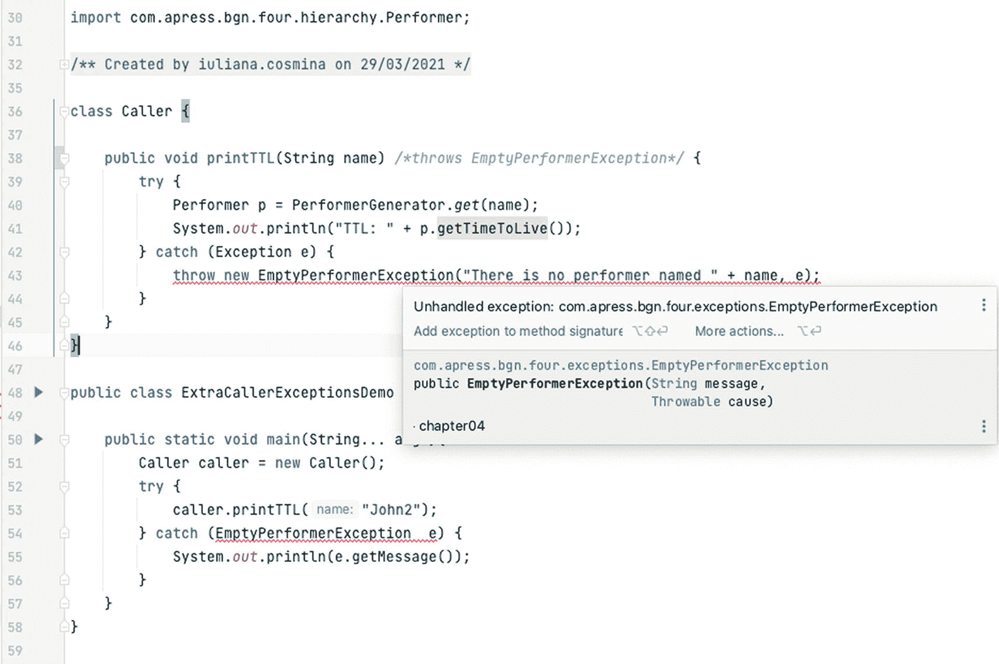

图 4-15

由于检查到的异常未被声明为由 printTTL 引发而导致的编译错误(..)方法

同样，在`main(..)`方法中，需要一个`try/catch`块来捕捉和处理这种类型的异常，如清单 [4-56](#PC59) 所示。`main(..)`方法也必须用`throws EmptyPerformerException`声明，才能被允许进一步传递异常，在本例中是传递给 JVM。

你可以把例外想象成卷曲饮料中的二氧化碳气泡:如果没有过滤器的阻挡，它们往往会浮到表面。在 Java 中，表面由运行应用的 JVM 表示。当 JVM 遇到异常时，它会停止运行应用。

注意在创建`EmptyPerformerException`对象的那一行中，按照构造函数声明，原始异常是如何作为参数提供的。这样做是为了使其消息不会丢失，并且可以用于调试意外情况，因为它将直接指向有问题的行。

**3。执行虚拟初始化。**当有问题的调用之后的代码根据返回的执行者实例做不同的事情时，这是合适的，如清单 [4-59](#PC63) 所示。

```java
package com.apress.bgn.four.exceptions;

import com.apress.bgn.four.classes.Gender;
import com.apress.bgn.four.hierarchy.Performer;

class DummyInitializer {

    public Performer getPerformer(String name) {
        Performer p = PerformerGenerator.get(name);
        try {
            System.out.println("Test if valid: " + p.getName());
        } catch (Exception e) {
            p = new Performer("Dummy", 0, 0.0f, Gender.UNSPECIFIED); // exception swallowing happens here
        }
       return p;
    }
}

public class DummyInitExceptionDemo {
    public static void main(String... args) {
        DummyInitializer initializer = new DummyInitializer();
        Performer p = initializer.getPerformer("John2");

        if("Dummy".equals(p.getName())) { // different behaviour based on performer name
            System.out.println("Nothing to do.");
        } else {
            System.out.println("TTL: " + p.getTimeToLive());
        }
    }
}

Listing 4-59Code Sample That Performs a Dummy Initialization

```

请注意，这里的原始异常在任何地方都没有使用；它正在被**吞噬，**因而在出现麻烦的情况下，问题的根源就隐藏起来了。在最初的异常并不严重的应用中，会打印一条有组织的警告日志消息，以通知开发人员有一些应该注意的行为。

请记住，本节中列出的所有更改都适用于调用`PerformerGenerator.get("John")`方法的代码，因为我们假定不能修改这个类的内容。如果该类是可访问的，可以修改该方法以返回一个`Optional<Performer>`。更多关于这种类型的对象可以在以后的章节中读到。

既然我们在讨论异常，那么 **try/catch** 块可以用 **finally** 块来完成。如果异常与 **catch** 块中声明的任何类型都不匹配(catch 块中可以声明多个类型，这将在本书后面讨论)，并且被进一步抛出，或者如果方法正常返回，则执行`finally`块的内容。唯一不执行`finally`块的情况是当程序出错结束时。清单 [4-60](#PC64) 是清单 [4-58](#PC62) 中所示代码的一个增强版本，它包括了一个用于`Caller`示例的 finally 块。

```java
package com.apress.bgn.four.exceptions;

public class FinallyBlockDemo {
    public static void main(String... args) {
        try {
            Caller caller = new Caller();
            caller.printTTL("John");
        } catch (EmptyPerformerException e) {
            System.out.println("Cannot use an empty performer!");
        } finally {
            System.out.println("All went as expected!");
        }
    }
}

Listing 4-60Code Sample That Shows a finally Block

```

在本书的后面，将在异常情况下结束的代码有时会被用作示例，以便当您的知识更深入时，有机会进一步扩展异常主题。

#### 无商标消费品

到本章的这一点为止，我们只讨论了用于创建对象的对象类型和 Java 模板。但是如果我们需要设计一个具有适用于多种类型对象的功能的类呢？因为 Java 中的每个类都扩展了`Object`类，所以我们可以用一个接收类型为`Object`的参数的方法来创建一个类，并且在这个方法中我们可以测试对象类型。这会很麻烦，但是可以做到，后面会讲到。

在 Java 5 中，引入了在创建对象时使用类型作为参数的可能性。被开发来处理其他类的类被称为**泛型**。有很多泛型的例子，但是我将从学习 Java 时首先需要的那个开始。

在编写 Java 应用时，您很可能需要将不同类型的值配对。清单 [4-61](#PC65) 显示了一个`Pair`类的最简单版本，它可以保存任意类型的实例对。

```java
package com.apress.bgn.four.generics;

public class Pair<X, Y> {

    protected X x;
    protected Y y;

    private Pair(X x, Y y) {
        this.x = x;
        this.y = y;
    }

    public X x() {
        return x;
    }

    public Y y() {
        return y;
    }

    public void x(X x) {
        this.x = x;
    }

    public void y(Y y) {
        this.y = y;
    }

    public static <X, Y> Pair<X, Y> of(X x, Y y) {
        return new Pair<>(x, y);
    }

    @Override public String toString() {
        return "Pair{" + x.toString() +", " + y.toString() + '}';
    }
}

Listing 4-61Generic Class Pair<X,Y>

```

我们现在有了一个通用的`Pair`类声明。x 和 Y 代表应用中的任何 Java 类型。`toString()`方法继承自`Object`类，并在 Pair 类中被覆盖以打印字段的值。接下来就是使用它了。为了证明`Pair`类可以用于耦合任何类型的实例，在清单 [4-62](#PC66) 中，创建了以下对象对:

*   一对`Performers`，我们只能假设他们一起唱歌，因为变量被命名为`duet`。

*   一对`Performer`实例和一个`Double`实例代表这个执行者的净值；这个变量被命名为`netWorth`。

*   一对代表表演者类型的`String`实例和一个`Performer`实例；这个变量被命名为`johnsGenre`。

```java
package com.apress.bgn.four.generics;

import com.apress.bgn.four.classes.Gender;
import com.apress.bgn.four.hierarchy.Performer;

public class GenericsDemo {

    public static void main(String... args) {
        Performer  john = new Performer("John", 40, 1.91f, Gender.MALE);
        Performer jane = new Performer("Jane", 34, 1.591f, Gender.FEMALE);

        Pair<Performer, Performer> duet = Pair.of(john, jane);
        System.out.println(duet);

        Pair<Performer, Double> netWorth = Pair.of(john, 34_000_000.03);
        System.out.println(netWorth);

        Pair<String, Performer> johnsGenre = Pair.of("country-pop", john);
        System.out.println(johnsGenre);

    }
}

Listing 4-62Using the Pair<X,Y> Generic Class

```

当执行前面的类时，控制台中会显示以下消息。

```java
Pair{com.apress.bgn.four.hierarchy.Performer@279f2327, com.apress.bgn.four.hierarchy.Performer@2ff4acd0}
Pair{com.apress.bgn.four.hierarchy.Performer@279f2327, 3.400000003E7}
Pair{country-pop, com.apress.bgn.four.hierarchy.Performer@279f2327}

```

`println(...` `)`方法期望它的参数是一个`String`实例，如果不是，那么`toString()`方法将在作为参数给出的对象上被调用。如果`toString()`方法没有在扩展`Object`的类中被覆盖，那么来自`Object`类的方法将被调用，返回类的全限定名和一个叫做 **hashcode** 的东西，它是对象的数字表示。

JDK 中有很多泛型类可以用来编写代码，其中一些将在后面介绍。这一节只是向您介绍典型的泛型语法。这将有助于您轻松识别它们，并了解它们的使用方法。

##### `var`和钻石算符

在 Java 10 中，开发人员多年来一直要求的事情发生了:声明没有类型的变量的可能性，让编译器推断这是通过引入`var`关键字实现的。Python、Groovy 和 JavaScript 等语言多年来一直提供这种功能，Java 开发人员也希望如此。

写起来并不费力:

```java
String message = "random message";

```

代替

```java
var message = "random message";  // compiler infers type String

```

但是当涉及到多层泛型类型时,`var`会变得更有帮助。例如，这个语句:

```java
HashMap<Long, Map<String, ? extends Performer>> performers = new HashMap<Long, Map<String, ? extends Performer>>() ;

```

可以写成

```java
var performers = new HashMap<Long, Map<String, ? extends Performer>>() ;

```

同样的语句可以通过使用 Java 7 中引入的菱形操作符来简化。菱形运算符允许省略实例化变量时使用的泛型类型的名称，如果编译器可以从声明中推断出这些名称。所以前面也可以写成:

```java
HashMap<Long, Map<String, ? extends Performer>> performers3 =
     new HashMap<>();

```

像`var performers = new HashMap<>();`这样的语句是有效的，但是编译器无法决定可以添加到执行者映射中的实例的类型。所以像`performers.put(null, null);`这样的语句是正确的，因为`null`没有类型，但是像`performers.put("john", "mayer");`这样的语句会导致编译错误。

`var`关键字可以简化用 Java 编写的代码，但它还有很长的路要走。目前，只允许在方法体、增强循环的索引、lambda 表达式、构造函数以及循环和初始化块中使用它。它不能用在类字段声明或常数中。因此，编译器只能推断局部变量的类型。

`var`不能用来声明未初始化的变量，因为这不会给编译器任何关于变量类型的信息。所以`var list;`语句会导致编译器错误。但是`var list = new ArrayList<String>();`工作得很好。

虽然`var`不能用作标识符，但这并不能使它成为关键字。例如，这就是为什么可以声明一个名为`var`的类字段。由于它替换了变量的类型名，`var`实际上是一个**保留的类型名**。

## 摘要

本章介绍了 Java 语言中最常用的元素。希望在这一章之后，你不会在未来的代码示例中发现太多让你惊讶的代码，所以你可以专注于正确地学习语言。如果在这一点上有些事情看起来不清楚，不要担心；随着你对这门语言理解的加深，它们会变得更加清晰。以下是你读完这一章后应该留下的东西:

*   语法错误会阻止 Java 代码被转换成可执行代码。这意味着**代码没有编译**。

*   使用**静态导入语句**时可以直接使用静态变量。这同样适用于静态方法。

*   Java 标识符必须遵守命名规则。单下划线`_`不是可接受的 Java 标识符。

*   编译器会忽略注释，Java 中有三种类型的注释。

*   类、接口和枚举是用来创建对象的 Java 组件。

*   枚举是特殊类型的类，只能实例化固定的次数。

*   记录是用于创建数据不可变对象的特殊类型的类。

*   抽象类不能被实例化，即使它们可以有构造函数。

*   在 Java 第 8 版引入默认方法之前，接口只能包含框架(抽象)和静态方法。

*   从 Java 9 开始，接口中允许私有方法和私有静态方法。

*   在 Java 中，没有使用类的多重继承。

*   接口可以扩展其他接口。

*   Java 定义了固定数量的名为**的关键字，保留关键字**只能用于特定目的，不能作为标识符使用。Java 关键字列表在 Java 版本之间往往保持不变。对于大于 Java 17 的版本，这个列表是不完整的。下一节将介绍保留关键字。

### Java 关键字

在这一章的开始，提到有一个 Java 关键字的列表，这些关键字在语言中只能用于它们固定的和预定义的目的。这意味着它们不能用作标识符:不能用作变量、类、接口、枚举或方法的名称。你可以在表格 [4-2](#Tab2) 和 [4-3](#Tab3) 中找到它们。

表 4-2

Java 关键词(第 1 部分)

<colgroup><col class="tcol1 align-left"> <col class="tcol2 align-left"></colgroup> 
| 

关键字

 | 

描述

 |
| --- | --- |
| `abstract` | 用于将类或方法声明为抽象的，例如，任何扩展或实现类都必须提供具体的实现。 |
| `assert` | 用于测试关于代码的假设。它是在 Java 1.4 中引入的，被 JVM 忽略，除非程序用"-ea "选项运行。 |
| `boolean byte``char``short``int``long``float double` | 基本类型名。 |
| `break` | 语句来立即终止循环。 |
| `continue` | 语句，以立即跳转到下一次迭代。 |
| `switch` | 语句名，用于根据一组称为 cases 的值测试相等性。 |
| `case` | 用于在`switch`语句中定义事例值的语句。 |
| `default` | 用于在`switch`语句中声明默认情况。从 Java 8 开始，它可以用于在接口中声明默认方法。 |
| `try``catch finally throw throws` | 异常处理中使用的关键字。 |
| `class interface enum` | 用于声明类、接口和枚举的关键字。 |
| `extends implements` | 用于扩展类和实现接口的关键字。 |
| `const` | 在 Java 中实际上没有使用，是从`C`借用的一个关键字，在这里它被用来声明常量，被赋值的变量，在程序执行期间不能被改变。 |
| `final` | 相当于 Java 中的`const`关键字。用这个修饰符定义的任何东西，在最终初始化后都不能改变。final 类不能扩展。不能重写 final 方法。最终变量的值与程序执行过程中初始化的值相同。任何修改最终项的代码都会导致编译器错误。 |

令人惊讶的是，`record`并不是关键词。

表 4-3

Java 关键词(第 2 部分)

<colgroup><col class="tcol1 align-left"> <col class="tcol2 align-left"></colgroup> 
| 

关键字

 | 

描述

 |
| --- | --- |
| `do``for``while` | 用于创建循环的关键字:`do{..} while(condition)`，`while(condition){..}`，`for(initialisation;condition;incrementation){..}` |
| `goto` | 另一个关键字借用了`C`，但目前在 Java 中没有使用，因为它可以被标记的`break`和`continue`语句所取代。 |
| `if else` | 用于创建条件语句:`if(condition) {..}`，`else {..}`，`else if (condition ) {..}` |
| `import` | 用于使类和接口在当前源代码中可用。 |
| `instanceof` | 用于测试条件表达式中的实例类型。 |
| `native` | 此修饰符用于指示使用 JNI (Java 本机接口)在本机代码中实现的方法。 |
| `new` | 用于创建 Java 实例。 |
| `package` | 用于声明类/接口/枚举/注释/记录所属的包。它应该是第一个 Java 语句行。 |
| `public private protected` | Java 项目(模板、字段或方法)的访问级别修饰符。 |
| `return` | 在方法中使用的关键字，用于返回调用它的代码。该方法还可以向调用代码返回值。 |
| `static` | 这个修饰符可以应用于变量、方法、块和嵌套类。它声明了一个在声明的类的所有实例之间共享的项。 |
| `stricfp` | 用于限制浮点计算以确保可移植性。在 Java 1.2 中添加。 |
| `super` | 在类内部使用的关键字，用于访问超类的成员。 |
| `this` | 用于访问当前对象成员的关键字。 |
| `synchronized` | 用于确保在任何给定时间只有一个线程执行一个代码块。这是用来避免竞争条件引起的问题。 <sup>[4](#Fn4)</sup> |
| `transient` | 用于标记不应序列化的数据。 |
| `volatile` | 用于确保所有访问变量值的线程都可以访问对变量值所做的更改。 |
| `void` | 在将方法声明为返回类型时使用，以指示该方法不返回值。 |
| `_(underscore)` | 不能用作从 Java 9 开始的标识符。 |

重要提示:

*   `true`和`false`是布尔文字，但不是保留关键字。例如，`true`和`false`是有效的包名。

*   `var`是保留的类型名。例如，`var`可以用作字段名或包名。

*   `null`也不是保留关键字。它是一个用于表示缺失对象的文字，但它是一个包的有效名称，例如。

*   `yield`和`record`不是保留关键字，而是受限标识符。

*   在模块被添加后，单词`module`和所有指令的名字变成了**受限关键字**。它们是特殊的词，仅用于声明和配置模块的唯一目的。

<aside aria-label="Footnotes" class="FootnoteSection" epub:type="footnotes">Footnotes [1](#Fn1_source)

虽然实际上，Lombok 导致在生成 JavaDoc 和其他问题时 setters 和 getters 被跳过，但如果你有兴趣，你可以在 Lombok 项目，标题页， [`https://projectlombok.org`](https://projectlombok.org) `,`访问 2021 年 10 月 15 日了解更多信息。

  [2](#Fn2_source)

也是干净编码原则之一；你可以在 Aspire Systems Poland 博客上了解更多信息，“干净代码的 9 大品质”， [`https://blog.aspiresys.pl/technology/top-9-principles-clean-code`](https://blog.aspiresys.pl/technology/top-9-principles-clean-code) `,`访问于 2021 年 10 月 15 日。

  [3](#Fn3_source)

关于他们的一篇好文章可以在 Hackernoon 上找到，“坚实的原则变得容易，”[`https://hackernoon.com/solid-principles-made-easy-67b1246bcdf`](https://hackernoon.com/solid-principles-made-easy-67b1246bcdf)`,`2021 年 10 月 15 日访问。

  [4](#Fn4_source)

描述这个问题和避免它的方法的详细文章可以在 Devopedia 上找到，“竞态条件(软件)，” [`https://devopedia.org/race-condition-software`](https://devopedia.org/race-condition-software) `,`访问于 2021 年 10 月 15 日。

 </aside>