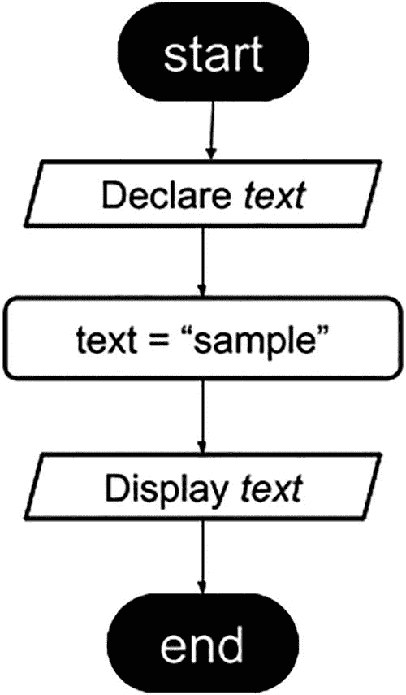
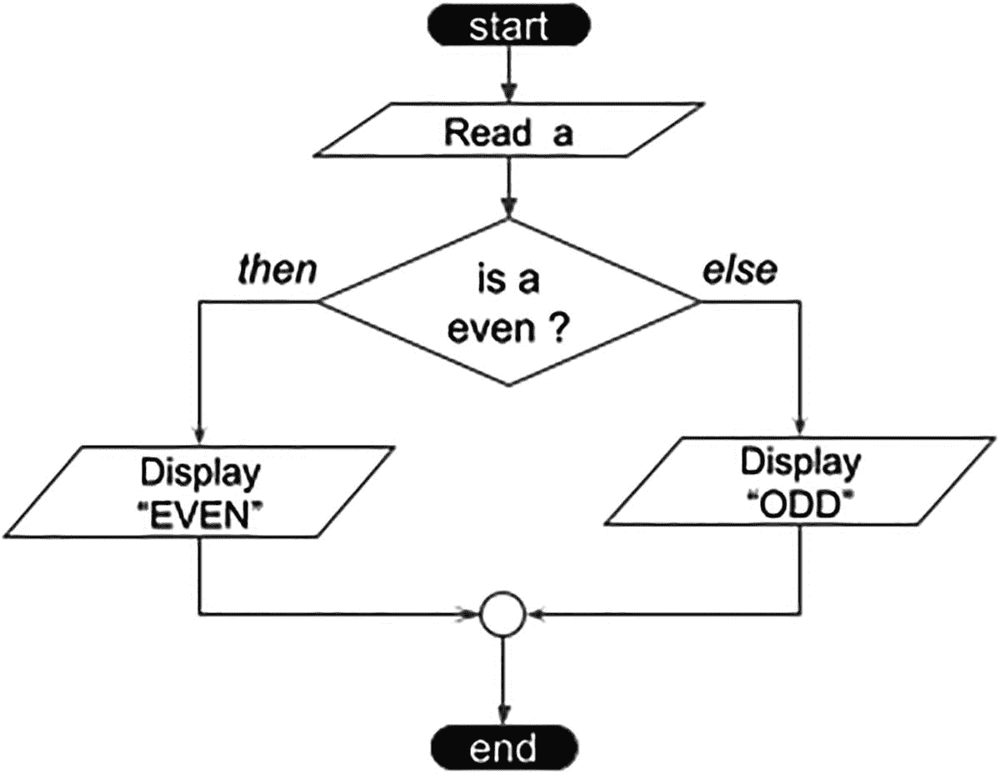
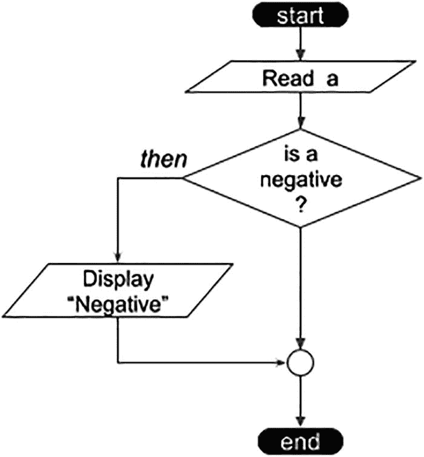
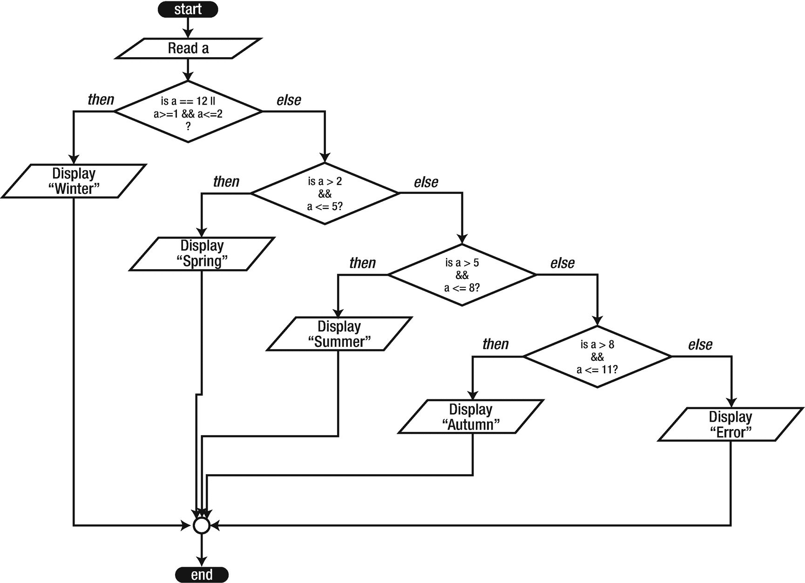
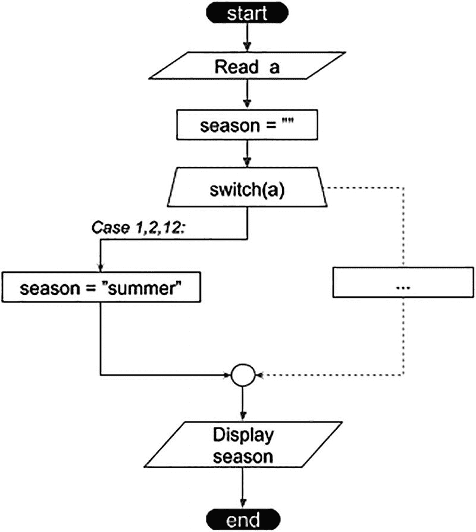
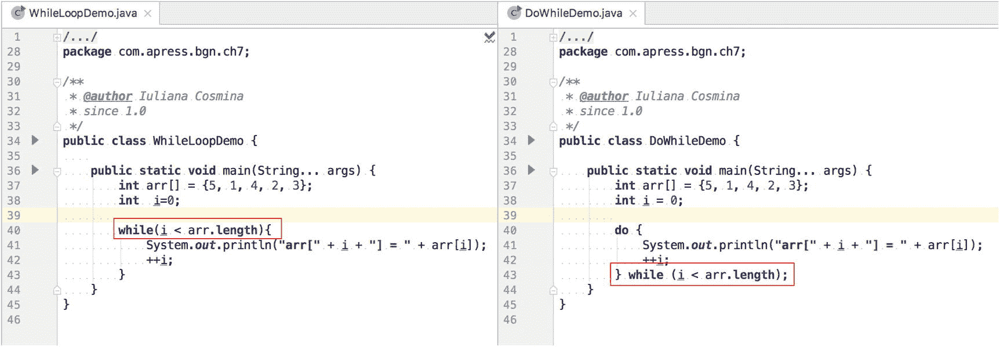
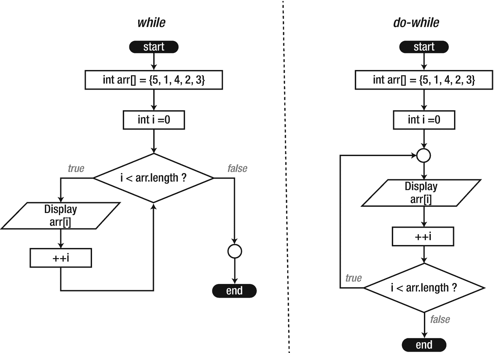

# 七、控制流程

前面几章已经介绍了创建语句的方法，以及根据操作数类型使用什么运算符。在前面的章节中，有时会添加一些逻辑元素来使代码可以运行，本章将详细解释如何使用基本的编程条件语句和重复语句来操作代码的执行。一个解决方案，一个算法可以用流程图来表示。

到本章为止，我们所做的大多数编程都包含声明和打印语句，简单的单步执行语句。看看清单 [7-1](#PC1) 中的这段代码。

```java
package com.apress.bgn.seven;

public class Main {
    public static void main(String... args) {
        String text = "sample";
        System.out.println(text);
    }
}

Listing 7-1Java Code Made of a Few Statements

```

如果我们要为它设计一个流程图，这个模式将是简单的和线性的，没有决策，也没有重复，如图 [7-1](#Fig1) 所示。



图 7-1

简单流程图示例

解决现实世界的问题通常需要比这更复杂的逻辑，因此更复杂的语句是必要的。在此之前，让我们描述一下流程图的组成部分，因为在本章中我们会用到很多。在表 [7-1](#Tab1) 中，列出了所有流程图元素，并解释了它们的用途。

表 7-1

流程图元素

<colgroup><col class="tcol1 align-left"> <col class="tcol2 align-left"> <col class="tcol3 align-left"></colgroup> 
| 

形状

 | 

名字

 | 

范围

 |
| --- | --- | --- |
|  | 末端的 | 指示程序的开始或结束，并包含与其范围相关的文本。 |
|  | 流线 | 表示程序的流程和操作的顺序。 |
|  | 输入/输出 | 指示变量声明和输出值。 |
|  | 过程 | 简单的流程语句:赋值、值的改变等等。 |
|  | 决定 | 显示了决定特定执行路径的条件操作。 |
|  | 预定义流程 | 此元素表示在别处定义的流程。 |
|  | 页面连接器 | 该元素通常带有标签，表示同一页面上的流的延续。 |
|  | 离页连接器 | 该元素通常带有标签，表示流在不同页面上的延续。 |
|  | 注释(或注解) | 当一个流或一个元素需要额外的解释时，就使用这种类型的元素来引入它。 |

上表中的流程图元素非常标准；您可能会在任何编程课程或教程中发现非常相似的元素。经过这种一致的介绍，才适合进入其中。

## `if-else`声明

Java 中最简单的决策流语句是`if-else`语句(可能在其他语言中也是如此)。你可能已经在前面章节的代码示例中看到过`if-else`语句；这是无法避免的，因为提供可运行的代码来鼓励您编写自己的代码是非常重要的。在本节中，重点将严格放在这种类型的陈述上。

让我们想象这样一个场景:我们用用户提供的数字参数运行一个 Java 程序。如果数字是偶数，我们在控制台中打印偶数；否则，我们打印奇数。图 [7-2](#Fig2) 描述了与该场景相匹配的流程图。



图 7-2

`if-else`流程图示例

该条件被评估为一个`boolean`值:如果结果为`true`，则执行对应于`if`分支的语句，如果结果为`false`，则执行对应于 else 分支的语句。

清单 [7-2](#PC2) 中描述了实现该流程图所描述的过程的 Java 代码。

```java
package com.apress.bgn.seven;

public class IfFlowDemo {
    public static void main(String... args) {
        int a = Integer.parseInt(args[0]);

        if (a % 2 == 0) { // is even
            //Display EVEN
            System.out.println("EVEN");
        } else {
            //Display ODD
            System.out.println("ODD");
        }
    }
}

Listing 7-2Java Code with if-else Statement

```

要用不同的参数运行这个类，你必须创建一个 IntelliJ 启动器，并将你的参数添加到`Program arguments`文本字段，就像本书开头解释的那样。前面代码片段中的每个 Java 语句都配有一个与流程图元素匹配的注释，以使实现显而易见。有趣的是，并不是一条`if`语句的两个分支都是强制的，`else`分支并不总是必要的。

有时，如果一个值正好匹配某个条件，您只想打印一些内容，而对其他情况不感兴趣。例如，给定一个用户提供的参数，如果数字是负数，我们只想打印一条消息，但是如果数字是正数，我们对打印或做任何事情都不感兴趣。其流程图如图 [7-3](#Fig3) 所示。



图 7-3

`if`流程图示例，缺少 else 分支

清单 [7-3](#PC3) 中描述了 Java 代码。

```java
package com.apress.bgn.seven;

public class IfFlowDemo {
    public static void main(String... args) {
        int a = Integer.parseInt(args[0]);

        if (a < 0) {
            System.out.println("Negative");
        }
    }
}

Listing 7-3Java Code with if Statements

```

同样的，语句也可以变得简单，同样的，如果我们需要，我们可以将更多的`if-else`语句链接在一起。让我们考虑下面的例子:用户插入一个从 1 到 12 的数字，我们必须打印该数字对应的月份的季节。流程图会是什么样子？你认为图 [7-4](#Fig4) 符合这个场景吗？



图 7-4

复杂`if-else`流程图示例

此外，当`if`或`else`的代码块包含一条语句时，花括号不是强制性的，但大多数开发人员保留它们是为了代码清晰，并帮助 ide 正确缩进代码。

看起来很复杂，对吧？等待直到您看到代码，如清单 [7-4](#PC4) 所示。

```java
package com.apress.bgn.seven;

public class SeasonDemo {

    public static void main(String... args) {
        int a = Integer.parseInt(args[0]);

        if(a == 12 || (a>=1 && a<= 2)) {
            System.out.println("Winter");
        } else {
            if (a>2 && a <= 5 ) {
                System.out.println("Spring");
            } else {
                if (a>5 && a <= 8 ) {
                    System.out.println("Summer");
                } else {
                    if (a>8 && a <= 11 ) {
                        System.out.println("Autumn");
                    } else {
                        System.out.println("Error");
                    }
                }
            }
        }
    }
}

Listing 7-4Java Code with a Lot of if-else Statements

```

看起来很丑吧？幸运的是，Java 提供了一种简化它的方法，特别是因为拥有这么多只包含另一个`if`语句的`else`块实在没有意义。简化的代码将`else`语句与包含的`if(s)`语句连接起来。代码最终看起来如清单 [7-5](#PC5) 所示。

```java
package com.apress.bgn.seven;

public class CompactedSeasonDemo {
    public static void main(String... args) {
        int a = Integer.parseInt(args[0]);

        if (a == 12 || (a >= 1 && a <= 2)) {
            System.out.println("Winter");
        } else if (a > 2 && a <= 5) {
            System.out.println("Spring");
        } else if (a > 5 && a <= 8) {
            System.out.println("Summer");
        } else if (a > 8 && a <= 11) {
            System.out.println("Autumn");
        } else {
            System.out.println("Error");
        }
    }
}

Listing 7-5Java Code with Compacted if-else Statements

```

用户提供的不是`[1,12]`的任何参数都会导致程序打印错误。您可以通过修改 IntelliJ Idea 启动器来亲自测试它。图 [7-5](#Fig5) 中强调了需要关注的要素。


图 7-5

IntelliJ IDEA 启动器和参数

## `switch`声明

当一个值需要对一组固定的值进行不同的操作时，`if`可能会变得更复杂，这组值增加得越多。在这种情况下，更合适的语句是`switch`语句。让我们先看看清单 [7-6](#PC6) 中的代码，然后看看还有哪些可以改进的地方。

```java
package com.apress.bgn.seven.switchst;

public class SeasonSwitchDemo {
    public static void main(String... args) {
        int a = Integer.parseInt(args[0]);

        var season = "";
        switch (a) {
            case 1:
                season = "Winter";
                break;
            case 2:
                season = "Winter";
                break;
            case 3:
                season = "Spring";
                break;
            case 4:
                season = "Spring";
                break;
            case 5:
                season = "Spring";
                break;
            case 6:
                season = "Summer";
                break;
            case 7:
                season = "Summer";
                break;
            case 8:
                season = "Summer";
                break;
            case 9:
                season = "Autumn";
                break;
            case 10:
                season = "Autumn";
                break;
            case 11:
                season = "Autumn";
                break;
            case 12:
                season = "winter";
                break;
            default:
                System.out.println("Error");
        }
        System.out.println(season);
    }
}

Listing 7-6Java Code with Detailed switch Statement

```

这看起来不太实际，至少对于这个场景来说是这样。在展示如何以不同的方式编写`switch`语句之前，让我们先解释一下它的结构和逻辑。清单 [7-7](#PC7) 中描述了`switch`语句的通用模板:

```java
switch ([onvar]) {
    case [option]:
        [statement;]
        break;
    ...
    default:
        [statement;]
}

Listing 7-7General Template of the switch Statement

```

方括号中的术语在下面的列表中有详细说明:

*   `[onvar]`是根据 case 语句测试以选择语句的变量。它可以是任何原始类型、枚举，从 Java 7、`String`开始。显然，switch 语句不受评估为布尔结果的条件的限制，这允许很大的灵活性。

*   `case [option]`是前面提到的变量的一个值，根据它来决定要执行的语句。一个案例，如关键词所述。

*   `[statement]`是在`[onvar] == [option]`时执行的一条或一组语句。考虑到没有`else`分支，我们必须确保只执行与第一个匹配相对应的语句，这就是`break;`语句的用武之地。`break`语句停止当前的执行路径，并将执行点移到包含它的语句之外的下一条语句。没有`break;`语句，行为切换到`fall through`，这意味着匹配后的每个`case`语句都被执行，直到找到`break;`。我们将在这一章的后面详细介绍它。如果没有它，在第一次匹配后，将遍历所有后续事例，并执行与之对应的语句。

*   如果我们执行前面的程序并提供数字 7 作为参数，文本 *Summer* 将被打印出来。但是，如果对案例 7 和 8 的 break 语句进行注释，输出将变为*秋季*。

*   `default [statement;]`是当在`case`上没有找到匹配时执行的语句；`default`案不需要`break`声明。如果前一个程序以`[1-12]`间隔之外的任何数字运行，将打印*错误*，因为将执行默认语句。

既然你已经理解了`switch`是如何工作的，那么让我们来看看如何减少前面的语句。月份的例子在这里是合适的，因为它可以进一步修改，以显示如何简化 switch 语句，当一个语句应该执行多种情况时。在我们的代码中，每个赋值语句写三次有点多余。还有很多`break;`的说法。有两种方法可以改进前面的`switch`陈述。

简化清单 [7-6](#PC6) 中 switch 语句的第一种方法是将返回值相同的情况组合在一起，如清单 [7-8](#PC8) 所示。

```java
package com.apress.bgn.seven.switchst;

public class SimplifiedSwitchDemo {
    public static void main(String... args) {
        int a = Integer.parseInt(args[0]);

        var season = "";
        switch (a) {
            case 1:
            case 2:
            case 12:
                season = "winter";
                break;
            case 3:
            case 4:
            case 5:
                season = "Spring";
                break;
            case 6:
            case 7:
            case 8:
                season = "Summer";
                break;
            case 9:
            case 10:
            case 11:
                season = "Autumn";
                break;
            default:
                System.out.println("Error");
        }
        System.out.println(season);
    }
}

Listing 7-8Simplified switch Statement

```

这种情况下的分组表示需要执行相同语句的情况的对齐。这看起来仍然有点奇怪，但是它减少了语句的重复。前一种情况下的行为是可能的，因为每个没有`break`语句的`case`后面都跟着下一个`case`语句。

第二种方法是使用 Java 12 中引入的一个`switch`表达式。`switch`直接返回季节，而不是将它存储在变量中，这样可以简化语法，如清单 [7-9](#PC9) 所示。

```java
package com.apress.bgn.seven.switchst;

public class ExpessionSwitchDemo {
    public static void main(String... args) {
        int a = Integer.parseInt(args[0]);

        String season =  switch (a) {
            case 1 -> "Winter";
            case 2 -> "Winter";
            case 3 -> "Spring";
            case 4 -> "Spring";
            case 5 -> "Spring";
            case 6 -> "Summer";
            case 7 -> "Summer";
            case 8 -> "Summer";
            case 9 -> "Autumn";
            case 10 -> "Autumn";
            case 11 -> "Autumn";
            case 12 -> "winter";
            default -> "Error";
        };
        System.out.println(season);
    }
}

Listing 7-9switch Expression Example

```

`switch`表达式的引入是为了将 switch 语句视为一个表达式，对其求值并在语句中使用。`switch`表达式不需要`break;`语句来防止失败。当在与一个`case`值匹配后执行代码块时，使用 Java 13 中引入的`yield`语句返回该值。

清单 [7-10](#PC10) 中的代码显示了之前`switch`表达式的不同版本，其中需要相同结果的`case`值被分组，并添加了额外的`System.out.println(..)`以显示`yield`的用法。返回值由`System.out.println`(..)括起开关表达式。

```java
package com.apress.bgn.seven.switchst;

public class AnotherSwitchExpressionDemo {
    public static void main(String... args) {
        int a = Integer.parseInt(args[0]);

        System.out.println( switch (a) {
            case 1, 2, 12 -> {
                System.out.println("One of 1,2,12 is tested.");
                yield "Winter";
            }
            case 3,4,5 -> {
                System.out.println("One of 3,4,5 is tested.");
                yield "Spring";
            }
            case 6,7,8 -> {
                System.out.println("One of 6,7,8 is tested.");
                yield "Summer";
            }
            case 9,10,11 -> {
                System.out.println("One of 9,10,11 is tested.");
                yield "Autumn";
            }
            default ->
                throw new IllegalStateException("Unexpected value");
        });
    }
}

Listing 7-10switch Expression Example Using yield Statements

```

在 Java 7 中，`switch`语句开始支持`String`值。支持`String`值的`switch`的主要问题是，总是有可能出现意外的行为，因为`equals(..)`方法用于查找匹配，显然，该方法是区分大小写的。前面的示例被修改为要求用户输入表示月份的文本。`switch`语句用于决定打印的季节，除非`case`选项中的文本与用户输入的文本完全匹配，否则打印的文本为*错误*。此外，由于提到了`switch`表达式，代码变为清单 [7-11](#PC11) 中的代码。

```java
package com.apress.bgn.seven.switchst;

public class StringSwitchSeasonDemo {
    public static void main(String... args) {
        //Read a
        String a = args[0];
        var season = "";
        switch (a) {
            case "january", "february", "december" -> season = "winter";
            case "march", "april", "may" -> season = "Spring";
            case "june", "july", "august" -> season = "Summer";
            case "september", "october", "november" -> season = "Autumn";
            default -> System.out.println("Error");
        }
        System.out.println(season);
    }
}

Listing 7-11switch Statement Using String Values

```

如果我们用参数*一月*运行前面的程序，winter 将被打印在控制台中。如果我们用*一月*或`null`，*错误*将被打印在控制台上。

在支持`String`值之前，`switch`语句也支持枚举值。当值被分组到一个固定的集合中时，例如一年中月份的名称，这是很实用的。通过使用枚举，可以实现对`String`值的支持。用户以文本值的形式输入月份。该值被转换为大写，并用于提取相应的枚举值。这允许在`switch`语句中支持不区分大小写的`String`值。清单 [7-12](#PC12) 中的代码展示了这样一个实现。

```java
package com.apress.bgn.seven.switchst;

public class EnumSwitchDemo {

    enum Month {
        JANUARY, FEBRUARY, MARCH, APRIL, MAY, JUNE, JULY, AUGUST,
        SEPTEMBER, OCTOBER, NOVEMBER, DECEMBER
    }

    public static void main(String... args) {
        //Read a
        String a = args[0];
        try {
            Month month = Month.valueOf(a.toUpperCase());
            var season = "";
            switch (month) {
                case JANUARY:
                case FEBRUARY:
                case DECEMBER:
                    season = "Winter";
                    break;
                case MARCH:
                case APRIL:
                case MAY:
                    season = "Spring";
                    break;
                case JUNE:
                case JULY:
                case AUGUST:
                    season = "Summer";
                    break;
                case SEPTEMBER:
                case OCTOBER:
                case NOVEMBER:
                    season = "Autumn";
                    break;
            }
            System.out.println(season);
        } catch(IllegalArgumentException iae) {
            System.out.println("Unrecognized enum value: " + a);
        }
    }
}

Listing 7-12switch Statement Using Enums Values

```

注意如何使用 enums，返回相同的季节为*一月*、*一月*、*一月*等等。此外，不需要`default`选项，因为如果找不到与用户提供的数据匹配的枚举值，就会抛出异常。

这就是关于 switch 语句的全部内容。在实践中，根据您试图开发的解决方案，您可能会决定结合使用`if`和`switch`语句。不幸的是，由于其特殊的逻辑和灵活的选项数量，很难为`switch`语句绘制流程图，但尽管如此，我还是尝试了，如图 [7-6](#Fig6) 所示。



图 7-6

`switch`语句流程图

## 循环语句

有时在编程中，我们需要涉及相同变量的重复步骤。为了完成工作而一遍又一遍地写同样的语句是荒谬的。让我们以对整数值数组进行排序为例。实现这一点的最著名的算法，也是编程课程中首先教授的算法，因为它很简单，被称为*冒泡排序*。该算法两个两个地比较数组的元素，如果它们的顺序不正确，它就交换它们。它会一次又一次地遍历数组，直到不再需要交换为止。该算法的效果如图 [7-7](#Fig7) 所示。


图 7-7

冒泡排序阶段和效果

该算法执行两种类型的循环:一种是使用索引迭代数组的每个元素。重复这种遍历，直到不需要交换为止。在 Java 中，这个算法可以用不同的循环语句以多种方式编写。但是我们会到达那里；让我们慢慢来。

Java 中有三种类型的循环语句:

*   `for`声明

*   `while`声明

*   `do-while`声明

`for`循环语句是最常用的，但是`while`和`do-while`也有它们的用途。

### `for`声明

对于可计数的数组和集合等对象，建议使用 For 进行迭代。例如，遍历一个数组并打印它的每个值就像清单 [7-13](#PC13) 中描述的那样简单。

```java
package com.apress.bgn.seven.forloop;

public class ForLoopDemo {
    public static void main(String... args) {
        int arr[] = {5, 1, 4, 2, 3};
        for (int i = 0; i < arr.length; ++i) {
            System.out.println("arr[" + i + "] = " + arr[i]);
        }
    }
}

Listing 7-13Simple for Loop

```

基于前面的例子，可以画出`for`语句的流程图，如图 [7-8](#Fig8) 所示。


图 7-8

`for`语句流程图

清单 [7-14](#PC14) 中的代码片段描述了`for`循环模板:

```java
for ([int_expr]; [condition];[step]){
    [code_block]
}

Listing 7-14The for Loop Template

```

方括号中的每个术语都有特定的用途，下面的列表对此进行了解释:

*   `[init_expr]`是初始化表达式，用于设置该循环使用的计数器的初始值。它以`;`结束，并且不是强制性的，因为声明初始化可以在语句之外完成，特别是如果我们想在代码的后面和语句之外使用 counter 变量。前面的代码可以写得很好，如清单 [7-15](#PC15) 所示:

*   `[condition]`是循环的终止条件；只要这个条件被评估为真，循环将继续执行。条件以`;`结束，有趣的是它也不是强制性的，因为终止条件可以放在循环重复执行的代码中。因此，前面的代码可以进一步修改，如清单 [7-16](#PC16) 所示:

```java
package com.apress.bgn.seven.forloop;

public class AnotherForLoopDemo {
    public static void main(String... args) {
        int arr[] = {5, 1, 4, 2, 3};
        int i = 0;
        for (; i < arr.length; ++i) {
            System.out.println("arr[" + i + "] = " + arr[i]);
        }
        System.out.println("Loop exited with index: " + i);
    }
}

Listing 7-15The for Loop with Termination Condition and Counter Modification Expression

```

*   `[step]`是步长表达式或增量，这是在循环的每一步增加计数器的表达式。作为最后一个学期，它没有结束；。正如您可能已经预料到的，它也不是强制性的，因为没有什么可以阻止开发人员操作代码块内部的计数器。所以前面的代码也可以写成清单 [7-17](#PC17) :

```java
package com.apress.bgn.seven.forloop;

public class AndAnotherForLoopDemo {
    public static void main(String... args) {
        int arr[] = {5, 1, 4, 2, 3};
        int i = 0;
        for (; ; ++i) {
            if (i >= arr.length) {
                break;
            }
            System.out.println("arr[" + i + "] = " + arr[i]);
        }
        System.out.println("Loop exited with index: " + i);
    }
}

Listing 7-16The for Loop with Only Counter Modification Statement

```

```java
package com.apress.bgn.seven.forloop;

public class YeyAnotherForLoopDemo {
    public static void main(String... args) {
        int arr[] = {5, 1, 4, 2, 3};
        int i = 0;
        for (; ;) {
            if (i >= arr.length) {
                break;
            }
            System.out.println("arr[" + i + "] = " + arr[i]);
            ++i;
        }
        System.out.println("Loop exited with index: " + i);
    }
}

Listing 7-17The for Loop with No Initialization, Condition, or Counter Modification Expression

```

计数器的修改甚至不必在步骤表达式内部完成；这可以在终止条件下完成。必须相应地修改初始化表达式和终止条件，以便仍然符合目的。清单 [7-18](#PC18) 中描述的代码与之前的所有示例具有相同的效果。

```java
package com.apress.bgn.seven.forloop;

public class LastForLoopDemo {
    public static void main(String... args) {
        int arr[] = {5, 1, 4, 2, 3};
        int i;
        for (i = -1; i++ < arr.length -1;) {
            System.out.println("arr[" + i + "] = " + arr[i]);
        }
        System.out.println("Loop exited with index: " + i);
    }
}

Listing 7-18The for Loop with Counter Modification in Termination Condition

```

你也应该知道步进表达式并不一定是递增的。它可以是修改计数器值的任何表达式。如果数组或集合从一个较大的索引开始向一个较低的索引遍历，可以使用`i= i+1`或`i=i+3`，甚至递减，而不是`++i`或`i++`。任何保持计数器在类型边界和集合边界内的数学运算都可以安全使用。

*   `[code_block]`是在循环的每一步重复执行的代码块。如果这段代码中没有退出条件，那么只要计数器通过终止条件，就会执行这段代码。

    当代码块包含一个语句时，花括号不是强制性的，但是大多数开发人员保留它们是为了代码清晰，并帮助 ide 正确缩进代码。

    由于提到初始化表达式、终止条件和迭代表达式是可选的，这意味着下面是有效的`for`语句:

    `for ( ; ; ) {`

    `\\ statement(s) here`

    `}`

    像这样使用 for 语句时要小心。代码块必须包含终止条件，以避免**无限循环**。

这是 for 循环语句的基本形式，但是在 Java 中还有其他方法来迭代一组值。比方说，我们必须遍历一个列表，而不是数组，如清单 [7-19](#PC19) 所示。

```java
package com.apress.bgn.seven.forloop;

import java.util.List;

public class ListLoopDemo {
    public static void main(String... args) {
        List<Integer> list = List.of(5, 1, 4, 2, 3);
        for (int j = 0; j < list.size(); ++j) {
            System.out.println("list[" + j + "] = " + list.get(j));
        }
    }
}

Listing 7-19The for Loop Over a List

```

代码看起来有些不切实际，这就是为什么可以用另一种类型的 for 语句遍历`List<E>`实例，这种语句在 Java 8 之前被称为`forEach`。你马上就会明白为什么，但首先让我们看看清单 [7-20](#PC20) 中的`forEach`在起作用。

```java
package com.apress.bgn.seven.forloop;

import java.util.List;

public class ForEachLoopDemo {
    public static void main(String... args) {
        List<Integer> list = List.of(5, 1, 4, 2, 3);
        for (Integer item : list) {
            System.out.println(item);
        }
    }
}

Listing 7-20The forEach Loop Over a List<E>

```

这种类型的`for`语句也被称为具有增强的语法，并为其表达式中使用的集合中的每个项目执行代码块。这意味着它可以在`Collection<E>`接口的任何实现上工作，也可以在数组上工作。因此，到目前为止作为示例给出的代码也可以如清单 [7-21](#PC21) 所示编写。

```java
package com.apress.bgn.seven.forloop;

import java.util.List;

public class ForLoopDemo {
    public static void main(String... args) {
        int arr[] = {5, 1, 4, 2, 3};
        for (int item : arr) {
            System.out.println(item);
        }
    }
}

Listing 7-21The forEach Loop

Over an Array

```

显然，这种情况下最好的部分是我们不再需要终止条件或计数器。从 Java 8 开始，名称`forEach`不能再用于具有增强语法的 for 语句，因为默认方法`forEach`被添加到所有的`Collection<E>`实现中。结合 lambda 表达式，打印列表元素的代码就变成了清单 [7-22](#PC22) 中的代码。

```java
package com.apress.bgn.seven.forloop;

import java.util.List;

public class ForLoopDemo {
    public static void main(String... args) {
        List<Integer> list = List.of(5, 1, 4, 2, 3);
        list.forEach(item -> System.out.println(item));
        //or
        list.forEach(System.out::println);
    }
}

Listing 7-22The forEach Method Used to Loop Over a List<E>

```

很漂亮，对吧？但是等等，还有更多:它也适用于数组，但是首先需要将它转换成合适的`java.util.stream.BaseStream`实现。这是由`Arrays`实用程序类提供的，它在 Java 8 中用支持 lambda 表达式的方法进行了丰富。所以是的，到目前为止编写的带有`arr`数组的代码可以从 Java 8 开始编写，如清单 [7-23](#PC23) 所示。

```java
package com.apress.bgn.seven.forloop;

import java.util.List;

public class ForLoopDemo {
    public static void main(String... args) {
        int arr[] = {5, 1, 4, 2, 3};
        Arrays.stream(arr).forEach(System.out::println);
    }
}

Listing 7-23The forEach Method Used to Loop Over an Array

```

在 Java 17 中，前面所有的例子都可以很好地编译和执行，所以在编写解决方案时，可以使用您最喜欢的语法。

### `while`声明

`while`语句不同于`for`语句。不存在必须执行的固定数量的步骤，因此并不总是需要计数器。一个`while`语句执行的重复次数只取决于控制这个次数的延续条件被评估为真的次数。清单 [7-24](#PC24) 中描述了该声明的通用模板。

```java
while ([eval(condition)] == true) {
    [code_block]
}

Listing 7-24The while Statement Template

```

一个`while`语句实际上也不需要初始化语句，但是如果需要的话，它可以在`while`代码块内部或者外部。`while`语句可以代替 for 语句，但是`for`语句的优点是它将初始化、终止条件和计数器的修改封装在一个块中，因此更加简洁。可以使用`while`语句重写数组遍历代码示例。代码如清单 [7-25](#PC25) 所示:

```java
package com.apress.bgn.seven.whileloop;

public class WhileLoopDemo {
    public static void main(String... args) {
        int arr[] = {5, 1, 4, 2, 3};
        int i = 0;
        while(i < arr.length) {
            System.out.println("arr[" + i + "] = " + arr[i]);
            ++i;
        }
    }
}

Listing 7-25The while Statement Used to Loop Over an Array

```

如您所见，计数器变量`int i = 0;`的声明和初始化是在`while`代码块之外完成的。计数器的递增是在要重复的代码块内完成的。此时，如果我们为这个场景设计流程图，它将与图 [7-8](#Fig8) 中描述的`for`语句看起来一样。虽然听起来不可思议，但是`[condition]`也不是强制的，因为它可以直接用`true`替换，但是在这种情况下，您必须确保在一定会执行的代码块中有一个退出条件，否则执行很可能会以错误结束，因为 JVM 不允许无限循环。这个条件必须放在代码块的开头，以防止有用的逻辑在不应该执行的情况下执行。对于我们这个简单的例子，很明显我们不希望为一个索引在数组范围之外的元素调用`System.out.println`，如清单 [7-26](#PC26) 所示。

```java
package com.apress.bgn.seven.whileloop;

public class AnotherLoopDemo {
    public static void main(String... args) {
        int arr[] = {5, 1, 4, 2, 3};
        int i=0;
        while(true){
            if (i >= arr.length) {
                break;
            }
            System.out.println("arr[" + i + "] = " + arr[i]);
            ++i;
        }
    }
}

Listing 7-26The while Statement Used to Loop Over an Array, Without a Continuation Expression

```

当我们使用不总是在线的资源时，最好使用`while`语句。假设我们在一个不稳定的网络中为我们的应用使用一个远程数据库。第一次超时后，我们可以尝试直到成功，而不是放弃保存数据，对吗？这是通过使用一个`while`语句来完成的，该语句将不断尝试在其代码块中初始化一个连接对象。代码大致如清单 [7-27](#PC27) 所示。

```java
package com.apress.bgn.seven.whileloop;

import java.sql.*;

public class WhileConnectionTester {
    public static void main(String... args) throws Exception {
        Connection con = null;
        while (con == null) {
            try {
                Class.forName("com.mysql.cj.jdbc.Driver");
                con = DriverManager.getConnection(
                        "jdbc:mysql://localhost:3306/mysql",
                        "root", "mypass");
            } catch (Exception e) {
                System.out.println("Connection refused. Retrying in 5 seconds ...");
                Thread.sleep(5000);
            }
        }
        // con != null, do something
        Statement stmt = con.createStatement();
        ResultSet rs = stmt.executeQuery("select * from user");
        while (rs.next()) {
            System.out.println(rs.getString(1) + " " + rs.getString(2));
        }
        con.close();
    }
}

Listing 7-27The while Statement Used to Repeatedly Try to Obtain a Database Connection

```

这段代码的问题是它将永远运行。如果我们想在一段时间后放弃尝试，我们必须引入一个变量来计算尝试次数，并使用一个`break;`语句退出循环，如清单 [7-28](#PC28) 所示。

```java
package com.apress.bgn.seven.whileloop;

import java.sql.*;

public class AnotherWhileConnectionTester {
    public static final int MAX_TRIES = 10;

    public static void main(String... args) throws Exception {
        int cntTries = 0;
        Connection con = null;
        while (con == null && cntTries < MAX_TRIES) {
            try {
                Class.forName("com.mysql.cj.jdbc.Driver");
                con = DriverManager.getConnection(
                        "jdbc:mysql://localhost:3306/mysql",
                        "root", "mypass");
            } catch (Exception e) {
                ++cntTries;
                System.out.println("Connection refused. Retrying in 5 seconds ...");
                Thread.sleep(5000);
            }
        }
        if (con != null) {
            // con != null, do something
            Statement stmt = con.createStatement();
            ResultSet rs = stmt.executeQuery("select * from user");
            while (rs.next()) {
                System.out.println(rs.getString(1) + " " + rs.getString(2));
            }
            con.close();
        } else {
            System.out.println("Could not connect!");
        }
    }
}

Listing 7-28The while Statement Used to Repeatedly Try to Obtain a Database Connection Until the Number of Tries Expires

```

根据经验，在使用循环语句时，一定要确保存在退出条件。

既然我们现在已经涵盖了实现图 [7-7](#Fig7) 中描述的`Bubble sort`算法所需的所有语句，让我们看看代码是什么样子的。请注意，该算法可以用多种方式编写，但下面的代码最符合前面提供的解释。因此，当数组中的元素顺序不正确时，数组会被一次又一次地遍历，相邻的元素会被交换以符合所需的顺序，在本例中是升序。清单 [7-29](#PC29) 中描述了最简单的`Bubble sort`算法。

```java
package com.apress.bgn.seven;

import java.util.Arrays;

public class BubbleSortDemo {
    public static final int arr[] = {5, 1, 4, 2, 3};

    public static void main(String... args) {
        boolean swapped = true;
        while (swapped) {
            swapped = false;
            for (int i = 0; i < arr.length - 1; ++i) {
                if (arr[i] > arr[i + 1]) {
                    int temp = arr[i];
                    arr[i] = arr[i + 1];
                    arr[i + 1] = temp;
                    swapped = true;
                }
            }
        }
        Arrays.stream(arr).forEach(System.out::println);
    }
}

Listing 7-29The Simplest Version of the Bubble sort Algorithm

```

运行时，前面的代码交换了`arr`数组的元素，直到它们都按升序排列，因此前面代码的最后一行打印了修改后的`arr`:

```java
1
2
3
4
5

```

### `do-while`声明

`do-while`语句类似于`while`语句，有一点不同:在执行代码块后，继续条件被求值。这会导致代码块至少执行一次，这对于显示菜单很有用，例如，除非其中嵌入了阻止执行的条件。清单 [7-30](#PC31) 中描述了该声明的通用模板。

```java
do {
    [code_block]
} while ([eval(condition)] == true)

Listing 7-30The do-while Statement Template

```

大多数情况下，语句`while`和`do-while`可以很容易地互换，并且代码块的逻辑变化很小或没有变化。例如，遍历一个数组并打印其元素的值也可以使用`do-while`来编写，根本不需要改变代码块。在图 [7-9](#Fig9) 中，你可以看到两个并行的实现，while 在左边，do-while 在右边。



图 7-9

用于打印数组元素的 while 和 do-while 实现

然而，这两个例子的流程图非常不同，并且揭示了两个语句的不同逻辑。您可以通过查看图 [7-10](#Fig10) 来比较它们。



图 7-10

while 和 do-while 语句流程图的比较

在图 [7-9](#Fig9) 的例子中，如果数组为空，`do-while`语句导致抛出`ArrayIndexOutOfBoundsException`异常，因为代码块的内容被执行，即使它们不应该被执行，因为索引值等于数组长度(零)，但是没有索引等于 0 的元素，因为数组为空。但是，因为条件是在代码块之后计算的，所以没有办法知道。在图 [7-11](#Fig11) 中，你可以看到前面的代码样本被修改为用一个空数组运行，并且它们的输出是并排的。


图 7-11

用于打印空数组元素的 while 和 do-while 实现

为了使`do-while`实现具有与`while`实现相同的行为，代码块的执行必须受到至少有一个元素的数组的限制。清单 [7-31](#PC32) 展示了一种方法。

```java
package com.apress.bgn.seven.whileloop;

public class DoWhileLoopDemo {
    public static void main(String... args) {
        int arr[] = new int[0];
        int i = 0;
        do {
            if(arr.length >=1) {
                System.out.println("arr[" + i + "] = " + arr[i]);
                ++i;
            }
        } while (i < arr.length);
    }
}

Listing 7-31do-while Statement Implementation That Works Correctly for an Empty Array Too

```

当代码块必须至少执行一次时，`do-while`语句工作得最好，否则我们不必要地评估一次条件。

前面介绍的冒泡排序算法就是一个很好的例子，其中`while`和`do-while`语句可以互换使用，不需要额外的代码修改。

既然已经提到有不止一种方法来编写这个算法，清单 7-32 显示了一个改进的版本，它不仅使用了`do-while`，而且减少了每次遍历的数组的大小。这是可能的，因为根据图 [7-7](#Fig7) ，在每次遍历之后，数组的最后一个索引保存了被遍历子集的最大数量。

```java
package com.apress.bgn.seven;

import java.util.Arrays;

public class BubbleSortDemo {
    public static final int arr[] = {5, 1, 4, 2, 3};

    public static void main(String... args) {
       boolean swapped = true;
        do {
            swapped = false;
            for (int i = 0, n = arr.length -1; i < n - 1; ++i, --n) {
                if (arr[i] > arr[i + 1]) {
                    int temp = arr[i];
                    arr[i] = arr[i + 1];
                    arr[i + 1] = temp;
                    swapped = true;
                }
            }
        } while (swapped);
        Arrays.stream(arr).forEach(System.out::println);
    }
}

Listing 7-32Optimized Version of the Bubble Sort Algorithm Using do-while Statement

```

`for`语句中的初始化和步骤表达式允许用“`,`”分隔多个术语。所以下面的代码是有效的，并且运行良好。

`for (int j = 0, k =2; j < 10; ++j, ++k) {`

`System.out.println("composed indexes: [" + j + ", " + k + "]");`

`}`

还记得试图连接到不稳定网络中的数据库的代码示例吗(清单 [7-27](#PC27) )？当使用`while`时，执行开始于测试连接是否不为空，但是连接甚至还没有用有效值初始化。进行那个测试是不合逻辑的，对吧？参见清单 [7-33](#PC34) 中所示的片段。

```java
Connection con = null;
while (con == null) {
    try {
        Class.forName("com.mysql.cj.jdbc.Driver");
        con = DriverManager.getConnection(
                "jdbc:mysql://localhost:3306/mysql", "root", "mypass");
    // some code omitted

Listing 7-33while Implementation to Check Connection to a Database

```

这种实现虽然很实用，但有点多余，而且逻辑并没有真正遵循最佳编程实践。一个`do-while`实现是最合适的，因为它避免了初始测试，如果`con`实例是`null`，当没有其他方法时。清单 [7-34](#PC35) 中描述了编写代码的一种变体。

```java
package com.apress.bgn.seven.whileloop;

import java.sql.*;

public class DoWhileConnectionTester {
    public static final int MAX_TRIES = 10;

    public static void main(String... args) throws Exception {
        int cntTries = 0;
        Connection con = null;
        do {
            try {
                Class.forName("com.mysql.cj.jdbc.Driver");
                con = DriverManager.getConnection(
                        "jdbc:mysql://localhost:3306/mysql",
                        "root", "mypass");
            } catch (Exception e) {
                ++cntTries;
                System.out.println("Connection refused. Retrying in 5 seconds ...");
                Thread.sleep(5000);
            }
        } while (con == null && cntTries < MAX_TRIES);

        if (con != null) {
            Statement stmt = con.createStatement();
            ResultSet rs = stmt.executeQuery("select * from user");
            while (rs.next()) {
                System.out.println(rs.getString(1) + " " + rs.getString(2));
            }
            con.close();
        } else {
            System.out.println("Could not connect!");
        }
    }
}

Listing 7-34do-while Implementation to Check Connection to a Database

```

当然，跳过一次条件的评估并不是一个大的优化，但是在一个大的应用中，每一个小的优化都很重要。

## 打破循环和跳过步骤

在前面的例子中，我们提到了使用`break;`语句退出循环，并承诺返回并添加更多细节。有三种方法可以操纵循环的行为:

*   **`break`**语句**退出循环，如果带有标签，将会中断带有标签的循环；当我们有更多的嵌套循环时，这很有用，因为我们可以从任何嵌套循环中断开，而不仅仅是包含语句的循环。**

***   **`continue`**语句**跳过其后任何代码的执行，继续下一步。**

    ***   **`return`**语句**用于退出一个方法，所以如果循环或者 if 或者`switch`语句在一个方法的主体内，它也可以用于退出循环。**

    **至于最佳实践，不应该滥用`return`语句来退出方法，因为它们可能会使执行流程难以遵循。****** 

 ****### `break`声明

`break`语句只能在`switch`、`for`、`while`和`do-while`语句中使用。您已经看到了如何在`switch`语句中使用它，所以让我们向您展示如何在所有其他语句中使用它。使用`break`语句可以中断`for`、`while`或`do-while`循环，但必须由退出条件控制，否则不会执行任何步骤。在清单 [7-35](#PC36) 中，我们只打印一个数组中的前三个元素，即使`for`循环被设计为遍历所有元素。如果我们得到的指数等于 3，我们退出循环。

```java
package com.apress.bgn.seven.forloop;

public class BreakingForDemo {
    public static final int arr[] = {5, 1, 4, 2, 3};

    public static void main(String... args) {
        for (int i = 0; i < arr.length ; ++i) {
            if (i == 3) {
                System.out.println("Bye bye!");
                break;
            }
            System.out.println("arr[" + i + "] = " + arr[i]);
        }
    }
}

Listing 7-35Breaking Out of a for Loop

```

如果我们有一个嵌套循环，标签可以用来决定循环语句的中断。例如，在清单 [7-36](#PC37) 中，我们有三个嵌套的 for 循环，当所有索引都相等时，我们退出中间的循环。

```java
package com.apress.bgn.seven.forloop;

public class BreakingNestedForLoopDemo {
    public static final int arr[] = {5, 1, 4, 2, 3};

    public static void main(String... args) {
        for (int i = 0; i < 2; ++i) {
            HERE: for (int j = 0; j < 2; ++j) {
                for (int k = 0; k < 2; ++k) {
                    if (i == j && j == k) {
                        break HERE;
                    }
                    System.out.println("(i, j, k) = (" + i + "," + j + "," + k + ")");
                }
            }
        }
    }
}

Listing 7-36Breaking Out of a Nested for Loop

```

前一个代码示例中使用的标签名为`HERE`，它在满足条件时退出的`for`语句之前声明。break 语句后面是相同的标签。在开发中，使用全大写字母编写标签名称被认为是一种最佳实践，因为这样可以避免在阅读代码时将标签与变量或类名混淆。

用标签来打破循环实际上是很不可取的，因为它会导致代码跳转，并使执行流程更难跟踪。因此，如果你必须这样做，确保你的标签是可见的。

为了确保这一点，你可以看看控制台。您应该会看到(I，j，k)的一些组合(包括带有`i = j = k`的组合)丢失了。这里列出了输出。

```java
(i, j, k) = (1,0,0)
(i, j, k) = (1,0,1)
(i, j, k) = (1,1,0)

```

### `continue`声明

`continue`语句不会中断循环，但可用于根据条件跳过某些步骤。实际上，`continue`语句停止了循环当前步骤的执行，并移动到下一步，所以你可以说这个语句继续了循环。让我们继续试验数组遍历的例子，这一次，让我们跳过使用`continue`语句打印奇数索引的元素。代码如清单 [7-37](#PC39) 所示。

```java
package com.apress.bgn.seven.forloop;

public class ContinueForDemo {
    public static final int arr[] = {5, 1, 4, 2, 3};

    public static void main(String... args) {
        for (int i = 0; i < arr.length; ++i) {
            if (i % 2 != 0) {
                continue;
            }
            System.out.println("arr[" + i + "] = " + arr[i]);
        }
    }
}

Listing 7-37Skipping Printing Elements with Odd Indexes Using a for Loop and continue Statement

```

显然，这个语句必须是有条件的，否则，循环将只是无用地迭代。

`continue`语句也可以和标签一起使用。让我们举一个与前面使用的三个`for`嵌套循环类似的例子，但是这一次，当`k`索引等于 1 时，什么都不打印，我们跳到包含`k`循环的循环的下一步。代码如清单 [7-38](#PC40) 所示。

```java
package com.apress.bgn.seven.forloop;

public class ContinueNestedForLoopDemo {
    public static final int arr[] = {5, 1, 4, 2, 3};

    public static void main(String... args) {
        for (int i = 0; i < 3; ++i) {
        HERE: for (int j = 0; j < 3; ++j) {
                for (int k = 0; k < 3; ++k) {
                    if (k == 1) {
                        continue HERE;
                    }
                    System.out.println("(i, j, k) = (" + i + "," + j + "," + k + ")");
                }
            }
        }
    }
}

Listing 7-38Continue a Nested for Loop

```

为了确保这一点，您可以在控制台中查看打印了哪些组合，我们清楚地注意到没有打印带有`k=1`或`k=2`的组合。这里列出了输出。

```java
(i, j, k) = (0,0,0)
(i, j, k) = (0,1,0)
(i, j, k) = (0,2,0)
(i, j, k) = (1,0,0)
(i, j, k) = (1,1,0)
(i, j, k) = (1,2,0)
(i, j, k) = (2,0,0)
(i, j, k) = (2,1,0)
(i, j, k) = (2,2,0)

```

在 Java 社区中，使用标签来打破循环是不被允许的，因为跳转到标签类似于在某些老式编程语言中可以找到的`goto`语句。`goto`是 Java 保留的关键字，因为这个语句曾经存在于 JVM 的第一个版本中，但后来被删除了。使用跳转会降低代码的可读性和可测试性，并导致糟糕的设计。这就是为什么`goto`在以后的版本中被删除了，但是任何需要这种操作的都可以通过`break`和`continue`语句实现。

### `return`声明

`return`语句很简单:如前所述，它可以用于退出方法体的执行。如果方法返回一个值，那么`return`语句会伴随着返回的值。return 语句可用于退出本节提到的任何语句。它可以代表一种快捷执行方法的非常聪明的方式，因为当前方法的执行停止，处理从调用该方法的代码点继续。

我们来看几个例子。清单 [7-39](#PC42) 中的代码展示了一个寻找数组中第一个偶数元素的方法。如果找到，该方法返回其索引；否则，它返回-1。

```java
package com.apress.bgn.seven;

public class ReturnDemo {
    public static final int arr[] = {5, 1, 4, 2, 3};

    public static void main(String... args) {
        int foundIdx = findEvenUsingFor(arr);

        if (foundIdx != -1) {
            System.out.println("First even is at: " + foundIdx);
        }
    }

    public static int findEvenUsingFor(int ... arr) {
        for (int i = 0; i < arr.length; ++i) {
            if (arr[i] %2 == 0) {
                return i;
            }
        }
        return -1;
    }
}

Listing 7-39Finding an Even Number Using the do-while Statement

```

同样的方法可以用一个`while`语句编写，但是`return`语句的目的是一样的。代码如清单 [7-40](#PC43) 所示。

```java
// enclosing class omitted
public static int findEvenUsingWhile(int ... arr) {
    int i = 0;
    while (i < arr.length) {
        if (arr[i] % 2 == 0) {
            return i;
        }
        ++i;
    }
    return -1;
}

Listing 7-40Finding an Even Number Using the while Statement

```

如你所见，`return`语句可以用在任何情况下，当我们想要在一个条件满足时终止一个方法的执行。

## 使用`try-catch`结构控制流程

本书之前提到过异常和`try-catch`语句，但不是作为控制流程执行的工具。在我们跳到解释和例子之前，让我们先讨论一下`try-catch-finally`语句的通用模板。该模板如清单 [7-41](#PC44) 所示。

```java
try {
    [code_block]
} catch ([exception_block]} {
    [handling_code_block]
} finally {
    [cleanup_code_block]
}

Listing 7-41try-catch-finally Statement Template

```

下面的列表解释了该模板的组件:

*   `[code_block]`是要执行的代码块。

*   `[exception_block]`是一个或多个异常类型的声明，可以由`[code_block]`抛出。

*   被抛出的异常标志着必须处理的意外情况；一旦捕获到异常，就执行这段代码来处理它，要么尝试将系统恢复到正常状态，要么记录关于异常原因的详细信息。

*   `[clean_up_code]`用于释放资源或将对象设置为空，使其有资格被收集。如果存在，无论是否抛出异常，都会执行该代码块。

现在您已经知道了一个`try-catch-finally`是如何工作的，您大概可以想象如何使用它来控制执行流。在`[code_block]`中，您可以显式抛出异常，并决定如何处理它们。

考虑到我们一直使用的数组，我们将再次基于它来设计我们的代码。清单 [7-42](#PC45) 显示了一段代码，当发现一个偶数值时，它抛出一个异常。

```java
package com.apress.bgn.seven.ex;

public class ExceptionFlowDemo {
    public static final int arr[] = {5, 1, 4, 2, 3};

    public static void main(String... args) {
        try {
            checkNotEven(arr);
            System.out.println("Not found, all good!");
        } catch (EvenException e) {
            System.out.println(e.getMessage());
        } finally {
            System.out.println("Cleaning up arr");
            for (int i = 0; i < arr.length; ++i) {
                arr[i] = 0;
            }
        }
    }

    public static int checkNotEven(int... arr) throws EvenException {
        for (int i = 0; i < arr.length; ++i) {
            if (arr[i] % 2 == 0) {
                throw new EvenException("Did not expect an even number at " + i);
            }
        }
        return -1;
    }
}

Listing 7-42Controlling Flow Using Exceptions

```

`EvenException`类型是为这个特定示例编写的定制异常类型，它的实现在这里不相关。如果我们执行这段代码，将会打印以下内容:

```java
Did not expect an even number at 2
Cleaning up arr

```

如你所见，通过抛出一个异常，我们将执行指向了处理代码，所以“没有找到，一切正常！”不打印，因为有一个`finally`块，它也被执行。是的，您可以混合使用:使用不同类型的异常，并且您可以拥有多个 catch 块来解决您的问题。在我之前工作的一家公司，我们有一段代码验证一个文档，并根据没有通过的验证检查抛出不同类型的异常，在`finally`块中，我们有一段代码将错误对象转换为 PDF。代码看起来类似于清单 [7-43](#PC47) 中的代码。

```java
ErrorContainter errorContainer = new ErrorContainter();
try {
    validate(report);
} catch (FileNotFoundException | NotParsable e) {
    errorContainer.addBadFileError(e);
} catch (InvestmentMaxException e) {
    errorContainer.addInvestmentError(e);
} catch (CreditIncompatibilityException e) {
    errorContainer.addIncompatibilityError(e);
} finally {
    if (errorContainer.isEmpty()) {
        printValidationPassedDocument();
    } else {
        printValidationFailedDocument(errorContainer);
    }
}

Listing 7-43Code Sample Showing a try-multi-catch Statement

```

`finally`代码块中的代码很复杂，完全不建议放在那里。然而，有时在现实世界中，解决方案并不总是尊重最佳实践，甚至是常识性的实践。当处理遗留代码时，你可能会发现自己在编写蹩脚但功能强大的代码来解决客户的问题——因为当然，编程是令人敬畏的，但在一些经理眼中，结果更重要。如果你足够幸运地在一家公司找到一份工作，这家公司希望在未来构建代码或者将它交给其他团队成员，你可能最终会遇到一个喜欢最佳实践的经理。只要记得尽力而为，把一切都记录妥当，就没问题了。

`try-catch-finally`格挡相当厉害。它们是一种有用的结构，用于指导执行流和打印关于应用整体状态和最终问题来源的有用信息。如果设计得当，异常处理可以提高代码的质量和可读性。在设计它们时，有一些规则要遵循:


图 7-12

IntelliJ IDEA 编译错误和显示 try-catch 块中异常类型顺序错误的消息

*   尽量避免使用多个 catch 块，除非使用它们来区别对待不同类型的异常。

*   使用`|(pipe)`符号将处理方式相同的相似类型的异常分组在一起。Java 7 中增加了对此的支持。

*   捕捉相关类型的异常时要小心。第一个匹配异常类型的 catch 处理异常，因此超类应该在 catch 列表中处于较低的位置。如果顺序不正确，编译器甚至会很不高兴，如图 [7-12](#Fig12) 所示。

当然，您还应该遵守本书前面提到的避免异常吞咽和捕获`Throwable`的基本规则。

## 摘要

这一章涵盖了开发中最重要的事情之一:如何设计你的解决方案，以及它的逻辑。还向您介绍了什么是流程图及其组件，它们是决定如何编写代码以及如何控制执行路径的工具。最后，您已经学习了在什么时候使用哪些语句，并且提到了一些 Java 最佳实践，这样您将能够设计出最适合您的问题的解决方案。Java 提供了以下功能:

*   编写`if`语句的简单和更复杂的方法。

*   一个`switch`语句，适用于任何原始类型、枚举，从 Java 7、`String`实例开始。

*   一个返回一个值的`switch`表达式，可用于编写更复杂的语句。

*   写`for`语句的几种方法。

*   如何使用`forEach`方法和流来遍历一组值。

*   `while`语句，当必须重复一个步骤直到满足一个条件时使用。

*   `do-while`语句，当一个步骤必须重复直到满足一个条件，并且该步骤至少重复一次时使用，因为继续条件在它之后计算。

*   如何使用`break`、`continue`、`return`等语句操纵循环行为。

*   如何使用`try-catch-finally`结构控制执行流程？****