# 十四、JavaFX 基础知识

JavaFX 8 API 是 Java 的富客户端 GUI 工具包，供开发人员构建跨平台应用。JavaFX 8 是对 JavaFX 2.2 的更新，它基于场景图范式(保留模式)，而不是传统的即时模式风格渲染。JavaFX 的场景图是一种树状的数据结构，维护基于矢量的图形节点。JavaFX 的目标是跨多种类型的设备使用，如移动设备、智能手机、电视、平板电脑和桌面。在 JavaFX 的早期，小程序用于使 JavaFX 通过 web 可用，在移动设备上使用还不可能，但现在这些限制已经成为过去，JavaFX 在设备上有了更大的吸引力。

在 JavaFX 创建之前，富互联网应用的开发需要收集许多独立的库和 API 来实现功能强大的应用。这些独立的库包括媒体、UI 控件、Web、3D 和 2D API。因为集成这些 API 可能相当困难，Sun Microsystems(现在的 Oracle)的天才工程师创建了一组新的 JavaFX 库，将所有相同的功能组合在一个屋檐下。JavaFX 是 GUI 的瑞士军刀。JavaFX 8 是一个纯 Java(语言)API，允许开发人员利用现有的 Java 库和工具来开发可以在任何地方使用的应用。

根据你和谁交谈，你可能会遇到不同的“用户体验”的定义(或者在 UI 世界，UX)。但是有一个事实仍然存在:用户总是会要求 GUI 应用提供更好的内容和更高的可用性。鉴于这一事实，开发人员和设计人员经常一起工作来设计应用以满足这一需求。JavaFX 提供了一个工具包，使开发人员和设计人员(在许多情况下，他们是同一个人)能够创建功能强大但美观的应用。另一件需要承认的事情是，如果您正在开发一个游戏、媒体播放器或普通的企业应用，JavaFX 不仅会帮助开发更丰富的 ui，而且您还会发现这些 API 设计得非常好，可以极大地提高开发人员的工作效率。

有很多关于 JavaFX 的书籍，在短短几章中涵盖该工具包的所有功能是不可能的。希望本书中的食谱能够通过提供实际和真实世界的例子来引导你走向正确的方向。我鼓励您探索其他资源来进一步了解 JavaFX。我强烈推荐以下几本书:Pro JavaFX Platform (Apress，2009)、Pro JavaFX 2.0 Platform (Apress，2012)、Pro JavaFX 8 **(Apress，2014)、**和 JavaFX 8:举例介绍(Apress，2014)。这些书深入帮助你创建专业级应用。在本章中，您将学习 JavaFX 的基础知识，以便快速开发富互联网应用。它为您使用 JavaFX 提供了坚实的基础。

###### 注意

对于 JavaFX 8 之前的 JavaFX 版本，SDK 是从标准 JDK 中单独下载的。也就是说，JavaFX 1.x 和 2.x SDKs 必须单独下载和安装。JavaFX 8 改变了这一要求，因为它是 JDK 8 的一部分。本书仅涵盖 JavaFX 8，尽管许多解决方案可能在 JavaFX 2.x 上正常运行。如果您需要安装 JavaFX 2.x，请参考在线文档([http://docs.oracle.com/javafx/](http://docs.oracle.com/javafx/))或涵盖 JavaFX 2.x 的书籍，例如由 Carl Dea 编写并由 Apress 出版的 Java FX 2.0:Introduction by Example。要查看 JavaFX 8 在线文档，请访问[http://docs . Oracle . com/javase/8/javase-client technologies . htm](http://docs.oracle.com/javase/8/javase-clienttechnologies.htm)。

## 14-1.创建简单的用户界面

### 问题

您希望创建、编码、编译和运行一个简单的 JavaFX Hello World 应用。

### 解决方案 1

使用 NetBeans IDE 中的 JavaFX 项目创建向导开发 JavaFX Hello World 应用。

#### 在 NetBeans 中创建 JavaFX Hello World 应用

要使用 NetBeans IDE 快速开始创建、编码、编译和运行简单的 JavaFX Hello World 应用，请按照下列步骤操作:

1.  启动 NetBeans IDE。

2.  从“文件”菜单中，选择“新建项目”。

3.  在“选择项目和类别”下，选择 JavaFX 文件夹。

4.  在“项目”下，选择 JavaFX 应用，然后单击“下一步”。

    **注意**如果这是您在 NetBeans 中的第一个 JavaFX 项目，JavaFX 模块可能会在此时自动激活。

5.  指定 **HelloWorldMain** 作为您的项目名称。

6.  更改或接受“项目位置”和“项目文件夹”字段的默认值。

7.  确保 JavaFX 平台设置为 JDK 1.9。保持选中创建自定义预加载程序框，因为它会自动生成加载和运行应用所需的代码。

8.  确保选择了“创建应用类”选项。单击完成。

9.  在 NetBeans IDE 的“项目”选项卡上，选择新创建的项目。打开“项目属性”对话框，验证源/二进制格式设置是否为 JDK 9。单击类别下的来源。

10.  关闭“Java 平台管理器”窗口后，单击“确定”关闭“项目属性”窗口。

要运行和测试 JavaFX Hello World 应用，请访问 run 菜单并选择 Run Main Project。您也可以右键单击项目目录，然后从上下文菜单中选择“运行”。

图 [14-1](#Fig1) 显示了一个从 NetBeans IDE 启动的简单 JavaFX Hello World 应用。


###### 图 14-1。从 NetBeans IDE 启动的 JavaFX Hello World

### 解决方案 2

使用您最喜欢的编辑器编写 JavaFX Hello World 应用。一旦创建了 Java 文件，您将使用命令行提示符来编译和运行 JavaFX 应用。下面是创建 JavaFX Hello World 应用的步骤，该应用将在命令行提示符下编译和运行。

#### 在文本编辑器中创建 JavaFX Hello World 应用

要快速开始:

1.  将下面的代码复制粘贴到你最喜欢的编辑器中，并将文件另存为 HelloWorldMain.java。

    以下是 JavaFX Hello World 应用的源代码:

    ```java
    package org.java9recipes.chapter14.recipe14_01;

    import javafx.application.Application;
    import javafx.scene.Scene;
    import javafx.scene.control.Button;
    import javafx.stage.Stage;
    import javafx.scene.Group;
    public class HelloWorldMain extends Application {

        final Group root = new Group();
        /**
         * @param args the command line arguments
         */
        public static void main(String[] args) {
            Application.launch(args);
        }

        @Override
        public void start(Stage primaryStage) {
            primaryStage.setTitle("Hello World");
            Scene scene = new Scene(root, 300, 250);
            Button btn = new Button();
            btn.setLayoutX(100);
            btn.setLayoutY(80);
            btn.setText("Hello World");
            btn.setOnAction((event) -> {
                    System.out.println("Hello World");
            });
            root.getChildren().add(btn);
            primaryStage.setScene(scene);
            primaryStage.show();
        }
    }
    ```

2.  保存名为 HelloWorldMain.java 的文件后，使用命令行提示符导航到该文件。

3.  使用 Java 编译器 javac 编译源代码文件 HelloWorldMain.java:

    ```java
    javac -d . HelloWorldMain.java
    ```

4.  运行并测试您的 JavaFX Hello World 应用。假设您与 HelloWorldMain.java 文件位于同一个目录中，请在命令行提示符下键入以下命令来运行 JavaFX Hello World 应用:

    ```java
    java org.java9recipes.chapter14.recipe14_01.HelloWorldMain
    ```

###### 注意

该类也可以在现有的 JDK 8 或 JDK 9 应用中创建。例如，包含本书源代码的项目包含 org . Java 9 recipes . chapter[14](14.html)源代码包中的所有 JavaFX 食谱。这是可能的，因为 JavaFX 不再需要额外的配置；它已经是任何 JDK 8 或 JDK 9 项目的一部分。

### 它是如何工作的

以下是对这两种解决方案的描述。这两种解决方案都需要 JavaFX 8(或者 JavaFX 2.x 和 JDK 7)。解决方案 1 演示了如何使用 NetBeans IDE 构建 JavaFX 应用。解决方案 2 包括通过您喜欢的文本编辑器开发一个简单的 JavaFX 应用，并使用命令行或终端来编译和执行 JavaFX 程序。

NetBeans IDE 使得通过 JavaFX 项目开发 JavaFX 应用变得非常容易。事实上，在遵循 JavaFX 项目创建向导之后，NetBeans 提供了一个模板 Hello World 应用。对于开始任何 JavaFX 应用来说，这都是一个很好的解决方案，因为它为构建更复杂的解决方案提供了一个很好的起点。

要使用您最喜欢的文本编辑器创建一个简单的 JavaFX Hello World 应用，请遵循解决方案 2 的步骤 1 和 2。要在命令行上编译和运行 Hello World 程序，请遵循解决方案 2 的步骤 3 和 4。将源代码输入到您喜欢的编辑器中并保存源文件后，编译并运行 JavaFX 程序。打开命令行或终端窗口，导航到名为 HelloWorldMain.java 的 Java 文件的目录位置。

接下来，我们回顾一种使用 javac-d . HelloWorldMain.java 命令编译文件的方法。您会注意到文件名前面的-d。这让 Java 编译器根据包名知道将类文件放在哪里。在这个场景中，HelloWorldMain 包语句是 helloworldmain，它将在当前目录下创建一个子目录。以下命令将编译并运行 JavaFX Hello World 应用:

```java
cd \<path to project>\org\java9recipes\chapter14\recipe14_01

javac –d . HelloWorldMain.java

java helloworldmain.HelloWorldMain
```

###### 注意

有许多方法可以打包和部署 JavaFX 应用。要了解更多信息，请参阅“了解如何部署和打包 JavaFX 应用”，网址为[。有关 JavaFX 部署策略的详细信息，请参见位于](http://docs.oracle.com/javafx/2/deployment/jfxpub-deployment.htm)[的 Oracle“部署指南”http://docs . Oracle . com/javase/9/docs/technotes/guides/deploy/](http://docs.oracle.com/javase/9/docs/technotes/guides/deploy/)。

在这两个解决方案中，您会在源代码中注意到 JavaFX 应用扩展了 javafx.application. Application 类。Application 类提供应用生命周期功能，例如在运行时启动和停止。这也为 Java 应用提供了一种以线程安全的方式启动 JavaFX GUI 组件的机制。请记住，与 Java Swing 的事件调度线程(EDT)同义，JavaFX 有自己的 JavaFX 应用线程。JavaFX 8 中的新功能是，EDT 和 JavaFX 应用线程可以合并(见配方 14-18)。

看一下代码，在 main()方法的入口点，只需将命令行参数传递给 Application.launch()方法，就可以启动 JavaFX 应用。一旦应用处于就绪状态，框架内部将调用 start()方法开始。当调用 start()方法时，JavaFX javafx.stage.Stage 对象可供开发人员使用和操作。

你会注意到一些对象的名字很奇怪，比如舞台和场景。API 的设计者模拟了类似于剧院或戏剧的东西，演员在观众面前表演。用同样的类比，为了表现一部剧，演员表演的场景基本上都是一对多的。当然，所有的场景都是在舞台上表演的。在 JavaFX 中，Stage 相当于一个类似于 Java Swing API JFrame 或 JDialog 的应用窗口。您可能会将场景对象视为能够容纳零到多个节点对象的内容窗格。节点是所有要渲染的场景图节点的基本基类。场景图是一种树形数据结构，它维护着作为应用一部分的所有节点或图形对象的内部模型。常用的节点是 UI 控件和 Shape 对象。类似于树数据结构，场景图将通过使用容器类组来包含子节点。稍后在查看 ObservableList 时，您将了解到更多关于 Group 类的信息，但是现在，请将它们视为能够保存节点的 Java 列表或集合。

添加子节点后，设置 primaryStage 的(Stage)场景并调用 Stage 对象上的 show()方法来显示 JavaFX 窗口。

最后一件事:在这一章中，大多数示例应用的结构与这个示例相同，其中配方代码解决方案将驻留在 start()方法中。这一章中的大多数食谱遵循同样的模式。为了简洁起见，许多样板代码没有显示。要查看所有食谱的完整源代码列表，请从该书的网站下载源代码。

## 14-2.绘图文本

### 问题

您希望在 JavaFX 应用中绘制自定义文本。

### 解决办法

利用 javafx.scene.text.Text 类创建要放置在 JavaFX 场景图上的文本节点。由于文本节点将被放置在场景图形上，您决定要创建随机定位的文本节点，这些文本节点围绕其分散在场景区域的(x，y)位置旋转。

以下代码实现了一个 JavaFX 应用，该应用以随机位置和颜色显示散布在场景图形中的文本节点:

```java
primaryStage.setTitle("Chapter 14-2 Drawing Text");
Group root = new Group();
Scene scene = new Scene(root, 300, 250, Color.WHITE);
Random rand = new Random(System.currentTimeMillis());
for (int i = 0; i < 100; i++) {
    int x = rand.nextInt((int) scene.getWidth());
    int y = rand.nextInt((int) scene.getHeight());
    int red = rand.nextInt(255);
    int green = rand.nextInt(255);
    int blue = rand.nextInt(255);

    Text text = new Text(x, y, "Java 9 Recipes");

    int rot = rand.nextInt(360);
    text.setFill(Color.rgb(red, green, blue, .99));
    text.setRotate(rot);
    root.getChildren().add(text);
}

primaryStage.setScene(scene);
primaryStage.show();
```

图 [14-2](#Fig2) 显示了散布在 JavaFX 场景图中的随机文本节点。


###### 图 14-2。在任意位置绘制文本

### 它是如何工作的

要在 JavaFX 中绘制文本，您需要创建一个 javafx.scene.text.Text 节点来放置在场景图(javafx.scene.Scene)上。在这个例子中，你会注意到散布在场景区域的随机颜色和位置的文本对象。

首先，创建一个循环来生成随机(x，y)坐标以定位文本节点。第二，创建(0–255 RGB)之间的随机颜色分量，应用于文本节点。第三，旋转角度(以度为单位)是一个在(0-360 度)之间随机生成的值，以使文本倾斜。以下代码创建随机值，这些值将被分配给文本节点的位置、颜色和旋转:

```java
int x = rand.nextInt((int) scene.getWidth());
int y = rand.nextInt((int) scene.getHeight());
int red = rand.nextInt(255);
int green = rand.nextInt(255);
int blue = rand.nextInt(255);
int rot = rand.nextInt(360);
```

一旦生成了随机值，它们将被应用到文本节点，这些节点将被绘制到场景图上。以下代码片段将位置(x，y)、颜色(RGB)和旋转(角度以度为单位)应用于文本节点:

```java
Text text = new Text(x, y, "Java 9 Recipes");
text.setFill(Color.rgb(red, green, blue, .99));
text.setRotate(rot);

root.getChildren().add(text);
```

你将会通过它的易用性开始看到场景图形 API 的强大。文本节点可以像形状一样轻松操作。实际上它们是形状。在继承层次结构中定义的文本节点从 javafx.scene.shape.Shape 类扩展而来，因此能够做一些有趣的事情，比如用颜色填充或旋转一个角度。虽然文本是彩色的，但这仍然有点乏味。然而，在下一个食谱中，你将学习如何改变文本的字体。

## 14-3.更改文本字体

### 问题

您想要更改文本字体并为文本节点添加特殊效果。

### 解决方案 1

创建一个 JavaFX 应用，该应用使用以下类来设置文本字体并将嵌入效果应用于文本节点:

```java
javafx.scene.text.Font 
javafx.scene.effect.DropShadow 
javafx.scene.effect.Reflection 
```

下面的代码设置字体并将效果应用于文本节点。它使用 Serif、SanSerif、Dialog 和等宽字体以及投影和反射效果:

```java
primaryStage.setTitle("Chapter 14-3 Changing Text Fonts");
Group root = new Group();
Scene scene = new Scene(root, 330, 250, Color.WHITE);

// Serif with drop shadow
Text java9recipes2 = new Text(50, 50, "Java 9 Recipes");
Font serif = Font.font("Serif", 30);
java9recipes2.setFont(serif);
java9recipes2.setFill(Color.RED);
DropShadow dropShadow = new DropShadow();
dropShadow.setOffsetX(2.0f);
dropShadow.setOffsetY(2.0f);
dropShadow.setColor(Color.rgb(50, 50, 50, .588));
java9recipes2.setEffect(dropShadow);
root.getChildren().add(java9recipes2);

// SanSerif
Text java9recipes3 = new Text(50, 100, "Java 8 Recipes");
Font sanSerif = Font.font("SanSerif", 30);
java9recipes3.setFont(sanSerif);
java9recipes3.setFill(Color.BLUE);
root.getChildren().add(java9recipes3);

// Dialog
Text java9recipes4 = new Text(50, 150, "Java 8 Recipes");
Font dialogFont = Font.font("Dialog", 30);
java9recipes4.setFont(dialogFont);
java9recipes4.setFill(Color.rgb(0, 255, 0));
root.getChildren().add(java9recipes4);

// Monospaced
Text java9recipes5 = new Text(50, 200, "Java 8 Recipes");
Font monoFont = Font.font("Monospaced", 30);
java9recipes5.setFont(monoFont);
java9recipes5.setFill(Color.BLACK);
root.getChildren().add(java9recipes5);

Reflection refl = new Reflection();
refl.setFraction(0.8f);
java9recipes5.setEffect(refl);

primaryStage.setScene(scene);
primaryStage.show();
```

图 [14-3](#Fig3) 显示了应用于文本节点的各种字体样式和效果(阴影和倒影)的 JavaFX 应用。

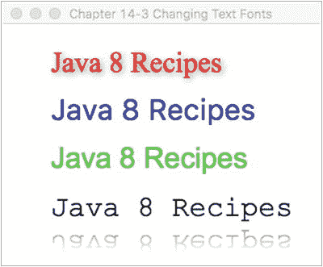

###### 图 14-3。更改文本字体

### 解决方案 2

利用新的 TextFlow 节点来帮助将富文本串在一起。使用 FXML 文件构建对象图，然后将级联样式表(CSS)样式应用于 FXML 中的图节点。对于那些更喜欢使用标记语言而不是 Java 代码的人来说，这个解决方案提供了一个更好的途径。它还演示了如何使用样式表来声明应用的样式。

首先，让我们看看用于构造布局的 FXML。以下几行标记构建了一个场景图，其中包含一个包含 TextFlow 的窗格。TextFlow 包含一系列文本节点，每个节点都应用了不同的样式。以下清单包含 textfonts.fxml 的源代码。

```java
<?xml version="1.0" encoding="UTF-8"?>

<?import java.net.*?>
<?import javafx.geometry.*?>
<?import javafx.scene.*?>
<?import javafx.scene.control.*?>
<?import javafx.scene.layout.*?>
<?import javafx.scene.text.*?>

<Scene width="200" height="75" fill="white" xmlns:fx="http://javafx.com/fxml">
    <stylesheets>
        <URL value="@textfonts.css"/>
    </stylesheets>
    <Pane fx:id="pane">

         <TextFlow styleClass="mainmessage">
            <Text styleClass="span1">Hello </Text>
            <Text text=" "/>
            <Text styleClass="span2, large">Java</Text>
            <Text styleClass="span3, slant">FX</Text>
            <Text text=" "/>
            <Text styleClass="cool">8</Text>

        </TextFlow>
    </Pane>
</Scene>
```

在 FXML 中，导入名为 textfonts.css 的 CSS。下面的列表包含位于 textfonts.css 中的样式。

```java
.mainmessage {
    -fx-font-family: "Helvetica";
    -fx-font-size: 30px;
}

.span1 {
    -fx-color: "red";
}

.span2 {
    -fx-font-family: "Serif";
    -fx-font-size: 30px;
    -fx-color: "red";
}

.span3 {
    -fx-font-family: "Serif";
    -fx-font-size: 30px;
    -fx-fill: "orange";
    -fx-font-style: italic;
}

.cool {
    -fx-effect: dropshadow(gaussian, gray, 8, 0.5, 8, 8);
}
```

最后，使用一个标准的 JavaFX 应用类来实例化该示例。以下资料来自 ChangingTextFontsSolution2.java，它们演示了如何加载 FXML 和构建 stage。

```java
@Override
public void start(Stage stage) throws Exception {
    stage.setTitle("Chapter 14-3 Changing Text Fonts Using TextFlow and FXML");
    stage.setScene((Scene) FXMLLoader.load(getClass().getResource("textfonts.fxml")));
    stage.show();
}
```

生成的应用将渲染一个类似于图 [14-4](#Fig4) 所示结果的场景。


###### 图 14-4。TextFlow 和 FXML

### 它是如何工作的

解决方案 1 演示了如何使用标准 Java 代码将字体应用于文本。基于矢量的图形允许您缩放形状和应用效果，而没有像素化(锯齿)的问题。JavaFX 节点使用基于矢量的图形。在每个文本节点中，您可以创建和设置要渲染到场景图形上的字体。下面是在文本节点上创建和设置字体的代码:

```java
Text java9recipes2 = new Text(50, 50, "Java 9 Recipes");
Font serif = Font.font("Serif", 30);
Java9recipes2.setFont(serif);
```

在解决方案 1 中，投影是一个真实效果(drop shadow)对象，实际上应用于单个文本节点实例。DropShadow 对象被设置为基于相对于文本节点的 x 和 y 偏移进行定位。你也可以设置阴影的颜色；这里我们设置它为灰色，不透明度为 0.588。以下是使用投影效果(drop shadow)设置文本节点的 effect 属性的示例:

```java
DropShadow dropShadow = new DropShadow();
dropShadow.setOffsetX(2.0f);
dropShadow.setOffsetY(2.0f);
dropShadow.setColor(Color.rgb(50, 50, 50, .588));
java9recipes2.setEffect(dropShadow);
```

虽然这个菜谱是关于设置文本字体的，但是它也将效果应用到了文本节点。又增加了一个效果(只是提升了一个档次)。当使用等宽字体创建最后一个文本节点时，应用了流行的反射效果。代码后的代码被设置为显示 0.8 或 80%的反射。反射值的范围从零(0%)到一(100%)。以下代码片段实现了浮点值为 0.8f 的 80%反射:

```java
Reflection refl = new Reflection();
refl.setFraction(0.8f);
java9recipes5.setEffect(refl);
```

解决方案 2 演示了如何使用 FXML、CSS 和 Java 构建用户界面。虽然这份食谱侧重于文本和字体，但重要的是要注意 FXML 解决方案显然遵循模型-视图-控制器标准，将 UI 代码与业务逻辑分离开来。同样需要注意的是，如果本例中的 UI 包含按钮或其他包含动作的节点，那么也需要创建一个控制器类来实现动作逻辑。

在第二个示例中，FXML 文件包含用户界面的结构化布局，该布局由场景、窗格、TextFlow 和一系列文本节点组成。该场景包含一个<stylesheets>元素，用于指定将哪些样式表应用于 XML 中的元素。Pane 节点用作布局的基础，它包含 UI 中的每个其他节点。TextFlow 节点是在 JavaFX 8 中引入的，它是一种特殊的布局，用于布局富文本。TextFlow 可以将许多不同的文本节点放入单个流中。</stylesheets>

正如您在 FXML 中看到的，TextFlow 中的每个文本节点都有不同的关联样式，这是基于附加样式表中定义的样式。JavaFX 样式表中样式的属性以–FX-开头，属性名和值由冒号分隔，以分号(；).在很大程度上，JavaFX 样式属性与标准 CSS 属性非常一致。有关完整的摘要，请参考位于[http://docs . Oracle . com/Java FX/2/CSS _ tutorial/jfxpub-CSS _ tutorial . htm](http://docs.oracle.com/javafx/2/css_tutorial/jfxpub-css_tutorial.htm)的文档。

TextFlow 使用嵌入其中的每个节点的文本和字体，以及它自己的宽度和文本对齐方式来确定文本的位置。文本之外的节点也可以嵌入到 TextFlow 中。向 TextFlow 添加文本节点时，可以通过 setMaxWidth()方法指定 TextFlow 的最大宽度来设置自动换行。也可以在文本节点中的任何字符串末尾包含一个\n 来开始换行。以下代码执行与 1 相同的解决方案，但使用 TextFlow 来布局文本节点，而不是分别将每个节点添加到场景图中。

```java
primaryStage.setTitle("Chapter 14-3 Changing Text Fonts");
Group root = new Group();
Scene scene = new Scene(root, 330, 250, Color.WHITE);

// Serif with drop shadow
Text java9recipes2 = new Text(50, 50, "Java 9 Recipes");
Font serif = Font.font("Serif", 30);
java9recipes2.setFont(serif);
java9recipes2.setFill(Color.RED);
DropShadow dropShadow = new DropShadow();
dropShadow.setOffsetX(2.0f);
dropShadow.setOffsetY(2.0f);
dropShadow.setColor(Color.rgb(50, 50, 50, .588));
java9recipes2.setEffect(dropShadow);

// SanSerif
Text java9recipes3 = new Text(50, 100, "Java 8 Recipes\n");
Font sanSerif = Font.font("SanSerif", 30);
java9recipes3.setFont(sanSerif);
java9recipes3.setFill(Color.BLUE);

// Dialog
Text java9recipes4 = new Text(50, 150, "Java 8 Recipes\n");
Font dialogFont = Font.font("Dialog", 30);
java9recipes4.setFont(dialogFont);
java9recipes4.setFill(Color.rgb(0, 255, 0));

// Monospaced
Text java9recipes5 = new Text(50, 200, "Java 8 Recipes");
Font monoFont = Font.font("Monospaced", 30);
java9recipes5.setFont(monoFont);
java9recipes5.setFill(Color.BLACK);

Reflection refl = new Reflection();
refl.setFraction(0.8f);
java9recipes5.setEffect(refl);
TextFlow flow = new TextFlow(java9recipes2, java9recipes3, java9recipes4, java9recipes5);

root.getChildren().add(flow);
```

这个食谱中引入了很多概念。您将在后面的菜谱中了解更多关于 FXML 的内容，或者更多信息，您可以在 http://docs . Oracle . com/Java FX/2/get _ started/FXML:tutorial . htm 上查看在线文档。你可以在[http://docs . Oracle . com/javase/8/Java FX/API/Java FX/scene/text/TextFlow . html](http://docs.oracle.com/javase/8/javafx/api/javafx/scene/text/TextFlow.html)阅读文档了解更多关于 TextFlow 布局的信息。

## 14-4.创建形状

### 问题

您希望创建放置在场景图上的形状。

### 解决办法

在 javafx.scene.shape.*包中使用 JavaFX 的 Arc、Circle、CubicCurve、Ellipse、Line、Path、Polygon、Polyline、QuadCurve、Rectangle、SVGPath 和 Text 类。下面的代码绘制了各种复杂的形状。第一个复杂的形状包括一条以正弦波形状绘制的三次曲线。下一个形状称为冰淇淋甜筒，它使用包含路径元素的 path 类(javafx.scene.shape.PathElement)。第三个形状是二次贝塞尔曲线(QuadCurve ),它形成一个微笑。最终的形状是一个美味的甜甜圈。您可以通过减去两个椭圆(一个较小，一个较大)来创建这个圆环形状:

```java
@Override
public void start(Stage primaryStage) {
    primaryStage.setTitle("Chapter 14-4 Creating Shapes");
    Group root = new Group();
    Scene scene = new Scene(root, 306, 550, Color.WHITE);

    // CubicCurve
    CubicCurve cubicCurve = new CubicCurve();
    cubicCurve.setStartX(50);
    cubicCurve.setStartY(75); // start pt (x1,y1)
    cubicCurve.setControlX1(80);
    cubicCurve.setControlY1(-25);// control pt1
    cubicCurve.setControlX2(110);
    cubicCurve.setControlY2(175);  // control pt2
    cubicCurve.setEndX(140);
    cubicCurve.setEndY(75);
    cubicCurve.setStrokeType(StrokeType.CENTERED);
    cubicCurve.setStrokeWidth(1);
    cubicCurve.setStroke(Color.BLACK);
    cubicCurve.setStrokeWidth(3);
    cubicCurve.setFill(Color.WHITE);

    root.getChildren().add(cubicCurve);

    // Ice cream
    Path path = new Path();

    MoveTo moveTo = new MoveTo();
    moveTo.setX(50);
    moveTo.setY(150);

    QuadCurveTo quadCurveTo = new QuadCurveTo();
    quadCurveTo.setX(150);
    quadCurveTo.setY(150);
    quadCurveTo.setControlX(100);
    quadCurveTo.setControlY(50);

    LineTo lineTo1 = new LineTo();
    lineTo1.setX(50);
    lineTo1.setY(150);

    LineTo lineTo2 = new LineTo();
    lineTo2.setX(100);
    lineTo2.setY(275);

    LineTo lineTo3 = new LineTo();
    lineTo3.setX(150);
    lineTo3.setY(150);
    path.getElements().add(moveTo);
    path.getElements().add(quadCurveTo);
    path.getElements().add(lineTo1);
    path.getElements().add(lineTo2);
    path.getElements().add(lineTo3);
    path.setTranslateY(30);
    path.setStrokeWidth(3);
    path.setStroke(Color.BLACK);

    root.getChildren().add(path);

    // QuadCurve create a smile
    QuadCurve quad = new QuadCurve();
    quad.setStartX(50);
    quad.setStartY(50);
    quad.setEndX(150);
    quad.setEndY(50);
    quad.setControlX(125);
    quad.setControlY(150);
    quad.setTranslateY(path.getBoundsInParent().getMaxY());
    quad.setStrokeWidth(3);
    quad.setStroke(Color.BLACK);
    quad.setFill(Color.WHITE);

    root.getChildren().add(quad);

    // outer donut
    Ellipse bigCircle = new Ellipse(100, 100, 50, 75/2);
    //bigCircle.setTranslateY(quad.getBoundsInParent().getMaxY());
    bigCircle.setStrokeWidth(3);
    bigCircle.setStroke(Color.BLACK);
    bigCircle.setFill(Color.WHITE);

    // donut hole
    Ellipse smallCircle = new Ellipse(100, 100, 35/2, 25/2);

    // make a donut
    Shape donut = Path.subtract(bigCircle, smallCircle);
    donut.setStrokeWidth(1);
    donut.setStroke(Color.BLACK);
    // orange glaze
    donut.setFill(Color.rgb(255, 200, 0));

    // add drop shadow
    DropShadow dropShadow = new DropShadow();
    dropShadow.setOffsetX(2.0f);
    dropShadow.setOffsetY(2.0f);
    dropShadow.setColor(Color.rgb(50, 50, 50, .588));

    donut.setEffect(dropShadow);

    // move slightly down for spacing
    donut.setTranslateY(quad.getBoundsInParent().getMinY() + 10);

    root.getChildren().add(donut);

    primaryStage.setScene(scene);
    primaryStage.show();
}
```

图 [14-5](#Fig5) 显示了使用 JavaFX 创建的正弦波、冰淇淋甜筒、微笑和甜甜圈形状。

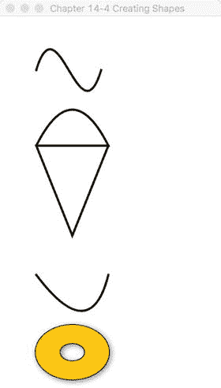

###### 图 14-5。创建形状

### 它是如何工作的

在这个解决方案中，您生成了一些基本的 2D 形状。第一个形状是 javafx.scene.shape.CubicCurve 类，它允许您构造一个三次曲线(“曲线”)效果。要创建三次曲线，只需查找要实例化的适当构造函数。以下代码片段用于创建 javafx.scene.shape.CubicCurve 实例:

```java
CubicCurve cubicCurve = new CubicCurve();
cubicCurve.setStartX(50);
cubicCurve.setStartY(75); // start pt (x1,y1)
cubicCurve.setControlX1(80);
cubicCurve.setControlY1(-25);// control pt1
cubicCurve.setControlX2(110);
cubicCurve.setControlY2(175);  // control pt2
cubicCurve.setEndX(140);
cubicCurve.setEndY(75);
cubicCurve.setStrokeType(StrokeType.CENTERED);
cubicCurve.setStrokeWidth(1);
cubicCurve.setStroke(Color.BLACK);
cubicCurve.setStrokeWidth(3);
cubicCurve.setFill(Color.WHITE);
```

首先实例化一个 CubicCurve()实例。接下来，通过利用对象的 setter 方法并向每个方法传递一个值，以任意顺序指定曲线的属性。在 CubicCurve()对象上指定值后，可以使用以下符号将其添加到场景图中:

```java
root.getChildren().add(cubicCurve);
```

冰淇淋甜筒形状是使用 javafx.scene.shape.Path 类创建的。当每个 path 元素被创建并添加到 Path 对象中时，每个元素都不被视为图形节点(javafx.scene.Node)。这意味着它们不是从 javafx.scene.shape.Shape 类扩展的，并且不能是要显示的场景图中的子节点。当查看 Javadoc 时(请参见[http://docs . Oracle . com/javase/8/Java FX/API/Java FX/scene/shape/Path . html](http://docs.oracle.com/javase/8/javafx/api/javafx/scene/shape/Path.html))，您会注意到 Path 类是从 Shape 类扩展而来的，Shape 类又是从(javafx.scene.Node)类扩展而来的，因此 Path 是一个图形节点，但是 Path 元素不是从 Shape 类扩展而来的。Path 元素实际上是从 javafx.scene.shape.PathElement 类扩展而来的，该类仅用于 Path 对象的上下文中。因此，您将无法实例化一个 LineTo 类来放入场景图中。只要记住以 To 作为后缀的类是路径元素，而不是真正的形状节点。例如，MoveTo 和 LineTo 对象实例是添加到 Path 对象的路径元素，而不是可以添加到场景中的形状。以下是添加到 Path 对象中用于绘制冰淇淋蛋卷的路径元素:

```java
// Ice cream
Path path = new Path();

MoveTo moveTo = new MoveTo();
moveTo.setX(50);
moveTo.setY(150);

...// Additional Path Elements created.
LineTo lineTo1 = new LineTo();
lineTo1.setX(50);
lineTo1.setY(150);

...// Additional Path Elements created.

path.getElements().add(moveTo);
path.getElements().add(quadCurveTo);
path.getElements().add(lineTo1);
```

渲染 QuadCurve (smile)对象时，实例化一个新的 QuadCurve 对象，并相应地设置每个属性。同样，每个属性都接受一个值。

最后是有投影效果的美味甜甜圈形状，它实际上是由两个圆形椭圆创建的。通过从较大的椭圆区域中减去较小的椭圆(圆环孔)，使用 Path.subtract()方法创建并返回一个新的派生形状。以下是使用 Path.subtract()方法创建圆环形状的代码片段:

```java
// outer donut
Ellipse bigCircle = ...//Outer shape area

// donut hole
Ellipse smallCircle = ...// Inner shape area

// make a donut
Shape donut = Path.subtract(bigCircle, smallCircle);
```

接下来，投影效果被添加到甜甜圈。这一次，与前一个配方类似，不再绘制两次形状，而是绘制一次，并使用 setEffect()方法将 DropShadow 对象实例应用于圆环形状对象。与前面的技术类似，通过调用 setOffsetX()和 setOffsetY()来设置阴影的偏移。

###### 注意

在以前的版本中，可以使用构建器对象更容易地创建形状。然而，由于性能和膨胀问题，构建器类被从 JavaFX 8+中移除。如果您正在维护利用构建器类的代码，建议您远离它们，使用标准对象，如本食谱所示。

## 14-5.给对象分配颜色

### 问题

您希望用简单的颜色和渐变颜色填充形状。

### 解决办法

在 JavaFX 中，所有形状都可以用简单颜色和渐变颜色填充。以下是用于填充形状节点的主要类:

```java
javafx.scene.paint.Color
javafx.scene.paint.LinearGradient
javafx.scene.paint.Stop
javafx.scene.paint.RadialGradient
```

下面的代码使用前面的类向形状添加径向和线性渐变颜色以及透明(alpha 通道级别)颜色。这个食谱使用了一个椭圆、一个矩形和一个圆角矩形。一条黑色实线(如图 [14-5](#Fig5) 所示)也出现在配方中，以展示形状颜色的透明度。

```java
public void start(Stage primaryStage) {
    primaryStage.setTitle("Chapter 14-5 Assigning Colors To Objects");
    Group root = new Group();
    Scene scene = new Scene(root, 350, 300, Color.WHITE);

    Ellipse ellipse = new Ellipse(100, 50 + 70/2, 50, 70/2);
    RadialGradient gradient1 = new RadialGradient(0,
                                                  .1,    // focus angle
                                                  80,    // focus distance
                                                  45,    // centerX
                                                  120,   // centerY
                                                  false, // proportional
                                                  CycleMethod.NO_CYCLE,
                                                  new Stop(0, Color.RED), new Stop(1, Color.BLACK));

    ellipse.setFill(gradient1);
    root.getChildren().add(ellipse);

    // Create line
    Line blackLine = new Line();
    blackLine.setStartX(170);
    blackLine.setStartY(30);
    blackLine.setEndX(20);
    blackLine.setEndY(140);
    blackLine.setFill(Color.BLACK);
    blackLine.setStrokeWidth(10.0f);
    blackLine.setTranslateY(ellipse.prefHeight(-1) + ellipse.getLayoutY() + 10);

    root.getChildren().add(blackLine);

    // Create rectangle
    Rectangle rectangle = new Rectangle();
    rectangle.setX(50);
    rectangle.setY(50);
    rectangle.setWidth(100);
    rectangle.setHeight(70);
    rectangle.setTranslateY(ellipse.prefHeight(-1) + ellipse.getLayoutY() + 10);

    // Create linear gradient
    LinearGradient linearGrad = new LinearGradient(
          50,     //startX
          50,     //startY
          50,     //endX
          50 + rectangle.prefHeight(-1) + 25,     //endY
          false,  //proportional
          CycleMethod.NO_CYCLE,
          new Stop(0.1f, Color.rgb(255, 200, 0, .784)),
          new Stop(1.0f, Color.rgb(0, 0, 0, .784)));

    rectangle.setFill(linearGrad);
    root.getChildren().add(rectangle);

    // Create rectangle with rounded corners
    Rectangle roundRect = new Rectangle();
    roundRect.setX(50);
    roundRect.setY(50);
    roundRect.setWidth(100);
    roundRect.setHeight(70);
    roundRect.setArcWidth(20);
    roundRect.setArcHeight(20);
    roundRect.setTranslateY(ellipse.prefHeight(-1) +
                        ellipse.getLayoutY() +
                        10 +
                        roundRect.prefHeight(-1) +
                        roundRect.getLayoutY() + 10);

    LinearGradient cycleGrad = new LinearGradient(50,
                                                  50,
                                                  70,
                                                  70,
                                                  false,
                                                  CycleMethod.REFLECT,
                                                  new Stop(0f, Color.rgb(0, 255, 0, .784)),
                                                  new Stop(1.0f, Color.rgb(0, 0, 0, .784)));

    roundRect.setFill(cycleGrad);
    root.getChildren().add(roundRect);

    primaryStage.setScene(scene);
    primaryStage.show();
}
```

图 [14-6](#Fig6) 显示了可应用于形状的各种彩色填充。

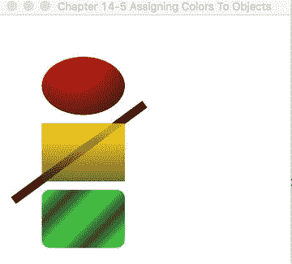

###### 图 14-6。颜色形状

### 它是如何工作的

图 [14-5](#Fig5) 显示了从上到下显示的形状，从椭圆形、矩形和带有彩色渐变填充的圆角矩形开始。当绘制 eclipse 形状时，您将使用径向渐变，看起来好像是一个 3D 球形对象。接下来，创建一个用黄色半透明线性渐变填充的矩形。在黄色矩形后面绘制了一条粗黑线，以展示矩形的半透明颜色。最后，生成一个圆角矩形，该矩形在对角线方向上填充有类似 3D 管的绿黑反射线性渐变。

带有渐变色彩的神奇之处在于，它们常常能让形状看起来很立体。渐变绘画允许您在两种或更多种颜色之间进行插值，从而赋予形状深度。JavaFX 提供了两种类型的渐变:径向渐变(RadialGradient)和线性渐变(LinearGradient)。在示例中，径向渐变(radial gradient)应用于椭圆形状。

表 [14-1](#Tab1) 取自为 RadialGradient 类找到的 JavaFX 8 Javadoc 定义([http://docs . Oracle . com/javase/8/Java FX/API/Java FX/scene/paint/radial gradient . html](http://docs.oracle.com/javase/8/javafx/api/javafx/scene/paint/RadialGradient.html))。

###### 表 14-1。辐射梯度属性

<colgroup class="calibre15"><col class="calibre16"> <col class="calibre16"> <col class="calibre16"></colgroup> 
| 

财产

 | 

数据类型

 | 

描述

 |
| --- | --- | --- |
| 聚焦角度 | 两倍 | 从渐变中心到第一种颜色映射到的焦点的角度，以度为单位 |
| 焦距 | 两倍 | 从渐变中心到第一种颜色映射到的焦点的距离 |
| 中心(c) | 两倍 | 渐变圆中心点的 x 坐标 |
| 百年 | 两倍 | 渐变圆中心点的 y 坐标 |
| 半径 | 两倍 | 定义颜色渐变范围的圆的半径 |
| 相称的 | 布尔 | 坐标和大小与渐变填充的形状成比例 |
| 循环法 | 循环法 | 应用于渐变的循环方法 |
| 不透明光圈 | 布尔列表 | 油漆是否完全不透明渐变的颜色规格 |

在此配方中，聚焦角度设置为零，距离设置为 0.1，中心 X 和 Y 设置为(80，45)，半径设置为 120 像素，比例设置为假，循环方法设置为无循环(循环方法。NO_CYCLE)，并将两个颜色停止值设置为红色(彩色。红色)和黑色(彩色。黑色)。这些设置通过在(80，45)的中心位置(椭圆的左上方)从红色开始创建径向渐变，然后以 120 像素的距离(半径)将其插值到黑色。

接下来，创建一个具有黄色半透明线性渐变的矩形。黄色矩形使用线性渐变(linear gradient)绘制。

表 [14-2](#Tab2) 取自为 LinearGradient 类找到的 JavaFX 8 Javadoc 定义(参见[http://docs . Oracle . com/javase/8/Java FX/API/Java FX/scene/paint/linear gradient . html](http://docs.oracle.com/javase/8/javafx/api/javafx/scene/paint/LinearGradient.html))。

###### 表 14-2。线性梯度属性

<colgroup class="calibre15"><col class="calibre16"> <col class="calibre16"> <col class="calibre16"></colgroup> 
| 

财产

 | 

数据类型

 | 

描述

 |
| --- | --- | --- |
| 启动 X | 两倍 | 渐变轴起点的 x 坐标 |
| 起始 Y | 两倍 | 渐变轴起点的 y 坐标 |
| endX(结束 x) | 两倍 | 渐变轴终点的 x 坐标 |
| 周国贤 | 两倍 | 渐变轴终点的 y 坐标 |
| 相称的 | 布尔 | 坐标是否与此渐变填充的形状成比例 |
| 循环法不透明 | 布尔循环方法 | 应用于渐变的循环方法是否该绘画是完全不透明的 |
| 停止 | 列表 | 渐变的颜色规格 |

要创建线性渐变绘画，请指定 startX、startY、endX 和 endY 作为开始点\结束点。起点和终点坐标表示渐变图案的起点和终点。

要创建第二个形状(黄色矩形)，请将起点 X 和 Y 设置为(50，50)，终点 X 和 Y 设置为(50，75)，比例设置为 false，循环方法设置为无循环(cycle method。NO_CYCLE)，并将两个颜色停止值设置为黄色(彩色。黄色)和黑色(彩色。黑色)，alpha 透明度为 0.784。这些设置从上到下为矩形提供线性渐变，起点为(50，50)(矩形的左上角)。然后，它插值到黑色(矩形的左下方)。

最后，您会注意到一个圆角矩形，在对角线方向上使用绿色和黑色重复渐变图案。这是一个简单的线性渐变绘制，与线性渐变绘制(linear gradient)相同，只是起点 X，Y 和终点 X，Y 设置在对角线位置，循环方法设置为反射(cycle method。反映)。当指定循环方法来反映(cycle method。反射)，渐变图案将在颜色之间重复或循环。下面的代码片段实现了具有循环方法 reflect (CycleMethod)的圆角矩形。反映):

```java
LinearGradient cycleGrad = new LinearGradient(50,
                                              50,
                                              70,
                                              70,
                                              false,
                                              CycleMethod.REFLECT,
                                              new Stop(0f, Color.rgb(0, 255, 0, .784)),
                                              new Stop(1.0f, Color.rgb(0, 0, 0, .784)));
```

## 14-6.创建菜单

### 问题

您希望在 JavaFX 应用中创建标准菜单。

### 解决办法

使用 JavaFX 的菜单控件提供标准化的菜单功能，如复选框菜单、单选菜单、子菜单和分隔符。以下是用于创建菜单的主要类。

```java
javafx.scene.control.MenuBar
javafx.scene.control.Menu
javafx.scene.control.MenuItem
```

下面的代码调用前面列出的所有菜单功能。该示例代码模拟了一个建筑安全应用，其中包含打开摄像机、发出警报和选择应急计划的菜单选项。

```java
public void start(Stage primaryStage) {
    primaryStage.setTitle("Chapter 14-6 Creating Menus");
    Group root = new Group();
    Scene scene = new Scene(root, 300, 250, Color.WHITE);

    MenuBar menuBar = new MenuBar();

    // File menu - new, save, exit
    Menu menu = new Menu("File");
    menu.getItems().add(new MenuItem("New"));
    menu.getItems().add(new MenuItem("Save"));
    menu.getItems().add(new SeparatorMenuItem());
    menu.getItems().add(new MenuItem("Exit"));

    menuBar.getMenus().add(menu);

    // Cameras menu - camera 1, camera 2
    Menu tools = new Menu("Cameras");
    CheckMenuItem item1 = new CheckMenuItem();
    item1.setText("Show Camera 1");
    item1.setSelected(true);
    tools.getItems().add(item1);

    CheckMenuItem item2 = new CheckMenuItem();
    item2.setText("Show Camera 2");
    item2.setSelected(true);
    tools.getItems().add(item2);

    menuBar.getMenus().add(tools);

    // Alarm
    Menu alarm = new Menu("Alarm");
    ToggleGroup tGroup = new ToggleGroup();

    RadioMenuItem soundAlarmItem = new RadioMenuItem();
    soundAlarmItem.setToggleGroup(tGroup);
    soundAlarmItem.setText("Sound Alarm");

    RadioMenuItem stopAlarmItem = new RadioMenuItem();
    stopAlarmItem.setToggleGroup(tGroup);
    stopAlarmItem.setText("Alarm Off");
    stopAlarmItem.setSelected(true);

    alarm.getItems().add(soundAlarmItem);
    alarm.getItems().add(stopAlarmItem);

    Menu contingencyPlans = new Menu("Contingent Plans");
    contingencyPlans.getItems().add(new CheckMenuItem("Self Destruct in T minus 50"));
    contingencyPlans.getItems().add(new CheckMenuItem("Turn off the coffee machine "));
    contingencyPlans.getItems().add(new CheckMenuItem("Run for your lives! "));

    alarm.getItems().add(contingencyPlans);
    menuBar.getMenus().add(alarm);

    menuBar.prefWidthProperty().bind(primaryStage.widthProperty());

    root.getChildren().add(menuBar);
    primaryStage.setScene(scene);
    primaryStage.show();
}
```

图 [14-7](#Fig7) 显示了一个模拟的建筑安全应用，包含检查和子菜单项。


###### 图 14-7。创建菜单

### 它是如何工作的

菜单提供了允许用户从窗口平台应用中选择选项的标准方式。菜单也应该有热键或键盘等价物。用户通常希望使用键盘而不是鼠标来浏览菜单。这个食谱与食谱 14-8 相似，你会注意到许多相似之处。

要创建菜单，首先创建一个 MenuBar 实例，它将包含一对多菜单(MenuItem)对象。创建菜单栏:

```java
MenuBar menuBar = new MenuBar();
```

第二，创建包含一对多菜单项(menu item)对象的菜单(menu)对象，以及构成子菜单的其他菜单对象。要创建菜单:

```java
Menu menu = new Menu("File");
```

第三，创建要添加到 menu 对象的菜单项，例如 menu (MenuItem)、check (CheckMenuItem)和 radio 菜单项(RadioMenuItem)。菜单项中可以有图标。我们不会在菜谱中展示这一点，但我们鼓励您探索所有菜单项(MenuItem)的各种构造函数。在创建单选菜单项(radio menu item)时，应该注意 ToggleGroup 类。ToggleGroup 类也用在常规单选按钮(radio buttons)上，以便在任何时候只允许选择一个选项。下面的代码创建要添加到 menu 对象中的单选菜单项(radio menu items):

```java
// Alarm
Menu alarm = new Menu("Alarm");
ToggleGroup tGroup = new ToggleGroup();

RadioMenuItem soundAlarmItem = new RadioMenuItem();
soundAlarmItem.setToggleGroup(tGroup);
soundAlarmItem.setText("Sound Alarm");

RadioMenuItem stopAlarmItem = new RadioMenuItem();
stopAlarmItem.setToggleGroup(tGroup);
stopAlarmItem.setText("Alarm Off");
stopAlarmItem.setSelected(true);

alarm.getItems().add(soundAlarmItem);
alarm.getItems().add(stopAlarmItem);
```

有时，您可能希望用可视的行分隔符来分隔菜单项。若要创建可视分隔符，请创建一个 SeparatorMenuItem 类的实例，并通过 getItems()方法将其添加到菜单中。getItems()方法返回 MenuItem 对象的可观察列表(ObservableList )。正如你将在食谱 14-10 中看到的，当收藏中的物品被改变时，你会得到通知。下面的代码行向菜单添加了一个可视的行分隔符(SeparatorMenuItem):

```java
menu.getItems().add(new SeparatorMenuItem());
```

使用的其他菜单项是 check 菜单项(check menu item)和 radio 菜单项(radio menu item)，它们分别类似于 JavaFX UI 控件复选框(check box)和单选按钮(radio button)中的对应项。

在将菜单栏添加到场景中之前，您会注意到通过 bind()方法在菜单栏的首选宽度和舞台对象的宽度之间的绑定属性。当绑定这些属性时，当用户调整屏幕大小时，你会看到菜单栏的宽度拉伸。你将在 14-9 中看到绑定是如何工作的。此代码片段显示了菜单栏的 width 属性和舞台的 width 属性之间的绑定。

```java
menuBar.prefWidthProperty().bind(primaryStage.widthProperty());
root.getChildren().add(menuBar);
```

## 14-7.向布局添加组件

### 问题

您希望将 UI 组件添加到类似于网格类型布局的布局中，以便于放置。

### 解决办法

使用 JavaFX 的 javafx.scene.layout.GridPane 类。此源代码实现了一个简单的 UI 表单，包含名和姓字段控件，并使用网格窗格布局节点(javafx.scene.layout.GridPane):

```java
GridPane gridpane = new GridPane();
gridpane.setPadding(new Insets(5));
gridpane.setHgap(5);
gridpane.setVgap(5);

Label fNameLbl = new Label("First Name");
TextField fNameFld = new TextField();
Label lNameLbl = new Label("First Name");
TextField lNameFld = new TextField();
Button saveButt = new Button("Save");

// First name label
GridPane.setHalignment(fNameLbl, HPos.RIGHT);
gridpane.add(fNameLbl, 0, 0);

// Last name label
GridPane.setHalignment(lNameLbl, HPos.RIGHT);
gridpane.add(lNameLbl, 0, 1);

// First name field
GridPane.setHalignment(fNameFld, HPos.LEFT);       
gridpane.add(fNameFld, 1, 0);

// Last name field
GridPane.setHalignment(lNameFld, HPos.LEFT);
gridpane.add(lNameFld, 1, 1);

// Save button
GridPane.setHalignment(saveButt, HPos.RIGHT);
gridpane.add(saveButt, 1, 2);

root.getChildren().add(gridpane);    
```

图 [14-8](#Fig8) 描述了一个包含 UI 控件的小表单，它使用了一个网格窗格布局节点。


###### 图 14-8。向布局添加控件

### 它是如何工作的

构建用户界面的最大挑战之一是如何将控件放置在显示区域。在开发 GUI 应用时，最理想的是应用允许用户移动和调整其可视区域的大小，同时保持愉快的用户体验。与 Java Swing 类似，JavaFX layout 有一些常用的布局，它们提供了在场景图上显示 UI 控件的最常见方式。这个菜谱演示了 GridPane 类。

回想一下菜谱 14-4，其中您实现了一个自定义布局，以类似网格的方式显示组件。您可能会注意到相似之处，但是我们遗漏了许多实现特性，比如调整最小/最大尺寸、填充和垂直对齐。令人惊讶的是，JavaFX 团队已经创建了一个健壮的类似网格的布局，称为 GridPane。

首先创建一个 GridPane 的实例。接下来，使用插入对象的实例设置填充。设置填充后，只需设置水平和垂直间距。以下代码片段实例化了一个网格窗格(grid pane)，其填充、水平和垂直间距设置为 5(像素):

```java
GridPane gridpane = new GridPane();
gridpane.setPadding(new Insets(5));
gridpane.setHgap(5);
gridpane.setVgap(5);
```

填充是区域内容周围的顶部、右侧、底部和左侧间距，以像素为单位。当获得首选大小时，填充将包括在计算中。设置水平和垂直间距与单元格内 UI 控件之间的间距有关。

接下来，只需将每个 UI 控件放入各自的单元格位置。所有单元格都是零相对的。以下代码片段将“保存”按钮 UI 控件添加到单元格(1，2)处的网格窗格布局节点(grid pane)中:

```java
gridpane.add(saveButt, 1, 2);
```

该布局还允许您在单元格中水平或垂直对齐控件。以下代码语句将“保存”按钮右对齐:

```java
GridPane.setHalignment(saveButt, HPos.RIGHT);
```

## 14-8.生成边框

### 问题

您想要创建和自定义图像周围的边框。

### 解决办法

使用 JavaFX 的 CSS 样式 API 创建一个应用来动态定制边框区域。

下面的代码创建一个应用，该应用具有一个 CSS 编辑器文本区域和一个围绕图像的边框视图区域。默认情况下，编辑器的文本区域将包含 JavaFX 样式选择器，这些选择器在图像周围创建一条蓝色虚线。您将有机会在 CSS 编辑器中通过单击 Bling 来修改样式选择器的值！按钮来应用边框设置。

```java
primaryStage.setTitle("Chapter 14-8 Generating Borders");
Group root = new Group();
Scene scene = new Scene(root, 600, 330, Color.WHITE);

// create a grid pane
GridPane gridpane = new GridPane();
gridpane.setPadding(new Insets(5));
gridpane.setHgap(10);
gridpane.setVgap(10);

// label CSS Editor
Label cssEditorLbl = new Label("CSS Editor");
GridPane.setHalignment(cssEditorLbl, HPos.CENTER);
gridpane.add(cssEditorLbl, 0, 0);

// label Border View
Label borderLbl = new Label("Border View");
GridPane.setHalignment(borderLbl, HPos.CENTER);
gridpane.add(borderLbl, 1, 0);

// Text area for CSS editor
final TextArea cssEditorFld = new TextArea();
cssEditorFld.setPrefRowCount(10);
cssEditorFld.setPrefColumnCount(100);
cssEditorFld.setWrapText(true);
cssEditorFld.setPrefWidth(150);
GridPane.setHalignment(cssEditorFld, HPos.CENTER);
gridpane.add(cssEditorFld, 0, 1);

String cssDefault = "-fx-border-color: blue;\n"
        + "-fx-border-insets: 5;\n"
        + "-fx-border-width: 3;\n"
        + "-fx-border-style: dashed;\n";

cssEditorFld.setText(cssDefault);

// Border decorate the picture
final ImageView imv = new ImageView();
final Image image2 = new Image(GeneratingBorders.class.getResourceAsStream("smoke_glass_buttons1.png"));
imv.setImage(image2);

final HBox pictureRegion = new HBox();
pictureRegion.setStyle(cssDefault);
pictureRegion.getChildren().add(imv);
gridpane.add(pictureRegion, 1, 1);

Button apply = new Button("Bling!");
GridPane.setHalignment(apply, HPos.RIGHT);
gridpane.add(apply, 0, 2);

apply.setOnAction((e) -> {
    pictureRegion.setStyle(cssEditorFld.getText());
});

root.getChildren().add(gridpane);
primaryStage.setScene(scene);
primaryStage.show();
```

图 [14-9](#Fig9) 展示了边框定制应用。

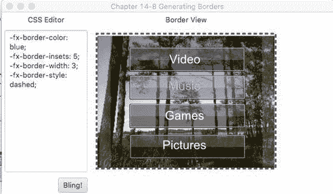

###### 图 14-9。生成边框

### 它是如何工作的

JavaFX 能够设计 JavaFX 节点的样式，类似于 web 开发领域中的 CSS(也在 Recipe 14-3 中演示)。这种强大的 API 可以改变节点的背景颜色、字体、边框和许多其他属性，本质上允许开发人员或设计人员使用 CSS 为 GUI 控件换肤。

这个解决方案允许用户在左边的文本区域输入 JavaFX CSS 样式。按钮，在右边显示的图像周围应用样式。根据节点的类型，可以设置的样式是有限制的。要查看所有样式选择器的完整列表，请参考 JavaFX CSS 参考指南:[http://docs . Oracle . com/Java se/8/Java FX/API/Java FX/scene/doc-files/CSS ref . html](http://docs.oracle.com/javase/8/javafx/api/javafx/scene/doc-files/cssref.html)。

在应用 JavaFX CSS 样式的第一步中，您必须确定要样式化的节点类型。在各种节点类型上设置属性时，您会发现某些节点有局限性。在这个配方中，目的是在 ImageView 对象周围放置一个边框。因为 ImageView 不是从 Region 扩展的，所以它不包含边框样式属性。因此，要解决这个问题，只需创建一个 HBox 布局来包含 imageView，并对 HBox 应用 JavaFX CSS。以下代码使用 setStyle()方法将 JavaFX CSS 边框样式应用于水平框区域(HBox ):

```java
String cssDefault = "-fx-border-color: blue;\n"
     + "-fx-border-insets: 5;\n"
     + "-fx-border-width: 3;\n"
 + "-fx-border-style: dashed;\n";
final ImageView imv = new ImageView();
...//
final HBox pictureRegion = new HBox();
**pictureRegion.setStyle(cssDefault);** 
pictureRegion.getChildren().add(imv);
```

## 14-9.绑定表达式

### 问题

您希望同步两个值之间的更改。

### 解决办法

使用 javafx.beans.binding.*和 javafx.beans.property.*包绑定变量。绑定值或属性时，需要考虑多个场景。该配方演示了以下三种绑定策略:

*   Java Bean 上的双向绑定

*   使用 Fluent API 的高级绑定

*   使用 javafx.beans.binding.* binding 对象的低级绑定

以下代码是实现这三种策略的控制台应用。控制台应用将基于各种绑定场景输出属性值。第一个场景是字符串属性变量和域对象(Contact)拥有的字符串属性(如 firstName 属性)之间的双向绑定。下一个场景是使用 fluent 接口 API 计算矩形面积的高级绑定。最后一个场景是使用低级绑定策略来计算球体的体积。高级绑定和低级绑定的区别在于，高级绑定使用 multiply()和 subtract()等方法，而不是运算符*和-。使用低级绑定时，使用派生的 NumberBinding 类，如 DoubleBinding 类。使用 DoubleBinding 类，您可以覆盖它的 computeValue()方法，这样您就可以使用熟悉的运算符，如*和-来表达复杂的数学方程:

```java
package org.java9recipes.chapter14.recipe14_09;

import javafx.beans.binding.DoubleBinding;
import javafx.beans.binding.NumberBinding;
import javafx.beans.property.DoubleProperty;
import javafx.beans.property.IntegerProperty;
import javafx.beans.property.SimpleDoubleProperty;
import javafx.beans.property.SimpleIntegerProperty;
import javafx.beans.property.SimpleStringProperty;
import javafx.beans.property.StringProperty;

/**
 * Recipe 14-9: Binding Expressions
 * @author cdea
 * Update:  J. Juneau
 */
public class BindingExpressions {

    /**
     * @param args the command line arguments
     */
    public static void main(String[] args) {
        System.out.println("Chapter 14-9 Binding Expressions\n");

        System.out.println("Binding a Contact bean [Bi-directional binding]");
        Contact contact = new Contact("John", "Doe");
        StringProperty fname = new SimpleStringProperty();
        fname.bindBidirectional(contact.firstNameProperty());
        StringProperty lname = new SimpleStringProperty();
        lname.bindBidirectional(contact.lastNameProperty());

        System.out.println("Current - StringProperty values   : " + fname.getValue() + " " + lname.getValue());
        System.out.println("Current - Contact values          : " + contact.getFirstName() + " " + contact.getLastName());

        System.out.println("Modifying StringProperty values");
        fname.setValue("Jane");
        lname.setValue("Deer");

        System.out.println("After - StringProperty values   : " + fname.getValue() + " " + lname.getValue());
        System.out.println("After - Contact values          : " + contact.getFirstName() + " " + contact.getLastName());

        System.out.println();
        System.out.println("A Area of a Rectangle [High level Fluent API]");

        // Area = width * height
        final IntegerProperty width = new SimpleIntegerProperty(10);
        final IntegerProperty height = new SimpleIntegerProperty(10);

        NumberBinding area = width.multiply(height);

        System.out.println("Current - Width and Height     : " + width.get() + " " + height.get());
        System.out.println("Current - Area of the Rectangle: " + area.getValue());
        System.out.println("Modifying width and height");

        width.set(100);
        height.set(700);

        System.out.println("After - Width and Height     : " + width.get() + " " + height.get());
        System.out.println("After - Area of the Rectangle: " + area.getValue());

        System.out.println();
        System.out.println("A Volume of a Sphere [low level API]");

        // volume = 4/3 * pi r^3
        final DoubleProperty radius = new SimpleDoubleProperty(2);

        DoubleBinding volumeOfSphere = new DoubleBinding() {
            {
                super.bind(radius);
            }

            @Override
            protected double computeValue() {
                return (4 / 3 * Math.PI * Math.pow(radius.get(), 3));
            }
        };

        System.out.println("Current - radius for Sphere: " + radius.get());
        System.out.println("Current - volume for Sphere: " + volumeOfSphere.get());
        System.out.println("Modifying DoubleProperty radius");

        radius.set(50);
        System.out.println("After - radius for Sphere: " + radius.get());
        System.out.println("After - volume for Sphere: " + volumeOfSphere.get());

    }
}

class Contact {

    private SimpleStringProperty firstName = new SimpleStringProperty();
    private SimpleStringProperty lastName = new SimpleStringProperty();

    public Contact(String fn, String ln) {
        firstName.setValue(fn);
        lastName.setValue(ln);
    }

    public final String getFirstName() {
        return firstName.getValue();
    }

    public StringProperty firstNameProperty() {
        return firstName;
    }

    public final void setFirstName(String firstName) {
        this.firstName.setValue(firstName);
    }

    public final String getLastName() {
        return lastName.getValue();
    }

    public StringProperty lastNameProperty() {
        return lastName;
    }

    public final void setLastName(String lastName) {
        this.lastName.setValue(lastName);
    }
}
```

以下输出演示了三种绑定方案:

```java
Binding a Contact bean [Bi-directional binding]
Current - StringProperty values   : John Doe
Current - Contact values          : John Doe
Modifying StringProperty values
After - StringProperty values   : Jane Deer
After - Contact values          : Jane Deer

A Area of a Rectangle [High level Fluent API]
Current - Width and Height     : 10 10
Current - Area of the Rectangle: 100
Modifying width and height
After - Width and Height     : 100 700
After - Area of the Rectangle: 70000

A Volume of a Sphere [low level API]
Current - radius for Sphere: 2.0
Current - volume for Sphere: 25.132741228718345
Modifying DoubleProperty radius
After - radius for Sphere: 50.0
After - volume for Sphere: 392699.0816987241
```

### 它是如何工作的

绑定意味着至少两个值正在同步。这意味着当一个因变量改变时，另一个变量也会改变。JavaFX 提供了许多绑定选项，使开发人员能够同步域对象和 GUI 控件中的属性。这个方法演示了三种常见的绑定场景。

绑定变量最简单的方法之一是使用双向绑定。当域对象包含将要绑定到 GUI 表单的数据时，通常会使用这种场景。这个菜谱创建了一个简单的 contact (Contact)对象，其中包含名和姓。注意使用 SimpleStringProperty 类的实例变量。许多以 Property 结尾的类都是 javafx.beans.Observable 类，它们都可以被绑定。为了绑定这些属性，它们必须是相同的数据类型。在前面的示例中，您在创建的联系人域对象之外创建了 SimpleStringProperty 类型的 first name 和 last name 变量。一旦创建了它们，就可以双向绑定它们，以允许在任一端进行更新。因此，如果您更改域对象，其他绑定属性也会更新。当外部变量被修改时，域对象的属性被更新。下面演示了针对域对象(联系人)上的字符串属性的双向绑定:

```java
Contact contact = new Contact("John", "Doe");
StringProperty fname = new SimpleStringProperty();
fname.bindBidirectional(contact.firstNameProperty());
StringProperty lname = new SimpleStringProperty();
lname.bindBidirectional(contact.lastNameProperty());
```

接下来是如何绑定数字。使用 Fluent API 时，绑定数字很简单。这种高级机制允许开发人员使用简单的算术将变量绑定到计算值。基本上，一个公式“必然”会根据它所绑定的变量的变化来改变它的结果。查看 Javadoc([http://docs . Oracle . com/javase/8/Java FX/API/Java FX/beans/binding/bindings . html](http://docs.oracle.com/javase/8/javafx/api/javafx/beans/binding/Bindings.html))了解所有可用方法和数字类型的详细信息。在本例中，您只需创建一个矩形面积的公式。area (NumberBinding)是绑定，其依赖项是 width 和 height (IntegerProperty)属性。当使用 fluent 接口 API 进行绑定时，您会注意到 multiply()方法。根据 Javadoc，所有属性类都继承自 NumberExpressionBase 类，该类包含基于数字的流畅接口 API。以下代码片段使用了 fluent 接口 API:

```java
// Area = width * height
final IntegerProperty width = new SimpleIntegerProperty(10);
final IntegerProperty height = new SimpleIntegerProperty(10);    
NumberBinding area = width.multiply(height);
```

关于绑定号码的最后一个场景被认为是一种更低级的方法。这允许开发者使用原语和更复杂的数学运算。这里，您使用一个 DoubleBinding 类来求解给定半径的球体的体积。首先实现 computeValue()方法来计算体积。显示了通过覆盖 computeValue()方法来计算球体体积的低级绑定场景:

```java
final DoubleProperty radius = new SimpleDoubleProperty(2);

DoubleBinding volumeOfSphere = new DoubleBinding() {
        {
            super.bind(radius);
        }

        @Override
        protected double computeValue() {
                return (4 / 3 * Math.PI * Math.pow(radius.get(), 3));
        }
};
```

## 14-10.创建和使用可观察列表

### 问题

您希望创建一个包含两个列表视图控件的 GUI 应用，允许用户在两个列表之间传递项目。

### 解决办法

您可以利用 JavaFX 的 Java FX . collections . observable list 和 javafx.scene.control.ListView 类来提供一种模型-视图-控制器(MVC)机制，每当操作后端列表时，该机制都会更新 UI 的列表视图控件。

下面的代码创建了一个包含两个列表的 GUI 应用，允许用户将一个列表中包含的项目发送给另一个列表。在这里，您将创建一个虚构的应用来挑选被认为是英雄的候选人。用户从左边的列表中挑选潜在的候选人，将他们移动到右边的列表中作为英雄。这演示了 UI 列表控件(ListView)与后端存储列表(ObservableList)同步的能力。

```java
public void start(Stage primaryStage) {
    primaryStage.setTitle("Chapter 14-10 Creating and Working with ObservableLists");
    Group root = new Group();
    Scene scene = new Scene(root, 400, 250, Color.WHITE);

    // create a grid pane
    GridPane gridpane = new GridPane();
    gridpane.setPadding(new Insets(5));
    gridpane.setHgap(10);
    gridpane.setVgap(10);

    // candidates label
    Label candidatesLbl = new Label("Candidates");
    GridPane.setHalignment(candidatesLbl, HPos.CENTER);
    gridpane.add(candidatesLbl, 0, 0);

    Label heroesLbl = new Label("Heroes");
    gridpane.add(heroesLbl, 2, 0);
    GridPane.setHalignment(heroesLbl, HPos.CENTER);

    // candidates
    final ObservableList<String> candidates = FXCollections.observableArrayList("Super man",
            "Spider man",
            "Wolverine",
            "Police",
            "Fire Rescue",
            "Soldiers",
            "Dad & Mom",
            "Doctor",
            "Politician",
            "Pastor",
            "Teacher");
    final ListView<String> candidatesListView = new ListView<>(candidates);
    candidatesListView.setPrefWidth(150);
    candidatesListView.setPrefHeight(150);

    gridpane.add(candidatesListView, 0, 1);

    // heros
    final ObservableList<String> heroes = FXCollections.observableArrayList();
    final ListView<String> heroListView = new ListView<>(heroes);
    heroListView.setPrefWidth(150);
    heroListView.setPrefHeight(150);

    gridpane.add(heroListView, 2, 1);

    // select heroes
    Button sendRightButton = new Button(">");
    sendRightButton.setOnAction((e) -> {
            String potential = candidatesListView.getSelectionModel().getSelectedItem();
            if (potential != null) {
                candidatesListView.getSelectionModel().clearSelection();
                candidates.remove(potential);
                heroes.add(potential);
            }       
    });

    // deselect heroes
    Button sendLeftButton = new Button("<");
    sendLeftButton.setOnAction((e) -> {
            String notHero = heroListView.getSelectionModel().getSelectedItem();
            if (notHero != null) {
                heroListView.getSelectionModel().clearSelection();
                heroes.remove(notHero);
                candidates.add(notHero);
            }
    });

    VBox vbox = new VBox(5);
    vbox.getChildren().addAll(sendRightButton,sendLeftButton);

    gridpane.add(vbox, 1, 1);
    GridPane.setConstraints(vbox, 1, 1, 1, 2,HPos.CENTER, VPos.CENTER);

    root.getChildren().add(gridpane);        
    primaryStage.setScene(scene);
    primaryStage.show();
}
```

图 [14-10](#Fig10) 描绘了英雄选择应用。

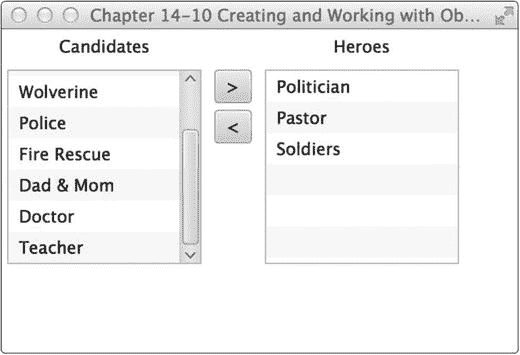

###### 图 14-10。列表视图和可观察列表

### 它是如何工作的

当处理 Java 集合时，你会注意到有这么多有用的容器类，它们代表了所有类型的数据结构。一个常用的集合是 java.util. ArrayList 类。当使用包含 ArrayList 的域对象构建应用时，开发人员可以轻松地操作集合中的对象。但是，在过去(过去)，将 Java Swing 组件与集合结合使用是一个挑战，尤其是更新 GUI 以反映域对象的变化。你如何解决这个问题？好吧，JavaFX 是值得关注的救星！

说到营救，这个菜谱演示了一个 GUI 应用，允许用户选择他们喜欢的英雄。这与通过在列表框组件中添加或删除项目来管理用户角色的应用屏幕非常相似。在 JavaFX 中，使用 ListView 控件保存字符串对象。在创建 ListView 的实例之前，会创建包含候选对象的 ObservableList。在本例中，您会注意到使用了一个名为 FXCollections 的工厂类，在该类中，您可以传递要包装的公共集合类型，并将其作为 ObservableList 返回给调用者。这个食谱传入的是一个字符串数组，而不是一个 ArrayList，所以希望您了解如何使用 FXCollections 类。一定要明智地使用它:“权力越大，责任也越大。”此代码行调用 FXCollections 类返回一个可观察列表(observable list):

```java
ObservableList<String> candidates = FXCollections.observableArrayList(...);
```

创建 ObservableList 后，ListView 类使用接收 observable list 的构造函数进行实例化。这里显示的是创建和填充 ListView 对象的代码:

```java
ListView<String> candidatesListView = new ListView<String>(candidates);
```

在最后一项业务中，代码将像操作 java.util.ArrayLists 一样操作 ObservableList，一旦被操作，ListView 将被通知并自动更新以反映 observable list 的变化。以下代码片段在用户按下“向右发送”按钮时实现事件处理程序和操作事件:

```java
// select heroes
Button sendRightButton = new Button(">");
sendRightButton.setOnAction((e) -> {
        String potential = candidatesListView.getSelectionModel().getSelectedItem();
        if (potential != null) {
            candidatesListView.getSelectionModel().clearSelection();
            candidates.remove(potential);
            heroes.add(potential);
        }       
});
```

设置动作时，通过 lambda 表达式实现 EventHandler 来监听按钮按下事件。当按钮按下事件到达时，代码将确定 ListView 中的哪一项被选中。一旦项目被确定，你清除选择，删除项目，并将项目添加到英雄的 ObservableList。

## 14-11.生成后台进程

### 问题

您希望创建一个 GUI 应用，在向用户显示进度的同时，使用后台处理来模拟长时间运行的流程。

### 解决办法

创建一个典型的对话框应用，在后台复制文件时显示进度指示器。以下是该配方中使用的主要类别:

*   Java FX . scene . control . progress bar

*   Java FX . scene . control . progressive indicator

*   javafx.concurrent.Task 类

下面的源代码是一个模拟文件复制对话框的应用，该对话框显示进度指示器并执行后台进程:

```java
package org.java9recipes.chapter14.recipe14_11;

import java.util.Random;
import javafx.application.Application;
import javafx.beans.value.ChangeListener;
import javafx.beans.value.ObservableValue;
import javafx.concurrent.Task;
import javafx.geometry.Pos;
import javafx.scene.Group;
import javafx.scene.Scene;
import javafx.scene.control.Button;
import javafx.scene.control.Label;
import javafx.scene.control.ProgressBar;
import javafx.scene.control.ProgressIndicator;
import javafx.scene.control.TextArea;
import javafx.scene.layout.BorderPane;
import javafx.scene.layout.HBox;
import javafx.scene.paint.Color;
import javafx.stage.Stage;

public class BackgroundProcesses extends Application {

    static Task copyWorker;
    final int numFiles = 30;

    /**
     * @param args the command line arguments
     */
    public static void main(String[] args) {
        Application.launch(args);
    }

    @Override
    public void start(Stage primaryStage) {
        primaryStage.setTitle("Chapter 14-11 Background Processes");
        Group root = new Group();
        Scene scene = new Scene(root, 330, 120, Color.WHITE);

        BorderPane mainPane = new BorderPane();
        mainPane.layoutXProperty().bind(scene.widthProperty().subtract(mainPane.widthProperty()).divide(2));
        root.getChildren().add(mainPane);

        final Label label = new Label("Files Transfer:");
        final ProgressBar progressBar = new ProgressBar(0);
        final ProgressIndicator progressIndicator = new ProgressIndicator(0);

        final HBox hb = new HBox();
        hb.setSpacing(5);
        hb.setAlignment(Pos.CENTER);
        hb.getChildren().addAll(label, progressBar, progressIndicator);
        mainPane.setTop(hb);

        final Button startButton = new Button("Start");
        final Button cancelButton = new Button("Cancel");
        final TextArea textArea = new TextArea();
        textArea.setEditable(false);
        textArea.setPrefSize(200, 70);
        final HBox hb2 = new HBox();
        hb2.setSpacing(5);
        hb2.setAlignment(Pos.CENTER);
        hb2.getChildren().addAll(startButton, cancelButton, textArea);
        mainPane.setBottom(hb2);

        // wire up start button
        startButton.setOnAction((e) -> {
            startButton.setDisable(true);
            progressBar.setProgress(0);
            progressIndicator.setProgress(0);
            textArea.setText("");
            cancelButton.setDisable(false);
            copyWorker = createWorker(numFiles);

            // wire up progress bar
            progressBar.progressProperty().unbind();
            progressBar.progressProperty().bind(copyWorker.progressProperty());
            progressIndicator.progressProperty().unbind();
            progressIndicator.progressProperty().bind(copyWorker.progressProperty());

            // append to text area box
            copyWorker.messageProperty().addListener(new ChangeListener<String>() {

                public void changed(ObservableValue<? extends String> observable, String oldValue, String newValue) {
                    textArea.appendText(newValue + "\n");
                }
            });

            new Thread(copyWorker).start();
        });

        // cancel button will kill worker and reset.
        cancelButton.setOnAction((e) -> {
            startButton.setDisable(false);
            cancelButton.setDisable(true);
            copyWorker.cancel(true);

            // reset
            progressBar.progressProperty().unbind();
            progressBar.setProgress(0);
            progressIndicator.progressProperty().unbind();
            progressIndicator.setProgress(0);
            textArea.appendText("File transfer was cancelled.");
        });

        primaryStage.setScene(scene);
        primaryStage.show();
    }

    public Task createWorker(final int numFiles) {
        return new Task() {

            @Override
            protected Object call() throws Exception {
                for (int i = 0; i < numFiles; i++) {
                    long elapsedTime = System.currentTimeMillis();
                    copyFile("some file", "some dest file");
                    elapsedTime = System.currentTimeMillis() - elapsedTime;
                    String status = elapsedTime + " milliseconds";

                    // queue up status
                    updateMessage(status);
                    updateProgress(i + 1, numFiles);
                }
                return true;
            }
        };
    }

    public void copyFile(String src, String dest) throws InterruptedException {
        // simulate a long time
        Random rnd = new Random(System.currentTimeMillis());
        long millis = rnd.nextInt(1000);
        Thread.sleep(millis);
    }
}
```

图 [14-11](#Fig11) 显示了后台进程应用，它模拟了一个文件复制窗口。

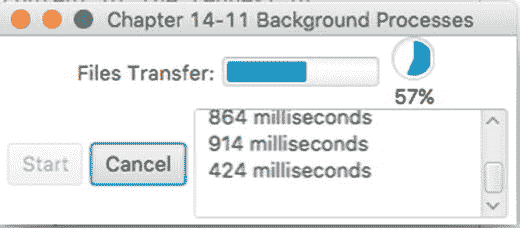

###### 图 14-11。后台进程

### 它是如何工作的

GUI 开发的主要陷阱之一是知道何时以及如何委派工作(线程)。您会不断地被提醒线程安全，尤其是在阻塞 GUI 线程的时候。当使用 Java Swing API 时，必须实现 SwingWorker 对象来推迟 EDT 的非 GUI 工作。类似的模式和原则仍然适用于 JavaFX 世界。

您首先创建两个而不是一个进度控件，向用户显示正在完成的工作。一个是进度条，另一个是进度指示器。进度指示器在指示器图标下方显示一个百分比。以下代码片段显示了进度控件的初始创建:

```java
final ProgressBar progressBar = new ProgressBar(0);
final ProgressIndicator progressIndicator = new ProgressIndicator(0);
```

接下来，通过 createWorker()方法创建一个工作线程。createWorker()便利方法将实例化并返回一个 javafx.concurrent.Task 对象，该对象类似于 Java Swing 的 SwingWorker 类。与 SwingWorker 类不同，Task 对象被大大简化，更易于使用。如果您比较最后一个配方，您会注意到没有一个 GUI 控件被传递到任务中。聪明的 JavaFX 团队已经创建了允许您绑定的可观察属性。这促进了一种更加事件驱动的方法来处理工作(任务)。创建 Task 对象的实例时，实现 call()方法在后台执行工作。在工作过程中，您可能希望将中间结果排队，如进度或文本信息。为此，您可以调用 updateProgress()和 updateMessage()方法。这些方法将以线程安全的方式更新信息，以便进度属性的观察者能够安全地更新 GUI，而不会阻塞 GUI 线程。以下代码片段演示了对消息和进度进行排队的能力:

```java
// queue up status
updateMessage(status);
updateProgress(i + 1, numFiles);
```

创建工作任务后，取消绑定到进度控件的任何旧任务。一旦进度控件被解除绑定，您就可以将进度控件绑定到新创建的名为 copyWorker 的任务对象。此处显示的是用于将新任务对象重新绑定到进度 UI 控件的代码:

```java
// wire up progress bar
progressBar.progressProperty().unbind();
progressBar.progressProperty().bind(copyWorker.progressProperty());
progressIndicator.progressProperty().unbind();
progressIndicator.progressProperty().bind(copyWorker.progressProperty());
```

接下来，实现 ChangeListener 以将排队的结果追加到 TextArea 控件中。JavaFX 属性的另一个显著特点是，您可以附加许多类似于 Java Swing 组件的侦听器。最后，工作器和控件都连接起来，产生一个线程在后台运行。以下代码行显示了如何启动任务工作器对象:

```java
new Thread(copyWorker).start();
```

最后，cancel 按钮将简单地调用任务对象的 Cancel()方法来终止进程。一旦任务被取消，进度控制将被重置。一旦工作者任务被取消，它就不能被重用。按下时，开始按钮会重新创建一个新任务。如果您想要一个更健壮的解决方案，您应该看看 javafx.concurrent.Service 类。下面的代码行将取消一个任务工作对象:

```java
copyWorker.cancel(true);
```

## 14-12.将键盘序列与应用相关联

### 问题

您希望为菜单选项创建键盘快捷键。

### 解决办法

创建一个使用 JavaFX 组合键 API 的应用。您将使用的主要类如下所示:

*   javafx.scene.input.KeyCode

*   Java FX . scene . input . key code combination

*   Java FX . scene . input . key combination

下面的源代码清单是一个显示绑定到菜单项的可用键盘快捷键的应用。当用户执行键盘快捷键时，应用将在屏幕上显示组合键:

```java
public void start(Stage primaryStage) {
    primaryStage.setTitle("Chapter 14-12 Associating Keyboard Sequences");
    Group root = new Group();
    Scene scene = new Scene(root, 530, 300, Color.WHITE);

    final StringProperty statusProperty = new SimpleStringProperty();

    InnerShadow iShadow = new InnerShadow();
    iShadow.setOffsetX(3.5f);
    iShadow.setOffsetY(3.5f);

    final Text status = new Text();
    status.setEffect(iShadow);
    status.setX(100);
    status.setY(50);
    status.setFill(Color.LIME);
    status.setFont(Font.font(null, FontWeight.BOLD, 35));
    status.setTranslateY(50);

    status.textProperty().bind(statusProperty);
    statusProperty.set("Keyboard Shortcuts \nCtrl-N, \nCtrl-S, \nCtrl-X");
    root.getChildren().add(status);

    MenuBar menuBar = new MenuBar();
    menuBar.prefWidthProperty().bind(primaryStage.widthProperty());
    root.getChildren().add(menuBar);

    Menu menu = new Menu("File");
    menuBar.getMenus().add(menu);

    MenuItem newItem = new MenuItem();
    newItem.setText("New");
    newItem.setAccelerator(new KeyCodeCombination(KeyCode.N, KeyCombination.CONTROL_DOWN));
    newItem.setOnAction((e) -> {
        statusProperty.set("Ctrl-N");
    });
    menu.getItems().add(newItem);

    MenuItem saveItem = new MenuItem();
    saveItem.setText("Save");
    saveItem.setAccelerator(new KeyCodeCombination(KeyCode.S, KeyCombination.CONTROL_DOWN));
    saveItem.setOnAction((e) -> {
        statusProperty.set("Ctrl-S");
    });
    menu.getItems().add(saveItem);

    menu.getItems().add(new SeparatorMenuItem());

    MenuItem exitItem = new MenuItem();
    exitItem.setText("Exit");
    exitItem.setAccelerator(new KeyCodeCombination(KeyCode.X, KeyCombination.CONTROL_DOWN));
    exitItem.setOnAction((e) -> {
        statusProperty.set("Ctrl-X");
    });
    menu.getItems().add(exitItem);

    primaryStage.setScene(scene);
    primaryStage.show();
}
```

图 [14-12](#Fig12) 显示了一个演示键盘快捷键的应用。

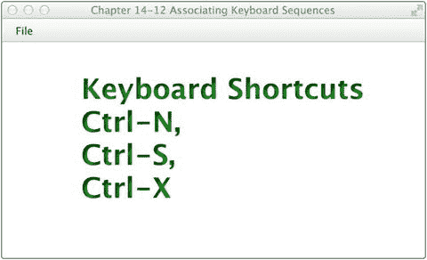

###### 图 14-12。键盘序列/快捷键

### 它是如何工作的

这个菜谱的解决方案演示了如何使用 Java FX . scene . input . key code combination 和 Java FX . scene . input . key combination 类创建组合键或键盘快捷键。看到之前的食谱有点无聊，我们决定让这里的东西更有趣一点。当用户执行组合键时，这个配方在场景图上显示文本节点。当显示文本节点时，我们应用了内部阴影效果。以下代码片段创建了一个带有内部阴影效果的文本节点:

```java
InnerShadow iShadow = new InnerShadow();
iShadow.setOffsetX(3.5f);
iShadow.setOffsetY(3.5f);

final Text status = new Text();
status.setEffect(iShadow);
status.setX(100);
status.setY(50);
status.setFill(Color.LIME);
status.setFont(Font.font(null, FontWeight.BOLD, 35));
status.setTranslateY(50);
```

要创建键盘快捷键，只需调用菜单或按钮控件的 setAccelerator()方法。在这个配方中，组合键是使用 MenuItem 节点的 setAccelerator()方法设置的。下面的代码行指定了 Ctrl-N 的组合键:

```java
MenuItem newItem = new MenuItem();
newItem.setText("New");
newItem.setAccelerator(new KeyCodeCombination(KeyCode.N, KeyCombination.CONTROL_DOWN));
newItem.setOnAction((e) -> {
    statusProperty.set("Ctrl-N");
});
```

从代码中可以看出，在示例中，当按下加速器(组合键)时，会触发 onAction ActionEvent。它通过 lambda 表达式将 statusProperty 值设置为 Ctrl-N。

## 14-13.创建和使用表格

### 问题

您希望在类似于 Java Swing 的 JTable 组件的 UI 表格控件中显示项目。

### 解决办法

使用 JavaFX 的 javafx.scene.control.TableView 类创建应用。TableView 控件提供了与 Swing 的 JTable 组件等效的功能。

为了练习 TableView 控件，您将创建一个显示老板和雇员的应用。在左边，您将实现一个包含老板的 ListView 控件，雇员(下属)将显示在右边的 TableView 控件中。

此处显示的是一个简单的 domain (Person)类的源代码，该类表示要在 ListView 或 TableView 控件中显示的老板或雇员:

```java
package org.java9recipes.chapter15.recipe15_14;

import javafx.beans.property.SimpleStringProperty;
import javafx.beans.property.StringProperty;
import javafx.collections.FXCollections;
import javafx.collections.ObservableList;

public class Person {

    private StringProperty aliasName;
    private StringProperty firstName;
    private StringProperty lastName;
    private ObservableList<Person> employees = FXCollections.observableArrayList();

    public final void setAliasName(String value) {
        aliasNameProperty().set(value);
    }

    public final String getAliasName() {
        return aliasNameProperty().get();
    }

    public StringProperty aliasNameProperty() {
        if (aliasName == null) {
            aliasName = new SimpleStringProperty();
        }
        return aliasName;
    }

    public final void setFirstName(String value) {
        firstNameProperty().set(value);
    }

    public final String getFirstName() {
        return firstNameProperty().get();
    }

    public StringProperty firstNameProperty() {
        if (firstName == null) {
            firstName = new SimpleStringProperty();
        }
        return firstName;
    }

    public final void setLastName(String value) {
        lastNameProperty().set(value);
    }

    public final String getLastName() {
        return lastNameProperty().get();
    }

    public StringProperty lastNameProperty() {
        if (lastName == null) {
            lastName = new SimpleStringProperty();
        }
        return lastName;
    }

    public ObservableList<Person> employeesProperty() {
        return employees;
    }

    public Person(String alias, String firstName, String lastName) {
        setAliasName(alias);
        setFirstName(firstName);
        setLastName(lastName);
    }

}
```

下面是主要的应用代码。它在左侧显示一个包含老板的列表视图组件，在右侧显示一个包含雇员的表视图控件:

```java
public void start(Stage primaryStage) {
    primaryStage.setTitle("Chapter 14-13 Working with Tables");
    Group root = new Group();
    Scene scene = new Scene(root, 500, 250, Color.WHITE);

    // create a grid pane
    GridPane gridpane = new GridPane();
    gridpane.setPadding(new Insets(5));
    gridpane.setHgap(10);
    gridpane.setVgap(10);

    // candidates label
    Label candidatesLbl = new Label("Boss");
    GridPane.setHalignment(candidatesLbl, HPos.CENTER);
    gridpane.add(candidatesLbl, 0, 0);

    // List of leaders
    ObservableList<Person> leaders = getPeople();
    final ListView<Person> leaderListView = new ListView<>(leaders);
    leaderListView.setPrefWidth(150);
    leaderListView.setPrefHeight(150);

    // display first and last name with tooltip using alias
    leaderListView.setCellFactory((ListView<Person> param) -> {
        final Label leadLbl = new Label();
        final Tooltip tooltip = new Tooltip();
        final ListCell<Person> cell = new ListCell<Person>() {
            @Override
            public void updateItem(Person item, boolean empty) {
                super.updateItem(item, empty);
                if (item != null) {
                    leadLbl.setText(item.getAliasName());
                    setText(item.getFirstName() + " " + item.getLastName());
                    tooltip.setText(item.getAliasName());
                    setTooltip(tooltip);
                }
            }
        }; // ListCell
        return cell;
    }); // setCellFactory

    gridpane.add(leaderListView, 0, 1);

    Label emplLbl = new Label("Employees");
    gridpane.add(emplLbl, 2, 0);
    GridPane.setHalignment(emplLbl, HPos.CENTER);

    final TableView<Person> employeeTableView = new TableView<>();
    employeeTableView.setPrefWidth(300);

    final ObservableList<Person> teamMembers = FXCollections.observableArrayList();
    employeeTableView.setItems(teamMembers);

    TableColumn<Person, String> aliasNameCol = new TableColumn<>("Alias");
    aliasNameCol.setEditable(true);
    aliasNameCol.setCellValueFactory(new PropertyValueFactory("aliasName"));

    aliasNameCol.setPrefWidth(employeeTableView.getPrefWidth() / 3);

    TableColumn<Person, String> firstNameCol = new TableColumn<>("First Name");
    firstNameCol.setCellValueFactory(new PropertyValueFactory("firstName"));
    firstNameCol.setPrefWidth(employeeTableView.getPrefWidth() / 3);

    TableColumn<Person, String> lastNameCol = new TableColumn<>("Last Name");
    lastNameCol.setCellValueFactory(new PropertyValueFactory("lastName"));
    lastNameCol.setPrefWidth(employeeTableView.getPrefWidth() / 3);

    employeeTableView.getColumns().setAll(aliasNameCol, firstNameCol, lastNameCol);
    gridpane.add(employeeTableView, 2, 1);

    // selection listening
    leaderListView.getSelectionModel().selectedItemProperty().addListener(
            (ObservableValue<? extends Person> observable, Person oldValue, Person newValue) -> {
        if (observable != null && observable.getValue() != null) {
            teamMembers.clear();
            teamMembers.addAll(observable.getValue().employeesProperty());
        }
    });

    root.getChildren().add(gridpane);

    primaryStage.setScene(scene);
    primaryStage.show();
}
```

以下代码显示了 WorkingWithTables 主应用类中包含的 getPeople()方法。此方法填充前面显示的 UI TableView 控件:

```java
    private ObservableList<Person> getPeople() {
        ObservableList<Person> people = FXCollections.<Person>observableArrayList();
        Person docX = new Person("Professor X", "Charles", "Xavier");
        docX.employeesProperty().add(new Person("Wolverine", "James", "Howlett"));
        docX.employeesProperty().add(new Person("Cyclops", "Scott", "Summers"));
        docX.employeesProperty().add(new Person("Storm", "Ororo", "Munroe"));

        Person magneto = new Person("Magneto", "Max", "Eisenhardt");
        magneto.employeesProperty().add(new Person("Juggernaut", "Cain", "Marko"));
        magneto.employeesProperty().add(new Person("Mystique", "Raven", "Darkhölme"));
        magneto.employeesProperty().add(new Person("Sabretooth", "Victor", "Creed"));

        Person biker = new Person("Mountain Biker", "Jonathan", "Gennick");
        biker.employeesProperty().add(new Person("JavaJuneau", "Joshua", "Juneau"));
        biker.employeesProperty().add(new Person("Freddy", "Freddy", "Guime"));
        biker.employeesProperty().add(new Person("Mark", "Mark", "Beaty"));
        biker.employeesProperty().add(new Person("John", "John", "O'Conner"));
        biker.employeesProperty().add(new Person("D-Man", "Carl", "Dea"));

        people.add(docX);
        people.add(magneto);
        people.add(biker);

        return people;
    }
```

图 [14-13](#Fig13) 显示了演示 JavaFX 的 TableView 控件的应用。

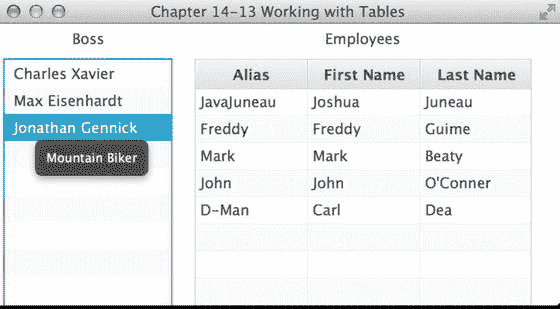

###### 图 14-13。使用表格

### 它是如何工作的

为了好玩，我们创建了一个简单的 GUI 来显示员工和他们的老板。你会注意到在图 [14-13](#Fig13) 的左边是一个人员列表(老板)。当用户选择一个老板时，他们的员工将显示在右边的表视图区域中。当您将鼠标悬停在所选老板上方时，您还会注意到工具提示。

在考虑 TableView 控件之前，理解负责更新 TableView 的 ListView 很重要。在模型视图方式中，创建了一个 ObservableList，其中包含 ListView 控件的构造函数的所有 bosses。这个代码称老板为领导者。下面的代码创建一个 ListView 控件:

```java
// List of leaders
ObservableList<Person> leaders = getPeople();
final ListView<Person> leaderListView = new ListView<Person>(leaders);
```

接下来，创建一个单元格工厂，以便在 ListView 控件中正确显示人名。因为每一项都是一个 Person 对象，所以 ListView 不知道如何呈现 ListView 控件中的每一行。您只需通过指定 ListView <person>和 ListCell <person>数据类型来创建 javafx.util.Callback 通用类型对象。如果您使用的是 NetBeans 之类的可信 IDE，它会预先生成实现方法调用()之类的东西。接下来是 ListCell <person>类型的变量单元格(在 call()方法中)，在其中创建一个 lambda 表达式。lambda 表达式包含 updateItem()方法的实现。若要实现 updateItem()方法，请获取人员信息并更新 Label 控件(leadLbl)。最后，将工具提示设置为相关的文本。</person></person></person>

然后创建一个 TableView 控件，根据从 ListView 中选择的老板显示雇员。创建 TableView 时，首先创建列标题。使用以下代码创建一个表列:

```java
TableColumn<String> firstNameCol = new TableColumn<String>("First Name");
**firstNameCol.setProperty("firstName");** 
```

一旦创建了一个列，您会注意到 setProperty()方法，它负责调用 person Bean 的属性。当雇员列表被放入 TableView 中时，它将知道如何提取属性以放入表中的每个单元格中。

最后是 JavaFX 中 ListViewer 上的选择监听器的实现，称为选择项属性(selection item property)。创建并添加一个 ChangeListener 来侦听选择事件。当用户选择一个老板时，TableView 被清除并填充了该老板的雇员。实际上是 ObservableList 的魔力通知了 TableView 的变化。要通过 teamMembers (ObservableList)变量填充 TableView，请使用以下代码:

```java
teamMembers.clear();
teamMembers.addAll(observable.getValue().employeesProperty());
```

## 14-14.用拆分视图组织用户界面

### 问题

您希望使用拆分分割线控件来拆分 GUI 屏幕。

### 解决办法

使用 JavaFX 的分割窗格控件。javafx.scene.control.SplitPane 类是一个 UI 控件，使您能够将屏幕划分为类似框架的区域。split 控件允许用户用鼠标在任意两个拆分区域之间移动分隔线。

此处显示的代码用于创建利用 javafx.scene.control.SplitPane 类的 GUI 应用。该类将屏幕分成三个窗口区域。三个窗口区域是左列、右上区域和右下区域。此外，文本节点被添加到这三个区域。

```java
public void start(Stage primaryStage) {
    primaryStage.setTitle("Chapter 14-4 Organizing UI with Split Views");
    Group root = new Group();
    Scene scene = new Scene(root, 350, 250, Color.WHITE);

    // Left and right split pane
    SplitPane splitPane = new SplitPane();
    splitPane.prefWidthProperty().bind(scene.widthProperty());
    splitPane.prefHeightProperty().bind(scene.heightProperty());

    //List<Node> items = splitPane.getItems();
    VBox leftArea = new VBox(10);

    for (int i = 0; i < 5; i++) {
        HBox rowBox = new HBox(20);
        final Text leftText = new Text();
        leftText.setText("Left " + i);
        leftText.setTranslateX(20);
        leftText.setFill(Color.BLUE);
        leftText.setFont(Font.font(null, FontWeight.BOLD, 20));

        rowBox.getChildren().add(leftText);
        leftArea.getChildren().add(rowBox);
    }
    leftArea.setAlignment(Pos.CENTER);

    // Upper and lower split pane
    SplitPane splitPane2 = new SplitPane();
    splitPane2.setOrientation(Orientation.VERTICAL);
    splitPane2.prefWidthProperty().bind(scene.widthProperty());
    splitPane2.prefHeightProperty().bind(scene.heightProperty());

    HBox centerArea = new HBox();

    InnerShadow iShadow = new InnerShadow();
    iShadow.setOffsetX(3.5f);
    iShadow.setOffsetY(3.5f);

    final Text upperRight = new Text();
    upperRight.setText("Upper Right");
    upperRight.setX(100);
    upperRight.setY(50);
    upperRight.setEffect(iShadow);
    upperRight.setFill(Color.LIME);
    upperRight.setFont(Font.font(null, FontWeight.BOLD, 35));
    upperRight.setTranslateY(50);
    centerArea.getChildren().add(upperRight);

    HBox rightArea = new HBox();

    final Text lowerRight = new Text();
    lowerRight.setText("Lower Right");
    lowerRight.setX(100);
    lowerRight.setY(50);
    lowerRight.setEffect(iShadow);
    lowerRight.setFill(Color.RED);
    lowerRight.setFont(Font.font(null, FontWeight.BOLD, 35));
    lowerRight.setTranslateY(50);
    rightArea.getChildren().add(lowerRight);

    splitPane2.getItems().add(centerArea);
    splitPane2.getItems().add(rightArea);

    // add left area
    splitPane.getItems().add(leftArea);

    // add right area
    splitPane.getItems().add(splitPane2);

    // evenly position divider
    ObservableList<SplitPane.Divider> dividers = splitPane.getDividers();
    for (int i = 0; i < dividers.size(); i++) {
        dividers.get(i).setPosition((i + 1.0) / 3);
    }

    HBox hbox = new HBox();
    hbox.getChildren().add(splitPane);
    root.getChildren().add(hbox);

    primaryStage.setScene(scene);
    primaryStage.show();
}
```

图 [14-14](#Fig14) 描述了使用分割窗格控件的应用。

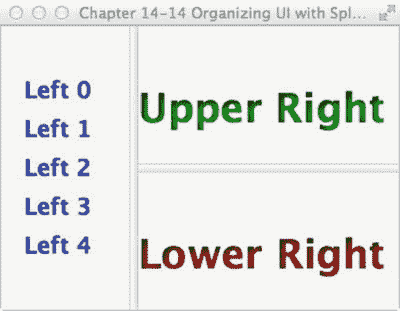

###### 图 14-14。拆分视图

### 它是如何工作的

如果你曾经见过一个简单的富站点摘要(RSS)阅读器或 Javadocs，你会注意到屏幕被分隔线分成了几个部分。这个食谱创建了三个区域:左边、右上和右下。

首先创建一个 SplitPane，将场景的左右区域分开。然后将它的宽度和高度属性绑定到场景，这样当用户调整舞台大小时，这些区域将占用可用空间。接下来，创建一个表示左侧区域的 VBox 布局控件。在 VBox (leftArea)中，循环生成一系列文本节点。接下来，生成分割窗格的右侧。以下代码片段允许拆分窗格控件(split pane)水平拆分:

```java
SplitPane splitPane = new SplitPane();
splitPane.prefWidthProperty().bind(scene.widthProperty());
splitPane.prefHeightProperty().bind(scene.heightProperty());
```

现在您创建 SplitPane 来垂直划分区域，这将形成右上和右下区域。此处显示的是用于垂直分割窗口区域的代码:

```java
// Upper and lower split pane
SplitPane splitPane2 = new SplitPane();
splitPane2.setOrientation(Orientation.VERTICAL);
```

最后，您组装分割的窗格，并调整分隔线的位置，以便平均分配屏幕空间。以下代码组装拆分窗格，并遍历分隔线列表以更新它们的位置:

```java
splitPane.getItems().add(splitPane2);

// evenly position divider
ObservableList<SplitPane.Divider> dividers = splitPane.getDividers();
for (int i = 0; i < dividers.size(); i++) {
    dividers.get(i).setPosition((i + 1.0) / 3);
}

HBox hbox = new HBox();
hbox.getChildren().add(splitPane);
root.getChildren().add(hbox);
```

## 14-15.向用户界面添加选项卡

### 问题

您希望创建一个带有选项卡的 GUI 应用。

### 解决办法

使用 JavaFX 的选项卡和选项卡窗格控件。选项卡(javafx.scene.control.Tab)和选项卡窗格控件(javafx.scene.control.TabPane)类允许您在各个选项卡中放置图形节点。

下面的代码示例创建一个简单的应用，该应用具有允许用户选择 tab 键方向的菜单选项。可用的选项卡方向有顶部、底部、左侧和右侧。

```java
public void start(Stage primaryStage) {
    primaryStage.setTitle("Chapter 14-15 Adding Tabs to a UI");
    Group root = new Group();
    Scene scene = new Scene(root, 400, 250, Color.WHITE);

    TabPane tabPane = new TabPane();

    MenuBar menuBar = new MenuBar();

    EventHandler<ActionEvent> action = changeTabPlacement(tabPane);

    Menu menu = new Menu("Tab Side");
    MenuItem left = new MenuItem("Left");

    left.setOnAction(action);
    menu.getItems().add(left);

    MenuItem right = new MenuItem("Right");
    right.setOnAction(action);
    menu.getItems().add(right);

    MenuItem top = new MenuItem("Top");
    top.setOnAction(action);
    menu.getItems().add(top);

    MenuItem bottom = new MenuItem("Bottom");
    bottom.setOnAction(action);
    menu.getItems().add(bottom);

    menuBar.getMenus().add(menu);

    BorderPane borderPane = new BorderPane();

    // generate 10 tabs
    for (int i = 0; i < 10; i++) {
        Tab tab = new Tab();
        tab.setText("Tab" + i);
        HBox hbox = new HBox();
        hbox.getChildren().add(new Label("Tab" + i));
        hbox.setAlignment(Pos.CENTER);
        tab.setContent(hbox);
        tabPane.getTabs().add(tab);
    }

    // add tab pane
    borderPane.setCenter(tabPane);

    // bind to take available space
    borderPane.prefHeightProperty().bind(scene.heightProperty());
    borderPane.prefWidthProperty().bind(scene.widthProperty());

    // add menu bar
    borderPane.setTop(menuBar);

    // add border Pane
    root.getChildren().add(borderPane);

    primaryStage.setScene(scene);
    primaryStage.show();
}

private EventHandler<ActionEvent> changeTabPlacement(final TabPane tabPane) {
    return (ActionEvent event) -> {
        MenuItem mItem = (MenuItem) event.getSource();
        String side = mItem.getText();
        if ("left".equalsIgnoreCase(side)) {
            tabPane.setSide(Side.LEFT);
        } else if ("right".equalsIgnoreCase(side)) {
            tabPane.setSide(Side.RIGHT);
        } else if ("top".equalsIgnoreCase(side)) {
            tabPane.setSide(Side.TOP);
        } else if ("bottom".equalsIgnoreCase(side)) {
            tabPane.setSide(Side.BOTTOM);
        }
    };
}
```

图 [14-15](#Fig15) 显示标签应用，允许用户改变标签方向。


###### 图 14-15。塔帕布

### 它是如何工作的

使用 TabPane 控件时，您可能已经知道希望选项卡显示的方向。这个应用允许你通过左、右、上、下菜单选项来设置方向。

如果您熟悉 Swing API，您可能会注意到 JavaFX TabPane 与 Swing JTabbedPanel 非常相似。您只需添加 javafx.scene.control.Tab 实例，而不是添加 JPanels。下面的代码片段将选项卡控件添加到 TabPane 控件中:

```java
TabPane tabPane = new TabPane();
Tab tab = new Tab();
tab.setText("Tab" + i);
tabPane.getTabs().add(tab);
```

当您更改 TabPane 控件的方向时，请使用 setSide()方法。下面的代码设置 TabPane 控件的方向:

```java
tabPane.setSide(Side.BOTTOM);
```

在这个配方中，一个菜单用于改变 TabPane 控件的方向。不同的方向被分配给菜单的不同 MenuItem 节点，一个标识为 changeTabPlacement 的 EventHandler 用于在选择不同的 MenuItem 时更改方向。EventHandler 只是检查 MenuItem 的文本，以确定应该将哪个方向应用于 TabPane。

## 14-16.开发一个对话框

### 问题

您希望创建一个包含对话框的应用，该对话框包含一些供用户输入的文本字段。

### 解决办法

使用 JavaFX 的 stage (javafx.stage.Stage)和 scene(Java FX . scene . scene)API 创建对话框。

下面的源代码清单是一个模拟更改密码对话框的应用。该应用包含弹出对话框的菜单选项。除了使用菜单选项，用户还可以设置对话框的模态状态(modality)。

```java
public class DevelopingADialog extends Application {

    static Stage LOGIN_DIALOG;
    static int dx = 1;
    static int dy = 1;

    /**
     * @param args the command line arguments
     */
    public static void main(String[] args) {
        Application.launch(args);
    }

    private static Stage createLoginDialog(Stage parent, boolean modal) {
        if (LOGIN_DIALOG != null) {
            LOGIN_DIALOG.close();
        }
        return new MyDialog(parent, modal, "Welcome to JavaFX!");
    }

    @Override
    public void start(final Stage primaryStage) {
        primaryStage.setTitle("Chapter 14-16 Developing a Dialog");
        Group root = new Group();
        Scene scene = new Scene(root, 433, 312, Color.WHITE);

        MenuBar menuBar = new MenuBar();
        menuBar.prefWidthProperty().bind(primaryStage.widthProperty());

        Menu menu = new Menu("Home");

        // add change password menu itme
        MenuItem newItem = new MenuItem("Change Password", null);
        newItem.setOnAction((ActionEvent event) -> {
            if (LOGIN_DIALOG == null) {
                LOGIN_DIALOG = createLoginDialog(primaryStage, true);
            }
            LOGIN_DIALOG.sizeToScene();
            LOGIN_DIALOG.show();
        });

        menu.getItems().add(newItem);

        // add separator
        menu.getItems().add(new SeparatorMenuItem());

        // add non modal menu item
        ToggleGroup modalGroup = new ToggleGroup();
        RadioMenuItem nonModalItem = new RadioMenuItem();
        nonModalItem.setToggleGroup(modalGroup);
        nonModalItem.setText("Non Modal");
        nonModalItem.setSelected(true);

        nonModalItem.setOnAction((ActionEvent event) -> {
            LOGIN_DIALOG = createLoginDialog(primaryStage, false);
        });

        menu.getItems().add(nonModalItem);

        // add modal selection
        RadioMenuItem modalItem = new RadioMenuItem();
        modalItem.setToggleGroup(modalGroup);
        modalItem.setText("Modal");
        modalItem.setSelected(true);

        modalItem.setOnAction((ActionEvent event) -> {
            LOGIN_DIALOG = createLoginDialog(primaryStage, true);
        });
        menu.getItems().add(modalItem);

        // add separator
        menu.getItems().add(new SeparatorMenuItem());

        // add exit
        MenuItem exitItem = new MenuItem("Exit", null);
        exitItem.setMnemonicParsing(true);
        exitItem.setAccelerator(new KeyCodeCombination(KeyCode.X, KeyCombination.CONTROL_DOWN));
        exitItem.setOnAction((ActionEvent event) -> {
            Platform.exit();
        });
        menu.getItems().add(exitItem);

        // add menu
        menuBar.getMenus().add(menu);

        // menu bar to window
        root.getChildren().add(menuBar);

        primaryStage.setScene(scene);
        primaryStage.show();

        addBouncyBall(scene);
    }

    private void addBouncyBall(final Scene scene) {

        final Circle ball = new Circle(100, 100, 20);
        RadialGradient gradient1 = new RadialGradient(0,
                .1,
                100,
                100,
                20,
                false,
                CycleMethod.NO_CYCLE,
                new Stop(0, Color.RED),
                new Stop(1, Color.BLACK));

        ball.setFill(gradient1);

        final Group root = (Group) scene.getRoot();
        root.getChildren().add(ball);

        Timeline tl = new Timeline();
        tl.setCycleCount(Animation.INDEFINITE);
        KeyFrame moveBall = new KeyFrame(Duration.seconds(.0200), (ActionEvent event) -> {
            double xMin = ball.getBoundsInParent().getMinX();
            double yMin = ball.getBoundsInParent().getMinY();
            double xMax = ball.getBoundsInParent().getMaxX();
            double yMax = ball.getBoundsInParent().getMaxY();

            // Collision - boundaries
            if (xMin < 0 || xMax > scene.getWidth()) {
                dx = dx * -1;
            }
            if (yMin < 0 || yMax > scene.getHeight()) {
                dy = dy * -1;
            }

            ball.setTranslateX(ball.getTranslateX() + dx);
            ball.setTranslateY(ball.getTranslateY() + dy);
        });

        tl.getKeyFrames().add(moveBall);
        tl.play();
    }
}

class MyDialog extends Stage {

    public MyDialog(Stage owner, boolean modality, String title) {
        super();
        initOwner(owner);
        Modality m = modality ? Modality.APPLICATION_MODAL : Modality.NONE;
        initModality(m);
        setOpacity(.90);
        setTitle(title);
        Group root = new Group();
        Scene scene = new Scene(root, 250, 150, Color.WHITE);
        setScene(scene);

        GridPane gridpane = new GridPane();
        gridpane.setPadding(new Insets(5));
        gridpane.setHgap(5);
        gridpane.setVgap(5);

        Label mainLabel = new Label("Enter User Name & Password");
        gridpane.add(mainLabel, 1, 0, 2, 1);

        Label userNameLbl = new Label("User Name: ");
        gridpane.add(userNameLbl, 0, 1);

        Label passwordLbl = new Label("Password: ");
        gridpane.add(passwordLbl, 0, 2);

        // username text field
        final TextField userNameFld = new TextField("Admin");
        gridpane.add(userNameFld, 1, 1);

        // password field
        final PasswordField passwordFld = new PasswordField();
        passwordFld.setText("drowssap");
        gridpane.add(passwordFld, 1, 2);

        Button login = new Button("Change");
        login.setOnAction((ActionEvent event) -> {
            close();
        });
        gridpane.add(login, 1, 3);
        GridPane.setHalignment(login, HPos.RIGHT);
        root.getChildren().add(gridpane);
    }
}
```

图 [14-16](#Fig16) 描述了启用非模态选项的更改密码对话框应用。

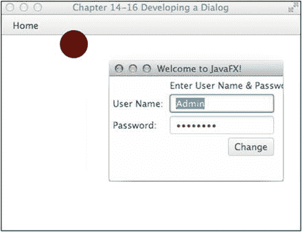

###### 图 14-16。开发一个对话框

### 它是如何工作的

为了创建对话框，JavaFX 使用 javafx.stage.Stage 类的另一个实例向用户显示。类似于从 Swing 中的 JDialog 类扩展，您只需从 Stage 类扩展即可。您有机会在构造函数中传递所属窗口，然后该构造函数调用 initOwner()方法。可以使用 initModality()方法设置对话框的模式状态。下面的类从 Stage 类扩展而来，具有初始化所属阶段和模式状态的构造函数:

```java
class MyDialog extends Stage {

    public MyDialog(Stage owner, boolean modality, String title) {
        super();
        initOwner(owner);
        Modality m = modality ? Modality.APPLICATION_MODAL : Modality.NONE;
initModality(m);

        ...// The rest of the class
```

剩下的代码创建一个场景(scene)，类似于主应用的 start()方法。因为登录表单非常无聊，我们决定在用户忙于在对话框中更改密码时创建一个弹跳球的动画。(你会在以后的食谱中看到更多关于创建动画的内容。)

当选择“更改密码”菜单项时，createLoginDialog 方法检查是否已经有一个 MyDialog 实例被实例化。如果是这样，它将关闭该实例并生成一个新实例。然后显示新创建的对话框。同样，RadioMenuItem 控件调用 createLoginDialog 方法，传递不同的布尔值来指示实例化的 MyDialog 实例是否应设置为 modal。如前所述，弹力球对对话框没有影响；只是为了效果而加的。

## 14-17.使用 JavaFX 打印

### 问题

您希望提供在应用场景图中打印指定节点的能力。

### 解决办法

利用 JavaFX 打印 API 打印指定的节点，并构建复杂的打印对话框。在这个解决方案中，生成了一个用于绘图的 JavaFX 应用。绘图应用允许您通过打印按钮打印画布。调用打印按钮时，会打开一个对话框，提供打印选项，如打印机和布局选择。

以下代码用于构建应用阶段，包括所有按钮和绘图功能。第一个类不包含任何打印逻辑…您将在接下来看到…并且这些源被显示出来是为了使它易于跟随示例。

```java
public class PrintingWithJavaFX extends Application {

    static Stage PRINT_DIALOG;

    /**
     * @param args the command line arguments
     */
    public static void main(String[] args) {
        Application.launch(PrintingWithJavaFX.class, args);
    }

    private static Stage createPrintDialog(Stage parent, boolean modal, Canvas node) {
        if (PRINT_DIALOG != null) {
            PRINT_DIALOG.close();
        }
        // Copy canvas
        WritableImage wim = new WritableImage(300, 300);
        node.snapshot(null, wim);
        ImageView iv = new ImageView();
        iv.setImage(wim);
        return new PrintDialog(parent, modal, "Printing Menu", iv);
    }

    @Override
    public void start(Stage primaryStage) {

        StackPane root = new StackPane();
        Canvas canvas = new Canvas(300, 300);
        final GraphicsContext graphicsContext = canvas.getGraphicsContext2D();

        final Button printButton = new Button("Print");
        final BooleanProperty printingProperty = new SimpleBooleanProperty(false);
        printButton.setOnAction(actionEvent-> {
           printingProperty.set(true);
           if (PRINT_DIALOG == null) {
                PRINT_DIALOG = createPrintDialog(primaryStage, true, canvas);
            }
            PRINT_DIALOG.sizeToScene();
            PRINT_DIALOG.show();
        });
        printButton.setTranslateX(3);

        final Button resetButton = new Button("Reset");
        resetButton.setOnAction(actionEvent-> {
            graphicsContext.clearRect(1, 1,
                    graphicsContext.getCanvas().getWidth()-2,
                    graphicsContext.getCanvas().getHeight()-2);
        });
        resetButton.setTranslateX(10);

        // Set up the pen color chooser
        ChoiceBox colorChooser = new ChoiceBox(FXCollections.observableArrayList(
            "Black", "Blue", "Red", "Green", "Brown", "Orange")
        );
        // Select the first option by default
        colorChooser.getSelectionModel().selectFirst();

        colorChooser.getSelectionModel().selectedIndexProperty().addListener(
                (ChangeListener)(ov, old, newval) -> {
                        Number idx = (Number)newval;
                        Color newColor;
                        switch(idx.intValue()){
                            case 0: newColor = Color.BLACK;
                                    break;
                            case 1: newColor = Color.BLUE;
                                    break;
                            case 2: newColor = Color.RED;
                                    break;
                            case 3: newColor = Color.GREEN;
                                    break;
                            case 4: newColor = Color.BROWN;
                                    break;
                            case 5: newColor = Color.ORANGE;
                                    break;
                            default: newColor = Color.BLACK;
                                    break;
                        }
                        graphicsContext.setStroke(newColor);

                });
        colorChooser.setTranslateX(5);

        ChoiceBox sizeChooser = new ChoiceBox(FXCollections.observableArrayList(
            "1", "2", "3", "4", "5")
        );
        // Select the first option by default
        sizeChooser.getSelectionModel().selectFirst();

        sizeChooser.getSelectionModel().selectedIndexProperty().addListener(
                (ChangeListener)(ov, old, newval) -> {
                        Number idx = (Number)newval;

                        switch(idx.intValue()){
                            case 0: graphicsContext.setLineWidth(1);
                                    break;
                            case 1: graphicsContext.setLineWidth(2);
                                    break;
                            case 2: graphicsContext.setLineWidth(3);
                                    break;
                            case 3: graphicsContext.setLineWidth(4);
                                    break;
                            case 4: graphicsContext.setLineWidth(5);
                                    break;
                            default: graphicsContext.setLineWidth(1);
                                    break;
                        }
                });
        sizeChooser.setTranslateX(5);

        canvas.addEventHandler(MouseEvent.MOUSE_PRESSED, (MouseEvent event) -> {
            graphicsContext.beginPath();
            graphicsContext.moveTo(event.getX(), event.getY());
            graphicsContext.stroke();
        });

        canvas.addEventHandler(MouseEvent.MOUSE_DRAGGED, (MouseEvent event) -> {
            graphicsContext.lineTo(event.getX(), event.getY());
            graphicsContext.stroke();
        });

        canvas.addEventHandler(MouseEvent.MOUSE_RELEASED, (MouseEvent event) -> {
        });

        HBox buttonBox = new HBox();
        buttonBox.getChildren().addAll(printButton, colorChooser, sizeChooser, resetButton);

        initDraw(graphicsContext, canvas.getLayoutX(), canvas.getLayoutY());

        BorderPane container = new BorderPane();
        container.setTop(buttonBox);

        container.setCenter(canvas);

        root.getChildren().add(container);
        Scene scene = new Scene(root, 400, 400);
        primaryStage.setTitle("Recipe 14-17:  Printing from JavaFX");
        primaryStage.setScene(scene);
        primaryStage.show();
    }

    private void initDraw(GraphicsContext gc, double x, double y){
        double canvasWidth = gc.getCanvas().getWidth();
        double canvasHeight = gc.getCanvas().getHeight();

        gc.fill();
        gc.strokeRect(
                x,              //x of the upper left corner
                y,              //y of the upper left corner
                canvasWidth,    //width of the rectangle
                canvasHeight);  //height of the rectangle

        //gc.setFill(Color.RED);
        //gc.setStroke(Color.BLUE);
        //gc.setLineWidth(1);

    }

}
```

接下来，您将查看创建 PrintDialog 类的源代码，该类包含应用的所有打印逻辑。使用时按下打印按钮，对话框打开。它包含一些使用 JavaFX Print API 的节点。

```java
class PrintDialog extends Stage {

    public PrintDialog(Stage owner, boolean modality, String title, Node printNode) {
        super();
        initOwner(owner);
        Modality m = modality ? Modality.APPLICATION_MODAL : Modality.NONE;
        initModality(m);
        setOpacity(.90);
        setTitle(title);
        Group root = new Group();
        Scene scene = new Scene(root, 450, 150, Color.WHITE);
        setScene(scene);

        GridPane gridpane = new GridPane();
        gridpane.setPadding(new Insets(5));
        gridpane.setHgap(5);
        gridpane.setVgap(5);

        Label printerLabel = new Label("Printer: ");
        gridpane.add(printerLabel, 0, 1);

        Label layoutLabel = new Label("Layout: ");
        gridpane.add(layoutLabel, 0, 2);

        final Printer selectedPrinter = Printer.getDefaultPrinter();
        // printer pick list
        ChoiceBox printerChooser = new ChoiceBox(FXCollections.observableArrayList(
            Printer.getAllPrinters())
        );
        // Select the first option by default
        printerChooser.getSelectionModel().selectFirst();

        gridpane.add(printerChooser, 1, 1);

        ChoiceBox layoutChooser = new ChoiceBox(FXCollections.observableArrayList(
            "Portait", "Landscape")
        );
        layoutChooser.getSelectionModel().selectFirst();

        layoutChooser.getSelectionModel().selectedIndexProperty().addListener(
                (ChangeListener)(ov, old, newval) -> {
                        Number idx = (Number)newval;
                        switch(idx.intValue()){
                            case 0: selectedPrinter.createPageLayout(Paper.A0, PageOrientation.PORTRAIT, Printer.MarginType.EQUAL);
                                    break;
                            case 1: selectedPrinter.createPageLayout(Paper.A0, PageOrientation.LANDSCAPE, Printer.MarginType.EQUAL);
                                    break;

                            default: selectedPrinter.createPageLayout(Paper.A0, PageOrientation.PORTRAIT, Printer.MarginType.EQUAL);
                                    break;
                        }
                });
        gridpane.add(layoutChooser,1,2);
        Button printButton = new Button("Print");
        printButton.setOnAction((ActionEvent event) -> {
            print(printNode, selectedPrinter);
        });
        gridpane.add(printButton, 0, 3);

        GridPane.setHalignment(printButton, HPos.RIGHT);
        root.getChildren().add(gridpane);
    }

    public void print(final Node node, Printer printer) {

        PrinterJob job = PrinterJob.createPrinterJob();
        job.setPrinter(printer);
        if (job != null) {
            boolean success = job.printPage(node);
            if (success) {
                job.endJob();
            }
        }
    }    
}
```

图 [14-17](#Fig17) 显示了该应用。使用对话框打印画布内的区域(绘图区域)(参见图 [14-18](#Fig18) )。

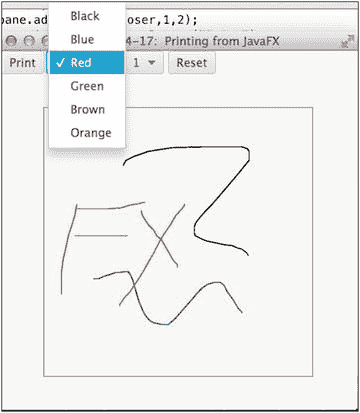

###### 图 14-17。具有打印功能的 JavaFX 绘图应用


###### 图 14-18。利用 JavaFX 打印 API 打印菜单

### 它是如何工作的

在 JavaFX 8 之前的 JavaFX 版本中，没有用于打印部分应用阶段的标准 API。在 JavaFX 8 中，添加了一个 Print API 来标准化处理打印特性的方式。该 API 还使得使用很少的代码就可以轻松地启用具有打印功能的应用。这个 API 非常大，因为它包含了许多类，但是它非常简单易用。

要启用指定节点的打印功能，首先要使用 javafx.print.PrinterJob 类，因为它包含了生成非常简单的打印任务的所有功能。要将节点发送到默认的系统打印机，只需调用 PrintJob.createPrinterJob()来返回 PrinterJob 对象。返回对象后，检查以确保它不为空，然后调用它的 printPage()方法，传递要打印的节点。包含此功能的解决方案摘录显示在以下代码行中:

```java
public void print(final Node node, Printer printer) {

    PrinterJob job = PrinterJob.createPrinterJob()
    job.setPrinter(printer);
    if (job != null) {
        boolean success = job.printPage(node);
        if (success) {
            job.endJob();
        }
    }
  }    
```

虽然只需要使用 PrinterJob 就可以将节点发送到打印机，但是 API 允许进行更多的定制。表 [14-3](#Tab3) 列出了 API 中可用的不同类，并简要描述了它们的功能。

###### 表 14-3。JavaFX 打印 API

<colgroup class="calibre15"><col class="calibre16"> <col class="calibre16"></colgroup> 
| 

类别名

 | 

描述

 |
| --- | --- |
| 作业设置 | 封装打印作业的设置 |
| 页面布局 | 封装布局设置 |
| 打印范围 | 用于选择范围或限制打印页面 |
| 纸 | 封装打印机的纸张尺寸 |
| 纸张来源 | 用于纸张的输入托盘 |
| 打印机 | 代表打印作业的目的地 |
| 打印机属性 | 封装打印机的属性 |
| 打印机作业 | 用于调用 JavaFX 场景图形打印 |
| 打印分辨率 | 表示支持的设备分辨率 |

在该示例中，生成了一个打印对话框，允许用户选择将打印作业发送到哪里。它还提供了选择所需打印布局(纵向或横向)的控件。打印机。可以调用 getDefaultPrinter()方法来返回主机的默认打印机。在该示例中，通过调用 Printer.getAllPrinters()方法，ChoiceBox 用于显示主机上可用的所有打印机。然后，在 print 方法内的 PrinterJob 上设置所选的打印机，该方法将所需的节点发送到该打印机。

通过另一个选择框选择打印机布局，选择布局时，所选打印机的选项会更新。下面一行代码演示如何将布局设置为 PageOrientation。所选印刷品的肖像:

```java
selectedPrinter.createPageLayout(Paper.A0, PageOrientation.PORTRAIT, Printer.MarginType.EQUAL);
```

任何节点都可以发送到 PrinterJob，但发送要打印的节点的副本很重要，因为打印任务可能会修改该节点。

Print API 很大，但是很容易理解。这个方法只是触及了 API 的一些皮毛。一旦准备好开发自己的打印机流程，我们建议您通读 Javadoc 以获得更多详细信息。然而，这个食谱应该提供一个如何开始的基本理解。请参见 Javadoc 的以下链接:[http://docs . Oracle . com/javase/8/Java FX/API/Java FX/print/package-summary . html](http://docs.oracle.com/javase/8/javafx/api/javafx/print/package-summary.html)。

## 14-18.在 JavaFX 中嵌入 Swing 内容

### 问题

您希望将一些简单的 Java Swing 内容嵌入到 JavaFX 应用中。

### 解决办法

创建一个 JavaFX 应用，并使用 SwingNode 类将 Swing 内容嵌入其中。在下面的示例中，一个简单的 JavaFX 应用用于在基于 Swing 的用户输入表单和基于 JavaFX 的表单之间切换。应用中的 JavaFX 按钮可以用来确定当用户单击它时应该显示哪个表单。

首先，让我们看看嵌入到 JavaFX 应用中的 Swing 表单的代码。代码存在于一个名为 SwingForm.java 的类中。

```java
import java.awt.GridLayout;
import javax.swing.JLabel;
import javax.swing.JPanel;
import javax.swing.JTextField;
public class SwingForm extends JPanel {

    JLabel formTitle, first, last, buttonLbl;
    protected JTextField firstField, lastField;

    public SwingForm(){

    JPanel innerPanel = new JPanel();

    GridLayout gl = new GridLayout(3,2);
    innerPanel.setLayout(gl);

    first = new JLabel("First Name:");
    innerPanel.add(first);
    firstField = new JTextField(10);
    innerPanel.add(firstField);

    last = new JLabel("Last Name:");
    innerPanel.add(last);
    lastField = new JTextField(10);
    innerPanel.add(lastField);

    JButton button = new JButton("Submit");
    button.addActionListener((event) -> {
        Platform.runLater(()-> {
            UserEntryForm.fxLabel.setText("Message from Swing form...");
        });
    });
    buttonLbl = new JLabel("Click Me:");
    innerPanel.add(buttonLbl);
    innerPanel.add(button);
    add(innerPanel);

    }
}
```

接下来，让我们看看用于创建图形用户界面的 JavaFX 代码，包括切换按钮和 JavaFX 表单。注意，Swing 表单是使用 SwingNode 对象嵌入的。

```java
public class UserEntryForm extends Application {

    private static ToggleButton fxbutton;
    private static GridPane grid;
    public static Label fxLabel;

    @Override
    public void start(Stage stage) {
        final SwingNode swingNode = new SwingNode();
        createSwingContent(swingNode);
        BorderPane pane = new BorderPane();
        Image fxButtonIcon = new Image(
                getClass().getResourceAsStream("img/duke1.gif"));
        String buttonText = "Use Swing Form";
        fxbutton = new ToggleButton(buttonText, new ImageView(fxButtonIcon));
        fxbutton.setTooltip(
                new Tooltip("This button chooses between the Swing and FX form"));
        fxbutton.setStyle("-fx-font: 22 arial; -fx-base: #cce6ff;");
        fxbutton.setAlignment(Pos.CENTER);
        fxbutton.setOnAction((event)->{
            ToggleButton toggle = (ToggleButton) event.getSource();
            if(!toggle.isSelected()){
                swingNode.setDisable(true);
                swingNode.setVisible(false);
                grid.setDisable(false);
                grid.setVisible(true);
                fxbutton.setText("Use Swing Form");
            } else {
                swingNode.setDisable(false);
                swingNode.setVisible(true);
                grid.setDisable(true);
                grid.setVisible(false);
                fxbutton.setText("Use JavaFX Form");
            }
        });
        // Disable SwingNode by default
        swingNode.setVisible(false);
        Text appTitle = new Text("Swing/FX Form Demo");
        appTitle.setFont(Font.font("Tahoma", FontWeight.NORMAL, 20));

        pane.setTop(appTitle);
        HBox formPanel = new HBox();
        formPanel.setSpacing(10);
        fxLabel = new Label("Message from JavaFX form...");

        formPanel.getChildren().addAll(fxFormContent(), swingNode);

        pane.setCenter(formPanel);
        VBox vbox = new VBox();
        vbox.getChildren().addAll(fxbutton, fxLabel);

        pane.setBottom(vbox);

        Scene scene = new Scene(pane, 700, 500);
        stage.setScene(scene);
        stage.setTitle("Swing Form Embedded In JavaFX");
        stage.show();
    }

    private void createSwingContent(final SwingNode swingNode) {
        SwingUtilities.invokeLater(() -> {
            swingNode.setContent(new SwingForm());
        });
    }

    private GridPane fxFormContent() {
        grid = new GridPane();
        grid.setAlignment(Pos.CENTER);
        grid.setHgap(10);
        grid.setVgap(10);
        grid.setPadding(new Insets(25, 25, 25, 25));

        Text scenetitle = new Text("Enter User");
        scenetitle.setFont(Font.font("Tahoma", FontWeight.NORMAL, 20));
        grid.add(scenetitle, 0, 0, 2, 1);

        Label first = new Label("First Name:");
        grid.add(first, 0, 1);

        TextField firstField = new TextField();
        grid.add(firstField, 1, 1);

        Label last = new Label("Last Name:");
        grid.add(last, 0, 2);

        TextField lastField = new TextField();
        grid.add(lastField, 1, 2);

        Button messageButton = new Button("Click");
        messageButton.setOnAction((event) ->{
            fxLabel.setText("Message from JavaFX Form...");
        });
        grid.add(messageButton, 0,3);

        return grid;

    }

    /**
     * @param args the command line arguments
     */
    public static void main(String[] args) {
        launch(args);
    }

}
```

调用时，应用看起来如图 [14-19](#Fig19) 所示。


###### 图 14-19。使用 SwingNode 嵌入一个 Swing 表单

### 它是如何工作的

有大量的应用是使用 Java Swing 框架编写的。有时在 JavaFX 应用中使用这些应用是有意义的，或者在有意义的地方嵌入那些 Swing 应用的一部分。javafx.embed.swing.SwingNode 类通过将 JComponent 传递给 SwingNode setContent()方法，可以轻松地将 JComponent 实例嵌入到 javafx 应用中。内容被自动重画，所有事件都被转发到 JComponent 实例，无需用户干预。

在这个菜谱的例子中，通过实例化一个新的 SwingNode 对象并向其传递 Swing form 类的实例，嵌入了一个简单的 Java Swing 表单。Swing 内容应该在 EDT 上运行，因此任何 Swing 访问都应该在 EDT 上进行。也就是说，使用 SwingUtilities.invokeLater 创建了一个新线程，lambda 表达式封装了用于设置 Swing 内容的 Runnable。

也可以在 Swing 代码中与 JavaFX 内容进行交互。为此，您必须在 JavaFX 应用线程中运行 JavaFX 代码，方法是调用 javafx.application.Platform 类并调用 runLater()方法，同时传递一个 Runnable。例如，在示例代码中，Swing 表单中的按钮可以使用下面的代码回调 JavaFX 标签来更改文本。请注意，JavaFX 标签是一个公共字段，因此可以从 Swing 类中直接访问它。

```java
JButton button = new JButton("Submit");
    button.addActionListener((event) -> {
        Platform.runLater(()-> {
            UserEntryForm.fxLabel.setText("Message from Swing form...");
        });
    });
```

###### 注意

默认情况下，JavaFX 应用线程和 Swing EDT 是分开的。EDT 不运行 Swing 应用的 GUI 代码。然而，在 JavaFX 中，平台 GUI 线程运行应用代码。有一个启用单线程模式的实验设置，它允许 JavaFX 平台 GUI 线程在 Swing 和 JavaFX 一起使用时成为 EDT。要启用实验设置，请使用以下选项执行您的代码:djavafx . embed . single thread = true

通过利用 JavaFX 8 的新特性，您可以生成一个包含嵌入式 Swing 代码的 JavaFX 应用，该代码可以直接与 JavaFX 代码进行通信。

## 摘要

JavaFX 是 Java Swing API 的继承者。它使开发人员能够为下一代应用开发复杂而强大的用户界面。本章为您提供了对 JavaFX 的基本理解，以及一些最广泛使用的 JavaFX APIs。在接下来几章的课程中，您将学习更多关于 JavaFX 的知识，比如如何构造 3D 对象和 WebViews。