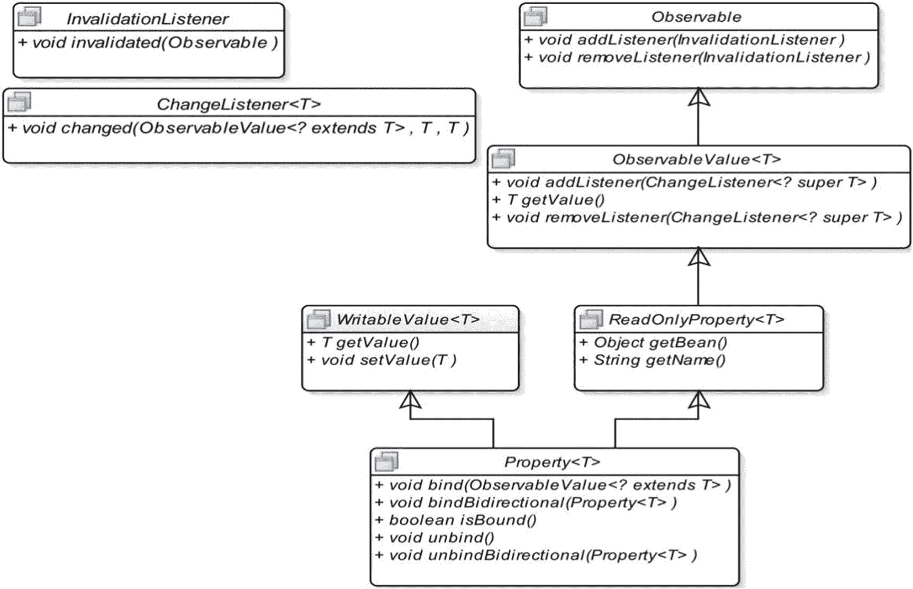
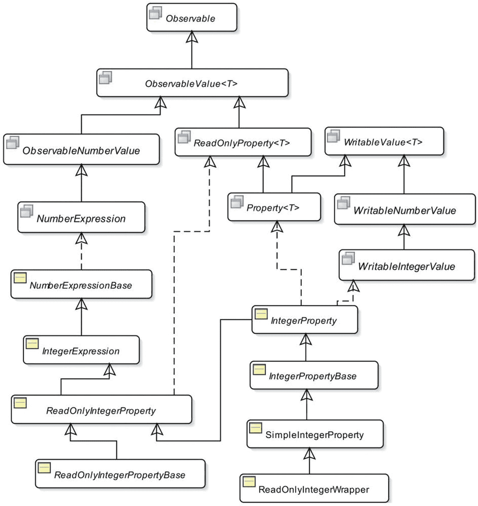
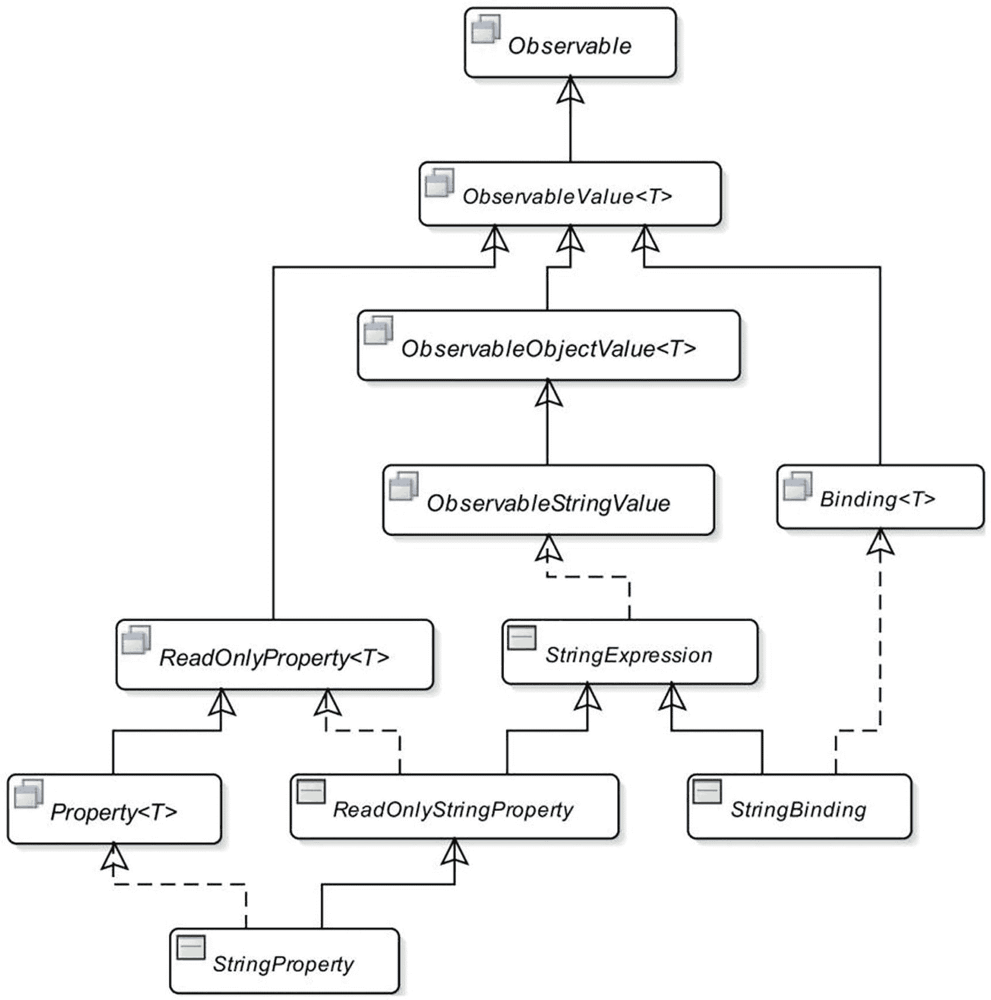
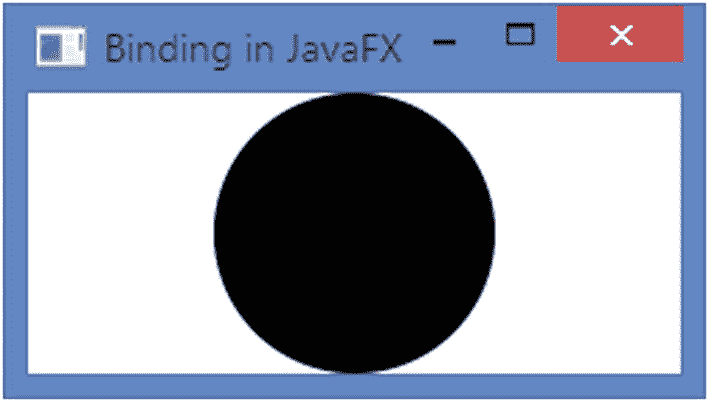
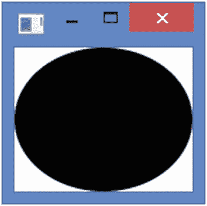

# 2.属性和绑定

在本章中，您将学习:

*   JavaFX 中的属性是什么

*   如何创建属性对象并使用它

*   JavaFX 中属性的类层次结构

*   如何处理属性对象中的失效和更改事件

*   JavaFX 中的绑定是什么，以及如何使用单向和双向绑定

*   关于 JavaFX 中的高级和低级绑定 API

本章讨论 Java 和 JavaFX 中的属性和绑定支持。如果您有使用 JavaBeans API 进行属性和绑定的经验，可以跳过前面几节，这几节讨论了 Java 中的属性和绑定支持，从“理解 JavaFX 中的属性”一节开始。

本章的例子在`com.jdojo.binding`包中。为了让它们工作，您必须在`module-info.java`文件中添加相应的一行:

```java
...
opens com.jdojo.binding to javafx.graphics, javafx.base;
...

```

## 什么是财产？

一个 Java 类可以包含两类成员:*字段*和*方法*。字段代表对象的状态，它们被声明为私有的。公共方法被称为*访问器*或*获取器*和*设置器*，用于读取和修改私有字段。简单地说，对于所有或部分私有字段，具有公共访问器的 Java 类被称为 Java *bean* ，访问器定义了 bean 的属性。Java bean 的属性允许用户定制其状态、行为或两者。

Java beans 是可观察的。它们支持属性更改通知。当 Java bean 的公共属性发生变化时，会向所有感兴趣的侦听器发送通知。

本质上，Java beans 定义了可重用的组件，这些组件可以由构建器工具组装起来以创建 Java 应用程序。这为第三方开发 JavaBean 并使其可供他人重用打开了大门。

属性可以是只读、只写或读/写。只读属性有 getter，但没有 setter。只写属性有 setter，但没有 getter。读/写属性有一个 getter 和一个 setter。

Java IDEs 和其他构建工具(例如，GUI 布局构建器)使用自省来获取 bean 的属性列表，并允许您在设计时操作这些属性。Java bean 可以是可视的，也可以是不可视的。bean 的属性可以在构建工具中使用，也可以以编程方式使用。

JavaBeans API 提供了一个类库，通过`java.beans`包和命名约定来创建和使用 JavaBeans。下面是一个具有读/写`name`属性的`Person` bean 的例子。`getName()`方法(getter)返回`name`字段的值。`setName()`方法(setter)设置`name`字段的值:

```java
 // Person.java
package com.jdojo.binding;

public class Person {
        private String name;

        public String getName() {
                return name;
        }

        public void setName(String name) {
                this.name = name;
        }
}

```

按照惯例，getter 和 setter 方法的名称是通过将属性名称的第一个字母大写，分别附加到单词 *get* 和 *set* 来构造的。getter 方法不应该带任何参数，它的返回类型应该与字段的类型相同。setter 方法应该带一个参数，参数的类型应该和字段的类型相同，其返回类型应该是`void`。

以下代码片段以编程方式操作`Person` bean 的`name`属性:

```java
Person p = new Person();
p.setName("John Jacobs");
String name = p.getName();

```

一些面向对象的编程语言，例如 C#，提供了第三种类型的类成员，称为*属性*。属性用于从类外部读取、写入和计算私有字段的值。C#允许您声明一个带有`Name`属性的`Person`类，如下所示:

```java
// C# version of the Person class
public class Person {
        private string name;

        public string Name {
                get { return name; }
                set { name = value; }
        }
}

```

在 C#中，以下代码片段使用`Name`属性操作`name`私有字段；它相当于前面显示的 Java 版本的代码:

```java
Person p = new Person();
p.Name = "John Jacobs";
string name = p.Name;

```

如果属性的访问器执行返回和设置字段值的例行工作，C#提供了一种紧凑的格式来定义这样的属性。在这种情况下，您甚至不需要声明私有字段。您可以用 C#重写`Person`类，如下所示:

```java
// C# version of the Person class using the compact format
public class Person {
        public string Name { get; set; }
}

```

那么，什么是财产呢？一个*属性*是一个类的公共可访问属性，影响它的状态、行为或两者。即使属性是可公开访问的，它的使用(读/写)也会调用隐藏实际实现的方法来访问数据。属性是可观察的，所以当它的值改变时，感兴趣的人会得到通知。

Tip

本质上，属性定义了对象的公共状态，可以读取、写入和观察对象的变化。与其他编程语言(如 C#)不同，Java 中的属性在语言级别不受支持。Java 对属性的支持来自 JavaBeans API 和设计模式。关于 Java 中属性的更多细节，请参考 JavaBeans 规范，可以从 [`www.oracle.com/java/technologies/javase/javabeans-spec.html`](http://www.oracle.com/java/technologies/javase/javabeans-spec.html) 下载。

除了简单的属性，比如`Person` bean 的`name`属性，Java 还支持*索引*、*绑定*和*约束*属性。索引属性是使用索引访问的值的数组。索引属性是使用数组数据类型实现的。当绑定属性发生更改时，它会向所有侦听器发送通知。受约束的属性是侦听器可以否决更改的绑定属性。

## 什么是绑定？

在编程中，术语*绑定*被用在许多不同的上下文中。在这里，我想在*数据绑定*的上下文中定义它。数据绑定定义了程序中数据元素(通常是变量)之间的关系，以保持它们的同步。在 GUI 应用程序中，数据绑定经常用于将数据模型中的元素与相应的 UI 元素同步。

考虑以下语句，假设 x、y 和 z 是数值变量:

```java
x = y + z;

```

前面的语句定义了 x、y 和 z 之间的绑定。当执行该语句时，x 的值与 y 和 z 的总和同步。绑定还具有时间因子。在前面的语句中，x 的值绑定到 y 和 z 的和，并且在语句执行时有效。在执行前面的语句之前和之后，x 的值可能不是 y 和 z 的和。

有时，希望绑定保持一段时间。考虑以下使用`listPrice`、`discounts`和`taxes`定义绑定的语句:

```java
soldPrice = listPrice - discounts + taxes;

```

在这种情况下，您希望保持绑定永远有效，这样无论何时`listPrice`、`discounts`或`taxes`发生变化，销售价格都会被正确计算。

在前面的绑定中，`listPrice`、`discounts`、`taxes`被称为*依赖*，也就是说`soldPrice`被绑定到`listPrice`、`discounts`、`taxes`。

为了使绑定正常工作，有必要在依赖关系发生变化时通知绑定。支持绑定的编程语言提供了一种用依赖关系注册侦听器的机制。当依赖关系变得无效或改变时，所有侦听器都会得到通知。当绑定接收到这样的通知时，它可以将其自身与其依赖项同步。

绑定可以是*急切绑定*或*懒惰绑定*。在急切绑定中，绑定变量在其依赖关系更改后会立即重新计算。在惰性绑定中，当绑定变量的依赖关系改变时，不会重新计算绑定变量。而是在下次读取时重新计算。与急切绑定相比，惰性绑定的性能更好。

绑定可以是*单向*或*双向*。单向绑定只在一个方向起作用；依赖关系中的更改会传播到绑定变量。双向绑定在两个方向上都起作用。在双向绑定中，绑定变量和依赖项保持它们的值相互同步。通常，双向绑定只在两个变量之间定义。例如，双向绑定 x = y 和 y = x 声明 x 和 y 的值总是相同的。

从数学上讲，不可能唯一地定义多个变量之间的双向绑定。在前面的示例中，销售价格绑定是单向绑定。如果您想使它成为一个双向绑定，那么当销售价格发生变化时，不可能唯一地计算标价、折扣和税的值。在另一个方向有无限多的可能性。

具有 GUI 的应用程序为用户提供 UI 部件，例如文本字段、复选框和按钮，以操作数据。UI 小部件中显示的数据必须与底层数据模型同步，反之亦然。在这种情况下，需要双向绑定来保持 UI 和数据模型同步。

## 了解 JavaBeans 中的绑定支持

在我讨论 JavaFX 属性和绑定之前，让我们先简单了解一下 JavaBeans API 中的绑定支持。如果您以前使用过 JavaBeans API，您可以跳过这一节。

从早期版本开始，Java 就支持 bean 属性的绑定。清单 [2-1](#PC9) 显示了一个具有两个属性`name`和`salary`的`Employee` bean。

```java
// Employee.java
package com.jdojo.binding;

import java.beans.PropertyChangeListener;
import java.beans.PropertyChangeSupport;

public class Employee {
        private String name;
        private double salary;
        private PropertyChangeSupport pcs = new PropertyChangeSupport(this);

        public Employee() {
                this.name = "John Doe";
                this.salary = 1000.0;
        }

        public Employee(String name, double salary) {
                this.name = name;
                this.salary = salary;
        }

        public String getName() {
                return name;
        }

        public void setName(String name) {
                this.name = name;
        }

        public double getSalary() {
                return salary;
        }

        public void setSalary(double newSalary) {
                double oldSalary = this.salary;
                this.salary = newSalary;

                // Notify the registered listeners about the change
                pcs.firePropertyChange("salary", oldSalary, newSalary);
        }

        public void addPropertyChangeListener(
                         PropertyChangeListener listener) {
                pcs.addPropertyChangeListener(listener);
        }

        public void removePropertyChangeListener(
                         PropertyChangeListener listener) {
                pcs.removePropertyChangeListener(listener);
        }

        @Override
        public String toString() {
                return "name = " + name + ", salary = " + salary;
        }
}

Listing 2-1An Employee Java Bean with Two Properties Named name and salary

```

`Employee` bean 的两个属性都是读/写的。`salary`属性也是一个绑定属性。它的设置器在薪水变化时生成属性变化通知。

感兴趣的监听器可以使用`addPropertyChangeListener()`和`removePropertyChangeListener()`方法注册或取消注册变更通知。`PropertyChangeSupport`类是 JavaBeans API 的一部分，它简化了属性更改监听器的注册和删除以及属性更改通知的触发。

任何对基于工资变化的同步值感兴趣的一方都需要向`Employee` bean 注册，并在收到变化通知时采取必要的行动。

清单 [2-2](#PC10) 展示了如何为一个`Employee` bean 注册工资变化通知。下面的输出显示工资变化通知只触发了两次，而`setSalary()`方法被调用了三次。这是真的，因为对`setSalary()`方法的第二次调用使用了与第一次调用相同的工资金额，而`PropertyChangeSupport`类足够聪明，能够检测到这一点。该示例还展示了如何使用 JavaBeans API 绑定变量。员工的税款是根据纳税百分比计算的。在 JavaBeans API 中，属性更改通知用于绑定变量。

```java
// EmployeeTest.java
package com.jdojo.binding;

import java.beans.PropertyChangeEvent;

public class EmployeeTest {
        public static void main(String[] args) {
                final Employee e1 = new Employee("John Jacobs", 2000.0);

                // Compute the tax
                computeTax(e1.getSalary());

                // Add a property change listener to e1
                e1.addPropertyChangeListener(
                         EmployeeTest::handlePropertyChange);

                // Change the salary
                e1.setSalary(3000.00);
                e1.setSalary(3000.00); // No change notification is sent.
                e1.setSalary(6000.00);
        }

        public static void handlePropertyChange(PropertyChangeEvent e) {
                String propertyName = e.getPropertyName();

                if ("salary".equals(propertyName)) {
                        System.out.print("Salary has changed. ");
                        System.out.print("Old:" + e.getOldValue());
                        System.out.println(", New:" +
                                    e.getNewValue());
                        computeTax((Double)e.getNewValue());
                }
        }

        public static void computeTax(double salary) {
                final double TAX_PERCENT = 20.0;
                double tax = salary * TAX_PERCENT/100.0;
                System.out.println("Salary:" + salary + ", Tax:" + tax);
        }
}
Salary:2000.0, Tax:400.0
Salary has changed. Old:2000.0, New:3000.0
Salary:3000.0, Tax:600.0
Salary has changed. Old:3000.0, New:6000.0
Salary:6000.0, Tax:1200.0

Listing 2-2An EmployeeTest Class That Tests the Employee Bean for Salary Changes

```

## 了解 JavaFX 中的属性

JavaFX 通过*属性*和*绑定*API 支持属性、事件和绑定。JavaFX 中的属性支持是 JavaBeans 属性的巨大飞跃。

JavaFX 中的所有属性都是可观察的。可以观察到它们的失效和值的变化。可以有读/写或只读属性。所有读/写属性都支持绑定。

在 JavaFX 中，属性可以表示一个值或一组值。本章介绍代表单个值的属性。我将在第 3 章中介绍代表一组值的属性。

在 JavaFX 中，属性是对象。每种属性都有一个属性类层次结构。例如，`IntegerProperty`、`DoubleProperty`和`StringProperty`类分别代表`int`、`double`和`String`类型的属性。这些类是`abstract`。它们有两种类型的实现类:一种表示读/写属性，另一种表示只读属性的包装。例如，`SimpleDoubleProperty`和`ReadOnlyDoubleWrapper`类是具体的类，它们的对象分别用作读/写和只读双精度属性。

以下是如何创建初始值为 100 的`IntegerProperty`的示例:

```java
IntegerProperty counter = new SimpleIntegerProperty(100);

```

属性类提供了两对 getter 和 setter 方法:`get()` / `set()`和`getValue()` / `setValue()`。`get()`和`set()`方法分别获取和设置属性的值。对于基本类型属性，它们使用基本类型值。比如对于`IntegerProperty`，`get()`方法的返回类型和`set()`方法的参数类型都是`int`。`getValue()`和`setValue()`方法处理一个对象类型；例如，对于`IntegerProperty`，它们的返回类型和参数类型是`Integer`。

Tip

对于引用类型属性，比如`StringProperty`和`ObjectProperty<T>`，两对 getter 和 setter 都使用一个对象类型。也就是说，`StringProperty`的`get()`和`getValue()`方法都返回一个`String`，而`set()`和`setValue()`方法都带有一个`String`参数。对于基元类型的自动装箱，使用哪个版本的 getter 和 setter 并不重要。`getValue()`和`setValue()`方法的存在是为了帮助你根据对象类型编写通用代码。

下面的代码片段使用了一个`IntegerProperty`及其`get()`和`set()`方法。`counter`属性是读/写属性，因为它是`SimpleIntegerProperty`类的对象:

```java
IntegerProperty counter = new SimpleIntegerProperty(1);
int counterValue = counter.get();
System.out.println("Counter:" + counterValue);

counter.set(2);
counterValue = counter.get();
System.out.println("Counter:" + counterValue);
Counter:1
Counter:2

```

使用只读属性有点棘手。一个`ReadOnlyXXXWrapper`类包装了`XXX`类型的两个属性:一个只读，一个读/写。两种属性都是同步的。它的`getReadOnlyProperty()`方法返回一个`ReadOnlyXXXProperty`对象。

下面的代码片段展示了如何创建一个只读的`Integer`属性。属性是读/写的，而属性是只读的。当`idWrapper`中的值改变时，`id`中的值自动改变:

```java
ReadOnlyIntegerWrapper idWrapper = new ReadOnlyIntegerWrapper(100);
ReadOnlyIntegerProperty id = idWrapper.getReadOnlyProperty();

System.out.println("idWrapper:" + idWrapper.get());
System.out.println("id:" + id.get());

// Change the value
idWrapper.set(101);

System.out.println("idWrapper:" + idWrapper.get());
System.out.println("id:" + id.get());
idWrapper:100
id:100
idWrapper:101
id:101

```

Tip

通常，包装属性用作类的私有实例变量。类别可以在内部变更属性。它的一个方法返回包装类的只读属性对象，因此同一个属性对于外界是只读的。

可以使用代表单个值的七种类型的属性。这些属性的基类被命名为`XXXProperty`，只读基类被命名为`ReadOnlyXXXProperty`，包装类被命名为`ReadOnlyXXXWrapper`。每种类型的`XXX`值列于表 [2-1](#Tab1) 中。

表 2-1

包装单个值的属性类列表

<colgroup><col class="tcol1 align-left"> <col class="tcol2 align-left"></colgroup> 
| 

类型

 | 

XXX 值

 |
| --- | --- |
| `int` | `Integer` |
| `long` | `Long` |
| `float` | `Float` |
| `double` | `Double` |
| `boolean` | `Boolean` |
| `String` | `String` |
| `Object` | `Object` |

属性对象包装了三条信息:

*   包含它的 bean 的引用

*   一个名字

*   一种价值观

创建属性对象时，可以提供前面三条信息的全部，也可以不提供。像`SimpleXXXProperty`和`ReadOnlyXXXWrapper`这样命名的具体属性类提供了四个构造器，让您提供这三条信息的组合。下面是`SimpleIntegerProperty`类的构造器:

```java
SimpleIntegerProperty()
SimpleIntegerProperty(int initialValue)
SimpleIntegerProperty(Object bean, String name)
SimpleIntegerProperty(Object bean, String name, int initialValue)

```

初始值的默认值取决于属性的类型。对于数值类型是零，对于布尔类型是`false`，对于引用类型是`null`。

属性对象可以是 bean 的一部分，也可以是独立的对象。指定的`bean`是对包含该属性的 bean 对象的引用。对于独立的属性对象，可以是`null`。其默认值为`null`。

属性的名字就是它的名字。如果未提供，则默认为空字符串。

下面的代码片段创建一个属性对象作为 bean 的一部分，并设置所有三个值。`SimpleStringProperty`类的构造器的第一个参数是`this`，它是`Person` bean 的引用，第二个参数—`"name"`—是属性的名称，第三个参数—`"Li"`—是属性的值:

```java
public class Person {
        private StringProperty name = new SimpleStringProperty(
                this, "name", "Li");
           // More code goes here...
}

```

每个属性类都有分别返回 bean 引用和属性名的`getBean()`和`getName()`方法。

## 在 JavaFX Beans 中使用属性

在上一节中，您看到了 JavaFX 属性作为独立对象的使用。在本节中，您将在类中使用它们来定义属性。让我们创建一个具有三个属性的`Book`类:`ISBN`、`title`和`price`，将使用 JavaFX 属性类对其进行建模。

在 JavaFX 中，不将类的属性声明为基本类型之一。相反，您使用 JavaFX 属性类之一。`Book`类的`title`属性将声明如下。照常宣布`private`:

```java
public class Book {
        private StringProperty title = new SimpleStringProperty(this,
               "title", "Unknown");
}

```

您为属性声明了一个公共 getter，按照惯例，它被命名为`XXXProperty`，其中`XXX`是属性的名称。这个 getter 返回属性的引用。对于我们的`title`属性，getter 将被命名为`titleProperty`，如下所示:

```java
public class Book {
        private StringProperty title = new SimpleStringProperty(this,
               "title", "Unknown");

        public final StringProperty titleProperty() {
                return title;
        }
}

```

前面的`Book`类声明可以很好地处理`title`属性，如下面设置和获取书名的代码片段所示:

```java
Book b = new Book();
b.titleProperty().set("Harnessing JavaFX 17.0");
String title = b.titleProperty().get();

```

根据 JavaFX 设计模式，而不是任何技术要求，JavaFX 属性有一个 getter 和 setter，类似于 JavaBeans 中的 getter 和 setter。getter 的返回类型和 setter 的参数类型与属性值的类型相同。比如对于`StringProperty`和`IntegerProperty`，分别会是`String`和`int`。`title`属性的`getTitle()`和`setTitle()`方法声明如下:

```java
public class Book {
        private StringProperty title = new SimpleStringProperty(this,
               "title", "Unknown");

        public final StringProperty titleProperty() {
                return title;
        }

        public final String getTitle() {
                return title.get();
        }

        public final void setTitle(String title) {
                this.title.set(title);
        }
}

```

注意，`getTitle()`和`setTitle()`方法在内部使用`title`属性对象来获取和设置标题值。

Tip

按照惯例，类的属性的 getters 和 setters 被声明为`final`。添加了使用 JavaBeans 命名约定的额外的 getters 和 setters，以使该类能够与使用旧 JavaBeans 命名约定来标识类属性的旧工具和框架进行互操作。

以下代码片段显示了对`Book`类的只读`ISBN`属性的声明:

```java
public class Book {
        private ReadOnlyStringWrapper ISBN =
               new ReadOnlyStringWrapper(this, "ISBN", "Unknown");

        public final String getISBN() {
                return ISBN.get();
        }

        public final ReadOnlyStringProperty ISBNProperty() {
                return ISBN.getReadOnlyProperty();
        }

        // More code goes here...
}

```

关于只读`ISBN`属性的声明，请注意以下几点:

*   它使用了`ReadOnlyStringWrapper`类而不是`SimpleStringProperty`类。

*   属性值没有设置器。你可以声明一个；但是，必须是私人的。

*   属性值的 getter 与读/写属性的 getter 工作方式相同。

*   `ISBNProperty()`方法使用`ReadOnlyStringProperty`作为返回类型，而不是`ReadOnlyStringWrapper`。它从包装对象获取属性对象的只读版本，并返回该版本。

对于`Book`类的用户，它的`ISBN`属性是只读的。但是，它可以在内部进行更改，并且该更改将自动反映在 property 对象的只读版本中。

清单 [2-3](#PC21) 显示了`Book`类的完整代码。

```java
// Book.java
package com.jdojo.binding;

import javafx.beans.property.DoubleProperty;
import javafx.beans.property.ReadOnlyStringProperty;
import javafx.beans.property.ReadOnlyStringWrapper;
import javafx.beans.property.SimpleDoubleProperty;
import javafx.beans.property.SimpleStringProperty;
import javafx.beans.property.StringProperty;

public class Book {
        private StringProperty title = new SimpleStringProperty(this,
               "title", "Unknown");
        private DoubleProperty price = new SimpleDoubleProperty(this,
                "price", 0.0);
        private ReadOnlyStringWrapper ISBN = new ReadOnlyStringWrapper(this,
                "ISBN", "Unknown");

        public Book() {
        }

        public Book(String title, double price, String ISBN) {
                this.title.set(title);
                this.price.set(price);
                this.ISBN.set(ISBN);
        }

        public final String getTitle() {
                return title.get();
        }

        public final void setTitle(String title) {
                this.title.set(title);
        }

        public final StringProperty titleProperty() {
                return title;
        }

        public final double getprice() {
                return price.get();
        }

        public final void setPrice(double price) {
                this.price.set(price);
        }

        public final DoubleProperty priceProperty() {
                return price;
        }

        public final String getISBN() {
                return ISBN.get();
        }

        public final ReadOnlyStringProperty ISBNProperty() {
                return ISBN.getReadOnlyProperty();
        }
}

Listing 2-3A Book Class with Two Read/Write and a Read-Only Properties

```

清单 [2-4](#PC22) 测试了`Book`类的属性。它创建一个`Book`对象，打印细节，更改一些属性，然后再次打印细节。注意`printDetails()`方法的`ReadOnlyProperty`参数类型的使用。所有的属性类都直接或间接地实现了`ReadOnlyProperty`接口。

属性实现类的`toString()`方法返回一个格式良好的字符串，该字符串包含属性的所有相关信息。我没有使用 property 对象的`toString()`方法，因为我想向您展示 JavaFX 属性的不同方法的用法。

```java
// BookPropertyTest.java
package com.jdojo.binding;

import javafx.beans.property.ReadOnlyProperty;

public class BookPropertyTest {
        public static void main(String[] args) {
                Book book = new Book("Harnessing JavaFX", 9.99,
                          "0123456789");

                System.out.println("After creating the Book object...");

                // Print Property details
                printDetails(book.titleProperty());
                printDetails(book.priceProperty());
                printDetails(book.ISBNProperty());

                // Change the book's properties
                book.setTitle("Harnessing JavaFX 17.0");
                book.setPrice(9.49);

                System.out.println(
                         "\nAfter changing the Book properties...");

                // Print Property details
                printDetails(book.titleProperty());
                printDetails(book.priceProperty());
                printDetails(book.ISBNProperty());
        }

        public static void printDetails(ReadOnlyProperty<?> p) {
                String name = p.getName();
                Object value = p.getValue();
                Object bean = p.getBean();
                String beanClassName = (bean == null)?
                          "null":bean.getClass().getSimpleName();
                String propClassName = p.getClass().getSimpleName();

                System.out.print(propClassName);
                System.out.print("[Name:" + name);
                System.out.print(", Bean Class:" + beanClassName);
                System.out.println(", Value:" + value + "]");
        }
}
After creating the Book object...
SimpleStringProperty[Name:title, Bean Class:Book, Value:Harnessing JavaFX]
SimpleDoubleProperty[Name:price, Bean Class:Book, Value:9.99]
ReadOnlyPropertyImpl[Name:ISBN, Bean Class:Book, Value:0123456789]

After changing the Book properties...
SimpleStringProperty[Name:title, Bean Class:Book, Value:Harnessing JavaFX 17.0]
SimpleDoubleProperty[Name:price, Bean Class:Book, Value:9.49]
ReadOnlyPropertyImpl[Name:ISBN, Bean Class:Book, Value:0123456789]

Listing 2-4A Test Class to Test Properties of the Book Class

```

## 了解属性类层次结构

在开始使用 JavaFX 属性和绑定 API 之前，理解它们的一些核心类和接口非常重要。图 [2-1](#Fig1) 显示了 properties API 核心接口的类图。你不需要在你的程序中直接使用这些接口。这些接口的专用版本和实现它们的类是存在的，并且可以直接使用。



图 2-1

JavaFX 属性 API 中核心接口的类图

JavaFX 属性 API 中的类和接口分布在不同的包中。那些包是`javafx.beans`、`javafx.beans.binding`、`javafx.beans.property`和`javafx.beans.value`。

`Observable`接口位于属性 API 的顶部。一个`Observable`包装内容，可以观察到它的内容失效。`Observable`接口有两个方法来支持这一点。它的`addListener()`方法允许您添加一个`InvalidationListener`。当`Observable`的内容无效时，调用`InvalidationListener`的`invalidated()`方法。可以使用`removeListener()`方法移除`InvalidationListener`。

Tip

所有 JavaFX 属性都是可观察的。

只有当其内容的状态从有效变为无效时，`Observable`才会生成无效事件。也就是说，一行中的多个失效应该只生成一个失效事件。JavaFX 中的属性类遵循这个原则。

Tip

一个`Observable`产生一个失效事件并不一定意味着它的内容发生了变化。意思就是它的内容因为某种原因是无效的。例如，对一个`ObservableList`进行排序可能会生成一个无效事件。排序不会改变列表的内容；它只是对内容进行了重新排序。

`ObservableValue`接口继承自`Observable`接口。一个`ObservableValue`包装了一个值，可以观察到它的变化。它有一个`getValue()`方法，返回它包装的值。它生成失效事件和变更事件。当`ObservableValue`中的值不再有效时，生成失效事件。值更改时会生成更改事件。您可以将一个`ChangeListener`注册到一个`ObservableValue`。每当`ChangeListener`的值发生变化时，就会调用`changed()`方法。`changed()`方法接收三个参数:对`ObservableValue`的引用、旧值和新值。

一个`ObservableValue`可以缓慢或急切地重新计算它的值。在惰性策略中，当它的值变得无效时，它不知道该值是否已经改变，直到该值被重新计算；下次读取该值时会重新计算。例如，使用一个`ObservableValue`的`getValue()`方法会使它重新计算它的值，如果这个值是无效的并且它使用了一个懒惰策略。在 eager 策略中，一旦值变得无效，就会重新计算。

为了生成无效事件，一个`ObservableValue`可以使用惰性或急切评估。懒惰评估更有效率。然而，生成变更事件会迫使一个`ObservableValue`立即重新计算它的值(一个急切的评估),因为它必须将新值传递给注册的变更监听器。

`ReadOnlyProperty`接口增加了`getBean()`和`getName()`方法。清单 [2-4](#PC22) 展示了它们的用法。`getBean()`方法返回包含属性对象的 bean 的引用。`getName()`方法返回属性的名称。只读属性实现此接口。

一个`WritableValue`包装了一个值，可以分别使用它的`getValue()`和`setValue()`方法读取和设置该值。读/写属性实现此接口。

`Property`接口继承自`ReadOnlyProperty`和`WritableValue`接口。它添加了以下五种方法来支持绑定:

*   `void bind(ObservableValue<? extends T> observable)`

*   `void unbind()`

*   `void bindBidirectional(Property<T> other)`

*   `void unbindBidirectional(Property<T> other)`

*   `boolean isBound()`

`bind()`方法在这个`Property`和指定的`ObservableValue`之间添加一个单向绑定。如果存在的话，`unbind()`方法删除这个`Property`的单向绑定。

`bindBidirectional()`方法在这个`Property`和指定的`Property`之间创建一个双向绑定。`unbindBidirectional()`方法移除双向绑定。

注意`bind()`和`bindBidirectional()`方法的参数类型的不同。同一类型的`Property`和`ObservableValue`之间可以创建单向绑定，只要它们通过继承相关。但是，只能在同一类型的两个属性之间创建双向绑定。

如果`Property`被绑定，`isBound()`方法返回`true`。否则返回`false`。

Tip

所有读/写 JavaFX 属性都支持绑定。

图 [2-2](#Fig2) 显示了 JavaFX 中 integer 属性的部分类图。该图让您了解 JavaFX 属性 API 的复杂性。您不需要学习属性 API 中的所有类。在您的应用程序中，您将只使用其中的几个。



图 2-2

整数属性的类图

## 处理属性失效事件

当属性值的状态第一次从有效变为无效时，属性会生成一个无效事件。JavaFX 中的属性使用惰性计算。当无效属性再次变为无效时，不会生成失效事件。无效属性在重新计算时变得有效，例如，通过调用其`get()`或`getValue()`方法。

清单 [2-5](#PC25) 提供了程序来演示何时为属性生成失效事件。这个程序包含了足够的注释来帮助你理解它的逻辑。一开始，它创建一个名为`counter`的`IntegerProperty`:

```java
IntegerProperty counter = new SimpleIntegerProperty(100);

```

一个`InvalidationListener`被添加到`counter`属性:

```java
counter.addListener(InvalidationTest::invalidated);

```

当您创建属性对象时，它是有效的。当您将`counter`属性更改为 101 时，它会触发一个失效事件。此时，`counter`属性变得无效。当您将它的值更改为 102 时，它不会触发无效事件，因为它已经无效了。当您使用`get()`方法读取`counter`值时，它再次变得有效。现在您为`counter`设置了相同的值 102，它不会触发一个无效事件，因为该值并没有真正改变。`counter`属性仍然有效。最后，您将它的值改为一个不同的值，果然，一个无效事件被触发。

Tip

您并不局限于在一个属性中只添加一个失效侦听器。您可以根据需要添加任意数量的失效侦听器。一旦你完成了一个无效监听器，确保通过调用`Observable`接口的`removeListener()`方法来移除它；否则，可能会导致内存泄漏。

```java
// InvalidationTest.java
// Listing part of the example sources download for the book
Before changing the counter value-1
Counter is invalid.
After changing the counter value-1

Before changing the counter value-2
After changing the counter value-2
Counter value = 102

Before changing the counter value-3
After changing the counter value-3

Before changing the counter value-4
Counter is invalid.
After changing the counter value-4

Listing 2-5Testing Invalidation Events for Properties

```

## 处理属性更改事件

您可以注册一个`ChangeListener`来接收关于属性更改事件的通知。每次属性值更改时，都会触发属性更改事件。一个`ChangeListener`的`changed()`方法接收三个值:属性对象的引用、旧值和新值。

让我们运行一个类似的测试用例来测试属性变更事件，就像上一节中对失效事件所做的那样。清单 [2-6](#PC26) 中的程序演示了为属性生成的变更事件。

```java
// ChangeTest.java
package com.jdojo.binding;

import javafx.beans.property.IntegerProperty;
import javafx.beans.property.SimpleIntegerProperty;
import javafx.beans.value.ObservableValue;

public class ChangeTest {
        public static void main(String[] args) {
            IntegerProperty counter = new SimpleIntegerProperty(100);

            // Add a change listener to the counter property
            counter.addListener(ChangeTest::changed);

            System.out.println("\nBefore changing the counter value-1");
            counter.set(101);
            System.out.println("After changing the counter value-1");

            System.out.println("\nBefore changing the counter value-2");
            counter.set(102);
            System.out.println("After changing the counter value-2");

            // Try to set the same value
            System.out.println("\nBefore changing the counter value-3");
            counter.set(102); // No change event is fired.
            System.out.println("After changing the counter value-3");

            // Try to set a different value
            System.out.println("\nBefore changing the counter value-4");
            counter.set(103);
            System.out.println("After changing the counter value-4");
        }

        public static void changed(ObservableValue<? extends Number> prop,
                                   Number oldValue,
                                   Number newValue) {
            System.out.print("Counter changed: ");
            System.out.println("Old = " + oldValue +
                    ", new = " + newValue);
        }
}
Before changing the counter value-1
Counter changed: Old = 100, new = 101
After changing the counter value-1

Before changing the counter value-2
Counter changed: Old = 101, new = 102
After changing the counter value-2

Before changing the counter value-3
After changing the counter value-3

Before changing the counter value-4
Counter changed: Old = 102, new = 103
After changing the counter value-4

Listing 2-6Testing Change Events for Properties

```

一开始，程序创建一个名为`counter`的`IntegerProperty`:

```java
IntegerProperty counter = new SimpleIntegerProperty(100);

```

加个`ChangeListener`有个小技巧。`IntegerPropertyBase`类中的`addListener()`方法声明如下:

```java
void addListener(ChangeListener<? super Number> listener)

```

这意味着如果你使用泛型，那么一个`IntegerProperty`的`ChangeListener`必须按照`Number`类或者`Number`类的超类来编写。向`counter`属性添加`ChangeListener`的三种方法如下所示:

```java
// Method-1: Using generics and the Number class
counter.addListener(new ChangeListener<Number>() {
        @Override
        public void changed(ObservableValue<? extends Number> prop,
                            Number oldValue,
                            Number newValue) {
                System.out.print("Counter changed: ");
                System.out.println("Old = " + oldValue +
                         ", new = " + newValue);
        }});

// Method-2: Using generics and the Object class
counter.addListener( new ChangeListener<Object>() {
        @Override
        public void changed(ObservableValue<? extends Object> prop,
                            Object oldValue,
                            Object newValue) {
                System.out.print("Counter changed: ");
                System.out.println("Old = " + oldValue +
                         ", new = " + newValue);
        }});

// Method-3: Not using generics. It may generate compile-time warnings.
counter.addListener(new ChangeListener() {
        @Override
        public void changed(ObservableValue prop,
                            Object oldValue,
                            Object newValue) {
                System.out.print("Counter changed: ");
                System.out.println("Old = " + oldValue +
                         ", new = " + newValue);
        }});

```

清单 [2-6](#PC26) 使用了第一种方法，它利用了泛型；如您所见，`ChangeTest`类中的`changed()`方法的签名与`method-1`中的`changed()`方法签名相匹配。我使用了一个带有方法引用的 lambda 表达式来添加一个`ChangeListener`，如下所示:

```java
counter.addListener(ChangeTest::changed);

```

前面的输出显示，当属性值更改时，将触发属性更改事件。用相同的值调用`set()`方法不会触发属性更改事件。

与生成失效事件不同，属性使用对其值的急切评估来生成更改事件，因为它必须将新值传递给属性更改侦听器。下一节讨论属性对象如何评估它的值，如果它既有无效侦听器又有更改侦听器的话。

## 处理失效和变更事件

当您必须决定是使用失效侦听器还是更改侦听器时，您需要考虑性能。通常，失效侦听器比更改侦听器性能更好。原因是双重的:

*   失效侦听器使得延迟计算值成为可能。

*   一行中的多个无效仅触发一个无效事件。

但是，使用哪个监听器取决于当前的情况。一个经验法则是，如果您在失效事件处理程序中读取属性的值，您应该使用一个更改侦听器。当您读取失效侦听器中的属性值时，它会触发该值的重新计算，这是在触发更改事件之前自动完成的。如果不需要读取属性的值，请使用失效侦听器。

清单 [2-7](#PC31) 有一个程序向`IntegerProperty`添加一个无效监听器和一个变更监听器。这个程序是清单 [2-5](#PC25) 和 [2-6](#PC26) 的组合。下面的输出显示，当属性值改变时，失效和改变这两个事件总是被触发。这是因为更改事件会在更改后立即使属性有效，并且值的下一次更改会触发一个无效事件，当然还有一个更改事件。

```java
// ChangeAndInvalidationTest.java
// Listing part of the example sources download for the book

Before changing the counter value-1
Counter is invalid.
Counter changed: old = 100, new = 101
After changing the counter value-1

Before changing the counter value-2
Counter is invalid.
Counter changed: old = 101, new = 102
After changing the counter value-2

Before changing the counter value-3
After changing the counter value-3

Before changing the counter value-4
Counter is invalid.
Counter changed: old = 102, new = 103
After changing the counter value-4

Listing 2-7Testing Invalidation and Change Events for Properties Together

```

## 在 JavaFX 中使用绑定

在 JavaFX 中，绑定是一个计算结果为值的表达式。它由一个或多个被称为其*依赖性*的可观察值组成。绑定观察其依赖关系的变化，并自动重新计算其值。JavaFX 对所有绑定都使用惰性求值。当绑定最初被定义或者当它的依赖关系改变时，它的值被标记为无效。无效绑定的值在下次被请求时计算，通常使用它的`get()`或`getValue()`方法。JavaFX 中的所有属性类都内置了对绑定的支持。

让我们看一个 JavaFX 中绑定的简单例子。考虑以下表示两个整数 x 和 y 之和的表达式:

```java
x + y

```

表达式 x + y 表示一个绑定，它有两个依赖项:x 和 y

```java
sum = x + y

```

为了在 JavaFX 中实现前面的逻辑，需要创建两个`IntegerProperty`变量:`x`和`y`:

```java
IntegerProperty x = new SimpleIntegerProperty(100);
IntegerProperty y = new SimpleIntegerProperty(200);

```

以下语句创建了一个名为`sum`的绑定，表示`x`和`y`的总和:

```java
NumberBinding sum = x.add(y);

```

一个绑定有一个`isValid()`方法，如果它有效，则返回`true`；否则，它返回`false`。您可以使用方法`intValue()`、`longValue()`、`floatValue()`和`doubleValue()`分别获得`NumberBinding`的值，如`int`、`long`、`float`和`double`。

清单 [2-8](#PC36) 中的程序展示了如何基于前面的讨论创建和使用绑定。当 sum 绑定被创建时，它是无效的，并且它不知道它的值。从输出中可以明显看出这一点。一旦您使用`sum.initValue()`方法请求了它的值，它就会计算它的值并将自己标记为有效。当您更改它的一个依赖项时，它将变得无效，直到您再次请求它的值。

```java
// BindingTest.java
package com.jdojo.binding;

import javafx.beans.binding.NumberBinding;
import javafx.beans.property.IntegerProperty;
import javafx.beans.property.SimpleIntegerProperty;

public class BindingTest {
        public static void main(String[] args) {
            IntegerProperty x = new SimpleIntegerProperty(100);
            IntegerProperty y = new SimpleIntegerProperty(200);

            // Create a binding: sum = x + y
            NumberBinding sum = x.add(y);

            System.out.println("After creating sum");
            System.out.println("sum.isValid(): " + sum.isValid());

            // Let us get the value of sum, so it computes its value and
            // becomes valid
            int value = sum.intValue();

            System.out.println("\nAfter requesting value");
            System.out.println("sum.isValid(): " + sum.isValid());
            System.out.println("sum = " + value);

            // Change the value of x
            x.set(250);

            System.out.println("\nAfter changing x");
            System.out.println("sum.isValid(): " + sum.isValid());

            // Get the value of sum again
            value = sum.intValue();

            System.out.println("\nAfter requesting value");
            System.out.println("sum.isValid(): " + sum.isValid());
            System.out.println("sum = " + value);
        }
}

After creating sum
sum.isValid(): false

After requesting value
sum.isValid(): true
sum = 300

After changing x
sum.isValid(): false

After requesting value
sum.isValid(): true
sum = 450

Listing 2-8Using a Simple Binding

```

一个绑定在内部将失效侦听器添加到它的所有依赖项中(清单 [2-9](#PC40) )。当它的任何依赖项无效时，它会将自己标记为无效。无效的绑定并不意味着它的值已经改变。这意味着下次请求值时，它需要重新计算它的值。

在 JavaFX 中，还可以将属性绑定到绑定。回想一下，绑定是一个自动与其依赖项同步的表达式。使用此定义，绑定属性是其值基于表达式计算的属性，当依赖关系更改时，该属性会自动同步。假设您有三个属性，x、y 和 z，如下所示:

```java
IntegerProperty x = new SimpleIntegerProperty(10);
IntegerProperty y = new SimpleIntegerProperty(20);
IntegerProperty z = new SimpleIntegerProperty(60);

```

您可以使用`Property`接口的`bind()`方法将属性`z`绑定到表达式`x + y`，如下所示:

```java
z.bind(x.add(y));

```

注意，你不能写`z.bind(x + y)`，因为`+`操作符不知道如何将两个`IntegerProperty`对象的值相加。您需要使用绑定 API 来创建绑定表达式，就像您在前面的语句中所做的那样。我将很快介绍绑定 API 的细节。

现在，当`x`、`y`或两者都改变时，`z`属性无效。下次请求`z`的值时，它会重新计算表达式`x.add(y)`来获得它的值。

您可以使用`Property`接口的`unbind()`方法来解除绑定属性。对未绑定或从未绑定的属性调用`unbind()`方法没有任何效果。您可以按如下方式解除`z`属性的绑定:

```java
z.unbind();

```

解除绑定后，属性表现为普通属性，独立保持其值。解除属性绑定会断开属性与其依赖项之间的链接。

```java
// BoundProperty.java
package com.jdojo.binding;

import javafx.beans.property.IntegerProperty;
import javafx.beans.property.SimpleIntegerProperty;

public class BoundProperty {
        public static void main(String[] args) {
            IntegerProperty x = new SimpleIntegerProperty(10);
            IntegerProperty y = new SimpleIntegerProperty(20);
            IntegerProperty z = new SimpleIntegerProperty(60);
            z.bind(x.add(y));
            System.out.println("After binding z: Bound = " + z.isBound() +
                ", z = " + z.get());

            // Change x and y
            x.set(15);
            y.set(19);
            System.out.println("After changing x and y: Bound = " +
                    z.isBound() + ", z = " + z.get());
            // Unbind z
            z.unbind();

            // Will not affect the value of z as it is not bound to
                // x and y anymore
            x.set(100);
            y.set(200);
            System.out.println("After unbinding z: Bound = " +
                    z.isBound() + ", z = " + z.get());
        }
}
After binding z: Bound = true, z = 30
After changing x and y: Bound = true, z = 34
After unbinding z: Bound = false, z = 34

Listing 2-9Binding a Property

```

## 单向和双向绑定

绑定有一个方向，即传播更改的方向。JavaFX 支持两种类型的属性绑定:*单向绑定*和*双向绑定*。单向绑定只在一个方向起作用；依赖项中的更改会传播到绑定属性，反之亦然。双向绑定在两个方向上都起作用；依赖项的更改反映在属性中，反之亦然。

接口`Property`的`bind()`方法在属性和`ObservableValue`之间创建了一个单向绑定，这可能是一个复杂的表达式。`bindBidirectional()`方法在一个属性和同类型的另一个属性之间创建一个双向绑定。

假设 x，y，z 是`IntegerProperty`的三个实例。考虑以下绑定:

```java
z = x + y

```

在 JavaFX 中，上述绑定只能表示为单向绑定，如下所示:

```java
z.bind(x.add(y));

```

假设您能够在前一种情况下使用双向绑定。如果你能将`z`的值改为 100，你将如何反过来计算`x`和`y`的值？因为`z`是`100`，所以`x`和`y`有无限多种可能的组合，例如，(99，1)，(98，2)，(101，–1)，(200，–100)，等等。将绑定属性的更改传播到其依赖项是不可能得到可预测的结果的。这就是将属性绑定到表达式只允许作为单向绑定的原因。

单向绑定有一个限制。一旦属性具有单向绑定，就不能直接更改属性的值；它的值必须根据绑定自动计算。在直接更改其值之前，必须先解除绑定。以下代码片段显示了这种情况:

```java
IntegerProperty x = new SimpleIntegerProperty(10);
IntegerProperty y = new SimpleIntegerProperty(20);
IntegerProperty z = new SimpleIntegerProperty(60);
z.bind(x.add(y));

z.set(7878); // Will throw a RuntimeException

```

要直接更改`z`的值，您可以键入以下内容:

```java
z.unbind();  // Unbind z first
z.set(7878); // OK

```

单向绑定还有另一个限制。一个属性一次只能有一个单向绑定。考虑属性`z`的以下两个单向绑定。假设`x`、`y`、`z`、`a`和`b`是`IntegerProperty`的五个实例:

```java
z = x + y
z = a + b

```

如果`x`、`y`、`a`和`b`是四个不同的属性，那么前面显示的`z`的绑定是不可能的。想想`x = 1`、`y = 2`、`a = 3`、`b = 4`。能定义一下`z`的值吗？会是 3 还是 7？这就是一个属性一次只能有一个单向绑定的原因。

重新绑定已经具有单向绑定的属性会解除以前的绑定。例如，下面的代码片段就很好:

```java
IntegerProperty x = new SimpleIntegerProperty(1);
IntegerProperty y = new SimpleIntegerProperty(2);
IntegerProperty a = new SimpleIntegerProperty(3);
IntegerProperty b = new SimpleIntegerProperty(4);
IntegerProperty z = new SimpleIntegerProperty(0);

z.bind(x.add(y));
System.out.println("z = " + z.get());

z.bind(a.add(b)); // Will unbind the previous binding
System.out.println("z = " + z.get());
z = 3
z = 7

```

双向绑定在两个方向上都起作用。它有一些限制。它只能在相同类型的属性之间创建。也就是说，双向绑定只能是类型`x = y`和`y = x`，其中`x`和`y`属于同一类型。

双向绑定消除了单向绑定的一些限制。一个属性可以同时有多个双向绑定。双向绑定属性也可以独立更改；该更改反映在绑定到该属性的所有属性中。也就是说，使用双向绑定，以下绑定是可能的:

```java
x = y
x = z

```

在前一种情况下，`x`、`y`和`z`的值将总是同步的。也就是说，在建立绑定后，所有三个属性将具有相同的值。您也可以在`x`、`y`和`z`之间建立双向绑定，如下所示:

```java
x = z
z = y

```

现在出现了一个问题。前面的两个双向绑定最终会在`x`、`y`和`z`中具有相同的值吗？答案是否定的。最后一个双向绑定中右侧操作数的值(例如，请参见前面的表达式)是所有参与属性包含的值。我来阐述一下这一点。假设`x`为 1，`y`为 2，`z`为 3，则有如下双向绑定:

```java
x = y
x = z

```

第一次绑定`x = y`，将设置`x`的值等于`y`的值。此时，`x`和`y`将为 2。第二个绑定`x = z`，将设置`x`的值等于`z`的值。也就是`x`和`z`会是 3。然而，`x`已经有了到`y`的双向绑定，这也将把`x`的新值 3 传播到`y`。因此，这三个属性的值将与`z`的值相同。清单 [2-10](#PC50) 中的程序展示了如何使用双向绑定。

```java
// BidirectionalBinding.java
package com.jdojo.binding;

import javafx.beans.property.IntegerProperty;
import javafx.beans.property.SimpleIntegerProperty;

public class BidirectionalBinding {
        public static void main(String[] args) {
            IntegerProperty x = new SimpleIntegerProperty(1);
            IntegerProperty y = new SimpleIntegerProperty(2);
            IntegerProperty z = new SimpleIntegerProperty(3);

            System.out.println("Before binding:");
            System.out.println("x=" + x.get() + ", y=" + y.get() +
                    ", z=" + z.get());

            x.bindBidirectional(y);
            System.out.println("After binding-1:");
            System.out.println("x=" + x.get() + ", y=" + y.get() +
                    ", z=" + z.get());

            x.bindBidirectional(z);
            System.out.println("After binding-2:");
            System.out.println("x=" + x.get() + ", y=" + y.get() +
                    ", z=" + z.get());

            System.out.println("After changing z:");
            z.set(19);
            System.out.println("x=" + x.get() + ", y=" + y.get() +
                    ", z=" + z.get());

            // Remove bindings
            x.unbindBidirectional(y);
            x.unbindBidirectional(z);
            System.out.println(
                    "After unbinding and changing them separately:");
            x.set(100);
            y.set(200);
            z.set(300);
            System.out.println("x=" + x.get() + ", y=" + y.get() +
                    ", z=" + z.get());
        }
}
Before binding:
x=1, y=2, z=3
After binding-1:
x=2, y=2, z=3
After binding-2:
x=3, y=3, z=3
After changing z:
x=19, y=19, z=19
After unbinding and changing them separately:
x=100, y=200, z=300

Listing 2-10Using Bidirectional Bindings

```

与单向绑定不同，创建双向绑定时，不会移除以前的绑定，因为一个属性可以有多个双向绑定。您必须使用`unbindBidirectional()`方法移除所有双向绑定，为属性的每个双向绑定调用一次该方法，如下所示:

```java
// Create bidirectional bindings
x.bindBidirectional(y);
x.bindBidirectional(z);

// Remove bidirectional bindings
x.unbindBidirectional(y);
x.unbindBidirectional(z);

```

## 了解绑定 API

前几节简单快速地介绍了 JavaFX 中的绑定。现在是时候深入挖掘并详细理解绑定 API 了。绑定 API 分为两类:

*   高级绑定 API

*   低级绑定 API

高级绑定 API 允许您使用 JavaFX 类库定义绑定。对于大多数用例，您可以使用高级绑定 API。

有时，现有的 API 不足以定义绑定。在这些情况下，使用低级绑定 API。在低级绑定 API 中，从现有的绑定类派生一个绑定类，并编写自己的逻辑来定义绑定。

### 高级绑定 API

高级绑定 API 由两部分组成:Fluent API 和`Bindings`类。您可以只使用 Fluent API、只使用`Bindings`类或者结合使用两者来定义绑定。我们来看两部分，先分开再合起来。

#### 使用 Fluent API

Fluent API 由不同接口和类中的几个方法组成。这个 API 被称为 *Fluent* ，因为方法名、它们的参数和返回类型已经被设计成允许流畅地编写代码。与使用非流畅 API 编写的代码相比，使用流畅 API 编写的代码可读性更好。设计一个流畅的 API 需要更多的时间。流畅的 API 对开发者更友好，对设计者不友好。fluent API 的一个特性是*方法链接*；您可以将单独的方法调用合并到一个语句中。考虑下面的代码片段来添加三个属性`x`、`y`和`z`。使用非流畅 API 的代码可能如下所示:

```java
x.add(y);
x.add(z);

```

使用 Fluent API，前面的代码可能如下所示，这使读者更好地理解作者的意图:

```java
x.add(y).add(z);

```

图 [2-3](#Fig3) 显示了`IntegerBinding`和`IntegerProperty`类的类图。图中省略了一些属于`IntegerProperty`类层次的接口和类。`long`、`float`和`double`类型的类图类似。


图 2-3

`IntegerBinding`和`IntegerProperty`的部分类图

从`ObservableNumberValue`和`Binding`接口到`IntegerBinding`类的类和接口是`int`数据类型的流畅绑定 API 的一部分。起初，看起来好像有很多课要学。大多数类和接口存在于属性和绑定 API 中，以避免原始值的装箱和拆箱。要学习流畅的绑定 API，需要重点关注`XXXExpression`和`XXXBinding`类和接口。`XXXExpression`类拥有用于创建绑定表达式的方法。

##### *绑定*接口

`Binding`接口的一个实例表示一个值，该值是从一个或多个称为依赖关系的源中导出的。它有以下四种方法:

*   `public void dispose()`

*   `public ObservableList<?> getDependencies()`

*   `public void invalidate()`

*   `public boolean isValid()`

方法`dispose()`的实现是可选的，它向一个`Binding`表明它将不再被使用，因此它可以删除对其他对象的引用。绑定 API 在内部使用弱失效侦听器，因此不需要调用此方法。

方法`getDependencies()`的实现是可选的，它返回不可修改的依赖关系`ObservableList`。它仅用于调试目的。不应在生产代码中使用此方法。

对`invalidate()`方法的调用会使`Binding`无效。如果一个`Binding`有效，`isValid()`方法返回`true`。否则返回`false`。

##### *数字绑定*接口

`NumberBinding`接口是一个标记接口，其实例包装了一个`int`、`long`、`float`或`double`类型的数值。由`DoubleBinding`、`FloatBinding`、`IntegerBinding`和`LongBinding`类实现。

##### *可观察的*界面

`ObservableNumberValue`接口的一个实例包装了一个`int`、`long`、`float`或`double`类型的数值。它提供了以下四种获取值的方法:

*   `double doubleValue()`

*   `float floatValue()`

*   `int intValue()`

*   `long longValue()`

您使用了清单 [2-8](#PC36) 中提供的`intValue()`方法从`NumberBinding`实例中获取`int`值。您使用的代码应该是

```java
IntegerProperty x = new SimpleIntegerProperty(100);
IntegerProperty y = new SimpleIntegerProperty(200);

// Create a binding: sum = x + y
NumberBinding sum = x.add(y);
int value = sum.intValue(); // Get the int value

```

##### *ObservableIntegerValue* 接口

`ObservableIntegerValue`接口定义了一个返回特定类型的`int`值的`get()`方法。

##### *数字表达式*接口

`NumberExpression`接口包含几个使用流畅风格创建绑定的便利方法。它有超过 50 个方法，其中大多数都是重载的。这些方法返回一个`Binding`类型，比如`NumberBinding`、`BooleanBinding`等等。表 [2-2](#Tab2) 列出了`NumberExpression`界面中的方法。大多数方法都是重载的。该表没有显示方法参数。

表 2-2

`NumberExpression`界面中方法的总结

<colgroup><col class="tcol1 align-left"> <col class="tcol2 align-left"> <col class="tcol3 align-left"></colgroup> 
| 

方法名称

 | 

返回类型

 | 

描述

 |
| --- | --- | --- |
| `add()``subtract()``multiply()``divide()` | `NumberBinding` | 这些方法创建一个新的`NumberBinding`，它是`NumberExpression`的和、差、积和除，以及一个数值或一个`ObservableNumberValue`。 |
| `greaterThan()``greaterThanOrEqualTo()``isEqualTo()``isNotEqualTo()``lessThan()``lessThanOrEqualTo()` | `BooleanBinding` | 这些方法创建一个新的`BooleanBinding`，存储`NumberExpression`和一个数值或`ObservableNumberValue`的比较结果。方法名足够清楚，可以告诉我们它们执行哪种比较。 |
| `negate()` | `NumberBinding` | 它创建了一个新的`NumberBinding`，它是对`NumberExpression`的否定。 |
| `asString()` | `StringBinding` | 它创建了一个`StringBinding`，将`NumberExpression`的值保存为一个`String`对象。此方法还支持基于区域设置的字符串格式。 |

在使用算术表达式定义绑定时，`NumberExpression`接口中的方法允许混合类型(`int`、`long`、`float`和`double`)。当该接口中方法的返回类型为`NumberBinding`时，实际返回的类型为`IntegerBinding`、`LongBinding`、`FloatBinding`或`DoubleBinding`。算术表达式的绑定类型由与 Java 编程语言相同的规则决定。表达式的结果取决于操作数的类型。规则如下:

*   如果操作数之一是`double`，则结果是`double`。

*   如果操作数中没有一个是`double`，而其中一个是`float`，那么结果就是一个`float`。

*   如果操作数都不是`double`或`float`，并且其中一个是`long`，则结果是`long`。

*   否则，结果是一个`int`。

考虑以下代码片段:

```java
IntegerProperty x = new SimpleIntegerProperty(1);
IntegerProperty y = new SimpleIntegerProperty(2);
NumberBinding sum = x.add(y);
int value = sum.intValue();

```

数字表达式`x.add(y)`只涉及`int`操作数(`x`和`y`属于`int`类型)。因此，根据前面的规则，它的结果是一个`int`值，并且它返回一个`IntegerBinding`对象。因为`NumberExpression`中的`add()`方法将返回类型指定为`NumberBinding`，所以使用了一个`NumberBinding`类型来存储结果。您必须从`ObservableNumberValue`接口使用`intValue()`方法。您可以重写前面的代码片段，如下所示:

```java
IntegerProperty x = new SimpleIntegerProperty(1);
IntegerProperty y = new SimpleIntegerProperty(2);

// Casting to IntegerBinding is safe
IntegerBinding sum = (IntegerBinding)x.add(y);
int value = sum.get();

```

`NumberExpressionBase`类是`NumberExpression`接口的一个实现。`IntegerExpression`类扩展了`NumberExpressionBase`类。它重写其超类中的方法，以提供特定于类型的返回类型。

清单 [2-11](#PC57) 中的程序创建了一个`DoubleBinding`来计算圆的面积。它还创建了一个`DoubleProperty`并将其绑定到同一个表达式来计算面积。您可以选择是使用`Binding`对象还是绑定属性对象。这个程序向你展示了这两种方法。

```java
// CircleArea.java
package com.jdojo.binding;

import javafx.beans.binding.DoubleBinding;
import javafx.beans.property.DoubleProperty;
import javafx.beans.property.SimpleDoubleProperty;

public class CircleArea {
        public static void main(String[] args) {
            DoubleProperty radius = new SimpleDoubleProperty(7.0);

            // Create a binding for computing area of the circle
            DoubleBinding area =
                    radius.multiply(radius).multiply(Math.PI);

            System.out.println("Radius = " + radius.get() +
                          ", Area = " + area.get());

            // Change the radius
            radius.set(14.0);
            System.out.println("Radius = " + radius.get() +
                    ", Area = " + area.get());

            // Create a DoubleProperty and bind it to an expression
            // that computes the area of the circle
            DoubleProperty area2 = new SimpleDoubleProperty();
            area2.bind(radius.multiply(radius).multiply(Math.PI));
            System.out.println("Radius = " + radius.get() +
                          ", Area2 = " + area2.get());
        }
}
Radius = 7.0, Area = 153.93804002589985
Radius = 14.0, Area = 615.7521601035994
Radius = 14.0, Area2 = 615.7521601035994

Listing 2-11Computing the Area of a Circle from Its Radius Using a Fluent Binding API

```

##### *字符串绑定*类

包含绑定 API 中支持`String`类型绑定的类的类图如图 [2-4](#Fig4) 所示。



图 2-4

`StringBinding`的部分类图

`ObservableStringValue`接口声明了一个返回类型为`String`的`get()`方法。`StringExpression`类中的方法允许您使用流畅的风格创建绑定。提供了一些方法来将一个对象连接到`StringExpression`，比较两个字符串，检查`null`，等等。它有两种方法获取它的值:`getValue()`和`getValueSafe()`。两者都返回当前值。然而，当当前值为`null.`时，后者返回空的`String`

清单 [2-12](#PC58) 中的程序展示了如何使用`StringBinding`和`StringExpression`类。`StringExpression`类中的`concat()`方法接受一个`Object`类型作为参数。如果参数是`ObservableValue`，当参数改变时`StringExpression`自动更新。注意`asString()`方法在`radius`和`area`属性上的使用。对一个`NumberExpression`的`asString()`方法返回一个`StringBinding`。

```java
// StringExpressionTest.java
package com.jdojo.binding;

import java.util.Locale;
import javafx.beans.binding.StringExpression;
import javafx.beans.property.DoubleProperty;
import javafx.beans.property.SimpleDoubleProperty;
import javafx.beans.property.SimpleStringProperty;
import javafx.beans.property.StringProperty;

public class StringExpressionTest {
        public static void main(String[] args) {
            DoubleProperty radius = new SimpleDoubleProperty(7.0);
            DoubleProperty area = new SimpleDoubleProperty(0);
            StringProperty initStr = new SimpleStringProperty(
                    "Radius = ");

            // Bind area to an expression that computes the area of
            // the circle
            area.bind(radius.multiply(radius).multiply(Math.PI));

            // Create a string expression to describe the circle
            StringExpression desc = initStr.concat(radius.asString())
                .concat(", Area = ")
               .concat(area.asString(Locale.US, "%.2f"));

            System.out.println(desc.getValue());

            // Change the radius
            radius.set(14.0);
            System.out.println(desc.getValue());
        }
}
Radius = 7.0, Area = 153.94
Radius = 14.0, Area = 615.75

Listing 2-12Using StringBinding and StringExpression

```

##### *对象表达式*和*对象绑定*类

现在是时候让`ObjectExpression`和`ObjectBinding`类创建任何类型对象的绑定了。他们的类图与`StringExpression`和`StringBinding`类非常相似。`ObjectExpression`类有比较对象是否相等和检查空值的方法。清单 [2-13](#PC59) 中的程序展示了如何使用`ObjectBinding`类。

```java
// ObjectBindingTest.java
package com.jdojo.binding;

import javafx.beans.binding.BooleanBinding;
import javafx.beans.property.ObjectProperty;
import javafx.beans.property.SimpleObjectProperty;

public class ObjectBindingTest {
        public static void main(String[] args) {
            Book b1 = new Book("J1", 90, "1234567890");
            Book b2 = new Book("J2", 80, "0123456789");
            ObjectProperty<Book> book1 = new SimpleObjectProperty<>(b1);
            ObjectProperty<Book> book2 = new SimpleObjectProperty<>(b2);

            // Create a binding that computes if book1 and book2 are equal
            BooleanBinding isEqual = book1.isEqualTo(book2);
            System.out.println(isEqual.get());

            book2.set(b1);
            System.out.println(isEqual.get());
        }
}
false
true

Listing 2-13Using the ObjectBinding Class

```

##### *BooleanExpression* 和 *BooleanBinding* 类

`BooleanExpression`类包含诸如`and()`、`or()`和`not()`之类的方法，允许您在表达式中使用布尔逻辑运算符。它的`isEqualTo()`和`isNotEqualTo()`方法可以让你比较一个`BooleanExpression`和另一个`ObservableBooleanValue`。一个`BooleanExpression`的结果是`true`或`false`。

清单 [2-14](#PC60) 中的程序展示了如何使用`BooleanExpression`类。它使用流畅的风格创建一个布尔表达式`x > y && y <> z`。注意，`greaterThan()`和`isNotEqualTo()`方法是在`NumberExpression`接口中定义的。该程序只使用来自`BooleanExpression`类的`and()`方法。

```java
// BooelanExpressionTest.java
package com.jdojo.binding;

import javafx.beans.binding.BooleanExpression;
import javafx.beans.property.IntegerProperty;
import javafx.beans.property.SimpleIntegerProperty;

public class BooelanExpressionTest {
        public static void main(String[] args) {
            IntegerProperty x = new SimpleIntegerProperty(1);
            IntegerProperty y = new SimpleIntegerProperty(2);
            IntegerProperty z = new SimpleIntegerProperty(3);

            // Create a boolean expression for x > y && y <> z
            BooleanExpression condition =
                    x.greaterThan(y).and(y.isNotEqualTo(z));

            System.out.println(condition.get());

            // Make the condition true by setting x to 3
            x.set(3);
            System.out.println(condition.get());
        }
}
false
true

Listing 2-14Using BooleanExpression and BooleanBinding

```

#### 在表达式中使用三元运算

Java 编程语言提供了一个三元运算符(`condition?value1:value2`)，用于执行形式为 *when-then-otherwise* 的三元运算。JavaFX 绑定 API 为此提供了一个`When`类。使用`When`类的一般语法如下所示:

```java
new When(condition).then(value1).otherwise(value2)

```

`condition`必须是一个`ObservableBooleanValue`。当`condition`计算结果为`true`时，它返回`value1`。否则返回`value2`。`value1`和`value2`的类型必须相同。值可以是常量或`ObservableValue`的实例。

让我们使用一个三元运算，根据一个`IntegerProperty`的值是偶数还是奇数，分别返回一个`String even`或`odd`。Fluent API 没有计算模数的方法。你必须自己做这件事。对整数执行除以 2 的整数除法，并将结果乘以 2。如果你得到同样的数字，这个数字是偶数。否则，数字是奇数。例如，使用整数除法，(7/2)*2 得到 6，而不是 7。清单 [2-15](#PC62) 提供了完整的程序。

```java
// TernaryTest.java
package com.jdojo.binding;

import javafx.beans.binding.When;
import javafx.beans.property.IntegerProperty;
import javafx.beans.property.SimpleIntegerProperty;
import javafx.beans.binding.StringBinding;

public class TernaryTest {
        public static void main(String[] args) {
            IntegerProperty num = new SimpleIntegerProperty(10);
            StringBinding desc =
                    new When(num.divide(2).multiply(2).isEqualTo(num))
                                         .then("even")
                                         .otherwise("odd");

            System.out.println(num.get() + " is " + desc.get());

            num.set(19);
            System.out.println(num.get() + " is " + desc.get());
        }
}
10 is even
19 is odd

Listing 2-15Using the When Class to Perform a Ternary Operation

```

#### 使用*绑定*实用程序类

`Bindings`类是一个助手类，用于创建简单的绑定。它由 150 多个静态方法组成。他们中的大多数都超载了几个变种。我不会一一列举或讨论。请参考在线 JavaFX API 文档以获得完整的方法列表。表 [2-3](#Tab3) 列出了`Bindings`类的方法及其描述。它排除了属于集合绑定的方法。

表 2-3

`Bindings`类中方法的总结

<colgroup><col class="tcol1 align-left"> <col class="tcol2 align-left"></colgroup> 
| 

方法名称

 | 

描述

 |
| --- | --- |
| `add()``subtract()``multiply()``divide()` | 它们通过对它的两个参数应用算术运算来创建一个绑定。至少有一个参数必须是`ObservableNumberValue`。如果参数之一是一个`double`，它的返回类型是`DoubleBinding`；否则，其返回类型为`NumberBinding`。 |
| `and()` | 它通过对它的两个参数应用布尔运算`and`来创建一个`BooleanBinding`。 |
| `bindBidirectional()``unbindBidirectional()` | 它们创建和删除两个属性之间的双向绑定。 |
| `concat()` | 它返回一个保存其参数串联值的`StringExpression`。它需要一个`varargs`参数。 |
| `convert()` | 它返回一个包装其参数的`StringExpression`。 |
| `createXXXBinding()` | 它允许您创建一个`XXX`类型的定制绑定，其中`XXX`可以是`Boolean`、`Double`、`Float`、`Integer`、`String`和`Object`。 |
| `equal()``notEqual()``equalIgnoreCase()``notEqualIgnoreCase()` | 他们创建了一个`BooleanBinding`,包装了两个参数相等或不相等的比较结果。这些方法的一些变体允许传递公差值。如果两个参数在公差范围内，则认为它们相等。通常，容差值用于比较浮点数。这些方法的忽略大小写变量只对`String`类型有效。 |
| `format()` | 它创建一个`StringExpression`，保存根据指定格式`String`格式化的多个对象的值。 |
| `greaterThan()``greaterThanOrEqual()``lessThan()``lessThanOrEqual()` | 他们创建一个`BooleanBinding`来包装比较参数的结果。 |
| `isNotNull``isNull` | 他们创建一个`BooleanBinding`来包装与`null`进行比较的结果。 |
| `max()``min()` | 它们创建一个绑定，保存该方法的两个参数的最大值和最小值。其中一个参数必须是`ObservableNumberValue`。 |
| `negate()` | 它创建一个`NumberBinding`来保存一个`ObservableNumberValue`的否定。 |
| `not()` | 它创建一个`BooleanBinding`来保存一个`ObservableBooleanValue`的逆。 |
| `or()` | 它创建一个`BooleanBinding`,保存对它的两个`ObservableBooleanValue`参数应用条件`or`操作的结果。 |
| `selectXXX()` | 它创建一个绑定来选择嵌套属性。嵌套属性可以是类型`a.b.c`。绑定的值将是`c`。像`a.b.c`这样的表达式中涉及的类和属性必须是公共的。如果表达式的任何部分不可访问，因为它们不是公共的或者它们不存在，类型的默认值，例如，`null`表示`Object type`，空的`String`表示`String type`，0 表示数值类型，而`false`表示布尔类型，就是绑定的值。(后面我会讨论一个使用`select()`方法的例子。) |
| `when()` | 它创建了一个将条件作为参数的`When`类的实例。 |

我们使用 Fluent API 的大多数例子也可以使用`Bindings`类编写。清单 [2-16](#PC64) 中的程序类似于清单 [2-12](#PC58) 中的程序。它使用了`Bindings`类，而不是 Fluent API。它使用`multiply()`方法计算面积，使用`format()`方法格式化结果。做同一件事可能有几种方法。为了格式化结果，您还可以使用`Bindings.concat()`方法，如下所示:

```java
// BindingsClassTest.java
package com.jdojo.binding;

import java.util.Locale;
import javafx.beans.binding.Bindings;
import javafx.beans.binding.StringExpression;
import javafx.beans.property.DoubleProperty;
import javafx.beans.property.SimpleDoubleProperty;

public class BindingsClassTest {
        public static void main(String[] args) {
            DoubleProperty radius = new SimpleDoubleProperty(7.0);
            DoubleProperty area = new SimpleDoubleProperty(0.0);

            // Bind area to an expression that computes the area of
            // the circle
            area.bind(Bindings.multiply(
                    Bindings.multiply(radius, radius), Math.PI));

            // Create a string expression to describe the circle
            StringExpression desc = Bindings.format(Locale.US,
                "Radius = %.2f, Area = %.2f", radius, area);

            System.out.println(desc.get());

            // Change the radius
            radius.set(14.0);
            System.out.println(desc.getValue());
        }
}
Radius = 7.00, Area = 153.94
Radius = 14.00, Area = 615.75

Listing 2-16Using the Bindings Class

```

```java
StringExpression desc = Bindings.concat("Radius = ",
    radius.asString(Locale.US, "%.2f"),
   ", Area = ", area.asString(Locale.US, "%.2f"));

```

让我们看一个使用`Bindings`类的`selectXXX()`方法的例子。它用于为嵌套属性创建绑定。在嵌套层次结构中，所有的类和属性都必须是公共的。假设您有一个拥有`zip`属性的`Address`类和一个拥有`addr`属性的`Person`类。这些类别分别显示在清单 [2-17](#PC65) 和 [2-18](#PC66) 中。

```java
// Person.java
package com.jdojo.binding;

import javafx.beans.property.ObjectProperty;
import javafx.beans.property.SimpleObjectProperty;

public class Person {
        private ObjectProperty<Address> addr =
               new SimpleObjectProperty(new Address());

        public ObjectProperty<Address> addrProperty() {
                return addr;
        }
}

Listing 2-18A Person Class

```

```java
// Address.java
package com.jdojo.binding;

import javafx.beans.property.SimpleStringProperty;
import javafx.beans.property.StringProperty;

public class Address {
        private StringProperty zip = new SimpleStringProperty("36106");

        public StringProperty zipProperty() {
                return zip;
        }
}

Listing 2-17An Address Class

```

假设您创建了一个`Person`类的`ObjectProperty`，如下所示:

```java
ObjectProperty<Person> p = new SimpleObjectProperty(new Person());

```

使用`Bindings.selectString()`方法，您可以为`Person`对象的`addr`属性的`zip`属性创建一个`StringBinding`，如下所示:

```java
// Bind p.addr.zip
StringBinding zipBinding = Bindings.selectString(p, "addr", "zip");

```

前面的语句为`StringProperty zip`获取一个绑定，它是对象`p`的`addr`属性的嵌套属性。`selectXXX()`方法中的一个属性可能有多层嵌套。你可以有一个`selectXXX()`的称呼

```java
StringBinding xyzBinding = Bindings.selectString(x, "a", "b", "c", "d");

```

Note

JavaFX API 文档指出，如果任何属性参数不可访问，`Bindings.selectString()`将返回空的`String`。然而，运行时返回`null`。

清单 [2-19](#PC70) 展示了`selectString()`方法的使用。程序打印两次`zip`属性的值:一次是默认值，一次是更改后的值。最后，它试图绑定一个不存在的属性`p.addr.state`。绑定到不存在的属性会导致异常。

```java
// BindNestedProperty.java
// Listing part of the example sources download for the book
36106
35217
null
Aug. 21, 2021 10:41:56 AM com.sun.javafx.binding.SelectBinding$SelectBindingHelper getObservableValue
WARNING: Exception while evaluating select-binding [addr, state]
java.lang.NoSuchMethodException: com.jdojo.binding.BindNestedProperty$Address.getState()
     at java.base/java.lang.Class.getMethod(Class.java:2195)
     ...
     at  JavaFXBook/
     com.jdojo.binding.BindNestedProperty.main(BindNestedProperty.java:57)

Listing 2-19Using the selectXXX() Method of the Bindings Class

```

#### 结合 Fluent API 和*绑定*类

在使用高级绑定 API 时，可以在同一个绑定表达式中使用 fluent 和`Bindings`类 API。以下代码片段展示了这种方法:

```java
DoubleProperty radius = new SimpleDoubleProperty(7.0);
DoubleProperty area = new SimpleDoubleProperty(0);

// Combine the Fluent API and Bindings class API
area.bind(Bindings.multiply(Math.PI, radius.multiply(radius)));

```

### 使用低级绑定 API

高级绑定 API 并不适合所有情况。例如，它没有提供计算一个`Observable`数的平方根的方法。如果高级绑定 API 变得太麻烦而无法使用，或者它没有提供您需要的东西，您可以使用低级绑定 API。它以增加几行代码为代价，为您提供了强大的功能和灵活性。低级 API 允许您使用 Java 编程语言的全部潜力来定义绑定。

使用低级绑定 API 包括以下三个步骤:

1.  创建一个扩展其中一个绑定类的类。例如，如果你想创建一个`DoubleBinding`，你需要扩展`DoubleBinding`类。

2.  调用超类的`bind()`方法绑定所有依赖关系。注意，所有绑定类都有一个`bind()`方法实现。您需要调用此方法，将所有依赖项作为参数传递。它的参数类型是一个`Observable`类型的`varargs`。

3.  重写超类的`computeValue()`方法来编写绑定的逻辑。它计算绑定的当前值。它的返回类型与绑定的类型相同，例如，`DoubleBinding`的返回类型是`double`，而`StringBinding`的返回类型是`String`，依此类推。

此外，您可以重写绑定类的一些方法，为您的绑定提供更多功能。当绑定被释放时，您可以重写`dispose()`方法来执行额外的操作。可以覆盖`getDependencies()`方法来返回绑定的依赖列表。如果想在绑定无效时执行额外的操作，就需要重写`onInvalidating()`方法。

考虑计算圆的面积的问题。以下代码片段使用低级 API 来完成此任务:

```java
final DoubleProperty radius = new SimpleDoubleProperty(7.0);
DoubleProperty area = new SimpleDoubleProperty(0);

DoubleBinding areaBinding = new DoubleBinding() {
    {
        this.bind(radius);
    }

    @Override
    protected double computeValue() {
        double r = radius.get();
        double area = Math.PI * r * r;
        return area;
    }
};

area.bind(areaBinding); // Bind the area property to the areaBinding

```

前面的代码片段创建了一个匿名类，它扩展了`DoubleBinding`类。它调用`bind()`方法，传递对`radius`属性的引用。匿名类没有构造器，所以你必须使用实例初始化器来调用`bind()`方法。`computeValue()`方法计算并返回圆的面积。属性`radius`已经被声明为`final`，因为它正在匿名类中使用。

清单 [2-20](#PC73) 中的程序展示了如何使用低级绑定 API。它覆盖了区域绑定的`computeValue()`方法。对于描述绑定，它也覆盖了`dispose()`、`getDependencies()`和`onInvalidating()`方法。

```java
// LowLevelBinding.java
// Listing part of the example sources download for the book
Radius = 7.00, Area = 153.94
Description is invalid.
Radius = 14.00, Area = 615.75

Listing 2-20Using the Low-Level Binding API to Compute the Area of a Circle

```

## 使用绑定使圆居中

让我们看一个使用绑定的 JavaFX GUI 应用程序的例子。您将创建一个带有圆形的屏幕，即使在调整屏幕大小时，它也将位于屏幕的中心。圆的周长将接触屏幕的较近的边。如果屏幕的宽度和高度相同，圆的周长将接触屏幕的所有四个边。

试图在没有绑定的情况下开发具有中心圆的屏幕是一项单调乏味的任务。`javafx.scene.shape`包中的`Circle`类代表一个圆。它有三个属性——`centerX`、`centerY`、`radius`——`DoubleProperty`类型。`centerX`和`centerY`属性定义了圆心的(x，y)坐标。`radius`属性定义了圆的半径。默认情况下，圆用黑色填充。

创建一个圆，将`centerX`、`centerY`和`radius`设置为默认值 0.0，如下所示:

```java
Circle c = new Circle();

```

接下来，将圆添加到一个组中，并以该组作为其根节点创建一个场景，如下所示:

```java
Group root = new Group(c);
Scene scene = new Scene(root, 150, 150);

```

以下绑定将根据场景的大小来定位和调整圆的大小:

```java
c.centerXProperty().bind(scene.widthProperty().divide(2));
c.centerYProperty().bind(scene.heightProperty().divide(2));
c.radiusProperty().bind(Bindings.min(scene.widthProperty(),
     scene.heightProperty()).divide(2));

```

前两个绑定将圆的`centerX`和`centerY`分别绑定到场景的宽度和高度的中间。第三个绑定将圆的`radius`绑定到场景最小宽度和高度的一半(见`divide(2)`)。就这样！当应用程序运行时，绑定 API 具有保持圆圈居中的魔力。

清单 [2-21](#PC77) 有完整的程序。图 [2-5](#Fig5) 显示程序初始运行时的画面。图 [2-6](#Fig6) 显示屏幕水平拉伸时的屏幕。尝试垂直拉伸屏幕，您会注意到圆周仅接触屏幕的左侧和右侧。



图 2-6

`CenteredCircle`程序的屏幕水平伸展时的屏幕



图 2-5

最初运行`CenteredCircle`程序时的屏幕

```java
// CenteredCircle.java
// Listing part of the example sources download for the book

Listing 2-21Using the Binding API to Keep a Circle Centered in a Scene

```

## 摘要

一个 Java 类可能包含两种类型的成员:字段和方法。字段表示其对象的状态，它们被声明为私有的。公共方法，也称为访问器，或者 getters 和 setters，用于读取和修改私有字段。对于所有或部分私有字段具有公共访问器的 Java 类称为 Java bean，访问器定义了 bean 的属性。Java bean 的属性允许用户定制其状态、行为或两者。

JavaFX 通过属性和绑定 API 支持属性、事件和绑定。JavaFX 中的属性支持是 JavaBeans 属性的巨大飞跃。JavaFX 中的所有属性都是可观察的。可以观察到它们的失效和值的变化。您可以拥有读/写或只读属性。所有读/写属性都支持绑定。在 JavaFX 中，属性可以表示一个值或一组值。

当属性值的状态第一次从有效变为无效时，属性会生成一个无效事件。JavaFX 中的属性使用惰性计算。当无效属性再次变为无效时，不会生成失效事件。无效的属性在重新计算后变得有效。

在 JavaFX 中，绑定是一个计算结果为值的表达式。它由一个或多个被称为依赖关系的可观察值组成。绑定观察其依赖关系的变化，并自动重新计算其值。JavaFX 对所有绑定都使用惰性求值。当绑定最初被定义或者当它的依赖关系改变时，它的值被标记为无效。无效绑定的值在下次请求时计算。JavaFX 中的所有属性类都内置了对绑定的支持。

绑定有一个方向，即传播更改的方向。JavaFX 支持两种类型的属性绑定:单向绑定和双向绑定。单向绑定只在一个方向起作用；依赖项中的更改会传播到绑定属性，反之亦然。双向绑定在两个方向上都起作用；依赖项的更改反映在属性中，反之亦然。

JavaFX 中的绑定 API 分为两类:高级绑定 API 和低级绑定 API。高级绑定 API 允许您使用 JavaFX 类库定义绑定。对于大多数用例，您可以使用高级绑定 API。有时，现有的 API 不足以定义绑定。在这些情况下，使用低级绑定 API。在低级绑定 API 中，从现有的绑定类派生一个绑定类，并编写自己的逻辑来定义绑定。

下一章将向您介绍 JavaFX 中的可观察集合。