# 7.玩弄色彩

在本章中，您将学习:

*   JavaFX 中如何表示颜色

*   有哪些不同的颜色图案

*   如何使用图像模式

*   如何使用线性颜色渐变

*   如何使用径向颜色渐变

本章的例子在`com.jdojo.color`包中。为了让它们工作，您必须在`module-info.java`文件中添加相应的一行:

```java
...
opens com.jdojo.color to javafx.graphics, javafx.base;
...

```

这是我们第一次使用`resources`文件夹中的文件。为了简化对资源文件的访问，我们在包`com.jdojo.util`中引入了一个实用程序类:

```java
 package com.jdojo.util;

import java.io.File;
import java.io.IOException;
import java.net.URL;

public class ResourceUtil {
      // Where the resources directory is, seen from current working
      // directory. This differs from build tool to build tool, and
      // from IDE to IDE, so you might have to adapt this.
      private final static String RSRC_PATH_FROM_CURRENT_DIR = "bin";

    public static URL getResourceURL(String inResourcesPath) {
        var fStr = (RSRC_PATH_FROM_CURRENT_DIR +
             "/resources/" +
             inResourcesPath).replace("/", File.separator);
        try {
             return new File(fStr).getCanonicalFile().toURI().toURL();
        } catch (IOException e) {
             System.err.println("Cannot fetch URL for '" +
                 inResourcesPath + "'");
             System.err.println("""
                 If the path is correct, try to adapt the
                 RSRC_PATH_FROM_CURRENT_DIR constant in class
                 ResourceUtil""".stripIndent());
             e.printStackTrace(System.err);
             return null;
        }
    }

    public static String getResourceURLStr(String inResourcesPath) {
      return getResourceURL(inResourcesPath).toString();
    }

    public static String getResourcePath(String inResourcesPath) {

        var fStr = (RSRC_PATH_FROM_CURRENT_DIR +
             "/resources/" +
             inResourcesPath).replace("/", File.separator);
      return new File(fStr).getAbsolutePath();
    }
}

```

## 理解颜色

在 JavaFX 中，可以为文本指定颜色，为区域指定背景颜色。您可以将颜色指定为统一颜色、图像图案或颜色渐变。统一颜色使用相同的颜色填充整个区域。图像图案允许您用图像图案填充区域。颜色渐变定义了一种颜色模式，其中颜色沿着一条直线从一种颜色变化到另一种颜色。颜色梯度的变化可以是线性的或放射状的。在这一章中，我将给出使用所有颜色类型的例子。图 [7-1](#Fig1) 显示了 JavaFX 中颜色相关类的类图。所有的类都包含在`javafx.scene.paint`包中。


图 7-1

JavaFX 中颜色相关类的类图

`Paint`类是一个抽象类，它是其他颜色类的基类。它只包含一个静态方法，该方法接受一个`String`参数并返回一个`Paint`实例。返回的`Paint`实例属于`Color`、`LinearGradient`或`RadialGradient`类，如以下代码所示:

```java
public static Paint valueOf(String value)

```

你不会直接使用`Paint`类的`valueOf()`方法。它用于转换从 CSS 文件的`String`中读取的颜色值。下面的代码片段从`String`创建了`Paint`类的实例:

```java
// redColor is an instance of the Color class
Paint redColor = Paint.valueOf("red");

// aLinearGradientColor is an instance of the LinearGradient class
Paint aLinearGradientColor = Paint.valueOf("linear-gradient(to bottom right, red, black)" );

// aRadialGradientColor is an instance of the RadialGradient class
Paint aRadialGradientColor =     Paint.valueOf("radial-gradient(radius 100%, red, blue, black)");

```

均匀颜色、图像图案、线性颜色渐变和径向颜色渐变分别是`Color`、`ImagePattern`、`LinearGradient`和`RadialGradient`类的实例。在处理颜色渐变时使用了`Stop`类和`CycleMethod`枚举。

Tip

通常，设置节点颜色属性的方法将`Paint`类型作为参数，允许您使用四种颜色模式中的任何一种。

### 使用颜色类

`Color`类表示 RGB 颜色空间中的纯色统一颜色。每种颜色都有一个定义在 0.0 到 1.0 或 0 到 255 之间的 alpha 值。alpha 值为 0.0 或 0 表示颜色完全透明，alpha 值为 1.0 或 255 表示颜色完全不透明。默认情况下，alpha 值设定为 1.0。有三种方式可以拥有一个`Color`类的实例:

*   使用构造器

*   使用工厂方法之一

*   使用在`Color`类中声明的颜色常量之一

`Color`类只有一个构造器，让你在范围[0.0；1.0]:

```java
public Color(double red, double green, double blue, double opacity)

```

以下代码片段创建了完全不透明的蓝色:

```java
Color blue = new  Color(0.0, 0.0, 1.0, 1.0);

```

您可以在`Color`类中使用以下静态方法来创建`Color`对象。双精度值需要介于 0.0 和 1.0 之间，而`int`值需要介于 0 和 255 之间；

*   `Color color(double red, double green, double blue)`

*   `Color color(double red, double green, double blue, double opacity)`

*   `Color hsb(double hue, double saturation, double brightness)`

*   `Color hsb(double hue, double saturation, double brightness, double opacity)`

*   `Color rgb(int red, int green, int blue)`

*   `Color rgb(int red, int green, int blue, double opacity)`

通过`valueOf()`和`web()`工厂方法，您可以从 web 颜色值格式的字符串中创建`Color`对象。以下代码片段使用不同的字符串格式创建蓝色`Color`对象:

```java
Color blue = Color.valueOf("blue");
Color blue = Color.web("blue");
Color blue = Color.web("#0000FF");
Color blue = Color.web("0X0000FF");
Color blue = Color.web("rgb(0, 0, 255)");
Color blue = Color.web("rgba(0, 0, 255, 0.5)"); // 50% transparent blue

```

`Color`类定义了大约 140 个颜色常数，例如`RED`、`WHITE`、`TAN`和`BLUE`等等。由这些常数定义的颜色是完全不透明的。

### 使用 *ImagePattern* 类

图像图案允许您用图像填充形状。图像可以填充整个形状，也可以使用平铺模式。以下是获取图像模式的步骤:

1.  使用文件中的图像创建一个`Image`对象。

2.  相对于要填充的形状的左上角定义一个矩形，称为定位矩形。

图像显示在锚定矩形中，然后调整大小以适合锚定矩形。如果要填充的形状的边框比锚定矩形的边框大，则带有图像的锚定矩形会以平铺模式在形状内重复。

您可以使用`ImagePattern`的一个构造器创建它的一个对象:

*   `ImagePattern(Image image)`

*   `ImagePattern(Image image, double x, double y, double width, double height, boolean proportional)`

第一个构造器用不带任何图案的图像填充整个边界框。第二个构造器允许您指定定位矩形的 x 和 y 坐标、宽度和高度。如果`proportional argument`为真，则根据单位正方形，相对于要填充的形状的边界框指定锚定矩形。如果`proportional`参数为 false，则在形状的局部坐标系中指定定位矩形。以下对两个构造器的两次调用将产生相同的结果:

```java
ImagePatterm ip1 = new ImagePattern(anImage);
ImagePatterm ip2 = new ImagePattern(anImage, 0.0, 0.0, 1.0, 1.0, true);

```

对于此处的示例，您将使用图 [7-2](#Fig2) 中所示的图像。它是一个 37px 25px 的蓝色圆角矩形。可以在源代码文件夹下的`resources/picture/blue_rounded_rectangle.png`文件中找到。


图 7-2

蓝色圆角矩形

使用该文件，让我们使用以下代码创建一个图像模式:

```java
Image img = create the image object...
ImagePattern p1 = new ImagePattern(img, 0, 0, 0.25, 0.25, true);

```

`ImagePattern`构造器中的最后一个参数设置为`true`，使得锚定矩形的边界 0、0、0.25 和 0.25 被解释为与要填充的形状的大小成比例。图像模式将在要填充的形状的(0，0)处创建一个锚定矩形。它的宽度和高度将是要填充形状的 25%。这将使锚定矩形水平重复四次，垂直重复四次。如果将下面的代码与前面的图像模式一起使用，将会产生一个如图 [7-3](#Fig3) 所示的矩形:

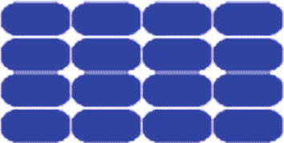

图 7-3

用图像图案填充矩形

```java
Rectangle r1 = new Rectangle(100, 50);
r1.setFill(p1);

```

如果您使用相同的图像模式用下面的代码片段填充一个三角形，得到的三角形将如图 [7-4](#Fig4) 所示:


图 7-4

用图像图案填充三角形

```java
Polygon triangle = new Polygon(50, 0, 0, 50, 100, 50);
triangle.setFill(p1);

```

在没有拼贴图案的情况下，如何用图像完全填充形状？您需要使用一个参数设置为 true 的`ImagePattern`。锚点矩形的中心应该在(0，0)处，其宽度和高度应该设置为 1，如下所示:

```java
// An image pattern to completely fill a shape with the image
ImagePatterm ip = new ImagePattern(yourImage, 0.0, 0.0, 1.0, 1.0, true);

```

清单 [7-1](#PC13) 中的程序展示了如何使用图像模式。产生的屏幕如图 [7-5](#Fig5) 所示。它的`init()`方法将图像加载到一个`Image`对象中，并将其存储在一个实例变量中。如果在`CLASSPATH`中没有找到图像文件，它会打印一条错误信息并退出。


图 7-5

用图像图案填充不同的形状

```java
// ImagePatternApp.java
package com.jdojo.color;

import com.jdojo.util.ResourceUtil;
import javafx.application.Application;
import javafx.scene.Scene;
import javafx.scene.image.Image;
import javafx.scene.layout.HBox;
import javafx.scene.paint.ImagePattern;
import javafx.scene.shape.Circle;
import javafx.scene.shape.Rectangle;
import javafx.stage.Stage;

public class ImagePatternApp extends Application {
      private Image img;

      public static void main(String[] args) {
            Application.launch(args);
      }

      @Override
      public void init() {
            // Create an Image object
            final String imgPath = ResourceUtil.getResourceURLStr(
                 "picture/blue_rounded_rectangle.png");
            img = new Image(imgPath);
      }

      @Override
      public void start(Stage stage) {
            // An anchor rectangle at (0, 0) that is 25% wide and 25% tall
            // relative to the rectangle to be filled
            ImagePattern p1 = new ImagePattern(img, 0, 0, 0.25, 0.25, true);
            Rectangle r1 = new Rectangle(100, 50);
            r1.setFill(p1);

            // An anchor rectangle at (0, 0) that is 50% wide and 50% tall
            // relative to the rectangle to be filled
            ImagePattern p2 = new ImagePattern(img, 0, 0, 0.5, 0.5, true);
            Rectangle r2 = new Rectangle(100, 50);
            r2.setFill(p2);

            // Using absolute bounds for the anchor rectangle
            ImagePattern p3 = new ImagePattern(img, 40, 15, 20, 20, false);
            Rectangle r3 = new Rectangle(100, 50);
            r3.setFill(p3);

            // Fill a circle

            ImagePattern p4 = new ImagePattern(img, 0, 0, 0.1, 0.1, true);
            Circle c = new Circle(50, 50, 25);
            c.setFill(p4);

            HBox root = new HBox();
            root.getChildren().addAll(r1, r2, r3, c);

            Scene scene = new Scene(root);
            stage.setScene(scene);

            stage.setTitle("Using Image Patterns");
            stage.show();
      }
}

Listing 7-1Using an Image Pattern to Fill Different Shapes

```

## 了解线性颜色渐变

使用称为*渐变线*的轴来定义线性颜色渐变。渐变线上的每个点都有不同的颜色。垂直于渐变线的直线上的所有点都具有相同的颜色，即两条线的交点的颜色。渐变线由起点和终点定义。沿渐变线的颜色是在渐变线上的一些点定义的，这些点被称为*停止色点*(或停止点)。使用插值法计算两个停止点之间的颜色。

渐变线有方向，是从起点到终点。垂直于渐变线并通过停止点的线上的所有点将具有停止点的颜色。例如，假设您用颜色 C1 定义了一个停止点 P1。如果你画一条垂直于穿过 P1 点的渐变线的线，该线上的所有点都将具有 C1 的颜色。

图 [7-6](#Fig6) 显示了构成线性颜色渐变的元素的细节。它显示了一个用线性颜色渐变填充的矩形区域。从左侧到右侧定义渐变线。起点为白色，终点为黑色。在矩形的左侧，所有点都是白色，在右侧，所有点都是黑色。在左侧和右侧之间，颜色在白色和黑色之间变化。

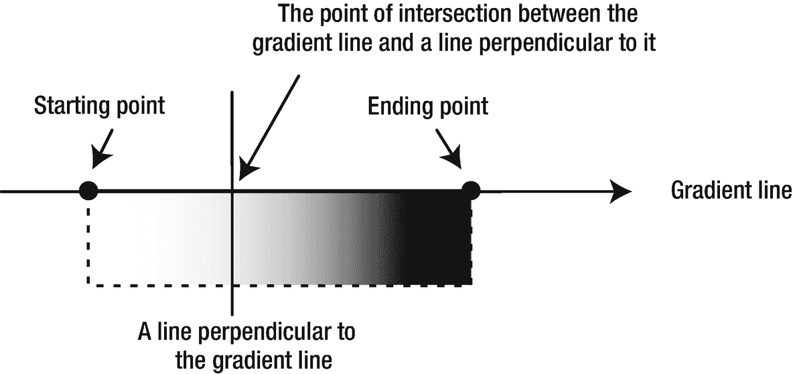

图 7-6

线性颜色渐变的细节

### 使用 *LinearGradient* 类

在 JavaFX 中，`LinearGradient`类的一个实例表示线性颜色渐变。该类有以下两个构造器。他们最后的争论类型是不同的:

*   `LinearGradient(double startX, double startY, double endX, double endY, boolean proportional, CycleMethod cycleMethod, List<Stop> stops)`

*   `LinearGradient(double startX, double startY, double endX, double endY, boolean proportional, CycleMethod cycleMethod, Stop... stops)`

`startX`和`startY`参数定义了渐变线起点的 x 和 y 坐标。`endX`和`endY`参数定义了渐变线终点的 x 和 y 坐标。

`proportional`参数影响起点和终点坐标的处理方式。如果为真，则起点和终点相对于单位正方形处理。否则，它们将被视为局部坐标系中的绝对值。这个论点的用法需要多一点解释。

通常，颜色渐变用于填充区域，例如矩形。有时候，你知道区域的大小，有时候你不会。此参数的值允许您以相对或绝对形式指定渐变线。在相对形式中，该区域被视为一个单位正方形。也就是说，左上角和右下角的坐标分别是(0.0，0.0)和(1.0，1.0)。区域中的其他点的 x 和 y 坐标将在 0.0 和 1.0 之间。假设你指定起点为(0.0，0.0)，终点为(1.0，0.0)。它定义了一条从左到右的水平渐变线。(0.0，0.0)和(0.0，1.0)的起点和终点定义了一条从上到下的垂直渐变线。(0.0，0.0)和(0.5，0.0)的起点和终点定义了从区域左侧到中间的水平渐变线。

当`proportional`参数为假时，起点和终点的坐标值被视为相对于局部坐标系的绝对值。假设你有一个宽 200 高 100 的矩形。(0.0，0.0)和(200.0，0.0)的起点和终点定义了一条从左到右的水平渐变线。(0.0，0.0)和(200.0，100.0)的起点和终点定义了一条从左上角到右下角的倾斜渐变线。

`cycleMethod`参数定义了由起点和终点定义的颜色渐变边界之外的区域应该如何填充。假设您将比例参数设置为`true`的起点和终点分别定义为(0.0，0.0)和(0.5，0.0)。这只覆盖了该区域的左半部分。区域的右半部分应该如何填充？您可以使用`cycleMethod`参数来指定这种行为。其值是在`CycleMethod`枚举中定义的枚举常量之一:

*   `CycleMethod.NO_CYCLE`

*   `CycleMethod.REFLECT`

*   `CycleMethod.REPEAT`

`NO_CYCLE`的循环方法用终端颜色填充剩余区域。如果您已将颜色定义为仅从区域左侧到中间的停止点，则右半部分将用为区域中间定义的颜色填充。假设您只为区域的中间一半定义了颜色渐变，而左侧的 25%和右侧的 25%未定义。`NO_CYCLE`方法将使用距离左侧 25%处定义的颜色填充左侧 25%的区域，使用距离右侧 25%处定义的颜色填充右侧 25%的区域。中间 50%的颜色将由颜色停止点决定。

`REFLECT`的循环方法通过从最近的填充区域开始到结束和结束到开始反映颜色渐变来填充剩余的区域。`REPEAT`的循环方法重复颜色渐变填充剩余区域。

`stops`参数定义了沿渐变线的颜色停止点。一个颜色停止点由一个`Stop`类的实例表示，它只有一个构造器:

```java
Stop(double offset, Color color)

```

偏移值介于 0.0 和 1.0 之间。它定义了从起点开始沿渐变线的停止点的相对距离。例如，偏移 0.0 是起点，偏移 1.0 是终点，偏移 0.5 在起点和终点的中间，依此类推。您可以用两种不同的颜色定义至少两个停止点，以获得颜色渐变。您可以为颜色渐变定义的停止点数量没有限制。

以上是对`LinearGradient`构造器参数的解释。所以让我们来看一些如何使用它们的例子。

以下代码片段用线性颜色渐变填充一个矩形，如图 [7-7](#Fig7) 所示:

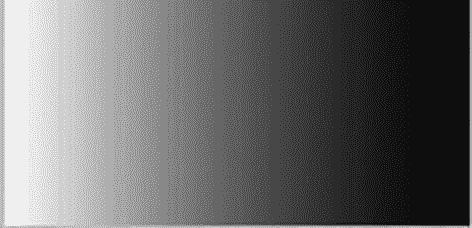

图 7-7

具有两个停止点的水平线性颜色渐变:起点为白色，终点为黑色

```java
Stop[] stops = new Stop[]{new Stop(0, Color.WHITE), new Stop(1, Color.BLACK)};
LinearGradient lg = new LinearGradient(0, 0, 1, 0, true, NO_CYCLE, stops);
Rectangle r = new Rectangle(200, 100);
r.setFill(lg);

```

你有两个颜色停止点。起点的停止点是白色的，终点的停止点是黑色的。起点(0，0)和终点(1，0)定义了从左到右的水平渐变。`proportional`参数被设置为`true`，这意味着坐标值被解释为相对于单位正方形。设置为`NO_CYCLE`的循环方法参数在这种情况下不起作用，因为渐变边界覆盖了整个区域。在前面的代码中，如果您想将`proportional`参数值设置为`false`，以达到相同的效果，您可以如下创建`LinearGradient`对象。请注意，使用 200 作为终点的 x 坐标来表示矩形宽度的终点:

```java
LinearGradient lg = new LinearGradient(0, 0, 200, 0, false, NO_CYCLE, stops);

```

让我们看另一个例子。运行以下代码片段后得到的矩形如图 [7-8](#Fig8) 所示:

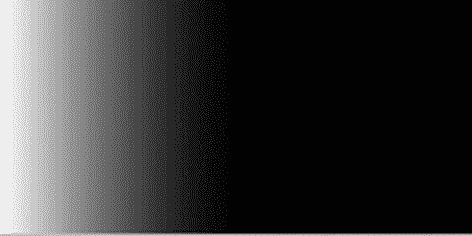

图 7-8

有两个停止点的水平线性颜色渐变:起点为白色，中点为黑色

```java
Stop[] stops = new Stop[]{new Stop(0, Color.WHITE), new Stop(1, Color.BLACK)};
LinearGradient lg = new LinearGradient(0, 0, 0.5, 0, true, NO_CYCLE, stops);
Rectangle r = new Rectangle(200, 100);
r.setFill(lg);

```

在这段代码中，您做了一点小小的修改。您定义了一条水平渐变线，该线从矩形的左侧开始，在中间结束。注意使用(0.5，0)作为终点的坐标。这使得矩形的右半部分没有颜色渐变。在这种情况下，循环方法是有效的，因为它的工作是填充未填充的区域。矩形中间的颜色是黑色，由第二个停止点定义。`NO_CYCLE`值使用终端黑色填充矩形的右半部分。

让我们看一下前一个例子的一个微小的变体。您将循环方法从`NO_CYCLE`更改为`REFLECT`，如以下代码片段所示，这将生成如图 [7-9](#Fig9) 所示的矩形。请注意，右半部分区域(具有未定义梯度的区域)是左半部分的反射:

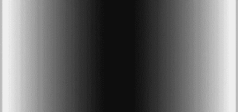

图 7-9

带有两个停止点的水平线性颜色渐变:起点为白色，中点为黑色，循环方法为`REFLECT`

```java
Stop[] stops = new Stop[]{new Stop(0, Color.WHITE), new Stop(1, Color.BLACK)};
LinearGradient lg = new LinearGradient(0, 0, 0.5, 0, true, REFLECT, stops);
Rectangle r = new Rectangle(200, 100);
r.setFill(lg);

```

让我们对前面的例子做一点小小的改变，这样终点坐标只覆盖了矩形宽度的十分之一。代码如下，生成的矩形如图 [7-10](#Fig10) 所示。矩形右边的 90%使用`REFLECT`循环方法填充，交替使用首尾相连和首尾相连的颜色模式:

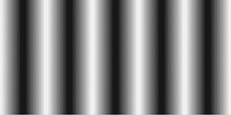

图 7-10

带有两个停止点的水平线性颜色渐变:起点为白色，十分之一点为黑色，循环方法为`REFLECT`

```java
Stop[] stops = new Stop[]{new Stop(0, Color.WHITE), new Stop(1, Color.BLACK)};
LinearGradient lg = new LinearGradient(0, 0, 0.1, 0, true, REFLECT, stops);
Rectangle r = new Rectangle(200, 100);
r.setFill(lg);

```

现在我们来看看使用`REPEAT`循环法的效果。下面的代码片段使用了一个位于矩形宽度中间的结束点和一个循环方法`REPEAT`。这产生了如图 [7-11](#Fig11) 所示的矩形。在本例中，如果将终点设置为宽度的十分之一，就会得到如图 [7-12](#Fig12) 所示的矩形。

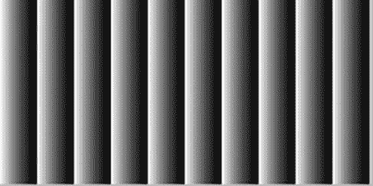

图 7-12

带有两个停止点的水平线性颜色渐变:起点为白色，十分之一点为黑色，循环方法为`REPEAT`


图 7-11

带有两个停止点的水平线性颜色渐变:起点为白色，中点为黑色，循环方法为`REPEAT`

```java
Stop[] stops = new Stop[]{new Stop(0, Color.WHITE), new Stop(1, Color.BLACK)};
LinearGradient lg = new LinearGradient(0, 0, 0.5, 0, true, REPEAT, stops);
Rectangle r = new Rectangle(200, 100);
r.setFill(lg);

```

您还可以定义两个以上的停止点，如下面的代码片段所示。它将渐变线上起点和终点之间的距离分为四段，每段占宽度的 25%。第一段(从左开始)的颜色介于红色和绿色之间，第二段介于绿色和蓝色之间，第三段介于蓝色和橙色之间，第四段介于橙色和黄色之间。产生的矩形如图 [7-13](#Fig13) 所示。如果你正在阅读这本书的印刷本，你可能看不到颜色。

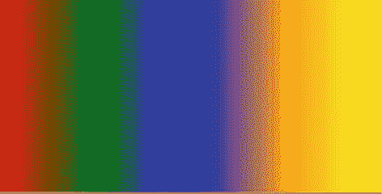

图 7-13

具有五个停止点的水平线性颜色渐变

```java
Stop[] stops = new Stop[]{new Stop(0, Color.RED),
                          new Stop(0.25, Color.GREEN),
                          new Stop(0.50, Color.BLUE),
                          new Stop(0.75, Color.ORANGE),
                          new Stop(1, Color.YELLOW)};
LinearGradient lg = new LinearGradient(0, 0, 1, 0, true, NO_CYCLE, stops);
Rectangle r = new Rectangle(200, 100);
r.setFill(lg);

```

您不仅限于定义水平颜色渐变。您可以使用任意角度的渐变线来定义颜色渐变。下面的代码片段创建了一个从左上角到右下角的渐变。请注意，当比例参数为真时，(0，0)和(1，1)定义了区域左上角和右下角的(x，y)坐标:

```java
Stop[] stops = new Stop[]{new Stop(0, Color.WHITE), new Stop(1, Color.BLACK)};
LinearGradient lg = new LinearGradient(0, 0, 1, 1, true, NO_CYCLE, stops);
Rectangle r = new Rectangle(200, 100);
r.setFill(lg);

```

以下代码片段定义了(0，0)和(0.1，0.1)点之间的渐变线。它使用`REPEAT`循环方法来填充剩余的区域。产生的矩形如图 [7-14](#Fig14) 所示。


图 7-14

带有两个停止点的倾斜线性颜色渐变:起点(0，0)为白色，终点(0.1，0.1)为黑色，使用`REPEAT`作为循环方法

```java
Stop[] stops = new Stop[]{new Stop(0, Color.WHITE), new Stop(1, Color.BLACK)};
LinearGradient lg = new LinearGradient(0, 0, 0.1, 0.1, true, REPEAT, stops);
Rectangle r = new Rectangle(200, 100);
r.setFill(lg);

```

### 使用字符串格式定义线性颜色渐变

您还可以使用`LinearGradient`类的静态方法`valueOf(String colorString)`指定字符串格式的线性颜色渐变。通常，字符串格式用于在 CSS 文件中指定线性颜色渐变。它具有以下语法:

```java
linear-gradient([gradient-line], [cycle-method], color-stops-list)

```

方括号([和])中的参数是可选的。如果不指定可选参数，后面的逗号也需要排除。渐变线参数的默认值是“到底”循环方法参数的默认值是`NO_CYCLE`。可以用两种方式指定渐变线:

*   使用两点——起点和终点

*   使用侧面或角落

对渐变线使用两点的语法是

```java
from point-1 to point-2

```

这些点的坐标可以以面积的百分比或以像素的实际测量值来指定。对于 200 像素宽 100 像素高的矩形，可以通过以下两种方式指定水平渐变线:

```java
from 0% 0% to 100% 0%

```

或者

```java
from 0px 0px to 200px 0px

```

使用边或角的语法是

```java
to side-or-corner

```

边值或角值可以是上、左、下、右、左上、左下、右下或右上。当使用边或角定义坡线时，只需指定终点。起点推断。例如，值“到顶部”将起点推断为“从底部”，值“到右下角”将起点推断为“从左上角”，依此类推。如果缺少渐变线值，则默认为“到底部”

`cycle-method`的有效值是`repeat`和`reflect`。如果缺少，则默认为`NO_CYCLE`。将`cycle-method`参数的值指定为`NO_CYCLE`是一个运行时错误。如果您希望它是`NO_CYCLE`，只需从语法中省略`cycle-method`参数。

`color-stops-list`参数是一个色标列表。色标由一个 web 颜色名称和一个位置(可选)组成，该位置以像素或起点百分比为单位。色标列表的示例有

*   `white, black`

*   `white 0%, black 100%`

*   `white 0%, yellow 50%, blue 100%`

*   `white 0px, yellow 100px, red 200px`

当您没有指定第一个和最后一个色标的位置时，第一个色标的位置默认为 0%，第二个色标的位置默认为 100%。因此，颜色停止列表`"white, black"`和`"white 0%, black 100%"`基本上是相同的。

如果您没有为列表中的任何颜色停止点指定位置，它们将被分配位置，使它们均匀地位于起点和终点之间。以下两个色标列表是相同的:

*   `white, yellow, black, red, green`

*   `white 0%, yellow 25%, black 50%, red 75%, green 100%`

您可以为列表中的某些色标指定位置，而不为其他色标指定位置。在这种情况下，没有位置的色标均匀分布在前面和后面有位置的色标之间。以下两个色标列表是相同的:

*   `white, yellow, black 60%, red, green`

*   `white 0%, yellow 30%, black 50%, red 80%, green 100%`

如果列表中某个色标的位置设置小于为任何先前色标指定的位置，则其位置将设置为等于为先前色标设置的最大位置。以下色标列表将第三个色标设置为 10%，小于第二个色标的位置(50%):

```java
white, yellow 50%, black 10%, green

```

这将在运行时更改为使用 50%的第三个颜色停止，如下所示:

```java
white 0%, yellow 50%, black 50%, green 100%

```

现在我们来看一些例子。下面的字符串将创建一个从上到下的线性渐变，使用`NO_CYCLE`作为循环方法。顶部和底部的颜色分别是白色和黑色:

```java
linear-gradient(white, black)

```

该值与相同

```java
linear-gradient(to bottom, white, black)

```

下面的代码片段将创建一个如图 [7-15](#Fig15) 所示的矩形。它定义了一个水平颜色渐变，其终点位于矩形宽度的中间。它使用`repeat`作为循环方法:


图 7-15

使用字符串格式创建线性颜色渐变

```java
String value = "from 0px 0px to 100px 0px, repeat, white 0%, black 100%";
LinearGradient lg2 = LinearGradient.valueOf(value);
Rectangle r2 = new Rectangle(200, 100);
r2.setFill(lg2);

```

以下线性颜色渐变的字符串值将创建一个从左上角到右下角的对角线渐变，用白色和黑色填充该区域:

```java
"to bottom right, white 0%, black 100%"

```

## 了解径向颜色渐变

在径向颜色渐变中，颜色从一个点开始，以圆形或椭圆形向外平滑过渡。这个形状，比如说一个圆，是由一个中心点和一个半径定义的。颜色的起点被称为渐变的*焦点。颜色沿着一条线变化，从渐变的焦点开始，向各个方向变化，直到到达形状的外围。使用三个组件定义径向颜色渐变:*

*   渐变形状(渐变圆的中心和半径)

*   具有渐变的第一种颜色的焦点

*   颜色停止

渐变的焦点和渐变形状的中心点可能不同。图 [7-16](#Fig16) 显示了径向颜色渐变的组成部分。该图显示了两个径向梯度:在左侧，焦点和中心点位于同一位置；在右侧，焦点位于形状中心点的水平右侧。


图 7-16

定义径向颜色渐变的元素

聚焦点由聚焦角度和聚焦距离定义，如图 [7-17](#Fig17) 所示。焦点角度是穿过形状中心点的水平线和连接中心点和焦点的线之间的角度。焦距是形状的中心点和渐变的焦点之间的距离。

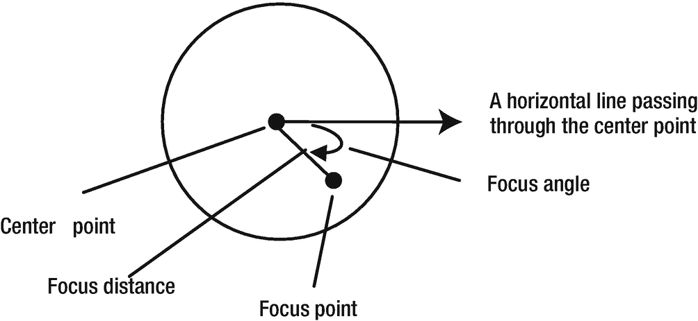

图 7-17

在径向颜色渐变中定义焦点

色标列表确定渐变形状内部某一点的颜色值。焦点定义了色标的 0%位置。圆周上的点定义了色标的 100%位置。如何确定渐变圆内某一点的颜色？你可以画一条穿过该点和焦点的线。将使用线中该点每侧最近的颜色停止点对该点的颜色进行插值。

### 使用*径向梯度*级

`RadialGradient`类的一个实例代表一种径向颜色渐变。该类包含以下两个构造器，它们的最后一个参数的类型不同:

*   `RadialGradient(double focusAngle, double focusDistance, double centerX, double centerY, double radius, boolean proportional, CycleMethod cycleMethod, List<Stop> stops)`

*   `RadialGradient(double focusAngle, double focusDistance, double centerX, double centerY, double radius, boolean proportional, CycleMethod cycleMethod, Stop... stops)`

`focusAngle`参数定义焦点的聚焦角度。正聚焦角从穿过中心点的水平线和连接中心点和焦点的线开始顺时针测量。逆时针测量负值。

`focusDistance`参数用圆半径的百分比来表示。该值固定在–1 和 1 之间。也就是说，焦点总是在渐变圆内。如果焦点距离将焦点设置在渐变圆的外围之外，则使用的焦点是圆的外围与连接中心点和设置的焦点的线的交点。

聚焦角度和焦距可以有正值和负值。图 [7-18](#Fig18) 说明了这一点:它显示了位于距离中心点 80%处的四个焦点，正和负，正和负成 60 度角。

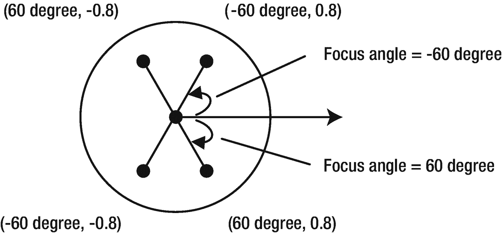

图 7-18

利用焦点角度和焦距定位焦点

`centerX`和`centerY`参数分别定义中心点的 x 和 y 坐标，半径参数是渐变圆的半径。这些参数可以相对于单位平方(在 0.0 和 1.0 之间)或以像素为单位来指定。

`proportional`参数影响中心点和半径坐标值的处理方式。如果这是真的，它们相对于单位正方形被处理。否则，它们将被视为局部坐标系中的绝对值。关于使用`proportional`参数的更多细节，请参考本章前面的“使用 *LinearGradient* 类”一节。

Tip

JavaFX 允许您创建圆形的径向渐变。但是，当要由径向颜色渐变填充的区域具有非方形边界框(例如，矩形)并且您相对于要填充的形状的大小指定渐变圆的半径时，JavaFX 将使用椭圆形径向颜色渐变。这在`RadialGradient`类的 API 文档中没有记载。我将很快给出一个这样的例子。

`cycleMethod`和`stops`参数与前面使用`LinearGradient`类一节中描述的含义相同。在径向颜色渐变中，停止点是沿着连接焦点和渐变圆外围点的线定义的。焦点定义 0%停止点，圆周上的点定义 100%停止点。

让我们看一些使用`RadialGradient`类的例子。下面的代码片段为一个圆形产生一个径向颜色渐变，如图 [7-19](#Fig19) 所示:

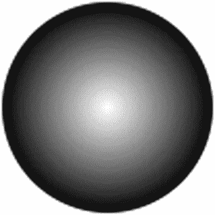

图 7-19

具有相同中心点和焦点的径向颜色渐变

```java
Stop[] stops = new Stop[]{new Stop(0, Color.WHITE), new Stop(1, Color.BLACK)};
RadialGradient rg = new RadialGradient(0, 0, 0.5, 0.5, 0.5, true, NO_CYCLE, stops);
Circle c = new Circle(50, 50, 50);
c.setFill(rg);

```

焦点角度和焦点距离的零值将焦点定位在渐变圆的中心。true `proportional`参数将中心点坐标(0.5，0.5)解释为 50 乘 50 的圆形矩形边界的(25px，25px)。半径值 0.5 被解释为 25px，这将渐变圆的中心放置在与要填充的圆的中心相同的位置。在这种情况下，`NO_CYCLE`的循环方法不起作用，因为渐变圆填充了整个圆形区域。在焦点处的色阶是白色的，在渐变圆的外围是黑色的。

以下代码片段将渐变圆的半径指定为要填充的圆的 0.2 倍。这意味着它将使用 10px (0.2 乘以 50px，这是要填充的圆的半径)的渐变圆。产生的圆如图 [7-20](#Fig20) 所示。由于循环方法被指定为`NO_CYCLE`，超出半径 0.2 的圆区域被填充为黑色:

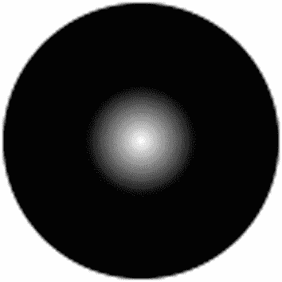

图 7-20

具有相同中心点和焦点的径向颜色渐变具有半径为 0.20 的渐变圆

```java
Stop[] stops = new Stop[]{new Stop(0, Color.WHITE), new Stop(1, Color.BLACK)};
RadialGradient rg = new RadialGradient(0, 0, 0.5, 0.5, 0.2, true, NO_CYCLE, stops);
Circle c = new Circle(50, 50, 50);
c.setFill(rg);

```

现在让我们使用前面代码片段中的循环方法`REPEAT`。最终的圆如图 [7-21](#Fig21) 所示。

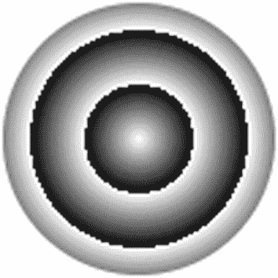

图 7-21

中心点和焦点相同的径向颜色渐变，半径为 0.20 的渐变圆，循环方式为`REPEAT`

```java
Stop[] stops = new Stop[]{new Stop(0, Color.WHITE), new Stop(1, Color.BLACK)};
RadialGradient rg = new RadialGradient(0, 0, 0.5, 0.5, 0.2, true, REPEAT, stops);
Circle c = new Circle(50, 50, 50);
c.setFill(rg);

```

所以现在让我们使用一个不同的中心点和焦点。使用 60 度聚焦角度和 0.2 倍半径作为焦距，如以下代码所示。产生的圆如图 [7-22](#Fig22) 所示。请注意将焦点从中心点移开所获得的 3D 效果。

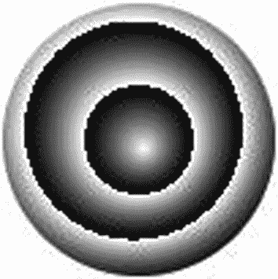

图 7-22

使用不同中心和焦点的径向颜色渐变

```java
Stop[] stops = new Stop[]{new Stop(0, Color.WHITE), new Stop(1, Color.BLACK)};
RadialGradient rg =
    new RadialGradient(60, 0.2, 0.5, 0.5, 0.2, true, REPEAT, stops);
Circle c = new Circle(50, 50, 50);
c.setFill(rg);

```

现在让我们用径向颜色渐变填充一个矩形区域(非正方形)。该效果的代码如下，生成的矩形如图 [7-23](#Fig23) 所示。注意 JavaFX 使用的椭圆渐变形状。您已经将渐变的半径指定为 0.5，并将`proportional`参数指定为`true`。由于您的矩形宽 200 像素，高 100 像素，因此会产生两个半径:一个沿 x 轴，一个沿 y 轴，从而产生一个椭圆。沿 x 轴和 y 轴的半径分别为 100 像素和 50 像素。

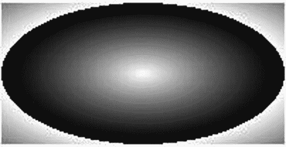

图 7-23

用径向颜色渐变填充的矩形，其比例参数值为 true

```java
Stop[] stops = new Stop[]{new Stop(0, Color.WHITE), new Stop(1, Color.BLACK)};
RadialGradient rg =
    new RadialGradient(0, 0, 0.5, 0.5, 0.5, true, REPEAT, stops);
Rectangle r = new Rectangle(200, 100);
r.setFill(rg);

```

如果你想用圆形而不是椭圆形的颜色渐变填充矩形，你应该将`proportional`参数指定为`false`，半径值将以像素为单位。以下代码片段生成一个矩形，如图 [7-24](#Fig24) 所示:


图 7-24

用径向颜色渐变填充的矩形，其比例参数值为 false

```java
Stop[] stops = new Stop[]{new Stop(0, Color.WHITE), new Stop(1, Color.BLACK)};
RadialGradient rg =
    new RadialGradient(0, 0, 100, 50, 50, false, REPEAT, stops);
Rectangle r = new Rectangle(200, 100);
r.setFill(rg);

```

如何用径向颜色渐变填充三角形或任何其他形状？径向梯度的形状，圆形或椭圆形，取决于几个条件。表 [7-1](#Tab1) 显示了决定径向颜色渐变形状的标准组合。

表 7-1

用于确定径向颜色渐变形状的标准

<colgroup><col class="tcol1 align-left"> <col class="tcol2 align-left"> <col class="tcol3 align-left"></colgroup> 
| 

比例论点

 | 

填充区域的边界框

 | 

梯度形状

 |
| --- | --- | --- |
| 真实的 | 平方 | 圆 |
| 真实的 | 非方形 | 椭圆 |
| 错误的 | 平方 | 圆 |
| 错误的 | 非方形 | 圆 |

我应该在这里强调，在前面的讨论中，我谈论的是要填补的区域的界限，而不是该区域。例如，假设您想要用径向颜色渐变填充一个三角形。三角形的边界将由其宽度和高度决定。如果三角形有相同的宽度和高度，它的边界是一个正方形区域。否则，它的边界采用矩形区域。

以下代码片段用顶点(0.0，0.0)，(0.0，100.0)和(100.0，100.0)填充一个三角形。请注意，这个三角形的边界框是一个 100 像素乘 100 像素的正方形。由此产生的三角形是图 [7-25](#Fig25) 中的左图。

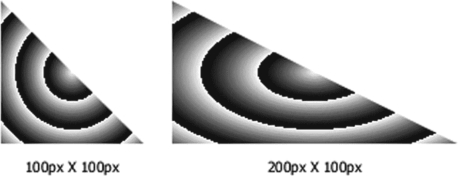

图 7-25

用圆形和椭圆形的径向颜色渐变填充三角形

```java
Stop[] stops = new Stop[]{new Stop(0, Color.WHITE), new Stop(1, Color.BLACK)};
RadialGradient rg =
    new RadialGradient(0, 0, 0.5, 0.5, 0.2, true, REPEAT, stops);
Polygon triangle = new Polygon(0.0, 0.0, 0.0, 100.0, 100.0, 100.0);
triangle.setFill(rg);

```

图 [7-25](#Fig25) 右侧的三角形使用了一个 200px 乘 100px 的矩形边界框，由下面的代码片段生成。请注意，渐变使用了椭圆形状:

```java
Polygon triangle = new Polygon(0.0, 0.0, 0.0, 100.0, 200.0, 100.0);

```

最后，我们来看一个使用多个色标的例子，焦点在圆的外围，如图 [7-26](#Fig26) 。产生这种效果的代码如下:

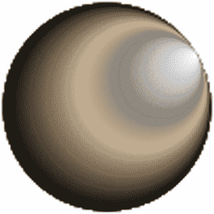

图 7-26

在径向颜色渐变中使用多个色标

```java
Stop[] stops = new Stop[]{
   new Stop(0, Color.WHITE),
   new Stop(0.40, Color.GRAY),
   new Stop(0.60, Color.TAN),
   new Stop(1, Color.BLACK)};
RadialGradient rg =
   new RadialGradient(-30, 1.0, 0.5, 0.5, 0.5, true, REPEAT, stops);
Circle c = new Circle(50, 50, 50);
c.setFill(rg);

```

### 以字符串格式定义径向颜色渐变

您还可以使用`RadialGradient`类的静态方法`valueOf(String colorString)`指定字符串格式的径向颜色渐变。通常，字符串格式用于在 CSS 文件中指定径向颜色渐变。它具有以下语法:

```java
radial-gradient([focus-angle], [focus-distance], [center], radius, [cycle-method], color-stops-list)

```

方括号中的参数是可选的。如果没有指定可选参数，后面的逗号也需要排除。

`focus-angle`和`focus-distance`的默认值为 0。您可以用度、弧度、梯度和圈数来指定焦点角度。焦距被指定为半径的百分比。例子如下:

*   `focus-angle 45.0deg`

*   `focus-angle 0.5rad`

*   `focus-angle 30.0grad`

*   `focus-angle 0.125turn`

*   `focus-distance 50%`

`center`和`radius`参数以相对于被填充区域的百分比或绝对像素来指定。不能将一个参数指定为百分比，而将另一个参数指定为像素。两者必须以相同的单位指定。中心的默认值是(0，0)单位。例子如下:

*   `center 50px 50px, radius 50px`

*   `center 50% 50%, radius 50%`

`cycle-method`参数的有效值是`repeat`和`reflect`。如果未指定，则默认为`NO_CYCLE`。

使用颜色及其位置来指定颜色色标列表。位置被指定为从焦点到渐变形状外围的直线上的距离的百分比。有关更多详细信息，请参考前面关于在线性颜色渐变中指定颜色停止点的讨论。例子如下:

*   `white, black`

*   `white 0%, black 100%`

*   `red, green, blue`

*   `red 0%, green 80%, blue 100%`

下面的代码片段会产生一个圆，如图 [7-27](#Fig27) 所示:


图 7-27

使用字符串格式指定径向颜色渐变

```java
String colorValue =
   "radial-gradient(focus-angle 45deg, focus-distance 50%, " +
   "center 50% 50%, radius 50%, white 0%, black 100%)";
RadialGradient rg = RadialGradient.valueOf(colorValue);
Circle c = new Circle(50, 50, 50);
c.setFill(rg);

```

## 摘要

在 JavaFX 中，您可以为区域指定文本颜色和背景颜色。您可以将颜色指定为统一颜色、图像图案或颜色渐变。统一颜色使用相同的颜色填充整个区域。图像图案允许您用图像图案填充区域。颜色渐变定义了一种颜色模式，其中颜色沿着一条直线从一种颜色变化到另一种颜色。颜色梯度的变化可以是线性的或放射状的。所有的类都包含在`javafx.scene.paint`包中。

`Paint`类是一个抽象类，它是其他颜色类的基类。统一颜色、图像图案、线性颜色渐变和径向颜色渐变分别是`Color`、`ImagePattern`、`LinearGradient`和`RadialGradient`类的实例。使用颜色渐变时会用到`Stop`类和`CycleMethod`枚举。您可以使用这些类之一的实例或字符串形式来指定颜色。当使用 CSS 样式化节点时，使用字符串形式指定颜色。

图像图案允许您用图像填充形状。图像可以填充整个形状，也可以使用平铺模式。

使用称为渐变线的轴来定义线性颜色渐变。渐变线上的每个点都有不同的颜色。垂直于渐变线的直线上的所有点都具有相同的颜色，即两条线的交点的颜色。渐变线由起点和终点定义。沿渐变线的颜色是在渐变线上的一些点定义的，这些点称为停止颜色点(或停止点)。使用插值法计算两个停止点之间的颜色。渐变线有方向，是从起点到终点。垂直于穿过停止点的渐变线的线上的所有点将具有停止点的颜色。例如，假设您用颜色 C1 定义了一个停止点 P1。如果你画一条垂直于穿过 P1 点的渐变线的线，该线上的所有点都将具有 C1 的颜色。

在径向颜色渐变中，颜色从一个点开始，以圆形或椭圆形向外平滑过渡。该形状由中心点和半径定义。颜色的起点被称为渐变的焦点。颜色沿着一条线变化，从渐变的焦点开始，向各个方向变化，直到到达形状的外围。

下一章将向你展示如何使用 CSS 样式化场景图中的节点。