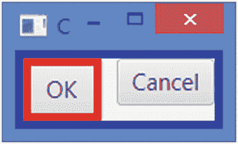
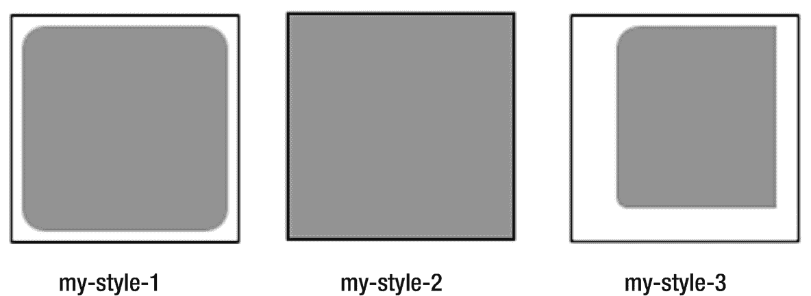
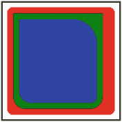

# 八、样式化节点

在本章中，您将学习:

*   什么是级联样式表

*   样式、皮肤和主题之间的区别

*   JavaFX 中级联样式表样式的命名约定

*   如何向场景添加样式表

*   如何在 JavaFX 应用程序中使用和覆盖默认样式表

*   如何为节点添加内联样式

*   关于不同类型的级联样式表属性

*   关于级联样式表样式选择器

*   如何使用级联样式表选择器在场景图中查找节点

*   如何使用已编译的样式表

本章的例子在`com.jdojo.style`包中。为了让它们工作，您必须在`module-info.java`文件中添加相应的一行:

```java
...
opens com.jdojo.style to javafx.graphics, javafx.base;
...

```

## 什么是级联样式表？

级联样式表(CSS)是一种用于描述 GUI 应用程序中 UI 元素的表示(外观或样式)的语言。CSS 主要是为网页设计 HTML 元素而开发的。它允许将表示与内容和行为分离。在典型的 web 页面中，内容和表示分别使用 HTML 和 CSS 来定义。

JavaFX 允许您使用 CSS 定义 JavaFX 应用程序的外观(或风格)。您可以使用 JavaFX 类库或 FXML 来定义 UI 元素，并使用 CSS 来定义它们的外观。

CSS 提供了编写规则来设置可视属性的语法。一个规则由一个*选择器*和一组*属性-值*对组成。选择器是一个字符串，它标识将应用规则的 UI 元素。属性-值对由属性名及其对应的值组成，用冒号(:)分隔。两个属性-值对由分号(；).属性-值对的集合包含在选择器前面的大括号({ })中。CSS 中的规则示例如下:

```java
.button {
        -fx-background-color: red;
        -fx-text-fill: white;
}

```

这里，`.button`是一个选择器，指定规则将应用于所有按钮；`-fx-background-color`和`-fx-text-fill`是属性名，它们的值分别被设置为`red`和`white`。当应用前面的规则时，所有按钮都将具有红色背景色和白色文本色。

Tip

在 JavaFX 中使用 CSS 类似于在 HTML 中使用 CSS。如果你以前用过 CSS 和 HTML，这一章的信息听起来会很熟悉。理解如何在 JavaFX 中使用 CSS 并不需要以前的 CSS 经验。本章涵盖了使您能够在 JavaFX 中使用 CSS 的所有必要材料。

## 什么是样式、皮肤和主题？

CSS 规则也被称为*样式*。CSS 规则的集合被称为*样式表*。*风格*、*皮肤*和*主题*是三个相关的、高度混淆的概念。

样式提供了一种分离 UI 元素的表现和内容的机制。它们还有助于可视化属性及其值的分组，因此可以由多个 UI 元素共享。JavaFX 允许您使用 JavaFX CSS 创建样式。

*皮肤*是应用程序特定样式的集合，定义了应用程序的外观。*换肤*是动态改变应用程序外观(或皮肤)的过程。JavaFX 不提供特定的换肤机制。但是，使用 JavaFX CSS 和 JavaFX API(可用于`Scene`类和其他与 UI 相关的类),您可以轻松地为 JavaFX 应用程序提供皮肤。

主题是操作系统的视觉特征，反映在所有应用程序的 UI 元素的外观上。例如，更改 Windows 操作系统上的主题会更改所有正在运行的应用程序中 UI 元素的外观。对比皮肤和主题，皮肤是特定于应用程序的，而主题是特定于操作系统的。基于主题的皮肤是很典型的。也就是说，当当前主题改变时，您将改变应用程序的皮肤以匹配主题。JavaFX 不直接支持主题。

## 一个简单的例子

让我们看一个简单但完整的在 JavaFX 中使用样式表的例子。您将把所有按钮的背景颜色和文本颜色分别设置为红色和白色。清单 [8-1](#PC3) 中显示了样式的代码。

```java
.button {
    -fx-background-color: red;
    -fx-text-fill: white;
}

Listing 8-1The Content of the File buttonstyles.css

```

将清单 [8-1](#PC3) 的内容保存在`resources\css`目录下的`buttonstyles.css`文件中。为了从代码内部访问资源文件夹，我们再次使用我们在第 7 章[开始时介绍的`ResourceUtil`实用程序类。](07.html)

一个场景包含一个样式表的字符串 URL 的`ObservableList`。您可以使用`Scene`类的`getStylesheets()`方法来获取`ObservableList`的引用。以下代码片段将`buttonstyles.css`样式表的 URL 添加到场景中:

```java
Scene scene;
...
scene.getStylesheets().add(
    "file://path/to/folder/resources/css/buttonstyles.css");

```

`ResourceUtil`类帮助我们构建正确的 URL 路径。

清单 [8-2](#PC6) 包含了完整的程序，它显示了三个红色背景和白色文本的按钮。如果您得到以下警告信息，并且没有看到红底白字的按钮，则表明您没有将`resources\css`目录放在正确的文件夹中；参见`ResourceUtil`类。

```java
// ButtonStyleTest.java
package com.jdojo.style;

import com.jdojo.util.ResourceUtil;

import javafx.application.Application;
import javafx.scene.Scene;
import javafx.scene.control.Button;
import javafx.scene.layout.HBox;
import javafx.stage.Stage;

public class ButtonStyleTest extends Application {
      public static void main(String[] args) {
            Application.launch(args);
      }

      @Override
      public void start(Stage stage) {
            Button yesBtn = new Button("Yes");
            Button noBtn = new Button("No");
            Button cancelBtn = new Button("Cancel");

            HBox root = new HBox();
            root.getChildren().addAll(yesBtn, noBtn, cancelBtn);

            Scene scene = new Scene(root);

            // Add a style sheet to the scene
            var url = ResourceUtil.getResourceURLStr("css/buttonstyles.css");
            scene.getStylesheets().add(url);

            stage.setScene(scene);
            stage.setTitle("Styling Buttons");
            stage.show();
      }
}

Listing 8-2Using a Style Sheet to Change the Background and Text Colors for Buttons

```

```java
WARNING: com.sun.javafx.css.StyleManager loadStylesheetUnPrivileged Resource "resources/css/buttonstyles.css" not found.

```

## JavaFX CSS 中的命名约定

JavaFX 对 CSS 样式类和属性使用稍微不同的命名约定。CSS 样式的类名基于 JavaFX 类的简单名称，表示场景图中的节点。所有的样式类名都是小写的。例如，`Button`类的样式类名是`button`。如果 JavaFX 节点的类名由多个单词组成，例如`TextField`，则在两个单词之间插入一个连字符以获得样式类名。例如，`TextField`和`CheckBox`类的样式类分别是`text-field`和`check-box`。

Tip

理解 JavaFX 类和 CSS 样式类之间的区别很重要。JavaFX 类是 Java 类，例如`javafx.scene.control.Button`。CSS 样式类被用作样式表中的选择器，例如清单 [8-1](#PC3) 中的`button`。

JavaFX 样式中的属性名以`-fx-`开头。例如，普通 CSS 样式中的属性名`font-size`在 JavaFX CSS 样式中变成了`-fx-font-size`。JavaFX 使用约定将样式属性名映射到实例变量。它接受一个实例变量；它在两个单词之间插入一个连字符；如果实例变量由多个单词组成，它会将名称转换为小写，并在前面加上前缀`-fx-`。例如，对于一个名为`textAlignment`的实例变量，样式属性名应该是`-fx-text-alignment`。

## 添加样式表

您可以向 JavaFX 应用程序添加多个样式表。样式表被添加到场景或父对象中。`Scene`和`Parent`类维护一个链接到样式表的字符串 URL 的可见列表。使用`Scene`和`Parent`类中的`getStylesheets()`方法来获取可观察列表的引用，并向列表中添加额外的 URL。以下代码将完成此任务:

```java
// Add two style sheets, ss1.css and ss2.css to a scene
Scene scene = ...
scene.getStylesheets().addAll(
    "file://.../resources/css/ss1.css",
    "file://.../resources/css/ss2.css");

// Add a style sheet, vbox.css, to a VBox (a Parent)
VBox root = new VBox();
root.getStylesheets().add("file://.../vbox.css");

```

你必须用“…”来代替通过正确的路径，或者再次使用`ResourceUtil`类。当然，如果可以通过互联网获得样式表，也可以使用`http://`URL。

## 默认样式表

在前面的章节中，您开发了带有 UI 元素的 JavaFX 应用程序，而没有使用任何样式表。然而，JavaFX 运行时总是在幕后使用样式表。该样式表被命名为`modena.css`，它被称为*默认样式表*或*用户代理样式表*。JavaFX 应用程序的默认外观是在默认样式表中定义的。

`modena.css`文件打包在 JavaFX 运行时`javafx.controls.jar`文件中。如果你想知道如何为特定节点设置样式的细节，你需要看一下`modena.css`文件。您可以使用以下命令提取该文件:

```java
jar -xf javafx.controls.jar ^
    com/sun/javafx/scene/control/skin/modena/modena.css

```

该命令将`modena.css`文件放在当前目录下的`com\sun\javafx\scene\control\skin\modena`目录中。注意，`jar`命令在`JAVA_HOME\bin`目录中。

在 JavaFX 8 之前，Caspian 是默认的样式表。里海是在名为`com/sun/javafx/scene/control/skin/caspian/caspian.css`的文件中的`jfxrt.jar`文件中定义的。从 JavaFX 8 开始，Modena 是默认的样式表。`Application`类定义了两个名为`STYLESHEET_CASPIAN`和`STYLESHEET_MODENA`的`String`常量来表示这两个主题。使用`Application`类的以下静态方法来设置和获取应用程序范围的默认样式表:

*   `public static void setUserAgentStylesheet(String url)`

*   `public static String getUserAgentStylesheet()`

使用`setUserAgentStylesheet(String url)`方法设置应用程序范围的默认值。值`null`将恢复平台默认样式表。以下语句将 Caspian 设置为默认样式表:

```java
Application.setUserAgentStylesheet(Application.STYLESHEET_CASPIAN);

```

使用`getUserAgentStylesheet()`方法返回应用程序的当前默认样式表。如果其中一个内置样式表是默认的，它将返回`null`。

## 添加内联样式

场景图中节点的 CSS 样式可能来自样式表或内联样式。在上一节中，您学习了如何向`Scene`和`Parent`对象添加样式表。在本节中，您将学习如何为节点指定内联样式。

`Node`类有一个属于`StringProperty`类型的`style`属性。`style`属性保存节点的内联样式。您可以使用`setStyle(String inlineStyle)`和`getStyle()`方法来设置和获取一个节点的内联样式。

样式表中的样式和内联样式是有区别的。样式表中的样式由一个选择器和一组属性值对组成，它可能影响场景图中的零个或多个节点。样式表中受样式影响的节点数取决于与样式选择器匹配的节点数。内联样式不包含选择器。它只由一组属性值对组成。内联样式会影响设置它的节点。以下代码片段使用按钮的内联样式，以红色和粗体显示其文本:

```java
Button yesBtn = new Button("Yes");
yesBtn.setStyle("-fx-text-fill: red; -fx-font-weight: bold;");

```

清单 [8-3](#PC11) 显示六个按钮。它使用两个`VBox`实例来保存三个按钮。它将两个`VBox`实例放入一个`HBox`。内嵌样式用于为两个`VBox`实例设置 4.0px 的蓝色边框。`HBox`的内嵌样式设置了 10.0 像素的海军蓝边框。产生的屏幕如图 [8-1](#Fig1) 所示。


图 8-1

一个按钮、两个`VBox`实例和一个使用内嵌样式的`HBox`

```java
// InlineStyles.java
package com.jdojo.style;

import javafx.application.Application;
import javafx.geometry.Insets;
import javafx.scene.Scene;
import javafx.scene.control.Button;
import javafx.scene.layout.HBox;
import javafx.scene.layout.VBox;
import javafx.stage.Stage;

public class InlineStyles extends Application {
        public static void main(String[] args) {
                Application.launch(args);
        }

        @Override

        public void start(Stage stage) {
                Button yesBtn = new Button("Yes");
                Button noBtn = new Button("No");
                Button cancelBtn = new Button("Cancel");

                // Add an inline style to the Yes button
                yesBtn.setStyle(
                         "-fx-text-fill: red; -fx-font-weight: bold;");

                Button openBtn = new Button("Open");
                Button saveBtn = new Button("Save");
                Button closeBtn = new Button("Close");

                VBox vb1 = new VBox();
                vb1.setPadding(new Insets(10, 10, 10, 10));
                vb1.getChildren().addAll(yesBtn, noBtn, cancelBtn);

                VBox vb2 = new VBox();
                vb2.setPadding(new Insets(10, 10, 10, 10));
                vb2.getChildren().addAll(openBtn, saveBtn, closeBtn);

                // Add a border to VBoxes using an inline style
                vb1.setStyle(
                         "-fx-border-width: 4.0; -fx-border-color: blue;");
                vb2.setStyle(
                         "-fx-border-width: 4.0; -fx-border-color: blue;");

                HBox root = new HBox();
                root.setSpacing(20);
                root.setPadding(new Insets(10, 10, 10, 10));
                root.getChildren().addAll(vb1, vb2);

                // Add a border to the HBox using an inline style
                root.setStyle(
                         "-fx-border-width: 10.0; -fx-border-color: navy;");

                Scene scene = new Scene(root);
                stage.setScene(scene);
                stage.setTitle("Using Inline Styles");
                stage.show();
        }
}

Listing 8-3Using Inline Styles

```

## 节点样式的优先级

在 JavaFX 应用程序中，节点的可视属性可能来自多个来源，这种情况非常普遍。例如，按钮的字体大小可以由 JavaFX 运行时设置，样式表可以添加到按钮的父级和场景中，可以为按钮设置内联样式，并且可以使用`setFont(Font f)`方法以编程方式添加。如果按钮的字体大小值可以从多个来源获得，JavaFX 将使用一个规则来决定使用哪个来源的值。

考虑下面的代码片段和清单 [8-4](#PC13) 中显示的`stylespriorities.css`样式表:

```java
.button {
        -fx-font-size: 24px;
        -fx-font-weight: bold;
}

Listing 8-4The Content of the stylespriorities.css File

```

```java
Button yesBtn = new Button("Yes");
yesBtn.setStyle("-fx-font-size: 16px");
yesBtn.setFont(new Font(10));

Scene scene = new Scene(yesBtn);
scene.getStylesheets().addAll(
    "file://pat/to/resources/css/stylespriorities.css");
...

```

按钮的字体大小是多少？它会是 JavaFX 运行时设置的默认字体大小，24px，在`stylespriorities.css`中声明，16px 由 inline 样式设置，还是 10px 由程序使用`setFont()`方法设置？正确答案是 16px，是内嵌样式设置的。

JavaFX 运行时使用以下优先级规则来设置节点的可视属性。使用具有属性值的较高优先级的源:

*   内嵌样式(最高优先级)

*   父样式表

*   场景样式表

*   使用 JavaFX API 在代码中设置的值

*   用户代理样式表(最低优先级)

添加到父节点的样式表比添加到场景中的样式表具有更高的优先级。这使得开发人员能够为场景图的不同分支定制样式。例如，您可以使用两个样式表来不同地设置按钮的属性:一个用于场景中的按钮，另一个用于任何`HBox`中的按钮。一个`HBox`中的按钮将使用其父按钮的样式，而所有其他按钮将使用场景中的样式。

使用 JavaFX API 设置的值，例如`setFont()`方法，具有第二低的优先级。

Note

使用 Java API 在样式表和代码中设置相同的节点属性是一个常见的错误。在这种情况下，样式表中的样式获胜，开发人员花费无数时间试图找到代码中设置的属性没有生效的原因。

用户代理使用的样式表的优先级最低。什么是用户代理？一般来说，用户代理是一个解释文档并将样式表应用于文档以进行格式化、打印或读取的程序。例如，web 浏览器是将默认格式应用于 HTML 文档的用户代理。在我们的例子中，用户代理是 JavaFX 运行时，它使用`modena.css`样式表为所有 UI 节点提供默认外观。

Tip

节点继承的默认字体大小由系统字体大小决定。并非所有节点都使用字体。字体仅由那些显示文本的节点使用，例如一个`Button`或一个`CheckBox`。为了试验默认字体，您可以更改系统字体，并使用这些节点的`getFont()`方法在代码中检查它。

清单 [8-5](#PC14) 展示了从多个来源中选择一种风格的优先规则。它将样式表添加到场景中，如清单 [8-4](#PC13) 所示。产生的屏幕如图 [8-2](#Fig2) 所示。


图 8-2

使用不同来源样式的节点

```java
// StylesPriorities.java
package com.jdojo.style;

import com.jdojo.util.ResourceUtil;

import javafx.application.Application;
import javafx.scene.Scene;
import javafx.scene.control.Button;
import javafx.scene.layout.HBox;
import javafx.scene.text.Font;
import javafx.stage.Stage;

public class StylesPriorities extends Application {
      public static void main(String[] args) {
            Application.launch(args);
      }

      @Override
      public void start(Stage stage) {
            Button yesBtn = new Button("Yes");
            Button noBtn = new Button("No");
            Button cancelBtn = new Button("Cancel");

            // Change the font size for the Yes button
            // using two methods: inline style and JavaFX API
            yesBtn.setStyle("-fx-font-size: 16px");
            yesBtn.setFont(new Font(10));

            // Change the font size for the No button using the JavaFX API
            noBtn.setFont(new Font(8));

            HBox root = new HBox();
            root.setSpacing(10);
            root.getChildren().addAll(yesBtn, noBtn, cancelBtn);

            Scene scene = new Scene(root);

            // Add a style sheet to the scene
            var url = ResourceUtil.getResourceURLStr(
                 "css/stylespriorities.css");
            scene.getStylesheets().addAll(url);

            stage.setScene(scene);
            stage.setTitle("Styles Priorities");
            stage.show();
      }
}

Listing 8-5Testing Priorities of Styles for a Node

```

`Yes`按钮的字体大小值有四个来源:

*   内嵌样式(16px)

*   添加到场景中的样式表(24px)

*   JavaFX API (10px)

*   用户代理设置的默认字体大小(JavaFX 运行时)

`Yes`按钮从它的内嵌样式中获得 16px 的字体大小，因为它具有最高的优先级。`No`按钮的字体大小值有三个来源:

*   添加到场景中的样式表(24px)

*   JavaFX API (10px)

*   用户代理设置的默认字体大小(JavaFX 运行时)

`No`按钮从添加到场景中的样式表中获取 24px 字体大小，因为这在三个可用的源中具有最高的优先级。

`Cancel`按钮的字体大小值有两个来源:

*   添加到场景中的样式表(24px)

*   用户代理设置的默认字体大小(JavaFX 运行时)

`Cancel`按钮从添加到场景中的样式表中获取 24px 字体大小，因为这在两个可用的源中具有最高的优先级。所有按钮的文本都以粗体显示，因为您在样式表中使用了“`-fx-font-weight: bold;`”样式，并且该属性值不会被任何其他源覆盖。

此时，您可能会想到几个问题:

*   如何让`Cancel`按钮使用 JavaFX 运行时设置的默认字体大小？

*   如果按钮在`HBox`中，如何使用一种字体大小(或任何其他属性),如果按钮在`VBox`中，如何使用另一种字体大小？

通过对样式表中声明的样式使用适当的选择器，可以实现所有这些和其他一些效果。我将很快讨论 JavaFX CSS 支持的不同类型的选择器。

## 继承 CSS 属性

JavaFX 为 CSS 属性提供了两种类型的继承:

*   CSS 属性类型的继承

*   CSS 属性值的继承

在第一种类型的继承中，JavaFX 类中声明的所有 CSS 属性都被它的所有子类继承。比如，`Node`类声明了一个`cursor`属性，它对应的 CSS 属性是`-fx-cursor`。因为`Node`类是所有 JavaFX 节点的超类，所以`-fx-cursor` CSS 属性可用于所有节点类型。

在第二种类型的继承中，节点的 CSS 属性可以从其父节点继承其值。节点的父节点是场景图中节点的容器，而不是它的 JavaFX 超类。默认情况下，节点的某些属性值是从其父节点继承的，对于某些属性，节点需要明确指定它要从其父节点继承属性值。

如果希望从父节点继承值，可以将`inherit`指定为节点的 CSS 属性值。如果一个节点默认从它的父节点继承一个 CSS 属性，您不需要做任何事情，也就是说，您甚至不需要将属性值指定为`inherit`。如果要覆盖继承的值，需要显式指定该值(覆盖父值)。

清单 [8-6](#PC16) 展示了一个节点如何继承其父节点的 CSS 属性。它给`HBox`增加了两个按钮，OK 和 Cancel。下列 CSS 属性是在父按钮和 OK 按钮上设置的。“取消”按钮上没有设置 CSS 属性:

```java
/* Parent Node (HBox)*/
-fx-cursor: hand;
-fx-border-color: blue;
-fx-border-width: 5px;

/* Child Node (OK Button)*/
-fx-border-color: red;
-fx-border-width: inherit;

```

`-fx-cursor` CSS 属性在`Node`类中声明，默认情况下由所有节点继承。`HBox`覆盖默认值并覆盖到`HAND`光标上。OK 和 Cancel 按钮都从它们的父按钮`HBox`继承了`-fx-cursor`的`HAND`光标值。当您将鼠标指向由`HBox`和这些按钮占据的区域时，您的鼠标指针将变为`HAND`光标。您可以使用 OK 和 Cancel 按钮上的`"-fx-cursor: inherit"`样式来实现默认的相同功能。

默认情况下，节点不会继承与边框相关的 CSS 属性。`HBox`将其`-fx-border-color`设置为蓝色，`-fx-border-width`设置为 5px。OK 按钮将其`-fx-border-color`设置为红色，将`-fx-border-width`设置为`inherit`。`inherit`值将使 OK 按钮的`-fx-border-width`从其父按钮`HBox`继承，即 5px。图 [8-3](#Fig3) 显示了添加该编码后的变化。



图 8-3

从其父级继承其边框宽度和光标 CSS 属性的按钮

```java
// CSSInheritance.java
package com.jdojo.style;

import javafx.application.Application;
import javafx.scene.Scene;
import javafx.scene.control.Button;
import javafx.scene.layout.HBox;
import javafx.stage.Stage;

public class CSSInheritance extends Application {
        public static void main(String[] args) {
                Application.launch(args);
        }

        @Override
        public void start(Stage stage) {
                Button okBtn = new Button("OK");
                Button cancelBtn = new Button("Cancel");

                HBox root = new HBox(10); // 10px spacing
                root.getChildren().addAll(okBtn, cancelBtn);

                // Set styles for the OK button and its parent HBox
                root.setStyle(
             "-fx-cursor: hand;-fx-border-color: blue;-fx-border-width: 5px;");
                okBtn.setStyle(
            "-fx-border-color: red;-fx-border-width: inherit;");

                Scene scene = new Scene(root);
                stage.setScene(scene);
                stage.setTitle("CSS Inheritance");
                stage.show();
        }

}

Listing 8-6Inheriting CSS Properties from the Parent Node

```

Tip

默认情况下，节点从其父节点继承`-fx-cursor`、`-fx-text-alignment`和`-fx-font` CSS 属性。

## CSS 属性的类型

Java(以及 JavaFX)中的所有值都有一个类型。样式中设置的 CSS 属性值也有类型。每种类型的值都有不同的语法。JavaFX CSS 支持以下类型:

*   `inherit`

*   `boolean`

*   `string`

*   `number, integer`

*   `size`

*   `length`

*   `percentage`

*   `angle`

*   `duration`

*   `point`

*   `color-stop`

*   `uri`

*   `effect`

*   `font`

*   `paint`

*   `color`

请注意，CSS 类型与 Java 类型无关。它们只能用于指定 CSS 样式表或内联样式中的值。JavaFX 运行时负责在将这些类型分配给节点之前，将它们解析并转换为适当的 JavaFX 类型。

### *继承*类型

在上一节中，您已经看到了一个使用`inherit`类型的例子。它用于从父节点继承节点的 CSS 属性值。

### *布尔*类型

您可以将`boolean`类型值指定为`true`或`false`。它们也可以被指定为字符串:`"true"`或`"false"`。下面的样式将`TextField`节点的`-fx-display-caret` CSS 属性设置为`false`:

```java
.text-field {
        -fx-display-caret: false;
}

```

### *字符串*类型

字符串值可以用单引号或双引号括起来。如果字符串值用双引号括起来，作为值的一部分的双引号应该被转义，例如`\"`或`\22`。类似地，单引号作为包含在单引号中的字符串值的一部分必须被转义，例如`\'`或`\27`。下面的样式使用字符串来设置皮肤和字体属性。它用双引号将皮肤属性的字符串值括起来，用单引号将字体属性的字体系列括起来:

```java
.my-control {
        -fx-skin: "com.jdojo.MySkin";
        -fx-font: normal bold 20px 'serif';
}

```

Tip

字符串值不能直接包含换行符。要在字符串值中嵌入换行符，请使用转义序列`\A`或`\00000a`。

### *数字*和*整数*类型

数值可以用整数或实数来表示。它们是使用十进制数字格式指定的。以下样式将不透明度设置为 0.60:

```java
.my-style {
        -fx-opacity: 0.60;
}

```

表示大小的 CSS 属性值可以用一个数字后跟一个长度单位来指定。长度的单位可以是`px`(像素)`mm`(毫米)`cm`(厘米)`in`(英寸)`pt`(点)`pc`(十二点活字)`em`或`ex`。还可以使用长度的百分比来指定大小，例如，节点的宽度或高度。如果指定了百分比单位，它必须紧跟在数字之后，例如 12px，2em，80%:

```java
.my-style {
        -fx-font-size: 12px;
        -fx-background-radius: 0.5em;
        -fx-border-width: 5%;
}

```

### *尺寸*类型

尺寸是以长度或百分比为单位的数字；参见前面的数字类型。

### 长度和百分比类型

长度是一个数加上一个`px, mm, cm, in, pt, pc, em, ex`。百分比是一个数字加上一个“%”符号。

### *角度*类型

使用数字和单位来指定角度。角度的单位可以是`deg`(度)`rad`(弧度)`grad`(梯度)或`turn`(转角)。以下样式将`-fx-rotate` CSS 属性设置为 45 度:

```java
.my-style {
        -fx-rotate: 45deg;
}

```

### *持续时间*类型

持续时间是一个数字加上一个持续时间单位，可以是“s”(秒)、“ms”(毫秒)或“不定”

### *点*式

使用 x 和 y 坐标指定一个点。可以使用由空格分隔的两个数字来指定，例如`0 0, 100 0, 90 67`，或者以百分比形式指定，例如`2% 2%`。以下样式指定从点(0，0)到(100，0)的线性渐变颜色:

```java
.my-style {
        -fx-background-color: linear-gradient(from 0 0 to 100 0, repeat,
           red, blue);
}

```

### *色挡*型

色标用于在线性或放射状颜色渐变中指定特定距离处的颜色。颜色光圈由颜色和光圈距离组成。颜色和距离由空格分隔。停止距离可以指定为百分比，例如 10%，或者指定为长度，例如 65px。颜色停止的一些例子是`white 0%`、`yellow 50%`和`yellow 100px`。请参阅第 [7](07.html) 章，了解更多关于如何使用颜色挡块的详细信息。

### *URI* 型

可使用`url(<address>)`功能指定 URI。相对于 CSS 文件的位置解析相对文件`<address>`:

```java
.image-view {
        -fx-image: url("http://jdojo.com/myimage.png");
}

```

### *效果*类型

可以分别使用`dropshadow()`和`innershadow()` CSS 函数为使用 CSS 样式的节点指定投影和内部阴影效果。他们的签名是

*   `dropshadow(<blur-type>, <color>, <radius>, <spread>, <x-offset>, <y-offset>)`

*   `innershadow(<blur-type>, <color>, <radius>, <choke>, <x-offset>, <y-offset>)`

`<blur-type>`值可以是高斯、一次通过框、三次通过框或两次通过框。阴影的颜色在`<color>`中指定。`<radius>`值在 0.0 和 127.0 之间指定阴影模糊内核的半径。阴影的扩散/阻塞指定在 0.0 和 1.0 之间。最后两个参数以像素为单位指定 x 和 y 方向上的阴影偏移。以下样式显示了如何指定`-fx-effect` CSS 属性的值:

```java
.drop-shadow-1 {
        -fx-effect: dropshadow(gaussian, gray, 10, 0.6, 10, 10);
}

.drop-shadow-2 {
        -fx-effect: dropshadow(one-pass-box, gray, 10, 0.6, 10, 10);
}

.inner-shadow-1 {
        -fx-effect: innershadow(gaussian, gray, 10, 0.6, 10, 10);
}

```

### *字体*类型

字体由四个属性组成:系列、大小、样式和粗细。有两种方法可以指定字体 CSS 属性:

*   使用四个 CSS 属性分别指定字体的四个属性:`-fx-font-family`、`-fx-font-size`、`-fx-font-style`和`-fx-font-weight`。

*   使用一个简单的 CSS 属性`-fx-font`将所有四个属性指定为一个值。

字体系列是一个字符串值，可以是系统上实际可用的字体系列，例如`"Arial"`、`"Times"`，或者是通用的系列名称，例如`"serif"`、`"sans-serif"`、`"monospace"`。

字体大小可以用`px`、`em`、`pt`、`in`、`cm`等单位指定。如果省略字体大小的单位，则采用 px(像素)。

字体样式可以是`normal`、`italic`或`oblique`。

字体粗细可以指定为`normal`、`bold`、`bolder`、`lighter`、`100`、`200`、`300`、`400`、`500`、`600`、`700`、`800`或`900`。

以下样式分别设置字体属性:

```java
.my-font-style {
        -fx-font-family: "serif";
        -fx-font-size: 20px;
        -fx-font-style: normal;
        -fx-font-weight: bolder;
}

```

指定字体属性的另一种方法是将字体的所有四个属性合并为一个值，并使用`-fx-font` CSS 属性。使用`-fx-font`属性的语法是

```java
-fx-font: <font-style> <font-weight> <font-size> <font-family>;

```

以下样式使用`-fx-font` CSS 属性来设置字体属性:

```java
.my-font-style {
        -fx-font: italic bolder 20px "serif";
}

```

### *颜料*和*颜色*类型

绘画类型值指定一种颜色，例如，矩形的填充颜色或按钮的背景颜色。您可以通过以下方式指定颜色值:

*   使用`linear-gradient()`功能

*   使用`radial-gradient()`功能

*   使用各种颜色值和颜色函数

关于如何使用`linear-gradient()`和`radial-gradient()`函数在字符串格式中指定渐变颜色的完整讨论，请参考第 [7](07.html) 章。这些函数用于指定颜色渐变。以下样式显示了如何使用这些函数:

```java
.my-style {
      -fx-fill: linear-gradient(from 0% 0% to 100% 0%, black 0%, red 100%);
      -fx-background-color: radial-gradient(radius 100%, black, red);
}

```

您可以通过多种方式指定纯色:

*   使用命名的颜色

*   使用查找的颜色

*   使用`rgb()`和`rgba()`功能

*   使用红、绿、蓝(RGB)十六进制表示法

*   使用`hsb()`或`hsba()`功能

*   使用颜色功能:`derive()`和`ladder()`

您可以使用预定义的颜色名称来指定颜色值，例如，`red`、`blue`、`green`或`aqua`:

```java
.my-style {
        -fx-background-color: red;
}

```

您可以将颜色定义为节点或其任何父节点上的 CSS 属性，稍后，当您想要使用它的值时，可以通过名称来查找它。以下样式定义了一个名为`my-color`的颜色，并在以后引用它:

```java
.root {
        my-color: black;
}

.my-style {
        -fx-fill: my-color;
}

```

您可以使用`rgb(red, green, blue)`和`rgba(red, green, blue, alpha)`功能根据 RGB 分量定义颜色:

```java
.my-style-1 {
        -fx-fill: rgb(0, 0, 255);
}

.my-style-2 {
        -fx-fill: rgba(0, 0, 255, 0.5);
}

```

您可以指定`#rrggbb`或`#rgb`格式的颜色值，其中`rr`、`gg`和`bb`分别是十六进制格式的红色、绿色和蓝色分量的值。请注意，您需要使用两位数字或一位十六进制数字来指定这三个组成部分。不能用一个十六进制数字指定某些组件，而用两个数字指定其他组件:

```java
.my-style-1 {
        -fx-fill: #0000ff;
}

.my-style-2 {
        -fx-fill: #0bc;
}

```

您可以使用`hsb(hue, saturation, brightness)`或`hsba(hue, saturation, brightness, alpha)`功能指定色调、饱和度和亮度(HSB)颜色分量中的颜色值:

```java
.my-style-1 {
        -fx-fill: hsb(200, 70%, 40%);
}

.my-style-2 {
        -fx-fill: hsba(200, 70%, 40%, 0.30);
}

```

您可以使用`derive()`和`ladder()`函数计算其他颜色的颜色。JavaFX 默认的 CSS，`modena.css`，使用了这种技术。它定义了一些基色，并从基色中派生出其他颜色。

`derive`函数有两个参数:

```java
derive(color, brightness)

```

`derive()`功能导出指定颜色的更亮或更暗版本。亮度值的范围从–100%到 100%。–100%的亮度表示全黑，0%表示亮度没有变化，100%表示全白。以下样式将使用暗 20%的红色版本:

```java
.my-style {
        -fx-fill: derive(red, -20%);
}

```

`ladder()`函数将一种颜色和一个或多个色标作为参数:

```java
ladder(color, color-stop-1, color-stop-2, ...)

```

将`ladder()`函数想象成使用色标创建渐变，然后使用指定颜色的亮度返回颜色值。如果指定颜色的亮度为 x%，将返回距离渐变起点 x%距离处的颜色。例如，对于 0%亮度，返回渐变 0.0 端的颜色；对于 40%的亮度，返回渐变 0.4 端的颜色。

考虑以下两种风格:

```java
.root {
        my-base-text-color: red;
}

.my-style {
        -fx-text-fill: ladder(my-base-text-color, white 29%, black 30%);
}

```

`ladder()`功能将根据`my-base-text-color`的亮度返回颜色`white`或`black`。如果其亮度为 29%或更低，则返回`white`；否则，返回`black`。您可以在`ladder()`功能中指定任意数量的颜色停止，根据指定颜色的亮度从各种颜色中进行选择。

您可以使用这种技术动态改变 JavaFX 应用程序的颜色。默认的样式表`modena.css`定义了一些基色，并使用`derive()`和`ladder()`函数来派生不同亮度的其他颜色。您需要在样式表中为`root`类重新定义基本颜色，以进行应用程序范围的颜色更改。

## 指定背景颜色

一个节点(一个`Region`和一个`Control`)可以有多个背景填充，这是使用三个属性指定的:

*   `-fx-background-color`

*   `-fx-background-radius`

*   `-fx-background-insets`

`-fx-background-color`属性是逗号分隔的颜色值列表。列表中颜色的数量决定了将要绘制的矩形的数量。您需要使用另外两个属性为每个矩形指定四个角的半径值和四个边的插入值。颜色值的数量必须与半径值和插入值的数量相匹配。

属性是一个由逗号分隔的四个半径值组成的列表，用于填充矩形。列表中的一组半径值可以只指定一个值，例如 10，或者用空格分隔的四个值，例如 10 5 15 20。按顺序为左上角、右上角、右下角和左下角指定半径值。如果只指定了一个半径值，则所有拐角使用相同的半径值。

属性是一个由逗号分隔的四个插入值组成的列表，用于填充矩形。列表中的一组插入值可以只指定一个值，例如 10，或者用空格分隔的四个值，例如 10 5 15 20。按顺序为顶部、右侧、底部和左侧指定插入值。如果只指定了一个插入值，则所有边都使用相同的插入值。

我们来看一个例子。下面的代码片段创建了一个`Pane`，它是`Region`类的子类:

```java
Pane pane = new Pane();
pane.setPrefSize(100, 100);

```

图 [8-4](#Fig4) 显示了提供以下三种样式时`Pane`的外观:



图 8-4

有三种不同背景填充的`Pane`

```java
.my-style-1 {
        -fx-background-color: gray;
        -fx-background-insets: 5;
        -fx-background-radius: 10;
}

.my-style-2 {
        -fx-background-color: gray;
        -fx-background-insets: 0;
        -fx-background-radius: 0;
}

.my-style-3 {
        -fx-background-color: gray;
        -fx-background-insets: 5 10 15 20;
        -fx-background-radius: 10 0 0 5;
}

```

这三种样式都使用灰色填充颜色，这意味着只绘制一个矩形。第一种样式在所有四个边上使用 5px 的插入，在所有角上使用 10px 的半径。第二种样式使用 0px 的嵌入和 0px 的半径，这使得填充矩形占据了窗格的整个区域。第三种样式在两侧使用不同的插图:顶部 5px，右侧 10px，底部 15px，左侧 20px。请注意，第三种样式的每一侧都有不同的未填充背景。第三种样式也为四个角的半径设置了不同的值:左上 10px，右上 0px，右下 0px，左下 5px。请注意，如果一个角的半径是 0px，角上的两条边以 90 度相交。

如果将以下样式应用于同一窗格，背景将被填充，如图 [8-5](#Fig5) 所示:



图 8-5

带有三种不同半径和插入值的背景填充的窗格

```java
.my-style-4 {
        -fx-background-color: red, green, blue;
        -fx-background-insets: 5 5 5 5, 10 15 10 10, 15 20 15 15;
        -fx-background-radius: 5 5 5 5, 0 0 10 10, 0 20 5 10;
}

```

该样式使用三种颜色，因此将绘制三个背景矩形。背景矩形按照样式中指定的顺序绘制:红色、绿色和蓝色。插入和半径值的指定顺序与颜色的顺序相同。该样式对红色使用相同的插入值和半径值。可以用一个值替换四个相似值的集合；即前面样式中的 5 5 5 5 可以用 5 代替。

## 指定边框

一个节点(一个`Region`和一个`Control`)可以通过 CSS 拥有多个边界。使用五个属性指定边框:

*   `-fx-border-color`

*   `-fx-border-width`

*   `-fx-border-radius`

*   `-fx-border-insets`

*   `-fx-border-style`

每个属性由逗号分隔的项目列表组成。每个项目可能由一组值组成，这些值由空格分隔。

### 边框颜色

`-fx-border-color`属性列表中的项目数量决定了所绘制的边框数量。以下样式将用红色绘制一个边框:

```java
-fx-border-color: red;

```

下面的样式指定了一组`red`、`green`、`blue`和`aqua`颜色来分别绘制上、右、下和左侧的边框。请注意，它仍然只产生一个边框，而不是四个边框，四边的颜色不同:

```java
-fx-border-color: red green blue aqua;

```

以下样式指定了两组边框颜色:

```java
-fx-border-color: red green blue aqua, tan;

```

第一组由四种颜色组成`red green blue aqua`，第二组仅由一种颜色组成`tan`。这将导致两个边界。第一个边框将在四边涂上不同的颜色；第二个边框的四边将使用相同的颜色。

Tip

节点的形状可能不是矩形的。在这种情况下，只有集合中的第一个边框颜色(和其他属性)将用于绘制整个边框。

### 边框宽度

您可以使用`-fx-border-width`属性指定边框的宽度。您可以选择为边框的所有四条边指定不同的宽度。按顺序为顶部、右侧、底部和左侧指定不同的边框宽度。如果未指定宽度值的单位，则使用像素。

以下样式指定一个边框，所有边都以 2px 宽度涂为红色:

```java
-fx-border-color: red;
-fx-border-width: 2;

```

下面的样式指定了三个边框，由在`-fx-border-color`属性中指定的三组颜色决定。前两个边框使用不同的四边边框宽度。第三个边框在所有边上都使用 3px 的边框宽度:

```java
-fx-border-color: red green blue black, tan, aqua;
-fx-border-width: 2 1 2 2, 2 2 2 1, 3;

```

### 边界半径

您可以使用`-fx-border-radius`属性指定边框四个角的半径值。可以为所有拐角指定相同的半径值。按顺序为左上角、右上角、右下角和左下角指定不同的半径值。如果没有指定半径值的单位，则使用像素。

以下样式在所有四个角上指定一个红色边框，宽度为 2px，半径为 5px:

```java
-fx-border-color: red;
-fx-border-width: 2;
-fx-border-radius: 5;

```

下面的样式指定了三个边框。前两个边界对四个角使用不同的半径值。第三个边界对所有角使用 0px 的半径值:

```java
-fx-border-color: red green blue black, tan, aqua;
-fx-border-width: 2 1 2 2, 2 2 2 1, 3;
-fx-border-radius: 5 2 0 2, 0 2 0 1, 0;

```

### 边框嵌入

您可以使用`-fx-border-insets`属性指定边框四边的插入值。您可以为所有边指定相同的插入值。按顺序为顶部、右侧、底部和左侧指定不同的插入值。如果未指定插入值的单位，则使用像素。

下面的样式指定一个红色边框，宽度为 2px，半径为 5px，四边的嵌入量为 20px:

```java
-fx-border-color: red;
-fx-border-width: 2;
-fx-border-radius: 5;
-fx-border-insets: 20;

```

下面的样式指定了三个边框，各边的插入距离分别为 10px、20px 和 30px:

```java
-fx-border-color: red green blue black, tan, aqua;
-fx-border-width: 2 1 2 2, 2 2 2 1, 3;
-fx-border-radius: 5 2 0 2, 0 2 0 1, 0;
-fx-border-insets: 10, 20, 30;

```

Tip

插图是距将要绘制边框的节点一侧的距离。边界的最终位置还取决于其他属性，例如，`-fx-border-width`和`-fx-border-style`。

### 边框样式

属性定义了一个边框的样式。它的值可能包含如下几个部分:

```java
-fx-border-style: <dash-style> [phase <number>] [<stroke-type>] [line-join <line-join-value>] [line-cap <line-cap-value>]

```

`<dash-style>`的值可以是`none`、`solid`、`dotted`、`dashed`或`segments(<number>, <number>...)`。`<stroke-type>`的值可以是`centered`、`inside`或`outside`。`<line-join-value>`的值可以是`miter <number>`、`bevel`或`round`。`<line-cap-value>`的值可以是`square`、`butt`或`round`。

最简单的边框样式是只指定`<dash-style>`的值:

```java
-fx-border-style: solid;

```

`segments()`功能用于使用交替的破折号和间隙为图案添加边框:

```java
-fx-border-style: segments(dash-length, gap-length, dash-length, ...);

```

该函数的第一个参数是破折号的长度；第二个论点是差距的长度；等等。在最后一个论点之后，这个模式从头开始重复。以下样式将使用 10px 破折号、5px 间距、10px 破折号等图案绘制边框:

```java
-fx-border-style: segments(10px, 5px);

```

您可以向该函数传递任意数量的虚线和间隙线段。该函数希望您传递偶数个值。如果您传递奇数个值，这将导致值连接在一起，使它们的数量为偶数。比如你用了`segments(20px, 10px, 5px)`，就跟你过了`segments(20px, 10px, 5px, 20px, 10px, 5px)`一样。

只有在使用`segments()`功能时，`phase`参数才适用。`phase`参数后面的数字指定了对应于笔画开始的虚线图案的偏移量。考虑以下样式:

```java
-fx-border-style: segments(20px, 5px) phase 10.0;

```

它将`phase`参数指定为 10.0。虚线图案的长度为 25px。第一段将从模式开始处的 10px 开始。也就是说，第一个破折号的长度只有 10px。第二段将是一个 5px 的缺口，后跟一个 20px 的破折号，依此类推。`phase`的默认值为 0.0。

`<stroke-type>`有三个有效值:居中、内部和外部。它的值决定了边框相对于插图的绘制位置。假设您有一个 200 像素乘 200 像素的区域。假设您已经指定了上插图为 10px，上边框宽度为 4px。如果`<stroke-type>`被指定为居中，顶部的边界厚度将占据从区域顶部边界的第 8 个像素到第 12 个像素的区域。对于内部的`<stroke-type>`,边框粗细将占据从第 10 个像素到第 14 个像素的区域。对于作为外部的`<stroke-type>`，顶部的边框粗细将占据第六个像素到第十个像素的区域。

您可以使用`line-join`参数指定如何连接两个边界段。其值可以是`miter`、`bevel`或`round`。如果将`line-join`的值指定为`miter`，则需要传递一个斜接限制值。如果指定的斜接限制小于斜接长度，则改用斜角连接。斜接长度是斜接的内点和外点之间的距离。斜接长度是根据边框宽度来测量的。“斜接限制”参数指定两条相交边界线段的外侧边缘可以延伸多远以形成斜接。例如，假设斜接长度为 5，而您将斜接限制指定为 4，则使用斜角连接；但是，如果指定的斜接限制大于 5，则使用斜接联接。以下样式使用 30 的斜接限制:

```java
-fx-border-style: solid line-join miter 30;

```

`line-cap`参数的值指定如何绘制边界线段的起点和终点。有效值为`square`、`butt`和`round`。下面的样式指定了一个`round`的`line-cap`:

```java
-fx-border-style: solid line-join bevel 30 line-cap round;

```

我们来看一些例子。图 [8-6](#Fig6) 显示了 100 像素乘 50 像素的`Pane`类的四个实例，它们应用了以下样式:


图 8-6

使用边框样式

```java
.my-style-1 {
        -fx-border-color: black;
        -fx-border-width: 5;
        -fx-border-radius: 0;
        -fx-border-insets: 0;
        -fx-border-style: solid line-join bevel line-cap square;
}

.my-style-2 {
        -fx-border-color: red, black;
        -fx-border-width: 5, 5;
        -fx-border-radius: 0, 0;
        -fx-border-insets: 0, 5;
        -fx-border-style: solid inside, dotted outside;
}

.my-style-3 {
        -fx-border-color: black, black;
        -fx-border-width: 1, 1;
        -fx-border-radius: 0, 0;
        -fx-border-insets: 0, 5;
        -fx-border-style: solid centered, solid centered;
}

.my-style-4 {
        -fx-border-color: red black red black;
        -fx-border-width: 5;
        -fx-border-radius: 0;
        -fx-border-insets: 0;
        -fx-border-style: solid line-join bevel line-cap round;
}

```

注意，第二种样式通过指定适当的插入和笔画类型(`inside`和`outside`)实现了两个边框的重叠，一个是纯红的，一个是点黑的。边框按照指定的顺序绘制。在这种情况下，首先绘制实线边框是很重要的；否则，您将看不到虚线边框。第三个绘制了两个边框，使它看起来像一个双边框类型。

Tip

一个`Region`也可以有一个背景图像和一个通过 CSS 指定的边框图像。请参考网上提供的 *JavaFX CSS 参考指南*，了解更多详情。JavaFX 中的节点支持许多其他 CSS 样式。这些节点的样式将在本书的后面讨论。

## 了解样式选择器

样式表中的每个样式都有一个关联的*选择器*，它标识场景图中关联的 JavaFX CSS 属性值所应用到的节点。JavaFX CSS 支持几种类型的选择器:类选择器、伪类选择器和 ID 选择器等等。让我们简单地看一下这些选择器类型。

### 使用类选择器

`Node`类定义了一个`styleClass`变量，它是一个`ObservableList<String>`。它的目的是维护一个节点的 JavaFX 风格类名列表。注意，JavaFX 类名和节点的样式类名是两回事。节点的 JavaFX 类名是一个 Java 类名，例如`javafx.scene.layout.VBox`，或者简称为`VBox`，用于创建该类的对象。节点的样式类名是 CSS 样式中使用的字符串名称。

您可以为一个节点分配多个 CSS 类名。下面的代码片段将两个样式类名`"hbox"`和`"myhbox"`分配给一个`HBox`:

```java
HBox hb = new HBox();
hb.getStyleClass().addAll("hbox", "myhbox");

```

样式类选择器将关联的样式应用于所有节点，这些节点具有与选择器名称相同的样式类名称。样式类选择器以句点开头，后跟样式类名。请注意，节点的样式类名不以句点开头。

清单 [8-7](#PC59) 显示了一个样式表的内容。它有两种风格。两种样式都使用样式类选择器，因为它们都以句点开头。第一个样式类选择器是“hbox”，这意味着它将用一个名为`hbox`的样式类匹配所有节点。第二种样式使用样式类名作为`button`。将样式表保存在`CLASSPATH`中名为`resources\css\styleclass.css`的文件中。

```java
.hbox {
        -fx-border-color: blue;
        -fx-border-width: 2px;
        -fx-border-radius: 5px;
        -fx-border-insets: 5px;
        -fx-padding: 10px;
        -fx-spacing: 5px;
        -fx-background-color: lightgray;
        -fx-background-insets: 5px;
}

.button {
        -fx-text-fill: blue;
}

Listing 8-7A Style Sheet with Two Style Class Selectors Named hbox and button

```

清单 [8-8](#PC60) 有完整的程序来演示样式类选择器`hbox`和`button`的使用。产生的屏幕如图 [8-7](#Fig7) 所示。


图 8-7

使用样式表中的边框、填充、间距和背景色

```java
// StyleClassTest.java
package com.jdojo.style;

import javafx.application.Application;
import javafx.application.Platform;
import javafx.scene.Scene;
import javafx.scene.control.Button;
import javafx.scene.control.Label;
import javafx.scene.control.TextField;
import javafx.scene.layout.HBox;
import javafx.stage.Stage;

public class StyleClassTest extends Application {
        public static void main(String[] args) {
                Application.launch(args);
        }

        @Override
        public void start(Stage stage) {
                Label nameLbl = new Label("Name:");
                TextField nameTf = new TextField("");
                Button closeBtn  = new Button("Close");
                closeBtn.setOnAction(e -> Platform.exit());

                HBox root = new HBox();
                root.getChildren().addAll(nameLbl, nameTf, closeBtn);

                // Set the styleClass for the HBox to "hbox"
                root.getStyleClass().add("hbox");

                Scene scene = new Scene(root);
                scene.getStylesheets().add(
                         "resources/css/styleclass.css");

                stage.setScene(scene);
                stage.setTitle("Using Style Class Selectors");
                stage.show();
        }
}

Listing 8-8Using Style Class Selectors in Code

```

注意，您已经将`HBox`(在代码中命名为 root)的样式类名设置为`"hbox"`，这将使用类选择器`hbox`将 CSS 属性从样式应用到`HBox`。`Close`按钮的文本颜色是蓝色的，因为样式类选择器按钮有第二种样式。您没有将`Close`按钮的样式类名称设置为“button”。`Button`类将一个名为`"button"`的样式类添加到它的所有实例中。这就是`Close`按钮被`button`样式类别选择器选中的原因。

JavaFX 中大多数常用的控件都有一个默认的样式类名。如果需要，可以添加更多的样式类名。默认的样式类名是由 JavaFX 类名构造的。JavaFX 类名被转换为小写，并在两个单词中间插入一个连字符。如果 JavaFX 类名只由一个单词组成，那么相应的默认样式类名是通过将其转换成小写字母来创建的。例如，默认的样式类名称是`Button`的`button`、`Label`的`label`、`Hyperlink`的`hyperlink`、`TextField`的`text-field`、`TextArea`的`text-area`、`check-box`的`CheckBox`。

例如，`Region`、`Pane`、`HBox`、`VBox`等 JavaFX 容器类没有默认的样式类名。如果您想使用样式类选择器来设置它们的样式，您需要向它们添加一个样式类名。这就是为什么您必须在清单 [8-8](#PC60) 中使用的`HBox`中添加一个样式类名来使用样式类选择器。

Tip

JavaFX 中的样式类名区分大小写。

有时，您可能需要知道节点的默认样式类名，以便在样式表中使用它。有三种方法可以确定 JavaFX 节点的默认样式类名:

*   猜测它使用描述的规则从 JavaFX 类名形成默认的样式类名。

*   使用在线 *JavaFX CSS 参考指南*查找名称。

*   写一小段代码。

下面的代码片段显示了如何打印`Button`类的默认样式类名。更改 JavaFX 节点类的名称，例如，从`Button`更改为`TextField`，以打印其他类型节点的默认样式类名称:

```java
Button btn = new Button();
ObservableList<String> list = btn.getStyleClass();

if (list.isEmpty()) {
        System.out.println("No default style class name");
} else {
        for(String styleClassName : list) {
                System.out.println(styleClassName);
        }
}
button

```

### *根*节点的类选择器

场景的`root`节点被分配一个名为`"root"`的样式类。您可以对由其他节点继承的 CSS 属性使用`root`样式类选择器。`root`节点是场景图中所有节点的父节点。最好将 CSS 属性存储在`root`节点中，因为可以从场景图中的任何节点查找它们。

清单 [8-9](#PC62) 显示了保存在文件`resources\css\rootclass.css`中的样式表的内容。带有`root`类选择器的样式声明了两个属性:`-fx-cursor`和`-my-button-color`。所有节点都继承了`-fx-cursor`属性。如果这个样式表被附加到一个场景，所有的节点都会有一个`HAND`光标，除非它们覆盖了它。`-my-button-color`属性是查找属性，在第二种样式中查找，设置按钮的文本颜色。

```java
.root {
        -fx-cursor: hand;
        -my-button-color: blue;
}

.button {
        -fx-text-fill: -my-button-color;
}

Listing 8-9The Content of the Style Sheet with Root As a Style Class Selector

```

运行清单 [8-10](#PC63) 中的程序，看看这些变化的效果。请注意，当您在场景中的任何地方移动鼠标时，除了在名称文本字段上，您会得到一个`HAND`光标。这是因为`TextField`类覆盖了`-fx-cursor` CSS 属性，将其设置为`TEXT`光标。

```java
// RootClassTest.java
package com.jdojo.style;

import com.jdojo.util.ResourceUtil;
import javafx.application.Application;
import javafx.scene.Scene;
import javafx.scene.control.Button;
import javafx.scene.control.Label;
import javafx.scene.control.TextField;
import javafx.scene.layout.HBox;
import javafx.stage.Stage;

public class RootClassTest extends Application {
        public static void main(String[] args) {
                Application.launch(args);
        }

        @Override

        public void start(Stage stage) {
                Label nameLbl = new Label("Name:");
                TextField nameTf = new TextField("");
                Button closeBtn = new Button("Close");

                HBox root = new HBox();
                root.getChildren().addAll(nameLbl, nameTf, closeBtn);

                Scene scene = new Scene(root);
                /* The root variable is assigned a default style
                        class name "root" */

                     var url =
                         ResourceUtil.getResourceURLStr("css/rootclass.css");
                     scene.getStylesheets().add(url);

                stage.setScene(scene);
                stage.setTitle("Using the root Style Class Selector");
                stage.show();
        }
}

Listing 8-10Using the Root Style Class Selector

```

### 使用 ID 选择器

`Node`类有一个`StringProperty`类型的`id`属性，可以用来为场景图中的每个节点分配一个唯一的`id`。维护场景图中`id`的唯一性是开发者的责任。为一个节点设置重复的`id`不是错误。

不要在代码中直接使用节点的`id`属性，除非您正在设置它。它主要用于使用 ID 选择器来设计节点的样式。下面的代码片段将`Button`的`id`属性设置为`"closeBtn"`:

```java
Button b1 = new Button("Close");
b1.setId("closeBtn");

```

样式表中的 ID 选择器以井号(#)开头。请注意，为节点设置的 ID 值不包括#符号。清单 [8-11](#PC65) 显示了一个样式表的内容，它包含两个样式，一个带有类选择器`".button"`，一个带有 ID 选择器`"#closeButton"`。将清单 [8-11](#PC65) 的内容保存在`CLASSPATH`中名为`resources\css\idselector.css`的文件中。图 [8-8](#Fig8) 显示了程序运行后的结果。


图 8-8

使用类别和 ID 选择器的按钮

```java
.button {
        -fx-text-fill: blue;
}

#closeButton {
        -fx-text-fill: red;
}

Listing 8-11A Style Sheet That Uses a Class Selector and an ID Selector

```

清单 [8-12](#PC66) 展示了使用清单 [8-11](#PC65) 中样式表的程序。该程序创建了三个按钮。它将按钮的 ID 设置为`"closeButton"`。其他两个按钮没有 ID。当程序运行时，`Close`按钮的文本是红色的，而另外两个按钮是蓝色的。

```java
// IDSelectorTest.java
package com.jdojo.style;

import com.jdojo.util.ResourceUtil;

import javafx.application.Application;
import javafx.scene.Scene;
import javafx.scene.control.Button;
import javafx.scene.layout.HBox;
import javafx.stage.Stage;

public class IDSelectorTest extends Application {
      public static void main(String[] args) {
            Application.launch(args);
      }

      @Override
      public void start(Stage stage) {
            Button openBtn = new Button("Open");
            Button saveBtn = new Button("Save");

            Button closeBtn = new Button("Close");
            closeBtn.setId("closeButton");

            HBox root = new HBox();
            root.getChildren().addAll(openBtn, saveBtn, closeBtn);

            Scene scene = new Scene(root);
            var url = ResourceUtil.getResourceURLStr("css/idselector.css");
            scene.getStylesheets().add(url);

            stage.setScene(scene);
            stage.setTitle("Using ID selectors");
            stage.show();
      }
}

Listing 8-12Using an ID Selector in a Style Sheet

```

你注意到`Close`按钮的样式有冲突吗？JavaFX 中的所有按钮都被赋予一个名为`button`的默认样式类，`Close`按钮也是如此。`Close`按钮也有一个与 ID 样式选择器相匹配的 ID。因此，样式表中的两个选择器都匹配`Close`按钮。在有多个选择器匹配一个节点的情况下，JavaFX 使用选择器的*特异性来决定使用哪个选择器。在使用类选择器和 ID 选择器的情况下，ID 选择器具有更高的特异性。这就是 ID 选择器匹配`Close`按钮，而不是类别选择器的原因。*

Tip

CSS 使用复杂的规则来计算选择器的特异性。更多详情请参考 [`www.w3.org/TR/CSS21/cascade.html#specificity`](http://www.w3.org/TR/CSS21/cascade.html%2523specificity) 。

### 组合 ID 和类选择器

选择器可以使用样式类和 ID 的组合。在这种情况下，选择器匹配具有指定样式类和 ID 的所有节点。考虑以下样式:

```java
#closeButton.button {
        -fx-text-fill: red;
}

```

选择器`#closeButton.button`匹配所有具有`closeButton` ID 和`button`样式类的节点。您也可以颠倒顺序:

```java
.button#closeButton {
        -fx-text-fill: red;
}

```

现在，它匹配所有具有`button`样式类和`closeButton` ID 的节点。

### 通用选择器

星号(*)用作通用选择器，它匹配任何节点。通用选择器的特异性最低。以下样式使用通用选择器将所有节点的文本填充属性设置为蓝色:

```java
* {
        -fx-text-fill: blue;
}

```

当通用选择器没有自己出现时，可以忽略。比如选择器`*.button`和`.button`是一样的。

### 将多个选择器分组

如果相同的 CSS 属性应用于多个选择器，您有两种选择:

*   通过复制属性声明，可以使用多种样式。

*   您可以将所有选择器组合成一种样式，用逗号分隔选择器。

假设您想将`button`和`label`类的文本填充颜色设置为蓝色。下面的代码使用两种带有重复属性声明的样式:

```java
.button {
        -fx-text-fill: blue;
}

.label {
        -fx-text-fill: blue;
}

```

这两种样式可以合并为一种样式，如下所示:

```java
.button, .label {
        -fx-text-fill: blue;
}

```

### 后代选择器

后代选择器用于匹配作为场景图中另一个节点的后代的节点。后代选择器由两个或更多由空格分隔的选择器组成。以下样式使用后代选择器:

```java
.hbox .button {
        -fx-text-fill: blue;
}

```

它将选择所有具有`button`样式类并且是具有`hbox`样式类的节点的后代的节点。术语*后代*在这个上下文中表示任何级别的孩子(直系或非直系)。

当您想要对 JavaFX 控件的某些部分进行样式化时，后代选择器就派上了用场。JavaFX 中的许多控件由子节点组成，这些子节点是 JavaFX 节点。在 *JavaFX CSS 参考指南*中，这些子节点被列为子结构。例如，`CheckBox`由样式类名为`text`的`LabeledText`(不是公共 API 的一部分)和样式类名为`box`的`StackPane`组成。`box`包含另一个样式类名为`mark`的`StackPane`。您可以为`CheckBox`类的子结构使用这些信息来设计子部分的样式。以下样式使用后代选择器将所有`CheckBox`实例的文本颜色设置为蓝色，并将框设置为虚线边框:

```java
.check-box .text {
        -fx-fill: blue;
}

.check-box .box {
        -fx-border-color: black;
        -fx-border-width: 1px;
        -fx-border-style: dotted;
}

```

### 子选择器

子选择器匹配子节点。它由两个或多个选择器组成，由大于号(>)分隔。以下样式匹配具有`button`样式类的所有节点，这些节点是具有`hbox`样式类的节点的子节点:

```java
.hbox > .button {
        -fx-text-fill: blue;
}

```

Tip

CSS 支持其他类型的选择器，例如，兄弟选择器和属性选择器。JavaFX CSS 还不可靠地支持它们。

### 基于状态的选择器

基于状态的选择器也被称为*伪类*选择器。伪类选择器根据节点的当前状态匹配节点，例如，匹配具有焦点的节点或匹配只读的文本输入控件。伪类前面有一个冒号，并附加到现有的选择器中。例如，`.button:focused`是一个伪类选择器，它匹配一个具有`button`样式类名的节点，该节点也具有焦点；`#openBtn:hover`是另一个伪类选择器，当鼠标悬停在节点上时，它匹配 ID 为`#openBtn`的节点。清单 [8-13](#PC75) 展示了具有伪类选择器的样式表的内容。当鼠标悬停在节点上时，它将文本颜色更改为红色。当您将此样式表添加到场景中时，当鼠标悬停在所有按钮上时，它们的文本颜色将变为红色。

```java
.button:hover {
        -fx-text-fill: red;
}

Listing 8-13A Style Sheet with a Pseudo-class Selector

```

JavaFX CSS 不支持 CSS 支持的`:first-child`和`:lang`伪类。JavaFX 不支持*伪元素*，这些元素允许您对节点的内容进行样式化(例如，`TextArea`中的第一行)。表 [8-1](#Tab1) 包含 JavaFX CSS 支持的伪类的部分列表。请参考在线 *JavaFX CSS 参考指南*获取 JavaFX CSS 支持的伪类的完整列表。

表 8-1

JavaFX CSS 支持的一些伪类

<colgroup><col class="tcol1 align-left"> <col class="tcol2 align-left"> <col class="tcol3 align-left"></colgroup> 
| 

伪类

 | 

适用于

 | 

描述

 |
| --- | --- | --- |
| `disabled` | `Node` | 它适用于节点被禁用的情况。 |
| `focused` | `Node` | 当节点获得焦点时适用。 |
| `hover` | `Node` | 当鼠标悬停在节点上时应用。 |
| `pressed` | `Node` | 当鼠标按钮在节点上单击时应用。 |
| `show-mnemonic` | `Node` | 它适用于应该显示助记符的情况。 |
| `cancel` | `Button` | 如果事件未被消费，当`Button`将接收到`VK_ESC`时，它适用。 |
| `default` | `Button` | 如果事件未被消费，当`Button`将接收到`VK_ENTER`时，它适用。 |
| `empty` | `Cell` | 当`Cell`为空时适用。 |
| `filled` | `Cell` | 当`Cell`不为空时适用。 |
| `selected` | `Cell, CheckBox` | 它适用于选择节点的情况。 |
| `determinate` | `CheckBox` | 当`CheckBox`处于确定状态时适用。 |
| `indeterminate` | `CheckBox` | 当`CheckBox`处于不确定状态时适用。 |
| `visited` | `Hyperlink` | 当`Hyperlink`已被访问时适用。 |
| `horizontal` | `ListView` | 它适用于节点水平的情况。 |
| `vertical` | `ListView` | 它适用于节点垂直的情况。 |

### 使用 JavaFX 类名作为选择器

允许使用 JavaFX 类名作为样式中的类型选择器，但不建议这样做。考虑样式表的以下内容:

```java
HBox {
        -fx-border-color: blue;
        -fx-border-width: 2px;
        -fx-border-insets: 10px;
        -fx-padding: 10px;
}

Button {
        -fx-text-fill: blue;
}

```

请注意，类型选择器与类选择器的不同之处在于前者不以句点开头。类选择器是没有任何修改的节点的 JavaFX 类名(`HBOX`和`HBox`不一样)。如果将包含上述内容的样式表附加到场景中，所有的`HBox`实例都将有一个边框，所有的`Button`实例都将有蓝色文本。

不建议使用 JavaFX 类名作为类型选择器，因为当您创建 JavaFX 类的子类时，类名可能会有所不同。如果您依赖于样式表中的类名，新类将不会选择您的样式。

## 在场景图中查找节点

可以使用选择器在场景图中查找节点。`Scene`和`Node`类有一个`lookup(String selector)`方法，返回用指定的`selector`找到的第一个节点的引用。如果没有找到节点，则返回`null`。两个类中的方法工作方式略有不同。`Scene`类中的方法搜索整个场景图。`Node`类中的方法搜索调用它的节点及其子节点。`Node`类还有一个`lookupAll(String selector)`方法，该方法返回由指定的`selector`匹配的所有`Node`的一个`Set`，包括调用该方法的节点及其子节点。

下面的代码片段显示了如何使用 ID 选择器来使用查找方法。但是，在这些方法中，您并不局限于只使用 ID 选择器。您可以使用 JavaFX 中所有有效的选择器:

```java
Button b1 = new Button("Close");
b1.setId("closeBtn");
VBox root = new VBox();
root.setId("myvbox");
root.getChildren().addAll(b1);
Scene scene = new Scene(root, 200, 300);
...
Node n1 = scene.lookup("#closeBtn");       // n1 is the reference of b1
Node n2 = root.lookup("#closeBtn");        // n2 is the reference of b1
Node n3 = b1.lookup("#closeBtn");          // n3 is the reference of b1
Node n4 = root.lookup("#myvbox");          // n4 is the reference of root
Node n5 = b1.lookup("#myvbox");            // n5 is null
Set<Node> s = root.lookupAll("#closeBtn"); // s contains the reference of b1

```

## 摘要

CSS 是一种用来描述 GUI 应用程序中 UI 元素表示的语言。它主要用在网页中，用于设计 HTML 元素的样式，并将表示从内容和行为中分离出来。在典型的 web 页面中，内容和表示分别使用 HTML 和 CSS 来定义。

JavaFX 允许您使用 CSS 定义 JavaFX 应用程序的外观。您可以使用 JavaFX 类库或 FXML 来定义 UI 元素，并使用 CSS 来定义它们的外观。

CSS 规则也称为样式。CSS 规则的集合被称为样式表。皮肤是特定于应用程序的样式的集合，它们定义了应用程序的外观。换肤是动态改变应用程序(或皮肤)外观的过程。JavaFX 不提供特定的换肤机制。主题是操作系统的视觉特征，反映在所有应用程序的 UI 元素的外观中。JavaFX 不直接支持主题。

您可以向 JavaFX 应用程序添加多个样式表。样式表被添加到场景或父对象中。Scene 和 Parent 类维护一个链接到样式表的字符串 URL 的可观察列表。

JavaFX 8 到 17 使用名为 Modena 的默认样式表。在 JavaFX 8 之前，默认的样式表叫做 Caspian。在 JavaFX 8 中，使用 Application 类的静态方法`setUserAgentStylesheet(String url)`，您仍然可以将 Caspian 样式表作为默认样式表。您可以使用 Application 类中定义的常量`STYLESHEET_CASPIAN`和`STYLESHEET_MODENA`来引用里海和摩德纳样式表的 URL。

节点的可视属性通常来自多个来源。JavaFX 运行时使用以下优先级规则来设置节点的可视属性:内联样式(最高优先级)、父样式表、场景样式表、使用 JavaFX API 在代码中设置的值以及用户代理样式表(最低优先级)。

JavaFX 为 CSS 属性提供了两种类型的继承:CSS 属性类型和 CSS 属性值。在第一种类型的继承中，JavaFX 类中声明的所有 CSS 属性都被它的所有子类继承。在第二种类型的继承中，节点的 CSS 属性可以从其父节点继承其值。节点的父节点是场景图中节点的容器，而不是它的 JavaFX 超类。

样式表中的每个样式都有一个选择器，用于标识应用该样式的场景图中的节点。JavaFX CSS 支持几种类型的选择器:类选择器，并且大多数选择器的工作方式与它们在 web 浏览器中的工作方式相同。您可以使用场景和节点类的选择器和`lookup(String selector)`方法在场景图中查找节点。

下一章将讨论如何在 JavaFX 应用程序中处理事件。