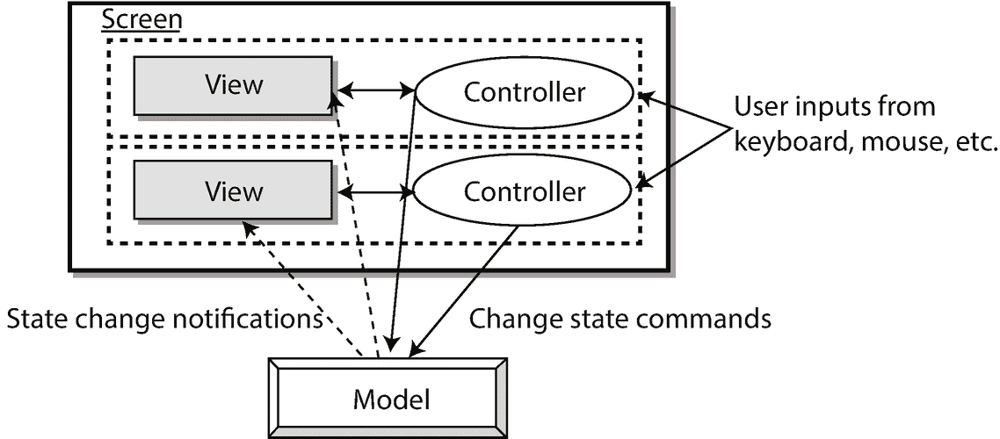
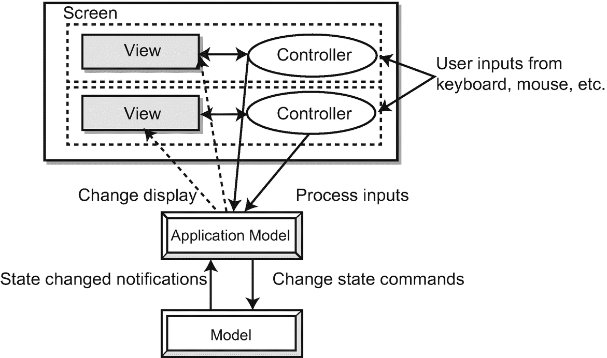
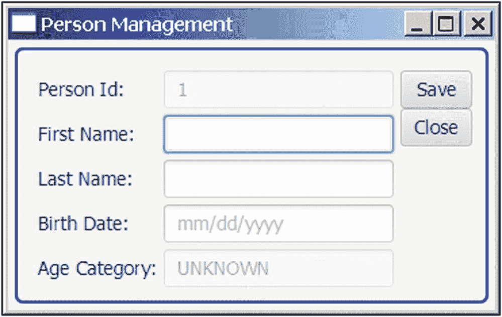

# 11.模型-视图-控制器模式

在本章中，您将学习:

*   什么是模型-视图-控制器模式

*   模型-视图-控制器模式的其他变体是什么，比如模型-视图-展示者模式

*   如何使用模型-视图-演示者模式开发 JavaFX 应用程序

本章的例子在`com.jdojo.mvc`包中。为了让它们工作，您必须在`module-info.java`文件中添加相应的行:

```java
...
opens com.jdojo.mvc to javafx.graphics, javafx.base;
opens com.jdojo.mvc.model to javafx.graphics, javafx.base;
opens com.jdojo.mvc.view to javafx.graphics, javafx.base;
...

```

## 什么是模型-视图-控制器模式？

JavaFX 允许您使用 GUI 组件创建应用程序。GUI 应用程序执行三项任务:接受用户输入、处理输入和显示输出。GUI 应用程序包含两种类型的代码:

*   处理特定于领域的数据和业务规则的领域代码

*   处理操作用户界面小部件的表示代码

通常要求特定领域中的相同数据以不同的形式呈现。例如，您可能有一个使用 HTML 的 web 界面和一个使用 JavaFX 的桌面界面来呈现相同的数据。为了便于维护应用程序代码，通常需要将应用程序分成两个逻辑模块，其中一个模块包含表示代码，另一个包含领域代码(特定于领域的业务逻辑和数据)。这种划分是以这样一种方式进行的，即表示模块可以看到域模块，但反之则不能。这种类型的划分支持具有相同域代码的多个表示。

模型-视图-控制器(model-view-controller，MVC)模式是最古老也是最流行的模式，用于为 GUI 应用程序建模，以促进这种划分。MVC 模式由三部分组成:*模型*、*视图*和*控制器*。图 [11-1](#Fig1) 显示了 MVC 组件以及它们之间的交互的图形视图。



图 11-1

经典 MVC 模式中参与者之间的交互

在 MVC 中，*模型*由模拟现实世界问题的领域对象组成。*视图*和*控制器*由处理表示的表示对象组成，比如输入、输出和用户与 GUI 元素的交互。控制器接受用户的输入并决定如何处理。也就是说，用户直接与控制器交互。视图在屏幕上显示输出。每个视图都与一个唯一的控制器相关联，反之亦然。屏幕上的每个小部件都是一个视图，都有相应的控制器。因此，在 GUI 屏幕中通常有多个视图-控制器对。该模型不知道任何特定的视图和控制器。但是，视图和控制器是特定于模型的。控制器命令模型修改其状态。视图和模型总是保持同步。模型通知视图其状态的变化，因此视图可以显示更新的数据。通过一个*观察者*模式来促进模型到视图的交互。请记住，模型完全不知道任何特定的视图。该模型为视图提供了一种订阅其状态更改通知的方式。任何感兴趣的视图都可以订阅模型来接收状态更改通知。每当模型的状态改变时，模型通知所有已经订阅的视图。

到目前为止，关于 MVC 模式的描述是 MVC 的原始概念，它被用于在 1980 年创建的 Smalltalk-80 语言中开发用户界面。Smalltalk 有许多变体。MVC 中的概念，即 GUI 应用程序中的表示和域逻辑应该分离，仍然适用。然而，在 MVC 中，在三个组件之间划分职责存在问题。例如，哪个组件具有更新视图属性的逻辑，比如改变视图颜色或禁用它，这取决于模型的状态？视图可以有自己的状态。显示项目列表的列表包含当前选定项目的索引。选定的索引是视图的状态，而不是模型。一个模型可能同时与几个视图相关联，并且存储所有视图的状态不是模型的责任。

MVC 中哪个组件负责存储视图逻辑和状态的问题导致了 MVC 的另一个变种，称为应用程序模型 MVC (AM-MVC)。在 AM-MVC 中，在模型和视图/控制器之间引入了一个名为*应用模型*的新组件。它的目的是包含表示逻辑和状态，从而解决在原始 MVC 中哪个组件保持表示逻辑和状态的问题。MVC 中的模型与视图是解耦的，在 AM-MVC 中也是如此。两者都使用相同的观察者技术来保持视图和模型的同步。在 AM-MVC 中，应用程序模型应该保存视图相关的逻辑，但是不允许直接访问视图。当应用程序模型必须更新视图属性时，这会导致庞大而丑陋的代码。图 [11-2](#Fig2) 显示了 AM-MVC 组件以及它们之间的交互的图形视图。



图 11-2

AM-MVC 模式中参与者之间的交互

后来，像微软 Windows 和 Mac OS 这样的现代图形操作系统提供了本地小部件，用户可以直接与之交互。这些小部件将视图和控制器的功能合二为一。这导致了 MVC 的另一种变体，称为模型-视图-展示者(MVP)模式。现代小部件还支持数据绑定，这有助于用更少的代码行保持视图和模型同步。图 [11-3](#Fig3) 显示了 MVP 组件以及它们之间的交互的图示。


图 11-3

MVP 模式中参与者之间的交互

在 MVC 中，屏幕上的每个小部件都是一个视图，它有自己独特的控制器。在 MVP 中，视图由几个小部件组成。视图截取来自用户的输入，并将控制权交给演示者。请注意，视图不会对用户输入做出反应。它只会拦截它们。视图还负责显示来自模型的数据。

视图向演示者通知用户输入。它决定了如何对用户的输入做出反应。演示者负责演示逻辑，操作视图，并向模型发出命令。一旦演示者修改了模型，视图就会使用观察者模式进行更新，就像在 MVC 中一样。

模型负责存储特定领域的数据和逻辑。像 MVC 一样，它独立于任何视图和演示者。演示者命令模型改变，当视图从模型接收到*状态改变的*通知时，视图更新自己。

MVP 也有一些变种。他们在视图和演示者的责任上有所不同。在一个变体中，视图负责所有视图相关的逻辑，而不需要演示者的帮助。在另一个变体中，视图负责所有可以以声明方式处理的简单逻辑，除了当逻辑复杂时，由呈现者处理。在另一个变体中，展示者处理所有与视图相关的逻辑并操纵视图。这种变体被称为*被动视图 MVP* ，其中视图不知道模型。图 [11-4](#Fig4) 显示了 MVP 被动视图中的组件以及它们之间的交互。


图 11-4

被动视图 MVP 模式中参与者之间的交互

MVC 的概念，即表示逻辑应该从领域逻辑中分离出来，已经存在了 30 多年了，并且将以这样或那样的形式存在。MVC 的所有变体都试图实现与经典 MVC 相同的功能，尽管方式不同。这些变体在组件的职责上不同于传统的 MVC。当有人在 GUI 应用程序设计中谈论 MVC 时，请确保您理解使用了 MVC 的哪种变体，以及哪些组件执行哪些任务。

## 模型-视图-演示者示例

本节给出了一个使用 MVP 模式的详细例子。

### 要求

对于这里的例子，您将开发一个 GUI 应用程序，让用户输入一个人的详细信息，验证数据，并保存它。该表格应包含

*   人员 ID 字段:自动生成的唯一不可编辑字段

*   名字字段:一个可编辑的文本字段

*   姓氏字段:可编辑的文本字段

*   出生日期:可编辑的文本字段

*   年龄类别:基于出生日期的自动计算的不可编辑字段

*   保存按钮:保存数据的按钮

*   关闭按钮:关闭窗口的按钮

应根据以下规则验证个人数据:

*   名字和姓氏必须至少有一个字符长。

*   如果输入了出生日期，它不能是将来的日期。

### 设计

三个类别将代表 MVP 的三个组成部分:

*   `Person`阶级

*   `PersonView`和`PersonPresenter`类

`Person`类代表模型，`PersonView`类代表视图，`PersonPresenter`类代表演示者。按照 MVP 模式的要求，`Person`类对于`PersonView`和`PersonPresenter`类是不可知的。`PersonView`和`PersonPresenter`类将相互交互，它们将直接使用`Person`类。

让我们通过将与模型和视图相关的类放在不同的 Java 包中来对它们进行逻辑划分。`com.jdojo.mvc.model`包将包含与模型相关的类，`com.jdojo.mvc.view`包将包含与视图相关的类。图 [11-5](#Fig5) 显示完成的窗口。



图 11-5

人员管理窗口的初始屏幕截图

### 实施

以下段落描述了 MVP 示例应用程序的三个层的实现。

#### 模型

清单 [11-1](#PC2) 包含了`Person`类的完整代码。`Person`类包含领域数据和业务规则的代码。在现实生活中，您可能希望将这两者分成多个类。但是，对于像这样的小应用程序，让我们将它们放在一个类中。

```java
// Person.java
// ...find in the book's download area.

Listing 11-1 The Person Class Used As the Model

```

`Person`类声明了一个`AgeCategory`枚举来表示不同的年龄:

```java
public enum AgeCategory {BABY, CHILD, TEEN, ADULT, SENIOR, UNKNOWN};

```

个人 ID、名字、姓氏和出生日期由 JavaFX 属性表示。`personId`属性被声明为只读，并且是自动生成的。为这些属性提供了相关的 setter 和 getter 方法。

包含了`isValidBirthDate()`和`isValidPerson()`方法来执行特定于域的验证。`getAgeCategory()`方法属于`Person`类，因为它根据出生日期计算一个人的年龄类别。我编了一些日期范围，把一个人的年龄分成不同的类别。您可能想将这个方法添加到视图中。但是，您需要为每个视图复制这个方法中的逻辑。该方法使用模型数据并计算一个值。它对视图一无所知，所以它属于模型，而不属于视图。

`save()`方法保存个人数据。保存方法很简单；如果个人数据有效，它只是在标准输出上显示一条消息。在实际应用中，它会将数据保存到数据库或文件中。

#### 景色

清单 [11-2](#PC4) 中显示的`PersonView`类表示这个应用程序中的视图。它主要负责显示模型中的数据。

```java
// PersonView.java
// ...find in the book's download area.

Listing 11-2 The PersonView Class Used As the View

```

`PersonView`类继承自`GridPane`类。它包含每个 UI 组件的一个实例变量。它的构造函数将模型(`Person`类的一个实例)和日期格式作为参数。日期格式是用于显示出生日期的格式。请注意，出生日期的格式是特定于视图的，因此它应该是视图的一部分。模型不知道视图显示出生日期的格式。

`initFieldData()`方法用数据初始化视图。我使用 JavaFX 绑定将 UI 节点中的数据绑定到模型数据，除了出生日期和年龄类别字段。此方法将出生日期和年龄类别字段与模型同步。`layoutForm()`方法在网格窗格中布置 UI 节点。`bindFieldsToModel()`方法将人员 ID、名字和姓氏`TextField`绑定到模型中相应的数据字段，因此它们保持同步。`syncBirthDate()`方法从模型中读取出生日期，对其进行格式化，并显示在视图中。`syncAgeCategory()`方法同步年龄类别字段，该字段由模型根据出生日期计算得出。

请注意，视图,`PersonView`类不知道演示者,`PersonPresenter`类。那么视图和演示者将如何交流呢？演示者的角色主要是从视图中获取用户的输入，并根据这些输入采取行动。演示者将拥有对视图的引用。它将向视图添加事件侦听器，因此当视图中的数据发生变化时，它会得到通知。在事件处理程序中，演示者控制并处理输入。如果应用程序需要引用视图中的演示者，您可以将其作为视图类的构造函数的参数。或者，您可以在视图类中提供一个 setter 方法来设置演示者。

#### 演示者

清单 [11-3](#PC5) 中显示的`PersonPresenter`类表示这个应用程序中的演示者。它主要负责截取视图中的新输入并进行处理。它直接与模型和视图通信。

```java
// PersonPresenter.java
// ...find in the book's download area.

Listing 11-3 The PersonPresenter Class Used As the Presenter

```

`PersonPresenter`类的构造函数将模型和视图作为参数。`attachEvents()`方法将事件处理程序附加到视图的 UI 组件上。在这个例子中，您对截取视图中的所有输入不感兴趣。但是您对出生日期的更改以及点击保存和关闭按钮感兴趣。您不想检测出生日期字段中的所有编辑更改。如果您对出生日期字段中的所有更改感兴趣，您需要为它的`text`属性添加一个更改监听器。您希望仅在用户完成输入出生日期时检测更改。为此

*   您将焦点监听器附加到场景，并检测出生日期是否已失去焦点。

*   您将一个动作侦听器附加到出生日期字段，以便在字段获得焦点时拦截 Enter 键的按下。

每当出生日期字段失去焦点或焦点仍在字段中时按下 Enter 键，这将验证并刷新出生日期和年龄类别。

`handleBirthDateChange()`方法处理出生日期字段的变化。它在更新模型之前验证出生日期格式。如果出生日期无效，它会向用户显示一条错误消息。最后，它告诉视图更新出生日期和年龄类别。

当用户点击 Save 按钮时，调用`saveData()`方法，它命令模型保存数据。`showError()`方法不属于演示者。这里，您添加了它，而不是创建一个新的视图类。它用于显示错误消息。

### 把它们放在一起

让我们将模型、视图和演示者放在一起，在应用程序中使用它们。清单 [11-4](#PC6) 中的程序创建模型、视图和展示者，将它们粘合在一起，并在如图 [11-5](#Fig5) 所示的窗口中显示视图。请注意，在创建演示者之前，必须将视图附加到场景。这是必需的，因为演示者将焦点改变监听器附加到场景。在将视图添加到场景之前创建演示者将导致一个`NullPointerException`。

```java
// PersonApp.java
// ...find in the book's download area.

Listing 11-4 The PersonApp Class Uses the Model, View, and Presenter to Create a GUI Application

```

## 摘要

通常要求相同的领域数据以不同的形式呈现。例如，您可能有一个使用 HTML 的 web 界面和一个使用 JavaFX 的桌面界面来呈现相同的数据。为了便于维护应用程序代码，通常需要将应用程序分成两个逻辑模块，其中一个模块包含表示代码，另一个包含领域代码(特定于领域的业务逻辑和数据)。这种划分是以这样一种方式进行的，即表示模块可以看到域模块，但反之则不能。这种类型的划分支持具有相同域代码的多个表示。MVC 模式是最古老也是最流行的模式，它为 GUI 应用程序建模以促进这种划分。MVC 模式由三个组件组成:模型、视图和控制器。

在 MVC 中，模型由模拟现实世界问题的领域对象组成。视图和控制器由处理表示的表示对象组成，例如输入、输出和用户与 GUI 元素的交互。控制器接受来自用户的输入并决定如何处理它们。也就是说，用户直接与控制器交互。视图在屏幕上显示输出。每个视图都与一个唯一的控制器相关联，反之亦然。屏幕上的每个小部件都是一个视图，都有相应的控制器。在 MVC 中，在三个组件之间划分职责产生了问题。例如，哪个组件具有更新视图属性的逻辑，比如改变视图颜色或禁用它，这取决于模型的状态？

MVC 中哪个组件负责存储视图逻辑和状态的问题导致了 MVC 的另一种变体，称为应用程序模型 MVC。在 AM-MVC 中，在模型和视图/控制器之间引入了一个新的组件，称为应用程序模型。它的目的是包含表示逻辑和状态，从而解决哪个组件在原始 MVC 中保持表示逻辑和状态的问题。

后来，像微软 Windows 和 Mac OS 这样的现代图形操作系统提供了本地小部件，用户可以直接与之交互。这些小部件将视图和控制器的功能合二为一。这导致了 MVC 的另一种变体，称为模型-视图-呈现者模式。

在 MVC 中，屏幕上的每个小部件都是一个视图，它有自己独特的控制器。在 MVP 中，视图由几个小部件组成。视图截取来自用户的输入，并将控制权交给演示者。请注意，视图不会对用户的输入做出反应；它只会拦截它们。视图通知演示者用户的输入，并决定如何对其做出反应。演示者负责演示逻辑，操作视图，并向模型发出命令。一旦演示者修改了模型，视图就会使用观察者模式进行更新，就像在 MVC 中一样。

MVP 也有一些变种。他们在视图和演示者的责任上有所不同。在一个变体中，视图负责所有视图相关的逻辑，而不需要演示者的帮助。在另一个变体中，视图负责所有可以以声明方式处理的简单逻辑，除了当逻辑复杂时，由呈现者处理。在另一个变体中，展示者处理所有与视图相关的逻辑并操纵视图。这种变体被称为被动视图 MVP，其中视图不知道模型。

下一章将向您介绍用于在 JavaFX 应用程序中构建视图的控件。