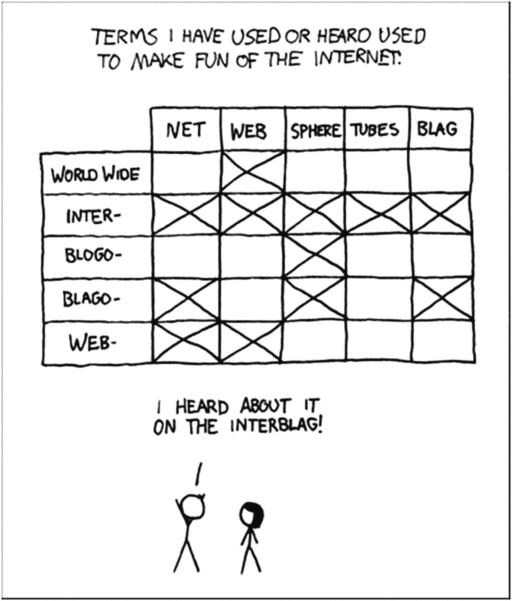

# 17.互联网

*(由 xkcd 提供:Interblag)*



现在，几乎所有的软件项目都是基于互联网的，要么是网络应用程序(生成 HTML 并通过 Firefox 等浏览器显示的程序)，要么是网络服务(通过浏览器中的 JavaScript 或移动应用程序连接的程序，如 Android 和 iOS 设备上的程序)。

本章致力于学习与 web 应用程序和 web 服务相关的概念和一些代码。

## 网络 101

网络是一只复杂的野兽。你需要知道的是:

*   *服务器*:提供网页和其他内容的计算机

*   *客户端*:个人使用的接收网页的电脑

*   *请求*:客户端发送给服务器的数据

*   *响应*:请求后发送回客户端的数据

*   HTML:用来定义网页的语言

*   *CSS* :“级联样式表”；定义网页的样式

*   JavaScript:一种在网页中使用并在客户端执行的编程语言，尽管它也可以在服务器端使用

## 我的第一个网络应用

你应该为你的第一个 web 应用做一些非常基本的东西。这样，您将更好地理解许多 web 框架的“幕后”发生了什么。一个 *web 框架*是一组用于构建 web 应用程序的相关工具和库。

创建一个名为`App.java`的文件，并将以下代码复制到其中:

```java
 1   import java.io.IOException;
 2   import java.io.OutputStream;
 3   import java.net.InetSocketAddress;
 4   import com.sun.net.httpserver.*;
 5
 6   public class App {
 7
 8       static class MyHandler implements HttpHandler {
 9           public void handle(HttpExchange t) throws IOException {
10               String response = "<html> Hello Inter-webs! </html>";
11               t.sendResponseHeaders(200, response.length());
12               OutputStream os = t.getResponseBody();
13               os.write(response.getBytes());
14               os.close();
15           }
16       }
17
18       public static void main(String[] args) throws Exception {
19           HttpServer server = HttpServer.create(new InetSocketAddress(8000), 0);
20           server.createContext("/", new MyHandler());
21           server.setExecutor(null); // creates a default executor
22           server.start();
23           System.out.println("Server running at http://localhost:8000");
24       }
25
26   }

```

所有这些只是创建一个`HttpServer`来监听端口 8000 上的连接，并用一条消息来响应。

运行这段代码(`javac App.java && java App`)后，打开你的网络浏览器，指向`http://localhost:8000/`(它应该显示“Hello Inter-webs！”).按 Ctrl+C 停止应用程序。

 `localhost`是指你所在的电脑，`:8000`是指端口 8000。

恭喜你！您刚刚制作了一个 web 应用程序！现在还没有放到网上，而且极其简单，但是这是一个很好的开始。

Port?

*URL(统一资源定位符)*:用于在任何网络或机器上定位资源的唯一名称。有时以“http”开头；有时它包括一个端口。

HTTP 超文本传输协议(HTTP Hypertext Transfer Protocol):用于网络通信的典型协议。

*HTTPS(安全 HTTP)* :类似于 HTTP，但使用非对称密钥对所有数据进行编码，因此除了预定的接收者之外，任何设备都无法读取数据。

*端口*:计算机间通信时必须指定的一个数字(HTTP 默认端口为 80)。

## 圣杯

Grails 是一个 Groovy 的 web 框架，它遵循了 Ruby on Rails 的例子(因此有了 *Grails* )。这是一个自以为是的 web 框架，带有命令行工具，可以非常快速地完成工作。Grails 使用约定优于配置来减少配置开销。这可以大大减少开始新项目或添加额外功能所需的工作量。

Grails 牢牢地活在 Java 生态系统中，并建立在 Spring Boot 和 Hibernate 等技术之上。Grails 还包括一个对象关系映射(ORM)框架，它将对象映射到数据库表，称为 *GORM，*，并有一个大的插件集合。

### 快速概述

这个概述基于 Grails 4.0.0，但是对于所有版本的 Grails，3.0 和更高版本，基础知识应该是相同的。安装 Grails 后， <sup>[1](#Fn1)</sup> 您可以通过在命令行上运行以下命令来创建一个应用程序:

```java
1   $ mkdir g4
2   $ cd g4
3   $ grails create-app --inplace

```

然后，您可以运行诸如`create-domain-class`和`generate-all`这样的命令来创建您的应用程序。运行`grails help`来查看可用命令的完整列表。我们将在本章后面更全面地介绍这些命令。

Grails 应用程序有一个非常特殊的项目结构。下面是该结构的大多数的简单分解:

*   `grails-app`:特定于 Grails 的文件夹。
    *   `conf`:配置文件，如 application.yml、logback.groovy。

    *   `controllers`:具有索引/创建/编辑/删除或任何其他方法的控制器。

    *   `domain`:领域模型；表示持久数据的类。

    *   消息包，用于支持多种语言(英语、西班牙语等)。).

    *   `init`:包含您的`Application.groovy`和`Bootstrap.groovy`文件，它们在应用程序启动时初始化应用程序。

    *   `services`:后端服务，您的后端或“业务”逻辑就在其中。

    *   你可以很容易地定义你自己的标签，在你的 GSP 文件中使用。

    *   `views`:MVC 的观点；通常，这些是 GSP 文件(基于 HTML 并嵌入 Groovy 代码)。

*   `assets`
    *   `stylesheets` : CSS。

    *   `images`:您的网络应用程序使用的图像。

    *   `javascripts`:你的 JavaScript 文件。

*   不适合其他地方的通用代码。
    *   `main/groovy` : Groovy 代码。

    *   常规测试。

*   `gradle:`包含 Gradle 包装罐。

要创建新的域(模型)类，使用`create-domain-class`命令。运行以下命令(在项目的根目录下):

```java
1   $ grails create-domain-class example.Comment
2   $ grails create-domain-class example.User
3   $ grails create-domain-class example.Post

```

为您的域类包含一个包是一个好主意(比如`example.Post)`)。该命令创建域类和相关的 Spock 规范。将`User`和`Comment`更改如下:

```java
 1   class User { String name }
 2   class Comment { String text }

```

Grails 中的域类也定义了它到数据库的映射。例如，编辑表示博客文章的域类，如下所示(假设已经创建了`User`和`Comment`):

```java
 1   class Post {
 2       String text
 3       int rating
 4       Date created = new Date()
 5       User createdBy
 6
 7       static hasMany = [comments: Comment]
 8
 9       static constraints = {
10           text(size:10..500)
11       }
12   }

```

静态的`hasMany`字段是表示数据库中一对多关系的映射——这意味着一个`Post`可以有多个`Comments`。Grails 在后台使用 Hibernate 为所有的域类和关系创建表。默认情况下，每个表都有一个自动分配的主键字段`id`。

要让 Grails 在定义域类之后自动创建控制器和视图(以及测试),请运行以下命令:

```java
1   $ grails generate-all example.User
2   $ grails generate-all example.Comment
3   $ grails generate-all example.Post

```

如果现有文件存在，Grails 会询问您是否要覆盖它们。因此，使用该命令时要小心。

当您想要测试您的应用程序时，只需运行以下命令:

```java
1   $ grails run-app

```

它最终应该输出以下内容:

Grails 应用程序运行于环境:开发中的`http://localhost:8080`。

接下来，打开浏览器并转到该 URL。基于默认生成的视图，您应该会看到以下内容，其中包含控制器列表、应用程序状态、工件和已安装插件列表:


如果您跟随链接到各自的控制器，您可以创建用户，然后创建帖子，然后在这些帖子上创建评论。

### 外挂程式

Grails 4.0 系统现在包括 190 多个插件。要列出所有插件，只需执行以下命令:

```java
1   $ grails list-plugins

```

当你选择了一个你想要使用的插件，执行下面的命令来查看更多关于这个插件的信息(包括插件名称):

```java
1   $ grails plugin-info [NAME]

```

这将告诉您如何将插件添加到项目中。编辑您的`build.gradle`文件，并在那里添加依赖项。

这只是对 Grails 的一个简要概述。已经有很多关于 Grails 以及如何使用它的书籍。关于使用 Grails 的更多信息，请访问 [`grails.org`](http://grails.org) 。<sup>2[2](#Fn2)T7】</sup>

## 云

以下云提供商支持 Grails:

*   cloudfoundry<sup>[【3】](#Fn3)</sup>

*   亚马逊<sup>[4](#Fn4)T3】</sup>

*   希罗库<sup>[【5】](#Fn5)</sup>

然而，这并不在本书的讨论范围之内，但是我们将很快讨论 Heroku。

Heroku 是首批云平台之一，自 2007 年 6 月开始开发。开始时，它只支持 Ruby，但后来它增加了对 Java、Scala、Groovy、Node.js、Clojure 和 Python 的支持。Heroku 支持多层账户，包括一个免费账户。

Heroku 依靠`git`将变化推送到你的服务器。例如，要使用 CLI 在 Heroku 中创建应用程序，请执行以下操作:

```java
1   $ heroku create
2   $ git push heroku master

```

您的应用程序将启动并运行，Heroku 将识别您可以找到它的 URL。

去 Heroku 上启动一个 Grails 应用程序吧！

## 其余的

*REST* 代表具象状态转移。 <sup>[6](#Fn6)</sup> 它是在一篇博士论文中设计的，并作为新的 web 服务标准而广受欢迎。许多开发人员称赞它是比 SOAP 好得多的标准(我不打算描述 SOAP)。

在 REST 的最基本层面，每个 *CRUD* (创建、读取、更新、删除)操作都被映射到一个 HTTP 方法。例如:

*   *创建* : `POST`

*   *读作* : `GET`

*   *更新* : `PUT`

*   *删除* : `DELETE`

假设传输机制是 HTTP，但是消息内容可以是任何类型，通常是 XML 或 JSON。

JSR 社区已经设计了用于构建 RESTful Java web 服务的 JAX-RS API，而 Groovy 和 Scala 都有一些对 XML 和 JSON 的内置支持以及各种构建 web 服务的方式。Spring Boot <sup>[7](#Fn7)</sup> 和春天 MVC 对休息也有很大的支持。

### 使用 Maven 原型

您可以使用 Maven 创建一个简单的 Java REST (JAX-RS)应用程序，如下所示:

```java
1   mvn archetype:generate

```

等东西下载完再选“`tomcat-maven-archetype`”(键入`tomcat-maven`按回车键，再键入“1”)；进入；回车)。你需要输入一个`groupId`和`artifactId`。

创建应用程序后，您可以通过键入以下命令来启动它:

```java
1   mvn tomcat:run

```

### 使用 Grails JSON 视图

Grails 有一个将视图呈现为 JSON 的插件。首先运行 plugin-info，看看如何将它包含在您的构建中:

```java
1   $ grails plugin-info views-json

```

将它添加到 Grails 项目的构建依赖项之后，您可以使用 Groovy DSL 来定义如何在 JSON 中呈现您的响应。更多信息参见文档 <sup>[8](#Fn8)</sup> 。

总的来说，JSON views 允许您在带有`.gson`扩展名的`grails-app/views`目录下定义视图，这些视图可以使用 DSL 来生成 JSON，而不是使用生成 HTML 的`.gsp`文件。例如，这在编写生成 JSON 的 web 服务时非常有用。

使用以下内容创建一个名为`grails-app/views/hello.gson`的文件:

```java
json.message {
    hello "world"
}

```

这将产生作为 JSON 的`{"message":{ "hello":"world"}}`。

## 摘要

恭喜你！你现在明白互联网了。是的，它*是*一系列的管子。特德·史蒂文斯(见下文)是对的！

> 他们想通过互联网传递大量信息。再说一次，互联网不是你随便扔东西的地方。它不是一辆大卡车。这是一系列的管子。如果你不明白，这些管道可以被填满，如果它们被填满，当你把你的信息放进去，它会排队，它会被任何人延迟，把大量的材料放进那个管道，大量的材料。
> 
> ——老西奥多·泰德·富尔顿·史蒂文斯，美国阿拉斯加州参议员，1968 年 12 月 24 日至 2009 年 1 月 3 日

<aside aria-label="Footnotes" class="FootnoteSection" epub:type="footnotes">Footnotes [1](#Fn1_source)

[T2`https://grails.org/download.html`](https://grails.org/download.html)

  [2](#Fn2_source)

[T2`https://grails.org/`](https://grails.org/)

  [3](#Fn3_source)

[T2`www.cloudfoundry.org/`](http://www.cloudfoundry.org/)

  [4](#Fn4_source)

[T2`https://aws.amazon.com/ec2/`](https://aws.amazon.com/ec2/)

  [5](#Fn5_source)

[T2`www.heroku.com/`](http://www.heroku.com/)

  [6](#Fn6_source)

[T2`www.ics.uci.edu/~fielding/pubs/dissertation/top.htm`](http://www.ics.uci.edu/%257Efielding/pubs/dissertation/top.htm)

  [7](#Fn7_source)

[T2`https://spring.io/`](https://spring.io/)

  [8](#Fn8_source)

[T2`http://views.grails.org/latest/`](http://views.grails.org/latest/)

 </aside>