# 6.在 JavaFX 中创建图表

任何足够先进的技术都和魔法没什么区别。—亚瑟·C·克拉克

在许多商业应用中，报告是一个重要的方面。JavaFX 平台包含一个用于创建图表的 API。因为一个`Chart`基本上就是一个`Node`，所以将图表与 JavaFX 应用程序的其他部分集成起来非常简单。因此，报告是典型 JavaFX 业务应用程序不可或缺的一部分。

设计一个 API 通常是许多需求之间的折衷。两个最常见的需求是“简单易用”和“易于扩展”JavaFX Chart API 满足了这两个要求。图表 API 包含许多方法，允许开发人员更改图表的外观和感觉以及数据，使其成为一个灵活的 API，可以很容易地进行扩展。不过，这些设置的默认值非常合理，只需几行代码就可以轻松地将图表与自定义应用程序集成在一起。

JavaFX 9 中的 JavaFX Chart API 有八个具体的实现，可供开发人员使用。除此之外，开发人员可以通过扩展一个抽象类来添加他们自己的实现。

## JavaFX 图表 API 的结构

存在不同类型的图表，并且有多种方法对它们进行分类。JavaFX 图表 API 区分双轴图表和不带轴的图表。JavaFX 9 版本包含一个无轴图表的实现，即`PieChart`。双轴图有很多，都是抽象`XYChart`类的扩展，如图 [6-1](#Fig1) 。

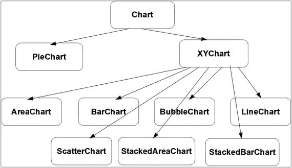

图 6-1。

Overview of the charts in the JavaFX Chart API

抽象的`Chart`类定义了所有图表的设置。基本上，图表由三部分组成:标题、图例和内容。图表的内容对于每个实现都是特定的，但是图例和标题概念在各个实现中是相似的。因此，`Chart`类有许多带有相应 getter 和 setter 方法的属性，这些方法允许操作这些概念。`Chart`类的 Javadoc 提到了以下属性。

```java
BooleanProperty animated
ObjectProperty<Node> legend
BooleanProperty legendVisible
ObjectProperty<Side> legendSide
StringProperty title
ObjectProperty<Side> titleSide

```

在接下来的示例中，我们使用了其中的一些属性，但是我们也展示了即使没有为这些属性设置值，Chart API 也允许您创建漂亮的图表。

因为`Chart`扩展了`Region`、`Parent`和`Node`，所以这些类上可用的所有属性和方法也可以在`Chart`上使用。好处之一是，用于向 JavaFX `Node`添加样式信息的 CSS 样式技术也适用于 JavaFX 图表。

JavaFX CSS 参考指南，可在 [`http://download.java.net/jdk8/jfxdocs/`](http://download.java.net/jdk8/jfxdocs/) `javafx/scene/doc-files/cssref.html`获得，包含可由设计者和开发者改变的 CSS 属性的概述。默认情况下，JavaFX 9 运行时附带的 modena 样式表用于显示 JavaFX 图表。有关在 JavaFX 图表中使用 CSS 样式的更多信息，请参考位于 [`http://docs.oracle.com/javase/8/javafx/user-interface-tutorial/css-styles.htm`](http://docs.oracle.com/javase/8/javafx/user-interface-tutorial/css-styles.htm) 的 Oracle 图表教程。

## 使用 JavaFX 饼图

`PieChart`以典型的饼图结构呈现信息，其中切片的大小与数据的值成比例。在深入细节之前，我们展示一个小应用程序来呈现一个`PieChart`。

### 简单的例子

我们的例子显示了许多编程语言的“市场份额”，基于 2017 年 4 月的 TIOBE 指数。TIOBE 编程社区指数可在 [`https://www.tiobe.com/tiobe-index`](https://www.tiobe.com/tiobe-index) 获得，它提供了基于搜索引擎流量的编程语言受欢迎程度的指示。2017 年 4 月排名截图如图 [6-2](#Fig2) 。

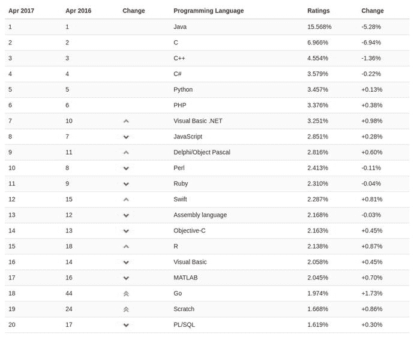

图 6-2。

Screenshot of the TIOBE index in April 2017, taken from [`www.tiobe.com/tiobe-index`](http://www.tiobe.com/tiobe-index) Note

在 [`https://www.tiobe.com/tiobe-index/programming-languages-definition/`](https://www.tiobe.com/tiobe-index/programming-languages-definition/) 中描述了 TIOBE 使用的算法。这些数字的科学价值超出了我们示例的范围。

清单 [6-1](#Par17) 包含了这个例子的代码。

```java
package com.projavafx.charts ;

import javafx.application.Application;
import javafx.collections.FXCollections;
import javafx.collections.ObservableList;
import javafx.scene.Scene;
import javafx.scene.chart.PieChart;
import javafx.scene.layout.StackPane;
import javafx.stage.Stage;

public class ChartApp1 extends Application {

    @Override
    public void start(Stage primaryStage) {
        PieChart pieChart = new PieChart();
        pieChart.setData(getChartData());

        primaryStage.setTitle("PieChart");
        StackPane root = new StackPane();
        root.getChildren().add(pieChart);
        primaryStage.setScene(new Scene(root, 400, 250));
        primaryStage.show();
    }

    private ObservableList<PieChart.Data> getChartData() {
        ObservableList<PieChart.Data> answer = FXCollections.observableArrayList();
                answer.addAll(new PieChart.Data("java", 15.57),
                new PieChart.Data("C", 6.97),
                new PieChart.Data("C++", 4.55),
                new PieChart.Data("C#", 3.58),
                new PieChart.Data("Python", 3.45),
                new PieChart.Data("PHP", 3.38),
                new PieChart.Data("Visual Basic .NET", 3.25));
        return answer;
    }
}

Listing 6-1.
Rendering

the TIOBE Index in a PieChart

```

运行该示例的结果如图 [6-3](#Fig3) 所示。

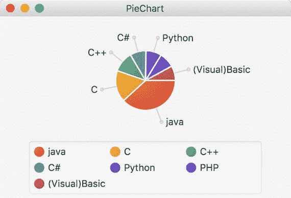

图 6-3。

Rendering the TIOBE index in a `PieChart`

只需有限的代码，我们就可以在`PieChart`中呈现数据。在我们修改这个例子之前，我们解释一下不同的部分。

设置应用程序、舞台和场景所需的代码包含在第 [1 章](1.html)中。一个`PieChart`扩展了一个`Node`，所以我们可以很容易地将它添加到场景图中。start 方法中的前两行代码创建了`PieChart`，并向其中添加了所需的数据:

```java
PieChart pieChart = new PieChart();
pieChart.setData(getChartData());

```

类型为`ObservableList<PieChart.Data>`的数据是从`getChartData()`方法中获得的，对于我们的例子，它包含静态数据。正如`getChartData()`方法的返回类型所指定的，返回的数据是`PieChart.Data`的一个`ObservableList`。

`PieChart.Data`的一个实例是`PieChart`的一个嵌套类，它包含了绘制一片饼图所需的信息。`PieChart.Data`有一个接受切片名称和值的构造函数:

```java
PieChart.Data(String name, double value)

```

我们使用这个构造函数来创建包含编程语言名称及其在 TIOBE 索引中的分数的数据元素。

```java
new PieChart.Data("java", 15.57)

```

然后，我们将这些元素添加到我们需要返回的 ObservableList <piechart.data>中。</piechart.data>

### 一些修改

虽然这个简单例子的结果看起来已经很好了，但是我们可以调整代码和渲染。首先，该示例使用两行代码来创建`PieChart`并用数据填充它:

```java
PieChart pieChart = new PieChart();
pieChart.setData(getChartData());

```

因为`PieChart`也有一个参数构造函数，前面的代码片段可以替换如下。

```java
PieChart pieChart = new PieChart(getChartData());

```

除了在抽象类`Chart`上定义的属性之外，`PieChart`还有以下属性。

```java
BooleanProperty clockwise
ObjectProperty<ObservableList<PieChart.Data>> data
DoubleProperty labelLineLength
BooleanProperty labelsVisible
DoubleProperty startAngle

```

我们在上一节中讨论了数据属性。其他一些属性将在下一段代码中演示。清单 [6-2](#Par35) 包含了`start()`方法的修改版本。

```java
public void start(Stage primaryStage) {
  PieChart pieChart = new PieChart();
  pieChart.setData(getChartData());
  pieChart.setTitle("Tiobe index");
  pieChart.setLegendSide(Side.LEFT);
  pieChart.setClockwise(false);
  pieChart.setLabelsVisible(false);

  primaryStage.setTitle("PieChart");

  StackPane root = new StackPane();
  root.getChildren().add(pieChart);
  primaryStage.setScene(new Scene(root, 400, 250));
  primaryStage.show();
}

Listing 6-2.
Modified Version

of the PieChart Example

```

因为我们在新代码中使用了`Side.LEFT`字段，所以我们也必须在应用程序中导入`Side`类。这是通过在代码的导入块中添加以下行来实现的。

```java
import javafx.geometry.Side

```

运行这个修改后的版本会产生如图 [6-4](#Fig4) 所示的修改后的输出。

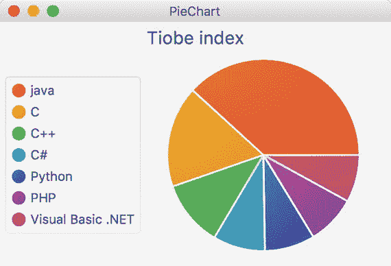

图 6-4。

The output of the modified PieChart example

更改几行代码会导致输出看起来非常不同。我们更详细地回顾一下我们所做的更改。首先，我们向图表添加了一个标题。这是通过调用完成的

```java
pieChart.setTitle("Tiobe index");

```

我们也可以使用`titleProperty`:

```java
pieChart.titleProperty().set("Tiobe index");

```

这两种方法产生相同的输出。

Note

即将到来的修改也可以使用相同的模式来完成。我们只用 setter 方法来记录这种方法，但是用基于属性的方法来代替它是很容易的。

我们修改后的示例中的下一行代码更改了图例的位置:

```java
pieChart.setLegendSide(Side.LEFT);

```

当未指定`legendSide`时，图例显示在默认位置，即图表下方。`title`和`legendSide`都是属于抽象`Chart`类的属性。因此，它们可以设置在任何图表上。我们修改后的示例中的下一行修改了一个特定于`PieChart`的属性:

```java
pieChart.setClockwise(false);

```

默认情况下，`PieChart`中的切片是顺时针绘制的。通过将该属性设置为 false，切片将逆时针呈现。我们还禁止在`PieChart`中显示标签。标签仍显示在图例中，但它们不再指向单个切片。这是通过以下代码行实现的:

```java
pieChart.setLabelsVisible(false);

```

到目前为止，所有布局更改都是以编程方式完成的。使用 CSS 样式表来设计一般的应用程序，特别是图表，也是可能的，并且经常被推荐。

我们从 Java 代码中删除了布局更改，并添加了一个包含一些布局说明的样式表。清单 [6-3](#Par53) 显示了`start()`方法的修改代码，清单 [6-4](#Par54) 包含了我们添加的样式表。

```java
public void start(Stage primaryStage) {
    PieChart pieChart = new PieChart();
    pieChart.setData(getChartData());
     pieChart.titleProperty().set("Tiobe index");

    primaryStage.setTitle("PieChart");
    StackPane root = new StackPane();
    root.getChildren().add(pieChart);
    Scene scene = new Scene (root, 400, 250);
    scene.getStylesheets().add("/chartappstyle.css");
    primaryStage.setScene(scene);
    primaryStage.show();
}

Listing 6-3.Remove Programmatic Layout Instructions

```

```java
.chart {
    -fx-clockwise: false;
    -fx-pie-label-visible: true;
    -fx-label-line-length: 5;
    -fx-start-angle: 90;
    -fx-legend-side: right;
}

.chart-pie-label {
    -fx-font-size:9px;

}
.chart-content {
    -fx-padding:1;
}

.default-color0.chart-pie {
    -fx-pie-color:blue;
}

.chart-legend {
    -fx-background-color: #f0e68c;
    -fx-border-color: #696969;
    -fx-border-width:1;
}

Listing 6-4.Style Sheet

for PieChart Example

```

运行这段代码会产生如图 [6-5](#Fig5) 所示的输出。


图 6-5。

Using CSS to style the PieChart

我们现在回顾一下我们所做的更改。在我们详细讨论各个更改之前，我们将展示如何在应用程序中包含 CSS。这是通过向场景添加样式表来实现的，如下所示。

```java
scene.getStylesheets().add("/chartappstyle.css");

```

当应用程序运行时，包含样式表的文件`chartappstyle.css`必须在类路径中。

在清单 [6-2](#Par35) 中，我们使用

```java
pieChart.setClockwise(false)

```

我们从清单 [6-3](#Par53) 的代码中删除了那一行，取而代之的是在样式表的`chart`类上定义了`-fx-clockwise`属性:

```java
.chart {
    -fx-clockwise: false;
    -fx-pie-label-visible: true;
    -fx-label-line-length: 5;
    -fx-start-angle: 90;
    -fx-legend-side: right;
}

```

在同一个`.chart`类定义中，我们通过将`-` `fx-pie-label-visible`属性设置为 true 来使饼图上的标签可见，并将每个标签的线长度指定为 5。

此外，我们将整个饼图旋转 90 度，这是通过定义`-fx-start-angle`属性实现的。标签现在在样式表中定义了，我们通过省略下面一行从代码中删除了相应的定义。

```java
pieChart.setLabelsVisible(false)

```

为了确保图例出现在图表的右侧，我们指定了`-fx-legend-side`属性。

默认情况下，`PieChart`使用在 caspian 样式表中定义的默认颜色。第一个切片用`default-color0`填充，第二个切片用`default-color1`填充，依此类推。更改不同切片颜色的最简单方法是覆盖默认颜色的定义。在我们的样式表中，这是通过

```java
.default-color0.chart-pie {
    -fx-pie-color: blue;
}

```

可以对其他切片进行同样的操作。

如果在没有 CSS 的其他部分的情况下运行该示例，您会注意到图表本身相当小，并且标签的大小占用了太多的空间。因此，我们将标签的字体大小修改如下:

```java
.chart-pie-label {
    -fx-font-size:9px;
}

```

此外，我们减少了图表区域的填充:

```java
.chart-content {
    -fx-padding:1;
}

```

最后，我们改变背景和图例的笔画。这是通过如下重写`chart-legend`类来实现的。

```java
.chart-legend {
   -fx-background-color: #f0e68c;
    -fx-border-color: #696969;
    -fx-border-width:1;
}

```

同样，我们建议读者参考[`http://docs.oracle.com/javase/9/javafx/user-interface-tutorial/css-styles.htm`](http://docs.oracle.com/javase/9/javafx/user-interface-tutorial/css-styles.htm)【TODO:FINAL LINK】了解更多关于使用 CSS 和 JavaFX 图表的信息。

## 使用 xy 图表

`XYChart`类是一个抽象类，有七个直接已知的子类。这些类和`PieChart`类的区别在于`XYChart`有两个轴和一个可选的`alternativeColumn`或`alternativeRow`。这转化为下面的`XYChart`附加属性列表。

```java
BooleanProperty alternativeColumnFillVisible
BooleanProperty alternativeRowFillVisible
ObjectProperty<ObservableList<XYChart.Series<X,Y>>> data
BooleanProperty horizontalGridLinesVisible
BooleanProperty horizontalZeroLineVisible
BooleanProperty verticalGridLinesVisible
BooleanProperty verticalZeroLineVisible

```

`XYChart`中的数据按顺序排列。这些系列如何呈现是特定于`XYChart`子类的实现的。一般来说，一个系列中的单个元素包含许多对。下面的例子使用了三种编程语言在未来市场份额的假设预测。我们从 2017 年的 Java、C 和 C++的 TIOBE 指数开始，并在 2020 年之前的每一年向它们添加随机值(在–2 和+2 之间)。Java 的结果(year，number)对构成了 Java 系列，这同样适用于 C 和 C++。因此，我们有三个系列，每个系列包含 10 双鞋。

`PieChart`和`XYChart`的主要区别在于`XYChart`中有一个 x 轴和一个 y 轴。当创建一个`XYChart`时，这些轴是必需的，这可以从下面的构造函数中观察到。

```java
XYChart (Axis<X> xAxis, Axis<Y> yAxis)

```

`Axis`类是一个抽象类，用两个子类扩展了`Region`(因此也扩展了`Parent`和`Node`):`CategoryAxis`和`ValueAxis`。`CategoryAxis`用于呈现`String`格式的标签，这可以从类定义中观察到:

```java
public class CategoryAxis extends Axis<java.lang.String>

```

`ValueAxis`用于呈现代表`Number`的数据条目。它本身是一个抽象类，定义如下。

```java
public abstract class ValueAxis <T extends java.lang.Number> extends Axis<T>

```

`ValueAxis`类有一个具体的子类，即`NumberAxis`:

```java
public final class NumberAxis extends ValueAxis<java.lang.Number>

```

通过这些例子，这些`Axis`类之间的差异将变得清晰。我们现在展示一些不同的`XYChart`实现的例子，从`ScatterChart`开始。所有`XYChart`共有的一些特征也在`ScatterChart`部分进行了解释。

Note

因为`Axis`类扩展了`Region`，它们允许应用与任何其他`Regions`相同的 CSS 元素。这允许高度定制的`Axis`实例。

### 使用散点图

`ScatterChart`类的一个实例用于呈现数据，其中每个数据项被表示为二维区域中的一个符号。如前一节所述，我们将呈现一个包含三个数据系列的图表，代表 Java、C 和 C++的 TIOBE 指数的假设发展。我们首先展示一个简单实现的代码，并将其提炼为更有用的内容。

#### 一个简单的实现

清单 [6-5](#Par92) 显示了我们的应用程序使用`ScatterChart`的第一个实现。

```java
package com.projavafx ;

import javafx.application.Application;
import javafx.collections.FXCollections;
import javafx.collections.ObservableList;
import javafx.scene.Scene;
import javafx.scene.chart.NumberAxis;
import javafx.scene.chart.ScatterChart;
import javafx.scene.chart.XYChart;
import javafx.scene.chart.XYChart.Series;
import javafx.scene.layout.StackPane;
import javafx.stage.Stage;

public class ChartApp3 extends Application {

    public static void main(String[] args) {
        launch(args);
    }

    @Override
    public void start(Stage primaryStage) {
        NumberAxis xAxis = new NumberAxis();
        NumberAxis yAxis = new NumberAxis();
        ScatterChart scatterChart = new ScatterChart(xAxis, yAxis);
        scatterChart.setData(getChartData());
        primaryStage.setTitle("ScatterChart");

        StackPane root = new StackPane();
        root.getChildren().add(scatterChart);
        primaryStage.setScene(new Scene(root, 400, 250));
        primaryStage.show();
    }

    private ObservableList<XYChart.Series<Integer, Double>> getChartData() {
        double javaValue = 15.57;
        double cValue = 6.97;
        double cppValue = 4.55;
        ObservableList<XYChart.Series<Integer, Double>> answer = FXCollections.observableArrayList();
        Series<Integer, Double> java = new Series<>();
        Series<Integer, Double> c = new Series<>();
        Series<Integer, Double> cpp = new Series<>();
        for (int i = 2017; i < 2027; i++) {
            java.getData().add(new XYChart.Data(i, javaValue));
            javaValue = javaValue + 4 * Math.random() - 2;
            c.getData().add(new XYChart.Data(i, cValue));
            cValue = cValue + Math.random() - .5;
            cpp.getData().add(new XYChart.Data(i, cppValue));
            cppValue = cppValue + 4 * Math.random() - 2;
        }
        answer.addAll(java, c, cpp);
        return answer;
    }
}

Listing 6-5.First Implementation of Rendering Data in a ScatterChart

```

执行该应用程序会产生一个类似于图 [6-6](#Fig6) 所示的图形。

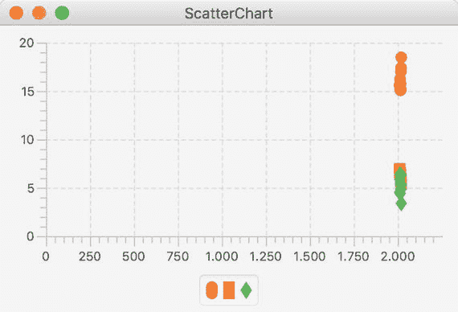

图 6-6。

The result of the naive implementation of the `ScatterChart`

虽然图表显示了所需的信息，但可读性不强。我们添加了一些增强功能，但是首先让我们更深入地看看代码的不同部分。

与`PieChart`示例类似，我们创建了一个单独的方法来获取数据。其中一个原因是，在现实世界的应用程序中，不太可能有静态数据。通过将数据检索隔离在一个单独的方法中，改变获取数据的方式变得更加容易。

单个数据点由一个实例`XYChart.Data<Integer`、`Double>`定义，用构造函数`XYChart.Data(Integer i, Double d)`创建，其中参数定义如下。

```java
i: Integer, representing a specific year (between 2017 and 2026)
d: Double, representing the hypothetical TIOBE index for the particular series in the year specified by I

```

局部变量`javaValue`、`cValue`和`cppValue`用于记录不同编程语言的分数。它们用 2017 年的实际值初始化。每一年，个人得分会以–2 到+2 之间的随机值递增或递减。数据点堆叠成一系列。在我们的例子中，我们有三个系列，每个系列包含 10 个`XYChart.Data<Integer`、`Double>`的实例。这些系列属于`XYChart.Series<Integer, Double>`类型。

通过调用将数据条目添加到相应的序列中

```java
java.getData().add (...)
c.getData().add(...)

```

和

```java
cpp.getData().add(...)

```

最后，所有序列都被添加到`ObservableList<XYChart.Series<Integer, Double>>`并返回。

应用程序的`start()`方法包含创建和呈现`ScatterChart`以及用从`getChartData`方法获得的数据填充它所需的功能。

Note

如前所述，我们可以在这里使用不同的模式与`PieChart`。我们在示例中使用了 JavaBeans 模式，但是我们也可以使用属性。

为了创建一个`ScatterChart`，我们需要创建一个`xAxis`和一个`yAxis`。在我们的第一个简单实现中，我们为此使用了两个`NumberAxis`实例:

```java
NumberAxis xAxis = new NumberAxis();
NumberAxis yAxis = new NumberAxis();

```

除了调用下面的`ScatterChart`构造函数，这个方法与`PieChart`的情况没有什么不同。

```java
ScatterChart scatterChart = new ScatterChart(xAxis, yAxis);

```

#### 改进简单的实现

查看图 [6-5](#Fig5) 时，首先观察到的一个现象是，一个系列中的所有数据图几乎都呈现在彼此的顶部。原因很清楚:`x-Axis`从 0 开始，到 2250 结束。默认情况下，`NumberAxis`会自动确定其范围。我们可以通过将`autoRanging`属性设置为 false，并为`lowerBound`和`upperBound`提供值来否决这种行为。如果我们用下面的代码片段替换原始示例中的`xAxis`的构造函数，

```java
NumberAxis xAxis = new NumberAxis();
xAxis.setAutoRanging(false);
xAxis.setLowerBound(2017);
xAxis.setUpperBound(2027);

```

结果输出将类似于图 [6-7](#Fig7) 所示。

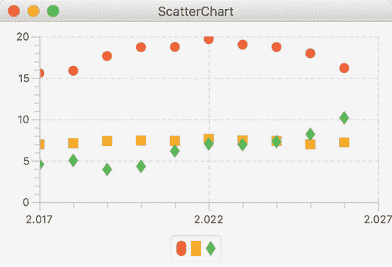

图 6-7。

Defining the behavior of the `xAxis`

接下来，我们希望向图表添加一个标题，并且希望图例节点中的符号附近有名称。向图表添加标题与向`PieChart`添加标题没有什么不同，这是通过代码实现的:

```java
scatterChart.setTitle("Speculations");

```

通过向三个`XYChart.Series`实例添加名称，我们向图例节点中的符号添加标签。`getChartData`方法的相关部分变成

```java
Series<Integer, Double> java = new Series<>();
Series<Integer, Double> c = new Series<>();
Series<Integer, Double> cpp = new Series<>();
java.setName("java");
c.setName("C");
cpp.setName("C++");

```

在应用两个更改后再次运行应用程序会产生类似于图 [6-8](#Fig8) 所示的输出。


图 6-8。

`ScatterChart` with a title and named symbols

到目前为止，我们用一个`NumberAxis`来表示`xAxis`。因为年可以被表示为`Number`实例，这是可行的。但是，因为我们不对年份进行任何数值运算，并且因为连续数据条目之间的距离总是一年，所以我们也可以使用一个`String`值来表示这些信息。

我们现在修改代码，用一个`CategoryAxis`代替`xAxis`。将`xAxis`从`NumberAxis`更改为`CategoryAxis`也意味着`getChartData()`方法应该返回`ObservableList<XYChart.Series<String, Double>>`的一个实例，这意味着单个`Series`中的不同元素应该具有类型`XYChart.Data<String, Double>`。

在清单 [6-6](#Par121) 中，原始代码被修改为使用`CategoryAxis`。

```java
package projavafx ;

import javafx.application.Application;
import javafx.collections.FXCollections;
import javafx.collections.ObservableList;
import javafx.scene.Scene;
import javafx.scene.chart.CategoryAxis;
import javafx.scene.chart.NumberAxis;
import javafx.scene.chart.ScatterChart;
import javafx.scene.chart.XYChart;
import javafx.scene.chart.XYChart.Series;
import javafx.scene.layout.StackPane;
import javafx.stage.Stage;

public class ChartApp7 extends Application {

    public static void main(String[] args) {
        launch(args);
    }

    @Override
    public void start(Stage primaryStage) {
        CategoryAxis xAxis = new CategoryAxis();
        NumberAxis yAxis = new NumberAxis();
        ScatterChart scatterChart = new ScatterChart(xAxis, yAxis);
        scatterChart.setData(getChartData());
        scatterChart.setTitle("speculations");
        primaryStage.setTitle("ScatterChart example");

        StackPane root = new StackPane();
        root.getChildren().add(scatterChart);
        primaryStage.setScene(new Scene(root, 400, 250));
        primaryStage.show();
    }

    private ObservableList<XYChart.Series<String, Double>> getChartData() {
        double javaValue = 15.57;
        double cValue = 6.97;
        double cppValue = 4.55;
        ObservableList<XYChart.Series<String, Double>> answer = FXCollections.observableArrayList();
        Series<String, Double> java = new Series<>();
        Series<String, Double> c = new Series<>();
        Series<String, Double> cpp = new Series<>();
        java.setName("java");
        c.setName("C");
        cpp.setName("C++");

        for (int i = 2017; i < 2027; i++) {
            java.getData().add(new XYChart.Data(Integer.toString(i), javaValue));
            javaValue = javaValue + 4 * Math.random() - .2;
            c.getData().add(new XYChart.Data(Integer.toString(i), cValue));
            cValue = cValue + 4 * Math.random() - 2;
            cpp.getData().add(new XYChart.Data(Integer.toString(i), cppValue));
            cppValue = cppValue + 4 * Math.random() - 2;
        }
        answer.addAll(java, c, cpp);
        return answer;
    }
}

Listing 6-6.Using CategoryAxis Instead of 
NumberAxis

for the xAxis

```

运行修改后的应用程序会产生类似于图 [6-9](#Fig9) 的输出。


图 6-9。

Using a `ScatterChart` with a `CategoryAxis` on the `xAxis`

### 使用折线图

上一节中的示例导致数据条目由单个点或符号表示。通常，最好用一条线将点连接起来，因为这有助于观察趋势。JavaFX `LineChart`非常适合这一点。

用于`LineChart`的 API 与用于`ScatterChart`的 API 有许多共同的方法。事实上，我们可以重用清单 [6-6](#Par121) 中的大部分代码，只需用`LineChart`替换`ScatterChart`的出现，用`javafx.scene.chart.LineChart`替换`javafx.scene.chart.ScatterChart`的导入。数据保持不变，所以我们只在清单 [6-7](#Par125) 中显示新的`start()`方法。

```java
public void start(Stage primaryStage) {
    CategoryAxis xAxis = new CategoryAxis();
    NumberAxis yAxis = new NumberAxis();
    LineChart lineChart = new LineChart(xAxis, yAxis);
    lineChart.setData(getChartData());
    lineChart.setTitle("speculations");
    primaryStage.setTitle("LineChart example");

    StackPane root = new StackPane();
    root.getChildren().add(lineChart);
    primaryStage.setScene(new Scene(root, 400, 250));
    primaryStage.show();
}

Listing 6-7.Using a LineChart Instead of a ScatterChart

```

运行该应用程序会产生如图 [6-10](#Fig10) 所示的输出。

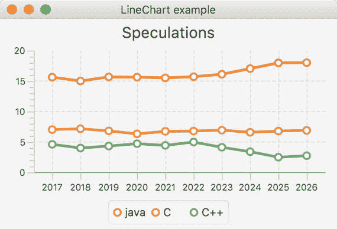

图 6-10。

Using a `LineChart` for displaying trends

对于`ScatterChart`可用的大多数功能对于`LineChart`也是可用的。使用`LineChart`可以改变图例的位置，添加或删除标题，以及使用`NumberAxis`代替`CategoryAxis`。

### 使用条形图

一个`BarChart`能够呈现与一个`ScatterChart`和一个`LineChart`相同的数据，但是看起来不同。在`BarChart`中，重点通常是显示给定类别的不同系列之间的相对差异。在我们的例子中，这意味着我们关注 Java、C 和 C++的值之间的差异。

同样，我们不需要修改返回数据的方法。的确，一个`BarChart`需要一个`CategoryAxis`作为它的`xAxis`，我们已经修改了`getChartData()`方法来返回一个包含`XYChart.Series<String, double>`的`ObservableList`。从清单 [6-6](#Par121) 开始，我们仅将出现的`ScatterChart`更改为`BarChart`，并获得清单 [6-8](#Par130) 。

```java
public void start(Stage primaryStage) {
    CategoryAxis xAxis = new CategoryAxis();
    NumberAxis yAxis = new NumberAxis();
    BarChart barChart = new BarChart(xAxis, yAxis);
    barChart.setData(getChartData());
    barChart.setTitle("speculations");
    primaryStage.setTitle("BarChart example");

    StackPane root = new StackPane();
    root.getChildren().add(barChart);
    primaryStage.setScene(new Scene(root, 400, 250));
    primaryStage.show();
}

Listing 6-8.Using a BarChart Instead of a ScatterChart

```

一旦我们用`javafx.scene.chart.BarChart`的导入替换了`javafx.scene.chart.ScatterChart`的导入，我们就可以构建并运行应用程序了。结果是一个类似于图 [6-11](#Fig11) 所示的`BarChart`。

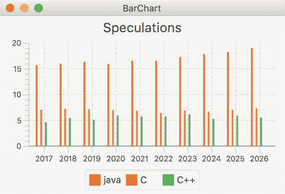

图 6-11。

Using `BarChart` for highlighting differences between the values

虽然结果确实显示了各年数值之间的差异，但并不十分清楚，因为条形相当小。总场景宽度为 400 像素，没有太多空间来渲染大条形。但是，条形图 API 包含定义条形之间的内部间距和类别之间的间距的方法。在我们的例子中，我们希望条之间的间隙更小，例如一个像素。这是通过调用

```java
barChart.setBarGap(1);

```

将这一行代码添加到 start 方法并重新运行应用程序会产生如图 [6-12](#Fig12) 所示的输出。

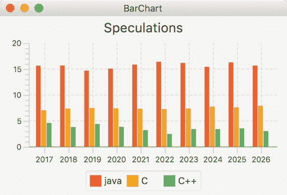

图 6-12。

Setting the gap between bars to one pixel

显然，这一行代码导致了可读性的巨大差异。

### 使用堆叠条形图

JavaFX 2.1 中增加了`StackedBarChart`。与`BarChart`一样，`StackedBarChart`在条形中显示数据，但是`StackedBarChart`不是将同一类别的条形一个接一个地显示，而是将同一类别的条形一个接一个地显示。这通常使得检查总数更容易。

通常，类别与数据系列中的常用键值相对应。因此，在我们的示例中，不同的年份(2017 年、2018 年、……2026 年)可以被视为类别。我们可以将这些类别添加到`xAxis`，如下所示:

```java
IntStream.range(2017,2026).forEach(t -> xAxis.getCategories().add(String.valueOf(t)));

```

除此之外，惟一的代码变化是在代码和导入语句中用`StackedBarChart`替换了`BarChart`。这导致了清单 [6-9](#Par140) 中的代码片段。

```java
public void start(Stage primaryStage) {
    CategoryAxis xAxis = new CategoryAxis();
    IntStream.range(2017,2026).forEach(t -> xAxis.getCategories().add(String.valueOf(t)));
    NumberAxis yAxis = new NumberAxis();
    StackedBarChart stackedBarChart = new StackedBarChart(xAxis, yAxis, getChartData());
    stackedBarChart.setTitle("speculations");
    primaryStage.setTitle("StackedBarChart example");

    StackPane root = new StackPane();
    root.getChildren().add(stackedBarChart);
    Scene scene = new Scene(root, 400, 250);
    primaryStage.setScene(scene);
    primaryStage.show();
}

Listing 6-9.Using a StackedBarChart Instead of a ScatterChart

```

现在运行应用程序会产生如图 [6-13](#Fig13) 所示的输出。

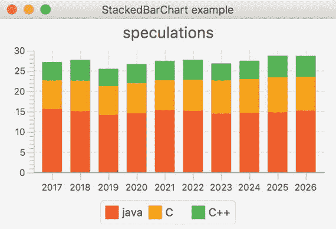

图 6-13。

Rendering stacked bar chart plots using `StackedBarChart`

### 使用面积图

在某些情况下，填充点连线下方的区域是有意义的。虽然与在`LineChart`的情况下呈现相同的数据，但结果看起来不同。清单 [6-10](#Par143) 包含了修改后的`start()`方法，它使用了一个`AreaChart`来代替原来的`ScatterChart`。和之前的修改一样，我们没有改变`getChartData()`方法。

```java
public void start(Stage primaryStage) {
    CategoryAxis xAxis = new CategoryAxis();
    NumberAxis yAxis = new NumberAxis();
    AreaChart areaChart = new AreaChart(xAxis, yAxis);
    areaChart.setData(getChartData());
    areaChart.setTitle("speculations");
    primaryStage.setTitle("AreaChart example");
    StackPane root = new StackPane();
    root.getChildren().add(areaChart);
    primaryStage.setScene(new Scene(root, 400, 250));
    primaryStage.show();
}
Listing 6-10.Using an AreaChart Instead of a ScatterChart

```

运行该应用程序会产生如图 [6-14](#Fig14) 所示的输出。


图 6-14。

Rendering area plots using `AreaChart`

### 使用堆叠面积图

`StackedAreaChart`对于`AreaChart`就像`StackedBarChart`对于`BarChart`一样。`StackedAreaChart`不是显示单个区域，而是总是显示特定类别中值的总和。

将`AreaChart`更改为`StackedAreaChart`只需要更改一行代码和适当的导入语句。

```java
AreaChart areaChart = new AreaChart(xAxis, yAxis);

```

必须替换为

```java
StackedAreaChart areaChart = new StackedAreaChart(xAxis, yAxis);

```

应用此更改并运行应用程序会产生类似图 [6-15](#Fig15) 中的图表。


图 6-15。

Rendering area plots using `AreaChart`

### 使用气泡图

`XYChart`的最后一个实现很特殊。`BubbleChart`不包含已经不在`XYChart`类上的属性，但是它是当前 JavaFX Chart API 中唯一使用`XYChart.Data`类上的附加参数的直接实现。

我们首先修改清单 [6-6](#Par121) 中的代码，使用`BubbleChart`代替`ScatterChart`。因为默认情况下，当`xAxis`上的跨度与`yAxis`上的跨度相差很大时，气泡会被拉伸，所以我们不用年，而是用一年的十分之一作为`xAxis`上的值。这样，我们在`xAxis` (10 年)上的跨度为 100 个单位，而在`yAxis`上的跨度约为 30 个单位。这或多或少也是我们图表的宽度和高度之比。因此，气泡相对来说是圆形的。

清单 [6-11](#Par154) 包含了呈现一个`BubbleChart`的代码。

```java
package com.projavafx.charts;

import javafx.application.Application;
import javafx.collections.FXCollections;
import javafx.collections.ObservableList;
import javafx.scene.Scene;
import javafx.scene.chart.*;
import javafx.scene.chart.XYChart.Series;
import javafx.scene.layout.StackPane;
import javafx.stage.Stage;
import javafx.util.StringConverter;

public class ChartApp14 extends Application {

    public static void main(String[] args) {
        launch(args);
    }

    @Override
    public void start(Stage primaryStage) {
        NumberAxis xAxis = new NumberAxis();
        NumberAxis yAxis = new NumberAxis();
        yAxis.setAutoRanging(false);
        yAxis.setLowerBound(0);
        yAxis.setUpperBound(30);
        xAxis.setAutoRanging(false);
        xAxis.setAutoRanging(false);
        xAxis.setLowerBound(20170);
        xAxis.setUpperBound(20261);
        xAxis.setTickUnit(10);
        xAxis.setTickLabelFormatter(new StringConverter<Number>() {

            @Override
            public String toString(Number n) {
                return String.valueOf(n.intValue() / 10);
            }

            @Override
            public Number fromString(String s) {
                return Integer.valueOf(s) * 10;
            }
        });
        BubbleChart bubbleChart = new BubbleChart(xAxis, yAxis);
        bubbleChart.setData(getChartData());
        bubbleChart.setTitle("Speculations");
        primaryStage.setTitle("BubbleChart example");

        StackPane root = new StackPane();
        root.getChildren().add(bubbleChart);
        primaryStage.setScene(new Scene(root, 400, 250));

        primaryStage.show();
    }

    private ObservableList<XYChart.Series<Integer, Double>> getChartData() {
        double javaValue = 15.57;
        double cValue = 6.97;
        double cppValue = 4.55;
        ObservableList<XYChart.Series<Integer, Double>> answer = FXCollections.observableArrayList();
        Series<Integer, Double> java = new Series<>();
        Series<Integer, Double> c = new Series<>();
        Series<Integer, Double> cpp = new Series<>();
        java.setName("java");
        c.setName("C");
        cpp.setName("C++");
        for (int i = 20170; i < 20260; i = i + 10) {
            double diff = Math.random();
            java.getData().add(new XYChart.Data(i, javaValue));
            javaValue = Math.max(javaValue + 2 * diff - 1, 0);
            diff = Math.random();
            c.getData().add(new XYChart.Data(i, cValue));
            cValue = Math.max(cValue + 2 * diff - 1, 0);
            diff = Math.random();
            cpp.getData().add(new XYChart.Data(i, cppValue));
            cppValue = Math.max(cppValue + 2 * diff - 1, 0);
        }
        answer.addAll(java, c, cpp);
        return answer;
    }

}

Listing 6-11.Using the BubbleChart

```

`xAxis`的范围从 201670 年到 20261 年，但是我们当然希望在轴上显示年份。这可以通过调用

```java
xAxis.setTickLabelFormatter(new StringConverter<Number>() {
 ...
}

```

我们提供的`StringConverter`将我们使用的数字(如 20210)转换成`Strings`(如 2021)，反之亦然。这样做，我们能够使用任何我们想要的量来计算气泡，并且仍然有一个格式化标签的好方法。运行该示例会产生如图 [6-16](#Fig16) 所示的图表。

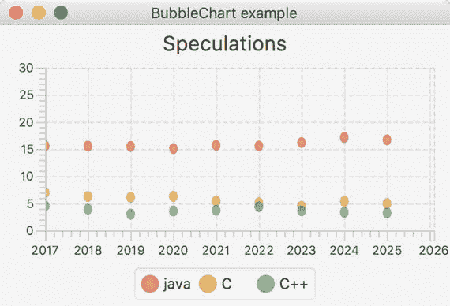

图 6-16。

Using a `BubbleChart` with fixed radius

直到现在，我们都没有利用`XYChart.Data`的三参数构造函数。除了我们已经熟悉的双参数构造函数之外，

```java
XYChart.Data (X xValue, Y yValue)

```

`XYChart.Data`也有一个三参数的构造函数:

```java
XYChart.Data (X xValue, Y yValue, Object extraValue)

```

`extraValue`参数可以是任何类型。这允许开发人员实现他们自己的`XYChart`子类，利用可以包含在单个数据元素中的附加信息。`BubbleChart`实现使用这个`extraValue`来决定应该渲染多大的气泡。

我们现在修改`getChartData()`方法来使用三参数构造函数。`xValue`和`yValue`参数仍然与前面的清单中的相同，但是我们现在添加了第三个参数，表示即将到来的趋势。这个参数越大，下一年的涨幅就越大。参数越小，下一年跌幅越大。修改后的`getChartData()`方法如清单 [6-12](#Par164) 所示。

```java
private ObservableList<XYChart.Series<Integer, Double>> getChartData() {
    double javaValue = 15.57;
    double cValue = 6.97;
    double cppValue = 4.55;
    ObservableList<XYChart.Series<Integer, Double>> answer = FXCollections.observableArrayList();
    Series<Integer, Double> java = new Series<>();
    Series<Integer, Double> c = new Series<>();
    Series<Integer, Double> cpp = new Series<>();
    java.setName("java");
    c.setName("C");
    cpp.setName("C++");
    for (int i = 20170; i < 20270; i =  i+10) {
        double diff = Math.random();
        java.getData().add(new XYChart.Data(i, javaValue, 2*diff));
        javaValue = Math.max(javaValue + 2*diff - 1,0);
        diff = Math.random();
        c.getData().add(new XYChart.Data(i, cValue,2* diff));
        cValue = Math.max(cValue + 2*diff - 1,0);
        diff = Math.random();
        cpp.getData().add(new XYChart.Data(i, cppValue, 2*diff));
        cppValue = Math.max(cppValue + 2*diff - 1,0);
    }
    answer.addAll(java, c, cpp);
    return answer;
}
Listing 6-12.Using a Three-Argument Constructor

for XYChart.Data Instances

```

将该方法与清单 [6-11](#Par154) 中的`start()`方法相结合，会产生如图 [6-17](#Fig17) 所示的输出。

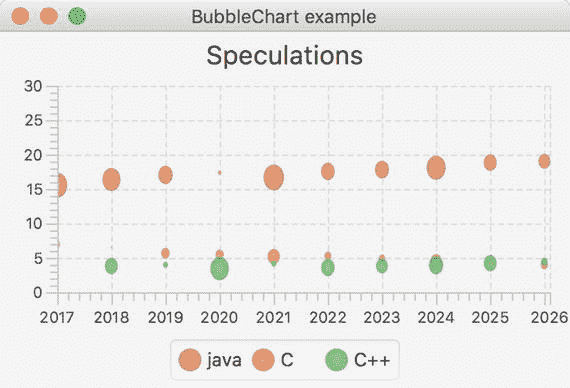

图 6-17。

Adding variations in the size of the Bubbles

## 摘要

JavaFX Chart API 为不同的图表类型提供了许多现成的实现。每一个实现都有不同的目的，开发人员可以选择最合适的`Chart`。

通过应用 CSS 规则或使用特定于`Chart`的方法或属性，可以修改`Chart`并为特定的应用程序进行调优。

如果您需要一个更加定制化的`Chart`，您可以扩展抽象的`Chart`类并利用该类上的现有属性，或者如果您的图表需要两个轴，您可以扩展抽象的`XYChart`类。

## 资源

有关 JavaFX Chart API 的更多信息，请参考以下资源:

*   [T2`http://docs.oracle.com/javase/8/javafx/user-interface-tutorial/charts.htm`](http://docs.oracle.com/javase/8/javafx/user-interface-tutorial/charts.htm)
*   [T2`http://docs.oracle.com/javase/8/javafx/user-interface-tutorial/css-styles.htm`](http://docs.oracle.com/javase/8/javafx/user-interface-tutorial/css-styles.htm)